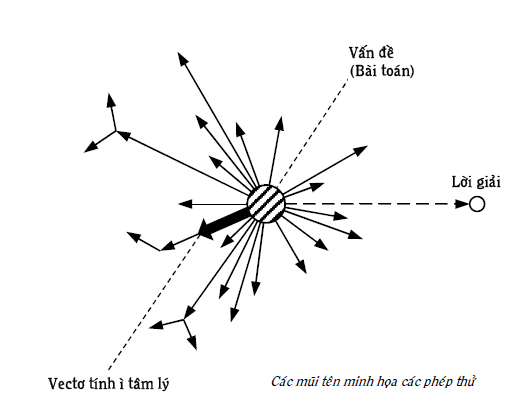

# SÁNG TẠO MỘT CÁCH TỰ NHIÊN

## Tư duy sáng tạo: nghịch lý, nghịch lý và nghịch lý {#sec:2:1:}
Theo triết học, có ba lĩnh vực loài người cần nhận thức và biến đổi để thỏa mãn các nhu cầu của mình là tự nhiên, xã hội và tư duy. Sự phân loại này cho thấy, tư duy là lĩnh vực đứng ngang hàng với các lĩnh vực tự nhiên và xã hội chứ không phải thuộc tự nhiên hay xã hội, mặc dù nó có liên hệ mật thiết với tự nhiên và xã hội. Tư duy (hay còn gọi suy nghĩ) theo quan điểm hiện nay, chỉ duy nhất con người mới có, là hoạt động cao cấp của bộ não – dạng vật chất tổ chức đặc biệt, đạt được nhờ sự tiến hóa của tự nhiên. Đối với câu hỏi: "_Cái gì của con người làm cho con người chiếm ưu thế hơn hẳn các loài vật khác?_", chắc chắn mọi người trả lời rằng: "Cái đó là tư duy". Nếu hỏi tiếp: "_Thế tư duy để làm gì?_" Câu trả lời: "_Tư duy để sáng tạo, để đưa ra những giải pháp giải quyết vấn đề, những quyết định cần thực hiện_".

Trong thực tế có những điều thấy không hợp lý mà vẫn tồn tại, có khi dai dẳng. Người ta thường gọi chúng là những nghịch lý. Trong lĩnh vực tư duy cũng tồn tại không ít các nghịch lý. Dưới đây, người viết sẽ trình bày một số nghịch lý đó. Chúng không đứng độc lập mà đan quyện lẫn nhau hoặc cái này kéo theo cái kia.

* * *

Rất quan trọng >< Không được chú ý xứng đáng

* * *

Trong xã hội, cũng như trong tự nhiên, thường cái gì rất quan trọng thì cái đó được đặc biệt đầu tư để gìn giữ và phát triển. Ví dụ, trong xã hội, các cơ quan, tổ chức, ngành nghề, con người quan trọng đều được ưu tiên xứng đáng. Hay như trong tự nhiên, bộ não, do tầm quan trọng của nó mà chọn lọc tự nhiên đã "đầu tư" hẳn một hộp sọ rất cứng để bảo vệ và cung cấp một lượng máu dồi dào hơn hẳn các bộ phận khác của cơ thể.

Bạn đọc thử tưởng tượng, nếu con người không có tư duy thì sao? Con người chắc chắn chỉ là một trong các loài động vật hoang dã. Nhờ tư duy sáng tạo, loài người từ chỗ có các khả năng sinh học rất hạn chế (con người không khỏe như voi, nhanh như báo, bay như chim, có vũ khí đặc biệt như nọc độc của rắn…) đến chỗ chiếm ưu thế tuyệt đối trong tự nhiên, thực hiện những kỳ tích chưa từng có trên Trái Đất để có được nền văn minh rực rỡ như ngày nay. Như vậy, tư duy rất quan trọng, nếu như không nói là quyết định trong quá trình tiến hóa và phát triển của con người và xã hội loài người. Tuy nhiên ở đây có nghịch lý: Tư duy rất quan trọng nhưng lĩnh vực tư duy không được loài người đối xử và đầu tư để phát triển một cách xứng đáng. Vậy nhân loại tập trung đầu tư vào đâu?

* * *

Trong >< Ngoài

* * *

Nếu so sánh ba lĩnh vực tự nhiên, xã hội và tư duy về số lượng những người làm việc, nghiên cứu, số công trình công bố, số tiền đầu tư… chúng ta có thể thấy những gì nhân loại dành cho lĩnh vực tư duy là không đáng kể. Dale Carnegie nhớ lại, ông cần có quyển sách về cách chiến thắng sự lo âu, phiền muộn (phần lớn là do suy nghĩ không hiệu quả – người viết). Ông vào thư viện công cộng lớn của New York nằm trên Đại lộ 5 và phố 42. Ông hết sức ngạc nhiên khi thấy vỏn vẹn có 22 quyển sách dưới tiêu đề "_Lo âu, phiền muộn_" (Worry). Trong khi đó, dưới tiêu đề "_Giun_" (Worms) ông tìm được tới 189 quyển, tức nhiều gần gấp chín lần. Bạn đọc còn có thể hình dung tiếp, trong tự nhiên, ngoài loài giun còn biết bao loài khác, không chỉ động vật còn thực vật, không chỉ thế giới hữu cơ, còn thế giới vô cơ… Tương tự, trong xã hội cũng có biết bao đối tượng mà loài người đều nghiên cứu và viết sách về chúng thì sự chênh lệch còn tăng gấp nhiều lần nữa.

Trong các giải thưởng lớn trên thế giới, kể cả giải Nobel, bạn đọc có thể kể tên giải thưởng nào được dành riêng cho lĩnh vực tư duy không? Điều này còn có nghĩa, nhân loại quan tâm kết quả tư duy (các phát minh, sáng chế…) hơn là quá trình suy nghĩ dẫn đến những kết quả đó. Rõ ràng, nhân loại quá thờ ơ với những gì thuộc lĩnh vực tư duy mà chú ý nhiều hơn đến hai lĩnh vực kia: Tự nhiên và xã hội. Nếu coi tư duy thuộc thế giới bên trong con người, tự nhiên và xã hội là thế giới bên ngoài thì nhân loại chú ý "_trong_" ít hơn "_ngoài_". Do vậy, trên thực tế, nhân loại biết rất nhiều về thế giới xung quanh nhưng lại biết rất ít về chính bản thân mình, đặc biệt, những gì xảy ra trong bộ não. Đến nỗi, có nhà nghiên cứu phải thốt lên rằng: "_Vùng không gian mà loài người biết ít nhất là khoảng cách giữa hai lỗ tai_". Nguyễn Du viết: "_Bên trong có ấm thì ngoài mới êm_". Có lẽ, không ít các vấn đề nảy sinh ở mức độ cá nhân, tập thể, quốc gia và toàn cầu có nguyên nhân sâu xa do nghịch lý "_trong_" và "_ngoài_" này mà lẽ ra phải có sự tương hợp giữa chúng. Maxwell cũng cảnh báo: "_Đề tài nghiên cứu chân chính dành cho nhân loại chính là con người_". T. Edison nhấn mạnh: "_Nhiệm vụ quan trọng nhất của nền văn minh là dạy con người biết suy nghĩ_". Còn C. Darwin cho rằng: "_Giai đoạn phát triển cao nhất trong văn hóa đạo đức là khi chúng ta nhận ra rằng chúng ta cần phải điều khiển các suy nghĩ của chính mình_".

* * *

Thô sơ, năng suất, hiệu quả thấp, điều khiển kém >< Hiện đại, năng suất, hiệu quả cao, điều khiển tốt

* * *

Con người là động vật lao động bằng các công cụ (hiểu theo nghĩa rộng nhất) do chính con người chế tạo ra. Chúng thường xuyên được hoàn thiện, cải tiến, đổi mới tạo nên khuynh hướng phát triển: công cụ ra đời sau có năng suất, hiệu quả, độ tin cậy, tính điều khiển… cao hơn cái trước. Nói cách khác, các công cụ lao động của con người càng ngày, càng trở nên hiện đại. Ví dụ, nếu như trước đây người ta xúc đất bằng xẻng thì nay bằng máy xúc với năng suất cao hơn nhiều lần. Để báo tin cho một người nào đó, đã có thời người ta phải lóc cóc đạp xe đến tận nơi thì nay dùng điện thoại nhanh hơn nhiều. Thay vì phải dùng những con dao kim loại cồng kềnh, nay các bác sỹ có tia laser cho phép thực hiện các cuộc giải phẫu đòi hỏi độ chính xác cực kỳ cao. Ngày xưa, đã là giỏi lắm khi người ta tính được một phép tính trong một giây thì nay đã có những máy tính cho phép thực hiện nhiều tỷ phép tính một giây…

Nhân loại với các công cụ do mình tạo ra không chỉ điều khiển dòng chảy của những dòng sông, các quá trình biến đổi ở mức nguyên tử, hạt nhân, các chuyến bay vũ trụ mà còn điều khiển cả việc tạo ra các giống loài mới. Những công cụ này đều có thể dạy, học cách chế tạo và sử dụng chúng để truyền cho những người khác.

Trong khi những điều kể trên là bình thường đối với hai lĩnh vực tự nhiên và xã hội thì trong lĩnh vực tư duy, công cụ để có được những ý tưởng sáng tạo vẫn còn ở trong giai đoạn "_trời cho thế nào thì dùng thế ấy và cũng không biết hình hài của công cụ đó ra sao_" vì tư duy là đối tượng không nhìn thấy. Nhiều người còn cho rằng tư duy sáng tạo là đối tượng không điều khiển được.

G.S. Altshuller nhận xét về nghịch lý này như sau: _"Ý tưởng về điều khiển một cái gì đó hiện nay chưa điều khiển được vẫn được tiếp nhận một cách bình thường. Chúng ta sẽ tìm ra phương tiện điều khiển nó, chúng ta sẽ điều khiển nó. Nhưng ý tưởng về việc điều khiển quá trình sáng tạo, như là quy tắc, luôn gặp sự chống đối quyết liệt_".

Nói cách khác, công cụ hiện nay dùng trong lĩnh vực tư duy sáng tạo còn rất thủ công mò mẫm, thô sơ theo kiểu: Cứ nghĩ đi, làm đi, thua keo này, bày keo khác cho đến bao giờ thành công thì thôi với năng suất, hiệu quả, độ tin cậy, tính điều khiển thấp và khó truyền đạt "_bí quyết_" của mình cho những người khác để họ có thể nghĩ theo cách đó cũng có những sáng tạo tốt. Nhưng cũng chính tư duy – công cụ không nhìn thấy và rất thô sơ ấy lại quyết định những cái nhìn thấy và cho ra đời những công cụ và thành tựu hiện đại nhất.

* * *

Thông minh >< Ít có kết quả sáng tạo

* * *

Có giai thoại sau liên quan đến tư duy sáng tạo. Montaigne, nhà triết học Pháp nói với những người xung quanh: "_Thượng đế ban phát cho loài người rất nhiều thứ không công bằng. Riêng về trí thông minh thì ai cũng như ai_". Mọi người đề nghị ông giải thích. Ông trả lời: "_Các bạn để ý mà xem, có người khỏe, có người yếu; có người mập, có người gầy; có người cao, có người thấp; có người đẹp, có người không đẹp;… Nhưng có ai tự nhận mình là ngu đâu và nếu như ai bị người khác mắng là ngu, người đó sẽ tức điên lên ấy chứ. Điều này chứng tỏ ai cũng thông minh như ai_".

Câu nói tưởng là đùa của Montaigne phản ánh một sự thật được hầu hết các nhà nghiên cứu công nhận. Đó là, tiềm năng sáng tạo của bộ óc mỗi người bình thường (không bị các khuyết tật về não) cực kỳ lớn, đến nỗi, có nhà khoa học nói: "_Trong mỗi người có một thiên tài ngủ quên_". Có cách nào đánh thức thiên tài trong mỗi người tỉnh dậy và hoạt động để kết quả sáng tạo của mỗi người tương xứng với tiềm năng thông minh vốn có? Làm sao biến tiềm năng thành hiện thực?

* * *

Rẻ >< Đắt

* * *

Một loại máy tính hoạt động rất phí phạm vì chưa dùng hết khả năng của chúng, mặc dù có một loạt ưu điểm vượt trội so với máy tính hiện đại nhất hiện nay:

* Không cần lập công ty thiết kế, chế tạo và sản xuất mà vẫn có máy tính để dùng.

* Phổ biến đến mức, ai cũng có và có rất sớm ngay từ khi bắt đầu cuộc đời.

* Rất nhẹ, khoảng hơn kilôgram và luôn luôn đi theo chủ thành ra không sợ để quên đâu đó.

* Có khả năng tàng hình nên người chủ tha hồ sử dụng máy tính đó một cách thoải mái mà không ai biết, kể cả ở những nơi cấm sử dụng máy tính thông thường.

* Luôn được giấu kín ở nơi mà không ai có thể đột nhập để lấy trộm được.

* Phần cứng lý tưởng đến mức người chủ không phải bận tâm về việc “lên đời”.

* Bảo mật cực tốt, các tin tặc chỉ có nước ngồi khóc.

* Tự động nạp năng lượng làm việc, không phụ thuộc vào máy phát điện, điện lưới, pin, ắc-quy…

* Thời gian hoạt động trung bình 60 – 70 năm mà không phải bảo trì, sửa chữa, thay thế.

* Sử dụng để giải quyết các loại vấn đề mọi nơi, mọi lúc, thường xuyên hơn bất kỳ loại máy tính nào khác.

* Có khả năng phát các ý tưởng sáng tạo mà lĩnh vực trí tuệ nhân tạo không biết bao giờ mới có thể bén gót.

* Chính nó giúp chế tạo ra các loại máy tính khác nói riêng và tất cả các công cụ lao động của con người nói chung.

* Giá máy rẻ không ngờ vì ai cũng được cha, mẹ tặng, không mất tiền mua.

Bạn đọc đã đoán ra "_máy tính vượt trội_" vừa nói chính là bộ óc của mỗi người bình thường. Thật là lạ khi thấy người ta theo đuổi những máy tính điện tử cùng các phần mềm đắt tiền mà chưa chú ý khai thác các ưu việt của loại máy tính cực rẻ này bằng cách viết các "_phần mềm_" thích hợp cho nó.

* * *

Học ít, dùng nhiều >< Học nhiều, dùng ít

* * *

Suốt cuộc đời, mỗi người chúng ta dùng suy nghĩ rất nhiều, nếu như không nói là hàng ngày. Từ việc trả lời những câu hỏi bình thường như "_Hôm nay ăn gì? Mặc gì? Làm gì? Mua gì? Xem gì? Đi đâu?_…" đến làm các bài tập thầy, cô cho khi đi học; chọn ngành nghề đào tạo; lo công ăn, việc làm, sức khỏe, thu nhập, hôn nhân, nhà ở; giải quyết các vấn đề nảy sinh trong công việc, trong quan hệ xã hội, gia đình, nuôi dạy con cái…, tất tần tật đều đòi hỏi phải suy nghĩ và chắc rằng ai cũng muốn làm sao mình suy nghĩ tốt để ra những quyết định đúng. Mặc dù đâu đó chúng ta nghe thấy những lời mang tính khẳng định kiểu, học toán học là học suy nghĩ lôgích, chính xác; các môn triết học, khoa học tự nhiên và xã hội giúp hình thành thế giới quan, nhân sinh quan là điều rất cần thiết để có tư duy đúng; chơi cờ là hình thức rất tốt để luyện tập suy nghĩ; văn học, nghệ thuật và giáo dục thẩm mỹ đem lại nhiều tình cảm đẹp, tạo cảm hứng tốt cho các hoạt động trí óc… Nhưng rõ ràng, chúng ta không được học môn trực tiếp về tư duy để sáng tạo, để giải quyết các vấn đề nảy sinh trong cuộc đời của mỗi chúng ta. Ngay cả khoa học có phần chuyên ngành nghiên cứu tư duy là tâm lý học cũng rất ít người được học.

Trong khi đó, suốt cuộc đời, chúng ta phải học rất nhiều môn trong nhà trường, nhiều điều ngoài nhà trường, chủ yếu về hai lĩnh vực tự nhiên và xã hội. Nhưng xem ra những gì chúng ta được học nhiều lại dùng rất ít trong cuộc sống và công việc. Nếu bạn đọc hiện nay đang đi làm, bạn càng có điều kiện để chiêm nghiệm điều đó. Chẳng hạn, từ khi bạn đi làm đến nay, ngoài một số kiến thức nghiệp vụ thuộc nghề của bạn, bạn đã bao nhiêu lần dùng những kiến thức khi học trong trường phổ thông thôi (chưa nói những kiến thức khác sâu hơn) như hằng đẳng thức đáng nhớ, giải phương trình bậc nhất, bậc hai, lấy đạo hàm, ba định luật của Newton, cân bằng phương trình của các phản ứng hóa học…

Nghịch lý _học ít, dùng nhiều_ và ngược lại _học nhiều, dùng ít_, đặc biệt trong thời đại bùng nổ thông tin, tri thức, đang là vấn đề được nhiều nhà giáo dục trên thế giới báo động và dành nhiều nỗ lực để giải quyết.

Tổng kết mục này, có thể nói rằng, cho đến thời gian gần đây, nhân loại đối xử với tư duy không khác gì đối xử với tự nhiên ở thời kỳ nguyên thủy săn bắn và hái lượm: sử dụng những kết quả tư duy sáng tạo có sẵn của các cá nhân trong xã hội, tương tự như sử dụng thú rừng và cây trái có sẵn trong tự nhiên mà chưa chuyển sang giai đoạn đầu tư "_nghiên cứu_", "_nuôi trồng_", "_cải tiến_" nhằm chế tạo các công cụ lao động trí óc hiện đại với năng suất, hiệu quả, tính điều khiển cao, để mỗi người bình thường có thể khai thác và biến tiềm năng sáng tạo to lớn của mình thành hiện thực một cách tin cậy.

## Phương pháp thử và sai (Trial and Error Method) {#sec:2:2:}
Bình thường mà nói, người ta không phải lúc nào cũng muốn suy nghĩ, vì thật tình, suy nghĩ mệt óc và tốn nhiều năng lượng lắm. Quá trình suy nghĩ thường chỉ bắt đầu khi người ta có một vấn đề gì đó cần giải quyết hoặc cần ra một quyết định.

Thực tế cho thấy, đa số mọi người suy nghĩ giải quyết vấn đề và ra quyết định một cách tự nhiên: người suy nghĩ hiếm khi suy nghĩ về cách suy nghĩ của chính mình, cũng giống như người ta hít thở, đi lại… một cách tự nhiên mà ít khi suy nghĩ về chúng và tìm cách cải tiến chúng. Vậy cách suy nghĩ tự nhiên này diễn ra như thế nào?

Nghiên cứu và làm các thí nghiệm về quá trình suy nghĩ sáng tạo, các nhà tâm lý mô tả: thông thường, khi có vấn đề, người giải hiểu nó không thật kỹ. Dựa trên các kinh nghiệm, sự liên tưởng, liên quan đến những dữ kiện của vấn đề cần giải quyết có phần tương tự với những bài toán đã giải trước đó, người giải nghĩ ngay đến việc áp dụng các lời giải, ý tưởng và cách tiếp cận sẵn có trong trí nhớ. Người giải tiến hành các phép thử đầu tiên. Sau khi phát hiện những phép thử đó sai, người giải quay trở lại với đầu bài toán, cố gắng hiểu bài toán đúng hơn rồi tiếp tục đưa ra các ý tưởng khác và quyết định thực hiện ngay chúng để xem có phải là lời giải không. Kiến thức đã học và kinh nghiệm riêng của người giải luôn có khuynh hướng đưa người giải đi theo con đường mòn, đã hình thành trong não trước đó. Nếu các phép thử lại tiếp tục sai, người giải mất tự tin dần, mặc dù người giải cố gắng rút kinh nghiệm sau mỗi lần sai. Các phép thử mới trở nên lộn xộn hơn, nhiều khi, chúng được đưa ra không ăn nhập gì với bài toán cho trước. Nếu các phép thử này vẫn tiếp tục sai thì người giải có thể trở nên hoang mang và làm các phép thử theo kiểu mò mẫm, hú họa dựa trên việc đặt các câu hỏi đại loại như: "_Nếu ta làm thế này thì sao?", "Nếu ta làm thế kia thì sao?_"… và rất mong có linh tính hoặc giác quan thứ sáu hoặc sự may mắn nào khác mách bảo ý tưởng giải bài toán. Khi số các phép thử trở nên quá nhiều mà bài toán vẫn không giải ra, người giải có thể cho rằng bài toán không đủ điều kiện để giải hoặc kiến thức của mình còn thiếu, cần tìm sự trợ giúp từ bên ngoài. Người giải có khi không còn tập trung chú ý giải nữa mà nhường cho người khác. Thường thường, để giải bài toán phải tốn khá nhiều phép thử – sai (bài toán càng khó, số phép thử – sai càng lớn) để cuối cùng có phép thử là lời giải đúng. Mặc dù giải được bài toán, nhiều khi người giải không lý giải được một cách lôgích vì sao mình có được ý tưởng đúng và thường trả lời một cách chung chung kiểu: nghĩ mãi thì nó bật ra hoặc do may mắn, ngẫu hứng, linh tính…

Cách suy nghĩ và hành động thực hiện giải bài toán theo mô tả ở trên gọi là phương pháp thử và sai (Trial and Error Method) và được minh họa bằng Hình 3: Bài toán và lời giải được ký hiệu bằng hai điểm khác nhau trên mặt phẳng. Các mũi tên diễn tả các phép thử. Trên thực tế, số lượng các phép thử sai có thể lớn hơn nhiều vì phương pháp thử và sai có mặt tại bất kỳ giai đoạn nào của quá trình thực hiện giải bài toán.

Bạn đọc có thể nhận ra phương pháp thử và sai khi nhớ lại thời đi học mình giải các bài toán như thế nào hoặc đọc báo chí thấy các hiện tượng xây rồi đập, nhập rồi tách, tách rồi nhập, quyết định sau sửa quyết định trước trong một thời gian rất ngắn, cấm rồi cho, cho rồi cấm và nhiều thứ cứ phải sửa đi sửa lại mà vẫn không đạt. Thử và sai thành hiện tượng xã hội, nhiều đến nỗi, trên báo Lao Động Xuân 1998 có đăng vế ra đã có từ nhiều năm trước "_Sai đâu sửa đó, sai đó sửa đâu, sửa đâu sai đó" và vế đối của nhà giáo lão thành Nguyễn Tài Đại, Nghệ An: "Lấy thu bù chi, lấy chi bù thu, bù thu lấy chi_".

Ngay đối với các nhà nghiên cứu, rất nhiều các phát minh, sáng chế của họ ra đời cũng bằng phương pháp thử và sai. Cho đến nay, Edison vẫn là người có nhiều sáng chế nhất: 1.093 patent và được mệnh danh là người có thể sáng chế ra mọi thứ. Nhà sáng chế Nikola Tesla có một thời gian cùng làm việc với Edison, kể lại: "_Nếu như Edison cần phải tìm cái kim rơi xuống đống rơm, ông sẽ không mất thời gian để xác định xem khả năng lớn nhất cái kim có thể nằm ở đâu. Không chậm trễ, với sự siêng năng, vội vã của con ong, ông lần lượt xem xét từng cọng rơm một cho tới khi tìm thấy cái kim thì thôi. Cách làm việc của ông rất kém hiệu quả: Ông có thể bỏ ra rất nhiều thời gian và sức lực mà không thu được gì, nếu không phải là sự tình cờ may mắn giúp ông ta_". Khi Edison có ý định làm đèn phát sáng nhờ sự đốt nóng, ông đã thực hiện hơn 9.000 thí nghiệm và câu nói cửa miệng của ông là: "_Tôi sẽ thử mọi thứ, kể cả miếng phó mát Limburger_". Để sáng chế ra ắc-quy kiềm, Edison đã phải làm tới 50.000 thí nghiệm, chưa kể tới những phương án trong đầu ông kiểu "Nếu ta thử làm thế này thì sao?" Ông cũng công nhận, trung bình một sáng chế lớn của ông phải làm mất bảy năm. Không phải ngẫu nhiên, chính Edison giải thích: "_Trong các công trình của tôi 99% là mồ hôi và chỉ 1% là cảm hứng_". Tuy nhiên, Edison không làm việc một mình mà tập thể lớn đến ngàn người thực hiện việc thử theo sự phân công của ông.

G.S. Altshuller có nêu nhiều minh họa về phương pháp thử và sai, ví dụ, ở Liên Xô, có lần đã thực hiện một thí nghiệm độc đáo. Người ta tập trung khoảng 60 nhà sáng chế thuộc các ngành nghề khác nhau và đề nghị họ cùng giải một bài toán. Kết quả: Không ai giải được. Nhưng điều thú vị là ở chỗ xem họ giải như thế nào? Thì ra họ cũng đi tìm lời giải một cách mò mẫm, thử lần lượt hết phương án này đến phương án khác không định hướng.

Bạn đọc thử tưởng tượng sân bay với lịch bay 150 chuyến một ngày. Hành khách đã yên vị trên các ghế ngồi, bảng điện bật sáng dòng chữ "_Không hút thuốc! Đề nghị quý khách cài dây an toàn_!" Nhưng trong 100 chuyến bay, các cô tiếp viên hàng không duyên dáng, lịch sự thông báo: "_Thành thật xin lỗi quý khách, rất tiếc, chuyến bay phải bãi bỏ do trục trặc kỹ thuật_". 50 máy bay còn lại cất cánh được, nhưng liền sau đó 49 chiếc phải hạ cánh ngay và chỉ có một chiếc bay đến được đúng thành phố mà nó cần đến.

Bạn đọc chắc sẽ phản đối: _"Làm gì có sân bay như vậy!"_ Vâng, đúng là không có sân bay như vậy.

Bạn đọc thử tưởng tượng một công ty xây dựng, được cung cấp đủ nguyên vật liệu và phương tiện để hàng năm xây 150 tòa nhà cao tầng. Cuối mỗi năm, báo cáo cho biết, 100 tòa nhà bị sập ngay trong quá trình thi công, 49 tòa nhà khác chỉ có thể dùng vài tầng dưới và chỉ một tòa nhà được nghiệm thu đạt yêu cầu.

Bạn đọc lại phản đối: "_Làm gì có công ty xây dựng như thế!_" Vâng, đúng là không có công ty xây dựng như thế.

Nhưng trong lĩnh vực sáng tạo nói chung, tư duy sáng tạo nói riêng, độ tin cậy và tính điều khiển thấp do không có các công cụ tư duy sáng tạo tốt lại khá phổ biến. Dưới đây xin trích những dòng từ bài báo của Chủ tịch Hội đồng trung ương "_Hội các nhà sáng chế và hợp lý hóa toàn liên bang_", Liên Xô trước đây: "_Hàng năm, ở nước ta thực hiện khoảng150.000 các nghiên cứu phát triển kỹ thuật mới. Gần hai phần ba số đó phải bỏ trong giai đoạn thí nghiệm hoặc thử nghiệm mẫu mới (do thử thấy sai – người viết), làm lãng phí rất nhiều vốn đầu tư của nhà nước. Trong số các nghiên cứu đến được giai đoạn áp dụng thì 85% chỉ dùng ở một hoặc hai nhà máy và chỉ 2% được dùng ở 5 nhà máy trở lên_".

Có những quyển sách về lịch sử các sáng chế, phát minh, về tiểu sử các nhà bác học. Nhiều thế hệ trẻ đã ngốn ngấu đọc chúng và mơ ước cũng có được những sáng chế, phát minh. Có thể rút ra được gì qua loại sách này khi công nghệ sản xuất các sáng chế, phát minh nói riêng, các sản phẩm sáng tạo nói chung, chủ yếu, là phương pháp thử và sai?

Dưới đây là lời khuyên của một cuốn sách loại đó: "_Muốn thực hiện ước mơ, trước hết đòi hỏi phải có tri thức, kỹ năng lao động, tinh thần dám nghĩ, dám làm, khả năng không nản chí trước các khó khăn và thất bại tất yếu bày ra trước mặt. Nếu bạn trau dồi được tất cả các đức tính đó ở trong trường, trong công tác thì bạn sẽ có những "vận may", sẽ có được niềm vui sướng trước những thành công trong sáng tạo và sự kính trọng sâu sắc_". Lời khuyên này trên thực tế không khác lời khuyên: "_Hãy ở hiền đi rồi sẽ gặp lành" hoặc "Cần cù dùng số lượng bù cho khả năng_" chứ không trang bị cho người đọc các phương pháp, các kỹ năng cụ thể giúp nâng cao năng suất và hiệu quả quá trình sáng tạo và đổi mới.

Có một điều may mắn: Lời giải các bài toán sau khi đã tìm ra bằng phương pháp thử và sai, được công bố, lưu trữ, phổ biến, đưa vào chương trình dạy trong các nhà trường để những người khác và các thế hệ sau sử dụng ngay, không phải đi giải lại chúng bằng phương pháp thử và sai. Đây là thuận lợi của người đi sau, nếu biết kế thừa (xem giai đoạn C: Tìm thông tin giải bài toán, mục _\@ref(sec:1:2:) Một số khái niệm cơ bản và các ý nghĩa của chúng_). Rất tiếc, có những bài toán là những bài toán mà các nước đi trước đã gặp, đã giải, thay vì kế thừa, nhiều người có trách nhiệm ở nước ta đi giải lại một cách mò mẫm thử và sai. Ví dụ các bài toán về quy hoạch, kẹt xe, ô nhiễm môi trường, xử lý chất thải, các sinh vật lạ nhập từ nước ngoài…

## Các ưu và nhược điểm của phương pháp thử và sai {#sec:2:3:}
Các bài toán thực tế thường có nhiều lời giải. Ví dụ, nhà, xe, đèn, bút, dao, đồ ăn, thức uống… rất đa dạng chứ không phải chỉ có một loại. Do vậy, một bài toán thường có nhiều phép thử, đồng thời có nhiều lời giải. Loại bài toán có một và chỉ một lời giải mà thôi là rất hiếm. Tương tự như vậy, tình huống chỉ có một lối thoát cũng rất hiếm. Riêng ý này đã giúp chúng ta lạc quan khi phải đối mặt với các khó khăn trong cuộc sống.

Ta lập tỷ số giữa "_tổng số các phép thử có thể có của bài toán cho trước_" và "_tổng số các lời giải có thể có của nó_" và gọi là α. Tỷ số α cho biết, trung bình α phép thử thì có một lời giải. Ví dụ α = 3 có nghĩa, trung bình cứ ba phép thử thì có một lời giải; α = 1000 thì trung bình một ngàn phép thử mới có một lời giải. Nói chung, α càng lớn thì bài toán càng khó giải và trả giá cho phương pháp thử và sai càng lớn.

Dưới đây sẽ liệt kê một số ưu và nhược điểm của phương pháp thử và sai:

### Các ưu điểm của phương pháp thử và sai {#subsec:2:3:1:}
1\. Phương pháp thử và sai trở thành phương pháp duy nhất và hầu như không cần phải học ở những tình huống vấn đề xuất phát chưa có tiền lệ. Hoặc khi các kinh nghiệm của người giải đã dùng hết mà vẫn sai và không thu thêm được thông tin có ích nào để định hướng. Lúc đó, người giải cứ việc thử khác đi một cách mò mẫm cho đến khi tìm ra lời giải.

2\. Phương pháp thử và sai hoàn toàn thích hợp đối với loại bài toán, ở đó α < 10 và trả giá cho mỗi phép thử sai không đáng kể hoặc chấp nhận được. Lúc này, người giải khỏi dụng công tư duy sáng tạo gì ghê gớm, cứ việc thử lần lượt sẽ đi đến lời giải.

3\. Phương pháp thử và sai cũng hoàn toàn thích hợp để viết phần mềm giải loại bài toán có α rất lớn, nếu bài toán có thể mô phỏng được trên máy tính vì mỗi phép thử sai trên máy tính trả giá không đáng kể, trong khi tốc độ thử của máy tính rất cao.

4\. Trong phương pháp thử và sai có một ý rất quan trọng: ngoài các phép thử dựa trên kinh nghiệm đã có, còn có những phép thử mới trước đây chưa có. Dù chúng mang tính lộn xộn, mò mẫm, thiếu định hướng, khả năng sai lớn nhưng lại chứa một xác suất nhất định để trở thành lời giải. Với ý nghĩa như thế, nhiều nhà nghiên cứu cho rằng ưu điểm lớn nhất của phương pháp thử và sai: nó chính là cơ chế của sự tiến hóa và phát triển trong cả ba lĩnh vực tự nhiên, xã hội và tư duy cho đến thời gian gần đây.

Phương pháp thử và sai dùng trong quá trình giải bài toán là phương pháp tự nhiên, ngoài việc hiểu theo nghĩa: người ta dùng nó một cách tự nhiên, không để ý, quan tâm; còn được hiểu theo nghĩa: phương pháp thử và sai đã có sẵn trong tự nhiên, trước khi con người xuất hiện trên Trái Đất. Ví dụ, các sinh vật trong tự nhiên, do sự thay đổi hoàn cảnh, môi trường sống (hiểu theo nghĩa rộng nhất), cũng gặp nhiều vấn đề và chúng giải quyết bằng cách thay đổi các tập tính, hành vi hoặc/và đột biến về gien, tức là thực hiện các phép thử khác đi so với quá khứ. Chọn lọc tự nhiên (cũng hiểu theo nghĩa rộng nhất) đào thải các phép thử sai, giữ lại các phép thử đúng là lời giải và chỉ có những sinh vật giải quyết được các vấn đề của mình mới sống sót, tiến hóa và phát triển đến nay.

### Các nhược điểm của phương pháp thử và sai {#subsec:2:3:2:}
**1) Lãng phí lớn**

Hình 3 mô tả phương pháp thử và sai, cho thấy một nhược điểm đập ngay vào mắt: Số phép thử sai nhiều nên lãng phí lớn về thời gian, sức lực, trí lực, phương tiện vật chất, tài nguyên, tiền bạc và có khi cả số phận, sinh mạng các cá thể, giống loài. Theo ước đoán, trên Trái Đất đã từng xuất hiện hai tỷ loài nhưng chỉ có hai triệu trong số đó còn tồn tại đến ngày nay và tốc độ tiến hóa diễn ra rất chậm. Không phải ngẫu nhiên, có những nhà nghiên cứu đã thốt lên: "_Để có được sự tiến hóa, phát triển bằng phương pháp thử và sai, cái giá phải trả lớn hơn nhiều lần tổng thiệt hại do thiên tai như bão, lụt, hạn hán, động đất, vòi rồng… gây ra trên Trái Đất này_". Phải chăng sáng tạo theo phương pháp thử và sai là kiểu sáng tạo "c_ó được cái mới, ích lợi nhờ sự hỗn độn" (Chaos)_, hoặc "_cấu trúc tự tổ chức nảy sinh từ sự hỗn độn_".

Cũng vì sau nhiều lần thử và sai mới có lời giải, chỉ những cá thể, giống loài nào có khả năng thử với số lượng lớn và đa dạng mới thích nghi với sự thay đổi và được chọn lọc tự nhiên giữ lại. Để chắc chắn thụ thai, trong một mililít tinh dịch của người đàn ông phải có khoảng ba trăm triệu tinh trùng trở lên. Ít hơn số lượng này, bài toán có nguy cơ không có lời giải. Tương tự như vậy, để không bị mất giống, các giống loài còn sống đến bây giờ đều phải có khả năng đẻ rất nhiều con trong một cuộc đời và mỗi đứa con là một phiên bản độc đáo, không lặp lại.

Khả năng thử lớn và đa dạng của loài người, ngoài những cách như các sinh vật khác: biến dị, đẻ nhiều con, thay đổi hành vi… còn dựa trên tư duy sáng tạo, sáng chế ra và sử dụng các công cụ lao động ngày càng nhiều, càng đa dạng, càng hoàn thiện. Có lẽ, do tiềm năng thử rất lớn và đa dạng, do nhu cầu phải thể hiện tiềm năng đó ra, con người nói riêng và loài người nói chung yêu tự do, chán ghét những gì lặp đi, lặp lại và đơn điệu. Nói cách khác, bản chất con người – kết quả tiến hóa của tự nhiên – là sáng tạo. M.M. Prixvin có nhận xét rất sâu sắc: "_Nếu quá trình lao động được tự do, nó sẽ kết thúc bằng sáng tạo_". A.N. Tôlxtôi kêu gọi: "_Trong con người vốn có những nguồn sáng tạo vô tận, nếu khác đi thì đã không thành người. Cần giải phóng và khơi thông chúng_". Masatoshi Yoshimura còn gay gắt hơn: "_Việc không sử dụng được kho báu có trong mỗi người – sự sáng tạo, dù do vô tình không biết, dửng dưng hay cố tình giễu cợt, không chỉ là sự lãng phí: Đó là tự phản bội chính mình_". A. Toynbee cũng có ý kiến tương tự: "_Tạo điều kiện thuận lợi cho tiềm năng sáng tạo là vấn đề sống còn của mỗi xã hội_".

**2) Tính ì tâm lý cản trở sáng tạo**

Các phép thử đưa ra thường dựa trên kinh nghiệm có từ trước, nằm trong trí nhớ của người giải, đó là tác hại của tính ì tâm lý. Nó kéo suy nghĩ của người giải về phía quen thuộc đã biết (xem mũi tên đậm: véctơ ì tâm lý trên Hình 3), do vậy, cản trở người giải đưa ra các phép thử mới, có thể dẫn đến lời giải. Trên Hình 3, các phép thử không vẽ dàn đều về tất cả các hướng mà phần lớn tập trung quanh mũi tên đậm, phản ánh nhược điểm vừa nêu.

Lối suy nghĩ và hành động "_kinh nghiệm chủ nghĩa_" không cho phép người giải định hướng một cách khách quan về phía lời giải. Chỉ sau nhiều lần thử sai, phải trả giá, người giải mới từ bỏ "_kinh nghiệm_" và thử khác đi cho đến lúc "_vận may_" (phép thử đưa đến lời giải) xuất hiện.

Cũng do tính ì tâm lý, nhiều khi người giải không liệt kê được hết các phép thử có thể có của bài toán cho trước một cách khách quan. Nhiều bài toán không giải được không phải vì người giải thiếu kiến thức hoặc điều kiện mà vì không thắng được tính ì tâm lý của chính mình.

**3) Năng suất phát ý tưởng thấp**

Số ý tưởng phát ra trong một đơn vị thời gian (năng suất phát ý tưởng) của người giải thấp: có khi nghĩ cả ngày hoặc hơn mà không có ý tưởng để thử. Đối với các bài toán lạ, ví dụ không thuộc chuyên môn của mình, người giải có thể không đưa ra được phép thử nào. Năng suất phát ý tưởng thấp nên quá trình giải bài toán kéo dài về mặt thời gian.

**4) Các tiêu chuẩn đánh giá “đúng”, “sai” hoặc không có hoặc có thì mang tính chủ quan và ngắn hạn.**

Trong trường hợp không có các tiêu chuẩn khách quan đánh giá, người giải có được ý tưởng nào thì quyết định thực hiện ý tưởng đó luôn để thực tế trả lời "_đúng_" hay "_sai_", chứ không phải phát hiện "_đúng_", "_sai_" ngay ở giai đoạn còn là ý tưởng. Do "_sai_" nhiều hơn "_đúng_", các thiệt hại về nhiều mặt rất lớn. Có nhiều giải pháp trong ngắn hạn tưởng là đúng, dùng dài hạn mới biết là sai. Các loại thuốc chữa bệnh cho lưu hành, thậm chí khuyến khích dùng, sau khi phát hiện các tác hại mới ra lệnh cấm là một trong các ví dụ.

**5) Thiếu cơ chế định hướng từ bài toán đến lời giải**

Khi gặp bài toán, người giải thường không định hướng ngay được lời giải bài toán nằm ở phía nào. Đây là nhược điểm cơ bản của phương pháp thử và sai vì nó là thủ phạm chính làm nảy sinh những nhược điểm khác. Bạn đọc thử tự lý giải thêm xem có phải như vậy không? Người viết còn quay trở lại vấn đề này.

Ngoài các nhược điểm kể trên, còn có thể thấy các nhược điểm khác liên quan đến quá trình giải bài toán nói chung như:

* Không chủ động phát hiện, dự báo các bài toán có thể nảy sinh trong tương lai để hoặc ngăn ngừa không cho bài toán nảy sinh, hoặc chuẩn bị sẵn lời giải, hoặc biến bài toán thành cơ hội phát triển.

* Chỉ giải bài toán khi có nhu cầu cấp bách, không giải không được, kiểu "_nước ngập cổ mới tính đường nhảy_", còn bình thường thì chấp nhận, chịu đựng.

* Không tính tiếp đến những hậu quả xấu có thể có do lời giải bài toán cho trước mang lại, do vậy, làm nảy sinh các vấn đề mới không đáng nảy sinh và bài toán cho trước, trên thực tế, chưa giải xong.

* Thường chỉ quan tâm giải các bài toán thuộc chuyên môn, nghiệp vụ của mình, trong đó có hiện tượng chỉ quan tâm đến những thông tin liên quan trực tiếp đến bài toán cho trước.

* Chỉ quan tâm tìm lời giải, đáp số mà không quan tâm đến quá trình suy nghĩ giải, phương pháp giải, lý lẽ hóa các bước giải, rút kinh nghiệm giải bài toán cho trước để giải các bài toán khác.

* Không phát triển bài toán cho trước thành các bài toán, đề tài nghiên cứu mới, thậm chí không đi tìm những cách giải khác của bài toán cho trước.

Trong quyển sách tiếp theo, khi đi vào các giai đoạn cụ thể của quá trình suy nghĩ giải quyết vấn đề và ra quyết định, cùng các yếu tố và quá trình tâm lý hoạt động trong các giai đoạn đó, chúng ta còn thấy nhiều nhược điểm hơn nữa.
