# PHƯƠNG PHÁP LUẬN SÁNG TẠO VÀ ĐỔI MỚI LÀ GÌ? TẠI SAO?

## Từ Heuristics đến Creatology: Vài nét lịch sử {#sec:3:1:}
PPLSTVĐM trình bày trong bộ sách này thuộc phần ứng dụng của Khoa học sáng tạo (hay còn có thể gọi là Sáng tạo học). Tuy sáng tạo đồng hành với con người trong suốt chiều dài lịch sử tiến hóa và phát triển từ vượn người đến nay đã nhiều triệu năm, có nghĩa là "_xưa như Trái Đất_". Nhưng với phần lớn mọi người hiện nay, cụm từ Khoa học sáng tạo hay Sáng tạo học là rất mới, thậm chí, tạo sự hoài nghi nơi người nghe. Ở đây, có thể có nhiều lý do, ví dụ:

1\. Chưa nghe nói ở trong trường học, ở ngoài xã hội về cụm từ này vì các kết quả nghiên cứu của nó, chủ yếu, còn đóng khung trong các hoạt động chuyên môn như đăng trong các tạp chí, báo cáo trong các hội nghị khoa học chuyên ngành mà chưa được phổ thông hóa.

2\. Nói đến sáng tạo, người ta thường nghĩ ngay đến các phát minh, sáng chế lớn, đến tên các nhà khoa học lớn như Newton, Einstein, các nhà sáng chế lớn như Edison, Bell. Từ đó, dẫn đến hiểu lầm rằng Sáng tạo học, nếu có, chắc là cái gì đó cao xa, không liên quan đến những người bình thường và không để ý tìm các thông tin về Sáng tạo học.

3\. Số nơi chính thức đào tạo những nhà chuyên môn có bằng cấp về lĩnh vực này trên toàn thế giới còn rất ít: chỉ đếm được trên đầu ngón tay nên số lượng các nhà chuyên môn cũng ít một cách đáng kể so với số lượng các nhà chuyên môn làm việc trong các lĩnh vực tương đối mới khác như tin học, công nghệ sinh học, công nghệ nano. Đấy là còn chưa so sánh với số lượng người làm việc trong các lĩnh vực truyền thống như toán, lý, hóa… Do vậy, cũng có rất ít người làm công việc giới thiệu Sáng tạo học cho nhiều người biết.

4\. Số trường có dạy môn học liên quan đến phát triển tư duy sáng tạo cũng còn rất hiếm trên thế giới do thiếu người dạy hoặc không đủ kinh phí mời giảng viên (mỗi người học phải trả khoảng vài trăm đôla Mỹ cho một ngày học PPLSTVĐM) hoặc chính những người lãnh đạo, quản lý giáo dục, trong thâm tâm, không tin rằng sáng tạo có thể dạy và học được một cách có hiệu quả như các môn học truyền thống. Mặc dù, chính họ thường là những người nói nhiều nhất về sự cần thiết phát huy tính sáng tạo ở người học.

5\. Tồn tại rất nhiều định kiến truyền từ thế hệ này sang thế hệ khác, từ người này sang người khác như sáng tạo là do bẩm sinh, may mắn, ngẫu hứng, xuất thần, linh tính, trực giác, giác quan thứ sáu, cần cù ở mức độ phi thường mà không phải ai cũng làm được. Tóm lại, không chỉ những người bình thường mà nhiều nhà phát minh, sáng chế cũng cho rằng sáng tạo không thể khoa học hóa được, do vậy, không thể dạy và học sáng tạo một cách đại trà.

6\. Một lý do nữa thuộc về chính Khoa học sáng tạo. Đó là, trong lĩnh vực phức tạp này, nhiều trường phái nghiên cứu đi theo những cách tiếp cận khác nhau, tuy có những thành công cụ thể trong việc dạy và học các phương pháp sáng tạo nhưng thiếu những công trình khái quát chúng để có được tính lôgích và thống nhất cao thành một hệ thống khá hoàn chỉnh như các khoa học truyền thống. Do vậy, những người "_ngoại đạo_" thường chỉ biết một hay vài trường phái với một số phương pháp sáng tạo cụ thể mà không biết về bức tranh tổng thể của nó như là một khoa học.

Tưởng rằng rất mới nhưng trên thực tế, Sáng tạo học ra đời rất sớm. Theo G. Polya, vào khoảng năm 300, Pappos – nhà toán học Hy Lạp nổi tiếng, trong tập 7 của tác phẩm "_Tuyển tập toán học_" của mình đã nói về khoa học được đặt tên là Heuristics (viết theo tiếng Anh). Pappos chỉ ra rằng Heuristics có mục đích nghiên cứu tư duy sáng tạo, nhận thức các quy luật của nó và xây dựng các phương pháp, quy tắc làm các phát minh và sáng chế (ở đây, hai khái niệm phát minh và sáng chế được hiểu theo nghĩa rộng nhất). Khoa học với mục đích như vậy, nếu dịch sang tiếng Việt, rõ ràng, Heuristics có thể dịch là Khoa học sáng tạo hay Sáng tạo học. Xung quanh việc đặt tên Heuristics cho Khoa học sáng tạo có giai thoại sau:

Mọi người đều biết câu chuyện về Archimedes. Ông được nhà vua giao nhiệm vụ tìm phương pháp khoa học để vạch trần sự gian lận của người thợ bạc. Người này bị nhà vua nghi ngờ đã lấy bớt vàng khi đúc vương miện cho nhà vua và thay thế vào đó bằng kim loại khác. Luôn luôn suy nghĩ về bài toán, kể cả lúc ngâm mình trong thùng tắm, Archimedes bỗng phát hiện ra rằng chính sức đẩy của nước lên vật thể ngâm trong nước giúp ông giải bài toán vua giao. Mừng quá, ông cứ thế, không quần áo, tung cửa buồng tắm chạy thẳng ra đường báo tin vui của mình cho mọi người. Dân thành phố Siracuse, nơi ông sống, được dịp kéo nhau ra cửa, ngạc nhiên nhìn theo nhà bác học vĩ đại, đáng kính Archimedes trần truồng, người dính đầy tro than, vừa chạy, vừa vung tay chân lên la hét: "_Eureka! Eureka!_" ("_Tìm ra rồi! Tìm ra rồi!_"). Câu chuyện này gây ấn tượng sâu sắc cho mọi người về niềm vui kỳ diệu do sáng tạo mang lại. Riêng Pappos còn cho rằng niềm vui sáng tạo là niềm vui lớn nhất trong tất cả các niềm vui mà con người có thể có. Vì với những niềm vui khác, để chia sẻ niềm vui của mình cho mọi người, người đang tắm bao giờ cũng nhớ mặc quần áo trước, rồi chạy ra báo tin sau. Trong khi đó, niềm vui sáng tạo lấn át tất cả những thói quen xử sự thông thường. Chính vì vậy, Pappos đặt tên Sáng tạo học là Heuristics, có gốc là từ Eureka. Heuristics viết theo tiếng Nga là Эвристика và Eureka – Эврика.

Sau Pappos, nhiều nhà khoa học đã cố gắng phát triển tiếp Heuristics để xây dựng nó thành hệ thống kiến thức hoàn chỉnh. Ở đây đặc biệt phải kể đến Descartes, Leibnitz, Bolzano và Poincaré. Theo họ, Heuristics cần hướng tới việc nhận thức quá trình giải quyết vấn đề, đặc biệt các hoạt động của tư duy, do vậy, cần sử dụng các dữ liệu từ các nguồn khoa học khác nhau như lôgích học, triết học, tâm lý học. Heuristics cũng cần phải dựa trên kinh nghiệm cá nhân của những người giải bài toán. Heuristics có mục đích xác lập các quy luật chung của các quá trình xảy ra khi con người suy nghĩ giải quyết các vấn đề mà không phụ thuộc vào nội dung của chính các vấn đề đó. Từ đó, Heuristics tạo ra các ứng dụng giúp cải tiến cách suy nghĩ làm các phát minh, sáng chế. Cũng theo G. Polya, tuy nhiên, trên thực tế, Heuristics thường chỉ được trình bày trên những nét chung, ít khi đi vào chi tiết và nó đã rơi vào quên lãng. Ông cũng hy vọng rằng Heuristics sẽ được hồi sinh. G. Polya đưa ra nhận xét này vào năm 1945, cũng vào lúc các nhà nghiên cứu bắt đầu nhớ lại Heuristics và chuyển nó sang thời kỳ phát triển mới.

Ở Mỹ, thời kỳ mới này được đánh dấu bằng bài phát biểu trong tư cách chủ tịch của J.P. Guilford năm 1950, kêu gọi Hiệp hội tâm lý học Hoa Kỳ cần tập trung các nỗ lực nghiên cứu đối tượng sáng tạo. Năm 1954, tại Buffalo, bang New York, Alex Osborn, tác giả của phương pháp não công (Brainstorming) thành lập Tổ chức giáo dục sáng tạo (Creative Education Foundation – CEF). Từ 1955 đến nay, CEF hàng năm tổ chức những khóa học với tên gọi Trường giải quyết vấn đề mang tính sáng tạo (Creative Problem Solving Institute – CPSI). Từ năm 1972, CEF xuất bản bản tin (Newsletter) hàng tháng với tên gọi Sáng tạo trong hành động (Creativity in Action). Thông qua các việc làm của Osborn, Trung tâm nghiên cứu sáng tạo (Center for Studies in Creativity – CSC) được thành lập năm 1967 tại Đại học Buffalo. Năm 1974 CSC bắt đầu đào tạo cử nhân và năm 1975 thạc sỹ khoa học về sáng tạo và đổi mới (BS, MS in Creativity and Innovation)… Hiện nay Mỹ vẫn là nước có số lượng các nhà chuyên môn, trung tâm, công ty, tổ chức, đại học hoạt động trong lĩnh vực sáng tạo và đổi mới nhiều nhất trên thế giới.

Ở Tây Âu, Edward de Bono (người gốc Malta, nhận bằng tiến sỹ tâm - sinh lý học ở Anh), tác giả của các phương pháp sáng tạo như tư duy chiều ngang (Lateral Thinking), sáu chiếc mũ tư duy (Six Thinking Hats) thành lập Công ty nghiên cứu nhận thức (Cognitive Research Trust) năm 1969 ở Cambridge và sau đó là Trung tâm nghiên cứu tư duy (Centre for the Study of Thinking). Từ năm 1997, tại Đại học Malta, Edward de Bono khởi xướng đào tạo thạc sỹ nghệ thuật về sáng tạo và đổi mới (MA in Creativity and Innovation). Theo Tudor Rickards, Đại học Tây Âu đầu tiên dạy chương trình sáng tạo và đổi mới là Trường kinh doanh Manchester (Manchester Business School) ở Anh, năm 1972. Chương trình đào tạo thạc sỹ quốc tế của Tây Âu dành cho những người nói tiếng Tây Ban Nha bắt đầu vào năm 1994 tại Đại học Santiago de Compostela với tên gọi thạc sỹ về sáng tạo ứng dụng toàn diện (Master Internacional de Creatividad Aplicada Total).

Ở Liên Xô, trong các trường phái, đặc biệt phải kể đến trường phái của G.S. Altshuller, tác giả của Lý thuyết giải các bài toán sáng chế (Теория Решения Изобретательских Задач, viết tắt là ТРИЗ và chuyển sang ký tự Latinh – TRIZ) được bắt đầu xây dựng từ năm 1946. Ông cộng tác với Hiệp hội toàn liên bang của các nhà sáng chế và hợp lý hóa thành lập Phòng thí nghiệm nghiên cứu và áp dụng các phương pháp sáng chế năm 1968 và Học viện công cộng về sáng tạo sáng chế năm 1971. Người viết, lúc đó đang học ngành vật lý bán dẫn thực nghiệm tại Liên Xô, có may mắn học thêm được khóa đầu tiên của Học viện sáng tạo nói trên, dưới sự hướng dẫn trực tiếp của thầy G.S. Altshuller.

Sau khi Liên Xô sụp đổ, TRIZ mới được Phương Tây biết đến một cách muộn màng nhưng được tiếp nhận một cách mau lẹ và sâu rộng do TRIZ có nhiều ưu điểm so với các phương pháp sáng tạo và đổi mới đã biết. Ngày nay, TRIZ, thuật ngữ tiếng Nga viết theo ký tự Latinh đã trở thành thuật ngữ quốc tế, dùng cho cả thế giới.

Mỹ du nhập TRIZ từ năm 1991. Họ nhanh chóng nhận thấy đây là “**_Công nghệ mới mang tính cách mạng được đưa vào nước Mỹ” (TRIZ is a revolutionary new technology being introduced in the United States) và “tin rằng điều này sẽ làm tăng vị thế cạnh tranh của nước Mỹ trong nền kinh tế toàn cầu dựa trên tri thức đang xuất hiện” (in the belief that it will enhance our country's competitive position in the emerging knowledge - based global economy)_**. Kết quả, chỉ chưa đầy 10 năm họ đã làm được nhiều việc như: đi học TRIZ, lôi kéo các chuyên gia TRIZ của Liên Xô sang Mỹ, dịch các sách TRIZ từ tiếng Nga sang tiếng Anh, tự xuất bản tạp chí TRIZ riêng (TRIZ - Journal) từ tháng 11 năm 1996, thành lập Viện TRIZ (TRIZ Institute) ở California, Viện mang tên Altshuller nghiên cứu TRIZ (The Altshuller Institute for TRIZ Studies) ở Massachussets, Đại học TRIZ (TRIZ University)… Hiện nay khá nhiều các công ty, tổ chức nổi tiếng sử dụng TRIZ để giải quyết các vấn đề của mình như: 3M, General Motors, Ford, BMW, Mobil Oil, Amoco Oil, Kodak, Motorola, Procter & Gamble, Intel, Siemens, Texas Instruments, Boeing, U.S. Air Force, NASA… TRIZ còn được đưa vào các trường đại học ở Mỹ như: Florida Atlantic University, Wayne State University, University of Michigan, University of Connecticut, Massachussets Institute of Technology (MIT), North Carolina State University, California Institute of Technology's Industrial Relations Center,… Nhiều nước khác như Anh, Đức, Thụy Điển, Tây Ban Nha, Israel, Phần Lan, Hà Lan, Mexico, Úc, Pháp (du nhập TRIZ từ năm 1996), Nhật Bản (du nhập TRIZ từ năm 1997), Hàn Quốc, Singapore cũng ngày càng quan tâm TRIZ nhiều hơn. Các bạn có điều kiện vào Internet, có thể sử dụng danh sách địa chỉ các trang web dưới đây, xem Hình 4, để có được nhiều thông tin hơn về TRIZ trên thế giới.

| No. | Websites | Language |
| - | ------ | -- |
| 1  | http://www.hcmuns.edu.vn/CSTC/home-e.htm | Vietnamese, English |
| 2  | http://www.trizminsk.org | Russian |
| 3  | http://www.aitriz.org/ | English |
| 4  | http://www.triz.org | English |
| 5  | http://www.triz-journal.com/index.html | English |
| 6  | http://www.ideationtriz.com/ | English |
| 7  | http://www.invention-machine.com/ | English |
| 8  | http://www.etria.net | English |
| 9  | http://www.oxfordcreativity.co.uk | English |
| 10 | http://www.osaka-gu.ac.jp/php/nakagawa/TRIZ/eTRIZ/ | English, Japanese |
| 11 | http://www.triz.fis.nsk.su/ | Russian, English |
| 12 | http://www.amsup.com/TRIZ/index | English |
| 13 | http://www.xtab.se/tips_innovation/ | English, Swedish |
| 14 | http://www.ibab.tuwien.ac.at/bt/triz05.htm | Austrian |
| 15 | http://www.triz.cz | Czech |
| 16 | http://www.diwings.ch | English, German, Russian |
| 17 | http://www.esperanto.mv.ru/Arkivoj/RUS/index.html | Esperanto |
| 18 | http://www.angers.ensam.fr/ENSAM/Enseignement/ TRIZ/Accueil/index2.html | French |
| 19 | http://www.idealtech-triz.com/triz.html | French |
| 20 | http://www.triz.de/ | German |
| 21 | http://www.think-tech.co.il | Hebrew, English |
| 22 | http://www.internetclub.ne.jp/IM/ | Japanese |
| 23 | http://www.triz.co.kr | Korean |
| 24 | http://user.chollian.net/~kandch/triz_link0.html | Korean |
| 25 | http://www.rozmisel.irk.ru/ | Russian |
| 26 | http://www.triz-cable.ru | Russian |
| 27 | http://www.triz.net/ | Spanish |
| 28 | http://www.triz.es | Spanish |

**_Hình 4: Danh sách một số websites trên thế giới về TRIZ_**

Nói một cách tóm tắt, các thông tin trên thế giới về các hoạt động trong lĩnh vực sáng tạo và đổi mới trong khoảng vài chục năm gần đây cho thấy:

* Số lượng những người làm việc (giảng dạy, nghiên cứu, tư vấn…) trong lĩnh vực này tăng.

* Số lượng các tổ chức (hiệp hội, mạng lưới, trung tâm, viện nghiên cứu, công ty tư vấn và đào tạo …) trong lĩnh vực này tăng.

* Số trường học các cấp, công ty, cơ quan chính phủ đưa môn học sáng tạo vào chương trình giáo dục, đào tạo và huấn luyện tăng.

* Số nơi đào tạo cử nhân và thạc sĩ các loại về chuyên ngành sáng tạo và đổi mới (BS, BA, MS, MA, MBA in Creativity and Innovation) tăng.

* Số lượng các ấn phẩm (sách các loại, tạp chí, bản tin chuyên về sáng tạo, các websites, các bài báo nghiên cứu sáng tạo đăng trong các tạp chí chuyên ngành khác…) trong lĩnh vực này tăng. Người ta ước tính, hiện nay trên thế giới có hàng chục ngàn ấn phẩm như thế. Dưới đây, xem Hình 5, người viết liệt kê một số tạp chí quốc tế chuyên về sáng tạo và đổi mới.

| STT | Tên tạp chí nguyên gốc (Tên tạp chí dịch sang tiếng Việt) | Năm ra đời |
| - | ------- | -- |
| 1  | Journal of Creative Behavior (Tạp chí hành vi sáng tạo, tiếng Anh, xuất bản ở Mỹ) | 1967 |
| 2  | Creativity Research Journal (Tạp chí nghiên cứu sáng tạo, tiếng Anh, xuất bản ở Mỹ) | 1988 |
| 3  | Журнал ТРИЗ (Tạp chí TRIZ, tiếng Nga, xuất bản ở Nga) | 1990 |
| 4  | The Korean Journal of Thinking & Problem Solving (Tạp chí Hàn Quốc về tư duy và giải quyết vấn đề, tiếng Anh, xuất bản ở Hàn Quốc) | 1991 |
| 5  | Creativity and Innovation Management (Tạp chí quản lý sáng tạo và đổi mới, tiếng Anh, xuất bản ở Anh) | 1992 |
| 6  | Thinking & Reasoning (Tạp chí tư duy và lập luận, tiếng Anh, xuất bản ở Anh) | 1995 |
| 7  | Journal of Innovative Management (Tạp chí quản lý mang tính đổi mới, tiếng Anh, xuất bản ở Mỹ) | 1996 |
| 8  | The TRIZ Journal (Tạp chí TRIZ, tiếng Anh, xuất bản ở Mỹ trên mạng Internet, có bản dịch sang tiếng Tây Ban Nha) | 1996 |
| 9  | Creativity’s Global Correspondents (Tạp chí trao đổi tin tức toàn cầu về sáng tạo, tiếng Anh, xuất bản ở Mỹ) | 1997 |
| 10 | Технологии Творчества (Tạp chí các công nghệ của sáng tạo, tiếng Nga, xuất bản ở Nga) | 1998 |
| 11 | Izobretenia (Tạp chí TRIZ về sáng chế của Viện Altshuller, tiếng Anh, xuất bản ở Mỹ) | 1999 |
| 12 | Journal of Creatology & TRIZ (Tạp chí Sáng tạo học và TRIZ, tiếng Anh, xuất bản ở Iran) | 2004 |
| 13 | Journal of TRIZ in Engineering Design (Tạp chí TRIZ về thiết kế kỹ thuật, tiếng Anh, xuất bản ở Mỹ) | 2005 |

**_Hình 5: Danh sách một số tạp chí quốc tế về sáng tạo và đổi mới_**

* Số lượng các hội nghị cấp quốc gia và quốc tế trong lĩnh vực này tăng. Trong Hội nghị quốc tế nghiên cứu sáng tạo (International Conference on Creativity Research) tổ chức vào tháng 8 năm 1990 tại Buffalo, bang New York, Mỹ, thuật ngữ khoa học sáng tạo bằng tiếng Anh được đề nghị là: Creatology.

Như vậy Heuristics là tên cổ điển, còn Creatology là tên hiện đại của Sáng tạo học.

* Chịu ấn tượng rất sâu sắc do những ích lợi PPLSTVĐM đem lại cho cá nhân mình, bản thân lại mong muốn chia sẻ những gì học được với mọi người, cùng với sự khuyến khích của thầy G.S. Altshuller, năm 1977 người viết đã tổ chức dạy dưới dạng ngoại khóa cho sinh viên các khoa tự nhiên thuộc Đại học tổng hợp TpHCM (nay là Trường đại học khoa học tự nhiên, Đại học quốc gia TpHCM). Những khóa PPLSTVĐM tiếp theo là kết quả của sự cộng tác giữa người viết và Câu lạc bộ thanh niên (nay là Nhà văn hóa thanh niên TpHCM), Ủy ban khoa học và kỹ thuật TpHCM (nay là Sở khoa học và công nghệ TpHCM)… Năm 1991, được sự chấp thuận của lãnh đạo Đại học tổng hợp TpHCM, Trung tâm Sáng tạo Khoa học – kỹ thuật (TSK) (Center for Scientific and Technical Creativity – CSTC) hoạt động theo nguyên tắc tự trang trải ra đời và trở thành cơ sở chính thức đầu tiên ở nước ta giảng dạy, đào tạo và nghiên cứu PPLSTVĐM.

Đến nay đã có vài chục ngàn người với nghề nghiệp khác nhau thuộc mọi thành phần kinh tế, xã hội, từ Hà Nội đến Cà Mau tham dự các khóa học từng phần hoặc đầy đủ chương trình 120 tiết của TSK dành đào tạo những người sử dụng PPLSTVĐM.

TSK cũng tích cực tham gia các hoạt động quốc tế như công bố các công trình nghiên cứu khoa học dưới dạng các báo cáo, báo cáo chính (keynotes) tại các hội nghị, các bài báo đăng trong các tạp chí chuyên ngành và giảng dạy PPLSTVĐM cho các cán bộ quản lý, giảng dạy, nghiên cứu ở nước ngoài theo lời mời.

Năm 2000, tại Mỹ, nhà xuất bản Kendall/Hunt Publishing Company xuất bản quyển sách "_Facilitative Leadership: Making a Difference with Creative Problem Solving_" (Tạm dịch là "_Lãnh đạo hỗ trợ: Tạo sự khác biệt nhờ giải quyết vấn đề một cách sáng tạo_") do tiến sỹ Scott G. Isaksen làm chủ biên. Ở các trang 219, 220, dưới tiêu đề _Các tổ chức sáng tạo (Creativity Organizations)_ có đăng danh sách đại biểu các tổ chức hoạt động trong lĩnh vực sáng tạo và đổi mới trên thế giới. Trong 17 tổ chức được nêu tên, TSK là tổ chức duy nhất ở châu Á:

**CREATIVITY ORGANIZATIONS**

There are numerous organizations that focus entirely on understanding or developing creativity and innovation. The following is a representative list.

American Association for Creativity (Wilmington, DE) offers an annual conference and publishes a newsletter. (www.becreative.org)

Center for Creative Change (UK) collaborates with CPS-B.

Center for Creative Leadership (Greensboro, North Carolina, established 1970) offers courses and services on creativity and innovation. (www.ccl.org)

Center for Creative Learning (Sarasota, Florida) established by Donald Treffinger to work with educators and schools. Has a network of associates and publishes materials and newsletter. (www.creativelearning.com)

Center for the Development of Creative Thinking (COCD, Antwerp, Belgium) founded by Pros Vanosmael and Roger De Bruyn from the University of Antwerp.

Center for Research in Applied Creativity (Ontario, Canada) is an academic unit within MacMaster University conducting applied research and services to organizations, founded by Min Basadur.

Center for Research on Creativity and Innovation (University of Colorado at Colorado Springs) is a center within the College of Business. (www.uccs.edu/~creative)

Center for Scientific and Technical Creativity (CSTC) an academic unit of the University of Hochiminh City, Vietnam, offers on a regular basis courses on the “Methodology of Creativity”.

Center for Studies in Creativity (Buffalo, New York, established 1967) an academic unit of the State University of New York offers an undergraduate minor and a M.Sc. degree as well as supports the Creative Studies Collection at Butler Library. (www.buffalostate.edu/~creatcnt/)

Creative Education Foundation (Buffalo, New York, established 1954 by Alex Osborn) offers an Annual Creative Problem Solving Institute and publishes the Journal of Creative Behavior. (www.cef-cpsi.org)

Creative Problem Solving Group – Buffalo (Buffalo, New York, established 1984) offers a variety of services, conducts research and development on CPS. CPS-B also publishes an occasional Communiqué. (www.cpsb.com)

Creativity and Innovation Center – Europe (Brussels, Belgium, established 1992) collaborates with CPS-B.

European Association for Creativity and Innovation (Enschede, The Netherlands) hosts international conferences and encourages networking. (www.eaci.net)

Innovation Network – (Denver, Colorado) provides a network of people who have professional experience in innovation and creativity. They provide a referral service, host conferences, and provide professional services. (http://www.thinksmart.com)

National Collegiate Inventors and Innovators Alliance (Amherst Massachusetts), an organization that offers occasional conferences for those in higher education.

National Inventive Thinking Association – provides information on creativity applied to invention and organizes an annual conference in cooperation with the US Patent and Trademark Office. (www.newhorizons.org/ofc_nita)

Torrance Center for Creative Studies (Athens, Georgia) is a center within the Department of Educational Psychology at the University of Georgia. It offers advanced graduate work, numerous programs and conferences. (www.coe.uga.edu/edpsych/docs1/ gifted/ docs1/torrance.html)

## Phương pháp luận sáng tạo và đổi mới (PPLSTVĐM) là gì? {#sec:3:2:}
Trên cơ sở những gì đã trình bày ở các phần trước, chúng ta chuyển sang xác định cụ thể hơn PPLSTVĐM là gì?

Sáng tạo học có đối tượng nghiên cứu và tác động là tư duy sáng tạo (quá trình suy nghĩ giải quyết vấn đề và ra quyết định) của con người. Trong đó, các nghiên cứu cơ bản có nhiệm vụ phát hiện các quy luật của tư duy sáng tạo. Trên cơ sở các quy luật tìm ra, các nghiên cứu ứng dụng xây dựng và phát triển các phương pháp nhằm hoàn thiện tư duy sáng tạo. Nói cách khác, một mặt, PPLSTVĐM, trong tư cách một bộ môn khoa học, là phần ứng dụng của Sáng tạo học, bao gồm hệ thống các phương pháp (công cụ làm việc của tư duy) dành cho con người sử dụng trong cuộc sống, công việc của mình để thực hiện sáng tạo và đổi mới. Mặt khác, PPLSTVĐM, trong tư cách một môn học, có nhiệm vụ (mục đích) trang bị cho những người học hệ thống các phương pháp, các kỹ năng cụ thể sử dụng phương pháp, giúp họ nâng cao năng suất, hiệu quả, về lâu dài, cùng với những tiến bộ của Sáng tạo học cũng như PPLSTVĐM, tiến tới điều khiển tư duy sáng tạo (quá trình suy nghĩ giải quyết vấn đề và ra quyết định) của chính họ.

Ở đây, người viết muốn đặc biệt nhấn mạnh cụm từ "_quá trình suy nghĩ_". Trong học tập, công việc và cuộc sống, mọi người thường quan tâm "_kết quả suy nghĩ_". Ví dụ, khi đặt các câu hỏi hoặc cho các bài tập, các thầy cô quan tâm, đánh giá các câu trả lời, lời giải và đáp số mà ít khi đi vào hướng dẫn người học quá trình suy nghĩ để có được chúng. Likhtenberg cho rằng: "_Khi mọi người được học cách suy nghĩ như thế nào chứ không phải suy nghĩ cái gì, mọi sự hiểu lầm sẽ biến mất_". Do vậy, PPLSTVĐM hướng tới xây dựng quá trình suy nghĩ đúng và lời giải tốt, quyết định đúng là hệ quả tất yếu của quá trình suy nghĩ đúng.

Nếu như phương pháp tự nhiên giải quyết vấn đề và ra quyết định là phương pháp thử và sai, ở đó, về mặt nguyên tắc, người giải phải thử lần lượt tất cả các phương án có thể có của bài toán cho trước để cuối cùng có lời giải, quyết định đúng. Mục _\@ref(sec:2:3:) Các ưu và nhược điểm của phương pháp thử và sai_ cho thấy, để có được sự phát triển, cái giá phải trả lớn như thế nào. Vậy PPLSTVĐM phải xây dựng các phương pháp khắc phục được các nhược điểm của phương pháp thử và sai để số lượng các phép thử - sai giảm đi một cách đáng kể, trong trường hợp lý tưởng, không còn thử và sai nữa.

Mục _\@ref(sec:1:2:) Một số khái niệm cơ bản và các ý nghĩa của chúng_ cho thấy, nếu định giải bài toán, người giải phải nhắm tới giải xong bài toán (đổi mới hoàn toàn). Nói cách khác, trong PPLSTVĐM, sáng tạo không phải vị sáng tạo mà vị đổi mới hoàn toàn. Có thế, chúng ta mới có được sự phát triển hiện thực, đầy đủ, ổn định và bền vững, mới thực sự nâng cao chất lượng cuộc sống, công việc của mỗi người và do vậy, của toàn nhân loại trên thực tế. Để đổi mới hoàn toàn, con người nghĩ một cách sáng tạo không thôi chưa đủ, phải thực hiện bằng các hành động. Cho nên, tư duy được đề cập trong PPLSTVĐM phải là tư duy hướng tới các hành động, chứ không phải loại tư duy vị tư duy hoặc tư duy vị lời nói.

Dưới đây là sơ đồ giải thích PPLSTVĐM:

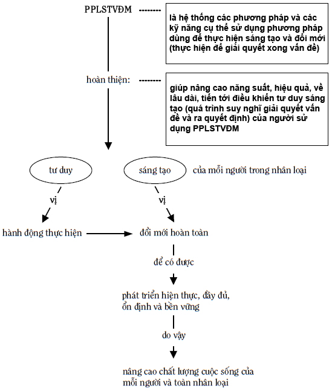

_**Hình 6: Sơ đồ giải thích PPLSTVĐM**_

Để có được tư duy sáng tạo hướng tới hành động thực hiện, môn học PPLSTVĐM không chỉ trình bày hệ thống các phương pháp sáng tạo và đổi mới như những kiến thức lưu giữ trong trí nhớ của người học mà phải làm những kiến thức đó trở thành các kiến thức thường xuyên được sử dụng trong đời sống, công việc của người học. Nếu hành động của cá nhân có nguồn gốc sâu xa từ nhu cầu của cá nhân và nhằm thỏa mãn các nhu cầu của cá nhân thì môn học PPLSTVĐM cần phải không chỉ tác động tốt lên nhận thức, quan niệm, thái độ, xúc cảm… của người học. Quan trọng hơn, môn học phải thông qua các bài tập thực hành làm cho người học cảm nhận được rằng PPLSTVĐM thực sự giúp những người học thỏa mãn các nhu cầu của chính họ, đồng thời thỏa mãn các nhu cầu để cộng đồng cùng phát triển. Nói cách khác, môn học PPLSTVĐM đặc biệt nhấn mạnh sự luyện tập với sự giúp đỡ của các giảng viên ở thời kỳ đầu và sau đó là tự luyện tập của học viên.

PPLSTVĐM hoàn thiện tư duy sáng tạo của mỗi người cũng nhắm tới hoàn thiện con người trong các mối quan hệ con người với con người, con người với cộng đồng xã hội, con người với công cụ lao động (hiểu theo nghĩa rộng nhất) và con người với tự nhiên để điều khiển (làm chủ) bản thân mình hài hòa trong các mối quan hệ đó.

* Cuộc đời của mỗi người là chuỗi các vấn đề cần phải giải quyết, chuỗi các quyết định cần phải ra. Nếu như bạn giải quyết các vấn đề không tốt, đưa ra các quyết định sai, bạn phải trả giá về thời gian, sức lực, trí lực, phương tiện vật chất, tiền bạc, uy tín, danh tiếng, địa vị… thì đời đúng là bể khổ. Từ đây, căn cứ vào mục đích của PPLSTVĐM, bạn có thể hình dung được các ích lợi to lớn và thiết thực mà PPLSTVĐM có thể mang lại cho bạn trong suốt cuộc đời của bạn. Nói cách khác, PPLSTVĐM giúp biến tiền thân "_đời là bể khổ_" thành "_bớt khổ_", phần sướng tăng lên, về lâu dài, khi bạn điều khiển được quá trình suy nghĩ giải quyết vấn đề và ra quyết định của chính mình thì "_đời thành bể hạnh phúc_".

PPLSTVĐM là hệ thống các công cụ dùng để giải quyết các vấn đề có trong cuộc đời. Học PPLSTVĐM một lần, bạn sẽ dùng nó suốt đời, thường xuyên hơn bất kỳ một môn học nào khác.

Bạn càng dùng PPLSTVĐM nhiều thì nó càng hoạt động tốt hơn và đem lại nhiều ích lợi hơn cho bạn. PPLSTVĐM không những không bị hao mòn khi sử dụng mà lại trở nên "_sắc bén_" hơn. PPLSTVĐM thuộc loại tri thức chậm lão hóa nhất trong các loại tri thức của nhân loại.

Bạn lại có thể trao đổi tri thức PPLSTVĐM của mình với những người khác để làm giàu thêm như Bernard Shaw nhận xét: "_Nếu bạn có một quả táo, tôi có một quả táo và chúng ta trao đổi với nhau, thì bạn và tôi mỗi người có một quả táo. Nhưng nếu bạn có một ý tưởng, tôi có một ý tưởng và chúng ta trao đổi với nhau, thì mỗi người chúng ta sẽ có hai ý tưởng_".

* Đi vào cụ thể, các công dụng của PPLSTVĐM là:

1\. Trang bị các cách xem xét tốt sự vật

2\. Khắc phục tính ì tâm lý

3\. Cung cấp các cách tiếp cận khác nhau

4\. Chỉ ra các nguồn dự trữ có thể có để sử dụng

5\. Thấy được sự tương tự, thống nhất của các sự vật

6\. Phản ánh các khuynh hướng phát triển

7\. Lý giải một cách lôgích các giải pháp sáng tạo đã có

8\. Dự báo sự phát triển của hệ thống cho trước

9\. Phát hiện các vấn đề có thể nảy sinh

10\. Tăng tính nhạy bén tư duy trong việc tiếp thu, đánh giá thông tin

11\. Phát triển trí tưởng tượng

12\. Giải quyết các loại mâu thuẫn

13\. Phát các ý tưởng

14\. Xây dựng tư duy hệ thống – biện chứng

15\. Làm giảm số lượng các bài toán phải giải và giảm chi phí giải bài toán

16\. Hoàn thiện chính người sử dụng

## Tại sao cần có Phương pháp luận sáng tạo và đổi mới (PPLSTVĐM)? {#sec:3:3:}
### Nhu cầu xã hội đối với PPLSTVĐM {#subsec:3:3:1:}
Tại sao Sáng tạo học ra đời rất sớm (cách nay tới 17 thế kỷ), bị rơi vào quên lãng, được nhớ lại vào những năm 1940, 1950 và mới được chú ý phát triển khoảng vài chục năm gần đây?

Có nhiều lý do, ví dụ, sáng tạo là đối tượng phức tạp, đòi hỏi sự phối hợp nghiên cứu của nhiều khoa học và những cách tiếp cận liên khoa học, trong khi những khoa học cần thiết như vậy còn chưa ra đời thì Sáng tạo học dù ra đời sớm hơn vẫn chỉ dậm chân tại chỗ. Mặt khác, những phương pháp sáng tạo được tìm ra lúc đó còn sơ khai, khó sử dụng, phạm vi áp dụng hẹp (chủ yếu cho lôgích học, toán học) nên không gây được sự chú ý và mang lại ích lợi rộng rãi…

Tuy nhiên, nguyên nhân quan trọng nhất làm các khoa học nói chung, Sáng tạo học nói riêng bị quên lãng, cũng như được nhớ lại và phát triển là có hay không có nhu cầu xã hội đòi hỏi phát triển các khoa học đó, chứ không phải do các ý muốn, ý thích chủ quan của các nhà khoa học. Engels đã từng viết: "_Nếu như người ta khẳng định rằng kỹ thuật phụ thuộc ở mức độ lớn vào khoa học thì khoa học còn phụ thuộc ở mức độ lớn hơn nhiều vào kỹ thuật và những đòi hỏi của nó. Nếu như trong xã hội xuất hiện đòi hỏi kỹ thuật thì đòi hỏi đó thúc đẩy khoa học tiến nhanh hơn nhiều so với hàng chục trường đại học_".

Các xã hội, nhằm thỏa mãn các nhu cầu ngày càng tăng, thường phát triển theo kiểu như sau: Nếu nguồn dự trữ tự nhiên có sẵn còn nhiều thì người ta dùng ngay chúng để thỏa mãn các nhu cầu, cho đến khi chúng trở nên cạn. Lúc đó mới xuất hiện nhu cầu xã hội về kỹ thuật (nhân tạo) mới để bù trừ, thay thế cho các nguồn dự trữ tự nhiên. Đến lượt mình, nhu cầu xã hội về kỹ thuật thúc đẩy các khoa học tương ứng phát triển. Ví dụ, khi đất canh tác còn nhiều, nông nghiệp phát triển theo kiểu quảng canh. Khi đất canh tác đã cạn, nông nghiệp phải chuyển sang phát triển theo hướng thâm canh, đòi hỏi phải có nhiều loại kỹ thuật mới. Chính các đòi hỏi kỹ thuật này thúc đẩy các ngành khoa học nông nghiệp và liên quan đến nông nghiệp phát triển. Tương tự, vào đầu những năm 1970, người ta tính được rằng, để quản lý kinh tế một đất nước như Liên Xô hoặc Mỹ, hàng năm cần phải làm khoảng 1016 phép tính số học. Nếu dùng số lượng bù cho kỹ thuật, bằng cách huy động nhiều người làm tính bằng tay thì cần 10 tỷ người, nghĩa là hơn gấp ba lần dân số Trái Đất lúc đó. Điều này giải thích vì sao máy tính điện tử (kỹ thuật) phải được sáng chế ra và xã hội bắt buộc phải phát triển các khoa học tương ứng như lý thuyết thông tin, điều khiển học, lý thuyết hệ thống, toán ứng dụng, vật lý bán dẫn…

Vào lúc Sáng tạo học ra đời và hơn 15 thế kỷ tiếp theo sau đó, loài người hoàn toàn thỏa mãn với những kết quả tư duy sáng tạo của mình vì tốc độ phát triển chậm nên số lượng các bài toán ít, chưa kể, phần lớn chúng là loại bài toán có α không quá lớn để vẫn có thể chấp nhận giải chúng bằng phương pháp thử và sai. Trong khi đó, các nguồn dự trữ như các tài nguyên thiên nhiên, nhân lực và thời gian vẫn còn dồi dào. Bài toán nảy sinh, không người này thì người khác trong nhân loại giải, hoặc nhiều người cùng giải, hoặc nhiều thế hệ giải bài toán theo kiểu chạy tiếp sức. Cuối cùng, bài toán vẫn giải được mà không ảnh hưởng gì lớn đến quá trình phát triển của nhân loại, vì còn có một điểm đặc biệt nữa trong sáng tạo. Đó là, khi nhân loại có vấn đề, không nhất thiết tất cả mọi người trong nhân loại phải cùng suy nghĩ giải quyết vấn đề. Chỉ cần những ai đó giải quyết được vấn đề, kết quả sáng tạo của một người hoặc nhóm người, sớm hay muộn đều trở thành hàng hóa trao đổi chung và sau đó là tài sản chung của toàn nhân loại. Người Việt Nam chúng ta, không có ai là tác giả của xe đạp, xe gắn máy, ô tô, máy bay, đèn neon, tủ lạnh, máy tính điện tử, điện thoại di động… vậy mà chúng ta vẫn có để dùng, vẫn có thể sản xuất hoặc hợp tác sản xuất để thỏa mãn các nhu cầu của mình.

Cùng với các cuộc Cách mạng công nghiệp, đặc biệt, từ Cách mạng khoa học – kỹ thuật bắt đầu cuối Chiến tranh thế giới lần thứ hai đến nay, ở những nước phát triển, tình hình thay đổi một cách cơ bản. Những thay đổi này đã làm xuất hiện và làm tăng tính cấp bách của nhu cầu xã hội đòi hỏi mỗi người phải suy nghĩ giải quyết vấn đề và ra quyết định nhanh hơn, hiệu quả hơn, ít trả giá hơn, trước hết, cho những vấn đề mình gặp trong công việc, cuộc sống mà không bị động chờ đợi ở những cấp lãnh đạo, quản lý cao hơn.

Dưới đây, người viết sẽ cố gắng làm rõ hơn điều vừa nói từ những cách xem xét khác nhau như: các khuynh hướng lớn, các thách thức lớn, kinh tế, xã hội, giáo dục và đào tạo.

### Các khuynh hướng, thách thức và hệ quả {#subsec:3:3:2:}
* Ít nhất, có thể kể ra ba khuynh hướng lớn mà nhân loại phải đồng thời trải qua:

1\. Cách mạng khoa học – kỹ thuật (công nghệ) mà khoa học trở thành lực lượng sản xuất trực tiếp.

2\. Con người có nhiều quyền tự do, dân chủ hơn trước.

3\. Kinh tế thị trường và các quan hệ trao đổi khác dần trở thành toàn cầu.

Các khuynh hướng lớn này (cùng với những khuynh hướng khác không kể ra ở đây) tạo ra, một mặt, những khả năng, điều kiện, cơ hội mới, mặt khác, những thách thức mới đối với sự phát triển xã hội của từng quốc gia nói riêng, loài người nói chung.

Cuộc Cách mạng khoa học – kỹ thuật giúp giải quyết tốt hơn các vấn đề đang có và làm tốc độ phát triển ngày càng trở nên nhanh hơn.

Ví dụ, theo Lester Thurow, các vấn đề về sử dụng các tài nguyên thiên nhiên một cách tối ưu đã có nhiều tiến bộ. Nếu khối Thị trường chung Châu Âu (nay là Liên minh Châu Âu – EU) năm 1975 phải nhập khẩu 20 triệu tấn lương thực thì chủ yếu, nhờ cách mạng xanh (các khoa học nông nghiệp, sinh học), năm 1990 xuất khẩu 20 triệu tấn lương thực. Tương tự, năm 1960, Mỹ sử dụng 125 triệu tấn thép, đến đầu những năm 1990, khi kinh tế Mỹ đã gấp năm 1960 khoảng hai lần rưỡi, nhờ cách mạng khoa học-công nghệ vật liệu, Mỹ sử dụng thép ít hơn trước nhiều: 85 triệu tấn.

Còn về tốc độ phát triển, theo Alvin Toffler:

“…Nếu 50.000 năm sau cùng của lịch sử nhân loại được chia thành quãng đời với 62 năm một thì đã có chừng 800 quãng đời như thế. Trong 800 quãng đời thì 650 quãng ở trong hang động.

…Chỉ có 70 quãng đời sau cùng mới có chữ viết, chỉ có 6 quãng đời sau cùng mới có chữ in. Chỉ trong 2 quãng đời sau cùng mới có động cơ điện. Hầu hết hàng hóa chúng ta dùng hàng ngày hiện nay được phát triển trong quãng đời thứ 800 này.

…Nhịp điệu tiến trình nhân loại trong lịch sử được ghi lại nhanh hơn ít nhất 100.000 lần nhịp điệu tiến trình trước khi có loài người. Trong thời kỳ đồ đá cũ, những sáng chế và đổi mới cần 50.000 năm để hoàn thành thì khi kết thúc thời đại đó chỉ cần 1000 năm. Khi có văn minh định cư, thời gian đó chỉ cần 1 thế kỷ. Tốc độ thay đổi gia tăng trong suốt 5000 năm qua, đáng chú ý nhất trong 300 năm cuối cùng. Tốc độ thay đổi gia tăng đến mức trí tưởng tượng của chúng ta không thể theo kịp”.

Tốc độ phát triển nhanh còn có thể minh họa bằng bảng sau đây của V.A. Lisitrkin, xem Hình 7.

| ĐỐI TƯỢNG SÁNG CHẾ | NĂM THỰC HIỆN SÁNG CHẾ | NĂM SẢN XUẤT SẢN PHẨM | THỜI GIAN ĐƯA VÀO SẢN XUẤT |
| --- | --- | --- | --- |
| Sợi nhân tạo | 1655 | 1885 | 230 |
| Chụp ảnh | 1727 | 1839 | 112 |
| Máy đầu tiên | 1680 | 1780 | 100 |
| Xi măng | 1756 | 1844 | 88 |
| DDT | 1874 | 1939 | 65 |
| Điện ảnh | 1832 | 1895 | 63 |
| Động cơ điện | 1829 | 1886 | 57 |
| Điện thoại | 1820 | 1876 | 56 |
| Sợi capron | 1899 | 1939 | 40 |
| Radio | 1867 | 1902 | 35 |
| Đèn điện tử | 1884 | 1915 | 31 |
| Ôtô | 1868 | 1895 | 27 |
| Diesel | 1878 | 1897 | 19 |
| Máy bay | 1897 | 1911 | 14 |
| T.V. | 1922 | 1934 | 12 |
| Transistor | 1948 | 1953 | 5  |
| Nylon | 1935 | 1939 | 4  |
| Pin mặt trời | 1953 | 1955 | 2  |
| Maser | 1954 | 1955 | 1  |

_**Hình 7: Bảng phản ánh khuynh hướng rút ngắn thời gian từ nghiên cứu đến sản xuất**_

Việc con người có nhiều quyền tự do, dân chủ hơn trước tạo thêm nhiều điều kiện để con người thỏa mãn các nhu cầu chính đáng, đồng thời, thể hiện và phát triển các năng lực của mình tốt hơn trước. Các thành tựu về giáo dục, y tế, văn hóa… cho thấy rõ điều đó.

Sự giao thương toàn cầu mở ra nhiều cơ hội hợp tác phát triển và rút ngắn khoảng cách phát triển giữa các quốc gia. Một số nước đã sử dụng thành công những cơ hội này, đạt những thành tựu vượt bậc trong thời gian ngắn, thậm chí trở thành những nước công nghiệp mới như Singapore, Hàn Quốc, Đài Loan, Hồng Kông. Ví dụ, vào những năm 1960, Hàn Quốc và Ghana có cùng thu nhập tính theo đầu người, còn đầu những năm 1990, Hàn Quốc đã cao hơn gấp sáu lần.

* Ngược lại, cũng chính những khuynh hướng lớn này tạo ra những thách thức lớn khi chúng và những quá trình liên quan vượt ra ngoài những giới hạn nhất định. Ở đây, người viết nhấn mạnh một số thách thức sau:

1) Tốc độ thay đổi tăng.

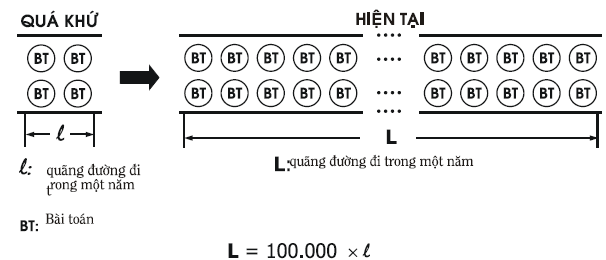

_**Hình 8: Do tốc độ thay đổi tăng, số lượng các bài toán tăng và thời gian cho phép giải chúng rút ngắn lại**_

2) Tính cạnh tranh tăng.

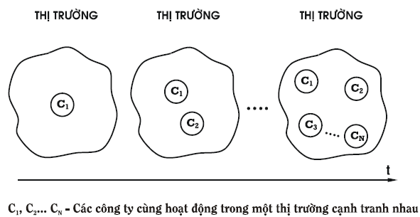

_**Hình 9: Do cạnh tranh tăng, số lượng các bài toán tăng lên và làm nảy sinh các bài toán mới**_

3) Tính phức tạp tăng: các hệ thống do con người tạo ra hoặc làm việc với ngày càng phức tạp. Ví dụ, một chiếc radio khi mới ra đời có gần 20 chi tiết, ngày nay, có thể ngàn lần nhiều hơn. Máy bay đầu tiên có khoảng 1.500 chi tiết, bây giờ, nhiều triệu chi tiết. Trước kia, công ty đã được coi là lớn, có 5.000 người làm việc, ngày nay, có hàng trăm ngàn người, lại còn rải ra ở nhiều quốc gia…

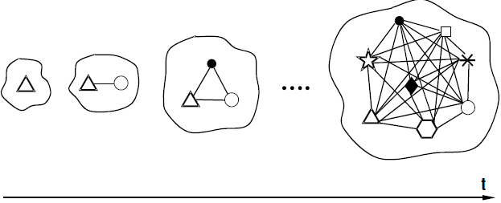

_**Hình 10: Do tính phức tạp tăng, không chỉ số lượng các bài toán tăng, xuất hiện nhiều loại bài toán mới mà mức độ khó của bài toán cũng tăng**_

4) Tính đa dạng tăng: chẳng hạn, người ta tính được rằng, 90% các loại hàng hóa, sản phẩm nhân loại dùng vào những năm 1970 của thế kỷ 20 là chưa có ở đầu thế kỷ và tình hình đó lặp lại ở cuối thế kỷ 20 so với những năm 1970.

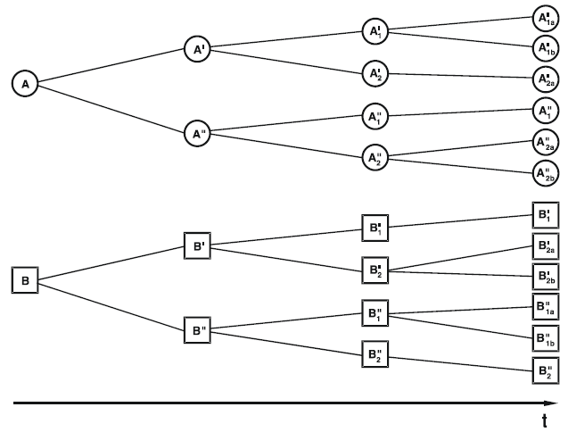

_**Hình 11: Do tính đa dạng tăng, số lượng các bài toán tăng và xuất hiện nhiều loại bài toán mới**_

5) Số lượng các lĩnh vực, ở đó có sự thay đổi, cạnh tranh, phức tạp, đa dạng, tăng.

6) Các nhu cầu của cá nhân, toàn xã hội và toàn nhân loại tăng.

Nhìn dưới góc độ vấn đề, các thách thức dẫn đến các hệ quả:

1\. Số lượng các bài toán trên một đơn vị không-thời gian và đầu người ngày càng tăng.

2\. Thời gian cho phép giải bài toán rút ngắn lại.

3\. Mức độ khó (α) của các bài toán tăng, trong đó, xuất hiện càng nhiều loại bài toán đòi hỏi nhiều ngành nghề, chuyên môn khác nhau cùng tham gia giải.

4\. Xuất hiện càng nhiều các loại bài toán mới, trước đây chưa có.

Vì phương pháp phổ biến để giải quyết vấn đề là phương pháp thử và sai, để đối phó với các hệ quả của các thách thức, nhân loại phải làm tăng số lượng và ở chừng mực nào đó, chất lượng các phép thử của mình bằng cách sử dụng các nguồn dự trữ về tri thức, nhân lực, tổ chức và tự nhiên có sẵn. Cụ thể, đào tạo ngày càng nhiều những người tham gia giải quyết vấn đề như các nhà khoa học, kỹ thuật, quản lý, lãnh đạo; thành lập ngày càng nhiều các phòng thí nghiệm, trung tâm, viện nghiên cứu; tăng tốc độ của máy tính điện tử, thiết lập các mạng lưới thông tin rộng rãi; khai thác ngày càng nhiều các tài nguyên thiên nhiên. Mặt khác, dân chủ hóa, phi tập trung hóa, công khai, minh bạch hóa, chuyển giao quyền tự chủ xuống các cấp dưới… cũng góp phần làm tăng số lượng người tham gia giải bài toán, do vậy, cũng làm tăng số lượng các phép thử để tăng xác suất có nhiều lời giải và rút ngắn thời gian giải bài toán.

Thực tế cho thấy, cách phát triển theo kiểu dùng số lượng các phép thử bù cho khả năng giải quyết vấn đề và ra quyết định một cách tin cậy, hiệu quả, không trả giá đã dần tiến tới những giới hạn không vượt qua được. Ví dụ, theo nhà bác học Pháp Pierre Auger, nếu tính từ thời điểm loài người biết dùng lửa đến nay, tổng số các nhà bác học là 100 thì hơn 90 người trong số đó hiện đang sống và làm việc trong thời đại chúng ta. Nếu tỷ lệ tăng dân số là 3% thì chúng ta có bùng nổ dân số, có nghĩa là cứ 23 năm dân số sẽ tăng gấp đôi. Trong khi đó, số lượng các nhà chuyên môn về khoa học, kỹ thuật cứ 10 đến 15 năm tăng gấp đôi, có những ngành chỉ cần 7 đến 8 năm. Tiếp tục giữ đà này thì khoảng nửa cuối thế kỷ 21, toàn bộ dân số Trái Đất sẽ là các nhà bác học. Đây là điều vô lý. Mặt khác, các tài nguyên không tái tạo được ngày càng cạn kiệt, các trạng thái cân bằng về sinh thái, khí hậu, môi trường (hiểu theo nghĩa rộng nhất) bị đe dọa nghiêm trọng. Cousteau nói một cách hình ảnh rằng: "_Trước kia tự nhiên đe dọa loài người, còn bây giờ loài người đe dọa lại tự nhiên_". Một khi tự nhiên không còn, loài người chắc sẽ không còn…

Như chúng ta đã biết ở các mục \@ref(sec:2:2:) và \@ref(sec:2:3:), phương pháp thử và sai là phương pháp tự nhiên, được sử dụng phổ biến trong giải quyết vấn đề và ra quyết định, có rất nhiều nhược điểm. Khi số lượng các bài toán cần giải trên con đường phát triển xã hội, trong đó, các bài toán có  rất lớn chiếm tỷ trọng ngày càng tăng, các nguồn dự trữ dùng để trả giá cho các phép thử và sai ngày càng cạn kiệt, thời gian trung bình cho phép giải một bài toán ngày càng rút ngắn lại một cách đáng kể (nếu không giải kịp sẽ có thảm họa)…, các nhược điểm của phương pháp thử và sai, các nghịch lý trong lĩnh vực tư duy sáng tạo trở nên không thể chấp nhận được nữa nếu muốn có sự phát triển ổn định và bền vững. Đây chính là nguyên nhân cơ bản nhất để Sáng tạo học nói chung và PPLSTVĐM nói riêng được nhớ lại, được phát triển tiếp, trước hết, ở những nước phát triển.

Như vậy, để đối phó với các hệ quả của các thách thức, Sáng tạo học và PPLSTVĐM phải thực hiện nhiệm vụ nghiên cứu, thiết kế, xây dựng và trang bị cho mọi người hệ thống các phương pháp mới dùng để suy nghĩ giải quyết vấn đề và ra quyết định, khắc phục được các nhược điểm của phương pháp thử và sai. Điều này cũng tương tự như các ngành khoa học và kỹ thuật liên quan phải đưa ra và trang bị cho người lao động hệ thống các máy móc với độ tin cậy, năng suất, hiệu quả cao hơn nhiều để thay thế các dụng cụ thô sơ như xẻng, cuốc, bàn tính… hoặc các cây, con giống mới với các ưu điểm vượt trội để thay thế các cây, con giống truyền thống.

### Nguyên nhân thành công ở thế kỷ 21: Sáng tạo và đổi mới – Tri thức {#subsec:3:3:3:}
* Con người vốn có nhu cầu tồn tại và phát triển. Để thỏa mãn các nhu cầu này, con người gặp hoặc đề ra các bài toán cần giải. Tuy nhu cầu có nhiều loại, nhưng do đặc điểm của kinh tế thị trường: nhiều sản phẩm, dịch vụ có thể mua được bằng tiền, xuất hiện nhu cầu tương đối vạn năng: nhu cầu có nhiều tiền (trở nên giàu, thành công về kinh tế).

Theo Lester Thurow, các nghiên cứu phát triển kinh tế ở thế kỷ 19 và 20 cho thấy: mọi cá nhân, công ty hoặc quốc gia đều đã trở nên giàu nếu có một hoặc kết hợp vài trong số bốn nguyên nhân sau:

1\. Có tài nguyên thiên nhiên nhiều hơn những người xung quanh.

2\. Sinh ra đã giàu (được thừa kế tài sản lớn từ đời trước), có vốn tính theo đầu người lớn hơn những người xung quanh.

3\. Có công nghệ tiên tiến hơn những người xung quanh.

4\. Có nguồn nhân lực tốt hơn những người xung quanh.

Có câu hỏi đặt ra: _Ở thế kỷ 21, nguyên nhân nào làm cho một cá nhân, công ty hoặc quốc gia thành công về kinh tế?_ Câu trả lời là, do tác động của ba khuynh hướng lớn nêu ở phần đầu mục này, ba nguyên nhân đầu càng ngày càng giảm bớt vai trò.

Toàn cầu hóa kinh tế thị trường làm cho các tài nguyên thiên nhiên luân chuyển khắp thế giới. Điều này có nghĩa, không có sẵn tài nguyên thiên nhiên, có tiền, bạn vẫn mua được các tài nguyên thiên nhiên dưới dạng các quặng khoáng sản, nguyên, nhiên, vật liệu thô… Các tiến bộ khoa học-kỹ thuật làm tỷ trọng nguyên, nhiên, vật liệu trong sản phẩm càng ngày càng giảm, làm giá của các tài nguyên thiên nhiên có khuynh hướng rẻ đi. Giá thực (sau khi trừ đi lạm phát…) của các nguyên liệu thô năm 1990 chỉ bằng 60% năm 1980 và năm 1980 chỉ bằng 70% năm 1970. Điều này làm cho những ai giàu vì nguyên nhân duy nhất là có tài nguyên thiên nhiên nhiều hơn những người xung quanh không còn giàu như trước nữa. Cuối thế kỷ 19, Argentina là một trong những nước giàu nhất thế giới. Đến năm 1929 họ vẫn còn giàu ngang với nước giàu nhất châu Âu. Ngày nay, Argentina chỉ được xếp vào danh sách các nước đang phát triển, thậm chí, trở thành con nợ lớn và suýt bị vỡ nợ. Điều tương tự cũng xảy ra với Chile. New Zealand đã có lúc đứng thứ ba thế giới về thu nhập tính theo đầu người. Hiện nay, New Zealand được xếp vào cuối danh sách của các nước châu Âu thuộc Tổ chức hợp tác và phát triển kinh tế (OECD), chỉ đứng trên Hy Lạp và Bồ Đào Nha. Chính người New Zealand đang lo lắng nói về "_hội chứng New Zealand_" và sợ rằng, nếu không có các biện pháp tích cực thì có thể biến thành "_căn bệnh Argentina_". Trong khi đó, Việt Nam ta trong suốt lịch sử của mình, chưa bao giờ là đất nước giàu vào loại nhất thế giới nhờ tài nguyên thiên nhiên.

Tương tự, người ta tạo ra được thị trường vốn toàn cầu luân chuyển khắp thế giới, hoạt động theo kiểu ở đâu sinh lời nhanh thì dòng vốn đổ đến. Điều này có nghĩa, ưu thế của người sinh ra đã giàu (nhờ vốn tích lũy từ các đời trước để lại) dần bị mất, vì một người khởi nghiệp với hai bàn tay trắng có thể vay được từ ngân hàng số tiền lớn nếu người đó có dự án khả thi và vấn đề vốn được giải quyết.

Ngày nay, cũng do toàn cầu hóa, các loại công nghệ cũng luân chuyển khắp thế giới. Nếu bạn có tiền và không bị cấm vận, bạn có thể mua ngay được công nghệ sản xuất tiên tiến nhất thế giới và đối thủ của bạn không còn ưu thế công nghệ so với bạn.

Trong khi đó, với thời gian, nguyên nhân thứ tư: Có lực lượng lao động tốt hơn những người xung quanh nổi lên thành nguyên nhân quan trọng nhất và dần trở thành nguyên nhân duy nhất để thành công về kinh tế.

Ở thế kỷ 19 và 20, lực lượng lao động tốt hơn những người xung quanh được hiểu là lực lượng lao động được đào tạo bài bản, có các kỹ năng nghề nghiệp tốt hơn những người khác. Ở quy mô quốc gia, phát triển nguồn nhân lực (Human Resource Development) để có được lực lượng lao động tốt hơn các quốc gia khác là một trong các nhiệm vụ chính của hệ thống giáo dục - đào tạo.

Người ta gọi nhóm các nước giàu nhất thế giới là "_Câu lạc bộ các nước giàu nhất thế giới_". Từ năm 1870 đến những năm 1990, ba nước giàu về tài nguyên thiên nhiên là Argentina, Chile và New Zealand bị loại ra khỏi Câu lạc bộ. Cũng trong suốt hơn một trăm năm đó, duy nhất Nhật Bản với tư cách quốc gia công nghiệp được gia nhập Câu lạc bộ chính bằng con đường phát triển nguồn nhân lực thông qua giáo dục - đào tạo. Đối với ba nguyên nhân khác: tài nguyên thiên nhiên, vốn tính theo đầu người, công nghệ, Nhật Bản đều có xuất phát điểm thua kém các nước phát triển khác.

Việc chú ý phát triển nguồn nhân lực còn có tính truyền thống vì triết lý cổ của Nhật dạy rằng:

> Ông chủ kém là ông chủ để đất mọc toàn cỏ dại.
>
> Ông chủ giỏi là ông chủ biết trồng lúa.
>
> Ông chủ thông minh: biết làm cho đất màu mỡ.
>
> Ông chủ sáng suốt: biết chăm sóc người làm.

M. Morishima cho biết, chính phủ Nhật Bản đã bắt tay vào việc tạo dựng một hệ thống trường học hiện đại cùng với việc ban hành _bakusei_ (Luật giáo dục) vào năm 1872, tức là chỉ hai năm sau khi Anh thực hiện Luật giáo dục và 7 năm sau khi Mỹ xóa bỏ chế độ nô lệ. Để làm điều này, người ta chia đất nước thành khoảng 50.000 khu vực trường học phổ thông, trên cơ sở là mỗi khu vực đảm nhận 600 người và đã áp dụng chế độ học tập bắt buộc trên toàn quốc, thông qua việc xây dựng một trường học tại mỗi khu vực. Hơn thế, những trường học này được tiêu chuẩn hóa và không phân biệt vị trí xã hội, lý lịch hay giới tính của người học. Năm 1873 mới chỉ 28% tổng số dân cư ở độ tuổi đến trường đi học, năm 1882, con số này là 50%, năm 1895 là 67% và năm 1904 đã đạt 98%.

Ở thế kỷ 21, lực lượng lao động tốt hơn những người xung quanh được hiểu cao hơn: Ngoài việc được đào tạo bài bản để có các kỹ năng nghề nghiệp tiên tiến, lực lượng lao động còn phải có thêm các kỹ năng mới, đặc biệt trong đó là các kỹ năng sáng tạo và đổi mới.

Trước đây, nói đến sáng tạo và đổi mới, thường người ta cho rằng, chỉ lĩnh vực nghiên cứu khoa học-kỹ thuật mới cần những nhân viên suy nghĩ sáng tạo. Điều này được phản ánh trong câu chuyện sau:

“Một buổi tối E. Rutherford (nhà vật lý được giải thưởng Nobel) ghé vào phòng thí nghiệm. Mặc dù đã rất muộn, một nhân viên của ông vẫn đang miệt mài làm thí nghiệm với các máy đo. Rutherford hỏi: “Anh làm gì muộn vậy?”. Người nhân viên trả lời: “Thưa giáo sư, tôi làm việc”.

− Thế ban ngày anh làm gì?

− Tôi làm việc, tất nhiên.

− Và sáng sớm anh cũng làm việc?

− Vâng, thưa giáo sư, sáng sớm tôi cũng làm việc.

Người nhân viên xác nhận và chờ đợi lời khen từ nhà bác học nổi tiếng. Rutherford sa sầm mặt và bực bội hỏi: “_Hãy nghe đây, khi nào thì anh suy nghĩ_?”

Cũng chính Rutherford thường sử dụng tiêu chuẩn sau để chọn nhân viên: Ông giao một đề tài cụ thể cho người mới được tuyển. Sau khi hoàn thành, nếu người đó còn đến hỏi ông làm gì tiếp theo thì ông cho thôi việc. Ông đòi hỏi nhân viên phải biết suy nghĩ độc lập và có ý tưởng sáng tạo để phát triển tiếp công việc được giao.

Còn trong các lĩnh vực khác, người ta cho rằng chỉ những nhà lãnh đạo, quản lý cấp cao mới cần sáng tạo, các cấp dưới là những người thừa hành, thậm chí, thiên lôi chỉ đâu đánh đấy. Dưới đây là câu chuyện xảy ra trong các công ty: Nhà quản lý bắt gặp nhân viên của mình không những không làm việc mà còn có dáng vẻ trầm tư bèn hỏi: "_Anh làm gì vậy?_". Nhân viên trả lời: "_Báo cáo sếp, tôi suy nghĩ về công việc_". Nhà quản lý sa sầm nét mặt, bực bội nói: "_Anh đã được đào tạo nghề nghiệp, vậy cứ thế mà làm. Người ta trả lương cho anh để anh làm việc chứ không phải suy nghĩ về công việc. Hãy vứt các suy nghĩ của anh đi mà bắt tay vào làm việc, nếu không, anh sẽ gặp rắc rối to đấy_".

Ngày nay, tình hình đã thay đổi. Vào đầu những năm 1990, Bộ lao động Mỹ đặt hàng Hiệp hội Hoa Kỳ về huấn luyện và phát triển (The American Society for Training and Development) nghiên cứu để trả lời câu hỏi: "_Những người tìm việc trong tương lai cần có những kỹ năng cơ bản nào mới có việc làm?_" Kết quả, 13 kỹ năng được đưa ra, trong đó, tư duy sáng tạo được xếp đầu tiên, xem Hình 12: Các kỹ năng mới của tương lai.

| 1  | Tư duy sáng tạo Creative Thinking | Khi công việc ngày càng trở nên linh động hơn thì các giải pháp của người lao động cũng cần phải sáng tạo hơn. |
| --- | --- | --- |
| 2  | Xác định mục tiêu / Thúc đẩy hành động Goal-Setting/ Motivation | Người lao động cần phải xác định được mục tiêu cần đạt và kiên trì để đạt mục tiêu đó. |
| 3  | Các kỹ năng quan hệ giữa người và người Interpersonal Skills | Có khả năng làm việc ăn ý với nhà cung cấp, đồng nghiệp và khách hàng sẽ là yêu cầu thiết yếu cho các công việc trong tương lai. |
| 4  | Khả năng lãnh đạo Leadership | Người lao động ngày càng được yêu cầu nhận lãnh nhiều trách nhiệm hơn và hướng dẫn các đồng nghiệp của mình khi cần thiết. |
| 5  | Học cách học Learning to Learn | Người lao động cần biết cách học để có được các thông tin và kỹ năng mới, và biết áp dụng chúng vào công việc của mình. |
| 6  | Biết lắng nghe Listening | Biết lắng nghe sẽ giúp cho người lao động hiểu được những bận tâm của đồng nghiệp, những nhà cung cấp và khách hàng. |
| 7  | Thương thuyết Negotiation | Người lao động cần có khả năng xây dựng sự thỏa thuận thông qua việc cho và nhận. |
| 8  | Kỹ năng giao tiếp bằng lời nói Oral Communications | Người lao động phải có khả năng trả lời một cách rõ ràng những mối bận tâm của đồng nghiệp, nhà cung cấp và khách hàng. |
| 9  | Tính hiệu quả của tổ chức Organizational Effectiveness | Nhân viên phải hiểu rõ cách thức đáp ứng các mục đích của công ty và họ cần phải làm việc như thế nào để góp phần đạt được những mục đích đó. |
| 10 | Kỹ năng phát triển nghề nghiệp/nhân cách Personal/Career Development Skills | Những nhân viên đáng quý nhất là những người hiểu được rằng họ cần phải luôn luôn phát triển trong công việc của họ. |
| 11 | Giải quyết vấn đề Problem Solving | Các tổ chức lao động mới sẽ luôn đòi hỏi tất cả nhân viên giải quyết vấn đề và tìm kiếm lời giải. |
| 12 | Tự trọng Self-Esteem | Các cán bộ quản lý công ty nói rằng họ muốn có những người lao động tự hào về chính bản thân và các khả năng của mình. |
| 13 | Làm việc đồng đội Teamwork | Làm việc một cách hợp tác có nghĩa: Người lao động phải biết phân chia công việc một cách công bằng, hiệu quả và cùng làm việc với nhau để đạt được mục đích chung của cả nhóm. |

**_Hình 12: Các kỹ năng mới của tương lai_**

Như vậy, nguyên nhân duy nhất còn lại để một cá nhân, công ty, quốc gia thành công về mặt kinh tế ở thế kỷ 21 là có nguồn nhân lực tốt hơn những người xung quanh: nguồn nhân lực có khả năng tạo ra nhiều giá trị thặng dư hơn những người xung quanh bằng sáng tạo và đổi mới.

Bạn có thể hình dung cách làm ăn đã bắt đầu từ thế kỷ 20 và ngày càng phổ biến ở thế kỷ 21 như sau: Bạn khởi sự doanh nghiệp với vốn tự có rất ít nhưng bạn có khả năng phát hiện vấn đề và tìm được lời giải. Bạn lập dự án và có thể vay từ ngân hàng hoặc quỹ tư bản mạo hiểm (Venture Capital) một số tiền lớn. Với số tiền đó, bạn có thể mua công nghệ tiên tiến, các nguyên, vật liệu cần thiết và trả tiền thuê nhân công. Nếu bạn và lực lượng lao động của bạn sáng tạo và đổi mới hơn những người khác, lợi nhuận của bạn sẽ cao hơn những người khác. Bạn trả được vốn vay và nâng lương cho các lao động của mình. Bạn lại lập dự án mới, cần tiền lại vay tiếp và cứ như thế… Tóm lại, bạn và nguồn nhân lực của bạn phải sáng tạo và đổi mới tốt hơn những người xung quanh mới hy vọng thành công về kinh tế ở thế kỷ 21. Đây là cách đi của nhiều công ty nhỏ để sau này trở thành các tập đoàn lớn như Sony, Honda… và để Bill Gates trong vòng chưa tới 30 năm trở thành người giàu nhất thế giới.

* Theo nhiều tác giả, ví dụ, T. Murakami và những người khác, xã hội loài người phải trải qua bốn thời đại, còn gọi là bốn làn sóng phát triển hoặc là bốn làn sóng văn minh: nông nghiệp, công nghiệp, thông tin và sáng tạo (hay còn gọi là tri thức) với những công cụ lao động (hiểu theo nghĩa rộng nhất) tương ứng với các bộ phận của cơ thể người, xem Hình 13.

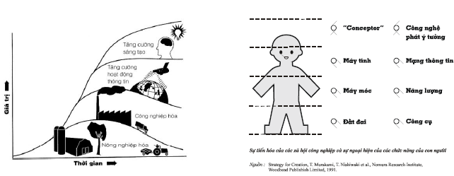

_**Hình 13: Bốn nền văn minh của xã hội loài người và những yêu cầu tương ứng với các bộ phận trên cơ thể người**_

Thực tế cho thấy, sự phát triển liên tục, ổn định và bền vững chỉ có thể xảy ra khi sự phát triển, vào những thời kỳ lịch sử cần thiết, phải chuyển từ nguyên lý/hệ thức (Paradigms) này sang nguyên lý khác. Ví dụ, nhờ cải tiến, tốc độ xe do ngựa kéo ngày càng tăng nhưng ở đây có giới hạn của sự phát triển: xe loại đó không bao giờ đạt được tốc độ của con ngựa phi một mình. Nếu bạn muốn phát triển tiếp, bạn phải chuyển sang ôtô, hoạt động theo nguyên lý khác. Tương tự như vậy, xã hội loài người phải chuyển từ nguyên lý phát triển này sang nguyên lý phát triển khác để có được sự phát triển mãi.

Thời đại nông nghiệp chấm dứt thời kỳ săn bắn, hái lượm, du cư, sử dụng đôi chân rất nhiều bằng việc định cư, trồng trọt và chăn nuôi, sử dụng các công cụ lao động còn thủ công khai thác đất đai. Ở thời đại công nghiệp, mọi người lao động dùng tay điều khiển các máy móc. Còn chính các máy móc đó hoạt động bằng năng lượng ngoài cơ bắp, giúp tăng sức mạnh và nối dài đôi tay của con người. Ở thời đại thông tin, tương tự, máy tính, các mạng lưới thông tin giúp tăng sức mạnh, nối dài các bộ phận thu, phát thông tin trên cơ thể người như các giác quan, tiếng nói, chữ viết, hình vẽ… và một số hoạt động lôgích của bộ não.

Ở những nước phát triển, người ta đã bắt đầu nói về thời đại sáng tạo (hay tri thức) cùng các công cụ sử dụng trong thời đại đó (cách tạo khái niệm – Conceptor; công nghệ phát ý tưởng – Idea Engineering đều là những công cụ thuộc PPLSTVĐM) như là thời đại hậu thông tin từ cuối những năm 1980, đầu những năm 1990.

J. Kao có liệt kê tám nguyên nhân để trả lời câu hỏi "_Tại sao thời đại tiếp theo thời đại thông tin là thời đại sáng tạo (tri thức)?_"

1\. Vì chính công nghệ thông tin muốn chúng ta đi tiếp đến thời đại sáng tạo.

2\. Vì đấy là thời đại tri thức. Trong các lĩnh vực cần tri thức, chính sáng tạo làm tăng giá trị thặng dư của tri thức, làm cho tri thức đem lại nhiều ích lợi hơn.

3\. Vì các công ty càng ngày càng thấy trách nhiệm phải nhanh chóng tái sáng chế chính mình để phát triển.

4\. Vì nhiều người làm việc hôm nay thấy họ có quyền làm các công việc sáng tạo và những người tài thường thay đổi chỗ làm việc hơn bao giờ hết.

5\. Vì lĩnh vực thiết kế chiếm vị trí đứng đầu mới.

6\. Vì đã có sự thay đổi quan hệ trên thị trường: khách hàng bây giờ là ông (bà) chủ đòi hỏi, so sánh, không còn là khách hàng trung thành như xưa. Ông (bà) chủ mới chỉ có một câu hỏi: "Các người sẽ làm gì cho ta ngày mai?" Chỉ có sáng tạo mới trả lời được câu hỏi này.

7\. Vì cạnh tranh toàn cầu đòi hỏi mỗi nước phải huy động các ý tưởng, tài năng và các tổ chức sáng tạo. Công ty nào coi thường điều này sẽ đánh mất những cách xem xét quan trọng về chiến lược.

8\. Vì quản lý đang thay đổi vai trò từ kiểm soát sang giải phóng sức sáng tạo. Đây chính là tư duy quản lý mới.

Để trả lời câu hỏi: "_Tại sao sau thời đại thông tin là thời đại sáng tạo (hay tri thức)?_", trước hết, chúng ta làm quen với khái niệm "_tri thức_" (kiến thức).

Tri thức (Knowledge) là thông tin mang lại ý nghĩa và ích lợi cho người có thông tin đó. Theo nghĩa tốt đẹp, "_ích lợi cho người có thông tin đó_", ít nhất, không làm hại ích lợi của cộng đồng và xã hội.

Theo định nghĩa này, tri thức là thông tin nhưng không phải thông tin nào cũng là tri thức. Người có thông tin, có nghĩa là, thông tin phải nằm trong đầu người đó. Do vậy, bạn cầm trong tay quyển sách chưa đọc, băng, đĩa CD chưa xem, chưa nghe… bạn chưa thể nói rằng bạn có thông tin. Ngay cả trường hợp, thông tin nằm trong trí nhớ bạn rồi mà bạn chẳng thấy nó liên quan gì đến mình, chẳng suy ra thêm được điều gì, chẳng thấy giúp ích mình hơn trước ngay lập tức, hay trong tương lai thì nó vẫn chỉ là thông tin. Bởi vì, thông tin phải mang lại ý nghĩa và ích lợi cho bạn mới là tri thức. Như vậy, tri thức nói đến ở đây là tri thức của từng cá nhân cụ thể chứ không phải tri thức nhân loại theo cách hiểu thông thường: Tri thức nằm trong các quyển sách.

Khi chúng ta đi học, chúng ta kế thừa tri thức nhân loại để biến thành tri thức của cá nhân. Tùy theo chuyên môn, nghiệp vụ, những người khác nhau sẽ kế thừa các tri thức khác nhau mà người không được đào tạo thì không có các tri thức đó. Ví dụ, tấm phim phổi với người bình thường chỉ là thông tin, với bác sỹ chuyên môn đấy là tri thức. Điều tương tự cũng xảy ra đối với các lĩnh vực khác.

Có những thông tin là tri thức thấy ngay, thể hiện ngay đối với bạn vì nó đáp ứng ngay nhu cầu của bạn, không phải mất công suy nghĩ gì thêm. Ví dụ, bạn muốn nấu món thỏ sốt vang mà chưa biết cách. Bạn đọc sách dạy nấu ăn, tìm được các chỉ dẫn, bạn làm theo và thành công. Những thông tin chỉ dẫn cách nấu món thỏ sốt vang trở thành tri thức đối với bạn, vì những thông tin đó mang lại ý nghĩa và ích lợi cho bạn.

Có những thông tin là tri thức tiềm ẩn, hiểu theo nghĩa, các ích lợi không thể hiện hoặc thấy ngay, ít được dùng đến… Ví dụ, trong đầu bạn có các thông tin về cách lấy đạo hàm, tích phân… nhưng sau khi học, có khi suốt cả cuộc đời, bạn chỉ dùng vài lần, thậm chí, không có dịp nào dùng để biến nó thành ích lợi hiện thực cho bạn hay những người khác. Ở đây, rất cần một tỷ lệ hợp lý giữa tri thức dùng thường xuyên và tri thức tiềm ẩn trong trí nhớ của một người. Bạn thử tưởng tượng trường hợp cực đoan: Trong đầu của một người chỉ toàn tri thức tiềm ẩn, cả đời dùng có vài lần thì liệu người đó có thể đối phó với cuộc đời là chuỗi các vấn đề cần giải quyết, chuỗi các quyết định cần phải ra không?

Có những thông tin vẫn chỉ là thông tin với người này nhưng lại là tri thức với người khác, tùy theo nhu cầu của từng người. Ví dụ, hai người cùng ngồi xem truyền hình. Trên màn ảnh đang là chương trình dự báo thời tiết một số thành phố trên thế giới, trong đó Paris: từ 1 đến 5oC. Đối với người thứ nhất, đây chỉ là thông tin vì thông tin này anh thấy không liên quan và đem lại ích lợi gì. Ngược lại, người thứ hai, ngày mai sẽ bay sang Paris, trở nên quan tâm và suy ra phải chuẩn bị loại quần áo ấm nào, ngày mai mặc gì, khi chưa dùng thì cất ở đâu để khi cần lấy ra cho tiện… Như vậy, thông tin "_Paris: Từ 1 đến 5oC_” là tri thức đối với người thứ hai.

Có những thông tin đến với những người cùng có sự quan tâm, nhu cầu như nhau nhưng với người này vẫn chỉ là thông tin, với người khác, chúng lại là tri thức. Nói cách khác, đấy là loại thông tin phải trải qua sự biến đổi nhất định trong óc của người có thông tin mới trở thành tri thức và khả năng biến đổi thông tin thành tri thức ở những người khác nhau thì khác nhau.

Ví dụ, trong một vụ án mạng, bác sỹ Watson đến hiện trường trước. Sherlock Homes đến sau, nên hỏi: "_Anh đến trước, anh thấy có điều gì lạ không?_". Bác sỹ Watson trả lời: "_Chẳng thấy có gì lạ cả. Án mạng xảy ra mà đến chó nhà đó cũng không sủa!_". Khi thông tin này vào đầu Sherlock Homes, ông suy ra tiếp: "_Vậy hung thủ chắc phải là người rất thân với gia đình này nên chó mới không sủa_". Từ đây, Sherlock Homes thu hẹp phạm vi nghi ngờ thủ phạm và phá án thành công. Như vậy, Sherlock Homes đã biến đổi thông tin nhận được thành tri thức, còn bác sỹ Watson thì không, mặc dù cả hai người đều quan tâm đến vụ án và đều có nhu cầu tìm thủ phạm của vụ án mạng. Tương tự, hai doanh nhân hoạt động trong một lĩnh vực, đều đọc cùng một bài báo. Với người này, đấy chỉ là thông tin, với người kia, có khi, thấy cả cơ hội kinh doanh, sử dụng và thắng lớn. Sau đây là một ví dụ nữa về khả năng biến thông tin thành tri thức không như nhau ở mọi người.

Có lần, Công ty Siemens lắp ráp một cỗ máy rất quan trọng nhưng động cơ điện của nó không chạy. Công ty đã mời nhiều chuyên gia nổi tiếng nhưng không đạt được kết quả nào. Do vậy, công ty đưa ra giải thưởng 10.000 mác cho ai có thể làm động cơ hoạt động bình thường. P.L. Kapitsa (nhà vật lý người Nga, nhận giải Nobel năm 1978 về những phát minh và sáng chế trong lĩnh vực vật lý nhiệt độ thấp) đi vòng quanh xem xét động cơ. Ông cầm búa và gõ một nhát vào chân đế vòng bi: cả cỗ máy thình lình khởi động và từ đó trở đi hoạt động bình thường. P.L. Kapitxa viết trong giấy biên nhận tiền như sau: "_Tiền công một nhát búa – 1 mác và 9.999 mác trả cho việc suy nghĩ để biết cần đập nhát búa vào đâu_".

Nói một cách nôm na, khả năng biến đổi thông tin thành tri thức là khả năng mà trong đời sống hàng ngày chúng ta thường hay nhắc đến: Mọi người đều nhìn (đọc, xem), nghe, ngửi, sờ, nếm thông tin nhưng không phải ai cũng "_thấy_" (phát hiện, suy luận ra cái gì đó có ích) tri thức. Khả năng "_thấy_" ở những người khác nhau thì khác nhau.

Ở thời đại thông tin, một mặt, nhờ những thành tựu của công nghệ thông tin, thông tin ngày nay truyền rất nhanh (hầu như đến tức thì, ngay khi sự kiện vừa xảy ra), rất nhiều (văn bản, tiếng nói, hình ảnh màu tĩnh, động, ba chiều…), lưu trữ rất gọn (một máy tính xách tay và bộ đĩa chứa cả nhiều tủ sách), truy cập, tìm kiếm dễ… Tuy nhiên, trừ loại thông tin có ích lợi thấy ngay đối với người nhận tin, các loại thông tin khác vẫn phải cần bộ não của người nhận tin xử lý, biến đổi để trở thành thông tin có ý nghĩa và ích lợi (tri thức) cho người nhận tin. Mặt khác, do bùng nổ thông tin, thông tin quá nhiều trở thành thách thức đối với việc biến thông tin thành tri thức. Trước thời đại thông tin, các nhà lãnh đạo, quản lý ra quyết định sai thì nói rằng do thiếu thông tin. Ngày nay, họ vẫn ra quyết định sai với lý do ngược lại: nhiều thông tin quá.

Câu chuyện dân gian Việt Nam "_Đẽo cày giữa đường_" cho thấy, trong môi trường nhiều thông tin mà người nhận tin không có khả năng lọc, diễn giải, suy luận, xử lý, đánh giá, phát hiện các ích lợi để sử dụng, hay gọi chung là khả năng biến đổi thông tin thành tri thức (ra quyết định đúng), có thể phải trả giá như thế nào. Tóm tắt câu chuyện như sau:

“Một người lấy một khúc gỗ tốt mang ra ngoài đường dự định đẽo một cái cày. Vì đẽo ngoài đường, những người đi ngang qua "_tham mưu_" cho anh đủ loại ý kiến. Nói cách khác, anh nhận được rất nhiều thông tin. Thiếu khả năng biến đổi thông tin thành tri thức, anh đã ra những quyết định sai. Kết quả, từ khúc gỗ tốt ban đầu, trong tay anh, thay vì cái cày chỉ còn lại que tăm xỉa răng”.

Phải chăng những nước giàu nhất thế giới nhờ có nhiều tài nguyên thiên nhiên như Argentina, Chile đã có những quyết định sai nên phải tụt hạng khá nhiều. Ngược lại, một số nước khác lại lên hạng thành con hổ, con rồng?

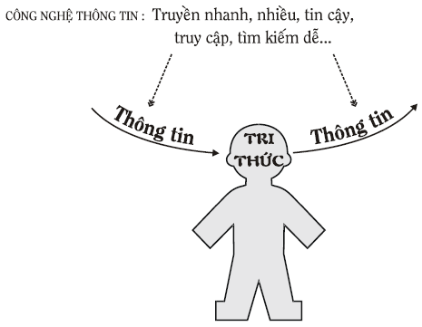

**_Hình 14: Mối quan hệ giữa thông tin, bộ óc và công nghệ thông tin_**

Bất chấp những thành tựu "_chỉ thấy trong mơ_" của công nghệ thông tin, quá trình biến đổi thông tin thành tri thức chủ yếu vẫn xảy ra trong bộ óc của con người chứ không phải trong các thiết bị của công nghệ thông tin. Công nghệ thông tin phát huy các tác dụng của mình đối với dòng thông tin đi đến bộ óc và từ bộ óc đi ra (bởi vì tri thức, xét về mặt hình thức cũng là thông tin). Từ đây, kết hợp với bộ óc có khả năng biến thông tin thành tri thức, công nghệ thông tin cho ra đời những phương tiện và hình thức mới như hội thảo, đào tạo, mổ, quản lý… từ xa với quy mô toàn cầu, xem Hình 14.

Quá trình suy nghĩ giải quyết vấn đề và ra quyết định (tư duy sáng tạo) chính là quá trình biến đổi thông tin thành tri thức, tri thức đã biết thành tri thức mới. Thật vậy, tất cả các bài toán có trong thực tế đều có thể quy về thành các lời phát biểu bài toán, chứa thông tin và tri thức đã biết về các đối tượng có trong bài toán. Lời giải bài toán là những thông tin mới đem lại ích lợi (đạt được mục đích đề ra): tri thức. Nhìn theo góc độ này, PPLSTVĐM chính là hệ thống các phương pháp (công cụ hay phần mềm) của bộ óc để thực hiện việc biến đổi thông tin thành tri thức, tri thức đã biết thành tri thức mới với năng suất, hiệu quả và tính điều khiển cao.

Mặt khác, ở thời đại thông tin, sự bùng nổ thông tin, kể cả các thành tựu của công nghệ thông tin tạo ra thách thức: làm vấn đề "_thắt nút cổ chai_" của quá trình thực hiện giải bài toán trở nên gay gắt hơn, xem Hình 15.

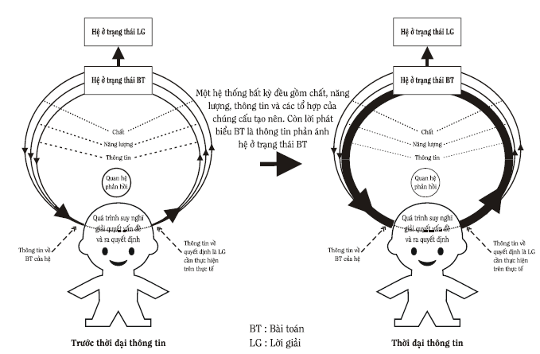

**_Hình 15: Vấn đề biến đổi thông tin thành tri thức ngày càng trở nên cấp bách_**

Giải quyết vấn đề "_thắt nút cổ chai_" là nhiệm vụ của Sáng tạo học nói chung, PPLSTVĐM nói riêng. Nói cách khác, thời đại sáng tạo (tri thức) là thời đại tất yếu sau thời đại thông tin vì chính thời đại thông tin đòi hỏi điều đó.

Do vậy, nếu như: “Cuộc đời của mỗi người là chuỗi các vấn đề cần giải quyết, chuỗi các quyết định cần phải ra” thì có một cách nói nữa: “Cuộc đời của mỗi người là quá trình liên tục biến đổi thông tin thành tri thức, tri thức đã biết thành tri thức mới”. Hàng ngày, thông qua năm giác quan chúng ta nhận được biết bao thông tin. Cuộc đời của chúng ta sướng hay khổ, hạnh phúc hay không… phụ thuộc rất nhiều vào khả năng của chúng ta điều khiển quá trình biến đổi thông tin thành tri thức, tri thức đã biết thành tri thức mới nói trên. Nếu người nhận thông tin không làm được điều này trong thời đại bùng nổ thông tin thì có thể trở thành béo phì (bội thực) về thông tin (do vậy bị stress, trầm cảm, các bệnh tâm thần…). Nhưng người đó đồng thời suy dinh dưỡng (đói) về tri thức, thậm chí, bị ngộ độc vì nhiễu thông tin và chết đuối trong đại dương thông tin mà không khai thác được gì từ đại dương giàu có đó. Người tham gia kinh tế tri thức, nói một cách nôm na, là người có khả năng biến thông tin thành tri thức và tri thức ra tiền. Thông tin có thể đến từ các nguồn khác nhau như Internet, báo, tạp chí, sách… và ngay bên cạnh. Do vậy, không nên quan niệm một cách đơn giản rằng chỉ cần phát triển công nghệ thông tin, trong đó nối mạng thật nhiều, thật rộng, kể cả Internet thì tự động sẽ có kinh tế tri thức và xã hội tri thức. Cốt lõi của vấn đề vẫn là con người với khả năng biến đổi thông tin thành tri thức và tri thức đã biết thành tri thức mới. Về điều này, nhà văn Gorki đã nhấn mạnh từ lâu: "_Sức mạnh và sự giàu có của một dân tộc không phải ở chỗ có nhiều đất đai, rừng, gia súc và các loại quặng quý mà ở số lượng và chất lượng những con người có học thức, ở lòng yêu tri thức, ở sự nhạy bén và năng động của trí tuệ – sức mạnh của một dân tộc không nằm trong vật chất mà nằm trong năng lượng (trí tuệ – Người viết nhấn mạnh)_".

Dưới đây là tóm tắt hai câu chuyện thành công về mặt kinh tế từ việc biến những thông tin đời thường thành tri thức và tri thức ra tiền, không nhất thiết từ Internet.

Báo Tiền Phong Chủ Nhật 9/7/1995 dẫn nguồn nước ngoài thuật lại: Hai vợ chồng Stiven ở ngoại ô thành phố Seatle, Mỹ, sống bằng nghề nông, có một đàn gà đông đúc. Một hôm, trong lúc nằm khểnh xem vợ thịt gà, chợt Stiven nảy ra ý nghĩ sao không lợi dụng những chiếc chân gà bị thải ra vào việc… gãi lưng. Thế là anh liền buộc chiếc chân gà đã được xử lý sạch và sấy khô vào chiếc que để gãi thử. Anh thấy rất khoái, bèn mang đến cơ quan sở hữu trí tuệ để đăng ký sáng chế cho sản phẩm được đặt tên là "_Không nhờ người khác_" của mình. Mỗi chiếc "_Không nhờ người khác_" được bán với giá 5 USD mà các đơn đặt hàng từ khắp nơi cứ tới tấp gởi về. Thế là Stiven ký hợp đồng mua chân gà của một hãng chế biến thịt gà để mở rộng sản xuất. Có lúc nguồn chân gà khan hiếm, Stiven dùng cả chân vịt để làm "_Không nhờ người khác_". Để đáp ứng các khách mua sang trọng, Stiven còn gắn vào chân gà các viên đá quý rồi bán với giá đắt. Hiện nay công việc kinh doanh của Stiven rất phát đạt.

Báo Phụ Nữ 21/7/1993 dựa theo tạp chí Enquirer cho biết: Cô Bonnie cùng chồng và hai con sống tại Tuckerton, New Jersey, Mỹ. Khi bé Jessica, đứa con thứ hai của họ ra đời đã gây rất nhiều bực mình cho mẹ bởi chỉ chực ném chai sữa xuống đất khi được cho bú. Thế mà, khi được cho ôm một con thú nhồi bông, bé bú ngon lành. Nhận ra điều đó, với bàn tay khéo léo của người thợ uốn tóc, Bonnie làm một con thỏ nhồi bông từ vải vụn và chừa một cái lỗ ở giữa để đặt chai sữa của bé Jessica vào và vấn đề của cô Bonnie được giải quyết. Không dừng ở đó, sau khi xin bằng sáng chế, Bonnie cùng chồng tìm đến một nhà chế tạo đồng ý làm những sản phẩm của họ. Ông ta còn tin chắc rằng cửa hàng đồ chơi trẻ em khổng lồ Toys "R" US và các cửa hàng khác sẽ bán chúng. "_Người bạn_" của những chai sữa giờ đây không chỉ là các chú thỏ mà còn là các chú gấu, cô vịt và sắp tới đây xuất hiện… ông khủng long. Trong năm đầu, 50.000 "_chai sữa thú nhồi bông_" được xuất xưởng với giá bán lẻ 10 USD một chai và lợi nhuận từ mạng lưới bán lẻ vào khoảng 100.000 USD. Với thành công ấy, ngày 10/2/1993 Bonnie đã được đề cử vào danh sách các nhà đầu tư nổi tiếng của bang New Jersey.

Tóm lại, mỗi người cần biến đổi thông tin thành tri thức, tri thức đã biết thành tri thức mới bắt đầu từ những gì gần gũi, sát sườn nhất rồi đến những nguồn xa hơn. Tránh trường hợp, người ta chỉ quan tâm những thông tin từ Internet mà coi thường những thông tin ngay bên cạnh mình. Việc sử dụng Internet cũng phải hướng tới biến thông tin thành tri thức (hiểu theo nghĩa tốt đẹp) chứ không phải là phương tiện để truyền bá các thông tin gây nhiễu hoặc thông tin phản tri thức, độc hại.

Nền kinh tế thị trường là hệ thống hoạt động tạo ra hàng hóa (hiểu theo nghĩa rộng nhất) nhằm thỏa mãn các nhu cầu của con người. Trong khi vốn tiền (Money Capital) chỉ phản ánh giá trị của vốn thực (Real Capital). Vốn thực để tạo ra hàng hóa được cấu thành từ nhiều yếu tố sản xuất: tài nguyên thiên nhiên (như các nguyên vật liệu), trang thiết bị, máy móc, nhà xưởng, lao động cơ bắp, năng lượng các loại… và tri thức. Khi các nguồn lực không tái tạo được cạn dần, cộng với sức ép: phải có đầu ra ngày càng nhiều trong khi đầu vào ngày càng ít, nền kinh tế phát triển càng ngày càng phải dựa vào tri thức, một nguồn tài nguyên càng khai thác nhiều thì nó càng có nhiều hơn. Điều này có nghĩa, phần tri thức trong giá thành hàng hóa so với các yếu tố sản xuất khác phải càng ngày càng tăng, trong khi phần các yếu tố sản xuất khác như (vật) chất, năng lượng phải ngày càng giảm. Tri thức, ít ra, bao gồm các loại sau:

1\. Tri thức (các hiểu biết) về các yếu tố sản xuất khác;

2\. Tri thức để sử dụng các tri thức loại 1 (các kỹ năng thực hành, lao động, chuyên môn, nghiệp vụ được dạy trong trường và trong các khóa huấn luyện);

3\. Tri thức mới tìm ra (thường có trong các tạp chí khoa học chuyên ngành, thông tin patent…) cần đưa nhanh vào công nghệ sản xuất;

4\. Tri thức tạo ra những tri thức mới trên cơ sở các thông tin và tri thức đã biết đang có. Để giải quyết vấn đề và ra quyết định rất cần loại tri thức này và đấy chính là PPLSTVĐM.

Trong nền kinh tế tri thức, tri thức trở thành yếu tố so sánh lớn nhất, quyết định sự cạnh tranh của mỗi người, mỗi doanh nghiệp, mỗi quốc gia trong thị trường càng ngày càng mang tính toàn cầu. Đặc trưng nổi bật nhất của nền kinh tế tri thức là tri thức trở thành tài nguyên sản xuất (Productive Resource) quan trọng nhất đóng góp vào tăng trưởng kinh tế và phát triển xã hội của các quốc gia. Nói đến tri thức là nói đến con người, do vậy, kinh tế tri thức là nền kinh tế, ở đó, việc lực lượng lao động chia sẻ, khai thác tri thức đã có, tạo ra, sử dụng tri thức mới để làm giàu, có vai trò nổi trội trong quá trình phát triển với sáng tạo và đổi mới liên tục là động lực của quá trình phát triển đó. Không chỉ dừng ở kinh tế tri thức, nhiều nhà nghiên cứu còn mở rộng hơn đến xã hội tri thức.

Thời đại sáng tạo (tri thức) là thời đại, ở đó đông đảo mọi người sử dụng PPLSTVĐM để biến thông tin thành tri thức. Trong những tri thức này, có những tri thức đem lại tiền bạc, giúp thành công về mặt kinh tế. Nhưng đấy chỉ là một phần, dù rất quan trọng. Ích lợi của PPLSTVĐM biến đổi thông tin thành tri thức là ích lợi toàn diện và suốt cuộc đời của một con người. Nó giúp mỗi người giải quyết tốt các vấn đề gặp phải hoặc đề ra mà không chỉ riêng các vấn đề kinh tế. Do vậy, PPLSTVĐM còn đóng góp vào sự phát triển các lĩnh vực ngoài kinh tế như văn hóa, đạo đức, lối sống… tạo nên sự phát triển xã hội bền vững, hài hòa và nhân đạo hơn hẳn các thời đại trước, xem \@ref(sec:3:2:) Phương pháp luận sáng tạo và đổi mới (PPLSTVĐM) là gì?

### Giáo dục và đào tạo của tương lai: Vài nét phác thảo {#subsec:3:3:4:}
* Từ những gì trình bày trong mục này đến đây, chúng ta thấy, giống như mọi con đường đều dẫn đến La Mã: để biến các thách thức thành cơ hội, để thành công về kinh tế, để có được xã hội phát triển bền vững, hài hòa và nhân đạo hơn, đều đòi hỏi mỗi người phải có các kỹ năng giải quyết vấn đề và ra quyết định (sáng tạo và đổi mới) tốt hơn. Hay nói cách khác, mỗi người cần có các kỹ năng biến đổi thông tin thành tri thức, tri thức đã biết thành tri thức mới tốt hơn so với bất kỳ thời đại nào trước đây. Rõ ràng, hệ thống giáo dục - đào tạo trong xã hội phải là bộ phận chính với trách nhiệm không từ chối được là đào tạo những con người có các kỹ năng nói trên để xây dựng và sống trong tương lai. Rất tiếc, cho đến hiện nay, giáo dục - đào tạo ở trên thế giới nói chung, kể cả ở những nước phát triển chưa đáp ứng được yêu cầu này, thậm chí còn bị bỏ lại phía sau so với các chương trình huấn luyện của các doanh nghiệp. Trong khi đó, tầm quan trọng của giáo dục - đào tạo đã được nhận ra từ lâu. Ví dụ, H.G. Wells nhấn mạnh: "_Lịch sử của loài người càng ngày càng trở thành cuộc chạy đua giữa giáo dục và thảm họa_". Điều này có nghĩa, nếu giáo dục thua thì thảm họa sẽ thắng.

Theo A.B. VanGundy, ở Mỹ, hệ thống giáo dục không dạy tư duy sáng tạo. Để đáp ứng với các thách thức đối mặt, các doanh nghiệp Mỹ phải tự lo huấn luyện các nhân viên của mình trở nên sáng tạo và càng ngày càng nhiều công ty đưa huấn luyện sáng tạo (Creativity Training) vào chương trình hoạt động của mình. Các công ty nhận ra rằng huấn luyện sáng tạo là điều quan trọng đối với tất cả các nhân viên. Ví dụ, Du Pont lập kế hoạch huấn luyện tất cả 140.000 nhân viên của mình trên khắp thế giới về sáng tạo. Nếu như năm 1985 có 4% các công ty Mỹ thực hiện các khóa huấn luyện sáng tạo thì đến năm 1989 đã tăng gấp hơn sáu lần thành 26%. Ngay cả một số chính phủ cũng nhập cuộc như Singapore, Canada và một số nước Châu Âu đòi hỏi các nhân viên chính phủ phải theo học các khóa huấn luyện sáng tạo.

D. Couger cho biết chương trình huấn luyện làm tốt hơn khả năng sáng tạo của các nhân viên có hiệu quả đầu tư trung bình cao hơn cả các chương trình nghiên cứu và phát triển (R&D), cũng như các chương trình về quản lý chất lượng toàn diện (TQM), xem Hình 16. Chưa kể, chương trình sáng tạo nói trên còn tạo ra cơ sở thuận lợi để các chương trình khác phát huy hiệu quả cao hơn nữa.

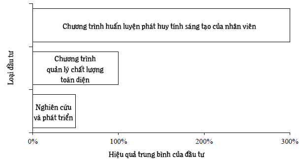

**_Hình 16: Hiệu quả trung bình của các loại đầu tư_**

Tình hình tương tự: hệ thống giáo dục - đào tạo không phải là tổ chức có những hoạt động khởi xướng và đi tiên phong trong việc giảng dạy, trang bị PPLSTVĐM cho mọi người mà là các doanh nghiệp, cũng xảy ra với các nước khác, kể cả các nước xã hội chủ nghĩa như Liên Xô.

Ở Việt Nam, thực tế phổ biến và giảng dạy PPLSTVĐM của Trung tâm Sáng tạo Khoa học - kỹ thuật (TSK) cũng cho thấy, doanh nghiệp các loại (liên doanh, cổ phần, tư nhân, nhà nước), các cơ quan, tổ chức không thuộc ngành giáo dục - đào tạo quan tâm cử người đi học hoặc mời TSK giảng dạy PPLSTVĐM tại chỗ nhiều hơn các trường, đơn vị thuộc ngành giáo dục - đào tạo.

Sau này, chính phủ và những người lãnh đạo hệ thống giáo dục - đào tạo của nhiều nước, khi phát hiện ra chưa đáp ứng được nhu cầu của xã hội cần có đông đảo những con người sáng tạo và đổi mới, đã thực hiện nhiều biện pháp thay đổi, thậm chí, cải cách, làm cách mạng trong lĩnh vực giáo dục - đào tạo.

Đã từ lâu, trong các Nghị quyết của Đảng cộng sản Việt Nam, phần nói về giáo dục và đào tạo đều nhấn mạnh ý "_bồi dưỡng, phát triển năng lực tư duy sáng tạo, năng lực giải quyết vấn đề cho người học_". Những ý này cũng được nhắc đi, nhắc lại bảy lần trong các điều 4, 24, 36 của Luật giáo dục công bố năm 1998. Trong Nghị quyết Hội nghị Trung ương lần thứ sáu, khóa IX, họp tháng 7 năm 2002 còn có hẳn một câu “_tăng cường giáo dục tư duy sáng tạo_”. Nếu giáo dục hiểu theo nghĩa thông dụng là hoạt động dạy và học thì "_tăng cường giáo dục tư duy sáng tạo_" chính là "_tăng cường dạy và học tư duy sáng tạo_". Tuy nhiên những gì làm được còn quá ít đến nỗi, trong Báo cáo của Chính phủ do Phó thủ tướng Nguyễn Tấn Dũng trình bày trước Quốc hội ngày 21 tháng 10 năm 2003 có viết: "… _Điều làm xã hội lo lắng là chất lượng giáo dục từ phổ thông đến đại học nhìn chung còn thấp, cách dạy và học nặng về thuộc lòng, **rất kém tính sáng tạo**…_" (người viết nhấn mạnh). Hay như trong phiên họp Ủy ban thường vụ quốc hội ngày 4 tháng 3 năm 2004, Thứ trưởng Bộ giáo dục và đào tạo Nguyễn Văn Vọng có phát biểu: "… _Bộ đã từng nhìn nhận ba hạn chế, yếu kém của nền giáo dục hiện nay: học mà chưa hiểu (học vẹt), học chưa đi đôi với hành và học mà chưa sáng tạo_…" (người viết nhấn mạnh).

* Dưới đây, người viết trình bày một số ý kiến nhận xét về hệ thống giáo dục - đào tạo truyền thống và hệ thống giáo dục - đào tạo cần có trong tương lai nhìn dưới góc độ Sáng tạo học và PPLSTVĐM.

Như đã biết từ những phần trước, con người có hai loại nhu cầu quan trọng cần thỏa mãn trong suốt lịch sử tiến hóa và phát triển của mình, đó là: nhận thức và biến đổi hiện thực khách quan cũng như chính bản thân mình. Tuy nhiên, hiện thực khách quan và bản thân mình quá phức tạp, con người không thể nhận thức và biến đổi những đối tượng đó một cách "_trọn gói_" và "_một lần_" là xong. Để đối phó, con người sử dụng cách tiếp cận "_chuyên môn hóa_": chia các đối tượng cần nhận thức và biến đổi thành các lĩnh vực chuyên môn dựa trên các tính chất hoặc/và các chức năng giống nhau theo những tiêu chuẩn nhất định làm cho công việc nhận thức và biến đổi của mình dễ dàng, đơn giản hơn. Một lý do nữa thúc đẩy chuyên môn hóa là xã hội cần nhanh chóng có những người làm việc, do vậy, thời gian đào tạo họ phải ngắn mới có ích lợi về kinh tế. Từ đây, nền giáo dục - đào tạo đi theo hướng đào tạo các nhà chuyên môn (Specialists) và ngày càng hẹp để họ nhanh chóng ra trường làm việc trong các lĩnh vực chuyên môn tương ứng. Ví dụ, lĩnh vực tự nhiên thì phân ra vật lý, hóa học, sinh học, địa lý… Đến lượt mình, vật lý lại phân ra cơ học, điện học, quang học… Cơ học lại phân ra cơ học chất rắn, cơ học chất lỏng, cơ học chất khí… tạo nên các lĩnh vực chuyên môn hình rẻ quạt và cách tư duy của các nhà chuyên môn tương ứng, xem Hình 17. Mặt khác, hiện thực khách quan còn có thể phân chia theo những khía cạnh chung, giống nhau giữa các chuyên môn hình rẻ quạt, tạo nên các chuyên môn hình vòng cung (xem Hình 18) và cách tư duy tương ứng của các nhà chuyên môn loại này. Toán học, lý thuyết hệ thống, lý thuyết thông tin, điều khiển học… có thể coi là các lĩnh vực chuyên môn hình vòng cung.

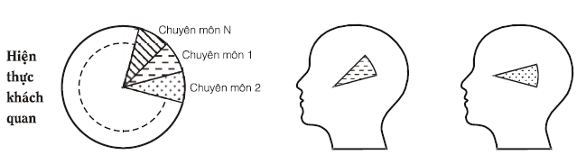

_**Hình 17: Hiện thực khách quan và tư duy của nhà chuyên môn “rẻ quạt”**_

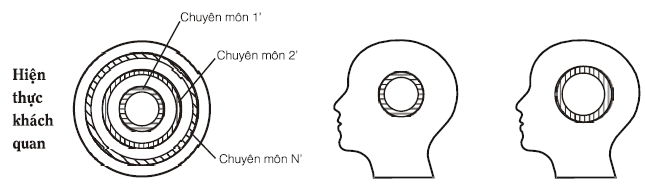

_**Hình 18: Hiện thực khách quan và tư duy của nhà chuyên môn “vòng cung”**_

Cả hai loại tư duy nói trên chỉ phản ánh "_một mẩu_" của hiện thực khách quan chứ không phải chính hiện thực khách quan vốn có, do người học chỉ được học những kiến thức với phạm vi áp dụng hẹp. Về chuyên môn hóa, đặc biệt là chuyên môn hóa sâu, đã từng có nhận xét mang tính triết lý như sau: "_Không ở đâu có thể đào tạo nhà chuyên môn mài mũi kim khâu thật nhọn tốt như ở Mỹ nhưng cũng chính nhà chuyên môn đó không biết rằng đầu kia của cây kim có cái lỗ để xỏ chỉ_". Nói cách khác, nếu ví hiện thực khách quan như là con voi thì các nhà chuyên môn cũng tương tự như những thầy bói mù sờ voi.

Chuyên môn hóa và đào tạo các nhà chuyên môn có nhiều ưu việt khi những giả thiết sau đây là đúng:

1\. Hiện thực khách quan có thể chia thành các lĩnh vực chuyên môn một cách khách quan.

2\. Các lĩnh vực chuyên môn thay đổi chậm theo thời gian.

3\. Các mối liên kết và tương tác giữa các lĩnh vực chuyên môn có thể bỏ qua.

4\. Toàn thể có thể được xem như là phép cộng số học của các thành phần.

Lúc đó, nhà chuyên môn chỉ cần đào tạo một lần, có thể làm việc một cách tự tin, và hiệu quả suốt cuộc đời của mình.

Cùng với các thách thức lớn và các hệ quả của chúng (xem mục nhỏ _\@ref(subsec:3:3:2:)Các khuynh hướng, thách thức và hệ quả)_, các giả thiết nêu trên không còn chấp nhận được nữa vì nhiều lẽ. Ví dụ:

1) Giáo dục - đào tạo, hiểu theo nghĩa truyền thống, có nhiệm vụ truyền thụ kiến thức nhân loại đã biết đến những người học theo các lĩnh vực chuyên môn cụ thể cần cho họ. Những kiến thức này, thực chất là các lời giải của các bài toán mà các thế hệ trước đã giải để thế hệ sau có thể dùng ngay, không cần phải giải lại theo kiểu "_thử và sai_" nữa. Về cơ bản, giáo dục - đào tạo truyền thống không đặt ra mục đích đào tạo một cách bài bản những người giải các bài toán tương lai. Nó cho rằng các lĩnh vực chuyên môn thay đổi chậm theo thời gian nên số lượng bài toán mới ít và chọn lọc xã hội sẽ làm xuất hiện đủ những người giải chúng. Nói cách khác, giáo dục - đào tạo truyền thống đặt mục đích đào tạo các nhà chuyên môn thực hành một nghề nào đó cả đời, trừ nghề giải quyết vấn đề (sáng tạo, đi tìm cái mới, đi từ những kiến thức nhân loại đã biết đến chưa biết).

Thách thức tốc độ thay đổi tăng và ngày càng tăng làm, một mặt, lượng kiến thức nhân loại, khoảng vài năm lại tăng lên gấp đôi. Nếu giáo dục - đào tạo tiếp tục cách tiếp cận truyền thụ kiến thức nhân loại đã biết thì thời gian đào tạo phải càng ngày càng tăng để rồi sẽ dẫn đến vô lý. Mặt khác, giáo dục - đào tạo có nguy cơ lãng phí: đào tạo mà không dùng hoặc ít dùng vì càng ngày càng có nhiều lĩnh vực, ở đó kiến thức chuyên môn "_già_" đi nhanh, thậm chí làm nhiều chuyên môn biến mất. Giáo dục - đào tạo đối phó lại một cách bị động bằng cách mở ra các hình thức đào tạo bổ sung, đào tạo lại, kêu gọi đào tạo và tự đào tạo suốt đời, truyền đạt những lời giải mới tìm ra trong các viện nghiên cứu, trong các trường đại học đến các nhà chuyên môn. Giáo dục - đào tạo vẫn chưa thực sự nhận ra rằng phải đào tạo chính các nhà chuyên môn thành những người tự giải quyết các vấn đề nảy sinh từ các thách thức nói chung vì số lượng các bài toán trên một đơn vị không - thời gian và đầu người ngày càng tăng; thời gian cho phép giải bài toán rút ngắn lại.

2) Việc phải giải ngày càng nhiều loại bài toán mới, có tính phức tạp tăng và đòi hỏi nhiều chuyên môn khác nhau cùng tham gia cho thấy, các giả thiết coi các chuyên môn là độc lập và toàn thể là phép cộng số học không còn đúng nữa. Điều này thể hiện ở chỗ, lời giải của loại bài toán nói trên là lời giải phối hợp của các chuyên môn khác nhau chứ không phải là tổng lời giải của từng chuyên môn. Chưa kể, do các lĩnh vực chuyên môn phụ thuộc, ảnh hưởng lẫn nhau nên nhiều khi lời giải tốt cho lĩnh vực chuyên môn này lại trở nên xấu cho lĩnh vực chuyên môn kia vì phá vỡ các hệ thống cân bằng của hiện thực khách quan, dẫn đến sự phát triển không bền vững.

Giáo dục - đào tạo đối phó một phần bằng cách đào tạo các nhà tổng quát (Generalists) nhằm phối hợp hoạt động của các nhà chuyên môn (Specialists) thuộc các lĩnh vực khác nhau cùng giải bài toán. Những nhà tổng quát được trang bị các kiến thức của các chuyên môn khác nhau, mỗi thứ một ít với hy vọng đủ dùng. Họ là những người điều phối, các nhà quản lý, lãnh đạo, các tổng công trình sư… Hiện thực khách quan phản ánh trong đầu của các nhà tổng quát cùng cách tư duy của họ được mô tả trong Hình 19.

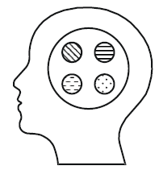

**_Hình 19: Tư duy của nhà tổng quát_**

Hình 19 cũng cho ta thấy, nếu hiện thực khách quan là con voi, tuy nhà tổng quát được học các phần của con voi, nhưng những phần đó mang tính sơ lược và liên kết với nhau một cách rời rạc, méo mó. Do vậy, cách tư duy của nhà tổng quát cũng không phản ánh đúng hiện thực khách quan như hiện thực khách quan vốn có.

Giáo dục - đào tạo nếu tiếp tục đào tạo các nhà chuyên môn (ngày càng sâu) và các nhà tổng quát (ngày càng liên quan đến nhiều chuyên môn) thì vẫn không đối phó với các thách thức hoàn toàn được mà còn dẫn đến điều vô lý trong thời đại bùng nổ thông tin, kiến thức, xem

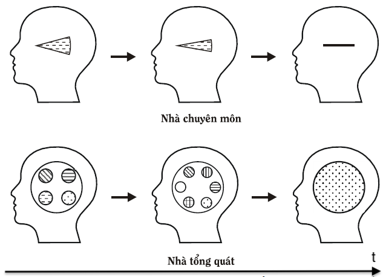

Nhà triết học người Mỹ R.B. Perry nói về điều vô lý này, đại ý như sau: "_Cứ đà này, nhà chuyên môn biết càng ngày càng nhiều về cái càng ngày càng hẹp và cuối cùng nhà chuyên môn trở thành người biết tất cả về không một cái gì cả. Còn nhà tổng quát, ngược lại, biết càng ngày càng nhiều thứ nhưng mỗi thứ biết càng ngày càng ít đi và cuối cùng nhà tổng quát trở thành người không biết gì về tất cả các thứ_". Rõ ràng, các cách tư duy tương ứng của nhà chuyên môn lẫn nhà tổng quát đều không phản ánh chính xác và do vậy, không giúp biến đổi hiện thực khách quan một cách tin cậy với năng suất và hiệu quả cao.

3) Giáo dục - đào tạo thường quá nhấn mạnh những người học như là lực lượng lao động tương lai nên chủ yếu đào tạo nghề làm việc cho họ. Trong khi đó, nếu ta lập tỷ số giữa "_tổng số các vấn đề nghề nghiệp chuyên môn có trong cuộc đời của một người"_ và _"tổng số các vấn đề nói chung có trong cuộc đời của người đó_" và gọi là α, bạn đọc có thể thấy β nhỏ hơn một rất, rất nhiều, nếu như không nói là gần bằng không, vì các lý do như:

> a) Số lượng các vấn đề gặp trong chuyên môn được đào tạo thường chiếm một phần rất nhỏ trong tổng số các loại vấn đề có trong cuộc đời của một con người, kể cả đối với những người làm việc tại những chuyên môn đòi hỏi giải quyết vấn đề khá thường xuyên như trong phòng thí nghiệm nghiên cứu và phát triển, sáng tác văn học, nghệ thuật, âm nhạc… các loại, phá các vụ án…
>
> b) Quan trọng hơn, hầu như không có vấn đề chuyên môn thuần túy, hiểu theo nghĩa chỉ cần một nhà chuyên môn sử dụng những kiến thức, phương pháp chuyên môn đã học ở trường là đủ để giải. Chuyện thường xảy ra là: bài toán chuyên môn thường phải giải tập thể, do vậy, có thể nảy sinh các vấn đề không thuộc chuyên môn như các vấn đề về cách trình bày, trao đổi thông tin, thảo luận, phối hợp hành động, quan hệ giữa các đồng nghiệp với nhau… mà giải quyết không được thì bài toán chuyên môn ban đầu cũng không giải quyết được. Chưa kể, bài toán chuyên môn ban đầu, trong quá trình giải, biến thành bài toán tài chính: phải có tiền mới mua được thiết bị chuyên môn cần thiết, mới có thể thuê thêm nhân công…
>
> c) Các bài toán chuyên môn và không chuyên môn trong cuộc đời của một con người đan quyện với nhau, ảnh hưởng lẫn nhau, trong khi đó, thời gian không thay đổi: một ngày chỉ có 24 giờ. Do vậy, nếu giải các bài toán không chuyên môn mất nhiều thời gian thì thời gian dành cho các bài toán chuyên môn sẽ giảm và số lượng các bài toán chuyên môn có thể nhận giải trong cuộc đời cũng giảm theo. Ví dụ, liệu một người có thể giải quyết nhiều và tốt vấn đề chuyên môn của mình không, nếu như trí óc của người đó còn đang bận tâm với nhiều vấn đề gia đình hoặc bạn bè, đồng nghiệp còn chưa giải xong.

Tóm lại chỉ đào tạo nghề nghiệp chuyên môn là phiến diện, không phù hợp với thực tế công việc và cuộc sống.

4) Cùng với các quyền tự do, dân chủ tăng lên, không chỉ nhu cầu việc làm (kinh tế) mà còn nhiều nhu cầu khác của con người đòi thỏa mãn cũng tăng lên. Hạnh phúc của con người tùy thuộc vào việc các nhu cầu đó là những nhu cầu gì và chúng được thỏa mãn như thế nào. Ngay cả nhà chuyên môn có việc làm, lương cao vẫn phải giải những bài toán ngoài chuyên môn, kể cả những bài toán dù có nhiều tiền có khi cũng không giúp ích gì, như hôn nhân, giáo dục con cái… Các nhà chuyên môn do chỉ được học các kiến thức hẹp, phương pháp hẹp, họ trở nên lúng túng khi phải giải các bài toán ngoài chuyên môn. Với cách đào tạo các nhà chuyên môn như hiện nay, trong cuộc sống, công việc, chúng ta có thể gặp những nhà chuyên môn xuất sắc, nhưng ngoài chuyên môn ra, họ khá bất hạnh. Không phải ngẫu nhiên mà M. Planck nhấn mạnh: "_Chức năng của trường học không phải là cung cấp các kinh nghiệm chuyên môn mà là bồi dưỡng, luyện tập tư duy có phương pháp một cách nhất quán_".

Mặc dù giáo dục - đào tạo của nhiều nước đặt vấn đề đào tạo những con người phát triển toàn diện và thể hiện được hết các tiềm năng của mình nhưng cách hiểu và cách làm "_toàn diện_" thì tương tự như đào tạo các nhà tổng quát: dạy và học mỗi thứ một ít, một cách rời rạc, không tạo nên sức mạnh tổng hợp, thống nhất (hệ thống).

Vậy hệ thống giáo dục - đào tạo cần có phải như thế nào? Dưới đây là vài ý kiến mang tính chất phác thảo nhìn dưới góc độ PPLSTVĐM và sẽ được thảo luận thêm trong mục _\@ref(sec:4:5:) Mở rộng TRIZ và dạy TRIZ mở rộng cho đông đảo mọi người_.

Như đã nhấn mạnh ở trên, hệ thống giáo dục - đào tạo cần chuẩn bị những con người xây dựng, sống và làm việc trong thời đại tri thức bằng cách trang bị cho họ các kiến thức, phương pháp, kỹ năng thực hiện sáng tạo và đổi mới, gọi chung là hệ thống các công cụ sáng tạo và đổi mới, hay cũng chính là PPLSTVĐM. Nếu "_cuộc đời của mỗi người là chuỗi các vấn đề cần giải quyết, chuỗi các quyết định cần phải ra_" thì PPLSTVĐM phải giúp mỗi người làm tốt quá trình suy nghĩ và hành động giải quyết vấn đề nói chung (chứ không chỉ riêng các vấn đề chuyên môn) trong suốt cuộc đời, đem lại các ích lợi như đã nhấn mạnh trong mục _\@ref(sec:3:2:) Phương pháp luận sáng tạo và đổi mới (PPLSTVĐM) là gì?_

PPLSTVĐM phải giúp khắc phục các nhược điểm và bổ sung những gì còn thiếu của hệ thống giáo dục - đào tạo hiện nay. Ví dụ, PPLSTVĐM:

> a) Không chỉ giúp truyền thụ những kiến thức (lời giải các bài toán) nhân loại đã biết mà còn trang bị cho những người học các phương tiện để phát minh, sáng chế ra những cái chưa biết. Về điều này, J. Dewey nhắc nhở: "_Mục đích giáo dục thế hệ trẻ không phải ở chỗ thông tin cho họ các giá trị của quá khứ mà là giúp họ sáng tạo các giá trị của tương lai_".
>
> b) Không chỉ giúp giải quyết tốt các vấn đề nghề nghiệp chuyên môn mà là các vấn đề nói chung có thể xảy ra trong cuộc đời của mỗi người để mỗi người trở nên hạnh phúc và phát triển hết các tiềm năng của mình. Đây là công việc rất khó khăn như L.N. Kogan nhận xét: "_Sáng tạo ở bất kỳ lĩnh vực nào cũng cần vượt khó. Nhưng có lẽ, loại hình sáng tạo phức tạp nhất là sáng tạo cuộc đời (số phận – người viết giải thích) của chính mình_". Mặc dù vậy, đây lại là công việc rất cần thiết phải làm và PPLSTVĐM góp phần thực hiện công việc đó.

Để hoàn thành các nhiệm vụ của mình, PPLSTVĐM phải xây dựng ở người học loại tư duy phản ánh được chỉnh thể thống nhất và các quy luật tiến hóa, phát triển của hiện thực khách quan như nó vốn có, chứ không phải phản ánh theo kiểu tư duy của các nhà chuyên môn hay các nhà tổng quát. Trên Hình 21, tính thống nhất và phát triển của hiện thực khách quan (các tính chất giống nhau, tương tự nhau nhất giữa các lĩnh vực, các quy luật phát triển khái quát nhất, chung nhất) thể hiện dưới dạng ký hiệu "_mạng lưới_" có mặt ở tất cả (hoặc hầu như tất cả) các lĩnh vực chuyên môn. Người học, trước hết, phải được trang bị các kiến thức mạng lưới này vì phạm vi áp dụng của chúng rất rộng. Tiếp theo, tùy công việc cụ thể cần làm, người học sẽ được trang bị cơ bản trong trường và sau này khi đi làm, tự trang bị tiếp các kiến thức riêng của công việc đó thông qua các phương tiện của công nghệ thông tin như đào tạo từ xa, thư viện điện tử, Internet…

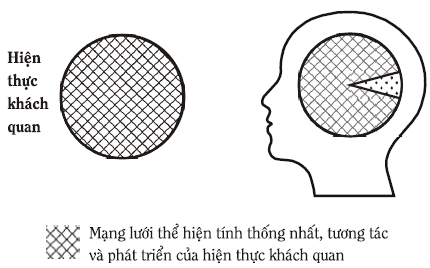

**_Hình 21: Loại tư duy cần có_**

Để dễ hình dung kiến thức mạng lưới (kiến thức về tính thống nhất và phát triển của hiện thực khách quan) nói ở trên, dưới đây, người viết dùng sự tương tự để giải thích:

Nếu xem hiện thực khách quan như con voi thì các nhà chuyên môn hiện nay chỉ được học những kiến thức về từng bộ phận như chân, vòi, tai, đuôi, lưng của cơ thể con voi, do vậy, chúng có phạm vi áp dụng hẹp và phản ánh con voi (hiện thực khách quan) một cách phiến diện, lệch lạc. Trong khi đó, tính thống nhất và phát triển của toàn bộ con voi: thông tin di truyền và đột biến chi tiết từ màu lông, màu mắt, dáng đi… lại có trong mỗi tế bào của con voi, chứ không phải trong tế bào chân chỉ có thông tin về chân… Những thông tin di truyền và những cách đột biến phù hợp với chọn lọc phát triển chính là các kiến thức mạng lưới mà giáo dục - đào tạo phải xác định và trang bị trước tiên cho bất kỳ người nào, sau đó mới là các kiến thức riêng cho công việc cụ thể người đó sẽ làm. Các kiến thức mạng lưới giúp nhà chuyên môn, khi cần, có thể chuyển từ chuyên môn này sang làm việc theo chuyên môn khác dễ dàng, nhanh chóng hơn và các nhà chuyên môn thuộc các chuyên môn khác nhau làm việc với nhau tương hợp hơn nhiều so với hiện nay.

Chúng ta thử tìm hiểu xem trong các cách tiếp cận xây dựng PPLSTVĐM cho đến nay, cách tiếp cận nào có triển vọng nhất trong việc đáp ứng các đòi hỏi nêu trên của giáo dục - đào tạo.
