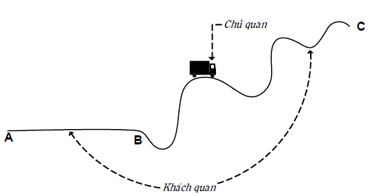
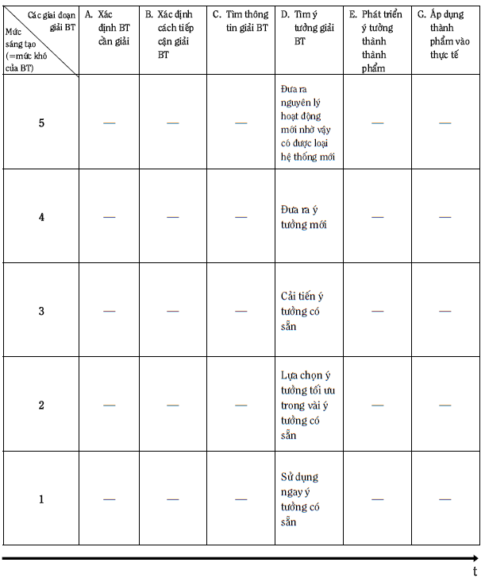
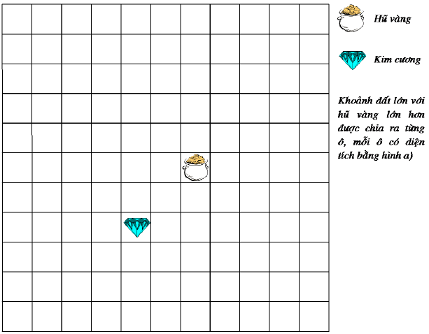
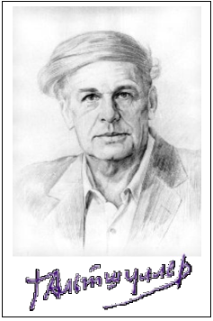
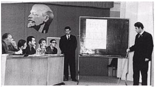
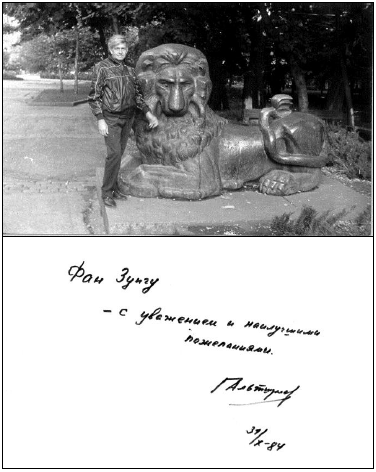

# TỔNG QUAN CÁC KẾT QUẢ ĐẠT ĐƯỢC TRONG LĨNH VỰC PHƯƠNG PHÁP LUẬN SÁNG TẠO VÀ ĐỔI MỚI (PPLSTVĐM)

## Một số cách tiếp cận truyền thống và kết quả {#sec:4:1:}
Cách đây khoảng ba chục thế kỷ, những người Hy Lạp cổ đại đã rất kính trọng và ngưỡng mộ khả năng sáng tạo của con người như đối với các sức mạnh siêu phàm của thiên nhiên. Họ không chỉ nhân cách hóa các đối tượng, quá trình thiên nhiên thành các vị thần mà còn cả các loại hình sáng tạo của con người thành các vị nữ thần kiểu như thơ thì có Nàng Thơ (nữ thần thi ca). Thành công của các nhà thơ, văn, họa sỹ, bác học… phụ thuộc vào những nữ thần ấy. Do vậy, ở thời kỳ này, câu trả lời cho câu hỏi mà PPLSTVĐM rất quan tâm: "_Làm gì để nâng cao năng suất và hiệu quả quá trình sáng tạo của con người?_" được đơn giản hóa thành: "_Hãy cầu nguyện các vị nữ thần gởi cho các cảm hứng và các ý tưởng sáng tạo_".

Những cố gắng "_trần gian_" đầu tiên trả lời câu hỏi nói trên thuộc về Democritus (sống khoảng từ năm 460 đến 370 trước công nguyên) và Aristotle (384 – 322 trước công nguyên) khi xây dựng các quy tắc để có được những cái mới nhờ lập luận đúng trong lĩnh vực lôgích học.

Archimedes (287 – 212 trước công nguyên), ngoài những công trình về toán học, vật lý học, còn được biết đến như là tác giả các phương pháp giúp tạo ra các đối tượng mới từ những thành phần chuẩn. Trong số đó, phải kể đến trò chơi gồm 14 miếng có hình dạng khác nhau làm từ ngà voi mà khi thay đổi cách sắp xếp có thể nhận được nhiều đối tượng như mũ, dao găm, thuyền…

Sau khi Pappos khai sinh Heuristics (Sáng tạo học) đến tận thế kỷ 19, những người quan tâm cải tiến cách tư duy, chủ yếu, vẫn tiếp tục là các nhà triết học, lôgích học và toán học. Điều này có thể hiểu được vì những nhà khoa học nói trên phát triển các lĩnh vực của mình bằng các hoạt động tư duy là chính mà không cần phải làm các nghiên cứu thực nghiệm. Hơn ai hết, họ là những người sớm nhất và cảm nhận mạnh mẽ nhất sự cần thiết phải có các phương pháp tư duy sáng tạo với năng suất và hiệu quả cao.

Từ nửa sau thế kỷ 19 bắt đầu xuất hiện những nghiên cứu về tâm lý học sáng tạo khoa học và kỹ thuật, tâm lý học giải quyết vấn đề và ra quyết định. Cũng từ đó, tâm lý học tư duy sáng tạo được coi là cơ sở, hạt nhân của Sáng tạo học.

Các nghiên cứu về tâm lý học sáng tạo được thực hiện theo nhiều hướng. Ở thời kỳ đầu, các nghiên cứu phần lớn tập trung vào những cá nhân có nhiều thành tích sáng tạo để xem họ có những điểm gì đặc biệt hơn những người khác về bẩm sinh, di truyền, các thói quen, các kinh nghiệm… Ví dụ, có nghiên cứu cho thấy mối liên quan giữa một số bệnh tâm lý và các loại hình tài năng, thành phần máu đặc biệt của một số người, các thói quen chủ quan tạo cảm hứng sáng tạo như: Puskin và Balzac rất thích uống cà phê đen. Schiller luôn để trong ngăn bàn làm việc của mình những quả táo… ủng vì cái “mùi nặng” này rất kích thích ông làm việc. Descartes thích tư duy sáng tạo trong chăn. Trái lại, Buffon chỉ suy nghĩ được một cách rõ ràng sau khi mặc quần áo nghiêm chỉnh và cài nút cẩn thận… Chỉ trong thế kỷ 20, qua các kết quả khoa học, các nhà nghiên cứu mới tin rằng những năng khiếu sáng tạo có ở hầu hết, nếu như không nói là tất cả những người bình thường.

Hướng nghiên cứu khác của tâm lý học sáng tạo là nghiên cứu thực nghiệm: nghiên cứu quá trình suy nghĩ sáng tạo giải quyết vấn đề trong các điều kiện phòng thí nghiệm. Các nhà tâm lý làm thí nghiệm với những bài toán và người giải. Họ phát hiện ra rằng những người tham gia thí nghiệm đã giải chúng bằng cách lựa chọn các phương án (phương pháp thử và sai). Quá trình giải phụ thuộc nhiều vào kinh nghiệm trước đó của người giải. Mỗi phương án sai giúp người giải thay đổi cách xem xét bài toán, hiểu bài toán đúng hơn để cuối cùng đưa ra phương án là lời giải thực sự của bài toán. Các bài toán dùng trong các thí nghiệm tâm lý là những bài toán đơn giản, số các phương án thử không nhiều, thời gian dùng để giải bài toán ngắn. Cách tiếp cận như vậy đối với tư duy sáng tạo gặp phải những khó khăn thực tế không vượt qua được. Quá trình sáng tạo thường kéo dài về mặt thời gian. Chính Edison công nhận, trung bình một sáng chế lớn của ông phải làm mất bảy năm. Vậy nhà tâm lý có đủ kiên trì trong suốt 10 năm theo dõi người giải bài toán và tin chắc rằng năm thứ 11 (chứ không phải 12, 13…) anh ta sẽ giải được. Chưa kể, để càng biết chính xác quá trình suy nghĩ của người giải, nhà tâm lý càng phải đặt nhiều câu hỏi. Càng đặt nhiều câu hỏi cho người giải, càng can thiệp sâu vào quá trình suy nghĩ tự nhiên thì kết quả nghiên cứu càng bị sai lệch. Thêm nữa, mặc dù toàn bộ quá trình sáng tạo kéo dài về mặt thời gian nhưng giai đoạn “Eureka” thường diễn ra nhanh đến mức nhà tâm lý không kịp hỏi và có hỏi thì chính người giải cũng không biết sự việc diễn tiến cụ thể như thế nào để trả lời.

Các nhà tâm lý đồng thời cũng phát hiện nhiều yếu tố, quá trình tâm lý, các kiểu suy nghĩ đóng vai trò quan trọng trong tư duy sáng tạo như ngôn ngữ, ký hiệu, hình vẽ, liên tưởng, trí tưởng tượng, linh tính, tư duy phân kỳ (Divergent Thinking), tư duy hội tụ (Convergent Thinking)… và vạch ra tác hại của các loại tính ì tâm lý cản trở sự sáng tạo.

Cùng với sự phát triển các ngành khoa học, kỹ thuật như lý thuyết hệ thống, thông tin, điều khiển học, máy tính điện tử, nhiều chuyên gia của những lĩnh vực đó cũng tham gia nghiên cứu tư duy sáng tạo và có nhiều đóng góp phát triển Sáng tạo học. Đến nay, trong Sáng tạo học nói chung và PPLSTVĐM nói riêng, cộng đồng các nhà nghiên cứu và thực hành rất đa dạng về ngành, nghề được đào tạo xuất phát. Điều này được giải thích, ít nhất, bởi ba lý do. Thứ nhất, sáng tạo có thể xảy ra ở bất kỳ lĩnh vực nào và bất kỳ lĩnh vực nào cũng cần có nhiều sáng tạo. Nói cách khác, sáng tạo như là đối tượng nghiên cứu và tác động được nhiều người thuộc các lĩnh vực khác nhau quan tâm phát triển, không nhất thiết phải là những nhà sáng tạo học chuyên nghiệp. Thứ hai, sáng tạo là đối tượng phức tạp, do vậy, trước khi tìm ra cách tiếp cận nghiên cứu liên ngành, khái quát, tổng hợp, các cách tiếp cận mang tính chất chuyên ngành thường được sử dụng. Thứ ba, số lượng các cơ sở đào tạo ngay từ đầu những người chuyên nghiệp làm việc trong lĩnh vực Sáng tạo học và PPLSTVĐM còn quá ít, học phí còn quá cao, làm cho nhiều người muốn được đào tạo chính quy lại không đủ điều kiện theo học.

Các cách tiếp cận trong Sáng tạo học và PPLSTVĐM có thể chia thành hai nhóm lớn: Nhóm thứ nhất là nhóm tiếp cận truyền thống: lấy con người – chủ thể sáng tạo – làm đối tượng nghiên cứu và quan niệm rằng đi tìm các quy luật sáng tạo là đi tìm các quy luật tư duy sáng tạo của con người. Cách tiếp cận truyền thống được thể hiện bằng Hình 22.

_**Hình 22: Cách tiếp cận truyền thống trong Sáng tạo học và PPLSTVĐM**_

Đi vào cụ thể, nhóm tiếp cận truyền thống gồm có: cách tiếp cận theo lôgích học hình thức; cách tiếp cận thuần túy tâm-sinh lý (đặc biệt là tâm lý) của bộ não; cách tiếp cận thuần túy về kinh nghiệm, mẹo, thủ thuật của những người thường xuyên làm công tác sáng tạo (đặc biệt những người có nhiều thành tích sáng tạo cao); cách tiếp cận là tổ hợp của các loại cách tiếp cận nói trên; cách tiếp cận kết hợp những kết quả nghiên cứu về sáng tạo của con người với những ưu việt của máy tính điện tử như bộ nhớ lớn, chính xác, tốc độ biến đổi thông tin nhanh… Cách tiếp cận không truyền thống sẽ được trình bày từ mục _\@ref(sec:4:2:) Cách tiếp cận TRIZ: Các ý tưởng cơ bản_ đến hết chương này.

Đến nay nhóm tiếp cận truyền thống đã xây dựng được hàng trăm công cụ (hiểu theo nghĩa rộng nhất: mẹo, thủ thuật, lời khuyên, kinh nghiệm, quy tắc, phương pháp, chương trình, thủ tục, algôrit, mô hình…) sáng tạo nhằm cải tiến phương pháp thử và sai. Chúng nhiều khi còn được gọi chung là các phương pháp tích cực hóa tư duy. Nét chung của các phương pháp này là chúng được tạo ra để phát huy các mặt mạnh của các yếu tố, quá trình như suy luận (tiếp nhận, so sánh, phân loại thông tin, diễn dịch, quy nạp, phân tích, tổng hợp…), liên tưởng, trí tưởng tượng, linh tính, ý thức, tiềm thức, vô thức… và hạn chế các mặt yếu của chúng. Nói cách khác, các công cụ này giúp khắc phục một số nhược điểm của phương pháp thử và sai (xem mục _\@ref(subsec:2:3:2:) Các nhược điểm của phương pháp thử và sai_) như: tính ì tâm lý, năng suất phát ý tưởng thấp, lãng phí lớn và trong một số trường hợp cụ thể, có thể làm tăng tính định hướng của quá trình suy nghĩ giải quyết vấn đề và ra quyết định.

Dưới đây, người viết liệt kê tên một số công cụ thông dụng nhất trong hàng trăm các công cụ tư duy sáng tạo giải quyết vấn đề và ra quyết định tìm ra nhờ những cách tiếp cận truyền thống:

* Phương pháp đối tượng tiêu điểm (Method of Focal Objects hoặc Forced - Relationships). Phương pháp này được giáo sư Đại học tổng hợp Berlin F. Kunze đưa ra dưới dạng ban đầu với tên gọi _phương pháp danh mục (catalogue)_ năm 1926. Vào những năm 1950, phương pháp được nhà bác học Mỹ C. Whiting hoàn thiện thêm.

* Phương pháp phân tích hình thái (Morphological Analysis) do F. Zwicky – nhà vật lý thiên văn người Mỹ gốc Thụy Sĩ đưa ra năm 1942.

* Phương pháp các câu hỏi kiểm tra (Method of Control Questions hoặc Check - listing Method) gồm nhiều loại danh sách các câu hỏi kiểm tra do nhiều tác giả lập ra, dành giải quyết các vấn đề của những lĩnh vực tương ứng. Ví dụ, danh sách các câu hỏi kiểm tra của G. Polya (1945), A. Osborn (1953), T. Eiloart (1969).

* Phương pháp não công (Brainstorming Method) được A. Osborn, nhà doanh nghiệp người Mỹ đưa ra năm 1938.

* Synectics (Phương pháp sử dụng các phép tương tự). Các nghiên cứu Synectics đã có từ năm 1944. Năm 1952, W. Gordon thành lập nhóm Synectics đầu tiên. Năm 1960 nhóm này trở thành công ty “Synectics Incorporated” có trụ sở đặt tại Cambridge, bang Massachusetts, Mỹ. Công ty nhận đơn đặt hàng của các công ty khác để giải quyết các vấn đề của họ và huấn luyện các nhóm sáng tạo chuyên nghiệp cho họ.

* Phương pháp bản đồ trí óc (Mind - mapping Method) được nhà thần kinh học người Anh T. Buzan xây dựng vào những năm 1970.

* Tư duy chiều ngang (Lateral Thinking) do E. De Bono đưa ra đầu những năm 1970.

* Sáu chiếc mũ tư duy (Six Thinking Hats) cũng do E. De Bono đưa ra vào năm 1985.

* Sơ đồ xương cá (Fishbone Diagram) được nhà nghiên cứu người Nhật K. Ishikawa thành lập năm 1943.

* Sơ đồ Pareto (The Pareto Diagram) do nhà kinh tế học người Ý V. Pareto sáng chế ra.

* Phương pháp tư duy định hướng (Метод направленного мышления) của N.I. Xeređa, người Nga, đưa ra năm 1961.

* Phương pháp bảy lần tìm kiếm (Метод семикратного поиска) của G. Ia. Bush, người Nga, đưa ra năm 1964.

* Phương pháp các thủ thuật heuristic (Метод эвристических приѐмов) của A.I. Polovinkin, người Nga, đưa ra năm 1969.

* Phương pháp tiếp cận lôgích – hệ thống giải các bài toán sáng chế (Метод системно – логического подхода к решению изобретательских задач) của V.X. Shubin, người Nga, đưa ra năm 1972.

* Phương pháp các ma trận tìm kiếm bậc mười (Метод десятичных матриц поиска) của R.P. Povileiko, người Nga, đưa ra năm 1972.

* Quá trình giải quyết vấn đề sáng tạo (Creative Problem Solving Process) lần đầu tiên được A. Osborn đưa ra vào cuối những năm 1940 và được các cộng tác viên của Trung tâm nghiên cứu sáng tạo, Đại học Buffalo, bang New York, Mỹ phát triển tiếp cho đến nay.

* Phương pháp phân tích giá thành – chức năng (Функционально – Стоимостной Анализ) gọi theo tiếng Nga, hoặc phương pháp phân tích giá trị (Value Analysis) gọi theo tiếng Anh, được đưa ra vào cuối những năm 1940.

* Quá trình hợp lý giải quyết vấn đề và ra quyết định (Problem Solving and Decision Making Rational Process) do C.H. Kepner và B.B. Tregoe đưa ra đầu những năm 1970. Công ty Kepner–Tregoe, Inc. được thành lập tại thành phố Princeton, bang New Jersey, Mỹ nhằm phổ biến phương pháp này.

* Công cụ ưu thế não của Herrmann (Herrmann Brain Dominance Instrument) do N. Herrmann, nhà vật lý người Mỹ đưa ra năm 1988. Ông cũng là người thành lập The Ned Herrmann Group ở thành phố Lake Lure, bang North Carolina.

* Mô hình IDEAL giải quyết vấn đề (IDEAL Model for Problem Solving) được J.D. Bransford và B.S. Stein, người Mỹ xây dựng, đưa ra năm 1993.

* Nhóm các phương pháp sáng tạo được máy tính hỗ trợ (Computer Assisted Creativity Methods).

Trong quyển sáu của bộ sách "_Sáng tạo và đổi mới_", người viết sẽ trình bày chi tiết một số trong các công cụ vừa nêu ở trên.

## Cách tiếp cận TRIZ: Các ý tưởng cơ bản {#sec:4:2:}
Cách tiếp cận không truyền thống đem lại những kết quả phong phú, thành công nhất trong lĩnh vực PPLSTVĐM được thể hiện rất tập trung trong "_Lý thuyết giải các bài toán sáng chế (TRIZ)_" với G.S. Altshuller là tác giả (xem mục _\@ref(sec:3:1:) Từ Heuristics đến Creatology: Vài nét lịch sử và các Phụ lục 1, 2, 3)_. Trong mục này, người viết trình bày tóm tắt các ý tưởng cơ bản dẫn đến việc xây dựng TRIZ.

### Các quy luật sáng tạo phải tìm chính là các quy luật phát triển {#subsec:4:2:1:}
Theo định nghĩa, sáng tạo phải có tính mới (xem mục _\@ref(sec:1:2:) Một số khái niệm cơ bản và các ý nghĩa của chúng_). Điều này phản ánh: sáng tạo tạo ra sự thay đổi, tạo ra những cái khác với những gì đã có. Tuy nhiên, không phải sự thay đổi nào cũng là sáng tạo vì sáng tạo đòi hỏi sự thay đổi phải đồng thời đem lại ích lợi. Tương tự như vậy, sáng tạo tạo ra sự đa dạng (sự khác nhau), làm tăng tính đa dạng. Ví dụ, nhờ sáng tạo, chúng ta càng ngày càng có nhiều loại bút, dao, kéo, bàn, ghế, xe, máy tính… khác nhau. Tuy nhiên, không phải sự đa dạng nào cũng là sáng tạo nếu như sự đa dạng đó không đem lại ích lợi.

Người ta cũng dễ dàng nhất trí với nhau rằng sáng tạo tạo ra sự phát triển. Đến đây, bắt đầu nảy sinh ý mới so với hai ý (thay đổi và đa dạng nói trên). Phát triển, hiểu theo nghĩa tốt đẹp của từ này, ngoài tính mới (khác với cái cũ, cái đã có, cái đã biết), phát triển phải có những ích lợi, những tiến bộ, những hoàn thiện hơn cái cũ, cái đã có, cái đã biết. Nói cách khác, sáng tạo tạo ra sự phát triển và ngược lại trong sự phát triển có sáng tạo. Vậy, theo G.S. Altshuller, đi tìm các quy luật sáng tạo chính là đi tìm các quy luật phát triển.

Trong khi các cách tiếp cận truyền thống quan niệm: đi tìm các quy luật sáng tạo là đi tìm các quy luật tư duy sáng tạo (các quy luật tâm-sinh lý của bộ não con người, xem Hình 22: Cách tiếp cận truyền thống trong Sáng tạo học và PPLSTVĐM) thì G.S. Altshuller đòi hỏi sự nghiên cứu rộng hơn nhiều.

Từ Vụ nổ lớn (Big Bang) đến nay, vũ trụ nói chung và sau này Trái Đất của chúng ta (bao gồm tự nhiên, xã hội, tư duy) nói riêng đã trải qua biết bao tiến hóa và phát triển. Sự tiến hóa và phát triển này diễn ra theo những quy luật khách quan nhất định. Chúng có thể và cần phải được nhận thức. Về mặt nguyên tắc, nhà sáng tạo học phải nghiên cứu tất cả các thông tin phản ánh sự phát triển nói trên (kể cả những phát triển không có sự tham gia của con người) để tìm ra các quy luật phát triển khách quan chung làm cơ sở xây dựng PPLSTVĐM. Điều này giải thích vì sao trong định nghĩa khái niệm sáng tạo (xem mục _\@ref(sec:1:2:) Một số khái niệm cơ bản và các ý nghĩa của chúng_), từ "_hoạt động_" được dùng với nghĩa rất rộng, chứ không phải nghĩa hẹp "_hoạt động_" của riêng con người. Đấy chính là "_hoạt động tạo ra sự phát triển của bất kỳ đối tượng nào_" và sự phát triển là thuộc tính của vật chất (hiểu theo nghĩa triết học).

### Sáng tạo của con người: Khía cạnh chủ quan và khía cạnh khách quan {#subsec:4:2:2:}
Những sáng tạo của con người, một mặt, mang tính chủ quan vì chúng được tạo ra bởi những con người cụ thể. Mặt khác, những sáng tạo của con người được tự nhiên, xã hội tiếp nhận một cách đầy đủ, ổn định và bền vững mới là những sáng tạo, tạo ra sự phát triển thực sự. Tuy sự phát triển loại này do con người tạo ra nhưng nó vẫn phải tuân theo các quy luật phát triển khách quan chung, bao trùm cả ba lĩnh vực: tự nhiên, xã hội, tư duy và không phụ thuộc vào con người cụ thể.

Đề cập tư duy sáng tạo, những nhà nghiên cứu đi theo cách tiếp cận truyền thống thường nghĩ ngay đến quá trình tâm lý xảy ra bên trong bộ óc người giải bài toán, tập trung mọi chú ý vào đó (xem Hình 22) và suy ra rằng, đi tìm các quy luật sáng tạo tức là đi tìm các quy luật tâm lý chủ quan ấy. Chúng ta thử tưởng tượng tình huống sau:

Chiếc ô tô đi trên con đường với đoạn AB là thẳng và đoạn BC quanh co, uốn khúc, lên dốc, xuống đèo (xem Hình 23). Trên xe có người lái xe và người nghiên cứu. Nhiệm vụ của người nghiên cứu là quan sát, mô tả, tìm hiểu xem: nhờ đâu mà người lái xe có thể đưa xe đi từ A đến B, từ B đến C và rút ra những kết luận cần thiết. Sau đây là bản báo cáo của người nghiên cứu theo cách tiếp cận truyền thống sau chuyến đi:

**_Hình 23: Khía cạnh chủ quan và khía cạnh khách quan trong sáng tạo của con người_**

“Tôi ngồi bên cạnh người lái xe suốt chặng đường từ B đến C, mắt không rời anh ta một giây. Do đó, những điều tôi quan sát được là tuyệt đối đầy đủ. Rõ ràng người lái xe này là người ham hoạt động hơn những lái xe khác mà tôi gặp, ít ra cũng so với những lái xe đưa tôi đi từ A đến B, vì tôi thấy anh hết đánh vô-lăng sang phía bên này lại đánh vô-lăng sang phía bên kia. Không những thế anh còn sang số và thay đổi tốc độ liên tục. Mặt trời lúc thì chiếu sáng má phải của anh, lúc thì má trái. Tốc độ gió lùa vào xe cũng thay đổi. Điều này cho phép tôi giả thiết là anh không chỉ ham hoạt động mà còn thích sưởi nắng cho thật đều khuôn mặt của mình. Sự thay đổi tốc độ gió lùa vào xe là sự thể hiện cảm hứng của người lái xe. Tóm lại, qua nghiên cứu nhiều người lái xe trên nhiều đoạn đường, tôi thấy họ rất đa dạng, tuy nhiên có thể nhấn mạnh điểm chung, đáng lưu ý: họ thích sưởi nắng, thích hưởng gió mát theo sở thích riêng của mình. Không nghi ngờ gì nữa, kết luận trên có thể coi là điều khẳng định, được chứng minh rõ ràng. Từ đó suy ra: để người lái xe làm việc tốt cần tạo điều kiện để họ thỏa mãn các sở thích riêng”.

Tình huống và bản báo cáo tưởng tượng nói trên phản ánh sự tương tự với những tình huống, ở đó nhà tâm lý nghiên cứu xem người giải suy nghĩ và hành động như thế nào để đi từ bài toán đến lời giải (như những người lái xe đưa xe đi từ A đến B, từ B đến C). Chúng ta hãy cùng "_mổ xẻ_" chúng:

Người lái xe, muốn lái xe đến đích phải nhìn rõ đường và đưa xe đi đúng tuyến đường. Con đường đối với người lái xe là khách quan, độc lập đối với anh ta. Trên đoạn đường BC quanh co uốn khúc, lên dốc xuống đèo, người lái xe không thể làm gì khác hơn là phải bẻ tay lái, lúc sang trái, lúc sang phải và thay đổi số nhiều lần… Người nghiên cứu theo cách tiếp cận truyền thống không chú ý đến khía cạnh khách quan đó mà chỉ tập trung vào người lái xe (khía cạnh chủ quan) theo kiểu "_mắt không rời anh ta một giây_" (xem Hình 22). Nhà nghiên cứu xem những hoạt động tư duy – tâm lý của người lái xe là điều quyết định để lái được xe từ B đến C, thậm chí, lầm lẫn giữa bản chất và hiện tượng (_"thích sưởi nắng cho thật đều khuôn mặt của mình", "cần tạo điều kiện để họ thỏa mãn các sở thích riêng"_).

Khái quát hóa lên, ta có thể coi trong sáng tạo của con người có hai khía cạnh: chủ quan và khách quan. Trong đó, những quy luật phát triển khách quan của sự vật là gốc, tương tự như con đường đối với người lái xe: anh phải đi theo tôi, nếu không anh sẽ không đến đích, thậm chí bị tai nạn. Ví dụ, trên đoạn đường thẳng AB, người lái xe nếu "_hết đánh vô lăng sang phía bên này lại đánh vô lăng sang phía bên kia_" thì không chỉ lạc đường, xe có thể lăn xuống ruộng. Ở đoạn BC quanh co, uốn khúc, lên dốc, xuống đèo, nếu người lái xe giữ tay lái thẳng thì xe đâm xuống vực. Phải chăng phương pháp thử và sai (xem các mục _\@ref(sec:2:2:)Phương pháp thử và sai_ và _\@ref(sec:2:3:) Các ưu và nhược điểm của phương pháp thử và sai_) có nhiều phép thử – sai mò mẫm với những "trả giá", "tai nạn" của người giải trước khi đi đến lời giải đúng của bài toán là do người giải không nhìn thấy con đường – quy luật phát triển khách quan.

G.S. Altshuller cho rằng các nhà sáng tạo học phải ưu tiên đi tìm những quy luật phát triển khách quan (những con đường) và người sáng tạo tốt là người sau khi nắm các quy luật nói trên biết điều khiển tư duy và hành động đi theo chúng, tương tự như người lái xe thấy rõ đường và đưa xe đi đúng đường. Về điều này, Lê-nin đã từng nhắc nhở: "_Biện chứng của sự vật (khách quan – người viết nhấn mạnh) tạo lập biện chứng của ý tưởng (chủ quan – người viết nhấn mạnh), chứ không phải ngược lại_".

### Cơ chế định hướng và tư duy định hướng {#subsec:4:2:3:}
Trong các nhược điểm của phương pháp thử và sai (xem mục _\@ref(subsec:2:3:2:) Các nhược điểm của phương pháp thử và sai_) có nhược điểm "_thiếu cơ chế định hướng từ bài toán đến lời giải_".

Giả sử chúng ta đã tìm ra cơ chế định hướng rồi (xem Hình 24), thì sao?

**_Hình 24: Phương pháp thử và sai cần cơ chế định hướng_**

Rõ ràng lúc đó, người giải chỉ cần tập trung thử những phép thử theo chiều của cơ chế định hướng, không thử những phép thử ngược với cơ chế định hướng. Nói cách khác, nhược điểm "_lãng phí lớn_" được khắc phục một cách đáng kể.

Mặt khác, vì biết lời giải nằm ở hướng nào, người giải có được "_chuẩn_", "_điểm tựa_" để không cho tính ì tâm lý lôi kéo suy nghĩ của mình về phía quen thuộc, đã biết. Nói cách khác, cơ chế định hướng giúp khắc phục nhược điểm "_tính ì tâm lý cản trở sáng tạo_".

Nhờ cơ chế định hướng, nhược điểm "_năng suất phát ý tưởng thấp_" cũng được khắc phục. Bởi vì, cơ chế định hướng làm cho việc phải có thật nhiều ý tưởng để tăng xác suất có ý tưởng dẫn đến lời giải, không còn cần thiết nữa. Điều này cũng tương tự như không có định hướng, để trúng mục tiêu thì phải ném bom trải thảm, một quả trong số đó có thể trúng mục tiêu. Định hướng tốt, lúc đó chỉ cần một tên lửa thông minh.

Cũng chính cơ chế định hướng giúp người giải có những tiêu chuẩn khách quan để đánh giá "_đúng_", "_sai_".

Như vậy, nhược điểm "_thiếu cơ chế định hướng từ bài toán đến lời giải_" là nhược điểm cơ bản nhất của phương pháp thử và sai và là thủ phạm chính làm nảy sinh những nhược điểm khác.

Theo G.S. Altshuller, chính các quy luật phát triển khách quan, khi được phản ánh trong tư duy của người giải bài toán, sẽ đóng vai trò cơ chế định hướng nói trên. Nói cách khác, các cách tiếp cận truyền thống, chủ yếu, nhắm vào khắc phục các nhược điểm không phải cơ bản nhất của phương pháp thử và sai như "_tính ì tâm lý cản trở sáng tạo_", "năng suất phát ý tưởng thấp". TRIZ tập trung nỗ lực vào việc xây dựng cơ chế định hướng từ bài toán đến lời giải và càng ngày càng hoàn thiện cơ chế đó nhằm giúp người giải bài toán có tư duy định hướng. Hình 25 cho thấy hình ảnh lý tưởng của cơ chế định hướng: lúc này chỉ cần một phép thử là chắc chắn có lời giải.

**_Hình 25: Cơ chế định hướng lý tưởng_**

Người ta thường chỉ tiệm cận đến cái lý tưởng trong trường hợp chung. Tuy nhiên, trong một số trường hợp cụ thể, người ta có thể đạt được lý tưởng. Điều này đã xảy ra trên thực tế, trước khi có TRIZ. Ví dụ, trước đây khi cần giải phương trình bậc hai:

$ax^2 + bx + c = 0$  (1)

người ta cần biến đổi thành phương trình tích:

$(x − d)(x − e) = 0$  (2)

từ đó rút ra nghiệm x1 = d và x2 = e

Ở thời kỳ này, phương pháp thông dụng để biến phương trình (1) thành phương trình (2) là phương pháp thử và sai, phụ thuộc rất nhiều vào "_tư chất_" của người giải và các con số a, b, c cụ thể. Để đi đến lời giải, số lượng các phép thử – sai có thể rất lớn.

Sau khi có "_cơ chế định hướng_", người giải bằng "_tư duy định hướng_" chỉ cần thực hiện một phép thử là chắc chắn dẫn đến lời giải. Phép thử đó là:

$$\Delta=b^{2}-4 a c$$ $$x_{1}=\frac{-b+\sqrt{\Delta}}{2 a} \quad ; \quad x_{2}=\frac{-b-\sqrt{\Delta}}{2 a}$$

### Phát triển của con người: Năng lực cơ thể hay/và công cụ {#subsec:4:2:4:}
Trong thế giới sinh vật, sự tiến hóa và phát triển của các loài vật, trước hết và chủ yếu là sự tiến hóa và phát triển các năng lực cơ thể để, một mặt, thích nghi hơn với môi trường (nếu môi trường không thay đổi), mặt khác, đối phó với những thay đổi của môi trường. Sự phát triển tự nhiên kiểu này diễn ra rất dài về mặt thời gian. Ví dụ, tổ tiên của loài ngựa là một loại thú nhỏ, chân có năm ngón, những ngón đó lại có vuốt nhọn, giúp ích cho nó đi dễ dàng trên mặt đất gồ ghề trong rừng. Khi các rừng cây thưa thớt dần, nhường chỗ cho các thảo nguyên, tổ tiên của ngựa bắt buộc phải đi ra những chỗ trống trải. Ở đó, nếu gặp nguy thì không có chỗ ẩn nấp: chỉ còn cách thoát nạn là chạy trốn. Các bộ phận cơ thể của tổ tiên ngựa dần thay đổi: chân dài ra, chỉ còn lại có một ngón với móng rất cứng để chạy nhanh. Tương ứng với chân dài, cổ cũng dài ra để gặm được cỏ. Răng ngựa cũng biến đổi để có thể nghiền nát nhanh những thứ cỏ cứng mọc trên thảo nguyên. Sự phát triển các năng lực cơ thể của ngựa như chân, cổ và hàm răng đã trải qua thời gian năm mươi triệu năm mới hoàn thành và trả giá bằng rất nhiều cá thể bị chọn lọc tự nhiên đào thải.

Tổ tiên của con người với tư cách động vật, lúc đầu cũng phát triển theo cách tự nhiên nói trên nhờ biến dị, di truyền, sàng lọc một cách mò mẫm, bị động và kéo dài về mặt thời gian. Bước ngoặt xảy ra khi con người bắt đầu sử dụng các công cụ là những phương tiện nằm ngoài cơ thể người. Những công cụ đầu tiên là những công cụ trong thiên nhiên như lửa từ núi lửa hay những đám cháy rừng, hòn đá, cành cây có sẵn với hình dạng thích hợp được hoàn thiện thêm đôi chút. Lúc này, phát triển của con người bao gồm cả phát triển các năng lực của cơ thể và công cụ. Tiếp theo, con người tự sáng chế ra các công cụ (hiểu theo nghĩa rộng nhất) không có sẵn trong thiên nhiên với hàm lượng tri thức ngày càng cao.

Thực tế phát triển của con người cho thấy, những thành tựu đạt được qua các thời đại, chủ yếu, là nhờ con người sáng chế ra và làm việc bằng các công cụ ngày càng hoàn thiện hơn trước chứ không phải do năng lực cơ thể (tâm-sinh lý) của con người cao hơn trước. Nếu loài người đứng trước sự lựa chọn: nâng cao năng lực cơ thể hoặc chế tạo công cụ, loài người chọn cách thứ hai để có được sự phát triển rộng rãi và nhanh chóng. Ví dụ, để giải quyết vấn đề đi nhanh, loài người không đi theo hướng nghiên cứu cơ thể để đề ra các phương pháp luyện tập nhằm đạt mục đích đi nhanh (nếu có, chỉ dành cho một số rất ít người là các vận động viên thể thao). Loài người sáng chế ra các công cụ là các loại xe mà bất kỳ người bình thường nào cũng có thể sử dụng để đi nhanh. Tương tự như vậy, để nhìn xa, loài người không đi theo hướng nghiên cứu mắt và xây dựng các phương pháp luyện tập mắt để làm tăng năng lực của mắt mà chế tạo ra công cụ là ống nhòm. Lúc này, mỗi người bình thường chỉ cần đưa ống nhòm lên mắt là lập tức nhìn rất xa.

Có vài điểm cần đặc biệt lưu ý đối với việc loài người nghiên cứu và phát triển công cụ. Thứ nhất, nguyên lý hoạt động của công cụ chủ yếu và thường được xây dựng dựa trên các quy luật khách quan độc lập với cơ thể của con người. Ví dụ, nguyên lý hoạt động của ống nhòm dựa trên các quy luật về quang hình học, nguyên lý hoạt động của các động cơ nhiệt dựa trên các quy luật nhiệt động lực học. Thứ hai, chỉ đến giai đoạn chuẩn bị đưa công cụ ra áp dụng đại trà, các nhà thiết kế mới tính đến những đặc điểm cơ thể của con người sử dụng công cụ.

Từ những gì trình bày ở trên, cách tiếp cận của TRIZ: xây dựng PPLSTVĐM dựa trên các quy luật phát triển khách quan độc lập với cơ thể con người, rõ ràng phù hợp với cách xây dựng công cụ của loài người hơn là những cách tiếp cận truyền thống. Nói như vậy, không có nghĩa các quy luật tâm – sinh lý bị bỏ qua. Trái lại, các quy luật tâm – sinh lý quan trọng ở chỗ, giúp các nhà nghiên cứu thiết kế, xây dựng PPLSTVĐM thân thiện với người sử dụng, hiểu theo nghĩa, phù hợp với những đặc thù của tâm – sinh lý con người. Mặt khác, các quy luật tâm – sinh lý còn giúp người sử dụng PPLSTVĐM biết cơ sở tâm – sinh lý của tư duy để có thể điều khiển tư duy của mình phát các ý tưởng sáng tạo và đổi mới hướng theo các quy luật khách quan về sự phát triển sự vật, chứ không phải phát các ý tưởng bị chi phối bởi các yếu tố tâm – sinh lý chủ quan.

### Quan hệ giữa tài năng và công cụ {#subsec:4:2:5:}
Tài năng của một người cụ thể thường được hiểu là khả năng của người đó thực hiện một công việc cho trước xuất sắc hơn hẳn những người khác. Ở thời kỳ chưa có công cụ hoặc ở những lĩnh vực không được phép dùng công cụ như một số môn thể thao (chạy, bơi, đá bóng…), hát, múa…, tài năng chính là những năng lực cơ thể ở mức độ cao. Những tài năng kiểu này có được là nhờ bẩm sinh hoặc nhờ luyện tập một cách đặc biệt công phu mà không phải ai cũng có thể theo đến cùng được. Theo G.S. Altshuller, sự xuất hiện của công cụ và việc loài người chọn phát triển công cụ là con đường phát triển xã hội chứ không phải phát triển các năng lực cơ thể, làm thay đổi cách hiểu về tài năng nói trên.

Chúng ta thử tưởng tượng ở thời kỳ lịch sử chưa có công cụ là cái com-pa, người ta tổ chức cuộc thi vẽ vòng tròn bằng tay không, xem ai vẽ vòng tròn tròn nhất. Khả năng vẽ vòng tròn bằng tay không ở những người khác nhau là khác nhau: người vẽ vòng tròn như quả trứng, người vẽ méo xẹo, người không nối kín được hai đầu nét vẽ lại với nhau… Lúc đó, ai vẽ vòng tròn tròn nhất được đánh giá là có tài năng (năng lực cơ thể) cao nhất. Sau khi com-pa (công cụ) được sáng chế ra, bất kỳ người bình thường nào, trải qua huấn luyện và luyện tập mà ai cũng có thể tiếp thu được, đều vẽ vòng tròn tròn nhất một cách dễ dàng. Nói cách khác, công cụ giúp san bằng tài năng đã có, giúp tất cả những người bình thường có thể làm được công việc, trước đó chỉ có những người tài năng mới làm được.

Có công cụ rồi, xuất hiện khái niệm tài năng cụ thể mới. Chẳng hạn, khi đã có com-pa, người ta mở cuộc thi xem ai trong một phút vẽ được nhiều vòng tròn nhất. Khả năng dùng com-pa vẽ vòng tròn nhanh ở những người khác nhau thì khác nhau. Người vẽ nhiều vòng tròn nhất trong thời gian một phút, ở thời kỳ lịch sử mới, được đánh giá có tài năng nhất. Bạn đọc có thể đoán ra, người đó chưa chắc đã phải là người vẽ vòng tròn bằng tay không tròn nhất ở thời kỳ lịch sử cũ. Như vậy, công cụ không chỉ san bằng tài năng (vẽ tròn), thay đổi nội dung tài năng cụ thể (vẽ tròn thành vẽ nhanh) mà còn đào thải và làm đổi ngôi tài năng: Người vẽ vòng tròn bằng tay không tròn nhất không còn được xã hội đánh giá cao, thậm chí, có khi thất nghiệp ở thời kỳ lịch sử mới với những người khác được coi là tài năng. Ở đây, rất cần loại khả năng sử dụng các công cụ mới một cách thành thạo nhất có thể có.

Khi chưa có công cụ, các bộ phận trên cơ thể người phải thực hiện các chức năng sau: 1) Tạo ra năng lượng; 2) Truyền dẫn năng lượng đó đi khắp các bộ phận để cơ thể hoạt động; 3) Các chức năng làm việc như chân đi, tay nắm bắt, các giác quan tiếp nhận thông tin; 4) Điều khiển cơ thể; 5) Sáng tạo.

Những công cụ thủ công đầu tiên như hòn đá, cái gậy đánh dấu con người bắt đầu chuyển giao chức năng làm việc cho công cụ. Chiếc máy đầu tiên thực hiện các chức năng 1, 2, 3, sử dụng năng lượng ngoài cơ thể, có bộ phận truyền động và bộ phận làm việc của mình, đánh dấu bắt đầu giai đoạn cơ khí hóa. Lúc này, con người còn giữ lại chức năng điều khiển (kể cả điều khiển công cụ) và sáng tạo. Sang giai đoạn tự động hóa, con người dần chuyển giao phần chức năng điều khiển công cụ cho chính công cụ.

Các công cụ nói trên không chỉ giúp khai thác tốt hơn, thay đổi, khuếch đại các năng lực của cơ thể mà còn tạo ra những năng lực mới. Ví dụ, năng lực cơ thể không làm cho con người bay được nhưng máy bay (công cụ) lại làm cho con người bay cao, bay xa, bay nhanh hơn bất cứ loài chim nào.

PPSLTVĐM là hệ thống các công cụ dành cho chức năng thứ năm: Sáng tạo, chính xác hơn, tư duy sáng tạo. Những công cụ này giống những công cụ đã có về các mặt sau: Được xây dựng dựa trên các quy luật khách quan; có thể dạy và học cách sử dụng cho đông đảo mọi người; đem lại các ích lợi lớn cho người sử dụng. Khi nói "_đem lại các ích lợi lớn cho người sử dụng PPLSTVĐM_", bạn đọc không nên nghĩ rằng, nhờ PPLSTVĐM, người sử dụng sẽ trở thành Edison, Newton, Einstein. Đúng hơn, bạn nên quan niệm thế này, trước đây đi bộ nên tốc độ đạt được là 4 km/giờ. Nay nhờ công cụ là cái xe đạp, mình đi nhanh hơn trước, ví dụ, 10 km/giờ. Nếu mình luyện tập sử dụng xe đạp tốt hơn, mình sẽ đi nhanh hơn nữa. Tuy vậy, không nên ảo tưởng rằng với cách sử dụng xe đạp ngày càng tốt, bạn sẽ đạt được vận tốc của máy bay. Ngoài ra, để đạt được những sáng tạo mức cao, kiểu như giải Nobel, ngoài PPLSTVĐM và khả năng cá nhân sử dụng tốt PPLSTVĐM, còn cần các điều kiện của môi trường mà không phải ai cũng có (xem tiếp mục nhỏ _\@ref(subsec:4:2:6:) Các mức sáng tạo – các mức khó của bài toán_). Ví dụ, bạn có công cụ là xe đua với khả năng chạy đến tốc độ trên 200 km/giờ nhưng nếu môi trường của bạn là đường đất có nhiều ổ gà, ổ voi thì bạn không thể nào đạt được vận tốc cho phép. Trong khi đó, cũng với xe đua như vậy, người khác ở môi trường khác (xa lộ hoàn hảo) có thể đạt được tốc độ tối đa một cách dễ dàng.

Mặt khác, PPLSTVĐM cũng có những đặc thù riêng so với các loại công cụ truyền thống, đòi hỏi phải tính đến trong quá trình nghiên cứu, xây dựng, dạy và học sử dụng PPLSTVĐM. Chẳng hạn, PPLSTVĐM là hệ thống các công cụ dành cho tư duy sáng tạo mà tư duy sáng tạo lại là đối tượng không nhìn thấy như tay, chân, mắt…

### Các mức sáng tạo – các mức khó của bài toán {#subsec:4:2:6:}
Khi bạn hỏi một người: "_Anh đang làm gì?_" và nghe câu trả lời "_Tôi đang đi săn_", có thể, bạn vẫn chưa hài lòng. Bạn muốn tìm hiểu tiếp: "_Săn gì? Bằng những công cụ gì?_". Đối tượng săn có thể là muỗi, gà rừng, hươu, nai, gấu, hổ… cá voi và tương ứng với chúng, các công cụ săn cũng khác nhau. Rất tiếc, các cách tiếp cận truyền thống thường không đề cập cụ thể đến sự đa dạng của đối tượng tư duy sáng tạo là các bài toán mà sự khác nhau của chúng không hề thua kém sự khác nhau giữa muỗi và cá voi.

G.S. Altshuller cho rằng các bài toán khác nhau, trước hết, về mức độ khó (tương tự như săn cá voi khó hơn là săn muỗi) và giữa mức khó của bài toán cho trước và mức sáng tạo của người giải được nó, có sự tương đương. Điều này có nghĩa, một người giải thành công bài toán có mức khó 3, được đánh giá có mức sáng tạo 3 và ngược lại một người được đánh giá có mức sáng tạo 4, được hiểu là bài toán anh ta giải thành công có mức khó là mức 4. Trên thực tế, để đảm bảo khách quan, tin cậy, mang tính chính thức, G.S. Altshuller nghiên cứu một số lượng rất lớn các sáng tạo đã được cấp patent và phân chúng ra thành năm mức sáng tạo (hay còn gọi là năm mức khó của bài toán) với mức thấp nhất là mức một và mức cao nhất là mức năm, dành cụ thể cho mỗi giai đoạn trong sáu giai đoạn của quá trình thực hiện giải bài toán (xem mục _\@ref(sec:1:2:) Một số khái niệm cơ bản và các ý nghĩa của chúng_). Dưới đây, năm mức sáng tạo (năm mức khó của bài toán) được trình bày, nhìn từ những góc độ khác nhau:

1\. Nhìn theo "tính mới": Trên Hình 26, để tránh rườm rà, các tiêu chuẩn "tính mới" chỉ được viết một cách chi tiết cho giai đoạn D. Tìm ý tưởng giải BT. Bạn đọc cần hiểu rằng những tiêu chuẩn về tính mới đó đều đúng với các giai đoạn khác.

**_Hình 26: Bảng phân loại theo tính mới_**

Dưới đây là các ví dụ về năm mức sáng tạo:

**Mức 1**: Patent Mỹ số 3432874 mà nội dung của nó được mô tả trên Hình 27. Tiền thân (xem Hình 27a): khi ngâm bút vẽ trong nước để làm rã bột màu trước khi rửa, trọng lượng của bút vẽ làm cong các sợi lông dẫn đến giảm chất lượng bút vẽ. Cải tiến: Phao giữ cho bút vẽ nổi lơ lửng trong nước, nhược điểm của bút vẽ tiền thân được khắc phục, xem Hình 27b.

Sáng chế này được xếp mức một ở giai đoạn D vì ý tưởng: dùng phao giữ cho một vật nổi là ý tưởng có sẵn (mọi người đều biết), chỉ có cái, trước đó, chưa ai dùng ý tưởng này cho bút vẽ.

**_Hình 27: Bút vẽ nổi trong nước_**

**Mức 2**: Có vài ý tưởng có sẵn, mới thoạt nhìn, chúng có vẻ tương đương, dùng để giải bài toán cho trước. Người giải phải suy nghĩ để chọn ra ý tưởng tối ưu. Ví dụ, để làm nguội một chi tiết trong một thiết bị, người ta có thể làm nguội bằng trao đổi nhiệt giữa chi tiết và không khí (lúc đó cần thiết kế chi tiết có diện tích bề mặt tiếp xúc lớn); có thể làm nguội bằng không khí chuyển động (dùng quạt); có thể làm nguội bằng không khí lạnh; có thể làm nguội bằng nước. Chọn được ý tưởng tối ưu, sáng tạo được xếp ở mức hai.

**Mức 3**: Người giải góp phần cải tiến ý tưởng có sẵn. Ví dụ, dùng dao để cắt cao su là ý tưởng có sẵn. Công ty “Zengl” (Đức) cải tiến đưa ra loại dao nhiệt: Dao được cắm vào ổ điện 220V và 10 giây sau, nó đạt đến nhiệt độ 400oC, cắt cao su dễ dàng như cắt bơ.

**Mức 4**: Ví dụ, bằng tác giả sáng chế số 163559 của Liên Xô với nội dung sau: “Để kịp thời nhận được tín hiệu báo sự cố đối với những mũi khoan sâu (như gãy mũi khoan), người ta đặt vào bên trong mũi khoan một ống chứa hợp chất hóa học, có mùi đặc biệt. Khi mũi khoan bị mòn đến mức nào đó hoặc bị gãy, chất nói trên thoát ra ngoài và những người thợ khoan trên mặt đất sẽ nhận biết kịp thời”. Sáng chế này được xếp vào mức 4 vì đưa ra ý tưởng phát hiện, kiểm tra mới: dùng mùi.

Trước sáng chế này, các hệ thống báo sự cố đều dùng các ý tưởng về âm thanh (còi, chuông báo động…) và ánh sáng (đèn đỏ nhấp nháy…). Đây là sáng chế đầu tiên đưa ra ý tưởng dùng mùi để báo sự cố, do vậy, được xếp mức bốn. Lưu ý bạn đọc, sau tác giả của sáng chế nói trên, những người khác có thể đưa ra những hợp chất hóa học có mùi dễ phát hiện hơn thì mức sáng tạo của họ rớt xuống mức ba: cải tiến ý tưởng có sẵn. Mức bốn chỉ dành cho những ý tưởng đăng ký lần đầu tiên.

**Mức 5**: Từ thuyền chèo tay chuyển sang thuyền buồm, từ thuyền buồm chuyển sang tàu thủy máy hơi nước có sự chuyển từ nguyên lý hoạt động này sang nguyên lý hoạt động khác. Tương tự như vậy, bạn đọc có thể thấy sự thay đổi nguyên lý hoạt động của các đối tượng sau: đèn dầu hỏa, bóng đèn điện dây tóc, bóng đèn neon; khinh khí cầu, máy bay cánh quạt, máy bay phản lực; bóng đèn điện tử chân không, bóng đèn điện tử bán dẫn; máy tính cơ học, máy tính điện tử…

Sáng tạo mức năm là sáng tạo ra nguyên lý hoạt động mới trước đây chưa có, nhờ vậy, có được hẳn loại hệ thống mới.

Công thức một bài toán giải xong có dạng:

Aa – Bb – Cc – Dd – Ee – Gg, trong đó a, b, c, d, e, g = 1 ÷ 5

Nếu nhìn tổng quát cả bài toán chứ không theo từng giai đoạn của quá trình giải bài toán, người ta quy ước rằng, chỉ số cao nhất có trong công thức trên sẽ ứng với mức khó của toàn bộ bài toán đó.

Đối với bài toán cụ thể, các chữ a, b, c, d, e, g là các con số cụ thể. Chúng ta thử cùng giải mã bài toán cụ thể có công thức sau:

A1 – B2 – C3 – D4 – E3 – G2

A1: có nghĩa đây là bài toán có sẵn.

B2: lựa chọn cách tiếp cận tối ưu trong vài cách tiếp cận có sẵn.

C3: thông tin được xử lý lại (cải tiến) mới giúp giải bài toán.

D4: ý tưởng mới, trước đây chưa có.

E3: cải tiến cách có sẵn để phát triển ý tưởng thành thành phẩm.

G2: chọn cách áp dụng tối ưu trong vài cách có sẵn để áp dụng thành phẩm vào thực tế.

Số 4 là chỉ số cao nhất trong các chỉ số nên toàn bộ bài toán trên được coi là có mức khó là mức bốn.

2\. Nhìn theo "_phương pháp thử và sai_", cụ thể theo:

(xem mục _\@ref(sec:2:3:) Các ưu và nhược điểm của phương pháp thử và sai_)

**_Hình 28: Bảng phân loại theo α_**

Như vậy, α càng lớn, bài toán càng khó giải. α = ∞ được hiểu: khi chưa có các tiền đề cần thiết thì dù thử đến vô cùng các phép thử, bài toán cho trước cũng không thể giải được. Ví dụ, bài toán điện thoại di động không thể có lời giải trước khi con người có những kiến thức cần thiết về sóng điện từ.

Hình 28 mới chỉ cho thấy sự thay đổi về lượng của α. Tương ứng với sự thay đổi về lượng này là sự thay đổi về chất trong việc "_sử dụng kiến thức_" để sáng tạo.

3\. Nhìn theo "_sử dụng kiến thức_" để giải bài toán: xem Hình 29.

**_Hình 29: Bảng phân loại theo “sử dụng kiến thức”_**

Xét theo quan điểm kiến thức, mức khó của bài toán có thể hiểu như sau: để giải bài toán mức 1 chỉ cần kiến thức và phương tiện của một nghề (tiện, nguội…) nơi bài toán nảy sinh, mức 2 – của một ngành chứa nghề cho trước (cơ khí…), mức 3 – của một khoa học là khoa học cơ sở của ngành (cơ học…), mức 4 – vượt ra ngoài phạm vi một khoa học cơ sở (chẳng hạn quang học thay vì cơ học…), mức 5 – cần kiến thức và phương tiện của nhiều bộ môn khoa học, thậm chí còn vượt ra ngoài phạm vi khoa học hiện đại.

Thông thường, bài toán nảy sinh khởi đầu ở một lĩnh vực hẹp nào đó (nghề). Một cách tự nhiên, người giải sử dụng những kiến thức thuộc nghề đó để giải bài toán. Khi không tìm ra lời giải, người giải phải mở rộng phạm vi tìm kiếm lời giải (từ nghề sang ngành…). Điều này giải thích vì sao α tăng lên. Cách nhìn theo quan điểm "_sử dụng kiến thức_" trong sáng tạo còn cho thấy: 1) Sáng tạo mức cao đòi hỏi kiến thức rộng, do vậy, người nào chỉ quan tâm kiến thức chuyên môn hẹp khó có thể đạt sáng tạo mức cao. Về điều này, Einstein khuyên chúng ta: "_Mỗi người phải tìm hiểu tất cả những gì tốt nhất_ (ám chỉ các kiến thức mới nhất – người viết giải thích)_, dù chỉ lướt qua_" vì chúng có thể mồi cho chúng ta có được những ý tưởng bất ngờ; 2) Những người nào có khả năng chuyển những ý tưởng từ lĩnh vực này sang dùng được ở lĩnh vực khác thường đạt sáng tạo mức cao hơn những người không có khả năng đó.

4\. Nhìn theo "_tính ích lợi_" đối với nhân loại: mức sáng tạo càng cao, ích lợi đối với sự phát triển của nhân loại càng lớn. Các sáng tạo mức 5, trên thực tế, tạo ra các bước ngoặt trên con đường phát triển của nhân loại.

5\. Nhìn theo "_số lượng người tham gia giải bài toán_": mức khó của bài toán càng cao, số lượng người tham gia giải bài toán càng đông.

6\. Nhìn theo "_thời lượng dùng để giải bài toán_": mức khó của bài toán càng cao, thời gian giải bài toán càng kéo dài. Những bài toán mức 5, có khi, kéo dài nhiều thế kỷ.

7\. Nhìn theo "_chi phí (trong đó có tiền) dùng để giải bài toán_": mức khó của bài toán càng cao, chi phí giải bài toán càng lớn.

8\. Nhìn theo "_tính ích lợi (kể cả quy ra tiền) cho tác giả của một sáng tạo_": thực tế cho thấy, mức sáng tạo càng cao, ích lợi (kể cả quy ra tiền) cho tác giả của một sáng tạo đó càng đến chậm và càng ít. Về điều này, Wilson đã hài hước như sau: "_Có ai đó hỏi làm sao có thể nhận biết được Goodyear (người có sáng chế mức cao: lưu hóa cao su, nhờ vậy cao su mới được dùng rộng rãi như hiện nay – người viết nhấn mạnh) thì được trả lời rằng: Nếu ông (bà) thấy người nào mặc bành tô bằng cao su, đi đôi ủng bằng cao su, đội mũ lễ bằng cao su với cái ví cao su trong túi. Trong ví cao su đó không có một xu nào cả. Ông (bà) đừng nghi ngờ gì nữa. Đó chính là Goodyear_".

Ngược lại, mức sáng tạo càng thấp, ích lợi cho tác giả càng đến nhanh và càng nhiều. Ví dụ, Nhật Bản sau Chiến tranh thế giới lần thứ hai là nước thua trận, rất cần tiền để bồi thường chiến phí và khôi phục nền kinh tế bị tàn phá nặng nề. Chính những sáng tạo mức thấp theo triết lý Kaizen (các cải tiến nhỏ và liên tục) đã nhanh chóng giúp Nhật có nhiều tiền để trở thành nền kinh tế đứng hàng thứ hai trên thế giới, trong khi số lượng người Nhật nhận giải Nobel (sáng tạo mức cao) đứng sau cả một số nước nhỏ châu Âu.

Những sáng tạo được đề cử vào giải Nobel là những sáng tạo mức cao. Những người chiến thắng được nhận tiền thưởng khoảng 1 triệu đôla Mỹ. Còn những người cũng nằm trong danh sách đề cử đó mà thực chất mức sáng tạo của họ cũng "một chín một mười" với những người đoạt giải thì sao? Họ chỉ là những người làm công ăn lương: các tiến sỹ của các trường đại học, viện nghiên cứu, trung tâm hoặc phòng thí nghiệm của các tập đoàn, công ty, chứ không phải có mức sáng tạo cao thì trở nên giàu có.

Thực tế kể trên có thể giải thích bằng các lý do sau:

a. Khi nói ích lợi (kể cả lợi nhuận), chúng ta hiểu rằng, đó là những gì còn lại sau khi trừ đi chi phí. Trong khi đó, chi phí cho bài toán mức năm lớn hơn nhiều lần bài toán mức một.

b. Số lượng người tham gia giải bài toán mức năm đông hơn nhiều lần bài toán mức một, do vậy, lợi nhuận phải chia sẻ cho nhiều người hơn.

c. Sáng tạo mức năm có tính mới cao nên được hệ thực tế tiếp nhận chậm hơn nhiều so với mức một, mà hệ thực tế có tiếp nhận thì mới thu được ích lợi (kể cả tiền).

d. Thời gian bảo hộ độc quyền cho các sáng chế hiện nay không phân biệt các mức sáng tạo, cùng đều là 15 đến 20 năm (tùy theo quốc gia). Đối với bài toán mức khó thấp, chi phí giải thấp, thời gian giải ngắn nên nhà sáng chế có thể vừa là tác giả, vừa là chủ sở hữu patent. Điều này làm cho các nhà sáng chế hưởng lợi nhanh và nhiều. Ví dụ, ở mức sáng tạo một, giả sử thời gian đi hết năm giai đoạn đầu tiên của quá trình thực hiện giải bài toán mất có ba tháng thì thời gian độc quyền còn lại sẽ là 20 (hoặc 15) năm trừ đi ba tháng. Ngược lại, ở mức sáng tạo năm, giả sử thời gian đi hết năm giai đoạn đầu tiên của quá trình thực hiện giải bài toán mất hơn 20 năm thì ai cũng có thể dùng sáng chế đó mà không phải xin phép và trả tiền cho chủ sở hữu patent.

e. Chi phí giải bài toán mức năm thường rất lớn nên ít khi có nhà sáng chế nào tự chi ra cho mình được. Nếu nhà nước hoặc công ty chịu những chi phí này thì nhà nước hoặc công ty là chủ sở hữu patent. Tác giả của sáng chế, trên thực tế, chỉ là người làm công ăn lương và nhận thêm khoản tiền thưởng tùy theo sự thỏa thuận giữa mình và nhà nước hoặc công ty.

* Việc phân loại các mức sáng tạo nói trên đòi hỏi chúng ta không đánh giá sáng tạo chung chung nữa mà cần phải đi vào cụ thể. Những tiêu chuẩn trình bày ở trên giúp đánh giá mức sáng tạo của một người, một tập thể (công ty chẳng hạn), một đất nước cụ thể. Ngoài ra, từng người tùy theo điều kiện, hoàn cảnh của mình cần đặt mức phấn đấu về sáng tạo. Ví dụ, một người đã tốt nghiệp đại học cần phải đạt được mức sáng tạo ba: cải tiến cái có sẵn mới phù hợp với tiềm năng của mình.

* Nói chung, các sáng tạo mức thấp, chủ yếu, phụ thuộc vào năng lực cá nhân và mỗi người bình thường đều có khả năng đạt được chúng. Đối với các mức sáng tạo càng cao, chúng không chỉ phụ thuộc vào năng lực cá nhân mà càng phụ thuộc nhiều hơn vào môi trường. Điểm 3. cho thấy, để có sáng tạo mức cao, người sáng tạo phải có kiến thức rộng. Kiến thức có được là nhờ học tập chứ không phải do di truyền, bẩm sinh. Không phải ai cũng được ở trong những điều kiện, môi trường để có được kiến thức rộng. Những điều kiện, môi trường này có thể là: tiền để trả học phí, mua các tài liệu cần thiết; hệ thống thư viện với các nguồn thông tin, kiến thức luôn được cập nhật ở mức độ hiện đại nhất. Theo điểm 5., để có sáng tạo mức cao, người sáng tạo phải làm việc trong môi trường có tập thể các chuyên gia đồng bộ mà mình đóng vai trò lãnh đạo. Tương tự như vậy, điểm 7. cho thấy, để có sáng tạo mức cao, người sáng tạo cần được tài trợ nghiên cứu lớn. Do vậy, nếu người sáng tạo làm việc trong môi trường, ở đó, sự tài trợ (chi phí giải bài toán) thấp dưới mức cần thiết, người đó chắc không thể có sáng tạo mức cao.

Nước Mỹ, một mặt tạo ra môi trường thuận lợi cho sáng tạo mức cao thuộc loại tốt nhất thế giới, mặt khác thu hút tài năng cá nhân từ khắp thế giới nên trong suốt lịch sử trao giải Nobel từ năm 1901 đến 2003 có 277 người Mỹ (chiếm 42%) trong số 661 người nhận giải. Theo L. Thurow, người Mỹ gốc Do Thái chiếm một tỷ lệ lớn trong số những người Mỹ nhận giải Nobel nhưng ít ra cho đến năm 2000, chưa hề có người Do Thái nào nhận giải Nobel từ nước Israel. Điều này có thể hiểu được, môi trường cho sáng tạo mức cao ở Israel (cũng như ở Nhật) chưa tốt bằng ở Mỹ.

Tóm lại, để có được các mức sáng tạo cao, ngoài việc bồi dưỡng các năng lực cá nhân về tư duy sáng tạo còn cần tạo dựng môi trường, ở đó việc có được các kiến thức rộng, tập thể làm việc đồng bộ và nhận được sự đầu tư một cách thích đáng về vốn trở nên thuận lợi đối với mỗi cá nhân trong xã hội.

* Mỗi mức sáng tạo đều có ý nghĩa quan trọng riêng. Tuy nhiên, tùy theo điều kiện, hoàn cảnh cụ thể, có lúc, có nơi người ta tập trung đầu tư vào một hoặc một số mức sáng tạo nào đó để phù hợp với từng bước phát triển cụ thể. Dưới đây là một số ví dụ minh họa ý nói trên:

Công nghệ có thể phân thành hai loại. Loại thứ nhất là công nghệ nghiên cứu và phát triển sản phẩm mới về nguyên lý trong phòng thí nghiệm, đòi hỏi phải có các sáng tạo mức cao. Loại thứ hai là công nghệ sản xuất và cải tiến chính sản phẩm đó dưới dạng hàng hóa cung cấp cho thị trường. Trong hai loại công nghệ nói trên, loại công nghệ thứ hai, tuy có mức sáng tạo thấp lại giúp bạn có tiền nhanh, nhiều hơn. Còn loại công nghệ thứ nhất giúp bạn mạnh hơn, vì bạn đi trước và bạn có thể đặt các điều kiện, kể cả chính trị khi chuyển giao công nghệ.

Nước Mỹ, do hoàn cảnh lịch sử đặc biệt, ví dụ, là một trong những nước giàu nhất thế giới, không những không bị thiệt hại nhiều trong hai cuộc Chiến tranh thế giới mà còn có những ưu thế nên có tham vọng làm người dẫn dắt (leader) thế giới. Để làm điều đó, một mặt, Mỹ cho nhiều nước vay vốn kèm theo các điều kiện của mình để họ khôi phục và phát triển kinh tế sau chiến tranh. Mặt khác, Mỹ tập trung đầu tư vào loại công nghệ thứ nhất. Theo L. Thurow, Mỹ dùng tới hai phần ba số tiền dành cho nghiên cứu và phát triển (R&D) để tạo ra những sản phẩm mới về mặt nguyên lý. Một phần ba số tiền còn lại đầu tư cho công nghệ loại hai. Nước Nhật sau 1945 rất cần tiền (lợi nhuận do sáng tạo đem lại) thì làm ngược lại: chỉ một phần ba số tiền cho tạo ra sản phẩm mới còn hai phần ba cho cải tiến những sản phẩm đã có. Trên thực tế, chủ yếu Mỹ hoặc Tây Âu là tác giả của rất nhiều sản phẩm mới như máy ghi âm, video camera, đầu video, máy fax, đĩa CD… Nhật mua quyền được sản xuất những sản phẩm đó và với triết lý Kaizen (các cải tiến nhỏ và liên tục) đưa ra những thành phẩm với chất lượng cao hơn và thỏa mãn hơn các nhu cầu của người tiêu dùng, cạnh tranh ngược trở lại với các tác giả. Có câu chuyện sau: Năm 1948, ba nhà khoa học Mỹ làm việc tại các phòng thí nghiệm Bell sáng chế ra transistor. Nhờ vậy, sau đó họ được trao giải Nobel về vật lý. Đây là sáng tạo mức cao, mở đầu cho kỷ nguyên điện tử các chất bán dẫn thay thế cho điện tử các bóng đèn chân không. Năm 1953, công ty Sony của Nhật mua bản quyền về transistor với giá chưa đến 24.000 đôla Mỹ và quay lại tấn công ngành điện tử dân dụng Mỹ. Một số nhà nghiên cứu Mỹ và Tây Âu ngậm ngùi nhận xét rằng: "_Chúng tôi là tác giả của nhiều sản phẩm nhưng lợi nhuận của chúng lại rơi vào tay người Nhật_".

Việc nhắm đến các mức sáng tạo cao hay thấp không chỉ quy định việc đầu tư tiền vào công nghệ loại một hay loại hai mà còn chi phối việc đầu tư vào giáo dục, đào tạo. Như chúng ta biết sáng tạo mức cao đòi hỏi hàm lượng tri thức cũng cao. Do vậy, so sánh giữa Mỹ và Nhật có thể thấy: Mỹ tập trung đầu tư đào tạo tầng lớp tinh hoa (cao học trở lên) tốt hơn Nhật, còn Nhật đào tạo chương trình phổ thông tốt hơn Mỹ. Tuy nhiên, với thời gian, tình hình dần thay đổi. Để không mất nhiều lợi nhuận vào tay Nhật, nhiều công ty Mỹ đã chú ý hơn những cải tiến nhỏ (sáng tạo mức thấp). Ngược lại, Nhật sau khi đã giải xong bài toán thiếu tiền, ngày càng tập trung nhiều hơn vào việc xây dựng môi trường để có sáng tạo mức cao: đã xuất hiện những người Nhật nhận giải Nobel từ chính nước Nhật. Tuy vậy, đây không phải là công việc dễ dàng. Cũng chính L. Thurow cho biết: _"Nước Nhật, như chính người Nhật công nhận, có vấn đề về sáng tạo" ("Japan, as the Japanese themselves recognize, has a creativity problem")_. Khi L. Thurow viết như vậy, bạn đọc cần hiểu là nước Nhật có vấn đề về sáng tạo mức cao chứ không phải người Nhật không sáng tạo. Người viết cho rằng những thông tin nói trên cần được những người hoạch định chính sách ở nước ta tính đến.

* Nghiên cứu xếp loại các patent theo năm mức sáng tạo nói trên, G.S. Altshuller rút ra các con số thống kê sau:

> ◊ 32% số bằng cấp cho sáng chế ở mức 1
>
> ◊ 45% số bằng cấp cho sáng chế ở mức 2
>
> ◊ 19% số bằng cấp cho sáng chế ở mức 3
>
> ◊ Gần 4% số bằng cấp cho sáng chế ở mức 4
>
> ◊ Gần 0,3% số bằng cấp cho sáng chế ở mức 5

Ta thấy tỷ trọng các sáng chế mức cao (từ mức ba trở lên) không lớn nhưng chúng chính là nguồn tạo ra những tiến bộ, bước ngoặt trong công nghệ. Do vậy, việc sáng chế ra những "công cụ" giải các bài toán mức cao có ý nghĩa rất to lớn trong việc làm tăng số lượng và tỷ trọng các sáng chế mức cao.

* Thực tế cho thấy, ngoài việc bản thân bài toán cần giải có một mức khó nhất định nào đó, người giải, trong nhiều trường hợp, còn có thể nâng mức khó của nó lên và do vậy nâng mức sáng tạo của chính mình. Ví dụ, bài toán chuyển thư đã được giải ở nhiều mức: chuyển thư bằng cách đi bộ, đi xe đạp, ôtô, máy bay, đánh fax, gởi thư điện tử. Do vậy, ngay cả đối với những bài toán đã có lời giải rồi, bạn vẫn có thể đặt lại bài toán đó và tiến hành giải nó ở mức sáng tạo cao hơn.

* Các mức khó khác nhau của bài toán đòi hỏi các nhà sáng tạo học nghiên cứu và phát triển các công cụ khác nhau cho phù hợp, tương tự như các công cụ săn phải phù hợp với các đối tượng săn.

### Sáng tạo mức cao: Cuộc chạy tiếp sức của phương pháp thử và sai, và sự cần thiết sáng chế ra PPLSTVĐM {#subsec:4:2:7:}
Quá trình sáng tạo của con người bị che phủ bởi tấm màn chưa được vén lên đầy đủ. Với những gì biết được, người ta đã đưa ra nhiều quan niệm khác nhau về việc làm sao có được sáng tạo nói chung, đặc biệt, các sáng tạo mức cao nói riêng. Người này cho là sáng tạo do bẩm sinh, người khác – do kiên trì tìm kiếm, người khác nữa – may mắn tình cờ… Mỗi người đều bảo vệ ý kiến của mình bằng cách lấy các ví dụ có thật, xảy ra trong lịch sử phát triển khoa học và kỹ thuật của nhân loại để minh họa. Về mức khó của bài toán và mức sáng tạo, nhiều người quan niệm rằng: 1) Bài toán càng nhiều người giải, giải không ra, mức khó của bài toán càng cao và do vậy, nhiều người tránh giải loại bài toán này; 2) Bài toán càng nhiều người giải, giải không ra, vậy sau đó, người nào giải ra, người đó có mức sáng tạo cao hơn hẳn những người khác.

Một trong những cách tiếp cận truyền thống xây dựng PPLSTVĐM là nghiên cứu xem những người có sáng tạo mức cao suy nghĩ như thế nào, với hy vọng "_phát minh_" ra phương pháp sáng tạo mức cao có sẵn. Từ đó, các nhà nghiên cứu có thể phổ biến nó cho những người khác.

Vậy TRIZ quan niệm như thế nào về những vấn đề trên? Để chuẩn bị trả lời các câu hỏi này, chúng ta thử tưởng tượng: người ta tìm vàng như thế nào ở thời kỳ chỉ có công cụ duy nhất là xẻng để đào đất. Hình 30a cho thấy khoảnh đất với diện tích bằng diện tích mà một người dùng xẻng có thể đào bới được trong suốt cuộc đời của mình. Trong khoảnh đất đó có hũ vàng. Hình 30b cho thấy khoảnh đất lớn hơn nhiều và hũ vàng cũng lớn hơn, công cụ đào bới tìm vàng vẫn là xẻng. Để tiện so sánh, khoảnh đất lớn được chia thành các ô, mỗi ô có diện tích bằng khoảnh đất nhỏ. Nếu coi việc tìm hũ vàng là bài toán, rõ ràng, bài toán trên Hình 30b, với diện tích lớn gấp nhiều lần, giải khó hơn bài toán trên Hình 30a. Điều này cũng tương tự với phân loại bài toán theo α: α càng lớn, bài toán càng khó.

a) _Khoảnh đất nhỏ có diện tích bằng diện tích mà một người dùng xẻng có thể đào được trong suốt cuộc đời của mình. Trong khoảnh đất đó có hũ vàng_

b)

**_Hình 30: Giải bài toán tìm vàng ở thời kỳ dùng xẻng_**

Để ngắn gọn, bài toán trên Hình 30a được ký hiệu là BTA và bài toán trên Hình 30b – BTB. Dưới đây là một số ý phản ánh quan niệm của G.S. Altshuller về các vấn đề nêu ở phần đầu mục nhỏ này:

**1) Về quan niệm sáng tạo do bẩm sinh:**

Các nghiên cứu cho thấy, khả năng sáng tạo của mỗi người bình thường (không bị khuyết tật về não) là rất lớn. Giả sử còn có những người với khả năng sáng tạo bẩm sinh cao hơn những người bình thường nhiều lần thì điều này cần được xác định rõ một cách khoa học. Rất tiếc, khoa học hiện đại chưa có lời giải đối với bài toán này.

Mặt khác, nếu quả thật còn có những người với khả năng sáng tạo bẩm sinh cao hơn những người bình thường nhiều lần thì họ không phát huy được khả năng của mình, nếu không có những điều kiện môi trường cần thiết. Các điều kiện đó là (theo các điểm 3, 5, 7 của mục nhỏ _\@ref(subsec:4:2:6:) Các mức sáng tạo – các mức khó của bài toán_): kiến thức rộng (kiến thức do học tập mà có chứ không do di truyền, bẩm sinh); tập thể các chuyên gia đồng bộ; có đủ chi phí để sáng tạo. Như vậy, chỉ với khả năng sáng tạo bẩm sinh cao không đủ để đảm bảo có sáng tạo mức cao.

Chúng ta có thể làm thí nghiệm tưởng tượng sau: Lấy tế bào của Einstein, nhân bản vô tính thành vài Einstein (những Einstein này đều giống nhau về mặt di truyền) và cho sống ở những điều kiện môi trường khác nhau trên thế giới. Liệu bạn đọc có tin là họ đều trở thành Einstein với các kết quả sáng tạo tương tự như đã xảy ra với Einstein đã có trong lịch sử?

**2) Về quan niệm sáng tạo do kiên trì:**

Quan niệm này chỉ đúng đối với một số bài toán nào đó. Ví dụ, ngay cả đối với BTA là bài toán chắc chắn giải được trong một đời người nhưng nếu người tìm vàng không kiên trì đào bới, nửa chừng bỏ cuộc thì cũng không tìm ra hũ vàng. Còn với BTB, tình hình khác hẳn, sự kiên trì của một người, nói chung, không giúp ích gì trong việc tìm ra hũ vàng.

**3) Về quan niệm sáng tạo do may mắn:**

Những người ngay từ những nhát xẻng đầu tiên đã phát hiện hũ vàng, những người tìm được vàng trong khi những người cùng đào bên cạnh không tìm được gì, những người đặt mục đích ban đầu tìm vàng mà thực tế lại tìm ra kim cương còn quý hơn vàng, họ đều là những người may mắn. Trong lịch sử thực hiện các phát minh, sáng chế đã có không ít những câu chuyện như vậy.

Quả thật, may mắn rất quan trọng và được đánh giá cao không chỉ trong lĩnh vực sáng tạo. Tuy nhiên, nói như Louis Pasteur: "_Dịp may chỉ đem lại ích lợi cho bộ óc được chuẩn bị_". Do vậy, đối với BTA, có mức khó thấp người giải dễ sử dụng dịp may vì không phải chuẩn bị nhiều như đối với BTB, ở đó, đòi hỏi kiến thức người giải phải rộng… để có thể sử dụng dịp may. Đối với BTB, người giải, nếu không chuẩn bị đủ, dù có gặp may cũng không sử dụng được, thậm chí không biết mình đã gặp may. Thực tế đã có trường hợp, người tìm được vàng nhưng không đánh giá được giá trị của nó nên vứt đi để người khác nhặt. Tương tự, trong khoa học và kỹ thuật đã có những trường hợp, các tác giả không công bố hoặc công bố một cách rụt rè các phát minh, sáng chế của mình mà sự phát hiện ra các giá trị to lớn, ý nghĩa cách mạng của chúng lại thuộc về những người khác, thậm chí, thế hệ sau.

Nói đến may mắn là nói đến ngẫu nhiên, do vậy nói chung, không điều khiển được. Quan niệm sáng tạo do may mắn không chỉ làm mất tự tin, nản chí những người muốn sáng tạo mà cả những người muốn nghiên cứu, xây dựng PPLSTVĐM.

**4) Về quan niệm có thể “phát minh” ra các phương pháp sáng tạo mức cao:**

Mô hình trên Hình 30 cho thấy, nếu loại bỏ những trường hợp may mắn tình cờ thì để giải BTB có mức khó cao hơn nhiều BTA, số lượng người tham gia đào bới phải đông hơn, thời gian phải dài hơn và chi phí phải lớn hơn. Điều này phù hợp với các điểm 5, 6, 7, được trình bày trong mục nhỏ _\@ref(subsec:4:2:6:) Các mức sáng tạo – các mức khó của bài toán._

Mô hình trên còn cho thấy các ý sau:

a. Những người tham gia giải BTB, trên thực tế không phải là những người làm việc độc lập, riêng rẽ mà giữa họ có sự tương tác: ảnh hưởng, phụ thuộc, bổ sung lẫn nhau. Sự tương tác này có thể theo không gian: anh đang đào ô này thì tôi đi đào ô khác; có thể theo thời gian: người (thế hệ) trước tôi đã đào những ô này rồi mà không tìm ra vàng, vậy tôi (thế hệ chúng tôi) phải đi đào những ô khác thôi. Cứ như thế cho đến khi có người tìm được hũ vàng. Nói cách khác, việc tìm ra hũ vàng (lời giải) là công lao của cả một tập thể (có khi, của nhiều thế hệ), là kết quả của cuộc chạy tiếp sức không chính thức. Ở đây không có chuyện một người làm hết từ A đến Z để có được hũ vàng – lời giải bài toán có mức khó cao. Không chỉ đối với những bài toán có mức khó cao, trên thực tế, rất ít người biết rằng, người ta đã từng cấp khoảng 20.000 patent về cây bút chì để chúng ta có được những cây bút chì như ngày nay; tương tự, 200.000 patent cho xe đạp. Như vậy, kết quả cuối cùng không phải của riêng ai mà là sự đóng góp của nhiều người.

b. Quan niệm "_bài toán càng nhiều người giải, giải không ra, mức khó của bài toán càng cao_" không còn đúng:

Nếu trên khoảnh đất của BTB càng có nhiều người đào bới mà không tìm được vàng thì diện tích phần chưa đào bới càng giảm, do vậy, α mức khó của bài toán phải giảm đi chứ không phải tăng lên. Vậy, những người đi sau không nên tránh né loại bài toán này.

c. Quan niệm "bài toán càng nhiều người giải, giải không ra, vậy sau đó, người nào giải ra, người đó có mức sáng tạo cao hơn hẳn những người khác" cũng không đúng nữa:

Như trình bày trong điểm a), lời giải của bài toán, đặc biệt, của bài toán có mức khó cao là kết quả cuộc chạy tiếp sức đông người. Người tìm được hũ vàng (lời giải) giống như người về đích cuối cùng trong cuộc chạy tiếp sức. Thực tế cho thấy, người về đích cuối cùng trong cuộc chạy tiếp sức của một đội nào đó không có nghĩa là người đó chắc chắn luôn chạy giỏi hơn những người chạy những đoạn trước anh ta.

Hãy thử tưởng tượng, người tìm được hũ vàng (về đích cuối cùng) sinh ra vào lúc khoảnh đất của BTB chưa ai đào bới cả và anh ta trở thành người đào bới đầu tiên thì xác suất tìm được hũ vàng của người đó hầu như bằng zêrô. Trong trường hợp này, chỉ có may mắn mới giúp anh ta.

d. Việc nhân loại thường chỉ tôn vinh riêng người cuối cùng tìm ra lời giải của những bài toán có các mức khó cao, xét về ý nghĩa nào đó, thật không công bằng. Trong môn chạy tiếp sức của thể thao có sự công bằng hơn: Người của đội nào về đích trước thì cả đội đó đều được thưởng chứ không chỉ thưởng duy nhất cho người về đích cuối cùng. Không biết có phải vì thế mà trong giới nghiên cứu có các câu nói đùa như: "_Nghiên cứu không ra kết quả thì đấy cũng là kết quả_" hoặc "_Muốn thành thiên tài thì phải sinh ra đúng lúc_". Câu thứ nhất phản ánh sự "_tiếp sức_" trong nghiên cứu và câu thứ hai là câu tự an ủi về việc nhân loại chỉ tôn vinh người về đích cuối cùng trong cuộc chạy tiếp sức giải các bài toán có mức khó cao.

e. Lời giải của những bài toán có mức khó cao là kết quả của cuộc chạy tiếp sức, do vậy, cách tiếp cận truyền thống nghiên cứu người có sáng tạo mức cao (thực chất là người về đích cuối cùng) với hy vọng "phát minh" ra phương pháp sáng tạo mức cao có sẵn, ít nhất, có hai nhược điểm. Thứ nhất, theo điểm c), khả năng chọn lầm người có sáng tạo mức cao để nghiên cứu là rất lớn. Thứ hai, thay vì phải nghiên cứu tất cả thành viên của đội chạy tiếp sức thì cách tiếp cận nói trên chỉ nghiên cứu người về đích cuối cùng nên không phù hợp với thực tế.

f. Theo G.S. Alsthuller, không nên hy vọng "_phát minh_" ra phương pháp sáng tạo mức cao vì nó không có sẵn. Phương pháp có sẵn trong sáng tạo giải quyết vấn đề là phương pháp thử và sai, tương tự như xẻng dùng đào bới tìm vàng theo mô hình Hình 30, chỉ thích hợp với những bài toán có mức khó thấp (α nhỏ). Do vậy, để giải những bài toán có mức khó cao (α rất lớn) cần phải có sự tiếp sức của nhiều người, thậm chí, nhiều thế hệ, tương tự như đào bới tìm vàng bằng xẻng trên khoảnh đất của BTB. Nói cách khác, sáng tạo mức cao đã đạt trong lịch sử phát triển của nhân loại là cuộc chạy tiếp sức của phương pháp thử và sai với sự tham gia của nhiều người, kéo dài về mặt thời gian và chi phí lớn. Người ta không thể "_phát minh_" ra phương pháp sáng tạo mức cao vì nó không có sẵn nhưng người ta có thể và cần "_sáng chế_" ra nó, tương tự như sáng chế ra máy xúc để phù hợp với tình huống mô tả trên Hình 30b. Lúc này, nhờ công cụ mới với năng suất và hiệu quả cao hơn nhiều so với xẻng, một người, không cần chi phí nhiều như trước, hoàn toàn có thể đào bới hết khoảnh đất có diện tích lớn như trên Hình 30b trong cuộc đời của mình. Nói cách khác, các phương pháp sáng tạo, được sáng chế ra trong tương lai dùng để giải các bài toán có mức khó cao sẽ khắc phục các nhược điểm liệt kê trong các điểm 5, 6, 7 của mục nhỏ _\@ref(subsec:4:2:6:) Các mức sáng tạo – các mức khó của bài toán._

### TRIZ: Các yêu cầu đối với PPLSTVĐM {#subsec:4:2:8:}
Từ những gì đã trình bày trong mục này, G.S. Altshuller đề ra các yêu cầu sau đối với PPLSTVĐM:

1\. Đi tìm các quy luật sáng tạo, trước hết là đi tìm các quy luật phát triển khách quan của sự vật. Trong khi các thông tin về các loại phát triển mà nhân loại tìm ra càng ngày càng nhiều, với thời gian, các quy luật phát triển sẽ còn được phát hiện thêm. Do vậy, các nhà nghiên cứu không nên nghĩ rằng chỉ cần tìm chúng một lần là xong.

2\. Các quy luật phát triển khách quan giúp xây dựng cơ chế định hướng trong tư duy sáng tạo, mà thực chất, là cơ chế phản ánh tính định hướng của sự chọn lọc tự nhiên và xã hội.

3\. Cơ chế định hướng chỉ mới xác định được hướng chung, người giải cần suy nghĩ và hành động để có sự phát triển. Người giải bài toán còn cần phải xác định những đích đến cụ thể cho từng giai đoạn phát triển và có khả năng, phương tiện khắc phục các khó khăn gặp trên đường để đi đến những đích đó. Nói cách khác, người giải cần phải tìm ra hoặc xây dựng những con đường cụ thể, tương tự như những con đường được mô tả trên Hình 23. Ở đây, người giải cần có những công cụ cần thiết và PPLSTVĐM phải là những công cụ đó.

4\. Bài toán có các mức khó khác nhau, do vậy, PPLSTVĐM phải gồm hệ thống các công cụ khác nhau cho phù hợp với từng mức. Nếu như phương pháp thử và sai có sẵn thích hợp giải các bài toán có mức khó một, như chúng ta đã biết ở phần trên, nó hoàn toàn không thích hợp giải bài toán có mức khó năm. Ngược lại, phương pháp thích hợp giải bài toán có mức khó năm (sẽ được sáng chế ra trong tương lai) cũng không thích hợp để giải bài toán có mức khó một. Điều này cũng tương tự như không ai dùng đại bác để bắn chim sẻ cả. Do vậy, người nghiên cứu cũng như người học PPLSTVĐM không nên quan niệm rằng sẽ tìm ra một phương pháp vạn năng giúp giải quyết tốt tất cả các vấn đề với các mức khó khác nhau và chỉ cần một phương pháp đó là đủ dùng cả đời, ở mọi nơi, mọi lúc. Viên thuốc chữa bách bệnh đã và sẽ không bao giờ tìm ra mà chỉ có chuyện bệnh gì thì uống thuốc đó. Tuy nhiên, trong một số trường hợp cụ thể, một loại thuốc có thể chữa được vài thứ bệnh.

5\. Hệ thống các công cụ nói trên cần được xây dựng, một mặt, bằng cách cụ thể hóa các quy luật phát triển khách quan. Mặt khác, chúng phải dựa trên và phản ánh được những kinh nghiệm quý báu của nhiều thế hệ các nhà sáng tạo chứ không chỉ của những người về đích cuối cùng.

6\. Để có sáng tạo mức cao, người giải cần có kiến thức rộng. Do vậy, TRIZ cần phải xây dựng cơ sở tri thức, đặc biệt, những tri thức của các khoa học cơ bản để người giải bài toán có thể sử dụng chúng một cách thuận tiện, dễ dàng.

7\. Quá trình thực hiện giải bài toán gồm nhiều giai đoạn. Mỗi giai đoạn có nhiệm vụ riêng. Điều này có nghĩa, các giai đoạn khác nhau cần những công cụ và tri thức khác nhau. Để bảo đảm sự nhất quán của toàn bộ quá trình giải bài toán, người nghiên cứu cần xây dựng một chương trình có các phần tương ứng với các giai đoạn về cách sử dụng các công cụ và tri thức cần thiết. Thiếu một chương trình như vậy, người giải bài toán sẽ không phát huy được hết sức mạnh của các công cụ, tri thức, mặc dù trong nhiều trường hợp, chúng vẫn có thể được sử dụng riêng lẻ và đem lại ích lợi nhất định.

8\. PPLSTVĐM nhắm đến đông đảo mọi người sử dụng nên các công cụ, cơ sở tri thức, chương trình giải bài toán phải được thiết kế để có phạm vi áp dụng rộng nhất có thể có và thân thiện với người sử dụng. Để làm điều đó, các quy luật tâm – sinh lý của tư duy (khía cạnh chủ quan) của sáng tạo phải được tính đến một cách nghiêm túc và đầy đủ.

9\. Các công cụ, cơ sở tri thức, chương trình giải bài toán, trước khi đưa ra sử dụng chính thức, phải được thử nghiệm cẩn thận ở quy mô đủ lớn và trong thời gian đủ dài thích hợp để bảo đảm rằng các yêu cầu về chức năng, độ tin cậy đề ra đối với chúng đều đạt. Trong quá trình sử dụng chính thức trên thực tế, các nhà nghiên cứu cần tiếp tục thiết lập quan hệ phản hồi với những người sử dụng để không ngừng hoàn thiện chúng.

10\. Để dạy và học các kỹ năng sử dụng PPLSTVĐM một cách có hiệu quả, cũng tương tự như các môn học về kỹ năng khác, các nhà nghiên cứu cần xây dựng quỹ các bài tập thực hành (hiểu theo nghĩa rộng nhất).

## Các nguồn thông tin và tri thức của TRIZ {#sec:4:3:}
Để biến các ý tưởng, nêu trong mục _\@ref(sec:4:2:) Cách tiếp cận TRIZ: Các ý tưởng cơ bản,_ thành hiện thực, G.S. Altshuller đã xây dựng TRIZ dựa trên khối lượng lớn các thông tin về sự phát triển, tri thức của nhiều bộ môn khoa học và kỹ thuật, xem Hình 31.

_**Hình 31: Các nguồn thông tin và tri thức của TRIZ**_

G.S. Altshuller chọn phép biện chứng duy vật làm cơ sở triết học của TRIZ vì:

1\. Muốn có PPLSTVĐM với phạm vi áp dụng rộng, PPSLTVĐM đó phải được xây dựng dựa trên các quy luật chung nhất đúng với cả ba lĩnh vực: tự nhiên, xã hội và tư duy chứ không chỉ đúng riêng với một ngành nghề cụ thể nào. Khoa học nghiên cứu các quy luật chung nhất là triết học. Triết học có nhiều loại. Đi tìm các quy luật sáng tạo là đi tìm các quy luật phát triển, vậy cơ sở triết học của TRIZ phải là triết học nghiên cứu các quy luật chung nhất về sự phát triển tự nhiên, xã hội, tư duy và triết học đó chính là phép biện chứng duy vật.

2\. Phép biện chứng duy vật còn cung cấp những kiến thức chung nhất về nhận thức luận và phương pháp luận, giúp người nghiên cứu định hướng đúng khi phải xử lý khối lượng lớn các thông tin cụ thể về sự phát triển.

Cũng nhằm mục đích xây dựng PPLSTVĐM có phạm vi áp dụng rộng và đối phó với các thách thức (xem mục nhỏ _3.\@ref(sec:4:2:) Các khuynh hướng, thách thức và hậu quả_), bộ môn khoa học nghiên cứu các đối tượng phức tạp, mang tính khái quát cao là lý thuyết hệ thống, trở thành một trong những khoa học cơ sở của TRIZ.

PPLSTVĐM, nhìn theo góc độ này, là hệ thống các công cụ giúp điều khiển tin cậy quá trình biến đổi thông tin thành tri thức, tri thức đã biết thành tri thức mới để tạo ra sự phát triển trong tương lai. Nhìn theo góc độ khác, PPLSTVĐM là hệ thống các công cụ giúp người giải, giải quyết vấn đề và ra các quyết định đúng. Điều này giải thích vì sao điều khiển học, lý thuyết thông tin, lý thuyết ra quyết định và các phương pháp dự báo đều được sử dụng trong quá trình xây dựng TRIZ.

Như đã biết ở các phần trước, việc xây dựng PPLSTVĐM, đặc biệt ở giai đoạn thiết kế và sử dụng, người ta cần phải tính đến các yếu tố chủ quan của người giải bài toán. Nói cách khác, tâm lý học sáng tạo cũng là một trong những nguồn kiến thức của TRIZ.

Những sáng tạo mức cao là những sáng tạo sử dụng nhiều các hiệu ứng khoa học, đặc biệt những hiệu ứng có các tính chất độc đáo còn ít người biết đến. TRIZ còn xây dựng cơ sở tri thức, các phương tiện thích hợp để giúp người sáng tạo tra cứu, sử dụng chúng một cách thuận tiện và đạt hiệu quả cao.

Đi tìm các quy luật sáng tạo tức là đi tìm các quy luật phát triển và nhà nghiên cứu cần có các thông tin về sự phát triển. Sự phát triển xảy ra trong nhiều lĩnh vực như vũ trụ, thế giới sinh vật, xã hội loài người, văn học, nghệ thuật, khoa học, kỹ thuật… Trong tất cả các loại thông tin phản ánh sự phát triển, thông tin patent, trên thực tế, là thông tin về sự sáng tạo, được G.S. Altshuller chọn để nghiên cứu trước hết vì những lý do sau:

1\. Khác với tất cả các lĩnh vực sáng tạo khác, trong lĩnh vực sáng chế, người sáng tạo phải làm hồ sơ theo đúng những mẫu quy định. Trong đó, người làm đơn phải trình bày nêu bật tính mới và tính ích lợi giải pháp của mình so với giải pháp tiền thân. Điều này rất thuận lợi cho nhà nghiên cứu vì tính sáng tạo (đồng thời có tính mới và tính ích lợi) được liệt kê sẵn trong mỗi thông tin patent.

2\. Các thông tin patent là các thông tin về sáng tạo được công nhận chính thức, được phân loại một cách rất chi tiết theo các lĩnh vực ngành nghề hoặc theo các chức năng (tùy theo các kiểu phân loại quốc gia hay quốc tế), được lưu giữ đầy đủ, tập trung và dễ tiếp cận trong các thư viện quốc gia.

3\. Các thông tin patent là các thông tin tin cậy về sự phát triển, hiểu theo nghĩa, việc cấp các patent được tiến hành liên tục, không bị đứt quãng và trong suốt thời gian dài nhiều thế kỷ.

Các kết quả nghiên cứu về sự phát triển dựa trên thông tin patent được G.S. Altshuller so sánh với sự tiến hóa, phát triển của các hệ sinh học, khoa học và công nghệ… để rút ra những quy luật phát triển chung. Điều này có thể làm được vì thế giới là một chỉnh thể thống nhất. Cái chung chỉ tồn tại trong cái riêng, thông qua cái riêng. Cái riêng chỉ tồn tại trong mối liên hệ đưa đến cái chung và tất cả cái riêng đều liên hệ với nhau. Nói cách khác, về mặt nguyên tắc, theo một ý nghĩa nào đó, một giọt nước của đại dương có thể phản ánh được cả đại dương.

Ngoài ra, TRIZ còn phê bình những phương pháp sáng tạo (hiểu theo nghĩa rộng nhất) đã có, nhằm kế thừa, phát huy các ưu điểm và khắc phục những hạn chế của chúng.

## Sơ đồ khối TRIZ {#sec:4:4:}
* Đến nay, có thể nói, TRIZ là lý thuyết lớn, mang tính lôgích cao với hệ thống công cụ thuộc loại hoàn chỉnh nhất trong lĩnh vực sáng tạo và đổi mới. Sơ đồ khối của TRIZ được trình bày trên Hình 32.

Bài toán là điểm xuất phát của người giải, còn lời giải là đích. Người giải phải đi từ điểm xuất phát đến đích, trong hoàn cảnh hết sức khó khăn: trong đêm tối và chưa có sẵn con đường từ điểm xuất phát tới đích. Tình huống này không xa lạ với các đoàn thám hiểm. Họ đã làm thế nào để tới đích? Trước tiên, họ giở bản đồ, xác định đích đến. Sau đó, trên thực tế, họ xác định hướng cần phải đi. Trong khi hành quân theo hướng đã định, nhiều khó khăn cụ thể có thể nảy sinh như sông rộng, núi cao, khe sâu, rừng rậm, sa mạc, thú dữ… họ cần có các phương tiện cần thiết dưới dạng các thông tin, tri thức, công cụ… để có thể vượt qua các khó khăn để đi tới đích. Bao trùm lên tất cả, họ cần có chương trình hành quân để bảo đảm sự phối hợp của tất cả các hoạt động. Như vậy, đoàn thám hiểm cần: 1) Định hướng về phía đích; 2) Các phương tiện cần thiết; 3) Chương trình bảo đảm sự thống nhất.

Trong tư duy sáng tạo theo phương pháp thử và sai hoặc theo những phương pháp cải tiến phương pháp thử và sai, cả ba cơ chế phục vụ ba yêu cầu nói trên đều không có một cách rõ ràng. Trong TRIZ, ba cơ chế này trở nên bắt buộc và tạo thành ba bộ phận liên quan mật thiết hữu cơ với nhau. Cơ chế định hướng được xây dựng dựa trên cơ sở các quy luật phát triển khách quan của các hệ thống. Kho thông tin, kiến thức, công cụ là các phương tiện cần thiết và ARIZ đóng vai trò của chương trình bảo đảm sự thống nhất của quá trình thực hiện giải bài toán, xem Hình 32.

_**Hình 32: Sơ đồ khối của TRIZ**_

Dưới đây, người viết cố gắng trình bày một cách tổng quát ba cơ chế nói trên.

Nghiên cứu các thông tin về sự phát triển, G.S. Altshuller đã tìm ra 9 quy luật phát triển hệ thống sau:

1\. Quy luật về tính đầy đủ các thành phần của hệ thống.

2\. Quy luật về tính thông suốt của hệ thống.

3\. Quy luật về tính tương hợp của hệ thống.

4\. Quy luật về tính lý tưởng của hệ thống.

5\. Quy luật về tính không đồng đều trong sự phát triển các phần của hệ thống.

6\. Quy luật về chuyển sự phát triển từ mức hệ sang mức hệ trên.

7\. Quy luật về chuyển sự phát triển hệ thống từ mức vĩ mô sang mức vi mô.

8\. Quy luật về tính điều khiển của hệ thống.

9\. Quy luật về chuyển sự phát triển từ nguyên lý này sang nguyên lý khác (hay còn gọi là quy luật chuyển sự phát triển từ đường cong hình chữ S này sang đường cong hình chữ S khác).

Xét về mức độ khái quát hóa, 9 quy luật này cụ thể hơn 3 quy luật chung nhất của phép biện chứng duy vật về sự phát triển (1. Quy luật phủ định của phủ định; 2. Quy luật chuyển hóa từ những thay đổi về lượng thành những thay đổi về chất và ngược lại; 3. Quy luật thống nhất và đấu tranh giữa các mặt đối lập) và khái quát hơn các quy luật phát triển do các khoa học cụ thể tìm ra. Do vậy, 9 quy luật nói trên đóng vai trò cầu nối hai chiều giữa triết học và các khoa học cụ thể nghiên cứu sự phát triển. Điều này, một mặt, làm cho phép biện chứng duy vật trở nên gần với thực tế cuộc sống và mang tính ứng dụng cao hơn. Mặt khác, người giải bài toán có được các phương tiện với phạm vi áp dụng lớn hơn nhiều so với các phương tiện được xây dựng bởi các khoa học cụ thể.

Nội dung của các quy luật phát triển hệ thống được cụ thể hóa một cách lôgích và nhất quán xuyên suốt tất cả các phần của TRIZ. Những quy luật phát triển hệ thống nói trên sẽ được trình bày chi tiết hơn trong quyển bảy của bộ sách "_Sáng tạo và đổi mới_".

Trong TRIZ có công cụ mang tên "_phân tích Vepol_" (dịch và phiên âm từ tiếng Nga: Вепольный Анализ, còn tiếng Anh: Su – Field Analysis), giúp người giải phân tích sự tương tác giữa các chất và trường năng lượng, kể cả các trường mang thông tin điều khiển có trong các hệ thống, mà sự tương tác lệch chuẩn giữa chúng là nguyên nhân làm nảy sinh các vấn đề. Nhờ phân tích Vepol, người giải khi gặp bài toán có thể phân biệt bài toán đó thuộc loại bài toán chuẩn hay loại bài toán không chuẩn. Khái niệm "_bài toán chuẩn_" chỉ có ý nghĩa đối với người đã học xong TRIZ. Điều này cũng tương tự với việc: Sau khi học xong cách giải phương trình bậc hai theo delta ( _Δ = b2 − 4ac_ ), từ đó trở đi phương trình bậc hai trở thành bài toán chuẩn. Còn trước đó, phương trình bậc hai không phải là bài toán chuẩn.

Nếu bạn phát hiện ra bài toán của bạn là bài toán chuẩn, bạn rẽ sang bên tay trái, sử dụng ngay hệ thống các chuẩn để giải bài toán, xem Hình 32. Mỗi chuẩn trong hệ thống các chuẩn dùng để giải một loại bài toán, đóng vai trò tương tự như delta trong việc giải phương trình bậc hai. Hiện nay, TRIZ xây dựng được 76 chuẩn dùng để giải các loại bài toán khác nhau. Hệ thống 76 chuẩn được trình bày chi tiết hơn trong quyển tám của bộ sách "_Sáng tạo và đổi mới_".

Khối bên trái trên Hình 32 là kho thông tin, kiến thức, công cụ của TRIZ. Khối này có hai nhiệm vụ. Thứ nhất, khối này giúp người giải tiết kiệm thời gian khi gặp các bài toán chuẩn (như vừa trình bày ở trên) hoặc khi gặp các bài toán gần chuẩn thì sử dụng các lời giải của các bài toán tương tự hoặc khi gặp các bài toán không có mức khó cao, người giải có thể sử dụng ngay hệ thống các thủ thuật (hay còn gọi là nguyên tắc) sáng tạo và các biến đổi mẫu.

Trong quá trình học và luyện tập sử dụng TRIZ ở trên lớp, người học phải giải rất nhiều bài toán. Do vậy, sau khi học xong, những lời giải của các bài toán này đóng vai trò "_vốn_" của người học. Sau đó, trên thực tế, nếu người giải gặp những bài toán tương tự như những bài toán đã giải, có thể dùng ngay "_vốn_" của mình bằng cách đưa ra các lời giải là các biến thể lời giải của các bài toán đã giải. Nhờ vậy, người giải cũng tiết kiệm thời gian.

Hệ thống các thủ thuật và các biến đổi mẫu là những công cụ đơn giản nhất của TRIZ. Đối với bài toán có mức khó thấp, người giải có thể sử dụng ngay chúng dưới dạng các thủ thuật đơn lẻ hoặc tổ hợp vài thủ thuật để giải. Hiện nay trong TRIZ có 40 thủ thuật dùng để khắc phục mâu thuẫn kỹ thuật và 11 biến đổi mẫu khắc phục mâu thuẫn vật lý. Các thủ thuật (nguyên tắc) sáng tạo cơ bản và các biến đổi mẫu sẽ được trình bày chi tiết hơn trong hai quyển bốn và năm của bộ sách "_Sáng tạo và đổi mới_".

Nhiệm vụ thứ hai của khối bên trái là cung cấp thông tin, kiến thức, công cụ cho chương trình đầy đủ giải các bài toán không chuẩn có mức khó cao hơn (từ mức ba trở lên), xem khối bên phải trên Hình 32. Chương trình đầy đủ giải các bài toán không chuẩn có tên gọi là Algôrit giải các bài toán sáng chế (tiếng Nga: Алгоритм Решения Изобретательских Задач; viết tắt là АРИЗ; chuyển sang ký tự latinh là ARIZ).

Nếu tổ chức một cuộc thi nhảy cao cho tất cả mọi người, ta thấy có chuyện sau:

Nếu độ cao là 20 cm, các bạn bảo: "_Dễ ợt, ai cũng nhảy qua được_". Nếu độ cao là một mét, chắc không phải ai cũng nhảy qua. Nếu độ cao gần hai mét – chắc chỉ có các kiện tướng thể thao. Nếu độ cao bằng lầu ba, có thể nói chắc rằng: không ai nhảy qua được. Thế nhưng, hàng ngày, mọi người vẫn leo lầu, có khi là lầu bốn, lầu năm… Ở đây, các bậc của cầu thang giúp mọi người: độ cao của một bậc thang vừa sức với mỗi người. ARIZ chính là cái cầu thang như vậy. ARIZ có nhiều bước (ARIZ–85 có 38 bước), những bước này được xây dựng rõ ràng, cụ thể giúp người giải bài toán dễ sử dụng. Nói cách khác, ARIZ là một chương trình định hướng, được kế hoạch hóa gồm nhiều bước, được xây dựng nhằm tổ chức hợp lý và có hiệu quả quá trình thực hiện giải bài toán của người giải. ARIZ kết hợp và phát huy những mặt mạnh của các yếu tố, quá trình như lôgích phát triển, các công cụ của PPLSTVĐM, cơ sở tri thức, trí tưởng tượng và hạn chế các mặt yếu như tính ì tâm lý của người giải. ARIZ không chỉ giúp người giải đi đến lời giải của bài toán cho trước mà còn giúp người giải phát triển, khái quát hóa lời giải, đúc rút kinh nghiệm giải bài toán một cách tự giác để tích lũy những kỹ năng tư duy sáng tạo. ARIZ sẽ được trình bày chi tiết hơn trong quyển chín của bộ sách "_Sáng tạo và đổi mới_".

Ngoài ra, TRIZ còn thông qua việc nghiên cứu tiếp tục và nghiên cứu việc sử dụng TRIZ của đông đảo những người giải bài toán để không ngừng được cải tiến và hoàn thiện. Tóm lại, TRIZ nói chung và ARIZ nói riêng là hệ thống tự phát triển để phù hợp với thực tế khách quan và chủ quan trong lĩnh vực sáng tạo và đổi mới và luôn là hệ thống cần thiết đối với đông đảo mọi người muốn giải quyết tốt các vấn đề.

Nói một cách hình ảnh, TRIZ nói riêng, PPLSTVĐM nói chung hướng đến xây dựng và trang bị loại tư duy: “_**Nhìn xa, trông rộng, xem xét toàn diện, thấy và hành động giải quyết các mâu thuẫn; dựa trên các quy luật phát triển khách quan, chủ động sáng tạo và đổi mới đối với các hệ thống liên quan để có được sự phát triển liên tục, đầy đủ, ổn định và bền vững**_”.

## Mở rộng TRIZ và dạy TRIZ mở rộng cho đông đảo mọi người {#sec:4:5:}
> “Mọi người có quyền bình đẳng về hạnh phúc và quyền này, trước tiên, bao gồm quyền có cơ hội sáng tạo, quyền phát triển các năng lực liên quan để sáng tạo... Mọi người phải thành thạo công việc sáng tạo”.

G.S. Altshuller

Hạnh phúc được định nghĩa khác nhau theo những góc nhìn khác nhau. Nhìn dưới góc độ sáng tạo và đổi mới, một người, nếu như các nhu cầu cá nhân chính đáng không được thỏa mãn, chắc không thể nói rằng mình hạnh phúc. Để thỏa mãn các nhu cầu cá nhân chính đáng của mình, nói chung, người đó phải giải quyết tốt các vấn đề cụ thể gặp phải hoặc tự đề ra trong suốt cuộc đời. Nói cách khác, người đó phải suy nghĩ, hành động thực hiện sáng tạo và đổi mới trong suốt cuộc đời của mình.

Trong ý nghĩa này, nghề sáng tạo và đổi mới là nghề chung của tất cả mọi người và mỗi người không thay đổi nghề này trong suốt cuộc đời của mình, không như những nghề chuyên môn khác, được đào tạo hiện nay. Đây cũng là nghề lâu đời nhất của nhân loại và có công cụ lao động lạc hậu nhất: phương pháp thử và sai. Nếu như trước đây, phương pháp thử và sai có thể chấp nhận dùng để đạt hạnh phúc, ngày nay, phương pháp thử và sai không còn chấp nhận được nữa vì giá phải trả quá lớn (xem mục nhỏ _\@ref(subsec:3:3:2:) Các khuynh hướng, thách thức và hệ quả_).

Mỗi người bình thường có tiềm năng sáng tạo rất lớn, cũng có nghĩa tiềm năng hạnh phúc rất lớn, nhưng để tiềm năng trở thành hiện thực cần có thêm các điều kiện khác, trong số đó, cần có hệ thống các công cụ thích hợp để khai thác. Điều này cũng tương tự như mỏ dầu là tiềm năng nhưng thiếu các công cụ thích hợp, người ta cũng không sử dụng được tiềm năng đó. PPLSTVĐM thay thế phương pháp thử và sai chính là hệ thống các công cụ làm công việc khai thác, phát triển các năng lực vốn có trong mỗi người để thực hiện sáng tạo và đổi mới, giúp thực thi quyền về hạnh phúc của mỗi người. Sau khi có PPLSTVĐM, giai đoạn tiếp theo là huấn luyện mọi người sử dụng PPLSTVĐM thành thạo thì các ích lợi của PPLSTVĐM mới thực sự thể hiện ra, nói cách khác, mới đạt đến hạnh phúc với giá trả thấp nhất có thể có.

Nếu như cuộc đời của mỗi người là chuỗi các vấn đề cần giải quyết, chuỗi các quyết định cần phải ra và con người, vấn đề, quyết định đều rất đa dạng thì PPLSTVĐM – hệ thống công cụ cần trang bị cho tất cả mọi người phải có phạm vi áp dụng rất rộng để phù hợp với sự đa dạng đó.

Khởi đầu, khi xây dựng TRIZ, G.S. Altshuller, trước hết, nhắm đến các kỹ sư, là những người thực hiện các sáng chế kỹ thuật. Ông muốn giúp họ nhận được nhiều patent. Sau này, trong các bài phát biểu, bài báo, sách của mình, G.S. Altshuller không ít lần nhấn mạnh khả năng và sự cần thiết phải mở rộng phạm vi áp dụng của TRIZ sang những lĩnh vực không phải là kỹ thuật. G.S. Altshuller thường nói trong các lớp học TRIZ, đại ý: "_Sáng tạo có thể và cần phải khoa học hóa. Khoa học sáng tạo sẽ là khoa học chính xác, có thể dạy và học được để mỗi người bình thường (kể cả các bà nội trợ) có thể sáng tạo một cách khoa học, có phương pháp_".

Bản thân người viết, từ năm 1971, khi bắt đầu học tại Học viện công cộng về sáng tạo sáng chế đã thử áp dụng những gì học được cho cả những bài toán không thuộc lĩnh vực kỹ thuật và thu được những kết quả khả quan, không kém gì khi áp dụng giải các bài toán kỹ thuật liên quan đến vật lý thực nghiệm.

Năm 1977, khi điều kiện cho phép, người viết bắt đầu thực hiện ý định nung nấu từ lâu: phổ biến PPLSTVĐM ở Việt Nam. Sự cần thiết mở rộng TRIZ để dạy TRIZ mở rộng cho đông đảo mọi người đã trở nên thực sự cấp bách vì những lý do sau:

1\. Nếu chỉ nhắm đến kỹ sư thì số người học rất ít.

2\. Nếu dạy TRIZ nhằm mục đích giúp người học lấy nhiều patent thì không thích hợp với tình hình Việt Nam lúc đó, vì ngay cả cấp vĩ mô cũng còn chưa chú ý gì mấy đến bảo hộ sở hữu công nghiệp nói riêng, sở hữu trí tuệ nói chung. Khái niệm patent còn xa lạ cả với giới làm khoa học, công nghệ.

3\. Việc đưa một môn học "_cũ người mới ta_" vào các trường đại học ở Việt Nam đã rất khó. Đưa một môn học không chỉ mới đối với Việt Nam mà còn mới đối với các nước phát triển thì còn khó gấp bội.

Để nhiều người có thể đến với môn học và nhận được nhiều ích lợi mà PPLSTVĐM có thể đem lại cho chính họ, người viết nhận thấy phải mở rộng TRIZ. Cho đến nay, việc mở rộng TRIZ và dạy TRIZ mở rộng cho đông đảo mọi người được tiến hành theo các hướng sau:

**1) Đối tượng tham dự lớp học**

Ai cũng cần học và sử dụng PPLSTVĐM. Lý tưởng nhất là PPLSTVĐM được dạy bắt đầu từ mẫu giáo cho đến hết đại học, mỗi năm khoảng vài chục tiết với chương trình được soạn phù hợp với lứa tuổi, kiến thức của người học và mỗi lớp không vượt quá 20 học viên. Việc mở rộng TRIZ ngay lập tức đến mức như trên chưa thực hiện được vì những nguyên nhân khách quan và chủ quan. Do vậy, người viết đặt vấn đề mở rộng TRIZ để dạy cho các đối tượng có trình độ văn hóa lớp 12 trở lên. Đấy là những người đang đi làm hoặc chuẩn bị đi làm, không phân biệt ngành nghề, tuổi tác, thành phần xã hội, chức vụ. Điều này có nghĩa TRIZ phải mở rộng để những người có trình độ văn hóa lớp 12 đã có thể hiểu và áp dụng được PPLSTVĐM vào cuộc sống, công việc. Trên thực tế, có một số em học sinh lớp 10, 11 quá thiết tha xin học và chúng tôi đã nhận vào học như những trường hợp đặc biệt, ngoại lệ. Với thời gian, khi các điều kiện cho phép, TRIZ sẽ được mở rộng cho các đối tượng có trình độ văn hóa thấp hơn nữa, đến tận mẫu giáo.

**2) Các nguồn thông tin và tri thức của TRIZ**

Thông thường, trên thế giới, các lớp dạy TRIZ, ngay cả trường hợp đầy đủ nhất, chỉ dạy TRIZ thuần túy, xem Hình 32. Chương trình PPLSTVĐM của chúng tôi dạy mở rộng ra cả các nguồn thông tin và tri thức của TRIZ (xem Hình 31). Phần này được đặt tên "_Một số kiến thức khoa học – kỹ thuật là cơ sở của môn học_". Điều này cần thiết phải làm vì:

a. Khi mở rộng các đối tượng học viên thành những người có trình độ văn hóa lớp 12 trở lên, rất nhiều người trong số họ còn chưa có những kiến thức này.

b. Các kiến thức cơ sở của môn học giúp người học PPLSTVĐM hiểu, sử dụng TRIZ tốt hơn, cao hơn nữa, sử dụng TRIZ thành thạo một cách không máy móc mà có phần sáng tạo của mình. Điều này cũng tương tự như một người sử dụng một công cụ nào đó, máy tính chẳng hạn: Nếu người đó nắm vững những kiến thức cơ sở về phần cứng, phần mềm, chắc chắn, sẽ hiểu cơ chế hoạt động và sử dụng máy tính tốt hơn.

Các kiến thức cơ sở của bất kỳ môn học nào còn được ví như móng của ngôi nhà. Móng có vững, ngôi nhà mới có thể xây cao được. Tuy vậy, các khoa học cơ sở liệt kê trên Hình 31 là những khoa học lớn nên chương trình PPLSTVĐM chỉ có thể lấy những ý nào thiết thực nhất, phục vụ môn học tốt nhất từ các khoa học nói trên, chứ không phải trình bày chúng đầy đủ như trong các sách giáo khoa. Với ý nghĩa như vậy, các kiến thức cơ sở về tâm lý học sáng tạo sẽ trình bày trong quyển hai, về phép biện chứng duy vật, lý thuyết hệ thống, thông tin, điều khiển học – trong quyển ba của bộ sách "_Sáng tạo và đổi mới_".

**3) Thay đổi nhận thức, quan niệm, thái độ, xúc cảm thúc đẩy hành động của người học**

PPLSTVĐM chưa từng được dạy và học chính khóa hoặc ngoại khóa trong các trường học, cũng như trong các lớp bồi dưỡng, tập huấn chuyên môn, nghiệp vụ ở nước ta. Tuy vậy, điều này không có nghĩa: những người học còn đang như tờ giấy trắng trong lĩnh vực này, giúp việc dạy và học PPLSTVĐM tiến hành một cách thuận lợi. Ngược lại, do nhiều nguyên nhân, trên thực tế, các học viên đến lớp PPLSTVĐM đã có rất nhiều "_hiểu biết_", thể hiện dưới dạng nhận thức, quan niệm, thái độ, xúc cảm của người học về sáng tạo và những vấn đề liên quan. Những "_hiểu biết_" này thường cảm tính, chủ quan, phiến diện, lạc hậu, cầu toàn…, thậm chí, sai lầm và có phổ rất rộng: Từ không tin rằng sáng tạo có thể khoa học hóa, có thể dạy và học được, đến cho rằng quá trình sáng tạo không thể nhận thức được. Từ quan niệm cho rằng những sáng tạo mức cao có được là do nằm mơ (thần thánh mách bảo) hoặc do linh tính, trực giác, đến quan niệm sáng tạo mức thấp không phải là sáng tạo và tỏ ý coi thường. Từ thái độ thấy sáng tạo là cần thiết, cần khuyến khích, ủng hộ vô điều kiện, đến thái độ cho rằng sáng tạo chỉ tạo thêm rắc rối, khó quản lý. Từ sự rụt rè đến mức nghĩ mình suốt đời sẽ không bao giờ sáng tạo cả, đến rất tự tin cho là mình đã sáng tạo đủ tốt vì mình luôn là người đứng đầu trong các tập thể, các môi trường nơi mình trải qua.

Chương trình PPLSTVĐM của chúng tôi không chỉ dạy sử dụng hệ thống các công cụ mà còn có cả những phần, được đưa vào một cách chủ ý nhằm thay đổi các "_hiểu biết_" nói trên và xây dựng ở người học nhận thức, quan niệm, thái độ, xúc cảm cần thiết thúc đẩy các hành động sáng tạo phù hợp các quy luật để có được sự phát triển bền vững. Những phần này bao gồm những vấn đề lý thuyết, các ví dụ, câu chuyện chọn lọc để minh họa và lồng trong cả một số bài tập thực hành tư duy.

**4) Sáng tạo và đổi mới “_mức zêrô_”**

Tư duy sáng tạo là quá trình suy nghĩ giải quyết vấn đề và ra quyết định. Việc các mức sáng tạo – các mức khó của bài toán được phân loại thành năm mức (xem mục nhỏ \@ref(subsec:4:2:6:)) là dành cho các sáng tạo có tính mới thế giới và thuộc lĩnh vực sáng tạo sáng chế, là lĩnh vực được bảo hộ bằng luật sở hữu trí tuệ. Trong khi đó, nếu như cuộc đời của mỗi người là chuỗi các vấn đề cần giải quyết, chuỗi các quyết định cần phải ra thì phần rất rất lớn các bài toán của mỗi người bình thường không đáp ứng các yêu cầu của cách phân loại nói trên, ít nhất, do hai lý do.

Thứ nhất, đó là các bài toán mà lời giải của chúng (dù do người giải tự tìm ra một cách độc lập chứ không phải lấy của người khác) không có tính mới thế giới vì lời giải đó đã biết, đã công bố, đã đăng ký. Ví dụ, khi đi học từ mẫu giáo đến đại học, một người đã giải biết bao bài tập của nhiều môn học nhưng những sáng tạo đó không có tính mới thế giới. Ngay cả những sáng tạo của những người đoạt huy chương vàng trong các cuộc thi toán, vật lý, hóa học… quốc tế cũng không có tính mới thế giới vì các đề thi đều có đáp án, là các lời giải đã biết trước đó.

Thứ hai, tuy sáng tạo có thể có ở bất kỳ lĩnh vực nào nhưng luật sở hữu trí tuệ hiện nay chỉ bảo hộ một số loại hình sáng tạo nhất định. Do vậy, có những sáng tạo không đăng ký ở đâu được để có thể phân loại, đánh giá mức sáng tạo của người giải ở những lĩnh vực đó. Ví dụ, trong lĩnh vực gia đình có những sáng tạo giúp giải quyết tốt các vấn đề giáo dục con cái, xung đột vợ chồng, xây dựng hôn nhân bền vững, gia đình hạnh phúc không được đăng ký bảo hộ chính thức.

Trong các lớp học PPLSTVĐM, người viết thường gọi đùa những sáng tạo không đáp ứng các yêu cầu nói trên của cách phân loại theo năm mức là những sáng tạo "_mức không_" hay là "_mức zêrô_". Gọi như vậy còn có lý do sau:

Như đã biết trong điểm 8 của mục nhỏ 4_.2.6. Các mức sáng tạo – các mức khó của bài toán_, mức sáng tạo càng thấp, ích lợi cho tác giả đến càng nhanh và càng nhiều. Mức zêrô còn thấp hơn mức một vậy ích lợi cho tác giả đến nhanh nhất và nhiều nhất. Quả thật, bạn được điểm 10 trong các kỳ thi, hoặc là thủ khoa trong các kỳ thi, sáng tạo đó đem lại ích lợi cho bạn ngay lập tức. Chưa kể ích lợi đó còn có thể được nhân lên: được học bổng du học nước ngoài, được ở môi trường thuận lợi để bạn có được sáng tạo mức cao. Tương tự như vậy, những sáng tạo giúp hôn nhân bền vững, gia đình hạnh phúc cũng đem lại ích lợi cho người giải ngay lập tức và lớn đến nỗi bạn có trong tay cả triệu đôla cũng chưa chắc mua được. Bạn đọc có thể tìm thấy những sáng tạo mức zêrô trong nhiều quyển sách tương tự như các quyển sách "_Đắc nhân tâm_" (How to Win Friends and Influence People), "_Quẳng gánh lo đi mà vui sống_" (How to Stop Worrying and Start Living) của D. Carnegie. Những sáng tạo mức zêrô giúp cuộc sống, công việc hàng ngày của mỗi người trở nên dễ chịu, thoải mái và vui hơn.

Với ý nghĩa trên, chương trình dạy PPLSTVĐM luôn nhấn mạnh, khuyến khích, thậm chí, yêu cầu người học hãy áp dụng những gì học được bắt đầu từ những bài toán mức zêrô, không coi thường những sáng tạo mức zêrô, tức là bắt đầu từ những bài toán, sáng tạo gần gũi, thiết thân, sát sườn nhất, tránh chỉ nghĩ đến những sáng tạo mức cao. Khi các điều kiện thuận lợi của môi trường xuất hiện, người học cần tiếp tục áp dụng PPLSTVĐM để có những sáng tạo với các mức cao hơn.

**5) Các khái niệm, luận điểm và công cụ của TRIZ**

Do lịch sử để lại, các khái niệm, luận điểm, công cụ của TRIZ được đặt tên bằng những từ ngữ lấy từ các lĩnh vực kỹ thuật và khoa học tự nhiên. Điều này giúp những người học TRIZ thuộc các lĩnh vực nói trên dễ tiếp thu và áp dụng TRIZ hơn những người thuộc các lĩnh vực khác. Tuy vậy, với cách dạy TRIZ truyền thống, chính những người đó vẫn lúng túng trong việc áp dụng TRIZ cho những lĩnh vực không phải là kỹ thuật, chưa nói gì đến những người không làm việc trong các lĩnh vực kỹ thuật và khoa học tự nhiên.

Để đông đảo mọi người có thể theo học và sử dụng được TRIZ một cách rộng rãi trong cuộc sống, công việc của mình, TRIZ phải trở nên dễ hiểu và dễ áp dụng hơn nữa. Về mặt này, TRIZ có tiềm năng rất lớn. TRIZ được xây dựng dựa trên các nguồn kiến thức mang tính khái quát cao (xem Hình 31), nên có phạm vi áp dụng rất rộng, có khả năng vượt qua những rào cản chuyên môn hóa để trở thành loại kiến thức mạng lưới (xem mục nhỏ _\@ref(subsec:3:3:4:) Giáo dục và đào tạo của tương lai: Vài nét phác thảo_).

Trên cơ sở bám sát triết lý và lôgích của TRIZ (xem mục 4_.2\. Cách tiếp cận TRIZ: Các ý tưởng cơ bản_), trong quá trình mở rộng TRIZ, các thuật ngữ chuyên môn được thay thế bằng các từ ngữ chung thường dùng, ở những định nghĩa các khái niệm, luận điểm… có thể thay thế được. Ở những chỗ không thể thay thế được vì lý do này hay lý do khác, các thuật ngữ của TRIZ được giải thích một cách chi tiết kèm theo các ví dụ minh họa, lấy từ các lĩnh vực khác nhau, thậm chí, rất xa nhau để người học hiểu chúng theo nghĩa rộng, nghĩa khái quát chứ không phải theo nghĩa hẹp ban đầu. Điều này rất giúp ích người học thấy thế giới, quả thật, là chỉnh thể thống nhất và TRIZ giúp phản ánh chỉnh thể thống nhất đó chứ không phải những khía cạnh riêng lẻ như các lĩnh vực chuyên môn cụ thể hoặc phép cộng các chuyên môn như cách đào tạo các nhà tổng quát (xem các hình từ 17 đến 21).

Ngoài ra, trong chương trình PPLSTVĐM của chúng tôi còn có những cố gắng hoàn thiện các khái niệm, luận điểm, công cụ của TRIZ và các kết quả nghiên cứu phát triển tiếp TRIZ, kể cả theo những hướng mà G.S. Altshuller gợi ý như: tìm thêm các biện pháp khắc phục tính ì tâm lý; làm rõ ý tưởng về khả năng các thủ thuật (nguyên tắc) sáng tạo đóng vai trò trong thế giới sáng tạo tương tự như vai trò của các nguyên tố hóa học trong thế giới vật chất; phát triển các màn hình hệ thống thành không gian hệ thống; xây dựng chương trình rút gọn giải bài toán để dùng ở những nơi chưa cần phải dùng đến chương trình đầy đủ (ARIZ)…

**6) Các phương pháp không phải của TRIZ**

Chương trình PPLSTVĐM của chúng tôi còn trình bày một số phương pháp sáng tạo không phải của TRIZ. Điều này giúp người học:

1\. Có được sự hiểu biết đa dạng về các trường phái trong lĩnh vực PPLSTVĐM.

2\. Có thể dùng ngay một cách dễ dàng những phương pháp này để giải một số loại bài toán nhất định, gặp trong cuộc sống, công việc.

3\. So sánh chúng với TRIZ để thấy được các ưu việt của TRIZ và, trên thực tế, chúng có thể được tái hiện lại như những trường hợp riêng của TRIZ. Nói cách khác, TRIZ mang tính bao quát hơn những phương pháp không phải TRIZ.

**7) Các ví dụ, minh họa và bài tập**

Nếu dạy TRIZ cho các kỹ sư, cán bộ kỹ thuật, trong các sách trình bày TRIZ đã có sẵn, không phải là ít các ví dụ, minh họa các loại và bài tập về các sáng chế kỹ thuật, kể cả những sáng chế kỹ thuật, người học với trình độ lớp 12 hoàn toàn có thể hiểu được. Do vậy, người dạy và người học có thể sử dụng chúng ngay.

Mở rộng TRIZ và dạy TRIZ mở rộng cho đông đảo mọi người đòi hỏi phải có thêm những ví dụ, minh họa và bài tập của những lĩnh vực không phải kỹ thuật, đặc biệt những lĩnh vực gần gũi với đông đảo mọi người. Để làm điều này, người dạy TRIZ mở rộng phải tìm kiếm, sưu tầm, chọn lọc, biên tập, biến thể hóa, thích nghi hóa, sơ đồ hóa, chuyển sang hình vẽ… một khối lượng rất lớn thông tin lấy từ các lĩnh vực khác nhau mà vẫn bảo đảm trung thành với các luận điểm của TRIZ.

Các ví dụ, minh họa và bài tập gần gũi với cuộc sống, công việc hàng ngày, đa dạng về lĩnh vực giúp người học, một mặt, dễ tiếp thu và luyện tập áp dụng trên lớp các luận điểm của TRIZ. Mặt khác, người học thấy được phạm vi áp dụng rất rộng của TRIZ và thế giới quả thật tuy rất đa dạng nhưng là chỉnh thể thống nhất. Từ đó, người học tự tin áp dụng những gì học được vào thực tế, không chỉ mỗi khi gặp vấn đề, mỗi lúc cần ra quyết định mà còn mỗi lần nhận thông tin từ bên ngoài để biến nó thành tri thức trong đầu mình. Cứ như vậy, về lâu dài, việc sử dụng PPLSTVĐM trở thành tác phong (thói quen) hàng ngày và người học có thêm được nhiều niềm vui đời thường.

## Một số kết quả mở rộng TRIZ và dạy TRIZ mở rộng cho đông đảo mọi người {#sec:4:6:}
Căn cứ vào 1) thành phần đa dạng của khoảng vài chục ngàn học viên tham dự hàng trăm khóa học PPLSTVĐM từng phần hoặc đầy đủ, về trình độ văn hóa (từ lớp 12 đến tiến sỹ), ngành nghề đào tạo, lĩnh vực làm việc, tuổi (từ học sinh phổ thông đến 72 tuổi), chức vụ, tầng lớp xã hội… 2) các ý kiến phản hồi của các học viên dưới dạng các bài thu hoạch, thư, chuyện kể… chúng tôi tin rằng mở rộng TRIZ và dạy TRIZ mở rộng cho đông đảo mọi người là việc làm đúng đắn, đem lại nhiều kết quả khả quan và cần thực hiện tiếp tục.

Dưới đây là chương trình PPLSTVĐM dùng giảng dạy hiện nay của chúng tôi:

**CHƯƠNG TRÌNH SƠ CẤP (60 tiết)**

|   |   |
| --- | --- |
| **Chương 1:** | **Mở đầu (4 tiết)** |
| \@ref(sec:1:1:) | Một số khái niệm cơ bản |
| \@ref(sec:1:2:) | Đối tượng, mục đích, các ích lợi và ý nghĩa môn học PPLST |
| \@ref(sec:1:3:) | Khoa học sáng tạo và phương pháp luận sáng tạo: vài nét lịch sử từ Heuristics đến Creatology. |
| **Chương 2:** | **Phương pháp tự nhiên giải quyết vấn đề và ra quyết định – Tổng quan các cách tiếp cận xây dựng phương pháp luận sáng tạo - TRIZ (3 tiết)** |
| \@ref(sec:2:1:) | Phương pháp thử và sai |
| \@ref(sec:2:2:) | Các ưu và nhược điểm của phương pháp thử và sai |
| \@ref(sec:2:3:) | Tổng quan các cách tiếp cận trong lĩnh vực PPLST |
| 2.4. | Phân loại các mức sáng tạo và các mức khó của bài toán |
| 2.5. | Lý thuyết giải các bài toán sáng chế (TRIZ): Các ý tưởng cơ bản và các nguồn kiến thức |
| 2.6. | Sơ đồ khối lý thuyết giải các bài toán sáng chế (TRIZ) |
| **Chương 3:** | **Một số kiến thức khoa học - kỹ thuật là cơ sở của môn học (15 tiết)** |
| \@ref(sec:3:1:) | Từ nhu cầu đến hành động và ngược lại |
| \@ref(sec:3:2:) | Mô hình biến đổi thông tin thành tri thức của quá trình suy nghĩ giải quyết vấn đề và ra quyết định |
| \@ref(sec:3:3:) | Các yếu tố và quá trình tâm lý trong tư duy sáng tạo |
| 3.4. | Tính ì tâm lý |
| 3.5. | Phép biện chứng và tư duy biện chứng |
| 3.6. | Các loại mâu thuẫn trong giải quyết vấn đề và ra quyết định |
| 3.7. | Hệ thống và tư duy hệ thống |
| 3.8. | Tính ì hệ thống |
| 3.9. | Về hai khái niệm: phát minh và sáng chế |
| \@ref(sec:3:1:)0. | Vai trò và các ích lợi của thông tin patent trong việc xây dựng phương pháp luận sáng tạo |
| **Chương 4:** | **Các thủ thuật (nguyên tắc) sáng tạo cơ bản (16 tiết)** |
|   | Những điều cần lưu ý về hệ thống các thủ thuật (nguyên tắc) sáng tạo cơ bản |
|   | Văn bản phát biểu hệ thống các nguyên tắc sáng tạo cơ bản |
|   | Chương trình phát hiện các thủ thuật (nguyên tắc) và làm tái hiện quá trình suy nghĩ để có được đối tượng sáng tạo cho trước |
|   | Bảng các nguyên tắc dùng để giải quyết các mâu thuẫn kỹ thuật |
|   | Hệ thống các biến đổi mẫu dùng để giải quyết các mâu thuẫn vật lý |
|   | Chương trình rút gọn quá trình suy nghĩ giải quyết vấn đề và ra quyết định |
|   | Từ các nguyên tắc sáng tạo đến các phương pháp sáng tạo |
| **Chương 5:** | **Các phương pháp tích cực hóa tư duy (10 tiết)** |
| \@ref(sec:5:1:) | Phương pháp đối tượng tiêu điểm (Method of Focal Objects) |
| \@ref(sec:5:2:) | Phương pháp phân tích hình thái (Morphological Analysis) |
| \@ref(sec:5:3:) | Phương pháp các câu hỏi kiểm tra (Method of Control Questions or Check-listing Method) |
| \@ref(sec:5:4:) | Phương pháp não công (Brainstorming Method) |
| \@ref(sec:5:5:) | Synectics - Phương pháp sử dụng các phép tương tự |
| **Chương 6:** | **Các quy luật phát triển hệ thống (10 tiết)** |
| \@ref(sec:6:1:) | Các quy luật phát triển hệ thống |
| \@ref(sec:6:2:) | Cuộc đời của hệ thống |
| \@ref(sec:6:3:) | Sơ đồ về các khả năng phát triển hệ thống |
| \@ref(sec:6:4:) | Các nguyên tắc sáng tạo, các phương pháp: sự thể hiện cụ thể các quy luật phát triển hệ thống |
| **Chương 7:** | **Sơ kết chương trình sơ cấp PPLST (2 tiết)** |

**CHƯƠNG TRÌNH TRUNG CẤP (60 tiết)**

|   |   |
| --- | --- |
| **Chương 8:** | **Vepol và Phân tích Vepol (Substance-Field Model and Substance-Field Analysis) (8 tiết)** |
| \@ref(sec:8:1:) | Bài toán thay đổi hệ và bài toán phát hiện, đo hệ |
| \@ref(sec:8:2:) | Các khái niệm: sản phẩm, công cụ, trường |
| \@ref(sec:8:3:) | Vepol và Phân tích Vepol |
| \@ref(sec:8:4:) | Một số ký hiệu dùng trong Phân tích Vepol |
| \@ref(sec:8:5:) | Các bài toán có thể nảy sinh nhìn dưới quan điểm Vepol |
| \@ref(sec:8:6:) | Một số điểm lưu ý về Vepol và Phân tích Vepol |
| **Chương 9:** | **Hệ thống các chuẩn (The System of Standard Solutions) (16 tiết)** |
| \@ref(sec:9:1:) | Các chuẩn loại 1: Dựng và phá các hệ Vepol |
| \@ref(sec:9:2:) | Các chuẩn loại 2: Sự phát triển của các hệ Vepol |
| \@ref(sec:9:3:) | Các chuẩn loại 3: Chuyển sang hệ trên và sang mức vi mô |
| \@ref(sec:9:4:) | Các chuẩn loại 4: Các chuẩn dùng để phát hiện, đo hệ thống |
| \@ref(sec:9:5:) | Các chuẩn loại 5: Các chuẩn dùng để sử dụng các chuẩn |
| 9.6. | Chương trình giải bài toán bằng cách sử dụng các chuẩn và luyện tập |
| 9.7. | Sơ đồ về sự phát triển của hệ thống các chuẩn |
| **Chương 10:** | **Phương pháp Mô hình hóa Bài toán bằng Những người tý hon – MBN (Problem Modelling with Smart Little People – PMSLP) (8 tiết)** |
| \@ref(sec:10:1:) | Phép tương tự cá nhân: các ưu và nhược điểm |
| \@ref(sec:10:2:) | Những người tý hon: các ích lợi và các điểm cần lưu ý |
| \@ref(sec:10:3:) | Chương trình giải bài toán bằng cách sử dụng phương pháp MBN và luyện tập |
| **Chương 11:** | **Algôrit giải các bài toán sáng chế-85 (The Algorithm of Inventive Problem Solving-85) (ARIZ-85) (26 tiết)** |
| \@ref(sec:11:1:) | Khái niệm Algôrit (Algorithm) |
| \@ref(sec:11:2:) | Sơ đồ khối ARIZ-85 |
| \@ref(sec:11:3:) | Văn bản ARIZ-85 và những điều cần lưu ý |
| \@ref(sec:11:4:) | Sử dụng ARIZ-85 giải bài toán và luyện tập |
| **Chương 12:** | **Tổng kết và dự báo (2 tiết)** |

Dưới đây trích một số ý kiến của các học viên các lớp PPLSTVĐM. Bạn đọc nào muốn tìm hiểu kỹ hơn, xin mời ghé thăm Trung tâm Sáng tạo Khoa học – kỹ thuật thuộc Trường đại học khoa học tự nhiên, Đại học quốc gia TpHCM theo địa chỉ sau: 227 Nguyễn Văn Cừ, Q.5, nhà B, lầu 3, phòng 31.

N.T.H (sinh viên Trường đại học khoa học tự nhiên):

… Trước khi học PPLST, sự sáng tạo là gì, nó nằm ở đâu thì em chẳng hề hay biết. Chỉ biết rằng cứ nhớ cho được nhiều, nhớ cho được lâu và được mau là làm được mọi việc, là tài giỏi. Một suy nghĩ mà đến bây giờ em mới biết là sai lầm. Còn trước đó, đấy như là một phương pháp làm việc, giải quyết vấn đề của em.

… Khi kết thúc buổi học PPLST đầu tiên, em hạnh phúc, vui sướng như thể một người đang cháy khát đi trên sa mạc được bắt gặp dòng suối mát trong vậy. Không ngờ sự sáng tạo từ trước đến giờ mình cứ tưởng là sự diệu kỳ bẩm sinh thì nay nó lại gần gũi, thân thiện đến thế. Thì ra ai cũng có thể sáng tạo được cả và mọi người đều chứa đựng một nguồn ý tưởng cực kỳ phong phú và vô tận mà không hề hay biết.

… Nếu các thầy hỏi các học viên là sau khóa học PPLST, các học viên cảm nhận thấy môn học như thế nào thì em sẽ không ngần ngại mà trả lời ngay rằng: “Một môn học tuyệt vời!”. Bởi lẽ môn học PPLST đã cho em một “cảm xúc người” nhất. Chưa bao giờ em lại được học một môn học mà em cảm thấy: tự tin, lạc quan, yêu đời và yêu cuộc sống đến thế.

… Trả lời cho câu hỏi “Em thu được những gì mới và ích lợi?” thì em nói rằng: Mới đến 99%, còn ích lợi thì không sao kể hết. Hầu như các mục nào trong “cuốn sách vàng” đều là mới đối với em. Tuy có cái không mới về nội dung, chẳng hạn như ba quy luật của phép biện chứng, nhưng nó lại mới về hình thức tiếp cận, thể hiện và áp dụng. Còn về tính ích lợi, mặc dù không phải nội dung nào học được em đều vận dụng được hết cả (nhiều khi nó khó vận dụng quá!) nhưng đối với một số mục thì em đã vận dụng được và đã đem lại những kết quả ngay tức khắc trong nhiều vấn đề, nhiều công việc khác nhau.

… Và sau đây em xin liệt kê một số những kết quả mới và ích lợi của em:

♦ Nếu trước đây mục đích học tập của em là điểm số thì bây giờ là hướng đến sự sáng tạo, từ đó em cảm thấy nhẹ nhàng hơn, yêu cuộc sống hơn.

♦ Nếu trước đây người ta nói xấu em là em hay tức giận, thù ghét thì bây giờ em đã bình tĩnh và tỉnh táo hơn, từ đó em cảm thấy nhẹ nhàng đầu óc, mà xem xét có đúng không để sửa sai (vì nhờ có tư duy hệ thống).

♦ Nếu trước đây em hay chơi với những người bạn hợp tính mình thôi và xa lạ với những người mà mình có ác cảm thì bây giờ em đã hòa đồng, vui vẻ với mọi người hơn, từ đó em được mọi người yêu quí em hơn, có được nhiều sự giúp đỡ hơn (vì nhờ có tư duy hệ thống).

♦ Nếu trước đây em không quen với việc tóm tắt, minh họa bằng hình vẽ, biểu đồ thì bây giờ em đã khá quen và thích thú với việc làm này, từ đó em nhớ được lâu hơn, hiểu vấn đề dễ dàng hơn (vì nhờ có TRIZ).

♦ Nếu trước đây (nếu có) em luôn đòi hỏi mình sáng tạo thì chỉ biết có sáng tạo trong chuyên môn thôi, thì bây giờ sự sáng tạo đã mở rộng ra không biên giới, và gần gũi nhất là những vấn đề sát sườn như: sắp xếp dụng cụ học tập, tổ chức thời gian, công việc trong ngày, thực hiện các mối quan hệ bạn bè, trong gia đình… Kết quả là sự thoải mái, vui vẻ trong cuộc sống tăng lên và mình càng tự tin hơn (vì nhờ có khái niệm sáng tạo).

♦ Nếu trước đây em ít khi nghĩ đến chuyện dự phòng thì bây giờ em đã thận trọng dự phòng tốt hơn, cụ thể là trong việc sắp xếp thời gian, công việc, chuẩn bị thi cử… (vì nhờ hiểu các thủ thuật).

♦ Nếu trước đây em chẳng biết kể chuyện vui, có óc khôi hài gì cả thì bây giờ em đã cố gắng tập luyện nó rồi, bước đầu làm khá tốt, từ đó cuộc sống thêm vui vẻ, bạn bè thêm thân thiện, nhiều người thích mình hơn (vì nhờ hiểu được qui luật của các mẩu chuyện vui cười).

♦ Nếu trước đây em gặp vấn đề gì thì phần lớn là em chỉ có hiểu theo một chiều, cứ dựa vào trí nhớ của mình là chính, hiếm khi phân tích kỹ càng, nhưng bây giờ thì em đã làm quen được với việc giải quyết vấn đề và ra quyết định theo mẫu TRIZ, kết quả là giải quyết được vấn đề với lời giải tốt nhất có thể.

Cụ thể là vấn đề sau…

_Tiếp theo anh N.T.H kể về việc giải quyết vấn đề gặp trong đề tài nghiên cứu khoa học của sinh viên ngành công nghệ sinh học._

Và còn có rất nhiều những vấn đề khác em cũng giải quyết theo kiểu TRIZ và đều cho kết quả tốt. Mỗi khi giải quyết xong một vấn đề nào đó là em sướng rơn lên. Thật là không có từ ngữ nào diễn tả cho hết cái cảm xúc thành công của sự sáng tạo. Tuy sự thành công ấy là chưa nhiều và chưa có gì là vĩ đại cả nhưng đó là những niềm cổ vũ, động viên tinh thần em rất lớn. Chưa bao giờ em lại tự tin ở chính mình đến như vậy.

N.T.T.T (sinh viên trường Đại học Bách khoa):

… Học môn này em cảm thấy thú vị. Cực kỳ thú vị!

… Em thực thụ cảm thấy “một ngày đến lớp là một ngày hội” - mãi đến năm thứ III mới thấy được! Nhất là sau những lần đi học về, ngồi học bài và suy nghĩ lại những gì đã nhận được ở lớp cảm thấy thú lắm! Tự mình rút ra được triết lý sau mỗi thủ thuật, tự mình chiêm nghiệm bản thân để thấy lỗ hổng, tự mình bỏ ra và thêm vào hàng loạt ngôn ngữ mới. Tất cả giúp em tự tin hơn trong những giải pháp đưa ra khi gặp vấn đề.

T.V.T (sinh viên trường Đại học Kinh tế):

… Bản thân tôi thấy không cường điệu chút nào nếu cho rằng hiệu quả mang lại từ môn học này không thể đem so sánh với bất kỳ một môn học nào khác. Trong quá trình học tôi nhận thấy suy nghĩ của mình dần dần trở nên tự tin và nhất là chủ động hơn trước rất nhiều.

H.T.M.T (sinh viên trường Đại học Mở - Bán công):

…Tôi bắt đầu với việc giải quyết vấn đề theo cách khác và nhận thấy ở đấy những vấn đề như dễ giải quyết hơn và đôi khi nó còn gợi trong tôi một số ý tưởng rất độc đáo mà tôi chưa từng có trước đây.

…Vì yêu cầu của việc học, tôi có rất ít thời gian ở nhà để lo cho gia đình. Trước đây mặc dù tôi đã rất cố gắng nhưng vẫn không trôi chảy, nhưng sau này tôi bắt đầu sử dụng các thủ thuật trong 40 thủ thuật để sắp xếp và giải quyết công việc khá chu toàn (lắm khi tôi còn tự gật đầu tán thưởng !)

N.M.T (sinh viên trường Đại học Y - Dược):

…Đây là môn học mà đáng lẽ ra chúng em phải được học trước bất kỳ môn học nào khác vì nó chỉ ra phương pháp giúp học tốt các môn khác.

N.H.B (sinh viên trường Đại học Kiến trúc):

…Thật khó kể hết những gì mà “Phương pháp luận sáng tạo KHKT” mang lại. Mặc dù em chưa thật sự nắm bắt hết tinh thần của nó nhưng bản thân em đã thấy được rất nhiều lợi ích.

Đặc biệt là trong bài tập sáng tác kiến trúc, nhờ phương pháp phân tích hình thái (và cả phương pháp đối tượng tiêu điểm) em có được rất nhiều ý mới và hay.

N.T.T.T (sinh viên đại học):

Tôi đã nhận thấy cách suy nghĩ của mình kém hiệu quả từ nhiều năm nay. Cùng một vấn đề, người ta suy nghĩ rất nhanh, còn mình thì chậm chạp, dò dẫm từng bước và nhất là còn mông lung, thừa thãi, chẳng ăn nhập vào bài toán. Tôi tập trung suy nghĩ rất kém và hay bỏ dở công việc nửa chừng… Đã đến lúc không thể chịu đựng nổi, phải thay đổi, thế là tôi đăng ký theo học… Giờ đây khóa học đã gần kết thúc, tôi thấy mình đã khác trước… Tôi tiếc cho mình sao không học môn này từ sớm để mình phải mất bao nhiêu là thời gian.

D.T.T.H (giáo viên toán, THPT):

… Từ bài học đầu tiên đến bài học cuối cùng, các tri thức em ghi nhận được, đa số đều rất mới mẻ, thú vị và cần thiết.

… Trong số đó, có những tri thức em cảm thấy tâm đắc hoặc gây ấn tượng mạnh cho em do tính “mới” và hiệu quả cao của nó. Chẳng hạn:

\- Tính ì: giúp em tự hiểu mình và con người nói chung. Đặc biệt những bài học rút ra từ tính ì rất bổ ích, rất cần thiết trong tu dưỡng bản thân và xử thế.

\- 40 thủ thuật: em rất tâm đắc với các thủ thuật giúp cho rèn luyện tác phong làm việc và suy nghĩ, đặc biệt là các nguyên tắc: phân nhỏ, gây ứng suất sơ bộ, thực hiện sơ bộ, dự phòng, biến hại thành lợi, linh động, tác động theo chu kỳ, vượt nhanh, thay đổi màu sắc.

… Em là giáo viên cấp 3 (môn Toán) nên các dự định thực hành những điều đã học sẽ chủ yếu tập trung vào công tác giảng dạy và chủ nhiệm.

N.N.H (giáo viên vật lý, PTTH Mạc Đĩnh Chi):

… Qua khóa học, chỉ cần vận dụng 40 thủ thuật cơ bản, em đã có cách nhìn rất rõ ràng, vững vàng về các sáng chế, cải tiến, các sản phẩm mới xuất hiện trên thị trường, có thể chỉ ngay những khuyết điểm, thiếu sót cần cải tiến của một sản phẩm mới, vừa mới xuất hiện, và đoán luôn tình trạng tương lai của chúng.

… Sắp tới, em sẽ mang tinh thần của môn học này để truyền đạt cho học sinh nhằm nâng cao hiệu quả đào tạo, giúp học sinh nắm được kiến thức một cách chủ động, hệ thống hơn.

Đ.T.M.H (giáo viên văn, THPT):

… Và em tự hỏi, bao nhiêu người đã “thử và sai” hoài mà không tìm được hướng đi đúng? Cách đi đúng? Tại sao những điều này không được dạy ở trường phổ thông để giúp tiết kiệm bao nhiêu thời gian, công sức?

… Em dạy văn, việc phát triển trí tưởng tượng là rất cần thiết và cách tốt nhất là “không dập tắt các ý tưởng” xuất phát từ nhu cầu “được để ý” của mọi người. Kết quả học sinh tiếp thu bài học dễ hơn và những gì tự chúng phát hiện sẽ khắc sâu trong chúng.

T.T.D.T (giáo viên THPT):

… So với trước khi học môn PPLST-KHKT, tôi đã biết định hướng hơn cho sự tư duy độc lập của mình. Không phải chỉ trong công việc mà từ trong cuộc sống, tôi nghĩ mình sẽ thành công nếu như ứng dụng có hiệu quả những điều đã học.

… Trả lời những câu hỏi của phóng viên trong buổi học cuối cùng, tôi thấy phóng viên và cả học viên đều hướng về lớp trẻ. Điều này tôi đồng ý cả hai tay. Tuy nhiên, tôi cho rằng sẽ thật thiếu sót nếu như chỉ cho lớp trẻ học mà như một thầy giáo lớn tuổi đã trả lời: “Ước chi các vị lãnh đạo của ngành giáo dục được học cái này”.

N.T.T.T (giáo viên Trường cao đẳng sư phạm mẫu giáo TW3):

Tôi đã từng được nghe nói đến “_Phương pháp luận sáng tạo_” nhưng đến nay mới có cơ hội tiếp cận với khóa học này và tôi thật sự ngạc nhiên vì có cảm giác như là chưa bao giờ học được điều gì có tác động đến bản thân nhiều đến thế. Là một giáo viên giảng dạy các môn xã hội nên thật sự tôi đã nghĩ rằng sẽ rất khó áp dụng vào công việc của mình. Nhưng những điều học được trên khóa học này cho thấy tôi đã sai hoàn toàn. Nhiều điều có vẻ như chỉ áp dụng được trong các lĩnh vực kỹ thuật lại rất có ích ngay cả trong giảng dạy những môn xã hội. Mọi kiến thức mới – từ các định nghĩa, các khái niệm, cho đến các quy luật đều mang lại cho tôi những gợi ý cho việc cải thiện phương pháp và phong cách làm việc của mình.

… Những điều mới và thật sự bổ ích mà tôi tiếp thu được từ khóa học này là vô cùng nhiều. Không những trong công tác mà cả trong rất nhiều việc khác, ngay cả việc đọc báo hàng ngày cũng không chỉ đơn giản là để biết thông tin, mà cố gắng phân tích, tìm ra vấn đề, tìm hiểu những sai lầm và cố gắng rút ra bài học từ những tình huống để dần từng bước rèn luyện thành “người sáng suốt”.

Đ.T.N (giảng viên Trường đại học sư phạm kỹ thuật, TPHCM):

… Kể từ khi ra trường và làm công tác giảng dạy, tôi đã nhiều lần tự hỏi: “Cần phải đọc những loại sách gì, những cuốn sách nào để có thể nâng cao nghề nghiệp và kiến thức của bản thân ?” Thú thật, cho dến trước khi học PPLST - KHKT tôi vẫn chưa trả lời được câu hỏi này. Thậm chí đặt câu hỏi này cho các vị giáo sư hướng dẫn cũng không nhận được câu trả lời thỏa mãn. Và bây giờ, tôi cho rằng mình đã tìm được câu trả lời khi đã học xong khóa sơ cấp PPLST - KHKT.

L.T.A (giảng viên Trường đại học tuyên giáo, Hà Nội):

… Bộ môn này đã giúp chúng tôi bước đầu nhận ra được những tác hại của lối suy nghĩ không có định hướng, theo thói quen gặp chăng hay chớ (thử và sai). Tai hại hơn nữa chúng tôi là những người dạy cho sinh viên. Chúng tôi kêu gọi sinh viên (cũng như trước đây người ta đã kêu gọi chúng tôi): Hãy sáng tạo đi ! Nhưng làm thế nào để sáng tạo ? Thật là ngớ ngẩn thay khi ta nói, ta kêu gọi mà chẳng hiểu thực chất nó là cái gì cả.

… Nói hẳn ra là môn học này cần cho tất thảy mọi người. Theo chúng tôi nên xóa mù cho tất cả những ai đang làm việc để giúp họ từng bước điều chỉnh lại công việc của mình cho hợp lý.

T.N.T (giảng viên triết học, Trường đại học tổng hợp Hà Nội):

… Môn khoa học “Phương pháp luận sáng tạo KHKT” đã giúp chúng ta khắc phục thói quen, kinh nghiệm và trở về bản chất sáng tạo vốn có của con người.

… Tôi giảng triết học biện chứng cho sinh viên. Tôi nghĩ làm sao kết hợp việc giảng dạy các nguyên lý, các qui luật của Phép biện chứng duy vật với các phương pháp và các thủ thuật của Phương pháp luận sáng tạo KHKT, thì chắc rằng bài giảng sẽ hấp dẫn hơn. Sinh viên sẽ hứng thú học tập hơn đối với môn Triết học. Và môn Triết học, vì thế cũng sẽ thiết thực hơn.

… Tôi rất muốn ở Trường đại học tổng hợp Hà Nội có dạy môn học này cho sinh viên.

N.T.T.V (giảng viên Đại học an ninh):

Gia đình tôi có 4 người theo học các khóa học PPLST do trung tâm tổ chức (tôi là người cuối cùng)… và tôi cảm thấy “_tiếc hùi hụi_” vì đã không tiếp cận sớm môn này. Tôi cứ trăn trở “_giá như… giá như…_”

… Theo tôi, môn học này vô cùng cần thiết, cần phải phát triển trong xã hội ta. Nó không chỉ có giá trị trong giải quyết vấn đề chuyên môn: giúp kinh doanh có lời, được trọng dụng vì hoàn thành tốt nhiệm vụ… mà nó còn giúp giải quyết vấn đề xã hội, giúp con người xích lại gần nhau hơn. Tất cả mọi người đều cần thiết phải học môn này (trên cơ sở đã có những kiến thức cơ bản).

N.T.M.D (thợ may):

Trước khi đến với lớp PPLST, tôi vốn là người bi quan, nhút nhát,và đã từ lâu véc tơ ì phát triển mạnh trong suy nghĩ của tôi.

… Nghề nghiệp của tôi nghe ra chẳng có vẻ gì là khoa học kỹ thuật. Tuy vậy tôi cũng áp dụng được nhiều cho nghề của mình. Qua một số thủ thuật tôi có thể vẽ ra được rất nhiều kiểu áo mới lạ và từ đó rút ra những kiểu rất ưng ý. Trong tương lai, mặc dầu tôi không phải là nhà sáng tạo mode, tôi vẫn có thể trở thành một chủ hiệu may có uy tín chẳng hạn. Hoặc trong các thao tác khi làm việc, tôi có chương trình hẳn hoi từ A đến Z, cố gắng loại bỏ những động tác thừa để tiết kiệm thời gian.

… Sau này tôi sẽ cho con mình đến với lớp học PPLST sớm hơn, vào độ tuổi mà trí óc chúng đang phát triển tốt chẳng hạn. Tôi tiếc rằng mình đến với lớp này quá trễ. Phải chi tôi đến với lớp lúc mới học xong cấp 3 thì có lẽ nghề nghiệp của tôi đã khác.

L.T.M.T (tiểu thương, chợ An Đông):

… Bước đầu áp dụng một số tổ hợp các thủ thuật trong lĩnh vực kinh doanh, em đã thấy ngay được kết quả trong việc mua và bán, giải quyết được hàng tồn đọng, thấy được ngay hiệu quả sau khi áp dụng những thủ thuật đã học.

Ngay cả trong gia đình, trong việc chăm sóc gia đình và con cái thì việc áp dụng những thủ thuật là cả một nghệ thuật trong lãnh vực nuôi và dạy dỗ con.

T.B.M (công nhân):

Trước đây tôi hầu như không có một chút định hướng cho những suy nghĩ của mình. Thường chỉ là những suy nghĩ theo quán tính, từ những cái quen thuộc nhất, rồi thử dần tới cái chưa biết… Phải nói những buổi theo lớp là những lần tôi rất thích thú. Mỗi bài giảng như những chìa khóa mở những “hộc” mới trong óc tôi. Tôi đã bỏ cả những dự tính khác để dành buổi sáng chủ nhật đến lớp… Trong công tác sản xuất hàng ngày, nhờ áp dụng phương pháp não công và bảng “Các nguyên tắc cơ bản khắc phục các mâu thuẫn kỹ thuật” tôi đã phát huy được một sáng kiến cải tiến: cải tiến một máy nâng hàng nhỏ bơm tay, được xí nghiệp đánh giá tốt. Trong đời sống cũng thế, với phương pháp “Các câu hỏi kiểm tra”, tôi đã giải quyết dễ dàng các vấn đề tưởng rối ren, hóc búa… Ban sáng kiến ở xí nghiệp tôi chưa có, tôi đang nghĩ cách lập ban này. Nếu người ta cũng biết những phương pháp tư duy sáng tạo, việc thành lập sẽ dễ dàng.

H.T.K (tin học):

Trước đây tôi cũng ngầm tự hào về khả năng sáng tạo của mình đối với những tập thể nhỏ xung quanh môi trường sống và làm việc của tôi. Tôi được tham gia vào lớp học Phương pháp luận sáng tạo khoa học kỹ thuật. Đây là bước ngoặt lớn cho sự tư duy của tôi. Nhìn lại quá khứ, tôi nhận thấy sự suy nghĩ của mình trước đây quá nhỏ bé, những suy nghĩ của mình trước đây quá tầm thường. Có một điều chắc chắn rằng, nếu tôi được học Phương pháp luận cách đây 9, 10 năm thì những việc tôi đã làm trước kia sẽ hiệu quả hơn nhiều lần!

B.N.H.H (kỹ sư Công ty Fujitsu):

Hàng loạt phép thử và sai đã được áp dụng ở công ty tôi. Phương pháp này may mắn chỉ áp dụng cho mỗi loại hàng nhất định. Khi có sản phẩm mới thì phải làm lại hàng loạt các phép thử và sai khác – rất mất thời gian, nguyên liệu và công sức để may mắn có được lời giải mới.

Từ khi theo học PPLST khả năng nhìn nhận vấn đề của tôi tiến bộ rõ rệt: biết nghe hơn, biết tiếp thu ý kiến của đồng nghiệp hơn. Nhiều vấn đề tưởng chừng như không thể giải nổi đã được tôi cùng các bạn đồng nghiệp tháo gỡ dần dần.

Bằng cách tạo cho các đồng nghiệp của tôi không khí làm việc thoải mái và luôn khuyến khích những ý tưởng mới của họ chứ không chỉ trích hay phê phán như trước đây, công việc của chúng tôi suôn sẻ hơn nhiều. Khi gặp vấn đề chúng tôi thường họp lại và mọi người cùng nhau đưa ra ý tưởng. Tôi đã tổ chức được cho bộ phận của tôi làm việc theo nhóm và hiệu quả rất khả quan.

Tôi đã vận dụng một số trong 40 thủ thuật của PPLST vào công việc của mình và có kết quả tốt đang áp dụng trong công ty tôi.

B.N.K (LG Vina):

Một trong những công cụ hữu ích tôi được tiếp cận trong năm vừa qua là Six Sigma và TRIZ. Năm 2003, công ty chúng tôi bắt đầu triển khai áp dụng công cụ Six Sigma do công ty mẹ LG tại Hàn Quốc hướng dẫn. Khóa học này kéo dài trong 5 ngày. Trong công cụ trên, sự sáng tạo và phát ý tưởng cực kỳ quan trọng, đặc biệt ở giai đoạn “cải tiến” (Improvement) (Six Sigma là chu trình DMAIC: Define – Measure – Analyze – Improve – Control). Và thật may mắn, chúng tôi được chuyên gia dành 1 tiếng để giới thiệu về công cụ TRIZ hỗ trợ việc phát ý tưởng (phần này hoàn toàn không nằm trong công cụ Six Sigma). Do chỉ được giới thiệu làm quen về TRIZ 60 phút nhưng chúng tôi thấy đây là công cụ rất quan trọng và khi được biết TRIZ cũng đang được dạy tại Việt Nam chúng tôi đăng ký học ngay.

… Ngay khi được làm quen với chương trình giải bài toán rút gọn và 40 nguyên tắc tôi đã thử áp dụng để giải bài toán nhỏ như sau:

_Để thay các bóng đèn đường cao khoảng 6m, nhà máy chúng tôi thường hay sử dụng giàn giáo xây dựng. Các giàn giáo này được xếp chồng lên nhau cho đến độ cao nhất định (thường là 5-6 tầng). Để thuận lợi cho việc di chuyển tránh tháo lắp nhiều lần, 4 bánh xe được lắp dưới tầng cuối cùng. Bánh xe thuận tiện cho việc di chuyển giàn giáo nhưng lại không vững, gây dao động rất lớn. Dao động này gây tâm lý lo sợ cho nhân viên vận hành ở trên và nhiều nhân viên từ chối làm việc trên cao (dù khả năng đó là không thể xảy ra vì đã được neo vào cột điện)._

_Để đảm bảo giàn không dao động thì thường phải tháo bánh xe ra. Do đó thường nhân viên tháo nửa giàn (3 tầng) để nâng lên gắn bánh xe di chuyển đến nơi khác, sau đó tháo bánh xe ra và ghép tiếp các tầng còn lại. Phương pháp này tốn công và rất mất thời gian._

Sau khi bàn bạc với anh em bảo trì và vận dụng PPLST, chúng tôi tìm ra ngay mâu thuẫn chính là: _Phải có bánh xe để di chuyển và phải không có bánh xe để không dao động._ Ngay lập tức chúng tôi áp dụng nguyên tắc 15 hay 34. Chỉ thêm một khung nhỏ và các bộ phận phụ nữa là các chức năng nói trên được thực hiện hoàn hảo. Mặc dù chúng tôi đã gặp bài toán này trong nhiều năm qua nhưng vẫn chưa có lời giải tốt. Nay chúng tôi chỉ mất 10 phút để sáng tạo ra khung di chuyển trên (vì so với vật tiền thân hoàn toàn không có bộ phận và chức năng trên). Tuy “sáng tạo” này chỉ là bậc thấp nhưng hiệu quả của nó vô cùng lớn vì giúp công việc hoàn thành nhanh chóng (tăng năng suất) và thuận lợi.

L.V.K (kỹ sư cơ khí):

Thưa thầy,

Sau khi được học nơi thầy PPLST, em đã vận dụng và giải quyết được nhiều bài toán gặp trong thực tế, xin báo lại để thầy cùng chung vui:

_Tiếp theo, anh L.V.K kể lại ba bài toán anh đã giải, trong đó phân tích, lý giải một cách chi tiết đã áp dụng PPLST như thế nào. Cuối cùng anh kết luận:_

Trên đây là 3 trong rất nhiều trường hợp mà em vẫn áp dụng thành công hàng ngày để giải các bài toán kỹ thuật.

Nét chung trong những lần tìm ra lời giải là nhờ nắm vững ARIZ, nhanh chóng nhìn rõ bài toán, xác định được mâu thuẫn kỹ thuật, mâu thuẫn vật lý, cương quyết đẩy các mâu thuẫn của bài toán đến tột cùng.

Em thấy dùng ARIZ, tư duy của mình (khi gặp các bài toán kỹ thuật) tăng lên khoảng 10 lần, còn trong đời sống hàng ngày thì mình cảm thấy tự tin, thoải mái hơn.

P.T.T.T (kỹ sư kinh tế):

Tôi cảm thấy thực sự thích thú môn học này. Mặc dù tôi là một nhà kinh tế, sau 13 năm công tác, đã có những bài viết đăng trên sách và tạp chí, nhưng cảm thấy mình phân tích các vấn đề hoàn toàn theo trực giác cảm tính… Nay tôi được học môn này, tôi thấy môn học đã cung cấp cho tôi phương pháp luận để suy nghĩ, xem xét một hiện tượng kinh tế – xã hội nào đó một cách rõ ràng hơn, có lý lẽ hơn và đưa ra kiến nghị xác đáng hơn. Tôi thực sự tin rằng, nếu phương pháp luận này được áp dụng vào các môn khoa học xã hội, sẽ làm cho các môn học về khoa học xã hội hấp dẫn hơn và những người nghiên cứu về nó cũng sẽ có nhiều ý tưởng mới hơn, hay hơn.

N.H.D (kỹ sư nông nghiệp):

Ngay sau khi học được nửa khóa học tôi đã bắt đầu áp dụng những điều học được trong công việc nghiên cứu chuyên môn của mình. Cụ thể là bằng các thủ thuật "phẩm chất cục bộ", "gây ứng suất sơ bộ" và "phân nhỏ", tôi đã đưa ra được phương pháp mới trong việc nuôi trồng nấm rơm trên khay. Đó là vấn đề định vị các cụm quả thể nấm trên bề mặt khay trồng, hay nói cách khác là có thể điều khiển được vị trí mọc của các quả thể nấm rơm. Điều này đáp ứng được việc cơ giới hóa trong ngành nuôi trồng nấm và đây cũng là bài toán tôi đã đặt ra từ lâu nhưng nay mới có lời giải. Ngoài ra, kích thước của quả bây giờ cũng điều khiển được trong quá trình nuôi trồng để phù hợp với yêu cầu của thị trường. Thời gian qua, tôi đã tiến hành thí nghiệm để kiểm tra nhiều lần và kết quả thu được tương đối ổn định.

Tôi dự định sẽ tiếp tục vận dụng những điều đã học được vào công việc đặt và giải các bài toán cụ thể trong ngành chuyên môn của mình, sau đó tiến đến giải các bài toán của các ngành khác.

N.Đ.T (cử nhân luật):

Để áp dụng kiến thức của môn học này, bước đầu tôi đã áp dụng trong lĩnh vực nghề nghiệp của tôi bằng những thủ thuật đã học được, tôi đã đặt ra một hệ thống “các câu hỏi kiểm tra” để tiếp xúc với các thân chủ của tôi đến nhờ tôi bảo vệ trong việc tố tụng và giải quyết vấn đề bằng những thủ thuật cơ bản mà tôi được trang bị trong khóa học. Tôi lại có thêm những suy nghĩ mới và tin tưởng rằng sẽ đạt được kết quả tốt khi tôi quyết định làm một việc gì khác với công việc thường ngày của tôi là lĩnh vực xã hội.

H.V.D (cử nhân điêu khắc):

Điều có ích nhất mà qua lớp học tôi đã thu hoạch được đó là:

* Cách suy nghĩ theo từng bước để giải quyết vấn đề trong tình huống.

* Lý giải được một phần những gì mà trước đây tôi đã sáng tạo một cách tự phát.

* Đặt được vấn đề cho sự suy nghĩ về mối liên hệ giữa sáng tạo khoa học và sáng tác nghệ thuật (trong một chừng mực nhất định, ít nhất cũng trên lĩnh vực mỹ thuật công nghiệp).

N.N.D (cán bộ nghiên cứu Viện nghiên cứu chiến lược và chính sách khoa học - công nghệ, Bộ KHCN)

Chính môn học của thầy đã giúp tôi giải quyết được một phần các câu hỏi trong đề tài của tôi mà trước lúc đi học tôi còn băn khoăn chưa có hướng giải quyết thỏa đáng… Tôi không nghĩ chỉ sau mười ngày mình lại có thể trở nên KHOA HỌC hơn trong cuộc sống và công việc tới mức như vậy.

T.T.L (trưởng phòng, Trung tâm thông tin tư liệu khoa học và công nghệ quốc gia, Bộ KHCN)

Trong khi học có lúc tôi cảm thấy hơi xấu hổ vì dù sao mình cũng ra công tác nhiều năm, lại làm việc ở Trung tâm Thông tin Quốc gia mà lại không biết đến sự tồn tại của môn học này, một môn học rất có ích cho công tác quản lý.

N.A (kỹ sư, viện phó Viện nghiên cứu):

Những bài giảng (tuy thời gian ngắn, mang tính nhập môn) đã cho thu hoạch rất phong phú và bổ ích, có ý nghĩa ứng dụng rất rõ. Có thể kể ra nhiều nội dung trong từng chương mục, nhưng chỉ xin nêu nội dung lý thú nhất: đó là những phương pháp rất khoa học, giúp con người vượt qua tính ì tâm lý để vươn tới sự diệu kỳ của sáng tạo.

Những phương pháp khoa học sáng tạo đòi hỏi sự vận dụng tích cực của trí tuệ, nhưng rất gần gũi, ai cũng có thể ứng dụng tùy theo trình độ của mình, lĩnh vực hoạt động nào cũng dễ dàng tìm thấy tiếng nói chung. Đối với đời thường, những phương pháp này có thể đem lại những lợi ích to lớn. Cần phải xây dựng tâm lý và thói quen sáng tạo cho tất cả mọi người. Môn học cần được phát triển.

N.T.S (trung tá, Cục quản lý khoa học, Tổng cục kỹ thuật, Bộ quốc phòng):

Là một cán bộ làm công tác nghiên cứu và quản lý khoa học kỹ thuật đã hơn 20 năm nay. Đến hôm nay, sau khi học xong “Phương pháp luận sáng tạo”, trên cơ sở các kiến thức thu nhận được qua môn học, soi lại cả quá trình công tác vừa rồi, tôi tự nhận thấy: thực chất quá trình làm khoa học và quản lý của bản thân trong thời gian vừa qua đã bị phương pháp thử và sai và tính ì tâm lý chi phối nhiều. Phương pháp tư duy để tiến hành nghiên cứu cũng như để giải quyết một số công việc khác, thường là theo một lối mòn, một lối rất “thuận” chứ ít khi chú ý tới giải pháp bất ngờ, ngược hẳn với những tư duy thông thường, vì vậy, một số cách giải quyết có lẽ chưa thực sự khách quan và chưa phải là giải pháp tốt nhất.

Với các kiến thức vừa thu nhận được của môn Phương pháp luận sáng tạo, chắc chắn từ nay trong tư duy để giải quyết các công việc hàng ngày ở cơ quan, ở xã hội, tôi đã được bổ sung thêm công cụ mới, giúp cho quá trình tư duy định hướng hơn, rút ngắn thời gian hơn và đứng trước một nhiệm vụ, một vấn đề sẽ có cách giải quyết, giải pháp gần với cái đúng nhất.

T.M.D (phó chánh thanh tra Bộ KHCN):

Cho đến ngày hôm nay, tôi đang phải tự trách mình đến với môn học này, hay nói một cách chính xác là một ngành khoa học này chậm đến thế, mặc dù nó đang tồn tại và phát triển ở Việt Nam trong suốt 22 năm qua… Không như những khóa học khác, khóa học này thực sự thu hút lôi cuốn tôi ngay từ những khái niệm ban đầu… Tôi rất mừng khi được biết, thế giới cũng mới thực sự bắt đầu bước vào ngành khoa học này, trong đó có Việt Nam… Thời cơ đến và mục tiêu đã rõ mà chúng ta không biết tận dụng thời cơ thì thật là một vấn đề lớn của dân tộc…

N.P.Q (kế toán trưởng):

… Lúc đầu học môn này, một phần tôi muốn tìm đến một cái mới nào đó để tôi có thể tự tin và bản lĩnh hơn trong cuộc sống vì tôi thấy mình thiếu một cái gì đó mà bản thân tôi cũng không hiểu rõ lắm, một phần cũng để tò mò: Tại sao môn học này lại có một cái tên gọi – PHƯƠNG PHÁP LUẬN SÁNG TẠO?

… Đây mới chính là kiến thức thật sự của tôi đang cần đến. Chính vì vậy, dù bận rộn và nhiều việc, tôi cũng không hề nghỉ buổi nào và luôn tranh thủ đến đúng giờ.

Tôi cảm nhận cuộc sống rất đẹp, luôn mỉm cười với chính mình, chia sẻ nhiều hơn với đồng nghiệp của mình, bình tĩnh hơn trong giải quyết mọi vấn đề xảy ra hàng ngày vì tôi làm kế toán trưởng cho một công ty khá lớn, chính vì thế áp lực rất nhiều, đôi lúc tôi rất căng thẳng và có những thái độ, hành vi khó kiềm chế được với các đồng nghiệp của mình.

Tôi càng yêu gia đình tôi hơn trước, hiện tại tôi đang sống với mẹ và hai người em.

Tôi hiểu cuộc sống hơn và cảm thấy không sợ nó nữa.

Đó là những gì tôi thu hoạch được khi đến với môn PHƯƠNG PHÁP LUẬN SÁNG TẠO.

L.C (phó giám đốc Công ty giải khát):

Sau khi học môn PPLST một trong những thành công của tôi là thay đổi bao bì mẫu mã của một sản phẩm bằng việc áp dụng những thủ thuật sáng tạo và do có một khái niệm mới mẻ về nội dung, ý nghĩa của từ sáng tạo. So với bao bì cũ, cái mới mỹ thuật hơn, đáp ứng yêu cầu của khách hàng hơn, không rập khuôn, tương tự với các sản phẩm cùng loại. Do đó sản phẩm không đủ cung ứng cho thị trường trong dịp Tết Ất Hợi.

Trong tổ chức sản xuất, tôi đã thay đổi kết cấu của một thiết bị đã có từ trước: cái lồng chứa đầy sản phẩm nặng 100 kg rất khó khăn cho công nhân khi phải nhấc lên xe đẩy để đem vào lò hấp. Cho nên họ chỉ chất nặng 70 kg. Như thế phí mất 30 kg. Tôi đã áp dụng thủ thuật phân nhỏ và kết hợp để tận dụng tối đa sức chứa của lồng, công suất của lò hấp và dễ dàng thao tác của công nhân. Tôi cắt đôi lồng. Khi đẩy vào lò hấp tôi ghép hai phần lại bằng những móc khóa thành một lồng như cũ cho tương hợp với kích thước lò hấp. Như thế nhẹ nhàng cho công nhân khi nâng lên hạ xuống, chất đầy được 100 kg. Vậy là liên tục tác động có ích và cái lồng trở nên linh động.

P.T.D (giám đốc công ty Hoàng Anh):

… Hiệu quả của khóa học thật đáng kể! Em chưa có một sáng tạo kỹ thuật nào, nhưng trước mắt em đã học được cách suy nghĩ bao quát (nói như thầy là suy nghĩ về 9 màn hình), và trong cách làm việc đã tự phá bỏ lối suy nghĩ trước đây của mình, cũng như học được phương pháp làm việc với nhân viên mới mẻ hơn. Trong buổi họp, em khuyến khích mọi người mạnh dạn đưa ý kiến, mọi người tham dự đều có quyền phản biện (chứ không phải phản bác) để từ đó có thể rút ra được ưu, nhược điểm. Thật là bất ngờ, có những ý tưởng lúc ban đầu tưởng như không thể thực hiện được nhưng sau đó lại là giải pháp tối ưu nhất.

Vì phải phân chia thời giờ cho các môn học khác nên theo lời chỉ dẫn của Thầy, em từ từ “tiêu hóa” bằng cách luôn để giáo trình trong xe. Vào trong xe là em lập tức giở ra đọc, nghiền ngẫm, đánh dấu và từ từ thấm dần trong suy nghĩ lẫn hành động. Khi suy nghĩ và ra quyết định, em đều lặp đi lặp lại câu hỏi: “Có bị tính ì? Đã tối ưu?”. Mọi việc rắc rối hình như dần dần được sắp xếp trật tự, rõ ràng và có phương pháp.

Một hôm đang đọc đến các phương pháp tích cực hóa tư duy, em bật ra một ý tưởng về sản phẩm, đúng hơn là kiểu dáng sản phẩm liên quan chặt chẽ đến bản chất sản phẩm. Lập tức lấy viết ghi liền. Vào công ty em đưa ra bàn bạc với các anh em thì được “sự hâm mộ” quá xá, tất nhiên là có thêm ý kiến của mọi người.

P.P.H (trợ lý giám đốc Công ty Samsung VINA):

Trong thời gian bao cấp, tôi đã công tác, làm việc một cách đơn giản, không cảm thấy có nhu cầu phải suy nghĩ, động não nhiều. Bước sang nền kinh tế thị trường, chỉ mới ba năm làm việc, tôi đã cảm thấy mình thiếu kiến thức rất nhiều, cần phải học, học cấp tốc, nhưng học gì thì chưa xác định được. Tôi chỉ thoáng hình dung là mình cần học một môn học bao quát tất cả các ngành, giúp mình giải quyết được nhiều vấn đề hóc búa, làm được những việc-tưởng-như-không-làm-được. Đó là môn học gì? Có hay không? Tôi không biết!

Tình cờ tôi gặp lại một người bạn cũ… và tôi biết có một môn học gọi là “Phương pháp luận sáng tạo KHKT”.

Lúc đầu tôi còn ngờ ngợ dòng chữ KHKT: có thiên về máy móc, kỹ thuật, toán, lý quá hay không?

Nhưng khi đã tham dự khóa học rồi, tôi hoàn toàn an tâm. Đây chính là môn học bao quát được tất cả các ngành.

Càng học, tôi càng say mê. Một sự say mê lạ lùng ở tuổi tôi, tuổi mà việc đến trường học là cả một sự nặng nề!

… Nhưng mặt khác, tôi đâm lo, buồn và băn khoăn khi nhiều lần thấy con, cháu (đã 14, 15 tuổi rồi) sao “yếu” suy nghĩ quá, thiếu hẳn sự sáng tạo, suy nghĩ theo lối mới, đột phá trong tưởng tượng! Và đất nước sẽ không hóa rồng được với thế hệ con người như vậy.

Tôi tha thiết ước mong môn học này được chính thức đưa vào học đường, nếu không được từ bậc trung học thì ít nhất trong đại học. Ít nhất các em phải ý thức được rằng có một môn học như thế, để bất cứ khi nào, trong cuộc đời làm việc, khi cảm thấy cần, các em có thể đến ngay với nó, thao dượt lại và ứng dụng. Các em không được mông lung như tôi đã từng: có hay không một môn học như thế?

B.B.Q (phó tổng giám đốc công ty EMECO):

…Tôi là một cán bộ khoa học, đã làm công tác nghiên cứu khoa học 18 năm, sau đó làm quản lý doanh nghiệp 10 năm, nhưng việc tồn tại hẳn một phương pháp luận cho vấn đề sáng tạo mà tôi không hề biết…Môn học này quả làm tôi ngỡ ngàng và có cảm tưởng: ngay bên cạnh cuộc đời của mình có một con đường nhựa tốt để đi mà mình lại cứ hùng hục phát cỏ bên lề đường để đi lâu nay… Quả là tiếc khi biết môn học này quá muộn.

T.H.H (trưởng phòng đào tạo công ty Unilever Việt Nam):

Trước khi tham dự khóa học, tôi hoàn toàn không nghĩ là ngay tại Việt Nam lại có một chương trình hoàn chỉnh và hay như vậy.

… Một điều đáng ngạc nhiên nữa là học phí rất khiêm tốn, trong lúc một khóa ngắn 2 – 3 ngày bởi các tổ chức nước ngoài giá từ 250 đến 600 USD.

… Là người làm công tác đào tạo cán bộ quản lý cho doanh nghiệp, đã tham dự rất nhiều chương trình cả trong lẫn ngoài nước, tôi cho rằng đây là khóa học hay nhất mà tôi đã được học cho đến nay.

… Môn học đã cung cấp cho người học một công cụ mạnh để tự định hướng tư duy, cung cấp một thế giới quan mới để nhận biết thực tế, giải quyết vấn đề và ra quyết định một cách khoa học và hiệu quả, điều mà phương pháp thử và sai – phương pháp vẫn còn được áp dụng phổ biến trong môi trường quản lý cả vi mô lẫn vĩ mô hiện nay không thể làm được.

N.Đ.A (trưởng phòng, công ty Bayer Vietnam Ltd.):

Theo ý kiến riêng tôi thì chúng ta nên đưa môn này vào từ lớp 1 cho đến hết hệ đại học. Điều quan trọng là giáo trình soạn thảo sao cho các lứa tuổi học đường đều có thể tiếp nhận một cách dễ dàng (tính tương hợp của hệ thống). Từ những trò chơi, những câu chuyện vui cho các em nhỏ, đến những kiến thức cơ bản dễ hiểu cho các lứa tuổi lớn hơn (ví dụ như cấp 2). Sau đó, kiến thức môn học bắt đầu sâu hơn, hơi trừu tượng hơn (cho cấp 3) và nâng cao mức độ hơn nữa (cho hệ đại học). Tôi thiết nghĩ, điều đó sẽ tạo ra một thế hệ công dân hết sức năng động, nhiều tư duy sáng tạo và có đạo đức, tư cách đúng mực (vì PPLST dạy chúng ta giải bài toán theo hướng WIN–WIN): đất nước có cơ may có một lực lượng hùng hậu, đủ sức và khả năng để giải những bài toán lớn, phức tạp mà hôm nay gần như không có lời giải...

Ngoài các học viên từ đủ các thành phần xã hội, kinh tế đến TSK để học PPLST, TSK còn được nhiều đơn vị mời đến trình bày tại chỗ các bài giảng ngắn hoặc toàn bộ chương trình cơ bản PPLST. Dưới đây là danh sách (chưa đầy đủ) các đơn vị đó.

CÁC TRƯỜNG VÀ TRUNG TÂM ĐÀO TẠO:

1\. Đại học tổng hợp (nay là Trường đại học khoa học tự nhiên, Đại học quốc gia TpHCM).

2\. Đại học tài chính kế toán (nay là Trường đại học kinh tế TpHCM).

3\. Đại học kinh tế TpHCM.

4\. Đại học bách khoa TpHCM (nay là Trường đại học bách Khoa, Đại học quốc gia TpHCM).

5\. Đại học sư phạm TpHCM.

6\. Đại học luật TpHCM.

7\. Đại học y – dược TpHCM.

8\. Trường đại học khoa học xã hội và nhân văn, Đại học quốc gia, TpHCM.

9\. Đại học mở bán công TpHCM.

10\. Trường đại học dân lập Văn Lang TpHCM.

11\. Trường đại học dân lập kỹ thuật – công nghệ TpHCM.

12\. Trường đại học ngoại ngữ và tin học (Huflit) TpHCM.

13\. Trường đại học dân lập Bình Dương, Bình Dương.

14\. Khoa vật lý, Trường đại học khoa học tự nhiên, Đại học quốc gia Hà Nội.

15\. Khoa thông tin học và quản trị thông tin, Đại học dân lập Đông Đô, Hà Nội.

16\. Trường chính trị Nguyễn Văn Cừ (nay thuộc Trường cán bộ TpHCM), TpHCM.

17\. Trường doanh thương Trí Dũng, TpHCM.

18\. Trường cao đẳng Hoa Sen, TpHCM.

19\. Trường cao đẳng kỹ thuật Vinhempich, Bộ quốc phòng, TpHCM.

20\. Trường cán bộ TpHCM, Ủy ban nhân dân, TpHCM.

21\. Trường chính trị, Ủy ban nhân dân tỉnh Tiền Giang.

22\. Trường chính trị, Ủy ban nhân dân tỉnh Đồng Tháp.

23\. Trường tuyên giáo trung ương, Hà Nội.

24\. Trường nghiệp vụ quản lý, Bộ khoa học, công nghệ và môi trường, Hà Nội.

25\. Trường cán bộ quản lý giáo dục và đào tạo Trung ương 2, TpHCM.

26\. Trường bồi dưỡng kỹ thuật nghiệp vụ bưu điện TpHCM.

27\. Trung tâm đào tạo Thanh Bình, TpHCM.

28\. Trung tâm đào tạo nghiệp vụ và kỹ thuật MTC, TpHCM.

29\. Trung tâm đào tạo, bồi dưỡng nghiệp vụ và ngoại ngữ, UBND TpHCM (nay thuộc Trường cán bộ TpHCM).

30\. Trung tâm đào tạo doanh nghiệp, TpHCM, Phòng thương mại và công nghiệp Việt Nam (nay là Trường cán bộ quản lý doanh nghiệp – CBAM), TpHCM.

31\. Trung tâm bồi dưỡng nghiệp vụ ngoại giao và ngoại ngữ thuộc Sở ngoại vụ TpHCM và Học viện quan hệ quốc tế, TpHCM.

32\. Trường phổ thông trung học Thạnh Mỹ Tây (nay là Gia Định), TpHCM.

33\. Trường phổ thông trung học chất lượng cao Lê Hồng Phong, TpHCM.

34\. Học viện quốc gia về quản lý và lãnh đạo giáo dục (National Institute of Educational Management and Leadership), Bộ giáo dục Malaysia.

35\. Học viện công nghệ thiết kế (Design Technology Institute), Singapore.

CÁC CƠ QUAN, TỔ CHỨC VÀ DOANH NGHIỆP:

36\. Phân viện Viện khoa học Việt Nam (nay là Trung tâm khoa học tự nhiên và công nghệ quốc gia) tại TpHCM.

37\. Viện kinh tế TpHCM.

38\. Viện khoa học nông nghiệp miền Nam, TpHCM.

39\. Viện quản lý khoa học (nay là Viện nghiên cứu chiến lược và chính sách khoa học công nghệ), Bộ khoa học, công nghệ và môi trường, Hà Nội.

40\. Viện nghiên cứu đại học và trung học chuyên nghiệp (nay là Viện nghiên cứu phát triển giáo dục), Bộ giáo dục và đào tạo, Hà Nội.

41\. Viện Vật lý, Trung tâm khoa học tự nhiên và công nghệ quốc gia, Hà Nội.

42\. Viện nghiên cứu con người, Trung tâm khoa học xã hội và nhân văn quốc gia, Hà Nội.

43\. Ban khoa giáo và Ban tuyên huấn Thành ủy (nay là Ban tư tưởng văn hóa Thành ủy), TpHCM.

44\. Ủy ban khoa học và kỹ thuật TpHCM (nay là Sở khoa học, công nghệ và môi trường TpHCM).

45\. Bưu điện TpHCM.

46\. Sở lao động thương binh và xã hội, TpHCM.

47\. Ủy ban khoa học và kỹ thuật tỉnh Hậu Giang (nay là Sở khoa học, công nghệ và môi trường, tỉnh Cần Thơ).

48\. Trung tâm sáng tạo khoa học – kỹ thuật trẻ (nay là Trung tâm phát triển khoa học – công nghệ trẻ), Thành đoàn, TpHCM.

49\. Quận đoàn quận Phú Nhuận, TpHCM.

50\. Quận đoàn quận 12, TpHCM.

51\. Trường Đoàn Lý Tự Trọng, TpHCM.

52\. Nhà văn hóa thanh niên TpHCM.

53\. Nhà văn hóa lao động TpHCM.

54\. Nhà văn hóa khoa học – kỹ thuật, Liên hiệp các hội khoa học và kỹ thuật, TpHCM.

55\. Câu lạc bộ Marketing của các công ty liên doanh, TpHCM.

56\. Đoàn thanh niên cộng sản, Bộ khoa học, công nghệ và môi trường, Hà Nội.

57\. Trung tâm tuyên truyền y học, Sở y tế, TpHCM.

58\. Quân y viện 7A, TpHCM.

59\. Bệnh viện Chợ Rẫy, TpHCM.

60\. Trung tâm thông tin khoa học và công nghệ, TpHCM.

61\. Trung tâm dinh dưỡng trẻ em (nay là Trung tâm dinh dưỡng TpHCM).

62\. Trung tâm Triển lãm và Hội chợ quốc tế TpHCM (HIECC), Tân Bình, TpHCM.

63\. Trung tâm Triển lãm và Hội chợ quốc tế Quang Trung, TpHCM.

64\. Đài phát thanh Tiếng nói nhân dân TpHCM.

65\. Đài truyền hình TpHCM.

66\. Thời báo Tài chính Việt Nam, chi nhánh tại TpHCM.

67\. Công ty dược liệu trung ương 2, TpHCM.

68\. Công ty NHATICO, TpHCM.

69\. Công ty phát triển kỹ thuật cơ khí, điện tử, TpHCM.

70\. Công ty Điện Quang, TpHCM.

71\. Công ty viễn thông quốc tế khu vực 2, TpHCM.

72\. Công ty điện thoại TpHCM.

73\. Nhà máy sửa chữa máy bay A41, Quân chủng không quân, Bộ quốc phòng, TpHCM.

74\. Trung tâm khai thác cảng, Cụm cảng hàng không sân bay miền Nam, TpHCM.

75\. Công ty taxi Mai Linh, TpHCM.

76\. Nhà máy tinh chế đồ gỗ xuất khẩu SATIMEX, TpHCM.

77\. Công ty hợp tác kinh tế, xuất nhập khẩu SAVIMEX, TpHCM.

78\. Công ty tư vấn tổng hợp xây dựng, Bộ xây dựng, TpHCM.

79\. Tổng công ty xây dựng công trình giao thông 6, Bộ giao thông vận tải TpHCM.

80\. Công ty liên doanh dầu khí "Vietsovpetro", Bà Rịa – Vũng Tàu.

81\. Khách sạn liên doanh "New World Hotel Saigon", TpHCM.

82\. Công ty liên doanh "Carnaud Metal Box", TpHCM.

83\. Công ty hạt giống Đông Tây, Hóc Môn, TpHCM.

84\. Công ty liên doanh xuất ăn hàng không VN/CX "Vietnam Air Caterers", TpHCM.

85\. Công ty liên doanh "SAMSUNG VINA", TpHCM, HàNội.

86\. Công ty liên doanh "UNILEVER VIETNAM", TpHCM, Hà Nội.

87\. Cảng Sài Gòn.

88\. Công ty Goldsun, Hà Nội.

89\. Công ty Organon (Akzo Nobel), Hà Nội.

90\. Công ty Mitsui Vina (Plastic & Chemical Corp., Ltd.) (VIPLACO), Khu công nghiệp Gò Dầu, Long Thành, Đồng Nai.

91\. Công ty Shell Codamo Vietnam Ltd.

92\. Công ty cổ phần đầu tư xây dựng Bình Chánh.

93\. Trung tâm huấn luyện bay của Hãng hàng không quốc gia Việt Nam.

94\. Công ty COMECO.

95\. Công ty nhựa Bình Minh.

96\. Công ty công nghiệp cao su RUBIMEX.

97\. Hội đồng khoa học, công nghệ TpHCM.

98\. Tổng cục chính trị, Bộ quốc phòng.

99\. Trung tâm nhiệt đới Việt – Nga.

100\. Hội hữu nghị Việt – Pháp.

101\. Công ty liên doanh KAO Việt Nam, TpHCM.

102\. Hội đồng tư vấn khoa học và công nghệ, Bộ giáo dục và đào tạo, Hà Nội.

103\. Công ty Nutifood, TpHCM.

104\. Công ty dệt may Thành Công, TpHCM.

105\. Công ty Toàn Thắng, TpHCM.

106\. Công ty Vạn Phát Hưng, TpHCM.

107\. Công ty Nhà Việt Nam, TpHCM.

108\. Công ty cổ phần dịch vụ và tư vấn phát triển nguồn nhân lực BCC, TpHCM.

109\. Công ty kiến trúc và trang trí nội thất AA, TpHCM.

110\. Vietnam Chapter, Young Presidents’ Organization (YPO).

111\. Sở khoa học và công nghệ Lâm Đồng.

112\. Hội sở hữu công nghiệp Việt Nam (VIPA).

113\. Công ty Bayer Vietnam Ltd. (Animal Health Division).

114\. Công ty cổ phần giấy Sài Gòn, TpHCM.

115\. Công ty cổ phần nhựa Tân Phú, TpHCM.

116\. Công ty in, bao bì Liksin.

117\. Công ty cổ phần thực phẩm MASAN, TpHCM.

118\. Công ty tư vấn dược quốc tế (IMC), Hà Nội.

119\. Công ty Minh Triết, TpHCM.

# THAY CHO KẾT LUẬN{-}

Dưới đây là các đoạn trích từ một số bài phát biểu và trả lời phỏng vấn của người viết đã đăng trên các báo để thay cho kết luận:

Phát biểu tại “_Cuộc gặp mặt của Thủ tướng Phan Văn Khải với các nhà doanh nghiệp_” tổ chức tại Hội trường Thống Nhất, TpHCM ngày 2 và 3 tháng 2 năm 1998, đăng trong bài “_Nguồn vốn lớn nhất_”.

Lê Khắc Hân ghi. Báo Giáo Dục và Thời Đại ra ngày 3 tháng 3 năm 1998.

“… Chúng tôi rất nhất trí ý kiến của Thủ tướng cho rằng: … _nguồn vốn lớn nhất, có thể nói vô tận, phải là tài trí kinh doanh của đội ngũ doanh nghíệp cộng với năng lực sáng tạo của đội ngũ cán bộ khoa học - công nghệ nước nhà_ (Trích phát biểu của Thủ tướng Phan Văn Khải tại Hội nghị mở rộng lần VI Hội đồng trung ương Liên hiệp các Hội khoa học và kỹ thuật Việt Nam).

Các vấn đề đặt ra tiếp theo là làm thế nào khai thác, sử dụng, phát huy “nguồn vốn lớn nhất” đó một cách tốt nhất trong tình hình hiện nay?

Ngoài những cách làm truyền thống đã có, với tư cách nhà khoa học, tôi xin cung cấp một số thông tin còn ít được biết đến, và ít được để ý ở Việt Nam, đấy là, hiện nay trên thế giới có hẳn một bộ môn khoa học về sáng tạo (tiếng Anh gọi là Creatology). Nói cách khác, quá trình tư duy sáng tạo của con người được khoa học hóa nhờ tìm ra được các quy luật của sáng tạo. Khoa học sáng tạo đã xây dựng được những phương pháp giúp khắc phục sự trì trệ của tư duy, giúp phát hiện, dự báo các vấn đề nảy sinh, giúp phát triển nhiều ý tưởng sáng tạo để giải quyết vấn đề và ra quyết định một cách định hướng, chính xác, tạo ra sự phát triển bền vững.

Các phương pháp tư duy sáng tạo này dạy được và học được tương tự các môn học truyền thống như văn, toán, tin học, quản trị kinh doanh… Trên thực tế, Trung tâm sáng tạo khoa học - kỹ thuật (TSK) của chúng tôi thuộc Trường đại học khoa học tự nhiên, Đại học quốc gia TPHCM thành lập ra để phổ biến khoa học sáng tạo, phương pháp luận sáng tạo ở Việt Nam. Trong hơn 20 năm qua, chúng tôi đã thực hiện được hơn 100 khóa học cho gần 6000 người đủ mọi thành phần xã hội, kinh tế ở Việt Nam và một số quan chức Bộ Giáo dục Malaysia với những kết quả thu được rất thiết thực và khả quan. Quả thật, các ý kiến phản hồi của các cựu học viên cho thấy, mỗi người học đã tìm thấy “_nguồn vốn lớn nhất_” của chính mình và được trang bị hệ thống các phương pháp, các kỹ năng tư duy sáng tạo một cách khoa học, bài bản để khai thác, sử dụng, phát huy nguồn vốn đó một cách có hiệu quả hơn nhiều so với trước khi theo học, tránh những mò mẫm “thử và sai” không đáng có.

Phương pháp luận sáng tạo không chỉ giúp cho các nhà doanh nghiệp làm tăng sức cạnh tranh, tăng các giá trị thặng dư nhờ chất xám mà còn có ý nghĩa lớn lao về chuẩn bị nguồn nhân lực nói riêng và về giáo dục đào tạo nói chung. Một số nước trên thế giới đã bắt đầu chú ý khoa học này ở mức vĩ mô. Môn học này được dạy chính khóa ở nhiều trường đại học của các nước tiên tiến. Mỹ chính thức đào tạo cử nhân (BS) từ năm 1974, thạc sĩ (MS) từ năm 1975 về chuyên ngành sáng tạo và đổi mới (Creativity and Innovation) và sau đó là một số nước Tây Âu. Tôi có được may mắn học khoa học này tại Trường đại học sáng tạo sáng chế đầu tiên của Liên Xô và tốt nghiệp thuộc khóa đầu tiên vào năm 1973. Ở Nhật, tổ chức Keidanren thành lập “_Ủy ban đặc biệt về bồi dưỡng nguồn nhân lực sáng tạo_” vào 02 - 1995. Venezuela có Bộ phát triển trí tuệ. Họ huấn luyện được 106.000 giáo viên dạy tư duy và đưa thành luật: mỗi học sinh phải học 2 giờ 1 tuần để phát triển các kỹ năng tư duy. Gần chúng ta, có Singapore với chương trình dạy tư duy sáng tạo trong các trường học mới được bắt đầu. Các phương pháp tư duy sáng tạo còn được đưa vào dạy cho các nhà lãnh đạo, hoạch định chính sách, các nhà quản lý, các nhân viên của các Công ty. Ví dụ, ở Mỹ có Trung tâm lãnh đạo sáng tạo (Center for Creative Leadership) chuyên mở các khóa bồi dưỡng ngắn ngày cho các nhà lãnh đạo và quản lý các cấp bậc, một phần ba các công ty Mỹ thường xuyên tổ chức các lớp huấn luyện các phương pháp tư duy sáng tạo cho nhân viên.

Theo một số dự báo khoa học mà chúng tôi được biết, người ta tin rằng, sau thời đại tin học (hay còn gọi là làn sóng văn minh thứ tư sau nông nghiệp, công nghiệp và tin học) là thời đại sáng tạo mang tính quần chúng rộng rãi nhờ việc sử dụng các phương pháp tư duy sáng tạo một cách khoa học, được dạy và học một cách đại trà.

Theo thiển ý của chúng tôi, khoa học sáng tạo sẽ góp phần giúp chúng ta tìm con đường tắt để phát triển, để thực hiện sự nghiệp công nghiệp hóa và hiện đại hóa…”.

**Lớp PPLSTVĐM dạy cho các quan chức Bộ giáo dục Malaysia**

_Trung tâm sáng tạo khoa học – kỹ thuật và hoạt động khơi dậy tiềm năng sáng tạo ở người học_.
Phan Dũng. Công tác khoa giáo, số 5, 1998 (tạp chí của Ban khoa giáo Trung ương Đảng).

… Tháng ba vừa qua (tháng 3 năm 1998 – người viết), TSK rất phấn khởi đón GS.VS. Đặng Hữu, Ủy viên trung ương Đảng, Trưởng ban khoa giáo Trung ương đến làm việc. Sau khi nghe TSK báo cáo các hoạt động và các kết quả đạt được, GS.VS. Đặng Hữu cho rằng, cần mở rộng việc dạy và học sáng tạo trong các trường học. Trước mắt, Ban khoa giáo Trung ương sẽ tổ chức một số seminar dành cho các đồng chí có trách nhiệm của một số bộ để nghe TSK trình bày tình hình hoạt động về lĩnh vực này ở Việt Nam và các kiến nghị cụ thể phát triển môn học này ở nước ta …

**Người viết (thứ nhất từ phải sang) đang trao đổi với GS.VS. Đặng Hữu, trưởng ban khoa giáo Trung ương Đảng (thứ hai từ phải sang) tại Trung tâm sáng tạo khoa học – kỹ thuật (TSK).**

_Gặp gỡ cuối tuần: Chuẩn bị “tấm hộ chiếu vào thế kỷ 21” ở Việt Nam_.

Khắc Thành thực hiện. Tuổi Trẻ Chủ Nhật. 29/8/1999.

“… Ông bắt đầu dạy PPLST ở VN năm 1977, một ngành học mới mẻ, hẳn phải trải qua nhiều thử thách để có thể đến với nhiều người. Hơn 20 năm qua ông đã gặp bao nhiêu “tình huống có vấn đề”? Cách ông giải quyết chúng như thế nào?

Chúng tôi gặp không ít các vấn đề. Chúng tôi tự xác định đây là công việc không ai bắt chúng tôi phải làm cả. Do vậy, “muốn ăn thì phải lăn vào bếp” và “mình làm mình chịu, kêu mà ai thương”. Chính PPLST đã giúp chúng tôi giải quyết được những vấn đề đó để từ “số âm” về tài chính, chúng tôi tiến tới trả được nợ ban đầu rồi mua sắm nhiều trang thiết bị phục vụ cho công tác giảng dạy, nghiên cứu, in khá đầy đủ giáo trình cho người học, đi dự một số hội nghị khoa học quốc tế và có “hàng” xuất khẩu. Cần phải nói thêm, có PPLST là tốt nhưng có cả may mắn nữa thì tốt hơn… Chúng tôi luôn nhớ đến những người đã giúp đỡ chúng tôi với lòng biết ơn.

**22 năm kiên trì phổ biến PPLST, động lực nào đã giúp ông?**

Các niềm vui đời thường và lương tâm mình.

**Xin ông nói rõ hơn.**

Các niềm vui đời thường từ gia đình, bạn bè, đồng nghiệp, công việc…, đặc biệt là từ các học trò đem lại. Đọc những dòng chữ, nhìn những nét mặt, ánh mắt khi họ kể về các ích lợi của PPLST đem lại cho chính họ, tôi như được nạp thêm năng lượng để đi tiếp.

Còn lương tâm, theo cách hiểu của tôi, đấy là những giá trị vĩnh cửu chứ không phải các giá trị mang tính cơ hội đọng lại thành máu thịt của mình sau khi được giáo dục (hiểu theo nghĩa rộng) từ ngoài vào. Hồi nhỏ, tôi được hưởng nền giáo dục thuận lợi. Ba má tôi là những tấm gương tận tụy và say mê với công việc. Tôi được học nhiều thầy ra thầy, được đọc những quyển truyện giúp hình thành những tình cảm tốt đẹp. Tôi trưởng thành trong kháng chiến chống Mỹ. Chính hoàn cảnh lúc ấy, chứ không chỉ những lời giáo huấn, làm tôi tự giác phải học bằng hai, học tất cả những gì thấy ích lợi đối với đất nước, dân tộc mình. Vì thế, học cùng lúc cả hai trường và đi phổ biến PPLST là điều tự nhiên, như tằm được ăn dâu thì phải nhả tơ, nhả thật nhiều tơ.

**Trong gần 150 khóa PPLST, ông nhớ những khóa nào nhất? Vì sao?**

Khóa một đánh dấu sự bắt đầu. Khóa 91 dạy cho các quan chức Bộ Giáo dục Malaysia, chứng minh khả năng xuất khẩu PPLST là hiện thực. Khóa 126 dạy cho các cán bộ lãnh đạo và chuyên viên chuyên trách Bộ Khoa học-công nghệ & môi trường tại Hà Nội. Đây là lần đầu tiên được dạy lớp dành riêng cho quan chức cấp bộ ở VN. Cũng như các quan chức Malaysia, họ đã khẳng định PPLST cần cho mọi người, đặc biệt cho các nhà quản lý. Một số người còn cho rằng PPLST giúp chúng ta tìm con đường tắt để rút ngắn khoảng cách tụt hậu. Khóa 137 dạy cho cán bộ và nhân viên Công ty Unilever Việt Nam. Cách tổ chức, điều kiện vật chất dành cho dạy và học làm tôi liên tưởng: giá như các doanh nghiệp VN cũng chú ý bồi dưỡng nguồn nhân lực của mình như thế.

**Liên quan đến việc phát triển PPLST ở VN, điều gì làm ông lo lắng nhất?**

Nhân giống. Hiện nay TSK dạy PPLST để người học sử dụng vào cuộc sống và công việc của họ chứ chưa đào tạo cử nhân, thạc sĩ, tiến sĩ chuyên ngành này như một số nước khác. Do vậy, nguy cơ “mất giống” luôn luôn hiện hữu.

**Điều gì làm ông tiếc nhất?**

Chúng ta đã và đang bỏ lỡ thời cơ. Nếu 22 năm qua chúng ta chuẩn bị được một đội ngũ, chí ít một tập thể tương đối lớn có khả năng dạy PPLST ở trình độ quốc tế (mà đầu tư bằng VNĐ lại rất rẻ), chúng ta hoàn toàn có thể xuất khẩu PPLST với lượng ngoại tệ thu được không phải là nhỏ. Ở Mỹ và Anh, một ngày học TRIZ trung bình một người phải trả 500 USD. Trừ một vài nước tiên tiến, thị trường PPLST trên thế giới, nhất là TRIZ đang là một “vùng trắng” chờ chiếm lĩnh.

**Trong các nghị quyết của Đảng, phần nói về giáo dục đào tạo thường nhấn mạnh đến sáng tạo, ví dụ: “Áp dụng những phương pháp giáo dục hiện đại để bồi dưỡng cho học sinh năng lực tư duy sáng tạo, năng lực giải quyết vấn đề”. Xét về ý nghĩa này, TSK đang thực hiện nghị quyết Đảng…**

Với tinh thần trách nhiệm, ngoài việc thường xuyên báo cáo cho cấp trên trực tiếp, tranh thủ những dịp có thể, chúng tôi đã cung cấp thông tin về PPLST cho nhiều đồng chí lãnh đạo ở những cấp cao hơn như thành phố, Bộ Giáo dục và đào tạo, Bộ Khoa học-công nghệ & môi trường, Ban khoa giáo trung ương Đảng, Chính phủ, Quốc hội và một số cơ quan, tổ chức như Trung tâm khoa học tự nhiên và công nghệ quốc gia, Phòng thương mại và công nghiệp VN… Tôi nghĩ trong quá trình phát triển của một đất nước, có những lúc sáng kiến đi từ trên xuống, và ngược lại có lúc đi từ dưới lên. Như người ta thường nói, trên dưới gặp nhau thì vấn đề sẽ được giải quyết nhanh hơn…”

**Lớp PPLSTVĐM dạy cho các quan chức và chuyên viên các Vụ thuộc Bộ khoa học, công nghệ và môi trường (nay là Bộ khoa học và công nghệ)**

Đi Mỹ trao đổi về phương pháp luận sáng tạo.
Khắc Thành thực hiện. Tuổi Trẻ Chủ Nhật. 20/5/2001.

“…Cảm tưởng chung của ông sau chuyến đi Mỹ trao đổi về PPLST?

Có thể nói ngắn gọn bằng mấy từ: vui, hài lòng, tiếc, lo và buồn.

**Còn nếu không ngắn gọn?**

Vui vì nhiều lẽ. Thứ nhất, được mời làm báo cáo viên chính (keynote speaker) của Hội nghị quốc tế TRIZCON 2001. Nhân đây cho phép tôi nói thêm về ông Don Clausing cùng được mời với tôi năm nay là giáo sư của Học viện công nghệ Massachusetts (MIT), một trường bậc nhất của Mỹ về khoa học – công nghệ, nơi có cả chục người nhận giải Nobel. Bản thân GS. Don Clausing đã từng hoạt động hơn 30 năm ở lĩnh vực khoa học, công nghệ cho nhiều công ty lớn của Mỹ như Westinghouse Electric Company, US Steel Corporation, Xerox Corporation và là tác giả của nhiều công trình nghiên cứu, sách giáo khoa đại học. Còn hai báo cáo viên chính của Hội nghị lần trước (TRIZCON 2000): tiến sĩ Paul MacCready được tạp chí Time bình chọn là “_một trong 100 người quan trọng nhất của thế kỷ 20_” và được Hội các kỹ sư cơ khí Mỹ bình chọn là “_kỹ sư của thế kỷ_”; tiến sĩ Dean Kamen được nhận danh hiệu _“kỹ sư của năm_” và nhận huy chương Hoover vì “_những sáng chế thúc đẩy chăm sóc y tế toàn cầu_”. Tôi vui vì được mời “ngồi chung chiếu” với những nhà khoa học, sáng chế đó.

Thứ hai, trong chuyến đi này tôi được trao đổi thật “đã” với các đồng nghiệp quốc tế về chuyên môn PPLST, điều tôi thường cảm thấy “_cô đơn_” khi ở trong nước.

Thứ ba, vui vi trước, trong và ngay sau Hội nghị có bốn nơi ở Mỹ xin phép cho đăng lại báo cáo của tôi trong các tạp chí của họ và giáo sư Toru Nakagawa thuộc Đại học Osaka Gakuin xin phép dịch báo cáo của tôi sang tiếng Nhật.

Thứ tư, vui vì được các đồng nghiệp, bạn bè và bà con đưa đi xem một số danh lam thắng cảnh, di tích lịch sử, văn hóa, kiến trúc, viện bảo tàng của Mỹ.

Tôi cũng hài lòng vì những nỗ lực “_hàng ngày từ giờ thứ 9 trở đi đến giờ thứ 12, 14_”, “_mang tiền và dụng cụ từ nhà đến làm việc cơ quan_”, cùng tập thể TSK hoạt động trong gần 25 năm qua để “_đi tắt đón đầu_” bằng các hoạt động tự trang trải, không thụ động chờ xin kinh phí nhà nước đã không uổng phí. Kết quả chúng tôi đạt được là những điều mà nhiều đồng nghiệp quốc tế mong muốn có: 8.000 người VN đã học và dùng TRIZ ở các mức độ khác nhau; giáo trình PPLST của chúng tôi thuộc loại đầy đủ và chất lượng nhất trên thế giới. Chưa kể về mặt khoa học, chúng tôi có nhiều công trình phát triển tiếp TRIZ được mời báo cáo hoặc đăng trong các tạp chí quốc tế chuyên về sáng tạo và đổi mới, chủ yếu tại châu Âu và Mỹ. Tính ra, TRIZ được đưa vào VN từ năm 1977, tức là trước Mỹ 14 năm, Pháp 19, Nhật 20, và Hàn Quốc 21 năm.

Tuy nhiên, tôi cũng rất tiếc vì thấy rõ một cơ hội lớn cho chúng ta để tiếp tục đi trước trong lĩnh vực khoa học quan trọng này đã và đang bị bỏ lỡ, nhất là qua thái độ dửng dưng của những người có trách nhiệm.

Từ đó tôi thấy lo và buồn. Lo vì giành vị trí đã khó, giữ được vị trí còn khó hơn nhiều. Kinh nghiệm cho biết các nước công nghiệp (kể cả cũ và mới) một khi thấy cần phát triển lĩnh vực nào, họ không hô hào chung chung mà đầu tư làm thật sự và các nguồn lực của họ thì giàu và mạnh hơn chúng ta rất nhiều. Đó cũng là cảm tưởng của tôi sau chuyến đi giảng ở Bộ giáo dục Malaysia về PPLST. “_Bây giờ mình sang dạy họ PPLST, nhưng với đà này trong tương lai họ sẽ sang dạy lại mình hoặc mình phải sang học lại họ_”.

Chắc TTCN sẽ hỏi vì sao tôi buồn. Không buồn sao được khi tình trạng suy nghĩ giải quyết vấn đề, ra quyết định và làm việc duy ý chí, không có phương pháp rất phổ biến, dẫn đến kết quả sai rồi lại sai tiếp, lặp đi lặp lại hết năm này qua năm khác và cứ phải trả giá dài dài. Buồn vì nhiều vấn đề không đáng xảy ra lại xảy ra, lẽ ra có thể giải quyết tốt hơn để đi nhanh hơn, lại tiếp tục mò mẫm thử và sai dù ai cũng nói đến đổi mới tư duy.

Trong khi đó có sẵn công cụ khoa học PPLST, giúp suy nghĩ giải quyết vấn đề và ra quyết định một cách khoa học, sáng tạo thì thờ ơ lạnh nhạt với nó”.

_PPLST có thực sự mang lại ích lợi cho chính thầy không?_

Phan Dũng. Báo tường TSK số 13, tháng 5/2002.

Tôi rất muốn biết những câu hỏi mà các học viên thường đặt cho các đồng nghiệp của tôi – những người dạy các môn liên quan đến sáng tạo và đổi mới (Creativity and Innovation) trên thế giới. Phần tôi, trong lúc giảng bài, trong giờ giải lao hoặc trong những dịp các học viên môn học Phương pháp luận sáng tạo đến thăm tôi, thường có những người đặt câu hỏi: “_Khi thầy suy nghĩ giải quyết vấn đề và ra quyết định, thầy có thực sự áp dụng những gì thầy dạy cho các học viên của thầy không? Bản thân thầy đã giải quyết những vấn đề gì?_”. Nếu thời gian không cho phép, ví dụ đang lúc giảng bài, tôi chỉ trả lời ngắn: “Có, tôi đã thật sự dùng những gì dạy các anh, chị để giải quyết nhiều vấn đề tôi gặp hoặc tôi đặt ra trong cuộc đời của mình”. Nếu có thời gian dài hơn, tôi trả lời theo kiểu so sánh trạng thái hiện nay với trạng thái quá khứ để người hỏi có thể tưởng tượng: đã phải giải quyết những vấn đề gì để có được những kết quả như ngày hôm nay. Nếu có thời gian dài hơn nữa, tôi kể chi tiết về quá trình giải quyết vài vấn đề của tôi để minh họa việc áp dụng phương pháp luận sáng tạo. Tùy theo người hỏi làm việc hoặc học tập trong lĩnh vực nào, tôi cố gắng chọn những vấn đề minh họa sao cho phù hợp với người hỏi. Những vấn đề đó có thể liên quan đến khoa học, công nghệ, khởi sự doanh nghiệp, lãnh đạo, quản lý, cư xử và giao tiếp vì bản thân tôi đã từng giải quyết chúng trong các hoạt động của mình.

Năm 2001 chúng tôi đã kỷ niệm 10 năm thành lập Trung tâm Sáng tạo Khoa học - Kỹ thuật (TSK) thuộc Trường đại học khoa học tự nhiên, Đại học quốc gia TPHCM. Năm nay, 2002 đánh dấu năm thứ 25 khóa “_Phương pháp luận sáng tạo khoa học - kỹ thuật giải quyết vấn đề và ra quyết định_” (gọi tắt là “_Phương pháp luận sáng tạo_” \- PPLST) đầu tiên dạy ở Việt Nam. Nhân dịp này, bài viết ngắn này trình bày một số kết quả có được nhờ chúng tôi đã áp dụng chính PPLST để giải quyết các vấn đề liên quan đến việc đưa vào, phổ biến và phát triển PPLST ở Việt Nam.

Nhớ lại năm 1977, chiến tranh ở Việt Nam kết thúc hai năm trước đó với 3 triệu người Việt Nam chết. Trong số đó, hơn 300.000 người chết chưa tìm được hài cốt, nhiều triệu người bị thương tật do chiến tranh. Nhiều vùng nông thôn và rừng núi chịu hậu quả nặng nề của bom, đạn, mìn và chất độc màu da cam. Tuy vậy, Việt Nam vẫn chưa có hòa bình hoàn toàn, vì tiếp ngay đó là chiến tranh biên giới Tây Nam rồi đến chiến tranh biên giới phía Bắc. Việt Nam bị bao vây, cấm vận về kinh tế và là một trong những nước nghèo nhất thế giới. Với tư cách giảng viên đại học, lúc ấy, mỗi tháng tôi nhận lương chưa tới 10 USD và đã nhiều lần dẫn sinh viên về nông thôn tăng gia sản xuất để góp phần giải quyết vấn đề lương thực, thực phẩm. Tôi còn nhớ, kiếm được giấy bút để soạn giáo trình PPLST là cả vấn đề; điện thì lúc có, lúc không, nước nhiều khi thức đêm để hứng và… bụng thì lúc nào cũng thấy đói.

Nói cách khác, lúc đó cả đất nước nói chung và từng người Việt Nam nói riêng đứng trước rất nhiều vấn đề. Hoàn cảnh này càng thúc đẩy tôi hành động để biến ý định được hình thành từ khi học Thầy G.S.Altshuller - tác giả của Lý thuyết giải các bài toán sáng chế (TRIZ), năm 1971 tại Đại học sáng tạo sáng chế, Baku, Liên Xô trước đây thành hiện thực: phổ biến PPLST một cách rộng rãi ở Việt Nam. Nhờ được học PPLST và có được các ích lợi thiết thực do sử dụng PPLST, tôi cho rằng, người càng nghèo càng phải biết sử dụng các phương pháp và các kỹ năng của PPLST để có thể đưa ra lời giải, quyết định đúng cho vấn đề của mình ngay từ đầu. Bởi vì, tiếp tục trả giá cho phương pháp truyền thống thử và sai là điều vô cùng xa xỉ, không chấp nhận được.

Từ đó tôi đặt ra hàng loạt các vấn đề cần giải quyết. Trước hết là soạn chương trình thích nghi PPLST dùng để dạy và nội dung tóm tắt các bài giảng cho người học - những người chỉ cần có trình độ phổ thông trung học là đủ để tiếp thu môn học, không phân biệt tuổi, ngành nghề, chuyên môn, chức vụ, thành phần xã hội… Tôi dùng chữ “_thích nghi_” bởi vì tôi không thể sao chép nguyên xi những cái học được ở Liên Xô mà phải tính đến những điều kiện xã hội, kinh tế, khoa học, công nghệ và văn hóa của Việt Nam. Việc làm này xuất phát từ khái niệm đổi mới (Innovation) được phát biểu như sau: “_Đổi mới là quá trình thực hiện tạo ra những cái mới sao cho chúng được các hệ liên quan tiếp nhận một cách đầy đủ, ổn định và bền vững để các hệ liên quan hoạt động tốt hơn trước_”.

Tiếp theo là các vấn đề thuyết phục lãnh đạo để chương trình PPLST được phép dạy và làm sao để có người học. Mặc dù ở giai đoạn này, tôi chấp nhận không nhận trợ cấp giảng dạy ngoài giờ và người đi học không phải đóng học phí. Cơ chế kế hoạch hóa tập trung, quan liêu, bao cấp thời ấy thường không ủng hộ những cái khác với kế hoạch từ trên giao xuống. Thêm nữa, phần lớn mọi người, kể cả các cấp lãnh đạo mà tôi có dịp tiếp xúc đều không hiểu đúng đối tượng, mục đích, ý nghĩa và các ích lợi của môn học PPLST mà thường căn cứ vào tên gọi để giải thích nội dung môn học theo ý chủ quan của họ. Chẳng hạn họ cho rằng “_phương pháp luận_” là một phần của triết học; “_sáng tạo_” là công việc cao siêu của các nhà khoa học, sáng chế như Einstein và Edison, làm sao có thể dạy và học được; “_giải quyết vấn đề và ra quyết định_” là công việc của các nhà lãnh đạo, quản lý cấp cao còn những người khác là những người thừa hành. Từ đó, họ bày tỏ thái độ không tin tưởng, thậm chí phản đối một môn học theo họ trừu tượng, xa rời thực tế và không thiết thực trong khi có nhiều vấn đề cấp bách hơn cần giải quyết. Không chỉ nói sau lưng, có những đồng nghiệp dạy đại học nói thẳng vào mặt tôi, đại loại: “_Anh có phải mới từ Sao Hỏa rớt xuống không?_” hoặc “_Thời buổi thiếu thốn như thế này chỉ có những thằng điên mới theo học anh_”. Sau này, khi mọi cái ở đúng chỗ của nó, có những cựu học viên thú thực với tôi: “_Thời học thầy, chúng em không dám kể cho ai cả vì sợ bị chế giễu, cười cợt. Người ta hỏi đi học gì thì trả lời tránh là học ngoại ngữ_”. Tóm lại, đây là các vấn đề liên quan đến tính ì của tâm lý con người nói riêng và của hệ thống nói chung mà tôi gặp trên mỗi bước đường đi của cuộc đời mình.

Sau khi giải quyết xong vấn đề được phép dạy PPLST và tập hợp được người đi học, tôi dần chuyển sang giải quyết các vấn đề liên quan đến nghiên cứu hoàn thiện chương trình PPLST và cách truyền đạt. PPLST phải làm cho những người học đủ mọi trình độ từ mọi thành phần kinh tế, xã hội học dễ hiểu, áp dụng thuận tiện vào giải quyết các vấn đề của họ trong công việc và đời sống hàng ngày nhằm đem lại các lợi ích thiết thực cho chính họ. Chương trình PPLST có hạt nhân là TRIZ và một số các phương pháp của Phương Tây: Phương pháp đối tượng tiêu điểm, Phân tích hình thái, Danh sách các câu hỏi kiểm tra, Não công, Synectics. TRIZ, như tôi được học, có khởi đầu từ lĩnh vực sáng chế kỹ thuật và trước hết dành cho các nhà sáng chế kỹ thuật. Tuy thầy Altshuller không ít lần nhấn mạnh đến khả năng mở rộng TRIZ sang các lĩnh vực không kỹ thuật, trên thực tế, lúc ấy chưa có một công trình đáng kể nào được công bố theo hướng này. Điều đó làm tôi bắt tay vào giải quyết vấn đề mở rộng TRIZ và dạy TRIZ mở rộng cho đông đảo mọi người, sao cho ai cũng có thể học, vận dụng vào thực tế. Tiềm năng của TRIZ cho thấy những vấn đề kể trên có thể giải quyết được và tôi đã thu được một số kết quả rất khích lệ. Thêm nữa, những kết quả đạt được, theo tôi còn hé mở ra khả năng xây dựng Lý thuyết tổng quát giải các bài toán sáng tạo mà các phương pháp cụ thể giải các bài toán sáng tạo hiện có chỉ là những trường hợp riêng của lý thuyết sẽ được thành lập. Đây chính là hướng nghiên cứu lâu dài của chúng tôi.

Năm 1986 Việt Nam bắt đầu quá trình đổi mới, chuyển sang kinh tế thị trường có sự quản lý của nhà nước, thực hiện chính sách mở cửa hội nhập với cộng đồng quốc tế. Năm 1991 tôi quyết định phải thành lập một trung tâm chuyên ngành với nhiệm vụ chính: giảng dạy và nghiên cứu PPLST, hoạt động theo cơ chế thị trường bằng cách tự kiếm tiền thông qua thu phí của người học, tự trang trải để phổ biến và phát triển PPLST ở Việt Nam. Tôi bắt buộc phải làm như vậy, vì trước đó tuy tôi đã gõ cửa nhiều cơ quan nhà nước, tổ chức… kể cả một số tổ chức quốc tế về văn hóa và giáo dục nhưng đều nhận được sự từ chối tài trợ. Ngoài tờ giấy quyết định của Đại học tổng hợp TPHCM cho phép thành lập, Trung tâm sáng tạo KHKT lúc ấy không có gì cả: không diện tích, không phương tiện làm việc tối thiểu, không có vốn ban đầu và nhiều thứ không khác nữa. Về nhân sự TSK có hai người: tôi và thầy Trần Thế Hưởng, người đã học PPLST vào năm 1986. Lương tôi lúc đó khoảng 20 USD một tháng và chưa có kinh nghiệm gì về thị trường.

Tuy vậy, tôi lạc quan và tưởng tượng một cách khá rõ ràng PPLST sẽ giúp biến không thành có, có ít thành có nhiều hơn như thế nào. Giải quyết được vấn đề thị trường tiếp nhận sản phẩm PPLST của chúng tôi và số người đi học càng ngày càng đông chính là một phát súng bắn được vài con thỏ: 1) thực hiện được cam kết của chính mình về việc đưa vào, phổ biến, phát triển PPLST ở Việt Nam và có những đóng góp vào sự phát triển lĩnh vực sáng tạo và đổi mới cùng với các đồng nghiệp trên thế giới. 2) tự tạo ra kinh phí để tự phát triển, không bị động chờ đợi nguồn kinh phí của nhà nước mặc dù Trung tâm là đơn vị thuộc nhà nước; 3) có những niềm vui đời thường do được làm công việc yêu thích; 4) có thêm thu nhập chính đáng ngoài lương nhà nước trả để cải thiện đời sống các gia đình của các thành viên Trung tâm.

Thực tế cho thấy các mục đích đề ra đều đã đạt được. Đến tháng 3 năm 2002 chúng tôi đã làm việc với hơn 8.000 người theo học 192 khóa cơ bản, 13 khóa trung cấp (60 tiết học một khóa). Ngoài ra, còn có hàng ngàn người khác tham dự các buổi nói chuyện, seminar, workshop hoặc khóa ngắn hạn theo yêu cầu với thời lượng từ 4 đến 20 tiết. Trung tâm có website bằng tiếng Việt, tiếng Anh, Bản tin (newsletter): “_Báo tường TSK_” ra hàng quý. Cộng đồng các cựu học viên PPLST mỗi năm bầu một Ban đại diện giữ vai trò liên kết các cựu học viên. Ngày chủ nhật đầu tiên sau ngày Nhà giáo Việt Nam 20/11 được chọn là Ngày họp mặt truyền thống của thầy và trò môn học PPLST và được tổ chức với nhiều hoạt động vui vẻ và bổ ích tại khách sạn Bến Nghé (giám đốc khách sạn cũng là cựu học viên). Tham gia những buổi họp mặt đó, giao lưu với các cựu học viên, lắng nghe họ hát bài “Sáng tạo ca” nhìn những ánh mắt hào hứng của họ khi họ kể về việc PPLST đã đem lại những ích lợi gì cho họ, tôi thấy vô cùng hạnh phúc. Hạnh phúc vì những nỗ lực của các thầy và trò đã đem lại thành quả và tôi nhận được sự động viên - nguồn năng lượng rất lớn từ phía các học viên để mình tự tin hơn giải quyết tiếp những vấn đề ở phía trước.

Có ai đó nói: “_Dạy là học lần thứ hai_”. Tôi muốn bổ sung: “_Áp dụng những gì học được là học nhiều lần và hơn thế nữa_”. Thứ nhất, những kinh nghiệm thực tế thường thiết thực hơn những kinh nghiệm lý thuyết. Thứ hai, nhờ trải qua áp dụng bạn mới tiêu hóa thực sự những gì bạn muốn dạy cho người khác. Thứ ba, các bài giảng của bạn lúc đó sẽ có hồn hơn vì bạn trình bày chúng bằng chính những ngôn từ và xúc cảm của bạn, giúp thúc đẩy hành động ở những người học bạn.

Tôi có may mắn học PPLST khá sớm, khi còn là sinh viên (thật ra nên được học sớm hơn) và dùng chúng suốt từ đó đến nay. Tôi tin rằng, PPLST giúp mọi người đưa ra lời giải, quyết định và thực hiện chúng để có được sự phát triển bền vững, hiểu theo nghĩa, tất cả các bên đều thắng và không làm nảy sinh những vấn đề không đáng nảy sinh. Do vậy, mỗi người và toàn nhân loại sẽ hạnh phúc hơn.

Gặp gỡ cuối tuần: “_Đừng để lỡ tàu thêm lần nữa_”…

Nhật Lệ thực hiện. Lao Động. 8/9/2002.

**“Trước ông, đã có nhiều người VN nhận được bằng tiến sỹ khoa học trong lĩnh vực vật lý lý thuyết, riêng ông là người đầu tiên nhận được học vị này của Liên Xô (cũ) trong lĩnh vực vật lý thực nghiệm khi chưa tới 40 tuổi. “Hiếm” như thế, tại sao ông lại bỏ nghề thứ nhất để đi theo _phương pháp luận sáng tạo_ (PPLST)?**

Thế hệ chúng tôi không có quyền chọn ngành học. Tôi học ngành vật lý chất rắn thực nghiệm là do phân công của Nhà nước theo kế hoạch phát triển của Nhà nước đề ra. Điều này ngụ ý rằng, học xong tôi sẽ trở về làm việc cho Nhà nước và Nhà nước tạo điều kiện để tôi có thể làm việc theo chuyên môn được phân công. Rất tiếc, thực tế không diễn ra theo kịch bản đó. Những máy móc, thiết bị thí nghiệm mà tôi có dịp được sử dụng ở Liên Xô quy ra tiền cỡ vài chục triệu USD. Trong khi đó, là tiến sỹ khoa học ở VN, tôi không có một bộ bàn ghế cho riêng mình làm chỗ ngồi làm việc tại tổ bộ môn chứ chưa nói gì đến các công cụ lao động tối thiểu khác. Câu hỏi “_làm gì?_” luôn bám riết tôi. Cuối cùng tôi quyết định chọn PPLST vì mấy lý do sau: Thứ nhất, theo quan niệm hiện đại, PPLST vừa thuộc bộ môn khoa học cơ bản (nghiên cứu các quy luật tư duy sáng tạo), vừa rất thiết thực cho từng người (vì ai cũng phải suy nghĩ). Thứ hai, để phát triển nó không cần mất nhiều tiền như vật lý thực nghiệm. Do vậy, ngay trong trường hợp xấu nhất không nhận được tiền từ ngân sách nhà nước thì mình vẫn có thể tự kiếm tiền và tự đầu tư phát triển được. Thứ ba, đây cũng là nguồn thu nhập thêm chính đáng ngoài lương nhà nước mà tháng nào cũng thiếu trước, hụt sau.

**Ở trên ông có nói PPLST vừa cơ bản vừa thiết thực với từng người. Xin ông nói rõ thêm!**

Ở các nước phát triển, để đối phó với các thách thức như tính cạnh tranh tăng, làm sao để đầu ra ngày càng nhiều trong khi đầu vào ngày càng ít… đã xuất hiện nhu cầu xã hội đòi hỏi giải quyết các vấn đề nhanh hơn và hiệu quả hơn. Chính nhu cầu xã hội đã thúc đẩy quá trình khoa học hóa lĩnh vực tư duy sáng tạo. PPLST giúp nâng cao năng suất và hiệu quả tư duy sáng tạo, mà thực chất là quá trình suy nghĩ giải quyết vấn đề và ra quyết định, đầu tiên của các doanh nghiệp rồi các cơ quan chính phủ, thậm chí, đến từng người trong xã hội.

**Ông nhận xét gì về việc dạy, học và sử dụng _phương pháp luận_ ở nước ta?**

Người nước ta có câu: “_Cho vàng không bằng chỉ đàng làm ăn_”. Đàng làm ăn chính là phương pháp làm ăn. Gần đây, các nhà lãnh đạo, quản lý giáo dục có kêu gọi đổi mới phương pháp dạy và học. Tôi cho là quá muộn nhưng đành an ủi: Thà muộn còn hơn không. Nhìn rộng hơn, tình trạng làm việc thiếu phương pháp ở nước ta khá phổ biến, do vậy các giải pháp, các quyết định đưa ra nhiều khi mang tính mò mẫm, cứ phải sửa đi sửa lại, trả giá dài dài. Tệ hơn, có những người đã học phương pháp trong nhà trường nhưng khi ra làm việc lại “_cố ý làm trái_”. Vụ hầm chui Văn Thánh 2 bị lún, nứt một cách tệ hại chỉ là một trong nhiều ví dụ về việc vi phạm phương pháp đã có trong quá trình thăm dò, khảo sát, thiết kế và thi công. Trong khi đó, những người chịu trách nhiệm về vụ việc nói trên lại “_thanh minh một cách dễ thương_” là họ sốt ruột muốn thông xe nhanh để phục vụ nhân dân. Tôi rất lo vì loại người “_ăn như rồng cuốn, nói như rồng leo, làm như mèo mửa_” hình như ngày càng nhiều.

**Ông dạy về các phương pháp suy nghĩ sáng tạo, giải quyết vấn đề. Vậy xin ông cho biết các phương pháp mang lại ích lợi gì cho chính ông?**

Đã hơn 30 năm nay tôi áp dụng PPLST vào giải quyết các vấn đề mình gặp trong công việc, cuộc sống. Các ích lợi phải nói là rất nhiều, đến nỗi tôi phải chia cuộc đời mình thành hai thời kỳ: trước và sau khi học PPLST. Ở thời kỳ sau, năng suất và hiệu quả công việc tăng lên, sai lầm và trả giá giảm đi. Có hai việc làm tôi tự hào và vui nhiều, đấy là áp dụng PPLST để làm luận án tiến sĩ khoa học và phổ biến PPLST ở VN. Ở ĐH tổng hợp Leningrad, nơi tôi làm việc trong lĩnh vực vật lý chất rắn thực nghiệm, thời gian trung bình từ bậc 1 lên bậc 2 là 15 năm. Nhờ PPLST tôi đã thực hiện điều ấy trong vòng 2 năm(1)…”

(1) Ở Liên Xô có hai bậc tiến sỹ. Bậc một, tiếng Nga viết là Кандидат Наук (đọc là Kanđiđat Nauk). Bậc hai - Доктор Наук (đọc là Đoktor Nauk). Thay vì nhận các bằng tiến sỹ viết bằng tiếng Nga, bạn có thể đề nghị Ủy ban văn bằng tối cao (Supreme Attestation Commission) cấp các bằng tiến sỹ viết bằng tiếng Anh. Ủy ban văn bằng tối cao trực thuộc Chủ tịch Hội đồng bộ trưởng chứ không thuộc bộ nào mới có quyền cấp các bằng tiến sỹ. Bộ đại học và trung học chuyên nghiệp Liên Xô chỉ cấp các bằng từ tốt nghiệp đại học trở xuống. Lúc đó, tiến sỹ bậc một được viết là Doctor of Philosophy (Ph.D) và bậc hai – Doctor of Science (Dr. Sc.). Hiện nay, ở nước ta dịch là tiến sỹ và tiến sỹ khoa học.

Theo quyển sách "_Cán bộ khoa học_" của các tác giả, B.Đ. Lebin, V.A. Rassuđovski, G.A. Tsưpkin, nhà xuất bản “_Khoa học_”, 1982 (Научный Работник, Б.Д. Лебин, В.А. Рассудовский, Г.А. Цыпкин, "Наука", 1982):

* Bằng tiến sỹ cấp cho người đã tốt nghiệp đại học (để có bằng đại học, trừ một số ngành thuộc đại học sư phạm học 4 năm, các đại học khác học từ 5 năm trở lên), đã hoàn thành chương trình đào tạo tối thiểu dành cho nghiên cứu sinh và bảo vệ thành công luận án tiến sỹ một cách công khai. Luận án tiến sỹ phải là công trình nghiên cứu khoa học hoàn chỉnh do nghiên cứu sinh tự thực hiện hoặc dưới sự hướng dẫn của tiến sỹ khoa học (hoặc, trong trường hợp ngoại lệ, nếu dưới sự hướng dẫn của tiến sỹ thì tiến sỹ đó phải có các thành tích khoa học đáng kể) chứa lời giải mới của một vấn đề khoa học cấp bách, có ý nghĩa quan trọng đối với lĩnh vực chuyên môn tương ứng. Các bài báo, báo cáo khoa học phản ánh nội dung luận án tiến sỹ phải được đăng trước ngày bảo vệ ít nhất 4 tháng trong các tạp chí khoa học chuyên ngành, các kỷ yếu hội nghị khoa học…

* Bằng tiến sỹ khoa học cấp cho những người đã có bằng tiến sỹ và bảo vệ thành công luận án tiến sỹ khoa học một cách công khai. Luận án tiến sỹ khoa học phải là công trình nghiên cứu khoa học độc lập (ở bậc này hoàn toàn không có chương trình đào tạo, không có người hướng dẫn), được đánh giá là mở ra hướng nghiên cứu mới có triển vọng, hoặc hoàn thành sự khái quát hóa có tính lý thuyết cao và giải quyết được vấn đề khoa học lớn có ý nghĩa quan trọng về kinh tế quốc dân, chính trị và văn hóa – xã hội. Các bài báo, báo cáo khoa học phản ánh nội dung luận án tiến sỹ khoa học phải được đăng trước ngày bảo vệ ít nhất 6 tháng trong các tạp chí khoa học chuyên ngành, các kỷ yếu hội nghị khoa học…

Việc lập ra hai bậc tiến sỹ ở Liên Xô có lý do nhằm bảo đảm chất lượng đào tạo theo nguyên tắc: bậc cao mới được đào tạo bậc thấp hơn, tránh đào tạo cùng một bậc kiểu như cử nhân đào tạo cử nhân mà chúng ta thường gọi một cách không thiện cảm là "_cơm chấm cơm_". Như vậy, phải là tiến sỹ khoa học mới được đào tạo tiến sỹ, còn tiến sỹ đào tạo tiến sỹ là ngoại lệ, chứ không phải quy tắc.

Có câu hỏi đặt ra: Ai đào tạo tiến sỹ khoa học? Như trên đã trình bày, tiến sỹ khoa học là kết quả của quá trình tự đào tạo. Điều này có nghĩa, Liên Xô chỉ đào tạo tiến sỹ (bậc 1) là xong. Sau đó, trong quá trình làm việc tiếp theo, ai trong số các tiến sỹ đã được đào tạo đạt thêm được những kết quả nghiên cứu khoa học mới, đáp ứng các tiêu chuẩn của tiến sỹ khoa học. Người đó tập hợp chúng lại, viết dưới dạng luận văn và xin bảo vệ ở Hội đồng khoa học nhà nước bảo vệ luận văn tiến sỹ khoa học. Nếu bảo vệ thành công và được Ủy ban văn bằng tối cao công nhận thì người đó được Ủy ban cấp bằng tiến sỹ khoa học (bậc 2).

Theo quyển sách "_Quang học chất rắn và Vật lý siêu âm_" do B.V. Novikov chủ biên, nhà xuất bản Đại học tổng hợp Saint Petersburg (trước đây là Leningrad), 1999 (_Оптика твѐрдого тела и Физика ультразвука_, под редакцией Б.В. Новикова, Издательство С-Петербургского Университета, 1999), xuất bản nhân dịp kỷ niệm 275 năm thành lập Đại học tổng hợp Saint Petersburg, người viết được biết: tại Bộ môn Vật lý chất rắn nơi người viết đã từng làm việc, đối với những người bảo vệ thành công luận án tiến sỹ khoa học, thời gian làm việc trung bình của họ từ tiến sỹ đến tiến sỹ khoa học khoảng 15 đến 20 năm.

**Lớp PPLSTVĐM dạy cho các cán bộ quản lý, giảng dạy và nghiên cứu của Học viện công nghệ thiết kế (Design Technology Institute) tại Singapore**

_Môn tư duy sáng tạo sẽ được dạy trong các trường học_.

Mai Lan thực hiện. Sài Gòn Giải Phóng. 18/3/2004.

**“Phương pháp luận sáng tạo (PPLST) mà ông đang nghiên cứu triển khai, có thể được hiểu như thế nào?**

PPLST là hệ thống các phương pháp giúp nâng cao năng suất và hiệu quả quá trình suy nghĩ sáng tạo giải quyết vấn đề, ra quyết định trong công việc và cuộc sống của mỗi người. Những phương pháp này đã và đang dạy và học như các môn học truyền thống ở nhiều nước. Họ đào tạo cả cử nhân (BS, BA), thạc sỹ (MS, MA, MBA) và tiến sỹ (PhD) về lĩnh vực này. PPLST giúp chuẩn bị nguồn nhân lực sáng tạo cho kinh tế và xã hội tri thức.

**Chúng tôi được biết trung tâm của ông cũng đã mở nhiều lớp PPLST?**

Từ 1977 đến nay, chúng tôi đã dạy hơn 230 khóa PPSLT theo chương trình 60 tiết học và thực hiện hàng trăm buổi nói chuyện chuyên đề phổ biến PPSLT cho khoảng 15.000 người từ Hà Nội đến Cà Mau. Ngoài ra, còn có một số khóa dạy ở Malaysia, Singapore theo lời mời.

**Hình như ông cũng đã gõ cửa khá nhiều quan chức giáo dục với mong muốn được tạo điều kiện phát triển rộng môn học mới mẻ này. Và sau gần 30 năm kiên trì, “_may mắn_” đã mỉm cười với ông!?**

Tôi hy vọng rằng, PPLST đã kết thúc giai đoạn phổ biến một cách tự phát, chuyển sang giai đoạn được Bộ nhìn nhận và bắt đầu hành động.

**Sự nhìn nhận đó đánh dấu bằng việc thành lập Hội đồng khoa học và công nghệ của Bộ để xem xét PPLST. Thành phần của Hội đồng như thế nào?**

Bộ trưởng đã quyết định thành lập Hội đồng khoa học và công nghệ cấp Bộ tư vấn về PPLST do GS-TSKH-VS Phạm Minh Hạc làm chủ tịch và 8 ủy viên là các GS, PGS, TS của Viện chiến lược và chương trình giáo dục, một số trường đại học và Vụ chức năng của Bộ(2). Cuộc họp của Hội đồng nói trên cùng một số khách mời đã được tiến hành ngày 8-1-2004.

(2)

**Và các kết luận cuối cùng của Hội đồng…**

Sau khi tôi trình bày báo cáo và phần thảo luận, tất cả các thành viên Hội đồng và đại biểu tham dự cùng nhất trí đề nghị sau: “_Cần mở rộng phạm vi phổ biến, tạo điều kiện biên soạn tài liệu, sách chuyên đề, có thể phổ biến PPLST theo phương thức giáo dục từ xa. Xem xét áp dụng đưa vào đào tạo sau đại học, có thể mở mã ngành và tổ chức viết tài liệu, đào tạo giảng viên_…”(3)

(3)

 

**Báo cáo về PPLSTVĐM tại Hội đồng tư vấn của Bộ giáo dục – đào tạo, ngày 8/1/2004**

Ngoài ra, ngày 25-2-2004 Bộ có công văn số 1276/KHCN báo cho chúng tôi biết: Bộ trưởng Bộ giáo dục và đào tạo đã giao cho các đơn vị chức năng nghiên cứu và đề xuất việc áp dụng PPLST trong điều kiện thích hợp(4)…

**Phải chăng SV-HS-GV chỉ cần học PPLST là có thể thay đổi cả hệ thống tư duy trong GD? Thay đổi cả một phương pháp tư duy thiếu năng động, sáng tạo của ngành GD chỉ đơn giản vậy thôi sao? Ông có tin chắc rằng những người theo đuổi môn học của ông xong, họ có thể có ngay một tư duy sáng tạo ở trên mọi lĩnh vực.**

Tôi chưa bao giờ nói rằng “_chỉ cần học PPLST là có thể thay đổi cả hệ thống tư duy trong GD_”. Có chăng là “_góp phần thay đổi_”. Hệ thống giáo dục và đào tạo gồm nhiều yếu tố tạo thành. Hệ thống đó còn thiếu yếu tố “_giáo dục tư duy sáng tạo_”. Trong khi đó, nghị quyết Hội nghị trung ương 6, khóa IX, đòi hỏi phải “_tăng cường giáo dục tư duy sáng tạo_”. PPLST có khả năng đóng góp trực tiếp vào phần đó của nghị quyết. PPLST cũng tương tự như các môn học truyền thống khác có những đòi hỏi không chỉ đối với người dạy mà còn cả người học, hiểu theo nghĩa, người học cần tiêu hóa, thực hành, áp dụng…

**Cả Trung tâm của ông chỉ có ông và vài ba giảng viên trẻ đảm nhận việc giảng dạy. Nay được triển khai rộng rãi, lấy đâu ra lực lượng. Còn đào tạo giảng viên thì cũng mất vài năm. Mà đây lại là người thầy đặc biệt: dạy phương pháp tư duy, liệu rằng, vài năm đào tạo họ có đủ sức truyền đạt?**

Tôi rất mừng là Bộ trưởng Bộ GD-ĐT đã chính thức giao nhiệm vụ cho các đơn vị chức năng về vấn đề này và do vậy, chúng tôi không còn đơn độc nữa. Đây là thuận lợi vô cùng lớn. Chúng tôi nguyện đem tất cả kiến thức, kinh nghiệm và thời gian còn lại để tiếp tục triển khai công việc này dưới sự điều khiển thống nhất của một nhạc trưởng(5)”.

(5) Sau khi nhận được công văn trên đây, người viết đã gọi điện thoại ra Hà Nội để hỏi "_các đơn vị chức năng_" được Bộ trưởng Bộ giáo dục và đào tạo giao nhiệm vụ là những đơn vị nào để chuẩn bị cộng tác với các đơn vị đó. Tiến sỹ Hoàng Hoa Cương, chuyên viên Vụ khoa học-công nghệ trả lời rằng không được phép cho người viết biết, vì đấy là bí mật nội bộ của Bộ. Do vậy, cho đến nay, người viết vẫn không biết "_các đơn vị chức năng_" là những đơn vị nào cùng "_nhu cầu trao đổi và hợp tác_" của họ.

# Phụ lục 1: GENRIKH SAULOVICH ALTSHULLER: TIỂU SỬ VÀ SỰ NGHIỆP{-}

Thầy Genrikh Saulovich Altshuller sinh ngày \@ref(sec:15:1:)0.1926 tại Taskent, thủ đô nước Cộng hòa xô viết Uzbekistan thuộc Liên Xô trước đây. Sau đó gia đình Thầy chuyển sang sống ở Baku, thủ đô nước Cộng hòa xô viết Azerbaidgian. Năm 14 tuổi, khi còn là học sinh trung học, Thầy đã có trong tay vài Bằng chứng nhận tác giả sáng chế (patent). Từ năm 1946, Thầy đã nung nấu những ý định đầu tiên xây dựng một lý thuyết giúp bất kỳ người bình thường nào cũng có thể làm các sáng chế mà sau này Thầy đặt tên là “**_Lý thuyết giải các bài toán sáng chế” (TRIZ)_**. Thầy có một thời gian phục vụ quân đội làm chuyên viên về patent thuộc hạm đội Caspian (Lý Hải). Thầy tốt nghiệp Đại học công nghiệp (sau đổi tên là Đại học dầu mỏ và hóa học). Thầy và người bạn của Thầy là ông R. Shapiro đã cùng nhau thực hiện nhiều sáng chế. Năm 1949, nhân tìm ra công thức một loại thuốc nổ cực mạnh, hai người viết thư thông báo trực tiếp cho lãnh tụ Stalin với mong muốn giúp quân đội xô-viết một phương tiện mạnh để chế tạo vũ khí và đồng thời đưa ra một số kiến nghị đối với hoạt động sáng tạo sáng chế ở Liên Xô. Do sự "_hiểu lầm_", hai người bị vu cáo là có âm mưu đánh bom Hồng trường và bị xử tù 25 năm. Năm 1954, sau khi Stalin chết, hai ông được trả tự do và được khôi phục lại danh dự. Trở về Baku, Thầy Altshuller có một thời gian làm nhà báo, trong khi vẫn theo đuổi công việc nghiên cứu xây dựng TRIZ. Công trình đầu tiên về TRIZ Thầy và ông Shapiro công bố trên tạp chí "_Các vấn đề tâm lý học_" (số 6, năm 1956) có nhan đề “_**Về tâm lý học sáng tạo sáng chế**_”. Trong bài báo này, các tác giả lần đầu tiên đưa ra một cách tiếp cận mới mang tính cách mạng: _Sáng tạo sáng chế làm thay đổi các hệ thống kỹ thuật mà các hệ thống này phát triển theo các quy luật khách quan nhất định, không phụ thuộc tùy tiện vào tâm lý chủ quan của các nhà sáng chế. Do vậy, chỉ có thể nâng cao năng suất và hiệu quả quá trình sáng tạo sáng chế, khi nhà sáng chế nắm vững các quy luật phát triển khách quan đó và biết điều khiển tâm lý chủ quan của mình theo chúng._

Sau này, ông R. Shapiro di cư sang Israel, chỉ còn mình Thầy Altshuller tiếp tục các công việc liên quan đến TRIZ. Năm 1968 Thầy Altshuller cộng tác với Hội đồng trung ương Hiệp hội toàn liên bang các nhà sáng chế và hợp lý hóa Liên Xô (VOIR) thành lập Phòng thí nghiệm các phương pháp sáng chế (OLMI), năm 1971 – Học viện công cộng về sáng tạo sáng chế (Public Institute of Inventive Creativity). Thầy trực tiếp giảng dạy hai khóa tại Trường nói trên: khóa 1971-1973 và 1973-1975. Sau đó, do bất đồng quan điểm và không chịu được sự quan liêu của các quan chức Hiệp hội, Thầy chấm dứt sự cộng tác với họ. Từ đó, Thầy chủ yếu truyền bá TRIZ thông qua các khóa do chính Thầy mở, do các nơi mời và qua các cuốn sách Thầy hoặc Thầy cùng các học trò viết. Đến những năm 80, hàng trăm thành phố ở Liên Xô đã có các Trường, Trung tâm, Câu lạc bộ hoặc nhóm giảng dạy TRIZ. Hiệp hội TRIZ (TRIZ Association) được thành lập năm 1989 và Tạp chí TRIZ (Journal of TRIZ) bằng tiếng Nga ra đời năm 1990. “**_Phong trào TRIZ_**” (TRIZ movement) hình thành và phát triển lúc đầu bên trong Liên Xô, sau đó lan ra các nước xã hội chủ nghĩa khác (TRIZ bắt đầu dạy ở Việt Nam từ năm 1977) và phương Tây.

Mỹ du nhập TRIZ từ năm 1991. Họ nhanh chóng nhận thấy đây là **_“Công nghệ mới mang tính cách mạng được đưa vào nước Mỹ” (TRIZ is a revolutionary new technology being introduced in the United States)_** và “**_tin rằng điều này sẽ làm tăng vị thế cạnh tranh của nước Mỹ trong nền kinh tế toàn cầu dựa trên kiến thức đang xuất hiện_**” (in the belief that it will enhance our country's competitive position in the emerging knowledge - based global economy). Kết quả, chỉ chưa đầy 10 năm họ đi học TRIZ, lôi kéo các chuyên gia TRIZ của Liên Xô, dịch các sách TRIZ từ tiếng Nga sang tiếng Anh, tự xuất bản tạp chí TRIZ riêng (TRIZ - Journal) từ tháng 11 năm 1996, thành lập TRIZ Institute (ở California), Altshuller Institute (ở Massachussets), TRIZ University… Hiện nay khá nhiều các công ty nổi tiếng sử dụng TRIZ để giải quyết các vấn đề của mình như: 3M, General Motors, Ford, BMW, Mobil Oil, Amoco Oil, Kodak, Motorola, Procter & Gamble, Intel, Siemens, Texas Instruments, U.S. Air Force, NASA… TRIZ còn được đưa vào các trường đại học ở Mỹ như: Florida Atlantic University, Wayne State University, University of Michigan, University of Connecticut, Massachussets Institute of Technology (MIT), North Carolina State University, California Institute of Technology's Industrial Relations Center,… Nhiều nước khác như Anh, Đức, Thụy Điển, Tây Ban Nha, Israel, Phần Lan, Hà Lan, Mexico, Úc, Pháp (du nhập TRIZ từ năm 1996), Nhật Bản (du nhập TRIZ từ năm 1997), Hàn Quốc cũng ngày càng quan tâm TRIZ nhiều hơn. Các bạn có điều kiện vào Internet, có thể sử dụng danh sách địa chỉ các trang web, được đăng trong phần này để có được nhiều thông tin hơn về TRIZ trên thế giới.

Từ năm 1986, mặc dù sức khỏe sút giảm rõ rệt, chưa kể đến năm 1991, tình hình trật tự, an ninh ở Baku (miền Nam Liên Xô) trở nên lộn xộn, Thầy và gia đình phải chuyển nhiều ngàn cây số lên ở thành phố Petrozavodsk thuộc nước Cộng hòa tự trị Karelia (miền Bắc Liên Xô). Thầy Altshuller vẫn tiếp tục làm việc. Thầy không chỉ phát triển tiếp TRIZ mà còn bước đầu đặt nền móng cho những lý thuyết rộng hơn: Lý thuyết tổng quát về tư duy mạnh (viết tắt theo tiếng Nga là OTSM) và Lý thuyết phát triển nhân cách sáng tạo (TRTL).

Thầy Altshuller còn là nhà văn viết truyện khoa học viễn tưởng với truyện đầu tiên đăng năm 1957. Nhiều đồng nghiệp của Thầy trong lĩnh vực này nhận định: **_các truyện khoa học viễn tưởng của Altshuller mang tính trí tuệ cao, đậm đặc các ý tưởng bất ngờ, nhiều ý tưởng vượt thời gian hàng chục có khi hàng trăm năm và có lẽ vì vậy không phải dễ đọc đối với những người chỉ muốn đọc để giải trí_**. Khi viết truyện khoa học viễn tưởng hoặc TRIZ cho thiếu niên, nhi đồng Thầy thường lấy bút hiệu là Altov.

Thầy Altshuller mất lúc 5g30 chiều (giờ địa phương) ngày 24.0\@ref(sec:9:1:)998 tại Petrozavodsk, Liên bang Nga và được an táng tại Nghĩa trang danh dự của nước Cộng hòa Karelia lúc 2 giờ chiều ngày 29.0\@ref(sec:9:1:)998. Di sản Thầy để lại là hàng trăm ngàn học trò (hiểu theo nghĩa rộng) trên khắp thế giới, hàng chục quyển sách, hàng trăm bài báo về TRIZ, OTSM, TRTL và hàng trăm truyện khoa học viễn tưởng. Thầy không chỉ là nhà sáng chế xuất sắc, nhà nghiên cứu mang tính cách mạng, đột phá một lĩnh vực lâu nay được coi là huyền bí (lĩnh vực sáng tạo), nhà văn viết truyện khoa học viễn tưởng với một phong cách độc đáo, người tổ chức và dẫn dắt “phong trào TRIZ” mà Thầy còn là một người sống giản dị, hết sức chu đáo, hào hiệp với những người khác, suốt đời theo đuổi mục đích giúp mỗi người trong nhân loại có những công cụ cần thiết để thực hiện một cách tốt nhất quyền mà tự nhiên trao cho mỗi người: quyền được sáng tạo. Các công cụ Thầy tìm ra và để lại cho mọi người không phải là ít: 40 thủ thuật (nguyên tắc) cơ bản và Bảng sử dụng chúng để khắc phục mâu thuẫn kỹ thuật, 76 chuẩn, 11 biến đổi mẫu để khắc phục mâu thuẫn vật lý, phương pháp mô hình hóa bài toán bằng những người tý hon (MBN)… và đặc biệt là ARIZ. Thầy mất đi để lại biết bao thương tiếc cho những người học Thầy, biết Thầy trực tiếp hoặc gián tiếp. Đến nay có nhiều người đề nghị lấy ngày \@ref(sec:15:1:)0 (ngày sinh của Thầy) làm Ngày của những người TRIZ, lấy tên Thầy đặt cho Hiệp hội TRIZ quốc tế (International TRIZ Association) và thành lập Bảo tàng Altshuller.

* * *

Bạn đọc muốn tìm hiểu thêm về Thầy Altshuller xin xem trang web sau: http://www.altshuller.ru của The Official G.S. Altshuller Foundation.

## WHAT IS TRIZ?{-}

TRIZ is Russian acronym meaning Theory of the Solution of Inventive Problems. Genrikh Altshuller and his colleagues studied over 2 millions patents and identified the body of principles and knowledge that define the process of solving extremely difficult (i.e., inventive) problems. International research is now enhancing and extending their findings.

> **TRIZ is a revolutionary new technology being introduced in the United States!**
>
> **The Theory of Inventive Problem Solving (TRIZ)** was first introduced to the United States in 1991.

## WHAT DOES TRIZ DO FOR BUSINESS?{-}

It has become even more difficult to conceive, develop and field breakthrough products and services consistently in today’s global marketplace. The pace of competition, the increasing demands of customers, and the explosion of knowledge and technology all contribute to the need for innovative approaches. The conceptual activity has to be faster than ever before, at a higher level of design maturity, and within constrained budgets. Current research shows that TRIZ accelerated idea generation for products, for services, and for quality improvement by factors ranging from 70% to 300%

IS TRIZ PRACTICAL? These practical organizations are now using TRIZ:

|   |   |
| --- | --- |
| • Jet Propulsion Laboratories | • BMW |
| • Ingersoll-Rand | • Kodak |
| • General Dynamics | • TRW |
| • Volvo-GM Heavy Trucks | • Mc Donnell Douglas |
| • EDS | • Allied Signal |
| • 3M | • Motorola |
| • Mobil Oil | • Procter & Gamble |
| • Amoco Oil | • U.S. Air Force |
| • Ford | • U.S. ARDEC |
| • General Motors | • U.S.P.S |
| • BioFutures | • Siemens |
| • United Technologies | • Intel |
| • Delcor Interactives | • Texas Instruments |

# Phụ lục 2: IN MEMORY OF GENRIKH SAULOVICH ALTSHULLER{-}

In my 18 years as a software engineer and manager at Bell Laboratories and Motorola, I have been lucky to work on interesting benchmarking, process improvement, technology transfer, and creativity-oriented initiatives. However, none of these programs have uniquely changed my perspective on engineering and creativity, and indeed, the world in general, as much as TRIZ. People who know me now consider me as someone who views the world through "TRIZ-colored glasses." Altshuller's work has changed my life. He was to the creativity and problem solving domains what W. Edwards Deming was to the quality improvement domain. Altshuller's impact will be felt for years to come. Coincidence that the middle name we had already chosen for our baby boy, due in October, is Henry, the American version of Genrich? I think not.

**Maria B. Thompson, Motorola Intellectual Property Department, USA**

The legacy Genrich Saulovich Altshuller leaves behind will long maintain its importance. The understanding of innovation that he has imparted to mankind is priceless and earns for him a place with the greatest thinkers of history. I am indebted to his work as a student, inventor, and man.

**Dr. Michael S. Slocum, The Inventioneering Company, Coeditor of the TRIZ Journal published by the TRIZ Institute, USA**

Altshuller was one of the greatest thinkers of the century. He was a very determined person. He was determined to pave the way for a new way of thinking regarding problems in innovation. It was a noble goal. Altshuller sacrificed many great opportunities in his life that would have given him wealth. He preferred TRIZ. Altshuller and his science were supported by his many enthusiastic followers. TRIZ has changed the lives of many Alshuller's followers and TRIZ users. TRIZ has helped them to be much more creative and improved effectiveness of their work and results.

**Zinovy Royzen, TRIZ Consulting, USA**

I feel very sad to receive your e-mail. I had known Dr. Altshuller about fifteen years ago in a Japanese magazine. And I found his TRIZ. I have great respect for his theory and his practice. It is with deep sadness for me to lose Dr. Altshuller. His theory gives me theoretical hints to solve problems. Thank you Dr. Altshuller.

**Hidemi Kitaguchi, Toshiba Techno Center, Inc., Japan**

Altshuller had the capability to see the future. He began to develop the methodology that he later named TRIZ, in 1940s. In 1980s TRIZ already existed, and existed Altshuller school. But Altshuller already knew that this is not enough. He already had begun to develop the Life Strategy of the Creative Person.

The capability to foresee the future. And not only skills to foresee, but also the capability to fight for the future. That Altshuller showed and taught to us.

**Kalevi Rantanen, TRIS OY, Finland**

I never have met G.S. Altshuller, but his books changed my life. The effect of the first Althuller's book that I read was like if anybody suddenly switched on light in dark room and I could clear see the things which were hidden in darkness. Since this moment my life was connected with TRIZ.

**Gregory Frenklach, Israel**

He dedicated his life to a cause that dramatically raised - and continues to raise - the level of society. He initiated, and carried through, a revolution. He accomplished this task with all the odds against him, at every turn in his career. In this respect, he is the ultimate example of the "creative personality" that he studied and introduced in his writings.

Genrich Altshuller has been "drawn up again" - forever to flower and decorate the landscape of the present and of the future - in each of us, and in our children. He resides in our minds, in our experiences, in our capabilities, and most importantly, he will continue to reside in our hearts. May he have a safe journey.

**James Kowalick, Renaissance Leadership Institute, the TRIZ University, USA**

Dr. Altshuller was a giant. We are fortunate to have had such a leader among us. Like a precious few others, he taught us that we need to do more with less. The central theme of a "contradiction" being the answer rather than a cue to engage in "trades"… The discipline of a lifetime of bringing ideas to others is something that speaks to what is best in mankind, a prayer for the future.

**Dr. James Edward Charles, McMunigal, USA**

Since my first exposure to TRIZ in 1989, I have often contemplated the amazing contributions of Genrich Altshuller and the global impact he has made with TRIZ. Once again, like Einstein, a man who worked in a patent office has given the world a beacon for breakthrough concepts. Eventually, as the world comprehends and appreciates his legacy, he will receive the acclaim he so richly deserves. Altshuller was to problem solving what Mozart was to music, what Deming was to quality. Today, his passing is mourned, but the elegance of TRIZ which he has bequeathed the world lives on. Mankind was truly blessed by his genius.

**Mr. Lee Petersen Melroe - Ingersoll Rand, USA**

When I first heard about Mr. Altshuller’s discoveries, I was in disbelief. Since then and for the past five years I have been a believer. My life has changed, my way of thinking is altered and, most of all, knowing of Altshuller’s creation has become a daily joy. TRIZ and Altshuller are a language that I communicate. They fill the air, touching everyone.

**Zion Bar-El President, CEO and founder of Ideation International Inc., USA**

An undescribable pain invade my entire body as I learn from Altshuller's passing. I'm finishing my Ph.D. on TRIZ and Altshuller was a night and day enlightenment for my research activities. Now, as his definition of ideality, he will not exist physically but! I'm convinced his ideas and work will soon reach eternity. My only contact with him was on the phone (with an interpreter and his wife between us) about four month ago. I confess it was one of the most intense moment of my professional life.

**Denis CAVALLUCCI, President of the Association "TRIZ-France", FRANCE.**

Genrich Altshuller did for us what Columbus did for the Europeans. He discovered a New World where we feel as if we are the First Pioneers in America. All the rest of our lives we will be among those who bless his memory.

**Gafur and Inlik Zainiev, Ideation International Inc., USA**

Genrich Saulovich Altshuller was a unique person. He was unique not just because he developed an amazing science. He was unique because he never asked for anything in return. He never said, "_Give me_." He always said, "_Take this_."

In tribute to his memory and to his contribution to mankind, I promise to work diligently to insure that the Altshuller Institute is a success. We will carry out the mandate of making the Altshuller Institute for TRIZ Studies the recognized focal point and standard bearer of technical creativity. We will strive to insure that TRIZ is accepted as a science, and that Genrich Altshuller is globally recognized as its founder.

**Lev Shulyak, President of the Altshuller Institute, USA**

With a deep sense of sorrow I have learnt of Genrich Altshuller's passing away. I knew him only through the Triz website which I discovered recently. My heartfelt condolences to his family.

**Subash K Bijlani, Magnus Engineers Pvt Ltd, India**

For Genrich Stretcher of Mind Shining Light

You - With creative genius, leadership, courage, generosity, patience, and vision established a legacy for the ages We - humbly strive to stand on your shoulders, and Celebrate your life with gratitude, revence, and great affection

**Larry R. Smith, Ford Motor Company, USA**

# Phụ lục 3: TÔI ĐƯỢC HỌC THẦY GENRIKH SAULOVICH ALTSHULLER{-}

Phan Dũng

* * *

Cho đến bây giờ và cả sau này, chắc tôi vẫn nghĩ rằng tôi đến với TRIZ một cách tất yếu và được học Thầy Genrikh Saulovich Altshuller một cách vô cùng may mắn.

Tất yếu hiểu theo nghĩa, nếu tôi không đến với TRIZ như đã xảy ra vào năm 1971 thì nhất định sẽ có lần tôi bắt gặp TRIZ và đi theo TRIZ suốt cuộc đời còn lại của mình.

Tôi nhớ hồi nhỏ, khi mình làm điều gì sai (mặc dù động cơ là tốt hoặc ít ra tự tôi cho như vậy), thường bị người lớn mắng: "_Sao dại thế, làm cái gì cũng phải nghĩ trước chứ_". Thú thật, tôi thuộc loại hay tự ái. Tuy không nói ra mồm nhưng trong đầu thì muốn trả lời: "_Trước khi làm thì không ai dạy nghĩ cả, chỉ chờ làm sai thì mắng_" và thấy phải cố gắng học được cách suy nghĩ.

Khi học phổ thông, cũng như các bạn khác, qua lời thầy cô, qua các quyển sách, tôi rất khâm phục các nhà bác học, sáng chế, các nhà văn, nhà thơ, và cũng ước mơ tự mình có được cái gì đó mới để đóng góp với đất nước, với nhân loại. Trong đầu tôi nảy sinh câu hỏi: "_Những người đó nghĩ như thế nào mà ra được những cái tuyệt vời như vậy?_" Ngay cả khi giải bài tập chung trên lớp, có những bài tập các bạn khác giải rất nhanh, xung phong lên giải cho cả lớp, tôi lại thắc mắc: "_Các bạn đó nghĩ như thế nào mà giải bài tập nhanh thế?_"

Các câu hỏi kiểu nói trên càng ngày càng xuất hiện nhiều lần trong tôi, đến mức, gần như hàng ngày. Tôi đem chúng trao đổi với bạn bè, hỏi người lớn nhưng không thấy thỏa mãn, chưa kể có khi chính các câu trả lời lại làm nảy sinh thêm các câu hỏi mới.

Khi học các quy luật trong các môn lý, hóa, sinh tôi lại liên hệ: "_Còn trong suy nghĩ có quy luật không?, Tại sao không thấy dạy ở phổ thông hay phải học lên cao nữa?, Tại sao mình không tự tìm hiểu cách nghĩ của chính mình?_"

Trong các môn học, đầu tiên tôi chọn môn toán để tự kiểm tra xem mình nghĩ như thế nào khi giải các bài tập. Nhiều lần, sau khi giải xong một bài toán, tôi hồi tưởng lại các bước nghĩ của mình, cố gắng lý giải một cách lôgích quá trình suy nghĩ, kể cả những bài toán mà lời giải bật ra thật bất ngờ, tưởng chừng như sự may mắn giúp đỡ. Không phải tất cả các bài toán tôi đều lý giải được một cách lôgích nhưng lần nào thành công thì thấy rất phấn khởi. Bằng cách tự rút kinh nghiệm, tôi thấy suy nghĩ của mình khá lên đôi chút, từ đó thấy tự tin hơn và yêu thích giải bài tập (không chỉ riêng môn toán) hơn.

Năm 1967, tôi được cử đi học ngành vật lý thực nghiệm ở Liên Xô. Sau năm dự bị học tiếng Nga, tôi vào học tại Đại học tổng hợp quốc gia Azerbaigian, thành phố Baku. Tiếng Nga, các hiệu sách và các thư viện đã tạo thêm điều kiện cho tôi đi tìm câu trả lời cho những câu hỏi lâu nay vẫn cứ ám ảnh mình. Có thời gian rảnh rỗi, tôi đi dạo các hiệu sách tìm mua, vào các thư viện tìm đọc các tài liệu nói về hoặc liên quan đến tư duy. Hiểu biết của tôi tăng lên rõ rệt. Một số cái đọc được tôi áp dụng cho suy nghĩ của mình và thấy kết quả khả quan. Tuy nhiên tôi vẫn muốn biết nhiều hơn nữa, cụ thể và thiết thực hơn nữa.

Tôi cho rằng, thói quen tìm kiếm các sách về tư duy sáng tạo để đọc chắc chắn giúp tôi, trước sau gì cũng đến với TRIZ. Và trong cái tất yếu đó đã xảy ra cái ngẫu nhiên may mắn, không gì thay thế được.

Năm 1971, tôi đang học năm thứ 4. Một lần, thầy dạy môn “Lý thuyết chất rắn” đến muộn. Tôi tranh thủ ngồi tán dóc với mấy bạn sinh viên Liên Xô ngồi cạnh. Mười lăm phút đã trôi qua mà thầy vẫn chưa đến. Tôi lại đem các câu hỏi vẫn thường trực trong đầu ra trao đổi. Anh Anđrei cho tôi biết Hiệp hội các nhà sáng chế và hợp lý hóa Liên Xô vừa thành lập Trường đại học sáng tạo sáng chế (Public Institute of Inventive Creativity), dạy các phương pháp tư duy sáng tạo. Chính anh ấy đang theo học thêm ở đó và thấy rất thú vị. Giống như người khát gặp nước uống, tôi liền nhờ Anđrei sau buổi học ở Trường đại học tổng hợp dẫn tôi theo xin học.

Chúng tôi đi sớm, đến chào Thầy và sau vài câu giới thiệu của Anđrei, tôi vội vàng xổ một tràng dài những gì đã chuẩn bị trước. Chẳng là tôi có nhiều cái lo: trường đã khai giảng được một thời gian mà bây giờ mình mới đến, lỡ đủ chỗ rồi thì sao, lỡ môn này không cho người nước ngoài học thì sao, lỡ… Tóm lại đó là những nỗi lo không được nhận vào học. Thầy lắng nghe chăm chú không ngắt lời và chẳng dè Thầy chỉ nói ngắn gọn làm tiêu tan luôn những câu tôi dự định sẽ trả lời Thầy, nếu Thầy hỏi. Thầy nói: "_Nếu anh yêu thích tư duy sáng tạo, xin mời, anh cứ vào học tự nhiên. Tôi nghĩ rằng những gì học ở đây sẽ giúp ích cho anh và đất nước anh hùng của anh. Có gì khó khăn chúng tôi sẽ giúp anh_". Nghe thấy thế tôi sướng bổng người, tưởng chừng như chân không còn chạm đất nữa. Và từ đó, một cuộc đời mới bắt đầu.

Đó là lần đầu tiên tôi gặp Thầy Genrikh Saulovich Altshuller. Tôi cứ nghĩ rằng người dạy sáng tạo chắc phải nhiều tuổi (để có nhiều kinh nghiệm sáng tạo chia sẻ với những người khác) nên khá ngạc nhiên khi gặp Thầy. Thầy trông rất thể thao, rất thanh niên, có lẽ do dáng người cân đối, nhanh nhẹn, cách ăn mặc đơn giản (tôi hầu như chưa bao giờ thấy Thầy đeo cà vạt, kể cả đến bây giờ khi xem các ảnh của Thầy đăng trong các báo, tạp chí và sách), các cử chỉ thoải mái, gần gũi. Thầy có khuôn mặt phúc hậu, đôi mắt thông minh, ấm áp, mái tóc dầy màu hạt dẻ sáng, hơi quăn, bồng bềnh. Phải nói là Thầy khá đẹp trai theo kiểu truyền thống. Sau này tôi mới biết, lúc đó Thầy 45 tuổi và có các patent khi mới 14 tuổi.

Bằng cách nhận thông tin theo đường khác, cùng học khóa đầu (1971 – 1973) với tôi còn có các anh Nguyễn Văn Chân, Nguyễn Văn Thông; khóa hai (1973 – 1975) có các anh Dương Xuân Bảo, Thái Bá Cần và Nguyễn Văn Thọ là những lưu học sinh Việt Nam lúc đó.

Trường đại học sáng tạo sáng chế được thành lập theo sáng kiến của Thầy Altshuller và Thầy cũng là người cấu trúc chương trình, nội dung giảng dạy. Trường có mục đích đào tạo các nhà sáng chế chuyên nghiệp, các nhà nghiên cứu, giảng dạy phương pháp luận sáng tạo (PPLST) và các nhà tổ chức hoạt động sáng tạo sáng chế. Trường còn là nơi thử nghiệm các kết quả nghiên cứu mới về TRIZ và thông qua việc giảng dạy, áp dụng của các học viên, có những phản hồi để hoàn thiện thêm TRIZ. Thời gian học là hai năm. Các môn học chính của trường gồm:

_Một bưởi bảo vệ luận án tốt nghiệp tại Học viện công cộng sáng tạo sáng chế_

1\. Phương pháp luận sáng tạo (gồm TRIZ là chính và các phương pháp của các trường phái khác, kể cả của phương Tây).

2\. Môn học phát triển trí tưởng tượng sáng tạo.

3\. Tâm lý học sáng tạo.

4\. Lý thuyết hệ thống.

5\. Lý thuyết thông tin.

6\. Điều khiển học.

7\. Lý thuyết ra quyết định.

8\. Patent học.

9\. Các phương pháp dự báo.

10\. Lịch sử phát triển khoa học – kỹ thuật.

Môn triết học được xem là đã học ở đại học nên không đưa vào chương trình.

Một số môn học kết thúc bằng làm bài kiểm tra theo kiểu đạt – không đạt, một số môn phải thi lấy điểm. Cuối cùng, để tốt nghiệp, mỗi học viên phải làm luận án và bảo vệ trước Hội đồng khoa học của trường. Có hai loại đề tài luận án: 1) giải một bài toán thực tế đạt mức độ có thể nhận patent (luận án gồm cả tự viết hồ sơ đăng ký sáng chế). 2) nghiên cứu nhằm phát triển tiếp phần nào đó trong PPLST.

Thầy Altshuller trực tiếp dạy hai môn đầu. Đây cũng là hai môn nhiều giờ nhất và phải làm bài tập trên lớp cũng như ở nhà nhiều nhất. Càng học, tôi càng thấm thía lời Thầy Altshuller: "_Về lâu dài, giải bài tập sẽ càng quan trọng hơn lý thuyết_" và "_Học suy nghĩ cũng như học môn thể thao, do vậy, phải chú ý luyện tập thật nhiều để có được các kỹ năng và tác phong cần thiết_".

Như tôi đã nói ở trên, được học trực tiếp Thầy Altshuller là điều may mắn không gì có thể thay thế được. Với thời gian trôi đi, cảm nhận của tôi về sự may mắn đó càng tăng khi càng biết thêm nhiều thông tin về Thầy.

Trước hết, đấy là may mắn được học tác phẩm (TRIZ) trực tiếp từ tác giả. Do vậy, người học không sợ phải tiếp thu những cái "_tam sao thất bản_"! Bây giờ, khi vào Internet, theo dõi các hoạt động về TRIZ trên thế giới, tôi thấy hiện tượng hiểu lệch lạc, dạy lệch lạc về TRIZ không phải là quá hiếm. Học trực tiếp tác giả, người học có thể hỏi bất kỳ cái gì liên quan đến tác phẩm và được giải đáp tin cậy, kể cả những chuyện "_hậu trường_", "_bếp núc_" để cho ra đời tác phẩm. Nếu bạn chỉ học những thầy là người "_đọc trước_" hoặc "_học trước_" bạn, bạn sẽ không có sự may mắn đó.

Tuy nhiên, ở đây có chuyện, tác giả của kiến thức chưa chắc là người có khả năng truyền đạt thông suốt kiến thức đó cho những người khác. Kiến thức là thông tin. Để thông tin truyền thông suốt còn phụ thuộc vào nhiều yếu tố của chính người phát như xử lý, mã hóa thông tin, của môi trường truyền tin, của trình độ người nhận tin. Về mặt này tôi lại có một may mắn nữa: Thầy Altshuller là nhà sư phạm tuyệt vời. Với tư cách là người học, quan sát Thầy tôi thấy, ngôn ngữ Thầy sử dụng rất trong sáng, không phức tạp, không thừa và đánh trúng "_đích_", giúp người nghe dễ hiểu đúng nghĩa cần phải hiểu. Thầy luôn sử dụng các hình ảnh, hình vẽ minh họa. Bài giảng của Thầy chặt chẽ, mang tính thuyết phục cao, vì có khá nhiều những chi tiết đắt. Bạn thử so sánh, có hai người mời bạn ăn một món ăn lạ. Một người chỉ nói gọn lỏn: "_Món này ngon lắm, bạn ăn đi_". Người kia không dùng từ "_ngon lắm"_, "_ăn đi_" mà đi vào chi tiết. Đến nỗi, nghe chưa xong bạn đã ứa nước miếng và tự bạn gắp một miếng cho mình. Rõ ràng bạn bị người thứ hai thuyết phục hơn, thuyết phục đến nỗi thúc đẩy hành động của bạn. Thầy cũng rất linh động trong việc giảng bài hoặc trả lời các câu hỏi tùy theo đối tượng là ai, ở trình độ nào. Thầy có cả "_kho_" các cách diễn đạt, các ví dụ và các tình huống điển hình lấy từ các lĩnh vực khác nhau cho nên Thầy dễ dàng tạo sự tương hợp cao nhất với người nghe. Chưa kể, Thầy có rất nhiều chuyện vui, giai thoại, chuyện tiếu lâm liên quan đến sáng tạo nên không buổi học nào thiếu vắng tiếng cười trong lớp. Nghe Thầy giảng bài, nhiều lúc tôi có cảm tưởng Thầy không chỉ trình bày TRIZ như một lý thuyết mà được nghe một câu chuyện về quá trình nghiên cứu, xây dựng lý thuyết ấy. Viết đến đây, tôi liên tưởng đến câu nói của L.Tolxtoi: “_**Điều quý báu cần biết không phải là quả đất tròn mà là làm thế nào để đi đến kết luận ấy**_”. Phải nói rằng Thầy đã "hút hồn" hầu hết mọi người trong lớp. Thầy là Thầy giáo - Nghệ sỹ. Thầy là hiện thân của cái đẹp, của sự truyền tải cái đẹp nhất, người nhất – sự sáng tạo – đến với những người học Thầy. Có thể vì Thầy còn là nhà văn viết truyện khoa học viễn tưởng được đánh giá cao của Liên Xô.

Qua những câu Thầy trả lời các thắc mắc của tôi trên lớp, trong các giờ ra chơi, trong những lần đến thăm gia đình Thầy tại nhà riêng và đặc biệt trong thời gian làm luận án tốt nghiệp, bản thân tôi cảm thấy mình giàu thêm. Bởi vì, Thầy không chỉ giải đáp những điều tôi muốn biết, muốn hiểu, mà còn gợi mở về sự phát triển tiếp theo mà thường tôi không nhìn xa tới mức như vậy. Đồng thời tôi cũng trở nên nghiêm khắc với chính mình hơn. Chẳng là có những câu tôi hỏi, sau khi trả lời cặn kẽ, Thầy tổng kết: "_Những gì tôi trả lời anh có nằm ngoài những gì chúng ta đã học đâu_". Ánh mắt Thầy nhìn tôi như muốn nói thêm: "_Anh có đủ tiềm năng để tự trả lời câu hỏi của chính mình kia mà. Trước hết hãy tự mình làm, mạnh dạn lên anh bạn trẻ_". Từ đó, tôi tập thói quen vận dụng những gì mình đã học để tự trả lời các câu hỏi. Không được, mới đi hỏi Thầy, hỏi người khác. Điều này giúp tôi tăng tính tự tin và sau này là tính độc lập trong suy nghĩ, trong nghiên cứu khoa học.

Khi bước vào giai đoạn làm luận án tốt nghiệp, Thầy Altshuller khuyến khích chúng tôi tự tìm đề tài thiết thực với lĩnh vực cụ thể của từng học viên. Biết chuyên môn của tôi là vật lý, Thầy gợi ý làm đề tài theo hướng xây dựng "_Chỉ dẫn sử dụng các hiệu ứng vật lý trong sáng tạo sáng chế_". Trong khi đó, cái mà tôi tâm đắc, thậm chí ấp ủ từ lâu lại là đề tài "_Tính ì tâm lý trong tư duy sáng tạo_".

Như tôi đã nói ở phần đầu bài viết này: khi còn học phổ thông tôi đã nhiều lần tự tìm hiểu cách suy nghĩ của chính mình khi giải các bài toán trong trường học. Tôi để ý, có những bài toán mình không giải được. Khi biết lời giải tôi thấy mình không giải được không phải vì mình thiếu kiến thức, thiếu khả năng cần thiết mà dường như có một lực nào đó cản trở mình sử dụng kiến thức đó, khả năng đó và rất cay cú về cái lực ấy. Sau này đọc các sách tâm lý học tôi mới biết tên gọi của nó: tính ì tâm lý. Chính vì để ý nhiều đến tính ì tâm lý, bản thân lại vấp nó khá nhiều, có nhiều xúc cảm về nó nên tôi muốn làm theo ý mình hơn là ý Thầy. Tôi phân vân: phải lựa lời nói với Thầy thế nào cho phải đây (vì ở Việt Nam tôi luôn được giáo dục là phải vâng lời thầy, cô). Cuối cùng, tôi quyết định nói thật với Thầy, bởi vì tôi cũng được dạy phải "_thật thà, dũng cảm_", có vậy lương tâm tôi mới thanh thản, chẳng cần cong queo làm gì. Tôi chuẩn bị tinh thần, nếu Thầy không chịu thì đành vâng lời Thầy vậy. Khi nói với Thầy, tôi tưởng Thầy sẽ tiếp tục thuyết phục tôi theo ý kiến của Thầy, ai dè Thầy đồng ý ngay: "_Nếu anh "yêu" tính ì tâm lý thì xin mời, bắt đầu ngay đi_". Đồng thời Thầy cũng chỉ ra những khó khăn mà tôi cần phải hình dung trước để vượt qua đối với nhà vật lý khi nhảy sang lĩnh vực tâm lý.

Viết luận án được đến đâu, tôi đưa Thầy xem đến đó. Có thời gian thì Thầy ngồi thảo luận với tôi ngay, không có thì Thầy cầm về đọc rồi hẹn gặp. Thầy góp ý từng phần và luôn đặt nhiều câu hỏi như: "_Về ý này người ta đã làm được những gì? Đăng trong tài liệu nào? Anh có thực sự đọc nguyên bản không? Anh đã tìm hết các nguồn thông tin chưa? Mục đích anh muốn đạt được trong luận án là gì? Cái gì là cái mới của anh? Các dữ liệu anh đưa ra đã đủ thuyết phục chưa? Còn dữ liệu nào thuyết phục hơn nữa không? Anh khẳng định cái này liệu có quá sớm không? Còn cách giải thích nào khác không? Còn cách xem xét nào nữa không? Liệu anh có thể xây dựng được các công cụ, ít nhất dưới dạng lời khuyên để giúp người ta khắc phục tính ì tâm lý không? Đề tài này còn có thể phát triển tiếp về những hướng nào?_…" Thú thật, mỗi buổi làm việc với Thầy là mỗi buổi "đổ mồ hôi hột" và tôi hiểu thêm Thầy là người rất nghiêm khắc trong công việc nghiên cứu khoa học. Chính vì được Thầy rèn cho, những gì học được từ Thầy đã rất giúp ích tôi khi làm các luận án tiến sỹ (Doctor of Philosophy), đặc biệt, tiến sỹ khoa học (Doctor of Science) về quang học các chất bán dẫn theo nghề nhà nước cử đi đào tạo. Riêng về "_tính ì tâm lý_", sau này, tôi phát triển tiếp thành "_tính ì hệ thống_" báo cáo tại Hội nghị châu Âu về sáng tạo và đổi mới, đăng tại Hà Lan và đưa vào giáo trình giảng dạy của TSK.

Khi đưa Thầy Altshuller xem lại bản thảo lần cuối cùng trước khi chính thức đánh máy và đóng luận án thành quyển, tôi có ghi trên trang đầu: Người hướng dẫn: G.S. Altshuller. Thầy nhìn thấy và lấy bút gạch bỏ. Thấy tôi trố mắt nhìn Thầy ngạc nhiên, Thầy cười và trả lời: "_Anh tự chọn đề tài và tự làm chứ không phải tôi. Anh phải tự chịu trách nhiệm_". Câu nói của Thầy thật nhiều nghĩa. Bạn có thể hiểu là Thầy đánh giá luận án thuộc loại xoàng, dính tên mình vào chẳng bõ để tính thêm điểm cho các danh hiệu hoặc học hàm của Thầy, có khi còn mất uy tín. Bạn có thể hiểu là Thầy trung thực vì Thầy cho là Thầy đóng vai trò phản biện, tư vấn hơn là hướng dẫn, hơn nữa Thầy muốn nâng cao tinh thần tự chịu trách nhiệm, tự tạo uy tín khoa học của học trò, không dựa dẫm vào uy tín của người khác. Viết đến đây tôi bất giác nhớ đến chuyện tiếu lâm "_Thỏ bảo vệ luận án_". Chuyện kể rằng, trong luận án của mình thỏ đưa ra những kết luận như, thỏ có thể ăn thịt được cáo, chó sói, thậm chí cả gấu. Cuối cùng luận án vẫn được thông qua. Đơn giản vì thầy của thỏ là sư tử.

Nhân đây, tôi muốn nói thêm một chút. Tôi học và làm việc ở Liên Xô trong môi trường giáo dục đại học và nghiên cứu khoa học ba đợt, tổng cộng khoảng 12 năm. Tôi để ý các thầy, các nhà khoa học thường không áp đặt ý tưởng nghiên cứu cho các học trò của mình. Các thầy sẵn sàng thảo luận, tranh luận với các học trò có những ý tưởng khác. Ngay cả trường hợp học trò vẫn không chịu thầy thì thầy cũng không dùng quyền uy để ngăn cấm học trò thực hiện ý tưởng nghiên cứu của học trò. Với nghề vật lý thực nghiệm của tôi, tôi đã khoảng gần chục lần "_đụng độ_" với các thầy như vậy. Tuy nhiên, sau khi tranh luận, lần nào các thầy cũng bảo, đại loại như: "_Mẫu đấy, máy đấy anh cứ thực hiện các thí nghiệm theo ý anh đi xem sao, biết đâu_…" Tuy nhiên, các thầy không khoan nhượng và có yêu cầu rất cao đối với quá trình, cách thức thực hiện ý tưởng, kiểm tra các kết quả thu được, xử lý các kết quả, giải thích chúng và dự báo các hệ quả có thể có…

Trong thời gian Thầy Altshuller coi lại lần cuối cùng luận án, tôi vừa mừng vừa lo. Mừng vì vừa hoàn thành một công việc yêu thích. Lo vì, theo yêu cầu, luận án phải nộp dưới dạng đánh máy, mà tiền thuê đánh máy là cả vấn đề đối với học bổng hàng tháng 60 rúp của tôi. Tôi đã dự tính cắt bớt một số khoản chi tiêu.

Hôm đưa lại luận án, đựng trong phong bì lớn cho tôi, Thầy nói: "_Anh về vẽ nốt các hình còn thiếu. Chúc anh bảo vệ luận án thành công_". Thầy bắt tay tôi rồi rảo bước đi. Suốt đường về, tôi vẫn chưa hiểu ý Thầy: trong luận án đưa Thầy, mình đã vẽ tất cả các hình rồi kia mà, Thầy bảo vẽ nốt là sao? Bước vào phòng ở ký túc xá, chưa kịp đóng cửa, tôi mở ngay phong bì ra xem: luận án của tôi đã được đánh máy với những chỗ trống được chừa ra để tôi vẽ hình vào đấy. Lần gặp sau, tôi cám ơn Thầy. Thầy cho biết: "_Tiện thể có thư ký của Trường đánh một số văn bản, tôi nhờ đánh luôn_". Thầy khuyên tôi nên tự đóng luận án thành quyển, đừng thuê cho tốn tiền vì chỉ có gần 40 trang. Thầy nói "_tiện thể_" rồi liền sau đó chuyển sang chuyện khác, nhưng tôi hiểu đây là sự "_cố ý giúp_" và không chỉ một lần theo cái cách ấy. Điều này chứng tỏ những gì, chúng tôi - các sinh viên Việt Nam - nói với Thầy vào giờ giải lao và khi đến thăm gia đình Thầy để trả lời các câu hỏi tỉ mỉ của Thầy về cuộc sống, học tập, học bổng, ăn, ở, ký túc xá… Thầy đều nhớ cả và Thầy sử dụng hoặc tạo ra những dịp để "_tiện thể_" giúp chúng tôi. Qua các lời nói, cách nói và việc làm của Thầy và vợ Thầy (Cô Valentina Nikolaevna Zhuravliova) chúng tôi cảm nhận rõ sự chăm sóc ấm áp như cha mẹ đối với con cái. Từ dặn dò phải giữ ấm như thế nào để đừng bị cảm lạnh, nên ăn những món gì nhiều, cần đi tham quan những đâu… đến việc thường xuyên mời chúng tôi về nhà Thầy, Cô cho có không khí gia đình và bao giờ cũng vậy, phải ăn với gia đình Thầy một bữa cơm mới được về. Tình cảm đó an ủi chúng tôi rất nhiều vì trong suốt 6 năm học ở Liên Xô, chúng tôi không một lần về phép thăm nhà.

Sau khi bảo vệ luận án tốt nghiệp của cả hai trường (buổi bảo vệ này cách buổi bảo vệ kia một tuần), tôi đến chào gia đình Thầy để về nước. Tôi ghi lại địa chỉ của mình ở Việt Nam và hứa viết thư cho Thầy, Cô. Thầy lấy ra một tập dầy các tờ giấy đánh máy, đưa cho tôi và nói: "_Đây là bản thảo quyển sách sẽ ra của tôi. Anh cầm lấy mang về Việt Nam. Sau khi sách in chính thức tôi sẽ gởi thêm theo đường bưu điện. Rủi gởi bị thất lạc thì ít ra anh cũng có bản thảo. Cho chúng tôi gởi lời chúc tốt lành nhất đến gia đình anh. Đất nước anh nhất định sẽ thống nhất hoàn toàn_". Tôi cũng nói thêm là có khả năng một thời gian ngắn sau tôi sẽ quay lại Liên Xô vì được Đại học tổng hợp quốc gia Azerbaigian đề nghị chuyển tiếp làm nghiên cứu sinh. Nhưng theo quy định, trước hết tôi phải về nước đã. Lúc đó là đầu hè năm 1973, Hiệp định Paris được ký kết cách đó chưa lâu. Thầy giữ lời hứa, và để bảo đảm chắc chắn, Thầy gởi qua những sinh viên Việt Nam về nước sau tôi những tài liệu cần thiết.

Mãi đến cuối năm 1982, sau bốn lần hụt đi nghiên cứu sinh vì những lý do quan liêu không đáng có, qua được kỳ thi tuyển khá mệt mỏi về nhiều phương diện, tôi trở lại Liên Xô. Lần này là ở Đại học tổng hợp quốc gia Leningrad (Saint Petersburg ngày nay), cách Baku vài ngàn cây số. Ngày \@ref(sec:2:1:)1983 Thầy Altshuller trả lời: "_Rất mừng nhận được thư của anh từ Leningrad. Thật tuyệt vời là anh ở đúng Leningrad. Ở đó có các trường TRIZ, nhiều giảng viên và nhiều người nghiên cứu TRIZ. Họ sẽ cho anh biết tình hình và giới thiệu với anh về thành tựu hiện nay cũng như các vấn đề của TRIZ. Tôi thông báo ngay đây các địa chỉ của một số người ở Leningrad"_.

Tiếp theo, Thầy liệt kê tên, họ, địa chỉ, số điện thoại của ba người: V.M. Petrov^[V.M. Petrov đầu những năm 1990 di cư sang Israel. Hiện nay là chủ tịch Hiệp hội TRIZ - Israel (Association TRIZ - Israel).], E. Zlotina^[E. Zlotina đầu những năm 1990 di cư sang Israel. Mất ngày 8.\@ref(sec:12:1:)998 vì bệnh ung thư.], V.V. Mitrofanov^[V.V. Mitrofanov lúc đó là hiệu trưởng Đại học nhân dân sáng tạo khoa học - kỹ thuật Leningrad và hiện nay là Chủ tịch Đoàn chủ tịch Hiệp hội TRIZ quốc tế có trụ sở đóng tại Saint Petersburg.] và dặn: "_Anh nói với họ rằng tôi giới thiệu anh gặp họ và hôm nay tôi sẽ viết cho Zlotina để báo trước điều đó_". Thầy viết thêm: "_Hôm nay tôi sẽ gởi theo đường bưu điện cho anh các quyển sách 'Sáng tạo như là khoa học chính xác', 'Những đôi cánh cho Ikar' và văn bản mới 'ARIZ-82B'. Tôi cũng sẽ viết cho những người ở Leningrad để họ cung cấp thêm cho anh các tài liệu khác. Về tạp chí 'Kỹ thuật và khoa học'^[Tạp chí 'Kỹ thuật và khoa học' được thành lập từ năm 1894, ra hàng tháng, xuất bản tại Mascơva, chuyên về khoa học, kỹ thuật và sản xuất. Thời kỳ chính quyền xô viết, tạp chí trực thuộc Hội đồng liên bang các hiệp hội khoa học - kỹ thuật.] thế nào rồi? Anh đã kịp đặt cho năm 1983 chưa? Kể cả các số của những năm trước? Anh nhất định phải đọc các số từ 1 đến 9 năm 1981, từ 3 đến 5 và số 8 năm 1982"_.

Thầy lại nhắc lại lời đề nghị của hơn 10 năm trước, có tính đến ý thích của tôi khi làm luận án tốt nghiệp ở Baku: "T_ôi rất muốn trong thời gian ở Liên Xô lần này, anh làm cái gì đó liên quan đến ‘Chỉ dẫn sử dụng các hiệu ứng vật lý trong sáng tạo sáng chế’. Nếu cần, tạp chí nói trên sẽ đăng các kết quả nghiên cứu của anh. Cũng có thể là các công trình về tâm lý học… Chúc mừng anh nhân dịp năm mới và chúc anh sức khỏe cùng mọi điều may mắn ở Leningrad_".

Đầu tháng 10 năm 1983, tôi xuống Baku với mục đích thăm lại trường cũ, các thầy cô, bạn học và đặc biệt gia đình Thầy Altshuller. Tôi luôn nhớ đến chuyến đi này như một chuyến đi cực kỳ cảm động, thú vị và chắc không thể lặp lại được lần thứ hai vì nhiều lý do mà các bạn có thể đoán ra. Bản thân tôi, sau 10 năm làm việc, áp dụng TRIZ, lập gia đình, có con, va chạm với thực tế, với đời, so với hồi sinh viên đã già dặn hơn nhiều. Gặp Thầy, Cô lần này, các câu chuyện trao đổi trong suốt ngày hôm ấy đi vào chiều sâu hơn, đề cập cả đến những đề tài thuộc loại “tế nhị” theo quan niệm của thời kỳ đó. Tôi biết được nhiều hơn về những “thăng trầm” của cuộc đời Thầy cũng như những dự báo của Thầy về TRIZ. Tôi cũng trình bày những việc đã làm được ở Việt Nam và các ý tưởng phát triển TRIZ của mình. Thầy tỏ ra hết sức ủng hộ, góp nhiều ý kiến, kinh nghiệm quý báu của chính người đã từng trải qua. Chỗ nào không đồng ý với tôi, Thầy chỉ nói: "_Có thể như vậy vì anh rõ hơn tôi trong chuyện đó_". Thầy tặng tôi thêm các tài liệu về TRIZ và những vấn đề liên quan gồm các tạp chí, sách, các công trình nghiên cứu mới ở dạng đánh máy.

Thầy tiễn tôi ra bến xe buýt, thấy lưng Thầy bắt đầu còng xuống, dáng đi không còn nhanh nhẹn như trước, tôi thấy thương Thầy vô hạn và mong Thầy luôn mạnh khỏe, sống lâu, thật lâu.

Khác hẳn với lúc đi, chỉ có chiếc túi du lịch nhẹ, tôi bay về lại Leningrad với hành lý, ngoài tiêu chuẩn miễn cước 20 kg còn phải nộp tiền cước quá tải cũng khoảng chừng đó ký nữa, gồm phần lớn là quà tặng của các thầy, cô, bạn học cũ của cả hai Trường. Riêng số tài liệu Thầy Altshuller cho tôi cũng phải hơn 10 kg.

Nhờ Thầy và các đồng nghiệp TRIZ tôi luôn được nhanh chóng cập nhật với những bước phát triển, những nghiên cứu mới về TRIZ (gồm cả những cái sau này mới công bố chính thức dưới dạng các bài báo hay sách). Lần giở các thư Thầy viết, tôi gặp lại những dòng thường xuyên có trong các thư của Thầy như: "_Hãy báo cho tôi biết tài liệu này… tài liệu kia… anh đã có chưa để tôi gởi cho anh". Hoặc là: "Bưu kiện tôi gởi cho anh hôm nay gồm những tài liệu sau…_".

Ảnh Thầy Altshuller với lời đề ở mặt sau:

"_Tặng Phan Dũng - với sự kính trọng và các lời chúc tốt đẹp nhất_".

G.S. Altshuller

31/10/1984”

Có lần, khi đang ở Liên Xô lần thứ ba để làm luận án tiến sĩ khoa học, tôi phát hiện ra hai quyển sách^[Đó là hai quyển sách: . V.V. Mitrofanov và T.A. Emeliantseva. 'Đào tạo các nhà sáng chế và hợp lý hóa tại Đại học nhân dân sáng tạo khoa học - kỹ thuật'. Leningrad, 1987.; . G.I. Ivanov. '… Và hãy bắt đầu sáng chế'. Nhà xuất bản Đông Xibiri, Irkutsk, 1987. BTSK số 3/1999, trang 16 có tóm tắt chuyến đi dạy TRIZ của G.I. Ivanov tại thành phố Cáp Nhĩ Tân, Trung Quốc.] trong bưu kiện Thầy gởi. Đây là hai quyển các học trò Thầy viết về TRIZ và hoạt động giảng dạy TRIZ có lời đề tặng Thầy bằng bút mực ngay ở trang đầu tiên. Tôi gọi điện hỏi lại Thầy: "_Thưa Thầy, đây là các sách do các tác giả tặng riêng Thầy, chắc Thầy bỏ lộn vào bưu kiện?_". Nghe tiếng Thầy cười: "_Không phải bỏ lộn đâu. Anh cần những sách đó hơn tôi_". Thấy tôi im lặng, Thầy đoán tôi đang băn khoăn, lúng túng nên nói thêm: "_Anh đừng lo, tôi sẽ nói với họ rằng tôi tặng lại anh. Thôi chúng ta nói sang chuyện khác đi_"…

Còn đây là bức thư cuối cùng, ngày \@ref(sec:2:2:)1997 của Thầy: "_Tôi đã nhận được thư đề ngày \@ref(sec:6:1:)1997 cùng báo cáo về chuyến đi dạy Malaysia và các ảnh chụp của anh. Cám ơn anh_".

_"Tôi gởi cho anh 'Bản tin' của Hiệp hội TRIZ. Tôi rất muốn anh biết tất cả các hoạt động"._

_"TRIZ bắt đầu những bước dài ở phương Tây. Người ta thành lập các Viện, Trường, cố gắng dịch các tài liệu về TRIZ. Quyển sách "Và nhà sáng chế đã xuất hiện ngay đây" dịch sang tiếng Anh (ở Mỹ) đã in xong. Nhận được tôi sẽ gởi cho anh. Hãy viết thư thường xuyên hơn cho tôi. Chúc mọi điều tốt lành"._

_"Tái bút: Anh đã nhận được hai cuốn sách 'Làm thế nào trở thành thiên tài' và 'Góc công phá' chưa?"._

Tôi mất liên lạc với Thầy từ đó, mặc dù có viết thêm vài thư nữa cho Thầy. Tôi nghĩ là Thầy lại đổi địa chỉ, như đã có lần xảy ra, khi gia đình Thầy chuyển từ Baku lên sống ở thành phố Petrozavodsk, nhưng… cũng có thể biết đâu… Tôi đã vài lần rùng mình khi nghĩ tiếp đến điều đó. Cuối năm 1998, TSK được nối Internet, thông qua các websites về TRIZ của Mỹ tôi mới biết tin Thầy mất ngày 24.\@ref(sec:9:1:)998 sau một thời gian dài lâm bệnh nặng.

Biết tin Thầy mất, tôi vội đánh điện chia buồn với gia đình Thầy. Sau đó, để có thể nói chuyện và ôn lại những kỷ niệm về Thầy nhiều hơn, tôi gọi điện thoại đến Cô Valentina Nhikolaevna – vợ Thầy. Trong buổi nói chuyện ấy, tôi được nghe Cô nhắc đi, nhắc lại vài lần: "_Các anh, những sinh viên Việt Nam là những người may mắn vì được học trực tiếp Genrikh Saulovich trong một thời gian dài. Nhiều người làm việc trong lĩnh vực TRIZ không may mắn như thế đâu_".

Trong thâm tâm, tôi luôn hiểu rằng, được học, làm việc trực tiếp và sau này là trao đổi thư từ với Thầy, tôi có được cơ hội hiếm hoi để hoàn thiện chính bản thân mình. Nhiều người cho rằng, một trong những cách học hiệu quả nhất là bắt chước – theo gương người khác một cách tự nguyện – tự nhiên, xuất phát từ nhu cầu, xúc cảm bên trong của người học. Bạn thử quan sát đứa trẻ học nói trong gia đình chẳng hạn. Làm gì có lớp học, thời khóa biểu hay thầy, cô chính thức như cách hiểu thông thường. Đứa bé sống, chơi đùa, giao tiếp một cách tự nhiên, không ý thức về việc "_học_", vậy mà học nói rất nhanh, tiến bộ từng ngày. Hoặc nếu bạn được sống cùng với người làm bạn kính trọng, cảm phục, yêu mến và người đó hơn bạn về nhiều phương diện, bạn sẽ học được rất nhiều từ người đó theo kiểu "_lây nhiễm_" (hiểu theo nghĩa tốt đẹp), mặc dù chính người đó không cố ý dạy và bạn cũng không cố ý học. Cách học "_tự nhiên_" này hiệu quả ở chỗ, những gì bạn học được thực sự tiêu hóa và trở thành máu thịt của bạn, tác phong của bạn.

Hồi tưởng lại những gì biết về Thầy (một cách trực tiếp, thông qua các bạn TRIZ và hồi ký của các đồng nghiệp khác), tôi thường có ý nghĩ rằng Thầy vừa có thật, vừa không có thật. Thầy có thật như là một người trần gian bằng xương, bằng thịt mà tôi được học. Và không có thật như là một nhân vật huyền thoại bước ra từ trang sách viết về các danh nhân. Chẳng là, tôi đã đọc khá nhiều chuyện kể về cuộc đời của các danh nhân. Nhiều người trong số họ bị môi trường (hiểu theo nghĩa rộng) cản phá, thậm chí vùi dập, nhưng với những nỗ lực phi thường và kiên trì chân lý để cuối cùng họ có được những đóng góp lớn vào sự phát triển, được nhân loại đời đời ghi nhận. Đọc thì đọc thế, biết thế nhưng trước khi gặp Thầy Altshuller, tôi không có may mắn gặp, học và làm việc trực tiếp với những người như vậy.

Cuộc đời Thầy, có thể nói, đã gặp khó khăn ngay từ trong bụng mẹ. Cha, mẹ Thầy quen và yêu nhau khi cùng làm việc tại Hãng thông tấn nước Cộng hòa Azerbaigian (một trong 15 nước Cộng hòa thuộc Liên Xô trước đây), ở Baku. Cha Thầy đã có một đời vợ nên khi xin cưới, gia đình bên mẹ Thầy phản đối quyết liệt. Cha, mẹ Thầy phải lánh sang thành phố Tashkent, thủ đô nước Cộng hòa Uzbekistan và sinh Thầy ở đó ngày \@ref(sec:15:1:)0.1926. Năm 1928, gia đình Thầy chuyển lại về sống và làm việc ở Baku trong sự không hài lòng của những người thân bên gia đình mẹ.

Cha, mẹ Thầy làm việc trong lĩnh vực báo chí, nhà có rất nhiều sách đã giúp Thầy có được sự say mê đọc sách ngay từ khi còn nhỏ. Ở trường, Thầy được học với nhiều thầy, cô chuyên nghiệp, yêu nghề và tận tụy với học sinh. Những điều này giúp Thầy sớm hướng đến những cái mới, khám phá và làm ra những cái mới. Thầy nhận được patent đầu tiên khi còn là học sinh phổ thông.

Phát xít Đức tấn công Liên Xô năm 1941, khi Thầy 15 tuổi. Tốt nghiệp phổ thông, Thầy gia nhập quân đội và được phân về một trung đoàn bộ binh. Từ đó, người ta cử Thầy đi học Trường không quân. Học xong (năm 1945) cũng là lúc chiến tranh kết thúc, Thầy xin chuyển về làm việc tại Ban patent thuộc hạm đội Caspian, đóng ở Baku. Chính tại đây, sự thích thú công việc sáng chế từ nhỏ cộng với yêu cầu công việc: theo dõi thông tin patent, thẩm định các sáng chế, góp ý kiến vào các giải pháp của các nhà sáng chế… Năm 1946, Thầy bắt đầu nung nấu ý định xây dựng lý thuyết giải các bài toán sáng chế (TRIZ) giúp ích cho mọi người sáng tạo theo phương pháp khoa học, thay cho mục đích ban đầu: làm sao bản thân mình nhận được nhiều patent.

Năm 1949, nhân tìm ra công thức một loại thuốc nổ cực mạnh, Thầy cùng với bạn là ông R. Shapiro viết thư thẳng cho Stalin. Thư viết trong nửa năm trời, dài 30 trang. Ngoài việc trình bày tóm tắt sáng chế của mình, trong thư còn có nhiều kiến nghị cải cách hệ thống patent và các hoạt động sáng tạo sáng chế của Liên Xô. Do sự "_hiểu lầm_", hai người bị vu cáo là có âm mưu đánh bom Quảng trường đỏ, bị bắt năm 1950, bị xử tù và lao động khổ sai 25 năm, đày đi vùng băng giá Vorkuta khai thác than. Trong thời gian ở "_trại_", cha Thầy mất. Mẹ Thầy sau nhiều lần gõ cửa, gởi đơn xin ân xá cho con mình nhưng không được, đã tự tử vào năm 1953 vì quá đau khổ. Cùng năm đó Stalin chết, người ta bắt đầu xem xét lại các bản án. Năm 1954, Thầy và ông Shapiro được trả tự do, được khôi phục lại danh dự. Trở về Baku, Thầy phải đổi rất nhiều chỗ làm việc, vì muốn hay không muốn, "_kẻ đã từng ở tù_" vẫn là kẻ không được hoan nghênh khi xin việc. Cuối cùng, Thầy quyết định làm nghề "_tự do_": viết báo và sau đó là sách, sống nhờ vào tiền nhuận bút để có thời gian được làm công việc yêu thích đề ra từ năm 1946. Nhiều lần, nhuận bút không đủ sống, Thầy phải mang bán những quyển sách sưu tầm từ nhiều năm mà Thầy quý như con cho các cửa hàng mua bán sách cũ.

Những kết quả nghiên cứu đầu tiên, đặt nền móng cho TRIZ, Thầy và ông Shapiro công bố trên tạp chí "_Các vấn đề tâm lý học_" (số 6, năm 1956, trang 37 – 49). Sau này, ông Shapiro di cư sang Israel, chỉ còn mình Thầy Altshuller tiếp tục các công việc liên quan đến TRIZ. Từ năm 1958, Thầy bắt đầu phổ biến TRIZ thông qua các seminar, trước hết ở Baku, sau đó là ở các thành phố khác như Matscơva, Đonhetsk, Tambov, Ryazan… Trên cơ sở kết quả của những seminar này, suốt 9 năm trời, từ 1959 đến hết 1967 Thầy liên tục viết thư cho Hội đồng trung ương của Hiệp hội toàn liên bang các nhà sáng chế và hợp lý hóa Liên Xô (viết tắt theo tiếng Nga là VOIR) với nhiều kiến nghị nhưng không nhận được phản ứng tích cực nào, mặc dù những kiến nghị đó thuộc chức năng hoạt động của VOIR. Chỉ đến năm 1968, chủ tịch Hội đồng trung ương VOIR là Ivanov bị bệnh nặng, thư ký Hội đồng V.N. Tiurin tạm thời thay thế, tình hình mới trở nên sáng sủa hơn: **_Phòng thí nghiệm các phương pháp sáng chế (OLMI)_** được thành lập năm 1968 và _**Học viện công cộng về sáng tạo sáng chế (AzOIIT)**_ – năm 1971 tại Baku. Năm 1972, Sofonov – chủ tịch mới được bầu của Hội đồng trung ương VOIR lại tiếp tục chính sách cũ, gây nhiều khó khăn cho các hoạt động của Thầy Altshuller. Đỉnh cao của sự căng thẳng xảy ra vào năm 1974. Viện cớ Thầy Altshuller có nhận một số cán bộ của Trường nâng cao trình độ quản lý trực thuộc Hội đồng bộ trưởng Ba Lan sang Baku học mà không thông qua Hội đồng trung ương VOIR, Sofonov ra quyết định đóng cửa OLMI. Để phản đối, Thầy Altshuller rút khỏi AzOIIT.

Từ đó, các hoạt động nghiên cứu, phổ biến TRIZ được thực hiện hoàn toàn dựa trên sự ham thích, say mê của những người tự nguyện (theo kiểu "_ăn cơm nhà vác tù và hàng tổng_") dưới sự dẫn dắt của Thầy Altshuller mà không có sự đầu tư chính thức nào của nhà nước, các đoàn thể cũng như các tổ chức xã hội. Thầy cùng các học trò của mình thực hiện các buổi dạy TRIZ theo kiểu "_du mục_" từ thành phố này sang thành phố khác rồi tiến tới thành lập các nhóm, các Trung tâm, Trường đặt nhờ trong các Câu lạc bộ, các Nhà văn hóa… Đến những năm 1980, hàng trăm thành phố của Liên Xô có được những địa điểm như vậy. Từ chỗ chỉ có một mình Thầy dạy TRIZ vào những năm 1950, 3 người – năm 1968 đến hơn 200 người – năm 1979. Tiếp đó là các Hội nghị khoa học chuyên về TRIZ được tổ chức vào các năm 1980, 1982, 1985, 1987, 1988… với số lượng người tham gia ngày càng đông. **Hiệp hội TRIZ (TRIZ Association)** được thành lập năm 1989 và **Tạp chí TRIZ (Journal of TRIZ)** – năm 1990. Sự lớn mạnh của phong trào TRIZ buộc VOIR và Ủy ban nhà nước về sáng chế (GOSKOMIZOBRETENIE) năm 1988 ra quyết định ủng hộ việc tổ chức hệ thống giảng dạy các phương pháp sáng tạo sáng chế (một việc làm mà theo Thầy Altshuller chậm mất 20 năm).

Cùng với việc chiến tranh lạnh kết thúc, Liên Xô chuyển sang kinh tế thị trường, sự phát triển TRIZ gặp những khó khăn và thuận lợi mới. Nhờ giao lưu giữa Đông và Tây thông suốt hơn trước, các nước tư bản phát triển đã phát hiện ra TRIZ và tiến hành du nhập TRIZ vào đất nước họ (xem thêm bài "_Thầy Genrikh Saulovich Altshuller: Tiểu sử và sự nghiệp_" trong Phụ lục 1). Ngày nay phong trào TRIZ trở thành phong trào quốc tế và thuật ngữ TRIZ – thuật ngữ quốc tế. Thật vô cùng đáng tiếc, đúng vào thời điểm bước ngoặt như vậy Thầy Altshuller đã vĩnh viễn ra đi ngày 24.0\@ref(sec:9:1:)998 để lại bao thương tiếc. Ít ra, có một điều an ủi, Thầy đã chứng kiến được đứa con TRIZ của mình được công nhận ở phạm vi quốc tế như thế nào.

_"Có bột mới gột nên hồ_

_Tay không dựng nổi cơ đồ mới ngoan"_

Có thể nói, Thầy Altshuller đã làm nên sự nghiệp rất mới từ tay không, trong những điều kiện hết sức khó khăn. Thử tưởng tượng, Liên Xô trước đây chưa đi theo kinh tế thị trường. Nền kinh tế chỉ có hai thành phần: quốc doanh và tập thể, được điều hành theo kiểu kế hoạch hóa cứng nhắc, chỉ huy từ trung ương. Các nghiên cứu khoa học, kỹ thuật đều tập trung tại các viện, trường thuộc nhà nước. Trong khi đó, Thầy lại là người chẳng có "_biên chế_" ở đâu cả, chẳng ai cho "_kinh phí_" để hoạt động và muốn xin cũng không có chỗ để xin. Vì không thuộc diện "biên chế", mặc dù được nhiều nước mời Thầy tham dự và đọc báo cáo tại các hội nghị khoa học quốc tế, theo luật Liên Xô lúc đó, Thầy không được cấp hộ chiếu. Thời cải tổ (perestroika), việc đi nước ngoài trở nên dễ dàng hơn thì sức khỏe của Thầy lại không cho phép. Cho đến lúc mất, Thầy chưa một lần được "_xuất ngoại_", kể cả sang các nước xã hội chủ nghĩa bè bạn. Khó khăn còn lớn nữa, ngoài chuyện "_kinh phí_", khi Thầy mở ra một hướng nghiên cứu mới mà bản thân mình lại không có học vị khoa học tối thiểu: Kandidat Nauk (Ph.D). Thầy, dưới con mắt của phần lớn những nhà khoa học làm trong các viện và trường, chỉ là người "_ngoại đạo_", chưa đủ tư cách khoa học để phát biểu về các vấn đề chuyên môn. Ngoài ra, còn nhiều những phân biệt đối xử tế nhị khác như gốc Do Thái của Thầy.

Suy nghĩ về sự nghiệp của Thầy, chủ quan tôi cho rằng, ít nhất, có những nguyên nhân sau để Thầy kiên trì hành động theo hướng lý tưởng mà Thầy tìm ra:

> 1. Victor Hugo viết: _"Có một thứ mạnh hơn tất cả các đạo quân trên thế giới. Đó là ý tưởng mà thời đại của ý tưởng đó đã đến" (There is one thing stronger than all the armies of the world. And that is an idea whose time has come)._
>
> Phải chăng Thầy đã thấy trước "_thời đại của ý tưởng_" ấy nên Thầy trở nên mạnh và ngày càng được nhiều người ủng hộ, đi theo Thầy trong phạm vi quốc gia và quốc tế. Sau này, từ những năm 1990 càng ngày, càng có nhiều nhà nghiên cứu nói về thời đại sáng tạo tiếp sau thời đại tin học.
>
> 1. Không dừng ở mức độ ý tưởng, Thầy là người hành động, người thực hiện để đưa ý tưởng vào cuộc sống, tiến tới "_đổi mới hoàn toàn_" (full innovation) bằng chính những luận điểm giải quyết vấn đề do mình tìm ra như "_hệ phải thay đổi ít nhất_", phải tiến tới "_hệ lý tưởng_" ("_tự mình_" chứ không lập "_hệ mới_" ngay), phải "_tận dụng các nguồn dự trữ có sẵn trong hệ_", đặc biệt "_các nguồn dự trữ không mất tiền_", phải tìm và giải quyết mâu thuẫn cốt lõi là "_những mâu thuẫn vật lý_", luôn hướng đến "_kết quả lý tưởng cuối cùng giới hạn_" nhưng cũng rất linh động, không cầu toàn…
>
> 2. Những hành động của Thầy xuất phát và được thúc đẩy bởi tình cảm lớn: tình yêu nhân loại đến từng người một. Thầy thường nói, đại ý: "_Sáng tạo có thể và cần phải khoa học hóa. Khoa học sáng tạo sẽ là khoa học chính xác, có thể dạy và học được để mỗi người bình thường (kể cả các bà nội trợ) có thể sáng tạo một cách khoa học, có phương pháp_". Những người biết Thầy đều khâm phục sức làm việc của Thầy. Có người cho rằng, Thầy làm việc tương đương với một viện nghiên cứu. Những sách về sáng tạo và các truyện khoa học viễn tưởng đã in của Thầy chỉ là phần nổi của tảng băng công việc Thầy đã làm. Để hình dung sức làm việc của Thầy, dưới đây xin đơn cử một việc không lớn: Thầy đọc và viết thư. Từ năm 1974 đến 1986, Thầy cộng tác với báo "_Sự thật thiếu nhi_" mở chuyên mục “_Sáng chế? Thật phức tạp! Thật đơn giản!_” nhằm đưa TRIZ đến với thế hệ trẻ. Sau những số đầu tiên phát hành, Thầy nhận được khoảng vài trăm thư phản hồi. Về sau, số lượng thư tăng dần và đạt mức 6 đến 8 ngàn lá thư gởi đến Thầy cho mỗi số báo ra. Riêng số thư Thầy đọc liên quan đến một công việc này thôi đã khoảng 220.000. Để lãnh đạo phong trào TRIZ, Thầy phải viết ít nhất 20 lá thư mỗi ngày cho các học trò của mình ở những thành phố khác. Tình cảm lớn, có lẽ, còn giúp Thầy vượt qua mọi cản phá một cách bình tĩnh và những nỗi đau riêng. Cha Thầy mất, mẹ Thầy tự tử khi Thầy bị giam trong trại tù khổ sai. Sau này, năm 1985 con trai duy nhất của Thầy, Evghênhi (mà chúng tôi thường gọi thân mật là Giênhia, kém tôi khoảng 10 tuổi) chết một cách oan uổng do sai sót của bệnh viện khi mổ ruột thừa, để lại cho vợ chồng Thầy đứa cháu nội gái Yuna mới sinh.
>

Ngoài ra để thành công, cần phải kể đến những may mắn của Thầy như Thầy có cô Valentina Nhikolaevna^[Cô Valentina Nhikolaevna Zhuravliova – vợ Thầy Altshuller đã từ trần cũng tại thành phố Petrozavodsk, Liên bang Nga ngày 12/3/2004, thọ 71 tuổi. Sau khi Thầy Altshuller mất năm 1998, Cô dành toàn bộ thời gian còn lại của cuộc đời mình cho việc thu thập, hệ thống hóa lại và xuất bản các tư liệu, tài liệu và tác phẩm của Thầy Altshuller.], người vợ chung thủy, người bạn cùng lý tưởng đã sẻ chia, giúp đỡ Thầy và những người bạn, những người học trò, những người ủng hộ Thầy… Những may mắn thuộc về đời thường, nhưng không phải ai cũng có được.

"_Không thầy đố mày làm nên_". Mỗi chúng ta đều có và biết ơn những người thầy (hiểu theo nghĩa rộng) đã giúp mình nên người. Tôi có nhiều thầy, cô như thế. Tuy nhiên, công bằng mà nói, Thầy Altshuller để lại trong tôi những dấu ấn sâu đậm nhất. Tôi đã may mắn được học Thầy.

Các bạn có thể hỏi: "_Đây là ‘được học’ còn ‘học được’ thì sao?_" Tôi xin trả lời: "_Tôi chỉ mới ‘học được’ một phần rất nhỏ của Thầy Atlshuller. Nhỏ nhưng mà lớn đối với tôi vì cái học được từ Thầy đã thay đổi cuộc đời tôi một cách căn bản so với khi tôi chưa được may mắn học Thầy_"

# Phụ lục 4: VỀ CÁC BIỂU TƯỢNG DÙNG TRÊN BÌA SÁCH VÀ BÀI HÁT TẬP THỂ CỦA HỌC VIÊN PPLSTVĐM{-}

Sau khi Báo tường TSK ra số 1, nhiều anh (chị) học viên có đề nghị giải thích ý nghĩa của các biểu tượng. Chúng tôi xin trả lời như sau:

A. Trên bìa sách, biểu tượng bên phải có xuất xứ từ huy hiệu dành cho các học viên Trường sáng tạo sáng chế (Public Institute of Inventive Creativity) ở Liên Xô, nơi thầy Dũng theo học khóa đầu tiên PPLST từ năm 1971 đến 1973.

Huy hiệu có nền màu xám bạc tượng trưng cho chất, xám. Trên huy hiệu có vẽ mặt người cười tươi chỉ tay vào đầu mình và phía trên đầu người đó có nhiều tia sáng đang tỏa ra. Phía dưới có dòng chữ ARIZ. Sau này, khi làm quyển sách tự giới thiệu, TSK đã thêm vào dòng chữ TRIZ cho đầy đủ hơn.

Biểu tượng trên có ý nghĩa: phải làm việc bằng cái đầu và khi cái đầu làm việc bằng TRIZ, ARIZ thì Eureka! (Tìm ra rồi!) sẽ đến với năng suất và hiệu quả cao hơn nhiều so với phương pháp tự nhiên "thử và sai". Rất tiếc, thầy Dũng không biết ai là tác giả của huy hiệu nói trên.

B. Biểu tượng bên trái là biểu tượng của TSK (có trên Giấy chứng nhận của các cựu học viên PPLST). Biểu tượng ra đời năm 1992. Thầy Dũng là tác giả của các ý tưởng và bản vẽ phác thảo. Người thực hiện vẽ chính thức là anh Nguyễn Hồ Bắc, học viên khóa 26 sơ cấp, lúc đó đang là sinh viên Đại học kiến trúc TPHCM.

Nhìn lên biểu tượng các bạn thấy hình đầu người nhìn nghiêng, ngọn lửa hình búp sen nở, quả táo sáng tạo của Newton, hàng chữ "_Tư duy sáng tạo - Creative Thinking_" và tên viết tắt của Trung tâm Sáng tạo Khoa học - kỹ thuật bằng tiếng Việt (TSK) và tiếng Anh CSTC (Center for Scientific & Technical Creativity).

Dòng chữ “_Tư duy sáng tạo - Creative Thinking_" và quả táo tạo thành dấu hỏi (?). Trước hết, dấu hỏi tượng trưng cho nhu cầu nhận thức, cho chuỗi các vấn đề cần giải quyết, quyết định cần phải ra trong cuộc đời của mỗi con người. Dấu hỏi cũng thể hiện các nghịch lý liên quan đến tư duy sáng tạo hiện nay như:

|   |   |   |
| --- | --- | --- |
| Rất quan trọng | →← | Không được chú ý xứng đáng |
| Chú ý bên trong | →← | ít Chú ý bên ngoài nhiều |
| Rất thông minh | →← | Ít có kết quả sáng tạo |
| …  | →← | …  |

Muốn bộ óc không bị rỉ sét, giữ mãi tính tò mò khoa học, cần đặt các câu hỏi để tìm các câu trả lời. Bằng cách này chúng ta cũng làm tăng tính nhạy bén của tư duy. Dấu hỏi còn có ý nghĩa: biết đặt câu hỏi đúng sẽ làm cho vấn đề gặp phải trở nên dễ giải quyết hơn. Mendeleev có nói: "_Đặt câu hỏi đúng có nghĩa giải quyết được một nửa vấn đề_". Trên thực tế, ARIZ chính là chương trình các câu hỏi hợp quy luật, giúp người giải có được tư duy định hướng, tránh mò mẫm thử và sai và có được mức sáng tạo cao trong giải quyết vấn đề và ra quyết định. Ở đây cần chú ý: sáng tạo không phải vị sáng tạo mà vị vấn đề cuối cùng được giải quyết xong (đổi mới hoàn toàn – complete or full innovation).

Trên biểu tượng, bên trong đầu người có bộ não. Bộ não của chúng ta chỉ thực sự tư duy khi gặp vấn đề. Có hai loại vấn đề: _phát hiện hệ và thay đổi hệ_. Do vậy, bộ não của chúng ta, ít ra, có hai chức năng rất quan trọng:

> 1. Nhận thức thế giới (phát minh). Điều này được thể hiện thành đường mũi tên phía trên đi từ mắt vào trong. Lưu ý: con người thu nhận thông tin từ bên ngoài thông qua năm giác quan nhưng chỉ riêng thị giác tiếp nhận tới hơn 90% lượng thông tin đó. Chưa kể, thị giác có khả năng tiếp nhận trong một đơn vị thời gian lượng thông tin lớn hơn và xử lý chúng nhanh hơn rất nhiều lần so với bốn giác quan còn lại. Không phải ngẫu nhiên ở đây có lời khuyên: _cần sử dụng hình ảnh, hình vẽ để tư duy (visual thinking)._
>
> 2. Đưa ra các ý tưởng và giải pháp để biến đổi thế giới (sáng chế). Điều này được thể hiện thành đường mũi tên bên dưới đi từ trong ra ngoài.
>

Thế giới được thể hiện dưới dạng quả địa cầu màu xanh lá cây với các vĩ tuyến và kinh tuyến.

Hai mũi tên nói trên ôm lấy quả địa cầu, nếu gộp lại, chúng ta có quan hệ phản hồi (feedback) trong điều khiển học (Cybernetics). Điều này nhấn mạnh ý: _về lâu dài phải tiến tới điều khiển được tư duy sáng tạo hay nói rộng hơn, điều khiển để có được sự phát triển bền vững nói chung_. Vì, sáng tạo tạo ra sự phát triển và trong bất kỳ sự phát triển nào đều có thể tìm ra sự sáng tạo (tính mới và tính ích lợi đồng thời). Điều khiển nói ở đây phải dựa trên các quy luật bên trong và bên ngoài con người chứ không phải duy ý chí.

TRIZ có cơ sở triết học là chủ nghĩa duy vật biện chứng. Việc nhận thức và biến đổi thế giới dựa trên phép biện chứng được thể hiện bằng đồ hình âm dương lấy từ Kinh dịch (biện chứng phương Đông). Trong vòng tròn - tượng trưng cho sự thống nhất - có hai mặt đối lập: trắng và đen. Nếu ta đi trong phần trắng, càng lên phía trên trắng càng nhiều (thay đổi về lượng). Quá một "_mức_" nào đó trắng chuyển hóa thành chấm đen (thay đổi về chất). Tương tự như vậy đối với phần đen nếu ta đi từ trên xuống. Nếu suy rộng ra ta còn có thể thấy sự phủ định của phủ định.

Ngọn lửa có nhiều ý nghĩa:

|   |   |
| --- | --- |
| **_Thứ nhất:_** | đó là ngọn lửa của thần Prométhée cho loài người, ngọn lửa trí tuệ mà các loài vật khác không có. |
| **_Thứ hai:_** | nhìn theo quan điểm dạy học, có danh nhân nhận xét: "_Bộ óc của người học không phải là cái bình để thầy cô đổ đầy kiến thức mà là bó đuốc, thầy cô cần châm lửa để nó cháy sáng_". Nói cách khác, cần phát huy tiềm năng sáng tạo có sẵn của mỗi người. |
| **_Thứ ba:_** | ngọn lửa tượng trưng cho sự nhiệt tình, say mê (chắc các bạn còn nhớ hiểu đến mức 5 kèm theo xúc cảm, người ta mới hành động). |
| **_Thứ tư:_** | ngọn lửa soi sáng quãng đường trước mặt tượng trưng cho việc phải thấy, phải tưởng tượng được màn hình tương lai. Trong đó có ý: đừng tạo ra các vấn đề cho tương lai, bởi quyết định của ngày hôm nay vi phạm yêu cầu lời giải tốt đối với không gian hệ thống (systems space). |
| **_Thứ năm:_** | ngọn lửa tượng trưng cho sự rèn luyện trải qua lửa đỏ, nước lạnh và ống đồng: vượt qua được các khó khăn thử thách. |

Quả táo đỏ Newton không chỉ là quả táo sáng tạo (thông tin theo đường 2.). Nếu xét về hình dạng, vị trí và màu sắc thì nó còn là trái tim mang "tình cảm cao thượng". Nhân đây xin ghi lại câu nói của Secnưsepxki, được treo trang trọng trong lớp học của chúng ta: "Đ_ể trở thành một người có học thức hiểu theo nghĩa đầy đủ của từ này, cần có ba phẩm chất: kiến thức rộng, biết tư duy và tình cảm cao thượng. Ít kiến thức là người dốt, không biết tư duy là người đần, không có tình cảm cao thượng là người xấu"_.

Khuôn mặt người nhìn nghiêng theo hướng trên bản đồ là nhìn sang phương Tây vì nước ta ở phương Đông: chúng ta đối diện, đối thoại, đối tác… với phương Tây.

Khi các bạn sử dụng nhuần nhuyễn PPLST, các bạn sẽ "_siêu thoát_" về sáng tạo, hiểu theo nghĩa, các bạn sẽ sáng tạo một cách tự nhiên mang tính chất thường ngày mà không còn nhớ đến PPLST nữa. Từ "_siêu thoát_" thường dùng để chỉ thần thánh, mà thần thánh do người siêu thoát mà thành, thì vừa là người vừa không phải là người. Để diễn tả cách giải quyết mâu thuẫn vật lý (ML) này, các bạn hãy để ý: trên hình vẽ không có nét vẽ đầu người nhưng các bạn vẫn thấy đầu người do ngọn lửa và dòng chữ "_Tư duy sáng tạo - Creative Thinking_" tạo nên. Điều này nhắc nhở chúng ta chú ý sử dụng PPLST thường xuyên vì cuộc đời là chuỗi các vấn đề cần giải quyết, chuỗi các quyết định cần phải ra, để nhắm đến đích "_siêu thoát_".

Biểu tượng TSK sử dụng ba màu: xanh lá cây, đỏ và xanh da trời. Màu xanh lá cây tượng trưng cho sự sống, sức sống, sự sáng tạo. Trái Đất của chúng ta phải luôn giữ mãi màu xanh, không bị hủy hoại bởi ô nhiễm môi trường và tội ác. Màu đỏ tượng trưng cho những tình cảm đẹp. Màu xanh da trời tượng trưng cho hy vọng. Hy vọng mọi vấn đề từ cá nhân cho đến nhân loại được giải quyết tốt đẹp để mang lại sự phát triển bền vững. Hy vọng PPLST nói riêng và Khoa học sáng tạo (Creatology) nói chung ngày càng được chú ý ở Việt Nam và trên thế giới…

Tính Việt Nam (phương Đông) được thể hiện dưới dạng dấu âm dương, búp sen và nhìn sang phía Tây.

Tạo ra biểu tượng này, TSK mong muốn các anh (chị) học viên nhìn biểu tượng và nhớ đến một số ý của môn học PPLST và anh (chị) nào từ đó nhớ lại được hết môn học thì TSK càng hoan nghênh.

**BÀI HÁT TẬP THỂ (SÁNG TẠO CA) CỦA CÁC HỌC VIÊN PPLST** (Nhạc theo điệu dân ca Bắc kim thang, lời Khánh Nhi)

∗ _TỜ – RIZ" – Phát âm của từ "TRIZ". Ngoài ra, những từ để trong ngoặc kép với ý nhấn mạnh là những từ liên quan đến môn học của chúng ta._

