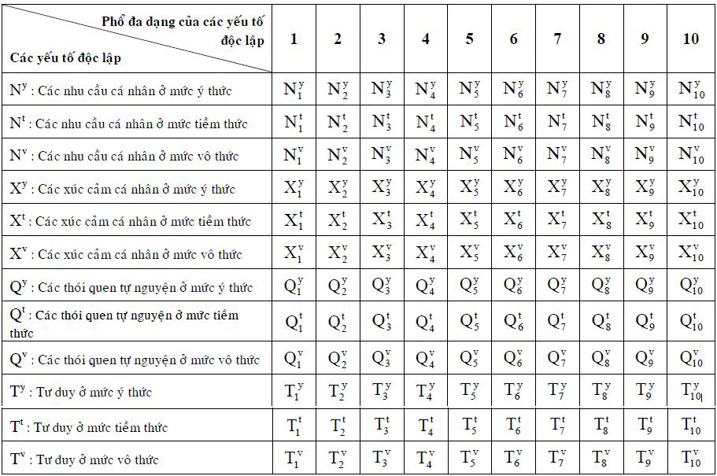

# Từ nhu cầu đến hành động và ngược lại

## Mở đầu {#sec:5:1:}
Từ quyển một _“Giới thiệu: Phương pháp luận sáng tạo và đổi mới”_ (xem mục _\@ref(sec:3:2:) PPLSTVĐM là gì?_), bạn đọc biết rằng: _Tư duy sáng tạo chính là quá trình suy nghĩ giải quyết vấn đề và ra quyết định; PPLSTVĐM đòi hỏi tư duy sáng tạo phải hướng tới các hành động thực hiện giải xong bài toán (đổi mới hoàn toàn) trên thực tế, chứ không chỉ dừng lại ở suy nghĩ và lời nói; Cuộc đời của mỗi người là chuỗi các vấn đề cần giải quyết, chuỗi các quyết định cần phải ra, do vậy, cuộc đời của mỗi người phải là chuỗi những sáng tạo và đổi mới hoàn toàn, nếu chúng ta muốn phần khổ bớt đi và phần sướng tăng lên_.

Ở đây, có thể nảy sinh các câu hỏi sau: _Hàng ngày và cả cuộc đời, mỗi người thường có nhiều hành động, vậy những hành động đó bị chi phối bởi những cái gì và hành động để làm gì? Tại sao cuộc đời của mỗi người lại lắm vấn đề thế? Cái gì là nguồn gốc của các vấn đề? Những hiện tượng nào thuộc thế giới bên trong con người ảnh hưởng đến tư duy? Làm thế nào để giữa tư duy và hành động có sự nhất quán, tránh hiện tượng nghĩ một đằng, làm một nẻo?_...

Những gì trình bày trong chương này, chủ yếu, dựa trên các kết quả nghiên cứu của tâm lý học, có mục đích góp phần trả lời những câu hỏi nói trên.

Các hiện tượng (quá trình, trạng thái, tính chất) tâm lý được các nhà triết học và khoa học quan tâm, chú ý nghiên cứu và bàn luận từ nhiều thế kỷ trước công nguyên. Khoa học tâm lý (tâm lý học) được coi có tên gọi chính thức từ thế kỷ 18. Ngày nay, tâm lý học được định nghĩa là khoa học nghiên cứu các sự kiện, quy luật, cơ chế của tinh thần (tâm hồn) như là sự phản ánh dưới dạng các hình ảnh hình thành trong óc về hiện thực. Trên cơ sở và nhờ sự phản ánh đó, sự điều khiển hành vi và hoạt động mang tính cá nhân được thực hiện. Tâm lý học nghiên cứu bản chất các cơ chế tâm lý và các quy luật điều khiển tâm lý.

Sự phản ánh hiện thực nhờ bộ óc và xảy ra trong bộ óc (thế giới tinh thần), có cơ sở vật chất là các hoạt động sinh lý thần kinh, các quá trình lý sinh, sinh hóa ở mức độ phân tử, tế bào. Ở đây, người viết chỉ đề cập đến các hiện tượng tâm lý. Các hiện tượng tâm lý chia thành ba loại:

1\. Các quá trình tâm lý là các hiện tượng tâm lý đơn giản được lồng trong những dạng phức tạp hơn của hoạt động tâm lý. Chúng xảy ra trong thời gian ngắn từ vài phần giây đến vài chục phút.

2\. Các trạng thái tâm lý thuộc loại phức tạp nhất. Ví dụ như các trạng thái sảng khoái, hoặc trầm uất; khả năng làm việc thích hợp hay mệt mỏi; tâm trạng tươi tỉnh hoặc chán nản; dễ nổi nóng; đãng trí. Chúng có thể kéo dài trong vài giờ, vài ngày hoặc vài tuần lễ.

3\. Các tính chất của nhân cách là khí chất, tính cách, các năng lực và những thể hiện đặc biệt mang tính ổn định của các quá trình tâm lý của nhân cách. Chúng còn là các xu hướng, niềm tin, kiến thức, kỹ xảo, kỹ năng và thói quen của nhân cách. Những tính chất này tồn tại trong cá nhân, nếu như không nói cả đời thì cũng trong thời gian rất dài.

Các hiện tượng tâm lý nói trên liên quan mật thiết với nhau và có thể chuyển hóa lẫn nhau theo những cách khác nhau.

Do nhiều nguyên nhân, trong đó có các nguyên nhân như: Đối tượng nghiên cứu của tâm lý không những phức tạp mà còn luôn có hai khía cạnh khách quan và chủ quan đan xen nhau (con người nghiên cứu chính mình); thiếu các phương tiện nghiên cứu với độ tin cậy, chính xác cao, tâm lý học chưa phải là khoa học chính xác. Các nhà tâm lý thường gặp các trường hợp: trong các sự kiện giống nhau lại có sự tham gia của các hiện tượng tâm lý khác nhau; các sự kiện khác nhau, thậm chí ngược nhau lại bị chi phối cùng một quy luật... mà chưa xác định được một cách rõ ràng, khách quan.

Trong tâm lý học còn có tình trạng, nội dung một khái niệm được định nghĩa khác nhau hoặc được đặt tên khác nhau, tùy theo các trường phái nghiên cứu, thậm chí tùy theo các nhà nghiên cứu riêng lẻ khác nhau. Ngược lại, cùng sử dụng một tên gọi, các nhà tâm lý lại hiểu khác nhau. Nhiều thuật ngữ cơ bản của tâm lý học như _“xúc cảm”_, _“ý chí”_, _“ý thức”_, _“nhân cách”_, _“tính cách”_ còn chưa có các định nghĩa được tiếp nhận chung. Hầu như mỗi tác giả gởi gắm trong những thuật ngữ mà mình sử dụng ý nghĩa riêng của mình. Do vậy, không phải ngẫu nhiên, Y.M. Xetrenov nhận xét: _“... bạn hãy thử nói chuyện về cùng một đối tượng với các nhà tâm lý học thuộc các trường phái khác nhau: mỗi trường phái lại có ý kiến khác; để so sánh, nói chuyện, ví dụ, về âm thanh, ánh sáng, điện với bất kỳ nhà vật lý nào, từ bất kỳ đất nước nào, bạn đều nhận được những câu trả lời giống nhau về bản chất”_. Nhận xét này tuy đã tồn tại suốt gần 150 năm nhưng vẫn còn được trích dẫn. Rõ ràng, chỉ _“những câu trả lời giống nhau”_ mới có thể làm tâm lý học trở thành khoa học giống như các khoa học: vật lý học, thiên văn học, hóa học, sinh vật học.

Những gì liên quan đến tâm lý học và các khoa học cơ sở khác của PPLSTVĐM, trình bày trong bộ sách _“Sáng tạo và đổi mới”_ nói chung, quyển hai và quyển ba nói riêng là kết quả học, tự học, nghiên cứu và sử dụng chúng của người viết. Do vậy, bạn đọc nên xem những kiến thức đó chỉ là tối thiểu, cần tự suy xét, đánh giá chúng và tìm hiểu thêm.

## Các nhu cầu của cá nhân {#sec:5:2:}
Nhu cầu cá nhân là sự đòi hỏi của cá nhân có được những điều kiện, phương tiện (hiểu theo nghĩa rộng, bao gồm cả kiến thức và công cụ) và kết quả cần thiết cho sự tồn tại và phát triển của cá nhân đó.

Việc công nhận các nhu cầu là nguyên nhân khởi đầu các hành động của con người và bác bỏ quan điểm cho rằng tư duy của con người là nguồn gốc, động lực hoạt động của con người, đã trở thành xuất phát điểm của những giải thích khoa học về các hành vi hướng đích của con người.

Engels, đã từ lâu, khẳng định: _“Mọi người thường quen giải thích các hành động của mình xuất phát từ tư duy, mà đúng ra là từ các nhu cầu của mình (những nhu cầu này, tất nhiên, được phản ánh, nhận thức trong đầu), và bằng cách này_ (coi tư duy là nguồn gốc, động lực hoạt động của con người – người viết nhấn mạnh_), với thời gian đã hình thành chính thế giới quan duy tâm[(1)](Endnotes.xhtml#n102 "1. Tiếng Nga: Маркс К., Энгельс Ф. Соч. – 2-е изд. Т.20, с.493")”_; _“Không ai có thể làm cái gì đó_ (hành động – người viết nhấn mạnh) _mà không vì nhu cầu nào đó trong số các nhu cầu của mình và vì cơ quan của nhu cầu đó”[(2)](Endnotes.xhtml#n103 "2. Tiếng Nga: Маркс К., Энгельс Ф. Соч. – 2-е изд. Т.3, с.245")_ và _“Ý tưởng” luôn tự đánh mất uy tín, ngay khi nó bị tách ra khỏi “sự quan tâm”[(3)](Endnotes.xhtml#n104 "3. Tiếng Nga: Маркс К., Энгельс Ф. Соч. – 2-е изд. Т.2, с.89")_ (xuất phát từ nhu cầu – người viết nhấn mạnh). Như vậy, nguồn gốc sâu xa, tận cùng của các hành động cá nhân là các nhu cầu của cá nhân và các hành động của cá nhân là nhằm thỏa mãn chính các nhu cầu cá nhân ấy. Khi bạn tác động lên tư duy (làm công tác tư tưởng lên ý thức) người khác, những ý tưởng của bạn nêu ra mà không liên quan, tệ hơn, không giúp làm thỏa mãn các nhu cầu cá nhân của người đó, các ý tưởng tự đánh mất uy tín và không được tiếp nhận. Mặc dù, nhìn về hình thức bề ngoài của người đó, bạn tưởng là bạn đã thành công. Các nhu cầu cá nhân cũng chính là nguyên nhân làm nảy sinh các vấn đề khi chúng không được thỏa mãn bằng các hành động đã biết.

Qua các thời đại, nhu cầu của con người càng ngày càng tăng, do vậy, bản thân mỗi cá nhân lại có nhiều nhu cầu mới. Điều này cũng có nghĩa số lượng các vấn đề của con người qua các thời đại càng ngày càng tăng. Nhiều nhà nghiên cứu đã cố gắng đi vào phân loại các nhu cầu theo các tiêu chuẩn khác nhau. Nhà tâm lý học người Ba Lan Obukhowski đã thống kê được hơn 120 kiểu phân loại các nhu cầu của con người và chưa có kiểu phân loại nào được mọi người thống nhất thừa nhận.

Trong mục này, người viết chọn một kiểu phân loại các nhu cầu mà chủ quan người viết cho là phù hợp với việc trình bày các vấn đề cơ sở của PPLSTVĐM.

Theo P.V. Ximonov, các nhu cầu cơ bản của con người có thể tập hợp và phân thành ba nhóm:

1\. _Các nhu cầu sinh học:_ Ăn, uống, ngủ, giữ thân nhiệt (vì người là động vật máu nóng), bảo vệ khỏi những tác động có hại của môi trường (hiểu theo nghĩa rộng, bao gồm cả những người xung quanh, tự nhiên, xã hội), tiết kiệm sức lực, duy trì nòi giống... Đấy là những nhu cầu để cá nhân tồn tại và phát triển như một cá thể, một giống loài sinh học trong thế giới tự nhiên.

2\. _Các nhu cầu xã hội:_ Nhu cầu thuộc về một cộng đồng (nhóm, tầng lớp...) xã hội nào đó và giữ một vị trí nhất định (không phải là thấp nhất và chưa chắc là cao nhất) trong cộng đồng đó. Nhu cầu được những người xung quanh chú ý, quan tâm, kính trọng và yêu mến... Đấy là những nhu cầu để cá nhân tồn tại và phát triển trong xã hội.

Các nhu cầu xã hội của cá nhân chia thành hai loại: 1) Các nhu cầu _“cho mình”_ mà cá nhân nhận biết như các quyền lợi của mình; 2) Các nhu cầu _“cho những người khác”_, được cá nhân nhận biết như là nghĩa vụ. Điều này dễ hiểu vì, để thuộc về và giữ một vị trí nhất định trong một cộng đồng xã hội nào đó (có được những quyền lợi nào đó), cá nhân phải có những đóng góp cho cộng đồng. Tương tự như vậy, để có được sự quan tâm, kính trọng, yêu mến từ những người khác, cá nhân phải có những hành động thỏa mãn nhu cầu của những người khác. Không phải ngẫu nhiên, kinh nghiệm lịch sử của nhân loại cho thấy, người hạnh phúc nhất là người mang hạnh phúc cho nhiều người nhất. Trong sự thống nhất, các nhu cầu _“cho mình”_ làm nảy sinh lòng tự trọng, tự chủ trong tư duy, phán xét, đánh giá một cách độc lập. Các nhu cầu _“cho những người khác”_ làm cho con người trở nên nhân hậu, có khả năng đồng cảm và cộng tác với những người khác.

3\. _Các nhu cầu lý tưởng (nhận thức):_ Nhận thức (biết, hiểu, giải thích, dự đoán về...) thế giới xung quanh (những người khác, tự nhiên, xã hội) và chính bản thân mình. Loại nhu cầu này thể hiện thành nhu cầu trả lời các câu hỏi cụ thể nảy sinh trong đầu của cá nhân như ai? cái gì? tại sao? để làm gì? ở đâu? xảy ra như thế nào? sẽ xảy ra chuyện gì?... Trong ý nghĩa này, có người định nghĩa: _“Con người là động vật tò mò nhất thế giới”_. Đấy là các nhu cầu để cá nhân tồn tại và phát triển như động vật cấp cao có khả năng tư duy, liên quan đến việc hình thành thế giới quan, nhân sinh quan.

Các nhu cầu lý tưởng (nhận thức) của cá nhân đòi hỏi trả lời các câu hỏi liên quan đến thế giới xung quanh, vị trí của cá nhân trong đó, ý nghĩa và mục đích cuộc sống của cá nhân, bằng cách kế thừa các giá trị văn hóa đã có, phát minh và sáng chế những cái mà các thế hệ trước chưa biết. Con người không chỉ sống đơn thuần mà luôn trăn trở sống để làm gì? cho ai? Nhận thức hiện thực, con người hướng tới tìm các quy tắc và các quy luật hoạt động mà thế giới xung quanh phải tuân theo dưới dạng, có thể là các câu chuyện thần thoại, các tác phẩm nghệ thuật, các lý thuyết khoa học. Trong đó, khoa học được đánh giá tin cậy hơn cả trong việc nhận thức, nhờ tính khách quan và được kiểm tra bằng thực tiễn. Các câu chuyện thần thoại, sự tích, cổ tích làm thỏa mãn nhu cầu nhận thức khi các kiến thức đã có, được chứng minh bằng thực tiễn, không đủ để thỏa mãn nhu cầu nhận thức. Con người không chấp nhận, không chịu đựng được tình trạng bất định, không rõ ràng, không hiểu, không đoán trước đối với thế giới xung quanh (các câu hỏi nảy sinh trong đầu chưa có câu trả lời). Điều này làm cho con người bối rối, bất lực, do dự. Đặc biệt, đối với những người sơ khai, các câu chuyện thần thoại, cổ tích đã giúp họ thỏa mãn nhu cầu nhận thức (có được các câu trả lời cho các câu hỏi nảy sinh trong đầu). Ví dụ, chuyện _“Sự tích Hòn vọng phu”_ là câu trả lời cho câu hỏi _“Vì sao hòn đá cho trước lại giống người mẹ bồng đứa con?”_. Các câu chuyện thần thoại không thay thế, làm tăng kiến thức mà có tác dụng _“an thần”_, lấp những _“chỗ trống”_ hiểu biết trong đầu con người. Điều này cũng góp phần giải thích vì sao nạn mê tín, dị đoan rất khó khắc phục. Ví dụ, các thầy bói luôn có sẵn các câu trả lời cho các câu hỏi của các thân chủ về nguyên nhân thất bại, đường tình duyên, số phận... của họ.

Cũng từ lịch sử tiến hóa và phát triển nhân loại, các nghiên cứu khoa học cho thấy, con người nhận thức các quy luật khách quan càng đầy đủ, chính xác thì các hành vi của con người càng trở nên tự do. K. Marx nhận xét: _“Chỉ khi những mục đích bên ngoài đánh mất cái vẻ bề ngoài của nó, tính tất yếu tự nhiên trở thành mục đích mà cá nhân đặt ra cho mình thì mới xuất hiện tự do thực sự”._[(4)](Endnotes.xhtml#n105 "4. Tiếng Nga: Маркс К., Энгель Ф. Пол. Соч. Т46, ч.2, с.109")

Ngoài các nhu cầu cơ bản, con người còn có nhu cầu thỏa mãn các nhu cầu, thể hiện cụ thể thành các nhu cầu hỗ trợ cho các nhu cầu cơ bản: Nhu cầu được trang bị các phương tiện (hiểu theo nghĩa rộng, bao gồm cả các kiến thức, kỹ năng, tay nghề, kỹ xảo và công cụ) để có thể đạt được mục đích thỏa mãn nhu cầu và nhu cầu có những hành động vượt qua các khó khăn (ý chí) gặp trên con đường tới đích thỏa mãn các nhu cầu. Trong những trường hợp nhất định, ý chí mạnh có thể làm cá nhân sai lầm khi xác định nhu cầu ưu tiên hoặc việc vượt qua các khó khăn trở thành mục đích tự thân mà quên mất mục đích ban đầu cần đạt. Những lúc như vậy, cá nhân có thể trở nên bướng bỉnh trong hành động và không để ý trả lời câu hỏi: _“Vượt qua các khó khăn để làm gì?”_. Ý chí kiểu như vậy có thể dẫn đến _“duy ý chí”_ và _“những nỗ lực, cố gắng vô ích”_.

Sự thể hiện mang dấu ấn cá tính cao và sự phối hợp độc đáo riêng của hai loại nhu cầu hỗ trợ nói trên xác định tính cách của cá nhân cho trước. Mức độ trang bị tốt giúp cá nhân có được sự tự tin, kiên quyết, độc lập, tự chủ trong những hoàn cảnh có các vấn đề cần giải quyết. Việc trang bị không tốt làm cá nhân lo lắng, rối trí, trở nên phụ thuộc, cần sự che chở. Để thỏa mãn nhu cầu trang bị phương tiện, cá nhân cần phải học (hiểu theo nghĩa rộng nhất, bao gồm bắt chước, tham gia các trò chơi). Nhu cầu vượt khó là cơ sở của các phẩm chất ý chí cá nhân.

Các nhu cầu cơ bản và hỗ trợ là những nhu cầu tương đối độc lập: Chúng khác biệt nhau, không thay thế nhau, nhu cầu này được thỏa mãn không tự động làm thỏa mãn nhu cầu khác. Tuy vậy, giữa chúng có các mối liên kết, hiểu theo nghĩa, chúng có thể ảnh hưởng, phụ thuộc, bổ sung, hỗ trợ, mâu thuẫn nhau tùy trường hợp cụ thể.

Các nhu cầu cơ bản và hỗ trợ là những nhu cầu khởi phát, hiểu theo nghĩa, theo thời gian, tùy theo điều kiện xã hội cụ thể, chúng dẫn đến những nhu cầu khác (những nhu cầu thứ phát). Ví dụ, từ nhu cầu sinh học khởi phát _“giữ thân nhiệt”_ làm nảy sinh nhu cầu về quần, áo. Đến lượt mình, nhu cầu quần, áo làm nảy sinh nhu cầu sản xuất (nuôi, trồng để có nguyên vật liệu, dệt, may, đan...)

Là các nhu cầu cơ bản, hỗ trợ và thứ phát, chúng còn có thể phối hợp, tổ hợp, kết hợp... với nhau, tạo ra sự thay đổi về chất (chứ không phải là phép cộng số học), hình thành những nhu cầu phức tạp hơn, gọi là các nhu cầu hợp thành (các nhu cầu mang tính hệ thống), ở những thang bậc hệ thống khác nhau với những sắc thái khác nhau. Ví dụ, nhu cầu về mốt quần áo có thể hợp thành từ các nhu cầu giữ thân nhiệt, được để ý, chú ý, nhận thức... Tương tự như vậy, nhu cầu du lịch có thể hợp thành từ các nhu cầu nhận thức, được để ý, chú ý... Tóm lại, nếu bạn thấy có những nhu cầu không được liệt kê tên ra ở đây, chúng có thể là các nhu cầu hợp thành và bạn thử phân tích để tìm các yếu tố tạo nên chúng.

Thông thường, cá nhân có thể nhận biết các nhu cầu của mình thông qua các ý nghĩ nảy sinh trong đầu: _“Tôi muốn...”_ và trả lời các câu hỏi: _“Để làm gì?”_, _“Để thỏa mãn nhu cầu nào?”_ cho đến tận cùng. Ví dụ: _“Tôi muốn có cái áo vét đó”_; _“Để làm gì?”_; _“Để mặc lúc trời lạnh”_. _“Để thỏa mãn nhu cầu nào?”_; _“Để không bị mất nhiệt”_. Như vậy nhu cầu ở đây là giữ thân nhiệt. _“Tại sao là áo vét đó? Để làm gì”_; _“Để trông bụi bụi một tý”_ hoặc _“Để cho nó đứng đắn”_... Nếu thế, ở đây còn có _“nhu cầu thuộc về nhóm người nào đó”_ hoặc _“nhu cầu được chú ý”_, _“nhu cầu được kính trọng”_...

Trong ý nghĩa nào đó, ở đây có sự tương tự với hóa học: Từ các nguyên tử của các nguyên tố hóa học (là các yếu tố), chúng liên kết với nhau theo những cách khác nhau thành các hệ thống: Các phân tử, đại phân tử, chất khí, chất lỏng, chất rắn (polymer, tinh thể, vô định hình các loại) hay gọi chung là các hợp chất hóa học với các tính chất mang tính hệ thống rất đa dạng và các hợp chất (hệ thống) hóa học được tạo ra ngày càng nhiều với thời gian. Phần hệ thống của quyển ba _“Tư duy lôgích, biện chứng và hệ thống”_ sẽ còn giúp bạn hiểu rõ hơn nữa về những gì liên quan đến khái niệm hệ thống. Nhân đây, người viết cố gắng giải thích thêm những ý vừa nêu.

Hệ thống là tập hợp các yếu tố liên kết với nhau và toàn bộ tập hợp đó có những tính chất không thể quy về thành những tính chất của từng yếu tố, mối liên kết đứng riêng rẽ. Những tính chất nói trên được gọi là tính hệ thống. Chúng ta cùng thử xét phân tử nước (H2O). Phân tử nước là tập hợp hai nguyên tử hyđrô, một nguyên tử ôxy (các yếu tố), liên kết với nhau (có cấu trúc H–O–H) và toàn bộ phân tử nước có những tính chất: Lỏng ở nhiệt độ phòng, không cháy... không thể quy về thành những tính chất của các nguyên tử hyđrô, ôxy, các mối liên kết giữa chúng đứng riêng rẽ. Bởi vì, hyđrô, ôxy riêng rẽ là các chất khí ở nhiệt độ phòng và cháy tốt. Như vậy, tính hệ thống (lỏng, không cháy) là sự thay đổi về chất. Trong ý nghĩa này, từ nay về sau, khi người viết sử dụng cụm từ _“tính chất mang tính hệ thống”_ hoặc _“phẩm chất mang tính hệ thống”_... bạn đọc cần hiểu _“tính chất”_ hoặc _“phẩm chất”_... đó toàn bộ hệ thống mới có và là sự thay đổi về chất.

Nếu theo dõi _“sự tiến hóa”_ của các hợp chất hóa học, có thể thấy khuynh hướng: Các hợp chất hóa học được tạo ra từ đơn giản đến phức tạp, từ vô cơ đến hữu cơ, từ những hợp chất không mang sự sống đến những hợp chất mang sự sống, từ những hợp chất không có khả năng tư duy đến những hợp chất có khả năng tư duy. Sự tiến hóa dẫn đến sự đa dạng các tính chất mới mang tính hệ thống và sự đa dạng còn tiếp tục mãi theo thời gian. Tóm lại, chỉ từ hơn một trăm nguyên tố hóa học (không nhiều), bằng cách liên kết, chúng có thể tạo ra vô số các hệ thống với các tính chất mang tính hệ thống cực kỳ đa dạng.

Tương tự như các nguyên tố hóa học, các nhu cầu cơ bản, hỗ trợ, thứ phát cụ thể cũng liên kết với nhau theo những cách khác nhau, tạo nên các nhu cầu mới (các nhu cầu hợp thành) mang tính hệ thống và các nhu cầu của con người cũng tiến hóa theo thời gian.

Trong các nhu cầu của cá nhân, cần phải kể đến nhu cầu hợp thành đặc biệt. Đấy là nhu cầu tiền mà nếu là tiền có thể chuyển đổi được thì càng tốt. Ở thời kỳ săn bắn, hái lượm, bạn muốn thỏa mãn nhu cầu ăn, bạn phải tự làm điều đó bằng cách đi săn và hái quả. Sang thời kỳ có sự trao đổi sản phẩm, bạn không nhất thiết tự làm mọi thứ tương ứng với các nhu cầu của mình. Ví dụ, bạn chỉ cần rèn dao, qua trao đổi bạn vẫn có được lương thực, thực phẩm, quần áo... để thỏa mãn các nhu cầu khác. Khi tiền, một loại hàng hóa trung gian xuất hiện, việc trao đổi càng trở nên thuận tiện hơn nữa. Cùng với giao thương quốc tế rồi khuynh hướng toàn cầu hóa, nhiều loại tiền trở nên chuyển đổi được giữa các quốc gia. Nếu bạn có tiền, nhiều nhu cầu cá nhân sẽ được thỏa mãn. Cho nên, không phải ngẫu nhiên các cá nhân, công ty, quốc gia đều cố gắng trở nên giàu, thành công về mặt kinh tế (xem mục nhỏ _\@ref(subsec:3:3:3:) Nguyên nhân thành công ở thế kỷ 21: Sáng tạo và đổi mới – Tri thức_ của quyển một).

Như vậy, các nhu cầu của con người có thể là các nhu cầu cơ bản, hỗ trợ, thứ phát và hợp thành. Trong đó, qua các giai đoạn lịch sử, với thời gian, các nhu cầu thứ phát và hợp thành càng tăng về sự đa dạng. Từ nay về sau, khi người viết không nói cụ thể mà nói chung _“các nhu cầu”_ có nghĩa bao gồm tất cả các loại nhu cầu nói trên.

Các nhu cầu của con người đều có thể thể hiện thành hai dạng: Các _nhu cầu giữ gìn_ và các _nhu cầu phát triển_. Xã hội loài người trải qua các giai đoạn lịch sử (thời đại) cụ thể khác nhau. Ở mỗi giai đoạn, do sự tương tác của các yếu tố như lịch sử, kinh tế, văn hóa... hình thành những chuẩn mực cụ thể phản ánh trong ý thức xã hội của những con người thuộc giai đoạn đó. Các nhu cầu giữ gìn là những nhu cầu đòi hỏi phải đạt được sự thỏa mãn trong giới hạn các chuẩn mực. Các nhu cầu phát triển đòi hỏi sự thỏa mãn cao hơn các chuẩn mực đã có, bởi vì con người, theo Marx và Engels, _“có các nhu cầu vô hạn và có khả năng mở rộng những nhu cầu đó”_.[(5)](Endnotes.xhtml#n106 "5. Tiếng Nga: Архив К. Маркса и Ф. Энгельса. Т2/7, М, 1935, c.235") Các nhu cầu phát triển thường dẫn đến các bài toán vì người ta chưa biết cách làm sao thỏa mãn cao hơn những chuẩn mực đã có.

Các nhu cầu của con người còn có thể phân loại theo mức độ đòi hỏi thỏa mãn. Có những nhu cầu thỏa mãn được thì tốt, không thỏa mãn được thì cũng không sao. Ví dụ như nhu cầu du hành vũ trụ của cá nhân nào đó. Có những nhu cầu đòi hỏi nhất định phải thỏa mãn, nếu không, ảnh hưởng đến việc thỏa mãn các nhu cầu khác, thậm chí ảnh hưởng đến sự tồn tại. Ví dụ như nhu cầu ăn, uống (_“Có thực mới vực được đạo”_, _“Một cái bụng đói thì chẳng có tai đâu”_ – Ngạn ngữ Anh). Các nhu cầu có mức độ đòi hỏi thỏa mãn cao (các nhu cầu cấp bách) thường làm nảy sinh các bài toán phải ưu tiên giải trước. Tuy nhiên, xác định hoặc tự xác định chính xác nhu cầu cấp bách của con người cụ thể, nhiều khi, là vấn đề khó ngay cả đối với chính con người cụ thể đó. Có những nhu cầu ổn định, kéo dài về mặt thời gian, có khi cả đời, được gọi là những nhu cầu chủ đạo. Ví dụ nhu cầu thực hiện một công việc dài hạn nào đó, nhu cầu xây dựng một sự nghiệp nào đó...

Trên đây là những nét chung về các nhu cầu của con người. Đi vào các nhu cầu cụ thể của các cá nhân cụ thể thì mỗi cá nhân có thế giới riêng các nhu cầu của mình, không ai giống ai cả. Điều này có thể hiểu được, ít ra, vì tổng hợp các lý do sau:

1\. Các cá nhân khác nhau về cấu trúc di truyền dẫn đến có các nhu cầu bẩm sinh khác nhau.

2\. Các cá nhân khác nhau sống ở các môi trường (hiểu theo nghĩa rộng nhất) khác nhau nên những nhu cầu hình thành do môi trường cũng khác nhau.

3\. Các cá nhân khác nhau về mặt di truyền nên dù sống trong cùng một môi trường, những nhu cầu hình thành do tương tác của môi trường với cá nhân cũng khác nhau.

4\. Tuy ai cũng có các nhu cầu cơ bản, hỗ trợ giống nhau về tên gọi nhưng rất khác nhau về cường độ và sắc thái.

5\. Ở những cá nhân khác nhau, cách dẫn đến các nhu cầu thứ phát và hợp thành cũng khác nhau.

6\. Những cá nhân khác nhau có các mức độ đòi hỏi thỏa mãn các nhu cầu khác nhau.

7\. Sự thay đổi các nhu cầu (kể cả chủng loại, cường độ, sắc thái, mức độ đòi hỏi thỏa mãn...) theo tuổi của một đời người ở những người khác nhau thì khác nhau.

Ngoài các nhu cầu của cá nhân còn có các nhu cầu của xã hội (hiểu theo nghĩa rộng), sẽ được người viết đề cập trong mục _\@ref(sec:7:3:) Con người và môi trường: Điều khiển hành động của con người sáng tạo_.

Trong đời sống hàng ngày, các nhu cầu của cá nhân thường thể hiện thông qua các mục đích cụ thể nào đó mà đạt được chúng thì các nhu cầu của cá nhân được thỏa mãn. Ví dụ, khi đạt được mục đích gắn các bánh xe vào vali để kéo, thay cho khiêng, vác, xách thì nhu cầu tiết kiệm sức lực được thỏa mãn. Các mục đích phản ánh các nhu cầu cá nhân một cách chủ quan, nhiều khi, phản ánh như thế nào, chính cá nhân cũng không nhận biết. Do vậy, ở đây có thể nảy sinh các vấn đề liên quan đến năng lực cá nhân về sự lựa chọn cách phản ánh, độ chính xác của phản ánh, thu thập thông tin cần thiết cho sự phản ánh... Những vấn đề này ở những cá nhân khác nhau cũng khác nhau cả về lượng lẫn về chất. Các mục đích đề ra có thể được phát biểu rõ ràng, đầy đủ hoặc không rõ ràng, có nhiều khiếm khuyết; có thể cụ thể hoặc chung chung; có thể đúng hoặc sai... Cách xác định mục đích được thảo luận trong nhiều chương, mục của bộ sách _“Sáng tạo và đổi mới”_. Người viết muốn lưu ý bạn đọc rằng xác định mục đích đúng, liên quan đến việc phát biểu bài toán, là công việc không dễ dàng, do vậy, cần rất đáng để tâm. Để đạt được các mục đích đề ra, cá nhân phải có những hành động thích hợp, ít ra, nhìn theo quan điểm của chính cá nhân người hành động.

## Hành động {#sec:5:3:}
Từ _“hành động”_, người viết dùng ở đây, được hiểu là tất cả những việc làm của cá nhân thể hiện ra bên ngoài nhằm đạt được mục đích do thế giới bên trong cá nhân đó đề ra. Như vậy, từ _“hành động”_ bao gồm các thao tác, cử chỉ, hành động (hiểu theo nghĩa thông thường), hoạt động... Khi nào cần thiết, người viết sẽ đi vào các hành động cụ thể. Tư duy được coi thuộc thế giới bên trong, cùng với nhu cầu, xúc cảm...

Có những hành động của con người là do di truyền, bẩm sinh được chọn lọc tự nhiên giữ lại (các phản xạ không điều kiện, bản năng). Ví dụ, khi gặp ánh sáng chói, mắt người tự động khép lại.

Ngoài ra, sống trong xã hội, chịu sự di truyền xã hội, con người còn thừa kế (dưới dạng bắt chước, tham gia các trò chơi, được giáo dục) nhiều loại hành động khác. Vì xã hội thay đổi/phát triển theo thời gian nên những hành động này cũng thay đổi/phát triển tương ứng. Chưa kể, các cá nhân trong xã hội còn có thể tạo ra những hành động mới để mở rộng những gì đã có. Trong mối quan hệ giữa cá nhân và xã hội có thể nảy sinh sự xung đột: Các hành động của cá nhân không phù hợp với các chuẩn mực xã hội.

Đối với con người nói chung, có thể có nhiều chứ không phải duy nhất một cách hành động nhằm đạt mục đích (thỏa mãn nhu cầu) cụ thể cho trước. Trong số đó, thậm chí, có những cách hành động hoàn toàn trái ngược nhau, xem Hình 33. Nói cách khác, một nhu cầu có thể dẫn đến các mục đích khác nhau với các hành động thực hiện khác nhau trong cùng một con người.

_**Hình 33: Có thể có nhiều cách hành động (các mũi tên) để thỏa mãn nhu cầu cụ thể cho trước**_

Đối với các cá nhân cụ thể khác nhau, để thỏa mãn nhu cầu cụ thể cho trước, họ có thể có các hành động hoàn toàn khác nhau, xem Hình 34. Nói cách khác, cùng một nhu cầu có thể dẫn đến các mục đích, hành động khác nhau ở những người khác nhau.

_**Hình 34: Các cá nhân khác nhau có thể có các hành động khác nhau nhằm thỏa mãn cùng loại nhu cầu**_

Ví dụ, một mặt, để thỏa mãn nhu cầu tiền nói chung, có thể có nhiều cách hành động: Chuyển chỗ làm; chuyển nghề để tăng thu nhập; phấn đấu về chuyên môn, nghiệp vụ để nhận lương cao hơn; sáng tạo ra các loại dịch vụ, sản phẩm bán chạy hơn trên thị trường; chơi số đề; ăn cắp; ăn cướp; buôn ma túy; tham nhũng... xem Hình 33. Mặt khác, những cá nhân khác nhau lựa chọn các hành động khác nhau, từ những hành động có thể có liệt kê ở trên, có những hành động trái ngược nhau và có những hành động của cá nhân không phù hợp với các chuẩn mực của xã hội lành mạnh, xem Hình 34.

Ngược lại, những cá nhân khác nhau có thể có hành động giống nhau về mặt hình thức nhưng hành động đó lại xuất phát từ những nhu cầu cá nhân khác nhau, xem Hình 35. Nói cách khác, một mục đích có thể phản ánh các nhu cầu khác nhau ở những người khác nhau.

_**Hình 35: Hành động giống nhau có thể xuất phát từ những nhu cầu cá nhân khác nhau**_

Ví dụ, các thí sinh trong phòng thi cùng làm một đề thi vào đại học. Tất cả họ đều có mục đích đậu đại học. Người thì xuất phát từ nhu cầu kiến thức; người thì cần bằng cấp; người muốn cha, mẹ vui lòng; người đơn giản muốn học chung với bạn thân của mình…

Thêm vào những gì nói ở trên, một hành động của cá nhân còn có thể thỏa mãn cùng một lúc nhiều nhu cầu, xem Hình 36. Điều này có thể hiểu được vì có những nhu cầu là loại nhu cầu hợp thành. Nói cách khác, có những mục đích là mục đích hợp thành.

Ví dụ, hành động kiếm tiền giúp thỏa mãn khá nhiều loại nhu cầu. Hoặc việc sử dụng điện thoại di động đối với nhiều người vừa thỏa mãn nhu cầu tiết kiệm sức lực, vừa thỏa mãn nhu cầu được để ý, chú ý.

_**Hình 36: Một hành động có thể thỏa mãn nhiều nhu cầu**_

Như chúng ta biết từ mục \@ref(sec:5:2:) _Các nhu cầu của cá nhân,_ nguồn gốc của các hành động cá nhân là các nhu cầu của cá nhân. Do vậy, về mặt nguyên tắc, để một người có hành động cụ thể nhất định, trước đó, cần tạo được nhu cầu cụ thể tương ứng với hành động cụ thể đó. D. Carnegie diễn tả như sau: _“Chỉ có cách làm duy nhất dưới bầu trời này để buộc một người làm một điều gì đó_ (hành động – người viết giải thích). _Đấy là làm cho người đó muốn_ (có nhu cầu – người viết giải thích) _làm điều đó”_. Trong các cuốn sách của mình, chẳng hạn, cuốn “Đắc nhân tâm”, D. Carnegie có dẫn ra không ít các ví dụ minh họa cho luận điểm nói trên.

PPLSTVĐM quan tâm suy nghĩ và hành động của cá nhân khi gặp vấn đề (bài toán). Từ quyển một, bạn đọc biết rằng, người ta chỉ thực sự suy nghĩ khi gặp vấn đề, ở đó mục đích cần đạt thì biết nhưng không biết cách đạt đến mục đích, hoặc không biết cách tối ưu đạt đến mục đích trong một số cách đã biết. Nói cách khác, trong những trường hợp như vậy, người ta biết (với những mức độ cụ thể, chính xác khác nhau) cần phải thỏa mãn nhu cầu gì, nhưng hành động như thế nào để chắc chắn đạt đến mục đích (thỏa mãn nhu cầu) thì chưa biết. Điều này buộc người ta phải suy nghĩ giải quyết vấn đề và ra quyết định hành động. Hành động của cá nhân chính là quyết định của thế giới bên trong cá nhân, được thực hiện (vật chất hóa) trên thực tế. Hành động của cá nhân (chủ thể) tác động lên đối tượng nào đó (khách thể) và môi trường. Như vậy, ở đây có sự tương tác giữa chủ thể, khách thể và môi trường. Trong trường hợp tốt đẹp, sự tương tác dẫn đến việc thỏa mãn nhu cầu cá nhân (đạt mục đích) và không làm nảy sinh những bài toán mới đối với chủ thể, khách thể và môi trường. Những bài toán mới không đáng nảy sinh này sẽ không nảy sinh, nếu người giải bài toán ra quyết định hành động đúng, hiểu theo nghĩa, tất cả các bên (chủ thể, khách thể và môi trường) đều thắng. Có như vậy, chúng ta mới có được sự giữ gìn hoặc/và phát triển bền vững.

Các hành động của cá nhân có nguồn gốc là các nhu cầu cá nhân nhưng cái chi phối hành động trực tiếp hơn, cũng như được cá nhân cảm nhận rõ ràng hơn lại là xúc cảm. Trong phần lớn các trường hợp, những xúc cảm đều là những xung lực kích thích các hành động tương ứng.

## Xúc cảm {#sec:5:4:}
Từ _“xúc cảm”_, người viết dùng ở đây, được hiểu theo nghĩa rộng. Nó bao gồm các cảm giác mang sắc thái xúc cảm (như đói, mệt), các xúc cảm (hiểu theo nghĩa thông thường như vui, buồn, giận), tình cảm (ví dụ tình yêu), lòng (ví dụ lòng yêu nước), tinh thần (ví dụ tinh thần trách nhiệm)... Ở những chỗ cần thiết, người viết sẽ đi vào phân biệt cụ thể hơn. Có những nhà nghiên cứu ước tính, số lượng xúc cảm của con người có tới hàng chục ngàn loại khác nhau. Trong khi đó, số lượng từ ngữ diễn đạt xúc cảm chỉ trong khoảng 5 đến 6 ngàn từ. Điều này có nghĩa, có những xúc cảm mà bạn không thể diễn tả được cho người khác và hiểu những xúc cảm của nhau để đồng cảm, thông cảm, chia sẻ là vấn đề không dễ.

Xúc cảm cá nhân được hiểu là sự phản ánh tâm lý của cá nhân dưới dạng các cảm nhận chủ quan về sự tương quan giữa những gì tác động lên cá nhân (hiểu theo nghĩa rộng) và mức độ thỏa mãn nhu cầu cấp bách của cá nhân. Những tác động này có thể là tác động của môi trường (những người xung quanh, tự nhiên, xã hội) lên cá nhân; tác động của chính kết quả tương tác giữa hành động cá nhân với khách thể và môi trường; tác động của trí nhớ, trí tưởng tượng dưới dạng những hình ảnh hình thành trong đầu cá nhân; tác động của xúc cảm đang hoặc vừa tồn tại trước đó, dẫn đến xúc cảm mới. Xúc cảm thường đi kèm với sự thay đổi trạng thái sinh lý cơ thể, ví dụ, thay đổi nhịp tim, huyết áp, điện trở da, mạch máu co hoặc giãn, các cơ co, giật, thả lỏng...

Cũng từ quyển một, bạn đọc biết rằng, trong tự nhiên, phương pháp thường dùng để giải quyết vấn đề và ra quyết định là phương pháp thử và sai: Sau nhiều lần thử và sai mới đi đến lời giải (đạt mục đích – thỏa mãn nhu cầu). Những dấu ấn của những hành động thử – sai không thỏa mãn nhu cầu, hoặc thử – đúng đạt mục đích thỏa mãn nhu cầu (lời giải), không chỉ lưu lại trong trí nhớ mà còn biến thành xúc cảm của chủ thể (người, động vật) giải bài toán. Đến lượt mình, những xúc cảm được lưu lại kích thích, khởi động ngược trở lại tâm lý và chi phối hành động của chủ thể giải bài toán, khi rơi vào những tình huống tương tự trong tương lai thúc đẩy, hoặc ngăn chặn hành động tương ứng.

_Hình 37: Sự hình thành xúc cảm_ dưới đây mô tả cơ chế của hoạt động đó.

_**Hình 37: Sự hình thành xúc cảm**_

Khi chủ thể lần đầu tiên gặp bài toán (có nhu cầu cấp bách nào đó cần thỏa mãn nhưng hành động như thế nào để chắc chắn thỏa mãn nhu cầu thì không biết), các hành động của chủ thể mang tính chất thử và sai. Nếu hành động sai, ví dụ hành động 1: Chủ thể tốn sức lực mà không thỏa mãn nhu cầu. Lúc này, trong chủ thể hình thành xúc cảm âm. Xúc cảm âm được lưu giữ để trong các hoàn cảnh tương tự xảy ra trong tương lai, sẽ ngăn chủ thể lặp lại hành động đó. Trường hợp đặc biệt, nếu phép thử đó sai đến nỗi chủ thể bị tiêu diệt, có nghĩa chọn lọc tự nhiên đã đào thải cá thể đó. Ngược lại, nếu hành động giúp chủ thể thỏa mãn nhu cầu (có khi chỉ một phần nào), trong chủ thể hình thành xúc cảm dương. Xúc cảm dương được lưu giữ và có tác dụng trong những tình huống tương tự xảy ra trong tương lai, sẽ thúc đẩy việc lặp lại hành động đó (lời giải) để thỏa mãn nhu cầu. Như vậy, xúc cảm âm thể hiện sự không hài lòng của chủ thể, còn xúc cảm dương – sự hài lòng.

Xúc cảm giúp thay đổi hành động cá nhân theo hướng cực đại hóa hành động nào làm tăng thỏa mãn nhu cầu và cực tiểu hóa hành động nào không (hoặc làm giảm) thỏa mãn nhu cầu cá nhân. Ví dụ, một em học sinh giao tiếp với những học sinh khác trong lớp nhằm thỏa mãn nhu cầu được để ý, chú ý, quan tâm. Đối với những người làm thỏa mãn các nhu cầu của em như biết chia sẻ vui, buồn, tôn trọng em, em rất mừng khi gặp những người đó và có những hành động để số lần gặp nhau nhiều hơn. Ngược lại, đối với những người không làm em thỏa mãn nhu cầu, như coi thường, chọc phá, bắt nạt em, em thấy khó chịu, ghét và tìm cách tránh mặt. Thông thường, cá nhân có khuynh hướng cực đại hóa các xúc cảm dương và cực tiểu hóa các xúc cảm âm. Rõ ràng, các xúc cảm dương làm cá nhân cảm thấy hạnh phúc hơn các xúc cảm âm. Ở đây, _“dương”_ không có nghĩa là tốt, _“âm”_ không có nghĩa là xấu. Việc đánh giá tốt, xấu theo nghĩa đạo đức xã hội, đối với xúc cảm và hành động cần theo khái niệm _“phạm vi áp dụng”_ (xem mục _\@ref(sec:1:2:) Một số khái niệm cơ bản và các ý nghĩa của chúng_ trong quyển một).

Ngoài ra còn có những xúc cảm trung tính, hiểu theo nghĩa, chúng vẫn được chủ thể cảm nhận nhưng không cho chủ thể cảm giác thích thú do thỏa mãn nhu cầu hoặc không thích thú do không thỏa mãn nhu cầu. Dưới đây là một số xúc cảm dương, âm và trung tính:

1\. _Các xúc cảm dương:_ Khoái trá, sung sướng, hoan lạc, hân hoan, khâm phục, tự hào, tự hài lòng, tự tin, tin cậy, kính trọng, cảm tình, tình dục, tình yêu, biết ơn, lương tâm thanh thản, sự nhẹ nhõm tâm hồn, cảm giác an toàn, vui sướng trên đau khổ người khác, thỏa mãn sau khi báo thù...

2\. _Các xúc cảm âm:_ Không hài lòng, đau khổ, buồn tủi, chán nản, thất vọng, lo lắng, sợ hãi, tiếc rẻ, thương hại, thông cảm, tự ái, cáu, giận, cảm thấy bị sỉ nhục, không cảm tình, ghen tỵ, nghi ngờ, căm thù, không tin cậy, cảm thấy khó xử, ngượng, xấu hổ, hối hận, lương tâm cắn rứt, kinh tởm...

3\. _Các xúc cảm trung tính:_ Dửng dưng, lãnh đạm, thờ ơ và gồm cả tò mò, ngạc nhiên, sửng sốt... nếu không kèm theo sự thích thú hay không thích thú, sự hài lòng hay không hài lòng.

Thống kê cho thấy các xúc cảm âm nhiều hơn xúc cảm dương. Có lẽ, điều này cũng phản ánh hệ quả của phương pháp thử và sai, phương pháp tạo ra sự tiến hóa, phát triển, có tuổi xưa như Trái Đất: Sau nhiều lần sai (xúc cảm âm) mới có lời giải (xúc cảm dương).

Sự lưu giữ xúc cảm có thể trở thành di truyền tự nhiên, mang tính bẩm sinh. Điều này đòi hỏi rất nhiều thời gian. Sự lưu giữ còn có thể truyền từ thế hệ này sang thế hệ khác bằng cách truyền dạy, lây nhiễm, bắt chước. Có những xúc cảm, chủ thể phải tự trải qua mới có được. Ngoài ra, xúc cảm còn có thể được tạo ra nhờ tưởng tượng sự trải qua giống như trên thực tế, hoặc tưởng tượng trước các kết quả. Các kết quả tốt đẹp giúp hình thành và phát triển các xúc cảm dương. Các kết quả xấu – các xúc cảm âm.

Tương tự như các hiện tượng tâm lý khác, xúc cảm hình thành và phát triển trong quá trình tiến hóa để thích nghi với môi trường xung quanh và con người có kế thừa một số xúc cảm từ những động vật tổ tiên. Trước hết, xúc cảm có chức năng báo hiệu. Ví dụ, cảm giác _“đói”_ báo hiệu cho động vật phải đi tìm thức ăn khá lâu trước khi các chất dinh dưỡng trong cơ thể cạn kiệt. Bởi vì, động vật khác với thực vật, phải di chuyển, vận động. Chờ các chất dinh dưỡng trong cơ thể không còn, như xe hết xăng mới biết, để đi tìm thức ăn đồng nghĩa với cái chết chắc chắn. Tình hình tương tự cũng xảy ra với việc hình thành các cảm giác mang sắc thái xúc cảm khác như cảm giác khát, mệt mỏi, đau đớn... và được chọn lọc tự nhiên giữ lại nhằm thỏa mãn nhu cầu tồn tại như là động vật.

Xúc cảm còn có chức năng thay đổi (điều khiển) loại xúc cảm, do vậy, loại hành động, đặc biệt, trong những trường hợp cần huy động các nguồn dự trữ của cơ thể để tồn tại. Ví dụ, cảm giác mệt mỏi báo hiệu cho cơ thể phải chuẩn bị nghỉ ngơi, hồi phục sức lực trước khi cạn các năng lượng cơ bắp. Nhưng nếu đúng vào lúc đó, động vật rơi vào tình huống khẩn cấp như bị đe dọa tính mạng, cảm giác mệt mỏi được thay thế bằng sự sợ hãi hoặc nổi giận. Chính sự thay đổi xúc cảm này làm con vật chuyển được sang trạng thái sử dụng tối đa các nguồn lực của mình hoặc để chạy trốn, hoặc lao vào cuộc chiến đấu một mất, một còn. Thêm một lần nữa, chức năng này được chọn lọc tự nhiên giữ lại nhằm thỏa mãn nhu cầu tồn tại như là động vật.

Với sự phát triển xã hội và tư duy, ở con người hình thành những xúc cảm mới, phức tạp và cao cấp hơn, gọi là những xúc cảm trí tuệ. Ví dụ, ý thức công bằng, danh dự, nghĩa vụ, tinh thần trách nhiệm, lòng yêu nước, tình cảm đoàn kết, lòng nhiệt tình lao động, cảm hứng sáng tạo, tình yêu đối với cái đẹp, tình cảm cao thượng, mong muốn chia sẻ các xúc cảm, lòng vị tha, đồng cảm, óc hài hước, ý thức sở hữu, lòng tham... Tóm lại, những xúc cảm cao cấp là những xúc cảm thuộc các lĩnh vực nhận thức, đạo đức, thẩm mỹ và sáng tạo.

Mọi người không chỉ khác nhau về khả năng cảm nhận xúc cảm, về phản ứng xúc cảm đối với cùng một sự kiện hoặc thông tin, mà còn ở những trạng thái sức khỏe khác nhau, lứa tuổi khác nhau, dưới những tác động khác nhau hoặc với các tâm trạng khác nhau. Theo thời gian, chúng ta cũng không giống chính mình về các xúc cảm nảy sinh. Ví dụ, cùng đọc một tác phẩm _“Truyện Kiều”_, những người khác nhau có những xúc cảm khác nhau. Ngay chính một con người, khi học phổ thông đọc _“Truyện Kiều”_ cảm nhận khác với khi đã lớn tuổi, sau những thăng trầm của cuộc đời. Điều này có thể hiểu được vì xúc cảm phản ánh nhu cầu và khả năng thỏa mãn hoặc không thỏa mãn nhu cầu, có tác dụng thúc đẩy hoặc ngăn chặn hành động mà quan hệ nhu cầu – hành động như chúng ta đã biết trong các mục _\@ref(sec:5:2:) Các nhu cầu của cá nhân_, _\@ref(sec:5:3:) Hành động_, rất phức tạp. Nói cách khác, hầu hết những gì trình bày trong các mục nói về nhu cầu và hành động đều có thể dùng cho xúc cảm. Dưới đây, người viết nhấn mạnh một số ý:

* Xúc cảm phản ánh nhu cầu từ hai phía: Phía nhu cầu cá nhân vốn có (mang tính chất chung) và phía mục đích (cụ thể hơn) do cá nhân đề ra để hành động (nhằm thỏa mãn nhu cầu) trong bối cảnh các điều kiện ảnh hưởng đến việc có thể thỏa mãn hay không thỏa mãn nhu cầu. Nói cách khác, xúc cảm làm cụ thể hóa nhu cầu và tạo ra các xung lực kích thích bên trong để chủ thể hành động một cách cụ thể. Ví dụ, nhu cầu ăn tuy dẫn đến hành động ăn nhưng xúc cảm chỉ ra cụ thể hơn: Thích ăn thịt bò hơn thịt heo, thích ăn ở quán này hơn quán kia...

* Xúc cảm có thể được tạo ra nhờ tự trải nghiệm (kiểu _“Có nuôi con mới hiểu lòng cha mẹ”_, _“Đoạn trường ai có qua cầu mới hay”_, _“Qua cầu nào biết cầu nấy”_); chứng kiến (ví dụ, sợ khi thấy người chết do tai nạn giao thông, _“Chưa thấy quan tài chưa đổ lệ”_, hoặc như câu nói khuyết danh có ở châu Âu: _“Tôi không có giày và tôi than thở, cho đến khi gặp người cụt cả hai chân”_); nhớ lại (ví dụ, xấu hổ khi nhớ lại lần ăn cắp hồi nhỏ) hoặc hình dung trước quá trình và kết quả tương lai (ví dụ, phấn khởi khi nghĩ đến được thưởng...), vì con người có tư duy và trí tưởng tượng (xem _Chương 6: Tư duy sáng tạo: Nhìn theo góc độ thông tin – tâm lý_). Các mẩu chuyện nhỏ dưới đây minh họa những cách hình thành xúc cảm:

“1\. Một buổi chiều, con gái tôi từ trường trở về, mắt long lanh ngấn nước, kể cho tôi nghe cái chết đột ngột do tai nạn giao thông của người cha một cậu bạn cùng lớp. Cuối cùng, bằng một giọng xúc động, con bé kết luận: _“Hạnh phúc thật mong manh mẹ nhỉ. Trước khi đến trường, bạn ấy có cả một gia đình hạnh phúc. Vậy mà chỉ sau vài tiết học, khi về nhà đã trở thành đứa trẻ mồ côi!”_... Những ngày sau đó, cháu siêng làm việc nhà và tỏ ra dịu dàng, dễ thương hơn rất nhiều trong cư xử đối với cha mẹ và các em.

_“Ước gì con bé cứ mãi hiểu được điều thiêng liêng đó! Ước gì nó luôn ghi nhớ rằng, cái hạnh phúc bình dị mà nó đang được hưởng mỗi ngày – một mái ấm gia đình với cha mẹ và anh chị em sum họp đủ đầy – không phải là bất biến và không phải ai cũng may mắn có được trong cuộc đời”_ – tôi thầm cầu mong như vậy.

2\. Anh trai tôi trước khi đi bộ đội thường làm cha mẹ tôi phải phiền lòng vì cái tính ưa lêu lổng và hay cãi lời mẹ. Sau đó, từ chiến trường, anh gửi về cho mẹ những lá thư với lời lẽ dào dạt yêu thương: _“Càng nghĩ, con càng ân hận vì đã làm khổ mẹ quá nhiều. Con chỉ mong chiến tranh chóng chấm dứt để được về chuộc lại lỗi lầm xưa...”_. Thế nhưng, khi chiến tranh kết thúc, anh trở về thì mẹ chỉ còn là nấm đất lạnh lẽo trong nghĩa địa của dòng họ! Ngày đó, tôi đã phải trải qua một nỗi đau quặn ruột khi thấy anh quỳ gối lặng lẽ cúi đầu trước nấm mồ của mẹ hàng giờ đồng hồ, toàn thân rung lên từng đợt, từng đợt trong những tiếng nức nở nghẹn ngào mà không nói nổi một lời tạ lỗi với vong linh của mẹ.

Hơn 20 năm trôi qua. Trên đầu anh tóc trắng giờ đã nhiều hơn tóc đen, vậy mà mỗi lần nhắc đến mẹ, anh vẫn lặng người trong nỗi xót xa ân hận vì ngày xưa đã không biết quý trọng những năm tháng được sống bên mẹ...

3\. Cô bạn thân của tôi có cuộc sống gia đình hòa thuận, ấm êm đến độ không ít người trong số chúng tôi phải mơ ước. _“Vợ chồng mình hạnh phúc chẳng qua là do biết thương yêu, nhường nhịn nhau mà thôi_ – bạn tôi giải thích – _Thế nhưng, ngay cả cái điều đơn giản đó chúng mình cũng chỉ đúc kết được sau 5 năm chung sống đầy... cãi cọ, giận hờn, khi cả hai tình cờ phải chứng kiến sự chia ly đớn đau của một cặp vợ chồng trẻ do căn bệnh hiểm nghèo mà người vợ không qua khỏi. Từ đó, chúng mình mới hiểu một cách thấm thía rằng, hạnh phúc thật mong manh và con người ta có thể phải vĩnh viễn chia tay nhau bất kỳ lúc nào vì một lý do nào đó, nằm ngoài ý muốn... Vậy thì, còn được sống bên nhau ngày nào, hãy hết lòng yêu thương nhau đi để sau này khỏi phải ân hận vì đã không biết sống những ngày đang sống!”_. (Bài báo _“Hạnh phúc mong manh”_ của Nguyễn Thị Xuyến đăng trên báo Phụ Nữ Chủ Nhật, ngày 27/7/1997)”.

* Xúc cảm có thể có những cường độ và sắc thái khác nhau, góp phần tạo nên những khí chất khác nhau. Xúc cảm dương với cường độ mạnh thường thể hiện thành sự mong muốn mạnh mẽ thúc đẩy thực hiện hành động tương ứng. Ví dụ như sự say mê, nhiệt tình cháy bỏng, khát vọng.

* Một nhu cầu cho trước, tùy theo hành động, có thể dẫn đến những xúc cảm vui, buồn... khác nhau. Ngược lại, các nhu cầu khác nhau, cũng tùy theo hành động, có thể dẫn đến xúc cảm giống nhau. Ví dụ, việc thỏa mãn các nhu cầu khác nhau có thể dẫn đến cùng một niềm vui như nhau. Quá trình này ở những người khác nhau thì khác nhau về loại hình, cường độ, sắc thái.

* Các xúc cảm có thể kết hợp, phối hợp với nhau thành các xúc cảm phức tạp, gọi là các xúc cảm hợp thành mang tính hệ thống. Ví dụ, buồn vui lẫn lộn; giận thì giận mà thương thì thương; những xúc cảm không nói nên lời.

* Các xúc cảm có thể bổ sung cho nhau. Ví dụ, người đã từng buồn nhiều, khi có niềm vui, cường độ xúc cảm thường mạnh hơn những người khác.

* Các xúc cảm có thể chuyển hóa lẫn nhau, đặc biệt, khi vượt quá một ngưỡng nào đó. Ví dụ, thân nhau lắm thì cắn nhau đau; giòn cười, tươi khóc; hết khôn dồn đến dại; niềm vui nhỏ người ta cười, niềm vui lớn người ta khóc; từ yêu đến ghét, nhiều khi, chỉ một bước.

* Các xúc cảm có thể mâu thuẫn nhau, hiểu theo nghĩa, xúc cảm này được thỏa mãn thì xúc cảm khác không được thỏa mãn. Ví dụ, bỏ tiền mua sách đọc, có được niềm vui thỏa mãn nhu cầu nhận thức nhưng tiếc, vì phải dè sẻn trong ăn, mặc.

* Xúc cảm có thể thay thế nhau. Ví dụ, đối với nhiều người, niềm vui trong nghiên cứu khoa học hoàn toàn thay thế được niềm vui ăn chơi, xài những đồ xịn, hàng hiệu...

* Những người từng trải qua nhiều loại xúc cảm thường hiểu những người khác (về mặt xúc cảm) dễ dàng hơn, đồng cảm hơn, bao dung hơn.

* Xúc cảm thúc đẩy cá nhân hành động theo các quy luật xúc cảm, do vậy, tùy trường hợp cụ thể, xúc cảm đó có thể tốt, có thể xấu. Ví dụ, tin người khác mình có thể bị lừa; yêu tức là mù; giận mất khôn; yêu nên tốt, ghét nên xấu.

* Xúc cảm không chỉ thúc đẩy hoặc kìm hãm những hành động thể hiện ra bên ngoài mà còn có ảnh hưởng mạnh mẽ đến những gì thuộc thế giới bên trong con người như nhu cầu, các thói quen tự nguyện, tư duy. Các ảnh hưởng này có thể tốt hoặc xấu. Ví dụ, sự chán nản có thể làm tư duy bị tê liệt. Ngược lại, sự hứng thú lại giúp phát nhiều ý tưởng sáng tạo bất ngờ. Do vậy, ở đây cá nhân cần có sự điều khiển các xúc cảm của mình. Người viết còn quay trở lại vấn đề này trong _Chương 7: Điều khiển học: Điều khiển hành động và thế giới bên trong con người sáng tạo_.

Thực tế cho thấy, khi nói về con người, phần lớn mọi người thường nhấn mạnh và đánh giá chỉ số thông minh IQ, các năng lực trí tuệ, tư duy sáng tạo mức cao. Gần đây, các nhà chuyên môn mới chú ý nhiều hơn đến EQ (Emotional Quotient) và cho rằng chính EQ (hay còn gọi là trí tuệ xúc cảm) đóng vai trò rất đáng kể, giúp thành công, mặc dù vai trò to lớn đó của xúc cảm đã được nhiều người nổi tiếng đề cập đến từ lâu. Để minh họa, dưới đây, người viết trích dẫn một số câu nói về xúc cảm (người viết in đậm những từ diễn tả xúc cảm trong các câu đó) để bạn đọc thấy xúc cảm rất quan trọng và được đánh giá rất cao như thế nào.

* D.H. Lawrence: _“Nếu cái đó không làm bạn **rung động**, nếu nó **không thú vị**, bạn đừng làm”_.

* Rollan: _“Phẩm chất quý giá nhất trong cuộc sống là **tính tò mò** luôn trẻ mãi. Nó không bị thỏa mãn theo tháng, năm và sáng nào nó cũng như mới vừa sinh ra”_.

* Rollan: _“**Trái tim** là đòn bẩy của những gì vĩ đại”_.

* Montaigne: _“... điều cơ bản nhất là tập các thói quen **thích** và **yêu** khoa học. Nếu khác đi, đơn giản, chúng ta đào tạo những con lừa chất đầy những điều sách vở khó hiểu”_.

* Đ.Y. Pixarep: _“Ai đã có lần **yêu** khoa học, người đó sẽ **yêu** khoa học suốt đời và không khi nào chia tay với nó một cách tự nguyện”_.

* Lebbok: _“... **tình yêu** đối với một khoa học nào đó thúc đẩy trong chúng ta **sự ham thích** tất cả các khoa học còn lại”_.

* France: _“... tâm hồn chúng ta sẽ thua kém những người nguyên thủy nếu không làm cho cuộc sống của con cháu mình tốt hơn và yên lành hơn cuộc sống của chúng ta. Để đạt được mục đích, phải nắm được hai điều bí mật: Cần biết **yêu** và biết nhận thức. Khoa học và **tình yêu** sáng tạo cuộc sống”_.

* Galileo: _“Không có gì vĩ đại trên thế giới này đã được hoàn thành mà thiếu **lòng say mê**”_.

* Pascan: _“Không **say mê**, không **phấn khởi**, không làm được việc lớn”_.

* I. Pavlov: _“Không có **tình yêu** và lòng **say mê** thực sự thì không có công việc nào trôi chảy”_.

* Monden: _“Không có **khát vọng** thì không có thiên tài”_.

* Ludwig: _“Hãy đừng trở nên giàu về trí tuệ đến độ bạn trở nên nghèo về **tâm hồn**”_.

* S. Simon: _“Mức lương cao nhất trả cho người cầm quyền là **sự tin yêu** của xã hội”_.

* Nguyễn Trãi: _“Khứ thực, khứ binh, **tín** bất khả khứ (có thể bỏ ăn, bỏ việc binh nhưng chữ **tín** thì không thể bỏ)”_.

* _“Nhân vô **tín** bất lập”_ (Không có chữ **tín** không đứng ở đời được).

* _“**Tín** vi quốc chi bảo”_ (**Tín** là vật báu quốc gia).

* G. Đimitrôv: _“Biết phải làm gì chưa đủ, còn phải có **dũng cảm** thực hiện điều đó nữa”_.

* K. Marx: _“**Xấu hổ** là một loại **nổi giận** nhưng chỉ hướng vào bên trong. Và nếu như cả một dân tộc cảm thấy **xấu ho**å thì nó sẽ giống như con sư tử thu mình lại để chuẩn bị phóng tới”_.

* Lênin: _“Thiếu **những xúc cảm** của con người, không bao giờ đã có, đang có và sẽ có thể có sự tìm kiếm chân lý của con người”_.

## Các thói quen tự nguyện {#sec:5:5:}
Trong các hành động của con người có một loại hành động đặc biệt. Đó là loại hành động được con người thực hiện một cách chính xác, thuần thục, thường xuyên, ổn định lâu dài một cách bình thường, tự nhiên, hiểu theo nghĩa, chính người hành động dường như không thực sự chú ý đến những hành động của mình. Thậm chí, nếu người khác hỏi: _“Tại sao anh (chị) hành động như thế?”_. Có khi, chính người đó ngạc nhiên: _“Không lẽ phải hành động khác đi hay sao?”_, thậm chí, _“Tôi vừa hành động thế đấy à?”_. Các hành động tự nhiên có thể do bẩm sinh. Ví dụ, hít thở; chớp mắt; bú, nuốt sữa.

Trong mục này, người viết muốn nhấn mạnh loại hành động tự nhiên khác, hình thành do con người sống, học tập, làm việc trong xã hội, được thúc đẩy bởi các thói quen tự nguyện. Dưới đây là một số hành động loại đó:

* Các buổi sáng thức dậy vào đúng giờ nhất định, vệ sinh cá nhân, thu dọn chăn màn, thay quần áo đi học hoặc đi làm mà chính người hành động không chú ý đến những hành động của mình.

* Đi xe ngoài đường, mặc dù có những tình huống phức tạp, người đi xe vẫn khéo léo xử lý, vẫn chấp hành luật giao thông nhưng chính người đi xe dường như không thực sự chú ý về các hành động đi xe của mình.

* Người đánh đàn dương cầm, hai tay như múa trên mặt đàn, vừa đánh vừa nói chuyện với người khác mà không sai một lỗi nhỏ. Người đánh đàn không chú ý đánh đàn mà hành động vẫn rất chuẩn.

* Có những người, tuy không giàu nhưng coi công việc làm từ thiện như lẽ sống. Họ làm một cách tự nguyện, không khoe khoang, không cần ai động viên, khen thưởng.

* Trong phóng sự của mình, đăng trên báo Thanh Niên 2/8/2005, Đình Phú kể về cậu bé 15 tuổi, Rơ Chăm Tư làng Păng Gol, xã Ia Hrung, huyện Ia Grai, tỉnh Gia Lai. Rơ Chăm Tư đã 6 lần dũng cảm lao xuống suối Ia Grăng chảy xiết cứu sống 5 người. Lần đầu tiên xảy ra vào năm 2001, khi Rơ Chăm Tư mới 11 tuổi, đã cứu được bạn mình là Hồ Ngọc Cường. Đình Phú viết: _“Trong một cuộc trò chuyện với tôi, sự kiêu hãnh và tự hào hầu như không xuất lộ tí gì trên nét mặt sạm đen, rắn rỏi của cậu bé Jrai này. Cậu nhiều khi quên bẵng những chiến tích của mình... Giọng tiếng Kinh lơ lớ, Rơ Chăm Tư nhắc khéo chúng tôi: “Các anh đừng hỏi Tư nghĩ gì trước lúc nhảy xuống cứu người. Tư không nghĩ gì cả. Thấy người gặp nạn thì làm vậy thôi”_.

* Có những người chơi đề, dù tán gia, bại sản vẫn lao vào. Dường như những hậu quả xấu không được họ để ý đến.

* Có những người buôn lậu, thậm chí, sau nhiều lần bị bắt, bị đi tù, ra khỏi tù vẫn tiếp tục buôn lậu như cũ.

Như vậy, các thói quen tự nguyện là các động lực trực tiếp thúc đẩy các hành động quen thuộc (các thói quen – theo cách hiểu thông thường), được thực hiện với sự chú ý không đáng kể của chủ thể, trong các tình huống quen thuộc. Còn bản thân thói quen, theo cách hiểu thông thường, là hành động mà việc thực hiện nó trở thành nhu cầu của cá nhân. Nếu không thực hiện hành động đó, cá nhân cảm thấy khó chịu, không yên. Một mặt, hành động được thúc đẩy bởi các thói quen tự nguyện có thể tốt, có thể xấu, rất đa dạng về hình thức và mức độ phức tạp. Mặt khác, bạn đọc có thể nhận thấy, thay đổi loại hành động nói trên rất khó. Có nhà nghiên cứu nhận xét, các thói quen của một người là bản chất của người đó.

Có câu hỏi đặt ra: _“Các thói quen tự nguyện được hình thành như thế nào?”_. Câu trả lời chung là: _“Các thói quen tự nguyện là kết quả sự tương tác giữa cá nhân và môi trường (hiểu theo nghĩa rộng nhất) với những điều kiện phù hợp”_. Dưới đây người viết cố gắng giải thích rõ hơn.

Như chúng ta đã biết từ những mục trước của chương này: Về nguyên tắc, hành động của cá nhân, tác động lên khách thể và môi trường, xuất phát từ các nhu cầu cá nhân và nhằm thỏa mãn chúng. Các hành động đó có thể đúng hoặc sai. Các hành động đúng (hiểu theo nghĩa thỏa mãn nhu cầu) giúp tạo thành các xúc cảm dương thúc đẩy hành động tương tự trong tương lai và các hành động sai – các xúc cảm âm giúp ngăn chặn những hành động tương tự trong tương lai (xem _Hình 37: Sự hình thành xúc cảm_). Tuy nhiên, trong nhiều trường hợp, các tiêu chuẩn để đánh giá _“đúng”_, _“sai”_ không khách quan, rạch ròi và cố định mà thay đổi tùy theo từng cá nhân, từng môi trường và từng cách tương tác giữa cá nhân, khách thể và môi trường cụ thể. Ví dụ, hành động nói dối trong môi trường lành mạnh có thể dẫn đến những khả năng như:

1\. Người nói dối thỏa mãn nhu cầu đề ra (vì không chịu các hậu quả xấu do nói dối). Do vậy, người đó cho hành động của mình là đúng, có xúc cảm dương với nói dối và tiếp tục nói dối rất nhiều lần, trở nên “nói dối thành thần”, không còn biết ngượng nữa.

2\. Người nói dối lập tức bị mọi người phát hiện, nên nhu cầu ban đầu đề ra không những không thỏa mãn mà còn kéo theo không thỏa mãn các nhu cầu khác như bị mọi người lên án, không được mọi người kính trọng, thậm chí bị gạt ra khỏi cộng đồng xã hội mà người đó muốn thuộc về. Trong trường hợp này, người nói dối thấy hành động đó là sai và xúc cảm âm giúp người đó ngăn ngừa những hành động nói dối trong tương lai.

3\. Người nói dối thỏa mãn nhu cầu đề ra của mình trong một khoảng thời gian tương đối dài. Sau nhiều lần nói dối thành công, người đó mới bị phát hiện và lãnh những hệ quả xấu như ở trường hợp hai. Trong trường hợp này, tùy từng cá nhân, cách và mức độ đối xử của khách thể và môi trường, người nói dối có thể nhận ra mình sai để thay đổi; có thể tiếp tục cho mình đúng nên vẫn tiếp tục nói dối. Nói cách khác, xúc cảm dương và âm cùng tồn tại, đấu tranh với nhau và có thể cho các kết quả khác nhau, tùy theo cái nào mạnh hơn.

Trong ba trường hợp nói trên, ở trường hợp thứ nhất, nếu xúc cảm dương với nói dối đủ lâu và cường độ đủ mạnh để lập thành _“đường mòn”_ trong não, thói quen tự nguyện nói dối được hình thành. Ở trường hợp thứ hai, ngược lại, có thể hình thành thói quen tự nguyện nói thật. Ở trường hợp thứ ba, người nói dối có thể thắng được mình và có thể không, tùy hoàn cảnh cụ thể. Trong thực tế, còn có thể nảy sinh nhiều trường hợp đa dạng hơn nữa.

Đến lượt bạn đọc thử xem xét trường hợp hành động nói dối của cá nhân trong môi trường không lành mạnh, hiểu theo nghĩa, môi trường có nhiều người thành công nhờ nói dối và nói dối được khuyến khích. Hoặc, trường hợp hành động trung thực của cá nhân trong môi trường lành mạnh; không lành mạnh...

Có những trường hợp các thói quen tự nguyện xuất phát không phải từ _“sáng kiến”_ cá nhân (như trường hợp nói dối ở trên) mà từ sự _“bắt buộc”_ của môi trường. Ví dụ, bố mẹ bắt các con phải rửa tay trước khi ăn trong khi các con không muốn; xã hội bắt các công dân phải chấp hành các luật lệ (ví dụ luật an toàn giao thông) nhưng nhiều công dân không muốn. Mặc dù, suy cho cùng, trong những trường hợp vừa nêu, những gì môi trường _“bắt buộc”_ cũng nhằm đem lại các ích lợi cho cá nhân.

Có những trường hợp các thói quen tự nguyện xuất phát từ sự cộng hưởng của cá nhân và môi trường. Ví dụ, cá nhân muốn có một nghề nào đó và ở trong môi trường dạy chính nghề đó. Lúc này, các thói quen tự nguyện có thể là các động lực đứng đằng sau các kỹ xảo, kỹ năng, các hành động chuyên nghiệp, được các thầy cô, các huấn luyện viên truyền cho, mà cá nhân người đó phải luyện tập, củng cố rất nhiều.

Người viết muốn lưu ý bạn đọc về điều kiện để có thể hình thành các thói quen tự nguyện: _Các xúc cảm liên quan phải được hình thành_, _có tác dụng đủ lâu_ và _đủ mạnh_. Còn cách hình thành xúc cảm nào là thích hợp, lâu và mạnh đến đâu là đủ, phụ thuộc vào các điều kiện tạo ra chúng, và sự lựa chọn cách hình thành xúc cảm của các cá nhân, khách thể và môi trường cụ thể. Ví dụ, để hình thành xúc cảm dẫn đến hành động rửa tay trước khi ăn, có thể đánh cho đứa bé sợ, có thể thuyết phục để thấy ích lợi của việc rửa tay, có thể động viên bằng cách khen, thưởng... Có đứa bé chỉ cần dọa đánh là đủ để nó phải rửa tay trước khi ăn. Có đứa phải bị đánh thật. Có đứa bé chỉ cần đánh một lần là đủ để tạo cho nó thói quen rửa tay, có đứa bé phải nhiều lần... Tương tự như vậy đối với các cách tạo xúc cảm khác như thuyết phục, động viên, khen thưởng... về mức độ lâu, mạnh.

Việc hình thành xúc cảm dương hay âm nói chung, thói quen tự nguyện tốt hay xấu nói riêng, như trên đã nhấn mạnh, còn phụ thuộc vào cá nhân cụ thể. Một mặt, rất may, nhờ vậy, trong những môi trường không lành mạnh vẫn có các cá nhân lành mạnh và chính các cá nhân đó có thể làm thay đổi môi trường theo hướng tích cực. Mặt khác, rất tiếc, trong môi trường lành mạnh vẫn có thể xuất hiện các cá nhân không lành mạnh. Nếu như không có các biện pháp cần thiết, môi trường lành mạnh có thể bị xuống cấp vì ảnh hưởng lan tỏa của các cá nhân không lành mạnh đó.

Mặt khác nữa, khi đã tạo lập được thói quen tự nguyện, các xúc cảm sẽ giảm đi. Ví dụ, đứa bé những lần đầu rửa tay trước khi ăn là vì sợ bị đánh đòn. Khi đã thành thói quen tự nguyện, thói quen tự nguyện này thúc đẩy đứa bé rửa tay một cách bình thản, không hề có xao động (xúc cảm) nào trong lòng. Tuy nhiên, nếu vì lý do gì đó mà quên rửa tay, hoặc ở hoàn cảnh không có nước để rửa tay, trí nhớ mang tính xúc cảm sẽ nhắc, đứa bé cảm thấy thiếu thiếu, bứt rứt, bồn chồn, không yên tâm, thấy như mình có lỗi... để những lần sau tiếp tục rửa tay một cách bình thường.

Nhìn dưới góc độ PPLSTVĐM, các hành động được các thói quen tự nguyện thúc đẩy chính là các lời giải (làm thỏa mãn) cho các bài toán (các nhu cầu cá nhân) cụ thể, thường gặp. Các lời giải này hoặc do cá nhân cho trước tự tìm ra, hoặc được truyền từ thế hệ này sang thế hệ khác theo cơ chế di truyền xã hội. Nói cách khác, các thói quen tự nguyện giúp cá nhân hành động, sử dụng ngay những lời giải đã được thực tế kiểm nghiệm của những bài toán thường gặp. Điều này giúp tránh việc, mỗi lần gặp lại những bài toán đó như một lần mới, phải suy nghĩ giải bài toán từ đầu. Bằng cách đó, một trong các nhu cầu cơ bản rất quan trọng: _“tiết kiệm sức lực”_ được thỏa mãn.

Ngoài những thói quen tự nguyện thúc đẩy các hành động thể hiện ra bên ngoài, còn có những thói quen tự nguyện thúc đẩy các thói quen bên trong như tư duy. Về điều này, người viết còn đề cập đến trong mục _\@ref(sec:6:5:) Tính ì tâm lý_.

## Ý thức, tiềm thức và vô thức {#sec:5:6:}
Ý thức là sản phẩm của xã hội loài người. Ý thức, hiểu theo nghĩa của toàn xã hội, là sự phản ánh hiện thực, bao gồm tập hợp các kiến thức (hiểu theo nghĩa rộng) về thế giới xung quanh và chính bản thân con người, thể hiện được dưới dạng ngôn ngữ (hiểu theo nghĩa rộng). Ý thức được hình thành và phát triển nhờ các hoạt động nhận thức, biến đổi thế giới mang tính xã hội của con người – động vật biết sáng chế, sử dụng, gìn giữ và cải tiến các công cụ lao động, ngôn ngữ. Điều này có nghĩa loài vật không có ý thức.

Ý thức, hiểu theo nghĩa cá nhân cụ thể, là các kiến thức trong đầu cá nhân đó, có được nhờ các cơ chế di truyền xã hội, chủ yếu thông qua ngôn ngữ (hiểu theo nghĩa rộng), như giao tiếp, bắt chước, được truyền dạy và các hoạt động tự phát hiện như tự học, phát minh, sáng chế. Điều này có nghĩa ý thức cá nhân chỉ được hình thành khi cá nhân đó sống và hoạt động trong xã hội. Do vậy, đứa bé mới sinh ra chưa có ý thức và những người, do bị lạc, được các thú rừng nuôi từ nhỏ cũng không có ý thức.

Khi cá nhân sử dụng những gì thuộc ý thức, cá nhân nhận biết điều đó và có thể trả lời một cách lôgích các câu hỏi như cái gì? như thế nào? tại sao? để làm gì? để đạt được điều gì? Nói cách khác, về mặt nguyên tắc, ý thức giúp cá nhân có được những hoạt động cả bên trong (nhu cầu, xúc cảm, thói quen tự nguyện, tư duy...) lẫn bên ngoài (hành động, hiểu theo nghĩa rộng) mang tính kế hoạch, lôgích, định hướng và dự đoán trước với những ích lợi cao nhất có thể có, tương ứng với trình độ của cá nhân và trình độ phát triển của xã hội đương thời. Tuy nhiên, các cá nhân cụ thể, khác nhau về thế giới bên trong, môi trường xã hội, cách tương tác giữa cá nhân, khách thể và môi trường nên ý thức xã hội (thực chất là các kiến thức của nhân loại) được phản ánh trong đầu, thể hiện ra thành các hành động của mỗi cá nhân cũng khác nhau. Do vậy, các cá nhân cụ thể khác nhau có các ý thức cá nhân khác nhau và ý thức cá nhân còn thay đổi theo thời gian cuộc đời của mỗi người.

Các ý nghĩ thuộc ý thức là những ý nghĩ nảy sinh trong óc, nhờ bạn ngay từ đầu đã sử dụng các kiến thức của mình dưới dạng ngôn ngữ (như từ ngữ, ký hiệu, sơ đồ...) thuộc lĩnh vực các kiến thức đó. Ngay sau khi có chúng trong óc, bạn có thể dễ dàng trao đổi, truyền đạt những ý nghĩ thuộc ý thức đó với những người khác cũng dưới dạng ngôn ngữ (như từ ngữ, ký hiệu, sơ đồ...). Trong đầu bạn còn có thể có những ý nghĩ xuất hiện bất thình lình kiểu như _“trên trời rơi xuống”_, bạn không thể giải thích được sự xuất hiện của chúng, dựa trên lôgích của những kiến thức mà bạn đang có.

Ngoài ý thức, còn có vô thức tham gia vào các hoạt động của thế giới bên trong, do vậy, cũng có thể thể hiện ra thành các hoạt động bên ngoài của con người. Vô thức là tập hợp các quá trình, thao tác và trạng thái tâm lý tạo ra bởi sự tác động của các hiện tượng hiện thực mà chủ thể không nhận biết được sự ảnh hưởng của các hiện tượng đó. Nói chính xác hơn, có phần nào đó của những quá trình, thao tác và trạng thái tâm lý được chủ thể cảm nhận nhưng chủ thể không nhận biết, đánh giá, kiểm soát được nguyên nhân gây ra cũng như kết quả của những hiện tượng tâm lý đó. Ví dụ, các hiện tượng tâm lý nảy sinh trong giấc mơ; các hiện tượng tâm lý chưa giải thích được bằng khái niệm ý thức như linh tính; những cơn xúc động, hoảng loạn không rõ lý do; thôi miên; các phản ứng tâm lý đối với các kích thích có cường độ thấp dưới ngưỡng ý thức để ý thức có thể nhận được, kiểu _“tôi buồn không hiểu vì sao tôi buồn”_ vì các kích thích gây buồn thấp dưới ngưỡng nhận biết.

Giữa ý thức và vô thức không có ranh giới ngăn cách rạch ròi mà tồn tại vùng đệm, thông nhau trong những điều kiện nhất định. Kết luận này có thể rút ra, ít nhất, nhờ các dấu hiệu sau:

1\. Có những trường hợp, ví dụ, những hành động, thúc đẩy bởi các thói quen tự nguyện, được thực hiện một cách tự động đến mức, chính người hành động không ý thức về những hành động của mình. Điều này chứng tỏ, có những cái lúc đầu thuộc về ý thức, trong những điều kiện nhất định, chuyển xuống vô thức và khi cần, lại chuyển lên ý thức.

2\. Có những trường hợp, trong đầu chủ thể nảy sinh ý tưởng mới, giúp giải thành công bài toán mà chủ thể không hiểu vì sao. Sau này, hồi tưởng lại, chủ thể mới tìm ra cách lý giải một cách lôgích (ý thức) quá trình phát sinh ý tưởng đó. Điều này có nghĩa, quá trình phát sinh ý tưởng cho trước dường như vừa thuộc vô thức, vừa thuộc ý thức. Nói cách khác, giữa ý thức và vô thức không có biên giới ngăn cách rõ ràng.

3\. Có những trường hợp, các hiện tượng tâm lý tuy được cảm nhận một phần nhưng chủ thể cho trước không nhận biết được các nguyên nhân gây ra và cho là chúng hoàn toàn thuộc vô thức. Tuy nhiên, ở đây có sự tương đối hiểu theo các nghĩa: Thứ nhất, với chủ thể khác, nguyên nhân có thể được tìm ra một cách lôgích, như vậy chúng không thuộc vô thức hoàn toàn, nhận định về vô thức là chủ quan; thứ hai, với thời gian, kiến thức nhân loại trở nên sâu, rộng hơn, nhiều cái trước đây được coi thuộc về vô thức có thể trở nên ý thức được.

Vùng đệm thông giữa ý thức và vô thức trong những điều kiện nhất định nói ở trên gọi là tiềm thức (hay là tiền ý thức, dưới ý thức). Nhiều thói quen tự nguyện, sau khi hình thành, đã chuyển từ ý thức vào tiềm thức và vô thức.

_Hình 38: Ba cơ chế (ba mức) hoạt động của thế giới bên trong con người_ minh họa ý thức, tiềm thức và vô thức.

_**Hình 38: Ba cơ chế (ba mức) hoạt động của thế giới bên trong con người**_

Những ý tưởng đầu tiên về hoạt động của vô thức thuộc về Platon (428/427 – 348/347 trước Công nguyên). Trong một cuộc đối thoại, Socrate (469 – 399 trước Công nguyên) có kể về _“con quỷ”_ của mình, toàn xui làm những việc không nên làm. Do vậy, ông chỉ ra các quyết định dựa trên ý thức. Những cố gắng nghiên cứu để hiểu hoạt động của vô thức trong tư duy được bắt đầu từ Leibnitz (1646 – 1716) và được Kant (1724 – 1804) phát triển tiếp. Kant liên kết hoạt động của vô thức với sáng tạo. Wundt (1832 – 1920) ví tiềm thức như một sinh vật làm việc thầm lặng cho chúng ta để cuối cùng dâng cho chúng ta những quả chín. A.A. Ukhtomski giải thích rõ hơn: _“Các tìm kiếm khoa học và các ý nghĩ khởi đầu tiếp tục được biến đổi, làm phong phú hơn và phát triển trong tiềm thức, để khi quay lại ý thức, chúng trở nên súc tích, chín muồi và lôgích hơn. Một số vấn đề khoa học phức tạp có thể ấp ủ chín muồi bên nhau và cùng một lúc trong tiềm thức, nhưng chỉ đôi khi chúng mới nổi lên để được nhận biết (ở vùng ý thức – người viết giải thích)”._

P.V. Ximonov cho rằng, khởi đầu của sáng tạo là các giả thiết còn chưa được kiểm chứng. Tính không ý thức của một số giai đoạn nhất định của quá trình sáng tạo là kết quả của quá trình tiến hóa để tạo ra sự đối lập với tính bảo thủ của ý thức. Ý thức với tư cách là kiến thức, có lôgích riêng của nó, ngăn cản sự hình thành các giả thiết mới, các ý tưởng mâu thuẫn với những gì đã biết. Để bù trừ, vô thức được giải phóng khỏi sự kiểm soát của ý thức và ý chí, có được sự tự do đầy đủ để xây dựng các giả thiết, các ý tưởng mâu thuẫn. Sau khi nhận biết các giả thiết, ý tưởng này, ý thức đóng vai trò: Chọn lọc ra trong số đó các giả thiết, ý tưởng phản ánh đúng hiện thực khách quan.

Nhiều nhà khoa học và sáng chế nổi tiếng đã từ lâu nhận thấy sự có mặt của tiềm thức, vô thức trong các hoạt động tư duy sáng tạo của chính mình:

* G. Helmholtz: _“Ý nghĩ bất ngờ lóe lên mà không cần sự cố gắng nào, như sự ngẫu hứng”_.

* V.A. Steklov: _“Quá trình sáng tạo xảy ra một cách vô thức, không có sự tham gia của lôgích hình thức. Chân lý đạt được không phải do suy luận mà bằng cảm nhận mà chúng ta gọi là trực giác... Trực giác nảy sinh trong ý thức dưới dạng một phán đoán sẵn không có bất kỳ chứng minh nào”_.

* I. Pavlov: _“... trong chừng mực nào đó, đời sống tâm lý, đời sống tinh thần được tạo thành bởi phần ý thức và phần không ý thức xen lẫn với nhau”_.

* Kant: _“Vô thức là bà đỡ của các ý nghĩ”_.

* F. Galton: _“Cái tốt nhất, trong số những cái mà bộ óc của chúng ta cung cấp, được sinh ra độc lập với ý thức”_.

* A. Einstein: _“Tôi không có chút nghi ngờ nào về việc quá trình suy nghĩ của chúng ta chủ yếu xảy ra không thông qua các ký hiệu (từ, ngữ) và thêm nữa, xảy ra một cách vô thức”_.

Những ý tưởng nhờ vô thức có được, đã giúp Einstein rất nhiều. Vô thức, trong các cuộc trao đổi, đặc biệt, trong các cuộc tranh luận, thường được Einstein _“ngụy trang”_ dưới dạng Chúa Trời (der liebe Gott – tiếng Đức). Tuy nhiên, cũng có những ý tưởng không đúng. Dưới đây là hai trường hợp:

P.L. Kapitsa nhớ lại: “Vào những năm 1930, khi còn làm việc trong phòng thí nghiệm Cavendish, dưới sự lãnh đạo của E. Rutherford, tôi xây dựng phương pháp cho phép thu nhận từ trường mạnh gấp mười lần những từ trường có lúc đó. Trong một lần nói chuyện, Einstein cố gắng thuyết phục tôi thực hiện thí nghiệm nghiên cứu sự ảnh hưởng của từ trường lên tốc độ truyền của ánh sáng. Các thí nghiệm này đã từng được thực hiện nhưng không cho hiệu ứng nào. Tôi phản đối Einstein vì theo lôgích của các hiện tượng điện–từ, không thấy có nguyên nhân nào dẫn đến hiện tượng cần đo. Không tìm ra cách lý lẽ hóa sự cần thiết phải thực hiện những thí nghiệm như vậy, Einstein nói: _“Tôi nghĩ rằng Chúa Trời kính mến đã không thể tạo ra thế giới, mà ở đó từ trường lại không ảnh hưởng đến tốc độ của ánh sáng”_.

Tương tự như vậy, khi không đồng tình với hệ thức bất định Heisenberg và cách giải thích xác suất của Born về hàm sóng, Einstein lại nói: _“Chúa Trời không chơi trò súc sắc”_.

Từ đây, chúng ta có thể thấy, ở những nơi, những lúc, trong ý thức của bạn chưa có các công cụ lôgích suy luận phù hợp, các cơ chế hoạt động của tiềm thức, vô thức trở thành những cơ chế chủ đạo trong việc tạo ra các ý tưởng mới. Tuy nhiên, bạn cần nhớ rằng, một mặt, những ý tưởng mới đó có thể đúng, có thể sai và thực tiễn mới là tiêu chuẩn đánh giá chân lý. Mặt khác, khi đã có PPLSTVĐM, bạn nên trang bị các công cụ phát ý tưởng đó cho mình ở vùng ý thức và sử dụng chúng. Bạn không nên cực đoan chỉ tin vào những ý tưởng có được nhờ các cơ chế hoạt động của tiềm thức, vô thức.

Sự tồn tại ý thức, tiềm thức, vô thức và các hoạt động của chúng là bằng chứng nữa cho thấy thế giới bên trong mỗi người rất phức tạp, khó nghiên cứu. Bởi vì, những gì thuộc thế giới bên trong con người như các nhu cầu, xúc cảm, thói quen tự nguyện, tư duy... còn có thể hoạt động ở ba mức khác nhau và chuyển từ mức này sang mức khác. Trong đó, sự vận hành của các cơ chế tiềm thức và vô thức không được chủ thể nhận biết.

Theo một số nhà nghiên cứu, xét về _“kích thước”_, ý thức chỉ là một lớp vỏ mỏng so với tiềm thức, vô thức. Thậm chí, có người còn cho rằng vô thức sâu vô đáy. Rất tiếc, khoa học ngày nay biết rất ít, nếu như không nói rằng, hầu như không biết gì về tiềm thức, vô thức, càng chưa có các phương tiện tác động trực tiếp và điều khiển chúng phục vụ các lợi ích của con người.

Người viết còn quay trở lại đề tài này trong mục nhỏ _\@ref(subsec:6:4:8:) Linh tính_.

## Mô hình nhu cầu – hành động và các khả năng của tư duy {#sec:5:7:}
### Mô hình nhu cầu – hành động {#subsec:5:7:1:}
Đến đây, tổng hợp những gì đã trình bày trong chương này, chúng ta có mô hình nhu cầu – hành động mô tả hoạt động của thế giới bên trong cá nhân từ nhu cầu đến hành động và ngược lại, xem Hình 39. Bạn đọc cần hiểu rằng, đây là mô hình rất gần đúng. Người viết đưa ra mô hình này nhằm mục đích minh họa tính phức tạp của thế giới bên trong mỗi người và ít, nhiều, mỗi người có thể hiểu bản thân mình hơn, xử sự với những người khác tốt hơn.

Bạn đọc đã biết từ mục _\@ref(sec:5:2:) Các nhu cầu của cá nhân_, về mặt nguyên tắc, các nhu cầu của cá nhân là gốc của các hành động cá nhân và cá nhân hành động nhằm thỏa mãn các nhu cầu ấy. Trải qua tiến hóa, phát triển trong tự nhiên với thời gian rất dài, sau đó, trong môi trường xã hội, quá trình truyền dẫn, biến đổi từ nhu cầu đến hành động và ngược lại của tâm lý con người trở nên rất phức tạp, đa dạng. Điều này được diễn tả bằng sự tương tác giữa các yếu tố mang tính độc lập nhất định như các nhu cầu, xúc cảm, thói quen tự nguyện, tư duy xảy ra ở ba mức: Ý thức, tiềm thức và vô thức. Trong trường hợp chung, quá trình truyền dẫn và biến đổi từ nhu cầu đến hành động được mô tả thành chuỗi đầy đủ N → X → Q → T → H → ở cả ba mức: Ý thức, tiềm thức, vô thức.

Đi vào cụ thể, các yếu tố độc lập đó là:

1\. Các nhu cầu cá nhân ở mức ý thức Ny

2\. Các nhu cầu cá nhân ở mức tiềm thức Nt

3\. Các nhu cầu cá nhân ở mức vô thức Nv

4\. Các xúc cảm cá nhân ở mức ý thức Xy

5\. Các xúc cảm cá nhân ở mức tiềm thức Xt

6\. Các xúc cảm cá nhân ở mức vô thức Xv

7\. Các thói quen tự nguyện ở mức ý thức Qy

8\. Các thói quen tự nguyện ở mức tiềm thức Qt

9\. Các thói quen tự nguyện ở mức vô thức Qv

10\. Tư duy ở mức ý thức Ty

11\. Tư duy ở mức tiềm thức Tt

12\. Tư duy ở mức vô thức Tv

_**Hình 39: Mô hình nhu cầu – hành động của cá nhân ở tuổi trưởng thành nhất định**_

Khi gọi các yếu tố nói trên là các yếu tố độc lập, người viết vẫn ngụ ý rằng giữa chúng có các tương tác, ảnh hưởng, phụ thuộc lẫn nhau (xem mũi tên hai đầu ↔ trên Hình 39) và từng yếu tố đó có thể thay đổi (hiểu cả nghĩa tốt lẫn nghĩa xấu) chứ không phải hình thành một lần rồi bất biến.

Từng yếu tố độc lập kể trên, khi hoạt động, có thể có các chủng loại khác nhau, ở những quá trình, trạng thái, tính chất khác nhau, với cường độ, sắc thái, thời gian tác động... khác nhau, tạo nên phổ rất đa dạng cho từng yếu tố. Để dễ trình bày, người viết chọn sự đa dạng cho mỗi yếu tố là 10 (thực ra mức độ đa dạng trên thực tế lớn hơn nhiều lần). Điều này có thể hiểu được vì, từng yếu tố độc lập nói trên, nếu đi sâu hơn nữa, chúng ta còn thấy, là hệ thống hợp thành từ các yếu tố có thang bậc hệ thống thấp hơn theo những cách khác nhau và thay đổi theo thời gian. Ví dụ như các nhu cầu, xúc cảm, mong muốn tự nguyện hợp thành mang tính hệ thống (xem các mục trước của Chương 5 này). Từ đây, chúng ta có bảng hình thái, xem Hình 40.

**_Hình 40: Bảng hình thái về thế giới bên trong mỗi người_**

Bảng hình thái cho 1012 (ngàn tỷ) tổ hợp với công thức hình thái chung dưới dạng:

trong đó a, b, c,…, n = 1 đến 10.

Mỗi công thức hình thái với a, b, c,…, n là các con số cụ thể cho ta một quá trình, trạng thái hoặc tính chất tâm lý cụ thể của thế giới bên trong con người cụ thể.

Nếu chúng ta muốn mô hình nhu cầu–hành động phản ánh hiện thực đầy đủ, chính xác hơn nữa, chúng ta còn phải tính đến các mối liên kết đa dạng có thể có giữa 12 yếu tố độc lập nói trên. Lúc đó, số lượng các hệ thống có được còn lớn hơn số lượng các tổ hợp 1012 gấp rất nhiều lần và mỗi hệ thống có tính hệ thống, là sự thay đổi về chất, chứ không phải là phép cộng của phổ đa dạng các yếu tố độc lập.

Trong các tổ hợp nói trên, có những trường hợp đặc biệt như:

 (xem mũi tên nối từ N đến H trên Hình 39). Điều này có nghĩa, có những hành động xuất phát trực tiếp từ các nhu cầu.

 (xem mũi tên nối từ X đến H trên Hình 39). Điều này có nghĩa, có những hành động xuất phát trực tiếp từ các xúc cảm.

 (xem mũi tên nối từ Q đến H trên Hình 39). Điều này có nghĩa, có những hành động xuất phát trực tiếp từ các thói quen tự nguyện.

 (xem mũi tên nối từ T đến H trên Hình 39). Điều này có nghĩa, có những hành động xuất phát trực tiếp từ các ý nghĩ.

Các hành động của cá nhân có thể chia thành hai loại:

1\. Các hành động mang tính bẩm sinh, đã được lập trình trong cơ thể của mỗi cá nhân bình thường;

2\. Các hành động được hình thành, củng cố, thay đổi, tiến hóa, phát triển, suy thoái do cá nhân sống, học tập (hiểu theo nghĩa rộng), làm việc và tương tác với khách thể và môi trường tự nhiên, xã hội.

Trong loại hành động thứ hai, có những hành động không theo chuỗi đầy đủ N → X → Q → T → H mà theo chuỗi N → X → Q → H. Nói cách khác, đấy là những hành động không dùng hoặc hầu như không dùng tư duy, vì ở đó, cá nhân cụ thể biết mục đích cần đạt và đồng thời biết luôn cả các hành động đạt đến mục đích. Nói cách khác nữa, đấy là những hành động của cá nhân trong những tình huống không phải là vấn đề hoặc cá nhân tự cho rằng ở đó không có vấn đề. Những hành động đó chính là các lời giải, có được nhờ di truyền xã hội hoặc do chính cá nhân tự tìm ra trong quá khứ.

Thông thường, cá nhân chỉ thực sự suy nghĩ, thậm chí bị bắt buộc phải suy nghĩ khi gặp hoặc tự đề ra vấn đề, xem mục _\@ref(sec:1:2:) Một số khái niệm cơ bản và các ý nghĩa của chúng_, quyển một. Dưới đây là một số trường hợp có thể làm nảy sinh vấn đề:

1\. Khi kết quả của sự tương tác giữa hành động cá nhân với khách thể và môi trường M (tự nhiên, xã hội) không làm thỏa mãn các nhu cầu cá nhân (xem ô kết quả K trên Hình 39) do dùng hành động cho trước ra ngoài phạm vi áp dụng. Ví dụ, một người nhiều lần làm việc trên cao không dùng các biện pháp an toàn mà không xảy ra chuyện gì. Cho đến một hôm, cũng các hành động ấy, tai nạn xảy ra, anh ngã từ trên cao xuống gãy chân. Anh gặp vấn đề.

2\. Sự thay đổi bên trong cá nhân dẫn đến vấn đề. Ví dụ, các vấn đề liên quan đến sức khỏe thể xác và tinh thần.

3\. Khi cá nhân cần phải thay đổi các thói quen hành động cũ và học những kỹ xảo, kỹ năng mới. Ví dụ, các vấn đề liên quan khi đi học, được đào tạo về chuyên môn, nghiệp vụ.

4\. Khi cá nhân thử những hành động mới (do sáng kiến của chính mình hay nghe theo lời những người khác) làm nhu cầu cá nhân không thỏa mãn hoặc dẫn đến vấn đề lớn hơn. Ví dụ, thử rượu, ma túy, số đề, ăn cắp, tham ô.

5\. Cá nhân muốn tăng mức độ thỏa mãn nhu cầu đã có mà chưa biết cách. Ví dụ, cá nhân muốn tăng thu nhập gấp năm lần mà chưa biết làm sao.

6\. Cá nhân muốn thỏa mãn những nhu cầu mới mà chưa biết cách. Ví dụ, làm sao chế tạo được vỏ xe không bao giờ mòn?

7\. Khi khách thể có những đòi hỏi mới, các hành động tác động lên khách thể cũng cần phải thay đổi theo cho tương hợp. Nhưng thay đổi như thế nào là vấn đề. Ví dụ, những khách hàng mua bình ga đòi hỏi nhà sản xuất phải làm bình ga trong suốt để họ có thể kiểm tra được mức ga chứa trong bình có nạp đủ hay không và chủ động theo dõi được mức ga trong quá trình sử dụng. Đòi hỏi này trở thành vấn đề của nhà sản xuất.

8\. Khi khách thể là mới, do vậy nếu áp dụng những hành động thích hợp với khách thể cũ cho khách thể mới có thể dẫn đến vấn đề. Ví dụ, đem những sản phẩm có chế phẩm làm từ heo, thích hợp với những khách hàng không theo Đạo Hồi, bán cho những người theo Đạo Hồi đã từng là những vấn đề đau đầu của một số công ty lớn trên thế giới (xem mục _\@ref(sec:1:2:) Một số khái niệm cơ bản và các ý nghĩa của chúng,_ quyển một).

9\. Khi môi trường có những thay đổi, đòi hỏi mới có thể dẫn đến các vấn đề vì lúc đó các nhu cầu của cá nhân không thỏa mãn theo yêu cầu cá nhân đề ra. Ví dụ, việc cấm hút thuốc lá ở những nơi công cộng là vấn đề với nhiều người nghiện; hạn hán, bão lụt là những vấn đề của nông dân.

10\. Khi cá nhân ở môi trường mới, nhiều vấn đề có thể nảy sinh nếu cá nhân còn tiếp tục giữ những hành động chỉ thích hợp cho môi trường cũ. Ví dụ, nếu cá nhân còn giữ thói quen xả rác ra đường như ở ta, sang Singapore sẽ khó thỏa mãn nhu cầu tiền vì tiền phạt rất nặng.

Trong các mục nhỏ tiếp theo của mục \@ref(sec:5:7:) này, người viết đề cập đến mối quan hệ giữa tư duy T và các yếu tố độc lập khác, trong đó, lưu ý bạn đọc đến sự rất cần thiết khai thác tốt các khả năng to lớn của tư duy.

### Tình hình tư duy giải quyết vấn đề và hành động đổi mới ở phần lớn mọi người hiện nay {#subsec:5:7:2:}
* Phần lớn mọi người hiện nay ít thực sự tư duy khi gặp các vấn đề hoặc khi cần ra quyết định.

Có nhiều nguyên nhân dẫn đến tình hình vừa nêu. Một số trong những nguyên nhân đó là:

1\. Suy nghĩ, mà thực tế lại là suy nghĩ bằng phương pháp phổ biến thử và sai, tốn nhiều sức lực, trí lực, thời gian (xem mục nhỏ _\@ref(subsec:2:3:2:) Các nhược điểm của phương pháp thử và sai_). P.X. Alexanđrov, nguyên Chủ tịch Viện hàn lâm khoa học Liên Xô cũng khẳng định: _“Quá trình sáng tạo là công việc, ở đó, những cố gắng không thành công chiếm tới 99% các nỗ lực sáng tạo và chỉ thỉnh thoảng mới có thành công ngắn ngủi. Thành công đó giống như hạt cám vàng có được sau khi đã đãi nhiều tấn cát”_. Hay như Rousseau nhận xét: _“Có cả hàng ngàn con đường dẫn đến cái sai, chỉ có một con đường dẫn đến chân lý”_. Do vậy, nhiều người ngại, lười, trốn suy nghĩ, thậm chí, cam chịu, chấp nhận những hậu quả không mong muốn do vấn đề chưa được giải quyết mang lại. Nói cách khác, đành _“sống”_ chung với vấn đề. Ví dụ, sống chung với ô nhiễm, kẹt xe.

2\. Môi trường có những điều kiện giúp người có các vấn đề tránh suy nghĩ giải quyết chúng. Ví dụ, các vấn đề có thể báo cáo lên cấp trên. Cấp trên sẽ suy nghĩ, giải quyết, mình chỉ là thiên lôi chỉ đâu đánh đấy theo quyết định của cấp trên. Các vấn đề có thể chuyển giao cho những người khác giải quyết bằng cách mua, thuê các thành phẩm, dịch vụ có sẵn hoặc đặt hàng giải quyết theo các yêu cầu của chủ sở hữu vấn đề. Tất nhiên, chủ sở hữu vấn đề phải có đủ tiền để làm điều đó.

3\. Người có vấn đề có thể chuyển sang các môi trường khác, ở đó không có vấn đề mình gặp. Ví dụ, chuyển công tác, chuyển nhà, chuyển nghề, li dị, cắt đứt các quan hệ xấu.

* Ngay cả những người có suy nghĩ giải quyết vấn đề và tìm ra các ý tưởng lời giải cũng ít khi tự mình thực hiện các hành động để giải cho xong bài toán, có thể, vì các lý do sau:

1\. Quá trình hành động để biến ý tưởng lời giải thành hiện thực so với việc chỉ suy nghĩ tìm ra ý tưởng lời giải thường khó hơn, đòi hỏi nhiều điều kiện hơn, kể cả các điều kiện vật chất, vốn, nhân lực… mà không phải lúc nào người giải quyết vấn đề cũng có đầy đủ. A.N. Krưlov còn cụ thể hóa: _“Trong bất kỳ công việc mang tính thực tế nào, ý tưởng chỉ chiếm từ 2 đến 5 phần trăm, phần còn lại từ 98 đến 95 phần trăm là thực hiện”_.

2\. Môi trường thiếu những biện pháp khuyến khích (kích thích) cá nhân phát huy các hành động đổi mới, thậm chí, có những cái cản trở cá nhân làm điều đó. Nói cách khác, cá nhân không hành động ở loại môi trường, nơi các hành động đổi mới của cá nhân không giúp thỏa mãn các nhu cầu của chính mình. Ví dụ, mục đích của các nhà đầu tư là kiếm lợi nhuận. Họ phát hiện vấn đề, tìm ra được lời giải dưới dạng ý tưởng nhưng cuối cùng họ không hành động vì với mức thuế quá cao, nhu cầu lợi nhuận của họ không được thỏa mãn.

3\. Nếu ý tưởng lời giải, đơn thuần chỉ là kết quả của tư duy thì ý tưởng ấy có tác dụng thúc đẩy hành động giải bài toán rất yếu. Vì như chúng ta đã biết từ những mục trước: Gốc của hành động là nhu cầu chứ không phải tư duy và tác động thúc đẩy hành động trực tiếp, cụ thể, nhanh, mạnh hơn bất kỳ yếu tố độc lập nào khác là xúc cảm chứ không phải tư duy. Do vậy, nếu tác giả của ý tưởng lời giải chưa có đủ xúc cảm cần thiết về ý tưởng của mình, chưa thấy ý tưởng đó thỏa mãn các nhu cầu cấp bách của mình, người đó thường sẽ không hành động để biến ý tưởng thành hiện thực. Mặc dù người đó có đầy đủ các điều kiện vật chất, vốn, nhân lực... Đấy là những người thông minh nhưng không phải là những người hành động. Nói cách khác, những người có đầu óc lớn nhưng trái tim nhỏ thường không phải là những người hành động. Không hành động, không có sự đổi mới, sẽ không có sự phát triển nào trên thực tế.

Bạn thử tưởng tượng, có hai anh đội trưởng của hai đội phòng chống ma túy. Với những thông tin thu thập được, cả hai anh đi đến kết luận, đêm hôm nay kéo quân ra địa điểm X trong rừng phục kích, chắc chắn sẽ bắt được bọn vận chuyển ma túy. Nói cách khác, cả hai anh đều tìm ra ý tưởng lời giải bài toán. Thế nhưng, hai anh khác nhau về xúc cảm đối với ý tưởng đó. Anh thứ nhất vừa nghĩ đến phục kích ban đêm đã cảm thấy mệt mỏi, sợ mất ngủ, muỗi đốt, vắt hút máu... và trở nên chán nản (xúc cảm âm). Anh thứ hai đầy lòng căm thù bọn gieo rắc cái chết trắng, đã đẩy bao nhiêu người vào con đường tội lỗi, phá vỡ sự bình yên của biết bao gia đình... nên mừng như bắt được vàng khi có thông tin đó (xúc cảm dương). Bạn đọc có thể đoán ra, anh thứ hai chắc chắn sẽ hành động vì có những xúc cảm phù hợp thúc đẩy, còn anh thứ nhất có thể không. Tệ hơn, nếu anh thứ nhất quá yêu tiền, có khi anh hành động ngược lại: Bán thông tin ấy cho bọn buôn ma túy để lấy tiền. Dưới đây là một số ví dụ khác minh họa tác động mạnh mẽ của những xúc cảm cao thượng, thúc đẩy các hành động anh hùng thầm lặng và sự nguy hiểm của thói thờ ơ, dửng dưng, lãnh đạm, vô cảm, ngăn cản hành động, kể cả những hành động mà ý thức của bất kỳ người bình thường nào đều bảo: _“Phải làm!”_.

> ○ Từ xa xưa, các nhà bác học đều cho rằng những vân hoa trên ngón tay mang tính cá nhân độc đáo và những vân tay ấy sẽ giữ như thế suốt đời không thay đổi. Có những kẻ phạm tội sợ để lại dấu tay khi hành động, đã phá bỏ vân trên ngón tay mình. Nhưng liệu làm cách đó vân tay có biến đi hay thay đổi không?

Hai nhà nghiên cứu hình sự Loca và Vicopski quyết định xem xét lại chuyện đó. Họ bèn lấy nước sôi, mỡ sôi và cả sắt nung để phá bỏ vân tay của chính mình. Bằng những cách làm tự nguyện như vậy, họ khám phá ra rằng sau khi bị phá hủy, trên những ngón tay đã lành, vân tay vẫn xuất hiện trở lại đúng y như cũ.

> ○ Grace Paley là một nhà thơ lớn của văn học Mỹ hiện đại. Bà đã từng được phong tặng danh hiệu cao quý của thi ca Mỹ: _Thi bá bang New York_. Bà là người Mỹ gốc Nga. Gia đình bà sang Mỹ định cư năm 1905. Năm nay, bà đã ngoài tám mươi tuổi. Hai vợ chồng bà sống trong một ngôi nhà giản dị ở một vùng nông thôn, ngoại ô New York. Họ trồng trọt và chăn nuôi một số bò sữa.

... Chỉ khi bị hỏi thì Grace mới nhớ lại những ngày bà lãnh đạo phong trào chống chiến tranh của Mỹ ở Việt Nam. Ngày ấy – những ngày đầu Mỹ đưa quân đội đến tham chiến trực tiếp ở chiến trường Việt Nam. Vào một buổi sáng, người ta thấy xuất hiện một phụ nữ nhỏ bé, hiền hậu và nhẫn nại đứng giữa một ngã tư của thành phố với tấm biển ghi dòng chữ phản đối chiến tranh của Mỹ ở Việt Nam.

... Thời gian đầu, những người dân Mỹ đi qua bà, bước đến gần bà, nhìn bà như một sinh vật lạ và nhổ nước bọt vào bà. Họ cho bà là kẻ chống lại quyền lợi nước Mỹ và ủng hộ những người cộng sản ở bên kia bờ đại dương, mà chính họ cũng không hiểu biết gì nhiều. Một người Mỹ nhổ nước bọt vào bà, rồi hai người, ba người và hàng trăm người nhổ nước bọt vào bà cùng những lời nguyền rủa. Nhưng bà vẫn im lặng đứng đó, mắt nhìn lên cao, tấm biển chống chiến tranh vẫn giữ chặt trong tay. Bà đứng đó như một bức tượng sống đầy thách thức với cả bộ máy chiến tranh khổng lồ của Nhà Trắng. Nước bọt ướt đẫm thân thể bà. Người ta tin rằng bà sẽ phải hạ tấm biển kia và nhục nhã bỏ cái ngã tư đường phố đó về nhà và không bao giờ quay lại đó nữa. Tối tối bà trở về nhà, ngồi im lặng cùng người chồng cũng là một nhà văn trong ngôi nhà bé nhỏ. Bà không hề khóc vì cô độc và những lời nguyền rủa của dân chúng. Chỉ trái tim bà đau đớn về tội ác của con người càng ngày, càng tinh vi hơn và man rợ hơn. Nhưng bà tin vào lương tâm con người. Bà tin vào sự thật của cuộc đời. Bà tin lòng nhân ái của bà, một nhà văn yêu đến thổn thức cả một cái cây bị đổ trong một cơn bão. Đêm đêm bà làm thơ, ban ngày bà lại bước đến ngã tư trung tâm thành phố để thực thi sứ mệnh của lương tâm và hòa bình.

Và sáng sớm hôm sau, người ta lại thấy bà đứng đó nhẫn nại và câm lặng như một người mắc bệnh trầm uất. Sau một thời gian nhổ nước bọt cùng những lời nguyền rủa trút lên người bà, người ta đã bắt đầu thấy một người đến đứng bên cạnh bà với một tấm biển chống chiến tranh như bà. Rồi hai người đến, rồi ba người, rồi một trăm người, rồi hàng ngàn người. Chính những người đã nhổ nước bọt cùng câu chửi độc nào đó lên bà giờ đã đến và đứng bên bà. Ngã tư đường phố sau bao ngày tháng bà đứng trong cô độc và những lời nguyền rủa đã trở thành một quảng trường lớn của những người Mỹ yêu hòa bình. Trước hàng ngàn con người yêu hòa bình và công lý, bà đã nói về đất nước Việt Nam, nói về cuộc chiến tranh của Mỹ gây ra trên mảnh đất này. Ngày ngày, như một người lao công cần mẫn, bà đã đi và đã nói khi còn hơi sức về hòa bình, về công lý của con người, về những tội lỗi của chiến tranh mà chính quyền Mỹ đã gây ra. Một chiếc túi vải cũ kỹ luôn đeo bên người bà với một chai nước và những mẩu bánh nguội. Người ta nói rằng FBI đã gọi điện và đe dọa bà. Bà đã dõng dạc nói rằng: _“Nếu các người ám sát tôi nghĩa là các người đã ám sát hòa bình và công lý. Tất cả những gì mà tôi và những người Mỹ đang làm chính là để cứu nước Mỹ khỏi nỗi hổ nhục của hiện tại và của tương lai”_. Sự thật, bà và những người Mỹ chân chính đã cứu nước Mỹ khỏi một phần hổ nhục trong lịch sử của họ. Sau này bà nói: _“Tôi và những người Mỹ yêu hòa bình đã không dập tắt được cuộc chiến tranh man rợ ngay lập tức, nhưng chúng tôi đã làm cho lương tâm Mỹ khỏi sự sụp đổ hoàn toàn. Một người dân bình thường không thể cho phép tội ác đứng lên diễn đàn rao giảng về đức hạnh và công lý huống hồ là một nhà thơ. Tôi có thể lẩn tránh mọi điều và sống yên bình trong ngôi nhà nơi thôn dã ngút ngàn cây cối, rực rỡ hoa nở trong mùa hạ và viết những câu thơ về tiếng thì thào của rừng thông, của bầy chim di cư, của hoa anh đào... Nhưng như thế, tôi chỉ là một nhà thơ hèn hạ và những câu thơ ấy là những câu thơ vô nhân khi lịch sử đang bị đánh lừa và chảy máu”_. (Trích từ bài báo: _“Người đàn bà phản chiến: Nước bọt và bức tượng không dựng”_ của Petter Phan, đăng trên báo An Ninh Thế Giới Cuối Tháng, tháng 9/2003).

> ○ Tình cảm phản chiến tiếp tục chĩa mũi dùi vào tôi (tôi tức McNamara, lúc đó đang là bộ trưởng Bộ quốc phòng Mỹ – người viết giải thích) từ nhiều phía khác nhau. Đôi khi nó đến từ những người mà tôi yêu quý nhất...

Marg (vợ của McNamara – người viết giải thích) khi ấy đi du lịch nên tôi một mình đến New York dùng bữa chiều với Jackie (vợ của cố tổng thống Kennedy – người viết giải thích). Sau bữa ăn, chúng tôi ngồi trên một chiếc trường kỷ trong thư phòng ở căn hộ Manhattan của bà để thảo luận về tác phẩm của nhà thơ Chilê đoạt giải thưởng Nobel Gabriela Mistral...

Không biết những xúc cảm của bà trào dâng do những vần thơ hay do những lời mà tôi thốt ra, tôi cũng chẳng rõ nữa. Bà bỗng tỏ ra rất chán nản và rất gay gắt đối với chiến tranh. Nói gì thì nói, bà đã trở nên căng thẳng đến mức nghẹn ngào không thốt được nên lời. Bất chợt bà bật khóc. Bà quay phắt lại và đúng theo nghĩa đen, giáng cho tôi một bạt tai, và đòi tôi phải _“làm gì đó để chấm dứt cảnh chém giết”_.

Những lần va chạm của tôi với những người phản kháng trở nên ầm ĩ và tồi tệ hơn. Một trong những lần gây bối rối nhất đã diễn ra vào tháng 8-1966. Đang khi cùng cả nhà chờ máy bay ở phi trường Seattle sau cuộc leo núi Rainier với Jim và Lou Whitaker (Jim là người đầu tiên chinh phục đỉnh Everest) thì một gã đàn ông tiến lại, hét lớn _“quân giết người”_ và nhổ toẹt vào tôi. Sau đó, trong dịp lễ Giáng sinh, khi tôi dùng bữa trưa với Marg tại một nhà hàng trên đỉnh Aspen, một thiếu phụ đã tiến lại bàn và hét to đủ để cả phòng nghe thấy: _“Đồ thiêu sống trẻ em! Bàn tay mày đang vấy máu!”._ (Trích từ bài báo: _“Khó khăn cứ chồng chất”_ của hồi ký McNamara _“Nhìn lại tấn thảm kịch và bài học ở Việt Nam”_ đăng trên báo Tuổi Trẻ ngày 1/6/1995, Khắc Thành và Anh Việt trích dịch).

> ○ Ông Tám On (Lê Văn On ngụ ở ấp Tiên Long 1, xã Tiên Long, huyện Châu Thành, Bến Tre), 65 tuổi, trình độ văn hóa lớp 5. Ông từng sống trong căn nhà lá cột gòn và lao động kiếm sống, nên rất thấu hiểu cảnh thiếu khó của người nghèo neo đơn không nơi nương tựa. Năm 31 tuổi, khi gia đình bắt đầu có của ăn, của để, ông đã nghĩ đến việc giúp những gia đình nghèo sống trong cảnh nhà dột cột xiêu, bằng cách cất cho họ căn nhà che nắng, che mưa. Ông nói: _“Người nghèo cho họ tiền, họ tiêu xài hết, chi bằng cho họ cái nhà. Người sống có cái nhà, người chết có mồ mả. Cho nhà tức là gánh hết phân nửa lo toan, họ chỉ còn lo cái ăn, cái mặc, sắm sửa trong gia đình”_.

Lúc đầu ông cất nhà tình thương cho người nghèo, mỗi năm khoảng 5-10 căn. Trong khoảng thời gian từ 1990-2000, huê lợi vườn nhà khá lên, số lượng nhà ông cất giúp người nghèo, bình quân mỗi năm 30 căn. Ban đầu ông cất nhà cho người nghèo trong ấp, trong xã. Sau đó, được những người làng đi làm ăn, buôn bán trong và ngoài tỉnh như Tiền Giang, Đồng Tháp, Trà Vinh... giới thiệu, ông Tám On tìm hiểu và sẵn lòng giúp nhà cho những người nghèo thật sự biết lo làm ăn. Chẳng hạn như trường hợp Phước “mù” bán vé số ở ấp Phước Hòa, xã Thành Triệu, Châu Thành, ông vừa cất cho căn nhà tình thương vào tháng 8/2003. Phước “mù” là một người hiếu thảo, cặm cụi làm ăn, vừa bán vé số nuôi bà ngoại vừa để dành tiền mua được nền nhà. Ông giúp Phước “mù” tận tình, không chỉ giúp nhà mà còn mua thêm ít gỗ để đóng cho cái giường, cái bàn, cái ghế. Người nghèo khi nhận nhà đều cảm ơn, ông khuyên họ: _“Hãy cố gắng làm ăn, chăm lo gia đình hạnh phúc là đáp ơn tôi rồi”_.

Nhà ông cho người nghèo cũng chẳng phải sang trọng gì, thường là nhà bằng thân cây dừa lão xẻ ra làm sườn. Nhà có bề ngang 4 m, dài 6 m. Thời giá những năm 1990 khoảng 600.000 đồng một sườn nhà. Tuy vậy, khối người nhiều tiền hơn ông đã không làm gì cả. Còn bây giờ, cây dừa già làm nhà được cũng tăng theo thời giá, khoảng 1,5 triệu đồng một căn. Dù là vậy, nghe ở đâu có người nghèo thiếu nơi ăn, chốn ở là ông Tám On lại có mặt và lăn lưng vào với niềm vui làm việc thiện... Trong suốt hơn 30 năm, ông đã cất gần 600 căn nhà tình thương cho người nghèo. Phóng viên khó khăn lắm mới gợi được ông nói về việc làm từ thiện của mình. Ông tâm niệm là làm việc thiện thì kể làm chi... Ông cũng không nhắc gì tới bằng khen do Chủ tịch nước trao tặng vì có công nuôi giấu cán bộ cách mạng nhiều năm liền. (Trích từ bài báo: _“Ông già 30 năm làm nhà tình thương”_ của Lư Thế Nhã đăng trên báo Tuổi Trẻ ngày 1/11/2003 và bài báo: _“Một gia đình nông dân ở Bến Tre: 30 năm: Xây hơn 600 căn nhà tặng người nghèo”_ của Hồng Tâm đăng trên báo Phụ Nữ ngày 1/11/2003).

> ○ Cái nghèo của vợ chồng ông Dung _“nổi tiếng”_ khắp xã Nghi Yên, huyện Nghi Lộc, Nghệ An. Mỗi ngày một ấm nước chè xanh với mỗi bát nước giá 200 đồng là thu nhập chính của ông bà.

Chị bán cá trước lều ông Dung kể lại: “Dân ở đây nghèo lắm, bán mấy yến thóc mới mua được đôi dép nhựa chỉ để đi vào những dịp lễ tết hay giỗ chạp mà thôi, nên bình thường đều đi chân đất. Mấy năm trước đây, hồi ông bà Dung mới dọn ra ở chợ Cấm, có chị L. chẳng may giẫm phải kim tiêm do bọn nghiện ma túy vứt lại, chị ấy ôm chân nằm kêu khóc giữa chợ vì sợ lây bệnh xã hội. Chúng tôi phải bồng chị ấy vào lều để bà Dung băng bó chân cho chị. Cũng kể từ ngày đó mọi người đi chợ không còn thấy kim tiêm vứt bừa bãi nữa. Thì ra, ông Dung đã dậy sớm nhặt đem chôn các kim tiêm hàng ngày”. Ngã bệnh nằm liệt giường, ông Dung vẫn thều thào dặn bà Dung thay ông mỗi sáng sớm đi khắp chợ nhặt bằng hết kim tiêm. Nghe lời chồng, mặc dù nửa người gần như bị liệt sau một căn bệnh hiểm nghèo, sáng nào bà Dung cũng cố cà nhấc đi hết khu chợ rộng lớn để nhặt kim tiêm. Nếu tính mỗi ngày ít nhất ông bà Dung nhặt được mười chiếc kim tiêm, thì đến nay, hai ông bà đã thay phiên nhau nhặt và chôn hơn 5000 chiếc kim tiêm. Ông bà làm chỉ vì sợ các bà, các chị đi chợ, chẳng may, giẫm vào thì tội nghiệp lắm. (Bài báo _“Đôi vợ chồng già và 5.000 chiếc kim tiêm”_ của Võ Văn Thành, đăng trên báo Tuổi Trẻ, 12/5/2004).

> ○ Khoảng 15g ngày 19/8/2005, gần trạm thu phí An Sương–An Lạc, có hai thanh niên chạy xe gắn máy bị tai nạn giao thông. Khi mẹ tôi đến thì tai nạn đã xảy ra và đám đông (phần lớn là nam giới) đang vây kín xung quanh hai người bị nạn. Một người bất tỉnh hoàn toàn, còn một người tuy tỉnh táo nhưng đầy thương tích. Vậy mà tuyệt nhiên chẳng có ai tìm cách đưa hai thanh niên đến trạm cấp cứu cách đó không xa. Sợ để lâu nguy hiểm đến tính mạng hai nạn nhân, mẹ tôi vội vã kêu mọi người giúp đưa họ đi cấp cứu. Thế nhưng ai cũng phớt lờ. Một lát sau, may mắn có một phụ nữ lớn tuổi ở gần đấy và một bác tài xe ôm đến giúp. Người bị nạn khá to béo còn mẹ tôi và người phụ nữ kia đã lớn tuổi nên loay hoay mãi vẫn không thể nào đưa được lên xe. Lúc này mẹ tôi gần như van nài những nam thanh niên hiếu kỳ giúp một tay. Đáp lại lời kêu gọi của mẹ tôi vẫn chỉ là những thanh niên vô cảm đứng trố mắt ra mà nhìn! Phải đến khi có một phụ nữ nữa tình cờ chứng kiến đến giúp thì người bị nạn mới được đưa lên xe đi cấp cứu. Về đến nhà, mẹ tôi thừ ra thẫn thờ. Gặp người bị nạn nguy hiểm đến tính mạng mà chỉ đứng nhìn, sao có những người lại vô cảm như thế. (Bài báo: _“Sao vô cảm đến thế!”_ của Trần Nguyễn đăng trên báo Tuổi Trẻ ngày 26/8/2005).

Không chỉ những thanh niên nói trên vô cảm mà không ít các công chức, quan chức đầy tớ của dân cũng vô cảm, vô trách nhiệm, bất nhân, bất nghĩa đối với những bức xúc, đau khổ của người dân và thực tế đến nay cho thấy, họ hành dân là chính.

### Mối quan hệ giữa tư duy và các yếu tố độc lập khác {#subsec:5:7:3:}
Theo mô hình nhu cầu – hành động (xem Hình 39), tư duy chỉ là một mắt xích trung gian trong chuỗi nhu cầu – hành động N → X → Q → T → H và có sự tương tác giữa tư duy và các yếu tố độc lập khác. Do lịch sử tiến hóa và phát triển để lại, tác động của các yếu tố độc lập khác như các nhu cầu, xúc cảm, thói quen tự nguyện, hành động lên tư duy, nói chung, mạnh hơn nhiều lần tác động ngược lại của tư duy lên các yếu tố độc lập khác. Điều này được diễn tả trên Hình 39 bằng các mũi tên theo đường liên tục ( mạnh) và đường gạch–gạch (- - - yếu).

Kết luận nêu trên có thể hiểu được, vì con người kế thừa chuỗi không đầy đủ N → X → Q → H của động vật tổ tiên mang tính bẩm sinh, là kết quả của chọn lọc tự nhiên nhiều triệu năm. Những yếu tố như N, X, Q, H là những yếu tố truyền thống đã có trong thế giới động vật, được phát triển tiếp ở con người. Trong khi đó, tư duy bằng các khái niệm dưới dạng ngôn ngữ T là yếu tố mới, chỉ con người mới có. Tư duy hình thành và phát triển cùng với ngôn ngữ giao tiếp, lao động mang tính xã hội trong khoảng hơn triệu năm nay và truyền từ đời này sang đời khác theo cơ chế di truyền xã hội, chứ không phải theo cơ chế di truyền tự nhiên như các yếu tố truyền thống. Nói cách khác, khi đứa bé mới ra đời, trong bộ não (phần cứng) bẩm sinh đã có sẵn chuỗi N → X → Q → H. Sống trong xã hội, nhờ giao tiếp và giáo dục (hiểu theo nghĩa rộng nhất), chuỗi nói trên được phát triển tiếp đến độ tuổi trưởng thành nhất định mới có được chuỗi đầy đủ N → X → Q → T → H (nạp thêm phần mềm T, rất tiếc, lại là phần mềm của phương pháp thử và sai). Trong ý nghĩa này, các yếu tố truyền thống N, X, Q, H, rõ ràng, liên kết với nhau _“chặt”_ hơn là với tư duy và tác động lên tư duy cũng mạnh hơn so với tư duy tác động ngược trở lại các yếu tố truyền thống.

Tác động của các yếu tố độc lập truyền thống lên tư duy có thể tốt, có thể xấu. Nói cách khác, tư duy, với tư cách là mắt xích trung gian trong chuỗi đầy đủ, chứ không phải là gốc của hành động, bị chi phối rất mạnh bởi các yếu tố: Nhu cầu, xúc cảm, thói quen tự nguyện, hành động. Sự chi phối này, nói chung, mang tính chất may nhờ, rủi chịu, làm cho suy nghĩ của mỗi người rất, rất chủ quan. Trong khi đó, để tìm ra lời giải đúng cho bài toán, yêu cầu mang tính quyết định là tư duy phải phản ánh chính xác hiện thực như hiện thực vốn có. Nói cách khác, trong trường hợp lý tưởng, tư duy phải phản ánh khách quan một cách khách quan. Khi suy nghĩ, mỗi người, một cách có ý thức hoặc không ý thức, luôn lồng các quyền lợi (nhu cầu), xúc cảm, thói quen tự nguyện, hành động vào suy nghĩ của mình. Ví dụ, bài toán này mình chịu suy nghĩ vì giải được nó nhu cầu cấp bách của mình sẽ được thỏa mãn, bài toán kia thì không. Sự hứng thú thường làm cho suy nghĩ trở nên phong phú, dễ dàng phát nhiều ý tưởng, còn sự buồn rầu, chán nản thì không. Những thói quen tự nguyện thúc đẩy cách suy nghĩ quen thuộc là kinh nghiệm của quá khứ thường cản trở phát những ý tưởng đúng cho những bài toán loại mới. Các hành động tác động lên tư duy cũng tương tự như vậy.

Chưa kể, phần mềm T thử và sai, chủ yếu, mang các ích lợi chung đối với toàn nhân loại, lại rất kém hiệu quả đối với từng cá nhân (vì tổng số các phép thử của nhân loại có, lớn hơn nhiều lần số lượng các phép thử mỗi cá nhân có), nên mỗi người cũng không mặn mà lắm với tư duy. Về điều này, bạn đọc có thể xem lại mục nhỏ _\@ref(subsec:4:2:7:) Sáng tạo mức cao: Cuộc chạy tiếp sức của phương pháp thử và sai, và sự cần thiết sáng chế ra PPLSTVĐM_ của quyển một.

### Các khả năng to lớn của tư duy {#subsec:5:7:4:}
Cho đến nay, các khả năng to lớn của tư duy đã thể hiện trên nhiều mặt, rõ nhất là ở mức độ toàn nhân loại. Ví dụ, nhờ tư duy sáng tạo, con người thoát khỏi thế giới động vật thông qua các phát minh, sáng chế của mình (xem mục _\@ref(sec:1:3:) Sáng tạo của con người: Nhìn từ nhiều góc độ_ của quyển một). Ở đây, người viết dẫn thêm ý kiến minh họa của B.M. Keđrov: _“Khoa học có mục đích nhận thức các quy luật tự nhiên_ (các phát minh – người viết giải thích) _tồn tại khách quan, độc lập đối với con người và nhân loại; độc lập với ý thức và ý chí của mọi người; độc lập với các quyền lợi, mục đích và ý định của họ. Kỹ thuật sử dụng các quy luật tự nhiên đã được khoa học nhận thức vào các mục đích ứng dụng, tiện ích_ (làm các sáng chế – người viết giải thích) _cho xã hội... tạo ra sự tiến bộ vượt hơn hẳn những gì mà tự nhiên cung cấp”_.

Các khả năng to lớn của tư duy còn được thể hiện ở sự thống nhất khá cao toàn nhân loại trong đánh giá, tôn vinh, thực thi các chính sách và các biện pháp khuyến khích, đãi ngộ đối với các tài năng sáng tạo. Nói chung, các bậc bố mẹ, các nhà giáo dục, các nhà lãnh đạo xã hội đều mong các con, các học sinh, các công dân tư duy sáng tạo tốt.

Tuy nhiên, ở mức độ cá nhân, tư duy sáng tạo còn có những khả năng chưa được con người nhận thức và khai thác đầy đủ. Xét về tiềm năng, tư duy có những khả năng rất to lớn mà, theo một số nhà nghiên cứu, mỗi người bình thường mới chỉ khai thác khoảng vài phần trăm những khả năng đó, do vậy, mới dẫn đến tình hình hiện nay: Năng suất, hiệu quả tư duy thấp và các yếu tố độc lập khác tác động tự phát (tốt hoặc xấu) lên tư duy mạnh gấp nhiều lần so với tư duy điều khiển ngược trở lại các yếu tố độc lập khác (xem Hình 39).

Phần mềm tư duy tự nhiên thử và sai hoạt động với năng suất, hiệu quả rất thấp phải được thay thế bằng các phần mềm khác thì khả năng to lớn của tư duy mới thể hiện rõ ra đối với từng cá nhân bình thường. Lúc đó, mỗi cá nhân sẽ không còn ngại, tránh, lười suy nghĩ nữa. Rất may, trong tay nhân loại đã có phần mềm mới, đang ngày càng hoàn thiện. Đó là PPLSTVĐM, hệ thống các công cụ dùng cho tư duy. Có thể nói, lịch sử phát triển của nhân loại là lịch sử phát triển các công cụ (xem mục nhỏ _\@ref(subsec:4:2:5:) Quan hệ giữa tài năng và công cụ_ của quyển một). Tuy nhiên, thực tế cho thấy, các cá nhân cụ thể, trong nhiều trường hợp, thường ít chú ý đến công cụ. Không phải ngẫu nhiên, A. Lincoln nhắc nhở: _“Nếu tôi có tám giờ để đốn ngã một cái cây, tôi dùng sáu giờ để mài cho lưỡi rìu thật sắc”_. Người viết muốn bổ sung thêm: _“Và sáng chế ra cưa máy thay cho cái rìu”_.

Tư duy có khả năng to lớn trong việc điều khiển các yếu tố độc lập khác như các nhu cầu, xúc cảm, thói quen tự nguyện và hành động. Nhưng rất tiếc, phần lớn mọi người không biết hoặc không biết dùng khả năng này một cách có hiệu quả. Do vậy, trên thực tế, có nhiều vấn đề là những vấn đề không đáng nảy sinh, vẫn cứ nảy sinh vì nguyên nhân vừa nêu. Nói cách khác, nhiều vấn đề nảy sinh một cách không đáng có là do người suy nghĩ để các yếu tố độc lập khác chi phối tư duy của mình một cách tự nhiên, không kiểm soát và mình hành động theo sự chi phối đó, kiểu Nguyễn Du mô tả trong _“Truyện Kiều”_: _“Rằng: Quen mất nết đi rồi; Tẻ vui thôi cũng tính trời biết sao”_; hoặc _“Cũng liều nhắm mắt đưa chân; Mà xem con tạo xoay vần đến đâu”_; hoặc _“Ma đưa lối, quỷ đem đường; Lại tìm những chốn đoạn trường mà đi”_. Trong khi đó, khai thác tốt khả năng to lớn của tư duy giúp mỗi người chúng ta có thể làm chủ các hiện tượng tâm lý, do vậy, các hành động của chính mình. Nói cách khác, phải làm cho đường gạch-gạch (- - -) (xem Hình 39) trở nên đường càng ngày, càng đậm, hiểu theo nghĩa, dùng tư duy điều khiển một cách tin cậy các yếu tố độc lập khác để tránh các phép thử sai có nguyên nhân xuất phát từ các yếu tố đó.

Cần phải làm những gì và làm như thế nào để khai thác được những khả năng to lớn còn đang trong tình trạng tiềm ẩn của tư duy? Câu hỏi này sẽ được trả lời chi tiết hơn trong _Chương 7: Điều khiển học: Điều khiển hành động và thế giới bên trong con người sáng tạo_.

Trong mô hình nhu cầu – hành động (xem Hình 39), các yếu tố độc lập như các nhu cầu, hành động, xúc cảm, thói quen tự nguyện được diễn tả dưới dạng các ô và được giải thích trước đó trong các mục từ _\@ref(sec:5:2:)_ đến _\@ref(sec:5:5:)_. Riêng ô tư duy chưa được xem xét chi tiết. Toàn bộ Chương 6 tiếp theo đây được dành nói về tư duy.
