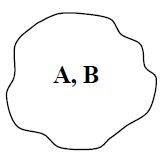
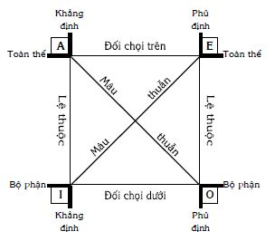

# TƯ DUY LÔGÍCH

## Mở đầu {#sec:8:1:}
Danh từ “lôgích” (Logic – tiếng Anh, Логика – tiếng Nga) thường được dùng theo những nghĩa sau:

1) Khoa học về các quy luật của tư duy và các hình thức của nó. Ví dụ, lôgích học hình thức; lôgích học biện chứng.

2) Cách suy luận (suy lý), lập luận, lý lẽ, mặc dù cách đó có thể đúng, có thể sai. Ví dụ, anh ấy có lôgích của mình; lôgích của kẻ mạnh; lôgích đàn bà; cách lập luận thiếu lôgích; các vấn đề khai triển có lôgích.

3) Tính hợp lý, chặt chẽ, quy luật nội tại của cái nào đó. Ví dụ, lôgích các sự vật; lôgích các sự kiện.

Đi ngược thời gian, từ lôgích có gốc Hy Lạp là logos với những nghĩa như lời nói, ý nghĩ, sự hợp lý, quy luật. Trong số các nghĩa đó, logos có nghĩa khởi đầu là quy luật phổ biến, cơ sở của thế giới, trật tự và sự hài hòa của thế giới. Logos là một trong những khái niệm cơ bản của triết học Hy Lạp.

Như chúng ta biết từ quyển hai (xem _Chương 6: Tư duy sáng tạo: Nhìn theo góc độ thông tin–tâm lý_), tâm lý học nghiên cứu quá trình suy nghĩ của cá nhân dẫn đến các kết quả, sản phẩm của tư duy dưới dạng các khái niệm, ý tưởng... Tâm lý học nghiên cứu, trả lời các câu hỏi như ý nghĩ này hoặc ý nghĩ khác của cá nhân phát sinh, phát triển như thế nào? Tại sao? Nói cách khác, tâm lý học nghiên cứu các quy luật diễn tiến của quá trình tư duy, ở đó có sự tham gia tích cực của các hiện tượng tâm lý.

Lôgích học hình thức là khoa học nghiên cứu các hình thức của tư duy như các khái niệm, phán đoán, suy luận, mà không xét đến nội dung cụ thể của chúng và các quy luật, nguyên tắc, quy tắc biến đổi mà chúng phải tuân theo để có những kết luận đúng. Nói một cách dễ hiểu, điều này cũng tương tự như trong đẳng thức sau: (a+b)2 = a2 \+ 2ab + b2, người ta không quan tâm a, b là những con số cụ thể nào, do đâu mà có, sẽ được dùng làm gì, quy tắc biến đổi ở trên vẫn luôn luôn có hiệu lực. Lôgích học hình thức tựa như nghiên cứu các ý nghĩ có sẵn (khái niệm, phán đoán...) và thiết lập sự tương quan nhất định (kiểu như các đẳng thức, các biến đổi) giữa chúng. Bằng cách đó, lôgích học hình thức không chú ý đến các điều kiện (tâm lý, hoàn cảnh bên ngoài) trực tiếp làm phát sinh và phát triển các ý nghĩ dưới dạng các khái niệm, phán đoán, suy luận. Đi xa hơn nữa trong việc hình thức hóa, G. Boole (1815 – 1864) xây dựng đại số lôgích với việc sử dụng các ký hiệu toán học và toán học hóa các lập luận lôgích. N. Wiener, cha đẻ của điều khiển học nhấn mạnh, không có lôgích toán học thì không có điều khiển học kỹ thuật. Ở đó, các hệ thống tự động và máy tính phải sử dụng đại số lôgích, là phần đầu tiên của lôgích học hình thức hiện đại. Trong các hệ thống điều khiển, các mạch rơle–tiếp điểm mô hình hóa các thao tác lôgích đóng vai trò rất quan trọng. G.Y. Povarov cho rằng: _“Lôgích toán học là công cụ cần thiết để “máy hóa” lao động trí óc”_.

Hiện nay có không ít sách, kể cả sách giáo khoa về lôgích học hình thức bằng tiếng Việt (xem phần Tài liệu tham khảo và nên tìm đọc thêm ở cuối quyển sách này) và lôgích học là môn học bắt buộc dạy trong nhiều trường đại học, cao đẳng. Do vậy, về lôgích học hình thức, người viết chỉ trình bày vắn tắt và nhấn mạnh những ý mà chủ quan người viết cho là quan trọng, cần thiết, đóng vai trò các kiến thức cơ sở của môn học PPLSTVĐM. Đồng thời, cũng trong Chương 8 này, người viết sẽ cụ thể hóa một số ứng dụng lôgích học hình thức vào các giai đoạn của quá trình suy nghĩ giải quyết vấn đề và ra quyết định như tiếp thu thông tin (hiểu bài toán), xử lý thông tin, phát ý tưởng lời giải (xem _Hình 43: Mô hình tư duy trong ngữ cảnh của mô hình nhu cầu–hành động_ của quyển hai _“Thế giới bên trong con người sáng tạo”_), dưới dạng liên quan đến suy luận, giả thiết, chứng minh, bác bỏ.

Trong quá trình trình bày, người viết không sử dụng các ký hiệu đặc trưng của lôgích học hiện đại mà diễn giải bằng ngôn ngữ tự nhiên (ngôn ngữ dùng trong đời sống hàng ngày). Điều này là cần thiết, ít nhất, do hai lý do sau: 1) Phần lớn các bài toán gặp trong cuộc đời của mỗi người được phát biểu và suy nghĩ giải bằng ngôn ngữ tự nhiên; 2) Nhiều bạn đọc nhìn thấy các ký hiệu, liên tưởng ngay đến toán học và trở nên ngần ngại trong việc tiếp thu các kiến thức của lôgích hình thức.

## Các quy luật cơ bản của lôgích hình thức {#sec:8:2:}
Quy luật được hiểu là sự liên hệ bản chất, phổ biến và lặp lại giữa các hiện tượng, mà sự liên hệ đó tạo ra sự thay đổi, điều chỉnh các hiện tượng. Nói cách khác, các quy luật tồn tại một cách khách quan, độc lập với ý thức của mọi người và thể hiện các mối liên hệ bên trong cơ bản, tất yếu giữa các sự vật, tính chất của các sự vật hoặc giữa các khuynh hướng khác nhau của sự phát triển. Trên thực tế, các quy luật rất đa dạng. Biết các quy luật, người ta có thể giải thích, đoán trước (dự báo) tiến trình của quá trình thay đổi và sử dụng các quy luật phục vụ cho các nhu cầu của con người.

Theo nghĩa rộng, các quy luật của tư duy lôgích nói chung (hình thức, biện chứng...) là sự phản ánh lôgích thế giới khách quan trong tư duy chủ quan của con người: Lôgích khách quan quyết định lôgích chủ quan chứ không phải ngược lại. Tuy nhiên, lôgích chủ quan có tính độc lập tương đối của nó, vì tư duy có các quy luật riêng. Nếu như thế giới khách quan có nhiều khía cạnh thì lôgích hình thức chỉ phản ánh khía cạnh tương đối ổn định của sự vật. Điều này có nghĩa, lôgích hình thức có phạm vi áp dụng của mình và ở ngoài phạm vi áp dụng của lôgích hình thức, bạn cần tư duy theo lôgích khác. Người viết còn quay trở lại vấn đề này trong hai chương sau. Từ _Chương 8: Tư duy lôgích hình thức_ này, nếu không có chú thích đặc biệt, đôi khi để cho gọn, các cụm từ _“tư duy lôgích hình thức”_ sẽ được người viết thay bằng _“tư duy lôgích”_ và _“lôgích hình thức”_ \- _“lôgích”_. Dưới đây là các quy luật cơ bản của tư duy lôgích:

1) Quy luật đồng nhất

Đối tượng cho trước (hiểu theo nghĩa rất rộng) là đối tượng cho trước (nó đồng nhất với chính nó) chứ không phải là đối tượng khác.

Quy luật đồng nhất đòi hỏi người suy nghĩ xác định, nhận dạng đối tượng cho trước; phân biệt đối tượng cho trước với các đối tượng khác; sử dụng đối tượng cho trước một cách nhất quán. Các đối tượng thường được đặt tên bằng các từ ngữ và con người suy nghĩ bằng ngôn ngữ. Người suy nghĩ cần bảo đảm mỗi từ, ngữ thể hiện một đối tượng ở trạng thái ổn định, không có sự thay đổi về chất (không có thêm chất mới hoặc mất đi chất đang có) trong suốt quá trình suy nghĩ. Tuân thủ quy luật đồng nhất đem lại ích lợi: Người suy nghĩ một mình có được quá trình suy nghĩ nhất quán, rút ra những kết luận đúng đắn; những người cùng suy nghĩ có được sự thống nhất, hiểu nhau khi trao đổi các ý nghĩ, giao tiếp với nhau.

Ví dụ, một người thắng trong một cuộc chơi vật tay với bạn, trong khi những lần trước thì thua. Anh chỉ vào bắp tay của mình và giải thích lý do: _“Thắng được là nhờ miếng thịt ăn ngày hôm qua đấy”_. Anh đã vi phạm quy luật đồng nhất vì, _“miếng thịt”_ ăn ngày hôm qua và _“miếng thịt”_ trong bắp tay ngày hôm nay không phải là một. Ví dụ khác, nếu đặt chữ _“a”_ là tên của âm _“a”_ (đối tượng cho trước) thì trong toàn bộ các văn bản, chữ _“a”_ chỉ thể hiện âm _“a”_. Bạn không được dùng những chữ khác hoặc ký hiệu khác để nói rằng đấy là âm _“a”_, hoặc lúc nào đó, bạn nói rằng chữ _“a”_ thể hiện đại lượng gia tốc của chuyển động trong vật lý, mà không thông báo trước cho chính mình và cho những người khác về sự thay đổi đó. Bạn cũng vi phạm quy luật đồng nhất.

Quy luật đồng nhất dẫn đến hai quy luật: Quy luật về mâu thuẫn và quy luật triệt tam, được trình bày tiếp theo sau đây.

2) Quy luật về mâu thuẫn

Đối tượng cho trước không thể vừa là chính nó, vừa không là chính nó. Tương tự, hai ý nghĩ trái ngược nhau về đối tượng cho trước không thể cùng một lúc đều đúng. Nếu cả hai cùng đúng thì ở đây có mâu thuẫn lôgích và có sự vi phạm quy luật về mâu thuẫn. Do vậy, trong hai ý nghĩ trên, nếu ý nghĩ này đúng thì ý nghĩ kia sai và ngược lại, ý nghĩ kia đúng thì ý nghĩ này sai.

Ví dụ, hai người bạn A và B đang nói chuyện với nhau thì có người bước vào phòng. A nói: _“Ông ấy là ông C đấy”_. B nói: _“Ông ấy không phải là ông C, tớ biết mà”_. Người bước vào phòng không thể vừa là ông C, vừa không phải là ông C. Còn nếu A đúng thì B sai, hoặc nếu B đúng thì A sai. Tuy nhiên, có thể xảy ra trường hợp sau: Trước năm 2000, người bước vào phòng có tên là C nhưng từ năm 2000, người đó đổi tên thành D. Để không xảy ra mâu thuẫn, những người suy nghĩ về người bước vào phòng phải biết trước điều đó và trình bày một cách phân biệt. Chẳng hạn A nói: _“Trước năm 2000, ông ấy là ông C đấy”_, còn B nói: _“Từ năm 2000 đến nay, ông ấy là ông D, tớ biết mà”_.

3) Quy luật triệt tam (bài trung, loại trừ khả năng thứ ba)

Một đối tượng nào đó (hiểu theo nghĩa rất rộng) hoặc có hoặc không có, không có khả năng thứ ba.

Ví dụ, có ma hoặc không có ma, không có khả năng thứ ba, do vậy, trong hai ý kiến mâu thuẫn trên, một cái là đúng, một cái là sai; anh ấy học giỏi hoặc không học giỏi, không có khả năng thứ ba; chị ấy đồng ý hoặc không đồng ý, không có khả năng thứ ba; ý nghĩ đó đúng hoặc không đúng, không có khả năng thứ ba...

4) Quy luật lý do đầy đủ

Mọi đối tượng (hiểu theo nghĩa rất rộng) tồn tại đều có các lý do (các nguyên nhân) để tồn tại. Do vậy, các ý nghĩ phản ánh đúng các đối tượng đó cũng phải có các lý do đầy đủ.

Các lý do để các đối tượng tồn tại trong hiện thực là các lý do có thật. Ví dụ, sự trao đổi chất là lý do để các cơ thể sống tồn tại. Khi sự trao đổi chất ngưng hoạt động, các cơ thể sống cũng chết theo.

Để có được các ý nghĩ phản ánh đúng các đối tượng, các lý do đầy đủ là các lý do lôgích. Có nguồn gốc từ hiện thực, các lý do lôgích là các tiền đề dưới dạng các ý nghĩ phản ánh các định lý, quy luật... (các chân lý) đã biết, được tìm ra từ hiện thực. Do vậy, suy nghĩ tuân theo quy luật lý do đầy đủ bảo đảm có được các ý nghĩ mang tính kết luận đúng đắn. Ví dụ, muốn chứng minh hai tam giác và bằng nhau (kết luận đúng), bạn cần dựa vào các lý do lôgích đúng đã biết. Đó là ba trường hợp bằng nhau của tam giác đã được chứng minh là đúng trước đó: Cạnh–cạnh–cạnh; cạnh–góc–cạnh và góc–cạnh–góc.

Nhìn tuần tự theo thời gian, bất kỳ đối tượng tồn tại nào đều có thể xem là kết quả (hệ quả) của các nguyên nhân (các lý do) nhất định trước đó. Nói cách khác, ở đây có quan hệ giữa nguyên nhân và kết quả (hệ quả), hay gọi tắt là quan hệ nhân–quả. Đến lượt mình, bất kỳ đối tượng tồn tại nào lại có thể trở thành nguyên nhân tạo nên kết quả mới (hướng tới mục đích nào đó, có thể đã biết, có thể chưa). Ví dụ, nước, các chất khoáng, các chất hữu cơ, khí hậu, thời tiết... cùng cơ chế trao đổi chất của cây mận cụ thể là các nguyên nhân dẫn đến kết quả tạo hoa, trái, hột mận. Hoa, trái mận lại trở thành nguyên nhân (thức ăn) của sự tồn tại nhiều loài như ong, chim. Hột mận trở thành nguyên nhân để thế hệ cây mận mới ra đời. Trái mận còn dùng làm ô mai, là kết quả mới, còn chưa ai biết, khi món ăn đó chưa được tạo ra.

## Khái niệm {#sec:8:3:}
### Nội hàm, ngoại diên, mở rộng và thu hẹp khái niệm {#subsec:8:3:1:}
Như chúng ta đã biết (xem mục _\@ref(sec:1:1:) Vai trò của khái niệm_ của quyển một và mục nhỏ _\@ref(subsec:6:4:2:) Tiếp thu thông tin và các mức độ hiểu_ của quyển hai), các ý nghĩ phản ánh các đặc tính của một hay nhiều đối tượng (hiểu theo nghĩa rộng: Bất kỳ cái gì cũng có thể coi là đối tượng) hoặc chính đối tượng là các khái niệm, được đặt tên bằng các từ ngữ. Con người suy nghĩ, giao tiếp, đối thoại với chính mình và những người khác bằng các từ ngữ – các tên của các khái niệm. Khi sử dụng ngôn ngữ, người sử dụng gởi gắm trong mỗi từ ngữ – khái niệm hai điều:

1) Tập hợp các đối tượng mà từ ngữ đó phản ánh, gọi là **ngoại diên** của khái niệm.

2) Hệ thống các tính chất mà tất cả các đối tượng ngoại diên đều có, gọi là **nội hàm** (nội dung) của khái niệm. Nhờ nội hàm, người ta có thể xác định một đối tượng nào đó có thuộc ngoại diên của khái niệm cho trước hay không.

Ví dụ, khi dùng từ _“người”_, chúng ta dùng khái niệm _“người”_ với ngoại diên là tất cả mọi người trên Trái Đất này và nội hàm là các thuộc tính của con người.

Trong quá trình suy nghĩ, con người có những lúc phải làm thao tác mở rộng hoặc thu hẹp khái niệm cho trước thành những khái niệm khác; hoặc chuyển sự suy nghĩ từ khái niệm cho trước sang những khái niệm rộng hơn hoặc hẹp hơn. Thực chất của mở rộng khái niệm cho trước là xây dựng khái niệm có ngoại diên rộng hơn khái niệm cho trước. Lúc này, số lượng các thuộc tính có trong nội hàm của khái niệm mở rộng, giảm đi so với nội hàm của khái niệm cho trước. Ví dụ, mở rộng khái niệm _“người”_ sang khái niệm _“động vật”_, ngoại diên _“động vật”_ rộng hơn ngoại diên _“người”_. Nội hàm của _“động vật”_ hẹp hơn nội hàm _“người”_, vì một số hoạt động, thuộc tính chỉ có con người mới có như tư duy bằng ngôn ngữ, biết chế tạo và lao động bằng công cụ phải bỏ ra.

Tương tự như vậy nhưng theo chiều ngược lại, thu hẹp khái niệm là đưa ra khái niệm có ngoại diên hẹp hơn khái niệm cho trước. Số lượng các thuộc tính có trong nội hàm của khái niệm thu hẹp, tăng lên so với nội hàm của khái niệm cho trước. Ví dụ, thu hẹp khái niệm _“người”_ sang khái niệm _“các thầy, cô giáo”_, ngoại diên _“các thầy, cô giáo”_ hẹp hơn ngoại diên _“người”_. Nội hàm của _“các thầy, cô giáo”_ rộng hơn nội hàm _“người”_, vì ngoài những thuộc tính người nào cũng có, cần phải tính thêm thuộc tính: _Làm nghề dạy học_.

Tóm lại, quan hệ giữa ngoại diên và nội hàm là quan hệ ngược: Ngoại diên càng rộng thì nội hàm càng hẹp, hiểu theo nghĩa, số lượng các thuộc tính giảm đi; Ngoại diên càng hẹp thì nội hàm càng rộng: Số lượng các thuộc tính tăng lên.

Khi mở rộng khái niệm, ví dụ từ _“người”_ sang _“động vật”_, người suy nghĩ đi từ cái đặc thù sang cái phổ biến hơn. Trong lôgích học hình thức, mở rộng này được gọi là chuyển từ khái niệm giống sang khái niệm loài. Có nhiều khái niệm giống nằm trong khái niệm loài: Người, bò sát, chim, cá... đều nằm trong khái niệm _“động vật”_. Thu hẹp khái niệm là thao tác ngược lại: Chuyển từ khái niệm loài sang khái niệm giống, đi từ cái phổ biến đến những cái đặc thù hơn. Ví dụ, khái niệm _“người”_ có thể đặc thù hóa thành các khái niệm giống: _“Người da trắng”, “người da vàng”, “người da đen”_. Đến đây, bạn đọc có thể thấy tính tương đối của _“giống”_ và _“loài”_: Một khái niệm cho trước là loài của khái niệm hẹp hơn và là giống của khái niệm rộng hơn. Ví dụ, khái niệm _“người”_ là khái niệm giống của khái niệm loài _“động vật”_, đồng thời là khái niệm loài của các khái niệm giống _“người da trắng”, “người da vàng”, “người da đen”_.

Trong mỗi lĩnh vực có một loại các khái niệm đặc biệt, gọi là các phạm trù. Các phạm trù là các khái niệm mang tính khái quát cao nhất của lĩnh vực cho trước. Nói cách khác, các phạm trù là các khái niệm loài cao nhất và không là khái niệm giống của loài nào cả trong lĩnh vực cho trước. Ví dụ, trong lĩnh vực lôgích hình thức, _“khái niệm”, “phán đoán”, “suy luận (suy lý)”_... là các phạm trù; trong lĩnh vực vật lý, _“khối lượng”, “năng lượng”_... là các phạm trù; trong sinh học, _“di truyền”, “biến dị”_... là các phạm trù; trong kinh tế học, _“hàng hóa”, “giá trị”_... là các phạm trù...

Nếu xét trên phạm vi bao quát tất cả các lĩnh vực thuộc tự nhiên, xã hội, tư duy, các phạm trù triết học là những khái niệm chung nhất, phản ánh những mặt, những thuộc tính, những mối liên hệ cơ bản phổ biến nhất của toàn bộ thế giới hiện thực. Ví dụ, các khái niệm của phép biện chứng như _“vật chất”, “ý thức”, “số lượng”, “chất lượng”, “mâu thuẫn”, “nguyên nhân”, “kết quả”, “tất nhiên”, “ngẫu nhiên”, “khả năng”, “hiện thực”_... là các phạm trù triết học.

Người viết muốn lưu ý bạn đọc: Để tránh hiểu lầm do nhiều khái niệm có cùng tên gọi giống nhau, _“ý tại ngôn ngoại”_, bạn cần chỉ rõ khái niệm bạn đang dùng thuộc lĩnh vực nào. Ví dụ, bạn sử dụng khái niệm _“ngẫu nhiên”_ khi thì trong lĩnh vực xác suất, thống kê khi thì trong lĩnh vực triết học. Mỗi lần chuyển qua, chuyển lại, bạn cần thông báo cho người thu thông tin biết.

### Quan hệ giữa các khái niệm theo ngoại diên {#subsec:8:3:2:}
Nếu minh họa ngoại diên của khái niệm dưới dạng một hình khép kín thì một khái niệm nhất định (ví dụ, khái niệm A) với ngoại diên của nó, được biểu diễn bằng hình vẽ sau:

Hình 86: Khái niệm A và ngoại diên của nó

Dưới đây là các loại quan hệ thường gặp giữa các khái niệm theo ngoại diên:

**1\. Quan hệ đồng nhất:** Quan hệ giữa những khái niệm cùng chỉ một loại đối tượng mà ngoại diên của chúng hoàn toàn trùng nhau và nội hàm được coi tương đương nhau.

Ví dụ:

A là khái niệm _“người”_.

B là khái niệm _“động vật ở bậc thang cao nhất của sự tiến hóa tự nhiên”_.

Hình 87 minh họa ví dụ nói trên.

Hình 87: Quan hệ đồng nhất

**2\. Quan hệ lệ thuộc** (hay còn gọi là quan hệ bao hàm): Quan hệ giữa hai khái niệm mà ngoại diên của khái niệm này nằm trọn và chỉ chiếm một phần ngoại diên của khái niệm kia.

Ví dụ:

A là khái niệm _“người”_.

B là khái niệm _“người da vàng”_.

Xem Hình 88.

Hình 88: Quan hệ lệ thuộc (bao hàm)

Cần phân biệt quan hệ lệ thuộc nói trên với quan hệ “cơ học” giữa _“toàn thể”_ và _“bộ phận”_ kiểu như _“người”_ và _“chân người”, “tay người”_... Bởi vì, nếu như _“người”_ có thuộc tính chế tạo, lao động bằng công cụ thì _“chân người”, “tay người”_... đứng riêng, không có thuộc tính đó.

**3\. Quan hệ giao nhau:** Quan hệ giữa hai khái niệm mà ngoại diên của chúng có phần chung nhau và các nội hàm không loại trừ nhau.

Ví dụ: A là khái niệm _“người da vàng”_.

B là khái niệm _“người Mỹ”_.

Xem Hình 89.

Hình 89: Quan hệ giao nhau

**4\. Quan hệ ngang hàng:** Quan hệ giữa các khái niệm mà các ngoại diên của chúng (có thể giao nhau hoặc không giao nhau) cũng bị bao hàm bởi khái niệm lớn hơn (khái niệm loài).

Ví dụ 1:

A là khái niệm _“người”_ (khái niệm loài).

A1 là khái niệm _“người da vàng”_ (khái niệm giống).

A2 là khái niệm _“người da trắng”_ (khái niệm giống).

A3 là khái niệm _“người da đen”_ (khái niệm giống).

Quan hệ giữa các khái niệm A1, A2 và A3 là quan hệ ngang hàng với các ngoại diên không giao nhau.

Xem Hình 90.

Hình 90: Quan hệ ngang hàng với các ngoại diên không giao nhau

Ví dụ 2:

A là khái niệm _“người”_ (khái niệm loài).

A1 là khái niệm _“người da vàng”_ (khái niệm giống).

A2 là khái niệm _“người da trắng”_ (khái niệm giống).

A3 là khái niệm _“người da đen”_ (khái niệm giống).

B1 là khái niệm _“người Mỹ”_ (khái niệm giống).

Xem Hình 91.

Hình 91: Quan hệ ngang hàng với các ngoại diên giao nhau

**5\. Quan hệ mâu thuẫn:** Quan hệ giữa hai khái niệm mà nội hàm của chúng phủ định lẫn nhau (đã là cái này thì không phải cái kia), trong đó, chỉ có nội hàm của một khái niệm là được biết một cách chính xác và tổng ngoại diên của chúng bằng ngoại diên của khái niệm lớn hơn kế tiếp (khái niệm loài). Trong quan hệ mâu thuẫn, cái này đúng thì cái kia sai. Ngược lại, cái này sai thì cái kia đúng.

Ví dụ 1:

A là khái niệm _“người”_.

A1 là khái niệm _“người da vàng”_.

A10 là khái niệm _“không phải người da vàng”_.

A1 và A10 phủ định lẫn nhau. Nội hàm của khái niệm _“người da vàng”_ được biết chính xác trong khi nội hàm của khái niệm _“không phải người da vàng”_ không thật rõ. Không phải người da vàng thì có thể là người da trắng hoặc da đen, hoặc da đỏ.

Xem Hình 92.

Hình 92: Quan hệ mâu thuẫn

**6\. Quan hệ đối chọi (loại trừ, đối lập, ngược nhau):** Quan hệ giữa hai khái niệm mà nội hàm của khái niệm này ngược với, đồng thời loại trừ nội hàm của khái niệm kia và tổng ngoại diên của chúng nhỏ hơn ngoại diên của khái niệm lớn hơn kế tiếp (khái niệm loài). Trong quan hệ đối chọi, cái này đúng thì cái kia sai, cái kia đúng thì cái này sai nhưng nếu biết một cái là sai thì không thể kết luận cái kia là đúng. Có thể cả hai cái đều sai.

Ví dụ 1:

A là khái niệm _“người”_.

B là khái niệm _“người da trắng”_.

(-B) là khái niệm _“người da đen”_.

Trong trường hợp một người là người da đen thì người đó không phải là người da trắng. Ngược lại, một người là người da trắng thì người đó không phải là người da đen. Tuy nhiên, khi phát hiện ra người đó không phải là người da trắng thì không thể nói chắc chắn người đó là người da đen, có thể cả hai cùng sai vì còn có người da vàng, người da đỏ.

Xem Hình 93.

Hình 93: Quan hệ đối chọi

### Định nghĩa khái niệm {#subsec:8:3:3:}
* Theo nghĩa chung nhất, định nghĩa khái niệm là thao tác lôgích giải thích đầy đủ nội hàm (tất cả các tính chất mà tất cả các đối tượng ngoại diên của khái niệm cần được định nghĩa đều có) của khái niệm đó.

Về mặt nguyên tắc, định nghĩa khái niệm là một trong những thao tác lôgích tin cậy nhất để ngăn ngừa những hiểu lầm có thể xảy ra trong suy nghĩ, giao tiếp, thảo luận, tranh luận, nghiên cứu... Tuy quan trọng như vậy, do nhiều lý do, trong các lập luận của chúng ta, định nghĩa các khái niệm không được chú ý xứng đáng như là nó cần phải được chú ý. R. Abelson nhận xét: _“Thật là nghịch lý, không có vấn đề nhận thức nào được đặt ra tệ hơn vấn đề định nghĩa và cũng không có vấn đề nào cần có cách tiếp cận mới mẻ để giải quyết như vấn đề định nghĩa”_. Dưới đây, người viết đề cập một số khó khăn liên quan đến định nghĩa khái niệm trong thực tế.

* Định nghĩa khái niệm cho trước là khái niệm đó được giải thích thông qua các khái niệm đã biết. Trong quá khứ, chính các khái niệm đã biết nói trên cũng được định nghĩa thông qua các khái niệm đã biết trước đó nữa... và cứ như thế. Vậy, những khái niệm đầu tiên có được định nghĩa không? Chúng được định nghĩa như thế nào? Để giải quyết khó khăn này, người ta phải đưa ra và chấp nhận những khái niệm đầu tiên như những khái niệm đương nhiên có, mà không định nghĩa.

Khó khăn khác, gặp khi định nghĩa là: Các thuộc tính (nội hàm) của đối tượng được định nghĩa có rất nhiều. Nếu định nghĩa liệt kê đầy đủ các thuộc tính thì nó trở nên quá dài, rất bất tiện khi sử dụng.

Chưa kể, trong công việc định nghĩa còn có khó khăn liên quan đến quá trình nhận thức: Tất cả các thuộc tính của đối tượng cho trước không thể được nhận thức ngay từ đầu và một lần là xong. Nhận thức là quá trình kéo rất dài về mặt thời gian, nếu như không nói là vô tận. Điều này làm cho nội dung định nghĩa của khái niệm thay đổi theo thời gian, tùy thuộc vào những tiến bộ của nhận thức (khoa học, công nghệ, nghệ thuật...), mặc dù tên của khái niệm vẫn giữ nguyên.

Ngoài ra, còn cần phải kể đến khó khăn thuộc về phương pháp luận nhận thức. Hiện nay, khó khăn này thể hiện ở chỗ, khi chuyển sang nhận thức các đối tượng phức tạp, cách tiếp cận chuyên môn hóa của nhà nghiên cứu chỉ cho phép nhận thức một khía cạnh của đối tượng, tương ứng với chuyên môn cho trước. Do vậy, có những trường hợp cùng nghiên cứu một đối tượng, các nhà chuyên môn khác nhau căn cứ vào khía cạnh chuyên môn của mình, đưa ra các định nghĩa khác nhau về chính đối tượng đó. Bạn đọc có thể xem lại mục nhỏ _\@ref(subsec:3:3:4:) Giáo dục và đào tạo của tương lai: Vài nét phác thảo_ của quyển một và _Hình 65: Các nghĩa của đối tượng cho trước tùy thuộc vào chiều xem xét_ của quyển hai.

Ví dụ quá trình định nghĩa khái niệm _“con người”_ sau đây sẽ giúp minh họa phần nào các khó khăn vừa nêu:

Một trong những nhiệm vụ của định nghĩa là xác định (giúp nhận ra) đối tượng được định nghĩa và phân biệt nó với tất cả các đối tượng khác. Nhà triết học Platon định nghĩa: _“Con người là sinh vật không có lông vũ, đi bằng hai chân”_. Rõ ràng, trong tất cả các động vật di chuyển bằng hai chân chỉ có chim và người. Thân thể của tất cả các loài chim đều được phủ bằng lông vũ. Như vậy, động vật hai chân không có lông vũ chỉ có thể là con người. Nhà triết học Diogen nhổ sạch lông một con gà, mang đến chỗ Platon và nói: _“Đây là con người của ông đấy”_. Sau _“sự cố”_ này, Platon sửa lại định nghĩa của mình: _“Con người là động vật không có lông vũ, đi bằng hai chân với những móng rộng”_. Một nhà triết học khác định nghĩa: _“Con người là động vật có dái tai mềm”_. Quả thật, trớ trêu thay, trong tất cả các động vật, chỉ có con người có dái tai mềm.

Tuy đạt yêu cầu nhận dạng đối tượng được định nghĩa và phân biệt nó với các đối tượng khác, các định nghĩa trên không nêu được nội dung sâu sắc của khái niệm _“con người”_. Chúng nhắm đến các đặc điểm bên ngoài mang tính ngẫu nhiên mà không cho biết gì về bản chất của con người. Liệu con người có đánh mất bản chất của chính mình không, nếu các móng thu hẹp lại, hoặc dái tai trở nên cứng? Chắc chắn là không. Chính vì vậy, ngoài yêu cầu nhận dạng và phân biệt, yêu cầu làm rõ bản chất của đối tượng được định nghĩa cũng phải được đáp ứng. Các vấn đề phức tạp thường nảy sinh liên quan đến việc làm thỏa mãn cả yêu cầu làm rõ bản chất của đối tượng, khi tiến hành định nghĩa các khái niệm.

Một định nghĩa tốt là định nghĩa phản ánh được bản chất của đối tượng được định nghĩa. Nhưng bản chất thường không nằm lộ trên bề mặt, do vậy, cần có những nghiên cứu càng ngày, càng sâu sắc để phát hiện những thuộc tính bản chất của đối tượng cho trước. Đằng sau bản chất bậc một luôn ẩn giấu bản chất bậc hai; đằng sau bản chất bậc hai – bản chất bậc ba... cứ như thế không có bản chất cuối cùng. Điều này giải thích, vì sao một đối tượng nào đó cứ được nghiên cứu dài dài, không có điểm dừng; vì sao định nghĩa của nó thay đổi theo thời gian và vì sao kiến thức của một bộ môn khoa học nào đó nằm trong chính nội dung (định nghĩa) của các khái niệm chứ không phải hình thức (tên gọi) của các khái niệm. Như vậy, tính sâu sắc của định nghĩa phụ thuộc trực tiếp vào mức độ hiểu biết bản chất của đối tượng được định nghĩa. Chúng ta hiểu biết về bản chất của đối tượng nào đó càng sâu sắc, xác suất có được định nghĩa tốt về đối tượng đó càng lớn.

Quay trở lại với quá trình _“tiến hóa”_ của định nghĩa về con người. Nhà văn F. Rable coi con người là động vật biết cười, nhà triết học A. Bergson: Con người là động vật có khả năng cười và, đặc biệt, khả năng làm những người khác cười. Đây là những thuộc tính chỉ có con người mới có. Nhà văn J. Kardan định nghĩa con người là động vật có khả năng lừa dối và thường xuyên lừa dối chính mình cũng như những người khác. Nhà triết học A. Schopenhauer xem con người là động vật sầu thảm không có bản năng tạo ra những hành động tự tin, không sai lầm và lý trí con người không thể thay thế cho bản năng đó được.

Có thể dẫn thêm nhiều định nghĩa tương tự về con người. Chúng đều giống nhau ở điểm: Giải quyết chủ yếu vấn đề phân biệt người với các động vật khác. Chúng còn chưa đề cập đến những thuộc tính bản chất của con người.

Sự tồn tại các định nghĩa khác nhau về một đối tượng nào đó còn cho thấy, đối tượng càng phức tạp, có càng nhiều phương diện, khía cạnh thì số lượng các định nghĩa có thể có cũng càng nhiều. Bạn đọc có thể xem lại các định nghĩa khái niệm thông tin trong mục nhỏ _\@ref(subsec:6:3:1:) Thông tin_ của quyển hai để thấy rằng, thông tin là đối tượng phức tạp và chúng ta cần xử sự ra sao khi một khái niệm có nhiều định nghĩa khác nhau. Ngày nay, cùng với những hiểu biết về sự phức tạp của con người, số lượng các định nghĩa con người cũng tăng lên. Con người được định nghĩa như _“động vật trí tuệ”, “động vật kinh tế”, “động vật sử dụng ký hiệu”, “động vật thẩm mỹ”_... Tuy nhiên, tính sâu sắc của định nghĩa vẫn chưa đạt yêu cầu. Bởi vì, từ những quan tâm kinh tế của con người không suy ra được thái độ của con người đối với cái đẹp (thẩm mỹ). Tương tự như vậy, từ việc sử dụng các ký hiệu, không thể biết thêm được các khía cạnh khác của con người như kinh tế, thẩm mỹ... Định nghĩa tốt về con người cần chứa đặc trưng đầy đủ có thể có một cách cô đọng, mà từ đặc trưng đó có thể suy ra được các đặc điểm quan trọng khác của con người.

Trong ý nghĩa đó, hiện nay, định nghĩa sau về con người được coi là sâu sắc: _“Con người là động vật chế tạo các công cụ lao động”_. Chính đặc trưng này quy định các đặc điểm trong quan hệ của con người với kinh tế, ký hiệu, cái đẹp...

* Như chúng ta đã biết, thao tác định nghĩa là nêu ra nội dung của khái niệm. Nhiệm vụ tưởng như đơn giản này được thực hiện theo những cách thức rất đa dạng trên thực tế. Đi vào cụ thể, trước hết, người viết phân biệt các định nghĩa rõ ràng và các định nghĩa không rõ ràng.

Các định nghĩa rõ ràng có dạng đẳng thức giữa hai khái niệm. Sơ đồ chung của chúng: _“A là (được xác định bởi) B”_. Trong đó, A và B là hai khái niệm mà mỗi khái niệm được thể hiện bằng một từ hoặc cụm từ. Ví dụ, _“Phân tử là hạt nhỏ nhất của chất, mà hạt đó vẫn còn bảo toàn tất cả các tính chất hóa học của chất cho trước”_.

Các định nghĩa không rõ ràng không có dạng đẳng thức của hai khái niệm. Một đoạn văn bản, văn cảnh, trong đó có khái niệm mà chúng ta quan tâm, trong nghĩa nhất định, là định nghĩa không rõ ràng của khái niệm đó. Văn cảnh làm công việc kết nối với các khái niệm đã biết và một cách gián tiếp, giúp chúng ta hiểu nội dung của khái niệm được quan tâm. Ví dụ, đọc một bài báo, bạn bắt gặp khái niệm _“công nghệ cao”_. Căn cứ vào văn cảnh của bài báo, bạn có thể đoán _“công nghệ cao là các công nghệ liên quan đến điện tử, phần cứng của máy tính”_ hoặc _“công nghệ cao là các công nghệ sử dụng các hiệu ứng ở mức vi mô”_. Những định nghĩa không rõ ràng dựa trên văn cảnh, ngữ cảnh như vậy luôn không đầy đủ, không bền vững và ổn định.

Rất tiếc, hầu như tất cả các định nghĩa mà chúng ta gặp và sử dụng trong đời thường đều là các định nghĩa không rõ ràng. Trong giao tiếp, khi nghe một từ không hiểu, chúng ta thường cố gắng xác định nghĩa của nó căn cứ vào nội dung câu chuyện. Khi đọc văn bản tiếng nước ngoài, gặp một, hai từ không hiểu, chúng ta thường không tra tự điển ngay mà cố gắng suy đoán, hiểu chúng theo văn cảnh. Chưa kể, không có tự điển nào có thể bao quát được hết sự phong phú về nghĩa và sắc thái của các từ, mà sự phong phú này lại phản ánh sự phong phú của các tình huống (ngữ cảnh) có trên thực tế. Thông thường, từ ngữ được mọi người hiểu và sử dụng nhuần nhuyễn không phải nhờ từ điển giải thích, mà chủ yếu, nhờ các mối liên kết đa dạng giữa từ cho trước với các từ khác của ngôn ngữ sống động hàng ngày. Trong ý nghĩa này, các định nghĩa theo văn cảnh, dù chúng không hoàn hảo, là tiền đề cơ bản để sử dụng tốt ngôn ngữ.

Một dạng định nghĩa không rõ ràng là định nghĩa bằng cách tiếp xúc trực tiếp. Ví dụ, có người đề nghị bạn cho biết các đặc điểm của ngựa vằn, mà bạn gặp khó khăn khi giải thích bằng lời. Bạn có thể dẫn người đó ra sở thú, chỉ con vật được quan tâm và nói: _“Đây là ngựa vằn”_. Định nghĩa kiểu này có phần tương tự như định nghĩa dựa theo văn cảnh. Thay vì văn cảnh là một đoạn văn phản ánh tình huống, ở đó sử dụng khái niệm cho trước, thì ở đây, tình huống là tình huống thực tế: Sở thú, hàng rào, chuồng thú, các khách tham quan... và con ngựa vằn trong khung cảnh đó.

Định nghĩa bằng cách tiếp xúc trực tiếp cũng giống với các định nghĩa dựa theo văn cảnh ở chỗ: Chúng thiếu sự trọn vẹn, đầy đủ và bị nhiễu. Người tiếp xúc có thể quan niệm rằng: Ngựa vằn là con vật bị nuôi nhốt, dùng làm cảnh cho mọi người xem và trông rất thụ động. Nói cách khác, ở đây có thể có sự nhầm lẫn giữa cái đơn lẻ (con ngựa vằn cụ thể) với cái chung (khái niệm _“ngựa vằn”_).

Không phải tất cả các đối tượng của các khái niệm đều có thể định nghĩa theo kiểu tiếp xúc trực tiếp. Ví dụ, bạn có thể tiếp xúc trực tiếp với các đối tượng như _“hạt nhân”, “điện tử”, “trừu tượng”, “vô cùng”, “ma”_... không?

Ngoài các nhược điểm, định nghĩa tiếp xúc trực tiếp có ưu điểm gắn kết các đối tượng được định nghĩa với từ ngữ một cách sống động. Các từ ngữ không giúp tạo ra hình ảnh, âm thanh, xúc giác... về đối tượng là các từ ngữ bất lực và trống rỗng.

* Bây giờ chúng ta quay trở lại tìm hiểu nhiều hơn về các định nghĩa rõ ràng có dạng _“A là B”_ (A = B) với A và B là hai khái niệm. Trong đó, A là khái niệm cần được định nghĩa (nội hàm của nó cần được làm rõ); B là khái niệm dùng để định nghĩa (dùng để làm rõ nội hàm của A). Khái niệm B thường bao gồm khái niệm C rộng hơn khái niệm A (C là loài kế liền trên đối với A) và D là các dấu hiệu đặc thù (các dấu hiệu của khái niệm giống A), giúp tách những đối tượng thuộc ngoại diên khái niệm A riêng ra. Cách định nghĩa vừa nêu được gọi là định nghĩa thông qua loài và sự khác nhau về giống.

Ví dụ, _“Tam giác đều (A) là tam giác có ba cạnh bằng nhau (B)”_. Ở đây, A là “tam giác đều”; B gồm C là “tam giác” (“tam giác” là loài so với “tam giác đều”, hay nói khác đi, “tam giác đều” là giống của “tam giác”); D là “ba cạnh bằng nhau” (“ba cạnh bằng nhau” là các thuộc tính đặc thù của giống A – “tam giác đều”).

* Định nghĩa thông qua loài–giống là một trong những cách định nghĩa đơn giản và phổ biến nhất. Trong từ điển các loại, phần lớn các định nghĩa là thuộc loại này. Định nghĩa thông qua loài–giống đòi hỏi phải tuân theo những quy tắc định nghĩa nhất định:

1) Khái niệm cần được định nghĩa và khái niệm dùng để định nghĩa phải thay thế nhau được.

Điều này có nghĩa, trong một đoạn văn chẳng hạn, lúc dùng khái niệm A, lúc thay thế bằng khái niệm B, tính đúng đắn của đoạn văn không vì thế mà thay đổi.

2) Ngoại diên của khái niệm cần được định nghĩa và ngoại diên của khái niệm dùng để định nghĩa phải như nhau.

Nếu như ngoại diên của khái niệm dùng để định nghĩa rộng hơn ngoại diên của khái niệm cần được định nghĩa, chúng ta có loại sai lầm: Định nghĩa quá rộng. Ngược lại, nếu như ngoại diên của khái niệm dùng để định nghĩa hẹp hơn ngoại diên của khái niệm cần được định nghĩa, chúng ta có loại sai lầm: Định nghĩa quá hẹp.

3) Định nghĩa không được luẩn quẩn.

Không được định nghĩa khái niệm thông qua chính nó một cách trực tiếp hay gián tiếp.

Ví dụ, _“Thơ là thơ, không phải là văn xuôi”, “Tranh của Picasso là tuyệt tác, vì ông là họa sỹ vĩ đại; Picasso là họa sỹ vĩ đại vì các bức tranh của ông ấy là tuyệt tác”_.

4) Định nghĩa phải dễ hiểu đối với người cần sử dụng.

Điều này có nghĩa, phần dùng để định nghĩa phải gồm các khái niệm, mà người cần sử dụng đã biết và hiểu trước đó. Đồng thời, phần dùng để định nghĩa không có những hình ảnh, biểu tượng mang tính ẩn dụ, đa nghĩa hoặc tối nghĩa.

Ví dụ, định nghĩa kiểu: _“Trẻ em là hoa của cuộc sống”, “Kiến trúc là âm nhạc ở thể tĩnh”, “Cơ hội đang đến với chúng ta là cơ hội để chúng ta trở thành Thánh Gióng”_ là vi phạm quy tắc này.

5) Định nghĩa không thể là phủ định.

Bởi vì, khi phủ định khái niệm nào đó, người ta chưa khẳng định được điều gì, nếu như ở đó có nhiều khái niệm ngang hàng. Ví dụ, _“Đen không phải là trắng”_, nhưng không phải là trắng còn có rất nhiều màu sắc khác, mà đen chỉ là một màu trong số đó.

6) Định nghĩa phải ngắn gọn, hiểu theo nghĩa, không chứa những thuộc tính có thể suy ra lẫn nhau.

Ví dụ, định nghĩa _“Tam giác đều là tam giác có ba cạnh bằng nhau, ba góc bằng nhau và bằng sáu mươi độ”_ là thừa vì “tam giác có ba cạnh bằng nhau” đủ để suy ra các thuộc tính kia.

7) Định nghĩa phải chứa đầy đủ các thuộc tính bản chất của khái niệm.

Đây là quy tắc không dễ thực hiện đối với tất cả các khái niệm. Bởi vì, như đã nói ở phần trên, các thuộc tính bản chất của khái niệm phức tạp không thể phát hiện đầy đủ và một lần là xong. Liệu bạn có thể nêu đầy đủ hết các thuộc tính bản chất của các khái niệm như _“người”, “kinh tế”, “xã hội”, “hiện đại hóa”, “công bằng”, “dân chủ”, “văn minh”_... được không?

* Ngoài những gì đã trình bày trong mục nhỏ này về định nghĩa khái niệm, người viết muốn lưu ý bạn đọc thêm một số điểm liên quan đến việc sử dụng các định nghĩa trong cuộc sống, công việc hàng ngày:

\- Các định nghĩa dùng trong thực tế thường kết hợp các yếu tố mô tả với các yếu tố mang tính yêu cầu đối với nội hàm của khái niệm được định nghĩa.

Ví dụ, từ điển giải thích không chỉ mô tả các nghĩa (nội dung) của các từ, mà các từ đó cùng với các nghĩa của chúng nảy sinh dần dần trong suốt quá trình phát triển của một dân tộc. Các nhà soạn từ điển còn đề ra nhiệm vụ: Chấn chỉnh, chuẩn hóa các nghĩa thành yêu cầu đối với việc hiểu và sử dụng đúng các từ (khái niệm). Chẳng hạn, _“Đại từ điển tiếng Việt”(Nguyễn Như Ý chủ biên, Nhà xuất bản văn hóa thông tin, năm 1999)_ định nghĩa khái niệm _“xuất sắc”_: _“Xuất sắc là tốt, giỏi, vượt trội hẳn so với bình thường”_. Một mặt, định nghĩa vừa nêu mô tả các thuộc tính bản chất của khái niệm _“xuất sắc”_. Mặt khác, định nghĩa cũng yêu cầu người sử dụng khái niệm _“xuất sắc”_ dùng cho đúng đối tượng và đối tượng chưa _“xuất sắc”_ biết được yêu cầu để trở thành _“xuất sắc”_ là như thế nào.

Từ đây chúng ta có thể thấy, một lớp học có hầu hết học sinh là học sinh xuất sắc, lạm phát danh hiệu cá nhân và đơn vị xuất sắc chứng tỏ khái niệm _“xuất sắc”_ đã bị dùng ra ngoài phạm vi áp dụng của nó, không còn chính danh nữa. Lẽ ra khi danh không chính thì ngôn không thuận. Rất tiếc, hiện nay, không ít từ tiếng Việt bị dùng sai định nghĩa có trong từ điển và nhiều người có danh hiệu _“xuất sắc”_ cứ tự hào, tưởng mình là _“xuất sắc”_ thật. Điều này rất nguy hiểm, vì con người suy nghĩ và giao tiếp chủ yếu bằng ngôn ngữ. Cái sai ngôn ngữ dẫn đến cái sai suy nghĩ, xúc cảm và hành động.

Tóm lại, chức năng mô tả của định nghĩa cho biết đối tượng được định nghĩa có những đặc điểm gì và chức năng yêu cầu chỉ ra đối tượng được định nghĩa phải như thế nào mới đạt:

\- Định nghĩa là công cụ cần thiết để có được các khái niệm, phán đoán và sự suy luận dễ hiểu không chỉ cho mình mà cho cả những người khác, nhờ giải thích cái chưa biết thông qua những cái đã biết. Cũng giống như các công cụ nói chung, thao tác định nghĩa cũng có phạm vi áp dụng. Không thể định nghĩa mọi thứ cũng như không thể chứng minh mọi thứ. Định nghĩa thường không dùng đối với những đối tượng thấy rõ, hiển nhiên. Ví dụ, bạn thử định nghĩa chân, tay, anh, chị, em... của bạn xem. Thứ nhất, bạn thấy công việc định nghĩa trở nên rối rắm, phức tạp. Thứ hai, quan trọng hơn, bạn không thấy sự cần thiết phải định nghĩa những đối tượng kiểu như vậy vì khi bạn nói về chân, tay, anh, chị, em... của bạn, mọi người đều hiểu bạn rất tốt.

\- Mặt khác, cố gắng định nghĩa đối tượng vào lúc đối tượng đó còn ít được hiểu biết có thể dẫn đến sự ngộ nhận, thậm chí lạc hướng, cản trở nhận thức. Ví dụ, trong một thời kỳ lịch sử khá dài, nguyên tử được định nghĩa là hạt nhỏ nhất không thể phân chia thêm nữa. Nếu bạn tiếp tục giữ định nghĩa đó, bạn sẽ không nghĩ đến việc tìm hiểu cấu trúc bên trong của nguyên tử. Vật lý nguyên tử, hạt nhân, điện tử... không có cơ hội để ra đời và phát triển. Như chúng ta biết, cùng với sự phát triển của vật lý, định nghĩa vừa nêu là sai và bị thay thế bằng những định nghĩa khác, càng ngày, càng sâu sắc, phản ánh bản chất nguyên tử chính xác hơn.

\- Thực tế cho thấy, các định nghĩa chặt chẽ nhất, ổn định nhất là các định nghĩa của các đối tượng trừu tượng một cách lý tưởng trong các khoa học chính xác như toán học. Người ta dễ dàng định nghĩa hình vuông, hình tròn, hình tam giác, số chẵn, số lẻ... trong khi định nghĩa những đối tượng cụ thể, có thực với các tính chất đa dạng thì khó hơn rất nhiều. Do vậy, không phải ngẫu nhiên, các định nghĩa của các khái niệm hình học, số học không thay đổi trong suốt hàng ngàn năm. Còn khái niệm điện tử, chỉ trong vài chục năm, đã có hàng chục định nghĩa khác nhau, thay thế nhau.

\- Chưa kể, trong các lĩnh vực tri thức khác nhau, các yêu cầu về định nghĩa cũng khác nhau. Ví dụ, không thể đòi hỏi đạo đức học, khoa học nghiên cứu các hiện tượng phức tạp của nhân cách, phải có được các định nghĩa chặt chẽ, chính xác như toán học. Định nghĩa là rất quan trọng, nhưng không nên cho rằng càng đưa vào nhiều định nghĩa thì lập luận của chúng ta càng trở nên rõ ràng, chính xác. Một lần nữa, chúng ta cần nhớ lại luận điểm _“Chân lý luôn luôn là cụ thể”_ và khái niệm _“Phạm vi áp dụng”_.

Nói chung, thao tác lôgích định nghĩa phát huy tác dụng trong khoảng giữa, bị chặn bởi đầu này là những đối tượng hiển nhiên không cần định nghĩa và đầu kia là những đối tượng còn ít hiểu biết, chưa chín muồi để định nghĩa. Ngoài ra, cần linh động trong việc sử dụng các hình thức định nghĩa cho thích hợp, tùy theo hoàn cảnh và mục đích cụ thể. Ví dụ, trong trường hợp cụ thể này cần dùng định nghĩa rõ ràng thông qua loài–giống. Trong trường hợp cụ thể khác, định nghĩa dựa theo văn cảnh thích hợp hơn. Trong trường hợp cụ thể khác nữa, định nghĩa bằng tiếp xúc trực tiếp lại đem đến ích lợi nhiều nhất. Việc khăng khăng đòi hỏi chỉ sử dụng định nghĩa rõ ràng thông qua loài–giống ở mọi nơi, mọi lúc là không phù hợp với sự đa dạng, gặp trong thực tế.

### Phân chia khái niệm {#subsec:8:3:4:}
* Phân chia khái niệm là thao tác lôgích làm rõ ngoại diên khái niệm, bằng cách sắp xếp tất cả các đối tượng thuộc ngoại diên khái niệm bị phân chia thành các nhóm (gọi là các bộ phận phân chia) theo những dấu hiệu nhất định (gọi là cơ sở phân chia).

Ví dụ, các tam giác có thể phân chia thành các nhóm: Các tam giác nhọn, các tam giác vuông, các tam giác tù (các bộ phận phân chia). Việc phân chia tiến hành theo dấu hiệu (cơ sở phân chia): Đặc trưng góc của tam giác. Như vậy, ngoại diên của khái niệm _“tam giác”_ được phân chia thành ngoại diên của các khái niệm: _“Tam giác nhọn”, “tam giác vuông”, “tam giác tù”_.

Trong trường hợp chung, khái niệm có ngoại diên bị phân chia chính là khái niệm‑loài, còn các khái niệm mới, có được như là kết quả của việc phân chia, là các khái niệm‑giống. Phân chia ngoại diên khái niệm‑loài thành các khái niệm‑giống tức là đi tìm các dấu hiệu (cơ sở phân chia) mà những dấu hiệu đó có ở những giống này và không có ở những giống khác. Điều này có nghĩa, sau khi phân chia, trong nội hàm của các khái niệm‑giống có các dấu hiệu của khái niệm‑loài và khái niệm‑giống này có các dấu hiệu khác với khái niệm‑giống kia. Ví dụ, nội hàm các khái niệm‑giống _“tam giác nhọn”, “tam giác vuông”, “tam giác tù”_ có tất cả các dấu hiệu của nội hàm khái niệm‑loài _“tam giác”_. Đồng thời nội hàm khái niệm‑giống _“tam giác nhọn”_ có dấu hiệu tất cả ba góc đều nhọn, là dấu hiệu mà nội hàm của hai khái niệm‑giống kia _“tam giác vuông”, “tam giác tù”_ không có.

Đến lượt mình, các khái niệm‑giống lại có thể trở thành đối tượng bị phân chia và... cứ như thế. Cách phân chia nhiều bậc, nhánh như vừa nêu là trường hợp riêng của phân chia khái niệm và gọi là sự phân loại theo nghĩa chặt chẽ nhất.

Một dạng phân chia đặc biệt là phân đôi với cơ sở phân chia cực đoan: Có dấu hiệu đó và không có dấu hiệu đó. Ví dụ, thay vì phân chia mọi người thành nam và nữ; hoặc người lớn và trẻ em, phân đôi phân chia mọi người thành nam và không nam; người lớn và không người lớn. Tuy có ưu việt trong một số trường hợp, phân đôi khái niệm là cách phân chia nghèo nàn vì không quan tâm đến những dấu hiệu, đặc trưng cụ thể của một nửa kia của khái niệm bị phân chia.

Nếu đem so sánh phân chia khái niệm với phép tính chia, chúng ta thấy có sự tương tự: Khái niệm bị phân chia (khái niệm‑loài) ứng với số bị chia; cơ sở phân chia – số chia; các bộ phận phân chia (khái niệm‑giống) – thương số (kết quả của phép tính chia).

* Phân chia khái niệm cần tuân theo các quy tắc sau:

1) Phân chia phải nhất quán theo một cơ sở.

Quy tắc này đòi hỏi, dấu hiệu hoặc tập hợp các dấu hiệu được chọn làm cơ sở phân chia phải không được thay đổi, thay thế bằng các dấu hiệu khác trong suốt quá trình phân chia. Ví dụ, lúc đầu khí hậu phân chia theo dấu hiệu nhiệt độ trung bình năm, người thực hiện phân chia thu được: Khí hậu lạnh, ôn hòa và nóng. Sau đó, khí hậu lại phân chia theo dấu hiệu địa lý và thu được: Khí hậu biển, lục địa. Kết quả cuối cùng của quá trình phân chia thu được: Khí hậu lạnh, ôn hòa, nóng, biển, lục địa. Cách phân chia trong ví dụ này đã vi phạm quy tắc một.

2) Phân chia phải hợp tỷ lệ (còn gọi là cân đối hoặc sử dụng hết).

Điều này có nghĩa, tổng ngoại diên của các bộ phận phân chia (các khái niệm‑giống) phải bằng ngoại diên của khái niệm bị phân chia (khái niệm‑loài). Đòi hỏi này ngăn ngừa khả năng bỏ quên, bỏ sót bộ phận phân chia nào đó. Ví dụ, phân chia các tam giác chỉ thành các tam giác nhọn, vuông sẽ bỏ sót các tam giác tù; phân chia mọi người thành trình độ văn hóa tiểu học, trung học, đại học có thể sẽ bỏ quên những người không đi học.

3) Các bộ phận phân chia (các khái niệm‑giống) phải loại trừ lẫn nhau.

Theo quy tắc này, mỗi đối tượng thuộc ngoại diên khái niệm‑loài phải thuộc ngoại diên của chỉ một khái niệm‑giống và không thuộc ngoại diên của các khái niệm‑giống khác. Ví dụ, tam giác vuông cụ thể nào đó sẽ thuộc ngoại diên của khái niệm‑giống _“tam giác vuông”_ và không thuộc ngoại diên của các khái niệm‑giống _“tam giác nhọn”_ và _“tam giác tù”_. Nói cách khác, các ngoại diên của các khái niệm‑giống không giao nhau. Do vậy, cách phân chia sau bị xem là sai vì vi phạm quy tắc ba: Phân chia mọi người thành những người thích xem phim và những người thích xem kịch mà trong số đó còn có cả những người vừa thích xem phim, vừa thích xem kịch.

4) Phân chia phải liên tục.

Quy tắc này đòi hỏi phải phân chia tuần tự từ khái niệm‑loài sang các khái niệm‑giống kế tiếp liền kề chứ không được _“nhảy cóc”_ sang các khái niệm‑giống của các bậc thấp hơn.

Ví dụ, động vật có xương sống phân chia thành các lớp: Cá, lưỡng cư, bò sát, chim và có vú. Sau đó, từng lớp nói trên có thể phân chia thành các khái niệm‑giống kế tiếp như cá thành cá có vảy, cá không có vảy... Cách phân chia vừa nói tuân theo quy tắc bốn. Còn cách phân chia sau sẽ là không liên tục: Động vật có xương sống được phân chia thành cá có vảy, cá không vảy, lưỡng cư, bò sát, chim và có vú. Ở đây, có sự _“nhảy cóc”_, bỏ qua khái niệm‑giống _“cá”_, là khái niệm‑giống kế liền dưới khái niệm‑loài _“động vật có xương sống”_.

* Dưới đây là một số điểm lưu ý về phân chia khái niệm:

\- Phân chia khái niệm là thao tác lôgích thường dùng trong lập luận. Khi định nghĩa khái niệm, chúng ta tập trung làm rõ nội hàm của nó thông qua các dấu hiệu (các thuộc tính bản chất) của đối tượng được định nghĩa. Thực hiện phân chia khái niệm, chúng ta có được cái nhìn tổng quan, chi tiết hơn về các đối tượng tạo nên ngoại diên của khái niệm. Như vậy, định nghĩa khái niệm và phân chia khái niệm bổ sung, hỗ trợ cho nhau. Ví dụ, với định nghĩa khái niệm _“tam giác”_, bạn nhận dạng được tam giác thông qua các thuộc tính bản chất của nó. Với phân chia khái niệm _“tam giác”_, bạn thấy được sự đa dạng của tam giác như tam giác thường, cân, đều; tam giác nhọn, vuông, tù.

\- Cần phân biệt phân chia khái niệm với phân chia đối tượng nào đó một cách _“cơ học”_. Ví dụ, cây phân chia thành cây lá rộng, cây lá kim, là phân chia khái niệm (lôgích). Còn phân chia cây thành tán lá, thân và rễ là phân chia _“cơ học”_. Phân chia _“cơ học”_ là phân chia đối tượng ra các bộ phận cấu thành. Trong đó, mỗi bộ phận cấu thành không phải là chính đối tượng: Tán lá, thân và rễ đứng riêng không phải là cây. Cây lá rộng hoặc cây lá kim đứng riêng, trong phân chia khái niệm, vẫn là cây.

\- Phân loại, với tư cách là trường hợp riêng của phân chia lôgích, được sử dụng rộng rãi trong khoa học. Cũng chính tại đây, người ta có được những phân loại phức tạp, chặt chẽ và hoàn thiện nhất. Phân loại khoa học giúp hệ thống hóa sự đa dạng, phát hiện các mối liên kết mang tính quy luật giữa các đối tượng ngoại diên. Từ đó, các nhà nghiên cứu có những dự báo về các tính chất của các đối tượng ngoại diên đã biết và cả về sự tồn tại những đối tượng ngoại diên chưa biết cùng các tính chất của chúng. Một trong các ví dụ tiêu biểu về phân loại khoa học là hệ thống tuần hoàn các nguyên tố hóa học của Đ.Y. Menđeleev. Lịch sử phát triển _“Bảng tuần hoàn”_ với những ô trống của các nguyên tố hóa học cùng các tính chất của chúng được dự báo trước, dần dần được lấp đầy bởi sự phát hiện các nguyên tố đó trong thực tế, đã chứng minh một cách thuyết phục về các ích lợi của phân loại trong khoa học.

Tuy nhiên, chúng ta không nên tuyệt đối hóa vai trò của việc phân loại vì nhiều lý do. Thứ nhất, cái gọi là các dấu hiệu bản chất dùng làm cơ sở để phân loại có thể thay đổi theo thời gian, do các nhà nghiên cứu hiểu biết bản chất các đối tượng ngày càng tốt hơn. Thứ hai, hiện thực khách quan luôn ở trong trạng thái vận động, tiến hóa, phát triển, do vậy, những biên giới rạch ròi giữa các khái niệm‑giống trong khái niệm‑loài không phản ánh chính xác hiện thực khách quan như hiện thực khách quan vốn có. Ví dụ, người ta tìm được trên thực tế những đối tượng có những dấu hiệu vừa thuộc giống này, vừa thuộc giống kia, hoặc những đối tượng nằm ở chính biên giới của các giống. Thứ ba, có thể có những sai lầm trong việc diễn giải sự phân loại. Ví dụ, phân loại người theo nhóm máu rồi đi đến kết luận về sự phụ thuộc giữa trí thông minh và nhóm máu. Tóm lại, rất cần sự chú ý và thận trọng trong cả quá trình thực hiện phân loại và diễn giải các kết quả thu được từ phân loại, để có được các kết luận đúng.

\- Trong thực tế cuộc sống, công việc, phân chia khái niệm diễn ra không chặt chẽ như trong khoa học và vẫn được mọi người tiếp nhận vì những ích lợi nhất định. Ví dụ, bước vào hiệu sách, bạn thấy các chỗ để sách phân loại như: Sách văn học, khoa học, kỹ thuật, ngoại ngữ, từ điển, lớp 1, lớp 2,..., lớp 12, đại học. Nhìn theo quan điểm phân chia lôgích, ở đây có vấn đề vi phạm các quy tắc phân chia như quy tắc một: Phân chia phải nhất quán theo một cơ sở; quy tắc ba: Các bộ phận phân chia (các khái niệm‑giống) phải loại trừ nhau. Cụ thể, cơ sở phân chia theo lĩnh vực chuyên môn (văn học, khoa học, kỹ thuật...) khác cơ sở phân chia theo trình độ văn hóa (lớp 1, lớp 2,..., lớp 12, đại học). Quyển sách vật lý lớp 12 chẳng hạn, vừa thuộc khái niệm‑giống _“sách khoa học”_, vừa thuộc khái niệm‑giống _“sách lớp 12”_.

Giả sử, sách trong hiệu sách được phân chia rất lôgích, chỉ theo dấu hiệu chuyên môn. Trong khi cái mà bạn muốn mua là một số hoặc trọn bộ sách giáo khoa lớp 12, bạn sẽ thấy bất tiện như thế nào, khi phải tìm lần lượt các kệ bày, thu gom từng quyển sách.

Qua ví dụ vừa nêu, người viết muốn lưu ý bạn đọc tránh cực đoan: Lúc nào cũng đòi hỏi phải phân chia lôgích một cách chặt chẽ. Phân chia không phải vị phân chia, phân chia nhằm phục vụ cho mục đích nào đó, đối tượng sử dụng nào đó, nhằm giải quyết vấn đề nào đó. Trong cuộc sống, công việc hàng ngày, các mục đích, đối tượng sử dụng sự phân chia khái niệm rất đa dạng, do vậy, sự phân chia cũng phải rất đa dạng về cơ sở phân chia, tổ hợp của chúng... Bạn đừng ngại, nếu như có những tình huống, để đạt mục đích tốt, giải quyết được vấn đề và ra quyết định đúng, bạn phải vi phạm một hay vài quy tắc phân chia lôgích, như ví dụ về hiệu sách nêu ở trên. Có những lúc bạn cần cả sự phân chia không lôgích để tạo những hiệu ứng cần thiết như tạo tò mò, lôi cuốn sự chú ý, gây cười...

Tóm lại, phân chia lôgích cũng có phạm vi áp dụng của nó và không nên dùng nó ra ngoài phạm vi áp dụng đó.

## Phán đoán {#sec:8:4:}
### Định nghĩa, cấu trúc và hình thức ngôn ngữ của phán đoán {#subsec:8:4:1:}
Phán đoán là ý nghĩ liên kết các khái niệm lại với nhau và có dạng khẳng định: Khái niệm này là khái niệm kia, hoặc phủ định: Khái niệm này không là khái niệm kia. Phán đoán có thể đúng, có thể sai.

Ví dụ, phán đoán khẳng định: _“Hình dạng của Trái Đất là hình cầu”_ (phán đoán đúng). Phán đoán phủ định: _“Học sinh A không là học sinh kém”_. Nếu trên thực tế A là học sinh kém thì phán đoán này là sai.

Ý nghĩ–khái niệm được hình thức hóa bằng từ (cụm từ). Ý nghĩ–phán đoán (liên kết các khái niệm) có hình thức là một câu (mệnh đề) khẳng định hoặc phủ định. Mỗi câu (phán đoán) có ba bộ phận: Chủ từ (trong lôgích học ký hiệu là **S**), liên từ lôgích (sẽ gọi tắt là liên từ) và thuộc từ (từ chỉ thuộc tính ký hiệu là **P**). Trong hai ví dụ về phán đoán ở trên, Trái Đất và học sinh A là những chủ từ (**S**); là, không là – những liên từ; hình cầu, kém – những thuộc từ (**P**). Chúng ta có thể thấy, chủ từ phản ánh đối tượng mà bạn nghĩ đến; thuộc từ phản ánh thuộc tính của đối tượng; liên từ cho biết cách liên kết (khẳng định hay phủ định) chủ từ với thuộc từ.

Trong trường hợp chung, phán đoán lôgích có cấu trúc:

\- **S** là **P** đối với phán đoán khẳng định.

\- **S** không (phải) là **P** đối với phán đoán phủ định.

* Hình thức của phán đoán là câu nhưng câu–phán đoán lôgích và câu của ngôn ngữ tự nhiên (đời thường) có nhiều điểm khác nhau, không thể đồng nhất chúng với nhau. Bởi vì, lôgích học không nghiên cứu ngôn ngữ và các quy luật, quy tắc trong lôgích hình thức không giống như các quy luật, quy tắc trong ngôn ngữ. Dưới đây là một số điểm cần lưu ý về sự khác nhau đó:

\- Trong khi câu–ngôn ngữ có nhiều loại thì câu–phán đoán chỉ quan tâm hai loại câu khẳng định và phủ định. Do vậy, những câu không thuộc hai loại trên như nghi vấn, mệnh lệnh, khuyên bảo... không được coi là các phán đoán. Ví dụ, các câu như _“Liệu có nền văn minh ngoài Trái Đất không?”, “Anh làm ơn ra ngoài chờ tôi một lát!”, “Chị nên tìm đọc sách dạy nấu ăn!”_... không phải là các phán đoán.

\- Câu–ngôn ngữ có nhiều hình thức để diễn đạt cùng một ý nghĩ. Ví dụ, để diễn tả _“Hình dạng Trái Đất là hình cầu”_, có nhiều cách như _“Trái Đất tròn”, “Quả Đất giống quả cam”, “Hành tinh của chúng ta là quả cầu xanh”, “Quả cầu xanh”, “Nó tròn”_...

\- Có nhiều bẫy trong ngôn ngữ dẫn đến sự hiểu lầm (xem mục nhỏ _\@ref(subsec:6:4:3:) Ngôn ngữ, ký hiệu, hình vẽ_ của quyển hai).

\- Ngôn ngữ phục vụ nhiều mục đích. Do vậy, có những trường hợp, để đạt mục đích, ngôn ngữ không quan tâm đến các thao tác lôgích, thậm chí, cố ý tạo ra sự phi lôgích. Các mục đích loại này thường gặp trong văn học, quảng cáo, chuyện vui, ngụy biện, nghịch lý.

\- Ngôn ngữ do con người sáng chế ra và sử dụng hàng ngày, không chỉ diễn tả ý nghĩ, mà còn phản ánh các hiện tượng tâm lý khác như nhu cầu, xúc cảm, mong muốn (thói quen) tự nguyện (xem mục nhỏ _\@ref(subsec:5:7:1:) Mô hình nhu cầu–hành động_ của quyển hai), nên rất chủ quan, mang tính chọn lọc. Trong khi đó, tư duy lôgích có nhiệm vụ phản ánh đúng khía cạnh của hiện thực khách quan, được con người suy nghĩ quan tâm.

Tính đến và chú ý sự khác nhau giữa các thao tác tư duy lôgích có sử dụng ngôn ngữ với chính ngôn ngữ, giúp người suy nghĩ khai thác những mặt mạnh của ngôn ngữ và lôgích, đồng thời tránh những sai lầm không đáng có về ngôn ngữ và lôgích.

### Các loại phán đoán {#subsec:8:4:2:}
#### I. Phán đoán đơn

Phán đoán đơn là phán đoán chỉ có một chủ từ (một khái niệm) và một thuộc từ (một khái niệm khác).

* Dưới đây là một số cách phân loại của phán đoán đơn:

1) Phân loại phán đoán theo nội hàm của thuộc từ:

1a) Phán đoán thuộc tính là phán đoán về thuộc tính (dấu hiệu) của đối tượng. Ví dụ, _“Trái Đất có dạng cầu”_.

1b) Phán đoán quan hệ là phán đoán chỉ ra quan hệ giữa các đối tượng hoặc giữa các thuộc tính (dấu hiệu) của chúng. Ví dụ,_”Trái Đất lớn hơn Mặt Trăng”_.

1c) Phán đoán tồn tại là phán đoán khẳng định hoặc phủ định sự tồn tại của đối tượng. Ví dụ, _“Không tồn tại nền văn minh ngoài Trái Đất”_.

2) Phân loại phán đoán theo quan hệ với hiện thực:

2a) Phán đoán khả năng là phán đoán phản ánh những điều có thể đúng hoặc sai, chưa biết một cách chắn chắn. Ví dụ, _“Mùa đông này có thể ấm”, “Có thể đã có con người sống ở đây”, “Máy tính có thể bán hết trong tuần sau”_.

2b) Phán đoán thực là phán đoán phản ánh tình trạng có thực của đối tượng trong quá khứ và hiện tại. Ví dụ, _“Bạn An năm ngoái cao 1,57 mét”, “Bạn Hoa có nước da trắng”_.

2c) Phán đoán tất yếu là phán đoán khẳng định hoặc phủ định một cách chắc chắn dựa trên những hiểu biết mang tính quy luật. Ví dụ, _“Có công mài sắt, có ngày nên kim”, “Hết mưa, trời lại sáng”_.

* Người ta còn phân loại phán đoán theo chất, lượng, chất và lượng.

1) Phân loại phán đoán theo chất:

Chất ở đây được hiểu là sự khác nhau giữa “có thuộc tính đó” và “không có thuộc tính đó”. Do vậy, phân loại phán đoán theo chất, người ta có hai loại sau:

1a) Phán đoán khẳng định với công thức “S là P”.

1b) Phán đoán phủ định với công thức “S không là P”.

2) Phân loại phán đoán theo lượng:

Lượng ở đây được hiểu là số lượng. Phân loại phán đoán theo lượng, trên thực tế là phân loại phán đoán theo số lượng các đối tượng thuộc ngoại diên của chủ từ. Người ta có ba loại sau:

2a) Phán đoán toàn thể (còn gọi là phán đoán chung) là phán đoán chỉ ra toàn bộ các đối tượng thuộc ngoại diên chủ từ đều có cùng một thuộc tính nào đó. Ví dụ, _“Mọi người đều phải chết”, “Bất kỳ sinh vật sống nào cũng phải trao đổi chất”_. Phán đoán toàn thể có công thức: _“Mọi S là P”_ hoặc _“Mọi S không là P”_.

2b) Phán đoán bộ phận là phán đoán chỉ ra rằng, chỉ có một số đối tượng thuộc ngoại diên chủ từ có thuộc tính cho trước. Ví dụ, _“Một số học sinh là học sinh giỏi”, “Có những sinh vật chịu lạnh rất tốt”_. Phán đoán bộ phận có công thức: _“Một số S là P”_ hoặc _“Một số S không là P”_.

2c) Phán đoán đơn nhất là phán đoán chỉ ra thuộc tính của chủ từ, mà ngoại diên của chủ từ chỉ bao gồm một đối tượng. Ví dụ, _“Học sinh A là học sinh giỏi”, “Mặt Trăng là vệ tinh của Trái Đất”_.

3) Phân loại phán đoán theo chất và lượng:

Đây là phân loại kết hợp 1) và 2). Điều này có thể làm được vì phán đoán nào cũng hàm chứa thuộc tính P và số lượng S. Nếu xem trường hợp 2c) Phán đoán đơn nhất như trường hợp đặc biệt của phán đoán bộ phận, chúng ta có bảng sau:

Hình 94: Bảng hình thái phân loại phán đoán theo chất và lượng

Phân loại phán đoán theo chất và lượng có dạng chung sau: Cc – Ll với c, l = 1, 2. Từ đây, chúng ta có bốn loại phán đoán:

3a) C1 – L1 là phán đoán khẳng định toàn thể và ký hiệu là A.

3b) C2 – L1 là phán đoán phủ định toàn thể và ký hiệu là E.

3c) C1 – L2 là phán đoán khẳng định bộ phận và ký hiệu là I.

3d) C2 – L2 là phán đoán phủ định bộ phận và ký hiệu là O.

Trong lôgích học, bốn phán đoán trên gọi là bốn phán đoán cơ bản và các ký hiệu A, E, I, O tương ứng với chúng được sử dụng rộng rãi.

#### II. Phán đoán phức

Phán đoán phức là phán đoán bao gồm các phán đoán đơn, liên kết với nhau bằng các liên từ lôgích. Phán đoán phức có thể phân thành các loại sau:

1) Phán đoán kết hợp

Đây là phán đoán phức, tạo thành từ các phán đoán đơn, liên kết với nhau bằng liên từ lôgích _“và”_.

Ví dụ, từ hai phán đoán đơn _“Hà thích bóng chuyền”_; _“Minh thích bóng đá”_, ta có phán đoán kết hợp: _“Hà thích bóng chuyền và Minh thích bóng đá”_.

Đối với phán đoán kết hợp, chỉ khi các phán đoán đơn đồng thời đều đúng thì phán đoán kết hợp mới đúng. Nó sẽ sai khi ít nhất có một phán đoán đơn sai.

2) Phán đoán lựa chọn

Phán đoán lựa chọn, tạo thành từ các phán đoán đơn, liên kết với nhau bằng liên từ lôgích _“hoặc”_. Đi vào cụ thể, phán đoán lựa chọn lại chia thành:

2a) Phán đoán lựa chọn kết hợp

Ở đây, sự lựa chọn có khả năng kết hợp với nhau chứ không phải loại trừ nhau.

Ví dụ, _“Sản xuất hàng hóa có thể nộp thuế bằng tiền hoặc hiện vật”_. Người nộp thuế có quyền lựa chọn tiền hoặc hiện vật; hoặc kết hợp phần này nộp tiền và phần kia nộp hiện vật.

2b) Phán đoán lựa chọn tuyệt đối

Lúc này, sự lựa chọn là hoặc cái này, hoặc cái kia vì chúng loại trừ nhau. Ví dụ, _“8 giờ sáng mai tôi sẽ đi xe lửa hoặc máy bay ra Hà Nội”_. Trong ví dụ này, không thể vừa đi xe lửa, vừa đi máy bay ra Hà Nội được.

3) Phán đoán có điều kiện

Phán đoán có điều kiện, tạo thành từ các phán đoán đơn, liên kết với nhau bằng liên từ lôgích _“Nếu... thì...”_.

Ví dụ, _“Nếu bật máy lạnh thì phòng mát”_. Trong phán đoán có điều kiện, có sự phản ánh quan hệ nhân quả.

### Quan hệ giữa các phán đoán cơ bản {#subsec:8:4:3:}
Hình 95 mô tả quan hệ giữa các phán đoán cơ bản (xem mục nhỏ _\@ref(subsec:8:4:2:) Các loại phán đoán_, phần _I.3) Phân loại phán đoán theo chất và lượng_).

Hình 95: Quan hệ giữa các phán đoán cơ bản (hình vuông lôgích hay còn gọi là hình vuông các mặt đối lập)

Các phán đoán đơn so sánh được là các phán đoán đơn có cùng chủ từ và thuộc từ nhưng khác nhau về chất hoặc lượng; hoặc cả chất và lượng của chúng.

Để dễ trình bày quan hệ giữa các phán đoán cơ bản, người viết sử dụng các ví dụ cụ thể:

A (Phán đoán khẳng định toàn thể), ví dụ, _“Tất cả học sinh lớp này là học sinh trên trung bình”_.

E (Phán đoán phủ định toàn thể), ví dụ, _“Tất cả học sinh lớp này không là học sinh trên trung bình”_.

I (Phán đoán khẳng định bộ phận), ví dụ, _“Một số học sinh lớp này là học sinh trên trung bình”_.

O (Phán đoán phủ định bộ phận), ví dụ, _“Một số học sinh lớp này không là học sinh trên trung bình”_.

Chúng ta có thể thấy:

\- Quan hệ giữa A và I là quan hệ lệ thuộc (bao hàm). Điều này có nghĩa, cái đã khẳng định đúng với toàn thể cũng khẳng định đúng với bộ phận. Còn khi biết bộ phận được khẳng định đúng thì không thể kết luận toàn thể đúng hay sai được. Còn nếu I là sai thì A cũng sai.

Nếu A _“Tất cả học sinh lớp này là học sinh trên trung bình”_ là đúng thì I _“Một số học sinh lớp này là học sinh trên trung bình”_ đương nhiên là đúng.

Nếu I _“Một số học sinh lớp này là học sinh trên trung bình”_ là đúng thì không thể kết luận A _“Tất cả học sinh lớp này là học sinh trên trung bình”_ đúng hay sai.

Nếu I _“Một số học sinh lớp này là học sinh trên trung bình”_ là sai thì A _“Tất cả học sinh lớp này là học sinh trên trung bình”_ là sai. Vì, _“một số”_ còn chưa đạt thì làm sao có thể có _“tất cả”_. Tóm lại, trong quan hệ A–I: Toàn thể đúng thì bộ phận cũng đúng; nếu toàn thể sai thì bộ phận có thể sai hoặc đúng; bộ phận sai thì toàn thể cũng sai; bộ phận đúng thì chưa đủ để kết luận toàn thể đúng hay sai.

\- Tương tự như A và I, quan hệ giữa E và O là quan hệ lệ thuộc (bao hàm). Bạn đọc thử tự kiểm tra.

\- Quan hệ giữa A và E là quan hệ đối chọi trên cho toàn thể. Trong quan hệ đối chọi trên, nếu cái này đúng thì cái kia sai chứ không thể cùng đúng. Nếu đi từ một cái sai thì không thể biết cái kia sai hay đúng. Chúng có thể cùng sai.

Quả thật, nếu phán đoán A _“Tất cả học sinh lớp này là học sinh trên trung bình”_ là đúng thì E _“Tất cả học sinh lớp này không là học sinh trên trung bình”_ là sai và ngược lại, E đúng thì A sai. Còn nếu A sai hoặc E sai, không thể kết luận E đúng hoặc A đúng. Có thể A và E cùng sai, vì trong lớp có một số em trên trung bình, trung bình và số em còn lại dưới trung bình.

\- Quan hệ giữa I và O là quan hệ đối chọi dưới cho bộ phận: Các phán đoán đối chọi dưới có thể cùng đúng.

Rõ ràng, I _“Một số học sinh lớp này là học sinh trên trung bình”_ và O _“Một số học sinh lớp này không là học sinh trên trung bình”_ đều có thể đúng. Trường hợp này được mô tả trên Hình 96.

jpg)

Hình 96: Quan hệ có thể cùng đúng giữa I và O

Tuy nhiên, từ phán đoán này đúng không thể suy ra phán đoán kia là đúng hay sai, vì còn phụ thuộc vào phán đoán A. Ví dụ, nếu I đúng thì O có thể đúng, khi rơi vào trường hợp mô tả trên Hình 96 (A là sai); O có thể sai, khi A _“Tất cả học sinh lớp này là học sinh trên trung bình”_ là đúng. Tương tự như vậy với trường hợp O đúng thì I có thể đúng hoặc sai. Bạn đọc có thể tự mình kiểm tra.

Trong khi đó, nếu I sai thì suy ra O đúng và nếu O sai thì suy ra I đúng. Ví dụ, nếu I _“Một số học sinh lớp này là học sinh trên trung bình”_ là sai. Điều này có nghĩa: Không có học sinh nào trong lớp này là học sinh trên trung bình, hoặc có các nghĩa: 1) Tất cả học sinh lớp này là học sinh từ trung bình trở xuống (trung bình và dưới trung bình); 2) Tất cả học sinh lớp này là học sinh trung bình; 3) Tất cả học sinh lớp này là học sinh dưới trung bình.

Do vậy, O _“Một số học sinh lớp này không là học sinh trên trung bình”_ là đúng: Luôn luôn có thể tìm được một số học sinh từ trung bình trở xuống (trung bình và dưới trung bình; hoặc chỉ có trung bình; hoặc chỉ có dưới trung bình, tùy theo trường hợp cụ thể). Bạn đọc tự mình kiểm tra trường hợp nếu O sai thì suy ra I đúng.

Cũng từ những gì trình bày về quan hệ giữa I và O ở trên, chúng ta thấy I và O không thể cùng sai.

Tóm lại, quan hệ đối chọi dưới giữa I và O là quan hệ có thể cùng đúng; cái này đúng thì cái kia chưa rõ, cái kia đúng thì cái này chưa rõ; cái này sai thì cái kia đúng, cái kia sai thì cái này đúng; không thể cùng sai.

\- Quan hệ giữa A và O là quan hệ mâu thuẫn. Trong quan hệ mâu thuẫn, nếu cái này đúng thì cái kia sai và ngược lại, cái này sai thì cái kia đúng. Các phán đoán mâu thuẫn không thể cùng đúng; không thể cùng sai.

Ví dụ, nếu A _“Tất cả học sinh lớp này là học sinh trên trung bình”_ là đúng thì O _“Một số học sinh lớp này không là học sinh trên trung bình”_ là sai. Ngược lại, nếu A _“Tất cả học sinh lớp này là học sinh trên trung bình”_ là sai thì O _“Một số học sinh lớp này không là học sinh trên trung bình”_ là đúng. Tương tự, nếu giả thiết O đúng thì A sẽ sai và O sai thì A sẽ đúng.

\- Quan hệ giữa E với I cũng là quan hệ mâu thuẫn. Bạn đọc có thể tự kiểm tra.

* Các phán đoán đơn không so sánh được là các phán đoán có chủ từ hoặc thuộc từ khác nhau. Ví dụ:

A: “Tất cả học sinh lớp này là học sinh trên trung bình”.

E: “Tất cả học sinh lớp này không là học sinh Việt Nam”.

I: “Một số cây trong vườn này là do các em học sinh trên trung bình trồng”.

O: “Một số cây trong vườn này không là cây mít”.

* Các phán đoán phức có thể so sánh được là các phán đoán phức có cùng số phán đoán đơn tạo thành và giống nhau, chỉ khác nhau về liên từ lôgích.

* Các phán đoán phức không so sánh được là các phán đoán phức vi phạm các điều kiện đã nói ở trên.

## Suy luận {#sec:8:5:}
### Định nghĩa, cấu trúc và các dạng suy luận {#subsec:8:5:1:}
Suy luận (còn gọi là suy lý) được xem là hình thức thứ ba của suy nghĩ, cùng với hai hình thức khác là khái niệm và phán đoán, đã trình bày trong các mục trước.

Suy nghĩ, giao tiếp của mọi người bằng ngôn ngữ trong đời sống và công việc đòi hỏi phải có những phán đoán (câu ngôn ngữ) mang tính thuyết phục. Nói cách khác, trừ những phán đoán là kết quả của linh tính (trực giác) không nhận biết, các phán đoán phải có cơ sở hợp lý, giải thích được. Có thể kể ra ba cơ sở hợp lý của các phán đoán:

1) Dựa trên kinh nghiệm của các giác quan như cảm giác, tri giác, biểu tượng tâm lý (xem mục nhỏ _\@ref(subsec:6:4:2:) Tiếp thu thông tin và các mức độ hiểu_ của quyển hai). Ví dụ, _“Bông hoa này màu đỏ”, “Trời đang mưa”_.

2) Dựa trên sự quy ước, thỏa thuận về nghĩa của các từ ngữ cụ thể. Ví dụ, để lý lẽ hóa các phán đoán _“Một mét có một trăm xentimét”, “Đối thoại không phải là một người nói”_, bạn có thể viện dẫn lời giải thích (định nghĩa) có trong từ điển.

3) Dựa trên các phán đoán khác đã được công nhận là đúng hoặc đã được công nhận là có cơ sở hợp lý. Kiểu lý lẽ hóa này luôn là quá trình suy luận nhất định. Ví dụ, phán đoán _“Bây giờ trời nóng”_ có thể được lý lẽ hóa dựa trên cơ sở cảm giác. Nhưng phán đoán này cũng có thể được lý lẽ hóa dựa trên cơ sở suy luận như: _Bây giờ là mùa hè, mà mùa hè thì luôn có nhiệt độ cao nhất trong năm_.

Theo nghĩa rộng, suy luận là thao tác lôgích, nhờ nó mà từ một hoặc vài phán đoán được tiếp nhận ban đầu (tiền đề), người suy nghĩ thu được phán đoán mới (kết luận, hệ quả). Như vậy, suy luận là quá trình nhận thức hiện thực một cách gián tiếp chứ không phải trực tiếp thông qua các giác quan.

Suy luận có cấu trúc gồm ba phần (bộ phận, yếu tố): Tiền đề, cách lập luận và kết luận. Tiền đề có thể là một hoặc nhiều phán đoán, được xem là chân thực. Cách lập luận là phương pháp tư duy lý lẽ hóa quá trình dẫn dắt từ tiền đề đến kết luận. Kết luận là phán đoán mới có được nhờ cách lập luận. Kết luận là nội dung hiểu biết mới không thấy rõ ngay trong các phán đoán tiền đề.

Suy luận trong thực tế có thể đúng, có thể sai, mặc dù, người suy nghĩ luôn mong suy luận, đặc biệt, kết luận của mình là đúng. Để có suy luận đúng, cần những điều kiện cụ thể và cần tuân theo các quy luật, quy tắc lôgích. Những vấn đề này sẽ được trình bày trong các mục nhỏ tiếp theo.

Suy luận có hai dạng cơ bản: Suy luận diễn dịch và suy luận quy nạp. Ngoài ra, còn có dạng suy luận quy nạp đặc biệt: Suy luận dựa trên sự tương tự, được gọi tắt là suy luận tương tự hoặc phép tương tự.

### Suy luận diễn dịch {#subsec:8:5:2:}
* Suy luận diễn dịch là suy luận với cách lập luận đi từ tiền đề phản ánh hiểu biết chung, đến kết luận phản ánh hiểu biết riêng. Ví dụ:

\- Nếu mưa, đất ướt; mưa, vậy đất ướt.

\- Tất cả chất lỏng có tính đàn hồi; nước là chất lỏng, cho nên, nước có tính đàn hồi.

\- Nếu ngày bắt đầu, thì thấy ánh sáng mặt trời; không thấy ánh sáng mặt trời, điều này có nghĩa, ngày còn chưa bắt đầu.

Điểm đặc biệt của suy luận diễn dịch về mặt nguyên tắc là: Từ tiền đề đúng, nó luôn dẫn đến kết luận đúng, khi cách lập luận tuân theo các quy luật, quy tắc lôgích. Nói cách khác, trong suy luận diễn dịch đúng, tính chân lý của tiền đề luôn bảo đảm tính chân lý của kết luận mà không cần phải dùng các phương tiện khác để có kết luận như linh tính, thực hiện thí nghiệm, thực nghiệm.

Thực tế cuộc sống, công việc cho thấy, trong suy nghĩ và giao tiếp, người ta không hay dùng suy luận diễn dịch dưới dạng đầy đủ. Thường thường các phán đoán tiền đề không được trình bày hết mà chỉ một số. Những phán đoán tiền đề còn lại bị bỏ qua, đặc biệt, những phán đoán tiền đề được coi là đã biết một cách rộng rãi (ai cũng biết). Ở đây, cần có sự hiểu ngầm về các phán đoán tiền đề bị bỏ qua. Ngay cả các kết luận rút ra từ các phán đoán tiền đề, nhiều khi, cũng không được phát biểu một cách rõ ràng. Còn cách lập luận (mối liên hệ lôgích giữa tiền đề và kết luận) chỉ thỉnh thoảng mới được đánh dấu bằng những từ, tương tự như các từ _“cho nên”, “có nghĩa là”_. Không hiếm trường hợp, suy luận diễn dịch bị rút gọn đến mức, người thực hiện và người tiếp nhận không phải dễ dàng khôi phục lại tất cả các bộ phận, mối liên kết của toàn bộ quá trình diễn dịch.

Điều này có thể hiểu được vì, thực hiện đầy đủ suy luận diễn dịch mà không rút gọn, không bỏ qua bất kỳ yếu tố, mối liên kết nào, là công việc nặng nề, mất nhiều thời gian. Chưa kể, do những lý do tế nhị, người nào trình bày đầy đủ, nhiều khi, bị quy kết là sách vở, quá cầu toàn hoặc có thái độ coi thường trình độ của người tiếp nhận.

Do vậy, mỗi khi có nghi ngờ về tính lý lẽ hóa chặt chẽ của kết luận, bạn cần rà soát lại từ đầu quá trình suy luận diễn dịch và cố gắng khôi phục lại nó càng đầy đủ càng tốt. Nếu không làm điều đó, bạn sẽ khó, thậm chí không phát hiện ra sai lầm mà bạn hoặc người đối thoại đã phạm phải.

* Các sơ đồ (công thức) suy luận diễn dịch đúng (kể cả tam đoạn luận kiểu _“Mọi người đều phải chết; Socrates là người, vậy, Socrates phải chết”_) có nhiều (xem lại các phần trước, ví dụ, _Hình 95: Quan hệ giữa các phán đoán cơ bản (hình vuông lôgích hay còn gọi là hình vuông các mặt đối lập)_ của mục nhỏ _\@ref(subsec:8:4:2:) Các loại phán đoán_). Dưới đây là bốn loại sơ đồ diễn dịch khá phổ biến:

**1) “Nếu PA, thì PB­­; PA, cho nên PB”**, trong đó PA, PB là các phán đoán.

Công thức này cho biết, dù PA, PB là các phán đoán với bất kỳ nội dung cụ thể gì, miễn chúng là đúng, thì kết luận là đúng.

Ví dụ, _“Nếu một người có thân nhiệt cao (PA), thì người đó bị bệnh (PB); người này có thân nhiệt cao (PA), do vậy, người đó bị bệnh (PB)”_.

**2) “Nếu PA, thì PB­­; PB không đúng, có nghĩa PA không đúng”**.

Ví dụ, _“Nếu làm nóng nước đá, nó sẽ chảy; nước đá không chảy, có nghĩa, nó không bị làm nóng”_.

**3) “Không PA nào là PB; PA, vậy, không là PB”.**

Ví dụ, _“Không người nào là chó; anh X là người, vậy anh X không phải là chó”_.

**4) “Không PA nào là PB; PB, vậy, không là PA”.**

Ví dụ, _“Không người nào là chó; con Vàng là chó, vậy, nó không phải là người”_.

* Những suy luận không đúng là những suy luận với cách lập luận không tuân theo các quy luật, quy tắc lôgích. Do vậy, dù người suy luận xuất phát từ các phán đoán tiền đề đúng, các kết luận rút ra là sai. Dưới đây là hai cách lập luận sai:

**1) “Nếu PA, thì PB­­; PB, do vậy PA”**.

Công thức này cho biết, có những phán đoán cụ thể PA, PB đúng làm cho kết luận thu được từ tiền đề đúng trở thành sai.

Ví dụ, PA – _“Hổ là động vật ăn cỏ”_; PB – _“Hổ không sống ở Bắc Cực”_. Tiền đề _“Nếu hổ là động vật ăn cỏ, thì hổ không sống ở Bắc Cực”_ là đúng, vì ở Bắc Cực không có cỏ. Phán đoán PB – _“Hổ không sống ở Bắc Cực”_ cũng đúng, vì Bắc Cực quá lạnh đối với hổ. Từ những phán đoán tiền đề đúng nói trên, thấy _“Hổ không sống ở Bắc Cực”_ (PB), kết luận PA – _“Hổ là động vật ăn cỏ”_ là sai. Do vậy, trong trường hợp chung, công thức nói trên có khả năng sai và không được coi là có cơ sở lôgích.

**2) “Nếu PA, thì PB­­; PA sai, do vậy, PB sai”** cũng không có cơ sở lôgích.

Ví dụ, PA _“Sắt là chất dẫn điện tốt”_; PB – _“Sắt được sử dụng rộng rãi trong công nghiệp”_. Ta có: _“Nếu sắt là chất dẫn điện tốt thì sắt được sử dụng rộng rãi trong công nghiệp; sắt không dẫn điện tốt, do vậy, sắt không được sử dụng rộng rãi trong công nghiệp”_. Một lần nữa, ở đây, kết luận sai mặc dù tiền đề là đúng.

Bạn đọc thử tự mình phân tích cách suy luận trong hai ví dụ sau do V. Bilibin đưa ra vào đầu thế kỷ 20:

♦ Nếu không có Mặt Trời thì phải thường xuyên thắp nến và đèn dầu hỏa.

Nếu thường xuyên thắp nến và đèn dầu hỏa thì các quan chức phải ăn hối lộ để có tiền bù vào lương.

Do vậy, các quan chức không ăn hối lộ bởi vì có Mặt Trời.

♦ Nếu bò và gà trong chăn nuôi là bò và gà nướng sẵn, thì người ta không cần phải đốt bếp lò, có nghĩa, số vụ hỏa hoạn giảm đi.

Nếu số vụ hỏa hoạn giảm đi, thì các công ty bảo hiểm đã không tăng tiền thưởng bảo hiểm cao như thế.

Do vậy, các công ty bảo hiểm tăng tiền thưởng bảo hiểm cao như thế là do bò và gà trong chăn nuôi không là bò và gà nướng sẵn.

### Suy luận quy nạp {#subsec:8:5:3:}
* Suy luận quy nạp là suy luận với cách lập luận đi từ tiền đề phản ánh hiểu biết cụ thể về cái đơn nhất, cái riêng lẻ, cái bộ phận đến kết luận phản ánh một cách trừu tượng, khái quát về cái bản chất, cái chung, cái quy luật của tập hợp các sự vật, hiện tượng loại đó. Ví dụ:

\- Đồng dẫn điện, nhôm dẫn điện, sắt dẫn điện, thiếc dẫn điện. Đồng, nhôm, sắt, thiếc là kim loại. Kết luận: Kim loại dẫn điện.

\- Huệ thích diện, Hương thích diện, Thắm thích diện. Họ đều là phụ nữ. Kết luận: Phụ nữ thích diện.

\- Thủ trưởng X nóng tính đối với vợ, con, nhân viên Y, nhân viên Z. Kết luận: Thủ trưởng X nóng tính đối với tất cả mọi người mà ông ta có quan hệ.

\- Anh A bị bắt gặp nói dối lần một, lần hai, lần ba. Kết luận: Anh A là người luôn luôn nói dối.

* Công thức chung của suy luận quy nạp có dạng:

“ S1 có dấu hiệu P (hiểu theo nghĩa rất rộng)

S2 có dấu hiệu P

.......

Sn có dấu hiệu P

Vậy, tất cả đối tượng thuộc S có dấu hiệu P”

Có hai loại suy luận quy nạp: Quy nạp hoàn toàn (đầy đủ) và quy nạp không hoàn toàn (không đầy đủ).

* Quy nạp hoàn toàn (đầy đủ) có công thức:

“S1 có dấu hiệu P

S2 có dấu hiệu P

.......

Sn có dấu hiệu P

Ngoài S1, S2, ..., Sn không còn có đối tượng thuộc S nào khác

Vậy, tất cả đối tượng thuộc S có dấu hiệu P”

Ví dụ, thầy giáo điểm danh lớp học có 50 em tất cả theo danh sách:

Học sinh 1: có

Học sinh 2: có

........

Học sinh 50: có

Thầy kết luận: Tất cả học sinh của lớp đều có mặt.

Kết luận nói trên là kết luận tất yếu đúng, rút ra từ tiền đề đúng, chứ không phải đúng với xác suất nào đó như trong quy nạp không hoàn toàn, sẽ trình bày tiếp theo đây. Trong ý nghĩa này, người ta xem quy nạp hoàn toàn là một dạng của suy luận diễn dịch, có hình thức giống suy luận quy nạp.

Quy nạp toán học cũng thuộc về quy nạp hoàn toàn. Sơ đồ chung của quy nạp toán học đối với tính chất P có dạng:

**“Nếu P(1) đúng; P(k) đúng, thì P(k+1) phải đúng; do vậy, đối với số tự nhiên “n” bất kỳ P(n) là đúng”.**

Do vậy, đối với số tự nhiên “n” bất kỳ, P(n) là đúng.

* Trong suy luận quy nạp không hoàn toàn, kết luận về tất cả S chỉ dựa trên một số đối tượng thuộc S chứ không phải tất cả chúng. Bốn ví dụ nêu ở phần đầu mục nhỏ này về quy nạp đều là quy nạp không hoàn toàn.

Quy nạp không hoàn toàn có ưu điểm: Nó giúp mở rộng hiểu biết của chúng ta, kể cả phát hiện các quy luật với mức độ khái quát khác nhau. Từ một số hữu hạn kim loại cụ thể như đồng, nhôm, sắt, thiếc dẫn điện, chúng ta có hiểu biết rộng hơn: Kim loại nói chung dẫn điện. Tuy nhiên, kết luận của quy nạp không hoàn toàn luôn có sự mạo hiểm về tính đúng đắn, hiểu theo nghĩa, trong tất cả các đối tượng thuộc S có những Sm ngoại lệ. Ví dụ, các kết luận _“Phụ nữ thích diện”, “Thủ trưởng X nóng tính đối với tất cả mọi người mà ông ta có quan hệ”, “Anh A là người chuyên môn nói dối”_ đều có thể tìm được các ngoại lệ, do vậy, kết luận là sai về mặt lôgích.

Chính xác hơn, cần phải nói là: _“Phần lớn phụ nữ thích diện”_ hoặc _“Nhiều phụ nữ thích diện”_; _“Thủ trưởng X thường nóng tính với những người mà ông ta có quan hệ”_; _“Anh A đã vài lần nói dối”_.

Các kết luận khái quát nói chung, các quy luật khoa học nhận được nhờ quy nạp không hoàn toàn nói riêng, chưa phải là những chân lý đầy đủ. Chúng còn phải trải qua con đường dài và phức tạp để thực tiễn kiểm tra một cách trực tiếp hoặc/và gián tiếp. Có thể nói, hầu như tất cả các phán đoán chung, kể cả các quy luật khoa học là kết quả của suy luận quy nạp. Bản thân quy nạp chưa đủ bảo đảm tính chân lý của các phán đoán chung, nhưng nó đưa ra được các giả thuyết, từ đó người ta có thể làm các thí nghiệm (thực nghiệm) để kiểm chứng theo nguyên tắc thực tiễn là tiêu chuẩn của chân lý. Trong ý nghĩa này, quy nạp là cơ sở của toàn bộ tri thức loài người.

Nói chung, suy luận quy nạp không chỉ là suy luận từ cái riêng đến cái chung mà bao gồm tất cả các suy luận đi từ những hiểu biết đúng, đã biết, đến những hiểu biết mới đúng với một xác suất nhất định. Do vậy, suy luận tương tự (phép tương tự) và suy luận tìm nguyên nhân của các hiện tượng (suy luận phát hiện mối quan hệ nhân–quả) cũng được xem là suy luận quy nạp. Chúng được trình bày tiếp theo dưới đây.

* Suy luận tương tự là quá trình lập luận đi từ tiền đề – sự giống nhau giữa hai (hoặc một số) đối tượng về (một số) dấu hiệu nào đó, đến kết luận – sự giống nhau giữa chúng cả (các) dấu hiệu khác. Các dấu hiệu được hiểu theo nghĩa rộng nhất như hình dạng, tính chất, các mối quan hệ... Trong suy luận tương tự, hiểu biết (phán đoán) nhận được nhờ nghiên cứu tốt đối tượng này, chuyển sang cho đối tượng khác còn ít được nghiên cứu hơn. Suy luận tương tự có thể bắt gặp rộng rãi trong đời sống, công việc. Dưới đây là một số ví dụ minh họa suy luận tương tự:

\- Đứa bé lần đầu tiên nghe radio. Nó nghĩ rằng, chắc phải có người tý hon nấp trong đó nói vọng ra. Đứa bé đi đến kết luận này dựa trên sự giống nhau về dấu hiệu (cũng có tiếng nói mà không thấy người) giữa hai đối tượng: trò chơi trốn tìm và radio. Trong trò chơi trốn tìm, đứa bé biết rằng, có tiếng nói thì người nói nấp đâu đó, như sau cánh cửa, dưới gầm giường, trong tủ quần áo... và đi tìm. Nay gặp radio, bé chuyển hiểu biết thu được trong trò chơi trốn tìm sang đối tượng khác là radio: có tiếng nói, vậy phải có người nấp trong radio.

\- Xem truyền hình, bạn thấy nhiều phóng viên sử dụng thông thạo ngoại ngữ phỏng vấn người nước ngoài. Đến một hôm, người ta giới thiệu với bạn: _“Đây là anh A, phóng viên đài truyền hình”_. Bạn hỏi: _“Chắc anh giỏi ngoại ngữ lắm nhỉ”_.

Bạn đọc còn có thể đọc lại phần liên quan đến tương tự trong các mục nhỏ từ _\@ref(subsec:6:4:4:) Xử lý thông tin_ đến _\@ref(subsec:6:4:7:) Tìm thông tin ý tưởng_ của quyển hai _“Thế giới bên trong con người sáng tạo”_.

Tương tự còn là phần không thể thiếu được trong phương pháp mô hình hóa. Mô hình chính là bản sao (hiểu theo nghĩa rộng) của đối tượng nguyên bản. Khi không thể hoặc khó nghiên cứu đối tượng nguyên bản, người ta xây dựng và nghiên cứu mô hình, rồi chuyển các hiểu biết, kết quả thu được từ mô hình sang nguyên bản.

* Nhiều người cho rằng, bằng quan sát có thể phát hiện mối quan hệ nhân–quả. Thực tế cho thấy, người ta chỉ có thể xác định nguyên nhân trên cơ sở suy luận. Trong lôgích hình thức, F. Bacon (1561 – 1626) và sau này, J.S. Mill (1806 – 1873) đưa ra năm nguyên tắc (hay còn gọi phương pháp) quy nạp dùng để thực hiện suy luận phát hiện mối quan hệ nhân–quả:

1) Nguyên tắc giống nhau duy nhất

Nếu như có một cái gì đó (hiểu theo nghĩa rộng) thường xuyên xảy ra trước hiện tượng được nghiên cứu, trong khi những cái khác thay đổi (có thể đến mức không tham gia nữa), thì có nhiều khả năng, cái đó là nguyên nhân của hiện tượng được nghiên cứu.

Ví dụ, chúng ta cần tìm nguyên nhân tăng trưởng chậm của loại cây cụ thể nào đó. Hiện tượng tăng trưởng chậm được ký hiệu là X. Trước hết, chúng ta cần lập danh sách các hiện tượng có thể là nguyên nhân của X: sâu bệnh (ký hiệu A); nhiệt độ cao (B); độ ẩm thấp (C); thành phần hóa học của đất không thích hợp (D); kỹ thuật làm đất (E). Tiếp theo, chúng ta nghiên cứu một số khoảnh đất với các điều kiện tiền đề khác nhau, có trồng loại cây nói trên và thu được bảng sau:

a) Trong các điều kiện A, B, C, D, nhưng không có E; có X.

b) Trong các điều kiện A, B, C, E, nhưng không có D; có X.

c) Trong các điều kiện A, C, D, E, nhưng không có B; có X.

d) Trong các điều kiện B, C, D, E, nhưng không có A; có X.

Điều này có nghĩa, C có nhiều khả năng là nguyên nhân của X.

2) Nguyên tắc khác nhau duy nhất

Đây là nguyên tắc được coi là tin cậy và quan trọng nhất trong năm nguyên tắc quy nạp:

Nếu như một cái gì đó có, khi hiện tượng được nghiên cứu bắt đầu xảy ra, và không có, khi hiện tượng nghiên cứu không xảy ra, còn tất cả những cái khác không thay đổi, thì cái đó là nguyên nhân của hiện tượng được nghiên cứu.

Công thức của nguyên tắc khác nhau duy nhất có dạng:

a) Trong các điều kiện A, B, C, D; có X.

b) Trong các điều kiện A, B, D, nhưng không có C; không có X.

Có khả năng, C là nguyên nhân của X.

Ví dụ, nếu sự cháy xảy ra tốt trong không khí thường, nhưng không xảy ra trong không khí rút hết ôxy. Từ đây có thể kết luận: Ôxy là điều kiện cần cho sự cháy.

3) Nguyên tắc kết hợp sự giống nhau và khác nhau

Nguyên tắc này kết hợp hai nguyên tắc vừa trình bày là nguyên tắc giống nhau duy nhất và nguyên tắc khác nhau duy nhất.

Nếu như có từ hai trường hợp trở lên, khi hiện tượng được nghiên cứu bắt đầu xảy ra, đều giống nhau về một cái gì đó; đồng thời, có từ hai trường hợp trở lên, khi hiện tượng được nghiên cứu không xảy ra, chỉ khác nhau bởi cái đó không có, thì cái đó là nguyên nhân của hiện tượng được nghiên cứu.

4) Nguyên tắc cùng thay đổi

Nếu như cùng với sự thay đổi hiện tượng này, có sự thay đổi hiện tượng khác, còn những cái khác vẫn giữ nguyên, thì giữa hai hiện tượng nói trên có mối quan hệ nhân–quả.

Công thức nguyên tắc cùng thay đổi có dạng:

a) Trong các điều kiện A, B, C; có X.

b) Trong các điều kiện làm thay đổi A, không thay đổi B, C; có sự thay đổi của X.

Do vậy, A có khả năng là nguyên nhân của X.

Ví dụ, khi thay đổi nhiệt độ của chất khí, vẫn giữ cho áp suất không thay đổi, thể tích của chất khí thay đổi. Chúng ta có thể kết luận về quan hệ nhân–quả giữa nhiệt độ và thể tích chất khí.

5) Nguyên tắc phần còn lại

Nếu như nguyên nhân phức tạp tạo ra kết quả phức tạp và đã biết rằng, một phần nguyên nhân tạo ra một phần nhất định kết quả, thì phần còn lại của nguyên nhân là nguyên nhân của phần còn lại của kết quả.

Công thức của nguyên tắc phần còn lại có dạng:

Hiện tượng phức tạp AB là nguyên nhân của hệ quả phức tạp XY. B là nguyên nhân của Y.

Suy ra, A là nguyên nhân có thể của X.

* Năm nguyên tắc quy nạp giúp tìm nguyên nhân trong quan hệ nhân–quả được xây dựng dựa trên giả thiết cho rằng, những cái có thể trở thành nguyên nhân đứng độc lập, không tương tác với nhau và kết quả không ảnh hưởng ngược trở lại nguyên nhân. Chúng chỉ phát huy khả năng của mình, khi được sử dụng, nghiên cứu các hệ thống cô lập (đóng kín), ở đó các yếu tố tạo nên hệ thống phân biệt được một cách rõ ràng và không ảnh hưởng lẫn nhau. Lúc này, người ta có thể tách ra được những cái khác nhau có thể trở thành nguyên nhân như A, B, C... và xác định cái nào trong số đó là nguyên nhân. Điều này cũng có nghĩa, người ta bỏ qua các khả năng tương tác kiểu AB, BC, AC... có thể dẫn đến những thay đổi về chất không được tính đến. Nói cách khác, trong suy luận quy nạp tìm nguyên nhân, cũng như suy luận quy nạp nói chung, giá trị đúng của các kết luận thu được mang tính xác suất nhất định và có nguy cơ bỏ sót nhiều thông số. Do vậy, người sử dụng cần chú ý đến phạm vi áp dụng của chúng. _Chương 10: Tư duy hệ thống_ sẽ đề cập những loại quan hệ nhân–quả phức tạp hơn mà lôgích hình thức còn chưa phản ánh.

### Quan hệ giữa suy luận diễn dịch và suy luận quy nạp {#subsec:8:5:4:}
* Ngay từ đầu, nhân loại chưa có những tri thức mang tính khái quát chung. Những hiểu biết ban đầu là những hiểu biết cụ thể về các hiện tượng đơn nhất riêng lẻ, chủ yếu có được nhờ quan sát. Đối với các hiện tượng hay lặp đi, lặp lại, con người bằng suy luận, đi đến những kết luận chung hơn. Ví dụ, hôm qua, hôm kia, hôm kìa..., thấy Mặt Trời mọc ở phía đông, lặn ở phía tây, người ta kết luận _“Hàng ngày Mặt Trời luôn mọc ở phía đông, lặn ở phía tây”_. Trên thực tế, cách suy luận này chính là suy luận quy nạp không hoàn toàn. Kết luận _“Hàng ngày Mặt Trời luôn mọc ở phía đông, lặn ở phía tây”_, sau đó được thực tiễn rất, rất nhiều ngày chứng tỏ luôn đúng. Tiếp theo, người ta dùng kết luận nói trên với tư cách phán đoán đúng (tiền đề) trong suy luận diễn dịch để có được kết luận đúng: _“Hàng ngày Mặt Trời luôn mọc ở phía đông, lặn ở phía tây, cho nên, ngày mai Mặt Trời cũng sẽ mọc ở phía đông, lặn ở phía tây”_. Khi ngày mai đến, quả thật Mặt Trời lại mọc ở phía đông, lặn ở phía tây. Điều này, ít ra, có ba ý nghĩa, trong trường hợp cụ thể này:

1) Tăng xác suất đúng đắn của kết luận trong suy luận quy nạp không hoàn toàn.

Như chúng ta biết (xem mục nhỏ _\@ref(subsec:8:5:3:) Suy luận quy nạp_), kết luận trong suy luận quy nạp không hoàn toàn không được rút ra từ tiền đề một cách lôgích: Tính đúng đắn của tiền đề _“Hôm qua, hôm kia, hôm kìa, trước nữa... Mặt Trời mọc ở phía đông, lặn ở phía tây”_ không bảo đảm suy ra một cách lôgích đúng đắn rằng, hôm nay cũng như sau này Mặt Trời luôn hành động như thế. Do vậy, kết luận trong suy luận quy nạp không hoàn toàn _“Hàng ngày Mặt Trời luôn mọc ở phía đông, lặn ở phía tây”_ chỉ có thể coi là giả thiết (thuyết), đúng với một xác suất nào đó, còn phải chờ những xác nhận thêm của thực tiễn. Mỗi ngày trôi qua, kết luận nói trên được củng cố nhờ sự lặp lại: Mặt Trời mọc ở phía đông, lặn ở phía tây. Nói cách khác, xác suất đúng đắn của kết luận nói trên tăng lên.

2) Khi tính đúng đắn của kết luận trong suy luận quy nạp không hoàn toàn được thực tiễn xác nhận đầy đủ, có thể dùng kết luận ấy làm tiền đề đúng trong suy luận diễn dịch. Nói cách khác, lúc đó, kết luận trong suy luận quy nạp không hoàn toàn được xem là kết luận mang tính quy luật hoặc quy luật.

Người ta dùng kết luận _“Hàng ngày Mặt Trời luôn mọc ở phía đông, lặn ở phía tây”_ như là tiền đề đúng để đi đến kết luận đúng trong suy luận diễn dịch: _“Ngày mai, Mặt Trời cũng sẽ mọc ở phía đông, lặn ở phía tây”_.

3) Đến lượt mình, kết luận đúng trong suy luận diễn dịch đem lại ích lợi thực tế cụ thể cho người sử dụng.

Kết luận đúng _“Ngày mai, Mặt Trời cũng sẽ mọc ở phía đông, lặn ở phía tây”_ đem lại ích lợi thiết thực cho những người lập kế hoạch làm việc cho ngày mai, mà thành công của kế hoạch đó phụ thuộc nhiều vào “đường đi” của Mặt Trời.

Từ nay trở đi, để cho ngắn gọn, thay vì nói _“suy luận quy nạp không hoàn toàn”_, người viết sẽ nói _“suy luận quy nạp”, “phép quy nạp”_ hoặc _“quy nạp”_.

* Từ ví dụ cụ thể nêu trên và các ví dụ thực tế khác, các nhà nghiên cứu cho rằng, mối quan hệ giữa suy luận diễn dịch và suy luận quy nạp có thể thể hiện thành những ý như:

\- Suy luận quy nạp khái quát những hiện tượng thực tiễn riêng lẻ, giúp xây dựng những phán đoán giả thiết mới, đúng cho cả loại hiện tượng đó với xác suất nhất định. Suy luận diễn dịch, ngược lại, đi từ phán đoán khái quát mới nói trên, đến những hiện tượng riêng lẻ chưa nghiên cứu cùng loại, đòi hỏi kiểm chứng tính đúng đắn của phán đoán khái quát trong thực tiễn. Sự kiểm chứng có thể dẫn đến hai khả năng:

a) Tăng xác suất đúng của phán đoán khái quát mới, đến mức, phán đoán đó trở thành khẳng định mang tính quy luật hoặc quy luật.

Ngoài ví dụ _“Hàng ngày Mặt Trời luôn mọc ở phía đông, lặn ở phía tây”_ đã xét ở trên, bạn đọc còn có thể tự dẫn thêm nhiều ví dụ khác, là những quy luật đã được học trong nhà trường như các quy luật về rơi tự do, vạn vật hấp dẫn, sự nở nhiệt, sự dẫn điện...

Quy luật là mối liên hệ bền vững, tất yếu, bản chất nhất, thường xuyên lặp lại giữa các hiện tượng. Quy luật được tìm ra dựa trên nghiên cứu số lượng, dù rất lớn, vẫn chỉ là số lượng hữu hạn các hiện tượng riêng lẻ nhờ quy nạp. Do vậy, chúng ta không nên tuyệt đối hóa các quy luật đã biết, coi chúng tìm ra một lần cho mãi mãi. Ví dụ, quy luật _“Hàng ngày Mặt Trời luôn mọc ở phía đông, lặn ở phía tây”_ mới phản ánh bản chất bậc một được thay bằng quy luật phản ánh bản chất bậc hai sâu sắc hơn: _“Trái Đất quay xung quanh Mặt Trời và quay quanh trục của mình”_. Chúng ta phải dùng các quy luật đúng phạm vi áp dụng, có thái độ phê phán khi xem xét những đối tượng cùng loại, bị chi phối bởi các quy luật đó, nhưng chưa được nghiên cứu. Khi cần, chúng ta có thể có những đóng góp để làm tăng mức độ chính xác của các quy luật đã biết.

Ngoài ra, sự phát triển tri thức của nhân loại còn cho thấy, người ta tiếp tục quy nạp dựa trên những quy luật đã biết để có được những quy luật mới với mức độ khái quát hóa càng ngày, càng cao. Trong đó, các quy luật triết học được xem là những quy luật mang tính khái quát cao và chung nhất.

b) Bác bỏ phán đoán khái quát mới.

Ví dụ, từ các hiện tượng riêng lẻ: Sắt ở thể rắn, đồng ở thể rắn, nhôm ở thể rắn; sắt, đồng, nhôm đều là kim loại. Người ta quy nạp: Tất cả kim loại đều ở thể rắn.

Từ phán đoán khái quát _“Tất cả kim loại ở thể rắn”_, bằng diễn dịch, người ta suy ra những kim loại khác, chưa nghiên cứu như kẽm, chì, thiếc ở thể rắn và thực tế xác nhận kết luận đó. Cứ như thế, cho đến khi gặp thủy ngân – kim loại ở thể lỏng. Thủy ngân cho thấy, kết luận khái quát nhờ quy nạp _“Tất cả kim loại ở thể rắn”_ là sai.

\- Việc thực tiễn bác bỏ phán đoán khái quát mới (nhờ quy nạp, ví dụ, _“Tất cả kim loại ở thể rắn”_) thông qua kiểm tra tính đúng đắn của phán đoán cho hiện tượng riêng lẻ (có được nhờ diễn dịch, ví dụ, thủy ngân là kim loại nhưng ở thể lỏng), giúp người ta thay đổi hướng quy nạp để tìm ra những phán đoán khái quát đúng. Ví dụ, phán đoán theo hướng khác: _“Tất cả kim loại đều dẫn điện”_...

Tóm lại, mối quan hệ giữa quy nạp và diễn dịch là mối quan hệ kế thừa, tạo tiền đề, bổ sung và hỗ trợ cho nhau trong quá trình nhận thức không có điểm dừng của con người. Quy nạp cung cấp cơ sở cho diễn dịch. Diễn dịch giúp kiểm tra tính đúng đắn của quy nạp, đặt ra bài toán cho quy nạp mới, giúp quy nạp sau đến gần với bản chất của loại hiện tượng hơn quy nạp trước. Trong mối quan hệ nói trên, thực tiễn đóng vai trò quyết định đối với tính chân lý của các kết luận. Một trong những dấu hiệu của thiên tài thể hiện ở chỗ, dựa trên số lượng tối thiểu các sự kiện, hiện tượng, thiên tài có khả năng khái quát hóa (quy nạp) tối đa thành quy luật, được thực tiễn sau đó kiểm chứng là đúng trong thời gian dài... vô tận.

## Tư duy lôgích: Sử dụng lôgích hình thức trong suy nghĩ giải quyết vấn đề và ra quyết định {#sec:8:6:}
### Những nhận xét chung {#subsec:8:6:1:}
Trước khi đi vào trình bày những ứng dụng của lôgích hình thức trong suy nghĩ giải quyết vấn đề và ra quyết định, người viết nhấn mạnh một số điểm cần lưu ý về lôgích hình thức, rút ra từ những mục trước:

1) Nếu như trên thực tế, tư duy giải quyết vấn đề và ra quyết định của con người có nhiều khía cạnh, thì tương tự như tâm lý học, lôgích học hình thức cũng chỉ lấy một khía cạnh của tư duy làm đối tượng nghiên cứu và tác động. Nói một cách ngắn gọn và dễ hiểu, khía cạnh đó là: Phát hiện và sử dụng các quy luật, nguyên tắc, quy tắc của lôgích học hình thức để thu nhận kiến thức (phán đoán) mới từ các kiến thức (phán đoán) có sẵn, mà không cần nhờ đến thực nghiệm cho các trường hợp đó.

Ví dụ: Từ kiến thức đã biết là định luật vạn vật hấp dẫn, không cần làm thí nghiệm, nhờ suy luận diễn dịch, người ta biết cụ thể hơn: _“Quả táo có khối lượng 200 g thì bị Trái Đất hút với một lực bằng 2 Newton”_.

Trước đó, Newton dựa trên những kết quả thí nghiệm đối với các đối tượng khác, khái quát hóa (quy nạp) chúng thành công thức , trong đó, F là lực hút; m1, m2 – khối lượng tương ứng của hai vật; r – khoảng cách giữa hai vật đó.

Nhìn theo khái niệm sáng tạo, cả hai loại suy luận diễn dịch và quy nạp đều có thể tạo ra những giải pháp sáng tạo. Tuy nhiên, sáng tạo như là kết quả của suy luận diễn dịch thường có mức thấp hơn (mức 1, mức 2) so với sáng tạo có được nhờ suy luận quy nạp (có thể lên tới mức 4, mức 5). Bởi vì, tính mới trong sáng tạo nhờ diễn dịch chỉ là áp dụng ý tưởng đã biết vào trường hợp cụ thể (Trái Đất và trái táo cụ thể), mà trước đây ở đó chưa áp dụng. Tính mới trong sáng tạo nhờ quy nạp có thể đưa ra ý tưởng, nguyên lý mới chưa có trước đây, nhờ vậy, mở ra khả năng giải hàng loạt các bài toán cụ thể (định luật vạn vật hấp dẫn). Bạn có thể đọc và phân tích lại các ví dụ trình bày trong mục nhỏ _\@ref(subsec:4:2:6:) Các mức sáng tạo – các mức khó của bài toán_ của quyển một, nhìn theo quan điểm diễn dịch và quy nạp.

2) Nếu như tâm lý học nghiên cứu các quy luật diễn tiến của tư duy: Các ý nghĩ (khái niệm, phán đoán, kết luận...) phát sinh, phát triển như thế nào với sự tham gia của các hiện tượng tâm lý (liên tưởng, linh tính...), thì lôgích học hình thức quan tâm những cái khác. Đó là, nghiên cứu và xây dựng các phương pháp, hình thức biến đổi các ý nghĩ (khái niệm, phán đoán...) có sẵn thành những ý nghĩ mới, kiểu như các sơ đồ (công thức) lôgích trình bày trong các mục trước. Trong ý nghĩa này, lôgích học hình thức bổ sung cho tâm lý học: Cung cấp các công cụ khai thác chủ động các ý nghĩ, ý tưởng, kiến thức có sẵn, dù chúng có xuất xứ từ đâu, mang nội dung cụ thể gì. Nói cách khác, các công cụ của lôgích hình thức có phạm vi áp dụng rộng, chứ không chỉ dành riêng cho lĩnh vực hẹp nào, có thể dạy và học đại trà được.

Mặt khác, sự ảnh hưởng của tâm lý (ví dụ, đòi hỏi thỏa mãn nhu cầu tiết kiệm sức lực) lên lôgích có thể dẫn đến những biến thể (ví dụ, rút gọn số lượng câu) của hình thức diễn đạt quá trình suy nghĩ bằng ngôn ngữ. Ví dụ, bạn có thể nói với mọi người xung quanh: _“Ngoài kia đang mưa! Tôi phải lấy áo mưa theo”_. Bằng hai câu rất ngắn, bạn thể hiện suy nghĩ của mình: Phát hiện vấn đề trời đang mưa, tìm cách giải quyết, đi đến quyết định mang áo mưa.

Tình hình phức tạp hơn nhiều, nếu bạn diễn tả quá trình suy nghĩ đó tuân theo các yêu cầu của lôgích:

_“Ngoài kia đang mưa. Nếu mình ra ngoài, mình sẽ bị ướt. Ướt, mình có thể bị cảm... Nếu mình mặc áo mưa đi ra ngoài, mình sẽ không bị ướt. Mình có kế hoạch phải ra ngoài. Mình không muốn bị ướt và nhận các hệ quả xấu do bị ướt. Cho nên, nếu mình mặc áo mưa, mình sẽ không bị ướt. Vậy, mình phải mang áo mưa theo”_. Trên thực tế, suy nghĩ của bạn có thể xảy ra rất nhanh ở mức tiềm thức, còn ở mức ý thức chỉ có hai câu: _“Ngoài kia đang mưa. Tôi phải mang áo mưa theo”_.

Trong những trường hợp phức tạp hơn, công việc _“phiên dịch”_ từ ngôn ngữ đời sống hàng ngày sang ngôn ngữ lôgích không phải dễ dàng. Tuy vậy, nếu bạn muốn đánh giá suy nghĩ của chính mình hoặc suy nghĩ của người khác đã đúng về mặt lôgích chưa, bạn cần phải làm công việc _“phiên dịch”_ đó.

3) Trong mục _\@ref(sec:1:1:) Vai trò của khái niệm_ của quyển một, người viết có nhận xét, người học, học bất kỳ môn học nào, thường muốn có được những kiến thức với phạm vi áp dụng rộng, đồng thời lại dễ sử dụng trong đời sống, công việc. Để làm điều đó, người viết đã lưu ý, người học cần xây dựng và sử dụng chiếc cầu nối hai chiều thông suốt từ khái quát đến cụ thể và ngược lại. Ở đây, người viết cố gắng chi tiết hóa ý nói trên, nhìn theo quan điểm diễn dịch, quy nạp và quan hệ giữa chúng.

Trong các kiến thức chúng ta được học, có những kiến thức là các quy luật. Từ mục nhỏ _\@ref(subsec:8:5:4:) Quan hệ giữa suy luận diễn dịch và suy luận quy nạp_, chúng ta đã biết, tuy các quy luật là kết quả của quy nạp nghiên cứu một số (chứ không phải tất cả) hiện tượng riêng lẻ. Nhưng chúng còn được thực tiễn xác nhận ngược trở lại đối với các kết luận của diễn dịch, thông qua kiểm chứng các hiện tượng riêng lẻ khác cùng loại, trong khoảng thời gian rất dài. Nói cách khác, các quy luật có ưu điểm là các kiến thức tin cậy, do vậy, có sức mạnh to lớn, đem lại nhiều ích lợi, nếu như con người biết sử dụng tốt các quy luật đó. Các quy luật với các mức độ khái quát khác nhau có phạm vi áp dụng rộng hơn các kiến thức cụ thể. Thông thường, các quy luật nào có mức độ khái quát càng cao thì phạm vi áp dụng càng rộng.

Trong khi đó, giải các bài toán thực tế, người giải thường xuyên phải làm việc với các đối tượng cụ thể chứ không phải với các đối tượng trừu tượng, khái quát. Để áp dụng các quy luật, đặc biệt, các quy luật mang tính khái quát cao, người giải cần quy nạp các thuộc tính, mối liên hệ cụ thể của các đối tượng cụ thể hoặc chính các đối tượng cụ thể có trong bài toán về các khái niệm của các quy luật đã biết. Ví dụ, đối tượng cụ thể là nước, quy nạp thành chất lỏng; sắt – kim loại hoặc chất sắt từ; anh Nguyễn Văn A – con người... Từ đây, người giải định hướng được các quy luật cần sử dụng như các quy luật về chất lỏng, kim loại, chất sắt từ, con người... Tiếp theo, nhờ diễn dịch, các quy luật đã biết giúp người giải có các kết luận tin cậy, phục vụ việc giải bài toán cho trước.

Tóm lại, quy nạp và diễn dịch có khả năng thiết lập cầu nối hai chiều thông suốt giữa những cái cụ thể và khái quát (xem Hình 97).

Bạn đọc hãy thường xuyên luyện tập xây dựng và sử dụng cây cầu nói trên, sao cho chuyển từ cụ thể sang khái quát và ngược lại với tốc độ nhanh nhất, lúc đó, bạn sẽ đạt được mục đích đề ra: dễ dàng áp dụng các kiến thức có phạm vi áp dụng rộng vào từng trường hợp cụ thể gặp trong cuộc sống, công việc, vừa thấy cây, vừa thấy rừng.

Hình 97: Cầu nối hai chiều giữa cụ thể và khái quát nhờ diễn dịch (DD) và quy nạp (QN)

4) Phạm vi áp dụng của lôgích hình thức được xác định bởi các quy luật, quy tắc, yêu cầu đã trình bày trong các mục từ _\@ref(sec:8:2:) Các quy luật cơ bản của lôgích hình thức_ đến _\@ref(sec:8:5:) Suy luận_. Ở đây, người viết liệt kê một số giúp bạn đọc nhớ lại. Đấy là:

\- Lôgích hình thức chỉ phản ánh khía cạnh tương đối ổn định của sự vật, do vậy, không dùng được ở nơi có sự vận động, phát triển, thay đổi về chất của sự vật (xem _Chương 9: Tư duy biện chứng_).

\- Một số quy luật, quy tắc, yêu cầu của lôgích hình thức mang tính trừu tượng, lý tưởng cao, trong nhiều trường hợp, khác xa với các điều kiện có trong thực tế. Ví dụ, quy luật lý do đầy đủ: Khó tìm ra hết các nguyên nhân có thể có, chưa kể, đấy là quá trình rất dài về mặt thời gian (xem mục _\@ref(sec:8:2:) Các quy luật cơ bản của lôgích hình thức_); định nghĩa: Khó có thể xây dựng định nghĩa, khái niệm thỏa mãn tất cả các quy tắc (xem mục nhỏ _\@ref(subsec:8:3:3:) Định nghĩa khái niệm_); quy nạp: Năm nguyên tắc quy nạp giúp tìm nguyên nhân trong quan hệ nhân–quả không dùng được cho nhiều trường hợp xảy ra trong thực tế, ở đó, các nguyên nhân tương tác với nhau tạo nên những thay đổi mới về chất hoặc/và kết quả ảnh hưởng ngược trở lại nguyên nhân (xem mục nhỏ _\@ref(subsec:8:5:3:) Suy luận quy nạp_)...

Tính trừu tượng, lý tưởng cao, một mặt, rất thích hợp với toán học, khoa học nghiên cứu các đối tượng trừu tượng được lý tưởng hóa và dẫn đến lôgích toán học, đại số lôgích. Mặt khác, tính trừu tượng, lý tưởng cao đòi hỏi người áp dụng lôgích hình thức vào thực tế phải có thái độ thận trọng và không quá cầu toàn đối với chính mình và những người khác. Thận trọng để thấy, tính đến sự chênh lệch giữa lý tưởng với thực tế, từ đó, đánh giá đúng quá trình và kết quả suy luận lôgích trong từng trường hợp cụ thể. Không quá cầu toàn để tránh có những đòi hỏi vô lý, không phù hợp với thực tế, hoặc chờ đợi cái lý tưởng, nhiều khi, không biết bao giờ có. Do vậy, người áp dụng lôgích hình thức mới chủ động khai thác những gì đang có trong thực tế, đưa ra được các lời giải, quyết định phù hợp với các tình huống cụ thể.

\- Chúng ta đã biết, các nhu cầu cá nhân là nguyên nhân làm nảy sinh các vấn đề (xem mục _\@ref(sec:5:2:) Các nhu cầu của cá nhân_ của quyển hai). Các nhu cầu cá nhân thường thể hiện thành các mục đích cụ thể mà cá nhân muốn đạt tới. Các nhu cầu của cá nhân rất đa dạng, do vậy, các mục đích và các vấn đề của cá nhân cũng rất đa dạng. Lôgích hình thức không đủ đa dạng để giải tất cả các bài toán mà cá nhân gặp trong cuộc đời của mình. Lôgích hình thức, trước hết, dùng để giải, hoặc giúp giải các bài toán thuộc các khoa học chính xác như toán, vật lý, hóa học, các lĩnh vực kỹ thuật, khi các ngành khoa học–kỹ thuật đó ở trong trạng thái mọi việc đều tốt đẹp, không có mâu thuẫn, không có khủng hoảng. Trong khi đó, nhiều bài toán thuộc những lĩnh vực như văn học, nghệ thuật, đời sống, quan hệ, tình cảm lại cần những lời giải _“phi lôgích”_ và chúng, nhiều khi, được tiếp nhận, đánh giá cao.

Ví dụ, những câu thơ dưới đây, mặc dù có _“vấn đề”_ về lôgích lại tồn tại rất lâu, truyền từ thế hệ này sang thế hệ khác:

“Em bảo anh đi đi

Sao anh không đứng lại

Em bảo anh đừng đợi

Sao anh lại đi ngay

Lời nói thoảng gió bay

Đôi mắt huyền đẫm lệ

Sao mà anh ngốc thế

Không nhìn vào mắt em”

“Sinh con rồi mới sinh cha

Sinh cháu giữ nhà rồi mới sinh ông”

“Bao giờ cho đến tháng ba

Ếch cắn cổ rắn tha ra ngoài đồng

Hùm nằm cho lợn liếm lông

Một chục quả hồng nuốt lão tám mươi

Nắm xôi nuốt trẻ lên mười

Con gà, be rượu nuốt người lao đao

Lươn nằm cho trúm bò vào

Một đàn cào cào đuổi bắt cá rô

Lúa mạ nhảy lên ăn bò

Cỏ năn, cỏ lác rình mò bắt trâu

Gà còn đuổi bắt diều hâu

Chim ri đuổi đánh vỡ đầu bồ nông”

“Con gà cục tác lá chanh

Con lợn ủn ỉn mua hành cho tôi

Con chó khóc đứng khóc ngồi

Mẹ ơi đi chợ mua tôi đồng riềng”

“Vợ mình là con người ta

Con mình do vợ đẻ ra

Suy đi nghĩ lại chẳng bà con chi

Ăn luôn chứ để làm gì”

_(Lập luận của người chồng để ăn phần quà lẽ ra phải mang về cho vợ và con)_

Bạn đọc còn có thể đọc lại ví dụ về phân loại sách trong mục nhỏ _\@ref(subsec:8:3:4:) Phân chia khái niệm_.

\- Lôgích hình thức coi ngôn ngữ là vỏ của tư duy nhưng chỉ sử dụng một phần ngôn ngữ tự nhiên chứ không phải tất cả. Ví dụ, phán đoán có hình thức là một câu khẳng định hoặc phủ định (xem mục nhỏ _\@ref(subsec:8:4:1:) Định nghĩa, cấu trúc và hình thức ngôn ngữ của phán đoán_), trong khi, các loại câu của ngôn ngữ phong phú hơn rất nhiều. Điều này, một mặt, cho thấy sự hạn chế của lôgích hình thức, mặt khác, có thể dẫn đến sự lẫn lộn: Đang tư duy theo lôgích hình thức, ngôn ngữ tự nhiên lái ra ngoài, dẫn đến sự không nhất quán, kết luận sai lầm.

\- Danh từ “lôgích” còn được hiểu là cách suy luận, lập luận nói chung, mặc dù cách đó có thể đúng, có thể sai (xem mục _\@ref(sec:8:1:) Mở đầu_). Trong ý nghĩa này, lôgích hình thức mới chỉ là một cách trong nhiều cách suy luận. Những cách suy luận, lập luận khác, tùy theo truyền thống, văn hóa, niềm tin, trình độ phát triển... vẫn được tiếp nhận và sử dụng trong những nhóm, cộng đồng người khác nhau. Cùng với toàn cầu hóa, sự giao thương, giao lưu, giao tiếp... có thể dẫn đến những xung đột về các cách suy luận, lập luận khác nhau mà M. Maruyama gọi là _“cú sốc lôgích”_ (Logic Shock). Đây cũng là điều đáng lưu ý, cần phải tính đến để không làm nảy sinh các vấn đề không đáng nảy sinh. Người viết sẽ còn quay trở lại vấn đề này.

Tóm lại, người suy nghĩ cần dùng tư duy lôgích hình thức đúng phạm vi áp dụng, không tuyệt đối hóa lôgích hình thức như là loại tư duy duy nhất hoặc mạnh nhất trong quá trình suy nghĩ giải quyết vấn đề và ra quyết định.

5) Trong phạm vi áp dụng của mình, tư duy lôgích hình thức có thể tham gia vào tất cả các giai đoạn của quá trình suy nghĩ giải quyết vấn đề và ra quyết định (xem _Hình 43: Mô hình tư duy trong ngữ cảnh của mô hình nhu cầu–hành động_ và _Hình 44: Sơ đồ phương pháp thử và sai, được chi tiết hóa dựa trên mô hình tư duy của Hình 43_). Nói cách khác, người suy nghĩ có thể áp dụng tư duy lôgích hình thức vào tiếp thu thông tin hiểu bài toán, xử lý thông tin, phát ý tưởng, tìm thêm thông tin từ môi trường bên ngoài. Thông tin ở đây được hiểu là ngôn ngữ với từ, câu, hệ thống các câu. Tương ứng với lôgích hình thức, chúng là các khái niệm, phán đoán, hệ thống các phán đoán.

Thực tế cho thấy, suy nghĩ giải quyết vấn đề và ra quyết định, dù chỉ một mình, người suy nghĩ luôn trao đổi (đối thoại, tranh luận, thảo luận, đồng ý, không đồng ý...) với chính mình trong tất cả các giai đoạn của quá trình suy nghĩ. Nói cách khác, người suy nghĩ lúc đóng vai phát thông tin (ngôn ngữ), lúc đóng vai thu thông tin (ngôn ngữ) và nhiệm vụ cả hai vai này bao gồm cả mã hóa, giải mã, xử lý, biến đổi, tạo thông tin (ngôn ngữ). Bạn có thể xem lại mục _\@ref(sec:6:3:) Quá trình truyền và biến đổi thông tin_ của quyển hai.

Trong tinh thần vừa nêu, dưới đây người viết trình bày tư duy lôgích giải quyết vấn đề và ra quyết định nhìn từ các góc độ: thông tin (luận ý) lôgích, người thu thông tin, người phát thông tin và sử dụng các kiến thức lôgích hình thức đã được đề cập từ đầu Chương 8 đến nay.

### Thông tin: Luận ý thông thường và luận ý lôgích {#subsec:8:6:2:}
Người viết muốn nhấn mạnh một lần nữa, thông tin được hiểu ở đây chỉ là các ý nghĩ có thể diễn đạt được bằng ngôn ngữ nói hoặc viết. Trong ý nghĩa này, các ý nghĩ của toàn bộ quá trình suy nghĩ giải quyết vấn đề và ra quyết định của một người có thể trình bày thành văn bản. Văn bản thu được đóng vai trò biên bản chi tiết quá trình suy nghĩ. Dựa trên các kiến thức lôgích học hình thức, phân tích văn bản – biên bản quá trình suy nghĩ của một người, người ta có thể biết, hiểu, đánh giá quá trình suy nghĩ của người đó về vấn đề cụ thể cho trước.

Luận ý thông thường được hiểu là thông tin nêu trọn một ý tưởng, thể hiện dưới dạng câu khẳng định hoặc phủ định mang tính kết luận. Ví dụ, các câu như _“Học phải đi đôi với hành”, “Uống nước chưa đun sôi có hại cho sức khỏe”_... là các luận ý thông thường. Luận ý (thông tin) lôgích bao gồm không chỉ câu kết luận mà cả các câu khác, liên quan về mặt lôgích với kết luận (câu khẳng định hoặc phủ định) đó: Những câu giải thích vì sao, nghĩ như thế nào để đi đến các kết luận như các câu trên. Nói cách khác, luận ý (thông tin) lôgích phản ánh quá trình suy luận lôgích, thể hiện thành các câu ngôn ngữ. Rõ ràng, luận ý (thông tin) lôgích mang tính thuyết phục cao hơn luận ý thông thường. Luận ý đề cập trong mục nhỏ này và cả trong các phần sau chính là luận ý (thông tin) lôgích.

Suy luận có cấu trúc gồm ba phần: Tiền đề, cách lập luận và kết luận (xem mục _\@ref(sec:8:5:) Suy luận_) tạo thành một thông tin (luận ý) lôgích. Quá trình suy nghĩ giải quyết vấn đề và ra quyết định là hệ thống các thông tin lôgích như thế. Nói cách khác, có thể coi mỗi thông tin lôgích là một viên gạch (lời giải một phần bài toán cho trước hay còn gọi là bài toán nhỏ) góp phần xây dựng tòa nhà – lời giải toàn bộ bài toán cho trước. Đầu tiên nói về thông tin lôgích (viên gạch). Về mặt nguyên tắc, chúng ta biết rằng, các ý nghĩ tiền đề có cơ sở lôgích vững chắc (các tiền đề đúng), cách lập luận tuân thủ các yêu cầu lôgích sẽ dẫn đến các kết luận bảo đảm tin cậy, thuyết phục và đạt mục đích mà bài toán nhỏ đề ra trong thực tế.

Dưới đây, người viết liệt kê tóm tắt những việc cần làm để có được thông tin lôgích chặt chẽ, tin cậy ở mức độ phù hợp cao nhất có thể. Đấy chính là thông tin lôgích có kết luận đúng trong trường hợp suy luận diễn dịch đúng; hoặc có kết luận đúng với một xác suất nào đó, nhưng được bảo đảm rút ra từ suy luận quy nạp.

#### 1) Xác định luận đề – bài toán nhỏ:

Kết luận của thông tin lôgích là một câu khẳng định hoặc phủ định về một điều gì đó (gọi là luận đề). Luận đề là đề tài (đối tượng) mà thông tin lôgích đề cập đến.

Ví dụ, một thông tin lôgích có kết luận: _“Lái xe không vượt quá 50 km/giờ làm giảm tai nạn giao thông”_. Luận đề trong trường hợp này là: Tốc độ xe cao nhất bằng bao nhiêu thì tai nạn giao thông sẽ giảm.

Như vậy, trước hết người suy nghĩ cần xác định mình cần suy nghĩ về cái gì một cách đơn nghĩa và nhất quán. Nói cách khác, cần xác định bài toán nhỏ với mục đích cụ thể, rõ ràng cần đạt. Trong ví dụ vừa nêu, đấy cũng chính là trả lời câu hỏi _“Tốc độ xe cao nhất bằng bao nhiêu thì tai nạn giao thông sẽ giảm?”_.

#### 2) Định nghĩa khái niệm:

Mỗi thông tin lôgích là hệ thống các câu. Mỗi câu lại là hệ thống các từ. Mỗi từ là một khái niệm. Mỗi khái niệm cần được định nghĩa (xem mục _\@ref(sec:8:3:) Khái niệm_) rõ ràng, chặt chẽ nhất có thể được theo các điều kiện cụ thể. Các khái niệm cần được sử dụng một cách nhất quán và đơn nghĩa.

#### 3) Xây dựng tiền đề:

Kết luận chính là lời giải bài toán nhỏ, là quyết định của người suy nghĩ về luận đề, được đưa ra để chính mình thực hiện, hoặc để những người khác tiếp nhận thực hiện. Kết luận tin cậy chỉ có thể được rút ra từ những lý do (nguyên nhân) đầy đủ (xem _\@ref(sec:8:2:) Các quy luật cơ bản của lôgích hình thức_), chứa trong tiền đề dưới dạng (các) phán đoán lôgích.

Phán đoán lôgích phải được xây dựng tuân theo các yêu cầu nhất định (xem _\@ref(sec:8:4:) Phán đoán_). Để tránh nhầm lẫn, cần phân biệt câu – phán đoán lôgích với câu – ngôn ngữ tự nhiên. Cần chú ý tính đúng đắn của các phán đoán tiền đề.

Các phán đoán tiền đề có tính thuyết phục cao phải bao gồm các lý do, chứng cứ phản ánh đúng hiện thực khách quan. Các chứng cứ có thể là các bằng chứng kiểu đáp ứng được các yêu cầu của luật pháp (tòa án); các con số định lượng rút ra từ các thí nghiệm; các số liệu thống kê; các quy luật khoa học và hệ quả của chúng; các sự kiện đã, đang xảy ra; các khẳng định hoặc phủ định ngầm (các khẳng định hoặc phủ định được cho là ai cũng biết, do vậy, không nêu ra chính thức trong tiền đề).

Đi vào cụ thể, các chứng cứ đưa ra còn phải phù hợp nhất với các luận đề, vì các luận đề có thể thuộc các lĩnh vực khác nhau, với các đòi hỏi và các khả năng về độ chính xác khác nhau. Ví dụ, đối với các luận đề trong lĩnh vực khoa học tự nhiên, khoa học kỹ thuật, các chứng cứ thực nghiệm đóng vai trò quan trọng nhất. Lại có những lĩnh vực, ở đó không được phép làm thí nghiệm vì những lý do đạo đức, các chứng cứ được chấp nhận là các kết quả nghiên cứu số liệu thu thập sau khi sự kiện đã xảy ra. Chẳng hạn, trong y học, các bác sỹ không được phép làm thí nghiệm gây ra đột quỵ, ung thư trên cơ thể người. Họ phải nghiên cứu các bệnh nhân sau khi đột quỵ, ung thư đã xảy ra.

#### 4) Sử dụng diễn dịch và quy nạp:

Để kết luận được bảo đảm thuyết phục, do vậy, dễ được tiếp nhận, ngoài các phán đoán tiền đề (lý do) đúng đã đề cập ở điểm 3), còn có yêu cầu với cách lập luận: kết luận phải thực sự được trực tiếp rút ra từ tiền đề một cách lôgích, nhất quán. Ở đây cần lưu ý, trong hai loại suy luận diễn dịch và suy luận quy nạp (xem mục _\@ref(sec:8:5:) Suy luận_), suy luận diễn dịch luôn dẫn đến kết luận đúng từ tiền đề đúng, nếu cách lập luận tuân theo các quy luật, quy tắc lôgích. Còn kết luận của suy luận quy nạp mới đúng với một xác suất nhất định.

Trong tinh thần vừa nêu, cần chú ý sự khác nhau về phạm vi áp dụng giữa cách lập luận diễn dịch và cách lập luận quy nạp. Đặc biệt, trong quy nạp cần tránh những kết luận khái quát cực đoan kiểu: _“tất cả”, “toàn bộ”, “luôn luôn”, “đã chứng minh được rằng”_... mà tiền đề chỉ là vài trường hợp cụ thể có tính chất được quan tâm.

#### 5) Kết luận và khai thác kết luận:

Như chúng ta đã biết ở trên, kết luận chính là quyết định của người suy nghĩ về luận đề (bài toán nhỏ) và phải được bảo đảm thuyết phục cao nhờ tiền đề (lý do, chứng cứ) đúng cùng cách lập luận lôgích nhất quán. Sau khi có kết luận, người suy nghĩ còn có thể khai thác kết luận theo hai hướng: Tìm thêm các hệ quả đương nhiên của kết luận và xây dựng các lời khuyên (khuyến cáo).

Các hệ quả đương nhiên, một mặt, có thể giúp kiểm tra tính đúng đắn của kết luận. Mặt khác, nó có thể mở ra khả năng mới như phát hiện luận đề (bài toán nhỏ) mới, cách tiếp cận mới đối với luận đề cho trước...

Các lời khuyên mang tính thực tế rất quan trọng trong việc thực hiện giải bài toán (quá trình đổi mới), nếu như chúng được rút ra từ kết luận đúng và được những người liên quan tiếp nhận.

Chúng ta cùng phân tích thông tin sau: _“Ở những nước phát triển, gia đình thường có ít con và tuổi thọ của người dân càng ngày, càng cao. Do vậy, tuổi trung bình của dân số càng ngày, càng già hơn trước. Sự thay đổi cấu trúc dân số làm cho kế hoạch thu, chi ngân sách nhà nước phải thay đổi theo và thế hệ trẻ phải làm việc tích cực hơn để “nuôi” những người về hưu. Đã đến lúc cần tăng tuổi về hưu lên 70 và tạo điều kiện để những người về hưu nào còn khả năng và muốn làm việc vẫn được tiếp tục làm việc”_.

Thông tin nói trên là thông tin (luận ý) lôgích vì thông tin đó không chỉ có kết luận: _“Ở các nước phát triển, tuổi trung bình của dân số càng ngày, càng già hơn trước”_, mà còn nêu lý do (tiền đề) dẫn đến kết luận đó: _“Gia đình thường có ít con”, “Tuổi thọ của người dân càng ngày, càng cao”_. Chưa kể, ở đây còn có lý do ngầm mà bạn đọc có thể đoán được như: _“Phụ nữ cũng đi làm và tham gia các hoạt động xã hội như nam giới”, “Chăm sóc sức khỏe càng ngày, càng tốt”, “Muốn sống thoải mái”_. Tuy nhiên, nếu có thêm các số liệu cụ thể (các bằng chứng) về các lý do nói trên thì còn tốt hơn nữa. Cách lập luận trong trường hợp này là diễn dịch: Kết luận rút ra dựa trên quy luật về mối liên quan giữa sinh suất và tử suất của dân số nên tính bảo đảm tin cậy của kết luận cao. Từ kết luận, người cung cấp thông tin còn đưa ra các hệ quả đương nhiên dễ thấy: _“Kế hoạch thu, chi ngân sách nhà nước phải thay đổi”, “Thế hệ trẻ phải làm việc tích cực hơn để “nuôi” những người về hưu”_. Ngoài ra, người cung cấp thông tin còn cho các lời khuyên, đề nghị: _“Tăng tuổi về hưu lên 70”, “Tạo điều kiện để những người về hưu nào còn khả năng và muốn làm việc vẫn được tiếp tục làm việc”_.

#### 6) Dạng đầy đủ của một thông tin lôgích:

Tổng hợp các điểm trình bày ở mục nhỏ này, chúng ta thấy, trong trường hợp đầy đủ các yếu tố tạo thành, một luận ý (thông tin) lôgích có thể được biểu diễn thành hình vẽ cho dễ nhớ và dễ sử dụng (xem Hình 98).

Hình 98: Dạng đầy đủ của một luận ý (thông tin) lôgích

Luận ý (thông tin) lôgích là luận ý có tiền đề đúng và cách lập luận từ tiền đề đến rút ra kết luận mang tính trực tiếp, nhất quán về mặt lôgích. Do vậy, chỉ cần một trong hai yếu tố nêu trên (tiền đề hoặc cách lập luận) không đạt yêu cầu, luận ý (thông tin) không còn lôgích nữa. Kết luận lúc đó, rút ra không bảo đảm lôgích: Không đúng, hoặc đúng với thực tế chỉ là do tình cờ, ngẫu nhiên chứ không phải nhờ suy luận lôgích.

#### 7) Tổng hợp các thông tin lôgích:

Có những trường hợp, ở đó các thông tin lôgích riêng rẽ có thể được thay bằng một thông tin lôgích với kết luận chung hoặc mang tính khái quát cao hơn. Thao tác thay thế này được gọi là tổng hợp các thông tin lôgích. Hình 99 dưới đây minh họa ý vừa nêu.

Hình 99: Tổng hợp các thông tin lôgích

#### 8) Các thông tin lôgích khác nhau cho một luận đề:

Một bài toán cho trước có thể được giải bằng những cách tiếp cận khác nhau (xem mục _\@ref(sec:1:2:) Một số khái niệm cơ bản và các ý nghĩa của chúng_ của quyển một, mục _\@ref(sec:6:2:) Mô hình quá trình suy nghĩ giải quyết vấn đề và ra quyết định_ và _Hình_ 65 của quyển hai). Tương tự như vậy, có thể có nhiều cách tiếp cận đối với một luận đề (bài toán nhỏ). Nói cách khác, có thể có các thông tin lôgích khác nhau cho một luận đề, chứ không phải chỉ có một thông tin lôgích duy nhất cho một luận đề. Điều này được minh họa trên Hình 100.

Hình 100: Các thông tin lôgích khác nhau ( 1, 2, 3, 4), dựa trên các cách xem xét, tiếp cận khác nhau cho một luận đề cho trước

Ví dụ, đối với luận đề _“Tốc độ xe cao nhất bằng bao nhiêu thì tai nạn giao thông sẽ giảm”_.

Với cách tiếp cận sử dụng các số liệu thống kê trong nước gần đây về mối liên hệ giữa số lượng các vụ tai nạn và vận tốc của các xe lúc gây tai nạn, bạn đi đến kết luận _“Lái xe không vượt quá 50 km/giờ làm giảm tai nạn giao thông”_.

Với cách tiếp cận khác, sử dụng các số liệu thống kê khác, bạn phát hiện có tới 20% xe không đạt các điều kiện cho phép vẫn lưu thông trên đường và những xe này đóng góp đáng kể vào việc gây tai nạn khi phóng với tốc độ cao. Bạn đi đến kết luận _“Nếu loại bỏ được 20% xe không đạt yêu cầu, lái xe không vượt quá 55 km/giờ làm giảm tai nạn giao thông”_.

Với cách tiếp cận khác nữa, chẳng hạn, bạn so sánh giao thông nước mình với những nước có trình độ phát triển tương tự, bạn phát hiện, tại những nước đó tốc độ không nên vượt quá là 60 km/giờ chứ không phải 50 km/giờ để giảm tai nạn giao thông, vì ý thức của những người lái xe ở những nước đó tốt hơn. Bạn có thể kết luận: _“Nếu làm cho những người lái xe chấp hành luật an toàn giao thông tốt hơn, lái xe không vượt quá 60 km/giờ làm giảm tai nạn giao thông”_.

Tương tự như vậy, bạn có thể dùng các cách tiếp cận khác như dựa trên thiết kế, chất lượng đường, cầu...; các biển báo, đèn tín hiệu giao thông; mối quan hệ giữa tốc độ lưu thông các xe và tốc độ tăng trưởng kinh tế;...

Trong trường hợp có nhiều cách tiếp cận, sau khi xem xét riêng rẽ từng cách tiếp cận, bạn có thể “gộp” một số cách tiếp cận thành một thông tin lôgích với kết luận chung hoặc kết luận mang tính khái quát hơn (xem điểm _7) Tổng hợp các thông tin lôgích_ và Hình 99).

Bạn đọc còn có thể so sánh Hình 100 với _Hình 65: Các nghĩa của đối tượng cho trước tùy thuộc vào chiều xem xét_ của quyển hai.

#### 9) Giải toàn bộ bài toán cho trước:

Bài toán cho trước bao gồm hệ thống các bài toán nhỏ (các luận đề). Điều này có nghĩa, người giải cần phân tích bài toán cho trước thành các bài toán nhỏ. Việc phân tích này có thể trùng hoặc không trùng với phân chia khái niệm. Phải coi đây là việc bình thường, vì phân chia khái niệm theo lôgích hình thức không phải là loại phân tích vạn năng. Mỗi bài toán nhỏ có thể có (các) lời giải của mình dưới dạng (các) thông tin lôgích (xem các Hình 98 và Hình 100).

Ngược lại, lời giải toàn bộ bài toán cho trước lại bao gồm hệ thống các thông tin lôgích, trong đó có thể có những trường hợp tổng hợp, giống như miêu tả trên Hình 99. Ở đây, nói đến hệ thống, cần phải tính đến các mối liên kết đa dạng giữa các thông tin lôgích và sự thay đổi về chất có thể xảy ra do sự liên kết đó (xem _Chương 10: Tư duy hệ thống_).

#### 10) Một số loại bẫy thuyết phục bằng các phương tiện giả lôgích hoặc phi lôgích:

Bình thường mà nói, một kết luận nào đó chỉ được tiếp nhận dựa trên các thông tin lôgích đúng đắn, chặt chẽ và nhất quán. Nói cách khác, sự thuyết phục, lòng tin phải có các cơ sở lôgích. Thay vì như vậy, trong thực tế cuộc sống, công việc của mỗi người có không ít các trường hợp, ở đó kết luận cho trước bị áp đặt, ép buộc tiếp nhận bằng các phương tiện giả lôgích hoặc phi lôgích. Ngoài ra, các phương tiện đó còn được dùng để _“thanh minh”, “chạy tội”_ cho các kết luận thiếu cơ sở lôgích.

\- Ngụy biện. Ví dụ như:

“Kẻ cắp chỉ muốn lấy các đồ tốt; lấy các đồ tốt là công việc tốt; do vậy, kẻ cắp chỉ muốn làm những điều tốt đẹp”.

“Thuốc bệnh nhân uống là điều ích lợi; càng có nhiều điều ích lợi thì càng tốt; cho nên, cần uống nhiều thuốc”.

\- Đánh tráo khái niệm, luận đề. Ví dụ như:

“Chuột luôn gặm nhấm các đồ vật; do vậy, chuột (của máy tính – người viết giải thích) phải để trong các hộp sắt có khóa”.

\- Viện dẫn đến số đông. Ví dụ như:

“Mọi người (hoặc hầu hết mọi người) ở đây đều đồng ý với ý kiến kết luận; cho nên, anh (chị) chắc chắn cũng có chung ý kiến đó”.

\- Viện dẫn đến uy tín cá nhân. Ví dụ như:

“Vĩ đại như ông X, nổi tiếng như bà Y đều cho rằng...; do vậy, tin rằng, anh (chị) sẽ làm theo họ”.

\- Thay vì chỉ ra một cách lôgích cái gì đúng, cái gì sai trong khái niệm, phán đoán, suy luận thì chuyển sang công kích cá nhân con người kiểu:

“Anh (chị) sai rồi”, “Anh (chị) đã lạc đường”, “Anh (chị) biết gì mà tham gia”, “Anh (chị) phát biểu ý kiến không xây dựng”, “Cái đó nằm ngoài sự quan tâm của chúng tôi, anh (chị) lạc đề rồi”, “Anh (chị) không có thiện chí”, “Anh (chị) chỉ nghĩ đến mình mà không nghĩ đến người khác”...

\- Viện dẫn các biện pháp trừng phạt (cây gậy) để kết luận phải được tiếp nhận, nếu không muốn bị phân biệt đối xử, thiệt hại về quyền lợi, đàn áp, khủng bố... Ví dụ như:

“Tôi e rằng anh (chị) phải trả giá cao hơn nhiều, nếu như không mua ngay bây giờ mà ngày mai mới mua”.

\- Viện dẫn các phần thưởng (củ cà rốt) nếu kết luận được tiếp nhận. Ví dụ như:

“Hãy mua... bạn sẽ trúng ô tô, điện thoại di động...”.

\- Viện dẫn và lợi dụng quyền lợi ích kỷ của một cộng đồng bằng những lời hứa hẹn rằng, nếu kết luận được cộng đồng đó tiếp nhận, các nhu cầu của chính cộng đồng sẽ được thỏa mãn (mị dân).

\- Viện dẫn và lợi dụng các nhu cầu và xúc cảm không lành mạnh của cá nhân như lòng tham, đố kỵ, ghen ghét, háo danh, thích được nịnh bợ, giận mất khôn... để kết luận được tiếp nhận.

\- Viện dẫn sự thiếu hiểu biết của mình để _“thanh minh”, “chạy tội”_ cho kết luận sai của mình.

\- Kêu gọi lòng thương hại, sự bao dung, độ lượng, đồng cảm của những người khác để họ tiếp nhận kết luận của mình, do vậy, thỏa mãn nhu cầu cá nhân; hoặc để _“thanh minh”, “chạy tội”_ cho kết luận sai, khi bị phát hiện.

\- Thuyết phục bằng cách sử dụng chân lý cho trước ra ngoài phạm vi áp dụng của nó mà quên mất rằng chân lý luôn luôn là cụ thể.

Ví dụ, người ta thường nhắc nhở: _“Học phải đi đôi với hành”_. Theo thời khóa biểu, hôm đó là giờ dạy lý thuyết trên lớp về động vật. Cả lớp nhao nhao đề nghị thầy cho đi tham quan sở thú vì _“học phải đi đôi với hành”_.

Hoặc, muốn loại bỏ đối thủ trong dịp bầu cử hoặc thăng chức sắp tới thì cử đối thủ đi học tập trung nâng cao trình độ, vì muốn làm việc tốt cần _“Học, học nữa, học mãi”_.

Hoặc, khi có yêu cầu phải có bằng thạc sỹ, tiến sỹ mới được thăng chức thì tự thủ trưởng cho phép mình sao nhãng công việc cơ quan để đi học tại chức, cũng với cái cớ _“Học, học nữa, học mãi”_.

### Tư duy lôgích: Người thu và phát thông tin {#subsec:8:6:3:}
Như chúng ta đã biết, bài toán có thể được cá nhân hoặc/và tập thể cùng suy nghĩ giải. Suy nghĩ là quá trình truyền, xử lý, biến đổi thông tin thành tri thức, tri thức đã biết thành tri thức mới dưới dạng lời giải, quyết định (xem Chương 6 của quyển hai).

Không chỉ khi suy nghĩ cùng tập thể, ngay cả trường hợp suy nghĩ một mình, cá nhân vẫn phải trao đổi các ý nghĩ (thông tin) với chính mình. Nói cách khác, cá nhân lúc đóng vai trò phát, lúc đóng vai trò thu thông tin với tư cách suy nghĩ một mình hoặc/và tư cách một trong nhiều người cùng tham gia quá trình trao đổi thông tin. Cụm từ _“trao đổi thông tin”_ được hiểu theo nghĩa rộng. Nó có thể là nói chuyện, đối thoại, thảo luận, đàm phán, tranh luận... Tuy nhiên, trao đổi thông tin trong suy nghĩ giải quyết vấn đề và ra quyết định khác với các loại hình _“trao đổi thông tin”_ thông thường. Sự khác nhau thể hiện ở chỗ, người thu và người phát thông tin không hướng tới _“ai thắng ai”_ kiểu mỗi người đều nghĩ _“mình nhất định phải thắng”_, hoặc _“phải chứng tỏ mình thông minh hơn đối thủ”_ mà hướng tới _“cùng làm rõ chân lý”, “tìm được lời giải, quyết định mà tất cả các bên đều thắng”_. Về điều này, người viết còn quay trở lại trong các Chương 9 và 10, và các quyển sách tiếp theo của bộ sách _“Sáng tạo và đổi mới”_.

Hiện nay chúng ta đang sống trong thời đại bùng nổ thông tin với thông tin nhiều ví như đại dương và luôn trao đổi thông tin với đại dương thông tin đó. Có một thực tế là, thông tin mỗi người phát ra thường ít hơn thông tin mỗi người thu vào. Nói cách khác, mỗi người chúng ta thường xuyên bị tác động, nếu như không nói là _“bị bắn phá”_ bởi các thông tin đến từ bên ngoài. Chúng ảnh hưởng, thay đổi suy nghĩ và hành động của mỗi chúng ta. Để góp phần làm chủ thế giới bên trong của mình (xem các mục \@ref(sec:7:4:) và \@ref(sec:7:5:) của quyển hai), mỗi chúng ta cần chủ động điều khiển quá trình thu, xử lý, biến đổi và ra quyết định sử dụng thông tin của mình. Điều này giúp bạn có được tư duy phê bình (Critical Thinking). Với ý nghĩa đó, trong mục nhỏ này, người viết sẽ đề cập đến người thu thông tin trước, rồi đến người phát thông tin, mặc dù cả hai đều hiện diện trong cùng một con người suy nghĩ.

Người viết sẽ cụ thể hóa những việc cần làm đối với người thu và phát thông tin dưới dạng các câu hỏi kiểm tra, dựa trên những điểm đã trình bày trong mục nhỏ _\@ref(subsec:8:6:2:) Thông tin: Luận ý thông thường và luận ý lôgích_, đặc biệt, sơ đồ trên Hình 98.

#### I. Người thu thông tin

1) Xác định mức độ quan tâm đối với thông tin cho trước: Thông tin cho trước nói về vấn đề gì (tìm luận đề)? Kết luận của luận ý là gì? Có phải là thông tin chưa biết về vấn đề mình quan tâm không? Nếu không, có thể hoặc cần bỏ qua.

Con người sống có mục đích, mà mục đích đó phản ánh các nhu cầu cá nhân và thể hiện những cái cá nhân muốn đạt tới trong các hoàn cảnh, điều kiện cụ thể (xem _Chương 5: Từ nhu cầu đến hành động và ngược lại_ của quyển hai). Những mục đích này có thể trở thành những đường suy nghĩ 1 (xem mục nhỏ _\@ref(subsec:6:4:5:) Tính nhạy bén của tư duy_), tạo ra sự quan tâm thu thông tin cần thiết theo đường 2. Thêm nữa, mỗi người, mỗi ngày chỉ có 24 tiếng đồng hồ và nhiều hạn chế khác về nguồn lực, nên không thể quan tâm hết tất cả các thông tin đến với mình. Nói cách khác, mỗi người cần có kỹ năng xác định những thông tin nào là đáng quan tâm và mức độ ưu tiên để có cách đối xử thích hợp với chúng. Tiếp theo, người viết chỉ đề cập những thông tin mà người thu quan tâm.

2) Thông tin quan tâm là luận ý thông thường (sẽ gọi tắt là luận ý) hay là luận ý lôgích? Nếu chỉ là luận ý, cần nghi ngờ; không nên tin và ra quyết định tiếp nhận ngay; cần tìm hiểu thêm nhiều thông tin nữa mới có thể ra quyết định cuối cùng: Tiếp nhận hoặc bỏ qua, hoặc chỉ để biết mà thôi.

Ví dụ, thông tin do anh Bảy cung cấp: _“Anh Sáu là kẻ cơ hội”_. Thông tin này chỉ là luận ý: Kết luận dưới dạng một câu khẳng định. Ngoài câu đó ra, bạn không thấy thêm những câu khác đóng vai trò tiền đề và cách lập luận. Thông tin này không phải luận ý lôgích, do vậy, không đủ thuyết phục để bạn tin và có những hành động đối xử tương ứng. Còn nếu tin và bạn đối xử với anh Sáu như một kẻ cơ hội, bạn có thể làm nảy sinh các vấn đề không đáng nảy sinh cho bạn, cho anh Sáu cùng những người khác.

Trên thực tế, bạn cần hỏi lại anh Bảy tại sao (các lý do, chứng cứ) đi đến kết luận _“Anh Sáu là kẻ cơ hội”_, rồi tùy nội dung thông tin trả lời, bạn có thể ra quyết định cần làm gì tiếp theo, kể cả mở rộng vùng tìm kiếm thông tin.

3) Nếu thông tin chứa hơn một câu kết luận khẳng định hoặc phủ định, hãy kiểm tra xem có các yếu tố giả lôgích hay phi lôgích (xem điểm _10) Một số loại bẫy thuyết phục bằng các phương tiện giả lôgích hoặc phi lôgích_ của mục nhỏ _\@ref(subsec:8:6:2:) Thông tin: Luận ý thông thường và luận ý lôgích_) không? Nếu có, cần nghi ngờ; không nên tin và ra quyết định tiếp nhận ngay; cần tìm hiểu thêm nhiều thông tin nữa mới có thể ra quyết định cuối cùng: Tiếp nhận, hoặc bỏ qua hoặc chỉ để biết mà thôi.

Ví dụ, thông tin do anh Bảy cung cấp: _“Anh Ba đã từng sống và làm việc với anh Sáu nhiều năm liền. Mọi người đều biết anh Ba là người đàng hoàng. Vừa rồi nói chuyện với tôi, anh Ba có nhận xét rằng, anh Sáu là kẻ cơ hội”_. Bạn có thể thấy ở đây hai bẫy: Viện dẫn số đông _“Mọi người đều biết...”_ và uy tín cá nhân _“... anh Ba là người đàng hoàng”_. Một lần nữa, về mặt lôgích, thông tin không thuyết phục, cần có các thông tin tiền đề khác.

Tuy nhiên, các tình huống trong cuộc sống và công việc rất phức tạp, đa dạng. Chẳng hạn, trong một cuộc bầu cử, chỉ với thông tin trên do anh Bảy cung cấp, thời gian gấp rút đến mức, bạn phải ra quyết định: Tin anh Bảy để không bỏ phiếu cho anh Sáu hoặc không tin anh Bảy để vẫn bỏ phiếu cho anh Sáu. Lúc này, dù quyết định thế nào, quyết định của bạn bị xúc cảm nhất thời ảnh hưởng đáng kể và có nguy cơ sai không nhỏ. Chưa kể, bạn có thể trở thành quân cờ trong tay người khác. Bạn cần ý thức về điều đó, rút kinh nghiệm và có các biện pháp dự phòng để tránh rơi vào những tình huống cấp bách phải ra quyết định tương tự như đã xảy ra ở trên. Một trong các biện pháp là, thông tin (trừ những thông tin bí mật theo luật định) phải luôn thông suốt (minh bạch), dễ tiếp cận đối với tất cả mọi người.

4) Nếu thông tin là thông tin lôgích về mặt hình thức, hiểu theo nghĩa, không có các bẫy giả hoặc phi lôgích và có đủ ba yếu tố: Tiền đề, cách lập luận, kết luận thì bạn cần kiểm tra tiếp (xem Hình 98):

4a) Kiểm tra nội dung của các khái niệm: Các khái niệm dùng trong luận ý có được định nghĩa đủ rõ ràng để chấp nhận được không? Chúng có được phân biệt đủ rạch ròi với các khái niệm liên quan, gần với chúng không?

Ví dụ, luận ý sau do phe đòi cấm nạo thai đưa ra: _“Bào thai của người là người. Nạo là công việc giết chết bào thai. Vậy, nạo thai là giết người”_. Phe ủng hộ nạo thai đưa ra luận ý ngược lại: _“Bào thai của người không phải là người. Do vậy, nạo thai không phải là giết người”_. Bạn ủng hộ phe nào: Phe ủng hộ hay phe phản đối nạo thai? Bạn không nên quyết định ngay mà nên tìm hiểu tiếp.

Các khái niệm _“nạo”, “giết chết”, “bào thai”_ đều được cả hai phe ủng hộ, phản đối nạo thai và bạn định nghĩa giống nhau và đủ rõ ràng. Trong khi đó, khái niệm _“người”, “giết người”_ không được hai phe định nghĩa đủ rõ ràng để cùng chấp nhận trong trường hợp này. Nói cách khác, bạn chưa thể ra quyết định ủng hộ phe nào và bạn cần có định nghĩa của mình về các khái niệm nói trên mới tính tiếp được.

Như vậy, ở đây có vấn đề định nghĩa khái niệm _“người”, “giết người”_, đặc biệt, khái niệm _“người”_ cần được giải quyết. Để làm điều đó, cần có thêm nhiều thông tin rộng hơn, nằm ngoài những luận ý nêu ở trên. Dưới đây là một số thông tin liên quan.

Rõ ràng, khi còn là tinh trùng riêng, trứng riêng, không ai coi đấy là người. Trên thực tế, các biện pháp ngừa thai được phép (thậm chí khuyến khích) dùng rộng rãi. Mặt khác, khi đứa bé đủ ngày, đủ tháng sinh ra, tất cả đều nhất trí đấy là người. Vậy, trong khoảng phát triển từ lúc thụ thai (trứng tiếp nhận tinh trùng) đến lúc sinh ra, bào thai trở thành hoặc được coi là người từ thời điểm nào?

Khi cắt ruột thừa, khối u, hoặc cánh tay, cẳng chân (bị hoại tử chẳng hạn), không ai nói rằng, ruột thừa, khối u, cánh tay, cẳng chân là người. Đấy chỉ là các tế bào, các mô. Vì thế, cũng không ai coi đấy là giết người, ngược lại, được xem là các biện pháp cứu người.

Như thế nào là một người được xác định là chết rồi (có thể chết tự nhiên, có thể bị giết). Tùy từng nước, có hai định nghĩa thường dùng: _“Một người chết là khi tim người đó chết”, “Một người chết là khi não người đó chết”_.

Ngoài ra, còn có những thông tin khác như: _“Tim của bào thai 15 ngày tuổi bắt đầu đập những nhịp đầu tiên”_; _“Não của bào thai bắt đầu thực hiện chức năng của mình vào tháng thứ tư”_.

Những thông tin này sẽ giúp đưa ra định nghĩa _“người”_ và _“giết người”_ rõ ràng, có cơ sở hơn, do vậy, giúp rút ra các kết luận được mọi người tiếp nhận dễ dàng hơn. Luận ý trở nên bảo đảm về mặt lôgích.

Ít ra, qua ví dụ _“nạo thai”_ nói trên, chúng ta có thể thấy:

Thứ nhất, định nghĩa khác nhau về cùng khái niệm được đặt tên là _“người”_ có thể dẫn đến các kết luận khác nhau, thậm chí, trái ngược nhau: _“Nạo thai là giết người”_ và _“Nạo thai không phải là giết người”_.

Thứ hai, trong nhiều trường hợp cụ thể, cần những định nghĩa cụ thể thích hợp, mới có thể giải quyết các vấn đề cụ thể. Bạn đọc thử so sánh định nghĩa khái niệm _“người”_, ví dụ, _“Người là động vật chế tạo các công cụ lao động”_ (xem mục nhỏ \@ref(subsec:8:3:3:)) và _“Người là bào thai người từ 15 ngày tuổi trở đi”_; hoặc _“Người là bào thai người từ tháng thứ tư trở đi”_. Định nghĩa nào có khả năng giải quyết vấn đề nạo thai hơn?

Thứ ba, trong cuộc sống, công việc, khi trao đổi thông tin, kiểm tra nội dung (định nghĩa) của các khái niệm sẽ giúp bạn ra quyết định: Tiếp tục trao đổi thông tin với người đối thoại; thỏa thuận lại nội dung các khái niệm rồi mới tiếp tục việc trao đổi thông tin; ngưng trao đổi thông tin và sẽ trao đổi vào dịp khác, sau khi có thêm nhiều thông tin liên quan đến các khái niệm trao đổi.

4b) Kiểm tra tính đúng đắn của tiền đề: Các lý do, chứng cứ đưa ra trong tiền đề có đúng không và đã đủ chưa? Có các lý do ngầm kèm theo không? Chúng có đúng không?

Ví dụ, luận ý sau: _“Thống kê cho thấy, đa số những người mắc bệnh lao là các nhà văn, nhà thơ, nghệ sỹ, các nhà khoa học. Họ đều là những người làm việc trí óc nhiều. Do vậy, các trạng thái căng thẳng về tinh thần–cơ thể của những người đó đã gây ra bệnh lao cho họ”_.

Ở đây, tiền đề với chứng cứ được coi là đúng vì dựa theo các số liệu thống kê, nhưng chưa đủ để trở thành lý do dẫn đến kết luận. Bởi vì, thiểu số những người mắc bệnh lao không làm việc trí óc nhiều. Họ vẫn bị bệnh lao bởi nguyên nhân gì? Từ đây có thể thấy, luận ý nêu trên không đáng tin cậy. Quả thật, luận ý nêu trên chỉ là ý kiến thịnh hành vào thế kỷ 19. Sau khi tìm ra nguyên nhân thực sự của bệnh lao là vi trùng lao, luận ý nêu trên đã bị bác bỏ hoàn toàn. Bạn đọc có thể xem lại ví dụ tương tự về tìm nguyên nhân gây bệnh sốt sản có trong mục nhỏ _\@ref(subsec:7:5:2:) Giáo dục phát triển nhân cách sáng tạo_ của quyển hai.

Có những trường hợp, để hiểu đúng tiền đề trong thông tin đến, người thu cần tự phát hiện ra những lý do ngầm. Những lý do ngầm được người phát xem là những lý do đương nhiên, ai cũng biết, nên không đưa vào luận ý một cách rõ ràng.

Ví dụ sau được lấy lại từ mục nhỏ _\@ref(subsec:6:4:3:) Ngôn ngữ, ký hiệu, hình vẽ_ của quyển hai: _“Trong một quán rượu ở Paris, một người trong Ủy ban chống nghiện rượu vừa dìu một người say, vừa khuyên bảo anh ta: “Anh biết không, mỗi năm rượu đã giết ít nhất một vạn người Pháp. Tốt nhất đừng nên uống nữa”. “Điều đó can hệ gì đến tôi? Tôi là người Bỉ cơ mà”_.

Trong ví dụ này, người thuộc Ủy ban chống nghiện rượu là người phát thông tin, người Bỉ say rượu là người thu thông tin. Ở đây có sự hiểu lầm của người thu thông tin, do không để ý đến lý do ngầm: Rượu độc hại đối với tất cả mọi người và đã giết nhiều người. Còn _“Mỗi năm rượu đã giết ít nhất một vạn người Pháp”_ là chứng cứ xác nhận thêm cho lý do. Do vậy, để đầy đủ, người phát phải nói rõ hơn như _“Anh biết không, rượu độc hại đối với tất cả mọi người và đã giết nhiều người. Riêng ở Pháp, mỗi năm rượu đã giết ít nhất một vạn người. Tốt nhất đừng nên uống nữa”_.

Qua ví dụ _“say rượu”_ và các ví dụ tương tự chúng ta có thể thấy:

Thứ nhất, người phát thông tin, nhiều khi, không trình bày đầy đủ lý do, coi một số trong chúng ai cũng biết, cần được người thu thông tin hiểu ngầm. Điều này xảy ra có thể do người phát thông tin vô ý, cũng có khi chủ định, vì người phát thông tin sợ làm người thu tự ái, phản ứng kiểu _“Rượu độc hại, giết người. Vâng, ai mà chả biết. Biết rồi khổ lắm nói mãi. Đừng có dạy khôn tôi”_.

Thứ hai, các thông tin đến có thể được người phát mã hóa một cách có ý thức hoặc không có ý thức theo nhiều kiểu, mà lược bớt các lý do chỉ là một kiểu. Điều này đòi hỏi người thu muốn xác định thông tin cho trước có là luận ý lôgích hay không, phải giải mã (phiên dịch) thông tin từ ngôn ngữ tự nhiên sang ngôn ngữ lôgích.

4c) Kiểm tra tính nhất quán (tương hợp) lôgích của luận ý: Kết luận có thực sự được rút ra một cách đủ trực tiếp từ các lý do không? Cách lập luận từ tiền đề đến kết luận là diễn dịch hay quy nạp, hay vừa có phần diễn dịch, vừa có phần quy nạp? Ứng với cách lập luận, kết luận đúng hoàn toàn hay đúng với một xác suất nhất định? Nói cách khác, kết luận trong thông tin đến có được bảo đảm về mặt lôgích không? Nếu phần kết luận của luận ý còn có cả hệ quả đương nhiên hoặc/và lời khuyên mang tính giải pháp (đề nghị, khuyến cáo, kiến nghị), hãy kiểm tra: Chúng có được rút ra từ kết luận một cách hợp lý không? Chúng liên quan đến lý do của luận ý như thế nào (xác nhận thêm tính đúng đắn; mâu thuẫn; trung lập; không rõ)? Nếu đồng ý (không đồng ý) với kết luận thì có không đồng ý (đồng ý) với hệ quả đương nhiên hoặc/và lời khuyên không?

Ví dụ luận ý sau: _“Nước Mỹ có các bác sỹ hiểu tường tận cơ chế của bệnh lao, có đầy đủ phương tiện phát hiện bệnh kịp thời và lượng thuốc chữa bệnh lao một cách hữu hiệu. Do vậy, bệnh lao không phải là vấn đề sức khỏe đối với nước Mỹ”_.

Trong luận ý lôgích vừa nêu, tiền đề là đúng.

Tuy nhiên, khi trả lời câu hỏi: _“Kết luận có thực sự được rút ra một cách đủ trực tiếp từ các lý do không?”_ thì câu trả lời là: _“Chưa đủ trực tiếp”_. Người viết giải thích rõ hơn dưới đây:

Các lý do như cơ chế bệnh lao được hiểu tường tận, có đầy đủ phương tiện phát hiện và chữa trị bệnh lao chưa đủ để dẫn đến diệt bệnh lao, tức là, biến bệnh lao không còn là vấn đề sức khỏe đối với một quốc gia. Ở đây còn cần thêm và phải thông qua những lý do khác như truyền thông, mạng lưới tổ chức y tế, nỗ lực của các nhân viên y tế, sự hợp tác của bệnh nhân... Do vậy, kết luận của luận ý không được coi là được bảo đảm lôgích. Thực tế cho thấy, năm 1983 có tới 23.500 người mắc bệnh lao ở Mỹ và số người chết vì bệnh lao lớn hơn tổng số người chết do các bệnh lây nhiễm khác.

Tương tự như vậy, khi bàn về chất lượng giáo dục–đào tạo của Việt Nam, có luận ý sau: _“Chi phí trên đầu người cho giáo dục–đào tạo ở nước ta thấp hàng chục lần so với các nước phát triển trung bình, dẫn đến chất lượng giáo dục–đào tạo thấp. Do vậy, cần tăng học phí của học sinh, sinh viên để nâng cao chất lượng giáo dục–đào tạo”_.

Trong luận ý này, lý do _“chi phí trên đầu người cho giáo dục–đào tạo”_ không đủ trực tiếp để dẫn thẳng đến _“chất lượng giáo dục–đào tạo”_ và lý do _“tăng học phí học sinh, sinh viên”_ cũng vậy đối với _“chất lượng giáo dục–đào tạo”_.

Ví dụ khác, luận ý sau: _“Cứ 10.000 năm một lần, trên Trái Đất xảy ra thời kỳ băng hà. Sáu thời kỳ băng hà cuối cùng đã được xác nhận bởi các kết quả nghiên cứu hóa thạch, phản ánh sự thay đổi khí hậu trên Trái Đất. Chúng ta đang ở vào giai đoạn cuối của chu kỳ 10.000 năm. Do vậy, trong vòng một trăm năm tới, nhân loại nhất định sẽ bước vào thời kỳ băng hà mới”_.

Trong luận ý nói trên, cả đoạn _“Cứ 10.000 năm... chu kỳ 10.000 năm.”_ là tiền đề chứa các lý do: Sáu thời kỳ băng hà cuối cùng xảy ra cách nhau mỗi lần là 10.000 năm và chúng ta đang ở giai đoạn cuối của chu kỳ 10.000 năm. Còn hóa thạch phản ánh sự thay đổi khí hậu trên Trái Đất là chứng cứ. Tiền đề của luận ý có thể coi là đúng và đủ.

Bây giờ chúng ta chuyển sang kiểm tra tính nhất quán (tương hợp) lôgích. Cách lập luận trong luận ý này là quy nạp, vì trên cơ sở nghiên cứu có sáu thời kỳ băng hà với chu kỳ 10.000 năm mà cho rằng chu kỳ của các thời kỳ băng hà khác, đặc biệt, trong tương lai cũng là 10.000 năm. Cách lập luận quy nạp chỉ cho kết luận đúng với xác suất nào đó. Do vậy, kết luận _“Trong vòng một trăm năm tới, nhân loại nhất định sẽ bước vào thời kỳ băng hà mới”_ là không tương hợp về mặt lôgích, do vậy, không đúng về mặt lôgích. Nếu kết luận được sửa lại là _“Trong vòng một trăm năm tới, nhân loại có thể (có lẽ; có nhiều khả năng; với xác suất nào đó) sẽ bước vào thời kỳ băng hà mới”_, thì kết luận đó sẽ được coi là bảo đảm lôgích.

Có những thông tin đến, ngoài kết luận, luận ý, còn có hệ quả đương nhiên (người viết gọi tắt là hệ quả) hoặc/và lời khuyên mang tính giải pháp (người viết gọi tắt là lời khuyên) rút ra từ kết luận. Bạn cần xem xét tiếp.

Ví dụ luận ý: _“Thất nghiệp tăng làm nhiều gia đình không đủ tiền đóng học phí cho con. Cho nên, họ buộc phải cho con nghỉ học giữa chừng. Những thiếu niên thất học lớn lên không đủ trình độ làm việc lại làm tăng đội quân thất nghiệp. Cần lập các quỹ để cấp học bổng cho các học sinh thuộc các gia đình rơi vào tình trạng thất nghiệp”_.

Lý do _“thất nghiệp tăng”_ dẫn đến kết luận _“học sinh bỏ học giữa chừng tăng”_. Từ kết luận dẫn đến hệ quả _“trong tương lai, đội quân thất nghiệp tăng”_ và lời khuyên _“cần cấp học bổng cho các học sinh thuộc các gia đình thất nghiệp”_.

Bạn thấy hệ quả và lời khuyên suy ra từ kết luận có hợp lý không? Hệ quả có nhấn mạnh thêm cho lý do không? Thái độ (đồng ý, không đồng ý với các mức độ khác nhau) của bạn về hệ quả và lời khuyên như thế nào, trong mối quan hệ với kết luận?

5) Giả sử sau khi thực hiện xong điểm 4), người thu thấy rõ, thông tin cho trước không bảo đảm lôgích. Tùy mục đích của người thu, điều kiện, yêu cầu của các trường hợp cụ thể, người thu có thể ra quyết định đối xử với thông tin cho trước: xây dựng các luận ý của mình để phản bác; đưa ra các luận ý thay thế cho luận ý của người phát; sẽ quay trở lại sau này; chỉ để biết; bỏ qua...

Có những trường hợp bị buộc phải tiếp nhận thông tin không bảo đảm lôgích, người thu cần có ý thức rằng, độ tin cậy của thông tin đó không cao để không đặt lòng tin nhiều vào đấy. Điều này giúp người thu thông tin, một mặt, tránh trở nên chủ quan, giáo điều, mặt khác, giúp trở nên khách quan hơn khi thu những luận ý khác, ngược hoặc mâu thuẫn với luận ý cho trước.

6) Giả sử sau khi thực hiện các điểm trình bày ở trên đối với thông tin đến, các câu trả lời đều thỏa mãn các yêu cầu của lôgích hình thức đề ra, người thu đã có thể đồng ý tiếp nhận thông tin đến để dùng nó trong quá trình suy nghĩ giải quyết vấn đề và ra quyết định của mình. Tuy vậy, người thu vẫn nên tự đưa ra thêm những luận ý của mình để, một mặt, xác nhận thêm tính đúng đắn của luận ý lôgích có trong thông tin đến, mặt khác, tổng hợp dẫn đến kết luận chung hơn về luận đề cho trước (xem Hình 99).

7) Có nhiều cách xem xét, tiếp cận luận đề mà luận ý lôgích cho trước chỉ là một. Sau khi thực hiện điểm 6), bạn nên thay đổi cách xem xét, tiếp cận để xây dựng những luận ý mới với các kết luận mới (xem Hình 100). Điều này giúp bạn tìm ra cách xem xét, tiếp cận thích hợp, dẫn đến giải pháp, quyết định tối ưu đối với bài toán nhỏ cho trước.

8) Khi thực hiện các điểm 6) và 7), bạn cần luôn chú ý đặt thêm các câu hỏi như: _Có thể suy ra thêm hệ quả và lời khuyên không? Kết luận, hệ quả, lời khuyên của các luận ý lôgích tìm được có thể trở thành tiền đề của các luận ý mới không? Kết luận, hệ quả, lời khuyên của các luận ý mới có thể trở thành tiền đề của các luận ý mới nữa không?_...

9) Sau khi suy nghĩ về hướng đồng ý với thông tin đến, thể hiện qua việc thực hiện các điểm 6), 7), 8), người thu hãy tưởng tượng về hướng không đồng ý với thông tin đó và trả lời câu hỏi: _“Có thể xây dựng các luận ý lôgích bác bỏ thông tin đến được không?”_.

Điều này giúp người thu dự phòng, vì mỗi người chúng ta đều chủ quan. Nếu người thu không thành công trong việc xây dựng các luận ý lôgích bác bỏ, người thu càng tin tưởng vào quyết định đồng ý của mình. Ngược lại, nếu thành công, người thu cần xem xét lại quyết định của mình, do vậy, tránh được sai lầm, trả giá trên thực tế.

10) Sau khi ra quyết định cuối cùng về cách sử dụng (có thể là bỏ qua; sẽ quay trở lại khi có nhiều thông tin hơn; không đồng ý; đồng ý; tiếp nhận để hành động theo...) thông tin đến cho trước, người thu nên tự kiểm tra mình: _“Con người lôgích và con người tâm lý của mình có thật nhất trí với nhau không? Nếu như thực tiễn là tiêu chuẩn của chân lý, có những chân lý nào giúp ích trong trường hợp cụ thể này? Phải quyết định như thế nào mới phù hợp?”_ Nếu có vấn đề, cần tìm cách giải quyết theo hướng _“tất cả các bên đều thắng”_.

Bình thường mà nói, luận ý bảo đảm lôgích có tính thuyết phục, tạo lòng tin cho người thu cao hơn luận ý không bảo đảm lôgích. Nói cách khác, lôgích học hình thức giúp tạo ra trong người thu xúc cảm dương, thúc đẩy việc tiếp nhận thông tin bảo đảm lôgích. Tuy nhiên, mọi việc không đơn giản như vậy, bởi vì người thu còn là con người tâm lý. Từ quyển hai _“Thế giới bên trong con người sáng tạo”_ chúng ta đã biết, hành động (quyết định được thể hiện trong thực tế) của cá nhân (người thu) có nguồn gốc sâu xa là nhu cầu của cá nhân, nhằm thỏa mãn nhu cầu cá nhân và được thúc đẩy trực tiếp, mạnh mẽ bởi các xúc cảm, thói quen tự nguyện, chứ không phải tư duy, dù đấy là tư duy lôgích.

Ví dụ, trong các lời và hình ảnh của nhiều quảng cáo đầy rẫy các yếu tố giả, phi lôgích, các khái niệm mơ hồ không được định nghĩa rõ ràng. Con người lôgích ra quyết định bỏ qua, hoặc chỉ để biết, hoặc phải cảnh giác, đừng vội tin. Nhưng con người tâm lý lại ra quyết định cần tiếp nhận, làm theo thông tin đó, vì con người tâm lý chú ý đến các biện pháp khuyến mãi, những hứa hẹn thỏa mãn nhu cầu cá nhân như _“sành điệu”, “đi cùng thời đại”, “thông minh hơn”, “hấp dẫn hơn”, “ai cũng phải ngoái nhìn”, “giúp suy nghĩ mạnh hơn”_...

Do vậy, không phải ngẫu nhiên, có những tình huống, ở đó con người lôgích và con người tâm lý không nhất trí với nhau trong việc ra quyết định. Hai con người này đấu tranh với nhau, có thể ở cả ba mức: Ý thức, tiềm thức và vô thức. Đây là một phần của cuộc đấu tranh nội tâm để, tùy kết quả, cá nhân có thể làm chủ hoặc không làm chủ được thế giới bên trong cùng các hành động của chính mình (xem Chương 7 của quyển hai). Đặt và trả lời các câu hỏi nêu ở trên một cách có ý thức góp phần giúp người thu thông tin chiến thắng bản thân mình. Sẽ còn nhiều lần người viết quay trở lại đề tài này.

#### II. Người phát thông tin

1) Đầu tiên, trước khi phát thông tin, người phát cần xác định: _“Ai là người sẽ thu thông tin của mình phát ra? (Những) người đó có đặc thù gì?”_.

Nếu suy nghĩ một mình, người thu là chính mình. Nếu suy nghĩ tập thể, đấy là mình và những người cùng tham gia suy nghĩ giải quyết vấn đề và ra quyết định.

Mình có những ưu, nhược điểm này:... Những người khác có những đặc thù về trình độ văn hóa, sự am hiểu vấn đề và những thông tin liên quan, tính tình, cách thu, phát thông tin như sau:... Những cái liệt kê ra, những câu trả lời... ở trên, sẽ giúp người phát thông tin trong các giai đoạn tiếp theo.

2) “Thông tin mình định phát ra liên quan đến giai đoạn nào (hiểu bài toán, xử lý thông tin, phát ý tưởng) của quá trình suy nghĩ? Nhằm mục đích gì? Để làm gì? Phát ra lúc này đã đúng lúc chưa? Nếu chưa, có thể ghi lại ở đâu đó để dùng vào thời điểm thích hợp. Hãy suy nghĩ tìm thông tin phát cho phù hợp với lúc này?”

3) “Nếu đúng lúc, thông tin về mấy luận đề? Nếu từ hai luận đề trở lên thì cần sắp xếp chúng theo thứ tự. Có mấy luận ý cho mỗi luận đề? Kết luận dự định của mỗi luận ý là gì?”

4) “Nếu muốn những người thu đồng ý với những kết luận, hãy xây dựng thông tin phát thành các luận ý bảo đảm lôgích (xem Hình 98) để có tính thuyết phục cao”.

5) “Hãy tưởng tượng mình là (những) người thu thông tin nói trên, mình có thể phê bình (xem phần I. Người thu thông tin của mục nhỏ này) thông tin đó như thế nào? Hãy hoàn thiện thêm các luận ý dựa trên sự tự phê bình đó”.

6) “Mã hóa thông tin cho phù hợp với những đặc thù của (những) người thu thông tin và thực hiện quá trình phát thông tin”.

#### III. Các hiệu ứng có thể nảy sinh trong tương tác giữa người phát và người thu thông tin

\- Có thể nói mối quan hệ giữa người phát và người thu thông tin là mối quan hệ phản hồi (xem mục _\@ref(sec:7:2:) Điều khiển học: Một số ý tưởng cơ bản chung_ của quyển hai). Quan hệ phản hồi, một mặt, tạo ra sự phê bình, phản biện giúp mỗi người tránh được sự thiếu chính xác, chủ quan. Mặt khác, nếu hoàn thiện quan hệ phản hồi tốt, nó giúp điều khiển tối ưu quá trình suy nghĩ giải quyết vấn đề và ra quyết định.

\- Những người khác nhau có những cách nhìn, xem xét khác nhau, giúp tránh được sự phiến diện, làm phong phú các cách tiếp cận. Điều này thể hiện trong việc làm tăng số lượng đa dạng các luận đề và các luận ý cho mỗi luận đề (xem các Hình 99 và Hình 100). Do vậy, xác suất có được lời giải, quyết định tối ưu tăng lên.

\- Lời giải, quyết định cuối cùng là sự đồng thuận của tập thể (ít nhất là của hai người: Người phát và người thu), nên được thực tế dễ tiếp nhận hơn, tạo điều kiện thuận lợi cho thực hiện quá trình đổi mới.

\- Các kỹ năng thu, phát thông tin ảnh hưởng lẫn nhau. Cụ thể, khi bạn có các kỹ năng thu thông tin tốt, chúng sẽ giúp bạn có được các kỹ năng phát thông tin tốt. Ngược lại, các kỹ năng phát thông tin tốt giúp bạn thu thông tin tốt hơn. Điều này cũng tương tự như trường hợp, một người biết cách đọc sách, tự học (thu thông tin) thì thường cũng biết cách trình bày một vấn đề (phát thông tin) và ngược lại. Do vậy, khi suy nghĩ, mỗi người cần có ý thức tưởng tượng mình lúc là người thu, lúc là người phát thông tin nhằm phát triển các kỹ năng tương ứng một cách có hiệu quả.

\- Ngoài ra, sự tương tác giữa người phát và người thu còn có thể làm nảy sinh các hiệu ứng hệ thống: Xuất hiện các phẩm chất mới mà từng người một làm việc riêng rẽ không có (xem _Chương 10: Tư duy hệ thống_).

\*\*\*

Dưới đây, người viết dẫn ra một số thông tin lấy từ các báo được đông đảo mọi người đọc. Bạn hãy bình luận những thông tin đó dựa trên tất cả những gì đã trình bày trong _Chương 8: Tư duy lôgích_.

♦ “Xung quanh đường đi của trái bóng trên sân cỏ và những người hâm mộ bóng đá, người ta không chỉ có cảm xúc mà còn có nhiều nghĩ suy. Ta hãy tham khảo những thái độ hay ý kiến đó qua 20 quan niệm sau đây (của nhiều người khác nhau, khác nhau cả những góc nhìn vấn đề):

1) Bóng đá là vua thể thao, đúng vậy! Thật tuyệt vời khi đa số nhân loại thả hồn theo quả bóng lăn trên sân cỏ.

2) Người không biết thưởng thức bóng đá khác nào dân chơi không biết điệu nghệ. Với bóng đá, ngay cả bác “hai lúa” cũng khoái xem, huống gì bậc cao sang.

3) Thả hồn theo các trận đấu bóng đá, ta được nhiều cảm xúc mạnh và thú nhàn cư, còn trí tuệ thì vô bổ, tâm sức thì hao phí.

4) Bóng đá cho ta sức sống của một người năng động, dám xông pha, dám chiến thắng và luôn luôn hướng về chiến thắng.

5) Bóng đá cho ta trí tuệ của một người nhanh nhạy, tháo vát, biết xử lý tình huống trong những trường hợp cam go nhất trên sân cỏ.

6) Ở đâu có không khí náo nhiệt của những người hâm mộ bóng đá, ở đấy có sự ô nhiễm tiếng ồn kinh khủng đến mức thót tim và điên đầu.

7) (Tâm sự của một bạn trẻ) Tôi nóng lòng đợi đến giờ xem bóng đá như sốt ruột chờ gặp người yêu. Tôi sẵn sàng gác lại mọi việc, làm lúc khác, còn trận đấu bóng thì đâu có “gác lại” được.

8) (Tâm sự của một sinh viên) Sức hút của bóng đá đối với tôi mạnh hơn nam châm hút sắt. Thức khuya để xem bóng đá ư? Đó là một thú vui văn hóa mà tôi không thể bỏ qua, dù ngày mai có thể bỏ buổi học.

9) (Tâm sự của một học sinh) Mỗi lần đang học bài mà có truyền hình bóng đá, kể như cháu bị “thất học”. Xung quanh cháu, người ta luôn ồn ào kích động với những tiếng gào thét “Dzô! Dzô!”, còn cháu thì học đâu có vô nổi! Ước gì cháu tránh xa được những nơi ầm ĩ như thế!

10) Xem đá bóng sẽ tự giúp mình cảm nhận được thế nào là những đường banh tuyệt vời, những cú sút ác liệt, những tiếng hò reo cổ vũ, những kiểu lách bóng tài tình…, tóm lại là giúp ta khoái chí, sướng tai, sướng mắt!

11) Người nào không mê bóng đá, người đó không có tinh thần hợp tác đồng đội, vì muốn chiến thắng trong bóng đá thì cầu thủ phải có ý thức đồng đội rất cao.

12) Không có cuộc thi đấu thể thao nào mà tác động va chấn thần kinh của tiếng ồn và tiếng thét do nó gây ra lại cực kỳ khốc liệt như thi đấu bóng đá!

13) (Tâm sự của một bạn trẻ) Thần tượng trong đời tôi là những vua đá bóng. Họ đã sống hết mình cho chiến thắng, cho những đường bóng ngạo nghễ và kiêu hùng.

14) (Tâm sự của một doanh nhân) Tinh thần bóng đá đã dạy tôi biết mưu cầu chiến thắng trong cạnh tranh trên thương trường cũng như giành giật trên sân cỏ.

15) (Tâm sự của một doanh nhân khác) Tôi thấy tiếc thì giờ cho những người đam mê bóng đá. Họ giết thì giờ, đồng thời tự bào mòn tâm sức của họ. Giá mà họ dùng thì giờ và tâm sức đó vào những công việc bổ ích.

16) (Tâm sự của một công nhân viên) Bóng đá đã cho tôi một đam mê kỳ diệu. Tôi bỏ tiền mua mọi tờ báo viết về bóng đá. Vì nó mà tôi tồn tại. Thử tưởng tượng nếu trên đời không còn bóng đá…!

17) (Tâm sự của một người lối xóm) Khi thấy tôi vỗ đùi đen đét, la hét om sòm về một pha sút trượt khung thành, vợ tôi cũng réo lên: “Uổng quá, cái thằng cầu thủ mắc dịch để mất bàn thắng!”

18) Thế giới đang tồn tại hai thứ văn minh về mặt tinh thần: 1. Văn minh trầm tĩnh. 2. Văn minh náo động (như bóng đá, nhạc rock…). Loại thứ nhất giúp con người bình tâm. Loại thứ hai khiến con người loạn óc.

19) (Tâm sự của một người hâm mộ) Bao giờ tôi cũng háo hức chờ đợi đến mùa World Cup, Euro hoặc SEA Games… vì đó là những mùa tôi mần ăn được lắm, nhờ cá độ. Anh biết không, chỉ có một thằng qua mặt được tôi trong mấy cái vụ cá độ đá banh. Nhưng nó ăn được 10, tôi cũng được 9. Nghề cá độ đã luyện cho tôi thành bậc đại ca, đâu dễ gì làm sếp được tụi đó.

20) (Tâm sự của một người hâm mộ khác) Cứ đến mùa đá banh là tôi lấy đêm làm ngày, ngày làm đêm. Mặc cho bà con lối xóm thức hay ngủ, tôi cứ bật tivi và mở hết volume để xem các trận đấu. Bởi vì, anh cũng như tôi, ta đâu chỉ khoái mấy cầu thủ sành điệu, mà chủ yếu khoái những tiếng gào thét động viên của những tay cổ vũ hết mình. (Trích bài _“Lối sống và lẽ sống qua sự hâm mộ bóng đá”_ của Quang Dương, đăng trên báo “Tuổi Trẻ Chủ Nhật”, ra ngày 9/7/2000).

♦ “Người ta bảo “ác lai, ác báo” là có thật. Anh gieo điều thiện thì gặp thiện, anh gieo ác thì… Cuối cùng, dự đoán có người cho rằng có vẻ như mong manh của chúng ta, dự đoán khi mới vào Tiger Cup ’98 như một ước mơ thuần túy: Đội Singapore sẽ gặp đội Việt Nam trong trận chung kết, đã trở thành sự thật.

Cuối cùng thì sự trả lại cái thiện cho người gieo thiện được diễn ra ngay trên sân cỏ, chứ không chờ ở “một cõi đi về” nào. HLV đội tuyển Thái Lan từng tuyên bố rất hùng hồn sau khi diễn ra trận Indonesia–Thái Lan mà thật sự là có cơ sở chứ không phải nói bốc: Việt Nam là một đội mạnh nhưng có những điểm yếu mà chúng tôi biết rõ, chúng tôi sẽ thắng. Và ông hứa hẹn trận diễn ra tối ngày 3.9 tại Hà Nội sẽ không làm phật lòng khán giả để chuộc lại lỗi lầm ở trận đá với Indonesia.

Như bản tin Reuters của Anh phát đi sau trận Việt Nam gặp Thái Lan rằng: _“Các cầu thủ đội Thái Lan kiểm soát phần lớn trận đấu song không thể ghi nổi một bàn thắng và không ai khác ngoài đội chủ nhà, dưới sự cổ vũ của 23.000 khán giả, đã bước vào trận chung kết”_. Thực sự với chúng ta, đêm Việt Nam gặp Thái Lan là trận chung kết đến sớm. Nói như phóng viên Reuters cũng trích dẫn từ bản tin trên, tỷ số 3‑0 đã thanh toán sòng phẳng món nợ Việt Nam thua Thái Lan 0‑4 ở SEA Games 1995.

Chúng ta ăn cái Tết Độc lập 2.9 năm nay trong tư thế của một nước Việt Nam và con người Việt Nam đã khác với những thập kỷ trước, thậm chí khác với cách đây 10 năm, 5 năm rất nhiều. Cái màu cờ đỏ được quấn lên vai, vẽ lên áo của hàng triệu chàng trai cô gái tuổi đôi mươi và các giới đồng bào đã dính kết các thế hệ lại với nhau, dính kết các thành phần dân tộc lại với nhau; nó dính kết màu cờ, nhịp quốc ca và tiếng hô Việt Nam, Việt Nam… trên sân Hà Nội và trong mọi gia đình đang ngồi trước ti-vi lại với nhau một cách hồn nhiên. Không ai bảo ai phải nói ra điều gì vào những khoảnh khắc ấy, nhưng những tiếng nói và những khoảnh khắc đó lại chợt bùng lên hai tiếng Việt Nam và Việt Nam–Hồ Chí Minh, thật giản dị mà sâu thẳm. Những người nước ngoài sống ở Việt Nam cũng thấy lạ lùng vào thời điểm đó. Tôi bảo với họ đó là tinh thần của Cách mạng tháng Tám 1945 tái hiện lại, nó không phân biệt người Việt Nam ở giai tầng giàu nghèo, sang hèn, gốc gác, tôn giáo nào cả; nó chỉ còn lại hai tiếng Việt Nam và sự được tự hào làm con người Việt Nam, được sống, bảo vệ và giữ gìn đất đai, di sản nghìn năm của cha ông trao lại và các thế hệ có nhiệm vụ làm cho nó phát triển trong độc lập, tự do, giàu có và hạnh phúc.

Cũng vào đêm 3.9 ấy, tại TP Hồ Chí Minh tôi dừng lại ven đường Phạm Viết Chánh nói chuyện về bóng đá với những người đạp xích lô và những người bán hàng xén, tôi cảm thấy giữa tôi và họ gần gũi như những người ruột thịt, cùng dòng họ gia đình đang nói về bóng đá như nói đến một sự vui buồn lo toan việc nhà – không có một khoảng cách nào giữa chúng tôi.

Sẽ còn một trận chung kết nữa diễn ra giữa hai đội bóng đã chơi lăn xả hết mình với tinh thần thể thao đích thực: Singapore và Việt Nam gặp nhau vào tối ngày 5.9 tại Hà Nội. Trận đấu diễn ra giữa ta và Singapore có giá trị đặc biệt trong mùa giải này: Giá trị của sự trung thực. Tôi không nghi ngờ gì nữa rằng Việt Nam sẽ là đội vô địch ở Tiger Cup lần này. Nhưng cái khác hơn là nếu chúng ta thắng Singapore trong trận chung kết thì người Việt Nam được hưởng tới hai lần vô địch trong một khoảng thời gian chỉ có mấy chục tiếng đồng hồ.

Cái lớn hơn cả chức vô địch, như cảm xúc của tôi ở trên, đó là những tính toán thiệt hơn thấp hèn trong đời sống hàng ngày, những khoảng cách xã hội và giai tầng đã được rút ngắn lại bởi hai tiếng Việt Nam. (Bài _“Chỉ còn lại hai tiếng ‘Việt Nam’”_ của Nguyễn Công Khế, đăng trên báo “Thanh Niên”, ra ngày 6/9/1998).

♦ “Một chiếc cặp khóa số chứa hơn 10.000 USD và 20 triệu đồng được để trong 11 phong bì bị bỏ quên ở sân bay Nội Bài. Chủ nhân của nó là ông Nguyễn Văn Lâm – phó chủ nhiệm Văn phòng Chính phủ.

Vụ việc xảy ra đúng ba năm trước, ngày 11-4-2003. Ông Lâm cũng chính là người đã có mặt tại bữa cơm bị nghi bàn chạy án vụ PMU18 ở khách sạn Melia do Dũng “Huế” tổ chức.

Trao đổi với phóng viên hôm qua 12-4, ông Thành – nguyên giám đốc Trung tâm an ninh hàng không, Cụm cảng hàng không miền Bắc – xác nhận cách đây ba năm ông Nguyễn Văn Lâm đã để quên một chiếc cặp số, trong đó có rất nhiều tiền tại sân bay Nội Bài. Do chiếc cặp không khóa nên các nhân viên có thể thấy rõ một số phong bì và danh thiếp của ông Nguyễn Văn Lâm.

Lãnh đạo Trung tâm đã điện thoại thông báo cho ông Lâm (khi đó ông Lâm đã về đến Cầu Giấy) và mời ông quay lại sân bay chứng kiến việc kiểm tra.

Cuộc kiểm tra kéo dài từ 19g30 đến 20g30. Tổng cộng có 11 chiếc phong bì, năm chiếc đựng tiền USD và sáu chiếc đựng tiền VN, trong đó một số chiếc có đề địa chỉ của các đơn vị hữu quan. Phong bì nhiều nhất chứa 5.000 USD và ít nhất là 1 triệu đồng. Số tiền trong 11 chiếc phong bì được xác nhận là \@ref(sec:10:3:)00 USD và 20 triệu đồng.

Đáng lưu ý có một số phong bì có tên, địa chỉ (nơi gửi). Cụ thể, phong bì có tên UBND tỉnh Phú Yên chứa 2 triệu đồng bao gồm 20 tờ loại mệnh giá 100.000 đồng; phong bì có tên UBND tỉnh Bình Định có 40 tờ mệnh giá 50.000 đồng. Ngoài hai phong bì trên, trong chiếc cặp còn có phong bì của Tổng công ty Sông Đà, Ban quản lý dự án thủy điện Sê San 3A gồm 50 tờ 100.000đ, phong bì của Tổng công ty tư vấn thiết kế GTVT, Công ty tư vấn xây dựng đường thủy chứa 1 triệu đồng. Toàn bộ số phong bì đều không có tên người nhận, nhiều khả năng được đưa trực tiếp cho ông Lâm.

Sau đó, Trung tâm an ninh hàng không, Cụm cảng hàng không miền Bắc đã báo cáo lên cấp trên nội dung và diễn biến sự việc nhưng không báo cáo đến Văn phòng Chính phủ. Khi ấy dư luận đã xôn xao về chuyện một phó chủ nhiệm của Văn phòng Chính phủ để quên cặp trên sân bay.

Do đó, Ủy ban kiểm tra T.Ư, Ban nội chính T.Ư đã đến làm việc với lãnh đạo Trung tâm an ninh hàng không, Cụm cảng hàng không miền Bắc để làm rõ sự việc. Và ông Lâm đã phải giải trình về nguồn gốc số tiền trên, nhận của ai, gửi cho ai... Sau quá trình kiểm tra, các cơ quan chức năng đã kết luận đây không phải là sự việc “có vấn đề” nên vụ việc được cho qua!?” (Bài _“Chuyện ‘phong bì’ của một nhân vật được công an ‘lưu ý’”_ của Minh Quang, đăng trên báo “Tuổi Trẻ”, ra ngày 13/4/2006).

♦ “Theo yêu cầu của bạn đọc, Tuổi Trẻ đăng toàn bộ văn bản của bộ trưởng – chủ nhiệm Văn phòng Chính phủ (VPCP) Đoàn Mạnh Giao trả lời chất vấn của đại biểu Quốc hội Phan Anh Minh về vụ “tiền trong chiếc cặp để quên ở sân bay” của ông Nguyễn Văn Lâm - phó chủ nhiệm VPCP.

**\* Ngoài nội dung kết luận và chỉ đạo xử lý đảng viên vi phạm của Ủy ban kiểm tra trung ương (UBKTTƯ), Bộ trưởng có đánh giá và đề nghị kỷ luật gì về chính quyền đối với vi phạm của đồng chí Nguyễn Văn Lâm là cán bộ thuộc quyền?**

– Thực hiện chỉ đạo của đồng chí Tổng bí thư và theo qui định phân cấp quản lý của Bộ Chính trị, UBKTTƯ là cơ quan có thẩm quyền xác minh, xem xét, kết luận vụ việc liên quan đến đồng chí Lâm. UBKTTƯ đã tổ chức xác minh ở các cơ quan, đơn vị và cá nhân liên quan. Nguồn gốc số tiền trong cặp của đồng chí Lâm cũng được UBKTTƯ làm rõ.

Ngày 15-9-2003, UBKTTƯ đã có thông báo số 93-TB/KTTW về kết quả kiểm tra, xác minh vụ việc, trong đó yêu cầu: Đảng ủy VPCP chỉ đạo đồng chí Lâm kiểm điểm nghiêm túc, trung thực về những khuyết điểm và vi phạm của mình, đồng thời có kế hoạch chấn chỉnh việc quản lý cán bộ, đảng viên trong đơn vị để rút kinh nghiệm trong các chuyến đi công tác địa phương sau này.

Thực hiện chỉ đạo của UBKTTƯ tại thông báo nêu trên, Đảng ủy VPCP đã chỉ đạo chi bộ nơi đồng chí Lâm sinh hoạt tiếp tục kiểm điểm đối với đồng chí Lâm. Đồng chí Lâm đã kiểm điểm nghiêm túc. Chi bộ đã phê bình nghiêm khắc đồng chí Lâm. Ngày 7-10-2003, Đảng ủy VPCP có công văn số 156/ĐU-TB gửi tất cả các đảng ủy, chi bộ trực thuộc cơ quan VPCP, về kết luận của UBKTTƯ; đồng thời đã rút kinh nghiệm nghiêm túc việc này trong nhiều cuộc họp của Đảng ủy và thường vụ Đảng ủy VPCP.

Về chính quyền, trên cơ sở những vi phạm, khuyết điểm của đồng chí Lâm nêu trong kết luận của UBKTTƯ, trong phạm vi trách nhiệm của mình, tôi đã phê bình nghiêm khắc đồng chí Nguyễn Văn Lâm trong cuộc họp giao ban VPCP. Tại hội nghị tổng kết công tác cơ quan năm 2003, tôi cũng đã nghiêm khắc phê bình đồng chí Lâm, qua đó nhắc nhở, rút kinh nghiệm đối với cán bộ khi đi công tác ở các bộ, ngành, địa phương. Như vậy, với tư cách là bộ trưởng – chủ nhiệm VPCP, tôi đã không bao che cán bộ cấp dưới khi có khuyết điểm. Tôi đã ký ban hành quyết định số 01/2004/QĐ-VPCP ngày 16-3-2004 về qui chế làm việc của VPCP, qui định cụ thể bảy việc mà cán bộ, công chức, viên chức VPCP không được làm. Tại điểm 7 điều 2 qui chế này đã qui định cán bộ, công chức, viên chức VPCP không được đến các bộ, ngành, địa phương ngoài chương trình, kế hoạch công tác đã được lãnh đạo có thẩm quyền phê duyệt. Tiếp đó, tôi đã ký ban hành quyết định 1352/QĐ-VPCP ngày 3-8-2005 qui định về tổ chức, phục vụ các chuyến thăm và làm việc của Thủ tướng, phó thủ tướng tại địa phương, trong đó qui định cụ thể trách nhiệm của cán bộ, chuyên viên, lãnh đạo VPCP khi đi công tác tại các địa phương.

Tại điều 5, điều 10 qui định về phân cấp quản lý cán bộ ban hành kèm theo quyết định số 49-QĐ/TW ngày 3-5-1999 của Bộ chính trị qui định: “Phó chủ nhiệm VPCP thuộc quyền quản lý của Thường vụ Bộ chính trị”. Theo khoản 2, điều 8 qui định này, trách nhiệm của UBKTTƯ trong việc tham mưu về cán bộ và công tác cán bộ là: “Kiến nghị Bộ chính trị, Thường vụ Bộ chính trị việc bố trí, sử dụng, luân chuyển, khen thưởng, kỷ luật, thực hiện chính sách đối với cán bộ thuộc quyền trực tiếp quyết định của Bộ chính trị, Thường vụ Bộ chính trị”.

Như vậy, việc xem xét xử lý kỷ luật đối với đồng chí Nguyễn Văn Lâm, cả về Đảng và chính quyền đều do Ban bí thư quyết định theo kiến nghị của UBKTTƯ. Cụ thể là nếu kỷ luật về Đảng thì Ban bí thư sẽ chỉ đạo Đảng ủy khối I (là đảng ủy cấp trên của Đảng ủy VPCP) kỷ luật; nếu cần có hình thức kỷ luật về chính quyền, Ban bí thư sẽ có văn bản gửi Thủ tướng Chính phủ để ban hành quyết định kỷ luật.

Như vậy, đối với vi phạm của đồng chí Nguyễn Văn Lâm trong việc bỏ quên cặp tại nhà ga sân bay Nội Bài, UBKTTƯ đã xác minh và có báo cáo Ban bí thư. Đảng ủy VPCP và cá nhân tôi có trách nhiệm chính trị là tin tưởng vào tính đúng đắn, khách quan trong xác minh kết luận của UBKTTƯ. Sau khi xử lý, tôi đã báo cáo trực tiếp Thủ tướng Chính phủ. Trong phạm vi trách nhiệm của mình, ngoài việc kiểm điểm, phê bình trong tổ chức Đảng, tôi cũng đã phê bình nghiêm khắc đồng chí Lâm về mặt chính quyền, chấn chỉnh công tác quản lý trong cơ quan theo đúng qui trình và chỉ đạo của UBKTTƯ, đồng thời tôi đã gửi báo cáo kết quả kiểm điểm, xử lý lên UBKTTƯ.

**\* Số tiền được chấp nhận nộp vào công quĩ là quĩ gì, của cơ quan nào? Nếu đồng chí Lâm không có nguyện vọng nộp lại thì có bị thu hồi bắt buộc hay không?**

– Theo kết luận của UBKTTƯ và giải trình của đồng chí Lâm, số tiền đồng chí Lâm nhận từ UBND tỉnh Phú Yên, Bình Định và Ban quản lý thủy điện SeSan 3A là \@ref(sec:2:2:)50.000 đồng. UBKTTƯ không chỉ đạo xử lý đối với khoản tiền trên. (_Riêng số tiền \@ref(sec:10:3:)00 USD, theo giải trình của ông Lâm: Một phần do em người bạn nhờ gửi trả cho người nhà, số còn lại của gia đình ông Lâm góp để mua sừng tê giác chữa bệnh cho mẹ, do không mua được phải mang về_ \- Tòa soạn Tuổi Trẻ).

Chúng tôi nhận thức rằng: Việc đồng chí Lâm nhận phong bì là khuyết điểm, vi phạm qui định của trung ương, đạo đức công chức, nhưng xét thấy việc làm của đồng chí Lâm không lợi dụng chức vụ, quyền hạn đòi hỏi các đơn vị để nhận các phong bì trên. Mặt khác, các đơn vị đưa phong bì cho đồng chí Lâm cũng không nhằm mục đích nhờ vả đồng chí Lâm điều gì. Tuy UBKTTƯ không có chỉ đạo xử lý số tiền trên, nhưng đồng chí Lâm đã tự nguyện đề nghị được nộp lại cho công quĩ. Là người đứng đầu cơ quan VPCP, tôi đã cân nhắc và chấp nhận đề nghị của đồng chí Lâm nộp số tiền vào quĩ công đoàn VPCP, dùng để giúp đỡ, ủng hộ đồng bào nghèo, gặp thiên tai, hoạn nạn; giúp quĩ khuyến học của huyện Sơn Dương, Tuyên Quang (nơi Chính phủ đặt trụ sở đầu tiên trong kháng chiến chống Pháp)...

**\* Theo Bộ trưởng, đồng chí Lâm còn đủ uy tín để thay mặt VPCP truyền đạt các chỉ đạo về việc thi hành pháp luật hay không?**

– Theo qui chế làm việc của VPCP, các phó chủ nhiệm thay mặt bộ trưởng-chủ nhiệm giúp Thủ tướng hoặc các phó thủ tướng xử lý công việc thuộc lĩnh vực được giao và chịu trách nhiệm trực tiếp trước Thủ tướng, các phó thủ tướng về những lĩnh vực công tác đó, cho nên việc phân công công tác đối với các phó chủ nhiệm phải được các đồng chí lãnh đạo Chính phủ có ý kiến.

Đồng chí Nguyễn Văn Lâm được Thủ tướng Chính phủ bổ nhiệm có thời hạn chức vụ phó chủ nhiệm VPCP từ tháng 4-2002 và được phân công trực tiếp phụ trách Vụ nội chính, Vụ 1, Vụ 2 và Ban xây dựng pháp luật.

Sau khi có một số ý kiến nêu lại việc đồng chí Lâm bỏ quên cặp tại sân bay Nội Bài, trong đó có phong bì tiền, đã được các cơ quan có trách nhiệm giải quyết từ năm 2003, tuy nhiên nhận thức được việc này đã ảnh hưởng uy tín của cơ quan và đồng chí Lâm trong công việc chung, tôi đã báo cáo, xin ý kiến Thủ tướng Phan Văn Khải và Phó thủ tướng Nguyễn Tấn Dũng về việc điều chỉnh, phân công công tác của đồng chí Lâm. Hiện nay, đồng chí Nguyễn Văn Lâm được phân công theo dõi công tác nghiên cứu, xây dựng pháp luật.” (Bài _“Chất vấn thẳng, trả lời loanh quanh”_, đăng trên báo “Tuổi Trẻ”, ra ngày 28/6/2006).

♦ “Không ổn! – Đó là ý kiến của ĐBQH Phan Anh Minh (đại tá, phó giám đốc Công an TP.HCM) - “tác giả” của chất vấn về vụ “tiền trong chiếc cặp để quên” khi trả lời phỏng vấn báo Tuổi Trẻ. Ông Minh nói:

– Có cái gì đó không ổn! Nội dung câu chất vấn của tôi rất rõ: Nếu ông Nguyễn Văn Lâm không có nguyện vọng nộp lại tiền thì tiền đó có bị thu hồi bắt buộc hay không? Không thể nói rằng “tự nguyện nộp lại” được. Hoặc nếu ông Lâm không “tự nguyện nộp lại” thì anh xử lý số tiền đó như thế nào? Không thể nói vì Đảng không chỉ đạo nên cứ thụ động ngồi chờ.

Tôi thấy trong trả lời chất vấn ông Đoàn Mạnh Giao (Bộ trưởng, Chủ nhiệm Văn phòng Chính phủ - VPCP) có sự ỷ lại và đùn đẩy trách nhiệm qua phía cơ quan Đảng. Bởi cấp phó là người giúp việc, dù là do cơ quan Đảng giới thiệu nhưng khi có sự việc xảy ra thì trách nhiệm của người trưởng là phải chủ động đánh giá tư cách, uy tín và cả hành vi xử sự như vậy đúng hay sai, nếu đến mức phải xử lý kỷ luật thì người trưởng phải đề nghị xử lý kỷ luật, kể cả các hình thức xử lý phụ kèm theo.

**\* Những cuộc kiểm điểm ông Lâm có vẻ qua quít?**

– Ở đây có vấn đề bị đánh tráo. Đó là việc kiểm tra, thông báo, rút kinh nghiệm ở VPCP (đối với ông Lâm) chỉ là kiểm tra xem việc bỏ quên cặp có vi phạm chế độ bảo mật tài liệu hay không. Còn bản chất vấn đề, tôi cho rằng không chỉ cử tri mà cả rất nhiều cán bộ, viên chức đều nhìn vào việc xử lý, xử sự này để đánh giá quyết tâm của chúng ta trong việc phòng, chống tiêu cực, tham nhũng. Cho nên cần phải làm rõ việc nhận tiền như vậy là chính đáng hay không; vi phạm những điều gì, như thế nào; có làm ảnh hưởng đến uy tín của Chính phủ hay không?...

Ở diễn đàn QH, có ĐB đã chất vấn bộ trưởng Bộ công an Lê Hồng Anh là “hành vi đó có phải là hành vi phạm tội không; có tiến hành tố tụng hình sự hay không?”. Tôi nhìn ở một phía khác: Cả nước đang trong cuộc vận động lớn “tiết kiệm, chống lãng phí” thì cán bộ chính là người phải gương mẫu, không được và không nên nhận tiền bồi dưỡng khi việc không liên quan đến công sức lao động của mình. Đó còn là lòng tự trọng. Thậm chí tôi còn nghe dư luận rằng đây là một lần bắt gặp chứ không phải là lần đầu tiên. Tôi không suy diễn nhưng tôi nghĩ dư luận có cơ sở để suy diễn. Một người lần đầu vi phạm thì họ sẽ không hớ hênh để “quên” như vậy đâu.

**\* Dư luận cũng “có quyền” suy diễn: Trả lời chất vấn của Bộ trưởng, Chủ nhiệm VPCP Đoàn Mạnh Giao thấp thoáng sự bao bọc, che chắn. Thưa ông, ông nghĩ như thế nào?**

– Tôi không dám qui kết là bao bọc, che chắn. Nhưng tôi cho là xử sự thụ động. Nếu cấp phó của tôi vi phạm tôi chủ động xử lý ngay. Tôi không thể cộng tác, nhận sự giúp việc của một cấp phó như vậy. Tất nhiên hiện nay hầu hết các cơ quan hành chính của chúng ta là cấp trưởng không có quyền được chọn cấp phó, thế nhưng với tôi, nếu phó thủ trưởng cơ quan điều tra của tôi có vi phạm như thế thì ngay tức khắc tôi sẽ đề nghị bãi miễn chức vụ. Làm việc với cấp phó như vậy sẽ nguy hiểm, cho cả cơ quan và cho cả bản thân mình.

Tôi không nghĩ là có sự che chắn, bởi tới giờ này thì không ai có thể che chắn được vụ vỡ lở này. Ý kiến của tôi là: Đồng chí Nguyễn Văn Lâm đã không đủ uy tín ngay từ khi bổ nhiệm chứ không phải là do vỡ lở vụ này mà mất uy tín. Nếu đồng chí Nguyễn Văn Lâm tiếp tục làm nhiệm vụ giúp Văn phòng Chính phủ - thực chất là giúp cho Chính phủ - xây dựng luật pháp (trong đó có luật phòng, chống tham nhũng) thì tôi không yên tâm.

Vừa rồi QH đã thảo luận và thông qua Luật phòng, chống tham nhũng do Chính phủ trình. Khi đi vào cuộc sống, chúng ta thấy ngay rằng luật này có kẽ hở, không hiệu quả. Vì sao? Chính là vì có yếu tố người chỉ đạo xây dựng luật không đủ phẩm chất.

**\* Phản ứng của ông sau khi nhận được trả lời của ông Đoàn Mạnh Giao?**

– Lúc đó, tôi đã tiếp tục chuẩn bị chất vấn tại diễn đàn QH. Nhưng tiếc rằng danh sách những người được chất vấn ở Hội trường không có tôi. Có lẽ là do tôi “xếp hàng” chậm...

**\* Việc này theo ông có được xử lý đến cùng không? Và đến cùng là mức như thế nào?**

– Theo tôi, có lẽ người ta sẽ lặng lẽ điều chuyển (ông Lâm) sang một vị trí công tác khác chứ không có hình thức kỷ luật gì nữa. Với những gì đang diễn ra, hình như đó là hình thức kỷ luật đã được thông qua. Tôi không an tâm với cách xử lý, xử sự như vậy. Tôi ví dụ: Cảnh sát giao thông nhận tiền của phương tiện lưu thông không vi phạm chúng ta vẫn xử lý. Như vậy, phó Chủ nhiệm VPCP nhận tiền ở những nơi họ không nhờ vả trực tiếp cũng phải bị xử lý. Tôi e là chuyện này chỉ đập dập dập rồi từ từ rơi vào quên lãng. Nếu vậy thì thật đáng lo.

**\* Ông mà còn lo thì người dân sẽ rất lo…**

– Vì thế phải tiếp tục đấu tranh.”

(Bài _“Không ổn”_, phỏng vấn đại biểu quốc hội Phan Anh Minh do Đặng Đại thực hiện, đăng trên báo “Tuổi Trẻ”, ra ngày 27/6/2006).

♦ “**Đừng đùa dai nữa!**

– Thật là đùa dai quá sức khi ông Lâm lại trở thành người hùng “tự nguyện nộp lại số tiền cho công quĩ” để ủng hộ người nghèo. Nếu như cái cặp không bị bỏ quên thì ông Lâm có nộp số tiền đó không?

Tôi không tin ông Lâm cũng như những gì mà bộ trưởng Đoàn Mạnh Giao đã giải trình. Đừng đùa dai nữa! Chính phủ phải nhanh tay vào cuộc và điều tra cho rõ vụ việc này. (Tạ Tư Vũ)

– Một cán bộ cao cấp như ông Lâm vi phạm qui định của trung ương, vi phạm đạo đức công chức nhưng lại được phân công theo dõi việc... nghiên cứu, xây dựng pháp luật, chắc sự việc trái khoáy này có lẽ chỉ có ở VN ta? Đây cũng là một dạng đùa dai, thách thức và coi thường công luận. Không biết đến khi nào cái kiểu đùa dai này mới chấm dứt? (Thạch Bi Sơn)

– Ông Lâm nhận tiền của 11 đơn vị và khi phải viết kiểm điểm thì ông cho rằng do sơ suất, sự việc đáng tiếc... Vậy 11 lần nhận phong bì chắc là 11 lần sơ suất? Riêng tôi thì tôi tin ông chỉ sơ suất duy nhất có một lần trong đời: Đó là ông đã bỏ quên chiếc vali đựng tiền tại sân bay Nội Bài. (Luật gia Trần Đình Toàn)

**Chúng tôi không chấp nhận được!**

– Chúng tôi thật sự thất vọng khi đọc bài trả lời chất vấn của ông Đoàn Mạnh Giao liên quan đến vụ “bỏ quên các phong bì tiền” của ông N.V.Lâm.

Cách hành xử trong vụ này là không thỏa đáng. Coi việc nhận các phong bì tiền triệu và hàng ngàn USD của ông N.V.Lâm, là “không lợi dụng chức vụ, quyền hạn đòi hỏi các đơn vị để nhận các phong bì” đã thể hiện sự hời hợt trong đánh giá một hành động phi đạo đức. Thử hỏi những CSGT nhũng nhiễu, nhận tiền mãi lộ và việc các tiểu thương, các doanh nghiệp phải “phong bì” cho cán bộ thuế có khác là bao so với hành vi nhận“phong bì tiền” của ông N.V.Lâm? Về bản chất có lẽ không khác nhiều lắm!

Rồi nữa, việc chuyển số tiền “phong bì” trên vào quĩ công đoàn của Văn phòng Chính phủ, giúp quĩ khuyến học của huyện Sơn Dương, Tuyên Quang (nơi Chính phủ đặt trụ sở đầu tiên trong kháng chiến chống Pháp...) nghe sao mà khó chịu đến vậy. Tôi nghĩ nếu địa phương biết được nguồn gốc của số tiền “giúp nghèo” này thì không nên nhận. Vì nhận những đồng tiền như vậy chỉ có làm nghèo thêm dân ta mà thôi. (Lê Quang Hưng - Công ty Dầu khí Hàn Quốc)

– Hãy làm rõ sự thật đường đi và cách có được số tiền lớn như vậy của một quan chức chính phủ. Đừng lấy quĩ giúp đỡ người nghèo ra làm tấm bình phong, làm hoen ố những tấm lòng đẹp chân thành khác. Người nghèo xứng đáng nhận các đồng tiền khác chứ không phải từ đồng tiền mờ ám như vậy. Tôi nghĩ với những đồng tiền bất minh thì có cho cũng không nhận. (start 0803@walla.com)

– Đọc báo TT số ra ngày 25-6, tôi thấy không thỏa mãn với cách trả lời của ông bộ trưởng Đoàn Mạnh Giao về chiếc cặp bỏ quên của ông phó chủ nhiệm Văn phòng Chính phủ Nguyễn Văn Lâm. Số tiền mà ông Lâm đã nhận được ông Giao đồng ý cho nộp vào quĩ công đoàn Văn phòng Chính phủ để “giúp đỡ đồng bào nghèo gặp thiên tai, hoạn nạn, giúp quĩ khuyến học của huyện Sơn Dương” là rất... kỳ cục.

Tôi thiết nghĩ đồng bào còn nghèo thật nhưng nếu biết đó là tiền “phong bì” cho ông Lâm thì có lẽ không đồng bào nào dám nhận! Nếu như ông không bỏ quên, không ai biết thì ông có đem số tiền đó ủng hộ ai không? Tốt nhất, những đồng tiền ông nhận ở đâu nên đem trả ở đó kèm theo lời xin lỗi thì mới là con người có chút lương tâm. (Nguyễn Thị Hằng - Hà Nội)”

(Mục _“Người dân nói gì?”_, đăng trên báo “Tuổi Trẻ”, ra ngày 27/6/2006).

♦ “Chuyện ông Nguyễn Văn Lâm – phó chủ nhiệm Văn phòng Chính phủ – bỏ quên vali có trên 10.000 USD và 20 triệu đồng, có cả bao thư của UBND hai tỉnh và dự án sau một chuyến đi công tác, chỉ bị kiểm điểm lỗi “sơ suất” là không hợp logic. Luật hình sự có ghi nhận từ 500.000 đồng có thể bị xử về tội nhận hối lộ. Lẽ nào vì ông Lâm là cán bộ thuộc diện Ban bí thư quản lý nên được miễn xét? Như vậy không hợp logic “mọi công dân đều bình đẳng trước pháp luật”. Chuyện ông Lâm phụ trách lĩnh vực nội chính, không phụ trách lĩnh vực kinh tế, lại ghé qua thủy điện Sê San 3A để nhận phong bì, không bị kiểm điểm đi công tác trái tuyến mà trái lại được coi là “tiết kiệm chi phí đi công tác” là không hợp logic. “Thu hoạch” chuyến công tác gần 200 triệu đồng, thật ra cũng là tiền của dân cả, so với cho rằng 5 triệu đồng tiền vé máy bay cộng với xăng xe là tiết kiệm cũng là chuyện lạ!” (Trích bài _“Logic và phản logic”_ của Diệp Văn Sơn, đăng trên báo “Tuổi Trẻ”, ra ngày 16/4/2006).

♦ “Cách trả lời của bộ trưởng chủ nhiệm Văn phòng Chính phủ Đoàn Mạnh Giao về việc “chiếc cặp chứa tiền để quên ở sân bay” là không thuyết phục. Người ta có thể tự hỏi có phải vì chuyện đã vỡ lở nên mới có đoạn dùng tiền đó để ủng hộ đồng bào nghèo. Còn nữa, ông bộ trưởng có nói việc nhận phong bì ấy không lợi dụng chức vụ, quyền hạn... Thử hỏi nếu ông Lâm không phải là phó chủ nhiệm Văn phòng Chính phủ liệu có ai đưa ông phong bì? Thêm nữa, việc một người đã có hành động nhận phong bì (bị phát hiện) hiện nay lại đảm nhiệm công việc “nghiên cứu xây dựng pháp luật” liệu có ổn không? Đây là cách trả lời không rõ ràng, có tính cách bao che và khỏa lấp.

Việc ủng hộ người nghèo luôn xuất phát từ cái tâm, từ tấm lòng thương người, muốn chia sẻ để cảm thông. Thử hỏi nếu vụ việc không được bày ra thì tấm lòng thương người nghèo của họ dừng lại ở đâu?

Vấn đề là khi “văn hóa phong bì” gần như có tác dụng của chất “bôi trơn” thì khó có thể làm sạch trong được bộ máy công quyền và cách trả lời nào cũng trở thành ngụy biện!” (Bài _“Cách trả lời không thuyết phục”_ của Thảo Dân, đăng trên báo “Tuổi Trẻ”, ra ngày 26/6/2006).

♦ “Không riêng gì vụ ông Nguyễn Văn Lâm nhận phong bì, gần đây một số quan chức khi có hành vi sai phạm đều dùng bửu bối: “Tôi là người của Đảng quản lý, tôi đã báo cáo Đảng và làm theo chỉ thị của Đảng”.

Không phải tự dưng mà những cán bộ có sai phạm dựa vào Đảng để tránh né hay thanh minh cho các sai phạm của họ. Trở lại vụ ông Nguyễn Văn Lâm, nếu ai bao che thì phải chịu trách nhiệm trước nhân dân. (Nguyen chan@...)

– Qua vụ ông Nguyễn Văn Lâm, chúng ta đều thấy rõ những khiếm khuyết của hệ thống, những yếu kém bất cập về mối quan hệ giữa Đảng và Nhà nước. Ở đây, Văn phòng Chính phủ đã “đá bóng” sang Ủy ban Kiểm tra trung ương, sang Đảng là hết vì không ai chất vấn Đảng cả. Qua sự việc này thấy rõ: Chính phủ, Đảng còn quá nương tay cho cán bộ sai phạm. (Nguyễn Văn Quyết)

– Muốn bắt được cá, phải tát cạn nước. Muốn chống tham nhũng, phải gọi đúng tên của nó ra. Từ bao lâu nay, chúng ta hô hào chống tham nhũng nhưng tham nhũng vẫn cứ ngày càng tràn lan. Việc nhận “phong bì” của phó chủ nhiệm Văn phòng Chính phủ Nguyễn Văn Lâm chỉ xử lý bằng cách “nghiêm khắc phê bình đồng chí Lâm, qua đó nhắc nhở, rút kinh nghiệm”; để rồi sau đó “phân công đồng chí Nguyễn Văn Lâm theo dõi công tác nghiên cứu, xây dựng pháp luật” đã nói lên điều gì?

Với tư cách công dân và với những gì tôi được giáo dục về luật pháp của Nhà nước, tôi thấy hành vi nhận phong bì của ông Nguyễn Văn Lâm chưa được gọi đúng tên. (Phạm Ngọc Cảnh – Đà Nẵng)

– Tôi là đảng viên đồng thời là một nghiên cứu sinh đang học tập ở nước ngoài. Tôi rất bức xúc trước hành vi nhận phong bì của ông Nguyễn Văn Lâm và càng bức xúc hơn khi thấy vụ ông Lâm có nguy cơ bị “chìm xuồng”. Pháp luật chúng ta đã qui định mọi người đều bình đẳng trước pháp luật, có quyền và nghĩa vụ như nhau. Vậy trường hợp của ông Nguyễn Văn Lâm thì sao?

Mặc dù dư luận người dân rất bất bình nhưng đến bây giờ trong cách xử lý vụ việc liên quan đến ông Lâm, tôi không thấy bóng dáng của pháp luật và cơ quan bảo vệ pháp luật ở đâu cả! (Kishima...@...)

– Cách giải quyết vụ ông Lâm nhận phong bì chưa thể hiện quyết tâm làm và làm đến cùng của các cơ quan chức năng trước một sự việc có nhiều khuất tất. Tôi thấy lo là nếu cứ tiếp tục xử lý cán bộ vi phạm như vậy thì việc chống tham nhũng để làm trong sạch bộ máy nhà nước sẽ chẳng đi đến đâu. (Khang Tiết – TP.HCM)

– Nếu trường hợp của ông Lâm không giải quyết tới nơi tới chốn và chỉ được xử lý như trả lời của ông chủ nhiệm Văn phòng chính phủ thì sẽ còn nhiều ông Lâm khác nữa và rõ ràng Đảng làm nhiều công việc quá, ôm đồm nhiều quá. Và như vậy cũng có nghĩa là việc chống tham nhũng của ta đang đứng trước câu hỏi lớn mà không có lời giải và tất nhiên lòng tin của nhân dân ngày càng giảm sút nghiêm trọng.

Tân Thủ tướng Chính phủ Nguyễn Tấn Dũng trong phát biểu trước Quốc hội cũng đã nhấn mạnh trọng tâm công tác của Chính phủ là chống tham nhũng. Tôi nghĩ đây là dịp để Thủ tướng khẳng định quyết tâm của mình. Khoan hãy bàn chuyện qui định của Đảng vào đây, vì nếu là người dân thì người ta chỉ biết phó chủ nhiệm là do chủ nhiệm đề nghị Thủ tướng bổ nhiệm thôi. (Hồ Thanh Hớn, giảng viên Trường chính trị tỉnh Trà Vinh).” (Mục _“Sự kiện và dư luận”_, đăng trên báo “Tuổi Trẻ”, ra ngày 29/6/2006).

♦ “Sẽ tập trung làm trước 5 vụ án lớn. Đó là vụ PMU18, vụ Nguyễn Lâm Thái, vụ Tổng công ty hàng không, vụ cảng Thị Vải và vụ Nguyễn Đức Chi – Phó thủ tướng Trương Vĩnh Trọng nói như vậy khi trả lời phỏng vấn báo Tuổi Trẻ vào chiều 5-7. Ông nói tiếp:

– Chống tham nhũng là công việc cực kỳ khó khăn. Nhưng nếu không làm thì Đảng sẽ mất uy tín với dân, không làm thì uy tín của VN trên trường quốc tế không còn, không làm thì kinh tế đất nước đến năm 2010 không thoát khỏi tình trạng nước nghèo. Vì thế mà phải làm! Quan điểm của tôi, phòng chống tham nhũng là nhiệm vụ cấp bách nhưng lâu dài, phải kiên quyết và làm kiên trì.

**\* Ông có nói chống tham nhũng là việc cực kỳ khó khăn nhưng nếu có biện pháp thông minh và quyết liệt thì làm được. Đó là biện pháp gì, thưa Phó thủ tướng?**

– Mục tiêu của một, hai năm đầu là ngăn chặn rồi từng bước đẩy lùi. Về lâu dài thì phải xem lại cơ chế chính sách trong đấu thầu, trong quản lý. Đã tới lúc phải có cơ quan mua sắm tài sản công của Chính phủ, tất cả cơ quan nhà nước trung ương, bộ ngành muốn mua gì thì phải qua cơ quan này.

**\* Dư luận hiện nay vẫn còn quan tâm nhiều đến vụ Phó chủ nhiệm văn phòng Chính phủ Nguyễn Văn Lâm để quên vali tiền. Quan điểm của ông về vụ việc này thế nào?**

– Vụ này Ủy ban kiểm tra đã nghiên cứu nắm tình hình, nhà báo nên hỏi Ủy ban kiểm tra thì rõ hơn. Đây là cấp tương đương thứ trưởng, đối tượng Ban bí thư quản lý, khi xảy ra vụ việc thì Ủy ban kiểm tra làm.

Nhưng theo tôi, các địa phương không nên đưa tiền cho cán bộ trung ương về công tác. Tôi thấy có nhược điểm là khi đi công tác ở các tỉnh miền Bắc, tỉnh nào cũng có tình trạng đưa tiền, đưa phong bì, không hẳn là hối lộ nhưng thế nào cũng có chuyện đưa phong bì 500.000 đồng, 1 triệu đồng… Tôi cho rằng các địa phương không nên làm như thế.

**\* Sau vụ Lương Cao Khải và một số cán bộ Thanh tra Chính phủ bị bắt, ông có yên tâm về tính trong sạch của cơ quan này không?**

– Mình nói sắp tới đây đừng có chuyện gì xảy ra ở Thanh tra Chính phủ thì đó là ý muốn của mình, nhưng còn trên thực tế vẫn phải đối mặt với nhiều vấn đề, không muốn cũng không được. Nhưng tôi vẫn tin rằng sắp tới đây Thanh tra Chính phủ sẽ tốt hơn.

**\* Còn việc quản lý vốn ODA? Sau vụ PMU18, Chính phủ có “dẹp” các ban quản lý này không?**

– Sắp tới Bộ tài chính, Bộ kế hoạch - đầu tư sẽ có qui định về quản lý vốn ODA bằng giám sát, kiểm tra. Sẽ có thay đổi về cung cách quản lý. Cả thế giới này vẫn có các ban quản lý dự án. Ban quản lý đặt ra để quản lý các dự án. Vấn đề của ta là các ban quản lý này hoạt động không tốt. Sắp tới Chính phủ sẽ củng cố chứ không giải tán hết các ban quản lý dự án.

**\* Còn về vụ ông Đào Đình Bình thì sao, thưa ông?**

– Đảng đã cảnh cáo ông Đào Đình Bình. Khi kết thúc điều tra mà phát hiện ông Bình dính líu đến tiền bạc thì sẽ đưa ra truy cứu trách nhiệm hình sự. Không dính thì thôi.

**\* Làm sao để sắp tới không còn Lương Cao Khải, Bùi Tiến Dũng, Nguyễn Văn Lâm… thứ hai?**

– Lòng mình rất muốn thế, để xảy ra tiêu cực là rất đau buồn, điều mình không mong muốn. Cần phải có nhiều biện pháp, phải giáo dục cán bộ đảng viên cho tốt, củng cố khâu tổ chức, chống suy thoái trong cán bộ đảng viên.

**\* Còn vụ tiền polymer, thưa Phó thủ tướng?**

– Vụ này Thống đốc ngân hàng Lê Đức Thúy trả lời chất vấn đại biểu Quốc hội rồi. Tất nhiên trong Ban nội chính chúng tôi có biết cụ thể, nhưng biết để xử lý chứ chưa nói ra được. Sắp tới Chính phủ sẽ cho thanh tra thẩm định lại việc này.

**\* Phó thủ tướng nghĩ gì về nạn chạy chức chạy quyền?**

– Tôi có nghe dư luận về chuyện này. Thật ra, khâu đề bạt cán bộ ta làm rất kỹ. Ví dụ đề bạt thứ trưởng rất khó, tập thể bỏ phiếu, lấy ý kiến địa phương, lấy ý kiến đảng ủy, ban cán sự, đưa lên các Ban của Đảng xác minh, rồi trình Ban cán sự chính phủ, trình Ban bí thư…

**\* Khó thế sao vẫn để lọt ông Nguyễn Việt Tiến?**

– Vụ ông Nguyễn Việt Tiến phải coi lại qui trình làm có đúng không? Tôi nghĩ là đúng nhưng chỉ sau này nhận chức rồi mới có sai phạm. Răng với lưỡi mà đôi khi răng còn cắn lưỡi, trong nhiều trường hợp làm sao không có trường hợp lọt lưới.

Cần phải nói lãnh đạo của ta đa số là tốt, trong đó có anh này anh kia nhưng cơ bản là hết mình vì nước. Ta đừng đeo cặp kính màu hồng để nhìn xã hội toàn là tốt, nhưng cũng đừng đeo cặp kính màu đen để thấy cái gì cũng xấu, phải đeo cặp kính trắng để nhìn cho chính xác.

**\* Ở tuổi này (U70), điều gì khiến ông vẫn luôn sẵn sàng ở cương vị mới đầy khó khăn, trọng trách?…**

– Nói về cá nhân cũng khó. Nhưng thật sự tôi còn trăn trở nhiều lắm vì chống tham nhũng đâu phải mình tôi làm được, phải nhiều người cùng làm. Phải muôn người một ý, muôn tiếng một lời. Nếu được như vậy thì công cuộc chống tham nhũng mới có kết quả.

Tôi chỉ là hạt cát nhỏ trong bãi cát mênh mông. Tôi không dám hứa nhưng cố gắng đạt mục tiêu về chống tham nhũng. Với đà này, tôi tin tưởng công cuộc chống tham nhũng sẽ đạt hiệu quả trong thời gian tới.

**\* Xin cảm ơn Phó thủ tướng.**

(Bài _“Sẽ tập trung làm trước 5 vụ án lớn”_, phỏng vấn phó thủ tướng Trương Vĩnh Trọng do Đoan Trang thực hiện, đăng trên báo “Tuổi Trẻ”, ra ngày 6/7/2006).

♦ “Kính gửi tân bộ trưởng Bộ GD-ĐT Nguyễn Thiện Nhân. Điều đầu tiên mà tôi muốn ngỏ với ông rằng tôi đã chờ đợi cái ngày này lâu lắm rồi. Ngày mà có một ai đó có đức và có tài thật sự được ngồi trên cái ghế ông mới vừa được tín nhiệm giao phó hiện nay. Tôi, hay nói đúng hơn là các con tôi và có thể là nhiều ông bố bà mẹ, nhiều đứa trẻ khác đã quá ngao ngán, quá mệt mỏi với những chương trình cải cách giáo dục vừa qua.

Thử hỏi làm sao mà các phụ huynh chúng tôi có thể yên lòng với một nền giáo dục mà con cái chúng tôi mỗi khi thi môn văn đều phải học thuộc lòng ít nhất 10 bài văn mẫu? Làm sao yên lòng khi con tôi bé xíu, mới học lớp 1 mà phải mang vác trên lưng cháu một balô sách vở nặng trĩu đến 4,5 kg? Làm sao yên lòng khi tôi thường xuyên dạy con không được cóp bài bạn, không được sử dụng tài liệu trong thi cử nhưng đọc báo thấy chuyện gian lận trong thi cử ngày càng trắng trợn? Làm sao yên lòng khi cháu tôi về kể lại rằng trước khi vào tiết thao giảng, cô giáo của cháu dặn tất cả học sinh đều phải giơ tay phát biểu khi cô hỏi, nhưng em nào biết thì đưa tay thẳng, em nào không biết thì đưa tay hơi cong cong để cô biết chừng (nói có trời đất, đây là chuyện hoàn toàn có thật, không phải chuyện tiếu lâm)? Làm sao, làm sao với tất cả những chuyện trái tai gai mắt trong ngành giáo dục mà ai cũng thấy rõ như ban ngày.

Theo thiển ý của tôi, chung qui cũng chỉ vì căn bệnh thành tích mà ra. Thế cho nên mới có chuyện học sinh lớp 5 mà chưa biết đọc. Làm thế nào VN có thể giàu lên, mạnh lên khi nền giáo dục cứ quanh quẩn như gà què ăn quẩn cối xay. Làm thế nào để có người tài khi nền giáo dục VN sản sinh nhiều thế hệ học sinh chỉ biết học thuộc lòng và sao chép. Tôi chưa bao giờ được đặt chân ra nước ngoài nhưng xem phim, đọc báo cũng cảm thấy chạnh lòng khi so sánh nền giáo dục VN với các nước. Nói thế này, tôi thành thật xin lỗi tất cả những thầy giáo và các vị quản lý rất tâm huyết với ngành giáo dục. Tôi biết trong ngành vẫn còn nhiều người rất đáng kính trọng nhưng tại sao giáo dục vẫn cứ ì ạch? Vì vậy, nghe tin ông giữ cương vị bộ trưởng Bộ GD-ĐT, tôi vô cùng sung sướng, sung sướng vì tôi có quyền hi vọng chứ không chán chường, mặc kệ như lâu nay khi nghĩ về giáo dục nước nhà. Lâu nay đã biết đến những hoạt động của ông với cương vị là phó chủ tịch UBND TP.HCM, tôi cảm thấy kỳ vọng vào vị trí mới của ông hiện nay.

Một sự cải tổ cấp thời có thể là điều không tưởng trong tình hình giáo dục hiện nay, nhưng ít ra tôi và có thể là nhiều người dân VN vẫn có quyền hi vọng vào một tương lai xán lạn của giáo dục VN. Mọi sự hi vọng tôi xin gửi gắm nơi ông.” (Bài _“Thư gửi tân bộ trưởng Bộ GD-ĐT”_ của Quỳnh Anh, đăng trên báo “Tuổi Trẻ”, ra ngày 30/6/2006).

♦ “Kính gửi bạn đọc báo Tuổi Trẻ.

Sáng 30-6-2006, khi lần đầu tiên được mời giao ban sáu tháng đầu năm của Chính phủ, một người bạn điện thoại khá sớm và hỏi: "Ông đã đọc báo Tuổi Trẻ hôm nay chưa? Có thư bạn đọc gửi tân bộ trưởng đấy!". Tôi vội tìm ngay tờ báo để đọc trên đường đi tới chỗ họp. Tôi cảm nhận được sự gửi gắm chân thành của bạn đọc vào tôi... Tôi tin là trong 10 năm tới nền giáo dục VN sẽ có những bước tiến mới, xứng đáng với đòi hỏi của sự nghiệp phát triển đất nước.

Qua lá thư, tự thấy hiểu biết của tôi về thực trạng của giáo dục phổ thông còn hạn chế quá và cũng cảm thấy có điều gì đó hơi bi quan hay cách đánh giá nguyên nhân trong lá thư này có lẽ cần bàn sâu hơn.

Một ý lớn mà bạn đọc Quỳnh Anh muốn đề xuất là nhiều điều bất hợp lý hiện nay “chung qui cũng chỉ vì căn bệnh thành tích mà ra”. Tôi hiểu là bệnh thành tích của các thầy cô, các trường, các cấp lãnh đạo ngành giáo dục ở nơi này nơi kia. Tôi chưa có điều kiện để đánh giá bệnh thành tích này phổ biến đến đâu, nặng nề đến đâu vì không tham gia quản lý ở một trường hay sở GD-ĐT đã chín năm. Cứ giả sử bệnh thành tích khá phổ biến ở nhiều địa phương, xu hướng không thấy giảm từ nhiều năm nay thì phải chăng chỉ có các thầy cô và hệ thống giáo dục là nguyên nhân, có lỗi? Theo tôi không phải. Còn có hàng triệu gia đình, hàng triệu người dân là “đồng tác giả”. Trong khi dạy kinh tế học ở trường ĐH, tôi thường đưa ra một bài tập cho sinh viên: “Giải thích vì sao có buôn lậu?”. Buôn lậu là việc buôn bán mặt hàng cấm hoặc bị hạn chế, là buôn bán không qua kiểm soát của Nhà nước theo luật định và nhất là trốn thuế. Đây là việc làm phi pháp mà hỏi thì ai cũng biết. Thế nhưng tại sao buôn lậu cứ tiếp diễn, nhiều nơi, thậm chí công khai chứ không có gì giấu giếm mọi người, không “lậu”? Lấy ví dụ buôn thuốc lá ngoại. Người đi buôn vì trốn thuế thì có thu nhập cao nên vì miếng cơm manh áo mà đi chọn con đường buôn lậu. Thuốc buôn lậu lại rẻ vì không có thuế. Những người nghiện thuốc lá biết thuốc bán ngoài đường là thuốc lậu có mua không? Có, vì chất lượng khá mà giá lại rẻ. Còn có người mua thuốc lá lậu thì mới còn người bán và buôn lậu! Nếu tất cả người nghiện thuốc lá tẩy chay thuốc lá lậu, chỉ mua thuốc có dán tem, đóng thuế thì chắc chắn không thể có buôn lậu thuốc lá. Như vậy nguyên nhân của tình trạng buôn lậu thuốc lá kéo dài mấy chục năm là vì có nhiều người buôn lậu và bán thuốc vì muốn kiếm tiền trái pháp luật trong khi luật pháp lại trừng phạt ít quá, nhẹ quá. Và đặc biệt là có hàng chục triệu người ủng hộ buôn lậu, ngày ngày mua thuốc lá buôn lậu để dùng.

Trở lại bệnh thành tích trong nhà trường phổ thông. Nếu chỉ các thầy cô, các trường ham muốn thành tích bằng kết quả thi cử cao, còn các em HS, các bậc phụ huynh chống lại bệnh thành tích, chống lại gian lận thi cử, xin điểm... thì thử hỏi bệnh thành tích có tồn tại với mức độ cao, còn dai dẳng hàng chục năm qua ở nhiều nơi không? Chắc chắn là không! Chính vì có hàng triệu gia đình muốn con em mình có điểm cao (hơn thực chất), sẵn sàng đóng tiền “bồi dưỡng” các thầy cô để các em thi được điểm cao bằng mọi cách thì mới có bệnh thành tích ở qui mô lớn và “bền vững”, chống mãi không được như vậy. Trong trường hợp này, hàng chục triệu phụ huynh và HS chính là “đồng tác giả” của bệnh thành tích. Muốn chống bệnh thành tích trong ngành giáo dục phải chăng trước hết các bậc phụ huynh và HS phải kiên quyết từ chối việc thi cử, đánh giá HS bằng điểm thi cao hơn khả năng thuộc về các em.

Vì sao HS phải học thuộc lòng nhiều để thi? Bên cạnh bệnh thành tích “điểm cao”, theo tôi, có lẽ có lý do cơ bản là chúng ta nhận thức và thực hành đánh giá kết quả học tập rèn luyện của HS phổ thông chủ yếu dựa vào tiêu chí là điểm thi các môn. Hiện nay ở Malaysia và Singapore, sứ mạng của giáo dục đào tạo là tạo ra những con người có các giá trị xã hội cần thiết, có tri thức và kỹ năng tương đối hiện đại, có phương pháp tự học và tự đổi mới suốt đời. Khả năng sáng tạo, tự học trong cuộc sống sau này rất được nhấn mạnh trong giáo dục ở các nước này. Theo kinh nghiệm của Singapore, để chuyển đổi hiệu quả từ một nền giáo dục “thuộc lòng” qua một nền giáo dục tạo ra con người có nhân cách, có tri thức, có kỹ năng, biết cách tự học và nghiên cứu suốt đời thì then chốt và quan trọng nhất là thay đổi cách ra đề thi. Singapore đã ra đề theo hướng đòi hỏi HS phải vận dụng các tri thức, kỹ năng đã được học để làm bài, còn nếu chỉ học thuộc lòng thì không thể làm được. Thế nhưng họ không làm ngay một lúc. Đề thi “cải tiến” ban đầu có khoảng 1/2 nội dung đòi hỏi khai thác vận dụng sáng tạo, 1/2 nội dung có thể làm được nếu học thuộc lòng. Dần dần tỉ lệ nội dung do học thuộc lòng trong đề thi ngày càng giảm. Để có thể dạy HS trở thành người ham tự học và là người sáng tạo, có sáng kiến thì bản thân các thầy cô phải dạy được theo tinh thần đó. Hàng chục năm qua việc đào tạo (của Singapore) thực tế là theo tinh thần: Dạy là truyền đạt thông tin tri thức là chủ yếu, chưa tập trung vào đào tạo kỹ năng tự học và lao động sáng tạo. Điều này đã làm cho một bộ phận các thầy cô không có khả năng dạy học theo phương pháp mới: Thầy giáo là người lãnh đạo (thủ lĩnh) của HS, là người sáng tạo, là tấm gương đạo đức cho HS. Do đó phải có một chương trình đào tạo lại GV (họ gọi đó là “cải cách thầy giáo”) để GV có khả năng đào tạo ra những HS có phẩm chất, chất lượng mới. Các bạn Singapore nói: Muốn có cải cách giáo dục thì phải cải cách GV vì chính các thầy cô mới là người khởi xướng, dẫn dắt quá trình cải cách giáo dục ở mỗi trường, mỗi lớp.

Tôi muốn tâm sự hơi dài dòng về hai vấn đề: Bệnh thành tích và bệnh thuộc lòng để bạn đọc Quỳnh Anh thấy rằng đó không chỉ là vấn đề của VN mà là của nhiều nước khác. Họ đã khắc phục được điều đó thì nhất định chúng ta phải làm được.

Tuy nhiên, có một việc mà bạn không hỏi nhưng tôi thấy nên nói: Đó là dư luận xã hội thấy, hiểu đúng về đóng góp to lớn của ngành giáo dục cho đất nước mấy chục năm qua nhưng sự thể hiện đánh giá ngành giáo dục trên báo chí có phần thiên về yếu kém, ít nói về cái tốt, trường tốt, thầy cô tốt, những đóng góp của ngành. Có ý kiến cho rằng 20 năm đổi mới vừa qua, đổi mới và những thành tựu về kinh tế là nổi bật. Điều đó đúng. Nhưng ai là những người đã làm nên sự nghiệp đổi mới kinh tế? Phải chăng là người nước ngoài đến VN là tác giả chính? Không, đó là hàng triệu người nông dân, công nhân, viên chức, bác sĩ, kỹ sư, thạc sĩ... người VN. Họ là sản phẩm của nền giáo dục VN. Nếu nền giáo dục vừa qua chỉ tạo ra những công dân yếu kém, không có tri thức và kỹ năng nhất định, không có khả năng học tập, thích ứng nhất định thì không thể có kỳ tích kinh tế VN mà thế giới đang thừa nhận.

Dân tộc VN đã trải qua trên mấy ngàn năm tồn tại và phát triển, trong đó có gần 1.000 năm bị đô hộ, vùi dập. Thế nhưng chính ông cha ta đã tập hợp, tổ chức lại để chiến đấu đánh đuổi ngoại xâm và giành lại non sông đất nước. Cuối thế kỷ 19 đầu thế kỷ 20, khi bị thực dân Pháp đô hộ, người nước ngoài chắc không thể tin một dân tộc đa số không biết chữ, đi chân đất lại có thể tự học, tự tổ chức, tự sáng tạo, xây dựng lực lượng từ vài chục người cách mạng, để trong vòng 15 năm từ khi có Đảng, đã làm nên kỳ tích vĩ đại là cuộc Cách mạng tháng 8-1945. Những khó khăn, yếu kém trong ngành giáo dục nước ta hiện nay đang làm cả dân tộc lo lắng. Những khó khăn đó, thách thức đó chưa bằng khó khăn, thách thức của gần 1.000 năm đô hộ của phương Bắc, của 100 năm xâm lược của phương Tây. Nhất định chúng ta sẽ vượt qua những thách thức đối với giáo dục nước nhà đầu thế kỷ 21. Với truyền thống hiếu học, truyền thống tôn sư trọng đạo, với thế và lực mới của đất nước sau 20 năm đổi mới, với quyết tâm chiến lược của Đảng coi phát triển giáo dục là quốc sách hàng đầu, với lòng yêu nghề và quyết tâm tự khẳng định của hơn 1 triệu thầy cô giáo trong cả nước, với sự quyết tâm và chia lửa của hàng triệu người VN là đồng tác giả của sự nghiệp chấn hưng giáo dục, tôi tin là trong 10 năm tới nền giáo dục VN sẽ có những bước phát triển mới, xứng đáng với đòi hỏi của sự nghiệp hiện đại hóa - công nghiệp hóa đất nước, với mong muốn và tin cậy của nhân dân cả nước, với truyền thống văn hiến của dân tộc VN.” (Bài _“Thư của Bộ trưởng Nguyễn Thiện Nhân: 10 năm tới, giáo dục Việt Nam sẽ khác”_ đăng trên báo “Tuổi Trẻ”, ra ngày 2/7/2006).
