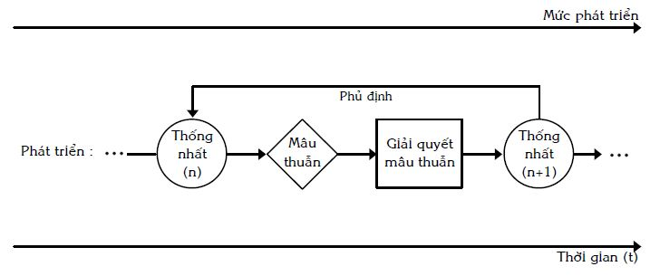

# TƯ DUY BIỆN CHỨNG

## Mở đầu {#sec:9:1:}
* Như chúng ta đã biết (xem mục _\@ref(sec:4:3:) Các nguồn thông tin và tri thức của TRIZ_ của quyển một), để có PPLSTVĐM với phạm vi áp dụng rộng, PPLSTVĐM phải được xây dựng dựa trên nền tảng là các quy luật chung nhất (phổ biến), chi phối tất cả các lĩnh vực thuộc tự nhiên, xã hội và tư duy. Khoa học về các quy luật chung nhất là triết học.

PPLSTVĐM là hệ thống các phương pháp suy nghĩ, thực hiện giải quyết vấn đề và ra quyết định nhằm tạo ra sự phát triển (tạo ra các đối tượng đồng thời có tính mới và tính ích lợi), cho nên, thứ nhất, triết học nền tảng của PPLSTVĐM phải là triết học về sự phát triển. Đấy là triết học nghiên cứu và phát hiện các quy luật chung nhất về sự phát triển của tự nhiên và xã hội (khía cạnh bản thể luận). Thứ hai, triết học nền tảng đó nghiên cứu và phát hiện các quy luật về phản ánh sự phát triển của thế giới vật chất khách quan trong ý thức chủ quan của con người. Đấy là triết học về sự phát triển của tư duy và nhận thức (khía cạnh lôgích phát triển và nhận thức luận). Thứ ba, triết học nền tảng đó có thể cung cấp các chuẩn mực, quy tắc chung, giúp xây dựng những phương pháp mang tính cụ thể hơn chính nó (khía cạnh phương pháp luận). Thứ tư, triết học nền tảng đó có thể cung cấp các kiến thức về các quy luật và hình thức giúp tạo ra các hoạt động thực tiễn biến đổi thế giới và hoàn thiện chính con người. Trong các loại triết học đã và đang có, triết học đáp ứng được những điều nói trên một cách thống nhất chính là phép biện chứng duy vật, còn gọi là chủ nghĩa duy vật biện chứng. Không phải ngẫu nhiên, G.S. Altshuller – tác giả của TRIZ – chọn và áp dụng một cách khá rộng rãi, nhất quán phép biện chứng duy vật như là triết học nền tảng trong suốt quá trình xây dựng TRIZ.

* Nhân đây, người viết trình bày ý kiến của các nhà nghiên cứu về mối quan hệ giữa hai tên gọi _“Phép biện chứng duy vật”_ (Materialist Dialectics) và _“Chủ nghĩa duy vật biện chứng”_ (Dialectical Materialism):

Lịch sử khoa học và thực tiễn chứng tỏ rằng, ba mặt: Vật chất, vận động và phát triển liên quan không tách rời nhau. Sự thống nhất này là cơ sở khách quan mang tính khoa học tất yếu để kết hợp hữu cơ phép biện chứng và chủ nghĩa duy vật thành hệ thống duy nhất các quan điểm. Nhờ sự kết hợp này, chủ nghĩa duy vật mang tính biện chứng, còn phép biện chứng trở nên duy vật. Lần đầu tiên trong lịch sử triết học, các nhà kinh điển của chủ nghĩa Mác–Lênin đã thành lập học thuyết về vật chất, chứa một cách hữu cơ trong đó các quan niệm về vận động, phát triển. Đến lượt mình, học thuyết về sự vận động và phát triển lần đầu tiên được xây dựng dựa trên cơ sở chủ nghĩa duy vật, với sự hiểu biết rằng, thế giới vật chất thể hiện tất cả các sự thay đổi (vận động) và hình thức phát triển.

Sự thống nhất và tương tác giữa phép biện chứng và chủ nghĩa duy vật không có nghĩa là các khái niệm _“chủ nghĩa duy vật biện chứng”_ và _“phép biện chứng duy vật”_ trùng nhau hoàn toàn. Khi sử dụng khái niệm _“chủ nghĩa duy vật biện chứng”_ thì trọng tâm nhấn mạnh hướng đến là: Lời giải khoa học cho vấn đề cơ bản của triết học (vấn đề quan hệ giữa vật chất và ý thức) và khái niệm triết học _“vật chất”_ dựa trên lời giải đó bao gồm các quy luật vận động và phát triển của vật chất. Còn khi nói _“phép biện chứng duy vật”_, thì trọng tâm bây giờ chuyển sang học thuyết về phát triển dựa trên giải pháp duy vật đối với vấn đề cơ bản của triết học. Do vậy, _“chủ nghĩa duy vật biện chứng”_, trước hết, là học thuyết về bản chất vật chất của thế giới vận động và phát triển; còn _“phép biện chứng duy vật”_ – đấy là học thuyết về sự vận động, phát triển của chính thế giới vật chất cũng như của ý thức con người phản ánh thế giới đó.

Sự phân chia thành _“chủ nghĩa duy vật biện chứng”_ và _“phép biện chứng duy vật”_ nói trên mang tính quy ước và tương đối. Nó chỉ có ý nghĩa trong phạm vi đặt vấn đề về quan hệ của sự vận động và phát triển đối với đối tượng vận động và phát triển là vật chất. Ngoài phạm vi đó, sự ngăn cách giữa các phạm trù vật chất, vận động, phát triển biến mất, bởi vì, những phạm trù vừa nêu luôn liên quan chặt chẽ, hữu cơ với nhau, không thể tách rời. Là học thuyết về sự vận động và phát triển, _“phép biện chứng duy vật”_ hướng đến phát hiện bản chất của sự phát triển, nguồn gốc, cơ chế, các hình thức, quy luật... của sự phát triển. Đây cũng chính là một trong những điều quan tâm trước hết của PPLSTVĐM.

Trong ý nghĩa vừa nêu, nhằm nhấn mạnh sự phát triển, trong bộ sách _“Sáng tạo và đổi mới”_, giữa hai tên gọi, người viết dùng tên gọi _“phép biện chứng duy vật”_ là chính. Ngoài ra, để ngắn gọn, nhiều khi, người viết nói _“phép biện chứng”_ thay vì _“phép biện chứng duy vật”_.

* Ở Việt Nam, chủ nghĩa duy vật biện chứng được trình bày trong các giáo trình triết học Mác–Lênin, dạy và học khá đầy đủ trong tất cả các trường cao đẳng, đại học, nhiều lớp bồi dưỡng, nâng cao trình độ chính trị. Các sách về triết học Mác–Lênin và các vấn đề liên quan cũng được phổ biến khá rộng rãi và dễ tìm trong các hiệu sách hoặc thư viện. Do vậy, trong _Chương 9: Tư duy biện chứng_ này, người viết chỉ nhấn mạnh tóm tắt một số ý của phép biện chứng duy vật mà người viết cho là cần thiết nhất đối với việc trình bày môn học PPLSTVĐM, đặc biệt, TRIZ. Điều này có nghĩa, ở đây, người viết không làm công việc trình bày lại giáo trình _“Phép biện chứng duy vật”_, càng không trình bày những luận điểm được nhấn mạnh theo thứ tự giống như có trong các giáo trình triết học.

* Về mặt tiềm năng, phép biện chứng duy vật có rất nhiều ích lợi. Những đoạn trích dưới đây từ mục _2\. Vai trò của triết học Mác–Lênin_ (trang 42 đến trang 46) của _“Giáo trình triết học Mác–Lênin”_, Hội đồng trung ương chỉ đạo biên soạn giáo trình quốc gia các bộ môn khoa học Mác–Lênin, tư tưởng Hồ Chí Minh, Nhà xuất bản chính trị quốc gia, Hà Nội, 2001 cho thấy:

“... triết học mácxít có khả năng nhận thức đúng đắn cả giới tự nhiên cũng như đời sống xã hội và tư duy con người”.

“... Hệ thống các quan điểm của chủ nghĩa duy vật mácxít, do tính đúng đắn và triệt để của nó đem lại đã trở thành nhân tố định hướng cho hoạt động nhận thức và thực tiễn, trở thành những nguyên tắc xuất phát của phương pháp luận”.

“... Nắm vững triết học Mác–Lênin không chỉ là tiếp nhận một thế giới quan khoa học mà còn là xác định một phương pháp luận đúng đắn”.

“...Việc nắm vững triết học Mác–Lênin giúp chúng ta tự giác trong quá trình trau dồi phẩm chất chính trị, tinh thần và năng lực tư duy sáng tạo của mình. Đó còn là đòi hỏi cấp bách của sự nghiệp xây dựng chủ nghĩa xã hội nói chung, của công cuộc đổi mới hiện nay nói riêng”.

“... Bồi dưỡng thế giới quan duy vật và rèn luyện tư duy biện chứng để phòng và chống chủ nghĩa chủ quan, tránh phương pháp tư duy siêu hình, đó vừa là kết quả vừa là mục đích trực tiếp của việc nghiên cứu lý luận triết học nói chung, triết học Mác–Lênin nói riêng”.

Mặc dù đã có những lưu ý và lời khuyên về việc làm thế nào để biến các ích lợi tiềm năng của phép biện chứng thành hiện thực:

“... Tuy nhiên, triết học Mác–Lênin không thay thế cho các bộ môn khoa học khác trong việc nhận thức thế giới. Nó đoạn tuyệt với quan niệm triết học là _“khoa học của các khoa học”_ như tham vọng của nền triết học tự nhiên trước kia, mà xem sự gắn bó với các khoa học cụ thể là một điều kiện tiên quyết cho sự phát triển của triết học. Đến lượt mình, triết học Mác–Lênin đưa lại thế giới quan và phương pháp luận đúng đắn cho sự phát triển khoa học”.

“... Tuy nhiên, nói như thế không có nghĩa là chỉ cần nắm được triết học Mác–Lênin thì lập tức sẽ giải quyết được tất cả các vấn đề cụ thể do cuộc sống đặt ra. Triết học Mác–Lênin không phải là một đơn thuốc vạn năng chứa sẵn cách giải quyết mọi vấn đề trong hoạt động nhận thức cũng như hoạt động thực tiễn. Để có thể tìm lời giải đáp đúng đắn cho những vấn đề đó, bên cạnh tri thức triết học còn cần có hàng loạt tri thức của các khoa học cụ thể cùng với những tri thức kinh nghiệm do cuộc sống tạo nên một cách trực tiếp ở mỗi con người. Thiếu những tri thức đó thì việc vận dụng những nguyên lý triết học chung không những khó mang lại hiệu quả mà trong nhiều trường hợp còn có thể dẫn đến những sai lầm mang tính giáo điều.

Trong hoạt động nhận thức và hoạt động thực tiễn, chúng ta cần tránh cả hai thái cực sai lầm: Hoặc là xem thường triết học và do đó sẽ sa vào tình trạng mò mẫm, dễ bằng lòng với những biện pháp cụ thể nhất thời, đi đến chỗ mất phương hướng, thiếu nhìn xa trông rộng, thiếu chủ động và sáng tạo trong công tác; hoặc là tuyệt đối hóa vai trò của triết học và do đó sẽ sa vào chủ nghĩa giáo điều, áp dụng một cách máy móc những nguyên lý, những quy luật chung vào từng trường hợp riêng mà không tính đến tình hình cụ thể trong từng trường hợp riêng và kết quả là dễ bị vấp váp, thất bại”.

“... Chính vì vậy, để đẩy mạnh sự phát triển của khoa học cụ thể cũng như bản thân triết học, sự hợp tác chặt chẽ giữa những người nghiên cứu lý luận triết học và các nhà khoa học khác là hết sức cần thiết”.

Rất tiếc, vẫn có một thực tế là, các ích lợi của phép biện chứng chưa trở thành hiện thực rộng rãi như khả năng của nó và như mong muốn của nhiều người. Điều mong muốn này không chỉ của những người nghiên cứu, dạy và học phép biện chứng mà cả của những nhà quản lý, lãnh đạo các cấp. Mặc dù, _“Nó (môn triết học Mác–Lênin – người viết giải thích theo ngữ cảnh của đoạn văn) đã và đang được tuổi trẻ học đường, cán bộ, đảng viên và toàn dân ta tiếp đón nhiệt tình và say mê học tập, nghiên cứu nghiêm túc”_ (Trích _“Lời nhà xuất bản”_, sách đã dẫn, trang 7).

Dưới đây, người viết thử nêu một số trong các lý do có thể có, dẫn đến tình trạng không mong muốn nêu trên:

1) Phép biện chứng nói riêng, triết học nói chung là môn học mang tính trừu tượng và khái quát cao nhất, không được người học tiếp nhận một cách trực tiếp thông qua các giác quan như các môn học trực quan. Cho nên, phép biện chứng học khó hiểu, khó tiêu hóa, chưa nói gì đến áp dụng triết học vào thực tế để mang lại ích lợi cụ thể cho người học.

2) Trong các sách nghiên cứu, giáo trình, bài giảng về phép biện chứng có các ví dụ minh họa quá trình khái quát hóa những thành tựu của các khoa học chuyên ngành, cũng như thực tiễn lịch sử nhân loại thành các luận điểm triết học. Tuy nhiên, chúng lại có rất ít các ví dụ, minh họa quá trình ngược lại: Cụ thể hóa để thấy các ích lợi của các luận điểm triết học trong các khoa học chuyên ngành, cũng như thực tiễn. Đấy là còn chưa nói đến việc cần có các bài tập thực hành kiến thức triết học, tương tự như các bài tập của các môn học khác, giúp hiểu và vận dụng phép biện chứng duy vật vào thực tế.

3) Khi học các khoa học chuyên ngành, các sách nghiên cứu, giáo trình, bài giảng của các thầy, cô hầu như không đả động gì đến triết học nói chung, phép biện chứng nói riêng, chứ đừng nói gì đến việc chỉ cho những người học thấy triết học đã đem lại những ích lợi gì cho các khoa học chuyên ngành.

Trong khi học các lĩnh vực chuyên ngành, người học thấy rõ chuyên ngành đang học liên quan với, được hỗ trợ bởi các kiến thức của các lĩnh vực chuyên ngành khác. Học vật lý, người học thấy toán rất cần cho vật lý. Để hiểu, sử dụng các kiến thức hóa học tốt, rất cần vật lý và toán học. Để quản lý con người, rất cần tâm lý học, giáo dục học, xã hội học... Còn triết học, hầu như không thấy bóng dáng đâu cả. Không phải ngẫu nhiên, trên thực tế, thịnh hành quan niệm coi triết học như môn khoa học xa vời, biệt lập, bị bắt buộc phải học và không đem lại ích lợi gì cho những người học những ngành khác. Do vậy, nhiều người sau khi thi xong môn triết học cũng vĩnh biệt nó luôn.

4) Một mặt, khi nói: _“Quá trình nhận thức diễn ra theo con đường từ trực quan sinh động đến tư duy trừu tượng rồi từ tư duy trừu tượng đến thực tiễn”_ (Trích sách đã dẫn, trang 345) chúng ta hiểu ngầm rằng, quá trình nhận thức (tư duy) của con người nói đến ở đây là con người trừu tượng, khái quát (con người đại biểu cho toàn nhân loại), chứ không phải là từng con người cụ thể. Bởi vì, con người cụ thể thường chỉ làm được một, hai giai đoạn, hiếm khi đi hết được tất cả các giai đoạn của quá trình nhận thức liệt kê ở trên. Có những con người cụ thể không tự làm được giai đoạn nào hết trong suốt cuộc đời của mình.

Mặt khác, _“... triết học Mác–Lênin khẳng định: “không có chân lý trừu tượng”, “rằng chân lý luôn luôn là cụ thể”. Chân lý là cụ thể bởi vì đối tượng mà chân lý phản ánh bao giờ cũng tồn tại một cách cụ thể, trong những điều kiện, hoàn cảnh cụ thể với những quan hệ cụ thể. Vì vậy, bất kỳ chân lý nào cũng phải gắn với điều kiện lịch sử–cụ thể. Nếu thoát ly khỏi điều kiện lịch sử–cụ thể thì cái vốn là chân lý sẽ không còn là chân lý nữa”_ (Trích sách đã dẫn, trang 374). Bạn đọc có thể nhớ lại khái niệm phạm vi áp dụng cùng nhiều ví dụ minh họa đã trình bày trong quyển một và quyển hai.

Do vậy, để người học cụ thể thấy vai trò quan trọng của phép biện chứng trong nhận thức (tư duy) cũng như trong hành động, các ích lợi của phép biện chứng đem đến cho người học phải là các ích lợi cụ thể chứ không phải các ích lợi trừu tượng. Rất tiếc, hiện nay chưa có các công cụ (hiểu theo nghĩa rộng) cụ thể có thể dạy và học được, giúp người học cụ thể biến các ích lợi tiềm năng của phép biện chứng thành các ích lợi cụ thể, khi người đó phải suy nghĩ giải quyết vấn đề cụ thể, ra quyết định cụ thể.

Tóm lại, đứng ở góc độ của các lĩnh vực khoa học khác nhau, xét về mức độ quan hệ cụ thể – trừu tượng, cụ thể – khái quát, cụ thể – chung nhất, có một khoảng cách lớn và chưa có các cầu nối hai chiều giữa phép biện chứng với các khoa học chuyên ngành nghiên cứu các khía cạnh khác nhau của thế giới, ở các mức độ cụ thể khác nhau (xem Hình 101).

Hình 101: Khó khăn trong việc liên thông hai chiều giữa phép biện chứng và các khoa học chuyên ngành

Còn đứng ở góc độ từng con người cụ thể học phép biện chứng và muốn áp dụng nó thành công vào thực tế, tình hình _“liên thông”_ còn phức tạp hơn nhiều nữa.

* Mỗi khoa học ngày nay có đối tượng nghiên cứu và tác động biến đổi của riêng mình. Do vậy, chúng ta không đặt vấn đề đòi hỏi triết học phải tự _“hạ xuống”_ thành các khoa học cụ thể và ngược lại, các khoa học chuyên ngành phải _“tự nâng lên”_ thành khoa học khái quát nhất. Vấn đề nằm ở chỗ, _“cần có thêm”_ các khoa học mới để lấp khoảng cách cụ thể – trừu tượng, cụ thể – khái quát, cụ thể – chung nhất (khoảng cách đó được minh họa trên Hình 101). Một trong những nhiệm vụ của những khoa học mới này là xây dựng cầu nối hai chiều (hệ thống các công cụ) giữa phép biện chứng và các khoa học, lĩnh vực chuyên ngành cụ thể. Ở đây có vấn đề tương tự như vấn đề được mô tả trên _Hình 97: Cầu nối hai chiều giữa cụ thể và khái quát nhờ diễn dịch (DD) và quy nạp (QN)_, nhưng khó khăn và phức tạp hơn rất nhiều, ít nhất, vì ba lý do:

Thứ nhất, khoảng cách mô tả trên Hình 101 rất xa. Thứ hai, lôgích nói đến ở đây, chủ yếu, là lôgích biện chứng chứ không phải lôgích hình thức. Do hoàn cảnh lịch sử để lại, cho đến thế kỷ 17, lôgích hình thức chiếm vị trí độc tôn như là học thuyết duy nhất về các quy luật và hình thức của tư duy (xem _Chương 8: Tư duy lôgích_). Lôgích hình thức mới nghiên cứu các quy luật, hình thức phản ánh sự không thay đổi, đứng yên của hiện thực khách quan trong tư duy. Trong khi đó, lôgích biện chứng nghiên cứu sự phản ánh trong các quy luật và hình thức của tư duy các quá trình phát triển, các mâu thuẫn bên trong của các hiện tượng, sự thay đổi về chất, sự chuyển hóa từ hiện tượng này sang hiện tượng khác... và sự phát triển của chính tư duy. Thứ ba, trong trường hợp lý tưởng, cầu nối hai chiều phải dễ dàng qua lại ngay cả đối với mỗi người cụ thể có học phép biện chứng, chứ không phải chỉ dành riêng cho các nhà khoa học, sáng chế xuất sắc.

Nói một cách hình ảnh, chiếc cầu nối nói trên giống như chiếc cầu thang hai chiều mà mỗi bậc của nó vừa sức cho mỗi người bình thường (xem Hình 102), để khi cần, người đó dễ dàng _“leo lầu”_ và _“xuống lầu”_, từ cái cụ thể nhất đến cái trừu tượng, khái quát, chung nhất và ngược lại.

Hình 102: Chiếc cầu thang lý tưởng với các bậc vừa sức, lấp đầy khoảng cách cụ thể – trừu tượng, cụ thể – khái quát, cụ thể – chung nhất cho mỗi người bình thường

Điều này rất quan trọng vì, thứ nhất, những vấn đề, quyết định mà mỗi người bình thường cần giải quyết, đưa ra là những vấn đề, quyết định cụ thể, chứ không phải trừu tượng, khái quát. Con người cụ thể muốn tồn tại và phát triển phải ăn bát cơm cụ thể, ở ngôi nhà cụ thể, đi chiếc xe cụ thể, giao tiếp với những con người cụ thể, có nhu cầu nâng cao chất lượng sống cụ thể... chứ không phải ăn bánh vẽ, ở ngôi nhà trên giấy, đi chiếc xe trong mơ, chỉ giao tiếp với các bậc giác ngộ đến mức thần thánh, chất lượng cuộc sống thường được hứa hẹn ở thì tương lai...

Thứ hai, kiến thức có mức khái quát càng cao, càng bao quát nhiều sự vật, hiện tượng, quá trình, càng thể hiện cái chung giữa những con người cụ thể thì càng có phạm vi áp dụng rộng. Do vậy, khi những con người cụ thể khác nhau được học, nắm vững và sử dụng được các kiến thức có các mức khái quát cao, sẽ có ý thức về cái chung để ra quyết định tránh những xung đột cá nhân chủ quan và có được sự đồng thuận dễ dàng hơn, dựa trên các quy luật khách quan về sự phát triển. Nói cách khác, điều này tạo điều kiện thuận lợi để có được sự cộng hưởng (hiểu theo nghĩa tốt đẹp) của cá nhân và xã hội (xem Hình 79 của quyển hai).

* PPLSTVĐM, trong tư cách là hệ thống các phương pháp (công cụ) dùng để điều khiển tư duy sáng tạo (quá trình suy nghĩ giải quyết vấn đề và ra quyết định), tạo ra sự phát triển với phạm vi áp dụng rộng (không chuyên môn hóa riêng cho lĩnh vực nào), cần góp phần xây dựng chiếc cầu thang, được mô tả trên Hình 102. Để tránh hiểu lầm, người viết lưu ý bạn đọc, PPLSTVĐM _“góp phần xây dựng”_, chứ không phải hiện nay một mình PPLSTVĐM đã xây dựng xong chiếc cầu thang. Những việc cần làm còn rất nhiều, mặc dù những kết quả thu được trong lĩnh vực PPLSTVĐM không phải là ít.

Cụ thể, G.S. Altshuller và những người cộng tác, các học trò đã _“góp phần xây dựng”_ bằng cách tạo ra TRIZ (Lý thuyết giải các bài toán sáng chế), giúp những người học phép biện chứng có thể áp dụng nhiều luận điểm của phép biện chứng vào giải các bài toán cụ thể của mình. Đối với những người chưa học phép biện chứng, TRIZ giúp họ có thể giải các bài toán cụ thể của mình theo tinh thần, triết lý của phép biện chứng.

Trên thực tế, để có thể trang bị khả năng đó cho mọi người bình thường, một mặt, TRIZ phát hiện ra các quy luật phát triển hệ thống (xem quyển bảy _“Các quy luật phát triển hệ thống”_). Các quy luật này có thể coi là cụ thể hóa các quy luật phát triển của phép biện chứng và khái quát hóa các thông tin về sáng tạo và phát triển của nhiều lĩnh vực chuyên ngành trong tinh thần của phép biện chứng. Mặt khác, TRIZ cụ thể hóa nhiều luận điểm của phép biện chứng, đặc biệt, các khái niệm mâu thuẫn, giải quyết mâu thuẫn vào lĩnh vực tư duy sáng tạo (xem tiếp các mục sau của chương này) và khái quát hóa những cách giải quyết các mâu thuẫn có trong các bài toán cụ thể của các lĩnh vực chuyên ngành, thành các công cụ sáng tạo và đổi mới, ví dụ, các nguyên tắc sáng tạo (xem quyển bốn và quyển năm về _“Các thủ thuật (nguyên tắc) sáng tạo cơ bản”_). Cách xây dựng TRIZ được minh họa trên Hình 103. Bạn đọc có thể xem thêm Hình 31 và Hình 32 của quyển một.

Ngoài ra, như bạn đọc đã biết, (xem mục _\@ref(sec:4:3:) Các nguồn thông tin và tri thức của TRIZ_ của quyển một) TRIZ còn sử dụng những kết quả nghiên cứu (có phần phát triển thêm) của các khoa học mang tính khái quát khá cao như: Hệ thống, thông tin, điều khiển, dự báo. Một số phạm trù của các khoa học này như: Thông tin, yếu tố, cấu trúc, hệ thống, chức năng... được nhiều nhà nghiên cứu xem xét khả năng khái quát hóa để chúng trở thành các phạm trù triết học.

Hình 103: Cách xây dựng TRIZ (xem thêm Hình 31 và Hình 32 của quyển một)

* Mục \@ref(sec:9:2:) của Chương 9 này giúp bạn đọc ôn tập tóm tắt nội dung nguyên lý về sự phát triển và các quy luật cơ bản về sự phát triển của phép biện chứng. Về “nội dung” của chúng, người viết cố gắng bám sát _“Giáo trình triết học Mác–Lênin”_ của “Hội đồng trung ương chỉ đạo biên soạn giáo trình quốc gia các bộ môn khoa học Mác–Lênin, tư tưởng Hồ Chí Minh” đã nhắc đến ở trên bằng cách trích dẫn những đoạn cần thiết.

Trong mục \@ref(sec:9:3:), người viết cung cấp một số nhận xét dưới dạng các giải thích, làm rõ các luận điểm được trình bày trong mục \@ref(sec:9:2:) và các lời khuyên mang tính ứng dụng thực tế. Về “một số nhận xét”, người viết tổng hợp, chủ yếu, từ các sách tiếng Nga, Anh do Liên Xô trước đây xuất bản về phép biện chứng duy vật, các vấn đề liên quan và các ý kiến của người viết. Một số tài liệu này được liệt kê trong phần _“Các tài liệu tham khảo và nên tìm đọc thêm”_ ở cuối sách.

Mục \@ref(sec:9:4:) sẽ trình bày các loại mâu thuẫn thường gặp trong lĩnh vực sáng tạo và đổi mới, đồng thời phác họa một số cách khắc phục chúng nhờ các công cụ của TRIZ.

Mục \@ref(sec:9:5:) minh họa quá trình phát hiện mâu thuẫn và khắc phục mâu thuẫn bằng các ví dụ lấy từ các lĩnh vực chuyên ngành khác nhau, giúp bạn đọc thấy tính thống nhất của thế giới và phạm vi áp dụng rộng của TRIZ.

## Phép biện chứng: Nguyên lý và các quy luật cơ bản về sự phát triển {#sec:9:2:}
Như chúng ta đã biết (xem mục _\@ref(sec:9:1:) Mở đầu_), phép biện chứng là khoa học nghiên cứu các quy luật phổ biến (chung nhất) về sự phát triển của tự nhiên, xã hội, tư duy và đã đạt được nhiều thành tựu. Các sáng tạo và đổi mới của con người cũng góp phần tạo ra sự phát triển của tự nhiên, xã hội, tư duy. Tuy nhiên, sự phát triển trong tư cách là đối tượng nghiên cứu, tác động của lĩnh vực sáng tạo và đổi mới hẹp hơn và ở mức độ cụ thể hơn so với phép biện chứng.

Trong ý nghĩa này, các thành tựu nghiên cứu khác nhau của phép biện chứng ảnh hưởng, tác động lên, đem lại các ích lợi cho lĩnh vực sáng tạo và đổi mới cũng khác nhau. Do vậy, trước hết, mục \@ref(sec:9:2:) này ưu tiên nhấn mạnh hai thành tựu của phép biện chứng, được coi là quan trọng nhất đối với lĩnh vực sáng tạo và đổi mới. Đấy là nguyên lý về sự phát triển và các quy luật cơ bản về sự phát triển của phép biện chứng.

Nói như vậy không có nghĩa, các cặp phạm trù, các nguyên lý khác, lý thuyết nhận thức... của phép biện chứng không cần thiết. Trái lại, trong bộ sách _“Sáng tạo và đổi mới”_ ở những nơi có nhu cầu, người viết đã nhấn mạnh (ví dụ, luận điểm _“chân lý luôn luôn là cụ thể”_ dẫn đến khái niệm _“phạm vi áp dụng”_ trình bày trong quyển một và hai) và còn quay trở về các phần khác nhau của phép biện chứng nhiều lần. Tuy nhiên, những khi quay trở về như vậy, người viết sẽ không trích dẫn chi tiết như đối với nguyên lý phát triển và các quy luật cơ bản về sự phát triển của phép biện chứng, được trình bày dưới đây.

Trong hai mục nhỏ tiếp theo, nội dung của nguyên lý về sự phát triển (The Principle of Development) và các quy luật cơ bản của phép biện chứng duy vật được người viết trích từ các phần tương ứng trong _“Giáo trình triết học Mác–Lênin”_ đã nêu, vì _“Giáo trình giữ vai trò làm nền và định hướng cho việc trình bày một cách thống nhất những quan điểm cơ bản của triết học Mác–Lênin được giảng dạy ở nước ta”_ (Sách đã dẫn, Lời giới thiệu, trang 14). Bạn đọc có thể tự ôn tập các phần khác của phép biện chứng duy vật theo _“Giáo trình triết học Mác–Lênin”_.

### Nguyên lý về sự phát triển của phép biện chứng {#subsec:9:2:1:}
Trong quan điểm duy vật biện chứng, _phát triển là một phạm trù triết học dùng để khái quát quá trình vận động tiến lên từ thấp đến cao, từ đơn giản đến phức tạp, từ kém hoàn thiện đến hoàn thiện hơn_.

Theo quan điểm đó, phát triển là một trường hợp đặc biệt của sự vận động. Trong quá trình phát triển sẽ nảy sinh những tính quy định mới cao hơn về chất, nhờ vậy, làm tăng cường tính phức tạp của sự vật và của sự liên hệ, làm cho cả cơ cấu tổ chức, phương thức tồn tại và vận động của sự vật cùng chức năng vốn có của nó ngày càng hoàn thiện hơn.

Trong hiện thực khách quan, tùy thuộc vào hình thức tồn tại cụ thể của các dạng vật chất, sự phát triển sẽ được thực hiện hết sức khác nhau. Trong giới hữu cơ, sự phát triển biểu hiện ở việc tăng cường khả năng thích nghi của cơ thể trước sự biến đổi của môi trường, ở khả năng tự sản sinh ra chính mình với trình độ ngày càng hoàn thiện hơn, ở khả năng hoàn thiện quá trình trao đổi vật chất giữa cơ thể và môi trường. Trong xã hội, sự phát triển biểu hiện ở năng lực chinh phục tự nhiên, cải tạo xã hội để tiến tới mức độ ngày càng cao trong sự nghiệp giải phóng con người. Trong tư duy, sự phát triển biểu hiện ở khả năng nhận thức ngày càng sâu sắc, đầy đủ, đúng đắn hơn đối với hiện thực tự nhiên và xã hội.

Quan điểm biện chứng về sự phát triển thừa nhận tính phức tạp, tính không trực tuyến của bản thân quá trình đó. Sự phát triển trong hiện thực và trong tư duy diễn ra bằng con đường quanh co, phức tạp, trong đó có thể có bước thụt lùi tương đối.

Trong quan điểm biện chứng, sự phát triển là kết quả của quá trình thay đổi về lượng dẫn tới sự thay đổi về chất; sự phát triển diễn ra theo đường xoáy trôn ốc, nghĩa là trong quá trình phát triển dường như có sự quay trở lại điểm xuất phát, nhưng trên một cơ sở mới cao hơn.

Theo quan điểm duy vật biện chứng, nguồn gốc của sự phát triển nằm ngay trong bản thân sự vật, do mâu thuẫn của sự vật quy định. Phát triển, trong quan điểm duy vật biện chứng, là quá trình tự thân của mọi sự vật và hiện tượng. Do vậy, phát triển là một quá trình khách quan, độc lập với ý thức con người.

Quan điểm duy vật biện chứng về sự phát triển không chỉ thừa nhận tính khách quan của sự phát triển, nó còn khẳng định tính phổ biến của sự phát triển với nghĩa là sự phát triển diễn ra ở tất cả mọi lĩnh vực – từ tự nhiên đến xã hội và tư duy, từ hiện thực khách quan đến những khái niệm, những phạm trù phản ánh hiện thực ấy.

Khái quát sự đối lập giữa quan điểm duy vật và quan điểm duy tâm, giữa quan điểm biện chứng và quan điểm siêu hình về sự phát triển, V.I. Lênin viết: _“Hai quan niệm cơ bản (...) về sự phát triển (sự tiến hóa): Sự phát triển coi như là giảm đi và tăng lên, như là lặp lại, và sự phát triển coi như là sự thống nhất của các mặt đối lập..._

_... Quan niệm thứ nhất là chết cứng, nghèo nàn, khô khan. Quan niệm thứ hai là sinh động. Chỉ có quan niệm thứ hai mới cho ta chìa khóa của “sự tự vận động” của tất thảy mọi cái đang tồn tại; chỉ có nó mới cho ta chìa khóa của những “bước nhảy vọt”, của sự “gián đoạn của tính tiệm tiến”, của sự “chuyển hóa thành mặt đối lập”, của sự tiêu diệt cái cũ và sự nảy sinh ra cái mới”_.

Quan điểm duy vật biện chứng về sự phát triển cung cấp cho chúng ta phương pháp luận khoa học để nhận thức và cải tạo thế giới.

Tự nhiên, xã hội và tư duy nằm trong quá trình vận động và phát triển không ngừng. Bản chất khách quan của quá trình đòi hỏi chúng ta, để phản ánh đúng đắn hiện thực khách quan, cần có quan điểm phát triển. Điều đó có nghĩa là, khi xem xét các sự vật và hiện tượng phải đặt nó trong sự vận động, trong sự phát triển, phải phát hiện ra các xu hướng biến đổi, chuyển hóa của chúng. Liên quan tới vấn đề này, V.I. Lênin viết: _“Lôgích biện chứng đòi hỏi phải xét sự vật trong sự phát triển, trong “sự vận động” (...), trong sự biến đổi của nó”_.

Quan điểm phát triển với tư cách là nguyên tắc phương pháp luận để nhận thức sự vật hoàn toàn đối lập với quan điểm bảo thủ, trì trệ, định kiến. Tuyệt đối hóa một nhận thức nào đó về sự vật có được trong hoàn cảnh lịch sử phát triển nhất định, ứng với giai đoạn phát triển nhất định của nó và xem đó là nhận thức duy nhất đúng về toàn bộ sự vật trong quá trình phát triển tiếp theo của nó sẽ đưa chúng ta đến sai lầm nghiêm trọng.

Hơn nữa, quan điểm phát triển cũng đòi hỏi không chỉ thấy sự vật như là cái đang có, mà còn phải nắm được khuynh hướng phát triển trong tương lai của nó. Trong quá trình phát triển, sự vật thường đồng thời có những sự biến đổi tiến lên và có cả những biến đổi thụt lùi. Quan điểm phát triển đúng đắn về sự vật chỉ có được, khi bằng tư duy khoa học, chủ thể khái quát để làm sáng tỏ xu hướng chủ đạo của tất cả những biến đổi khác nhau đó.

Sự phát triển của các sự vật và hiện tượng trong thực tế là quá trình biện chứng đầy mâu thuẫn. Do vậy, quan điểm phát triển được vận dụng vào quá trình nhận thức cũng đòi hỏi chúng ta phải thấy rõ tính quanh co, phức tạp của quá trình phát triển như là một hiện tượng phổ biến.

Vận dụng quan điểm phát triển với tư cách là nguyên tắc phương pháp luận của hoạt động thực tiễn nhằm thúc đẩy sự vật phát triển theo quy luật vốn có của nó đòi hỏi chúng ta phải tìm ra mâu thuẫn của chính sự vật, và bằng hoạt động thực tiễn mà giải quyết mâu thuẫn. Chỉ bằng cách đó, chúng ta mới góp phần tích cực vào sự phát triển.

Hơn nữa, sự phát triển biện chứng của các quá trình hiện thực và của tư duy được thực hiện bằng con đường thông qua những sự tích lũy về lượng mà tạo ra sự thay đổi về chất, thông qua phủ định của phủ định. Do vậy, việc vận dụng quan điểm phát triển vào hoạt động thực tiễn nhằm cải tạo sự vật còn đòi hỏi chúng ta phải phát huy nỗ lực của mình trong việc hiện thực hóa hai quá trình nêu trên.

### Các quy luật cơ bản của phép biện chứng {#subsec:9:2:2:}
**1) Quy luật chuyển hóa từ những sự thay đổi về lượng thành những sự thay đổi về chất và ngược lại** (để ngắn gọn, người viết sẽ gọi là “quy luật về lượng–chất”) – The Law of the Mutual Transformation of Quantitative and Qualitative Changes.

Khi quan sát các sự vật, hiện tượng trong tự nhiên, cũng như xã hội, chúng ta thấy rằng các sự vật và hiện tượng đó luôn tác động qua lại với nhau. Muối hạt tồn tại trong môi trường ẩm sẽ chảy thành nước muối. Ánh nắng chiếu vào lá cây sẽ sinh ra hiện tượng quang hợp. Rễ cây hút các chất dinh dưỡng trong đất mà lớn lên... Chính qua những sự tác động qua lại đó, sự vật bộc lộ ra những tính chất của mình: Muối có tính chất hòa tan trong nước, lá cây có tính quang hợp, rễ cây có tính năng hút chất dinh dưỡng có trong đất... Tất cả những tính chất đó được khái quát trong quan niệm _thuộc tính_. Thuộc tính là những tính chất của sự vật, là những cái vốn có của sự vật đó. Nhưng những tính chất (thuộc tính) của sự vật chỉ bộc lộ ra bên ngoài qua sự tác động qua lại của sự vật mang tính chất (thuộc tính) đó với các sự vật khác. Thí dụ, tính dẫn nhiệt, dẫn điện, khả năng dát mỏng, kéo thành sợi... là tính chất (thuộc tính) của hầu hết mọi kim loại. Song, tính dẫn điện chỉ bộc lộ ra khi thanh kim loại được đặt trong sự chênh lệch về điện áp; tính dẫn nhiệt chỉ bộc lộ khi có sự chênh lệch nhiệt độ trên thanh kim loại đó. Do vậy, để nhận thức được các tính chất (thuộc tính) của sự vật, chúng ta phải nhận thức qua các mối quan hệ giữa sự vật đó với các sự vật khác.

Trong số các thuộc tính (các tính chất) đó có một số có thể thay đổi, thậm chí mất đi, nhưng sự vật vẫn là nó. Do vậy, bản thân các thuộc tính của sự vật là biểu hiện của một cái gì đó căn bản hơn, chính cái đó đặc trưng cho sự vật. Cái căn bản hơn đó chính là chất của sự vật.

Từ những điều trình bày trên đây có thể rút ra kết luận rằng, theo quan điểm duy vật biện chứng, _chất là một phạm trù triết học dùng để chỉ tính quy định khách quan vốn có của sự vật và hiện tượng, là sự thống nhất hữu cơ các thuộc tính làm cho nó là nó mà không phải là cái khác_.

Đặc trưng khách quan nói trên quy định phương thức nhận thức của con người đối với chất của sự vật. Để nhận thức được những thuộc tính, từ đó nhận thức được chất của sự vật, chúng ta cần nhận thức nó trong mối quan hệ giữa các sự vật. Trong mối quan hệ cụ thể thường bộc lộ ra một thuộc tính (một khía cạnh về chất) của sự vật. Do vậy, để nhận thức được chất với tư cách là sự tổng hợp tất cả các thuộc tính vốn có của nó, chúng ta phải nhận thức sự vật trong tổng hợp các mối quan hệ có thể có giữa sự vật đó với các sự vật khác.

Mỗi sự vật có muôn vàn thuộc tính, mỗi thuộc tính của sự vật cũng có một phức hợp những đặc trưng về chất của mình, khiến cho mỗi thuộc tính lại trở thành một chất. Điều đó cũng có nghĩa là mỗi sự vật có vô vàn chất.

Với tư cách là những khía cạnh của chất được bộc lộ ra trong các mối quan hệ, các thuộc tính của sự vật có vị trí khác nhau, trong đó, có thuộc tính cơ bản và thuộc tính không cơ bản. Tổng hợp những thuộc tính cơ bản tạo thành _chất căn bản_ của sự vật. Ở mỗi một sự vật chỉ có một chất căn bản, đó là loại chất mà sự tồn tại hay mất đi của nó quy định sự tồn tại hay mất đi của bản thân sự vật.

Chất của sự vật không những được xác định bởi chất của các yếu tố cấu thành mà còn bởi cấu trúc của sự vật, bởi phương thức liên kết giữa các yếu tố cấu thành sự vật đó.

Trong tự nhiên và trong xã hội có không ít sự vật, mà nếu xét riêng về các yếu tố cấu thành, chúng hoàn toàn đồng nhất, nhưng các sự vật đó lại khác nhau về chất. Thí dụ, kim cương và than chì tuy đều do cácbon tạo thành, nhưng lại có sự khác biệt rất căn bản về chất. Sự khác nhau về chất ấy được quyết định bởi phương thức liên kết khác nhau của các phân tử cácbon. Việc nắm được tính cấu trúc của sự vật cho phép hiểu được vì sao sự thay đổi hay mất đi của một số thuộc tính này hay thuộc tính khác của sự vật lại không trực tiếp dẫn đến thay đổi chất của nó.

Từ đó có thể thấy sự thay đổi về chất của sự vật không chỉ phụ thuộc vào sự thay đổi những yếu tố cấu thành, nó còn phụ thuộc vào sự thay đổi phương thức liên kết giữa các yếu tố đó.

Khi chúng ta xem xét sự vật trong tính xác định về chất của nó, chúng ta cũng so sánh nó với các sự vật khác, từ đó hình thành ý thức về giới hạn tồn tại của nó. Vượt ra ngoài giới hạn đó, sự vật không còn là nó nữa mà là một cái gì đó khác. Điều đó có nghĩa chất của sự vật đồng nhất với tính có hạn của nó.

Sự đồng nhất và khác biệt của các sự vật không chỉ được xác định bởi những tính quy định về chất mà còn bởi _những tính quy định về lượng_. Chẳng hạn, rượu (trong suốt) không chỉ khác với nước cất về mùi vị, tác dụng sinh học... mà còn về khối lượng riêng của chúng; hai chiếc bàn giống nhau về chất liệu và hình dạng nhưng lại khác nhau về kích thước... Như vậy, cùng với những tính quy định về chất, bất kỳ sự vật nào cũng có những tính quy định về lượng.

_Lượng là một phạm trù triết học để chỉ tính quy định vốn có của sự vật biểu thị số lượng, quy mô, trình độ, nhịp điệu của sự vận động và phát triển của sự vật cũng như của các thuộc tính của nó_.

Trong thực tế, lượng có thể được xác định bằng những đơn vị đo lường cụ thể và chính xác như chiều dài, khối lượng...; song, có những tính quy định về lượng chỉ có thể biểu thị dưới dạng trừu tượng và khái quát như trình độ giác ngộ cách mạng của một con người, trình độ phát triển của một xã hội...

Cũng như chất của sự vật, lượng của sự vật cũng mang tính khách quan. Trong sự tồn tại khách quan của mình, sự vật có vô vàn chất; do đó, nó cũng có vô vàn lượng. Tuy nhiên, chất và lượng là hai mặt quy định lẫn nhau không thể tách rời; một chất nhất định trong sự vật có lượng tương ứng của nó. Thí dụ: Sự khác nhau về chất (trạng thái) của nước ở thể lỏng với nước ở thể rắn (nước đá) được quy định bởi lượng là nhiệt độ. Sự biến đổi tương quan giữa chất và lượng tạo nên tiến trình phát triển của sự vật.

Bất kỳ sự vật, hiện tượng nào cũng có chất và lượng. Trong quá trình vận động và phát triển, chất và lượng của sự vật cũng biến đổi. Sự thay đổi của lượng và của chất không diễn ra độc lập đối với nhau, trái lại, chúng có quan hệ chặt chẽ với nhau. Nhưng không phải bất kỳ sự thay đổi nào của lượng cũng ngay lập tức làm thay đổi căn bản chất của sự vật. Lượng của sự vật có thể thay đổi trong một giới hạn nhất định mà không làm thay đổi căn bản chất của sự vật đó. Chẳng hạn, khi xét các trạng thái tồn tại khác nhau của nước với tư cách là những chất khác nhau (_chất – trạng thái_), ứng với chất – trạng thái đó, lượng ở đây là nhiệt độ, thì dù lượng có thể thay đổi trong một phạm vi khá lớn (0°C < t°C < 100°C ), nước vẫn ở _trạng thái lỏng_ (tức là chưa thay đổi về chất – trạng thái). Tương tự như vậy, nhiệt độ của thanh thép có thể được tăng lên hàng trăm độ, thậm chí tới hàng ngàn độ mà thép vẫn ở trạng thái rắn, chưa chuyển sang trạng thái lỏng. Sự thay đổi của lượng chưa dẫn tới sự thay đổi của chất trong những giới hạn nhất định. Vượt quá giới hạn đó sẽ làm cho sự vật không còn là nó, chất cũ mất đi, chất mới ra đời.

Khuôn khổ mà trong đó, sự thay đổi về lượng chưa làm thay đổi về chất của sự vật, được gọi là _“độ”_(Measure).

_Độ là một phạm trù triết học dùng để chỉ sự thống nhất giữa lượng và chất, nó là khoảng giới hạn, mà trong đó, sự thay đổi về lượng chưa làm thay đổi căn bản về chất của sự vật_.

Trong thí dụ trên đây, sự thống nhất giữa trạng thái lỏng của nước và nhiệt độ trong khoảng 0°C đến 100°C (với điều kiện nước nguyên chất và áp suất là 1 atm) là _“độ”_ tồn tại của nước ở trạng thái lỏng.

Nếu nhiệt độ của nước giảm tới và được duy trì ở đó thì nước từ trạng thái lỏng sẽ chuyển thành trạng thái rắn, tức là thay đổi về chất.

Những điểm giới hạn mà tại đó sự thay đổi về lượng sẽ làm thay đổi về chất của sự vật được gọi là _điểm nút_ (Limit). Trong thí dụ về chất – trạng thái của nước được nêu trên, 0°C và 100°C là những điểm nút. Bất kỳ độ nào cũng được giới hạn bởi hai điểm nút.

Sự thay đổi về lượng khi đạt tới điểm nút sẽ dẫn đến sự ra đời chất mới. Sự thống nhất giữa lượng và chất mới tạo thành một _độ mới_ với điểm nút mới. Vì vậy, có thể hình dung sự phát triển dưới dạng một _đường nút_ của những quan hệ về độ.

Sự thay đổi về chất do những sự thay đổi về lượng trước đó gây ra gọi là _bước nhảy_ (Leap). Nói cách khác, _bước nhảy là một phạm trù triết học dùng để chỉ giai đoạn chuyển hóa về chất của sự vật do những thay đổi về lượng trước đó gây ra_.

Sự thay đổi về chất là kết quả của sự thay đổi về lượng khi đạt tới điểm nút. Sau khi ra đời, _chất mới có tác động trở lại sự thay đổi của lượng_. Chất mới có thể làm thay đổi quy mô tồn tại của sự vật, làm thay đổi nhịp điệu của sự vận động và phát triển của sự vật đó. Chẳng hạn, chúng ta không thể dùng chai một lít (thể tích của nó đủ để chứa hết một lít nước ở trạng thái lỏng) để chứa hết một lít nước sau khi đã cho lít nước đó hóa hơi. Tốc độ vận động của phân tử nước ở trạng thái hơi cao hơn rất nhiều so với tốc độ vận động của phân tử đó trong trạng thái lỏng...

Các hình thức của bước nhảy:

Sự thay đổi về chất của sự vật hết sức đa dạng, với nhiều hình thức bước nhảy khác nhau. Tính chất của các bước nhảy được quyết định bởi tính chất của bản thân sự vật, bởi những mâu thuẫn vốn có của nó, bởi điều kiện trong đó diễn ra sự thay đổi về chất.

Nhìn chung, có một số loại bước nhảy cơ bản như: bước nhảy đột biến và bước nhảy dần dần, bước nhảy toàn bộ và bước nhảy cục bộ...

Sự phân chia ra bước nhảy đột biến và bước nhảy dần dần vừa dựa trên _thời gian_ của sự thay đổi về chất, vừa dựa trên _tính chất_ của bản thân sự thay đổi đó. Những bước nhảy được gọi là _đột biến_ khi chất của sự vật biến đổi một cách nhanh chóng ở tất cả các bộ phận cơ bản cấu thành của nó. Chẳng hạn, khi tăng khối lượng Uranium 235 (Ur 235) đến một mức độ cần thiết được gọi là khối lượng tới hạn (khoảng gần 1 kg) thì sẽ xảy ra phản ứng dây chuyền, xảy ra vụ nổ nguyên tử ngay trong chốc lát.

Những bước nhảy được thực hiện một cách _dần dần_ là quá trình thay đổi về chất diễn ra bằng con đường tích lũy dần dần những nhân tố của chất mới và mất đi dần dần những nhân tố của chất cũ.

Bước nhảy dần dần là một quá trình phức tạp, trong đó có cả những quá trình tuần tự lẫn những bước nhảy cục bộ.

Như vậy, sự khác nhau giữa hai loại bước nhảy vừa nêu thể hiện không chỉ ở thời gian diễn ra sự thay đổi về chất, mà cả ở cơ chế của sự thay đổi đó.

Mặt khác, cũng cần phân biệt bước nhảy dần dần với sự thay đổi dần dần về lượng. Những sự thay đổi dần dần về lượng diễn ra một cách liên tục trong khuôn khổ của chất đang có, còn bước nhảy dần dần là sự chuyển hóa chất này sang chất khác, là sự đứt đoạn của tính liên tục.

_Bước nhảy toàn bộ_ là loại bước nhảy làm thay đổi về chất tất cả các mặt, các bộ phận, các yếu tố cấu thành sự vật. _Bước nhảy cục bộ_ là loại bước nhảy làm thay đổi một số mặt, một số yếu tố, một số bộ phận của sự vật đó. Đối với các sự vật phức tạp về tính chất, về những yếu tố cấu trúc, về những bộ phận cấu thành thì bước nhảy thường diễn ra bằng con đường từ những thay đổi về chất cục bộ đến thay đổi về chất toàn bộ.

Khi xem xét sự thay đổi về chất của xã hội, người ta còn chia sự thay đổi đó ra thành thay đổi cách mạng và thay đổi có tính chất tiến hóa.

Trong trường hợp này, _cách mạng_ là sự thay đổi mà trong quá trình đó diễn ra sự cải tạo căn bản về chất của sự vật, không phụ thuộc vào sự cải tạo đó được diễn ra như thế nào (diễn ra dưới hình thức đột biến hay dần dần). _Tiến hóa_ là sự thay đổi về lượng cùng với những biến đổi nhất định về chất, nhưng là chất không căn bản của sự vật.

Do vậy, cách mạng là một khái niệm có ngoại diên hẹp hơn so với phạm trù bước nhảy. Bước nhảy là phạm trù dùng để chỉ mọi sự thay đổi về chất, cách mạng là sự cải tạo chất căn bản của nó. Hơn nữa, không phải bất kỳ sự thay đổi căn bản nào về chất cũng là cách mạng. Chỉ những thay đổi mang tính tiến bộ, tiến lên, chỉ có sự chuyển hóa từ nấc thang phát triển thấp sang nấc thang phát triển cao mới là cách mạng. Nếu do thay đổi về chất căn bản mà diễn ra bước thụt lùi của xã hội thì đó là phản cách mạng.

Từ những điều trình bày trên có thể rút ra nội dung cơ bản của quy luật chuyển hóa từ những sự thay đổi về lượng thành những sự thay đổi về chất và ngược lại như sau: _Bất kỳ sự vật nào cũng là sự thống nhất giữa chất và lượng, sự thay đổi dần dần về lượng vượt quá giới hạn của độ sẽ dẫn tới thay đổi căn bản về chất của sự vật thông qua bước nhảy; chất mới ra đời sẽ tác động trở lại tới sự thay đổi của lượng_.

**2) Quy luật thống nhất và đấu tranh của các mặt đối lập** (để ngắn gọn, người viết sẽ gọi là “quy luật về đối lập”) – The Law of the Unity and Struggle of Opposites.

Khi nghiên cứu bất kỳ sự vật, hiện tượng nào, chúng ta cũng thấy các sự vật, hiện tượng đó được tạo thành từ nhiều bộ phận, mang nhiều thuộc tính khác nhau.

Xem xét kỹ hơn chúng ta lại thấy, trong số các yếu tố cấu thành sự vật hay trong số các thuộc tính của sự vật đó không chỉ có sự khác nhau, có cả những cái đối lập nhau. Chẳng hạn, trong nguyên tử với tính cách là yếu tố cấu thành phân tử có hạt mang điện tích dương, có hạt mang điện tích âm; trong cơ thể sinh vật có yếu tố di truyền, có yếu tố gây biến dị, có quá trình đồng hóa, có quá trình dị hóa...

Khi nói tới những nhân tố cấu thành mâu thuẫn biện chứng, “đối lập”, “mặt đối lập” là phạm trù dùng để chỉ những mặt có những đặc điểm, những thuộc tính, những tính quy định có khuynh hướng biến đổi trái ngược nhau tồn tại một cách khách quan trong tự nhiên, xã hội và tư duy. Chính những mặt như vậy nằm trong sự liên hệ, tác động qua lại với nhau tạo thành _mâu thuẫn biện chứng_ (Dialectical Contradiction).

Hai mặt đối lập tuy có thuộc tính bài trừ, phủ định nhau, nhưng chúng lại gắn bó chặt chẽ với nhau, chúng đồng thời tồn tại. Chẳng hạn, nguyên tử nào cũng có hạt mang điện tích dương, hạt mang điện tích âm; cơ thể sinh vật nào cũng có đồng hóa và dị hóa...

Hai mặt đối lập trong sự vật tồn tại trong sự thống nhất của chúng. Sự thống nhất của các mặt đối lập là sự nương tựa vào nhau, đòi hỏi có nhau của các mặt đối lập, sự tồn tại của mặt này phải lấy sự tồn tại của mặt kia làm tiền đề. Như vậy, cũng có thể xem xét sự thống nhất của hai mặt đối lập là tính không thể tách rời của hai mặt đó.

Giữa các mặt đối lập bao giờ cũng có những nhân tố giống nhau, “đồng nhất” với nhau. Với ý nghĩa đó, “sự thống nhất của các mặt đối lập” còn bao hàm “sự đồng nhất” của các mặt đó. Do có “sự đồng nhất” của các mặt đối lập mà trong sự triển khai của mâu thuẫn, đến một lúc nào đó, mặt đối lập này có thể chuyển hóa sang mặt đối lập kia – khi xét về một vài đặc trưng nào đó.

Sự thống nhất của các mặt đối lập còn biểu hiện ở sự tác động ngang nhau của chúng. Song, đó chỉ là trạng thái vận động của mâu thuẫn ở một giai đoạn phát triển, khi diễn ra sự cân bằng của các mặt đối lập.

Tồn tại trong một thể thống nhất, hai mặt đối lập luôn luôn tác động qua lại với nhau, “đấu tranh” với nhau. Đấu tranh giữa các mặt đối lập là sự tác động qua lại theo xu hướng bài trừ và phủ định lẫn nhau giữa các mặt đó.

Như vậy, không thể hiểu đấu tranh của các mặt đối lập chỉ là sự thủ tiêu lẫn nhau của các mặt đó. Sự thủ tiêu lẫn nhau của các mặt đối lập chỉ là một trong những hình thức đấu tranh của các mặt đối lập. Tính đa dạng của hình thức đấu tranh giữa các mặt đối lập tùy thuộc vào tính chất của các mặt đối lập cũng như của mối quan hệ qua lại giữa chúng, phụ thuộc vào lĩnh vực tồn tại của các mặt đối lập, phụ thuộc vào điều kiện trong đó diễn ra cuộc đấu tranh giữa các mặt đối lập.

Với tư cách là hai trạng thái đối lập trong mối quan hệ qua lại giữa hai mặt đối lập, sự thống nhất và đấu tranh của các mặt đối lập có quan hệ chặt chẽ với nhau.

Sự thống nhất có quan hệ hữu cơ với sự đứng im, sự ổn định tạm thời của sự vật. Sự đấu tranh có mối quan hệ gắn bó với tính tuyệt đối của sự vận động và sự phát triển. Điều đó có nghĩa là sự thống nhất của các mặt đối lập là tương đối, sự đấu tranh giữa các mặt đối lập là tuyệt đối.

Mâu thuẫn biện chứng có quan hệ như thế nào với nguồn gốc của sự vận động và sự phát triển?

Dựa trên những thành tựu khoa học và thực tiễn, chủ nghĩa duy vật biện chứng tìm thấy nguồn gốc của vận động và phát triển ở mâu thuẫn, ở sự đấu tranh giữa các khuynh hướng, các mặt đối lập tồn tại trong các sự vật và hiện tượng.

Chính sự tác động qua lại tạo thành nguồn gốc của sự vận động và phát triển. Mâu thuẫn là sự tác động lẫn nhau của các mặt, các khuynh hướng đối lập. Sự tác động qua lại, sự đấu tranh của các mặt đối lập quy định một cách tất yếu những thay đổi của các mặt đang tác động qua lại cũng như của sự vật nói chung, nó là nguồn gốc vận động và phát triển, là xung lực của sự sống. Chẳng hạn, bất kỳ một sinh vật nào cũng chỉ có thể tồn tại và phát triển được khi có sự tác động qua lại giữa đồng hóa và dị hóa. Sự tiến hóa của các giống loài không thể có được, nếu không có sự tác động qua lại giữa di truyền và biến dị. Tư tưởng, nhận thức của con người không thể phát triển, nếu không có sự cọ sát thường xuyên với thực tiễn, không có sự tranh luận để làm rõ đúng sai...

Sự vận động và phát triển bao giờ cũng là sự thống nhất giữa tính ổn định và tính thay đổi. Thống nhất và đấu tranh giữa các mặt đối lập quy định tính ổn định và tính thay đổi của sự vật. Do vậy, mâu thuẫn chính là nguồn gốc của sự vận động và sự phát triển.

Mâu thuẫn là một hiện tượng khách quan và phổ biến, nó tồn tại ở trong tất cả các sự vật và hiện tượng, ở mọi giai đoạn tồn tại và phát triển của sự vật và hiện tượng. Nhưng, ở các sự vật khác nhau, ở các giai đoạn phát triển khác nhau của một sự vật, ở mỗi lĩnh vực, mỗi yếu tố cấu thành một sự vật sẽ có những mâu thuẫn khác nhau.

Phân loại mâu thuẫn:

Mâu thuẫn trong tự nhiên, trong xã hội và trong tư duy hết sức đa dạng. Tính đa dạng của các mâu thuẫn được quy định một cách khách quan bởi đặc điểm của các mặt đối lập, bởi điều kiện mà trong đó sự tác động qua lại giữa các mặt đối lập được triển khai bởi trình độ tổ chức của hệ thống (sự vật) mà trong đó mâu thuẫn tồn tại.

Căn cứ vào quan hệ giữa các mặt đối lập đối với một sự vật, người ta phân loại các mâu thuẫn thành những mâu thuẫn bên trong và mâu thuẫn bên ngoài.

Mâu thuẫn bên trong là sự tác động qua lại giữa các mặt, các khuynh hướng đối lập của cùng một sự vật. Mâu thuẫn bên ngoài đối với một sự vật là mâu thuẫn diễn ra trong mối liên hệ giữa sự vật đó với các sự vật khác nhau. Thí dụ, sự tác động qua lại giữa đồng hóa và dị hóa của một sinh vật là mâu thuẫn bên trong, sự tác động qua lại giữa cơ thể và môi trường – khi xét cơ thể là một sự vật – là mâu thuẫn bên ngoài.

Song, việc phân chia mâu thuẫn thành mâu thuẫn bên trong và mâu thuẫn bên ngoài chỉ là tương đối. Liên quan tới thí dụ về mâu thuẫn bên ngoài vừa nêu, nếu chúng ta xét cơ thể và môi trường như một chỉnh thể, mâu thuẫn đó lại là mâu thuẫn bên trong. Do vậy, để xác định một mâu thuẫn nào đó là mâu thuẫn bên trong hay mâu thuẫn bên ngoài, trước hết cần xác định phạm vi sự vật cần xem xét.

Mâu thuẫn bên trong có vai trò quyết định trực tiếp đối với quá trình vận động và phát triển của sự vật. Tuy nhiên, mâu thuẫn bên trong và mâu thuẫn bên ngoài lại vận động trong sự tác động lẫn nhau. Vì thế, mỗi bước giải quyết mâu thuẫn này lại tạo điều kiện để giải quyết mâu thuẫn kia.

Dựa trên ý nghĩa đối với sự tồn tại và phát triển của toàn bộ sự vật, các mâu thuẫn được chia thành mâu thuẫn cơ bản và mâu thuẫn không cơ bản.

Mâu thuẫn cơ bản là mâu thuẫn quy định bản chất của sự vật, quy định sự phát triển ở tất cả các giai đoạn của sự vật, nó tồn tại trong suốt quá trình tồn tại của sự vật.

Mâu thuẫn không cơ bản là mâu thuẫn đặc trưng cho một phương diện nào đó của sự vật, nó quy định sự vận động và phát triển của một mặt nào đó của sự vật.

Căn cứ vào vai trò của mâu thuẫn đối với sự tồn tại và phát triển của sự vật trong một giai đoạn nhất định, các mâu thuẫn được chia thành mâu thuẫn chủ yếu và mâu thuẫn thứ yếu.

Mâu thuẫn chủ yếu là mâu thuẫn nổi lên hàng đầu ở một giai đoạn phát triển nhất định của sự vật, giải quyết nó sẽ tạo điều kiện để giải quyết mâu thuẫn khác ở cùng giai đoạn (những mâu thuẫn thứ yếu). Sự phát triển hơn nữa của sự vật, sự chuyển hóa của nó sang giai đoạn tồn tại khác của mình phụ thuộc vào việc giải quyết mâu thuẫn chủ yếu.

Mâu thuẫn cơ bản và mâu thuẫn chủ yếu có quan hệ chặt chẽ với nhau, trong đó, mâu thuẫn chủ yếu có thể là một hình thức biểu hiện nổi bật của mâu thuẫn cơ bản hay là kết quả vận động tổng hợp của các mâu thuẫn cơ bản ở một giai đoạn nhất định; việc giải quyết mâu thuẫn chủ yếu tạo điều kiện giải quyết từng bước mâu thuẫn cơ bản.

Từ những điều trình bày trên đây, có thể nêu thực chất quy luật thống nhất và đấu tranh giữa các mặt đối lập như sau: _Mọi sự vật và hiện tượng đều chứa đựng những mặt, những khuynh hướng đối lập tạo thành những mâu thuẫn trong bản thân mình; sự thống nhất và đấu tranh của các mặt đối lập tạo thành xung lực nội tại của sự vận động và phát triển, dẫn tới sự mất đi của cái cũ và sự ra đời của cái mới_.

**3) Quy luật phủ định của phủ định** (để ngắn gọn, người viết sẽ gọi là “quy luật về phủ định”) – The Law of the Negation of Negation.

Trong ý thức thông thường, khái niệm “phủ định” thường được thể hiện bằng từ “không”; phủ định có nghĩa nói “không”, bác bỏ một cái gì đó. Trong phép biện chứng, phủ định được xem là nhân tố của sự phát triển. Do vậy, khái niệm phủ định có ý nghĩa sâu sắc hơn so với cách sử dụng trong đời thường. Để đặc trưng cho điều đó, người ta đưa khái niệm phủ định biện chứng (Dialectical Negation).

Phủ định biện chứng là quá trình tự thân phủ định, tự thân phát triển, là mắt khâu trên con đường dẫn tới sự ra đời của cái mới, tiến bộ hơn so với cái bị phủ định.

Phủ định biện chứng có hai đặc trưng cơ bản sau đây: Thứ nhất, nó mang tính khách quan, là điều kiện của sự phát triển; thứ hai, nó mang tính kế thừa, là nhân tố liên hệ giữa cái cũ và cái mới.

Phủ định biện chứng là quá trình mang tính khách quan do mâu thuẫn của bản thân sự vật tự quy định. Hơn nữa, phương thức phủ định sự vật cũng không tùy thuộc ý muốn của con người. Khi đề cập tới vấn đề này, chúng ta lưu ý rằng mỗi sự vật có phương thức phủ định riêng, do đó mà có sự phát triển.

Phủ định biện chứng không phải là sự thủ tiêu, sự phá hủy hoàn toàn cái bị phủ định. Trái lại, để dẫn tới sự ra đời của cái mới, quá trình phủ định biện chứng bao hàm trong nó nhân tố giữ lại những nội dung tích cực của cái bị phủ định. Phủ định biện chứng, do vậy, là sự phủ định mang tính kế thừa. Với nghĩa như vậy, phủ định đồng thời cũng là khẳng định.

Phủ định biện chứng mới nói lên một giai đoạn, một nấc thang trong quá trình phát triển. Với tư cách là kết quả của “phủ định lần thứ nhất”, cái mới cũng chứa đựng trong bản thân mình xu hướng dẫn tới những lần phủ định tiếp theo – phủ định của phủ định. Chỉ có thông qua phủ định của phủ định mới dẫn tới việc ra đời một sự vật, trong đó có sự lặp lại một số đặc trưng cơ bản của cái xuất phát ban đầu, nhưng trên cơ sở cao hơn. Đến đây mới hoàn thành một chu kỳ phát triển. Khuynh hướng chung như vậy của sự phát triển được khái quát thành nội dung cơ bản của quy luật phủ định của phủ định.

Việc quan sát thấu đáo các quá trình tự nhiên, xã hội và tư duy đã chỉ ra rằng, sự vận động diễn ra theo rất nhiều xu hướng. Tính vô cùng tận của thế giới vật chất cũng biểu hiện cả trong tính vô cùng tận của các khuynh hướng vận động, trong đó, sự vận động theo vòng tròn khép kín chỉ là một trong những khuynh hướng có thể có, đó không phải là khuynh hướng duy nhất.

Sự phát triển biện chứng thông qua những lần phủ định biện chứng, như trên đã nói, là sự thống nhất giữa loại bỏ, giữ lại (kế thừa) và phát triển. Mỗi lần phủ định biện chứng được thực hiện sẽ mang lại những nhân tố tích cực mới. Do đó, sự phát triển thông qua những lần phủ định biện chứng sẽ tạo ra xu hướng tiến lên không ngừng.

Quy luật phủ định của phủ định biểu hiện sự phát triển do mâu thuẫn. Mỗi lần phủ định là kết quả đấu tranh và chuyển hóa của các mặt đối lập trong bản thân sự vật – giữa mặt khẳng định và mặt phủ định. Sự phủ định thứ nhất được thực hiện một cách căn bản sẽ làm cho sự vật cũ chuyển thành cái đối lập của mình. Lần phủ định tiếp theo dẫn đến ra đời một sự vật mới mang nhiều đặc trưng đối lập với cái trung gian. Như vậy, về hình thức, sẽ trở lại cái xuất phát, song, thực chất, không phải giống nguyên như cũ, mà dường như lặp lại cái cũ, nhưng trên cơ sở cao hơn. Đặc điểm quan trọng nhất của sự phát triển biện chứng thông qua phủ định của phủ định chính là sự phát triển dường như quay trở lại cái cũ, nhưng trên cơ sở cao hơn.

Nói một cách khái quát, qua một số lần phủ định, sự vật hoàn thành một chu kỳ phát triển. Phủ định lần thứ nhất tạo ra sự đối lập với cái ban đầu, đó là một bước trung gian trong sự phát triển. Sau những lần phủ định tiếp theo, tái lập cái ban đầu, nhưng trên cơ sở mới cao hơn, nó thể hiện rõ rệt bước tiến của sự vật. Những lần phủ định tiếp theo đó được gọi là sự phủ định của phủ định. Phủ định của phủ định làm xuất hiện cái mới như là kết quả tổng hợp tất cả những yếu tố tích cực đã được phát triển từ trong cái khẳng định ban đầu và cả trong những lần phủ định tiếp theo những yếu tố tích cực được khôi phục, được duy trì và phát triển. Cái tổng hợp này là sự thống nhất biện chứng tất cả những cái tích cực ở các giai đoạn trước và ở cái mới với tư cách là kết quả phủ định của phủ định có nội dung hoàn thiện và phong phú hơn cái khẳng định ban đầu và cái kết quả của lần phủ định thứ nhất.

Sự phủ định của phủ định là giai đoạn kết thúc của một chu kỳ phát triển, đồng thời lại là điểm xuất phát của một chu kỳ phát triển tiếp theo.

Quy luật phủ định của phủ định khái quát tính chất tiến lên của sự phát triển. Sự phát triển đi lên đó không phải diễn ra theo đường thẳng, mà theo đường xoáy ốc.

Diễn tả quy luật phủ định của phủ định bằng đường xoáy ốc chính là hình thức cho phép biểu đạt được rõ tính kế thừa, tính lặp lại nhưng không quay trở lại và tính chất tiến lên của sự phát triển. Mỗi vòng mới của đường xoáy ốc thể hiện một trình độ cao hơn của sự phát triển, đồng thời dường như quay lại cái đã qua, dường như lặp lại vòng trước. Sự nối tiếp nhau của các vòng thể hiện tính vô tận của sự phát triển, tính vô tận của sự tiến lên từ thấp đến cao.

Quy luật phủ định của phủ định diễn tả sự phát triển theo đường xoáy ốc thông qua phủ định của phủ định, nhưng cần tránh khuynh hướng hiểu sự phát triển một cách máy móc. Số lượng các lần phủ định trong một chu kỳ phát triển cụ thể trong thực tế có thể nhiều hơn hai, điều đó tùy theo tính chất của một quá trình phát triển cụ thể, nhưng ít nhất cũng phải hai lần.

Mặt khác, trong số rất nhiều lần phủ định của một chu kỳ phát triển biện chứng, tất cả các lần phủ định đó vẫn có thể khái quát lại là hai lần: Phủ định biện chứng lần thứ nhất là loại phủ định chuyển cái xuất phát thành cái đối lập với mình, phủ định biện chứng lần thứ hai là loại phủ định chuyển cái trung gian thành cái đối lập của nó và, do đó, làm xuất hiện sự vật dường như lặp lại cái xuất phát, nhưng trên cơ sở mới cao hơn.

Từ một số lập luận trên đây, chúng ta có thể hiểu nội dung cơ bản của quy luật phủ định của phủ định như sau:

_Quy luật này nói lên mối liên hệ, sự kế thừa giữa cái bị phủ định và cái phủ định; do sự kế thừa đó, phủ định biện chứng không phải là sự phủ định sạch trơn, bác bỏ tất cả sự phát triển trước đó, mà là điều kiện cho sự phát triển, nó duy trì và gìn giữ nội dung tích cực của các giai đoạn truớc, lặp lại một số đặc điểm cơ bản của cái xuất phát, nhưng trên cơ sở mới cao hơn; do vậy, sự phát triển có tính chất tiến lên không phải theo đường thẳng, mà theo đường xoáy ốc_.

## Về việc áp dụng phép biện chứng vào lĩnh vực sáng tạo và đổi mới {#sec:9:3:}
Các nhận xét trình bày dưới đây có các mục đích làm rõ một số luận điểm của phép biện chứng cần thiết nhất đối với lĩnh vực sáng tạo và đổi mới; nhấn mạnh những điểm cần đặc biệt lưu ý khi xây dựng PPLSTVĐM, cụ thể là TRIZ, theo sơ đồ được mô tả trên Hình 103; cung cấp một số lời khuyên mang tính thực tế, đem lại ích lợi cho những người muốn áp dụng tư duy biện chứng vào quá trình giải quyết vấn đề và ra quyết định của mình:

* Trong hệ thống “thế giới – con người”, phép biện chứng duy vật nghiên cứu: Các quy luật chung nhất (phổ biến) về sự phát triển của tự nhiên, xã hội và tư duy; vật chất trong các hình thức tồn tại chung nhất; các mối liên hệ giữa vật chất và ý thức; các mối liên hệ giữa tư duy và tồn tại, kể cả lôgích của nhận thức biện chứng.

Phép biện chứng duy vật có các thành phần cấu trúc (bộ phận, yếu tố) sau:

**1) Các nguyên lý lý thuyết** (sẽ gọi tắt là nguyên lý)

Có các nguyên lý như: nguyên lý về sự thống nhất vật chất của thế giới; nguyên lý về mối liên hệ phổ biến và quyết định luận; nguyên lý về sự phát triển (xem mục nhỏ \@ref(subsec:9:2:1:)); nguyên lý về sự phản ánh; nguyên lý về tính cụ thể và tương tác...

Một mặt, các nguyên lý là các ý tưởng chủ đạo, các quy tắc nền tảng chung, tạo thành cơ sở của phép biện chứng. Mặt khác, từng nguyên lý có thể tạo ra một lý thuyết mà sự liên kết giữa các nguyên lý đó tạo thành lý thuyết trọn vẹn của phép biện chứng. Các nguyên lý được thể hiện trong các quy luật và các phạm trù.

**2) Các quy luật**

Là học thuyết về sự phát triển, phép biện chứng nghiên cứu các mối quan hệ, khía cạnh, liên kết khách quan thể hiện bản chất của sự phát triển. Chúng chính là các quy luật của phép biện chứng.

Các quy luật của phép biện chứng phân ra thành các quy luật cơ bản (Basic Laws of Dialectics) và không cơ bản (Non-Basic Laws of Dialectics). Các quy luật cơ bản đã được trình bày trong mục nhỏ \@ref(subsec:9:2:2:) Đấy là quy luật về lượng–chất, cho thấy cơ chế của sự phát triển; quy luật về đối lập chỉ ra nguồn gốc của sự phát triển và quy luật về phủ định xác định tính định hướng của quá trình phát triển.

Các quy luật không cơ bản của phép biện chứng thể hiện quá trình phát triển của một khía cạnh, phương diện nhất định. Chúng bổ sung cho các quy luật cơ bản của phép biện chứng và cũng có cơ sở là các nguyên lý. Ví dụ, quy luật về tính nhân–quả, quy luật về quan hệ tương hỗ giữa tất nhiên và ngẫu nhiên, quy luật về quan hệ tương hỗ giữa khả năng và hiện thực... có cơ sở là nguyên lý quyết định luận; quy luật về quan hệ tương hỗ giữa hình thức và nội dung của các hệ thống vật chất có cơ sở là nguyên lý về sự thống nhất vật chất của thế giới. Nói cách khác, các quy luật không cơ bản là các quy luật về quan hệ tương hỗ giữa các cặp phạm trù (Categories) cơ bản của phép biện chứng (xem Hình 104).

Hình 104: Các quy luật không cơ bản – Các cặp phạm trù của phép biện chứng với ví dụ minh họa kèm theo

Việc phân chia các quy luật của phép biện chứng thành các quy luật cơ bản và không cơ bản mang tính quy ước nhất định. Vì, nhìn dưới góc độ phát triển, các quy luật không cơ bản có những đóng góp đáng kể làm rõ sự phát triển. Không hạ thấp vai trò của các quy luật không cơ bản, tuy vậy, vẫn có những lý do để xem quy luật về lượng–chất, quy luật về phủ định và quy luật về đối lập là ba quy luật cơ bản:

Thứ nhất, ba quy luật cơ bản xác định cái chủ yếu và bản chất của sự phát triển một cách trọn vẹn. Cùng với nhau, chúng cần và đủ để phản ánh sự phát triển của các hệ thống vật chất dưới dạng các khái niệm. Trong khi đó, các quy luật không cơ bản dựa trên nguyên lý quyết định luận như khả năng–hiện thực, nguyên nhân–kết quả chỉ trở thành các quy luật về sự phát triển khi có quan hệ trực tiếp với sự phát triển, với quá trình phát triển. Lúc này, các quy luật không cơ bản làm rõ những khả năng của sự phát triển; bổ sung tính đặc thù, độc đáo vào sự phát triển; làm sâu sắc và cụ thể hóa các quy luật cơ bản. Nói chung, trong bất kỳ trường hợp nào, các quy luật không cơ bản làm phong phú thêm quan niệm về sự phát triển. Ví dụ, nhờ có các quy luật không cơ bản mà có được sự phong phú các khả năng, sự đa dạng các mâu thuẫn trong quan hệ tương hỗ giữa hình thức và nội dung, sự khác nhau trong chuyển hóa các điều kiện thành nguyên nhân và nguyên nhân thành kết quả, tùy theo các hoàn cảnh cụ thể...

Tuy nhiên, khi không có sự phát triển (chỉ có sự vận động thuần túy), các quy luật không cơ bản vẫn hoạt động mà không có mặt các quy luật cơ bản. Bởi vì các quy luật không cơ bản dùng cho cả sự vận động nói chung. Chẳng hạn, trong lôgích hình thức vẫn có quan hệ nhân–quả, mặc dù lôgích hình thức chỉ nghiên cứu các đối tượng ở các trạng thái, quá trình, tương tác tương đối ổn định, không thay đổi. Nếu chỉ xét riêng trong phạm vi tác động của nguyên lý quyết định luận, mà nguyên lý đó bao quát tất cả các mối liên hệ có thể có của các sự vật trên thế giới, các quy luật không cơ bản (tức là các cặp phạm trù cơ bản liên quan) là các quy luật “cơ bản” trong ý nghĩa quyết định luận. Khi nói chúng là các quy luật “không cơ bản” thì “không cơ bản” chính là so với ba quy luật cơ bản trong ý nghĩa phát triển.

Thứ hai, ba quy luật cơ bản của phép biện chứng là “cơ bản”, bởi vì chúng cần và đủ để phân biệt rõ các quan niệm biện chứng về sự phát triển với các quan niệm siêu hình. Nếu các quy luật không cơ bản đứng tách rời khỏi ba quy luật cơ bản thì chúng không có khả năng ấy.

**3) Các nguyên lý phương pháp luận**

Có khá nhiều các nghiên cứu về các nguyên lý phương pháp luận (bạn đọc cần phân biệt với các nguyên lý lý thuyết, nhiều khi còn gọi tắt là nguyên lý đã nói ở trên) nhằm xây dựng hệ thống các phạm trù mang tính xuất phát và cơ sở của phép biện chứng. Dưới đây là một số trong các nguyên lý phương pháp luận: Nguyên lý từ trừu tượng đến cụ thể; nguyên lý về sự thống nhất của phép biện chứng, lôgích và lý thuyết nhận thức; nguyên lý về sự thống nhất của lôgích với lịch sử (nguyên lý lịch sử–lôgích); nguyên lý “vòng tròn của các vòng tròn”; nguyên lý về tam đoạn thức; nguyên lý từ cái chung đến cái riêng...

Ở đây, người viết muốn nhấn mạnh nguyên lý về sự thống nhất của phép biện chứng, lôgích và lý thuyết nhận thức. Nhìn theo góc độ nguyên lý này, cấu trúc của chủ nghĩa duy vật biện chứng có thứ tự sau: 1) Bản thể luận: lý thuyết chung của chủ nghĩa duy vật biện chứng; 2) Nhận thức luận (phép biện chứng như là lý thuyết nhận thức); 3) Lôgích học biện chứng (phép biện chứng như là lôgích học).

Ngoài ra, còn có các nguyên lý phương pháp luận là cơ sở để thực hiện việc nghiên cứu áp dụng các quy luật, luận điểm của phép biện chứng vào nhận thức (tư duy) và hoạt động thực tiễn: Nguyên lý về sự thống nhất giữa tư duy và tồn tại; nguyên lý về tính thao tác (công cụ); nguyên lý về tính trực tiếp áp dụng; nguyên lý về sự thống nhất các quy luật phổ biến của phép biện chứng và các quy luật chung của các khoa học chuyên ngành; nguyên lý tính đến các tri thức chung và chuyên môn về đối tượng được nghiên cứu; nguyên lý đa chức năng...

**4) Các phạm trù** (xem _\@ref(subsec:8:3:1:) Nội hàm, ngoại diên, mở rộng và thu hẹp khái niệm_)

Các khái niệm triết học chung nhất (các phạm trù) chính là hình thức thể hiện các thành phần cấu trúc (yếu tố, bộ phận) của phép biện chứng: Các nguyên lý lý thuyết, các quy luật, các nguyên lý phương pháp luận. Nguyên lý thể hiện trong các quy luật và các phạm trù, các quy luật – trong các phạm trù. Ví dụ, mỗi một quy luật là sự liên kết tương hỗ một số phạm trù triết học nhất định như các phạm trù “lượng”, “chất”, “độ”, “bước nhảy” trong quy luật về lượng–chất. Nói cách khác, suy đến cùng, nguyên lý cũng thể hiện trong các phạm trù. Do vậy, cũng có thể coi, nguyên lý thể hiện trong tập hợp các phạm trù và các phạm trù là các viên gạch của phép biện chứng, hiểu theo nghĩa, các viên gạch đó kết nối với nhau để tạo thành các bộ phận khác nhau của phép biện chứng: quy luật, nguyên lý.

Mỗi phạm trù triết học, phản ánh một khía cạnh (phương diện, mặt hoặc tính chất) của hiện thực. Nó không tách rời hoàn toàn với những khía cạnh khác. Ở đây, có sự liên hệ tất yếu, ổn định, lặp lại giữa khía cạnh cho trước với các khía cạnh khác. Do vậy, mỗi phạm trù còn mang ý nghĩa quy luật nhất định.

Sự khác nhau cơ bản giữa các quy luật và các phạm trù ở chỗ, khi nói về các quy luật, chúng ta nhấn mạnh _“sự liên hệ”_ giữa các khía cạnh. Còn khi nói về các phạm trù, chúng ta nhấn mạnh _“các khía cạnh”_ mà giữa chúng có sự liên hệ.

* Để vận dụng phép biện chứng vào lĩnh vực chuyên ngành, về đại thể, cần thực hiện các bước sau:

1) Xác định đối tượng nghiên cứu, chức năng, các đặc thù của lĩnh vực chuyên ngành cho trước.

2) Trên cơ sở các kết quả thu được ở bước một, xác định các yếu tố (các nguyên lý lý thuyết, quy luật, nguyên lý phương pháp luận, phạm trù) của phép biện chứng phù hợp với chuyên ngành cho trước.

3) Cụ thể hóa các yếu tố được chọn ở bước hai, có tính đến sự tương hợp với các yếu tố (các nguyên lý lý thuyết, quy luật, phương pháp luận, phạm trù, khái niệm) của lĩnh vực chuyên ngành cho trước. Để có sự tương hợp, cần có sự trừu tượng, khái quát hóa những kiến thức nhất định của lĩnh vực chuyên ngành cho trước theo tinh thần và nội dung của các luận điểm biện chứng.

4) Xây dựng phương pháp luận (hệ thống các phương pháp, công cụ, kỹ năng, lời khuyên) ứng dụng các luận điểm của phép biện chứng trong lĩnh vực chuyên ngành cho trước. Phương pháp luận ứng dụng này có thể dạy và học được.

Ở đây, người viết muốn đặc biệt nhấn mạnh bước ba – cụ thể hóa các yếu tố và bước bốn – xây dựng phương pháp luận ứng dụng phép biện chứng vào lĩnh vực chuyên ngành cho trước. Nếu như triết học có đối tượng nghiên cứu là những cái chung nhất thì lĩnh vực chuyên ngành có đối tượng là những cái cụ thể hơn nhiều. Để các quá trình và kết quả của bước ba và bốn phù hợp với thực tiễn và được thực tiễn kiểm nghiệm là đúng (chân lý), các công việc thực hiện phải tính đến các đặc thù, yêu cầu, đòi hỏi sau:

\- Khi đi từ cái trừu tượng đến cụ thể, từ cái chung đến cái riêng, thậm chí, cái đơn nhất và ngược lại, cần lưu ý thực tiễn cụ thể của lĩnh vực chuyên ngành cho trước gắn với các điều kiện lịch sử. Những cái cụ thể đó vận động, phát triển với hình thức và nội dung phong phú, sinh động, toàn diện, đa dạng hơn cái trừu tượng, cái chung.

Rất tiếc, trên thực tế, có không ít người quan niệm chỉ cần học triết học là đủ, hoặc đề cao tầm quan trọng của triết học quá mức cần thiết, vì cho rằng, được học các quy luật chung nhất của cả tự nhiên, xã hội và tư duy: Triết học bao trùm tất cả, từ triết học có thể dễ dàng suy ra những cái cụ thể của các lĩnh vực chuyên ngành. Trong khi đó đi từ cái trừu tượng đến cái cụ thể, từ cái chung đến cái riêng là công việc rất khó. Thực tế cũng cho thấy, có những người trên diễn đàn, trong các cuộc họp, thảo luận, phát biểu rất _“thuộc bài”_ về triết học và những cái chung, trừu tượng, nhưng lại rất lúng túng, thường xuyên mò mẫm, thử và sai khi phải giải quyết các vấn đề cụ thể, khi phải ra các quyết định cụ thể. Có thể xếp họ vào loại người _“Nói như rồng leo, làm như mèo mửa”_.

Ở đây, ít nhất, cần tránh hai loại sai lầm. Thứ nhất, thấy rừng (các luận điểm triết học chung nhất một cách máy móc, giáo điều) mà không thấy cây (những cái cụ thể sinh động của thực tiễn) kiểu _“Đây là rừng lim, vậy những cây cụ thể này (thực tế không phải là những cây lim, mà chỉ có vài dấu hiệu giống lim_ – người viết nhấn mạnh_) phải là lim. Hãy đối xử với chúng như những cây lim”_, hoặc _“Đây là rừng lim, những cây cụ thể này không phải là lim (trong khi thực tế chúng là những cây lim tuy có vài dấu hiệu có vẻ khác cây lim_ – người viết nhấn mạnh_), vậy cần chặt bỏ chúng để bảo vệ sự trong sáng của rừng lim”_.

Thứ hai, ngược lại, thấy cây mà không thấy rừng kiểu _“Cây này là lim, vậy cả rừng này là rừng lim”_ nhưng khi sử dụng các cây khác thì hóa ra chúng chỉ là các loại cây gỗ tạp. Hoặc _“Cây này không phải là lim, vậy rừng này không phải là rừng lim, thôi đi tìm rừng khác”_ có khi bỏ qua mất khả năng, cơ hội để phát triển vì phần lớn các cây khác trong rừng là các cây lim. Chưa kể, thấy cây mà không thấy rừng còn có thể lạc lối, mò mẫm thử và sai, trả giá đắt, lãng phí lớn.

Phép biện chứng nhắc nhở: Chân lý luôn luôn là cụ thể. Thực tiễn là cơ sở, mục đích, động lực chủ đạo và trực tiếp của nhận thức, xét đến cùng, là tiêu chuẩn của chân lý.

Thực tế giảng dạy, học tập, nghiên cứu, áp dụng phép biện chứng ở Liên Xô và Trung Quốc trước đây cho thấy có khá nhiều ví dụ liên quan đến loại sai lầm _“thấy rừng mà không thấy cây”, “thấy cây mà không thấy rừng”_, không chú ý tính cụ thể của chân lý, không tôn trọng vai trò quan trọng, thậm chí quyết định của thực tiễn.

Khi được hỏi: _“Anh (chị) hiểu tính phổ biến của quy luật về đối lập như thế nào?”_. Nhiều sinh viên liệt kê đủ loại ví dụ kiểu _“bên phải và bên trái ngôi nhà”, “trên và dưới cái bàn”, “trắng và đen”_... Họ hiểu rằng _“phổ biến”_ có nghĩa là tồn tại ở khắp mọi nơi, ở bất kỳ vật nào. Vào đầu những năm 1930 ở Liên Xô, cũng như trong _“Cách mạng văn hóa”_ ở Trung Quốc đã đăng những công trình nghiên cứu tác dụng của quy luật về đối lập trong ngư nghiệp, trong công việc bán dưa hấu... Vấn đề ở chỗ, người ta đã tùy tiện kết hợp một cách cơ giới những kiểu phân chia và cho đấy là sự thể hiện mâu thuẫn và sức mạnh của quy luật về đối lập.

Thậm chí, rải rác trong một số sách giáo khoa của Liên Xô, có thể gặp những dòng tương tự: _“Tất cả mọi sự vật, không loại trừ, đều tuân theo quy luật này (quy luật về đối lập_ – người viết nhấn mạnh_). Trên và dưới, ngoài và trong, tối và sáng, cực bắc và cực nam, phép cộng và phép trừ, điện tích âm và điện tích dương, vỏ điện tử và hạt nhân trong nguyên tử, kết hợp và phân rã nguyên tử... di truyền và biến dị, môi trường và cơ thể... đều có thể dùng làm các ví dụ về các mặt đối lập_”. Nếu như sau đó các tác giả nói thêm rằng, chúng là các ví dụ về các mặt đối lập và không phải tất cả chúng minh họa cho tác dụng của quy luật về đối lập vì quy luật về đối lập phản ánh nguồn gốc phát triển, thì lập luận nói trên còn có thể chấp nhận được. Do vậy, nếu hỏi tiếp các sinh viên: _“Phát triển thể hiện như thế nào trong các ví dụ về các mặt đối lập của các anh (chị)?”_, họ thường lúng túng, rơi vào ngõ cụt.

Trong lịch sử hoạt động của mình, các nhà triết học mácxít đã có những lần sai lầm nghiêm trọng: Nhân danh việc nắm vững phép biện chứng duy vật, họ đã bác bỏ những hướng nghiên cứu mới trong khoa học khi chúng vừa xuất hiện như thuyết tương đối, di truyền học phân tử, điều khiển học và suốt một thời gian dài đối xử đầy nghi ngờ với lôgích hình thức. Điều này đã làm chậm lại đáng kể tốc độ phát triển những hướng nghiên cứu trên ở Liên Xô và nhiều nước xã hội chủ nghĩa khác trong thời gian khá dài, chưa kể, không ít các nhà khoa học tài năng còn bị đàn áp, tù tội hoặc phải tự tử.

\- Khi đi từ cái trừu tượng đến cụ thể, từ cái chung đến cái riêng, thậm chí, cái đơn nhất và ngược lại, cần lưu ý mối liên hệ giữa các cặp phạm trù (xem Hình 104); mối liên hệ giữa tính tuyệt đối và tương đối để có sự tương hợp với thực tiễn; yêu cầu về độ chính xác để linh động, không cầu toàn, phù hợp với từng đối tượng cụ thể, thể hiện cụ thể trong thực tiễn của lĩnh vực chuyên ngành cho trước.

\- Khi đi từ cái trừu tượng đến cụ thể, từ cái chung đến cái riêng, thậm chí, cái đơn nhất và ngược lại, cần lưu ý quan hệ giữa chủ thể với nhau (những người thực hiện bước ba, bước bốn và những người sử dụng phương pháp luận ứng dụng phép biện chứng) và với khách thể (hiện thực khách quan, trước hết, hiện thực khách quan trong lĩnh vực chuyên ngành cho trước) để, một mặt, đạt được sự tương hợp chủ quan, mặt khác, đạt được tính chân lý khách quan.

Những người khác nhau có các nhu cầu, xúc cảm, hành động khác nhau, có thể phù hợp với các ích lợi phát triển cộng đồng, có thể không (xem quyển hai _“Thế giới bên trong con người sáng tạo”_). Nói cách khác, con người cụ thể thường rất chủ quan. Trong khi đó, chân lý mang tính khách quan, đòi hỏi tính khách quan của những người tìm kiếm nó. Do vậy, nếu các nhà nghiên cứu lồng chủ quan của mình vào, vì lý do này hay lý do khác như quyền lực, độc quyền chân lý, quyền lợi, hoặc bị sức ép từ bên ngoài, cũng cản trở sự phát triển rất lớn. Ví dụ, có những người vì quyền lợi cá nhân, căn cứ vào những luận điểm chung nhất, đạo diễn sự phát triển thành sơ đồ chủ quan và coi những gì không lọt vào _“kịch bản”_ này là sai để đào thải hoặc là nhiễu để không tính đến, hoặc coi là tàn tích của quá khứ, hoặc lờ đi, im lặng là vàng.

Phép biện chứng duy vật đòi hỏi nhà nghiên cứu phải làm rõ một cách khách quan những cái chung cũng như đặc thù trong các tương tác và điều kiện cụ thể, chứ không phải _“lùa”_ các sự kiện, quá trình, lịch sử cho khớp với các kịch bản chủ quan đã chuẩn bị từ trước. Ở Liên Xô, từ những năm 1930 đến đầu những năm 1950 quy luật về phủ định hoặc không được nhắc đến, hoặc được giải thích một cách sơ sài rằng, tác dụng của quy luật về phủ định trong xã hội xô-viết dường như có kết quả duy nhất mang tính tuyệt đối là, chỉ có vận động phủ định tiến bộ đi lên, kiểu _“thành tích năm sau chắc chắn, nhất định phải cao hơn năm trước”, “ta luôn luôn thắng, địch luôn luôn thua”_.

\- Các kết quả thu nhận được khi đi từ cái trừu tượng đến cụ thể, từ cái chung đến cái riêng, thậm chí, cái đơn nhất và ngược lại cần được chủ động kiểm tra bằng thực tiễn của lĩnh vực chuyên ngành cho trước. Nói cách khác, sử dụng luận điểm thực tiễn là tiêu chuẩn của chân lý để thiết lập quan hệ phản hồi (xem mục _\@ref(sec:7:2:) Điều khiển học: Một số ý tưởng cơ bản chung_ của quyển hai) thường xuyên giữa nghiên cứu và thực tiễn của lĩnh vực chuyên ngành cho trước nói chung, cũng như giữa quá trình giải quyết vấn đề, ra quyết định và thực tiễn của lĩnh vực sáng tạo và đổi mới nói riêng.

* G.S. Alshuller, tác giả của TRIZ, đã có nhiều nỗ lực và đóng góp vào việc vận dụng phép biện chứng vào lĩnh vực sáng tạo và đổi mới. Người viết, trong phần còn lại của chương 9 này, cố gắng tái hiện, chi tiết hóa một số ý tưởng của ông và kết quả mà ông đã thu được.

Công việc sáng tạo và đổi mới có mục đích tạo ra sự phát triển đầy đủ, liên tục, ổn định và bền vững bằng các nỗ lực nhận thức, tư duy giải quyết vấn đề, hành động cải tạo thế giới cũng như chính bản thân mình của con người. Cho nên, nguyên lý về sự phát triển và ba quy luật cơ bản về phát triển của phép biện chứng (xem mục _\@ref(sec:9:2:) Phép biện chứng: Nguyên lý và các quy luật cơ bản về sự phát triển_), một cách lôgích, trở thành cơ sở triết học tất yếu của lĩnh vực sáng tạo và đổi mới.

G.S. Altshuller đã xây dựng TRIZ (xem Hình 103), trong đó có những công cụ, lời khuyên lồng các luận điểm của phép biện chứng, giúp người sử dụng thu được nhiều ích lợi từ chính những luận điểm ấy, khi giải quyết các vấn đề cụ thể. Trong tinh thần đó, dưới đây, người viết sẽ trình bày các luận điểm của phép biện chứng thiên về ứng dụng cụ thể hơn cho lĩnh vực sáng tạo và đổi mới (xem các mũi tên đi từ phép biện chứng xuống lĩnh vực sáng tạo và đổi mới trên Hình 103).

Trước tiên, người viết nhấn mạnh một số điểm chính cần lưu ý về sự phát triển theo quan niệm của phép biện chứng trong sự liên hệ với thực tế thực hiện giải quyết vấn đề và ra quyết định của lĩnh vực sáng tạo và đổi mới.

Hình thức xoáy ốc của sự phát triển theo phép biện chứng (xem mục nhỏ _\@ref(subsec:9:2:1:) Nguyên lý về sự phát triển của phép biện chứng_) được minh họa trên Hình 105.

Hình 105: Hình thức xoáy ốc của sự phát triển

Trong đó, theo thời gian, sự vận động (thay đổi, chuyển hóa lượng–chất) dẫn đến xung đột giữa các mặt đối lập. Mâu thuẫn cần giải quyết nảy sinh rồi được giải quyết. Trạng thái (n) được thay thế (bị phủ định) bằng trạng thái (n+1) có mức độ phát triển cao hơn. Cứ như thế... trạng thái (n+1) lại được thay thế (bị phủ định) bằng trạng thái (n+2) có mức độ phát triển cao hơn nữa... không có tận cùng. Sau một số lần phủ định (ít nhất là hai), sự phát triển dường như có sự quay trở lại điểm xuất phát, nhưng trên cơ sở mới cao hơn (bạn đọc có thể so sánh trạng thái (n+2) với trạng thái (n)).

Nhìn lĩnh vực sáng tạo và đổi mới theo nội dung của ba quy luật cơ bản về sự phát triển của phép biện chứng, bạn đọc không mấy khó khăn có thể thấy rằng, sáng tạo và đổi mới làm công việc phủ định (xem quy luật về phủ định trong mục nhỏ _\@ref(subsec:9:2:2:) Các quy luật cơ bản của phép biện chứng_) để tạo ra sự phát triển (xem Hình 106):

Hình 106: Sáng tạo và đổi mới – con người thực hiện sự phủ định để tạo ra sự phát triển trong nhận thức và biến đổi thế giới

Sự phát triển trong lĩnh vực sáng tạo và đổi mới được hiểu cụ thể là, con người nhận thức hoặc tạo ra những đối tượng (hệ thống) đồng thời có tính mới và tính ích lợi, thay thế (phủ định biện chứng) đối tượng tiền thân (xem mục _\@ref(sec:1:2:) Một số khái niệm cơ bản và các ý nghĩa của chúng_ và mục nhỏ _\@ref(subsec:4:2:6:) Các mức sáng tạo – các mức khó của bài toán_ của quyển một). Phủ định biện chứng trong sáng tạo và đổi mới được cụ thể hóa thành giữ lại những cái con người cần, đồng thời phù hợp với các quy luật khách quan trong đối tượng tiền thân, khắc phục nhược điểm hoặc/và cho thêm ưu điểm, cũng phù hợp với các quy luật khách quan đối với đối tượng tiền thân để có thêm ích lợi (giá trị thặng dư). Về điều này, bạn đọc có thể xem lại hàng loạt ví dụ minh họa cho sáng tạo và đổi mới đã trình bày, phân tích trong quyển một và quyển hai của bộ sách _“Sáng tạo và đổi mới”_. Ngoài ra, bạn đọc có thể tự xem xét bất kỳ đồ vật nào do con người làm ra như bút, dao, kéo, bưu thiếp, xe đạp, điện thoại... và theo dõi sự phát triển của nó trong thời gian dài. Ví dụ, bút chì thân gỗ, tiết diện tròn phát triển thành tiết diện hình lục giác; thành bút chì máy với ruột chì có thể bấm ra, thu vào được nên không cần phải gọt bút chì; thành bút chì máy với ruột chì nhỏ bằng 0,5 mm có thể viết được ngay mà không cần chuốt... Tương tự như vậy với các đồ vật khác.

Để dễ áp dụng quy luật về lượng–chất (xem mục nhỏ _\@ref(subsec:9:2:2:) Các quy luật cơ bản của phép biện chứng_) trong lĩnh vực sáng tạo và đổi mới, chất được hiểu là bất kỳ tính chất, phẩm chất, trạng thái, hiện tượng, đại lượng, chức năng, mục đích, tác động, yếu tố, mối liên kết, cấu trúc... có tồn tại nào. Bất kỳ đối tượng (hệ thống) nào đều có nhiều loại chất khác nhau. Sự thay đổi về chất được hiểu là sự thay đổi từ có chất nào đó sang không có chất đó, hoặc ngược lại từ không có chất đó sang có chất đó, hoặc từ có chất nào đó sang chất khác (xem Hình 107).

Hình 107: Thay đổi về chất

Những chất mà đối tượng cho trước có còn được thể hiện thành lượng. Lượng có thể là các con số định lượng cụ thể, có thể chỉ là những đánh giá đặc trưng kiểu _“nhiều”, “ít”, “dài”, “ngắn”, “rộng”, “hẹp”, “nặng”, “nhẹ”, “nóng”, “lạnh”, “nông”, “sâu”, “vừa vừa”, “trung bình”_... Thay đổi về lượng được hiểu là thay đổi các con số định lượng hoặc các đặc trưng nói trên, như _“nhiều hơn”, “ít hơn”, “dài hơn”, “ngắn hơn”_...

Tóm lại, nói một cách dễ hiểu, thay đổi từ có sang không (hoặc không sang có, hoặc sang cái khác – xem Hình 107) là sự thay đổi về chất; còn đã có rồi, thay đổi từ có sang có nhiều hơn hoặc có ít hơn... là sự thay đổi về lượng.

Quy luật về lượng–chất thể hiện trong ví dụ thay đổi trạng thái của nước theo nhiệt độ (t°C) (xem ví dụ trong mục nhỏ _\@ref(subsec:9:2:2:) Các quy luật cơ bản của phép biện chứng_) được minh họa trên Hình 108.

Hình 108: Minh họa quy luật về lượng–chất qua ví dụ thay đổi nhiệt độ của nước

Có thể mở rộng việc xem xét và phân tích ví dụ về nước vừa nêu mà vẫn dựa trên cơ sở của quy luật về lượng–chất. Thật ra, nếu nước là hệ kín (cô lập) thì nước không tự thay đổi về lượng nhiệt độ của mình được, chứ chưa nói gì tới thay đổi về chất, chuyển sang trạng thái khác. Chúng ta tăng nhiệt độ của nước được là nhờ tác động của nguồn cấp nhiệt. Ở đây phải tính đến nguồn cấp nhiệt. Do vậy, việc xem xét và phân tích đầy đủ hơn sẽ phải như sau:

Trước đây không có tác động của nguồn nhiệt, bây giờ có tác động của nguồn nhiệt: Có thay đổi về chất. Sự thay đổi về chất này dẫn đến sự thay đổi về lượng của nhiệt độ: Nhiệt độ tăng lên. Sự thay đổi về lượng của nhiệt độ dẫn đến sự thay đổi về chất của nước (ví dụ, nước từ trạng thái lỏng chuyển sang trạng thái hơi). Sự thay đổi về chất của nước dẫn đến sự thay đổi về lượng của các đại lượng vật lý. Ví dụ, khi nước từ trạng thái lỏng chuyển sang trạng thái hơi, thể tích riêng của nước – thể tích của một đơn vị khối lượng nước – tăng rất đáng kể. Sự thay đổi về lượng của thể tích riêng dẫn đến sự thay đổi về chất. Ví dụ, nhờ sự tăng vọt của thể tích riêng, động cơ hơi nước chuyển từ không quay sang có quay. Chất lại chuyển thành lượng: Nhờ động cơ hơi nước làm việc mà khoảng cách đến nhà giảm đi đối với hành khách đi tàu hỏa động cơ máy hơi nước...

Không phải ngẫu nhiên, trong nhiều sách về phép biện chứng, các tác giả đặt tên cho quy luật về lượng–chất là _“Quy luật về sự chuyển hóa lẫn nhau các thay đổi về lượng và chất”_ thay vì _“Quy luật chuyển hóa từ những sự thay đổi về lượng thành những sự thay đổi về chất và ngược lại”_. Ngoài ra, sự xem xét và phân tích rộng còn thể hiện việc áp dụng kết hợp nguyên lý về mối liên hệ phổ biến. Người viết sẽ trình bày tập trung và nhiều hơn về sự liên kết, tương tác, lan tỏa tác động, kể cả lan tỏa sự chuyển hóa lượng–chất trong _Chương 10: Tư duy hệ thống_.

Trong các lớp dạy PPLSTVĐM, khi trình bày quy luật về lượng–chất, người viết có nêu ví dụ về định luật Ohm: I = U/R, trong đó, I – cường độ dòng điện, U – hiệu điện thế và R – điện trở. Người viết đặt câu hỏi: _“Nếu chúng ta cho U tăng lên vô cực thì I thay đổi thế nào?”_. Các học viên thường trả lời rằng: _“I cũng tăng lên vô cực”_. Người viết hỏi tiếp: _“Nếu U tăng lên vô cực, có nghĩa, có sự thay đổi về lượng tối đa của U, chỉ dẫn đến sự thay đổi về lượng tối đa (vô cực) của I mà không thấy sự thay đổi về chất nào. Vậy quy luật về lượng–chất đúng hay không đúng trong trường hợp này? Tại sao?”_. Bạn đọc cũng thử suy nghĩ và tự trả lời.

Áp dụng quy luật về lượng–chất, có tính đến các mối liên hệ liên quan, vào lĩnh vực sáng tạo và đổi mới, đòi hỏi bạn phải nhạy bén trong việc phát hiện và ứng xử với những thay đổi lượng–chất, đặc biệt, trong thời đại thay đổi nhanh và ngày càng nhanh như hiện nay, vì những lý do sau:

1) Khi có sự thay đổi về lượng hoặc/và chất, mà sự thay đổi đó không phải do bạn tạo ra, chúng có thể làm nảy sinh các vấn đề mới mà bạn cần giải quyết hoặc/và các cơ hội mới mà bạn cần khai thác, nếu bạn muốn phát triển.

Ví dụ, giá vàng lên cao (thay đổi về lượng) trong khi bạn có nhiều vàng, có thể giúp bạn cơ hội mua được thiết bị mới chưa có (giúp bạn có được thay đổi về chất) vì giá thiết bị tăng lên chậm hơn giá vàng.

Trước đây bạn không có tủ lạnh, nay có tủ lạnh (thay đổi về chất). Điều này giúp bạn thay vì mỗi ngày phải đi chợ một lần, nay một tuần (bảy ngày) mới đi chợ một lần (thay đổi về lượng) và một lần đi chợ bây giờ phải mang nặng hơn trước đây (thay đổi về lượng).

Ra đời công nghệ hoạt động theo nguyên lý mới (thay đổi về chất) có năng suất cao hơn công nghệ cũ nhiều lần (thay đổi về lượng) đặt ra vấn đề đối với bạn: Nguy cơ giảm sút khả năng cạnh tranh (thay đổi về lượng), huy động tiền ở đâu để mua (thay đổi về lượng), tái đào tạo nguồn nhân lực thế nào để có thể sử dụng công nghệ mới một cách có hiệu quả (thay đổi về chất)...

Xuất hiện điện thoại di động đời mới mà bạn chưa đủ tiền mua. Mọi người hỏi thăm: _“Sành điệu số một như anh (chị) mà tới giờ này vẫn còn xài loại hết mốt à?”_. Bạn có vấn đề không?

2) Khi bạn chủ động đề ra mục đích mới cần đạt, mục đích đó cũng bao gồm những thay đổi về lượng hoặc/và về chất. Bạn cần xem xét, phân tích chúng trong mối liên hệ với những lượng–chất có sẵn của bạn và của môi trường nơi bạn sống, làm việc để xem lượng–chất đề ra trong mục đích có hiện thực không, hay chỉ là ảo tưởng. Chúng cũng có thể là các vấn đề đối với bạn.

3) Khi thực hiện giải quyết vấn đề, bạn vẫn phải làm việc với các thay đổi lượng–chất. Không tính đến quy luật về lượng–chất, bạn có thể một lần nữa bỏ qua các cơ hội giải quyết vấn đề hoặc/và làm nảy sinh các vấn đề, kể cả các vấn đề không đáng nảy sinh.

Bây giờ chúng ta cùng nhau chuyển sang xem xét việc ứng dụng quy luật thứ ba, quy luật về đối lập (xem mục nhỏ _\@ref(subsec:9:2:2:) Các quy luật cơ bản của phép biện chứng_) vào lĩnh vực sáng tạo và đổi mới.

Các mặt đối lập có thể được hiểu là các mặt (theo nghĩa rộng nhất) khác nhau (ví dụ, màu đỏ và màu xanh khác nhau), ngược nhau (âm – dương, phải – trái, trắng – đen, dài – ngắn...), loại trừ nhau (trong toán học có và không loại trừ nhau, có cái này thì không có cái kia và ngược lại).

Sự tương tác (tác động qua lại) giữa các mặt đối lập được gọi là đấu tranh giữa các mặt đối lập. Hình thức và nội dung đấu tranh giữa các mặt đối lập có thể rất đa dạng, tùy thuộc vào lĩnh vực tồn tại giữa các mặt đối lập, các điều kiện, hoàn cảnh cụ thể, kể cả sự tương tác loại trừ nhau của các mặt đối lập. Trong lĩnh vực sáng tạo và đổi mới, sự tương tác giữa các mặt đối lập có thể dẫn đến sự thống nhất hoặc mâu thuẫn giữa chúng trên con đường phát triển của các đối tượng cụ thể.

Sự thống nhất của các mặt đối lập được hiểu là chúng cùng chung sống hòa bình, đòi hỏi có nhau, bổ sung, hỗ trợ cho nhau để phục vụ cho chức năng nào đó trong quá trình tồn tại và phát triển của đối tượng được xem xét và chúng còn có thể phủ định (thay thế) lẫn nhau trong những điều kiện cụ thể nhất định.

Mâu thuẫn biện chứng là sự tương tác (đấu tranh) của các mặt đối lập ở trong trạng thái thống nhất với tư cách là nguồn gốc của sự tự vận động và sự phát triển. Bản thân mâu thuẫn cũng phát triển và có thể chia sự phát triển đó thành ba giai đoạn (trạng thái): 1) Hài hòa; 2) Không hài hòa và 3) Xung đột.

Trong giai đoạn phát triển hài hòa, sự thống nhất và đấu tranh các mặt đối lập mang ý nghĩa phát triển tích cực: Tăng tính ổn định, tin cậy, linh động, tính tương hợp giữa chúng với nhau và với các hệ thống xung quanh phục vụ cho sự phát triển.

Sự không hài hòa liên quan đến sự lung lay của các cấu trúc chung, sự phát triển mặt này kéo theo trả giá mặt khác. Lúc này, tính định hướng giảm sút, sự phủ định, loại trừ lẫn nhau giữa các mặt đối lập tăng lên và xuất hiện những định hướng khác nhau. Khi sự không hài hòa tăng lên cực điểm, mâu thuẫn đạt tới sự xung đột, đến mức nảy sinh vấn đề tồn tại hay không tồn tại đối với đối tượng (hệ thống) đang phát triển cho trước.

Để có sự phát triển tiếp tục, mâu thuẫn (thực chất là trạng thái không hài hòa và xung đột) phải được khắc phục bằng cách sử dụng các nguồn dự trữ về vật chất, năng lượng, thông tin và các tổ hợp của chúng một cách phù hợp... Trong tinh thần đó, sự phát triển chỉ có ở nơi có các mâu thuẫn và các mâu thuẫn đó được khắc phục (giải quyết) để có sự thống nhất mới. Do vậy, phép biện chứng còn là học thuyết về sự thống nhất các mặt đối lập. Bất kỳ sự giải quyết mâu thuẫn nào cũng chính là sự thay đổi về chất căn bản trong sự tồn tại và phát triển, cho nên giải quyết mâu thuẫn chính là sự phủ định.

Để dễ áp dụng, từ nay trở đi trong lĩnh vực sáng tạo và đổi mới, khi dùng từ _“mâu thuẫn”_, có nghĩa, nhấn mạnh ở đó có trạng thái _“không hài hòa”_ và _“xung đột”_ giữa các mặt đối lập trong mối quan hệ đối với chức năng, hướng phát triển của đối tượng (hệ thống) cho trước. Còn khi dùng từ _“thống nhất”_, có nghĩa, nhấn mạnh các mặt đối lập cùng chung sống hòa bình, bổ sung, hỗ trợ cho nhau, có sự phát triển hài hòa giữa chúng để phục vụ cho chức năng nào đó trong quá trình tồn tại và phát triển của đối tượng (hệ thống) cho trước.

Ba quy luật cơ bản của phép biện chứng có đặc thù riêng và phản ánh các mặt khác nhau của sự phát triển. Quy luật về phủ định trả lời câu hỏi _“Sự phát triển có hình thức như thế nào?”_, quy luật về lượng–chất – _“Sự phát triển xảy ra như thế nào?”_ và quy luật về đối lập – _“Tại sao sự phát triển xảy ra?”_. Các quy luật này đồng thời liên quan chặt chẽ với nhau và thâm nhập vào nhau không thể tách rời, đến mức hòa lẫn với nhau.

Tuy vậy, trong ba quy luật cơ bản của phép biện chứng, quy luật về đối lập được coi là “hạt nhân”, “bản chất” của phép biện chứng, thậm chí, có những nhà nghiên cứu cho rằng, quy luật về phủ định và quy luật về lượng–chất chỉ là hai quy luật (trường hợp) riêng của quy luật về đối lập.

Hình 109 dưới đây minh họa tóm tắt những gì trình bày ở trên về ba quy luật cơ bản của phép biện chứng, để thấy sự không tách rời của ba quy luật đó.

Hình 109: Minh họa tóm tắt tác động không tách rời nhau của ba quy luật cơ bản của phép biện chứng trong sự phát triển

Các hình từ a) đến e) trên Hình 109 mô tả các giai đoạn của quá trình phát triển, kể cả các giai đoạn nảy sinh mâu thuẫn và khắc phục mâu thuẫn. Dưới đây, người viết đi vào giải thích cụ thể những hình vẽ đó:

a) Đối tượng (hệ thống) cho trước ở trong trạng thái ổn định tương đối, các mặt đối lập chung sống hòa bình, hỗ trợ, bổ sung cho nhau phục vụ tốt cho chức năng của đối tượng: Thống nhất (n).

b) Có sự vận động (thay đổi về lượng) của các mặt đối lập (Đ) và (‑Đ). Sự tương tác giữa các mặt đối lập là hài hòa. Đối tượng cho trước hoạt động tốt hơn.

c) và d) Sự thay đổi của các mặt đối lập tiếp tục xảy ra, đặc biệt, khi xuất hiện chất mới CM sự tương tác giữa các mặt đối lập trở nên không hài hòa, thậm chí xung đột. Mâu thuẫn nảy sinh.

e) Mâu thuẫn được giải quyết tạo nên sự thống nhất mới giữa các mặt đối lập (Đ’) và (‑Đ’). Thống nhất (n+1) thay thế (phủ định) thống nhất (n) và cứ như thế... không có tận cùng.

## Tư duy biện chứng trong lĩnh vực sáng tạo và đổi mới {#sec:9:4:}
### Tư duy biện chứng: Nghĩa rộng và nghĩa hẹp {#subsec:9:4:1:}
Biện chứng khách quan là phạm trù dùng để chỉ biện chứng của bản thân các sự vật, hiện tượng, quá trình tồn tại, vận động, phát triển độc lập ở bên ngoài ý thức con người. Biện chứng chủ quan là phạm trù để chỉ tư duy biện chứng và biện chứng của chính quá trình phản ánh hiện thực khách quan vào óc con người. Theo nghĩa triết học, tư duy biện chứng chính là biện chứng khách quan phản ánh trong óc của con người, còn gọi là lôgích biện chứng.

Trong lĩnh vực sáng tạo và đổi mới, tư duy biện chứng được hiểu hẹp và cụ thể hơn. Đấy là tư duy sử dụng các luận điểm về phát triển của phép biện chứng vào giải quyết các vấn đề và ra các quyết định để tạo ra sự phát triển trong nhận thức (làm các phát minh) và biến đổi hiện thực (làm các sáng chế).

Như chúng ta đã biết, phép biện chứng là khoa học về sự phát triển của tự nhiên, xã hội và tư duy. Do tính thống nhất vật chất của thế giới, sự phát triển nhờ sáng tạo và đổi mới của con người tạo ra cũng nằm trong sự phát triển mà phép biện chứng nghiên cứu. Nói cách khác, các luận điểm về sự phát triển của phép biện chứng, về mặt nguyên tắc, đều có thể áp dụng cho lĩnh vực sáng tạo và đổi mới. Ngược lại, những quá trình và kết quả phát triển nhờ sáng tạo và đổi mới của con người không chỉ cụ thể hóa, làm tăng tính sinh động, thuyết phục của các luận điểm biện chứng mà còn là những “nguyên, vật liệu”, để dựa trên những “nguyên, vật liệu” ấy, có thể có những khái quát cao mang tính triết học.

Các luận điểm về phát triển của phép biện chứng có nhiều. Trước hết phải kể đến nguyên lý và ba quy luật cơ bản về sự phát triển. Trong đó, quy luật về đối lập được xem là hạt nhân của phép biện chứng, tuy cả ba quy luật đan quyện với nhau, không thể tách rời (xem Hình 109). Nói đến quy luật về đối lập, sự phát triển thể hiện khá tập trung trong thời kỳ mâu thuẫn ở vào các giai đoạn: Không hài hòa, xung đột và mâu thuẫn được giải quyết. Lúc này, đối tượng (hệ thống) cho trước chuyển sang bậc phát triển mới.

Nguồn gốc của sự phát triển là mâu thuẫn và phép biện chứng nghiên cứu mâu thuẫn trong chính bản chất của các sự vật. Nhìn theo quan điểm mâu thuẫn và giải quyết mâu thuẫn, sự phát triển được minh họa bằng Hình 110 dưới đây:

Hình 110: Phát triển nhờ mâu thuẫn và giải quyết mâu thuẫn

Bạn đọc, một mặt, có thể so sánh Hình 110 với các Hình 109, Hình 106 và Hình 105 để thấy các hình vẽ này hỗ trợ, bổ sung, làm rõ cho nhau. Mặt khác, nếu so sánh riêng Hình 110 với Hình 106, chúng ta còn thấy, sáng tạo và đổi mới làm công việc phủ định: Con người thực hiện quá trình sáng tạo và đổi mới, có nghĩa, thay trạng thái ở mức phát triển thấp hơn bằng trạng thái thống nhất các mặt đối lập (người viết sẽ gọi tắt là thống nhất) ở mức phát triển cao hơn, thể hiện trong các phát minh, sáng chế theo nghĩa rộng. Đồng thời, quá trình thực hiện giải quyết vấn đề và ra quyết định chính là quá trình suy nghĩ và hành động phát hiện mâu thuẫn, giải quyết mâu thuẫn. Hình 111 dưới đây minh họa điều vừa nói.

Hình 111: Sáng tạo và đổi mới nhìn theo quan điểm phát hiện mâu thuẫn và giải quyết mâu thuẫn

Vấn đề tiếp theo cần giải quyết là trả lời các câu hỏi như: 1) Những mâu thuẫn thường gặp trong lĩnh vực sáng tạo và đổi mới là những loại mâu thuẫn gì? 2) Có cách nào phát hiện ra chúng không? 3) Có thể giải quyết chúng như thế nào để tạo ra sự phát triển?

### TRIZ: Các loại mâu thuẫn trong giải quyết vấn đề và ra quyết định {#subsec:9:4:2:}
Mục nhỏ này trình bày ba loại mâu thuẫn thường gặp khi suy nghĩ, thực hiện giải quyết vấn đề và ra quyết định. Ba loại mâu thuẫn được G.S. Altshuller tìm ra, là kết quả khái quát hóa các loại mâu thuẫn cụ thể gặp trong các bài toán cụ thể thuộc các lĩnh vực chuyên môn cụ thể khác nhau, dưới ánh sáng các luận điểm của phép biện chứng về mâu thuẫn và giải quyết mâu thuẫn để có được sự phát triển.

**Mâu thuẫn hành chính** (Административное Противоречие – tiếng Nga; Administrative Contradiction – tiếng Anh).

Mâu thuẫn hành chính (sẽ viết tắt là MH) có ngay trong định nghĩa khái niệm vấn đề (bài toán), xem mục _\@ref(sec:1:2:) Một số khái niệm cơ bản và các ý nghĩa của chúng_ của quyển một. Để phân tích thuận tiện, ở đây, người viết dẫn lại định nghĩa khái niệm vấn đề (bài toán):

“Vấn đề hay còn gọi là bài toán (Problem) là tình huống, ở đó người giải biết mục đích cần đạt nhưng:

1) Không biết cách đạt đến mục đích, hoặc

2) Không biết cách tối ưu đạt đến mục đích trong một số cách đã biết”.

Mục đích cần đạt sẽ đem lại ích lợi mà tiền thân chưa có, tạo ra sự phát triển. Trong quan hệ với mục đích cần đạt (sự phát triển), có mâu thuẫn giữa biết phải làm cái gì đó mới có thể đạt được mục đích và không biết cái đó là cái gì, làm cái đó như thế nào (lời giải, thực hiện lời giải). Loại mâu thuẫn này gọi là mâu thuẫn hành chính (MH). Ở đâu có vấn đề, ở đó có mâu thuẫn hành chính; ở đâu có mâu thuẫn hành chính, ở đó có vấn đề.

Mâu thuẫn hành chính thường gặp trong quan hệ giữa cấp trên và cấp dưới ở mọi thang bậc quản lý: Cấp trên giao việc (nhiệm vụ) cho cấp dưới thường chỉ nêu mục đích cần đạt mà không cầm tay chỉ việc, dạy cách làm cụ thể để đạt mục đích. Ví dụ, cấp trên chỉ thị: Mỗi người, mỗi tháng phải có ít nhất một sáng kiến; doanh thu năm nay phải tăng 20% so với năm ngoái; phải sửa chữa xong cầu Văn Thánh 2 trong thời gian ngắn nhất; phải nhanh chóng chấm dứt nạn tham nhũng; GDP tính theo đầu người phải đạt 5.000 USD vào năm 2010... Vì vậy, loại mâu thuẫn nói trên được đặt tên là mâu thuẫn hành chính.

**Mâu thuẫn kỹ thuật** (Техническое Противоречие – tiếng Nga; Technical Contradiction – tiếng Anh).

Những ý tưởng đầu tiên dùng để giải bài toán thường là những ý tưởng quen thuộc, đã biết dựa trên kinh nghiệm của chính người giải, hoặc kinh nghiệm, phương pháp có sẵn trong lĩnh vực nơi bài toán nảy sinh. Lúc này, người giải có thể gặp loại mâu thuẫn, gọi là mâu thuẫn kỹ thuật (viết tắt là MK). Mâu thuẫn kỹ thuật, trong trường hợp tìm ra đầy đủ, có thể được phát biểu gồm cả hai cách, viết tắt là MK-1 và MK-2:

**MK-1:** Bằng cách làm quen biết này để giải bài toán thì một mặt nào đó (A – hiểu theo nghĩa rộng như yếu tố, thông số, đặc trưng, đại lượng...) tốt lên hoặc được lợi nhưng kéo theo mặt khác (B – cũng hiểu theo nghĩa rộng) xấu đi hoặc bị thiệt.

MK-1 được biểu diễn thành sơ đồ sau: �1 ⇒ A ↑ ⇒ B ↓. Trong đó, A ký hiệu cho biết A tốt lên, được lợi, đạt yêu cầu...; B – xấu đi, bị thiệt, không đạt yêu cầu...

**MK-2:** Bằng cách làm quen biết khác, thì ngược lại, B tốt lên hoặc được lợi nhưng kéo theo A xấu đi hoặc bị thiệt (�2 ⇒ B ↑ ⇒ A ↓).

Mâu thuẫn nói trên thường gặp trong lĩnh vực thiết kế, chế tạo, có lẽ vì vậy, được đặt tên là mâu thuẫn kỹ thuật.

Ví dụ, “Để làm giảm biên độ dao động của một loại máy bay, cần tăng diện tích bộ phận thăng bằng đứng của đuôi. Tăng diện tích lên hai lần thì biên độ dao động cũng giảm đi hai lần nhưng kéo theo làm tăng độ nhạy cảm của máy bay với các cơn gió. Sức cản chính diện tăng, đòi hỏi phải tăng trọng lượng kết cấu máy bay, dẫn đến các vấn đề phức tạp hơn nữa”.

“Để xe ô tô chạy được trên đường gồ ghề, có nhiều ổ gà, mô đất đá, sàn xe phải cách càng xa mặt đường càng tốt. Điều này làm trọng tâm của xe ở vị trí càng cao, càng dễ bị lật”.

“Khi thiết kế thân thuyền buồm, cần phải tính đến ba yêu cầu cơ bản 1) Sức cản gây ra do hình dạng con thuyền phải tối thiểu; 2) Sức cản do ma sát giữa thân thuyền và nước phải tối thiểu; 3) Độ ổn định của thuyền phải tối đa.

Các yêu cầu này mâu thuẫn nhau. Nếu thuyền có tiết diện hẹp và dài thì nó có sức cản giảm do hình dạng nhỏ nhưng độ ổn định thấp, không mang được đầy đủ buồm hứng gió. Nếu tăng độ ổn định bằng cách tăng tải trọng dằn sẽ làm tăng độ mớn nước, dẫn đến làm tăng sức cản do ma sát. Nếu tăng độ ổn định bằng cách tăng độ rộng của thân thuyền thì sức cản gây ra do hình dạng con thuyền sẽ tăng”.

Tóm lại, trong quan hệ với mục đích cần đạt (sự phát triển), có mâu thuẫn giữa A và B: Giữa chúng có sự không hài hòa, xung đột, được cái này, mất cái kia... Giải bài toán có nghĩa là, phải làm cho A và B trở nên thống nhất: A, B chung sống hòa bình, tạo tiền đề cho nhau, bổ sung, hỗ trợ nhau, thâm nhập nhau.

Ví dụ, que chỉ dùng trong các seminar, hội nghị, hội thảo trước đây thường làm bằng nhựa hoặc kim loại. Để đáp ứng yêu cầu chỉ những vật ở càng ngày càng xa, que chỉ phải làm càng ngày càng dài. Nhưng que chỉ càng dài thì càng nặng đối với người sử dụng. Ở đây có mâu thuẫn giữa hai thông số: Độ chỉ xa của que chỉ (A) và trọng lượng của que chỉ (B).

MK-1: Nếu làm que chỉ dài thì độ chỉ xa của que chỉ tốt lên (A ↑) nhưng kéo theo que chỉ nặng hơn (B ↓);

MK-2: Nếu làm que chỉ ngắn thì que chỉ nhẹ hơn (B ↑) nhưng độ chỉ xa của que chỉ giảm (A ↓);

Sau này, người ta đưa ra que chỉ bằng tia laser, các thông số độ chỉ xa (A) và trọng lượng của que chỉ (B) trở nên thống nhất. Tia laser cho độ chỉ xa xa hơn nhiều lần que chỉ cơ học (theo như chỉ dẫn, que chỉ laser có thể chỉ xa tới 500 mét). Tia laser là ánh sáng nên coi như không có trọng lượng. Lời giải bài toán cho chúng ta cả A, B đều tốt.

**Mâu thuẫn vật lý** (Физическое Противоречие – tiếng Nga; Physical Contradiction – tiếng Anh).

Mâu thuẫn vật lý (còn gọi là mâu thuẫn lý học và viết tắt là ML) được phát biểu như sau:

Thành phần thích hợp của hệ thống phải có mặt đối lập này (Đ) để đem lại ích lợi này và phải có mặt đối lập kia (‑Đ) để đem lại ích lợi kia, do vậy, mới đạt mục đích (bài toán giải được). Trong khi đó, các mặt đối lập (Đ) và (‑Đ) là các mặt đối lập loại trừ lẫn nhau (có (Đ) thì không có (‑Đ); có (‑Đ) thì không có (Đ)).

Giải quyết mâu thuẫn vật lý là làm cho thành phần thích hợp nói trên của hệ thống đồng thời có các mặt đối lập (Đ) và (‑Đ). Nói cách khác, giải quyết mâu thuẫn vật lý là làm cho (Đ) và (‑Đ) trở nên thống nhất (cùng chung sống hòa bình, bổ sung, hỗ trợ cho nhau) trong chính thành phần thích hợp nói trên của hệ thống.

Các mặt đối lập loại trừ nhau (Đ) và (‑Đ) thường là các trạng thái, tính chất vật lý của các đối tượng vật chất. Trong vật lý học, khi nghiên cứu bản chất các hiện tượng vật lý với mức độ ngày càng sâu, người ta phát hiện ra sự thống nhất giữa các mặt đối lập mà trước đó được coi là loại trừ nhau. Ví dụ, ánh sáng vừa có tính chất sóng, vừa có tính chất hạt. Các hạt cơ bản vừa có tính chất hạt vừa có tính chất sóng. Trước đây khi nói đến tinh thể, người ta nghĩ ngay đấy là vật rắn chứ không phải chất lỏng. Ngày nay, chúng ta có tinh thể lỏng (Liquid Crystal). Tương tự như vậy, trước đây khi nói đến dung dịch, người ta đều hình dung đấy là chất lỏng. Xin giới thiệu với bạn một loại chất mới đầy hứa hẹn: Dung dịch rắn (Solid Solutions). Có lẽ vì vậy, loại mâu thuẫn loại trừ nhau giữa (Đ) và (‑Đ) nói trên và giải quyết bằng cách thống nhất chúng lại, được đặt tên là mâu thuẫn vật lý.

Trong bất kỳ bài toán nào đều có một hệ thống tương ứng (xem _Chương 10: Tư duy hệ thống_). Ví dụ, bạn định cải tiến cái Ti Vi, vậy cái Ti Vi là hệ thống có trong bài toán của bạn. Bạn định sắp xếp lại tổ chức để công ty hoạt động hiệu quả hơn, vậy công ty là hệ thống có trong bài toán của bạn... Bất kỳ hệ thống nào cũng có nhiều thành phần cấu tạo nên. Giải bài toán, bạn cần tìm ra đúng thành phần cần thay đổi và thay đổi nó sao cho đạt được mục đích đề ra trong lời phát biểu bài toán. Thành phần cần thay đổi được gọi là thành phần thích hợp của hệ thống. Còn nội dung lời phát biểu mâu thuẫn vật lý và cách giải quyết nó chỉ ra thành phần thích hợp đó phải thay đổi như thế nào để đạt được mục đích đề ra trong lời phát biểu bài toán. Dưới đây, người viết lấy lại ví dụ về cây bút vẽ (xem mục nhỏ _\@ref(subsec:4:2:6:) Các mức sáng tạo – các mức khó của bài toán_ của quyển một), nhưng phân tích nó nhìn theo quan điểm phát hiện và giải quyết mâu thuẫn vật lý.

Lời phát biểu bài toán: _“Cách ngâm bút vẽ trong nước để làm rã bột màu cho dễ rửa (xem Hình 112) có nhược điểm: Các sợi lông bị cong (tòe ra), dẫn đến giảm chất lượng bút vẽ. Hãy đưa ra cách khắc phục nhược điểm nói trên”_.

Hình 112: Bút vẽ ngâm trong nước

Trong bài toán này cần có yêu cầu: _“Trọng tâm của bút vẽ là điểm đặt của trọng lực $\vec{P}$ để bút vẽ chính là nó, như đang có hiện nay (xem Hình 113a) và đồng thời phải là điểm đặt của lực ($- \vec{P}$) để cân bằng, giữ bút vẽ không chìm xuống đáy, do vậy, không làm các sợi lông cong lại (tòe ra) (xem Hình 113b)”_.

Hình 113: Tiền thân, mâu thuẫn vật lý, giải quyết mâu thuẫn vật lý trên ví dụ cụ thể về cây bút vẽ

Khi chưa giải quyết mâu thuẫn vật lý (bút vẽ có trọng lực và không có trọng lực), chúng ta có ($\vec{P}$) mà chưa có ($- \vec{P}$). Nói cách khác, lúc đó có sự loại trừ nhau giữa chúng. Giải quyết mâu thuẫn vật lý là làm cho ($\vec{P}$) và ($- \vec{P}$) trở nên thống nhất. Cụ thể, người ta gắn vào thân cây bút vẽ cái phao tạo lực ($- \vec{P}$) (xem Hình 113c). Kết quả: Cây bút vẽ nổi lơ lửng trong nước, do vậy, không đè làm cong các sợi lông. Cách giải quyết mâu thuẫn vật lý trong ví dụ này là _“nguyên tắc phản trọng lượng”_ (xem quyển bốn _“Các thủ thuật (nguyên tắc) sáng tạo cơ bản”_).

### Về mối quan hệ, vai trò, ý nghĩa của các loại mâu thuẫn trong giải quyết vấn đề và ra quyết định {#subsec:9:4:3:}
Mục nhỏ này sẽ trình bày những lưu ý, nhận xét, giúp bạn đọc hiểu ba loại mâu thuẫn tốt hơn và cung cấp những lời khuyên để khai thác chúng đúng phạm vi áp dụng.

1) Bạn không nên máy móc cho rằng, giải bất kỳ bài toán nào, bao giờ cũng phải nhất định đi phân tích tìm mâu thuẫn và giải quyết mâu thuẫn. Ý tưởng giải bài toán có thể đến với bạn sau vài lần thử và sai; nhờ gợi ý tình cờ; nhờ liên tưởng; nhờ chuyển giao ý tưởng từ đối tượng này sang đối tượng khác..., thậm chí, nhờ nằm mơ. Kinh nghiệm cho thấy, bạn nên dùng phân tích phát hiện mâu thuẫn và giải quyết mâu thuẫn đối với các bài toán có mức khó cao hoặc/và hệ thống phức tạp.

Tuy nhiên, khi bạn học tư duy biện chứng trong PPLSTVĐM, nhằm mục đích luyện tập, bạn phải giải các bài toán thực hành bằng cách phân tích phát hiện mâu thuẫn, phát ý tưởng giải quyết mâu thuẫn. Điều này còn đem lại cho bạn nhiều ích lợi khác mà người viết sẽ đề cập đến ở những phần sau.

2) Bạn cần chú ý nắm nội dung của các khái niệm mâu thuẫn, tránh căn cứ vào tên gọi của chúng rồi liên tưởng, suy diễn theo ý mình. Ví dụ, mâu thuẫn hành chính là mâu thuẫn chỉ có trong lĩnh vực hành chính, liên quan đến thủ tục, giấy tờ, dấu má, hành là chính. Mâu thuẫn kỹ thuật chỉ có trong các lĩnh vực kỹ thuật, liên quan đến động cơ, ốc vít gì đây. Mâu thuẫn vật lý chỉ có trong vật lý học, liên quan đến các đối tượng, hiện tượng, quá trình vật lý như cơ, điện, từ, quang, nguyên tử, điện tử...

Bạn cần hiểu các khái niệm mâu thuẫn hành chính, kỹ thuật và vật lý theo nghĩa rộng, nghĩa khái quát. Về mặt nguyên tắc, chúng đều có mặt trong các bài toán cụ thể của bất kỳ lĩnh vực nào.

Theo bạn, những tình huống không phải hành chính, kỹ thuật hoặc vật lý dưới đây có thể xếp vào loại mâu thuẫn nào, hoặc có thể dùng để giải quyết loại mâu thuẫn nào:

\- Chữ tài chữ mệnh khéo là ghét nhau.

\- Tình trong như đã, mặt ngoài còn e.

\- Sống làm vợ khắp người ta

Khéo thay thác xuống làm ma không chồng.

\- Hương còn thơm nức, người đà vắng tanh.

\- Bên tình bên hiếu bên nào nặng hơn.

\- Đã đưa đến trước cửa công

Ngoài thì là lý song trong là tình.

\- Bề ngoài thơn thớt nói cười

Mà trong nham hiểm giết người không dao.

\- Cùng trong một tiếng tơ đồng

Người ngoài cười nụ, người trong khóc thầm.

\- Có đâu thiên vị người nào

Chữ tài chữ mệnh dồi dào cả hai.

\- Có tài mà cậy chi tài

Chữ tài liền với chữ tai một vần.

\- Ở bầu thì tròn, ở ống thì dài.

\- Ngồi trên lưng hổ.

\- Bỏ thì thương, vương thì tội.

\- Đỏ bạc, đen tình; đỏ tình, đen bạc.

\- Tiến thoái lưỡng nan.

\- Được buổi giỗ lỗ buổi cày

3) Ba loại mâu thuẫn hành chính, kỹ thuật và vật lý không đứng riêng rẽ, một mình mà liên quan với nhau và khác nhau về độ sâu sắc.

Mâu thuẫn hành chính thuộc về bề nổi. Ngoài việc chỉ ra rằng khi nào thì có vấn đề (bài toán) nói chung, mâu thuẫn hành chính không đem lại thêm ích lợi gì cho quá trình suy nghĩ, thực hiện giải quyết vấn đề và ra quyết định.

Tuy nhiên, trong quá trình giải bài toán có sử dụng phân tích mâu thuẫn, chúng ta có thể thấy, mâu thuẫn hành chính ban đầu chuyển dần thành mâu thuẫn kỹ thuật và mâu thuẫn vật lý. Mặt khác, chính mâu thuẫn kỹ thuật và mâu thuẫn vật lý lại có thể xem là mâu thuẫn hành chính mới. Ví dụ, với mâu thuẫn kỹ thuật, mâu thuẫn hành chính mới sẽ là _“biết cần phải đạt A và B cùng tốt (mục đích) nhưng không biết cách làm cho A và B cùng tốt”_. Đối với mâu thuẫn vật lý, mâu thuẫn hành chính mới sẽ là _“biết cần phải làm cho (Đ) và (‑Đ) trở nên thống nhất (mục đích) nhưng không biết cách làm cho chúng thống nhất”_. Nói cách khác, mâu thuẫn kỹ thuật, mâu thuẫn vật lý là mâu thuẫn hành chính được phân tích ngày càng cụ thể, sâu sắc hơn và mang tính định hướng hơn.

Mâu thuẫn kỹ thuật đi vào bài toán cụ thể, do vậy, sâu sắc hơn mâu thuẫn hành chính. Nó cho thấy những cách làm quen thuộc, đã biết không còn thích hợp. Tuy nó để ngỏ khả năng đưa ra lời giải dung hòa mâu thuẫn trong một giới hạn nào đó, kiểu chấp nhận B xấu đi ở mức độ để vẫn được A ở mức thích hợp. Nhưng nếu bạn vẫn muốn thực sự giải quyết mâu thuẫn kỹ thuật, bạn cần đi sâu hơn nữa để phát hiện và giải quyết mâu thuẫn vật lý.

Mâu thuẫn vật lý, trong sự hiểu biết cho đến nay, được coi là mâu thuẫn sâu sắc nhất trong ba loại mâu thuẫn. Nó được ví như cái huyệt của bài toán mà biết cách điểm đúng huyệt (giải quyết được mâu thuẫn vật lý), bài toán cho trước về cơ bản, giải được.

4) Ba loại mâu thuẫn hành chính, kỹ thuật và vật lý, về nguyên tắc, đều có mặt trong quá trình giải bài toán để tạo ra sự phát triển. Ví dụ dưới đây minh họa điều đó (xem Hình 114).

Hình 114: Sự tiến hóa và phát triển của dây nối điện thoại

Chúng ta thử theo dõi sự phát triển của dây nối ống nghe với máy điện thoại. Ở thời kỳ lịch sử nhất định, người ta đề ra mục đích tìm sợi dây thích hợp nối ống nghe với máy điện thoại. Nhưng sợi dây thích hợp là như thế nào thì chưa biết. Nói cách khác, ở đây có vấn đề, có mâu thuẫn hành chính (xem Hình 114a)

Lúc đó, dây nối quen dùng là dây dẫn thẳng, cho nên người ta dùng dây thẳng, ngắn để nối. Họ phát hiện, khi không gọi điện thoại, dây nối rất gọn (A↑) nhưng khi gọi điện thoại lại bất tiện vì phải cúi gập người xuống (B↓). Nói cách khác, ở đây có MK-1 (xem Hình 114b).

Người ta đổi lại, dùng dây thẳng, dài để nối. Lúc này gọi điện thoại rất thuận tiện: Tư thế đứng thẳng, thoải mái, còn có thể tự do đi lại vài bước xung quanh... (B↑) nhưng khi không gọi điện thoại, dây nối dài, chiếm chỗ nhiều, gây vướng víu... (A↓). Xuất hiện MK-2 (xem Hình 114c).

Đi sâu hơn nữa, xuất hiện mâu thuẫn vật lý: Dây nối phải ngắn (Đ) để gọn khi không sử dụng điện thoại và phải dài (‑Đ) để thuận tiện khi sử dụng điện thoại. Ngắn và dài là hai mặt đối lập loại trừ nhau. Dây đã ngắn thì không dài (xem Hình 114b). Dây đã dài thì không ngắn (xem Hình 114c).

Giải quyết mâu thuẫn vật lý là đưa ra sợi dây có sự thống nhất của (Đ) và (‑Đ): Dây nối vừa ngắn, vừa dài (xem Hình 114d).

5) Xung quanh khái niệm mâu thuẫn kỹ thuật có một số điểm cần lưu ý sau:

a) Thông qua các ví dụ về mâu thuẫn kỹ thuật nêu ở trên, bạn đọc có thể thấy tác động của quy luật về lượng–chất, dẫn đến làm nảy sinh các vấn đề trên con đường phát triển. Giải quyết được mâu thuẫn kỹ thuật (làm cả A và B đều tốt) là tạo ra sự phát triển.

b) Mâu thuẫn kỹ thuật đòi hỏi người giải bài toán phải thay đổi cách xử sự. Nếu như trước đây, người giải chỉ tập trung chú ý vào việc đưa ra và thực hiện các ý tưởng hướng đến mục đích cần đạt, thì từ nay trở đi, người giải cần đặt thêm câu hỏi và trả lời: _“Mặt A tốt lên thật nhưng có kéo theo mặt B nào khác xấu đi không? Xấu như thế nào?”_ Bởi vì, rất có thể cái bạn tưởng rằng “được” lại dẫn đến cái “mất” lớn đến nỗi cái “được” của bạn không còn ý nghĩa gì nữa. Phát hiện ra được điều đó thì đã quá muộn đối với bạn, nhiều khi, hại cho cả những người khác. Để tránh trả giá, bạn cần có câu trả lời trước khi bạn thực hiện ý tưởng cho trước trên thực tế. Ở đây rất cần trí tưởng tượng phát triển (xem mục nhỏ _\@ref(subsec:6:4:9:) Trí tưởng tượng_ của quyển hai) của bạn. Câu chuyện dưới đây giúp minh họa ý của người viết:

“Một người cha thấy con mình lười học bèn áp dụng biện pháp thưởng tiền. Cứ điểm 6 được thưởng một ngàn, điểm 7 – hai ngàn... Sau một thời gian, đứa bé chăm học hẳn lên, kết quả học tập tốt hơn trước. Tuy nhiên, đứa bé đòi thưởng tiền cả những công việc khác, ví dụ, để đánh răng đều đặn, đứa bé cũng đòi tiền... Có nhiều tiền, đứa bé tiêu xài phung phí, bị bạn bè xấu lợi dụng, rồi thử chơi ma túy...”.

Giá như người cha, trước khi áp dụng biện pháp thưởng tiền, tưởng tượng để trả lời câu hỏi liên quan đến mâu thuẫn kỹ thuật thì đã không phải trả giá, không làm nảy sinh vấn đề không đáng nảy sinh.

c) Nếu cái thiệt, cái xấu đi, cái mất,... (B↓) là không đáng kể thì người giải có thể sử dụng ý tưởng cho trước. Ví dụ, con đường định mở sẽ làm người, hàng hóa lưu thông tốt hơn trước nhưng kéo theo làm giảm đất nông nghiệp. Nếu việc giảm đất này là không đáng kể so với quỹ đất có, không ảnh hưởng xấu đến đời sống của ai cả, vậy cứ xây con đường.

d) Suy cho cùng, muốn đạt được ích lợi gia tăng nào đó, người ta phải trả một cái giá nhất định, chứ không có chuyện, không mất gì mà được hết. Chưa kể, còn có những chuyện lừa đảo, gài bẫy thì trả giá còn lớn nữa. Có câu tục ngữ nước ngoài: _“Miếng phô mai không mất tiền chỉ có thể nằm trong bẫy chuột”_. Nếu bỏ ra ngoài các trường hợp lừa đảo, gài bẫy, vấn đề ở chỗ, cái giá trả cho lời giải bài toán có hợp lý không. Nếu người giải thấy hợp lý thì có thể sử dụng lời giải đó.

e) Nếu cái thiệt, cái xấu đi, cái mất,... (B↓) là đáng kể hoặc bất hợp lý nhưng người giải vẫn còn chấp nhận được hoặc có nguồn nào đó bù trừ được, người giải có thể vẫn sử dụng ý tưởng cho trước. Ví dụ, con đường định mở làm giảm đất nông nghiệp đáng kể, nhiều nhà dân phải di dời. Nhưng an toàn lương thực không bị ảnh hưởng, người dân vui vẻ chấp nhận đền bù, tái định cư, định canh ở nơi khác, hoặc tái đào tạo để chuyển nghề, thì con đường vẫn được mở.

g) Các trường hợp c) và d) cần được nói rõ thêm. Các khái niệm “không đáng kể”, “đáng kể”, “hợp lý”, “chấp nhận được”, “bù trừ được” mang tính tương đối và chủ quan. Nội dung của chúng thay đổi theo thời gian và từ người này sang người khác. Do vậy, khi ra quyết định thực hiện ý tưởng cho trước, để tránh tính ì người giải phải thấy rằng, ý tưởng cho trước rất có thể không dùng được trong các trường hợp tương tự cho những lần khác, nơi khác, người khác. Vì, lúc đó cái “chấp nhận được” trở thành “không chấp nhận được”, cái “bù trừ được” trở thành “không bù trừ được”. Ví dụ, nhà máy loại này xây ở quốc gia A thì được chấp nhận nhưng ở quốc gia B lại không được chấp nhận vì tiêu chuẩn về chất lượng môi trường ở quốc gia B cao hơn quốc gia A...

h) Nếu cái thiệt, cái xấu đi, cái mất,... (B↓) không thể chấp nhận được, bù trừ được thì người giải phải sáng tạo ra cách mới để được cả A lẫn B, hiểu theo nghĩa, A tốt lên và B ít ra vẫn như cũ; hoặc cả A và B đều tốt lên so với tiền thân.

Ví dụ, dự án mở xa lộ chạy ngang qua rừng quốc gia Cúc Phương dẫn đến những cái hại không chấp nhận được như phá vỡ tính nguyên sinh, cân bằng môi trường sinh thái của rừng, tiếp tay cho lâm tặc phá rừng, săn thú quý hiếm... Trong trường hợp này, con đường phải khác con đường bình thường như chạy ngầm sâu dưới đất hoặc chạy trên cao với những phương tiện không gây ô nhiễm, tiếng ồn...

i) PPLSTVĐM đòi hỏi người giải bài toán luôn luôn có ý thức cải tiến (chủ động sáng tạo liên tục) trong mọi trường hợp.

Điều này có nghĩa, không chỉ sáng tạo khi rơi vào trường hợp h), người giải còn cần chủ động sáng tạo khi gặp các trường hợp c), d) và kể cả khi không gặp mâu thuẫn kỹ thuật.

Tôi xách vali đi công tác hoặc du lịch, coi chuyện xách là “chuyện nhỏ”, “không đáng kể” hoặc “chấp nhận được”. Nhưng họ cải tiến thành vali có bánh xe kéo đi nhẹ nhàng hơn nữa. Tôi lau nhà theo kiểu “quỳ, ngồi xổm, lăn, lê, bò, toài”, coi đấy là “chuyện nhỏ” hết tháng này sang tháng khác, năm này sang năm khác. Họ không chấp nhận nên sáng chế ra cây lau nhà đỡ tốn sức lực hơn nhiều. Tôi cái gì cũng gánh: Phân, nước, thóc..., gánh đủ kiểu: Đòn bằng, đòn xóc, đòn que... và chịu đựng, chấp nhận không thấy có vấn đề gì từ đời này sang đời khác. Họ thì không, họ sáng chế ra đủ loại xe đẩy. Không biết có phải vì vậy chăng mà chúng ta thấp hơn họ về nhiều mặt.

Trong thời đại cạnh tranh toàn cầu, người nào, công ty nào không liên tục cải tiến công việc, sản phẩm của mình, người đó, công ty đó... bị bỏ lại sau. Do vậy, mức sống, chất lượng cuộc sống cũng bị bỏ lại sau, nếu như không nói là có nguy cơ bị thất nghiệp và phá sản. Bạn có để ý những hàng hóa bạn hay dùng, mỗi lần mua cái mới, bạn thường thấy đời hàng hóa sau đều có cái gì đó được cải tiến so với đời hàng hóa trước. Mặc dù bạn không thấy có gì đáng phàn nàn về sản phẩm đời trước cả.

Nhiều người quan niệm, nếu có hai cách làm thì chọn cách tốt nhất trong hai cách đó. Còn tục ngữ của người Do Thái dạy rằng: _“Nếu có hai cách làm, hãy đi tìm cách thứ ba”_. Bởi vì, có thể có cách thứ ba, còn tốt hơn cả hai cách đã biết.

6) Liên quan đến khái niệm mâu thuẫn vật lý có một số điểm cần lưu ý sau:

a) Mâu thuẫn vật lý cụ thể của bài toán cụ thể là mâu thuẫn sâu sắc nhất, phản ánh tập trung nhất bản chất của bài toán cụ thể đó. Do vậy, nếu dùng phân tích mâu thuẫn và giải quyết mâu thuẫn trong lĩnh vực sáng tạo và đổi mới, người giải cần phải tìm ra được mâu thuẫn vật lý, chứ không nên dừng lại ở mâu thuẫn kỹ thuật, lại càng không được dừng lại ở mâu thuẫn hành chính.

b) Để phát biểu mâu thuẫn vật lý, người giải phải xác định được _“thành phần thích hợp của hệ thống”_ và _“các mặt đối lập loại trừ nhau (Đ), (‑Đ)”_ cần có. Trong nhiều trường hợp, đặc biệt đối với các bài toán có mức khó cao, đây không phải là công việc dễ dàng. Trong TRIZ có chương trình gồm nhiều bước nhỏ, tương đối dễ thực hiện dành cho người giải bài toán hoàn thành công việc nói trên. Người viết còn quay trở lại vấn đề này trong những quyển sách sau, tập trung nhất là quyển chín _“Algôrit (Algorithm) giải các bài toán sáng chế (ARIZ)”_.

c) Phát biểu mâu thuẫn vật lý là công việc không quen thuộc đối với nhiều người. Bạn cảm thấy tự tin hay phân vân khi gặp hoặc tự mình phải đưa ra những lời phát biểu kiểu:

\- “Cái đó phải nóng (Đ) để đem lại ích lợi này và phải lạnh (‑Đ) để đem lại ích lợi kia”.

\- “Cái đó phải dẫn điện (Đ) để đem lại ích lợi này và phải cách điện (‑Đ) để đem lại ích lợi kia”.

\- “Ta phải tiến (Đ) để đem lại ích lợi này và phải lùi (‑Đ) để đem lại ích lợi kia”.

\- “Đối tượng phải kín (Đ) để đem lại ích lợi này và phải hở (‑Đ) để đem lại ích lợi kia”.

\- ............

Bình thường mà nói, nhìn theo lôgích hình thức kiểu “hoặc là (Đ), hoặc là (‑Đ)”, các phát biểu kiểu trên luôn bị coi là vô lý, nghịch lý, đừng nói gì đến việc suy nghĩ tiếp tục để tìm lời giải.

Tư duy biện chứng theo mâu thuẫn đòi hỏi phải tìm ra những _“vô lý”, “nghịch lý”_ kiểu trên để giải quyết. Khi đã quen, người giải trở nên tự tin và mừng khi tìm ra mâu thuẫn vật lý. Bởi vì, tìm được mâu thuẫn vật lý là dấu hiệu của việc suy nghĩ đúng hướng và tạo tiền đề sử dụng các công cụ của TRIZ để khắc phục mâu thuẫn một cách có hiệu quả.

d) Đối với những người coi lôgích hình thức như là loại lôgích duy nhất dành cho suy nghĩ, họ càng khó tiếp nhận nội dung lời phát biểu mâu thuẫn vật lý như sự phản ánh một cái gì đó có thật và lời giải giải quyết mâu thuẫn vật lý như là sự nhất quán về mặt lôgích.

Chẳng hạn, đối với ví dụ về dây nối ống nghe với máy điện thoại (xem Hình 114), không ít người cho rằng nội dung của phán đoán _“Dây nối phải ngắn (Đ) để gọn khi không sử dụng điện thoại và phải dài (_‑Đ_) để thuận tiện khi sử dụng điện thoại”_ là không phản ánh hiện thực vì hiện thực chỉ có dây _“hoặc ngắn, hoặc dài”_ chứ không có dây _“vừa ngắn, vừa dài”_. Còn việc đưa ra lời giải là dây nối hình lò xo (hình xoắn) chứ không phải dây nối dạng thẳng vừa ngắn vừa dài là sự đánh tráo khái niệm (từ thẳng sang cong), do vậy, không nhất quán về mặt lôgích.

Thực chất câu chuyện là ở chỗ, không nên sử dụng lôgích hình thức ra ngoài phạm vi áp dụng của nó. Như chúng ta đã biết từ _“Chương 8: Tư duy lôgích”_, lôgích học hình thức là bộ môn khoa học nghiên cứu các hình thức và quy luật của tư duy như sự phản ánh sự vật, hiện tượng ở trạng thái ổn định tương đối. Trong khi đó, lôgích biện chứng nghiên cứu các hình thức và quy luật của tư duy như sự phản ánh sự vật, hiện tượng trong sự vận động, phát triển của chúng.

Do vậy, thứ nhất, lôgích hình thức dùng trong giai đoạn cần tạo ra sự thay đổi, sự phát triển (vì cái tiền thân ổn định không giúp đạt mục đích) của quá trình suy nghĩ, thực hiện giải bài toán là không phù hợp thực tế.

Thứ hai, loại lôgích nghiên cứu sự hình thành, thay đổi và phát triển các khái niệm, phán đoán, suy luận là lôgích biện chứng chứ không phải lôgích hình thức.

Thứ ba, cần xem cách giải quyết mâu thuẫn vật lý (ví dụ, trong trường hợp điện thoại là dây nối hình dạng lò xo) không phải là sự đánh tráo khái niệm, mà là sự phát triển khái niệm đã có hoặc tạo ra khái niệm mới. Trong ý nghĩa này, có những nhà nghiên cứu cho rằng, thời đại sáng tạo (tri thức) cũng chính là thời đại cách mạng của các khái niệm.

Thứ tư, thực tiễn là tiêu chuẩn của chân lý. Nếu kết quả của cách giải quyết mâu thuẫn vật lý cụ thể của bài toán cụ thể được thực tiễn tiếp nhận một cách đầy đủ, ổn định và bền vững thì cách giải quyết đó là đúng. Nói cách khác, sự nhất quán lôgích nói đến ở đây là nhất quán lôgích biện chứng chứ không phải nhất quán lôgích hình thức, đóng khung trong các quy tắc biến đổi các ý nghĩ có sẵn, mà không quan tâm đến nội dung cụ thể cùng quá trình hình thành, thay đổi, phát triển của chúng. Do vậy, khi dây nối hình dạng lò xo (dây nối vừa ngắn, vừa dài) được những người sử dụng điện thoại tiếp nhận một cách đầy đủ, ổn định và bền vững thì tất cả những ý kiến xuất phát từ lôgích hình thức không còn ý nghĩa nữa.

Nói như vậy không có nghĩa lôgích hình thức không có vai trò gì trong lĩnh vực sáng tạo và đổi mới. Người viết muốn nhấn mạnh, lôgích hình thức hoàn toàn thích hợp đối với những bài toán hoặc những giai đoạn của quá trình suy nghĩ, ở đó chưa có đòi hỏi thay đổi các khái niệm, phán đoán mà mọi việc vẫn tốt đẹp. Khi người giải sử dụng đúng các quy tắc của lôgích hình thức mà đi đến mâu thuẫn, đấy là dấu hiệu người giải cần chuyển sang lôgích biện chứng, tạo ra những sự thay đổi để giải quyết mâu thuẫn cho phù hợp với sự phát triển.

e) Có một thực tế là, các khái niệm, được thay đổi, phát triển tiếp tục hoặc mới được tạo ra, tuy có nội dung hàm chứa sự thống nhất các mặt đối lập trước đây loại trừ nhau, lại có tên gọi không phản ánh sự thống nhất đó. Ví dụ, trong trường hợp điện thoại, dây nối mới có tên gọi là dây hình dạng lò xo hoặc dây (hình) xoắn, dây ruột gà. Tên gọi này không phản ánh sự thống nhất hai mặt đối lập ngắn (Đ) và dài (‑Đ), trước đây loại trừ nhau.

Ngôn ngữ tự nhiên trong những trường hợp tương tự như trường hợp vừa nêu có các nhược điểm như: Thứ nhất, không ghi nhận, đánh dấu sự phát triển. Thứ hai, không chỉ ra nội dung phát triển: Thống nhất những mặt đối lập cụ thể nào. Thứ ba, do vậy, không tạo điều kiện để phổ biến ý tưởng vừa tìm ra cho các đối tượng tương tự thuộc cùng hoặc khác lĩnh vực nơi ý tưởng nảy sinh. Bạn đọc thử tưởng tượng, thay vì gọi dây hình lò xo (ngôn ngữ tự nhiên), người ta gọi nó là dây vừa ngắn, vừa dài (ngôn ngữ biện chứng). Rồi ở đâu đó, khi giải bài toán nào đó, người giải đi đến mâu thuẫn vật lý: Đối tượng có trong bài toán phải vừa ngắn, vừa dài. Người giải có thể nghĩ đến và dùng ngay ý tưởng: Làm đối tượng có hình dạng lò xo. Nói cách khác, những mâu thuẫn giống nhau có những cách giải quyết giống nhau mà không phân biệt các lĩnh vực chuyên ngành, nơi những mâu thuẫn đó nảy sinh. Ngôn ngữ biện chứng giúp việc chuyển giao ý tưởng từ đối tượng này sang đối tượng khác, từ lĩnh vực này sang lĩnh vực khác tốt hơn ngôn ngữ tự nhiên. Ngoài ra, ngôn ngữ biện chứng còn góp phần xây dựng những kiến thức mạng lưới (xem Hình 21 cùng văn bản giải thích đi kèm của quyển một), giúp thấy được sự thống nhất của thế giới, sự giống nhau giữa các lĩnh vực khác nhau.

Chúng ta phải chấp nhận thực tế, đấy là, lịch sử để lại cho chúng ta ngôn ngữ tự nhiên chứ không phải ngôn ngữ biện chứng. Do vậy, trong quá trình sử dụng ngôn ngữ giải bài toán, người giải có những lúc cần _“phiên dịch”_ ngôn ngữ tự nhiên sang ngôn ngữ biện chứng và ngược lại để có được những ích lợi, mà chỉ sử dụng ngôn ngữ tự nhiên không thôi thì chưa đủ.

Dưới đây là một số từ và câu, bạn hãy thử phiên dịch từ ngôn ngữ tự nhiên sang ngôn ngữ biện chứng:

\- Ảnh chân dung của một người nào đó.

\- Một món ăn được gọi là kem chiên.

\- Đĩa CD các bài hát của ca sỹ L.

\- Công tắc đèn. Phin lọc càphê. Ghế xếp. Cái thang. Dây cao su (thung). Màn (mùng) ngủ.

Phiên dịch từ ngôn ngữ biện chứng sang ngôn ngữ tự nhiên:

\- Anh ấy vừa là người Việt Nam vừa không là người Việt Nam.

\- Vừa là màu đỏ, vừa là màu vàng.

\- Nước vừa ở trạng thái lỏng, vừa ở trạng thái rắn.

\- Anh ấy vừa là cha, vừa là mẹ của con anh ấy.

\- Vật liệu vừa ở trạng thái rắn, vừa ở trạng thái khí.

\- Vật liệu vừa ở trạng thái lỏng, vừa ở trạng thái khí.

g) Giải quyết mâu thuẫn vật lý theo hướng tạo ra sự thống nhất hai mặt đối lập (Đ) và (‑Đ) không chỉ là yêu cầu đối với lời giải bài toán hoặc quyết định mà còn là một triết lý của sự phát triển.

Trước khi mâu thuẫn vật lý được giải quyết, từng mặt đối lập (Đ) và (‑Đ) đứng riêng rẽ (loại trừ nhau, không thống nhất) và tạo ra mâu thuẫn kỹ thuật. Về nguyên tắc, khi (Đ) đứng riêng thì A↑ ⇒ B↓, khi (‑Đ) đứng riêng thì ngược lại B↑ ⇒ A↓. Còn khi mâu thuẫn vật lý được giải quyết, tạo nên sự thống nhất giữa (Đ) và (‑Đ) thì chúng ta có A↑ và B↑.

Điều này bạn có thể thấy qua ví dụ dây nối điện thoại. Khi khắc phục mâu thuẫn vật lý, tạo ra sự thống nhất: dây vừa ngắn (Đ), vừa dài (‑Đ), mâu thuẫn kỹ thuật đồng thời được giải quyết: _“dây nối gọn khi không sử dụng điện thoại (A↑) và đem lại sự thuận tiện khi sử dụng điện thoại (B↑)”_.

Tóm lại, trong lĩnh vực sáng tạo và đổi mới, triết lý phát triển dựa trên giải quyết mâu thuẫn vật lý ở đây là, con người tạo ra sự thống nhất mới, ở đó có sự kế thừa các ưu điểm của tiền thân, đồng thời, khắc phục các nhược điểm của tiền thân, hoặc cho tiền thân thêm ưu điểm mới. Nhờ vậy, tạo ra giá trị thặng dư bằng chất xám.

h) Những đối tượng có sự thống nhất cùng lúc của nhiều cặp đối lập như (Đ) và (‑Đ); (Đ¹) và (‑Đ¹);...; (Đn) và (‑Đn) thường là những đối tượng có mức phát triển cao. Bạn thử xem con người có phải là đối tượng như vậy không? Mặt khác, nếu đối tượng trong bài toán của bạn thuộc loại đối tượng nói trên, khi giải bài toán, bạn cần phải tính đến sự phong phú, đa dạng của các cặp mặt đối lập có trong đối tượng đó để ra quyết định phù hợp. Bởi vì, chỉ có đa dạng mới điều khiển được đa dạng (xem mục _\@ref(sec:7:2:) Điều khiển học: Một số ý tưởng cơ bản chung_ của quyển hai).

i) Trong cuộc sống công việc, chúng ta thường xuyên phải giao tiếp với những người khác. Có những tình huống giao tiếp, ở đó, chúng ta cần phải tiến hành thương lượng, đàm phán (Negotiation) với những người khác để đạt những giải pháp thỏa mãn các nhu cầu (quyền lợi) của mình dưới dạng các mục đích do mình đề ra. Những tình huống đó có thể là mặc cả khi mua bán (theo nghĩa rộng nhất), thỏa thuận để có được sự nhất trí, thảo luận công việc làm ăn, ký hợp đồng, giải quyết tranh chấp...

Những tình huống nói trên có thể coi là các vấn đề và những người giải quyết vấn đề là những người thuộc hai phía (hoặc nhiều phía) của quá trình thương lượng, đàm phán. Vấn đề _“đàm phán”_ là vấn đề đặc biệt, ở chỗ, các phía đàm phán thường có những mục đích cần đạt khác nhau, trái ngược nhau, thậm chí, loại trừ nhau. Vấn đề _“đàm phán”_ không giống như vấn đề của một người, do chính người đó giải, không ảnh hưởng gì đến những người khác.

Dưới đây, người viết nhấn mạnh một số khả năng có thể xảy ra trong đàm phán như:

\- Hai phía đàm phán với các mục đích loại trừ nhau đều muốn mình thắng, còn phía đối phương thua. Ở đây có khả năng thứ nhất là đàm phán thất bại: Không đi đến giải pháp nào cả. Vấn đề chưa được giải quyết, vẫn còn đó và có nguy cơ trở nên lớn hơn.

Khả năng thứ hai là có giải pháp dưới dạng một bên thắng, lúc đó phía bên kia thua (giải pháp thắng–thua – “Win–Lose Solution”). Chắc chắn bên thua sẽ không hài lòng, họ có thể đưa giải pháp ra kiện cáo, hoặc chấp nhận thua một lần và không bao giờ cộng tác với bên thắng trong tương lai. Nói cách khác, vẫn có nguy cơ nảy sinh vấn đề mới.

\- Hai phía đàm phán _“thông cảm”_ với nhau để đi đến giải pháp trung dung, thỏa hiệp (Compromise Solution). Đấy là giải pháp bên này nhường bên kia một phần, đồng thời bên kia nhường bên này lại một phần tương ứng, mà cuối cùng, cả hai bên thấy có thể chấp nhận được, kiểu _“Cái nằm ở giữa là vàng”_. Ở đây có mâu thuẫn kỹ thuật với cái thiệt, cái xấu đi, cái trả giá chấp nhận được.

\- Không đi sâu vào các kỹ năng đàm phán, người viết lưu ý bạn đọc về khả năng áp dụng cách giải quyết mâu thuẫn vật lý trong đàm phán. Như chúng ta đã biết ở phần trước, giải quyết mâu thuẫn vật lý là làm cho (Đ) và (‑Đ) trở nên thống nhất. Do vậy, tinh thần và cách giải quyết mâu thuẫn vật lý khuyến cáo, thuyết phục và trang bị cho cả hai bên đàm phán các công cụ đi tìm lời giải cả hai bên đều thắng (Win–Win Solution). Điều này thể hiện cụ thể thành, ví dụ, bên này đề ra mục đích (Đ), bên kia cần đạt mục đích (‑Đ) loại trừ lẫn nhau. Tất nhiên, những mục đích này đừng duy ý chí, đừng vi phạm các quy luật khách quan và đều chính đáng. Lời giải có được nhờ giải quyết mâu thuẫn vật lý _“vừa có (Đ), vừa có (‑Đ)”_. Lúc này, vấn đề _“đàm phán”_ mới được giải quyết thật sự, hai bên đàm phán vui vẻ vì cùng đạt các mục đích của mình và còn cộng tác với nhau nhiều lần, lâu dài trong tương lai. Một lần nữa, bạn đọc có thể thấy, áp dụng cách giải quyết mâu thuẫn vật lý trong đàm phán tạo ra sự phát triển.

7) TRIZ không chỉ cho thấy cần tạo ra sự phát triển trong lĩnh vực sáng tạo và đổi mới bằng cách phát hiện và giải quyết các mâu thuẫn, đặc biệt, mâu thuẫn vật lý, mà còn trang bị cho người học hệ thống hàng trăm công cụ khá cụ thể giúp phát các ý tưởng giải quyết mâu thuẫn (xem trình bày chi tiết các công cụ này trong những quyển sách tiếp theo của bộ sách _“Sáng tạo và đổi mới”_). Tổng quan của các công cụ này đã được trình bày trong mục _\@ref(sec:4:4:) Sơ đồ khối của TRIZ_ của quyển một, bạn đọc có thể xem lại.

## Phân tích một số ví dụ, nhìn dưới quan điểm về mâu thuẫn và sử dụng các công cụ của TRIZ để giải quyết mâu thuẫn {#sec:9:5:}
* Trong mục này, người viết dẫn ra thêm một số ví dụ lấy từ các sách tham khảo (xem _“Các tài liệu tham khảo chính”_ ở cuối sách) và phân tích chúng nhìn dưới quan điểm mâu thuẫn, giải quyết mâu thuẫn, đặc biệt, mâu thuẫn vật lý bằng các công cụ của TRIZ.

**Ví dụ 1:**

“Trong một chương của tiểu thuyết _“Mười năm sau”_, A. Dumas – tác giả “Ba người lính ngự lâm” – kể về việc Portos đặt may bộ quần áo mới, với điều kiện không ai được chạm đến người ông khi lấy số đo. Nhà viết kịch Moliere, khi đó đang ở phòng khách của tiệm may đã tìm ra cách giúp mọi người thoát khỏi cơn bí. Ông đưa Portos đến trước gương và lấy số đo từ hình ảnh Portos trong gương”. (Theo G.S. Altshuller).

Vấn đề ở đây là, làm sao không chạm vào người Portos mà vẫn có những số đo cần thiết để may quần áo cho Portos (MH).

Nếu người được đo là Portos thì các số đo (nếu đo được) là tin cậy (A↑) nhưng Portos không cho chạm vào người mình để đo (B↓) (MK-1).

Nếu người được đo không là Portos thì được chạm vào người đó khi lấy số đo (B↑) nhưng các giá trị số đo là không tin cậy (A↓) (MK-2).

Người được đo phải là Portos (Đ) để bảo đảm độ tin cậy của các số đo và không phải là Portos (‑Đ) để người đo có thể chạm vào người đó khi lấy số đo (ML).

Hình ảnh Portos trong gương chính là Portos mà lại không phải là Portos, giúp giải quyết mâu thuẫn vật lý. Có thể đi đến ý tưởng này nhờ nguyên tắc sáng tạo _26: Sao chép (Copy)_ của TRIZ.

**Ví dụ 2:**

“Vào năm 800 trước Công nguyên, Giáo hoàng La Mã tấn phong Carl lên ngôi đại đế. Đối với Carl, đây là vấn đề nghiêm trọng. Bởi vì, phải có Giáo hoàng đội vương miện lên đầu nhà vua. Dưới mắt quần thần, những người tham dự lễ, các thần dân, điều này chứng tỏ Carl trở thành nhà vua một cách hợp pháp, nhờ sự đồng ý của Giáo hội. Mặt khác, Carl cũng hiểu rằng, cứ để Giáo hoàng làm như vậy hóa ra Giáo hoàng ban cho mình quyền lực (làm vua). Do vậy, lúc nào không thích, Giáo hoàng có thể tước ngôi vua của mình.

Mọi việc đều diễn ra bình thường trong buổi lễ. Nhưng khi Giáo hoàng nhấc vương miện để chuẩn bị đội lên đầu Carl, thay vì ngồi yên cho Giáo hoàng đội, Carl “cướp lấy” vương miện từ tay Giáo hoàng và tự đội lên đầu mình”. (Theo G.S. Altshuller).

Chúng ta có thể tưởng tượng chi tiết hơn. Carl đại đế muốn gởi một thông điệp tới Giáo hoàng: Tôi tự giành lấy quyền lực (làm vua) chứ không phải ngài ban cho tôi, do vậy, ngài đừng nghĩ đến chuyện phế truất tôi. Nhưng làm thế nào? (MH).

Nếu không cho Giáo hoàng đội vương miện cho mình (Carl) thì Giáo hoàng hiểu rằng mình tự lên ngôi (tự giành quyền lực), Giáo hoàng không có quyền phế truất nữa (A↑), nhưng việc lên ngôi không được coi là chính thức, các quan, quân, thần dân sẽ không phục, thậm chí, có nguy cơ nội chiến (B↓) (MK-1).

Nếu để Giáo hoàng đội vương miện cho mình như đối với các vị vua trước đây thì việc lên ngôi là chính thức, mọi người phải tuân theo các chiếu chỉ của vua ban (B↑), nhưng Giáo hoàng không biết gì về thông điệp cảnh cáo Giáo hoàng của mình (A↓) (MK-2).

Từ đây xuất hiện mâu thuẫn vật lý (ML): Phải cho Giáo hoàng đội vương miện cho mình (Đ) để việc lên ngôi là chính thức, mọi người phải thần phục Carl đại đế và không cho Giáo hoàng đội vương miện cho mình (‑Đ) để Giáo hoàng hiểu thông điệp cảnh cáo của mình.

Mâu thuẫn vật lý được giải quyết bằng cách: Khi Giáo hoàng nhấc vương miện khỏi nơi đặt và đưa về phía đầu của Carl. Mọi người đều hiểu rằng, Giáo hoàng đồng ý cho Carl làm vua và ngài đang tiến hành đội vương miện lên đầu nhà vua tương lai. Vậy, lễ tấn phong ngôi vương là chính thức, không có gì phải phàn nàn hoặc nghi ngờ. Mới được nửa đường thì Carl đón lấy (dưới mắt mọi người), “cướp lấy” (dưới mắt Giáo hoàng) vương miện (tượng trưng cho quyền lực) và tự đội lên đầu mình: Thông điệp của Carl đã được gởi đến Giáo hoàng.

Như vậy, trong trường hợp này hai mặt đối lập (Đ) và (‑Đ) được phân chia theo không–thời gian: Nửa đầu của quãng đường và thời gian từ nơi đặt vương miện đến đầu của Carl do Giáo hoàng thực hiện (Đ), nửa sau là do Carl tự làm (‑Đ). Cách làm này thuộc biến đổi mẫu 1 và 2; hoặc tổ hợp các nguyên tắc _1\. Phân nhỏ_ và nguyên tắc _13\. Đảo ngược_; hoặc tổ hợp các nguyên tắc _1\. Phân nhỏ_ và nguyên tắc _3\. Phẩm chất cục bộ_ của TRIZ.

**Ví dụ 3:**

“David Frost và Kerry Packer là hai người bạn, đã làm ăn với nhau trong nhiều thương vụ. Một hôm, David gọi điện thoại cho Kerry để tìm cách bán bản quyền ở Úc cho những cuộn băng phỏng vấn Nixon sắp tới. David đã chi rất nhiều tiền vào dự án này và muốn gấp lấy lại vốn. David nói với Kerry là anh đòi 175.000 đôla cho những cuộn băng này nhưng Kerry trả lời rằng với bản quyền chỉ ở Úc thôi thì không thể trả cao hơn 160.000 đôla. Hai người tranh luận qua lại trong điện thoại mà chẳng đưa tới đâu. Một sự bế tắc như thế này, nhất là giữa bạn bè, có thể chấm dứt trong tai họa.

Sau cùng thì David, trong một phút thành thật, đã nói _“Kerry, tôi thực sự cần 175.000 đôla”_.

Kerry im lặng thật lâu. Sau đó ông nói: _“Tôi có ý kiến này, David. Tôi có một đồng xu ngay tại đây, chúng ta hãy thử chơi trò sấp ngửa... anh nói đi”_.

David, ở đầu dây bên kia bối rối đằng hắng và ngập ngừng: _“Thôi được... tôi chọn ngửa”_. Kerry tung đồng xu rồi nói: _“Anh thắng”_. (Theo M.H. McCormack).

Qua tình huống này chúng ta có thể thấy, khi David nói: _“Kerry, tôi thực sự cần 175.000 đôla”_, đây không còn là cuộc mặc cả, mua bán sòng phẳng bình thường, mà là lời đề nghị bạn bè giúp đỡ và quả thật, Kerry có ý giúp bạn. Tuy nhiên, phân tích kỹ hơn chúng ta còn thấy, Kerry có phần lưỡng lự, thể hiện ở chỗ _“im lặng thật lâu”_ và đề nghị _“hãy thử chơi trò sấp ngửa”_.

Chúng ta thử tưởng tượng, sau khi nghe David đề nghị được giúp đỡ, Kerry dù sẵn lòng và có khả năng giúp bạn nhưng nếu ra quyết định giúp ngay, thì sự kiện này có thể trở thành tiền lệ xấu kiểu _“quen mui thấy mùi ăn mãi”_. Do vậy, Kerry không coi tình huống xảy ra với mình là tình huống bình thường mà là vấn đề (MH).

Nếu mình (Kerry) giúp David thì quan hệ bạn bè được củng cố, phát triển (A↑) nhưng điều đó có thể trở thành tiền lệ xấu (B↓) (MK-1).

Nếu mình không giúp David thì sẽ không có tiền lệ xấu (B↑) nhưng quan hệ bạn bè bị sứt mẻ nghiêm trọng (A↓) (MK-2).

Mình phải giúp David (Đ) để củng cố, phát triển quan hệ bạn bè và không giúp David (‑Đ) để không xảy ra tiền lệ xấu (ML).

David và Kerry nói chuyện qua điện thoại, tức là không nhìn thấy nhau. Kerry đã có chủ ý giúp bạn nên đầu dây bên kia David chọn sấp hoặc ngửa, dù không trùng với kết quả tung đồng xu ở đầu dây bên này, Kerry vẫn để cho David thắng. Để tránh tiền lệ, Kerry gắn việc giúp David với quá trình ngẫu nhiên là tung đồng xu. Tóm lại, với cách làm này, Kerry đã giải quyết mâu thuẫn vật lý nói trên.

Ý tưởng giải quyết mâu thuẫn ở đây có thể được tạo ra nhờ tổ hợp các nguyên tắc _11\. Dự phòng_, nguyên tắc _8\. Phản trọng lượng_ và nguyên tắc _25\. Tự phục vụ_ của TRIZ.

**Ví dụ 4:**

“Jennifer Parker là nữ luật sư. Một lần, đức cha Ryan đề nghị Jennifer cãi giúp cho Connie Garrett – một cô gái bị tai nạn cụt hết tất cả chân, tay.

Connie kể lại: “Tôi đang sang đường, bước khỏi vỉa hè, trượt và ngã trước một chiếc xe tải. Tôi tỉnh dậy tại bệnh viện. Xương của tôi bị hoại và lan rộng ra mãi, buộc người ta phải cưa hết tất cả chân tay. Họ cố gắng lắp chân tay giả cho tôi mà không được. Luật sư của tôi đã kiện Công ty giao thông công chính có xe đâm tôi, nhưng chúng tôi đã thua kiện. Chúng tôi kháng án và lại thất bại nốt”.

Jennifer dành cả đêm để xem hết giấy tờ vụ kiện Connie Garrett. Trên giấy tờ thì công lý được thực hiện. Nhưng hình ảnh của Connie Garrett luôn hiện lên trong đầu Jennifer: Một cô gái ở tuổi 20, cụt hết cả chân tay, hàng loạt cuộc giải phẫu kinh khủng đã được thực hiện để cắt dần chân tay cô gái.

Sau này, thu thập nhiều thông tin hơn, Jennifer phát hiện ra sự thiếu sót trong hệ thống phanh của xe ôtô vận tải do Công ty ôtô quốc gia sản xuất. Nhờ vậy, vụ án có thể được xử lại. Khi Jennifer trao đổi điều này với Connie thì Connie tỏ ý không muốn có mặt tại phiên tòa trước mắt của nhiều người: _“Hãy nhìn tôi đây, Jennifer. Tôi là kẻ dị dạng. Lần nào nhìn vào gương tôi cũng muốn tự tử. Muốn tự tử mà không làm cách gì tự tử được. Tôi sợ ánh mắt của mọi người”_.

Jennifer hiểu rằng, không có mặt Connie Garrett trong phòng xử án thì không hy vọng gì quan tòa sẽ phán quyết bồi thường 5 triệu đôla. Lời nói không thể thuyết phục được những người xử án, nếu như họ không nhìn thấy tình trạng thương tật đau đớn khủng khiếp của Connie trong các phiên xử. Nhưng Jennifer đã không thể thuyết phục được cô gái đó ra hầu tòa. Jennifer phải tìm giải pháp khác vậy.

Tại phòng xử án, Jennifer đã giành được 30 phút để chiếu bộ phim về sinh hoạt một ngày của Connie Garrett. Jennifer đã thuê một nhà quay phim chuyên nghiệp và một đạo diễn trẻ làm bộ phim này. Bộ phim cho thấy sự thật đau khổ tột cùng của một kiếp người không may mắn: Cô gái cụt hết cả chân tay được nhấc ra khỏi giường vào buổi sáng, đưa vào nhà vệ sinh, được tắm rửa như em bé mới đẻ... được bón cho ăn, mặc quần áo... cứ thế hết ngày này sang ngày khác cho đến cuối đời. Bộ phim đã gây xúc động sâu sắc đối với đoàn hội thẩm và chánh án. Kết quả, Connie Garrett được hưởng khoản bồi thường là sáu triệu đôla”. (Theo S. Sheldon).

Khi Jennifer nhận lời Connie làm luật sư trong vụ kiện đòi bồi thường tai nạn, chắc hẳn, Jennifer đặt mục đích phải thắng. Nói cách khác, Jennifer có vấn đề (gặp MH) và phải cố gắng giải quyết vấn đề thành công.

Trong quá trình thực hiện giải bài toán, Jennifer gặp mâu thuẫn kỹ thuật:

**MK-1:** Nếu Connie có mặt trong các phiên tòa với các thương tật cụt hết tất cả tay chân sẽ gây xúc động lớn lao đối với đoàn hội thẩm và chánh án, do vậy, xác suất thắng kiện lớn (A↑) nhưng đối với cô gái Connie đây là sự tra tấn vì phải xuất hiện trong thân hình dị dạng trước đông người (B↓).

**MK-2:** Nếu Connie không có mặt trong các phiên tòa xử, cô sẽ tránh được sự mặc cảm không chịu đựng nổi (B↑) nhưng xác suất thắng kiện sẽ nhỏ, hoặc số tiền bồi thường không thích hợp cho cuộc sống tương lai (A↓).

Từ đây dẫn đến mâu thuẫn vật lý:

**ML:** Connie phải có mặt trong các phiên tòa (Đ) để xác suất thắng kiện lớn và phải không có mặt trong các phiên tòa (‑Đ) để tránh được sự mặc cảm không chịu đựng nổi.

Bộ phim dài 30 phút của Jennifer làm về Connie được chiếu trong phiên tòa giúp giải quyết mâu thuẫn vật lý vừa nêu: Connie vừa có mặt tại phiên tòa, vừa không có mặt tại phiên tòa. Trong trường hợp này, hai mặt đối lập loại trừ nhau “có mặt” (Đ) và “không có mặt” (‑Đ) trở nên thống nhất.

Trong TRIZ, ý tưởng giải quyết mâu thuẫn vật lý được xếp vào nguyên tắc _26\. Sao chép (Copy)_.

**Ví dụ 5:**

“Có một đứa nhỏ kia muốn xin ba nó mua cho một thỏi sôcôla. Hôm ấy là chủ nhật, ba nó đang ngồi đọc báo. Đứa nhỏ biết rằng cha sẽ không bỏ tờ báo mà đi đến tiệm tạp hóa mua sôcôla cho nó và chắc sẽ nói: “Để ăn cơm xong đã”.

Nó bèn nói: “Ba để giùm con cái xe đạp của con dưới cổng nhà”. Từ chỗ ghế ba nó ngồi tới cổng không xa gì; ba nó đứng lên, tới gần cái xe đạp thì đứa con nói tiếp liền: “Ba đẩy hộ con ra trước cửa, buổi sáng có ánh nắng mà đạp xe trên lề đường khỏe biết bao!”.

Lề đường, không xa cổng nhà, người cha làm theo lời con.

Liền đó, đứa nhỏ nhảy lên xe đạp, nói: “Ba đẩy giùm xe cho con một chút, tới góc đường ba sẽ mua thuốc xì gà để hút ngày chủ nhật”.

Người cha thấy đúng là một ý kiến hay, thích hợp với lúc nghỉ ngơi ngày chủ nhật. Cha con bèn đẩy chiếc xe đạp tới góc đường. Và đúng lúc cha nó mua điếu xì gà thì đứa con nói: “Ba mua cho con thỏi sôcôla, đi ba!”.

Tôi xin hỏi bạn: Người cha có nỡ từ chối không?” (Theo E. Wheeler, “Muốn thành công trên đường đời”, Nhà xuất bản Trẻ, 1992).

Khi đứa bé muốn xin ba nó đi ra tiệm tạp hóa mua cho nó một thỏi sôcôla, đồng thời biết rằng, ba nó không rời tờ báo mà đi, nó đang có vấn đề (MH).

**MK-1:** Nếu đứa bé nhờ ba làm việc gì giúp nó chỉ trong vòng vài bước chân, thời gian ngắn, ba nó sẽ bỏ tờ báo làm ngay (A↑) nhưng việc đó không phải là mua thỏi sôcôla. Nó không có thỏi sôcôla (B↓).

**MK-2:** Nếu đứa bé nhờ ba nó mua cho thỏi sôcôla, nó sẽ có thỏi sôcôla (B↑) nhưng không phải ngay bây giờ mà: “Để ăn cơm xong đã” (A↓).

Trong khi đó, đứa bé muốn có thỏi sôcôla ngay bây giờ. Vậy thì:

**ML:** Đoạn đường từ chỗ ba đứa bé ngồi đến tiệm tạp hóa phải dài (Đ) bởi vì thực tế là như vậy và phải ngắn (‑Đ) để ba đứa bé sẵn sàng bỏ tờ báo làm ngay.

Đứa bé chia đoạn đường đến tiệm tạp hóa thành nhiều đoạn nhỏ, đồng thời nhắc ba nó về thói quen hút xì gà ngày chủ nhật và... thành công một cách ranh mãnh.

Tổ hợp các nguyên tắc của TRIZ có thể dùng ở đây là nguyên tắc _1\. Phân nhỏ_, nguyên tắc _9\. Gây ứng suất sơ bộ_ và nguyên tắc _25\. Tự phục vụ_.

**Ví dụ 6:**

Một trong những vật dụng gần gũi mà mọi người đều biết là ống hút, dùng để uống nước giải khát. Từ ống hút ban đầu (xem Hình 115a), nó trải qua những lần cải tiến (xem Hình 115b) để trở thành ống hút có dạng như trên Hình 115c. Chúng ta thử cùng nhau tìm hiểu các lý do dẫn đến những cải tiến.

Hình 115: Sự tiến hóa và phát triển của ống hút

Ống hút (xem Hình 115a) rất thích hợp khi đóng gói thành những hộp có dạng hình hộp chữ nhật (A↑) nhưng khi bẻ cong để đặt môi hút cho tiện thì nước bị tắc (B↓) (MK-1).

Ống hút đã làm cong sẵn (xem Hình 115b) rất thuận tiện cho việc đặt môi và hút nước thông suốt (B↑) nhưng không thuận tiện trong việc đóng gói, chuyên chở (A↓) (MK-2).

ML: Ống hút phải thẳng (Đ) để thích hợp với việc đóng gói, chuyên chở và phải cong (‑Đ) để người sử dụng đặt môi thuận tiện, hút nước thông suốt.

Ống hút (xem Hình 115c) đã giải quyết mâu thuẫn vật lý của các ống hút tiền thân.

Tổ hợp các công cụ của TRIZ ở đây là: Nguyên tắc _15\. Linh động_, nguyên tắc _3\. Phẩm chất cục bộ_, nguyên tắc _1\. Phân nhỏ_, nguyên tắc _14\. Cầu (tròn) hóa_ và nguyên tắc _35\. Tự phục vụ_.

**Ví dụ 7:**

Hình 116: Ghế đá công viên và giải quyết vấn đề

Ghế đá công viên truyền thống (xem Hình 116a), trong nhiều trường hợp, trở thành tấm phản, cái giường cho những người thiếu ý thức nằm và ngủ. Điều này làm mất mỹ quan nơi công cộng.

Ghế đá công viên cải tiến (xem Hình 116b) giúp giải bài toán nói trên nhờ giải quyết mâu thuẫn vật lý:

Ghế phải dài (Đ) để vài người có thể ngồi được, phù hợp với nhóm bạn bè, gia đình đi dạo công viên và phải ngắn (‑Đ) để người ta không thể dùng nó làm giường để nằm.

Tổ hợp các công cụ của TRIZ ở đây là: Nguyên tắc _11\. Dự phòng_, nguyên tắc _1\. Phân nhỏ_ và nguyên tắc _14\. Cầu (tròn) hóa_.

**Ví dụ 8:**

“Giá kẹo thường hay biến động nhưng giá kẹo Caramel lại luôn là giá nhất định. Điều này làm nhức đầu công ty sản xuất kẹo Caramel nhưng họ vẫn có cách điều chỉnh phân lượng.

Độ lớn, hình dạng, mùi vị kẹo vẫn phải giữ nguyên, chỉ được gia giảm về trọng lượng. Bạn quan sát thử viên kẹo Caramel xem có nghĩ ra được nhà sản xuất đã sử dụng cách nào không?

Trả lời: Viên kẹo Caramel có những rãnh ngang dọc. Rãnh càng sâu thì kẹo càng nhẹ. Mỗi viên kẹo chỉ cần bớt một tí xíu trọng lượng là có thể giải quyết được vấn đề”. (Theo _“Nghệ thuật kinh doanh – Hãy vận dụng trí não để làm giàu”_ của Takemura Keni, Nhà xuất bản Thông tin, 1991).

Ta có thể phân tích như sau: Công ty sản xuất kẹo Caramel đặt cho mình mục đích cần đạt là không thay đổi giá kẹo, do vậy, giữ được tín nhiệm của khách hàng, dù giá nguyên vật liệu trên thị trường tăng. Nếu làm theo cách thông thường, làm viên kẹo nhỏ đi thì phù hợp với giá nguyên vật liệu mới nhưng khách hàng sẽ phát hiện và mua ít hơn trước. Làm viên kẹo lớn như cũ thì vẫn bảo đảm số khách hàng nhưng công ty sẽ thiệt vì giá nguyên vật liệu tăng. Tóm lại, công ty được lợi về mặt này nhưng bị thiệt về mặt khác. Đây chính là mâu thuẫn kỹ thuật. Từ đây dẫn đến yêu cầu: viên kẹo phải nhỏ (hiểu theo nghĩa giảm trọng lượng) để bù vào giá nguyên liệu tăng và viên kẹo phải lớn (hiểu theo nghĩa kích thước, hình dạng kẹo vẫn như cũ) để khách hàng yên tâm tiếp tục mua. Loại mâu thuẫn: Một đối tượng (viên kẹo) phải có mặt đối lập này (nhỏ) và phải có mặt đối lập khác (lớn) chính là mâu thuẫn vật lý. Công ty sản xuất kẹo Caramel giải quyết mâu thuẫn bằng cách tạo viên kẹo có những rãnh ngang dọc, rãnh càng sâu thì kẹo càng nhẹ, mặc dù kích thước, hình dạng kẹo vẫn như cũ. Nguyên tắc giải quyết mâu thuẫn vật lý nói trên là nguyên tắc _17\. Chuyển sang chiều khác_.

**Ví dụ 9:**

“Một anh nọ rất thích thú vật. Chó, mèo, chim, voi, gấu... hễ có tiền là đi mua về nuôi, hễ rảnh rỗi là dạy chúng làm trò.

Một hôm, anh ta quyết định trở thành người kinh doanh chuyên nghiệp, nhưng anh lại không muốn rời bọn thú vật mà chính tay anh nuôi nấng. Cuối cùng thì anh ta thực hiện được ý nguyện của mình: Vừa được cái thú nuôi thú vật mà vẫn có lợi. Phương pháp kinh doanh anh ta nghĩ ra rất hay. Bạn có biết đó là phương pháp gì không?

Trả lời: Anh ta cho thuê các thú vật mình nuôi. Thí dụ, loài nai vàng của anh thường được các công ty bách hóa, các cửa tiệm buôn thuê để quảng cáo”. (Theo _“Nghệ thuật kinh doanh – Hãy vận dụng trí não để làm giàu”_ của Takemura Keni, Nhà xuất bản thông tin, 1991).

Người nuôi thú quyết định trở thành nhà kinh doanh chuyên nghiệp. Ở đây nảy sinh mâu thuẫn kỹ thuật: Nếu bán các con thú đi thì anh có tiền (lợi nhuận có được nhờ huấn luyện thú) nhưng bị mất các con thú mà anh yêu quý, đã bỏ nhiều công dạy dỗ. Mâu thuẫn vật lý có thể phát biểu: Các con thú phải bị bán để có tiền và các con thú không được bán để người nuôi thú không phải xa rời các con thú yêu quý. Theo “trả lời”, anh ta cho các công ty, cửa tiệm thuê các con thú, tức là, bán một thời gian rồi lấy về, rồi lại bán một thời gian, rồi lại lấy về... Nói theo ngôn ngữ nguyên tắc sáng tạo, anh ta đã sử dụng nguyên tắc _19\. Tác động theo chu kỳ_.

**Ví dụ 10:**

“Một người ra sông múc nước, trong tay có hai cái bình. Bình thứ nhất đựng được đúng 9 lít nước. Bình thứ hai – đúng 4 lít nước. Hỏi người đó làm thế nào có được đúng 6 lít nước?”.

Đây là một bài toán, cho nên trước hết có mâu thuẫn hành chính giữa việc giải được bài toán đó (có được đúng 6 lít nước) và chưa biết cách làm để đi đến lời giải. Cần có 6 lít nước, trong tay chỉ có 2 bình (đựng được 9 và 4 lít), một cách khách quan, 6 lít cần tìm chỉ có thể đựng được ở bình 9 lít mà thôi (bình 4 lít không đựng được 6 lít). Vậy cái đích cần đến sẽ là 6 lít nước nằm trong bình thứ nhất. Muốn vậy, phải làm sao đổ được 3 lít ra khỏi bình đựng sẵn 9 lít nước, trong khi ta chỉ có bình thứ hai đựng được 4 lít.

Ta đi đến mâu thuẫn: Bình thứ hai phải là bình 4 lít (vì điều kiện bài toán cho như thế), mặt khác, bình thứ hai phải là bình 3 lít (vì có thế ta mới đổ chính xác 3 lít nước ra khỏi bình 9 lít và bài toán mới giải được). Loại mâu thuẫn: Một đối tượng (bình thứ hai) phải có hai tính chất (hai chức năng...) khác nhau, trái ngược nhau (loại trừ nhau) (bình thứ hai vừa là bình 4 lít, vừa là bình 3 lít) chính là mâu thuẫn vật lý.

Làm thế nào giải quyết được mâu thuẫn vật lý của bài toán: Bình thứ hai phải là bình 4 lít và phải là bình 3 lít. Bình 4 lít sẽ trở thành bình 3 lít khi trong bình 4 lít đã có sẵn 1 lít nước. Vậy cái cần có tiếp theo sẽ là, làm thế nào từ bình 9 và bình 4 có được 1 lít nước. Có thể nhận thấy 9 - 4 - 4 = 1, và từ đây đi đến lời giải: Múc nước đầy bình 9 lít. Đổ nước từ bình 9 lít sang bình 4 lít rồi từ bình 4 lít đổ nước xuống sông. Làm hai lần như vậy, lượng nước còn lại trong bình 9 lít là 1 lít (9 - 4 - 4 = 1). Đổ 1 lít nước đó vào bình 4 lít. Lúc này bình 4 lít trở thành bình 3 lít. Múc nước đầy bình 9 lít rồi đổ cho đầy bình 3 lít mới. Trong bình 9 lít còn lại 6 lít (9 - 3 = 6).

Ở đây có các nguyên tắc _13\. Đảo ngược, 25. Tự phục vụ_.

**Ví dụ 11:**

“Trên quảng trường trung tâm thành phố có một tháp cổ. Người ta lo lắng là tháp cổ bị lún. Một ủy ban được thành lập để xem xét tháp cổ có bị lún thật hay không. Ủy ban bắt tay vào việc và nhận thấy rằng, để giải quyết vấn đề cần tìm một điểm bất động rồi so sánh tháp cổ với điểm đó. Sau khi tìm kiếm người ta phát hiện được một gò đá nằm trong công viên, cách tháp cổ 500 mét, chắc chắn không bị lún. Nhưng từ gò đá này không nhìn thấy tháp cổ: Nó bị nhà và cây che khuất. Làm thế nào bây giờ?” (Theo G.S. Altshuller).

Nếu điểm bất động ở ngay cạnh tháp cổ thì bài toán giải được mà không gặp khó khăn gì, nhưng điểm bất động nằm trên gò đá, cách tháp cổ 500 mét. Ở đây nảy sinh mâu thuẫn: Theo điều kiện bài toán điểm bất động nằm ở xa nhưng để dễ dàng so sánh, điểm bất động phải ở gần tháp cổ. Giải quyết mâu thuẫn vật lý này, người ta cần phải đưa điểm bất động về gần tháp cổ. Vật lý phổ thông nhắc ta sử dụng tính chất của bình thông nhau: Bề mặt tự do của chất lỏng đứng yên trong các bình thông nhau nằm trên cùng một mức. Lời giải của bài toán được minh họa bằng Hình 117. Các nguyên tắc sáng tạo dùng ở đây là _25\. Tự phục vụ, 29. Sử dụng các kết cấu khí và lỏng_.

Hình 117: Hiệu ứng vật lý nói riêng, kiến thức khoa học nói chung giúp giải quyết mâu thuẫn vật lý

**Ví dụ 12:**

“Để đánh bóng thủy tinh quang học người ta sử dụng đế mài làm từ nhựa tổng hợp (xem Hình 118a). Nước chứa bột mài đánh bóng được đưa vào vùng tiếp xúc giữa thủy tinh và đế mài (nhựa tổng hợp). Việc mài đánh bóng phải thực hiện với vận tốc nhỏ bởi vì, khi tăng tốc độ đánh bóng, nhựa tổng hợp và thủy tinh quang học bị nóng lên rất nhanh và do đó mất những phẩm chất cần thiết. Làm thế nào để tăng năng suất mài đánh bóng?” (Theo G.S. Altshuller).

Hình 118: Giải quyết mâu thuẫn vật lý trong mài đánh bóng thủy tinh quang học

Người ta đã dùng nước làm nguội vùng tiếp xúc nhưng không thu được kết quả tốt vì, sau một thời gian mài nhất định, thủy tinh và đế mài sát nhau đến nỗi nước không thấm vào được (xem Hình 118a). Người ta bắt buộc phải chế tạo đế mài có nhiều lỗ nhỏ để đưa nước làm nguội từ dưới lên (xem Hình 118b). Điều này cho phép tăng tốc độ mài (thông số kỹ thuật A tốt lên) nhưng khả năng mài của đế kém đi vì có nhiều lỗ thủng chứ không đặc hoàn toàn (thông số kỹ thuật B xấu đi). Đây chính là mâu thuẫn kỹ thuật của bài toán. Vì sao hai thông số mâu thuẫn với nhau? Vì đế mài bình thường không thể ở hai trạng thái trái ngược nhau: Phải đặc hoàn toàn (không có lỗ) để mài tốt và phải có nhiều lỗ (rỗng) để làm nguội tốt (hiểu theo nghĩa cho nước và bột mài đi qua được). Khắc phục được mâu thuẫn vật lý này đồng nghĩa với việc giải được bài toán nói trên.

Lời giải (bằng tác giả sáng chế số 192658) có nội dung sau: Đế mài được làm từ băng, là nước chứa bột mài đánh bóng. Khi mài, băng sẽ hấp thụ nhiệt và tan dần, vừa bảo đảm khả năng mài tốt, vừa bảo đảm làm nguội tốt (xem Hình 118c). Ở đây các nguyên tắc sau đã được sử dụng: Nguyên tắc _35\. Thay đổi thông số hóa lý_, nguyên tắc _36\. Chuyển pha_, và nguyên tắc _25\. Tự phục vụ_.

**Ví dụ 13:**

“Để thử sức bền vật liệu trong điều kiện nhiệt độ cao và môi trường ăn mòn, người ta sử dụng camera thử vật liệu, có kết cấu giống cái hộp. Người ta treo vật nặng lên thanh vật liệu gắn bên trong camera, cho đầy các chất ăn mòn vào rồi đóng kín camera lại. Khó khăn chủ yếu ở đây là xác định thời điểm mẫu vật liệu gãy, mặc dù chỉ cần chính xác đến vài phút vì quá trình thử thường kéo dài trong nhiều ngày. Bên trong hộp là môi trường ăn mòn rất mạnh, nhiệt độ lại cao nên không thể bố trí ở đó các máy phát tín hiệu, cũng như không thể làm bất cứ lỗ hở nào qua thành hộp.

Hãy tìm phương pháp đơn giản và bảo đảm để từ bên ngoài xác định được thời điểm vật liệu gãy (các máy ghi tiếng động khi vật treo rơi không dùng được vì phức tạp và không tin cậy). Để dễ hình dung, có thể coi kích thước của camera bằng 0,4 × 0,3 × 0,3 m, thành camera dầy 10 mm, vật treo nặng từ hai lạng đến hai kilô”. (Theo G.S. Altshuller).

Theo điều kiện bài toán, mọi phương tiện không được phép “lọt” vào trong camera để xác định thời điểm gãy của thanh vật liệu. Vậy chỉ còn cách làm thế nào đó để phần bên ngoài của camera thay đổi khi thanh vật liệu bị gãy. Mọi sự thay đổi liên quan đến “tính kín mít” của camera đều bị cấm (không được đục bất kỳ lỗ thủng nào).

Mâu thuẫn vật lý _“Camera phải kín để đáp ứng yêu cầu thí nghiệm và phải hở để thông tin về thời điểm thanh vật liệu gãy truyền ra ngoài”_ được giải quyết nhờ sử dụng hiệu ứng vật lý, cụ thể, hiệu ứng về sự thay đổi trọng tâm của camera. Khi thanh vật liệu gãy, vật treo rớt xuống, nói cách khác, trọng tâm của camera thay đổi. Sự thay đổi trọng tâm này xảy ra bên trong camera và ta có thể lợi dụng để thể hiện ra bên ngoài: Vị trí của camera thay đổi (xem Hình 119a và b).

Ở đây có các nguyên tắc _25\. Tự phục vụ, 4. Phản đối xứng_.

Để tăng cường độ tin cậy, vật treo tạo tải còn có thể làm dưới dạng hình cầu, khi rớt, quả cầu lăn theo mặt phẳng nghiêng làm trọng tâm của camera bị lệch và camera đổ theo chiều mũi tên. Lực sử dụng làm nghiêng camera ở đây là lực trọng trường.

Đến đây, bạn đọc có thể thắc mắc: Đành rằng vật treo nặng 2 kilô có thể làm cho camera đổ nghiêng nhưng vật treo nặng hai lạng thì liệu camera có đổ hay không? Làm thế nào tăng cường độ tin cậy của phương pháp này?

Hình 119: Phương pháp thử sức bền vật liệu

Nếu bạn có nghi ngờ thì chúng ta hãy cùng nhau hoàn thiện phương pháp nói trên. Chức năng của vật treo khi thanh vật liệu chưa gãy là gây tải đối với thanh vật liệu. Tùy theo thí nghiệm, vật treo có thể nặng hay nhẹ. Khi thanh vật liệu gãy, vật treo rơi xuống, chức năng của nó bây giờ là làm camera lệch ra khỏi trạng thái cân bằng ban đầu. Theo yêu cầu thí nghiệm, vật treo có thể nhẹ nhưng để làm camera đổ, vật treo phải nặng. Vậy làm thế nào khắc phục mâu thuẫn vật lý này. Ta sử dụng tính chất của mặt phẳng nghiêng (xem Hình 120). Vật treo gây tải đối với thanh vật liệu bằng một lực , trong đó P – trọng lượng của vật treo, a – góc nghiêng. Như vậy, thay đổi độ nghiêng (góc a) ta có thể thay đổi (làm giảm) tùy ý lực gây tải của vật treo đối với thanh vật liệu, mà không làm thay đổi trọng lượng “nặng” cần thiết để làm camera đổ. Bằng cách như vậy mâu thuẫn vật lý nói trên được giải quyết.

Hình 120: Mặt phẳng nghiêng giúp giải quyết mâu thuẫn vật lý

Các nguyên tắc sáng tạo được sử dụng là _25\. Tự phục vụ, 4. Phản đối xứng, 15. Linh động, 17. Chuyển sang chiều khác_.

**Ví dụ 14:**

“Ăngten của máy viễn vọng vô tuyến (Radiotelescope) nằm ở nơi thường có những cơn dông. Để bảo vệ khỏi bị sét đánh, xung quanh ăngten phải đặt những cột thu lôi. Nhưng các cột thu lôi hấp thụ sóng điện từ, tạo nên bóng tối vô tuyến làm giảm, sai lệch tín hiệu. Không thể đặt trực tiếp các cột thu lôi lên chính ăngten trong trường hợp này. Hỏi phải làm thế nào?”. (Theo G.S. Altshuller).

Cột thu lôi làm bằng kim loại (dẫn điện) nên nó hấp thụ sóng điện từ, tạo thành bóng tối vô tuyến. Để không hấp thụ sóng điện từ, cột thu lôi phải được làm từ vật liệu cách điện (điện môi) nhưng lúc đó nó không thu được sét (vì không dẫn điện). Như vậy, cột thu lôi phải không dẫn điện trong lúc bình thường để không tạo bóng tối vô tuyến và phải dẫn điện khi có sét (ML). Điều này gợi ý cho người ta sử dụng hiện tượng phóng điện trong khí kém: Trong điều kiện bình thường chất khí không dẫn điện nhưng nếu như có một điện trường nhất định (thường xảy ra khi có dông với các đám mây tích điện đến gần) thì chất khí bị iôn hóa trở thành dẫn điện. Đó cũng là ý tưởng được mô tả trong sáng chế số 177497: _“Cột thu lôi có tính chất trong suốt đối với sóng điện từ, được chế tạo dưới dạng ống đóng kín, áp suất không khí trong đó được lựa chọn thích hợp với những điều kiện tối thiểu của điện trường mà điện trường đó có thể gây sét trong không gian”_.

Một lần nữa bạn đọc thấy vai trò của kiến thức, cụ thể, hiệu ứng vật lý _“hiện tượng phóng điện trong khí kém”_ giúp giải quyết mâu thuẫn vật lý. Ở đây có các nguyên tắc _15\. Linh động, 29. Sử dụng các kết cấu khí và lỏng, 25. Tự phục vụ, 22. Biến hại thành lợi_.

**Ví dụ 15:**

Hiện tượng siêu dẫn (Superconductivity) được nhà vật lý K. Onnes (1853 – 1926) phát minh ra năm 1911: Ở nhiệt độ 4,2°K (-268,8°C), điện trở của cột thủy ngân giảm đột ngột về giá trị bằng zêrô. Những năm sau đó, hiện tượng siêu dẫn còn được phát hiện ra ở nhiều kim loại và hợp chất khác.

Người viết không có tham vọng trình bày chi tiết hiện tượng siêu dẫn, cùng các ích lợi to lớn của nó đối với sự phát triển khoa học và công nghệ. Ở đây, người viết chỉ nhấn mạnh một ý tưởng giúp giải quyết mâu thuẫn vật lý, gặp trong quá trình xây dựng lý thuyết BCS giải thích cơ chế của hiện tượng siêu dẫn. Lý thuyết BCS được gọi tắt theo các chữ cái đầu của họ (tên) ba tác giả là J. Bardeen, L. Cooper và J. Schrieffer. Cả ba tác giả đều nhận giải Nobel về vật lý năm 1972 – 15 năm sau khi họ công bố lý thuyết của mình về siêu dẫn.

Một khó khăn rất lớn khi giải thích cơ chế của hiện tượng siêu dẫn là, các điện tử tự do muốn “gây ra” siêu dẫn thì chúng phải có số lượng lớn cùng ở một mức năng lượng phù hợp với trạng thái siêu dẫn.

Trong khi đó, theo nguyên tắc chọn lọc Pauli của cơ học lượng tử, mômen động lượng riêng (Spin) của điện tử là ½ (bán nguyên) chỉ cho phép nhiều nhất có hai điện tử với hai spin hướng ngược chiều nhau ở cùng một mức năng lượng. Các hạt vi mô khác có spin nguyên (S = 0, 1, 2...) mới tạo được trạng thái, ở đó tập hợp nhiều hạt có thể có cùng một mức năng lượng.

Nói cách khác, xuất hiện mâu thuẫn vật lý: _“Các điện tử phải có spin bán nguyên (Đ) để điện tử là điện tử và phải có spin nguyên (‑Đ) để có thể tạo được trạng thái siêu dẫn”_.

Cooper – một trong ba tác giả của lý thuyết BCS – đã đưa ra và thực hiện một ý tưởng rất đẹp giúp khắc phục mâu thuẫn vật lý vừa nêu. Đó là, hai điện tử kết hợp với nhau thành một đôi nhờ “keo dán” là giả hạt (Quasi-particle) phonon, sinh ra do dao động mạng tinh thể. Đôi điện tử, bây giờ, có thể coi là hạt mới với spin nguyên (S = 0). Do vậy, có thể có trạng thái, ở đó rất nhiều những đôi điện tử có cùng một mức năng lượng, tương ứng với các điều kiện cần có của trạng thái siêu dẫn.

Các nguyên tắc được sử dụng ở đây là, nguyên tắc _5\. Kết hợp_, nguyên tắc _24\. Sử dụng trung gian_ và nguyên tắc _25\. Tự phục vụ_.

**Ví dụ 16:**

Trong chiến dịch giải phóng Buôn Ma Thuột, công binh phải mở đường lớn để xe tăng có thể từ trong rừng sâu đi ra quốc lộ đánh chiếm các căn cứ quân sự và thị xã. Con đường đó phải được giữ bí mật đến tận lúc phát lệnh tấn công.

Khó khăn thể hiện ở chỗ, phải chặt các cây rừng, đặc biệt, các cây lớn mới làm được đường cho xe tăng đi nhưng khó bảo đảm bí mật vì máy bay trinh sát của địch dễ phát hiện (MK).

Từ đây dẫn đến mâu thuẫn vật lý: _“Các cây phải bị chặt (Đ) để có đường cho xe tăng đi và phải không bị chặt (‑Đ) để con đường không bị lộ, giữ được yếu tố bí mật, bất ngờ”_.

Cách giải quyết mâu thuẫn vật lý của công binh là, cưa không hết tiết diện các cây, sao cho chúng vẫn đứng bình thường, do vậy, chúng vẫn đóng vai trò ngụy trang cho con đường. Khi cần cho xe tăng đi, chỉ cần húc nhẹ, các cây đó sẽ đổ dạt ra và lập tức có ngay con đường theo yêu cầu.

Ở đây có các nguyên tắc _11\. Dự phòng, 10. Thực hiện sơ bộ_ và nguyên tắc _25\. Tự phục vụ_.

**Ví dụ 17:**

“Mùa xuân năm 1944, quân Anh cùng quân đồng minh chuẩn bị đổ bộ vào lục địa Châu Âu. Thống chế nước Anh Montgomery chỉ huy lực lượng đó. Tình báo Đức biết điều ấy và theo dõi từng bước đi của Montgomery. Người Anh mời diễn viên C. James đóng giả Montgomery.

Ngày 26 tháng 5 năm 1944 một chiếc ôtô sang trọng tiến vào một ngôi nhà tráng lệ ở London. Có bốn người ra khỏi nhà, trong đó có Montgomery giả lên xe và ra sân bay. Chiếc máy bay đặc biệt bay đến Gibralta. “Thống chế Montgomery” duyệt đội danh dự, ăn trưa với các sĩ quan và lại lên máy bay đi Algeria... Không ai biết đấy là vị thống chế giả, ngay cả bạn bè cũ của Montgomery. Tình báo Đức theo sát chuyến đi và đánh điện báo về từ Algeria: _“Montgomery đến Algeria. Chắc quân đồng minh sẽ từ đây đổ bộ lên lục địa”_.

Nhưng quân đồng minh lại đổ bộ thẳng lên đất Pháp. Lực lượng quân đoàn đổ bộ do chính Montgomery thật chỉ huy”. (Theo _“Chuyện vui trí tuệ”_, Nhà xuất bản Văn hóa – Nghệ thuật, 1986).

Trong việc đánh lạc hướng phát xít Đức, người Anh gặp mâu thuẫn vật lý: _“Thống chế Montgomery phải ở Anh (Đ) để tổ chức và chỉ huy cuộc đổ bộ của quân Anh (một bộ phận của quân đồng minh) lên đất Pháp và phải ở Algeria (‑Đ) để tình báo Đức kết luận rằng quân đồng minh tập kết đổ bộ vào Châu Âu từ Bắc Phi”_.

Ở đây có các nguyên tắc _11\. Dự phòng, 17. Chuyển sang chiều khác, 26. Sao chép (Copy), 16. Giải “thiếu” hoặc “thừa”_ và _25\. Tự phục vụ_.

**Ví dụ 18:**

Kịch bản của nhiều bộ phim đòi hỏi một diễn viên phải có những khả năng diễn xuất khác nhau. Điều này nhiều khi không dễ dàng thực hiện. Chẳng hạn, diễn viên có ngoại hình thích hợp... thì không có khả năng đóng những cảnh nguy hiểm. Trong những trường hợp như vậy, người ta thường dùng những diễn viên chuyên nghiệp đóng thế và thường không quay họ tận mặt mà quay ở khoảng cách xa hoặc quay sau lưng. Cách làm này tạo được sự thống nhất các mặt đối lập (các năng lực diễn xuất khác nhau) có trong cùng một nhân vật của bộ phim mà diễn viên đóng nhân vật ấy không có tất cả những năng lực đó.

Ở đây có thể có các nguyên tắc _11\. Dự phòng, 26. Sao chép (Copy), 16. Giải “thiếu” hoặc “thừa”, 25. Tự phục vụ, 3. Phẩm chất cục bộ, 2. Tách khỏi, 5. Kết hợp_...

**Ví dụ 19:**

Cái thang, cái cầu thang (xem Hình 121a và Hình 121b) chính là những phương tiện, ở đó có sự thống nhất hai mặt đối lập “thấp” và “cao”.

Hình 121: Đối tượng vừa thấp, vừa cao

Chúng giúp giải quyết mâu thuẫn vật lý: _“Phương tiện đó phải thấp (Đ) để bàn chân của người sử dụng có thể dễ dàng đặt tới và phải cao (‑Đ) để người sử dụng có thể đến được độ cao cần thiết”_.

Nguyên tắc _1\. Phân nhỏ_ đã giúp giải quyết mâu thuẫn vật lý.

**Ví dụ 20:**

Tương tự như ví dụ 19, cây bút chì có gắn cục gôm (tẩy) là vật dụng, ở đó có sự thống nhất hai mặt đối lập loại trừ nhau “viết” và “xóa” (xem Hình 122).

Hình 122: Đối tượng vừa viết, vừa xóa

Cây bút chì nói trên giúp giải quyết mâu thuẫn vật lý: _“Vật dụng đó phải có khả năng viết (Đ) để phản ánh ý nghĩ của người sử dụng và phải có khả năng xóa (‑Đ) để giúp người sử dụng chỉnh sửa, không tốn giấy”_.

Nguyên tắc giúp giải quyết mâu thuẫn vật lý trong trường hợp này là nguyên tắc _5\. Kết hợp_.

Bạn đọc thử xem cái búa với một đầu dùng để đóng đinh, đầu kia dùng để nhổ đinh có giống cây bút chì gắn cục tẩy về thống nhất hai mặt đối lập (Đ) và (‑Đ) không?

* Một số nhận xét:

\- Các ví dụ trong mục này và mục trước dùng để minh họa cách phân tích, giải quyết mâu thuẫn của TRIZ rất đa dạng: Từ các vật dụng hàng ngày đến các sáng chế kỹ thuật chuyên sâu, phát minh khoa học; từ các tình huống đời thường đến các bài toán gặp trong kinh doanh, quân sự, chính trị. Điều này cho thấy, cách phân tích, giải quyết mâu thuẫn của TRIZ có phạm vi áp dụng rất rộng. Về mặt nguyên tắc, ở đâu có vấn đề, ở đó người giải có thể sử dụng cách phân tích, giải quyết mâu thuẫn của TRIZ trong quá trình suy nghĩ của mình.

\- Các công cụ dùng để giải quyết mâu thuẫn cũng rất đa dạng. Ở đây, một số công cụ của TRIZ chỉ mới được gọi tên như “nguyên tắc”, “biến đổi mẫu”, “các hiệu ứng vật lý”, còn nội dung của chúng và những công cụ khác sẽ được trình bày chi tiết từ quyển bốn của bộ sách _“Sáng tạo và đổi mới”_.

\- Không phân biệt lĩnh vực chuyên ngành, các mâu thuẫn giống (tương tự) nhau, với xác suất lớn thường được giải quyết bằng những công cụ giống nhau. Không phải ngẫu nhiên, bạn đọc có thể thấy, trong các ví dụ thuộc các lĩnh vực chuyên ngành khác nhau, có những nguyên tắc chung nhau. Chẳng hạn, trong các ví dụ 1, 4 và 17 đều có chung nguyên tắc _26\. Sao chép (Copy)_; trong các ví dụ 2, 5, 7 và 19 đều có chung nguyên tắc _1\. Phân nhỏ_. Nói cách khác, cách phân tích, giải quyết mâu thuẫn của TRIZ giúp cụ thể hóa luận điểm triết học: Thế giới là một chỉnh thể thống nhất, mặc dù rất đa dạng. Nhờ vậy, người giải bài toán thấy được sự giống (tương tự) nhau giữa các lĩnh vực chuyên ngành khác nhau và dễ dàng sử dụng trong lĩnh vực của mình ý tưởng của những lĩnh vực khác hoặc chuyển giao ý tưởng có trong lĩnh vực của mình cho các lĩnh vực khác.

\- Một lý thuyết khoa học phải có chức năng giải thích những cái đã biết. Chẳng hạn, những lý thuyết vật lý giải thích các hiện tượng đã biết như sấm, chớp, vì sao bầu trời có màu xanh, nhật thực, nguyệt thực, siêu dẫn...

Tương tự như vậy, qua các ví dụ đã trình bày, bạn đọc thấy, cách phân tích, giải quyết mâu thuẫn của TRIZ có thể dùng để giải thích các giải pháp sáng tạo đã có.

\- Một chức năng khác của lý thuyết khoa học là giúp dự báo, tạo ra những cái hiện nay chưa biết. Chẳng hạn, đa số các sáng chế kỹ thuật được tạo ra là dựa trên các lý thuyết vật lý, hóa học...

TRIZ cũng thực hiện chức năng đó. Nhờ TRIZ, trên toàn thế giới, hàng trăm ngàn bài toán đã được giải thành công, trong đó, hàng chục ngàn patent được cấp. Về điều này, bạn đọc có thể đọc các sách, tạp chí và các websites chuyên về TRIZ. Danh sách các sách về TRIZ có trong _“Các tài liệu tham khảo chính”_ ở cuối mỗi quyển của bộ sách _“Sáng tạo và đổi mới”_ và danh sách (chưa đầy đủ) các tạp chí, websites về TRIZ có trong mục _\@ref(sec:3:1:) Từ Heuristics đến Creatology: Vài nét lịch sử_ của quyển một.
