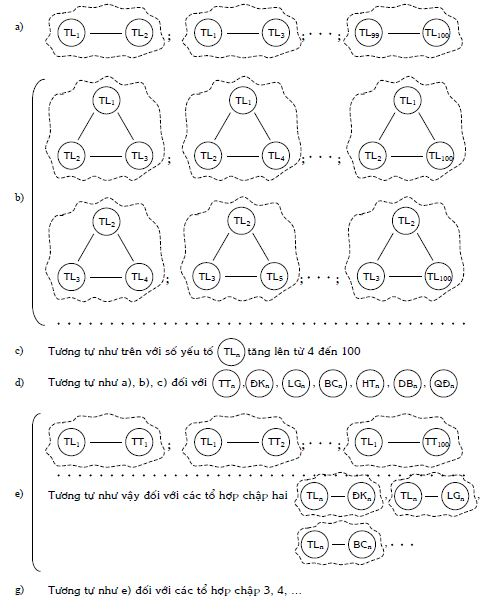

# TƯ DUY HỆ THỐNG

## Mở đầu {#sec:10:1:}
* Vào thế kỷ 17, 18, cơ học cổ điển của Galileo, Newton... đạt được nhiều thành tựu lớn cả trong nhận thức thế giới lẫn giải quyết các bài toán thực tiễn đề ra, tạo nên sự phát triển xã hội mạnh mẽ. Có lẽ vì vậy, nhiều nhà nghiên cứu khái quát hóa các luận điểm cơ học cổ điển thành thế giới quan (chủ nghĩa) cơ giới: Giải thích sự phát triển của tự nhiên và xã hội bằng các quy luật của hình thức cơ học vận động vật chất. Những quy luật đó được xem là phổ biến và đúng cho tất cả các hình thức vận động vật chất. Theo nghĩa rộng, chủ nghĩa cơ giới là sự đánh đồng một cách trừu tượng hình thức vận động vật chất bậc cao với hình thức vận động vật chất bậc thấp: Ví dụ, hình thức xã hội với sinh học; sinh học với hóa học hoặc/và vật lý... cho đến cơ học.

Tuy có những hạn chế, thế giới quan cơ giới là sự tiến bộ vào thời kỳ đó và đóng vai trò tích cực trong việc phát triển khoa học, triết học. Các kiến thức cơ học giúp người ta hiểu, giải thích được nhiều hiện tượng tự nhiên, thoát khỏi các quan điểm thần bí, tôn giáo giáo điều.

Việc dùng các quy luật cơ học ra ngoài phạm vi áp dụng của chúng (xem mục nhỏ _\@ref(subsec:6:5:4:) Tính ì tâm lý do ngoại suy ra ngoài phạm vi áp dụng_ của quyển hai) và tuyệt đối hóa chúng tạo nên bức tranh cơ giới về thế giới: Toàn bộ vũ trụ (từ nguyên tử đến các hành tinh) là hệ cơ học khép kín, bao gồm những yếu tố không thay đổi mà sự vận động của chúng tuân theo các quy luật của cơ học cổ điển. Tư duy tương ứng với mức phát triển nói trên của khoa học chính là tư duy siêu hình.

Sự phát triển tiếp theo của khoa học cho thấy, các cố gắng dựa trên các quy luật cơ học cổ điển để giải thích các hiện tượng điện–từ, hóa học, sinh học, đặc biệt, các hiện tượng xã hội đã hoàn toàn thất bại. Các thành tựu khoa học tự nhiên, xã hội của thế kỷ 19, 20 đã phá vỡ bức tranh cơ giới về thế giới, cũng như cách tư duy siêu hình.

* Thay thế cho cách tiếp cận cơ giới (Mechanistic Approach), được dùng phổ biến từ thế kỷ 17 đến thế kỷ 19, là cách tiếp cận hệ thống (Systems Approach). Từ giữa thế kỷ 20, cách tiếp cận hệ thống được dùng rộng rãi trong nghiên cứu các đối tượng phát triển phức tạp như các hệ thống sinh học tự tổ chức, tâm lý, xã hội, các hệ kỹ thuật lớn, hệ thống _“người và máy móc”_...

Cách tiếp cận hệ thống có các nhiệm vụ: 1) Nghiên cứu các phương tiện mô tả, biểu diễn các đối tượng được nghiên cứu hoặc được thiết kế chế tạo như là các hệ thống; 2) Xây dựng các mô hình khái quát hệ thống, các mô hình về các loại hệ thống và các tính chất của hệ thống; 3) Nghiên cứu cấu trúc của các lý thuyết về hệ thống cùng các quan điểm, phương pháp hệ thống; 4) Là cơ sở lý thuyết và phương pháp luận của phân tích hệ thống.

Trong tất cả sự đa dạng của các hướng, các lĩnh vực nghiên cứu và áp dụng, tiếp cận hệ thống có điểm chung là: Tiếp cận hệ thống xem xét các đối tượng, các hiện tượng thuộc thế giới như là những hệ thống vật chất nhất định, được cấu tạo từ các yếu tố liên kết với nhau theo các chức năng tương ứng.

* Khái niệm hệ thống (System) có một lịch sử rất dài. Thời cổ đại đã có luận điểm cho rằng _“cái toàn thể lớn hơn tổng các bộ phận của nó”_. Sau đó, khái niệm _“hệ thống”_ cùng các tính chất của nó được các nhà triết học như Platon, Aristotle... rồi Kant, Shelling, Hegel... tiếp tục nghiên cứu và phát triển.

Trong phép biện chứng duy vật, các nghiên cứu và phát triển tiếp các hiểu biết về hệ thống được khái quát hóa thành nguyên lý triết học về tính hệ thống.

Toàn bộ hệ thống như là thực thể nguyên vẹn (trọn gói, nguyên khối) xác định các yếu tố cấu trúc. Các yếu tố này có ý nghĩa, giá trị chỉ trong hệ thống nguyên vẹn. Hệ thống, như là thực thể nguyên vẹn, thực hiện chức năng xác định mà chức năng đó đóng vai trò chủ đạo đối với các yếu tố cấu trúc.

* Phân tích hệ thống (Systems Analysis) là hệ thống các phương pháp và phương tiện dùng trong nghiên cứu và thiết kế chế tạo các đối tượng phức tạp và siêu phức tạp. Trước hết, đấy là hệ thống các phương pháp giải quyết vấn đề, ra và lý lẽ hóa các quyết định khi thiết kế, xây dựng và điều khiển các hệ thống xã hội, kinh tế, kỹ thuật, người–máy móc. Phân tích hệ thống xuất hiện trong các tài liệu được công bố chính thức vào những năm 60 của thế kỷ 20 như là kết quả phát triển vận trù học (Operations Research) và kỹ thuật hệ thống (Systems Engineering).

Theo các nguyên tắc của phân tích hệ thống, bất kỳ vấn đề phức tạp nào (trước hết là các vấn đề quản lý, điều khiển) nảy sinh trong xã hội cần được xem xét như một đối tượng toàn thể: Hệ thống của tất cả các bộ phận tương tác lẫn nhau. Để ra quyết định điều khiển hệ thống đó cần xác định mục đích của hệ thống, các mục đích của các bộ phận và các khả năng có thể thay thế nhau để đạt các mục đích nói trên, dựa theo những tiêu chuẩn nhất định về hiệu quả hoạt động. Từ đó, chọn ra cách điều khiển thích hợp nhất với tình huống cho trước. Giai đoạn quan trọng của phân tích hệ thống là xây dựng (loạt) mô hình khái quát của đối tượng được nghiên cứu hoặc thiết kế chế tạo, trong đó, các biến số quan trọng phải được tính đến.

Hệ thống phức tạp có rất nhiều bộ phận cấu thành. Nói cách khác, hệ thống có rất nhiều biến số, cho nên thực hiện phân tích hệ thống, người ta phải sử dụng những máy tính mạnh. Đồng thời, nhiều phương pháp của các lĩnh vực khoa học, kỹ thuật khác cũng được sử dụng rộng rãi trong phân tích hệ thống như các phương pháp của động lực học hệ thống, lý thuyết trò chơi, lập trình heuristic, mô phỏng, điều khiển theo mục đích–chương trình...

Một đặc điểm rất quan trọng của phân tích hệ thống là sự thống nhất các phương pháp, phương tiện hình thức hóa và không hình thức hóa (như sử dụng ngôn ngữ tự nhiên). Phân tích hệ thống có cơ sở lý thuyết và phương pháp luận là tiếp cận hệ thống và lý thuyết chung về hệ thống (General Systems Theory).

* Sự cần thiết phải nghiên cứu các quy luật về cấu trúc chung của các hiện tượng khác nhau đã được nhiều nhà khoa học nhận ra từ lâu. Những ý tưởng về sự thống nhất cấu trúc của thế giới đa dạng quanh chúng ta cũng được ghi nhận từ lâu. Tuy vậy, mãi đến thế kỷ 20 mới xuất hiện những công trình nghiên cứu tương đối hoàn chỉnh về vấn đề nói trên. Trong số đó, cần phải kể đến hai công trình quan trọng: _“Khoa học chung về tổ chức (Tektology)”_ của A.A. Bogdanov (1873 – 1928) và _“Lý thuyết chung về hệ thống”_ của L. von Bertalanffy (1901 – 1972).

Hai công trình nghiên cứu được coi là độc lập nhau này có những ý tưởng chung nhưng phát triển ở những mức khác nhau, và có những ý tưởng khác nhau bổ sung cho nhau.

Theo A.A. Bogdanov, khoa học chung về tổ chức có mục đích tìm hiểu các hình thức, các loại của bất kỳ tổ chức nào, bởi vì thế giới được hình thành từ các tổ chức. Ông đưa ra hàng loạt ý tưởng về nghiên cứu hệ thống, mô hình hóa, quan hệ phản hồi... mà sau này được phát triển trong điều khiển học và lý thuyết chung về hệ thống.

Lý thuyết chung về hệ thống, theo nghĩa rộng nhất, là tập hợp các khái niệm, nguyên lý, công cụ, vấn đề và phương pháp chung liên quan đến nhiều loại, thậm chí, bất kỳ loại hệ thống nào. Như vậy, nó không phải là lý thuyết theo cách hiểu thông thường mà là lĩnh vực nghiên cứu (A Field of Study). Để tránh hiểu lầm, nó còn được gọi là các nghiên cứu chung về hệ thống (General Systems Research) hoặc các nghiên cứu hệ thống (Systems Research).

Các thuật ngữ và ý tưởng về _“hệ thống chung”_ và _“lý thuyết chung về hệ thống”_ lần đầu tiên được L. von Bertalanffy đưa ra trong các bài giảng của mình tại Đại học tổng hợp Chicago năm 1937 (8 năm sau khi A.A. Bogdanov công bố phần ba của Tektology). L. von Bertalanffy bắt đầu đăng các công trình của mình từ năm 1947. Trong lý thuyết chung về hệ thống, L. von Bertalanffy khái quát hóa các nghiên cứu cụ thể thành các nguyên lý toàn thể, tổ chức, đẳng đích (hệ thống đạt được cùng một trạng thái cuối cùng trong những điều kiện ban đầu khác nhau) và đẳng cấu (các hệ thống có cùng một cấu trúc – Isomorphism).

* Phép biện chứng duy vật quan niệm tính hệ thống là tính chất chung nhất, vốn có, không thể tách rời (thuộc tính) của vật chất, tương tự như các tính chất khác (vận động, không gian, thời gian, phản ánh...) của vật chất. Nói cách khác, tính hệ thống là phương thức tồn tại và phát triển của vật chất. Cao hơn nữa, một số nhà nghiên cứu cho rằng, trong các tác phẩm của K. Marx tính hệ thống còn được nâng lên thành nguyên lý phương pháp luận triết học về tính hệ thống, hay gọi tắt là nguyên lý về tính hệ thống.

Khác với chủ nghĩa cơ giới, chủ nghĩa duy vật biện chứng cho rằng, hình thức vận động vật chất cao hơn dựa trên và chứa những hình thức vận động vật chất thấp hơn, nhưng không thể quy nó về thành những hình thức vận động vật chất thấp hơn. Thêm nữa, hình thức vận động vật chất cao hơn có những đặc thù mang tính vật chất, tác động một cách quyết định lên các hình thức vận động vật chất thấp hơn chứa trong nó. Do vậy, xét về số lượng, toàn thể là tổng các bộ phận. Còn xét về chất, toàn thể lớn hơn tổng các bộ phận.

Ví dụ, hình thức vận động sinh học chứa trong nó các hình thức vận động thấp hơn như hóa học, vật lý, cơ học nhưng hình thức vận động sinh học không thể quy về thành những hình thức vận động thấp hơn chứa trong nó. Cơ thể sinh vật (toàn thể) có những tính chất mà các chất hóa học, phân tử, nguyên tử (các bộ phận) không có.

* Khoa học (về) hệ thống có thể được hiểu là tập hợp các nghiên cứu hệ thống và những gì liên quan (kể cả ứng dụng) hệ thống.

Từ tất cả những gì đã trình bày ở mục này, chúng ta thấy, khoa học hệ thống bao gồm:

\- Những nghiên cứu hệ thống tương đối cụ thể và đa dạng như nghiên cứu hệ thống của mỗi lĩnh vực chuyên ngành mà số lượng các lĩnh vực chuyên ngành khác nhau thì rất nhiều.

\- Những nghiên cứu hệ thống với mức độ chung, khái quát hóa khác nhau như nghiên cứu hệ thống ở mức chuyên ngành, liên ngành, toàn thể các ngành (toàn thể khoa học) và triết học.

\- Những nghiên cứu hệ thống dưới góc độ phát hiện, tìm các ý nghĩa, giá trị về các mặt phương pháp luận, heuristic... của các luận điểm hệ thống.

\- Những nghiên cứu định lượng, toán học hóa, mô hình hóa hệ thống.

\- Những nghiên cứu hệ thống nhằm xây dựng các chương trình giải quyết vấn đề và ra quyết định, đặc biệt, đối với các hệ thống lớn (Big Systems), hệ thống phức tạp, siêu phức tạp...

Tóm lại, những hướng nghiên cứu như tiếp cận hệ thống, phân tích hệ thống, các nguyên lý hệ thống... đều là những bộ phận hợp thành của khoa học hệ thống.

Tuy nhiên, khoa học hệ thống còn chưa phát triển thành hệ thống hoàn chỉnh kiểu như toán học, vật lý học, hóa học. Còn nhiều luận điểm chưa được thống nhất giữa các nhà nghiên cứu, nhiều luận điểm mới cần được phát hiện hoặc xây dựng... Ví dụ, riêng khái niệm “hệ thống”, khái niệm trung tâm của khoa học hệ thống, theo V.N. Xađovski, có gần 40 định nghĩa và chúng đều được sử dụng rất rộng rãi trong các công trình nghiên cứu được công bố.

* Tư duy hệ thống (Systems Thinking) trong lĩnh vực sáng tạo và đổi mới được hiểu là tư duy vận dụng các luận điểm của khoa học hệ thống nói chung vào các giai đoạn của quá trình thực hiện giải quyết vấn đề và ra quyết định, để góp phần làm tăng hiệu quả tư duy sáng tạo và năng lực đổi mới của người sử dụng.

Không chỉ sử dụng các kết quả nghiên cứu của khoa học hệ thống, tư duy hệ thống, một mặt, cụ thể hóa các nguyên lý lý thuyết như nguyên lý về sự thống nhất vật chất của thế giới, nguyên lý về mối liên hệ phổ biến, nguyên lý về tính cụ thể và tương tác cũng như các nguyên lý phương pháp luận của phép biện chứng. Mặt khác, tư duy hệ thống trình bày trong bộ sách _“Sáng tạo và đổi mới”_, trước hết, trong chương này còn chứa cả các luận điểm của TRIZ, như là những kết quả khái quát hóa các ý tưởng thường dùng trong các hệ thống thuộc lĩnh vực sáng tạo và đổi mới.

Nói một cách tóm tắt, tư duy hệ thống, một cách đáng kể, giúp xây dựng loại tư duy nhìn xa, trông rộng, xem xét toàn diện để đối phó với các thách thức (xem mục nhỏ _\@ref(subsec:3:3:2:) Các khuynh hướng, thách thức và hệ quả_ của quyển một) và là một bộ phận của kiến thức mạng lưới (xem mục nhỏ _\@ref(subsec:3:3:4:) Giáo dục và đào tạo của tương lai: Vài nét phác thảo_ của quyển một), mà mỗi người cần được trang bị.

Trong mục \@ref(sec:10:2:) tiếp theo, người viết sẽ trình bày một số khái niệm cơ bản cùng một số luận điểm, ý tưởng chung của khoa học hệ thống; các ý nghĩa, giá trị của chúng và các lời khuyên về việc sử dụng chúng trong lĩnh vực sáng tạo và đổi mới.

Mục \@ref(sec:10:3:) dành nói về một thuộc tính của hệ thống. Đấy là tính ì hệ thống mà tính ì tâm lý chỉ là trường hợp riêng của tính ì hệ thống. Tính ì hệ thống cần được tính đến trong mỗi giai đoạn thực hiện sáng tạo và đổi mới. Ngoài việc tìm hiểu bản chất của tính ì hệ thống, ở đây còn có những lời khuyên giúp khắc phục tính ì hệ thống có hại và khai thác tính ì hệ thống có lợi.

Vai trò của các hệ thống tương lai và các phương pháp dự báo sẽ được trình bày trong mục \@ref(sec:10:4:)

Cuối cùng, mục \@ref(sec:10:5:) đưa ra một số ý tưởng về các tiêu chuẩn cần phải chú ý hoặc/và tuân theo khi ra quyết định nhìn dưới quan điểm hệ thống. Mục này còn tóm tắt mang tính hệ thống những gì được trình bày ở Chương 10 trong mối quan hệ đối với giải quyết vấn đề và ra quyết định, đồng thời, cho một số ví dụ để bạn đọc phân tích.

## Một số khái niệm cơ bản và những điều cần lưu ý về tư duy hệ thống {#sec:10:2:}
### Một số khái niệm cơ bản và ý tưởng chung về hệ thống {#subsec:10:2:1:}
1) Khái niệm “hệ thống” là một trong các khái niệm cơ bản của khoa học hệ thống. Trong bộ sách _“Sáng tạo và đổi mới”_, khái niệm “hệ thống” được định nghĩa như sau:

Hệ thống là tập hợp các yếu tố liên kết với nhau và toàn bộ tập hợp đó có (những) tính chất không thể quy về thành (những) tính chất của từng yếu tố, từng mối liên kết đứng riêng rẽ.

(Những) tính chất nói trên được gọi là tính toàn thể hoặc tính hệ thống của hệ thống cụ thể cho trước. Hệ thống được biểu diễn một cách tượng trưng trên Hình 123.

2) Các yếu tố (Elements) (xem Hình 123) được hiểu là các phần (bộ phận) của hệ thống, không chia nhỏ thêm nữa trong cách xem xét cho trước của người giải bài toán. Có nhiều cách chia nhỏ hệ thống cho trước thành các yếu tố. Người ta thường dùng tiêu chuẩn tính chất/chức năng để làm điều đó, hiểu theo nghĩa, sau khi chia nhỏ, mỗi yếu tố sẽ có một (vài) tính chất/chức năng nhất định. Khi dùng thuật ngữ _“yếu tố”_ đối với bộ phận nào của hệ thống, những người sử dụng khái niệm này hiểu rằng, trong cách xem xét cho trước, họ coi bộ phận đó không bị chia nhỏ thêm nữa, không quan tâm bộ phận đó có những gì bên trong, mà chỉ quan tâm tính chất/chức năng của toàn thể bộ phận đó. Việc _“không chia nhỏ thêm nữa”_ thường là do chủ quan của người giải chứ không phải khách quan, xuất phát từ những lý do nhất định như sự thuận tiện; chủ quan cho rằng chỉ cần chia nhỏ đến mức độ cho trước là đủ để giải bài toán; sự hạn chế về kiến thức lúc đó; tính ì tâm lý...

Hình 123: Biểu diễn hệ thống một cách tượng trưng

3) Các mối liên kết (Connections) được hiểu là sự liên hệ, trao đổi, tương tác, ảnh hưởng, phụ thuộc... giữa các yếu tố. Khi nói hai yếu tố liên kết với nhau, có nghĩa, yếu tố này tác động... lên yếu tố kia và ngược lại (xem các đường mũi tên trên Hình 123). Tuy nhiên, tùy theo các hệ thống cụ thể, tương tác có thể xảy ra rất đa dạng như: yếu tố này tác động lên yếu tố kia là chính, còn ngược lại không đáng kể, có thể coi bằng không; tác động qua lại là tương đương; tác động có cấu trúc trong không gian; tác động thay đổi theo thời gian... Sự liên kết các yếu tố thường được thể hiện trên các mặt: (vật) chất, năng lượng, thông tin và các tổ hợp của chúng. Tập hợp các mối liên kết giữa các yếu tố được gọi là cấu trúc của hệ thống.

Tùy theo cách xem xét mà có những trường hợp yếu tố và mối liên kết có thể đổi vai trò cho nhau. Điều này có nghĩa, trong cách xem xét này, bộ phận cho trước đóng vai trò yếu tố; trong cách xem xét khác, nó đóng vai trò mối liên kết.

Ví dụ, đối với rổ tre, trong cách xem xét này, các nan ngang có thể coi là các yếu tố, còn các nan dọc là các mối liên kết, liên kết các nan ngang lại với nhau. Trong cách xem xét khác, chính các nan ngang lại có thể coi là các mối liên kết, liên kết các nan dọc với nhau.

Có những trường hợp mối liên kết nằm ngoài yếu tố, có thể tách riêng ra. Ví dụ, các ốc vít, bù loong dùng để gắn kết các bộ phận khác nhau trong máy móc có thể tháo rời ra. Có những trường hợp mối liên kết là thuộc tính không thể tách rời của yếu tố, không tách riêng ra được. Ví dụ, hai điện tử đẩy nhau khi tương tác với nhau. Bạn không thể tách riêng lực điện (điện trường) ra khỏi điện tử, hay điện tích nói chung.

Một hệ có n yếu tố, về mặt khả năng, nó có thể có n (n-1) các mối liên kết. Bởi vì, một yếu tố bất kỳ của hệ thống có thể tác động lên (n-1) yếu tố còn lại và trong hệ thống có tất cả n yếu tố như thế. Tuy nhiên, trong thực tế, tất cả n (n-1) các mối liên kết không phải có ngay từ đầu khi hệ thống vừa mới ra đời mà thường ít hơn. Sau đó, số lượng, tính chất của các mối liên kết thay đổi theo thời gian. Nói cách khác, một yếu tố không phải ngay từ đầu đã tác động lên tất cả các yếu tố còn lại của hệ thống. Ví dụ, đứa bé mới sinh liên kết chủ yếu với mẹ, bố, những người ruột thịt trong gia đình; đi học có thêm các mối liên kết với thầy cô, bạn học...

4) Tính toàn thể – Wholeness (tính hệ thống – Systemness) là sự thay đổi về chất, chưa xuất hiện trước đó khi hệ thống chưa hình thành: Hệ thống có (những) tính chất mà từng yếu tố, từng mối liên kết đứng riêng rẽ không có. Đấy cũng chính là luận điểm _“cái toàn thể lớn hơn tổng các bộ phận của nó”_, phản ánh đặc thù của hệ thống so với các bộ phận và các mối liên kết cấu thành hệ thống. Tính toàn thể thường thể hiện thành các tính chất toàn thể (trọn gói) hệ thống hoặc/và các chức năng của cả hệ thống. Tính toàn thể (tính hệ thống) là sự thay đổi về chất, do vậy, theo quy luật về lượng–chất, tính toàn thể (chất mới) sẽ làm thay đổi các đại lượng của hệ thống về lượng.

Tính toàn thể phụ thuộc vào các yếu tố, các mối liên kết cấu thành hệ thống (gọi chung là kết cấu). Để tăng độ tin cậy của tính toàn thể, nhiều hệ thống có độ dư (Redundance) nhất định về số lượng và chất lượng của các yếu tố, các mối liên kết. Điều này có nghĩa, trong những trường hợp có sự trục trặc của một số yếu tố hoặc/và mối liên kết, hệ thống vẫn có thể hoạt động. Ví dụ, xe ôtô vận tải có nhiều vỏ xe. Nếu không may có một vỏ bị bể, xe vẫn có thể chạy tiếp đến nơi cần thay vỏ.

5) Bất kỳ đối tượng nào thỏa mãn định nghĩa hệ thống, chúng ta gọi nó là hệ thống. Dưới đây là một số ví dụ về hệ thống.

\- Máy bay là tập hợp các yếu tố như động cơ, thùng nhiên liệu, thân, cánh, đuôi, cánh quạt, càng, bánh xe, mạng điện... liên kết với nhau và toàn bộ máy bay có tính chất bay không thể quy về thành tính chất của từng yếu tố, từng mối liên kết đứng riêng rẽ.

\- Bè chuối là tập hợp các yếu tố gồm sáu cây chuối liên kết với nhau bằng ba thanh tre và toàn bộ bè chuối có tính chất thăng bằng ổn định, không bị lật, không thể quy về thành tính chất của từng yếu tố (từng cây chuối), từng mối liên kết (từng thanh tre) đứng riêng rẽ (xem Hình 124).

Hình 124: Hệ thống bè chuối

\- Cái kéo là tập hợp hai lưỡi kéo liên kết với nhau bằng một cái ốc vít, có tính chất cắt (giấy, lá kim loại...), không thể quy về thành tính chất của từng lưỡi kéo, ốc vít đứng riêng rẽ.

\- Phân tử nước là tập hợp các yếu tố gồm hai nguyên tử hyđrô, một nguyên tử ôxy liên kết với nhau và toàn bộ phân tử nước có các tính chất: Không cháy, lỏng ở nhiệt độ phòng, là những tính chất không thể quy về thành những tính chất của các nguyên tử hyđrô, ôxy đứng riêng rẽ (xem Hình 125). Các nguyên tử hyđrô, ôxy đứng riêng cháy tốt và là chất khí ở nhiệt độ phòng.

\- _“Lòng yêu nước là lòng yêu những vật tầm thường nhất. Yêu cái cây nhỏ trồng trước cửa nhà, yêu cái phố nhỏ đổ ra bờ sông, yêu vị thơm chua mát của trái lê mùa thu, yêu mùi cỏ thảo nguyên có hơi rượu mạnh... Dòng suối đổ vào sông, sông đổ vào đại trường giang Vôlga, đại trường giang Vôlga đổ ra biển. Lòng yêu những vật tầm thường nhất góp lại trở nên lòng yêu quê hương, đất nước”_ (Nhà văn Ilya Erenburg).

\- Một từ, ví dụ từ _“học”_, là tập hợp các chữ cái và dấu liên kết với nhau và toàn bộ từ có nghĩa không thể quy về thành nghĩa của từng chữ cái và dấu đứng riêng rẽ.

Tương tự như vậy, chúng ta có thể thấy, hạt cơ bản, nguyên tử, phân tử... là những hệ thống; con người, gia đình, công ty, tổ chức, thành phố, quốc gia, Trái Đất, Vũ Trụ là những hệ thống; tác phẩm khoa học, văn học, âm nhạc, hội họa, kiến trúc... là những hệ thống;... Nói cách khác, khái niệm _“hệ thống”_ mang tính khái quát rất cao, đến nỗi, bất kỳ đối tượng vật chất, tinh thần nào đều có thể xem là hệ thống. Điều này rất ích lợi trong việc xây dựng ngôn ngữ suy nghĩ, thảo luận chung cho các nhà chuyên môn khác nhau, phá vỡ các hàng rào nhân tạo ngăn cách các lĩnh vực, chuyên môn, giúp thấy thế giới là một chỉnh thể thống nhất...

6) Trạng thái hệ thống (Systems State) được hiểu là tập hợp các thông số, dấu hiệu mô tả hệ thống. Các thông số, dấu hiệu này phản ánh các yếu tố, mối liên kết và tính toàn thể hệ thống. Chỉ cần một trong những thông số, dấu hiệu đó thay đổi, người ta sẽ coi hệ cho trước ở trạng thái hệ thống khác. Một hệ thống có nhiều trạng thái. Hệ càng phức tạp, số trạng thái có thể có càng nhiều (xem các Hình 40, 54, 81, 82 cùng những lời giải thích kèm theo của quyển hai). Tuy nhiên, không phải trạng thái nào cũng là trạng thái “tốt” của hệ thống cho trước. Các trạng thái “xấu” cho thấy, các hệ thống liên quan có vấn đề. Trong quá trình sáng tạo và đổi mới, trong nhiều trường hợp, chúng ta phải đưa các hệ liên quan chuyển từ trạng thái xấu (bài toán) sang trạng thái tốt (lời giải) có các thông số, dấu hiệu phù hợp mục đích cần đạt.

7) Hệ thống có thể phân loại theo nhiều cách. Dưới đây là một số trong những cách có thể:

\- Phân loại theo mức độ chặt chẽ trong liên kết của cấu trúc. Mức độ liên kết giữa các yếu tố của các hệ thống có thể trải dài từ _“zêrô”_ (như đống đá, đám đông tình cờ trên đường phố, khí lý tưởng...) đến _“chặt tuyệt đối”_ (các tấm ván dán ép chặt nhau thành một, bêtông cốt thép, chất rắn tuyệt đối...).

\- Phân loại theo hình thái của cấu trúc (như phân loại tinh thể theo cấu trúc mạng trong tinh thể học, các chất đồng cấu...).

\- Phân loại theo các hình thức vận động của vật chất như hệ thống cơ học, vật lý và hóa học, sinh học, xã hội.

\- Phân loại theo đặc trưng về mối quan hệ giữa toàn thể và các bộ phận như các chất vô cơ và các chất hữu cơ...

\- Phân loại theo các lĩnh vực chuyên ngành của tự nhiên, xã hội, tư duy.

\- Phân loại theo đặc trưng của vận động như các hệ thống tĩnh, động, động lực.

\- Phân loại theo khả năng thay đổi như hệ thống không có khả năng vận hành (như tinh thể...), có khả năng vận hành (như máy móc...), có phát triển (như sinh vật...).

\- Phân loại theo đặc trưng trao đổi với các hệ khác và môi trường như hệ đóng, hệ mở.

\- Phân loại theo mức độ quyết định của nguyên nhân đối với kết quả (quan hệ nhân quả) như hệ thống với mức độ quyết định đơn giá (tương ứng một–một), hệ thống với mức độ quyết định mang tính xác suất.

\- Phân loại theo đặc trưng xuất xứ như hệ thống tự nhiên, hệ thống nhân tạo, hệ thống hỗn hợp (như hệ thống “người–máy móc”, “người nghiên cứu–máy móc–đối tượng nghiên cứu”...).

\- Phân loại theo mức độ phát triển như hệ thống có mức phát triển thấp, hệ thống có mức phát triển cao.

\- Phân loại theo khuynh hướng phát triển như hệ thống tiến bộ, hệ thống thoái hóa, hệ thống phản động.

\- Phân loại theo đặc trưng của kiến thức như hệ thống lý thuyết, hệ thống kinh nghiệm...

\- Phân loại theo tính điều khiển như hệ thống chưa điều khiển được, hệ thống điều khiển được, hệ tự điều khiển.

\- Phân loại theo chức năng điều khiển như hệ điều khiển và hệ bị điều khiển.

Việc phân loại hệ thống nói trên là để thuận tiện khi xem xét, chứ không phải là phân chia khái niệm (xem mục nhỏ _\@ref(subsec:8:3:4:) Phân chia khái niệm_ của quyển ba này), do vậy, một hệ thống cho trước có thể vừa thuộc loại này, vừa thuộc loại khác.

Bộ sách _“Sáng tạo và đổi mới”_ chỉ chủ yếu đề cập đến các hệ thống nhân tạo, các hệ thống liên quan đến con người và các hệ thống gồm các con người (các tổ chức các loại). Do vậy, ở đây cũng đặc biệt nhấn mạnh đến _“tính mở”_ của hệ thống, quan hệ giữa khách thể và chủ thể (quan hệ giữa chân lý và giá trị), quan hệ giữa người và người (phải tính đến các đặc thù của thế giới bên trong mỗi cá nhân), quan hệ giữa tuyệt đối, lý tưởng và tương đối, thực tế (đi từ lý tưởng, khái quát, trừu tượng cao đến các yêu cầu, đòi hỏi cụ thể và ngược lại).

8) Hệ thống có thể biểu diễn bằng nhiều cách (nhiều loại mô hình) mà Hình 123 mới chỉ là một cách. Bạn đọc có thể xem lại các hình vẽ mô tả hệ thống có trong mục _\@ref(sec:7:2:) Điều khiển học: Một số ý tưởng cơ bản chung_ của quyển hai). Nếu bạn biết rõ các yếu tố, các mối liên kết và sự vận hành của chúng, của hệ thống thì hệ thống không còn là hộp đen nữa (xem _Hình 69: Mô hình chung về hệ thống và tương tác của nó_, mục _\@ref(sec:7:2:)_ của quyển hai). Lúc này, bạn có thể biểu diễn hệ thống rõ ràng, chi tiết hơn (xem Hình 123 và Hình 126).

Đầu vào là tập hợp các tác động lên hệ thống, kể cả của môi trường. Các tác động này có thể phân tích thành (vật) chất, năng lượng, thông tin và tổ hợp của chúng. Hệ thống đóng vai trò thiết bị biến đổi (Processor), biến đổi các tác động đầu vào thành các kết quả đầu ra. Các kết quả đầu ra cũng có thể phân tích thành (vật) chất, năng lượng, thông tin và tổ hợp của chúng. Các kết quả đầu ra của hệ thống này có thể là cái cần thiết cho hệ thống khác. Nói cách khác, đầu ra của hệ thống này trở thành đầu vào của hệ thống khác và cứ như thế... Bản thân môi trường cũng có thể coi là hệ thống. Sau này, tùy theo mục đích, người viết còn sử dụng các dạng mô hình khác để mô tả hệ thống. Ngoài ra, còn có nhiều loại mô hình khác nữa mà người viết không thể đề cập hết được.

9) Các hệ thống có thể kết hợp với nhau, tạo thành hệ thống mới, phức tạp hơn (xem Hình 127).

Rõ ràng, hệ thống mới có tính toàn thể mới, không thể quy về thành tính toàn thể của từng hệ thống thành phần kết hợp nên nó. Nhằm mục đích này, người ta có thể chủ động thiết kế, chế tạo những hệ thống mới bằng cách kết hợp những hệ thống đã có để tạo ra sự phát triển. Hoặc, hệ tự phát triển có thể sử dụng khả năng này để có được mức độ phát triển cao hơn.

Trên thực tế, loại hệ thống chỉ có một đầu vào và một đầu ra là trường hợp khá đặc biệt. Thông thường, một hệ thống có thể có nhiều (từ hai trở lên) đầu vào và đầu ra. Chưa kể, số lượng đầu vào, đầu ra của hệ thống có thể thay đổi theo thời gian. Ngoài ra, còn phải tính đến tác động của môi trường lên hệ thống mà tác động đó có thể xảy ra với toàn bộ hệ thống (với tất cả hoặc với số lượng lớn các yếu tố, các mối liên kết cấu thành hệ thống) chứ không chỉ với các đầu vào hoặc/và đầu ra.

10) Đối với hệ có tính toàn thể phức tạp (đa chức năng, đa mục đích, đa tính chất, đa ý nghĩa...) mang tính khách quan hoặc chủ quan, người ta có thể xem xét riêng từng chức năng, từng ý nghĩa..., tùy theo nhu cầu, sự quan tâm của mình... Cách xem xét này gọi là chiều xem xét hệ thống.

Ví dụ, người ta có thể xem xét một mảnh đất theo những góc độ khác nhau: địa lý; địa chất; địa hình; làm nông nghiệp; làm du lịch; để ở; làm nơi đặt tượng đài; làm đường giao thông; xây sân vận động; hội chợ... Nếu có N cách xem xét hệ thống cho trước thì N cách đó có thể biểu diễn thành N hướng, mỗi hướng tương ứng với một cách xem xét (xem Hình 128).

Các cách xem xét khác nhau là cần thiết. Bởi vì, hệ thống cũng như bất kỳ sự vật, sự việc nào cũng có nhiều khía cạnh (bạn có thể so sánh Hình 128 với Hình 65 của quyển hai). Các chiều xem xét hệ thống còn tính đến các khía cạnh chủ quan của những người quan tâm đến hệ thống cho trước. Ngoài ra, các chiều xem xét hệ thống giúp khắc phục tính ì tâm lý “thiếu” (xem mục nhỏ \@ref(subsec:6:5:3:) của quyển hai). Nói cách khác, cần sử dụng tất cả các chiều xem xét hệ thống có thể có để đạt được sự xem xét toàn diện, không bỏ sót các ý nghĩa, giá trị của hệ thống.

11) Hệ thống thay đổi theo thời gian.

Có hai cách xem xét hệ thống theo thời gian: tuyệt đối và tương đối. Trong cách xem xét thứ nhất, thời gian tuyệt đối được hiểu là thời gian thực mà chúng ta đang sống. Trong thời gian thực, chúng ta không thể quay về quá khứ và không thể làm cho tương lai đến nhanh hơn hoặc lùi xa hơn. Cách xem xét này coi thời gian là khách quan. Ví dụ, bây giờ là 12 giờ trưa ngày 1 tháng 5 năm 2006. Đây là thời gian thực. Trước thời gian đó được coi là quá khứ và sau thời gian đó được coi là tương lai. Chúng ta không thể bắt quá khứ quay trở lại hoặc tương lai đến chậm hoặc đến sớm.

Cách xem xét thứ hai coi thời gian là tương đối, hiểu theo nghĩa, chủ quan người giải có quyền chọn bất kỳ thời điểm nào làm mốc thời gian hiện tại rồi từ đó quy ra quá khứ, tương lai. Ví dụ, nếu bạn chọn năm 1900 làm hiện tại thì trước đó là quá khứ, sau đó là tương lai. Nếu bạn chọn năm 3000 là hiện tại, thì tương tự, trước năm 3000 sẽ coi là quá khứ, sau năm 3000 là tương lai.

Nếu bạn chọn cây trưởng thành là hiện tại thì cây non là quá khứ, gỗ cưa ra từ cây trưởng thành là tương lai... Nếu bạn chọn cây non là hiện tại thì mầm cây là quá khứ, cây trưởng thành là tương lai... Theo dõi hệ thống theo thời gian, người ta có thể thu được những thông tin về sự thay đổi, tiến hóa và phát triển của hệ thống cho trước. Từ đó, người ta xử lý chúng, rút ra những kết luận ích lợi đối với việc giải bài toán.

Nếu xem xét xa hơn, người ta còn có thể chia thời gian chi tiết nữa. Ví dụ, quá khứ gần; quá khứ vừa; quá khứ xa; quá khứ xa nữa; quá khứ xa-xa nữa;... Tương tự như vậy đối với tương lai: tương lai gần; tương lai vừa; tương lai xa; tương lai xa nữa; tương lai xa-xa nữa;... Tuy nhiên, để cho gọn, thường người ta chỉ biểu diễn thời gian thành ba thì: quá khứ, hiện tại và tương lai (xem Hình 129).

12) Khái niệm hệ thống mang tính tương đối: một yếu tố thuộc hệ thống cho trước, trong cách xem xét khác, nó lại thỏa mãn định nghĩa hệ thống. Để phân biệt, người ta gọi nó là hệ dưới (Subsystem). Ví dụ, khi chọn “máy bay” là hệ thống, yếu tố “động cơ” trong cách xem xét chi tiết hơn cũng thỏa mãn định nghĩa hệ thống. Để tránh lầm lẫn, lúc đó, “động cơ” được gọi là hệ dưới của hệ thống “máy bay”.

Hệ cho trước, trong cách xem xét khác, lại trở thành yếu tố của hệ lớn hơn, bao nó. Để phân biệt, người ta gọi hệ lớn hơn là hệ trên (Supersystem). Ví dụ, hệ trên của máy bay có thể là sân bay mà máy bay cho trước chỉ là một yếu tố.

Sự xem xét này có thể tiếp tục, tạo thành thang bậc hệ thống (Systems Hierarchy), xem Hình 130.

Nếu xem xét rộng hơn, chúng ta có hệ trên nữa (Super–super–system); hệ trên–trên nữa (Super–super–super–system);... Tương tự như vậy, nếu xem xét hẹp hơn, chúng ta có hệ dưới nữa (Sub–sub–system); hệ dưới–dưới nữa (Sub–sub–sub–system);... Tuy nhiên, để cho gọn, người ta thường biểu diễn ba bậc: hệ, hệ trên, hệ dưới (xem Hình 131). Những đường nối các hệ thống ở các bậc khác nhau tượng trưng cho các mối liên kết.

Nhân đây, người viết muốn lưu ý với bạn đọc: Trong quyển một, quyển hai của bộ sách _“Sáng tạo và đổi mới”_ và các chương 8, 9 của quyển ba này, đôi khi người viết dùng từ _“hệ thống con”_. Nay làm quen với các khái niệm của khoa học hệ thống, bạn đọc có thể đoán ra _“hệ thống con”_ chính là _“hệ thống dưới”_, hoặc ngắn gọn hơn nữa – _“hệ dưới”_.

Thang bậc hệ thống mang tính tương đối, hiểu theo nghĩa, bạn có thể đổi: gọi hệ cho trước bây giờ là hệ trên, lúc đó, hệ dưới của hệ cho trước trở thành hệ thống và hệ dưới nữa của hệ cho trước trở thành hệ dưới... Ví dụ, bạn đổi lại, thay vì xem máy bay là hệ thống, bạn gọi máy bay là hệ trên, lúc đó, động cơ máy bay,... sẽ là các hệ và bu-gi,... của động cơ máy bay sẽ là các hệ dưới.

Một hệ trên bao gồm nhiều hệ liên kết với nhau. Một hệ lại gồm nhiều hệ dưới liên kết với nhau và cứ như thế... (xem Hình 130 và Hình 131a). Trong nhiều trường hợp, để tiện trình bày, người ta dùng biểu diễn hệ thống rút gọn gồm ba bậc: hệ, hệ trên, hệ dưới (xem Hình 131b).

Mỗi một hệ được biểu diễn trên Hình 131 có tính toàn thể của nó. Các tính toàn thể của các hệ khác nhau thì khác nhau nhưng ràng buộc nhau. Nhìn theo các quy luật phát triển của phép biện chứng duy vật, khuynh hướng chung là, các quy luật có mức độ khái quát cao hơn quy định tính định hướng tác động của các quy luật có mức độ khái quát thấp hơn. Với ý nghĩa này, trong những trường hợp tương ứng, tính toàn thể của hệ (thể hiện thành chức năng của hệ) ở bậc cao hơn quy định tính toàn thể của các hệ ở bậc thấp hơn.

Ví dụ, giả sử máy bay là hệ trên, tính toàn thể của hệ trên là _“bay”_. Máy bay gồm các hệ thống như động cơ, cánh quạt, cánh máy bay... Tính toàn thể của hệ trên (máy bay) _“bay”_ quy định các tính toàn thể của các hệ: động cơ phải cho ra N vòng quay/phút; cánh quạt quay phải tạo ra lực kéo ngang M Newton; khi máy bay chạy lấy đà cất cánh, cánh máy bay phải đạt được lực nâng thẳng đứng K Newton;...

Động cơ là hệ, có các hệ dưới như pít-tông, xy-lanh, bu-gi, bộ phận cấp, trộn nhiên liệu... Các hệ dưới có tính toàn thể của mình, chịu sự quy định tính toàn thể của hệ (động cơ). Chẳng hạn, N vòng quay/phút của động cơ quy định dung tích, khả năng chịu áp lực của xy-lanh..., tốc độ chuyển động của pít-tông, số lần đánh lửa của bu-gi trong một phút...

Các tính toàn thể (các chức năng) của các hệ dưới (pít-tông, xy-lanh, bu-gi...) liên kết tạo nên tính toàn thể của hệ (động cơ) là _“N vòng quay/phút”_, chứ không phải hệ dưới phải có chức năng quay _“N vòng quay/phút”_. Tương tự, các tính toàn thể của các hệ (động cơ, cánh quạt, cánh máy bay...) góp phần tạo nên tính toàn thể của hệ trên (máy bay) là _“bay”_, chứ không phải từng hệ có tính toàn thể là _“bay”_.

13) Thang bậc hệ thống, thời gian và chiều xem xét hệ thống tạo thành không gian hệ thống(Systems Space), xem Hình 132 và Hình 133. Đối với hệ có tính hệ thống đơn giản (một chức năng), người ta có trường hợp đặc biệt: mặt phẳng hệ thống, xem Hình 134.

Như chúng ta đã biết trong điểm 10 và Hình 128 của mục nhỏ này về chiều xem xét hệ thống, chiều xem xét hệ thống có thể thay đổi (“quay được”), tùy theo người giải thay đổi chiều xem xét. Không gian hệ thống (xem Hình 132) có ba trục. Trong đó, trục _“thời gian”_ được giữ cố định. Trục _“chiều xem xét hệ thống”_ có thể quay trong mặt phẳng vuông góc với trục _“thời gian”_, có hướng sau khi quay tương ứng với chiều xem xét của người giải. Nếu người giải có N chiều xem xét thì trục _“chiều xem xét hệ thống”_ có N hướng tương ứng (xem Hình 128 và Hình 133). Người giải lần lượt xem xét hệ thống theo chiều 1, rồi 2... cho đến N. Mỗi lần xem xét, sau khi cố định chiều, trục vuông góc với mặt phẳng tạo bởi trục _“thời gian”_ và trục _“chiều xem xét hệ thống”_ chính là trục _“thang bậc hệ thống”_. Hình 132 cho chúng ta thấy một lần xem xét như vậy. Hình dạng của không gian hệ thống có dạng hình trụ (xem Hình 133). Mỗi mặt phẳng đi qua _“trục thời gian”_ là mỗi mặt phẳng hệ thống (Systems Plane) tương ứng với _“chiều xem xét hệ thống”_ nhất định (xem Hình 134). Các hệ thống nằm trong các mặt phẳng hệ thống khác nhau có thể liên kết với nhau. Trên thực tế, chúng thường liên kết với nhau.

Hình 134: Mặt phẳng hệ thống

Về mặt nguyên tắc, không gian các hệ thống vật chất chứa tất cả các hệ thống có trong thế giới vật chất, từ các hạt quark đến toàn thể vũ trụ và lịch sử của chúng từ quá khứ đến tương lai. Quả thật, các hạt quark được coi là có bậc thấp nhất trong thang bậc hệ thống, từ đó hình thành các hạt cơ bản. Trong quá trình vận động có chọn lọc, các hạt cơ bản liên kết với nhau tạo thành các nguyên tử với mức độ phức tạp khác nhau. Đến lượt mình, các nguyên tử liên kết với nhau thành các phân tử có các mức độ phức tạp khác nhau... Tiếp theo, thang bậc hệ thống dường như chia hai ngả: Trong thế giới vô cơ thành thang bậc của các hệ thống vũ trụ; trong thế giới các chất hữu cơ thành những hình thức sống đầu tiên... Trong thế giới sống, thang bậc hệ thống tiếp tục từ tế bào đến mô, cơ quan, cơ thể, giống, loài... xã hội loài người (xã hội của những động vật có khả năng tư duy). Mỗi lần chuyển bậc hệ thống, tính toàn thể của hệ thống ở bậc mới có sự thay đổi về chất, tạo ra sự phát triển không đảo ngược.

Ngoài ra, người ta còn có thể lập mô hình không gian hệ thống đối với các hệ thống thuộc thế giới tinh thần của con người nói riêng, không gian hệ thống đối với các hệ thống nhân tạo nói chung, thậm chí, không gian hệ thống các vấn đề, không gian hệ thống các lời giải...

14) Một thay đổi, tác động nào đó xảy ra tại một yếu tố hoặc một mối liên kết thường không cố định tại đó mà sẽ lan tỏa đi khắp hệ thống cho trước và xa hơn. Điều này có thể hiểu được vì các yếu tố không đứng độc lập mà liên kết với nhau; các mối liên kết, liên kết các yếu tố; hệ thống cho trước lại liên kết với các hệ thống khác, với môi trường; các hệ thống trong những cách xem xét khác nhau cũng có thể liên kết với nhau.

Tác động của quá trình lan tỏa sự thay đổi được gọi là hiệu ứng hệ thống lan tỏa sự thay đổi (Systems Change Spreading Effect), hay gọi tắt là hiệu ứng lan tỏa. Ở đâu có mối liên kết, ở đó sẽ có lan tỏa sự thay đổi, tác động theo mối liên kết đó. Trong quá trình lan tỏa, sự thay đổi ban đầu bị biến đổi, tùy theo hệ thống cụ thể, thể hiện ở chỗ làm thay đổi (hiểu theo nghĩa rất rộng) các mối liên kết, các yếu tố mà nó đi qua cả về lượng lẫn về chất theo những cách khác nhau. Quan hệ nhân quả, nhiều khi, trở nên rất phức tạp. Ví dụ, ruột xe gắn máy của người đi xe thay đổi: Non hơi chẳng hạn. Sự thay đổi này dẫn đến vỏ xe mòn nhanh hơn do tăng ma sát với mặt đường; tốc độ xe giảm; động cơ xe phải làm việc gắng sức, trở nên nóng hơn; tay lái khó điều khiển hơn; tốn xăng hơn; tăng ô nhiễm môi trường; tuổi thọ xe giảm; chi phí tăng lên; có thể xảy ra xung đột trong gia đình về cách đi và bảo quản xe của người dùng xe; có thể xảy ra tai nạn cho người đi xe hoặc người khác, nếu gây ra tai nạn cho người khác; sự thay đổi còn lan tỏa tiếp tục xa nữa...

Về mặt nguyên tắc, bất kỳ sự thay đổi, tác động nào đều có thể lan tỏa đi khắp các hệ thuộc không gian hệ thống. Tuy nhiên, trên thực tế, trong khi lan tỏa tại những hệ thống cụ thể, sự thay đổi, tác động có thể bị suy giảm, triệt tiêu. Do vậy, sự lan tỏa của sự thay đổi, tác động chỉ cần tính đến thời điểm và địa điểm, ở đó chúng bị triệt tiêu.

### Những điểm cần lưu ý về tư duy hệ thống {#subsec:10:2:2:}
Mục nhỏ này trình bày các yêu cầu, lời khuyên vận dụng các khái niệm, luận điểm, ý tưởng chung về hệ thống đã trình bày trong mục nhỏ trước vào lĩnh vực sáng tạo và đổi mới.

1) Trong mỗi bài toán đều có một hệ thống và bản thân bài toán là hệ thống. Do vậy, những gì liên quan đến hệ thống nói chung cũng đều đúng đối với bài toán trên hai phương diện: hệ có trong bài toán và bài toán như là hệ thống.

Các bài toán rất đa dạng, có thể nảy sinh ở bất kỳ lĩnh vực nào. Nhìn theo quan điểm hệ thống, trong mỗi bài toán cụ thể có một hệ thống cụ thể. Ví dụ, động cơ xe gắn máy trục trặc, hệ thống có trong bài toán là động cơ; cần phát hiện bệnh nhân bị bệnh gì, hệ thống có trong bài toán là bệnh nhân; một tổ chức có hiện tượng mất đoàn kết, hệ thống có trong bài toán là tổ chức; công ty làm ăn thua lỗ, hệ thống có trong bài toán là công ty... Thông thường, người giải có thể xác định hệ thống có trong bài toán thông qua lời phát biểu bài toán.

Mặt khác, bản thân bài toán cho trước cũng là hệ thống, vì, bài toán đó có thể gồm các bài toán nhỏ (dưới) liên kết với nhau và toàn bộ bài toán cho trước có (những) tính chất không thể quy về thành (những) tính chất của các bài toán nhỏ đứng riêng rẽ. Ví dụ, bài toán làm sao cho máy bay “bay” gồm các bài toán nhỏ (dưới): Làm sao động cơ cho ra N vòng quay/phút; cánh quạt khi quay tạo ra lực kéo ngang M Newton; cánh máy bay đạt lực nâng thẳng đứng K Newton...; liên kết giữa chúng như thế nào thì mới đạt mục đích “bay”. Từng bài toán nhỏ (dưới) riêng rẽ nói trên không có mục đích “bay”. Nói cách khác, mục đích (tính toàn thể) của bài toán “bay” không thể quy về thành các mục đích cần đạt của các bài toán nhỏ (dưới) đứng riêng rẽ. Như vậy, bài toán cũng thỏa mãn định nghĩa hệ thống.

Trong ý nghĩa vừa nêu, người giải cần vận dụng các khái niệm, luận điểm, ý tưởng chung về hệ thống trình bày ở Chương 10 này nói riêng và những phần khác của bộ sách _“Sáng tạo và đổi mới”_ nói chung để suy nghĩ về hệ thống có trong bài toán đang giải, lẫn bản thân bài toán đang giải như là hệ thống. Hai công việc này hỗ trợ, bổ sung cho nhau. Người giải có khả năng liên kết hai công việc lại với nhau, sẽ tìm thêm được những ý tưởng mang tính toàn thể (hệ thống) mà từng công việc riêng rẽ không có.

Ngoài ra, khi suy nghĩ làm bất kỳ công việc gì, bạn nên quan niệm công việc đó như là hệ thống và vận dụng tất cả những gì liên quan đến hệ thống vào công việc của bạn. Nói cách khác, tư duy hệ thống không chỉ cần thiết cho quá trình suy nghĩ và thực hiện giải bài toán khi bạn có bài toán, mà còn giúp bạn làm tốt hơn những công việc bạn cần phải làm, dù đấy là những công việc bạn tưởng là nhỏ. Người viết còn quay trở lại vấn đề này và bàn chi tiết hơn trong điểm 11 của mục nhỏ này.

Vậy tư duy hệ thống là gì?

2) Tư duy hệ thống là quá trình suy nghĩ của người giải, sao cho người giải không chỉ thấy, hiểu, xử lý thông tin... về hệ có trong bài toán và bài toán như là hệ thống mà, về mặt nguyên tắc, toàn bộ các hệ có trong không gian hệ thống. Ít nhất, người giải phải thấy, hiểu, xử lý thông tin... về 9N hệ (đối với hệ có N chiều xem xét) và môi trường; hoặc 9 hệ (đối với hệ có một chiều xem xét) và môi trường.

Giả sử người giải có bài toán về một công ty làm ăn thua lỗ. Người giải cần xác định hệ thống có trong bài toán. Trong trường hợp này, đó là công ty. Để xây dựng và sử dụng không gian hệ thống (xem Hình 132 và Hình 133), trong ba trục, người giải cần lựa chọn trục _“chiều xem xét hệ thống”_ đầu tiên. Căn cứ vào đòi hỏi, ngữ cảnh của bài toán và cách tiếp cận chủ quan của mình, người giải cần xác định số lượng các chiều xem xét hệ thống. Nếu tìm ra N chiều xem xét hệ thống, người giải lấy ra N tờ giấy rời, viết tên chiều xem xét tương ứng lên từng tờ giấy, từ 1 đến N và vẽ hai trục kia của không gian hệ thống: _“thời gian”_; _“thang bậc hệ thống”_ (xem Hình 132).

Tiếp theo, trên từng tờ giấy (ứng với chiều đang xem xét hệ thống), người giải vẽ các ô mà mỗi ô là một hệ thống với tên gọi tương ứng như: hệ hiện tại, hệ quá khứ, hệ tương lai; hệ dưới hiện tại, hệ dưới quá khứ, hệ dưới tương lai; hệ dưới nữa hiện tại; hệ dưới nữa quá khứ, hệ dưới nữa tương lai; hệ trên hiện tại, hệ trên quá khứ, hệ trên tương lai; hệ trên nữa hiện tại, hệ trên nữa quá khứ, hệ trên nữa tương lai;...

Người giải điền vào trong từng ô những thông tin và xây dựng các mô hình cần thiết, ít ra, dưới dạng các hình vẽ tương tự như các Hình 123, Hình 130 về hệ thống ứng với ô đó, cứ như thế... cho đến hết tất cả các ô của không gian hệ thống. Sau đó, người giải bài toán chuyển sang giai đoạn tiếp thu tất cả những thông tin đã viết ra trong các ô trên tất cả các tờ giấy, xử lý chúng, phát các ý tưởng giải bài toán (xem mục _\@ref(sec:6:2:) Mô hình quá trình suy nghĩ giải quyết vấn đề và ra quyết định_) dưới góc độ của các khái niệm, luận điểm, ý tưởng chung về hệ thống. Tương tự, người giải lặp lại quá trình nói trên đối với bài toán như là hệ thống. Về nguyên tắc, suy nghĩ như vậy gọi là tư duy hệ thống.

Rõ ràng, tư duy hệ thống một cách đầy đủ như mô tả ở trên là công việc rất lớn, nếu như không nói là vô cùng lớn, đòi hỏi nhiều thời gian, sức lực, trí lực. Nhằm mục đích đơn giản hóa, người ta đưa ra yêu cầu tối thiểu đối với tư duy hệ thống: Ít nhất, người giải phải thấy, hiểu, xử lý thông tin... về 9N hệ (đối với hệ có N chiều xem xét) và môi trường hoặc 9 hệ (đối với hệ có một chiều xem xét) và môi trường. Chín hệ: Hệ hiện tại, hệ quá khứ, hệ tương lai; hệ trên hiện tại, hệ trên quá khứ, hệ trên tương lai; hệ dưới hiện tại, hệ dưới quá khứ, hệ dưới tương lai (xem Hình 134) được gọi là _“màn hình 9 hệ”_ hoặc _“hệ 9 màn hình”_. Đây là yêu cầu tối thiểu, tùy bài toán, tùy điều kiện, tùy khả năng... người giải có thể mở rộng số lượng hệ thống chứ không chỉ dừng lại ở 9 hoặc 9N hệ thống và môi trường.

Hình 135 mô tả màn hình 9 hệ với hệ thống là công ty trong chiều xem xét công ty như một đơn vị thuộc tổng công ty về mặt tổ chức.

Hình 135: Màn hình 9 hệ của công ty như là một đơn vị thuộc tổng công ty về mặt tổ chức

Mỗi ô trong không gian hệ thống hoặc trên màn hình 9 hệ đều là hệ thống, tuy ở các thang bậc hệ thống, thời gian khác nhau. Vì cùng là hệ thống, chúng phải tuân theo những gì cần lưu ý về hệ thống. Dưới đây là một số điểm cần lưu ý đó.

3) Sáng tạo và đổi mới có mục đích phát triển hệ thống mà thể hiện rõ nhất trong việc phát triển tính toàn thể của hệ thống. Điều này được thể hiện thành phát hiện, xây dựng những hệ thống có tính toàn thể mới và phát triển tính toàn thể của các hệ thống đã có.

Ví dụ, lịch sử cho thấy, người ta sáng chế ra máy bay (hệ thống mới) với tính toàn thể _“bay”_ trước đó chưa có. _“Bay”_ được rồi thì phát triển tiếp thành _“bay với trọng tải chở ngày càng tăng”, “bay với tốc độ ngày càng nhanh”, “bay với lượng nhiên liệu tiêu thụ trên một tấn trọng tải ngày càng giảm”, “bay với các vũ khí và khả năng chiến đấu đạt các yêu cầu ngày càng cao”_...

4) Tính toàn thể (tính hệ thống) thường được thể hiện thành mục đích của hệ hoặc các chức năng, tính chất chính của hệ, hoặc trả lời cho câu hỏi _“hệ sinh ra (thiết kế ra, chế tạo ra) để làm gì?”_. Người giải phải luôn luôn chú ý đến tính hệ thống trong suốt quá trình suy nghĩ giải quyết vấn đề và ra quyết định.

Như chúng ta đã biết, tính toàn thể của hệ thống là sự thay đổi về chất so với các yếu tố (hoặc các hệ dưới) cùng các mối liên kết tạo nên hệ thống. Làm việc với hệ thống, ngay từ đầu, người giải cần xác định tính toàn thể của hệ thống và luôn coi tính toàn thể là điểm xuất phát, đồng thời, là đích đến trong suốt quá trình suy nghĩ giải bài toán.

Ví dụ, hệ thống là máy bay với tính toàn thể là _“bay”_, người giải phải giải bài toán giảm mức tiêu thụ nhiên liệu của động cơ. Tính toàn thể _“bay”_ là điểm xuất phát giúp người giải bài toán luôn nhớ rằng, đây không phải là động cơ chung chung mà là động cơ phục vụ cho tính toàn thể _“bay”_ của hệ thống máy bay. Do vậy, người giải sẽ tránh đưa ra các lời giải kiểu _“động cơ tiêu thụ ít nhiên liệu hơn trước nhưng máy bay không bay được nữa”_.

Tính toàn thể _“bay”_ còn là đích đến, hiểu theo nghĩa, giải bài toán để tạo ra sự phát triển: đưa tính toàn thể từ _“bay”_ thành _“bay với mức tiêu thụ nhiên liệu tiết kiệm hơn trước”_.

Tóm lại, người giải bài toán cần luôn chú ý xác định, giữ gìn và phát triển tính toàn thể của hệ thống có trong bài toán nói riêng, các hệ thống có trong màn hình 9 hệ, không gian hệ thống nói chung.

5) Sự thay đổi về chất của tính toàn thể không chỉ xảy ra khi đi từ bậc hệ thống thấp đến bậc cao hơn mà cả khi đi ngược lại. Do vậy, người giải cần căn cứ vào mục đích cần đạt của bài toán để ra quyết định đi về phía các hệ trên hay đi xuống các hệ dưới. Ví dụ, trong bài toán chữa cháy, người ta cần dùng nước để chữa cháy. Trong bài toán y tế, luyện kim, hàn cắt kim loại người ta lại đi từ hệ H2O xuống các hệ dưới là O2 và H2 vì O2 cần cho sự sống, sự cháy hoàn hảo; H2 và O2 cháy tốt, cho nhiệt độ cao. Nói cách khác, tùy theo mục đích, người giải chọn bậc thích hợp trong số các bậc của thang bậc hệ thống.

6) Để phát triển tính hệ thống, người ta có thể thay đổi (hiểu theo nghĩa rất rất rộng) riêng các yếu tố, riêng các mối liên kết hoặc cùng một lúc cả hai.

Hệ thống chẳng qua là tập hợp các yếu tố liên kết với nhau (xem Hình 123). Tính toàn thể do các yếu tố và các mối liên kết tạo nên. Trong ý nghĩa như vậy, để phát triển tính toàn thể, có ba cách làm: Thay đổi riêng các yếu tố; thay đổi riêng các mối liên kết; thay đổi cùng lúc cả các yếu tố lẫn các mối liên kết. Ở đây, _“thay đổi”_ có nhiều nghĩa: Thay đổi trạng thái, chế độ, cách hoạt động; tăng, giảm về số lượng; thay đổi về chất lượng; thay thế hẳn bằng những cái khác... Tùy theo bài toán cụ thể mà người giải chọn các yếu tố, các mối liên kết và cách thay đổi một cách cụ thể. Các công cụ của PPLSTVĐM giúp người giải phát các ý tưởng tạo ra những thay đổi cần thiết đối với các yếu tố hoặc/và các mối liên kết trong các bài toán cụ thể.

7) Sự phát triển của tính toàn thể phụ thuộc vào từng yếu tố, từng mối liên kết chứ không chỉ phụ thuộc vào một bộ phận tinh hoa nào đó của hệ thống. Do vậy, cần thiết kế, xây dựng và tạo điều kiện sao cho từng yếu tố, từng mối liên kết có thể đóng góp tốt nhất vào tính toàn thể. Đây là quan niệm mang tính nguyên tắc nhìn theo quan điểm hệ thống. Nếu không chú ý đến điều này, tính toàn thể có thể sút giảm một cách đáng kể chỉ vì hoạt động không tốt của một yếu tố hoặc một mối liên kết (xem các điểm nói về hiệu ứng lan tỏa hệ thống, ví dụ, điểm 14, mục nhỏ \@ref(subsec:10:2:1:)). Có quan niệm cho rằng, trong bất kỳ hệ thống nào đều có bộ phận tinh hoa và chỉ cần bộ phận tinh hoa hoạt động tốt. Ví dụ, trong một công ty, bộ phận tinh hoa được coi là các nhà quản lý, các kỹ sư, những công nghệ và thiết bị quan trọng... còn những người công nhân đứng dây chuyền, phục vụ, các thiết bị, dụng cụ trợ giúp... là thứ yếu. Do vậy, chỉ cần tập trung đầu tư, chú ý vào bộ phận tinh hoa là đủ.

Quan niệm nói trên không phù hợp với các luận điểm hệ thống. Bởi vì, khi đã là hệ thống, từng yếu tố, từng mối liên kết đều có đóng góp vào tính toàn thể và có khả năng giúp phát triển tính toàn thể. Việc tập trung đầu tư, chú ý vào bộ phận tinh hoa chỉ nên quan niệm như là một giai đoạn mang tính tạm thời, bị bắt buộc do những lý do bất khả kháng lúc đó, như không đủ thời gian, điều kiện, phương tiện, nguồn lực, chứ không phải là quan niệm mang tính nguyên tắc.

Ngày nay, nhiều công ty (tổ chức) giáo dục cho các nhân viên của mình không phải “trung thành” với sếp trực tiếp mà “trung thành” với tính toàn thể của công ty (tổ chức). Các nhà quản lý làm cho các nhân viên hiểu rằng, công ty mình đang làm việc thành lập ra để làm gì, có những chức năng nào, hướng tới cái gì (tính toàn thể của công ty). Họ yêu cầu nhân viên khi thực hiện các công việc cụ thể cần quy chiếu về tính toàn thể: Công việc cụ thể này có đóng góp tạo thành tính toàn thể không? Nếu không, họ có quyền từ chối và giải thích vì sao, mặc dù công việc cụ thể đó có thể do sếp trực tiếp giao. Nếu có, mặc dù công việc cụ thể đó không phải do sếp giao mà do đồng nghiệp hoặc khách hàng nhờ, họ vẫn thực hiện. Thêm nữa, công ty tạo điều kiện, khuyến khích các nhân viên sáng tạo và đổi mới: Phát huy các sáng kiến, các đề nghị hợp lý hóa công việc, làm các sáng chế nhằm mục đích phát triển tính toàn thể của công ty. Người viết được biết, có những công ty cho phép các nhân viên của mình trong khi thực hiện sáng tạo và đổi mới có thể sai, nhưng mỗi lần sai đừng quá 10.000 đến 100.000 USD, tùy công ty cụ thể.

Câu chuyện dưới đây cho thấy việc tạo điều kiện và phát huy khả năng chủ động đóng góp của từng yếu tố, từng mối liên kết vào tính toàn thể quan trọng như thế nào.

¤ “Chị Cheryl Hart làm việc ở công ty Skalny Basket Co. Công ty này cho nhiều người vay vốn. Hồ sơ đưa vào và lưu trữ trong máy tính. Chị biết rằng nếu có sự cố gì thì các dữ kiện trong máy tính bị xóa sạch. Vì thế, chị dặn các nhân viên cuối ngày cho chị biết những gì đã đưa vào lưu trữ. Chị sao, ghi riêng và cất đem về nhà. Ai cũng cười chị _“khéo lo con bò răng trắng!”_. Thế nhưng vào một đêm nọ, điện chập ở văn phòng công ty, làm cháy rụi dàn máy tính trị giá 600.000 USD. Điều đó chưa quan trọng bằng sự kiện là bao nhiêu hồ sơ các con nợ đều bị xóa sạch. Cả ngàn con nợ cười thầm. Công ty có thể bị phá sản vì biết ai mà đòi nợ? Chị Hart đã cứu công ty nhờ sáng kiến của chị”. (Theo Bích Phượng sưu tầm từ Reader’s Digest, báo “Thanh Niên Nguyệt San”, số 28, tháng 7/1993).

Ngược lại, câu chuyện tiếp theo đây cho thấy, một yếu tố không phải tinh hoa, do vậy, không được chú ý, có thể làm giảm sút tính toàn thể đáng kể như thế nào:

¤ “Cô Mc. Cormick, nhân viên giao tế của một hãng du lịch ở Ohio. Khi có khách gọi đến, cô thường trả lời nhát gừng. Hãng mỗi ngày một xuống dốc. Một hôm, ông giám đốc tình cờ nghe cô trả lời một khách hàng nhát gừng như thế. Ông đập bàn la to: _“Thôi chết rồi! Nguyên do ở đây cả!”_. Cô Mc. Cormich được thay thế bằng một nhân viên dịu dàng và linh hoạt hơn. Công ty dần dần lấy lại khách hàng và phát triển hơn. Chỉ một chi tiết nhỏ trong cách trả lời điện thoại mà quyết định sự thành bại của một công ty. Nếu ông giám đốc không chú ý đến điều đó thì công ty của ông đã thất bại”. (Theo Bích Phượng sưu tầm từ Reader’s Digest, báo “Thanh Niên Nguyệt San”, số 28, tháng 7/1993).

Tóm lại, không nên coi thường bất kỳ yếu tố, mối liên kết nào, nếu như chúng thuộc về hệ thống, hiểu theo nghĩa, có đóng góp vào tính toàn thể.

8) Có một nhược điểm lớn, thường hay gặp khi xem xét hệ thống là, mặc dù các mối liên kết đóng vai trò rất quan trọng trong việc tạo ra tính toàn thể, người giải lại không chú ý đầy đủ đến các mối liên kết, đặc biệt các mối liên kết không nhìn thấy được bằng mắt thường. Do vậy, người giải có thể đưa ra những giải pháp, quyết định sai lầm hoặc không khai thác hết các khả năng có thể có của các mối liên kết.

Nếu xét bất kỳ hệ thống vật chất nào ở mức nguyên tử thì các yếu tố của hệ thống đó đều là số lượng hữu hạn các nguyên tử của số lượng hữu hạn các nguyên tố hóa học từ hơn một trăm các nguyên tố hóa học. Sự đa dạng của tính toàn thể ở các bậc hệ thống khác nhau có được, ngoài sự đóng góp của các yếu tố, còn nhờ sự đóng góp rất lớn của sự đa dạng các mối liên kết và số lượng n (n-1) vượt trội của chúng so với số lượng n các yếu tố. Do vậy, ngay cả khi cho các yếu tố không thay đổi, chỉ cần thay đổi các mối liên kết, người ta có thể thu được các hệ thống với tính toàn thể rất khác biệt nhau.

Ví dụ, các nguyên tử cácbon liên kết với nhau theo kiểu này, chúng ta chỉ có than chì, liên kết với nhau theo kiểu khác thành kim cương cứng hơn thép, quý hơn vàng. Con người – sinh vật ở bậc thang cao nhất của sự tiến hóa tự nhiên, nếu quy về các yếu tố ở mức nguyên tử, phân tử, chỉ gồm 45 lít nước, chất nhờn đủ làm bảy cục xà bông, than đủ làm 9.000 bút chì, lân đủ cho 2.000 diêm quẹt, sắt đủ làm một cây đinh lớn, vôi đủ để quét một bức tường có diện tích 16 m²...

Nếu xét hai quốc gia có cùng các yếu tố tương đương nhau, nhưng trình độ phát triển lại khác xa nhau, chúng ta có thể thấy chính sự khác biệt về các mối liên kết giữa các yếu tố tạo nên sự khác biệt về mức độ phát triển giữa hai quốc gia. Đấy là các mối quan hệ giữa cá nhân với cá nhân, cá nhân với tổ chức, tổ chức với tổ chức, con người với máy móc, con người với tự nhiên... thể hiện trong việc xây dựng và thực thi luật pháp, quy định, các truyền thống văn hóa, các biện pháp giáo dục...

Từ đây chúng ta có thể thấy, _“các yếu tố không xuất sắc”_ liên kết với nhau một cách thích hợp có thể tạo nên _“hệ thống rất xuất sắc”_. Điều này cũng tương tự như kiểu so sánh: _“Một người của quốc gia A thua một người của quốc gia B. Hai người quốc gia A lại bằng hai người quốc gia B. Ba người quốc gia A thì thắng ba người quốc gia B”_...

Ngược lại, có thể xảy ra trường hợp, _“các yếu tố rất xuất sắc”_ liên kết với nhau không thích hợp thì tạo ra _“hệ thống không xuất sắc”_. Câu chuyện dưới đây sẽ minh họa ý vừa nêu:

¤ “Việc ông Florentino Perez đệ đơn từ chức chủ tịch CLB Real Madrid gây ngạc nhiên cho rất nhiều người. Bởi năm 2000, khi ông tỉ phú ngành xây dựng này ngồi vào ghế chủ tịch CLB Real, đội bóng này giống như _"chúa chổm"_ với khoản nợ lên đến gần 320 triệu USD.

Nhưng chỉ năm năm sau, ông đã đưa _"chúa chổm"_ qua mặt ông trùm M.U vốn ở ngôi độc tôn cả chục năm nay để ngồi vào vị trí số 1 trong bảng xếp hạng các CLB bóng đá giàu nhất thế giới. Việc vung tiền để tậu những Figo, Zidane, Beckham, Ronaldo, Owen của ông... đã làm rúng động giới bóng đá lẫn kinh doanh trên thế giới. Và chính ông đã khai sinh ra mỹ hiệu _"đội bóng năm sao"_ cho Real. Dân chúng nườm nượp đi xem năm sao đá, cổ phiếu tăng vùn vụt, tiền vào như nước...

Nhưng một đội bóng không chỉ cần có tiền! Với CĐV, cái khát nhất của họ chính là thành tích của đội bóng. Nhưng điều đó thì Real lại _"nghèo"_ vô kể trong vòng ba năm qua! Thậm chí năm nay họ gần như chắc chắn trắng tay trong việc tìm kiếm một danh hiệu vô địch!

Và rồi hôm nay, ông Perez đã ngậm ngùi thú nhận rằng cầu thủ bóng đá không giống như sao trên trời, không phải cứ nhiều sao là thành dải ngân hà! Mà ngược lại những ngôi sao của Real khi hợp lại đã thành nồi cơm nếp nát!

Nỗi đau về _"cái chết"_ khi nằm trên núi tiền của ông Perez là ở chỗ đó.”

(Bài _“Lắm tiền để mà chi”_ của Tấn Phúc, đăng trên báo “Tuổi Trẻ”, ra ngày 1/3/2006).

Rất tiếc, khi suy nghĩ giải bài toán, người giải thường liệt kê dễ dàng và tập trung chú ý vào các yếu tố tạo nên hệ thống nhưng lại hay bỏ qua các mối liên kết, đặc biệt các mối liên kết là thuộc tính không thể tách rời của yếu tố hoặc các mối liên kết không nhìn thấy được bằng mắt thường. Đây là nguyên nhân lớn dẫn đến việc không khai thác hết các khả năng của các mối liên kết trong hệ thống hoặc đưa ra những lời giải, quyết định sai lầm một cách đáng tiếc, do không tính đến các mối liên kết một cách đầy đủ.

Câu chuyện dưới đây cho thấy, người đi xe gắn máy mà không tính đến mối liên kết giữa xe mình và các xe chạy sau có thể dẫn đến kết quả bi thảm như thế nào:

¤ “Kééé...t! Tiếng xe thắng gấp rít lên nghe thật hãi hùng. Mọi người đổ xô ra xem. May quá, chưa xảy ra tai nạn. Một cô gái mặt xanh như tàu lá, run lẩy bẩy. Ông tài xế xe tải mặt cũng tái xám, mắng như tát nước vô mặt cô gái:

– Có muốn chết thì về nhà mà chết, chết giữa đường làm khổ người khác!

Thì ra cô gái làm rớt nón. Thay vì tấp xe vô lề rồi hãy ra lượm thì cô gái lại đột ngột ngừng xe ngay giữa đường, chiếc xe tải phía sau suýt chút nữa đã cán cả người lẫn xe.

Một lần trên quốc lộ 13 khoảng gần khu công nghiệp VN – Singapore, một đám đông tụ tập rất lâu, cũng chỉ vì một cái nón! Cũng một cô gái làm rớt nón, cũng thắng xe đột ngột, làm chiếc xe tải lách vô trong lề, thắng gấp làm lật xe. Một chiếc xe cẩu đến giúp, kéo chiếc xe tải lên. Bỗng dây xích bị đứt, chiếc xe tải bị tuột dốc, cán qua chiếc xe hai bánh dựng gần đó, báo hại những người đứng xem bỏ chạy tán loạn.

Trong tháng 5 năm nay, ông anh tôi đi mua cây ở một vựa cây trên xa lộ Hà Nội. Bà chủ vựa cây bảo: _“Giời ơi, các chú ơi, nếu có làm rớt nón thì các chú bỏ luôn đi nhé, không thì cũng từ từ tấp xe vào rồi hãy nhặt. Ngày hôm kia có ba ông chở nhau trên chiếc xe Honda, một ông làm rớt nón vội quay xe lại nhặt, chiếc xe tải cán cả ba!”_.

(Theo Minh Triết, bài _“Rớt nón... coi chừng!”_, đăng trên báo “Sài Gòn Giải Phóng”, ra ngày 20/6/1998).

Tương tự như vậy, các câu _“Nó lú có chú nó khôn”, “Ném chuột vỡ đồ quý”_ nhắc nhở người ta phải tính đến mối liên kết (như giữa “nó” và “chú nó”; “chuột” và “đồ quý”) khi suy nghĩ giải quyết vấn đề và ra quyết định.

Chúng ta biết, khi dùng cùng một lúc các loại thuốc khác nhau, giữa chúng có thể nảy sinh sự tương tác (các mối liên kết) dẫn đến tính toàn thể mới, làm tăng, giảm, vô hiệu hóa tác dụng của thuốc hoặc làm nảy sinh các hiệu ứng phụ có hại. Cùng trong ý nghĩa như vậy, có những thức ăn _“hạp”_ nhau và _“kỵ”_ nhau; thức ăn tương tác _“tốt”, “xấu”_ với dược phẩm mà các bài viết sau đây là ví dụ:

\- _“Ăn phải món kỵ nhau có thể tử vong”_ của Nguyên Hạnh, đăng trên báo “Người Lao Động”, ra ngày 10/4/2006.

\- _“Thức ăn ‘hạp’ và ‘kỵ’ nhau”_ của lương y Bàng Cẩm, đăng trên báo _“Sài Gòn Giải Phóng”_, ra ngày 19/4/2006.

\- _“Những thức ăn gây tương tác với dược phẩm”_ của Bảo Vân (theo MSNBC), đăng trên báo _“Người Lao Động”_, ra ngày 22/11/1999:

¤ “Hầu hết các loại thuốc được cơ thể dung nạp tốt hơn khi uống kèm với thức ăn. Thức ăn kích hoạt dạ dày tiết ra các hợp chất, các nhu động của ruột, để giúp tiêu hóa tốt thức ăn. Thức ăn còn giúp làm cho thuốc tiến nhanh đến các vị trí trong cơ thể đang cần đến nó. Tuy nhiên, trong một vài trường hợp, các hóa chất tự nhiên có trong thực phẩm có thể tương tác với thuốc, hoặc làm mất hiệu lực hay gia tăng hiệu lực của thuốc.

Bưởi có công dụng làm tăng hiệu lực của một số loại thuốc như trị tăng huyết áp Plendil, thuốc chống trầm cảm Xanax, thuốc làm vô hiệu sức miễn nhiễm của cơ thể Cycolosporine, và thuốc chống dị ứng Tefenadine. Các bệnh nhân đang được điều trị với các loại thuốc nêu trên không cần phải từ bỏ ăn bưởi, uống nước bưởi ép, nhưng nên tham vấn với bác sĩ để có chế độ dùng bưởi hợp lý, điều độ hơn. Bưởi còn giúp gia tăng sự hấp thu các loại thuốc có mặt khắp mọi quầy thuốc tây là Sine-Off và Tylenol Maximum Strength. Các khám phá về bưởi là rất mới mẻ, và đây chính là lý do giải thích tại sao lượng bưởi tại nước ta đột ngột được thu mua với giá cao để xuất khẩu sang các nước phương Tây.

Calci có trong thực phẩm từ sữa – và calci dạng uống bổ sung – quyện kết với thuốc kháng sinh Tetracycline, khiến cơ thể không hấp thu được khi thuốc đi qua cơ thể, làm Tetracycline trở nên vô tác dụng. Vì thế không ăn các thực phẩm giàu calci, nhất là sản phẩm từ sữa hai giờ trước khi uống loại kháng sinh này.

Bệnh nhân đang dùng thuốc làm loãng máu, thuốc chống đông máu như Coumadin và Warfarin được khuyến cáo là tuyệt đối không dùng các thực phẩm giàu vitamin K, vì thực tế nó làm giảm hẳn công dụng của thuốc. Thức ăn nhiều vitamin K là gan, cải bắp, bông cải súplơ, rau spinach, trà xanh, bông cải xanh broccoli. Còn sữa, trứng, ngũ cốc có chứa ít vitamin K hơn, có thể ăn thêm được.

Tỏi dạng uống bổ sung cũng có tác dụng làm loãng máu, cho nên không dùng chung với các loại thuốc loãng máu khác mà không có sự theo dõi của bác sĩ. Trong khi việc hấp thu chất sắt được tăng lên khi dùng với nước chanh vắt, thì độ acid của nước chanh thường làm thuốc hòa tan sớm trong dạ dày thay vì trong ruột như mong muốn. Do đó uống thuốc với nước soda (có ga), nước cốt trái cây chua là điều nên tránh.

Nên cẩn thận với trà dược thảo, vì có thể chứa nhiều chất tương tác với thuốc bạn đang dùng, cho nên nhớ khai báo với bác sĩ khi dùng các loại dược thảo.”

Một lần nữa, ở đây chúng ta có các mối liên kết _“thích hợp”_ và _“không thích hợp”_ không thấy ngay, do vậy, dễ bị bỏ qua.

Theo thời gian, do sự vận động, trong hệ thống cho trước các mối liên kết đã có thường thay đổi, ví dụ, số lượng các mối liên kết mới được thiết lập tăng lên. Đồng thời, các mối liên kết đã có của hệ thống cho trước với các hệ thống khác, với môi trường cũng thay đổi và xuất hiện ngày càng nhiều các mối liên kết mới. Các mối liên kết mới có thể là các thách thức hoặc cơ hội cho sự phát triển. Trong đó, có một ý quan trọng về phát triển: Hệ thống cho trước được _“hưởng”_ tính toàn thể của các hệ có bậc cao hơn.

Ví dụ, động cơ một mình chỉ đứng yên tạo ra các vòng quay. Động cơ liên kết với các bánh xe... tạo thành hệ ôtô với tính toàn thể: chuyển động. Nhờ vậy, động cơ bây giờ _“hưởng”_ thêm khả năng mới: Có thể di chuyển từ nơi này đến nơi khác. Động cơ liên kết với thân máy bay... tạo thành hệ máy bay với tính toàn thể: bay. Nhờ vậy, động cơ có khả năng bay, là khả năng mà các động cơ khác không có mối liên kết thích hợp _“đành phải chịu thua thiệt”_. Tương tự như vậy, bạn gia nhập (lập mối liên kết thích hợp với) một tổ chức nào đó, bạn hưởng những quyền lợi, mà đứng ngoài, bạn không có.

Thực tế cũng cho thấy, những người nào thiết lập được nhiều mối liên kết thích hợp, những người đó dễ thành công hơn:

¤ “Trong hai yếu tố (hợp lý và hợp tác), một cuộc thăm dò do Trường đại học Purdue tổ chức đã chỉ ra rằng tính hợp tác quan trọng hơn rất nhiều để đưa đến thương lượng thành công. Năm năm sau khi các sinh viên kỹ thuật của trường tốt nghiệp, đại học Purdue tìm hiểu thu nhập của họ chỉ thấy một sự cách biệt 200 USD giữa thu nhập của những sinh viên xuất sắc nhất và những sinh viên kém nhất. Tuy nhiên, sự khác biệt thu nhập đã tăng lên gấp mười lần như vậy giữa những sinh viên có khả năng nổi bật trong giao dịch với người khác ngoài xã hội và những sinh viên kém khả năng đó. Những cuộc thử nghiệm của Viện kỹ thuật Carnegie cũng cho thấy rằng, thành công trong kinh doanh đòi hỏi khả năng giao dịch nhiều hơn là hiểu biết chuyên môn. Có thể đây là lý do vì sao John D. Rockefeller đã nói: _“Tôi sẵn sàng trả nhiều tiền cho khả năng giao dịch với mọi người hơn bất kỳ khả năng nào khác trong cõi đời này”_. (Khánh Trân trích và lược dịch từ quyển sách _“Fail – Safe Negotiating”_ của P. Sperber, đăng trên “Thời Báo Kinh Tế Sài Gòn”, ra ngày 29/7/1993).

9) Hiệu ứng lan tỏa hệ thống (gọi tắt của cụm từ _“hiệu ứng hệ thống lan tỏa sự thay đổi”_) có thể ảnh hưởng tốt hoặc/và xấu lên tính toàn thể. Người giải cần phải đặc biệt chú ý đến hiệu ứng này trong quá trình giải quyết vấn đề và ra quyết định (vì lời giải hoặc quyết định tạo ra sự thay đổi) để sử dụng mặt tốt và khắc phục mặt xấu hoặc phải đi tìm giải pháp, quyết định khác cho phù hợp với các yêu cầu cụ thể.

Sáng tạo và đổi mới hoặc ra quyết định, thực hiện quyết định tạo ra sự thay đổi (tính mới) ở nơi nào đó trong hệ thống. Sự thay đổi tiếp tục lan tỏa theo các mối liên kết, trong không ít các trường hợp, có thể đi rất xa trong không gian hệ thống. Hiệu ứng lan tỏa có hai mặt: Tạo ra những cái ích lợi hoặc/và những cái có hại trên đường lan tỏa. Tinh thần chung là, người giải phải luôn tính đến hiệu ứng lan tỏa hệ thống trước khi ra quyết định, trước khi định thay đổi cái gì đó. Ở đây, rất cần trí tưởng tượng của người giải. Hiệu ứng lan tỏa hệ thống là một trong những nguyên nhân làm nảy sinh các mâu thuẫn kỹ thuật, các bài toán không đáng nảy sinh, làm phá vỡ sự cân bằng hệ thống đang có.

Dưới đây là hai trường hợp cho thấy, không tính đến hiệu ứng lan tỏa hệ thống có thể dẫn đến trả giá, hậu quả xấu như thế nào:

¤ “Ngày 2-3-1995, Công ty liên doanh Vinabico-Kotobuki nhận được thông báo của Công ty điện thoại TPHCM gởi đến thông báo về việc đổi số điện thoại của công ty. Trong thông báo đã ấn định việc Công ty điện thoại TPHCM sẽ đổi các số điện thoại cũ (940151, 940152, 945584 và 940537) sang số mới (432436, 432440, 432347 và 432349) với lý do: để đảm bảo quy hoạch phân vùng mạng lưới điện thoại, nâng cao chất lượng phục vụ thông tin. Thông báo còn nêu rõ thời gian sử dụng các số điện thoại mới sẽ được thực hiện sau 12 ngày kể từ khi có thông báo.

Đổi số điện thoại – một việc làm tưởng như bình thường, nhưng đối với đơn vị sản xuất kinh doanh, có hàng hóa xuất nhập khẩu, cần phải báo trước một thời gian cần thiết để tránh thiệt hại không đáng có cho khách hàng. Ở trường hợp của Vinabico-Kotobuki, qua đổi số điện thoại mới, công ty đã thiệt hại hơn 1 tỷ đồng. Vì để đảm bảo kế hoạch sản xuất 6 tháng đầu năm 1995, từ tháng 1-1995 (tức trước khi công ty được thông báo đổi số điện thoại mới 1 tháng), Vinabico-Kotobuki đã hợp đồng với Singapore in bao bì các mặt hàng bánh snack, giá trị hợp đồng là 98.800 USD (hơn 1 tỷ đồng VN). Trên các bao bì đó, tất nhiên công ty phải in địa chỉ của công ty, với số điện thoại cũ. Trong khi các bao bì đó trên đường vận chuyển về Việt Nam thì công ty nhận được thông báo đổi sang số điện thoại mới! Thế là 1 tỷ đồng bao bì đã in xếp vào kho. Đó là chưa kể 27 mặt hàng khác cũng chịu chung số phận”. (Theo Phương Nguyên, bài _“Đổi số điện thoại đột xuất, gây thiệt hại cho khách hàng hơn 1 tỷ đồng”_ đăng trên báo “Người Lao Động”, ra ngày 30/5/1995).

Chúng ta thấy mục đích cần đạt của Công ty điện thoại TPHCM rất tốt: Để đảm bảo quy hoạch phân vùng mạng lưới điện thoại, nâng cao chất lượng phục vụ thông tin. Nhằm đạt mục đích, Công ty điện thoại ra quyết định đổi các số điện thoại của Công ty liên doanh Vinabico-Kotobuki. Sự thay đổi số điện thoại đó lan tỏa sang bao bì, làm thiệt hại hơn một tỷ đồng. Bạn đọc có thể tưởng tượng tiếp sự thay đổi số điện thoại đó còn có thể lan tỏa đi những nơi nào nữa, ví dụ, bảng hiệu Công ty Vinabico-Kotobuki ở mặt tiền phải kẻ lại, các ấn phẩm quảng cáo, các giấy tờ giao dịch, danh thiếp... phải in lại, các số điện thoại ghi trên các xe của công ty phải sơn lại... Trên thực tế, nếu tính thêm các công ty khác cũng phải thay đổi số điện thoại, thiệt hại còn lớn hơn rất nhiều. Lưu ý bạn đọc rằng, tất cả chi phí không đáng, nếu như không nói là vô ích nêu trên đều được tính vào GDP. Cho nên, không phải sự tăng trưởng GDP nào cũng là sự phát triển tốt đẹp.

¤ “Báo Phu-chát-can Thái Lan ngày 22-4 đăng bài cho biết Thái Lan và Lào đang bị ảnh hưởng tai hại của việc Trung Quốc đóng cửa một đập nước ở thượng nguồn sông Mêkông trên đất Trung Quốc. Trung Quốc đã đóng đập Man Van này từ ngày 31-3, làm cho nước sông Mêkông đoạn bên dưới thuộc Thái Lan và Lào bị “giảm tới mức nguy kịch”, khiến cho hơn 10 tàu chở hàng va phải đá ngầm, 3 người bị chết, khoảng 300 tàu du lịch và tàu vận tải của cả Thái Lan và Lào lẫn Trung Quốc “phải ngừng hoạt động vô thời hạn”. Ngoài ra nhiều hoạt động kinh doanh và xây dựng ở khu vực biên giới Thái Lan và Lào đã bị ảnh hưởng hoặc tổn thất”. (Theo Thông tấn xã Việt Nam, đăng trên báo “Sài Gòn Giải Phóng”, ra ngày 25/4/1995).

Chúng ta có thể hình dung đập Man Van của Trung Quốc, nằm trên đất Trung Quốc có vấn đề. Để giải quyết vấn đề, người ta ra quyết định đóng cửa đập. Sự thay đổi _“đóng cửa đập”_ không dừng ở đất Trung Quốc mà lan tỏa sang tận Lào, Thái Lan gây ra nhiều thiệt hại về người và của, làm nảy sinh vấn đề quốc tế. Trong thời đại tốc độ thay đổi càng ngày, càng nhanh, số lượng các mối liên kết càng ngày, càng tăng, các hình thức liên kết càng ngày, càng đa dạng, việc phải chú ý đến hiệu ứng lan tỏa hệ thống càng ngày, càng trở nên quan trọng. Trả giá cho việc không tính đến hiệu ứng lan tỏa hệ thống sẽ càng ngày, càng lớn, mặc dù, những người đi trước đã nhắc nhở đến _“phản ứng dây chuyền”, “rút dây động rừng”, “cái sảy nảy cái ung”, “hiệu ứng đôminô”, “đời cha ăn mặn, đời con khát nước”, “quả báo”_...

10) Có nhiều bài toán bị coi là nhỏ, hiểu theo nghĩa, chúng có thể được giải một cách dễ dàng, không phải là cấp bách cần giải ngay, không quan trọng, không giải cũng chẳng sao, có thể chấp nhận sống chung với bài toán mà không cần giải. Quan niệm như vậy thường mang tính chủ quan. Lời khuyên ở đây là: không nên coi thường bài toán nhỏ, ngược lại, cần chú ý giải bài toán ngay khi nó còn nhỏ. Bởi vì, bài toán cũng là hệ thống và có khuynh hướng trở nên càng ngày, càng phức tạp hơn.

Nhìn theo quan điểm hệ thống, có ít nhất hai lý do để không coi thường bài toán nhỏ. Thứ nhất, trong tư cách là hệ thống, bài toán có thể “phát triển” theo thang bậc hệ thống: từ hệ dưới lên hệ, rồi lên hệ trên... Mỗi lần như vậy, bài toán thay đổi về chất và trở nên khó giải hơn. Ví dụ, lúc đầu chỉ có một số người buôn lậu riêng rẽ (các hệ dưới), sau đó họ liên kết với nhau thành băng, nhóm (xuất hiện chất mới dưới dạng tính toàn thể của hệ). Không dừng lại ở đó, họ câu kết với các quan chức tha hóa... (xuất hiện chất mới nữa dưới dạng tính toàn thể của hệ trên). Rõ ràng, giải bài toán buôn lậu khi mới có lẻ tẻ những người buôn lậu một cách độc lập sẽ dễ hơn rất nhiều khi giải bài toán diệt trừ maphia – tội phạm có tổ chức.

Thứ hai, có thể xem bài toán là sự thay đổi: trước đây không có bài toán, bây giờ có bài toán. Lúc này, cần phải tính đến hiệu ứng lan tỏa hệ thống. Bài toán lan tỏa và có thể trở thành bài toán lớn hơn, khó giải hơn (xem lại ví dụ về đập Man Van đã nêu ở trên). Dưới đây người viết dẫn thêm ví dụ khác:

¤ “Công việc tìm kiếm cứu nạn các hành khách trên con phà Extônia đang diễn ra cực kỳ khó khăn và không mấy hy vọng. Người ta đã cứu sống được 140 người, trong đó có một cậu bé 12 tuổi. Khoảng 900 hành khách khác được xem như đã chết. Những đợt gió mạnh và sóng cao những ngày qua vẫn tiếp tục hoành hành. Nước biển lại lạnh đến 10°C và con tàu đã chìm sâu hơn 90 mét dưới đại dương. Bên bờ kia, Thủ tướng Thụy Điển tuyệt vọng: _“Hy vọng cứu người giờ đây coi như đã mất hết”_. Bên bờ này, cả nước Extônia đã tuyên bố quốc tang.

Những cuộc điều tra kế tiếp đã dần dần làm sáng tỏ nguyên nhân của thảm họa: Chiếc gioăng cao su của cửa khoang hàng hóa đã quá cũ khiến cho nước ập vào khi phà gặp bão và sóng to. Nước làm dịch chuyển các xe tải nặng chèn không kỹ trong khoang hàng khiến con phà bị nghiêng sang một bên và chìm nghỉm trong chốc lát. Trước khi Extônia rời bến, hai thanh tra của Cục an toàn hàng hải Thụy Điển đã phát hiện gioăng cao su ở cửa khoang hàng này bị hỏng, có chỗ đã toác ra, song họ đã cho rằng khuyết tật này là không đáng kể. Ban khí tượng thủy văn cũng đã đánh fax cho thủy thủ đoàn, thông báo sẽ có biển động với sức gió 20 m/giây và sóng biển cao 5-6 m. Nhưng người ta đã “quên” tất cả, kể cả sự kiện chiếc phà Herald of Free Enterprise đã từng bị chìm ở hải phận nước Bỉ năm 1987 (làm 193 người chết)... cũng chỉ vì một chiếc gioăng bị hở”. (Theo A.V. trong bài _“Thảm kịch bắt đầu từ...”_ đăng trên báo “Tuổi Trẻ”, ra ngày 1/10/1994).

Như vậy, thảm họa bắt đầu từ bài toán (thay đổi) nhỏ: Chiếc gioăng cao su trước đây kín, bây giờ bị hở. Những người có trách nhiệm – hai thanh tra Thụy Điển cho rằng khuyết tật (bài toán) này không đáng kể, nhưng hiệu ứng lan tỏa hệ thống khuếch đại nó lên: Gioăng hở làm nước tràn vào; nước tràn vào làm dịch chuyển xe tải nặng sang một bên; các xe tải nặng tập trung một bên làm phà nghiêng đi; phà nghiêng đi làm nước tràn vào nhiều hơn nữa... (Bạn có thấy xuất hiện quan hệ phản hồi dương không mong muốn không?). Trong trường hợp này, coi thường bài toán nhỏ phải trả giá khoảng 900 người chết và sự thay đổi không dừng ở đây. Nó còn lan tỏa sang các gia đình nạn nhân, uy tín công ty, uy tín chính quyền, uy tín quốc gia với thế giới...

Từ rất lâu Lão Tử đã nhắc nhở: _“Vấn đề lớn nhất trên thế giới đã có thể giải quyết được khi nó còn nhỏ”_. Người viết muốn bổ sung thêm: Khi vấn đề còn nhỏ, bạn có thể giải quyết nó. Bạn không chịu giải, vấn đề nhỏ trở nên lớn và lúc đó, nó _“giải quyết”_ bạn.

11) Trên thực tế, có nhiều công việc thường bị coi là những công việc nhỏ, hiểu theo nghĩa, chỉ cần một hoặc vài động tác đơn giản, dễ dàng là thực hiện xong công việc đó một cách trọn vẹn, mà không cần phải học, phải có những kiến thức nhất định; công việc không quan trọng, không làm thì cũng không có vấn đề gì, có thể bỏ qua; công việc, nếu không làm thì cũng không thấy ai nhắc nhở, phê phán hoặc trừng phạt gì; công việc bị nhiều người coi là nhỏ. Trong khi đó, nhìn theo quan điểm hệ thống, không có công việc nào là công việc nhỏ.

Nếu coi công việc là hệ thống thì bất kỳ công việc nào (kể cả những công việc được xem là nhỏ theo cách hiểu nói trên) đều bao gồm nhiều hệ dưới (các công việc nhỏ hơn, cụ thể hơn) liên kết với nhau. Mỗi hệ dưới (mỗi công việc nhỏ hơn, cụ thể hơn) lại bao gồm nhiều hệ dưới nữa (các công việc nhỏ hơn nữa, cụ thể hơn nữa) liên kết với nhau... cho đến các yếu tố (các thao tác không thể chia nhỏ thêm nữa) liên kết với nhau (xem điểm 12 của mục nhỏ _\@ref(subsec:10:2:1:) Một số khái niệm cơ bản và ý tưởng chung về hệ thống_).

Từ đây có thể có hai thái độ dẫn đến hai cách thực hiện công việc cho trước: Thứ nhất, nếu coi công việc cho trước là nhỏ, người thực hiện không cần phải để ý và phối hợp (tạo các mối liên kết thích hợp) các tiểu tiết không chia nhỏ thêm nữa (các yếu tố) của công việc, mà thực hiện công việc đó ngay lập tức, một cách trọn gói.

Thứ hai, nếu coi công việc cho trước là hệ thống, ít nhất, người thực hiện phải để ý và phối hợp (tạo các mối liên kết thích hợp) đến tận các yếu tố của công việc để công việc cho trước như là hệ thống có tính toàn thể tốt nhất, tính đến các mối liên kết giữa công việc cho trước và các công việc khác, hiệu ứng lan tỏa. Người viết dùng từ _“ít nhất”_, vì thực ra người thực hiện cần sử dụng tư duy hệ thống nói chung khi thực hiện bất kỳ công việc nào.

Ví dụ, người nào coi rửa tay là chuyện nhỏ thì sẽ rửa một cách qua quýt, đại khái, được chăng hay chớ. Người coi công việc rửa tay là hệ thống sẽ phân tích nó thành những động tác đơn giản nhất (các yếu tố) và phối hợp chúng với nhau (tạo ra các mối liên kết thích hợp theo không gian, thời gian) để đạt được mục đích (tính toàn thể) tốt nhất của công việc rửa tay. Người coi rửa tay là chuyện nhỏ thì không có ý định học, tự học cách rửa tay. Người coi rửa tay là hệ thống thì ngay cả trường hợp không được dạy cũng để ý tự rút kinh nghiệm cho mình sau mỗi lần rửa tay (tự học) và có ý thức truyền (dạy) cách rửa tay cho người khác.

Người viết nhớ lại hồi nhỏ được cha mẹ, người lớn dạy rửa tay, mặc quần áo, cầm đũa, cầm bút... như thế nào. Xét theo văn hóa truyền thống, cha ông chúng ta ít khi coi có công việc nào đó là nhỏ, do vậy, công việc nào cũng phải học, kể cả những công việc tưởng chừng ai cũng có thể làm theo bản năng có sẵn: _“Học ăn, học nói, học gói, học mở”_...

Rất tiếc, ngày nay, nhiều việc bị không ít người, kể cả những người có trách nhiệm coi là nhỏ, thậm chí, những việc thực sự lớn cũng bị họ coi là nhỏ luôn và số người như vậy, theo quan sát của người viết, trong xã hội ngày càng nhiều. Coi thường các việc nhỏ dẫn đến hậu quả làm nảy sinh các bài toán, lúc đầu có thể là các bài toán nhỏ, sau trở thành các bài toán lớn với bậc hệ thống càng ngày, càng cao và càng khó giải (xem điểm 10 của mục nhỏ này). Dưới đây, người viết dẫn ra một loạt ví dụ minh họa cho ý vừa nêu:

¤ Bạn tôi mở tiệc “rửa lon”. Thăng chức là chuyện đáng mừng, nhất là đối với bạn tôi, một người đức độ, có tài, nhưng ít gặp may, đường quan lộc gập ghềnh trắc trở. Tôi đến đúng giờ. Khách khoảng hơn 10 người, quen thân có, xa lạ có. Nhìn mọi người ăn uống hào hứng, thấy tính cách và đức độ của từng người lộ ra. Tôi chạnh lòng nhớ tới chuyện đói kém kham khổ ngày xưa.

Thuở còn nhỏ, tôi được dạy dỗ ngay từ khi chưa biết mặt chữ rằng: _“Ăn trông nồi, ngồi trông hướng”_. Mẹ tôi giải nghĩa: _“Khi ăn phải luôn chú ý tới mọi người và cơm trong nồi. Nếu cơm trong nồi còn một ít, phải nhường cho người khác. Nếu cơm đã hết mà vẫn đưa bát (chén) là kẻ vô sỉ”_. Vô sỉ là kẻ tham lam, ích kỷ, thiếu đạo đức.

Mẹ tôi đã nâng chuyện ăn tới cấp độ đạo đức. Lần lần, sống trong thế gian tôi càng thấu hiểu, chuyện ăn uống là vấn đề của đạo đức. Có một chuyện tiếu lâm dân gian rất hay, tôi thuộc nằm lòng và coi đó là một trong những chuyện tiếu lâm hay nhất trong văn học Việt Nam.

Truyện kể, một ông khách tham ăn tục uống, ăn cơm “ké” một nhà nghèo. Ông ta ăn hùng hục như tằm ăn rỗi không cần biết nhường nhịn ai. Cơm trong nồi đã hết, ông ta vẫn đưa bát (chén) đã ăn hết đòi xới thêm cơm với câu nói đưa đẩy che giấu sự tham ăn: _“Nhà tôi có cây cam, trái to bằng này?”_. Gia chủ cũng đối lại rất lịch sự, bưng nồi cơm trống rỗng lên đưa sát mặt người khách, bảo: _“Ăn thua gì, ở nhà tôi quả cam to bằng cái nồi cơ!”_.

Sự châm biếm người tham ăn ở đây quả là có chừng mực và đó là nét rất đặc trưng của văn hóa Việt Nam. Bởi ngay từ thời xa xưa, trong đời sống xã hội nước ta đã lưu truyền câu châm ngôn nổi tiếng _“Trời đánh còn tránh miếng ăn”_. Kèm theo đó, còn có một câu nói _“Đói cho sạch, rách cho thơm”_. Mẹ tôi cũng dạy: _“Miếng ăn là miếng tồi tàn”_. Thuở nhỏ, tôi không hiểu rõ, hiểu hết. Lớn lên, ăn uống nhiều thứ, hiểu ra cái ý nghĩa sâu xa của câu nói đó. Trong bữa tiệc, có người lục bới đĩa thức ăn để chọn miếng thịt ngon nhất cho mình. Thật đáng xấu hổ.

Trong bữa cỗ, gia chủ tỏ lòng hiếu khách trân trọng gắp miếng thức ăn cho khách. Khách không thích miếng thức ăn ấy, gắp trả lại. Cũng thật xấu hổ. Miếng ăn rất đáng trân trọng. Nhưng vì miếng ăn mà quên hết hoặc loại bỏ đạo lý, đạo nghĩa làm người, chỉ có thể có ở kẻ vô sỉ. Mẹ tôi còn dạy: _“Miếng ăn ngon phải là miếng ăn sạch”_. Hồi nhỏ, tôi chỉ hiểu được nghĩa vệ sinh thực phẩm. Lớn lên, hiểu ra cái nghĩa “sạch sẽ” ở phạm trù đạo đức của chuyện ăn.

... Trở lại cái vế thứ hai: _“...ngồi trông hướng”_. Có lẽ chuyện ngồi trong xã hội và gia đình, rộng hơn chuyện ăn uống bình thường. Mẹ tôi bảo: Phật phải có nhang đèn, người phải có thể diện. Ngồi là sự thể hiện mình trong đám đông. Ngồi làm sao để vừa giữ thể diện của mình, vừa giữ thể diện cho người khác. Cho nên, trước khi ngồi vào mâm ăn, ngồi trong chỗ đông người nhất thiết phải chọn hướng.

Không thể quay lưng lại những người, những điều phải tôn kính, thân thiết. Không phải bỗng dưng người Việt Nam ta cũng coi trọng phong thủy trong việc làm nhà. Hướng nhà là một phần quan trọng của làm nhà. Đón điều lành, tránh điều dữ, hướng tới sự phát triển là điều mong muốn gửi gắm ở hướng nhà. Hướng ngồi, vị trí ngồi cũng vậy. Ai cũng mong muốn cái sự ngồi của mình hướng tới điều tốt lành, được bao bọc bởi những điều thân thiết, nhận được sự hỗ trợ từ bốn phương tám hướng. Việc ngồi ấy phải hội tụ được cả ba yếu tố: thiên thời, địa lợi, nhân hòa.

Mẹ tôi bảo: _“Trong bốn thứ biết của làm người (biết đứng, biết đi, biết nói, biết ngồi) biết ngồi là quan trọng nhất”_. Người biết ngồi là người biết chọn hướng ngồi. Hướng ngồi là thể hiện mình. Người có tài đức thể hiện mình “biết người, biết mình”. Kẻ vô sỉ thể hiện mình “chỉ biết có mình”, chọn hướng ngồi để đề cao mình vùi lấp người khác. Lại có một câu nói dân gian, từ xa xưa tôi đã nghe: _“đi quen chân, nói quen miệng, ngồi quen thói”_.

Cái thói quen ngồi dai, chây ì gây cản trở cho người khác là điều không hay. Ngẫm ra ở đời khó có ai nhìn ra cái thói quen xấu của mình. Ai cũng thương mình. Lẽ tự nhiên mà. Người ta chỉ có thể nhận ra thói xấu ấy nếu biết nhìn. Ngày nọ, trên chuyến xe bus, tôi thấy một chàng trai trẻ ngồi trên ghế mắt nhìn đăm đăm về phía trước, dáng vẻ tự lự, lắm suy tư, nhiều nghĩ ngợi, có vẻ làm việc lớn. Chàng trai ấy chắc mải mê với suy tưởng của mình nên không nhìn thấy ở bên anh ta còn có ông già, phụ nữ có mang phải đứng trong tư thế mệt nhọc và rất nhiều ánh mắt nhìn anh ta với vẻ oán trách.

Sau cùng, cũng phải có người nhắc anh ta nên nhường ghế cho một bà lão ốm yếu bệnh tật ở kế bên. Mẹ tôi bảo, ở chỗ đông người, chớ chỉ biết có nhìn lên, nhìn xuống hay nhìn một phía. Phải biết nhìn trước, ngó sau, nhìn xung quanh xem mình có gây phiền hà hoặc cản trở ai không. Đấy là bài học đầu tiên, bài học sơ đẳng về biết nhìn. Có biết nhìn, mới biết ngồi trông hướng. Bao năm lăn lóc, bươn chải trên đường đời, nghiệm ra chuyện biết ngồi khó lắm thay, người biết ngồi ít lắm thay..._”_ (Trích bài _“Ăn và ngồi”_ của Trần Văn Tuấn, đăng trên báo “Sài Gòn Giải Phóng”, ra ngày 7/5/2006).

¤ “Ghé thăm nhà người bạn, nghe họ than phiền về đứa con trai: _“Mới lớp 3 đã đeo kính cận 5,5 độ. Độ cận cứ tăng ào ào...”_ Lên phòng tận mục sở thị cảnh cậu bé ngồi học bài, tôi mới vỡ lẽ…

Bàn học được bố mẹ sắm đúng chuẩn về chiều cao, kích cỡ, ngoài ngọn đèn tuýp 1,2 m treo trên tường còn có đèn bàn hẳn hoi. Thế nhưng thằng nhóc cứ cúi gằm mặt xuống trang vở. Đã thế khi viết bài, cả bàn tay cậu úp hẳn xuống mặt bàn, năm ngón tay cùng chụm lại, điều khiển cây bút một cách khổ sở.

Chị bạn đứng kế bên, chê: _“Viết chậm rì mà chữ có đẹp đâu”_. Tôi hỏi: _“Ai dạy cháu cách cầm bút?”_. Cậu bé cười hiền lành: _“Tự con nghĩ ra cách chứ đâu có ai dạy!”_. Tôi thắc mắc: _“Ngồi học cúi sát như thế mắt dễ tăng độ lắm”_. Cậu bé lại cười: _“Con quen rồi!”_. Thì ra đó giờ cậu bé chưa được hướng dẫn, chưa được rèn luyện về tư thế ngồi viết và cách cầm bút.

Chợt nhớ những ngày đầu tiên cắp sách đến trường của mình... cách đây hơn 20 năm. Hồi ấy cô giáo lớp vỡ lòng ở trường làng đã rất khắt khe trong việc rèn cho chúng tôi cách cầm bút. Trong giờ tập viết, cô cứ đi lên đi xuống liên tục và luôn miệng nhắc: _“Liên, ngồi thẳng lưng lên”, “Thủy, không được tì ngực vào bàn”, “Minh, hơi cúi đầu thôi, làm gì cứ nhìn sát xuống mặt bàn thế?”_...

Bản thân tôi hồi ấy cũng bị phạt mấy lần vì cái tội tay trái không giữ mép vở. Cậu bạn ngồi kế bên tôi thì bị khẻ thường xuyên bởi cậu ta chỉ cầm bút bằng hai ngón tay trong khi cô bắt _“phải cầm bằng ba ngón tay, làm sao cho cán bút nghiêng về bên phải”_.

Chúng tôi được nhắc đi nhắc lại chuyện này trong suốt năm học lớp 1 chứ không phải chỉ đầu năm. Tôi vẫn còn nhớ cột điểm tập viết đầu tiên cô đã không chấm chữ xấu hay đẹp mà chấm _“ai ngồi viết đúng nhất”_. Bây giờ có lẽ giáo viên bị áp lực công việc nhiều nên quên đi những kiến thức, kỹ năng nền tảng cần rèn luyện đối với một HS?

Và tôi lại liên tưởng đến những hình ảnh quen thuộc của các kỳ thi văn hay chữ tốt, thi viết chữ đẹp: Rất nhiều (nếu không muốn nói là đa số) HS cứ cúi rạp xuống mặt bàn hí hoáy từng con chữ...” (Bài “Cầm bút” của An Hòa, đăng trên báo “Tuổi Trẻ”, ra ngày 15/4/2006).

¤ “Em gái tôi học lớp 10. Hôm qua đi đón em trễ, tôi thấy em mình ngồi với một cô bạn đang ăn chè ở cổng trường. Hai vạt áo dài cuộn lại, hai ống quần xắn ngược lên lộ cả bắp chân trắng hếu ra ngoài, chân chạng he, trông rất xấu xí.

Tôi góp ý: _“Con gái lớn rồi, ai lại ngồi hớ hênh thế!”_.

Em tôi lý luận: _“Cô giáo em cũng ngồi thế mà!”_. Em kể: _“Khi nào nói chuyện với phụ huynh nam thì cô ngồi vắt chéo hai chân trông đàng hoàng, thanh lịch lắm. Còn nếu tiếp phụ huynh nữ thì cô cũng xắn ngược ống quần lên bắp chân, rồi hai chân xoài rộng như vậy”_.

Cô bạn ngồi cạnh được thể kể thêm một loạt. Nào là _“Cô giáo dạy sinh còn mặc chiếc áo cổ rộng mênh mông, cúi xuống ký sổ đầu bài là thấy hết tất tần tật”_. Nào là _“Cô dạy hóa toàn mặc vải voan kính, trông rõ từng ngấn bụng, trông rõ cả hoa văn nội y”_.

Em tôi _“tố cáo”_ thêm: Nữ sinh mặc áo dài cổ trích hở khoảng 2 – 3 cm là bị giám thị gọi xuống phòng kiểm điểm về tội làm hỏng vẻ đẹp truyền thống của dân tộc. Trong khi đó, rất nhiều cô giáo mặc áo dài không có cổ hay cổ thuyền... _“Em hỏi chị, thế các cô có làm mất truyền thống dân tộc không?”_.

Tôi giật mình, không giải thích được. Chỉ thầm biện minh cho các cô giáo: chắc các cô cứ nghĩ rằng HS còn trẻ con lắm!

Nhưng nếu để cho HS bình luận về tư cách của mình qua những chuyện nhỏ nhặt như thế này thì có lẽ các cô cũng không nên cứ mãi... vô tư!” (Bài _“Chiếc áo của cô giáo”_ của Trần Thu, đăng trên báo “Tuổi Trẻ”, ra ngày 8/5/2006).

¤ “Khùng quá”. Chị Hai tôi luôn miệng cằn nhằn như vậy mỗi khi trông thấy cậu em út của tôi từ Đan Mạch mới trở về thăm quê hương làm điều gì đó mà theo chị Hai là “không giống ai”.

Đi tắm biển ở Vũng Tàu, trong khi mọi người khiêng đồ đạc lên xe ra về, nó lại hì hục khiêng hai bịch rác to tướng lên xe. Chị Hai tôi la lên: _“Khùng quá, sao lại tha rác về nhà”_. Nó gãi đầu: _“Không thể xả rác ra bãi biển, vả lại tìm hoài cũng không thấy thùng rác đâu”_.

Xe đang chạy, bỗng nó la lên bảo bác tài dừng xe lại. Trong lúc mọi người đang ngơ ngác chưa hiểu điều gì xảy ra, nó đã phóng xuống xe, bê hai cục đá mà một bác tài nào đó trong lúc sửa xe đã bỏ quên, vứt vào lề đường. Chị Hai nhăn mặt: _“Khùng quá, làm người ta hết hồn”_. Nó lại gãi đầu: _“Hai cục đá có thể gây tai nạn cho người đi xe máy”_.

Trong nhà bẫy được một con chuột, thay vì vứt ra đường, nó lại bỏ vào thùng rác làm bà giúp việc một phen hết hồn. Chị Hai tôi lại lẩm bẩm: _“Khùng quá...”_.

Đi chơi ở khu du lịch có suối nước nóng. Nhìn mọi người ăn trứng gà sau khi nhúng vào giếng nước nóng, nó tất tả chạy đi tìm ban quản lý giải thích rằng dịch cúm gia cầm đang hoành hành, ăn trứng như thế là không bảo đảm an toàn. Chị Hai tôi la lên: _“Khùng quá, lại xía vào chuyện của người ta...”_.

Ngày tiễn nó lên máy bay, nó nhìn tôi, mặt méo xẹo: _“Chị Tư, chị thấy em có khùng thật không?”_. Tôi nhìn nó mỉm cười khẽ lắc đầu: _“Không, em chỉ là chàng hiệp sĩ Đôngkisốt đơn độc đang chiến đấu chống lại những chiếc cối xay gió khổng lồ...”_ (Bài _“Hiệp sĩ Đôngkisốt”_ của Nguyễn Thị Thúy Nga, đăng trên báo “Tuổi Trẻ”, ra ngày 22/11/2005).

¤ “Con gái tôi đang học lớp 5. Hôm qua, sau khi kiểm tra bài cho con thấy tiết kỹ thuật có bài _“Thêu đường xương cá”_, tôi bảo con đưa cho coi _“con làm bài như thế nào?”_. Cháu bảo là không làm _“vì cô không dạy”_.

Hỏi kỹ hơn tôi mới biết những môn như kỹ thuật, kể chuyện thật sự các cháu không hề được học. Những tiết này cô giáo thường dùng để dạy môn toán hay tiếng Việt. Nhưng trong vở các cháu vẫn ghi đầy đủ bài (có lẽ theo chương trình của Bộ GD-ĐT):

Theo tôi, việc cắt bỏ các môn phụ không phải do tự ý giáo viên đứng lớp quyết định mà phải có sự đồng ý của ban giám hiệu. Vậy thì tại sao người lớn và thầy cô giáo lại có thể dạy các em dối trá như vậy? Có thể các em chưa hiểu sự thiệt thòi của mình khi không được học các môn phụ đó, nhưng các em không thể không nhận thấy sự thiếu trung thực của thầy cô mình và điều đó tác động như thế nào lên sự trong trắng của các em quả khó có thể lường hết được.

Những chuyện như trên mong rằng sẽ được chấm dứt một cách sớm nhất, vì chúng ta có thể mong chờ điều gì ở một lớp trẻ được học bài học không trung thực ngay từ những năm đầu đời, ở những người mà chúng kính trọng nhất?” (Bài _“Chuyện con gái tôi”_ của Ban Mai, đăng trên báo “Tuổi Trẻ”, ra ngày 20/10/2005).

¤ “Em yêu quí! Lại một kỳ thi căng thẳng mà em phải gồng mình lên _"chiến đấu"_. Những đêm học bài tới gần sáng. Những tập đề cương dày cộm. Những buổi học thêm chi chít. Mệt mỏi và căng thẳng lắm phải không em?

Chị thấy mẹ đi chợ tìm mua bằng được một bộ óc heo về hấp cách thủy để em bồi bổ trí não. Ba chẳng thích ăn khoai tây nhưng mấy ngày nay cũng dặn mẹ nấu canh khoai tây cho em ăn vì ba vừa nghe đâu đó rằng khoai tây tăng cường trí nhớ. Mọi người đi lại trong nhà nhẹ nhàng, tivi cũng nằm im, bỏ qua những trận cầu nảy lửa Champions League. Mẹ chốc chốc lại trở dậy, chỉnh lại quạt, pha một ly sữa, đuổi đánh mấy con muỗi lép bép...

Tất cả để em học thi thật tốt.

Tất cả để em đạt được thành công.

Vậy mà sáng nay em vẫn giấu trong lớp áo của mình những tập tài liệu dày cộm. Và 1, 2 giờ sáng em vẫn phải bấm vài cú điện thoại gọi hú họa để mong tìm được đứa bạn nào đó biết được giới hạn đề cương vào giờ chót.

Giáo sư Hoàng Tụy kể cho tụi chị nghe chuyện về một giáo sư người Mỹ sang VN dự giờ một buổi thi. Bà ấy đã kinh hoàng nói: _“Trong cuộc đời tôi chưa bao giờ nhìn thấy nhiều sự gian lận trong một không gian nhỏ và thời gian ngắn như vậy”_. Em có đau không?

Những dòng báo cáo thành tích đóng kịch, những chỉ tiêu ảo _“100% lên lớp”, “100% đỗ tốt nghiệp”_, em có đau không? Trước một điểm số cao không phải thực lực của mình, em có đủ dũng cảm nói _“Không”_? Gian lận vì tiền hay vì thành tích ảo cũng đều xấu xa, em ạ.

Những giọt mồ hôi của ba là có thật, những đêm mất ngủ của mẹ là có thật. Ba mẹ rất muốn em mang về nhiều thành tích, nhưng điều ba mẹ muốn hơn là mình có một đứa con trung thực và can đảm. Em hãy bước lên võ đài bằng chính thực lực của mình, thi đấu thật thẳng thắn và chắc chắn em có quyền ngẩng cao đầu khi bước xuống, dù kết quả có thế nào đi nữa.

Hãy là chính mình, không chỉ vì một mùa thi ngắn, mà vì cả một cuộc đời dài phía trước! Em nha!” (Bài _“Thư viết cho em mùa thi”_ của Thu Hà, đăng trên báo “Tuổi Trẻ”, ra ngày 21/12/2005).

¤ “Lâu nay mọi người vẫn ví ngành giáo dục như _“cỗ máy cái”_ tạo ra sản phẩm con người – nguồn nhân lực phục vụ sự nghiệp xây dựng, phát triển đất nước. Đảng, Nhà nước và nhân dân luôn xem giáo dục – đào tạo là _“quốc sách hàng đầu”_, dành cho nó rất nhiều ưu đãi, mặc dù ngân sách eo hẹp, mặt bằng đời sống chung của người dân còn nhiều khó khăn.

Nhưng xem ra _“cỗ máy cái”_ giáo dục đang mắc nhiều căn bệnh trầm kha. Nặng nhất, theo tôi là _“bệnh thành tích”_, thói gian dối, thiếu trung thực từ trên xuống dưới, kéo dài nhiều năm, mà kỳ thi tốt nghiệp trung học vừa rồi chỉ là một trong vô số ví dụ. Có lẽ không một quốc gia nào trên thế giới, kỳ thi tú tài (và nhiều kỳ thi quốc gia khác) lại _“nhếch nhác”, “bôi bác”_ đến thế!

Cả một _“công nghệ sản xuất phao”_ tồn tại và phát triển liên tục nhiều năm, tình trạng thí sinh mang _“phao”_ vào phòng thi _“quay”_ chép đã trở nên phổ biến, với sự tiếp tay ngấm ngầm hoặc công khai của không ít giám thị, bảo vệ… Thử hỏi thi cử hình thức như thế thì tổ chức làm gì cho tốn kém tiền bạc, công sức, thời gian của hàng vạn, hàng triệu con người? Thế mà sau mỗi kỳ thi, lãnh đạo ngành giáo dục luôn đánh giá: kỳ thi được tổ chức _“nghiêm túc”_, kết quả _“tốt đẹp”_ (!)…

Vì _“bệnh thành tích”_, ngành giáo dục và nhiều địa phương đã tiếp tay nhau tạo ra những công dân thiếu trung thực, gian dối, _“kiến thức ảo”_ nhưng có bằng cấp thật! Những công dân này lớn lên, đi làm, không ít người trở thành cán bộ lãnh đạo.

Họ sẽ tiếp tục _“phát huy”_ sự giả dối, thiếu trung thực được _“đào luyện”_ nhiều năm dưới mái trường; hậu quả là cả xã hội phải gánh! Do vậy, tôi không ngạc nhiên chút nào khi sự trung thực đang ngày càng trở nên _“của hiếm”_ ở nước ta; bởi _“cỗ máy cái”_ đã kém cỏi, nhiều bộ phận bị hỏng hóc, thì sản phẩm do nó tạo ra khó mà tốt được. Đây chính là nguyên nhân sâu xa của tình trạng đất nước còn kém phát triển hiện nay.” (Bài _“Cỗ máy cái mắc nhiều bệnh trầm kha”_ của Biên Hà, đăng trên báo “Sài Gòn Giải Phóng”, ra ngày 9/6/2006).

¤ “1\. Tàn cuộc tiệc, chúng tôi rời lầu 9 khách sạn Kim Đô (TP.HCM) ra về. Thang máy khá chật, đa số là cánh mày râu, phần nhiều đã chếnh choáng hơi men. Câu chuyện đang rôm rả thì thang máy dừng lại ở tầng 6, một cô gái Tây vội vã bước vào.

Cô gái rất đẹp, và cho dù là... Tây, cô cũng có vẻ lúng túng trước những ánh mắt soi mói, thô lỗ. Rồi những tiếng cười hô hố vang lên. Có những đoạn bình luận về mông, về ngực hết sức thô tục dành cho... người đẹp.

Xuống tầng trệt, mọi người chen lấn bước ra. Cô gái sải chân thật nhanh, và khi vừa đủ độ... an toàn, cô quay lại và nói như hét lên: _“Các anh là những kẻ mất... mất lịch sự”_ bằng tiếng Việt. Một thoáng sững sờ, rồi có ai đó kêu lên: _“A! Nó biết tiếng Việt chúng mày ơi”_. Lại một tràng cười mở hết cỡ...

2\. Một đoàn cán bộ trẻ được mời đi thăm đất nước Phù Tang. Xứ sở của con cháu Thái Dương Thần Nữ quá đỗi hiện đại, với biết bao tiện nghi và mạch sống ngày đêm cuồn cuộn chảy, làm anh em ta ít nhiều cảm thấy choáng ngợp. Đoàn lần lượt tham quan các công xưởng lớn, viếng các di tích, đền thờ Thần đạo và một vài võ đường cổ xưa, kể cả đến sống trong một số gia đình trung lưu để hiểu biết thêm về đời sống sinh hoạt của người Nhật ngày nay.

Có một vài món quà tình cảm được trao tặng, đáng kể nhất có lẽ là mấy quyển sách viết về nền văn hóa cổ kính Nhật Bản, về các chiến binh samurai, về các trường phái thiền... Tất cả những giá trị vô giá về tinh thần ấy bị vứt bừa xuống sàn khách sạn ngày mọi người _"good bye"_ nước Nhật. Trong hành trang của họ, quí giá nhất có lẽ là cái máy tính xách tay second hand, máy chụp ảnh kỹ thuật số.

3\. Không biết khi các người phục vụ dọn phòng, họ nghĩ gì về cách hành xử của người Việt chúng ta? Và cô gái Tây ấy, rồi đây khi nhớ tới VN, có quên được mấy kẻ mất lịch sự mà cô lỡ gặp trong thang máy?” (Bài _“Người Việt trong mắt ai?”_ của Hồng Quyên, đăng trên báo “Tuổi Trẻ”, ra ngày 21/3/2006).

¤ “Một lần tình cờ trên đường đi học về tôi đọc được một tấm biển thông báo tuyển nhân viên bán hàng. Tôi mạnh dạn đến xin làm, không ngờ được nhận ngay. Ngày đầu đi làm tôi được chị quản lý cửa hàng hướng dẫn vào trong kho để _“làm hàng”_. Công việc của tôi là bóc gỡ tất cả những con tem có chữ Trung Quốc trên những đôi giày và dán đè lên đó những con tem in chữ tiếng Anh.

Thấy tôi có vẻ thắc mắc, chị quản lý cửa hàng mắng: _“Cứ làm đi rồi khắc biết”_. Sau nhiều ngày tìm hiểu và chứng kiến, cuối cùng tôi cũng nhận ra hầu hết hàng hóa của cửa hàng này đều có nguồn gốc từ Trung Quốc. Chỉ có điều trước khi bày bán thì những con tem chữ Trung Quốc đã được thay thế bằng tem tiếng Anh chung chung khiến chẳng ai hiểu gì.

Nhân viên bán hàng thì người trước truyền lại cho người sau rằng phải giới thiệu với khách đây là giày liên doanh. Khách hàng thì đa số đều không biết, ngoại trừ một số người mua phải những đôi giày kém chất lượng (đi vài ngày đã bị hư) mới xem kỹ lại và nhận ra giày mình mua là “made in China”.

Ai đến cửa hàng bắt đền thì nhận được ngay lời xin lỗi và hứa sẽ gửi về bộ phận bảo hành của công ty để bảo hành. Thực tế thì những đôi giày hỏng ấy được nhân viên cửa hàng mang đi nơi khác sửa rồi đưa lại cho khách. Nhiều người phải đi bảo hành đến ba bốn lần. Nếu khách hàng nào tỏ ra hiểu biết và làm căng quá sẽ được trả lại tiền. Tôi cứ thắc mắc là người tiêu dùng không biết bị lừa đã đành, nhưng chẳng lẽ cơ quan quản lý thị trường ở đây cũng không biết?

Sang một vài cửa hàng khác tôi cũng thấy có những đôi giày xuất xứ từ Trung Quốc được dán mác Anh như vậy. Tôi tự hỏi không biết người tiêu dùng còn bị lừa đến bao giờ?” (Bài _“Tôi đi làm nhân viên bán giày”_ của Văn Dũng, đăng trên báo “Tuổi Trẻ”, ra ngày 26/9/2005).

¤ “– Lại xảy ra một chuyện đạo văn.

\- Bác ơi! Chuyện đạo văn, đạo nhạc, đạo tượng đài... Báo chí nói hà rầm bấy nay. Chuyện... thường ngày ở huyện mà bác.

\- Nhưng lần này đạo văn là 1 _“thí sinh”_ Trường Nguyễn Du, một nhà văn tương lai.

\- Tương lai nghĩa là chưa thành nhà văn. Có khối ông nghệ sĩ đã thành danh có máu _“đạo chích”_ cũng rất _“hào hứng chôm”_ tác phẩm của người khác. Bác không nhớ chuyện đạo nhạc đã tốn vô khối giấy mực của giới báo chí sao? Rồi chuyện tượng đài vua Lý ở Hà Nội giống hệt tượng đài vua Lý ở Bắc Ninh. Mẫu tượng đài công nhân ở Cung văn hóa Việt Xô Hà Nội bị phát hiện _“đúc”_ nguyên xi một mẫu tượng đài ở tận bên Đức.

\- Chuyện _“động trời”_ như thế, sao không ai xử lý gì nhỉ?

\- Ô bác ơi! Ở xứ sở ta chuyện đó đâu phải chuyện động trời. Theo giới sáng tác, chuyện _“copy”_ ý tưởng, thậm chí tác phẩm người khác chỉ là chuyện _“tiếp thụ tinh hoa”_. Thậm chí, có vị quan chức còn đưa ra tiêu chuẩn: Giống 80% trở lên là đạo, giống từ 80% trở xuống là chuyện... bình thường. Vì vậy, chàng _“thí sinh”_ Trường Nguyễn Du khi bị phát hiện đạo văn mới rất _“hồn nhiên”_: _“Em cứ tưởng đấy là truyện của cô bạn gái em...”_

\- Đó là _“hồn nhiên”_ đến phát ghét, đó là chuyện của giới truyền thông. Các bác cần lên án mạnh vào.

\- Lên án mãi rồi. Nhưng lời nói... gió bay. Đã đến lúc cần có hành động.

\- Hành động thế nào?

– Đạo văn là nói cho hay. Nói trắng ra là ăn cắp, mà ăn cắp thì phải nghiêm trị bằng luật pháp.” (Bài _“Đạo và luật”_ của Văn Giang, đăng trên báo “Tuổi Trẻ”, ra ngày 13/11/2005).

¤ “Tôi đang ngồi ở cửa hàng mua bán điện thoại di động của mình thì có ba nhân viên quản lý thị trường ghé vào xin tiền cà phê rất trắng trợn.

Mấy lần trước vì chưa quen cái kiểu xin tiền trắng trợn này nên tôi đã cho, nhưng lần này tôi từ chối thẳng, nêu lý do là cửa hàng bán không đủ tiền chi phí. Sau vài lần năn nỉ không được, một anh nói: _“Vậy thì cho tụi anh cái thẻ cào đi”_. Tôi tiếp tục từ chối và họ ra về.

Thấy tôi cương quyết không cho tiền nhân viên quản lý thị trường, nhân viên của tôi cảnh báo: _“Anh làm như vậy là sẽ khó kinh doanh vì sẽ bị kiếm chuyện hoài”_.

Không riêng gì tôi, nhiều cửa hàng mua bán điện thoại di động khác cũng bị nhân viên quản lý thị trường xin tiền.

Kể lại chuyện này, tôi có thắc mắc là chẳng lẽ rất nhiều người biết việc đi xin tiền cơ sở kinh doanh của nhân viên quản lý thị trường mà lãnh đạo của họ không hề hay biết?” (Bài _“Nhân viên quản lý thị trường đi xin!”_ của Mạnh Hà, đăng trên báo “Tuổi Trẻ”, ra ngày 12/4/2006).

¤ “7g sáng 16-4-2006, do vội đi làm tôi đã vô tình điều khiển xe vượt đèn đỏ. Bất ngờ nhìn thấy hai anh CSGT đứng trước nhà 480 đường CH (Q. Tân Bình, TPHCM) và một trong hai người giơ gậy điều khiển giao thông lên, tôi nghĩ mình sẽ bị phạt. Nhưng không, tôi mới tấp xe vào lề và chưa kịp xuất trình giấy tờ xe thì một anh CSGT lên tiếng: _“Đưa 100.000 đồng đây rồi đi làm kẻo trễ”_. Được CSGT mở lời trước, tôi cũng đồng lõa theo nhưng trong túi tôi chỉ còn 30.000 đồng nên phải năn nỉ mới được nhận và cho đi.

Ngoài tôi, lúc đó còn có nhiều người cùng cảnh ngộ và mặt ai cũng có vẻ đã đồng lõa chi tiền cho CSGT để không phải nộp phạt. Tôi đã có lỗi vượt đèn đỏ nhưng suốt ngày hôm ấy tôi cứ thắc mắc tại sao giữa thanh thiên bạch nhật mà CSGT vẫn tỉnh bơ nhận tiền của người vi phạm để không xử phạt.” (Bài _“Một lần vượt đèn đỏ”_ của Nh. Nguyên, đăng trên báo “Tuổi Trẻ”, ra ngày 28/4/2006).

¤ “Với nhiều người dân, chuyện xăng dầu tăng giá đột ngột vào tối 27-4 cũng khá gây sốc nhưng họ lại cảm thấy sốc hơn khi nhớ lại lời tuyên bố _“chưa tăng giá”_ của cơ quan công quyền đưa ra chỉ hai ngày trước đó.

Thông tin trên các phương tiện thông tin đại chúng, từ báo viết đến truyền hình, đều phản ánh sau cuộc họp của Tổ điều hành thị trường trong nước diễn ra ngày 25-4, ông Hoàng Thọ Xuân - vụ trưởng Vụ Chính sách thị trường trong nước Bộ Thương mại, thành viên tổ điều hành - đã khẳng định liên bộ Tài chính - Thương mại chưa tính đến chuyện tăng giá xăng dầu vào thời điểm hiện tại mà sẽ _“tháo gỡ bằng những công cụ tài chính khác”_. Vì sao lời nói tưởng như _“nặng ngàn cân”_ này lại dễ _“bay theo gió”_ đến thế?

... Cú _“sốc”_ giá nào cũng khó chịu, và người dân sẽ càng khó chịu hơn khi phải nghe những _“lời nói gió bay”_ từ các cơ quan công quyền. Liệu những tuyên bố _“chưa tăng giá”_ sau này nếu có sẽ đem lại những cảm giác gì cho người dân?” (Trích bài _“Lời nói gió bay”_ của Như Hằng, đăng trên báo “Tuổi Trẻ”, ra ngày 29/4/2006).

¤ “Hàng ngàn người dân ở hai xã đảo An Sơn và Nam Du, huyện đảo Kiên Hải (Kiên Giang) đang thiếu nước sinh hoạt gay gắt.

Giá nước hiện nay ở xã An Sơn đã tăng lên 1.000 đồng/can 30 lít, nhưng có thể sẽ tăng nữa vì các ghe đổi nước chưa chở nước từ đất liền ra bán. Còn ở xã đảo Nam Du, gay gắt nhất là tại ấp Hòn Mấu, giá nước đã tăng lên khoảng 12.000 - 14.000 đồng/phuy 200 lít.

Trong khi đó, hồ nước An Sơn lại trơ đáy và gần như bỏ không. Được biết, hồ chứa nước mưa đảo Hòn Lớn - An Sơn là món quà của Chủ tịch nước Trần Đức Lương tặng xã đảo An Sơn. Hồ có nhiệm vụ thu, trữ nước mưa để cấp nước cho 2.000 dân trên đảo, có dung tích 30.000m³ với vốn đầu tư trên 5 tỉ đồng. Công trình đưa vào sử dụng ngày 30-11-2000, nhưng sau ba năm thì xuống cấp nghiêm trọng...” (Trích bài _“Xây hồ không chứa nước”_ của Phương Nguyên và An Nhiên, đăng trên báo “Tuổi Trẻ”, ra ngày 11/2/2006).

¤ “Quốc hội bước vào thảo luận dự án Luật phòng chống tham nhũng chiều 24-10 trong bối cảnh các vụ việc tham ô, tham nhũng, móc ngoặc ngày càng bị phanh phui ở nhiều ngành, nhiều lĩnh vực. Một đại biểu Quốc hội đã bị đình chỉ quyền đại biểu nhân dân vì có biểu hiện vi phạm pháp luật. Không ít trọng tài bóng đá lần lượt ra tự thú trước bình minh. Thời sự nhất là cán bộ cao cấp của ngành thanh tra phải tra tay vào còng vì đã bị _“mua đứt”_ từ lâu...

Cách đây hai tuần, Tổ chức Minh bạch quốc tế (TI) công bố chỉ số cảm nhận tham nhũng (CPI - Corruption Perception Index) cho biết VN xếp hạng 107 (tụt năm bậc) với số điểm 2,6 bằng năm ngoái. Theo TI, những nước nào trên 5 điểm là trong sạch (như Hàn Quốc), dưới 5 điểm là tham nhũng, bị điểm dưới 3 là những nước có mức độ tham nhũng nghiêm trọng, lan rộng ra nhiều ngành nhiều cấp và mức độ tham nhũng cao.

Năm 1999, vị trí của VN cách nước xếp cuối bảng là 24, năm 2005 khoảng cách này là 52. Như vậy vị trí tương đối có cải thiện, bởi ngày càng có nhiều nước tham gia bảng xếp hạng và những nước này phần lớn có mức độ tham nhũng nặng nề. Nhưng xét vị trí tuyệt đối thì VN tụt hạng ghê gớm. Từ hạng 75 năm 1999 xuống hạng 107 năm 2005. Quan trọng hơn, điểm số của VN vẫn giậm chân là 2,6 từ năm 1999 tới nay. Nhìn sang các nước trong khu vực, VN kém Malaysia (hạng 39), Thái Lan (59), Lào (77), Trung Quốc (78).

TI lấy ý kiến từ các doanh nghiệp tại VN cho biết phí tổn cho việc _“bôi trơn”_ các hoạt động kinh doanh tại VN rất cao. Kẻ tham ô, kẻ nhận hối lộ, kẻ cầm cân nảy mực đều tham gia các cuộc dàn xếp _“khổng lồ”_. Không chỉ hối lộ, lót tay trong các hoạt động kinh doanh, các hành vi này còn diễn ra hết sức đau lòng và phản văn minh tại các bệnh viện, trường học.

Nói vậy để thấy Luật phòng chống tham nhũng sẽ không thể phát huy hiệu quả nếu như không đưa ra được các biện pháp có tính hệ thống. Nó lại càng không thể có tác động tới các cuộc dàn xếp _“khổng lồ”_ nêu trên nếu thiếu quyết tâm cao của toàn xã hội.

Ngay chính các doanh nghiệp cũng cần dũng cảm quay lưng với tham nhũng, bỏ tư tưởng đi lên bằng sự _“nâng đỡ, ưu đãi”_ và _“bao che”_. Cần một cuộc vận động mạnh mẽ và lâu dài của các hiệp hội doanh nghiệp, của các doanh nghiệp chân chính, của mỗi người dân nhằm lên án, vạch mặt các hành vi nhũng nhiễu của các công chức bấy lâu nay quen tăng thu nhập bằng tiền hối lộ, tiền _“bồi dưỡng”_.

Chống tham nhũng không là chuyện của riêng ai. Bởi là người VN không ai không cảm thấy hổ thẹn khi thế giới nhìn về VN là một quốc gia có mức độ tham nhũng tràn lan. Trước mắt, phải đặt ra được mục tiêu vượt lên trên mức 3 điểm như các nước Lào, Cuba, Mông Cổ đã làm được. Các nước này cho thấy nghèo vẫn có thể bớt tham nhũng.

Hãy hành động vì lòng tự trọng của dân tộc chúng ta.” (Bài _“Hãy hành động vì lòng tự trọng của dân tộc”_ của Lê Đăng Doanh, đăng trên báo “Tuổi Trẻ”, ra ngày 25/10/2005).

¤ “Một cụ ông ở Sussex (Anh Quốc) đã trả tiền phạt lái xe quá tốc độ, lỗi mà cụ vi phạm cách đây... 52 năm. Cụ J. Gedge, 84 tuổi, “ăn” giấy phạt của cảnh sát trong một chuyến đi nghỉ tại Philadelphia (Mỹ) vào tháng 7/1954. Cụ cam kết sẽ nộp phạt ngay khi về khách sạn nhưng sau đó lại quên béng đi mất cho đến khi tình cờ phát hiện tờ giấy phạt trong túi chiếc áo khoác cũ kỹ hồi tuần trước. Lập tức, cụ viết mấy dòng xin lỗi kèm theo tờ 5 bảng gởi cho cảnh sát Philadelphia và sau đó gọi điện xin lỗi. Một cảnh sát ở Philadelphia cho biết sẽ đóng khung lá thư và tờ giấy bạc để coi đây như là một ví dụ của lòng trung thực.” (Bài _“Trung thực”_ của C.T., đăng trên báo “Thanh Niên”, ra ngày 20/6/2006).

Tiếp theo đây, phần trích của bài _“Tác phong làm việc của người Nhật”_ của Việt Hưng sưu tầm, đăng trên báo “Tiền Phong Cuối Tháng”, ra tháng 6/1993, giúp chúng ta biết người Nhật không coi thường việc nhỏ, vấn đề nhỏ như thế nào:

¤ “Trong một số hãng, các nhân viên đều được phát một quyển cẩm nang gọi là cẩm nang hành động, trong đó ghi hàng trăm chi tiết về cách cư xử và cách sống trong hãng. Chúng tôi xin ghi lại một số điều thú vị sau:

\- Chớ đi trễ, dẫu chỉ trễ một phút. Phải đến trước giờ bắt đầu công việc ít nhất là 5 phút và chuẩn bị ở tư thế sẵn sàng bắt tay vào công việc khi đến giờ. Những kẻ đi trễ là những kẻ lười biếng, thiếu tinh thần làm việc (bình thường người Nhật đến trước giờ làm việc từ 15 đến 30 phút).

\- Mỗi sáng, khi gặp nhau phải chào hỏi, đến giờ quy định phải tập thể dục, cấp trên phải làm gương cho cấp dưới.

\- Chớ nói thì thầm, chớ làm mặt nhăn nhó, âu sầu. Nếu việc đáng cười hãy cười to lên, nếu cần nói hãy nói lớn tiếng, phải làm cho không khí sinh hoạt trong hãng sống động lên, sáng sủa lên.

\- Chớ tâu hót chuyện xấu của đồng nghiệp hay cấp dưới cho cấp trên. Khi cần biết, cấp trên sẽ hỏi, khi chưa được hỏi chớ nên nói. Kẻ thích ton hót nên hiểu rằng: cấp trên sẽ không bao giờ khen, ngược lại sẽ xem thường nhân cách của họ.

\- Chớ đem đồng bạn hay cấp dưới ra làm trò cười. Nếu muốn cười cho khuây khỏa, hãy đem người trên ra mà cười.

\- Chớ mượn tiền từ đồng bạn, hay cấp dưới, dù ít hay nhiều, hễ có mượn, nhớ phải trả, tốt nhất là chỉ mượn người trên. Cái vết nhơ về tiền rất dễ mắc, nhưng rất khó rửa.

\- Đi trong hãng, gặp rác phải lượm, thấy đèn thắp không người sử dụng, nước chảy vô ích, phải tắt. Chớ làm ngơ như không thấy mà bỏ qua.

Ngoài những điều trên, nhân viên còn được dạy cách xưng hô với người trên, kẻ dưới, cách trao danh thiếp, cách nhận điện thoại, cách viết văn thư và nhiều vấn đề nhỏ khác. Có thể nói việc dạy dỗ tác phong thường thức cho nhân viên mới của hãng rất chu đáo và tỉ mỉ hơn cả việc giáo dục ở gia đình. Với ý nghĩa này, quả thật xí nghiệp Nhật đã không chỉ sản xuất ra những sản phẩm đẹp, rẻ tiền, mà còn đào tạo ra những con người lịch sự, có tác phong xứng đáng. Thật không phải là ngẫu nhiên, khi nhiều người đến Nhật thấy xã hội của họ vô cùng trật tự và ngăn nắp, người ta sẽ không thấy cảnh chen lấn xô đẩy, cảnh vứt rác, đái đường, lớn tiếng chửi bới nhau.

Dân tộc Nhật không có nhiều di sản vĩ đại như Vạn Lý Trường Thành hay Kim Tự Tháp, tuy nhiên họ có cách sống và xử sự vô cùng văn minh và văn hóa không thua kém bất cứ dân tộc nào khác trên thế giới.”

Có lẽ, do không coi bất kỳ công việc gì là nhỏ (ngay cả uống trà cũng được chú ý hoàn thiện thành trà đạo) mà người Nhật đã chế tạo, sản xuất ra những sản phẩm hoàn hảo, không có khuyết tật với chất lượng cao nhất thế giới. Cũng do không coi bất kỳ công việc gì là nhỏ mà thế giới nhìn thị trường Nhật như một thị trường khó tính nhất thế giới. Thậm chí, có nhà lãnh đạo một công ty nói đùa: _“Nếu người Nhật hài lòng sản phẩm của bạn thì cả thế giới sẽ hài lòng sản phẩm của bạn”_.

¤ “... Vậy phải làm gì để mời gọi, thu hút khách du lịch quay trở lại?

Theo ông Yasua Karatsu – nguyên chủ tịch Tập đoàn Japan Travel Bureau (JTB) World Vacations Inc., muốn làm được điều này ngành du lịch VN cần chú trọng thật kỹ đến đặc điểm, yêu cầu, quan niệm, các tiêu chuẩn phục vụ, những chuẩn mực của các dịch vụ và cơ sở vật chất sẽ cung cấp cho du khách Nhật, do phần lớn du khách Nhật không thích hoặc rất ít sử dụng tiếng Anh khi đi du lịch, phá vỡ được rào cản ngôn ngữ, bảo đảm tuyệt đối an toàn, an ninh cho họ là điều hết sức quan trọng. Theo ông, yếu tố này sẽ chiếm từ 35-37% quyết định có nên đi du lịch VN hay không. Ngoài ra, sự sạch sẽ, thoải mái, thức ăn được chế biến phải đúng gu Nhật 100% mới mong giữ chân được các “thượng đế” nổi tiếng khó tính này. Bà Mieko Kakiuchi, đại diện của Communication Manners, cảnh báo về hội chứng _“không chịu chờ đợi”_ (quá ba giây là đã có thể gây bực) – tâm lý chung của đại đa số du khách Nhật. Bà cũng lưu ý thêm việc đòi hỏi được một dịch vụ phục vụ thật nhanh chóng ở tốc độ cao, các nhân viên phục vụ phải thông minh, thành thật, tươi cười, thông tin về chuyến đi phải luôn chính xác, chắc chắn.

_“Không tô hồng những gì không có giá trị thật, phải thực hiện đúng những gì đã tiếp thị”_ thì sẽ không có gì khó khăn khi tiếp cận thị trường du lịch của Nhật – ông Valentino Cabansag, trưởng phân ban du lịch của Trung tâm xúc tiến ASEAN về thương mại, đầu tư và du lịch tại Nhật (APC), khẳng định chắc chắn.” (Trích bài _“Du khách Nhật không thể chờ đợi quá ba giây”_ của Trần Vũ Nghi, đăng trên báo “Tuổi Trẻ”, ra ngày 11/9/1999”.

Một ý nữa nhằm thuyết phục bạn: _“Không có việc gì là nhỏ, không nên coi thường việc nhỏ, bất kỳ việc gì cũng phải coi đó là hệ thống để cải tiến”_. Đấy là, chính những sáng tạo nhỏ (mức thấp) lại mang đến ích lợi lớn và nhanh cho tác giả của những sáng tạo đó (xem mục nhỏ _\@ref(subsec:4:2:6:) Các mức sáng tạo – các mức khó của bài toán_ của quyển một). Chưa kể, làm tốt việc nhỏ, thành công nhỏ có thể tạo tiền đề dẫn đến thành công lớn. Dưới đây là đoạn trích từ bài báo: _“Coi chừng thất bại chỉ vì một người”_ của Bích Phượng sưu tầm từ tạp chí _“Reader’s Digest”_ 5/1993, đăng trên “Thanh Niên Nguyệt San”, số 28, ra tháng 7/1993:

¤ Trường hợp hai nhà khoa học giải Nobel vật lý năm 1978 cũng là một thí dụ về chi tiết nhỏ đưa đến sự nghiệp lớn. Đó là hai ông Arno Penjias và Robert Wilson. Hai ông chuyên nghiên cứu về các tín hiệu ngoài không gian. Hồi những năm 1960, anten của hai ông cứ nhận được những tín hiệu nhiễu loạn rất nhỏ nhưng lạ lạ. Người ta có thể bỏ qua. Nhưng hai ông chú ý theo dõi nhiễu loạn này. Thế rồi hai ông tìm cách giải quyết các nhiễu loạn này, thì lại dẫn đến khám phá ra sóng tĩnh điện trong vũ trụ do vụ nổ lớn (Big Bang) đầu tiên gây ra. Hai ông phát huy khám phá này và được các nhà bác học công nhận. Rồi thì giải Nobel.

Rõ ràng là chi tiết nhỏ không đáng gì đối với người khác thì lại đáng giải Nobel cho hai ông Penjias và Wilson...

Chúng ta thường giải thích sự thành đạt của nhiều người khác rằng là do họ may mắn, họ “gặp thời”, hoặc họ có “mánh khóe” gì đó. Nhưng thật sự, hầu hết các thành đạt trong xã hội – những thành đạt chân chính – đều do tài năng một phần, còn phần lớn là do biết chú trọng đến những yếu tố nho nhỏ cấu thành nên việc lớn.

Nhà tâm lý học trứ danh Tiệp Khắc là tiến sĩ Mihaly Crikszentmilhalyl có phát biểu: _“Chúng ta kiểm soát được cuộc sống của chúng ta do từ đâu? Chính là do từ những việc nho nhỏ trước hết. Quan tâm đến những chi tiết nhỏ cấu thành cuộc sống sẽ làm cho ta dễ tự tin để làm các việc lớn về sau. Các chi tiết nhỏ chính là những viên gạch xây nên chiếc cầu lớn cho ta bước qua bờ thành đạt...”_

Không có tiểu tiết làm sao có đại sự? Nhưng đừng chỉ dừng lại ở tiểu tiết, mà hãy chú ý đến chúng và vượt qua chúng!”

12) Theo dõi hiệu ứng lan tỏa hệ thống giúp người giải phát hiện và xử lý các quan hệ nhân quả phi tuyến.

Mục nhỏ _\@ref(subsec:8:5:3:) Suy luận quy nạp_ thuộc _Chương 8: Tư duy lôgích_ của quyển sách này có đề cập đến mối quan hệ nhân quả, mà thực chất, là quan hệ nhân quả tuyến tính. Quan hệ nhân quả tuyến tính được hiểu là: Một nguyên nhân dẫn đến một kết quả, một kết quả chỉ do một nguyên nhân tạo nên và tác động của nguyên nhân càng nhiều, kết quả có càng nhiều theo kiểu hàm số bậc nhất (tuyến tính) Q = a N (a là hệ số, N – nguyên nhân, Q – kết quả). Ví dụ, bạn cho đường vào ly nước. Nguyên nhân này dẫn đến kết quả là nước ngọt, càng cho nhiều đường, nước càng ngọt.

Các loại quan hệ nhân quả khác quan hệ nhân quả tuyến tính, được gọi là quan hệ nhân quả phi tuyến tính, hay gọi tắt nữa là quan hệ nhân quả phi tuyến (Non–Linear Cause–Effect Relation). Trong thực tế, các loại quan hệ nhân quả phi tuyến nhiều hơn quan hệ nhân quả tuyến tính. Chưa kể, quan hệ nhân quả tuyến tính chỉ tồn tại trong một khoảng thay đổi với các giới hạn nhất định. Trong ví dụ nước đường ở trên, nếu cho đường nhiều quá mức bão hòa, đường không tan thêm được nữa, thì dù có thêm đường, nước cũng không ngọt hơn (bạn có thấy quy luật lượng–chất tác động ở đây không?).

Người giải có thể sử dụng sơ đồ biểu diễn trên các Hình 123, Hình 126 và Hình 130 để phát hiện và xử lý các quan hệ nhân quả phi tuyến. Ở đây, nhằm mục đích dễ trình bày, người viết vẽ lại Hình 123 với các yếu tố được đánh số 1, 2, 3, 4, 5 và yếu tố 1 tác động lên yếu tố 2 (mối liên kết) được ký hiệu là L12, yếu tố 2 tác động lên yếu tố 1 – L21... Tương tự như vậy đối với các mối liên kết khác (xem Hình 136).

Hình 136: Mô hình dùng để phát hiện các mối quan hệ nhân quả phi tuyến trong hệ thống cho trước

\- Giả sử ở 1 sự thay đổi (tác động) như là nguyên nhân. Theo mối liên kết L12, sự thay đổi đó tạo nên kết quả ở 2. Tương tự như vậy, sự thay đổi ở 1 còn có thể theo các mối liên kết L13, L14, L15 để tạo nên các kết quả ở 3, 4, 5. Như vậy, quan hệ nhân quả ở đây là một nguyên nhân tạo ra nhiều kết quả, không còn tuyến tính nữa.

\- Để có kết quả ở 2, người ta có thể tạo nguyên nhân ở 1 như đã nói ở trên. Nếu tạo sự thay đổi ở 3 như là nguyên nhân, theo mối liên kết L32 vẫn có thể có kết quả ở 2. Tương tự như vậy, 4, 5 cũng có thể là nguyên nhân để có kết quả ở 2 theo các mối liên kết L42, L52. Nói cách khác, ở đây có mối quan hệ nhân quả: nhiều nguyên nhân cùng dẫn đến một kết quả, không còn tuyến tính nữa.

\- Sự thay đổi ở 1 như là nguyên nhân, dẫn đến kết quả ở 2. Yếu tố 2 lại liên kết với các yếu tố khác, do vậy, theo các mối liên kết, ví dụ L23 tạo ra kết quả ở 3, L24 tạo ra kết quả ở 4, L25 tạo ra kết quả ở 5... Như vậy, yếu tố 2 có thể coi là kết quả ở giai đoạn này và nguyên nhân ở giai đoạn tiếp theo. Tương tự như vậy với các yếu tố khác. Ở đây chúng ta có mối quan hệ nhân quả: một đối tượng vừa là nguyên nhân, vừa là kết quả, không còn tuyến tính nữa.

\- Hình 136 còn cho thấy hàng loạt các mối quan hệ nhân quả khép kín (Loop Cause–Effect Relation), không còn tuyến tính nữa:

o Nguyên nhân 1 → L12 → 2 → L21 → 1 Kết quả

o Nguyên nhân 1 → L12 → 2 → L23 → 3 → L31 → 1 Kết quả

o Nguyên nhân 1 → L12 → 2 → L23 → 3 → L34 →4 → L41 1 → Kết quả

................

Sự khép kín thể hiện ở chỗ, kết quả cuối cùng có được nhờ một loạt sự biến đổi, quay trở về trở thành nguyên nhân khởi đầu.

Các quan hệ nhân quả khép kín có làm bạn liên tưởng đến các quan hệ phản hồi? (xem mục _\@ref(sec:7:2:) Điều khiển học: Một số ý tưởng cơ bản chung_ của quyển hai). Nếu có, bạn liên tưởng đúng đấy và bạn nên đọc lại mục đó.

Nếu tính thêm rằng, các mối quan hệ nhân quả phi tuyến nêu trên còn có thể mang tính xác suất thì vấn đề nhân quả trong các hệ thống lớn trở nên rất phức tạp. Bạn thử hình dung thêm, khi tất cả các quan hệ nhân quả phi tuyến kể trên hoạt động cùng một lúc và giữa chúng có các mối liên kết làm nảy sinh các tính toàn thể (tính hệ thống) mới về chất thì tình hình trở nên cực kỳ phức tạp như thế nào. Trong khi đó, nếu người giải ra các quyết định chỉ dựa trên lập luận của quan hệ nhân quả tuyến tính thì khả năng sai của những quyết định đó là rất lớn. Bởi vì, quan hệ nhân quả tuyến tính thường chỉ gặp trong các bài toán trường học hoặc những bài toán thực tế rất đơn giản. Còn trong các bài toán thực tế khác, các quan hệ nhân quả phi tuyến mới là chủ yếu và xử lý chúng phải cần tư duy hệ thống.

Nếu không phát hiện và xử lý tốt các quan hệ nhân quả phi tuyến thì người ta rất ngạc nhiên và khó hiểu vì sao có những nơi, những thời kỳ sử dụng không ít các biện pháp “quyết liệt” nhưng kết quả: càng chống ngập, nước càng ngập nhiều hơn; càng chống kẹt xe, xe càng kẹt nhiều hơn; càng chống ma túy, ma túy càng nhiều hơn; càng chống tham nhũng, tham nhũng càng nhiều hơn... Chứ không giống như trường hợp càng cho nhiều đường thì nước phải càng ngọt.

13) Theo dõi hệ thống thay đổi theo thời gian giúp người giải phát hiện và sử dụng lôgich tiến hóa, phát triển của hệ thống vào quá trình suy nghĩ giải quyết vấn đề và ra quyết định. Điều này thể hiện ở chỗ, người giải có thể rút ra các kinh nghiệm từ lịch sử, hiểu hiện tại hơn, có những dự phòng, dự báo về tương lai.

Không gian hệ thống có trục thời gian (xem các Hình 129, Hình 132, Hình 133, Hình 134 và Hình 135). Người giải không chỉ thấy hệ có trong bài toán và bài toán như là hệ thống ở thời kỳ hiện tại mà còn phải tìm hiểu lịch sử (quá khứ) của hệ thống, của bài toán, có khi, trong suốt thời gian dài.

Điều này giúp người giải rút ra những kinh nghiệm của quá khứ (biết những truyền thống tốt đẹp để phát huy, những hủ tục lạc hậu cần khắc phục), hiểu hiện tại tốt hơn và dự báo khuynh hướng phát triển, cũng như những rủi ro có thể nảy sinh trong tương lai. Thời gian có hai cách xem xét: tuyệt đối và tương đối. Người giải, nhiều khi, cần sử dụng cả hai cách xem xét đó.

Hình 137 cho biết lịch sử của hệ thống “phương tiện giao thông đường thủy”.

Hình 137: Quá trình tiến hóa và phát triển của phương tiện giao thông đường thủy

Thông qua Hình 137, bạn có thể thấy, thuyền chèo tay chuyển động được là nhờ sử dụng sức cơ bắp của con người. Để tăng tốc độ và tăng sức chở, người ta làm thuyền to hơn và tăng số lượng người chèo, mái chèo. Bắt đầu xuất hiện sự kết hợp chèo tay với buồm: sử dụng năng lượng gió là năng lượng ngoài cơ bắp. Các cánh buồm trở nên đa dạng: một số vẫn làm chức năng thu năng lượng của gió, một số khác tham gia vào quá trình điều khiển, lái thuyền. Năng lượng gió có nhược điểm là bị động, nhiều khi mang tính chất may rủi, phụ thuộc vào thời tiết. Người ta dần chuyển sang nguyên lý khác: sử dụng năng lượng hơi nước ở nhiệt độ cao. Tàu thủy động cơ hơi nước thay thế các thuyền buồm. Cứ như thế... các tàu thủy động cơ hơi nước bị thay thế bởi các tàu thủy sử dụng động cơ đốt trong, động cơ điezel, thân tàu bằng gỗ thay thế bằng thân tàu bằng sắt với kích thước ngày càng lớn. Tàu thủy ngày càng được trang bị những thiết bị hiện đại như rađa, các hệ thống định vị, dẫn đường, thông tin liên lạc, máy bay trực thăng... Theo lôgích vừa kể, bạn thử tưởng tượng tiếp “phương tiện giao thông đường thủy” sẽ phát triển tiếp như thế nào?

14) Việc sắp xếp các hệ theo không gian hệ thống giúp những người giải bài toán hiểu, suy nghĩ, trao đổi và thảo luận một cách rõ ràng, rành mạch và đầy đủ về bài toán.

Phần lớn mọi người hiện nay thường chỉ tập trung suy nghĩ về hệ thống có trong bài toán hoặc/và bài toán như là hệ thống ở thời gian hiện tại. Đối với những người suy nghĩ rộng hơn, họ có thể nghĩ về hệ dưới hiện tại, hệ trên hiện tại, hệ quá khứ... một cách tự phát hoặc do kinh nghiệm mách bảo. Tư duy hệ thống đòi hỏi người giải phải suy nghĩ kiểu nhìn xa, trông rộng và xem xét toàn diện hơn một cách có ý thức và có phương pháp (xem các Hình 132, Hình 133, Hình 134 và Hình 135).

Người viết chọn Hình 135 làm ví dụ để trình bày tiếp. Nếu làm việc tập thể, người ta có thể vẽ trên bảng lớn để tất cả mọi người có thể nhìn thấy, còn nếu làm việc cá nhân, có thể vẽ trên tờ giấy khổ rộng “màn hình 9 hệ” với các tên gọi của chúng trong chiều xem xét được chọn. Sau đó là công việc điền các thông tin liên quan (hiểu theo nghĩa rộng nhất) vào từng ô. Thông tin được hiểu là những gì người ta biết, mong muốn có, các ý kiến, các câu hỏi về hệ đó và các mối liên kết giữa hệ đó và các hệ khác. (Những) người giải nên bắt đầu điền thông tin vào ô hệ trên tương lai (trong trường hợp này là tổng công ty tương lai). Lý do ở đây là, theo lôgích thang bậc hệ thống, tính toàn thể hệ trên quy định các tính toàn thể của các hệ và tính toàn thể của hệ quy định các tính toàn thể của các hệ dưới. Mặt khác, theo lôgích thời gian, mục đích cần đạt trong tương lai quy định hiện tại cần phải làm những gì, theo những kế hoạch nào để tương lai mới thực sự biến thành hiện thực.

(Những) người giải lần lượt tập trung phát ý kiến và điền chúng vào từng ô một cách khách quan mà chưa cần đào sâu, bình luận hoặc phê phán, chỉ trích gì: Hệ trên tương lai, hệ tương lai, hệ dưới tương lai, hệ trên hiện tại, hệ hiện tại, hệ dưới hiện tại, hệ trên quá khứ, hệ quá khứ, hệ dưới quá khứ. Đối với ba hệ tương lai, rất cần trí tưởng tượng và tầm nhìn (Vision) của (những) người giải bài toán. Mục \@ref(sec:10:4:) của chương này được dành riêng nói về các hệ thống tương lai.

Sau khi phát và điền tất cả các thông tin, (những) người giải cần đi tìm các câu trả lời các câu hỏi trong các ô nếu có. Có thể có hai trường hợp. Thứ nhất, nếu một số câu hỏi chưa có câu trả lời thì hãy xem chúng như các bài toán phụ để đi giải. Thứ hai, nếu tất cả các câu hỏi có các câu trả lời thỏa đáng, (những) người giải chuyển sang các giai đoạn của quá trình suy nghĩ giải bài toán chính (xem _\@ref(sec:6:2:) Mô hình quá trình suy nghĩ giải quyết vấn đề và ra quyết định_ của quyển hai).

Thực tế cho thấy, trong nhiều trường hợp, nhờ “màn hình 9 hệ” với các thông tin đầy đủ cùng các mối liên kết giữa chúng, (những) người giải thông qua trao đổi, thảo luận hoặc suy luận cá nhân có thể nhanh chóng tìm được ý tưởng giải bài toán hoặc nhận ra cần phải chọn quyết định nào mới là tối ưu, mà chưa cần sử dụng các công cụ mạnh của PPLSTVĐM.

15) Tư duy hệ thống giúp tăng tính nhạy bén tư duy nhằm phát hiện, tính đến các thông tin cần thiết giải bài toán, thậm chí ý tưởng giải bài toán mà chúng có thể nảy sinh ở bất kỳ hệ nào trong không gian hệ thống, không nhất thiết chỉ có trong hệ của bài toán.

Nhiều người cho rằng, thông tin gợi ý hoặc ý tưởng dẫn đến lời giải của bài toán cho trước chỉ có thể nằm trong chính hệ thống (bao gồm cả các hệ dưới của hệ thống đó) có trong bài toán cho trước. Điều này chỉ đúng với các hệ đóng (kín), không tương tác với các hệ khác, với môi trường.

Tuyệt đại đa số các hệ thống trong thực tế là các hệ mở. Chúng tương tác với nhau, với môi trường về các mặt như (vật) chất, năng lượng, thông tin và tổ hợp của những cái đó. Điều này có nghĩa, nếu hệ thống có trong bài toán cho trước là hệ mở thì nó có các mối liên kết, có thể đi rất xa. Do vậy, xuất hiện khả năng mới: Để đạt mục đích đề ra đối với hệ thống có trong bài toán cho trước (kết quả), các tác động (nguyên nhân) có thể đến từ các hệ ngoài, thậm chí, từ bất kỳ hệ nào trong không gian hệ thống nói chung, màn hình 9 hệ nói riêng (xem điểm 12 của mục nhỏ này về quan hệ nhân quả). Một lần nữa ở đây chúng ta thấy vai trò quan trọng phải tính đến của các mối liên kết bên trong và giữa các hệ thống cùng hiệu ứng lan tỏa hệ thống. Trong ý nghĩa này, tư duy hệ thống giúp người giải không bỏ sót các thông tin phản ánh các tác động nguyên nhân có thể có, kể cả các gợi ý, ý tưởng, để từ đó ra quyết định đúng.

\- Ví dụ, một người tốt nghiệp đại học nhưng không tìm được việc làm đúng ngành nghề đào tạo. Giá như trước đó 4 năm, khi chuẩn bị đăng ký chọn nghề nghiệp, anh có tính đến những dự báo khoa học nghiên cứu về nhu cầu xã hội đối với các loại ngành nghề. Nếu chúng ta chọn người tốt nghiệp đại học là hệ thống có trong bài toán, 4 năm trước là thời gian hiện tại, thì những dự báo khoa học nghiên cứu về nhu cầu xã hội đối với các loại ngành nghề sẽ thuộc thông tin của hệ trên tương lai. Nói cách khác, trong quá khứ, người đó bỏ sót mất thông tin của hệ trên tương lai, do vậy, đã ra quyết định sai.

\- Tại khu vực trung tâm thành phố, một tòa nhà cao tầng sau khi xây xong bị dư luận xã hội phê phán mạnh mẽ. Lý do: tòa nhà đó đã làm hỏng cảnh quan khu vực xung quanh, làm nảy sinh vấn đề cần giải quyết. Các phương án đòi sửa lại hình dạng tòa nhà, phá bỏ một số tầng trên... đều có thể dẫn đến tranh chấp ở tòa án vì mọi thủ tục liên quan đến cấp phép xây dựng tòa nhà đều hợp pháp. Cuối cùng, giải pháp “chữa cháy” thuyết phục được chủ đầu tư là thay đổi màu sơn bên ngoài tòa nhà cho nhạt hơn để hợp với màu trời, do vậy, sự phá hỏng cảnh quan xung quanh dường như giảm (loãng) đi.

Qua ví dụ này, chúng ta có thể thấy những người thiết kế tòa nhà và xét duyệt cấp phép chỉ tập trung chú ý vào tòa nhà như là hệ thống. Họ bỏ sót mất hệ trên của nó là cảnh quan xung quanh tòa nhà, dẫn đến quyết định sai, làm nảy sinh vấn đề không đáng nảy sinh và vấn đề đành phải giải quyết nửa vời, theo kiểu chữa cháy.

\- Trong một số trường hợp đặc biệt, người ta yêu cầu gỗ sử dụng phải là gỗ tẩm màu chứ không phải đánh véc-ni hay sơn. Các giải pháp khác nhau được đưa ra thử, kể cả giải pháp tẩm màu ở nhiệt độ và áp suất cao nhưng không đạt yêu cầu. Cuối cùng, phương pháp được chọn là phương pháp tẩm màu (tiêm chất màu vào cây) khi cây còn đang mọc (xem Hình 138).

Hình 138: Ý tưởng dẫn đến lời giải đến từ màn hình quá khứ trong cách xem xét thời gian tương đối

\- Bạn thấy những câu sau đây liên quan đến tư duy hệ thống, màn hình 9 hệ như thế nào: _“Ăn trông nồi, ngồi trông hướng”, “Liệu cơm gắp mắm”, “Tham đĩa bỏ mâm”, “Vuốt mặt còn (phải) nể mũi”, “Mất bò mới lo làm chuồng”, “Uống nước nhớ nguồn”, “Ăn quả nhớ kẻ trồng cây”, “Ăn cháo đá/đái bát”, “Cháy nhà hàng xóm, bình chân như vại”_.

16) Như chúng ta đã biết (xem mục _\@ref(sec:4:2:) Cách tiếp cận TRIZ: Các ý tưởng cơ bản_ của quyển một), đi tìm các quy luật sáng tạo và đổi mới là đi tìm các quy luật phát triển. Ở mức độ triết học (khái quát cao nhất), đấy là các quy luật của phép biện chứng (xem _Chương 9: Tư duy biện chứng_ của quyển ba này). Ở mức độ khoa học hệ thống (khái quát thấp hơn triết học), đấy là các quy luật phát triển hệ thống sẽ được trình bày tập trung trong quyển bảy của bộ sách _“Sáng tạo và đổi mới”_. Do vậy, trong lĩnh vực sáng tạo và đổi mới, tư duy hệ thống không chỉ hiểu là vận dụng các khái niệm, luận điểm, ý tưởng chung của khoa học hệ thống, mà còn hiểu bao gồm cả vận dụng các quy luật phát triển hệ thống vào quá trình suy nghĩ giải quyết vấn đề và ra quyết định.

17) Có một thuộc tính quan trọng của hệ thống cũng cần phải được tính đến trong tư duy hệ thống, đấy là tính ì hệ thống. Mục tiếp theo đây sẽ trình bày về tính ì hệ thống.

## Tính ì hệ thống và những điểm cần lưu ý {#sec:10:3:}
### Tính ì hệ thống {#subsec:10:3:1:}
Chúng ta hãy xem xét ví dụ sau, xem Hình 139:

Hình 139: Tính ì hệ thống trong ví dụ xe ôtô vận tải

Một chiếc xe ôtô vận tải chuyển động với vận tốc $\vec{V}$. Ở thời điểm t1, để dừng xe lại, người lái xe đạp thắng (phanh). Xe không dừng lại ngay mà vẫn còn tiếp tục chuyển động thêm một quãng đường, đến thời điểm t2 mới dừng lại hẳn (xem Hình 139a). Chúng ta nói rằng, xe vẫn tiếp tục chuyển động, không dừng lại ngay vì xe có tính ì (quán tính).

Dựa trên ví dụ cụ thể về xe ôtô vận tải này và nhiều ví dụ khác tương tự, chúng ta sẽ đi đến khái niệm _“tính ì hệ thống”_. Để làm điều đó, người viết khái quát hóa, gọi ôtô là _“hệ thống”_. Ôtô chuyển động với vận tốc $\vec{V}$ hệ thống ở _“trạng thái_ 1”. Ôtô dừng lại hẳn ($\vec{V}$ = 0) – hệ thống ở _“trạng thái 2”_. Lực thắng ($\vec{F}$) làm cho ôtô chuyển từ chuyển động với vận tốc V> sang đứng yên – _“tác động gây chuyển trạng thái hệ thống”_. Thời gian (t2 \- t1) – _“thời gian chuyển trạng thái”_ của hệ thống, hay còn gọi ngắn gọn là _“thời gian ì”_ (Time of Inertia) của hệ thống và ký hiệu là ti(xem Hình 139b).

Tính ì hệ thống (Systems Inertia) là hoạt động của hệ thống nhằm giữ lại các trạng thái, khuynh hướng thay đổi mà hệ thống đã và đang trải qua, chống lại tác động chuyển hệ thống sang trạng thái, khuynh hướng thay đổi mới.

Trong trường hợp xe ôtô vận tải nói trên, tính ì hệ thống thể hiện ở chỗ, xe ôtô tiếp tục chuyển động, chống lại tác động gây chuyển trạng thái hệ thống (lực $\vec{F}$) dẫn đến trạng thái mới (đứng yên).

Trong trường hợp tổng quát, tính ì hệ thống có thể biểu diễn tượng trưng trên Hình 140.

Hình 140: Biểu diễn tượng trưng tính ì hệ thống

Giả sử ban đầu, hệ cho trước ở trạng thái 1 (xem Hình 140b). Ở thời điểm tm, hệ chịu tác động A để chuyển sang trạng thái mới (xem Hình 140a). Tính ì hệ thống thể hiện ở chỗ, hệ thống cho trước không chuyển sang trạng thái 2 ngay lập tức ở thời điểm tm, mà sau đó một khoảng thời gian ì là ti12. Trong khoảng thời gian til2 này diễn ra _“cuộc đấu tranh”_ giữ lại trạng thái cũ 1 chống lại tác động A chuyển hệ thống cho trước sang trạng thái mới 2. Bạn đọc xem lại Hình 137 và thử phát hiện tính ì hệ thống của hệ thống giao thông vận tải đường thủy.

Tương tự như vậy, có những trường hợp hệ thống cho trước đang ở trạng thái 2, duy trì nhờ có tác động A. Ở thời điểm tn, tác động A không còn nữa, hệ không chuyển sang trạng thái khác ngay lập tức, mà chỉ sau đó một khoảng thời gian ì là ti21(xem Hình 140). Một lần nữa, trong khoảng thời gian ti21 này diễn ra _“cuộc đấu tranh”_ giữ lại trạng thái cũ 2 chống lại tác động (không còn A nữa) chuyển hệ thống cho trước sang trạng thái mới 1. Lưu ý bạn đọc, tùy các hệ thống cụ thể, ti12 và ti21 có thể bằng nhau, có thể khác nhau. Nếu tính thêm các thông số khác liên quan đến các điều kiện chuyển trạng thái... thì tình hình còn phức tạp hơn rất, rất nhiều.

Tính ì hệ thống là thuộc tính của bất kỳ hệ thống nào. Điều này có nguyên nhân sâu xa là, theo thuyết tương đối của Einstein, vận tốc truyền tác động cao nhất có thể có là vận tốc ánh sáng truyền trong chân không, có giá trị hữu hạn, chứ không phải vô hạn. Để hệ thống cho trước chuyển sang trạng thái khác, tác động gây chuyển trạng thái phải lan truyền theo các mối liên kết, từ yếu tố này sang yếu tố khác (hiệu ứng lan tỏa) theo thời gian. Mặt khác, các yếu tố, các mối liên kết cũng có tính ì, chống lại sự lan truyền tác động, làm giảm tốc độ lan truyền, góp phần làm tăng thời gian chuyển trạng thái hệ thống. Nói cách khác, mọi quá trình chuyển trạng thái phải xảy ra trong khoảng thời gian nhất định: ti luôn luôn lớn hơn zêrô (ti \> 0). Trong ý nghĩa như vậy, người ta chỉ có thể giảm ti chứ không làm cho ti = 0 được. Điều này cũng có nghĩa, người ta chỉ có thể giảm, khắc phục một phần tác hại của tính ì hệ thống, chứ không bao giờ khắc phục tính ì hệ thống một cách hoàn toàn được.

Tâm lý là hệ thống, do vậy, tâm lý có tính ì. Chúng ta có thể thấy tính ì tâm lý (xem mục _\@ref(sec:6:5:) Tính ì tâm lý_ của quyển hai) chỉ là trường hợp riêng của tính ì hệ thống.

Tùy trường hợp cụ thể, tính ì hệ thống có thể có lợi hoặc có hại so với mục đích đề ra cần đạt của con người. Ví dụ, trong chiến tranh, có những trường hợp máy bay hết nhiên liệu, nhờ tính ì của máy bay mà phi công đã đưa máy bay về sân bay hạ cánh an toàn. Ngược lại, người lái xe nhìn thấy có người vượt ngang qua mũi xe mình vội đạp thắng. Do tính ì, xe không dừng lại ngay nên dù lái xe đã rất cố gắng, vẫn không tránh khỏi gây tai nạn. Lúc này, tính ì là có hại.

Những người thực hiện quá trình sáng tạo và đổi mới cần đưa các hệ thống liên quan từ trạng thái này sang trạng thái khác, tiến tới đổi mới hoàn toàn, bài toán giải xong (xem mục _\@ref(sec:6:2:) Mô hình quá trình suy nghĩ giải quyết vấn đề và ra quyết định_ của quyển hai). Các hệ thống liên quan gồm con người: Những người tham gia giải bài toán, những người cần tiếp nhận thành phẩm; hệ cần cải tiến; hệ thực tế... Tính ì là thuộc tính của bất kỳ hệ thống nào, thể hiện ở việc cố gắng giữ lại trạng thái cũ, chống lại việc chuyển sang trạng thái mới, là trạng thái mà sáng tạo và đổi mới muốn đạt đến. Do vậy, tính ì hệ thống cần phải được tính đến một cách nghiêm túc trong mỗi giai đoạn của quá trình sáng tạo và đổi mới, ít nhất, trên ba phương diện:

a) Tính ì tâm lý: Những người liên quan quá trình sáng tạo và đổi mới giữ lại trạng thái tâm lý cũ, chống lại việc chuyển sang trạng thái tâm lý mới.

b) Tính ì của hệ cần cải tiến: Hệ cần cải tiến giữ lại trạng thái cũ, chống lại những thay đổi, cải tiến.

c) Tính ì của hệ thực tế khi đưa hệ đã cải tiến (thành phẩm) ra áp dụng: Hệ thực tế giữ lại trạng thái cũ, thể hiện ở việc không tiếp nhận thành phẩm, thậm chí, chống lại tác động có lợi của thành phẩm.

Không chú ý để có các biện pháp khắc phục, giảm thiểu tác hại của tính ì hệ thống một cách thích hợp, các cố gắng sáng tạo và đổi mới tốt đẹp có thể bị kéo dài một cách không đáng có, thậm chí, bị thất bại vì không vượt qua được sức chống đối của tính ì hệ thống.

Mục nhỏ tiếp theo đây trình bày một số điểm mang tính quy luật mà những người thực hiện sáng tạo và đổi mới cần lưu ý về tính ì hệ thống và một số lời khuyên về các biện pháp khắc phục, giảm thiểu tác hại của tính ì hệ thống. Điều này giúp rút ngắn thời gian, giảm chi phí thực hiện quá trình sáng tạo và đổi mới và tránh những rủi ro do tính ì hệ thống có thể đem lại. Đồng thời, bạn đọc nên xem lại mục _\@ref(sec:6:5:) Tính ì tâm lý_ của quyển hai.

### Một số điểm cần lưu ý về tính ì hệ thống {#subsec:10:3:2:}
1) Nhu cầu của cá nhân, xã hội ở bất kỳ quốc gia nào luôn mong muốn, đòi hỏi tăng tốc độ phát triển. Điều này có nghĩa, thời gian chuyển trạng thái (ti) từ trạng thái tiền thân sang trạng thái đổi mới của các hệ thống liên quan, có mặt trong các giai đoạn của quá trình sáng tạo và đổi mới, phải càng ngày, càng giảm. Cách làm theo suy nghĩ thông thường là, tăng cường độ của tác động gây chuyển trạng thái (A) sẽ làm giảm ti (xem Hình 140). Ví dụ, tăng lực thắng ($\vec{F}$) (xem Hình 139), quả thật, làm giảm ti. Tuy nhiên, cách làm này có phạm vi áp dụng của nó.

Nếu định dùng cường độ của tác động gây chuyển trạng thái để thay đổi ti, người giải cần đặc biệt lưu ý đến các giá trị của thời gian chuyển trạng thái hệ thống ti:

a) Tồn tại thời gian ì tối ưu (optimum) ký hiệu là tiop, hiểu theo nghĩa, là thời gian ngắn nhất trong cách chuyển trạng thái cho trước mà hệ có thể chuyển được từ trạng thái hệ thống này sang trạng thái hệ thống khác một cách tốt đẹp. Cường độ của tác động gây chuyển trạng thái trong trường hợp này được ký hiệu là Aop.

b) Nếu A > Aop, thời gian chuyển trạng thái trên thực tế ti \> tiop thì hệ bị phương hại, thậm chí bị phá vỡ.

c) Nếu A < Aop, ti \> tiop thì lãng phí thời gian (lãng phí tất cả).

d) Nếu A << Aop, ti >\> tiop thì không chỉ lãng phí thời gian mà hệ còn có thể bị phương hại, thậm chí bị phá vỡ do chính những thay đổi (vận động) bên trong đòi hỏi hệ thống cho trước phải chuyển sang trạng thái mới.

Nhằm mục đích minh họa những ý vừa nêu một cách dễ hiểu, chúng ta thử tưởng tượng, ôtô vận tải trên Hình 139 chở nước ở trạng thái lỏng mà không có nắp đậy. Người lái xe tăng lực thắng ($\vec{F}$) thì ti giảm. Thời gian ì tối ưu (tiop) ứng với $\vec{F}_{op}$) được hiểu là thời gian chuyển trạng thái ti ngắn nhất mà mọi việc tốt đẹp đến mức, không một giọt nước nào văng ra khỏi xe.

Nếu người lái xe nôn nóng, muốn chuyển nhanh sang trạng thái mới mà mình muốn có (điều này rất thường hay xảy ra trong sáng tạo và đổi mới), đạp thắng mạnh hơn ($\vec{F} > \vec{F}_{op}$) (để có được ti < tiop), thì nước văng ra (hệ bị phương hại). Còn nếu $\vec{F}$ mạnh nhiều nữa thì có thể làm lật xe, xe biến dạng, tai nạn (hệ bị phá vỡ). Người ta thường dùng những câu sau để nói về trường hợp này: _“Dục tốc bất đạt”, “Chưa học bò đã lo học chạy”, “Đốt cháy giai đoạn”, “Tăng trưởng nóng”, “Già néo đứt dây”, “Căng quá thì đứt”_...

Để tránh rơi vào trường hợp ti < tiop dẫn đến sự phương hại, phá vỡ hệ, trên thực tế cần phải tránh thay đổi trạng thái một cách đột ngột. Trước khi thi đấu chính thức, các vận động viên phải trải qua giai đoạn khởi động, _“làm nóng”_ trước đó. Các thợ lặn sâu phải trải qua một thời gian trong các buồng giảm áp từ từ để quen với áp suất khí quyển mới được phép ra ngoài. Những người bị đói lâu ngày phải trải qua giai đoạn chuyển tiếp ăn lỏng, đặc dần... mới được ăn các bữa cơm bình thường. Tắm nước lạnh cần từ từ vẩy nước lạnh xoa lên người cho quen dần rồi mới tắm chính thức.

Con người hiện đại chịu sức ép của nhiều thách thức (xem mục nhỏ _\@ref(subsec:3:3:2:) Các khuynh hướng, thách thức và hệ quả_ của quyển một). Những sức ép này làm con người phải chuyển từ trạng thái này sang trạng thái khác thật nhanh và ngày càng nhanh. Trong khi đó, tiop – thời gian chuyển trạng thái tối ưu của con người không giảm bao nhiêu do chưa có sự nghiên cứu, tác động một cách khoa học. Nói cách khác, với thời gian, số lượng các trường hợp chuyển trạng thái, ở đó ti < tiop xảy ra với từng người càng ngày, càng nhiều, gây phương hại, thậm chí phá vỡ hệ thống con người. Có lẽ, đây là một trong những nguyên nhân góp phần tạo nên stress, trầm cảm, các bệnh thần kinh, tim mạch... ở nhiều người.

Nếu người lái xe đạp thắng nhẹ hơn ($\vec{F} < \vec{F}_{op}$) thì (ti \> tiop), người đó lãng phí khoảng thời gian bằng (ti \- tiop).

Nếu người lái xe đạp thắng rất nhẹ so với yêu cầu ($\vec{F}\ll \vec{F}_{op}$), thì ($t_i \gg t_{iop}$). Trường hợp này cũng dẫn đến lãng phí thời gian. Ngoài ra, thời gian chuyển trạng thái (ti) lúc đó có thể lớn hơn thời gian làm xuất hiện nhu cầu bên trong đòi chuyển trạng thái của hệ thống. Ví dụ, những thay đổi bên trong của xe khi chuyển động dẫn đến xuất hiện nhu cầu cần phải dừng lại để thực hiện đổ xăng, thay nhớt, thay nước làm nguội máy, bảo trì... trong khi xe vẫn chạy, không chịu chuyển trạng thái. Sự xung đột giữa nhu cầu chuyển trạng thái và những hạn chế không cho chuyển trạng thái có thể tạo ra sự phương hại, thậm chí, phá vỡ hệ thống.

2) Có thể giảm được tiop nhưng với điều kiện phải cải tiến cách chuyển trạng thái cho trước. Nói cách khác, ở đây rất cần những giải pháp sáng tạo.

Nếu giữ nguyên hệ thống và cách chuyển trạng thái thì giá trị của tiop không thay đổi, những gì vừa trình bày ở điểm 1 có hiệu lực. Tuy nhiên, có nhiều trường hợp, do nhu cầu phát triển, hoàn cảnh đòi hỏi phải đạt được trạng thái 2 thật nhanh, mà mọi việc vẫn tốt đẹp. Nói cách khác, cần không phải giảm ti mà giảm tiop.

Quay trở lại ví dụ về xe ôtô vận tải, thay vì chở nước ở trạng thái lỏng, chúng ta chở nước ở trạng thái rắn (những cây nước đá). Rõ ràng, lúc này tiop giảm một cách đáng kể so với tiền thân mà mọi việc đều tốt đẹp. So với tiền thân, ở đây có tính mới: Nước ở trạng thái rắn chứ không phải ở trạng thái lỏng; có tính ích lợi: chuyển sang trạng thái (phát triển) mới nhanh hơn trước, có nghĩa, có sáng tạo và đổi mới.

Để đuổi kịp các hệ thống đi trước (hiểu theo nghĩa rút ngắn thời gian chuyển trạng thái tối ưu ‑ tiop), hệ thống đi sau tuy có lặp lại quãng đường phát triển của các hệ thống đi trước, phải có những sáng tạo và đổi mới hơn những hệ thống đi trước trong quá khứ, khi chúng chuyển từ trạng thái (phát triển) này sang trạng thái (phát triển) khác cũng trên chính quãng đường đó. Ở đây, người viết còn chưa đề cập đến những khả năng đi tắt, đón đầu có thể xuất hiện để sử dụng.

3) Bài toán trên thực tế rất đa dạng. Có những bài toán với yêu cầu đặt ra là hệ thống không được chuyển trạng thái, mặc dù vẫn có những tác động gây chuyển trạng thái. Trong những trường hợp như vậy, cần có các biện pháp chống lại, cách ly, bù trừ những tác động, hoặc để tác động xảy ra trong thời gian thật ngắn, đến nỗi, hệ không kịp chuyển trạng thái, hoặc chuyển tác động từ chế độ liên tục sang chế độ xung...

Ví dụ, người lính cứu hỏa phải tiếp cận với đám cháy. Nhiệt độ cao (tác động gây chuyển trạng thái không mong muốn, có hại) có thể làm cho người lính cứu hỏa bị bỏng (chuyển sang trạng thái khác, xấu hơn tiền thân). Bài toán đặt ra như sau: Có nhiệt độ cao của lửa tác động (có tác động gây chuyển trạng thái) nhưng người lính cứu hỏa vẫn an toàn (hệ thống không chuyển trạng thái). Lúc này, người ta có thể sử dụng các biện pháp như: a) người lính cứu hỏa phải mặc bộ quần áo chống nhiệt đặc biệt; b) nếu đứng gần lửa thì được phun nước vào người để chống lại sức nóng; c) không đứng gần lửa liên tục mà một thời gian vừa đủ chịu đựng thì người khác vào thay (tác động xảy ra trong thời gian ngắn chưa đủ để hệ thống chuyển sang trạng thái khác) và cứ như thế luân phiên nhau. Trong cách thứ ba, người ta làm cho tác động gây chuyển trạng thái thay vì tác động liên tục lên hệ thống trở nên ngắt quãng theo thời gian (tác động theo chế độ xung thay cho chế độ liên tục).

4) Tác động gây chuyển trạng thái thay đổi hệ càng lớn, do tính ì, sự chống đối của hệ đối với các thay đổi đó càng lớn. Rõ ràng, sự chống đối của các hệ liên quan càng ít, quá trình sáng tạo và đổi mới càng thực hiện một cách dễ dàng, nhanh chóng, với chi phí thấp hơn.

Sự chống đối của các hệ liên quan thể hiện ở chỗ, các hệ liên quan không tiếp nhận hành động thay đổi trạng thái, có các phản tác động chống lại, thậm chí _“thà chết chứ không chuyển trạng thái”_ (hệ bị phương hại, bị phá vỡ mà không tiếp nhận hành động thay đổi trạng thái). Trường hợp lý tưởng, cần tạo ra tác động chuyển trạng thái của hệ liên quan nhưng không làm hệ đó thay đổi gì hết, lúc đó, tác động gây chuyển trạng thái sẽ được hệ liên quan tiếp nhận một cách dễ dàng. Trong ý nghĩa này, người ta lấy chính da của người bị bỏng để ghép cho người đó; ghép tủy xương, gan, thận, giữa những người ruột thịt; máu phải truyền cùng nhóm...

Trong sáng tạo và đổi mới, để giảm sự chống đối của tính ì đến tối thiểu, những người thực hiện sáng tạo và đổi mới cần luôn lưu ý sao cho, những tác động đưa được các hệ liên quan sang các trạng thái đổi mới tương ứng, phải tạo ra sự thay đổi ít nhất trong các hệ đó, so với các trạng thái tiền thân của chúng. Người viết nhấn mạnh, thay đổi không phải vị thay đổi bất kỳ kiểu gì, giá nào để đạt mục đích đổi mới, mà thay đổi được chọn phải là thay đổi ít nhất mà vẫn đạt mục đích đổi mới.

Thay đổi ít nhất có nhiều nghĩa, tùy thuộc bài toán và các hệ liên quan cụ thể. Tinh thần _“thay đổi ít nhất”_ phải giữ xuyên suốt tất cả các giai đoạn của quá trình thực hiện giải quyết vấn đề và ra quyết định. Nói như thế không có nghĩa, không bao giờ thay đổi lớn. Trong quyển bảy của bộ sách _“Sáng tạo và đổi mới”_, phần nói về quy luật phát triển theo đường cong hình chữ S, người viết sẽ trình bày khi nào cần phải có những thay đổi lớn, kể cả thay đổi các nguyên lý, hệ khung (Paradigms).

Dưới đây là một số ý tưởng cụ thể hóa luận điểm _“thay đổi ít nhất”_.

5) Phổ các bài toán cụ thể rút ra từ tình huống vấn đề xuất phát ưu tiên (xem Hình 42 của quyển hai) tuy có thể được phân loại theo nhiều cách khác nhau, người giải nên phân loại theo mức độ thay đổi hệ khi giải những bài toán cụ thể này (xem Hình 141).

Hình 141: Phân loại phổ các bài toán cụ thể theo mức độ thay đổi hệ

TRIZ khuyên: _Bài toán cụ thể đầu tiên (chứ không phải duy nhất), người giải nên chọn giải là bài toán-mini vì những ích lợi sau, nếu bài toán-mini có lời giải_:

a) Hệ ít thay đổi nên chi phí giải bài toán thấp.

b) Ích lợi so với chi phí giải bài toán (lợi nhuận chẳng hạn) lớn.

c) Hệ ít thay đổi, do vậy nguy cơ có các hậu quả xấu của hiệu ứng lan tỏa sẽ thấp.

d) Hệ ít thay đổi, do vậy sự chống đối, cản trở đối với lời giải thấp. Lời giải dễ được tiếp nhận hơn. Nói cách khác, quá trình đổi mới hoàn toàn diễn ra nhanh hơn.

Dưới đây là vài ví dụ về các quyết định có tính đến việc phải làm sao hệ chuyển trạng thái với sự thay đổi là ít nhất:

¤ “Ông Năm (Lê Văn Năm – kiến trúc sư trưởng TpHCM lúc đó, người viết giải thích) đã rút ra được bài học kinh nghiệm trong quy hoạch khu công nghiệp Hiệp Phước: Quy hoạch nào mà không đụng chạm nhà dân là quy hoạch lý tưởng, dễ thành công và đạt thời gian nhanh nhất. Rút kinh nghiệm này, khi đi thực địa để quy hoạch khu công nghiệp Vĩnh Lộc (Bình Chánh), Bí thư thành ủy Trương Tấn Sang chỉ đạo, không được đụng chạm đất thổ cư của dân trong quá trình quy hoạch”. (Trích bài _“KTS Lê Văn Năm: Quy hoạch nào không đụng chạm nhà dân là quy hoạch lý tưởng”_ của M.B.K., đăng trên báo “Phụ Nữ TpHCM”, ra ngày 14/8/1996).

¤ “Một kinh nghiệm nóng hổi: Mới đây, UBND phường 18, quận Tân Bình đã mời dân đến trụ sở, rồi trình bày công khai 3 phương án quy hoạch bảo tồn và phát triển khu di tích lịch sử văn hóa Phú Thọ Hòa để dân biết, dân bàn. Kết quả, 100% số dân có mặt đã chọn phương án 3 vì chỉ phải giải tỏa 50 căn nhà. Hai phương án 1 và 2 phải giải tỏa 720 và 603 căn nhà đã bị bác bỏ, có lý, có tình.” (Trích bài _“Lắng nghe dân”_ của Phan Đức, đăng trên báo “Người Lao Động”, ra ngày 3/4/1998).

Các ích lợi khác từ việc giải bài toán-mini sẽ được trình bày thêm ở quyển bảy và quyển chín của bộ sách _“Sáng tạo và đổi mới”_.

Chỉ sau khi bài toán­–mini không có lời giải, người giải mới chuyển sang giải bài toán cụ thể khác có mức độ thay đổi hệ nhiều hơn.

6) Sau khi có lời giải bài toán cho trước dưới dạng lời phát biểu giải pháp, người giải hành động trên thực tế để biến nó thành hiện thực, bằng cách biến đổi, đưa hệ thống từ trạng thái hiện tại 1 sang trạng thái lời giải 2 trong tương lai. Hình 142 mô tả một cách tượng trưng quá trình thực hiện việc chuyển trạng thái đó mà người giải cần phải thấy một cách rõ ràng.

Cụ thể, trạng thái 1 có các yếu tố •, –, **+** liên kết với nhau; trạng thái 2 có các yếu tố •, o,  liên kết với nhau; trong suốt quá trình chuyển trạng thái, yếu tố • không thay đổi, yếu tố - cong dần thành yếu tố o, yếu tố **+** không còn cần ở trạng thái 2 phải dần biến mất, các yếu tố  và **x** được đưa từ ngoài vào hệ (chúng không có sẵn trong trạng thái 1). Trong đó, yếu tố  cần có trong trạng thái 2 , còn yếu tố **x** chỉ cần trong các trạng thái trung gian chứ không phải là yếu tố cần có trong trạng thái 2.

Ví dụ, trạng thái 1 là một khoảnh đất, trên đó có một cây cổ thụ, một nhà trệt nhỏ và phần đất còn lại mọc các cây tạp lẫn cỏ dại. Trạng thái 2: trên khoảnh đất đó cây cổ thụ vẫn được giữ nguyên, nhà trệt được cải tạo lại thành nhà để xe, một ngôi nhà mới mọc lên trên phần đất có các cây tạp lẫn cỏ dại. So sánh Hình 142 với ví dụ thực tế vừa nêu, chúng ta thấy:

Hình 142: Quá trình hệ thống chuyển từ trạng thái hiện tại 1 sang trạng thái 2 tương lai

\- Yếu tố •, tượng trưng cho các yếu tố không thay đổi trong suốt quá trình chuyển trạng thái, chính là cây cổ thụ.

\- Yếu tố **–** , tượng trưng cho các yếu tố có sẵn trong trạng thái 1 của hệ thống được biến đổi để trở thành yếu tố của trạng thái 2, chính là nhà trệt được cải tạo lại thành nhà để xe.

\- Yếu tố **+**, tượng trưng cho các yếu tố có sẵn trong trạng thái 1 của hệ thống nhưng không còn cần nữa ở trạng thái 2, chính là các cây tạp và cỏ dại.

\- Yếu tố , tượng trưng cho các yếu tố đưa từ bên ngoài vào hệ để trở thành các yếu tố của trạng thái 2, chính là nguyên vật liệu, đồ đạc... để có được ngôi nhà mới trên khoảnh đất ban đầu.

\- Yếu tố **x**, tượng trưng cho các yếu tố đưa từ bên ngoài vào hệ và chúng chỉ phát huy tác dụng trong các trạng thái trung gian, chính là những người đến xây dựng (hiểu theo nghĩa rộng), máy móc, dụng cụ, dàn giáo... Sau khi hoàn thành công việc, người, thiết bị, máy móc... lần lượt rút về, không còn thuộc hệ thống nữa.

Áp dụng thực tế, khi thực hiện công việc chuyển trạng thái hệ thống, bạn cần xếp các yếu tố có trong hệ thống của bạn theo các yếu tố tượng trưng có trên Hình 142 và sử dụng các lời khuyên liên quan đến các yếu tố tượng trưng đó nói riêng, quá trình chuyển trạng thái hệ thống nói chung. Các lời khuyên được trình bày tiếp tục dưới đây.

7) Để chuyển từ trạng thái 1 sang trạng thái 2, do tính ì, hệ phải trải qua các trạng thái trung gian (1A, 1B, 1C, 1D). Nói chung, khi còn ở trong các trạng thái trung gian, hệ chưa thể phát huy được tác dụng như khi nó chuyển hẳn sang trạng thái 2. Do vậy, người thực hiện quá trình đổi mới cần tránh để hệ ở quá thời gian cho phép trong các trạng thái trung gian.

Ví dụ, trạng thái 1 là một vùng gồm rừng, núi, sông, suối, bản làng, ruộng. Trạng thái 2 là nhà máy thủy điện. Các trạng thái trung gian chính là quá trình xây dựng nhà máy thủy điện tại vùng đó. Lúc này, hệ còn chưa phát điện được.

Cũng trong tinh thần đó, một người không tập trung hoàn thành dứt điểm một công việc mà làm việc này chưa xong, lại chuyển sang việc khác, cứ thế để cho nhiều việc đều dở dang (đều đang ở trong các trạng thái trung gian) cũng không thu được ích lợi gì. Đấy là sự lãng phí, chưa kể, người đó còn phải trả giá cho các thời gian chuyển trạng thái qua lại giữa các công việc khác nhau (xem ti12 và ti21 trên Hình 140). Bài viết dưới đây là một minh họa cho ý vừa nêu:

¤ “Nước Mỹ mỗi năm bị mất khoảng 588 tỉ USD tương đương 5% GDP do tình trạng người lao động Mỹ không tập trung hoàn thành dứt điểm từng công việc một mà cứ đang làm dở việc A lại ngừng lại để suy nghĩ về việc B hay xử lý một việc C chen ngang. Đó là số liệu do Basex, công ty nghiên cứu công nghệ tin học ở New York đưa ra cuối năm 2005.

5 nguyên nhân gây đứt quãng công việc xếp theo thứ tự quan trọng giảm dần là: 1) một đồng nghiệp đến nói chuyện với bạn, 2) bạn bị gọi đi khỏi vị trí làm việc của mình (hoặc tự nguyện đi khỏi), 3) bạn đọc và trả lời thư điện tử, 4) bạn chuyển sang làm một công việc khác trên máy tính, ví dụ đang soạn văn bản lại nảy ra ý lướt web, 5) bạn sử dụng điện thoại (nghe, gọi, đọc tin nhắn và soạn tin nhắn gửi đi). Điều đáng chú ý là già nửa số nguyên nhân lại xuất phát từ việc sử dụng những thành tựu của tin học và viễn thông!

Xử lý cái việc chen ngang xong, bạn phải mất một khoảng thời gian kha khá mới bắt tâm trí thực sự quay lại được với cái công việc vừa bị đứt quãng. Khoảng thời gian _"sửa soạn quay lại"_ đó chính là sự lãng phí. Và cái phí xao nhãng (cost of not paying attention) này thật sự khổng lồ. Ở Việt Nam ta, cái chi phí xao nhãng này nếu chỉ tính ở mức 2% GDP cũng đã lên đến 1 tỉ USD mỗi năm.

Ngày nay ở công sở không mấy ai không dùng điện thoại di động (ĐTDĐ), rất nhiều người dùng tới 2 chiếc. Nếu văn phòng được trang bị internet mạng LAN thì mỗi nhân viên đều có một đến vài hộp thư điện tử, lại có internet messenger để gửi và nhận tin nhắn tức thì, chưa kể rằng mỗi người còn có một điện thoại cố định kéo đến tận bàn.

Thử kiểm đếm xem mỗi ngày bạn đã mất bao nhiêu thời gian để trả lời điện thoại, trả lời tin nhắn điện thoại, trả lời e-mail, trả lời tin nhắn internet messenger? Ngoại trừ những cuộc điện thoại, tin nhắn hay e-mail thực sự quan trọng và cần phải xử lý ngay để phục vụ công việc cấp bách ra, những cuộc không-có-cũng-không-sao và bao-giờ-xử-lý-cũng-được còn lại đã ngốn của bạn mất bao nhiêu thời gian? Và quan trọng hơn nhiều là bạn phải mất bao nhiêu thời gian để bắt tâm trí quay lại tiếp tục cái công việc vừa bị gián đoạn kia? Ở Việt Nam rồi đây sẽ có thống kê, còn ở Mỹ thì con số đó là 2,1 giờ/người/ngày, tương đương với 28% quỹ thời gian lao động của ngày (đối với nhân viên công nghệ thông tin làm việc trong các công ty quản lý đầu tư được điều tra chọn mẫu).

Thống kê của Đại học California cũng cho thấy trung bình cứ mất 11 phút để giải quyết một công việc chen ngang thì phải mất tới 25 phút mới bắt tâm trí quay trở lại được với cái công việc chính vừa bị gián đoạn. Còn nghiên cứu của Microsoft thì cho biết lúc bắt đầu và lúc sắp hoàn tất một công việc là những thời điểm mà một công việc chen ngang sẽ gây hậu quả lớn nhất. Khi công việc vừa bắt đầu, cái việc chen ngang sẽ làm bạn quên mất mục tiêu đã đặt ra. Còn khi công việc sắp hoàn tất, nó sẽ bứt bạn ra khỏi việc ngẫm nghĩ để chuẩn bị cho những việc sẽ làm tiếp theo.

Điều đáng ngạc nhiên nhất là ngay ở Mỹ, đất nước có rất nhiều nghiên cứu về kỹ năng sống và làm việc, cũng rất ít người áp dụng những biện pháp sơ đẳng nhất để công việc khỏi bị gián đoạn. Có tới 55% số người được hỏi nói rằng họ mở e-mail ngay khi nó tới hoặc ngay sau đó, bất kể mình đang bận đến mức nào. Hầu hết đều không dùng tới biện pháp tắt tín hiệu màn hình báo thư tới. Tức là hầu hết đều để cho mình bị những cỗ máy giết thời gian cám dỗ và sa ngã vào đó mà không hề có biện pháp chủ động phòng ngừa.

Thấm thía mặt trái của việc lạm dụng công nghệ thông tin và viễn thông, ngày càng có nhiều người, nhất là những người hoạt động trong lĩnh vực sáng tạo, áp dụng nguyên tắc tắt hết ĐTDĐ, iPod, internet messenger; không đọc và gửi e-mail hay duyệt web v.v... khi đang phải tập trung giải quyết một công việc nào đó.

Còn bạn thì sao? Bạn có thấy rằng từ nay mình cần phải rèn luyện tác phong chỉ làm một việc trong một thời điểm và hạn chế tới mức thấp nhất việc sử dụng ĐTDĐ, điện thoại bàn, e-mail, internet messenger, và cả việc lang thang không mục đích trên internet nữa, hay không?” (Bài _“Học cách làm việc”_ của Hải Văn, đăng trên báo “Thanh Niên”, ra ngày 5/2/2006).

8) Có sự khác nhau rõ rệt giữa trạng thái trung gian bắt đầu 1A và các trạng thái trung gian tiếp theo. Ở 1A có tập trung sự thay đổi về chất mang tính nhảy vọt. Do vậy, cần có sự chuẩn bị đặc biệt chu đáo cho giai đoạn bắt đầu. Nếu bắt đầu tốt, sẽ xuất hiện tính ì mới, có ích đối với việc chuyển trạng thái. Cần xem tính ì mới này như nguồn dự trữ để triệt để sử dụng.

Ở trạng thái 1A yếu tố **–** từ thẳng chuyển sang cong, các yếu tố **x**,  trước đây không có, bây giờ có. Đây là những thay đổi về chất. Trong các trạng thái trung gian tiếp theo, sự thay đổi về lượng là chủ yếu: yếu tố **–** cong rồi, cong thêm nữa;  to thêm; **x** to thêm rồi giảm đi; **+** càng ngày càng giảm. Điều này có nghĩa, trạng thái 1A khá đặc biệt so với các trạng thái trung gian tiếp theo, đòi hỏi phải có những đối xử đặc biệt. Các câu sau đây phản ánh điều đó: _“Vạn sự khởi đầu nan”, “Đầu có xuôi thì đuôi mới lọt”, “Thành công của giai đoạn bắt đầu bằng một nửa của toàn bộ thành công”_...

Trạng thái 1A còn đặc biệt ở chỗ, nếu bắt đầu tốt, người giải có được tính ì mới, có ích. Ví dụ, yếu tố **–** bắt đầu cong được thì làm cong tiếp sẽ có đà thuận lợi hơn giống như một chiếc xe đã lăn bánh, đẩy nó lăn tiếp tục sẽ dễ và nhẹ nhàng hơn so với khi nó đứng yên. Tình hình tương tự cũng xảy ra với các yếu tố **+**, , **x**.

9) Cần đặc biệt chú ý cân nhắc đối với những cái mới đưa từ bên ngoài vào hệ trong quá trình chuyển trạng thái (yếu tố  và **x**). Tinh thần chung khi gặp bài toán là: _Trước hết phải chú ý sử dụng các nguồn dự trữ có sẵn trong hệ, đặc biệt các nguồn dự trữ không mất tiền để giải bài toán_. Chỉ khi không được, mới nghĩ đến việc đưa những cái mới từ bên ngoài vào hệ và chỉ đưa những cái mới nào không làm phức tạp hóa hệ (hệ thay đổi ít nhất), không gây ra những hậu quả có hại cho hệ (không làm nảy sinh những vấn đề mới), mà lại giúp hệ giải bài toán. Có vậy, hệ cho trước mới dễ dàng tiếp nhận những cái mới đó. Ngoài ra, cần chú ý: Các nguồn dự trữ không chỉ được sử dụng mà cần được phát triển, tạo thêm khi có điều kiện thuận lợi, xuất hiện bên trong hoặc/và bên ngoài hệ thống.

Khi có bài toán, người giải không nên suy nghĩ ngay đến việc đưa các yếu tố mới từ bên ngoài vào hệ. Thứ nhất, đưa các yếu tố từ bên ngoài vào hệ có nguy cơ làm tăng chi phí giải bài toán. Thứ hai, do tính ì, hệ thống chống lại việc tiếp nhận các yếu tố mới, ít ra, dưới dạng _“ma cũ bắt nạt ma mới”_. Thứ ba, các yếu tố mới từ bên ngoài đưa vào hệ, tương tác với các yếu tố có sẵn cộng với hiệu ứng lan tỏa có thể làm nảy sinh các bài toán mới không mong muốn.

Trong tinh thần _“hệ thay đổi ít nhất mà vấn đề vẫn được giải quyết”_, khi có bài toán, người giải, trước hết, phải chú ý sử dụng nguồn dự trữ rẻ, không mất tiền để giải bài toán. Người viết nhắc bạn đọc nhớ lại một lần nữa, các nguồn dự trữ có dạng (vật) chất, năng lượng, thông tin và các tổ hợp của chúng. _“Thay đổi những gì có sẵn trong hệ thống”_ thường có mức độ thay đổi ít hơn, so với thay đổi kiểu _“đưa các yếu tố từ bên ngoài vào hệ”_. Do vậy, sự chống đối sẽ ít hơn.

Chỉ khi tin chắc rằng, nội lực không đủ để giải bài toán, người giải mới nghĩ đến việc đưa các yếu tố mới từ bên ngoài vào hệ một cách có chọn lọc. Chúng phải thỏa mãn đồng thời các tiêu chuẩn sau: a) Làm hệ thay đổi ít nhất; b) Không làm nảy sinh các vấn đề mới, kể cả trong tương lai; c) Giúp hệ giải bài toán của hệ. Khi khẳng định một cách có căn cứ rằng, nội lực không đủ để giải quyết vấn đề, cho thấy, hệ thống có nhu cầu tiếp nhận các yếu tố mới từ bên ngoài. Cần tránh đưa các yếu tố mới từ bên ngoài vào khi trong hệ không có nhu cầu đó. Trường hợp không có nhu cầu thực sự, vì lý do này hoặc lý do khác phải đưa các yếu tố mới từ bên ngoài vào, hệ thống phải có những biện pháp dự phòng để tránh những hậu quả xấu không đáng có.

Trong thực tế, có những tổ chức gặp bài toán, thay vì chú ý xem xét sử dụng và phát huy nội lực để giải, ra ngay quyết định tăng biên chế, vay ngoại tệ, mua thêm trang, thiết bị. Những yếu tố mới đưa từ ngoài vào tổ chức lại không được chọn lọc theo các tiêu chuẩn nói trên. Ví dụ, những người mới được nhận vào do thân quen chứ không phải do trình độ. Một số trong họ đã có _“thành tích”_ gây mất đoàn kết ở những nơi làm việc trước. Loại ngoại tệ vay là đồng tiền đang lên giá. Trang, thiết bị mua về không có người sử dụng. Những tổ chức đó làm ăn thua lỗ, có nguy cơ dẫn đến phá sản (hệ bị phương hại, bị phá vỡ).

Ngay cả những trường hợp, ở đó việc đưa các yếu tố mới từ bên ngoài vào hệ đã được lập trình và chương trình đó đã trải qua chọn lọc tự nhiên hàng ngàn, thậm chí hàng triệu năm vẫn có thể làm nảy sinh vấn đề, có khi nghiêm trọng. Ví dụ, người phụ nữ đã có chức năng sinh sản từ rất lâu. Tinh trùng chính là yếu tố mới đưa vào cơ thể người phụ nữ. Chúng ta thử xem hệ (cơ thể người phụ nữ) tiếp nhận yếu tố mới đó như thế nào. Thứ nhất, trong số cả tỷ tinh trùng ứng viên, trứng chỉ tiếp nhận chọn lọc một tinh trùng để đậu thai. Thứ hai, trong thời gian đầu của thai kỳ sau khi đậu thai, nhiều phụ nữ vẫn bị _“hành”_ do ốm nghén. Huống gì, các yếu tố mới được đưa từ ngoài vào hệ một cách quá dễ dàng, không chọn lọc thì các vấn đề, sự rủi ro, trả giá, phương hại đối với hệ thống có thể rất lớn, do vậy, không có sự phát triển bền vững.

Ở nước ta, những sinh vật lạ được đưa từ bên ngoài vào như bèo Nhật Bản, cây trinh nữ đầm lầy, cỏ Mỹ, ốc bươu vàng... đã gây những tổn thất đáng kể. Ngoài ra, còn phải tính đến những yếu tố khác đưa từ ngoài vào Việt Nam như công nghệ, các sản phẩm văn hóa, lối sống... đã và có thể làm nảy sinh các vấn đề lớn trong tương lai. Từ đây, chúng ta có thể hiểu vì sao chỉ cần ở Anh phát hiện vài con bò điên là đủ để cho các nước khác cấm nhập thịt bò Anh vào nước họ...

10) Trong nhiều trường hợp, chính bản thân chúng ta đóng vai trò những yếu tố mới hoặc những người quyết định đưa những yếu tố mới vào hệ nào đó của mình. Để hệ dễ dàng tiếp nhận, chúng ta phải làm hệ thay đổi ít nhất (không được làm phức tạp hóa hệ), không làm nảy sinh các vấn đề mới cho hệ (không gây ra những hậu quả có hại cho hệ đó) và phải giúp giải các bài toán của chính hệ đó.

Trên thực tế, đã từ lâu, nhiều dân tộc đã rút ra những kinh nghiệm truyền lại tương tự như các câu: _“Nhập gia tùy tục”, “Đáo giang tùy khúc”, “Khi ở La Mã, hãy hành động như những người La Mã” (When in Rome, do as the Romans do), “Đừng cầu kinh của tôn giáo mình trong nhà thờ của tôn giáo khác” (Do not pray to your religion in a church of different religion)_.

Toàn cầu hóa, nhìn dưới góc độ _“đưa các yếu tố mới từ bên ngoài vào hệ của mình”_ hoặc/và _“mình là yếu tố mới được đưa vào hệ khác”_, là quá trình, trong đó các yếu tố mới xâm nhập vào bất kỳ hệ thống (quốc gia, tổ chức...) nào xảy ra thường xuyên hàng ngày. Sự khác biệt về văn hóa, tư tưởng, quyền lợi, tôn giáo, luật pháp, trình độ phát triển kinh tế, khoa học, công nghệ... sự chủ quan như nôn nóng, sốt ruột, duy ý chí, giáo điều, bảo thủ, kém sáng tạo giữa những người, những yếu tố mới từ bên ngoài và những người, những yếu tố của hệ cần tiếp nhận chúng, đã, đang và sẽ làm nảy sinh nhiều các xung đột, trả giá và các vấn đề nan giải ở quy mô càng ngày, càng lớn. Bạn đọc có thể xem thêm quyển sách _“Chiếc Lexus và cây ôliu: Toàn cầu hóa là gì?”_ của T.L. Friedman, Nhà xuất bản Khoa học xã hội, 2005.

11) Có những yếu tố chỉ mang tính tích cực tạm thời trong các trạng thái trung gian (yếu tố **x**). Cần có các biện pháp dự phòng vì chúng cũng có tính ì không chịu biến mất ở trạng thái 2, có thể trở thành các tiền lệ xấu rất khó bỏ, thậm chí làm phương hại hoặc phá vỡ hệ.

12) Có những cái trở thành lạc hậu, không còn cần nữa ở trạng thái 2. Chúng cần phải biến mất trong quá trình chuyển trạng thái (yếu tố **+**). Nếu còn, chúng có thể gây cản trở cho sự phát triển của hệ. Cần chú ý có những biện pháp thích hợp vì chúng cũng có tính ì chống lại tác động gây chuyển trạng thái, có thể làm nảy sinh các vấn đề mới, không đơn giản vứt bỏ chúng đi là được.

Ví dụ, rác thải nói chung thuộc loại yếu tố vừa nêu. Tuy không cần nữa, rác thải không tự nhiên biến mất. Vứt bỏ chúng tạo ra ô nhiễm môi trường. Có nhiều loại rác thải cho đến nay người ta chưa tìm ra công nghệ xử lý phù hợp. Thời gian phân hủy chúng có khi hàng trăm, hàng ngàn năm hoặc lâu hơn nữa như rác phóng xạ, dẫn đến nhiều vấn đề, chừng nào chúng vẫn còn hiện diện.

13) Trong hệ còn có các hệ dưới. Như vậy, người giải có ti của toàn hệ và các của các hệ dưới. Cần chú ý sự tương hợp giữa những ti này trong sự phát triển của hệ. Nếu không, hệ sẽ bị phương hại, thậm chí bị phá vỡ (xem minh họa trên Hình 143).

Hình 143: Hệ có thể bị phương hại, thậm chí bị phá vỡ do sự không tương hợp giữa ti của toàn hệ và các ti của các hệ dưới (ti hệ dưới)

Quay trở lại ví dụ về xe ôtô vận tải trên Hình 139. Nếu coi xe ôtô là hệ thống thì thùng xe, buồng lái, động cơ, các bánh xe sẽ là các hệ dưới. Ở đây cần có sự tương hợp giữa ti của ôtô như toàn hệ và các ti của các hệ dưới. Người viết dùng từ _“tương hợp”_ để phản ánh trường hợp chung, còn các ti của hệ và các hệ dưới cần bằng nhau chỉ là trường hợp riêng. Trong trường hợp không có sự tương hợp giữa các ti, hệ ở trạng thái 2 sẽ bị biến dạng, phương hại, thậm chí, bị phá vỡ (xem Hình 143). Rõ ràng, ở đây không có sự phát triển bền vững. Điều này cũng ứng với sự tăng trưởng kéo theo khoảng cách giàu–nghèo ngày càng tăng, mối đoàn kết, đồng thuận dân tộc ngày càng lỏng lẻo, xộc xệch.

14) Trên thực tế, sẽ rất giúp ích cho ti tiến đến tiop nếu người giải hình dung rõ ràng đầy đủ được trạng thái 2 và quá trình chuyển trạng thái, rồi tiến hành quá trình chuyển trạng thái sao cho luôn có được tính liên tục các tác động có ích.

Điều này có nghĩa, người giải phải có trong đầu (tưởng tượng được) bức tranh khá chi tiết về những việc cần phải làm, tương tự như Hình 142. Khi thực hiện quá trình chuyển trạng thái, người giải cần tuân thủ những lời khuyên trình bày trong mục nhỏ này để hạn chế đến tối thiểu tác hại của tính ì hệ thống và tận dụng ích lợi của những khuynh hướng phù hợp với chiều chuyển trạng thái mới xuất hiện. Làm được như vậy có nghĩa, người giải trên thực tế đã chuyển được hệ thống từ trạng thái 1 sang trạng thái 2 trong thời gian ngắn nhất mà mọi việc đều tốt đẹp (ti = tiop).

15) Hình 142 và các điểm từ 6 đến 14 của mục nhỏ này đề cập đến quá trình hệ thống chuyển từ trạng thái này sang trạng thái khác. Để tiện trình bày cho dễ hiểu, mặc dù hệ thống còn có cả các mối liên kết, người viết đã chỉ tập trung vào các yếu tố. Bạn đọc nên hiểu là, các ý tưởng có trong Hình 142 và các điểm từ 6 đến 14 cũng đều thích hợp đối với các mối liên kết. Ngoài ra, trên thực tế, khi dùng các ý tưởng này, bạn đọc không nên chỉ xét riêng rẽ sự thay đổi của các yếu tố hoặc các mối liên kết, mà cần kết hợp cả hai. Lúc đó, có thể nảy sinh _“hiệu ứng hệ thống”_, hiểu theo nghĩa, xuất hiện sự thay đổi về chất, mà sự xem xét riêng rẽ không có. Do vậy, tình hình còn có thể phức tạp hơn nhiều nữa, đòi hỏi bạn phải thường xuyên thiết lập quan hệ phản hồi, để điều khiển quá trình chuyển trạng thái của hệ thống một cách tối ưu.

16) Toán tử (Operator) KTG: Khi nghĩ đến một đối tượng nào đó, thông thường, người giải hình dung nó có kích thước xác định, thời gian hoạt động xác định và giá thành xác định. Ví dụ, khi nói về cái TiVi, muốn hay không muốn, người giải có trong đầu hình ảnh sau đây: Kích thước khoảng vài chục centimét, thời gian hoạt động mỗi ngày chừng vài tiếng đồng hồ và có giá thành khoảng trên, dưới một ngàn USD. Kích thước, thời gian và giá thành của đối tượng cụ thể, tạo nên hình ảnh quen thuộc, là một trong những nguyên nhân gây tính ì tâm lý nói riêng và tính ì hệ thống nói chung. Để khắc phục, trong TRIZ có toán tử KTG – bước 1.9 trong ARIZ-85: Sử dụng toán tử Kích thước-Thời gian-Giá thành (KTG). Hãy tưởng tượng và trả lời các câu hỏi sau mà không cần phải chứng minh ý tưởng của mình đúng, không cần phải chỉ ra cách thực hiện ý tưởng đó:

a) Cho kích thước của đối tượng tăng đến vô cực. BT giải như thế nào?

b) Cho kích thước của đối tượng giảm đến zêrô. BT giải như thế nào?

c) Cho thời gian của quá trình hay vận tốc của đối tượng tăng đến vô cực. BT giải như thế nào?

d) Cho thời gian của quá trình hay vận tốc của đối tượng giảm đến zêrô. BT giải như thế nào?

e) Cho giá thành đối tượng (những chi phí cho phép để giải bài toán) tăng đến vô cực. BT giải như thế nào?

g) Cho giá thành đối tượng (những chi phí cho phép để giải bài toán) giảm đến zêrô. BT giải như thế nào?

Toán tử KTG là một loạt thí nghiệm tưởng tượng, giúp người giải vượt qua các quan niệm quen thuộc về đối tượng cho trước (giúp khắc phục tính ì). Giai đoạn thực hiện toán tử KTG được ví như giai đoạn khởi động, lấy đà, do vậy, không có mục đích tìm các ý tưởng giải bài toán.

Mục đích của toán tử KTG là nhằm đa dạng hóa cách nhìn đối tượng dựa trên quy luật chuyển những thay đổi về lượng thành những thay đổi về chất và ngược lại. Yêu cầu cho kích thước, thời gian, giá thành của đối tượng tăng đến vô cực hoặc giảm đến zêrô không có nghĩa cho bằng vô cực hoặc zêrô thật, mà có nghĩa tăng, giảm về lượng đủ để người giải thấy có sự thay đổi về chất liên quan đến đối tượng. Do đó, các cách tiếp cận của người giải và các ý tưởng phát ra cũng phải thay đổi theo. Nhờ vậy, khi chính thức tiến hành giải bài toán, người giải sẽ dễ dàng vượt ra khỏi các giới hạn mang tính chủ quan (tính ì) để đưa ra các ý tưởng mới, có giá trị.

Bây giờ chúng ta thử sử dụng toán tử KTG để giúp khắc phục tính ì và phát triển trí tưởng tượng về cái TiVi:

a) Kích thước của TiVi dài 1000 mét.

Làm màn ảnh bằng vải có kích thước 1000 mét. Hình ảnh của TiVi truyền vào máy chiếu có độ phân giải cao. Từ đó, máy chiếu chiếu hình ảnh TiVi lên màn ảnh.

b) Kích thước của TiVi dài 0,1 mm.

Tổng hợp chuỗi phân tử đặc biệt, có khả năng biến tín hiệu sóng điện từ phát ra từ đài truyền hình thành xung điện, giống xung điện truyền hình ảnh từ mắt người xem TiVi lên trung khu thần kinh của người đó. Chuỗi phân tử này có thể cấy vào da giống như TiVi mang theo người.

c) Thời gian hoạt động của TiVi liên tục trong vài trăm năm.

Chuẩn bị các TiVi dự phòng, hỏng cái này có cái khác thay liền.

d) Thời gian hoạt động của TiVi bằng một phần triệu giây.

Cần tạo cho TiVi khả năng nén thông tin, hiểu theo nghĩa, một người chỉ cần xem TiVi trong khoảng thời gian bằng một phần triệu giây thì có thông tin trong đầu tương đương xem TiVi vài tiếng hiện nay.

e) Cho giá thành (chi phí cho phép để làm TiVi) bằng 10 tỷ USD.

Dùng tiền này để nghiên cứu, chế tạo loại TiVi cực nhỏ có thể cấy, ghép vào cơ thể người nói riêng, động vật nói chung giống như mô tả ở điểm b. Phát triển tiếp các đồ dùng điện tử tương tự như điện thoại di động, radio...

g) Cho giá thành (chi phí cho phép để làm) TiVi bằng 200 đồng Việt Nam.

Mua giấy về cắt, gấp, dán mô hình TiVi.

Sử dụng toán tử KTG, các câu trả lời có thể khác nhau, phụ thuộc vào kiến thức, kinh nghiệm và trí tưởng tượng, tóm lại, vào các phẩm chất riêng của từng người giải. Các phẩm chất này có thể hoàn thiện được nhờ học tập và rèn luyện.

Ngoài ra, cần lưu ý rằng, việc chọn yếu tố để sử dụng toán tử KTG có thể linh động. Do vậy, người giải không nên quá cứng nhắc về cách hiểu các khái niệm kích thước, thời gian, giá thành. Hãy nhớ rằng, mục đích của toán tử KTG là nhằm giúp khắc phục tính ì và kích thích trí tưởng tượng của người giải làm việc chứ không phải đi tìm ý tưởng giải bài toán ngay ở giai đoạn này.

17) Trong toán tử KTG có điểm e và g liên quan đến những chi phí (tiền) cho phép dùng để giải bài toán cho trước, chứ không phải tiền công trả cho bạn, nếu bạn giải bài toán cho trước. Dưới đây là một số điểm cần lưu ý khi bạn giải bài toán trên thực tế:

Nói chung, trước khi chính thức giải bài toán, bạn cần biết chính xác số lượng tiền bạn có thể dùng để giải bài toán là bao nhiêu. Số tiền này có thể là tiền bạn có, bạn vay, người ta cấp cho bạn... hoặc là tổng của những nguồn đó. Điều này giúp bạn chủ động xác định cách tiếp cận giải bài toán cho trước để phù hợp với số tiền mình có. Thông thường, mỗi bài toán thực tế có thể có nhiều lời giải với các chi phí rất khác nhau.

Ví dụ, bạn cần giải quyết vấn đề nhà ở. Có nhiều loại nhà: nhà tranh, vách nứa; nhà gạch lợp tôn; nhà bê tông cốt thép nhiều tầng; biệt thự có vườn, hồ bơi... với các chi phí khác xa nhau. Không biết trước chi phí chính xác được phép dùng, bạn có thể thực hiện giải bài toán cho trước không thành công, làm nảy sinh bài toán mới không đáng có. Chẳng hạn, bạn quyết định xây nhà cao tầng bê tông cốt thép, mới xây xong được móng nhà, bạn hết tiền. Lúc này bạn tiếc, giá như biết trước số tiền, bạn đã xây nhà gạch một tầng lợp tôn thì vẫn giải quyết được vấn đề nhà ở. Nhiều nơi, nhiều người không chú ý điều này dẫn đến nhiều công trình dở dang, bỏ hoang trong thời gian dài chỉ vì thiếu tiền.

\- Cách tiêu khi bạn có ít tiền hoặc khi có nhiều tiền không giống nhau. Việc tiêu tiền cũng có tính ì. Tiền ít, giỏi lắm, chỉ giúp cho bạn tồn tại. Tiền nhiều, rõ ràng, bạn có điều kiện, cơ hội để phát triển theo nguyên tắc tiền sinh ra tiền.

Khi có ít tiền, sáng tạo và đổi mới phải nhắm đến sử dụng tối đa các nguồn dự trữ có sẵn trong hệ, trong môi trường, đặc biệt các nguồn dự trữ trời cho không mất tiền. Khi có nhiều tiền, sáng tạo và đổi mới phải chủ động đưa hệ thống có trong bài toán cho trước phát triển theo các quy luật phát triển hệ thống (sẽ được trình bày trong quyển bảy). Lúc đó, tiền sẽ sinh ra tiền nhờ sáng tạo và đổi mới.

\- Toàn cầu hóa giúp tạo nên thị trường vốn chung và thuận lợi mới: Người khởi sự doanh nghiệp có thể vay ngay một số tiền lớn để thực hiện dự án sáng tạo và đổi mới mà không cần thế chấp. Nếu dự án của bạn thành công, bạn biến được tiền vay thành tiền của mình. Lập dự án khác, cần tiền bạn lại được vay... Bill Gates thành lập công ty Microsoft năm 1975 với vài ngàn đôla và 25 năm sau trở thành người giàu nhất thế giới, có phần nhờ khai thác thuận lợi mới nói trên.

Điểm e của toán tử KTG giúp bạn luyện tập, phát các ý tưởng khởi phát có thể dùng làm các dự án sáng tạo và đổi mới. Nhờ vậy, bạn trở nên tự tin hơn để khi xuất hiện cơ hội được vay tiền lớn, bạn dám vay và biết tiêu theo cách tiền sinh ra tiền nhờ sáng tạo và đổi mới. Tránh trường hợp, có những người luôn miệng than thở rằng thiếu vốn. Đến khi có cơ hội được vay tiền lớn thì họ hoặc không dám vay hoặc vay xong không biết làm gì, không có dự án, không giải ngân được; hoặc đưa ra được dự án thì bằng mọi cách rút tiền dự án bỏ vào túi riêng của họ, chứ không phải hành động theo hướng làm cho tiền sản sinh ra tiền nhờ sáng tạo và đổi mới để trả được vốn vay, do vậy, tiền vay trở thành tiền của mình.

\- Để đánh giá chính xác các kết quả, thành phẩm sáng tạo và đổi mới của người khác, bạn cần tìm hiểu chi phí giải bài toán của người đó. Có những giải pháp _“hoành tráng”_ bạn muốn khen nức nở nhưng sau khi biết chi phí, bạn thấy đấy là sự lãng phí lớn. Ngược lại, có những giải pháp thuộc loại _“thường thường bậc trung”_ không gây ấn tượng lắm nhưng sau khi biết chi phí, bạn lại khen nức nở.

\- Nếu bạn muốn khuyên ai giải bài toán của họ hoặc có ai tìm bạn xin lời khuyên giải bài toán của họ, trước hết, bạn cần hỏi chi phí được phép dùng để giải bài toán đó là bao nhiêu mới có thể giúp họ những lời khuyên thiết thực, phù hợp, vừa túi tiền.

Trong suốt quá trình hơn 30 năm thực hiện việc đưa PPLSTVĐM vào Việt Nam, người viết nhận được rất rất nhiều lời khuyên nên làm thế này, nên làm thế kia từ những người nhiệt tình quan tâm. Người viết chân thành cám ơn họ nhưng vẫn phải rút ra nhận xét rằng các lời khuyên đó không dựa trên việc tìm hiểu người viết _“có bao nhiêu tiền để thực hiện”_ mà dựa trên giả thiết là người viết muốn bao nhiêu tiền thì đều có được. Họ không biết rằng, có mấy năm liền người viết không có tiền, đến nỗi phải dằn lòng, đành nhận cả tiền lì xì Tết của con cho bố để xây dựng Trung tâm sáng tạo khoa học–kỹ thuật (TSK) của Đại học tổng hợp TpHCM. Công việc đưa PPLSTVĐM vào Việt Nam từ phút đầu tiên cho đến nay vẫn hoạt động theo phương thức tự trang trải. Mặc dù, người viết đã gõ nhiều cửa, gặp nhiều người có trách nhiệm, đấy là những người thường xuyên nói về _“đổi mới tư duy”_ và _“tăng cường giáo dục tư duy sáng tạo”_ trên các diễn đàn.

## Vai trò quan trọng của các hệ thống tương lai {#sec:10:4:}
### Dự báo và khoa học dự báo {#subsec:10:4:1:}
* Tư duy hệ thống (xem điểm 2 của mục nhỏ _\@ref(subsec:10:2:2:) Những điểm cần lưu ý về tư duy hệ thống_) đòi hỏi người giải, ít nhất, phải thấy, hiểu, xử lý thông tin..., nói chung, suy nghĩ về 9N hệ (đối với hệ có N chiều xem xét) hoặc 9 hệ (đối với hệ có một chiều xem xét). Trong 9N hệ, có 3N hệ tương lai (xem _Hình 132: Không gian hệ thống_), còn trong 9 hệ, có 3 hệ tương lai (xem _Hình 134: Mặt phẳng hệ thống_). Tất nhiên, người giải có thể và khi cần, nên tăng số lượng các hệ thống nói chung, các hệ thống tương lai nói riêng, chứ không dừng lại ở các con số vừa nêu.

Mục \@ref(sec:10:4:) này dành nói về các hệ tương lai trong cách xem xét thời gian tuyệt đối (thời gian thực). Đối với thời gian thực, hiện tại chỉ là một tích tắc. Trước tích tắc đó là quá khứ và sau tích tắc đó là tương lai. Có nhiều khi người ta cho hiện tại dài hơn một tích tắc, nhưng thường không lâu quá vài giờ.

Đã có không ít các công trình phản ánh vai trò, ảnh hưởng và tác động của quá khứ, hiện tại đối với sự phát triển trong tương lai. Nhiều người nhấn mạnh, cần phải có thái độ và hành động tôn trọng, giữ gìn những gì thuộc về lịch sử. Ví dụ, Abutalíp nhắc nhở: _“Nếu bạn bắn vào quá khứ bằng súng lục thì tương lai sẽ bắn bạn bằng đại bác”_. Rất tiếc, nhiều bạn trẻ ngày nay lại không chú ý đến môn lịch sử nói chung, lịch sử của hệ thống mà mình phải làm việc với nói riêng. Báo “Tuổi Trẻ” ra ngày 4/8/2005 cho biết: _“Chưa bao giờ kết quả thi môn lịch sử lại đáng báo động như vậy! 23.588 thí sinh dự thi đại học khối C thì có đến 13.820 thí sinh (chiếm 59%) có điểm từ một trở xuống và chỉ có \@ref(sec:2:2:)96 thí sinh (chiếm 10%) đạt điểm từ năm trở lên”_.

Tuy nhiên, nghiên cứu vai trò, ảnh hưởng và tác động của tương lai đối với sự phát triển nhận được sự chú ý ít hơn, chưa xứng đáng với các tiềm năng của tương lai. Điều này xảy ra, có lẽ, do nhiều nhà nghiên cứu cho rằng, tương lai mang tính bất định cao và mức độ chính xác của việc dự đoán tương lai phụ thuộc vào những khả năng chủ quan đặc biệt.

Cùng với cuộc cách mạng khoa học–kỹ thuật và việc khoa học trở thành lực lượng sản xuất trực tiếp của xã hội, các hệ thống tương lai ngày càng được quan tâm, chú ý nghiên cứu nhiều hơn. Có nhiều lý do dẫn đến việc tăng cường sự quan tâm, chú ý đến các hệ tương lai. Dưới đây, người viết nhấn mạnh một số trong những lý do đó:

1) Các nhu cầu cá nhân, xã hội và đòi hỏi thỏa mãn chúng (xem các mục _\@ref(sec:5:2:) Các nhu cầu của cá nhân_ và _\@ref(sec:7:3:) Con người và môi trường: Điều khiển hành động của con người sáng tạo_ của quyển hai) là nguồn gốc của sự quan tâm đến các hệ thống tương lai. Điều này thể hiện cụ thể thành các câu hỏi về tương lai nảy sinh trong đầu của cá nhân và cá nhân phải cố gắng đi tìm các câu trả lời. Cùng với sự xuất hiện và tác động của các thách thức (xem mục nhỏ _\@ref(subsec:3:3:2:) Các khuynh hướng, thách thức và hệ quả_), số lượng các bài toán phải giải nhiều hơn, mức độ khó của chúng tăng lên. Con người lại càng lo lắng về tương lai của mình hơn, bởi vì, các bài toán có giải thành công thì các nhu cầu của cá nhân, cũng như của xã hội mới được thỏa mãn.

2) Các tài nguyên truyền thống dùng để phát triển là dầu mỏ, than đá, khoáng sản, rừng... Trên thực tế, các tài nguyên truyền thống là các tài nguyên thiên nhiên, có được nhờ sự tiến hóa, phát triển của tự nhiên trong quá khứ. Như vậy, trước đây, con người phát triển chủ yếu nhờ khai thác, sử dụng các nguồn lực quá khứ. Khi những nguồn lực quá khứ càng ngày, càng cạn, các nguồn lực tương lai dưới dạng các phát minh, sáng chế sẽ ra đời, càng ngày, càng đóng vai trò to lớn đối với sự phát triển. Chính các nguồn lực tương lai sẽ giúp con người giải quyết tốt các vấn đề của mình. Điều này làm cho con người phải chú ý dự báo sự xuất hiện các hệ thống tương lai, được xây dựng dựa trên các phát minh, sáng chế mới.

3) Tốc độ phát triển càng nhanh, thời gian dùng để giải bài toán càng rút ngắn lại. Sự trả giá cho bài toán chưa có lời giải càng ngày, càng lớn. Cách xử sự _“chỉ suy nghĩ, tìm lời giải khi xuất hiện bài toán”_ kiểu _“nước đến chân mới nhảy”_ phải dần thay bằng _“dự báo và suy nghĩ tìm ra lời giải bài toán từ trước khi nó xuất hiện trên thực tế”_. Đây cũng là sức ép để người ta càng ngày, càng phải chú ý đến tương lai, dự báo các rủi ro và chuẩn bị các biện pháp dự phòng hiệu quả.

4) Kinh nghiệm cá nhân cũng như kinh nghiệm xã hội cho thấy, cá nhân, xã hội nào chú ý đến tương lai thì phát triển. Ngược lại, cá nhân, xã hội nào không chú ý đến tương lai thì tụt hậu, thậm chí, bị đào thải. _“Ai không biết lo xa thì phải buồn gần”_. Điều này làm cho các cá nhân, xã hội càng ngày, càng có ý thức hơn về sự cần thiết phải chú ý đến các hệ thống tương lai.

5) Trước đây, vào thời kỳ khoa học, kỹ thuật chưa phát triển, các phương tiện dự báo về các hệ tương lai mang tính chủ quan, phụ thuộc chủ yếu vào kinh nghiệm, liên tưởng, trí tưởng tượng, linh tính của người làm dự báo, do vậy, tính thuyết phục, độ tin cậy và hiệu quả của các dự báo thấp. Ngày nay, các phương pháp dự báo được xây dựng dựa trên các kiến thức của nhiều bộ môn khoa học, các dự báo được thực hiện nhờ những phương tiện kỹ thuật thu thập và xử lý thông tin hiện đại. Nhờ vậy, các dự báo đem lại nhiều ích lợi hơn trước. Theo thống kê, nhiều công ty thu được lợi nhuận gấp từ 40 đến 50 lần so với chi phí bỏ ra làm hoặc mua dự báo. Các phương pháp và phương tiện dự báo với độ tin cậy và hiệu quả cao, đem lại các ích lợi thực tế đã góp phần làm tăng sự quan tâm, chú ý đến các hệ thống tương lai.

6) Cơ chế của sự phát triển ở trong tự nhiên là phương pháp thử và sai với rất nhiều nhược điểm, trả giá rất lớn (xem _Chương 2: Sáng tạo một cách tự nhiên_ của quyển một). Ngày nay, quyền được phép mạo hiểm và sai càng ngày, càng bị thu hẹp. Cùng với sự phát triển của các lĩnh vực khoa học, kỹ thuật, con người càng có ý thức, điều kiện và phương tiện để chuyển từ _“phát triển nhờ thử và sai”_ sang _“phát triển có điều khiển”_. Điều kiện quan trọng để chức năng điều khiển có thể diễn ra một cách tối ưu là bộ phận điều khiển phải có những thông tin về tương lai của hệ bị điều khiển và môi trường (xem mục _\@ref(sec:7:2:) Điều khiển học: Một số ý tưởng cơ bản chung_ của quyển hai). Sự chú ý đến các hệ tương lai, nhờ vậy, cũng tăng lên.

Tóm lại, con người sống mỗi ngày đều có yếu tố hy vọng vào tương lai tốt đẹp hơn cho mình hoặc/và cho con cháu. Đây là loại hy vọng, nhiều khi, mang tính chất tâm linh hơn là dựa trên cơ sở khoa học, nhưng không có nó, người ta bế tắc, có thể tự tử. Ngày nay, con người cần phải chủ động xem tương lai như là nguồn lực lớn mang tính quyết định để khai thác, sử dụng. Quá khứ là những cái đã xảy ra, không thể thay đổi được nữa. Người ta chỉ có thể kế thừa, phát huy các truyền thống phù hợp với tương lai, khắc phục các hủ tục và rút kinh nghiệm từ quá khứ. Tuy nhiên, nếu không biết cách, kinh nghiệm cụ thể rút ra sẽ không bao giờ dùng được vì thế giới thay đổi quá nhanh và không lặp lại những tình huống cụ thể giống quá khứ. Hiện tại chỉ là tích tắc, cùng lắm là vài giờ, nhiều khi không đủ để con người kịp suy nghĩ, ra các quyết định đúng đắn, đừng nói gì đến có các hành động thực hiện. Khi khai thác, sử dụng nguồn lực tương lai, con người xem tương lai như là kết quả do mình (dự định) tạo ra bằng việc chủ động điều khiển, được định hướng bởi nhận thức và áp dụng các quy luật phát triển. Tương lai đó không phải là tương lai tiền định do đấng tối cao nào đó áp đặt hoặc tương lai theo kiểu được chăng hay chớ, may nhờ, rủi chịu. Nói rõ hơn nữa, con người cần xem xét quá khứ, hiện tại thông qua lăng kính của tương lai, mà tương lai đó có được nhờ tầm nhìn phát triển khách quan. Từ đó, con người sẽ biết được phải lấy gì từ quá khứ, phải làm gì, làm như thế nào trong hiện tại để tương lai thực sự nằm trong tay mình (xem thêm Hình 142 và các phần trình bày liên quan của chương này).

* Từ những năm 1960, đã có những công trình nghiên cứu quy tụ, khái quát hóa, phát triển tiếp những gì đạt được trong lĩnh vực dự báo các hệ thống tương lai thành khoa học. Ở phương Tây, khoa học này được gọi là tương lai học (Futurology). Ở Liên Xô, nó được gọi là dự báo học (Прогностика). Đấy là khoa học nghiên cứu các nguyên tắc chung xây dựng các phương pháp làm dự báo về sự phát triển của các đối tượng có bản chất bất kỳ và nghiên cứu các quy luật của quá trình đưa ra các dự báo.

Có một loạt khái niệm về tương lai hoặc liên quan đến tương lai như _“giả thiết”, “thấy trước”, “dự đoán”, “dự báo”, “kế hoạch”, “chương trình”_... Chúng ta cùng tìm hiểu nội dung của những khái niệm này và sự liên quan giữa chúng.

_“Giả thiết”_ ở đây không phải là sự giả sử bất kỳ, mà được hiểu là kết luận mang tính giả thiết về khuynh hướng phát triển chung trong tương lai dựa trên lý thuyết đã có. “Giả thiết” đóng vai trò tiền đề cho quá trình rút ra các dự báo. “Giả thiết”, nhiều khi, cũng dựa trên các đánh giá chủ quan của các nhà khoa học và các chuyên gia. Lúc đó, xác suất của sự xuất hiện sự kiện và khuynh hướng nêu ra được đánh giá một cách chủ quan, là điều cần phải tính đến để làm dự báo.

Khả năng _“thấy trước”_ là kết quả của sự tiến hóa tự nhiên, thể hiện ở khả năng của bộ não phản ánh đi trước hiện thực hiện tại. “Thấy trước” mang tính khoa học dựa trên các kiến thức về các quy luật phát triển của tự nhiên, xã hội và tư duy, mà kết quả của nó là thu nhận được những thông tin về các sự kiện tương lai. “Thấy trước” là hình thức hoạt động mang tính xây dựng của bộ não hướng đến tạo nên bức tranh về hiện tượng chưa quan sát được bằng thực nghiệm. “Thấy trước” có thể là kiến thức mang tính xác suất, có được nhờ suy luận hoặc linh tính.

Trong những ý nghĩa vừa nêu, các khái niệm “thấy trước”, “dự đoán”, “dự báo” là các khái niệm gần nhau. Do vậy, từ nay trở đi, người viết chủ yếu sử dụng khái niệm “dự báo”.

Có khá nhiều định nghĩa của khái niệm “dự báo” trong dự báo học. Dưới đây là định nghĩa có tính chi tiết và chặt chẽ khá cao, mà chủ quan người viết cho rằng, thích hợp với bộ sách _“Sáng tạo và đổi mới”_.

Dự báo (Прогноз – tiếng Nga, Forecast – tiếng Anh) là lời phát biểu dưới dạng ngôn ngữ (hiểu theo nghĩa rộng) ghi nhận sự kiện chưa quan sát được và thỏa mãn các điều kiện sau:

\- Vào thời điểm đưa ra, không thể xác định đơn giá (tương ứng một – một) về tính đúng/sai của lời phát biểu,

\- Chỉ ra khoảng không gian và thời gian giới hạn, ở đó sự kiện được dự báo sẽ xảy ra,

\- Vào thời điểm đưa ra, cần có cách kiểm tra phương pháp dự báo; đánh giá tiên nghiệm xác suất xuất hiện và hoàn thành sự kiện được dự báo; kiểm tra quá trình xuất hiện và hoàn thành sự kiện được dự báo.

Sự kiện chưa quan sát được có thể đã biết (đã từng xảy ra) nhưng trong hoàn cảnh cho trước chưa thấy xuất hiện mà sẽ xuất hiện trong tương lai. Ví dụ, trong dự báo thời tiết ngày mai, ở Nam bộ có mưa trên diện rộng: Sự kiện mưa là sự kiện đã biết vì mưa đã từng xảy ra nhiều lần.

Sự kiện chưa quan sát được có thể chưa biết ở cấp độ cá nhân, tập thể, xã hội, nhân loại. Ví dụ, có rất nhiều đối tượng, hiện tượng trước thời điểm được phát hiện hoặc tạo ra là những sự kiện toàn nhân loại chưa biết như các nguyên tố hóa học, cấu trúc nguyên tử, hạt nhân, phóng xạ, các sáng chế...

Yêu cầu kiểm tra phương pháp dự báo là yêu cầu của thực tiễn. Các dự báo duy ý chí hoặc chỉ dựa trên linh tính không thể coi là cơ sở để lập các kế hoạch, chương trình phát triển hoặc dùng để điều khiển sự phát triển một cách khoa học. Cơ sở để quyết định có sử dụng dự báo cho trước vào thực tiễn hay không, dựa trên phương pháp đưa ra chính dự báo đó. Phương pháp dự báo cần thỏa mãn, ít nhất, một trong ba đòi hỏi sau:

\- Tính đúng đắn của phương pháp đó đã từng được kiểm tra trên các đối tượng khác và cho phép thu được dự báo cần thiết.

\- Trong quá khứ, phương pháp đó đã áp dụng cho các đối tượng cùng bản chất và cùng mức độ phức tạp một cách hiệu quả, đáng tin cậy.

\- Phương pháp đó có sự lập luận chặt chẽ, không mâu thuẫn về lôgích, có kết quả phù hợp với các quy luật cơ bản của tự nhiên.

Sự cần thiết đánh giá sơ bộ xác suất xuất hiện và hoàn thành sự kiện được dự báo là do:

\- Có thể sử dụng cho cùng một đối tượng các phương pháp khác (cạnh tranh) nhau, ví dụ, như về độ tin cậy, độ chính xác. Sự lựa chọn phương pháp sẽ trở nên dễ dàng nếu biết giá trị xác suất xuất hiện và hoàn thành sự kiện được dự báo.

\- Sự bắt buộc phải có những đánh giá liên tục xác suất xuất hiện và hoàn thành sự kiện được dự báo theo thời gian là nhằm có được sự điều khiển tốt trên thực tế.

Thời hạn, phạm vi, các đặc trưng số lượng... có trong dự báo mang tính xác suất và đòi hỏi có những chỉnh sửa (điều chỉnh) nhờ tính liên tục của quá trình làm dự báo tạo nên quan hệ phản hồi thích hợp. Đặc thù của dự báo còn thể hiện ở chỗ, tính hiệu quả của dự báo đạt được chỉ khi có vài phương án dự báo cho một sự kiện. Chỉ có dự báo đa phương án mới tính hết phổ các thay đổi có thể có của các điều kiện, hoàn cảnh... Nhờ vậy, tùy theo cách và mức độ thay đổi của các điều kiện, hoàn cảnh..., người ta sẽ chuyển từ phương án này sang phương án khác mà vẫn giữ được khả năng điều khiển tối ưu quá trình phát triển trên thực tế.

Làm dự báo và lập kế hoạch là hai công đoạn không thể tách rời của quá trình điều khiển thống nhất. Trong đó, dự báo là sự triển khai tiền kế hoạch các mô hình của sự kiện, mà kế hoạch phát triển có tính đến sự xuất hiện và hoàn thành sự kiện đó cần phải được lập ra.

Khác với dự báo, kế hoạch có nội dung đơn giá về thời hạn, phạm vi và điều kiện hoàn thành một sự kiện nào đó. Cụ thể, kế hoạch là hệ thống định trước các biện pháp, chỉ tiêu, chỉ ra trật tự, tính tuần tự và các thời hạn thực hiện các công việc cần thiết. Kế hoạch được lập ra dựa trên phân tích các dự báo và chọn phương án hợp lý nhất.

Nếu như kế hoạch bao gồm các biện pháp thực hiện công việc nào đó dưới dạng tuần tự các giai đoạn, thời hạn, khối lượng, thì chương trình phát triển tiếp và chi tiết hóa tiếp những yếu tố nói trên của kế hoạch. Trong các chương trình, người ta nêu rõ những người, những phương tiện cụ thể tham gia thực hiện kế hoạch, hệ thống kiểm tra, giám sát, báo cáo, phối hợp lẫn nhau và phối hợp với các chương trình khác. Chương trình, xuất phát từ kế hoạch, hiểu theo nghĩa, phải đạt được các chỉ tiêu (kể cả các chỉ tiêu số lượng) dự kiến trong kế hoạch, nhưng linh động, mềm dẻo hơn kế hoạch. Điều này thể hiện ở chỗ, chương trình thường xuyên tương tác với các dự báo mà quá trình lập và hoàn chỉnh dự báo cũng mang tính thường xuyên, liên tục theo thời gian. Sự thay đổi các phương án dự báo trở thành các điều chỉnh (chỉnh sửa) tương ứng, được đưa vào các chương trình mà không làm thay đổi các chỉ tiêu của kế hoạch đề ra. Tuy vậy, trong những trường hợp cần thiết, người ta không chỉ điều chỉnh chương trình mà điều chỉnh cả kế hoạch, tùy theo sự điều chỉnh dự báo.

* Các dự báo có thể được phân loại theo nhiều cách (tiêu chuẩn, dấu hiệu) khác nhau. Dưới đây là một số cách thường dùng:

1) Phân loại theo đặc trưng của đối tượng được dự báo như các dự báo khoa học–kỹ thuật; y–sinh học; kinh tế–xã hội; chính trị–quân sự... Sau đó, từng nhóm nói trên lại được chi tiết hóa cũng theo đặc trưng của đối tượng được dự báo như các dự báo kinh tế–xã hội gồm có: các dự báo xã hội học; dân số; tài nguyên kinh tế; kinh tế; đô thị hóa; giáo dục; nghệ thuật; pháp luật–xã hội; các hệ quả về kinh tế–xã hội do các tiến bộ khoa học–kỹ thuật đem lại...

2) Phân loại theo thời hạn dự báo (thời gian ngắm đón) như dự báo ngắn hạn (1–2 năm); trung hạn (5 đến 7 năm); dài hạn (đến 30 năm và lâu hơn).

3) Phân loại theo quy mô dự báo như nghề, ngành, liên ngành, lĩnh vực...; địa phương, quốc gia, khu vực, toàn cầu.

4) Phân loại theo chức năng của dự báo như chức năng nghiên cứu; ứng dụng; tổ chức.

### Một số phương pháp dự báo {#subsec:10:4:2:}
Hiện nay trong dự báo học có hàng trăm phương pháp khác nhau về thang bậc khái quát, quy mô các đối tượng dự báo và tính chặt chẽ khoa học được sử dụng để xây dựng các dự báo. Trong số đó có những phương pháp chung cho các khoa học (ví dụ, các phương pháp suy luận lôgích), các phương pháp liên khoa học và các phương pháp khoa học chuyên ngành. Có thể phân các phương pháp dự báo đa dạng nói trên thành năm loại: các phương pháp ngoại suy; các phương pháp mô hình hóa; các phương pháp đánh giá của các chuyên gia; các phương pháp dựa trên các quy luật phát triển hệ thống và các phương pháp so sánh.

Trước khi đi vào xem xét tổng quan các ý tưởng chung của từng loại, người viết muốn lưu ý bạn đọc:

\- Cho đến nay, không có phương pháp dự báo nào được coi có độ tin cậy và tính chính xác tuyệt đối.

\- Trong tương lai, không hy vọng có phương pháp dự báo vạn năng, hiểu theo nghĩa, phương pháp đó có thể dùng ở bất kỳ lĩnh vực nào, bất kỳ hoàn cảnh, điều kiện nào đều cho những kết quả dự báo với độ tin cậy và tính chính xác tuyệt đối.

\- Các phương pháp dự báo được sử dụng để xây dựng các dự báo phụ thuộc vào đối tượng, sự kiện và thời hạn dự báo. Tuy vậy, để có được dự báo với độ tin cậy cao, cần sử dụng đồng thời vài phương pháp dự báo.

\- Các phương pháp dự báo không hoàn toàn độc lập với nhau. Có những phương pháp giống về ý tưởng xuất phát nhưng khác về mức độ cụ thể. Có những phương pháp giống nhau từng phần. Có những phương pháp là tổ hợp của vài phương pháp khác... Do vậy, không nên hiểu năm loại phương pháp dự báo được phân ra một cách rạch ròi như lôgích toán học đòi hỏi.

Dưới đây là tổng quan năm loại các phương pháp dự báo:

1) Các phương pháp ngoại suy

Trong toán học, ngoại suy được hiểu là: Nếu biết giá trị của hàm số f(x) tại các điểm xo < x1 < ... < xn nằm trong khoảng (xo, xn), thì cách xác định giá trị hàm số f(x) tại điểm x nằm ngoài khoảng (xo, xn) gọi là ngoại suy.

Theo nghĩa rộng nhất, bản chất của các phương pháp ngoại suy là nghiên cứu lịch sử phát triển của đối tượng được dự báo rồi chuyển các quy luật phát triển của đối tượng đó trong quá khứ và hiện tại sang cho tương lai. Nhờ ngoại suy, người ta thu được các thông tin về tương lai của đối tượng được dự báo.

Như là quy tắc, ngoại suy thường dùng cho các khuynh hướng thay đổi các đặc trưng định lượng của đối tượng, được xác định trên cơ sở thống kê. Tuy vậy, cũng có thể sử dụng ngoại suy cho các khuynh hướng được phát biểu một cách định tính (ở mức độ mô tả).

Có những loại ngoại suy sau:

\- Ngoại suy các đặc trưng định lượng của đối tượng.

\- Ngoại suy các đặc trưng chức năng.

\- Ngoại suy các đặc trưng hệ thống và cấu trúc.

Mỗi loại ngoại suy lại có thể được thực hiện dưới những hình thức khác nhau có thể có, như dưới dạng các hàm số toán học, các đặc trưng định tính tiêu biểu, các đường cong thu được bằng nghiên cứu thực nghiệm, các sơ đồ cân bằng...

Kinh nghiệm cho thấy, ngoại suy có thể cho các kết quả thỏa đáng đối với thời hạn dự báo ngắn, trong một số trường hợp cụ thể nhất định. Đối với thời hạn dự báo dài, các kết quả thường khác nhiều so với thực tế, thậm chí, vô lý, vô nghĩa. Ví dụ, nếu ngoại suy (kéo dài) đường cong tăng tốc độ tính toán của máy tính điện tử thì vào khoảng những năm 1990, tốc độ truyền tín hiệu trong máy tính đã lớn hơn tốc độ ánh sáng.

2) Các phương pháp mô hình hóa

Những phương pháp này có ý nghĩa đặc biệt trong việc phân tích, so sánh và lựa chọn các con đường phát triển tiềm năng của hệ thống cho trước trong tương lai; cũng như trong việc đánh giá tính hiện thực và các thời hạn kỳ vọng hoàn thành sự kiện này hay sự kiện khác. Có ba loại mô hình cơ bản được dùng trong dự báo học:

\- Các mô hình lôgích.

\- Các mô hình thông tin.

\- Các mô hình toán học.

Khả năng nên sử dụng loại mô hình này hay loại mô hình khác và mức độ hiệu quả của nó còn phụ thuộc vào đặc tính của đối tượng được dự báo.

* Trong số các mô hình lôgích, các mô hình dự báo nhờ _“sự tương tự lịch sử”_ đã được sử dụng từ lâu. Chúng gần với ngoại suy. Những mô hình này dựa trên kinh nghiệm lịch sử phát triển của hệ thống cho trước. Kinh nghiệm lịch sử đó được sử dụng để mô tả điều có thể xảy ra trong tương lai, trong các điều kiện, hoàn cảnh tương tự.

Dạng khác của mô hình hóa lôgích dựa trên hình ảnh phức hợp của hệ thống tương lai dưới hình thức tài liệu mang tính mô tả, gọi là _“kịch bản tương lai”_. Các kịch bản là các kết quả mang tính giả thiết của các sự kiện, được trình bày với mục đích tập trung sự chú ý vào các quá trình nhân quả và các quan điểm đòi hỏi ra những quyết định này hay những quyết định khác. Kịch bản giống như câu chuyện kể về quá trình vận động tuần tự từ hiện tại đến tương lai. Câu chuyện được xây dựng dựa trên sự nhấn mạnh, chú ý những điểm mang tính bước ngoặt, mà những điểm đó có thể dẫn đến các chuỗi tình tiết khác nhau của sự kiện.

Bất kỳ kịch bản nào cũng trả lời hai loại câu hỏi: Tình huống giả thiết này hay tình huống giả thiết khác có thể nảy sinh tuần tự từng bước một như thế nào? Tất cả những người tham gia vào giai đoạn cho trước trong kịch bản có những phương án nào để cản trở, thay đổi hoặc thúc đẩy quá trình tiến triển sự kiện?

Phương pháp kịch bản đặc biệt ích lợi trong nghiên cứu và đánh giá quan hệ qua lại giữa các nhân tố phức tạp và không xác định, đồng thời, trong việc xác định các tiền đề, điều kiện nảy sinh hiện tượng hoặc quá trình này hay quá trình khác. Phương pháp kịch bản dùng rộng rãi trong nghiên cứu các quá trình xã hội và chính trị nhưng ít thích hợp đối với dự báo kinh tế và khoa học–kỹ thuật.

* Các phương pháp mô hình hóa thông tin có cơ sở là các dòng thông tin (hiểu theo nghĩa rộng nhất). Những dòng thông tin này được sử dụng theo các hướng xem xét:

\- Chúng như là cơ sở phân tích và thiết lập sự so sánh, đánh giá những kinh nghiệm hiện đại.

\- Chúng như là nguồn các luận cứ trực tiếp, cần thiết cho việc ra quyết định.

\- Chúng như là nguyên liệu đối với việc phân tích các khuynh hướng, các quy luật phát triển của hệ thống cho trước.

Trong lĩnh vực dự báo khoa học–kỹ thuật, các mô hình thông tin chia thành ba nhóm sau:

\- Các mô hình thông tin dựa trên các thông tin patent.

\- Các mô hình thông tin dựa trên các dòng thông tin khoa học–kỹ thuật.

\- Các mô hình thông tin tương tác giữa các khoa học.

Việc hoàn thiện và sử dụng rộng rãi những mô hình nói trên trong thực tế dự báo khoa học–kỹ thuật đóng vai trò quan trọng để có được các biện pháp tối ưu hóa các hoạt động khoa học nói chung.

* Các mô hình toán học phân thành ba nhóm chính:

\- Các mô hình xác suất–thống kê.

\- Các mô hình toán–kinh tế.

\- Các mô hình thang bậc–chức năng.

Nhóm các mô hình xác suất–thống kê đóng vai trò đặc biệt quan trọng. Chúng có cơ sở chủ yếu là sự tồn tại mối tương quan giữa các đối tượng riêng rẽ. Mối tương quan có ý nghĩa giúp giải bài toán rất lớn khi nghiên cứu các quá trình và hiện tượng, mà giữa chúng không có các quan hệ nhân quả thể hiện ra một cách rõ ràng.

Nghiên cứu phát triển những dự báo đa phương án và chiến lược toàn thể, cũng như, sách lược cho các quá trình xã hội khác nhau đã thúc đẩy các nhà chuyên môn sử dụng các phương pháp của lý thuyết trò chơi. Các phương pháp này liên quan đến nghiên cứu cách xử sự của các hệ thống trong các tình huống xung đột, ở đó có sự tham gia của hai hoặc nhiều người.

Hoàn thiện các phương pháp mô hình hóa toán học tạo các điều kiện để sử dụng chúng trong nhiều lĩnh vực như kinh tế, khoa học, giáo dục... Sự hoàn thiện này chỉ có thể thực hiện được trên cơ sở phát triển các kỹ thuật tính toán. Các nhà nghiên cứu cho rằng, khoa học và kỹ thuật ngày nay có khả năng giải quyết vấn đề xây dựng các hệ thống thông tin mạnh, các hệ thống điều khiển trên cơ sở các máy tính điện tử với tốc độ tính toán cực nhanh. Những hệ thống này cho phép không chỉ xác định trạng thái các thông số hệ thống tại mọi thời điểm mà còn giải một cách liên tục bài toán tối ưu hóa các quá trình đang xảy ra.

3) Các phương pháp đánh giá của các chuyên gia

Những phương pháp này dựa trên sự đánh giá triển vọng phát triển đối tượng cho trước của các chuyên gia. Nhìn dưới góc độ của dự báo học, chuyên gia là nhà chuyên môn của lĩnh vực cho trước, có khả năng xây dựng, sử dụng các giả thiết và đánh giá về các cách lựa chọn có thể có, nhằm giải quyết các mâu thuẫn tồn tại trong lĩnh vực đó. Không phải nhà chuyên môn giỏi nào cũng có thể trở thành nhà dự báo giỏi trong lĩnh vực của mình. Chuyên gia–nhà dự báo cần kết hợp được những kiến thức khoa học sâu sắc với sự nhạy bén tư duy và trí tưởng tượng linh hoạt. Trong quá trình dự báo khoa học, cùng với các phạm trù lôgích, các hiện tượng tâm lý như linh tính, tưởng tượng sáng tạo đóng vai trò rất to lớn.

Có hai loại đánh giá của các chuyên gia: Đánh giá của cá nhân chuyên gia và đánh giá của tập thể các chuyên gia.

Các phương pháp đánh giá của cá nhân chuyên gia có thể là những đánh giá của chuyên gia mang tính mô tả định tính về đối tượng cho trước, trình bày dưới dạng trả lời các câu hỏi phỏng vấn. Các phương pháp đánh giá của cá nhân chuyên gia còn có thể là những đánh giá mang tính phân tích cho từng công thức hình thái và so sánh các công thức hình thái với nhau để chọn lời giải thích hợp nhất (xem phương pháp phân tích hình thái (Morphological Analysis) sẽ trình bày trong quyển sáu _“Các phương pháp sáng tạo”_).

Các phương pháp đánh giá của tập thể các chuyên gia được xây dựng dựa trên quá trình làm việc một cách gián tiếp hoặc trực tiếp của tập thể các chuyên gia. Tùy từng phương pháp, quá trình làm việc tập thể cần tuân theo những quy tắc nhất định.

Khá nổi tiếng trong số các phương pháp này là phương pháp Delphi (phương pháp được đặt tên như vậy để tỏ lòng kính trọng các nhà tiên tri cổ Hy Lạp). Phương pháp Delphi được thực hiện như sau:

Người ta trao cho các chuyên gia hàng đầu trong lĩnh vực tương ứng cần dự báo danh sách các câu hỏi theo nhiều đợt. Kết quả trả lời của mỗi đợt được xử lý bằng các phương pháp thống kê và khái quát hóa, làm cơ sở tiền đề cho những câu hỏi của đợt tiếp theo. Các câu hỏi đưa ra trong các phiếu thăm dò phải tuân theo các quy tắc:

\- Các câu hỏi cần có các câu trả lời mang tính định lượng.

\- Các câu hỏi của từng đợt được phát triển để càng ngày, càng chính xác, do vậy, thu nhận được các câu trả lời cũng càng ngày, càng chính xác.

\- Trong trường hợp có những dự báo khác với các ý kiến của đa số, người ta đề nghị các chuyên gia–tác giả của những dự báo đó lý lẽ hóa một cách lôgích những dự báo của mình.

Phương pháp Delphi có nhiệm vụ phát hiện những ý kiến kết luận mang tính chất nổi bật, toàn thể của tập thể các chuyên gia về vấn đề cho trước mà không cần để họ phải thảo luận trực tiếp với nhau. Mặc dù vậy, trong lập luận của mình, khi trả lời các câu hỏi, họ phải tính đến các ý kiến của các chuyên gia khác.

Trong số các phương pháp đánh giá của tập thể các chuyên gia làm việc trực tiếp cần kể đến phương pháp não công (Brainstorming Method) tập hợp các chuyên gia thuộc các lĩnh vực khác nhau, có thể trước đây chưa bao giờ làm việc cùng nhau; phương pháp sử dụng các phép tương tự (Synectics) dành cho tập thể các chuyên gia đã qua đào tạo về Synectics và đã có thâm niên làm việc cùng nhau. Các phương pháp não công và Synectics sẽ được trình bày chi tiết trong quyển sáu _“Các phương pháp sáng tạo”_.

4) Các phương pháp dựa trên các quy luật phát triển hệ thống

PPLSTVĐM nói chung, TRIZ nói riêng có nhiều chức năng, công dụng, trong đó, có chức năng, công dụng dự báo (xem mục _\@ref(sec:3:2:) PPLSTVĐM là gì?_ của quyển một). Do vậy, không phải ngẫu nhiên các phương pháp phân tích hình thái, não công, Synectics liệt kê trong _3) Các phương pháp đánh giá của các chuyên gia_ đều thuộc lĩnh vực PPLSTVĐM.

Các phương pháp dựa trên các quy luật phát triển hệ thống mà người viết tách riêng và nhấn mạnh ở đây là do TRIZ có cách tiếp cận hiệu quả hơn các phương pháp khác (xem mục _\@ref(sec:4:2:) Cách tiếp cận TRIZ: Các ý tưởng cơ bản_ của quyển một).

Tinh thần chung là, có thể sử dụng các luận điểm (hiểu theo nghĩa rộng) của TRIZ phục vụ cho công việc dự báo. Ở mức độ khái quát, đó là các quy luật phát triển hệ thống. Ở mức độ cụ thể hơn là hệ thống các chuẩn, các biến đổi mẫu, các nguyên tắc sáng tạo (xem mục _\@ref(sec:4:4:) Sơ đồ khối của TRIZ_ của quyển một). Từ quyển bốn trở đi, người viết sẽ trình bày chi tiết những công cụ nói trên của TRIZ.

5) Các phương pháp so sánh

Các phương pháp so sánh thường dùng trong những trường hợp có sự chênh lệch đáng kể về mức độ phát triển giữa các hệ thống. Các phương pháp này thực hiện việc so sánh các mặt khoa học–kỹ thuật, kinh tế, văn hóa, giáo dục... trên phạm vi toàn thế giới với các khuynh hướng phát triển của hệ thống cho trước hoặc quốc gia cho trước.

Có hai loại các phương pháp so sánh cần được chú ý phân biệt:

Trong loại thứ nhất, các quốc gia chậm phát triển hoặc đang phát triển là những nước xây dựng dự báo. Ở đây có quan niệm cho rằng, tương lai của những nước đó là những nước đã phát triển cao và những nước đi sau có thể _“bắt chước”_ các nước đi trước. Nội dung công việc xây dựng dự báo quy về xác định lịch sử của những nước đã phát triển cao, từ khi những nước đó còn ở mức phát triển thấp tương đương với nước xây dựng dự báo hiện nay. Trên cơ sở nghiên cứu lịch sử phát triển đó, người ta lập dự báo dành cho những nước đi sau về các mặt tương ứng.

Loại thứ hai bao gồm:

\- Phân tích sự phát triển ở mức độ toàn cầu theo những con đường khác, chưa từng có trong lịch sử.

\- Nghiên cứu trả lời câu hỏi liệu có tồn tại các khả năng mang tính nguyên tắc để đi theo con đường nhất định trong số đó không.

\- Chuyển những khả năng này sang các điều kiện cụ thể của đất nước đang phải lựa chọn con đường phát triển của mình.

Các phương pháp so sánh không chỉ dùng cho các quốc gia với các mức phát triển thấp mà có thể dùng cho bất kỳ tổ chức nào có mức phát triển thấp hơn các tổ chức khác cùng loại trên thế giới.

Bên cạnh những ưu điểm, các phương pháp so sánh đồng thời tiềm ẩn những nguy hiểm, đòi hỏi những người sử dụng cần có cách tiếp cận thận trọng và sáng tạo. Trong những trường hợp cụ thể, tùy theo đối tượng được dự báo, người ta có thể sử dụng riêng rẽ từng loại phương pháp so sánh hoặc kết hợp cả hai. Đi vào cụ thể, chúng ta có thể thấy:

Sử dụng các phương pháp so sánh loại một dễ dàng hơn loại hai, các dự báo tìm ra tin cậy hơn loại hai vì lịch sử cho thấy đã có tiền lệ là những nước đi trước. Tuy nhiên, để đi nhanh hơn trên những con đường mà những nước đi trước đã qua, những nước đi sau phải _“đổ mồ hôi nhiều hơn”_ theo kiểu _“làm ngày không đủ, tranh thủ làm đêm”_. Mục đích đề ra _“đuổi kịp và vượt các nước đi trước”_ có thể không đạt được hoặc có thể đạt được nhưng phải trả giá đắt về những mặt khác, do vậy, không có sự phát triển bền vững.

Sử dụng các phương pháp so sánh loại hai khó hơn, các dự báo tìm ra mang tính mạo hiểm cao hơn vì cần những nỗ lực sáng tạo, đổi mới nhằm xác định và xây dựng những con đường tắt chưa ai đi đến vị trí phát triển hiện nay của những nước đi trước, khác với những con đường mà những nước đi trước đã từng qua. Thực tế cho thấy đã có những cuộc _“đổi ngôi”_ ngoạn mục giữa những nước/tổ chức đi sau và những nước/tổ chức đi trước trong lịch sử phát triển của xã hội loài người. Đấy là, đuổi kịp và vượt các nước/tổ chức đi trước một cách _“thông minh”_ giúp tạo ra sự phát triển nhanh, bền vững và ít trả giá nhờ rút kinh nghiệm, học trên sai lầm của những nước/tổ chức đi trước, tận dụng được các cơ hội mới không có trong quá khứ của những nước/tổ chức đi trước. Bạn đọc có thể xem lại các điểm 1, 2 của mục nhỏ _\@ref(subsec:10:3:2:) Một số điểm cần lưu ý về tính ì hệ thống_, có liên quan đến nhận xét vừa nêu.

Trong quản lý chất lượng, các ý tưởng của các phương pháp so sánh được thích nghi hóa và phát triển thành loại phương pháp với tên gọi Benchmarking (tạm dịch là “Vạch mức”).

## Tư duy hệ thống trong giải quyết vấn đề và ra quyết định {#sec:10:5:}
### Tiêu chuẩn của quyết định tốt: Nhìn theo quan điểm hệ thống phát triển bền vững {#subsec:10:5:1:}
* Quyết định được hiểu là phương án lời giải tối ưu mà người giải thực hiện (hành động) trên thực tế (xem mục _\@ref(sec:1:2:) Một số khái niệm cơ bản và các ý nghĩa của chúng_ của quyển một). Phương án lời giải tối ưu được người giải chọn ra từ các phương án (cách) đạt đến mục đích đã biết hoặc từ các phương án lời giải do người giải tự tìm ra khi giải quyết vấn đề cho trước.

Suy nghĩ ra quyết định trước khi thực hiện (hành động) là công việc cần thiết vì, không kinh tế hoặc không thể, nếu nghĩ ra phương án nào thì thực hiện ngay, thấy sai mới nghĩ tiếp tìm phương án khác rồi lại đem thử trên thực tế... Cứ thế, cho đến khi tìm được phương án lời giải tối ưu (xem các mục _\@ref(sec:2:2:) Phương pháp thử và sai, \@ref(sec:2:3:) Các ưu và nhược điểm của phương pháp thử và sai_ của quyển một). Hoặc cùng một lúc thực hiện thật trên thực tế tất cả các phương án lời giải để xác định phương án lời giải nào là tối ưu.

Tình huống, ở đó người giải phải suy nghĩ ra quyết định có ba đặc trưng sau:

1) Có mục đích nêu ra cần đạt.

2) Có các phương án lời giải khác nhau để lựa chọn (Alternatives). Các phương án này có thể khác nhau về chi phí (giá thành), xác suất thành công, độ tin cậy... mà không phải bao giờ cũng có thể xác định, đánh giá được với độ chính xác cao. Cho nên, ra quyết định thường xảy ra trong hoàn cảnh có nhiều điều còn chưa rõ ràng, xác định.

3) Có số lượng lớn các nhân tố cần phải tính đến khi ra quyết định. Các nhân tố này có thể là các nhân tố kinh tế, kỹ thuật, xã hội, nhu cầu, thị hiếu của những người tiếp nhận quyết định, các đặc điểm cá nhân của chính người ra quyết định... Trong số đó, có các nhân tố định lượng và các nhân tố định tính. Điều này có nghĩa, có những nhân tố có thể xử lý, đánh giá được bằng các phương pháp toán học, máy tính điện tử và có những nhân tố phải xử lý, đánh giá bằng những phương pháp định tính, kể cả các phẩm chất tâm lý cá nhân của người ra quyết định, như liên tưởng, trí tưởng tượng, linh tính. Trong ý nghĩa này, nhiều nhà nghiên cứu cho rằng, công việc suy nghĩ ra quyết định là công việc vừa mang tính khoa học, vừa mang tính nghệ thuật.

Tóm lại, sự cần thiết phải ra quyết định chỉ xuất hiện trong trường hợp có mục đích cần đạt; có các phương án (cách) khác nhau đạt đến mục đích; có nhiều nhân tố ảnh hưởng đến giá trị hoặc xác suất thành công của mỗi phương án lời giải.

Trình tự thường dùng để ra quyết định gồm các giai đoạn (bước) được tiến hành như sau:

1) Phát biểu mục đích.

2) Thành lập danh sách đầy đủ nhất có thể có các phương án đạt mục đích (các lời giải). Nếu khởi đầu là bài toán chưa có các phương án lời giải, người giải phải đi giải bài toán đó để có được danh sách nói trên.

3) Thành lập danh sách đầy đủ nhất có thể có các nhân tố ảnh hưởng đến các giá trị của lời giải. Ở đây có thể dùng danh sách các câu hỏi kiểm tra (Check-list). Phương pháp danh sách các câu hỏi kiểm tra sẽ được trình bày chi tiết trong quyển sáu _“Các phương pháp sáng tạo”_.

4) Sử dụng danh sách các nhân tố để đánh giá và loại bỏ các phương án lời giải được coi là không thích hợp. Các phương pháp đánh giá dùng ở đây có thể là định lượng hoặc/và định tính. Các nguyên nhân loại bỏ các phương án phải được giải thích một cách lôgích, có lý.

5) Sử dụng các phương án lời giải được giữ lại để loại bỏ những nhân tố cho phép đạt yêu cầu nào đó của mục đích. Ví dụ, nếu tất cả các phương án lời giải được giữ lại đều đạt các yêu cầu về kinh tế thì các nhân tố kinh tế bị loại bỏ. Ngoài ra, những nhân tố nào ảnh hưởng giống như nhau đến tất cả các phương án được giữ lại, cũng không còn cần để ý đến nữa.

6) Sau khi thực hiện các bước ở trên, những khả năng sau có thể xảy ra:

a) Nếu không còn gì để lựa chọn, cần các nỗ lực sáng tạo tiếp đi tìm danh sách các phương án lời giải mới.

b) Nếu tất cả các nhân tố ảnh hưởng đến sự lựa chọn bị loại bỏ, có thể chọn tình cờ một trong số các phương án lời giải được giữ lại như là quyết định.

c) Nếu như chỉ còn lại phương án lời giải duy nhất thì việc quyết định tùy thuộc vào chủ quan của người giải. Nếu người giải hài lòng, thích phương án thì phương án đó chính là quyết định. Nếu không, người giải có thể quay trở lại xem xét những phương án lời giải đã bị loại bỏ để tránh bỏ sót hoặc làm như yêu cầu của điểm a.

d) Nếu như chỉ còn lại một nhân tố ảnh hưởng đến sự lựa chọn, sau khi đã cẩn thận loại bỏ các nhân tố khác, thì thường tìm ra phương án lời giải tốt nhất trong số các phương án lời giải còn lại không khó lắm. Đấy chính là quyết định cần ra.

e) Nếu như điều kiện cho phép, có thể sử dụng các phương pháp khoa học (đặc biệt các phương pháp định lượng) đánh giá các phương án lời giải được giữ lại, để tìm phương án tốt nhất trong số đó.

g) Nếu không, người giải phải dùng cách tiếp cận chủ quan để ra quyết định.

Phương án lời giải _“tối ưu”, “đúng”_ hoặc _“tốt nhất”_ thu được trong cách ra quyết định trình bày ở trên, rất nhiều khi, là lời giải trung dung, thỏa hiệp (Compromise Solution) giữa các nhân tố có mâu thuẫn với nhau (xem các mục nhỏ \@ref(subsec:9:4:2:) và \@ref(subsec:9:4:3:) của _Chương 9: Tư duy biện chứng_ trong quyển sách này). Các lời giải trung dung, thỏa hiệp thường có nội dung, nếu thực hiện thì lợi về mặt này, thiệt về mặt khác hoặc được cái này, mất cái kia, miễn sao, tính tổng thể lại, phương án lời giải được chọn tốt hơn tiền thân và cái thiệt, cái trả giá chấp nhận được, hoặc bù trừ được.

Tư duy biện chứng nói chung, TRIZ nói riêng bổ sung yêu cầu cao hơn trong việc ra quyết định. Phương án lời giải được chọn làm quyết định phải là giải pháp giải quyết mâu thuẫn (chứ không dung hòa mâu thuẫn), để hai mặt đối lập tuy mâu thuẫn đến mức loại trừ nhau nhưng đều cần để đạt mục đích, trở nên thống nhất. Đấy là giải pháp hai bên cùng thắng (Win-Win Solution).

Còn tư duy hệ thống bổ sung thêm yêu cầu gì cho việc ra quyết định? Nói cách khác, nhìn theo quan điểm hệ thống phát triển bền vững, một quyết định thỏa mãn những tiêu chuẩn gì thì được coi là tốt?

* Trước hết, người viết giúp bạn đọc nhớ lại, trong nội dung của khái niệm đổi mới và khi thực hiện quá trình đổi mới, những cái mới tạo ra phải được các hệ thống liên quan tiếp nhận một cách đầy đủ, ổn định và bền vững để những hệ liên quan hoạt động tốt hơn trước (xem mục _\@ref(sec:1:2:) Một số khái niệm cơ bản và các ý nghĩa của chúng_ của quyển một và Hình 41 của quyển hai). Các hệ thống liên quan chính là các hệ thống có trong các bài toán, gặp trên con đường dẫn đến đổi mới hoàn toàn. Đó là các hệ: hệ cần cải tiến, hệ những người giải, hệ những người thực hiện, hệ thực tế, hệ môi trường... Hệ liên quan tiếp nhận những cái mới một cách bền vững, được hiểu là, sau khi tiếp nhận, hệ liên quan hoạt động tốt hơn trước và những cái mới đó không làm nảy sinh những vấn đề mới cho hệ liên quan. Về nguyên tắc, những sáng tạo và đổi mới thành công là những sáng tạo và đổi mới chỉ đem lại các ích lợi mà không phải trả giá hoặc trả đúng giá, không làm nảy sinh các vấn đề mới trong tương lai. Những sáng tạo và đổi mới như vậy mới thực sự đem lại sự phát triển bền vững: phát triển nhờ tiếp nhận những cái mới đem lại ích lợi thặng dư và không vì thế làm nảy sinh các vấn đề không mong muốn trong tương lai.

Tư duy hệ thống đòi hỏi người giải không chỉ suy nghĩ về hệ thống có trong bài toán mà tất cả các hệ thống có trong không gian hệ thống theo các luận điểm (hiểu theo nghĩa rộng nhất) của khoa học hệ thống, ít nhất, suy nghĩ về 9N hệ và môi trường nếu có N cách xem xét, hoặc 9 hệ và môi trường nếu chỉ có một cách xem xét (xem mục _\@ref(sec:10:2:) Một số khái niệm cơ bản và những điều cần lưu ý về tư duy hệ thống_ trong chương này). Lúc đó, hệ có trong bài toán không còn được xem xét như hệ cô lập mà liên kết với các hệ khác và do hiệu ứng lan tỏa khắp không gian hệ thống, những thay đổi ích lợi cho hệ có trong bài toán có thể trở thành hại đối với các hệ khác trong không gian hệ thống. Chưa kể, sự thay đổi vòng trở lại hệ có trong bài toán làm nảy sinh các bài toán mới, kiểu _“gậy ông đập lưng ông”, “đời cha ăn mặn, đời con khát nước”, “quả báo”_ thì sự phát triển của hệ có trong bài toán không còn là sự phát triển bền vững nữa. Như vậy, tư duy hệ thống về phát triển bền vững đòi hỏi rộng hơn: Toàn bộ không gian hệ thống phải phát triển bền vững, chứ không phải chỉ có hệ riêng lẻ phát triển bền vững, bởi vì, hệ riêng lẻ không phải là hệ cô lập tuyệt đối. Thêm nữa, hệ riêng lẻ không thể phát triển bền vững, nếu như các hệ khác trong không gian hệ thống không phát triển bền vững. Tuy nhiên, đòi hỏi này rất khó thực hiện. Yêu cầu tối thiểu là, quyết định không chỉ tốt với hệ có trong bài toán, ít nhất, tốt với 9N hệ đối với hệ có N cách xem xét và với môi trường (xem Hình 132 của quyển sách này); hoặc tốt với 9 hệ đối với hệ có một cách xem xét và với môi trường (xem Hình 134 và Hình 135 của quyển sách này).

Tóm lại, nhìn theo quan điểm hệ thống phát triển bền vững của tư duy hệ thống, một quyết định tốt không chỉ tốt đối với hệ có trong bài toán mà tốt với tất cả các hệ có trong không gian hệ thống (kể cả hệ môi trường). Ít nhất, quyết định đó tốt với 9N hệ đối với hệ có N cách xem xét và với môi trường; hoặc 9 hệ đối với hệ có một cách xem xét và với môi trường. Người viết gọi yêu cầu vừa nêu đối với việc ra quyết định là _“tiêu chuẩn của quyết định tốt”_.

“Tốt” ở đây được hiểu: quyết định đạt được mục đích phát triển đề ra trong bài toán và không làm ảnh hưởng xấu đến các hệ thống khác trong không gian hệ thống. Còn nếu các hệ thống khác trong không gian hệ thống lại còn trở nên tốt hơn trước thì càng được hoan nghênh.

Đến đây, bạn đọc có thể thấy mối liên quan giữa tư duy hệ thống và tư duy biện chứng: Nếu tư duy hệ thống phát hiện lời giải cho trước của bài toán dẫn đến mâu thuẫn kiểu hệ trong bài toán tốt lên (đạt được mục đích) nhưng kéo theo hệ khác nào đó trong không gian hệ thống xấu đi, tư duy biện chứng phải nhập cuộc giải quyết mâu thuẫn này để đưa ra lời giải tất cả các hệ đều thắng (All–Systems–Win– Solution). Điều này cũng có nghĩa, đối với các đàm phán hai bên, quyết định được tiếp nhận không chỉ là _“hai bên cùng thắng”_ mà còn _“các bên thứ ba cũng thắng”_ hiểu theo nghĩa, ít ra, các bên thứ ba (kể cả môi trường) không bị xấu đi vì quyết định đó.

Nếu người ra quyết định không chú ý tuân theo tiêu chuẩn của quyết định tốt thì sớm hay muộn, trong tương lai sẽ nảy sinh các bài toán cho chính mình, cho những người khác, là hậu quả của quyết định đó. Theo lẽ thông thường của một xã hội lành mạnh, người ra quyết định phải chịu trách nhiệm về các hệ quả xấu, dù các hệ quả xấu nảy sinh khi người ra quyết định đã chết, phải nhận các biện pháp trừng phạt. Nói cách khác, người giải ra quyết định tuân theo tiêu chuẩn của quyết định tốt là có lợi cho chính người giải đó cả hiện tại, quá khứ lẫn tương lai. Đấy là một quyết định khoa học, đầy tinh thần trách nhiệm, có đạo đức và yên ổn về lương tâm.

Bạn đọc có thể xem lại các ví dụ có trong điểm 15 của mục nhỏ _\@ref(subsec:10:2:2:) Những điểm cần lưu ý về tư duy hệ thống_ để thấy, các vấn đề nảy sinh trong các ví dụ đó là do người giải ra quyết định không tuân theo tiêu chuẩn của quyết định tốt. Chẳng hạn, điều mà người sinh viên khi chọn ngành học không tính đến đã làm cho quyết định không tốt với màn hình hệ trên tương lai; khi xét duyệt cho phép xây tòa nhà cao tầng, người ra quyết định không xem xét màn hình hệ trên hiện tại, tương lai.

* Dưới đây là một số ví dụ về việc vô ý do thiếu năng lực hoặc cố ý để kiếm lợi cho cá nhân, ra các quyết định không tuân theo tiêu chuẩn của quyết định tốt của tư duy hệ thống. Do vậy, làm nảy sinh các vấn đề trong tương lai. Trên thực tế, đấy là những vấn đề không đáng nảy sinh nếu trước đó ra quyết định đúng. Giải quyết các vấn đề không đáng nảy sinh là sự trả giá lớn, sự lãng phí, nhiều khi, khủng khiếp, làm nghèo đất nước một cách đáng kể.

¤ “Theo Sở Giao thông – vận tải (GTVT) Tiền Giang, chiếc phà có giá trị trên dưới 400 triệu đồng do Bộ GTVT đóng rồi giao cho tỉnh Tiền Giang vào khoảng năm 2004.

Sau khi nhận phà, Sở GTVT đã giao cho huyện Gò Công Tây bố trí về bến phà Tân Long để đưa đón khách qua sông Cửa Tiểu (từ xã Long Bình qua cù lao Lợi Quan và ngược lại).

Tuy nhiên, phà được đóng dành cho bến nước sâu, trong khi Tân Long là bến chuồi, nên chiếc phà này chỉ chạy lòng vòng ngoài sông chứ không thể vào bến được. Do vậy chiếc phà này “thất nghiệp” và được kéo về Mỹ Tho, hiện đã bị gỉ sét, xuống cấp rất nghiêm trọng.” (Bài _“Tiền Giang: Phà chưa sử dụng đã trở thành... phế liệu”_ của V.T.R., đăng trên báo “Tuổi Trẻ”, ra ngày 10/6/2006).

¤ “Thứ trưởng Bộ công an – thượng tướng Lê Thế Tiệm – hôm qua 29-11 đã yêu cầu các đơn vị cảnh sát giao thông, công an các địa phương không mua sắm, trang bị và thu hồi ngay các máy bắn tốc độ không ghi hình ảnh kể từ 1-12.

Theo Bộ công an, thời gian qua ở một số địa phương, cảnh sát giao thông sử dụng máy bắn tốc độ không ghi hình, do vậy người điều khiển phương tiện bị phạt nghi ngờ, phát sinh khiếu nại, thắc mắc.

Bộ công an chỉ đạo từ nay chỉ mua sắm, trang bị cho lực lượng cảnh sát giao thông máy bắn tốc độ có ghi hình ảnh. Trong trường hợp người điều khiển phương tiện yêu cầu được xem hình ảnh vi phạm, lực lượng cảnh sát giao thông phải đáp ứng ngay.” (Bài _“1-12: Thu hồi máy bắn tốc độ không ghi hình”_ của Lê Sơn – M. Quang, đăng trên báo “Tuổi Trẻ”, ra ngày 30/11/2005).

¤ “Những năm qua, Chính phủ đã duyệt cho Bộ công an mua một loạt máy đo tốc độ phương tiện phục vụ công tác xử lý vi phạm trật tự an toàn giao thông. Tuy nhiên hầu hết là máy chỉ đo được thông số tốc độ chứ không ghi lại được hình ảnh phương tiện vi phạm. Do đó, nhiều người vi phạm không chấp hành lệnh phạt của lực lượng cảnh sát. Sau đó, Bộ công an đã cấp bổ sung cho công an mỗi địa phương 2 máy đo tốc độ phương tiện có ghi lại hình ảnh. Đồng thời, thứ trưởng Bộ công an Lê Thế Tiệm yêu cầu công an các địa phương thu lại số máy đo tốc độ không ghi được hình ảnh về Bộ (hiện có hơn 1.000 máy đã được Cục CSGT đường bộ–đường sắt thu lại cất trong kho). Được biết, giá trị mỗi chiếc máy lên đến 5.000 USD, tính sơ bộ tổng số máy thu về lên đến trên 5 triệu USD.” (Bài _“Lãng phí khoảng 5 triệu USD mua máy bắn tốc độ”_ của Q. –T., đăng trên báo “Sài Gòn Giải Phóng”, ra ngày 18/6/2006).

¤ “Nghe nói tỉnh anh đang xây dựng nhà máy nước hiện đại 40.000 m³/ngày, có nước ngoài giúp đỡ trị giá hơn 97 tỉ đồng. Hai năm rồi, sắp xong chưa anh Bi?

\- Xong gì, sẽ làm lại từ đầu!

\- Ủa, sao vậy?

\- Tại… bị lũ cuốn hư hại chớ sao! Nghe đâu thi công trạm bơm sát bờ sông Hậu, hết hơn 700 triệu đồng, đến mùa lũ 1996 nước xói lở làm gãy hết tám cọc móng, coi như đi đứt công trình. Mới đây Bộ xây dựng kết luận “do thiên tai”.

\- Như vậy đâu thể nói do thiên tai! Tại không chịu tính toán, khảo sát kỹ trước khi thi công, chớ chuyện lũ là “chuyện thường ngày” ở miền Tây mà!

\- Ờ, vậy cho nên tỉnh vừa có cuộc họp xử lý sự cố, rút ra bài học kinh nghiệm về xây dựng. Rồi quyết định dời công trình vô sâu trong đất liền 150 m, dự kiến làm lại tốn thêm 1,1 tỉ đồng.

\- Ôi, bài học cọc lũ gì mà đắt dữ… tới tiền tỉ lận?” (Bài _“Bài học... cọc lũ”_ của Bút Bi, đăng trên báo “Tuổi Trẻ”, ra ngày 20/8/1997).

¤ “Phó thủ tướng Nguyễn Tấn Dũng vừa yêu cầu Bộ tài chính và Tổng cục bưu điện phối hợp cùng UBND tỉnh Cà Mau di dời hai ăngten tại sân bay Cà Mau để đưa sân bay này vào hoạt động trên tuyến TPHCM – Cà Mau trong thời gian sớm nhất. Chi phí để di dời hai ăngten là 32 tỉ đồng.

Được biết, đường bay TPHCM – Cà Mau dự kiến đưa vào khai thác từ tháng 7-2001 bằng máy bay ATR72 sau khi đã bay thử và tốn 30 tỉ đồng để nâng cấp cải tạo sân bay. Thế nhưng sau gần một năm đường bay này vẫn chưa triển khai do không đảm bảo an toàn. Theo qui định về an toàn bay, tĩnh không cho phép của đường hạ–cất cánh sân bay không được quá 40 m. Thế nhưng đường bay này lại vướng hai ăngten của bưu điện và quân đội (cao hơn 100 m) nên gây khó khăn trong việc hạ–cất cánh.” (Bài _“32 tỷ đồng dời hai ăngten để khởi động sân bay Cà Mau”_ của Đ.Q., đăng trên báo “Tuổi Trẻ”, ra ngày 28/5/2002).

¤ “Sáng 28-5-2002, đọc trên Tuổi Trẻ tin _“32 tỉ đồng dời hai ăngten để khởi động sân bay Cà Mau”_, không thể không suy nghĩ. Câu chuyện đơn giản một cách “điên đầu”: Trước kia đã có một sân bay hoạt động, Sau chiến tranh, như nhiều sân bay khác, sân bay này bị “xếp xó”. Gần đây, ngành hàng không vừa cải tạo nâng cấp sân bay này với qui mô đủ để tiếp đón các máy bay cánh quạt ATR72, tức có thể “nối mạng” sân bay này với mạng lưới đường bay quốc nội hiện có. Cải tạo xong, đưa vào thử nghiệm mới thấy vướng hai cột ăngten của bưu điện và quân đội, không đảm bảo an toàn cho máy bay khi cất cánh, hạ cánh. Bên hàng không đòi nhổ ăngten, bên bưu điện và quân đội đòi giữ ăngten hoặc nếu có gỡ thì không chịu tốn tiền chi phí.

Nội vụ ầm ĩ từ hơn hai tháng. Nay Chính phủ phải trực tiếp giải quyết bằng cách yêu cầu Bộ tài chính và Tổng cục bưu điện phối hợp cùng UBND tỉnh Cà Mau di dời hai cột ăngten này với số ngân khoản phải chi là 32 tỉ đồng, tức Chính phủ mở hầu bao (qua Bộ tài chính) bao trọn gói chi phí di dời.

32 tỉ đồng để di dời trong khi chi phí cải tạo nâng cấp sân bay Cà Mau chỉ là 30 tỉ đồng. So sánh như thế để thấy rằng chi phí di dời này lớn đến đâu! Tổn hao 32 tỉ đồng đã là một bức xúc, song nội vụ kết thúc mà không vạch ra được trách nhiệm của ai, của bên nào trong vụ này lại là một lẽ khác, khiến người dân thêm một lần bức xúc. Lẽ ra theo định luật _“người đến cư ngụ sau phải nhường những người đã đến cư ngụ trước”_ và _“phải tôn trọng hiện trạng ban đầu”_ mà luật xây dựng một số nước đều ấn định, các bên xây dựng hai cột ăngten cao 100 m này đã phải tính toán đến khả năng đe dọa an toàn tĩnh không cho sân bay Cà Mau vốn đã tồn tại từ trước. Lẽ ra những bộ phận thiết kế, tư vấn, chủ đầu tư, xét duyệt dự án... (và cả chủ thầu xây dựng, vì lương tâm nghề nghiệp) đã phải nhìn thấy nguy cơ này. Có thể lúc thiết kế hoặc xem xét dự án xây dựng hai cột ăngten, chưa nghĩ đến việc đưa vào khai thác lại sân bay sẵn có, nhưng, cai trị chính là tiên liệu, lẽ ra đã phải nhìn xa hơn ngày hôm nay và ngày mai.

Từ đó nghĩ đến chữ “tầm” trong thiết kế và triển khai. Nếu hội đủ chữ “tầm”, nhất định không thể để xảy ra những sai sót bạc (chục) tỉ như thế! “Tầm” ở đây không chỉ là một điều kiện “từ chương” đòi hỏi phải có văn bằng gì cho một chức vụ nào đó. “Tầm” cũng không phải là bao nhiêu năm kinh nghiệm trong nghề, mà là có nhìn thấy công việc của mình trong bối cảnh chung hay không, tức có thoát được khỏi cái nhìn cục bộ hay không, có nhìn xa hơn “cái mũi” của mình hay không... Từ ngữ “tổng công trình sư” ngày nào chắc hàm ngụ ý nghĩa này. Dường như chữ “tầm” đang là điều mà nhiều nơi đang thiếu. Xét cho cùng, những sự cố bạc tỉ như sự cố hầm Văn Thánh 2 cũng phần nào do thiếu chữ “tầm” này. Xui xẻo thay, chữ “tầm” lại gần gũi về âm thanh với chữ “tâm”. Thế cho nên, phải chăng khi thiếu chữ “tầm” cũng là thiếu chữ “tâm”? Đặt vấn đề như thế không có nghĩa là nghi ngờ có tơ hào gì không, mà là: nếu đủ chữ “tâm” sẽ tự khắc đủ “tầm” để không đi đến những quyết định cục bộ. Tỉ như ở rừng U Minh Thượng, nếu đừng vì lợi ích cục bộ – cho khai thác cá, không sớm báo cáo cháy rừng để giữ thành tích... – rừng đâu dễ cháy bạt ngàn như thế.

Vấn đề là những sự cố do thiếu “tầm” này cứ thay nhau diễn ra mà không thấy ai phải trả lời về trách nhiệm của mình. Phải chăng chính vì không sợ bị trừng trị mà “thiếu tầm” lại trở thành phổ biến?

Chừng nào ở mỗi sự cố sẽ thấy có ai đó chịu trách nhiệm phải trả lời trước công luận và luật pháp?” (Bài _“Chữ ‘tầm’ trong thiết kế và triển khai”_ của Danh Đức, đăng trên báo “Tuổi Trẻ”, ra ngày 29/5/2002).

¤ “Mười năm trước, khi đến tham quan phi trường Bạc Liêu chúng tôi chứng kiến một cảnh tượng buồn: Một hangar khá lớn, có lẽ dùng để sửa chữa ôtô, đã được xây dựng hoàn chỉnh giữa đường hạ cất cánh sân bay. Còn mới đây, để đưa sân bay Cà Mau vào hoạt động phải tốn 32 tỉ đồng để di dời hai cột ăngten. Như vậy tỉnh Minh Hải cũ đã để lãng phí khoảng 60 tỉ đồng từ hai sân bay nói trên.

Nếu đến sân bay Tây Ninh, bạn sẽ nhìn thấy một nhà cao tầng mọc lên khá gần đường hạ cất cánh. Khi đưa sân bay vào hoạt động, ngôi nhà này có thể sẽ uy hiếp an toàn bay khi thời tiết xấu, tầm nhìn hạn chế, do vậy lại sẽ phải tốn bạc tỉ để xử lý chướng ngại này. Vẫn chưa hết, hàng chục hộ gia đình đã làm nhà, trồng cây lâu năm trong phạm vi diện tích của sân bay Phước Long, tỉnh Bình Phước, chắc chắn phải chi phí tốn kém cho việc di dời khi cần đưa sân bay vào hoạt động. Các sân bay Vĩnh Long, Long Xuyên, Sóc Trăng… đường hạ cất cánh còn tốt, song không biết đã mọc lên những gì khi sân bay vẫn còn là doanh trại bộ đội?

Một vị cục phó Cục hàng không dân dụng VN trả lời phóng viên báo Tuổi Trẻ ngày 28-4-2002 “thừa nhận là có lãng phí trong việc hoạch định sân bay, một số sân bay đang bị xuống cấp là một thực tế khó tránh khỏi”. Trước đó, trong bài “Lãng phí sân bay” (Tuổi Trẻ ngày 26-6-2001), một bạn đọc đã viết “vấn đề là hội đồng qui hoạch sân bay toàn quốc mà Bộ kế hoạch – đầu tư là chủ tịch hội đồng cần nhanh chóng tổ chức qui hoạch lại các sân bay, giao sân bay cho ngành hàng không dân dụng quản lý, đừng để kéo dài tình trạng lãng phí như hiện nay”.” (Bài _“Sân bay: bài học từ khâu quản lý”_ của Lê Trọng Sành, đăng trên báo “Tuổi Trẻ”, ra ngày 8/6/2002).

¤ Lỗ, huề vốn, hoặc lời chút đỉnh, là điệp khúc lặp đi lặp lại nhiều năm qua của các doanh nghiệp (DN) chế biến và xuất khẩu điều. Riêng năm nay, được coi là năm “bội thu” của ngành điều Việt Nam: năng suất đạt trung bình 11 tạ/ha, có nơi như Đồng Nai lên đến 16 tạ/ha. Tính chung sản lượng thu hoạch điều năm nay của cả nước tăng 35% so với năm 2003, trong khi diện tích không thay đổi. Giá bán của nông dân cũng khá cao, trung bình \@ref(sec:10:5:)00 đồng/kg, so với năm rồi lợi nhuận tăng thêm 1.000 đồng/kg. Về phía các DN chế biến và xuất khẩu, nếu lấy giá bán tại thời điểm hiện nay là 5,6 USD/kg, thì 1 kg điều nhân các DN lãi thêm 1,6 USD/kg so với giá dự báo (đã có lãi) ban đầu là 4 USD/kg. Tạm tính lượng xuất khẩu của cả nước đến thời điểm này là 42.000 tấn, thì lãi ròng ngoại tệ các DN mang về từ điều lên đến trên 65 triệu USD.

Thế nhưng, hầu hết các DN không tỏ ra vui mừng mà cho rằng “giá tăng bao nhiêu cũng khổ bấy nhiêu”. Vì sao?

Giám đốc công ty TNHH Bimico (Tây Ninh), ông Nguyễn Minh Họa, than rằng tuần rồi công ty ông giao cho khách hàng 15 container nhân điều, tương đương 240 tấn, nếu tính ra tiền VN, Bimico “mất ăn” 5 tỉ đồng. Bởi đây là hợp đồng Bimico ký với khách hàng từ tháng 2-2004 với giá chỉ có 4 USD/kg. Ông Phạm Công, Phó giám đốc công ty Nhật Huy (Bình Dương) chua xót nói: _“Hợp đồng chúng tôi ký trước đó giá quá thấp so với giá khi giao hàng”_. Theo Hiệp hội cây điều VN, đây không phải là trường hợp cá biệt mà hầu hết các DN lớn đều đã ký hợp đồng bán trước 40% - 60% sản lượng trong năm, với giá chỉ 3,7 – 4 USD/kg, thiệt mất hàng triệu USD do bán hớ giá. Vì vậy, có DN phải “bội tín” với khách hàng vì không đủ hàng giao, do các “vệ tinh” được DN đầu tư khi thấy giá lên không bán cho DN mà bán ra ngoài để hưởng lợi cao hơn.

Lại một bài học về nắm bắt và dự báo thông tin thị trường cho các DN xuất khẩu điều, mà bài học này cách đây chỉ vài tháng, các DN xuất khẩu gạo cũng đã phải trả giá. Tất nhiên, đây không chỉ là “lỗi” của các DN mà còn có trách nhiệm của hiệp hội, Bộ thương mại.” (Bài _“Mất hàng triệu USD vì không nắm bắt thông tin”_ của Lê Cường, đăng trên báo “Người Lao Động”, ra ngày 11/8/2004).

¤ “Nhiều đường dây điện đang chia cắt các khu đất “vàng”, ảnh hưởng đến qui hoạch, đầu tư.

Đường Nguyễn Hữu Thọ (đường bắc–nam) đi qua huyện Nhà Bè, TP.HCM dài khoảng 6 km nhưng dọc hai bên đường đều có đường dây điện cao thế 500 kV, 220 kV, 110 kV. Các đường dây đi dọc, đi xuyên hoặc băng ngang đường tạo thành vô số “mạng nhện” dây điện.

UBND huyện Nhà Bè cho biết trừ thị trấn Nhà Bè và xã Phú Xuân, năm xã còn lại thuộc huyện đều có đường dây điện đi qua. Nhiều nhất là Phước Kiểng, Long Thới khiến các khu đất tại hai vùng này bị chia cắt rất manh mún, muốn khai thác quĩ đất này không dễ.

Chuyện này cũng đang xảy ra tại huyện Bình Chánh. Chủ tịch UBND huyện Nguyễn Ngọc Tường lắc đầu: Đất trên địa bàn huyện đã bị “nát bét” hết. Hiện trên địa bàn huyện có ba đường dây cao thế 500 kV là Phú Mỹ–Phú Lâm và Pleiku–Phú Lâm (hai tuyến). Dự kiến sẽ có thêm một tuyến dây 500 kV nữa đi qua huyện là đường dây Phú Lâm–Ô Môn (Cần Thơ).

Theo phó phòng quản lý đô thị huyện Phạm Quang Vinh, tại huyện có 15 xã và một thị trấn, nhưng hầu hết đều vướng đường dây điện. Ước có 670 ha đất đang nằm trong lưới điện hoặc thuộc hành lang an toàn lưới điện. _“Vì vậy, khi qui hoạch các khu công nghiệp, khu dân cư tại các xã Lê Minh Xuân, Phạm Văn Hai, Phong Phú chúng tôi phải né các đường dây điện này. Phần nhiều trong số đó là các khu đất có vị trí đẹp”_, một cán bộ phòng quản lý đô thị nói.

Mới đây, khi làm việc với Bộ xây dựng, lãnh đạo TP cho rằng trong vòng 10 năm tới qui hoạch TP sẽ bị ảnh hưởng rất lớn bởi các tuyến dây điện cao thế. Một cán bộ Viện qui hoạch–xây dựng (Sở qui hoạch–kiến trúc TP) cho rằng đó là những sai lầm trong công tác qui hoạch của TP và bây giờ phải “trả giá”...” (Trích bài _“Điện phá đất”_ của Phúc Huy, đăng trên báo “Tuổi Trẻ”, ra ngày 7/4/2006).

¤ “Ngày13-9-1999, Thủ tướng chính phủ đã có quyết định số 873/QĐ-TTg phê duyệt dự án Nhà máy bột giấy Kon Tum có công suất 300.000 tấn bột giấy tẩy trắng/năm, với dây chuyền sản xuất mới, công nghệ và thiết bị tiên tiến, với tổng mức đầu tư 244,4 triệu USD, chủ yếu vay trong nước và nước ngoài. Nhưng từ tháng 1-2003, dự án phải tạm hoãn triển khai theo yêu cầu của Thủ tướng chính phủ để xem xét lại tính hiệu quả trong đầu tư và dự án phát triển vùng nguyên liệu, và đến nay thì quyết định ngừng triển khai dự án này, mặc dù đã đầu tư vào đây hơn 200 tỷ đồng.

Ông Bùi Xuân Khu – thứ trưởng thường trực Bộ công nghiệp thừa nhận, TCT giấy đã chưa chuẩn bị chu đáo cho dự án này. Đây là dự án rất lớn, nếu kể cả thiết bị và vùng nguyên liệu, vốn lưu động, cũng như cơ sở hạ tầng, thì tổng vốn đầu tư phải lên đến trên 5.000 tỷ đồng. Thiếu sót đầu tiên chính là công tác thuê tư vấn không chuyên nghiệp dẫn đến tính toán không chu đáo, thiếu sự khảo sát cụ thể khả năng cung ứng nguyên liệu cho nhà máy. Trong phương án đầu tiên được Chính phủ thông qua đã xây dựng cơ cấu nguyên liệu là 70% bột xơ ngắn dùng nguyên liệu chủ yếu là tre, nứa và 30% bột xơ dài mà nguyên liệu là gỗ thông. Chỉ sau khi có ý kiến của các bộ liên quan, nhất là Bộ NN&PTNT, và qua khảo sát bằng máy bay mới thấy nguyên liệu tre, nứa không còn nhiều. Chính vì vậy, dự án này phải mất một thời gian tạm hoãn để điều chỉnh lại cơ cấu nguyên liệu: 70% bột xơ dài và 30% bột xơ ngắn (!)

Thiếu sót thứ hai là trong quá trình triển khai dự án của TCT giấy cũng không chặt chẽ, phương án đầu tư cho trồng rừng cao hơn thực tế, dẫn đến dự án không khả thi. Trong đó, suất đầu tư cho 1 ha cây keo lai hay cây thông đều cao hơn nhiều so với tính toán đầu tư thực tế từ Bộ NN&PTNT. Ví dụ dự án xây dựng phí đầu tư là 16 triệu đồng/hécta keo lai, nhưng Bộ NN&PTNT cho rằng thực tế chỉ khoảng 10 triệu đồng.

Thứ ba, suất đầu tư của Nhà máy bột giấy quá lớn, khả năng thu hồi vốn chậm và khó khăn. Theo tính toán, giá bán bột giấy phải từ 520 USD/tấn trở lên thì mới đảm bảo hiệu quả. Các phương án tài chính của dự án đều cho thấy hiệu quả thấp, nếu không có sự trợ giúp của Nhà nước về vốn và một số cơ chế thì không khả thi, trường hợp giá giấy thấp hơn 500 USD/tấn thì chưa xác định được nguồn vốn để trả nợ.

Ngay từ đầu, đã có nhiều ý kiến cho rằng dự án đầu tư Nhà máy bột giấy Kon Tum sẽ không hiệu quả. Đây là vùng đồi núi cao, chủ yếu là diện tích đất trống đồi trọc, đất bạc màu, vào mùa khô không có nước tưới cây, nên nguy cơ cháy tại vùng nguyên liệu này rất lớn, càng làm dự án thêm rủi ro. Đặc biệt, phương án phát triển vùng nguyên liệu đòi hỏi phải áp dụng mô hình sản xuất tập trung, thâm canh. Thế nhưng, đặc thù ở khu vực này là mật độ dân số thưa, trình độ dân trí thấp, người dân chưa có kinh nghiệm trồng rừng công nghiệp. Các nhà khoa học cũng chưa chứng minh được cây nguyên liệu thực sự có cho chất lượng bột tốt hay không, liệu sau một chu kỳ khai thác, chu kỳ trồng kế tiếp cây nguyên liệu có thể sinh trưởng và tiếp tục cho bột hay không. Việc ngưng triển khai dự án chứng tỏ Chính phủ không thể phiêu lưu đem hàng ngàn tỷ đồng ra làm thí nghiệm.” (Bài _“Giá 200 tỷ đồng cho một bài học!”_ của Văn Minh Hoa, đăng trên báo “Sài Gòn Giải Phóng”, ra ngày 9/9/2004).

¤ “Báo cáo phát triển con người 1996 của Liên Hiệp Quốc là một thách thức đối với cách suy nghĩ hiện hành vì kết quả nghiên cứu cho thấy rằng tăng trưởng kinh tế không luôn luôn kèm theo tăng việc làm. Qua nghiên cứu 69 nước trong thời gian 10 năm, có 46 nước có sự tăng trưởng kinh tế nhưng 40% trong số đó không tạo ra thêm công ăn việc làm. Các nhà làm chính sách vội vàng mãn nguyện với những con số tăng, nhưng không quan tâm đến những hậu quả hay yếu tố tiêu cực về mặt xã hội. Theo báo cáo có 5 kiểu tăng trưởng kinh tế không tốt:

1) **Tăng trưởng không tạo thêm việc làm** (jobless growth): Kinh tế có phát triển nhưng việc làm không tăng.

2) **Tăng trưởng thô bạo** (ruthless growth): Người giàu giàu thêm còn người nghèo thì không được gì.

3) **Tăng trưởng không tiếng nói** (voiceless growth): Kinh tế phát triển nhưng dân chủ không theo kịp.

4) **Tăng trưởng mất gốc** (rootless growth): Khi bản sắc dân tộc bị tấn công hay loại bỏ.

5) **Tăng trưởng không có ngày mai** (futureless growth): Khi thế hệ đương thời phung phí hết các tài nguyên mà thế hệ sau cần.

Một kết luận khác là trong 10 năm qua, 89 nước có nền kinh tế đi xuống hay dậm chân tại chỗ, chiếm... dân số thế giới.”

(N.T.O., theo Social Development Review, trong bài _“5 kiểu tăng trưởng kinh tế”_ đăng trên báo “Tuổi Trẻ Chủ Nhật”, ra ngày 13/10/1996).

### Sự cần thiết và các ích lợi của việc sử dụng tư duy hệ thống trong giải quyết vấn đề và ra quyết định {#subsec:10:5:2:}
* Vào những năm 1940 và 1950, ở Mỹ, các vấn đề như lựa chọn vũ khí, khí tài để trang bị cho lục, hải, không quân; lựa chọn sản phẩm đem lại lợi nhuận cao nhất, lựa chọn hướng phát triển triển vọng của các công ty; các vấn đề phát triển của các thành phố lớn, trong đó có các vấn đề giao thông vận tải; các vấn đề liên quan đến việc hoạch định chính sách quốc gia sử dụng các loại tài nguyên như tài nguyên nước... mang các đặc thù mới một cách rõ rệt. Cụ thể, quy mô các vấn đề tăng vọt, một số vấn đề, ví dụ thông tin liên lạc nhờ vệ tinh, có quy mô toàn cầu. Tính liên lĩnh vực, tính phức tạp của các vấn đề tăng lên đột ngột. Sự phụ thuộc giữa các vấn đề riêng rẽ, trước đây không có mối liên hệ gì với nhau, trở nên chặt chẽ hơn. Mức độ đòi hỏi phải giải quyết các vấn đề cũng gấp rút hơn. Các chi phí cho thực hiện một phương án lời giải của vấn đề lên tới nhiều chục triệu, trăm triệu, thậm chí, tỷ đôla, trong khi nguy cơ thất bại lại lớn hơn trước. Đã xuất hiện yêu cầu cấp bách, phải tính đến tất cả các biến số mà số lượng của chúng càng ngày, càng nhiều và thời gian cho phép để giải bài toán càng ngày, càng rút ngắn lại.

Trong lĩnh vực trang bị quân sự, để giải quyết các khó khăn, ví dụ khó khăn về tài chính đã nói ở trên, người ta phải chuyển từ nguyên tắc _“chỉ trang bị những cái tốt nhất”_ sang nguyên tắc _“chỉ trang bị những cái cần thiết với chi phí thấp nhất”_. Mặt khác, người ta phải xây dựng các phương pháp giải quyết vấn đề mới vì, lúc đó, các phương pháp đã từng được dùng trong công nghiệp và kinh doanh để tìm kiếm các giải pháp tối ưu, tỏ ra không thích hợp đối với các bài toán mới.

Các phương pháp mới phải có khả năng phân tích các vấn đề phức tạp như là tổng thể; bảo đảm xem xét, đánh giá nhiều phương án chọn lựa, mà mỗi phương án có tính đến một cách đầy đủ sự đóng góp của tất cả các nhân tố liên quan; giúp tăng tính đo được; phản ánh được những bất định... Nhờ những nỗ lực phát triển và khái quát hóa, phương pháp luận dùng để giải quyết các vấn đề mới ra đời và được đặt tên là phân tích hệ thống (Systems Analysis).

Một trong những ví dụ áp dụng thực tế sớm của phân tích hệ thống là: Khi chiến tranh thế giới lần thứ hai nổ ra, Bộ chỉ huy không quân Mỹ đã đề nghị Đại học Harvard giúp giải quyết vấn đề tăng lực lượng không quân từ 4.000 máy bay chiến đấu và 300.000 người lên 80.000 máy bay chiến đấu và 2.500.000 người, trong thời gian một năm, với chi phí không vượt quá 10 tỷ USD. Phương pháp giải quyết xuất sắc vấn đề này chính là phân tích hệ thống.

Phân tích hệ thống, khởi đầu, được thành lập để giải các bài toán quân sự và trước hết được dùng trong lĩnh vực quân sự. Dần dần, phân tích hệ thống được chuyển sang dùng cho các lĩnh vực dân sự, giải quyết các vấn đề kinh tế, tài chính, các vấn đề của các công ty... đến mức, trở thành phương pháp luận bắt buộc đối với nhiều dự án ở Mỹ và các nước khác.

Phân tích hệ thống, tuy có sử dụng các phương pháp định lượng của nhiều bộ môn toán học và dùng cho các hệ thống có trong các bài toán là các hệ thống lớn (Big Systems), được xây dựng chủ yếu dựa trên việc vận dụng các luận điểm của khoa học hệ thống. Trong ý nghĩa này, phân tích hệ thống có thể coi là tư duy hệ thống dùng để giải quyết vấn đề và ra quyết định.

Trong bộ sách _“Sáng tạo và đổi mới”_, người viết không đề cập khía cạnh định lượng của tư duy hệ thống, không tách hệ thống lớn riêng ra, mà trình bày những luận điểm khái quát có phạm vi áp dụng rộng. Do vậy, bạn có thể dùng tư duy hệ thống hầu như ở khắp mọi nơi, mọi lúc.

* Như chúng ta đã biết từ những mục trước của chương này, nói một cách ngắn gọn, tư duy hệ thống là vận dụng các luận điểm (hiểu theo nghĩa rộng nhất) của khoa học hệ thống trong suy nghĩ giải quyết vấn đề và ra quyết định một cách cụ thể. Nói một cách chi tiết hơn, tư duy hệ thống là suy nghĩ về toàn bộ không gian hệ thống (trong đó, hệ thống có trong bài toán cho trước và bản thân bài toán cho trước đóng vai trò các hệ thống xuất phát) dưới ánh sáng của các thuộc tính, ý tưởng chung và các quy luật, đặc biệt, các quy luật phát triển của hệ thống. Tư duy hệ thống đòi hỏi phải đưa ra lời giải, quyết định thỏa mãn yêu cầu _“tất cả các hệ (kể cả môi trường) đều thắng”_.

Có thể nói (xem các _Hình 132: Không gian hệ thống_ và _Hình 133: Hình dạng không gian hệ thống_), tư duy hệ thống là loại tư duy nhìn xa cả về quá khứ, hiện tại, tương lai (trục thời gian); trông rộng qua suốt các thang bậc hệ thống (trục thang bậc hệ thống) và xem xét toàn diện nhờ các cách xem xét khác nhau có tính đến các khía cạnh khách quan–chủ quan (trục chiều xem xét hệ thống quay theo nhiều hướng).

Để dễ áp dụng tư duy hệ thống vào thực tế, yêu cầu _“suy nghĩ về toàn bộ các hệ có trong không gian hệ thống”_ giảm xuống thành _“suy nghĩ về 9N hệ (đối với hệ có N chiều xem xét) và môi trường”_, hoặc _“9 hệ (đối với hệ có một chiều xem xét) và môi trường”_. Đây là yêu cầu tối thiểu. Tùy bài toán, điều kiện, khả năng, yêu cầu..., người giải có thể, hoặc cần phải tăng số lượng các hệ thống cần cho việc suy nghĩ, chứ không chỉ dừng lại ở 9 hoặc 9N hệ thống và môi trường.

* Dưới đây, người viết tập hợp các luận điểm chính đã được trình bày ở chương này thành danh sách các câu hỏi kiểm tra, nhằm giúp bạn đọc vận dụng những luận điểm đó trong tư duy hệ thống một cách thuận tiện. Người viết cố gắng sắp xếp các câu hỏi kiểm tra theo lôgích nhất định. Tuy vậy, điều này không có nghĩa, bạn đọc bắt buộc phải trả lời hoặc làm theo lần lượt hết tất cả các câu hỏi hoặc các đề nghị. Trên thực tế, tùy theo trường hợp và mục đích cụ thể, bạn đọc có thể thay đổi thứ tự hoặc bỏ qua một số câu hỏi kiểm tra nào đó. Mặt khác, danh sách các câu hỏi kiểm tra trình bày ở đây chưa phải là danh sách đầy đủ tất cả các luận điểm của khoa học hệ thống mà những luận điểm đó có thể dùng để xây dựng tư duy hệ thống.

Danh sách các câu hỏi kiểm tra để sử dụng tư duy hệ thống:

\- Hệ thống có trong bài toán của bạn (hoặc hệ thống mà bạn làm việc với) có tính toàn thể (tính hệ thống) gì? (Nó được sinh ra, tạo ra để làm gì? có chức năng gì? nhắm đến mục đích gì?).

\- Có thể có những cách nào xem xét hệ thống cho trước: Theo (các) chức năng của hệ thống? Theo mục đích đề ra trong bài toán? Theo các khuynh hướng phát triển có thể có? Theo mong muốn chủ quan của bạn? Theo sự tiếp nhận của hệ thực tế?...

\- Hãy xác định màn hình 9 hệ cho mỗi cách xem xét? Vẽ các hình cần thiết (xem các hình vẽ của chương này).

\- Hãy viết ra các thông tin bạn biết về mỗi hệ thống có trong màn hình 9 hệ? Các thông tin này bao gồm tính toàn thể; các hệ dưới (hiểu theo nghĩa tương đối); các mối liên kết (bên trong, bên ngoài hệ) các loại; các dữ kiện, thông số, trạng thái... của các yếu tố, các mối liên kết; các mối quan hệ nhân quả; các quá trình lan tỏa; các nguồn dự trữ có sẵn; các yếu tố, mối liên kết từ ngoài đưa vào;... Vẽ các hình cần thiết tương ứng.

\- Các thông tin nào còn thiếu? Hãy tìm những thông tin đó và bổ sung. Vẽ các hình cần thiết tương ứng.

\- Trả lời các câu hỏi tương tự như các câu hỏi nêu ở trên trong cách xem xét bài toán cho trước như là hệ thống. Vẽ các hình cần thiết tương ứng.

\- Hãy sử dụng mô hình quá trình suy nghĩ giải quyết vấn đề và ra quyết định (xem mục \@ref(sec:6:2:) nói riêng và toàn bộ Chương 6 nói chung của quyển hai) để giải bài toán cho trước, trước hết, là bài toán–mini. Trong khi suy nghĩ, bạn hãy sử dụng tư duy lôgích (xem Chương 8 của quyển sách này).

\- Trong quá trình suy nghĩ, bạn có gặp mâu thuẫn không? Nếu có, bạn hãy sử dụng tư duy biện chứng (xem Chương 9 của quyển sách này).

\- Trong giai đoạn phát các ý tưởng lời giải, bạn cần sử dụng các thông tin có trong tất cả các màn hình 9 hệ, chứ không chỉ những thông tin có trong hệ của bài toán cho trước, hoặc bài toán cho trước như là hệ thống.

\- Trong giai đoạn phân tích, đánh giá, lựa chọn các ý tưởng lời giải thu được để ra quyết định cuối cùng, bạn cần chú ý: Lời giải có tuân theo tiêu chuẩn của quyết định tốt (xem mục nhỏ \@ref(subsec:10:5:1:)) không? Lời giải có làm thay đổi hệ ít nhất không? Lời giải có thực sự sử dụng tối đa các nguồn dự trữ (vật chất, năng lượng, thông tin và các tổ hợp của chúng) có sẵn trong hệ, đặc biệt, các nguồn dự trữ không mất tiền? Các yếu tố, mối liên kết mới đưa vào hệ có thực sự làm hệ thay đổi ít nhất, không gây thêm các vấn đề mới và giúp giải bài toán cho trước không? Các quá trình lan tỏa, các quan hệ nhân quả mới, xuất hiện do sử dụng ý tưởng lời giải có thể gây ra những hậu quả gì? Có thể chấp nhận những hậu quả này như thế nào?...

\- Trong các giai đoạn thực hiện quyết định trên thực tế, hãy suy nghĩ và hành động có tính đến tính ì hệ thống và tuân theo các điểm từ 6 đến 14 của mục nhỏ _\@ref(subsec:10:3:2:) Một số điểm cần lưu ý về tính ì hệ thống_.

* Thực tế cho thấy, hệ càng phức tạp, phức tạp hiểu theo nghĩa hệ càng có nhiều yếu tố, nhiều mối liên kết (bên trong và với các hệ khác), nhiều chiều xem xét, nhiều trạng thái..., thì người giải cần sử dụng càng nhiều các luận điểm của khoa học hệ thống trong tư duy hệ thống của mình. Do vậy, bạn đọc cần linh động khi sử dụng tư duy hệ thống. Có những bài toán giải được mà không cần tư duy hệ thống. Ví dụ, rất nhiều bài toán bạn đã từng giải khi học phổ thông, thậm chí, đại học. Có những bài toán thực tế đòi hỏi chỉ cần sử dụng vài luận điểm hệ thống là có thể đưa ra quyết định đúng. Có những bài toán thực tế đòi hỏi sử dụng nhiều luận điểm hệ thống hơn...

Ngoài ra, bạn đọc cần lưu ý, tư duy hệ thống không đứng một mình mà trong nhiều trường hợp cần kết hợp nó với tư duy lôgích, tư duy biện chứng, các hiện tượng tâm lý trong suy nghĩ và hành động thực hiện giải quyết vấn đề và ra quyết định.

* Bất kỳ đối tượng nào (hiểu theo nghĩa rộng nhất) đều có thể và cần được xem xét như là hệ thống. Do vậy, bạn có thể và cần sử dụng tư duy hệ thống thường xuyên. Tư duy hệ thống trong cuộc sống, công việc sẽ giúp bạn tự phát hiện thêm nhiều cái mới, thú vị, ích lợi cả về nhận thức lẫn hành động đối với chính bản thân bạn.

Dưới đây, người viết dẫn ra một loạt thông tin dưới dạng tin tức, các bài viết ngắn về các tình huống cụ thể thuộc các lĩnh vực đời sống, công việc khác nhau, được đăng trên các báo đại chúng. Sau khi đọc mỗi thông tin, bạn hãy “phiên dịch” nó từ ngôn ngữ đời thường sang ngôn ngữ hệ thống và sử dụng tư duy hệ thống để phân tích, đánh giá, rút ra các kết luận cần thiết. Điều này giúp bạn nhớ đến, ghi nhớ tốt các ý của tư duy hệ thống; tiêu hóa, luyện tập và sử dụng các ý đó một cách thường xuyên như là một thói quen mới, kể cả khi đọc báo hàng ngày nói riêng, nhận thông tin từ bên ngoài nói chung để biến thông tin thành tri thức.

Thật vậy, nếu tư duy hệ thống đã trở thành đường 1 trong đầu bạn (xem mục nhỏ _\@ref(subsec:6:4:5:) Tính nhạy bén của tư duy_ cùng các hình vẽ trong mục nhỏ đó), bạn sẽ không gặp khó khăn gì để từ các thông tin dùng để luyện tập dưới đây phát hiện:

1) Các minh họa cụ thể cho (các) ý nhất định của tư duy hệ thống.

2) Các sai lầm, trả giá có nguyên nhân là người ra quyết định bỏ sót (các) ý nào đó của tư duy hệ thống. Điều này giúp bạn học trên sai lầm của những người khác để trở thành người sáng suốt.

3) Các ích lợi của tư duy hệ thống đối với các giai đoạn của quá trình suy nghĩ và hành động thực hiện giải quyết vấn đề và ra quyết định (sáng tạo và đổi mới).

Các thông tin để luyện tập tư duy hệ thống:

¤ “Từ bé, con đã rất tự hào vì được làm con của mẹ. Là một bác sĩ sản khoa, mẹ đã lo được cho cuộc sống gia đình mình ngày một sung túc hơn. Con thấy hạnh phúc và tự hào vì mẹ đã dùng chính đôi bàn tay của mình để lo được cho cuộc sống gia đình.

Thế nhưng, một hôm tình cờ con có việc vào tìm mẹ ở bệnh viên và tận mắt chứng kiến cảnh bốn _“người nhà quê”_ đứng khép nép ngoài hành lang, thì thào với nhau. Họ lục hết các túi, moi ra những tờ tiền nhàu nát, góp nhau lại, nói là để _“bồi dưỡng”_ cho bác sĩ T. (tên của mẹ) – người vừa giúp người nhà của họ vượt qua ca sinh khó rồi đưa cho một cô y tá... Con chợt nóng bừng cả người.

Mấy hôm sau con đi học mà chẳng tiếp thu được gì. Con biết đó là việc người lớn, nhưng con cứ thấy buồn buồn mãi. Rồi con quyết định kể câu chuyện trên với mẹ. Nghe xong, mẹ cười: _“Vậy là con chưa biết đoạn sau của câu chuyện: mẹ đã nói cô y tá đem trả tiền lại cho người ta...”_. Nghe mẹ nói, con nhẹ cả người. Con yêu mẹ!” (Bài _“Phần hai của câu chuyện”_ của Nguyễn Hồng Hải, đăng trên báo “Phụ Nữ TpHCM”, ra ngày 11/11/2005).

¤ “Bà bán thuốc lá ở đầu đường Ba Tháng Hai kể:

“Đêm hôm ấy, vào khoảng 9 giờ, đường vắng người, tôi đang ngồi trước tủ thuốc thì nghe một tiếng rầm. Không biết vô ý thế nào, hai cô gái chở nhau trên một chiếc xe đạp, vấp phải cục gạch, ngã ra đường. May mà không có xe nào ào đến. Hai cô thẹn thùng đứng vội dậy. Chiếc giỏ xách chứa vỏ chai nước ngọt văng tan nát. Cô áo bông dắt xe lên giục: “Thôi bỏ đi, mình về”. Cô áo trắng ái ngại: “Vứt đại đây sao được, đứt chân ai làm sao. Tội nghiệp xe nào cán lên”. Và rồi nhanh nhẹn, cô áo trắng tiến về phía tôi hỏi mượn cây chổi. Cô cẩn thận quét những mảnh chai vỡ dồn vào sát lề đường. Và không quên lượm luôn cục gạch đã làm các cô ngã, quăng lên đó.

Hằng ngày, cũng tại đoạn đường này, tôi đã thấy nhiều xe ô tô bị hỏng máy ngay giữa ban ngày, đông người qua lại. Bác tài đi bẻ nhành cây hay lượm cục đá làm dấu cản đường. Đến khi xe nổ máy, họ lên xe đi tỉnh queo, bỏ lại vật cản kệ ai rủi ro mắc nạn.” (Trích bài _“Những mảnh chai vỡ”_ của Lưu Duy Thanh, đăng trên báo “Sài Gòn Giải Phóng”, ra ngày 8/8/1995).

¤ “Cách đây 5 năm, tôi tốt nghiệp đại học chuyên ngành xuất nhập khẩu loại giỏi, lại có chứng chỉ C tiếng Anh thương mại, nên vừa ra trường là được công ty nơi tôi thực tập nhận vào làm việc ngay. Sau hơn hai năm công tác, tôi được phân công làm ở văn phòng đại diện (VPĐD) của công ty ở Hà Nội. Nghĩ mình có năng lực, lại “xa mặt trời” tôi bắt đầu bung ra “đánh quả” riêng cho mình. Sự việc vỡ lở, công ty cho tôi nghỉ việc. Đúng lúc đó, một công ty khác đang cần người làm cho VPĐD mới mở ở Hà Nội đến liên hệ với tôi. Chớp thời cơ, tôi đồng ý làm nhưng lại yêu cầu họ phải giấu kín, đừng cho công ty tôi biết, để chứng tỏ mình là “của quý”. Công ty mới không hề hay biết tôi đã bị công ty cũ cho thôi việc, cứ ngỡ là đã chiêu dụ được tôi. Lúc ký hợp đồng, tôi “nổ” với vị giám đốc mới “bên đó trả em 350 USD/tháng” trong khi thực chất lương tôi chỉ có 200 USD. Giám đốc mới đồng ý mức lương mới 320 USD cho tôi, và ký hợp đồng thử việc.

Nào ngờ, một tháng sau, hai vị giám đốc của hai công ty tình cờ gặp nhau trong một buổi chiêu đãi, cơ quan mới biết hết chuyện tôi nói dối. Hết hợp đồng thử việc, cơ quan mới cho tôi thôi việc ngay, lúc đó, hối hận thì đã muộn.” (Bài _“Đừng nên quanh co về chỗ làm cũ”_ của Trần Văn Thanh, đăng trên báo “Người Lao Động”, ra ngày 18/6/1997).

¤ “Ra trường, đứa nào cũng lao đi tìm việc. Qua bao truân chuyên vất vả, cuối cùng mỗi đứa đều có việc làm, lương không cao nhưng vui. Phần Nhi, mới làm việc được hai tuần lễ đã bị mời về nhà xơi nước vì làm nhầm lẫn của công ty mất đâu 3 triệu đồng. Giám đốc nói, vấn đề không phải là tiền bạc, mà là sự cẩu thả, lần này còn lần khác. Nhi bị sốc nặng vì xấu hổ, bỏ ra Nha Trang ở nhà bà cô một tháng mới hoàn hồn xách gói quay về. Buồn tình Nhi hay đi... nhậu. Ban đầu Nhi lôi vài đứa bạn thân nhâm nhi chút đỉnh giải sầu. Dần dà, trong quán nhậu, Nhi thường được các đấng mày râu chú ý, mời cụng. Riết quen và Nhi trở thành giám đốc công ty trách nhiệm... “hũ hèm” lúc nào không hay!

Nhi là “bông hoa” duy nhất trong bàn nhậu nên được các bợm nhậu nể nang phong cho nhiều chức: Nào “trọng tài” để thổi những tay ăn gian, đổ bia rượu xuống gầm bàn. Một lần phạt thẻ vàng, hai lần phạt thẻ đỏ, hệt như trên sân bóng vậy! Hoặc Nhi làm “thẩm phán” phân xử những vụ lộn xộn cãi cọ om sòm vì những chuyện trời ơi đất hỡi... Nhưng quan trọng nhất là Nhi được phong chức chủ xị, nghĩa là ôm chai rượu hoặc giữ thùng bia, chia đều cho mọi người. Không ngờ Nhi là con gái, lại nhỏ tuổi hơn mấy ảnh, mà mấy ảnh tuân lệnh Nhi răm rắp, không bao giờ dám cãi, hệt các cầu thủ bóng đá trên sân cỏ sợ trọng tài. Nhi rót cho mọi người, rót cho Nhi.

Lạ một điều là tửu lượng của Nhi đặc biệt đến không ngờ. Người ta say, nhưng Nhi cứ tỉnh rụi. Nhờ vậy, giữ chức chủ xị mới mấy ngày, Nhi được đề bạt “chức” giám đốc công ty trách nhiệm.. “hũ hèm”! Hôm nhậm “chức” mới, “công ty bợm nhậu” đã tổ chức một bữa tiệc linh đình, có nghi lễ hẳn hòi. Nhi khoái chí lắm! Bạn bè biết được, can ngăn Nhi. Nhi trả lời: “Chỉ nhậu chơi cho vui thôi. Nhậu xong là chấm hết, có gì đâu mà sợ!”. Còn gia đình có quan tâm tới Nhi đâu! Cha Nhi là bậc đại gia ít khi có mặt ở nhà, mẹ Nhi mải lo chưng diện, nhảy đầm...

Nhi chưa bị làm sao cả, vì may mắn là đám bợm nhậu kia xỉn quắc cần câu, xong ai về nhà nấy, chưa có chuyện gì xảy ra!

Rồi Nhi cũng được gọi đi phỏng vấn (Nhi đăng ký tìm việc trên mạng). Nhi có được việc làm vừa ý: Kế toán cho một công ty tư nhân khá bề thế! Giám đốc phỏng vấn Nhi, có vẻ có thiện cảm với Nhi, vì Nhi thực sự giỏi. Thêm vào, Nhi cũng có ngoại hình, lại ăn nói hoạt bát, có duyên. Từ ngày đi làm, Nhi không còn thời gian đi nhậu nữa. Mọi sự vui vẻ trôi qua. Chuyện tưởng đi dần vào lãng quên...

Ai ngờ! Tuần rồi, một khách hàng đến liên hệ công việc, giám đốc tiếp chuyện, có việc cần hỏi Nhi, Nhi chạy sang. Vị khách hàng phấn khởi reo to: “A, xin chào giám đốc công ty trách nhiệm... hũ hèm!”. Giám đốc ngạc nhiên quá xá. Rồi vị khách hàng kia vô tư giải thích cho giám đốc “chức vụ” đặc biệt của Nhi cùng những thành tích có được nó.

Mấy ngày sau, Nhi nhận giấy cho thôi việc. Chỗ của Nhi trước đây là một tay sớm say tối xỉn, đã làm công ty điêu đứng, một bài học nhớ đời của họ nên họ đã cố ý tìm kế toán nữ! Vậy mà...” (Bài _“Giám đốc công ty trách nhiệm... ‘hũ hèm’”_ của Phương Tần, đăng trên báo “Phụ Nữ TpHCM Chủ Nhật”, ra ngày 22/8/2004).

¤ “Doanh nghiệp T (DNT) sản xuất dược phẩm, trong nhiều năm luôn được đánh giá là đơn vị xuất sắc. Một trong những thế mạnh của DNT là sản xuất thuốc tiêm. Tuy nhiên, cũng giống như tình trạng của nhiều DN dược phẩm khác ở miền Bắc, công nghệ sản xuất của T rất lạc hậu (đầu tư từ những năm 1960). Chính sách mở cửa của Nhà nước cùng với bước chuyển mình sang kinh tế thị trường đã đặt các doanh nghiệp này vào tình thế khó khăn: Hàng dược phẩm ngoại tràn ngập thị trường, cạnh tranh mạnh mẽ với hàng nội.

Việc đầu tư công nghệ hiện đại để tăng cường năng lực sản xuất, nâng cao chất lượng sản phẩm ngày càng trở nên nhu cầu bức thiết. Năm 1994, DNT mua một dàn máy đóng ống tiêm 2 kim của Đức với giá trị 6 tỷ đồng tiền mua máy và 2 tỷ đồng xây dựng nhà xưởng... Để có được số tiền trên, DNT đã huy động toàn bộ vốn tự có cộng với vay ngân hàng 3,7 tỷ đồng với lãi suất ưu đãi 0,7%/tháng. Máy mua về, kẻ mừng, người lo. Có dư luận cho rằng: Việc đầu tư này chưa thích hợp với năng lực sản xuất và kinh doanh của T. Nhưng, cái tiếng của một đơn vị mạnh dạn đổi mới công nghệ vẫn khiến nhiều người khấp khởi hy vọng. Một năm trôi qua, dàn máy đồ sộ, đắt tiền nằm ỳ tại chỗ, khiến hy vọng ngày một mỏng đi. Thì ra, trước đó, người ta chỉ toàn tính chuyện mua thiết bị chứ chưa hề tính tới phương án sản phẩm.

Dư luận trong, ngoài DNT lại ồn ào quanh vụ việc này, cùng với nỗi thất vọng trước việc bộ máy lãnh đạo (những người chủ trì vụ đầu tư trên) lần lượt rút êm... về hưu, là những hy vọng lại dấy lên với bộ máy lãnh đạo mới. Vị giám đốc mới cùng các cộng sự của ông quả là đã rất cố gắng tìm tòi phương án sản phẩm, mở thêm các mặt hàng thuốc mới cộng với việc nhận làm hàng gia công cho nhiều đơn vị bạn. Những nỗ lực này đã dần cải thiện tình hình sản xuất của DNT. Tuy nhiên, đến khi nào dây chuyền hiện đại kia mới thực sự phát huy hiệu quả đúng với năng lực của nó vẫn là câu hỏi khiến nhiều người quan tâm. Bởi vì, những sản phẩm chính sản xuất trên dây chuyền hiện đại có công suất 7.000 ống/h này như Lincomycin và Gentamycin, theo đánh giá của các chuyên viên phòng kế hoạch Tổng công ty dược Việt Nam, tuy khả năng tiêu thụ mạnh nhưng giá bán phải hạ vì phải cạnh tranh với nhiều sản phẩm nội địa cũng như hàng ngoại nhập tràn lan trên thị trường. Hơn nữa, với khả năng sản xuất và tiêu thụ sản phẩm hiện nay của DNT, DNT chưa thể phát huy được công suất của dây chuyền trên. Trong khi đó, DNT vẫn phải trả 100 triệu đồng/tháng (gồm cả gốc và lãi) cho ngân hàng về khoản vay đầu tư thiết bị trên.

Ông giám đốc DNT từ chối bình luận sâu về vụ nhập thiết bị trên, nhưng cũng cho rằng khi đầu tư thiết bị, lẽ ra cần chuẩn bị tốt phương án sản phẩm, thị trường tiêu thụ... Nhưng trước hết, cần phải có đội ngũ quản lý am hiểu khoa học kỹ thuật, nắm vững chuyên môn để lựa chọn đầu tư thích đáng, mang lại hiệu quả mong muốn.

Ông Tổng giám đốc công ty dược Việt Nam cho rằng: Đầu tư của DNT là đúng hướng (tức là tích cực đổi mới công nghệ) nhưng chưa đúng thời điểm (do chưa chuẩn bị kỹ phương án sản phẩm,...). Ngoài ra, ông còn cho biết, hiện nay, có nhiều DN do đầu tư lớn mà lâm vào tình trạng lao đao, cũng do chưa tính toán kỹ hiệu quả kinh tế và chọn thời điểm thích hợp.

Dư luận cho rằng, vụ nhập thiết bị trên là “hậu quả lịch sử” mà DNT hiện đang phải gánh chịu. Mọi nỗ lực của DN, giờ đây chỉ là để giải quyết tình trạng nợ đọng, còn để kinh doanh có lãi, chắc phải chờ đợi 10-20 năm nữa. Đến khi đó, cỗ máy kia có còn hiện đại, có đáp ứng được thực tế sản xuất? Vậy đầu tư thiết bị thật hiện đại, bất chấp thực tế của DN, hay lựa chọn thiết bị phù hợp nhằm nhanh chóng phát huy hiệu quả kinh tế? Xem ra, đây vẫn còn là câu hỏi bỏ ngỏ?” (Bài _“Thấy gì qua một trường hợp nhập thiết bị: Đâu phải cứ to tiền là được”_, đăng trên báo “Diễn Đàn Doanh Nghiệp”, ra ngày 2/5/1997).

¤ “Ngày 15/4 vừa qua, việc mở rộng năng lực sản xuất của nhà máy xi măng Lạng Sơn được đánh dấu bằng việc đốt lò nung đầu tiên. Không khí hội hè của sự ra đời một nhà máy có công suất 8,5 vạn tấn cũng nhanh chóng lắng xuống. Người ta không còn có thể hân hoan được bởi có tới \@ref(sec:4:5:)00 tấn clinker, 2.800 tấn xi măng rời và 1.000 tấn xi măng đã đóng bao vẫn còn đầy ắp trong kho. Ông Lan – giám đốc nhà máy, than thở: Việc tiêu thụ sản phẩm của chúng tôi đã gần như bế tắc. Bởi lẽ, Lạng Sơn là tỉnh miền núi nghèo, thị trường xây dựng quá nhỏ bé, hơn nữa tốc độ xây dựng đang chững lại. Và người tiêu dùng tỏ ra không tin tưởng lắm sản phẩm “cây nhà lá vườn” này, mặc dầu nó được dán mác PC30, PC40! Ông hối tiếc: Có ai biết được tình hình tiêu thụ lại khó khăn đến vậy! Xi măng Lạng Sơn cũng tỏ ra khá nhanh nhạy trong công tác tiếp thị, rộng rãi trong việc bán sản phẩm như: Bù lỗ cước vận chuyển khi bán sản phẩm tại các huyện thị nội tỉnh, bán hàng trả chậm... nhưng xem ra cũng không cải thiện được tình trạng trì trệ trong khâu tiêu thụ. Từ ngày đi vào sản xuất (15/4) đến 28/6/1997 mới tiêu thụ được 2.500 tấn, trong đó phần bị các đại lý chiếm dụng vốn chiếm con số không nhỏ. Càng sản xuất càng lỗ, nhưng không sản xuất cũng không xong, bởi số lãi 400 triệu đồng/tháng của số tiền vay Ngân hàng 48 tỷ đồng không cho Ban lãnh đạo nhà máy ngồi yên tính toán biện pháp kinh doanh mang tính khả thi.

Thôi thì đành vậy, đã “đâm lao” thì phải cố mà “theo” cho trót! Ông Lan cho rằng để giúp nhà máy thoát khỏi bế tắc hiện nay cần phải có sự giúp đỡ của cả chính quyền địa phương và trung ương. Theo ông thì địa phương cần có văn bản quy định: Các công trình xây dựng cơ bản của địa phương phải sử dụng xi măng địa phương và Tổng công ty xi măng Việt Nam cần phải cân đối điều chỉnh, không đưa xi măng của các nhà máy xi măng đàn anh khác như Hoàng Thạch, Bỉm Sơn vào địa bàn tỉnh. Với số vốn lưu động vẻn vẹn 250 triệu đồng, trợ giá số hàng tồn kho đã lên tới 2 tỷ đồng và ngày trả số nợ nước ngoài đã gần đến. Thế đứng của nhà máy xi măng Lạng Sơn còn chông chênh lắm.” (Bài _“Bài học cũ ở một nhà máy mới”_ của Đặng Huy Thắng, đăng trên báo “Diễn Đàn Doanh Nghiệp”, ra ngày 11/7/1997).

¤ “Chung cư Trần Bình và Lê Tấn Kế thuộc địa bàn quận 6 được xây dựng cách nay gần 100 năm. Cho tới nay, hai chung cư này đã vượt quá niên hạn sử dụng, xuống cấp trầm trọng và có nguy cơ bị sụp đổ bất kỳ lúc nào, đe dọa đến tính mạng và tài sản của nhân dân đang sinh sống trong khu vực. Việc sửa chữa nâng cấp các chung cư này là hết sức cấp thiết, song lại phải đảm bảo sao cho phù hợp với yêu cầu quy hoạch chung của thành phố nhằm phát triển Trung tâm thương mại Bình Tây và các khu dân cư quận 6 tới năm 2000.

Công ty xây dựng–kinh doanh nhà Chợ Lớn và Công ty xây dựng–kinh doanh nhà và thang máy (thuộc Sở nhà đất), được UBND thành phố giao cho làm chủ đầu tư trực tiếp dự án giải tỏa, di dời và xây dựng mới các khu dân cư nói trên. Đây là các dự án đầu tư mới toàn bộ do Nhà nước đầu tư và Sở nhà đất là cơ quan chủ quản đầu tư.

Ngày 6-6-1997, UBND thành phố đã có Quyết định số 2840/QĐ-UB-QLĐT về việc điều chỉnh, di chuyển dân cư và ban hành bản quy định về đền bù, trợ cấp thiệt hại công trình quy hoạch xây dựng, cải tạo Trung tâm thương nghiệp Bình Tây, phường 2 quận 6 (dự án Trần Bình–Lê Tấn Kế).

Ngày 12-9-1997, UBND quận 6 cũng đã có Quyết định số 1047/QĐ-UB về việc thành lập Ban chỉ đạo giải tỏa, đền bù, di chuyển nhà ở tại chung cư Trần Bình–Lê Tấn Kế, phù hợp với chủ trương của UBND thành phố chỉ đạo cần thực hiện nhanh chóng việc đền bù giải tỏa, để tránh những sự cố đáng tiếc có thể xảy ra ảnh hưởng tới tính mạng của người dân trong khu vực.

Nguyên tắc chỉ đạo lớn nhất cần tuân thủ được vạch ra là phải tạo được sự ổn định về nhà ở cho các thành phần dân cư trong khu vực, không gây những xáo trộn về tập tục, lối sống và nhất là công ăn, việc làm, buôn bán vì đây là khu thương mại buôn bán đã được hình thành từ nhiều năm. Ngoài ra, việc đầu tư xây dựng mới khu nhà ở phải kết hợp với việc cho thuê, kinh doanh với mức giá phù hợp và đảm bảo nguyên tắc bảo toàn vốn cũng như xây dựng những căn hộ ở dùng để tái bố trí và phục vụ cho người dân trong diện giải tỏa kênh rạch của quận 6 có thu nhập thấp. Công trình xây dựng mới còn phải đạt những yêu cầu về chất lượng, thẩm mỹ, phù hợp cảnh quan và môi trường, đồng thời các căn hộ phải tiện nghi, thoải mái, hiện đại, hợp với yêu cầu phát triển đô thị trong tương lai. Chi phí cho việc đền bù giải tỏa của dự án này đã lường trước các chi phí về đền bù, giải tỏa các nhà ở, đất ở, đền bù cả trang thiết bị như đồng hồ điện, đồng hồ nước, điện thoại... và trợ cấp đời sống, di chuyển nhà, ngừng kinh doanh, trợ cấp các gia đình chính sách...

Điều rất đáng nói trong chi phí giải tỏa, đền bù của dự án này là đã phân biệt rõ các diện nhà thuộc diện sở hữu tư nhân và sở hữu Nhà nước để đưa ra giá cả đền bù khác nhau, căn cứ trên giá cả nhà đất thực tế của thị trường, có tính đến những ảnh hưởng lớn của việc xáo trộn đời sống làm ăn của người dân. Việc đền bù này cũng được tính toán kỹ lưỡng, phân biệt rõ ràng giữa những người sẽ tự thu xếp về nơi ở mới và những người xin tái bố trí và định cư ở khu dân cư xây mới. Giá đền bù, giải tỏa cho từng mét vuông nhà ở thuộc các diện khác nhau còn phụ thuộc vào vị trí ở hoặc kinh doanh, thuộc tầng trệt hay tầng lầu, giá trị thực tế của căn hộ còn lại sau thời gian sử dụng.

Ban chỉ đạo giải tỏa, đền bù còn trực tiếp tiếp xúc với đại diện các hộ gia đình, thương thảo kỹ càng và ký kết các biên bản đền bù, giải tỏa để phân định rõ ràng trách nhiệm của mỗi bên. Những hộ có nguyện vọng xin tái định cư cũng được đăng ký trước loại căn hộ, vị trí căn hộ, thậm chí cả giá cả dự tính cho căn hộ đó. Đây có lẽ cũng là lần đầu tiên thành phố ta áp dụng phương thức đền bù, giải tỏa hợp lý và tỷ mỷ, khoa học như vậy. Việc làm này rất đáng hoan nghênh và nên chăng cần được nhân rộng ra nhiều nơi trong dự án đầu tư, phát triển cũng như chỉnh trang đô thị khác.

Hiện nay công tác giải tỏa, đền bù của dự án này vẫn đang được tiếp tục triển khai, tuy nhiên, nhiều hộ dân vẫn đang còn phàn nàn về việc tiến độ giải tỏa quá chậm, nhiều hộ dân vẫn còn cư ngụ trong khu chung cư ọp ẹp có nguy cơ sụp đổ bất cứ lúc nào. Được biết, cho tới nay các giải pháp thiết kế đã được thông qua và các đơn vị chủ đầu tư trực tiếp vẫn đang còn phân tích, lựa chọn phương án đầu tư cùng công suất thiết kế. Ngay cả việc giải quyết vốn trước mắt cho dự án cũng chưa phải đã thông. Chúng tôi kiến nghị các cấp hữu quan chú ý tập trung nhiều hơn cho dự án này. Đây chính là một dự án phù hợp lòng dân và đang được nhân dân trong khu vực quan tâm theo dõi, đòi hỏi được triển khai nhanh hơn nữa.” (Bài _“Một dự án giải tỏa, di dời và xây dựng mới, được người dân chấp nhận”_ của Tô Thùy Anh, đăng trên báo “Sài Gòn Giải Phóng”, ra ngày 17/4/1998).

¤ “Chủ tịch Công ty sữa nhãn hiệu Snow (lớn nhất nước Nhật) đã phải tuyên bố sẽ từ chức vào cuối tháng 9 sau khi sản phẩm sữa của công ty này gây ra vụ ngộ độc thực phẩm tồi tệ nhất trong 30 năm qua tại Nhật: Hơn 13.000 người bị bệnh, trong đó, 160 người phải tới bệnh viện. Phát biểu trong cuộc họp báo tuyên bố dự định từ chức, ông Tetsuro Ishikawa đã rút ra một bài học kinh nghiệm từ tai họa vừa qua: Ban giám đốc nhà máy đã “quá tin tưởng” vào khâu kiểm tra an toàn sản phẩm vì công ty đã có quá trình sản xuất lâu dài, đầy kinh nghiệm. Sự “quá tin tưởng” đó “lây lan” từ ban giám đốc tới các bộ phận chức năng, đã cho phép một van trong dây chuyền sản xuất bị cặn bám vì không được chùi rửa kỹ trong hai tuần liền, gây nhiễm khuẩn cho sản phẩm.

Sự “quá tin tưởng” như ông Ishikawa diễn đạt ở đây phải chăng là đồng nghĩa với sự không nghiêm túc trong việc thực hiện các điều bắt buộc phải làm trong quy trình sản xuất. Sự “quá tin tưởng” ở đây cũng có thể hiểu như việc xem thường uy tín của nhãn hiệu, sự thiếu tôn trọng đối với khách hàng của công ty. Danh dự, uy tín của công ty đã bị tổn thương trong phút chốc do kiểu “quá tin tưởng” một cách vô trách nhiệm như thế. Điều đáng lưu ý là khách hàng không bao giờ “quá tin tưởng” vào chất lượng của một sản phẩm không còn được bảo đảm bằng uy tín của công ty.” (Bài _“Sự kiện và suy ngẫm”_ của N.H., đăng trên báo “Sài Gòn Giải Phóng”, ra ngày 12/7/2000).

¤ “Bỏ ra 1, lợi 100. Đây không phải là mức lợi trong đầu tư buôn bán, cũng không phải là mức lãi suất cho vay, bởi tất cả những hoạt động đó đều không thể cho tỉ lệ lãi cao đến như vậy. Con số so sánh trên là phát hiện mới nhất về lợi ích mang lại từ việc chăm sóc và bảo vệ thiên nhiên.

Trong báo cáo đăng trên tạp chí Khoa học (Mỹ) mới đây, các nhà nghiên cứu đã chỉ ra rằng, nếu như để thực hiện các dự án mở rộng và bảo vệ các khu rừng nhiệt đới, các vùng đước ngập mặn ở cửa sông, các vùng biển san hô... thế giới cần khoảng 45 tỉ USD. Nếu các dự án đó được thực hiện, thiên nhiên sẽ đem lại cho con người những sản phẩm và dịch vụ trị giá tới \@ref(sec:4:4:)00 tỉ USD, tức là gấp gần 100 lần mức đầu tư bỏ ra. Một lợi nhuận mà không một ngành kinh tế nào có thể so sánh được.

Thế nhưng, phát hiện đó vẫn chưa phải là điều gây bất ngờ nhất. Theo các nhà khoa học, thậm chí không cần tốn một đồng vốn đầu tư nào, chỉ cần để cho thiên nhiên tồn tại như nó đã từng tồn tại từ bao đời nay mà không để cho bàn tay con người quấy phá, nó cũng đã có thể đem lại lợi ích gấp bội. Chẳng hạn, các khu rừng nhiệt đới ở Malaysia nếu không bị khai thác sẽ đem lại thu nhập cao hơn 14% so với việc chặt cây lấy gỗ đem bán. Nếu các khu rừng đước ngập mặn ở Canada chỉ cho phép săn bắn và đánh cá mà không biến nó thành các vùng đất nông nghiệp, mức lợi thu sẽ tăng thêm 60%...

Thế nhưng, làm được điều đó không dễ chút nào. Cái lợi trước mắt bao giờ cũng thấy dễ hơn so với cái lợi có tính tổng thể và lâu dài. Người ta có thể tính được ngay là mình sẽ được bao nhiêu tiền khi chặt một cây gỗ, khi mở một khu nuôi tôm trên vùng đước ngập mặn, mà không thấy con người phải phụ thuộc rất nhiều vào thiên nhiên. Việc khai thác quá mức hoặc gây ô nhiễm môi trường luôn sẽ đem lại những hậu quả khủng khiếp như lũ lụt, hạn hán... là chuyện ai cũng biết. Nhưng cũng cần phải biết thêm rằng, đối với thiên nhiên, chưa cần đầu tư, chỉ cần biết bảo vệ, con người cũng đã có thể thu được rất nhiều. Thiên nhiên, môi trường là nguồn lợi vô giá đối với mỗi quốc gia.” (Bài _“Bỏ ra 1, lợi 100”_ của Phan Đăng, đăng trên báo “Người Lao Động”, ra ngày 20/8/2002).

¤ “Mới đây, Hội đồng tối cao UMNO (Tổ chức dân tộc Mã Lai thống nhất), đảng cầm quyền ở Malaysia đã ra chỉ thị quy định bắt đầu từ năm học này, các trường học ở Malaysia phải dạy các môn khoa học và toán bằng tiếng Anh. Cả môn văn chương Anh cũng bắt buộc phải được dạy từ cấp tiểu học... Điều đó có nghĩa là tiếng Anh sẽ lại một lần nữa trở thành thứ ngôn ngữ chính trong các trường học ở Malaysia.

Lần trở lại những năm 60 của thế kỷ trước, khi Malaysia vừa mới thoát khỏi ách thống trị của thực dân Anh, UMNO đã chủ trương lấy tiếng Bahara – tiếng nói của những người gốc Mã Lai – làm ngôn ngữ giảng dạy trong trường học thay cho tiếng Anh. Tới năm 1969, chủ trương này được pháp chế hóa và 13 năm sau, công cuộc chuyển đổi ngôn ngữ ở Malaysia cơ bản hoàn thành, được coi là cuộc cách mạng thắng lợi của Malaysia.

Là bộ trưởng giáo dục trong thời kỳ đó, kiến trúc sư chính của cuộc “cách mạng” này không phải ai khác mà chính là ông Mahathir Mohamed. Nhưng kể từ khi không làm bộ trưởng giáo dục nữa mà lên làm thủ tướng, ông Mahathir đã nhanh chóng nhận ra rằng đó chính là một sai lầm của mình!

Do tiếng Anh đã trở thành một thứ ngôn ngữ ngày càng thông dụng trong đời sống quốc tế, được dùng trong giao tế thương mại và là ngôn ngữ chính thức của ASEAN nên việc tiếng Anh bị sa sút ở Malaysia đã dẫn tới những hậu quả không lường trước được. Kết quả một cuộc khảo sát được công bố mới đây cho thấy trong 44.000 sinh viên vừa tốt nghiệp không kiếm được việc làm, có đến 90% người Mã Lai không biết tiếng Anh. Nền kinh tế Malaysia cũng kém sức cạnh tranh hẳn. Chẳng nói đâu xa, chỉ cần so sánh với nước Singapore láng giềng, nước đã coi việc phải học tiếng Anh trong trường học là bắt buộc, cũng thấy rõ điều đó. Bởi vậy mà bất chấp sự phản đối của các phe phái đối lập và các nhóm sắc tộc, thủ tướng Mahathir quyết tâm sửa chữa sai lầm trước kia của mình trong năm cuối cùng ông còn tại vị chức vụ thủ tướng.

Từ sự việc này, có thể rút ra hai điều đáng suy ngẫm: Thứ nhất là một quyết sách sai lầm trong giáo dục có thể đưa đến những hệ lụy khôn lường đối với vận mệnh của một quốc gia; thứ hai là một khi đã nhận ra sai lầm thì phải cương quyết sửa trước khi quá muộn, đặc biệt là những người hoạch định chính sách.” (Bài _“Sửa chữa sai lầm”_ của Phan Đăng, đăng trên báo “Người Lao Động”, ra ngày 5/9/2002).

¤ “Người Đức vốn nổi tiếng chặt chẽ, những văn bản luật của họ đều được tính toán hết sức kỹ càng sao cho khi ban hành, khó có thể bắt bẻ, thêm thắt hay sửa đổi gì được nữa. Cũng khó có thể tìm ra những kẽ hở để dựa vào đó mà đạt được những mục tiêu riêng của ai. Nhưng trên thực tế lại không hoàn toàn được như thế.

Theo luật lao động của Đức, trước đây các doanh nghiệp (DN) có trên 300 nhân công phải có một đại diện công nhân chuyên trách. Mức lương của người này là 50.000 euro/năm và DN phải trả. Mới đây, để nhằm mục tiêu tăng cường vai trò của công nhân trong việc tham gia quản lý DN cũng như bảo vệ quyền lợi cho họ, chính phủ Đức đã ban bố một luật mới nhằm tăng tỉ lệ đại diện chuyên trách, theo đó, DN có 200 công nhân đã phải có đại diện chuyên trách. Các DN liền có biện pháp đối phó: Các DN có trên 200 nhân công thì sa thải bớt số nhân công sao cho số công nhân còn lại không vượt quá 199, còn những DN chưa có đủ số 200 nhân công thì ngừng tuyển dụng nhân công để tránh phải trả khoản tiền lương 50.000 euro/năm. Vậy là mục tiêu đặt ra chưa đạt được mà người chịu thiệt hại lại chính là đội ngũ lao động.

Một ví dụ nữa trên lĩnh vực khác cũng ở Đức. Đó là khi luật pháp quy định bằng lái xe con không được dùng để lái xe tải 7,5 tấn trở lên, lập tức nhiều DN đã cho sản xuất đại trà loại xe 7,49 tấn, thấp hơn mức quy định chỉ 10 kg, lưu thông hoàn toàn hợp pháp.

Qua những ví dụ nêu trên, không nên cho rằng đó là những hiện tượng xấu “lách luật” mà phải hiểu rằng đó là chuyện bình thường, khi người dân được phép làm tất cả những gì mà luật pháp không cấm, còn Nhà nước chỉ được làm những gì mà luật pháp cho phép. Điều quan trọng là khi ban hành bộ luật mới, chính sách mới, những người có trách nhiệm cần phải cẩn trọng suy trước tính sau, tính đến cả những khả năng có thể xảy ra bất ngờ mà người ta có thể vận dụng để mang lại lợi ích cho mình. Có như vậy mới tránh được tình trạng luật lệ thay đổi luôn luôn, đồng thời đạt được mục tiêu đề ra.” (Bài _“Lách luật”_ của Phan Đăng, đăng trên báo “Người Lao Động”, ra ngày 19/9/2002.)

¤ “Chuyện kể dưới đây xảy ra thường xuyên ở nước Nhật, một nước có trình độ phát triển vào loại cao nhất thế giới. Chuyện rằng ở nhà máy nọ, một buổi sáng, ông chủ thấy một nữ công nhân đang đứng máy có nét mặt buồn buồn. Hỏi tại sao, mới biết con chị ta bệnh. Lập tức ông chủ cho chị ta nghỉ việc ngày hôm đó và vẫn được trả lương, đồng thời cho xe đưa con của người nữ công nhân đó đến bệnh viện. Hỏi tại sao ông làm thế, ông chủ đáp: “Người thợ đứng trước máy có tinh thần sảng khoái, năng suất lao động mới cao và mới an toàn lao động. Tôi làm vậy là vì nhà máy của tôi và vì người thợ nữa. Vì thực ra chi phí cho người công nhân có con bệnh còn hơn là để nhà máy xảy ra tai nạn lao động”. Vậy là một việc làm lợi cả đôi đường. Chuyện thứ hai, cũng xảy ra ở một doanh nghiệp Nhật, nhưng không phải trên đất Nhật mà tại Khu chế xuất Tân Thuận, TPHCM. Đó là công ty Nagata (100% vốn đầu tư của Nhật). Có lẽ cũng với cách làm lợi cả đôi đường như trên, công ty này đã ký thỏa ước lao động đảm bảo quyền lợi của người lao động cao hơn luật định, bao gồm các khoản ký hợp đồng lao động, tăng lương, đóng bảo hiểm xã hội, bảo hiểm y tế: Làm việc đủ 3 năm được cộng thêm một ngày phép, được phụ cấp đi lại, được lo bữa ăn giữa ca, chế độ tham quan nghỉ mát hàng năm và được thưởng lễ, Tết chu đáo...

Nên nhớ cả hai ông chủ nói trên đều không phải chủ quốc doanh. Ta cũng không thấy họ hô hào về chiến lược con người. Nhưng cách làm của họ đã gắn chặt người lao động sống chết với công ty.

Trong khi ở ta, rất nhiều ông chủ – ông chủ quốc doanh và dân doanh – nói rất hay về chiến lược con người, về coi trọng chất xám, nhưng hàng ngày ít chăm lo đến người thợ. Giở trang “Quyền và nghĩa vụ” của báo Người Lao Động toàn thấy người lao động kêu ca không được trả lương sòng phẳng, thậm chí còn bị bớt xén tiền công, bớt xén giờ nghỉ giữa ca, không công khai đơn giá gia công, nợ lương kéo dài, quỵt tiền bảo hiểm xã hội, bị cắt phụ cấp độc hại, thôi việc không được trả đủ trợ cấp, bị sa thải trái luật...

Chưa nói tới khía cạnh pháp luật, cách hành xử như thế không chỉ nhẫn tâm mà còn mất cả chì lẫn chài: Lợi nhuận của công ty và quyền lợi của người lao động.” (Bài _“Lợi cả đôi đường”_ của Phan Đức, đăng trên báo “Người Lao Động”, ra ngày 16/10/2002).

¤ “Bà Helen Hughes – người từng cố vấn cho chính phủ Nauru về giá cả quặng phosphate trong những năm 60 thế kỷ trước – ước tính rằng, nếu như toàn bộ khoản tiền kiếm được từ việc xuất khẩu phosphate được đầu tư hợp lý, thì nay mỗi cư dân Nauru đều phải có trong tay một tài sản khoảng... 9 triệu USD. Thế nhưng, hiện trạng đất nước ở Nam Thái Bình Dương này lại hoàn toàn khác.

Nauru – từng được biết đến với tên gọi “đảo quốc thú vị” – là nước cộng hòa độc lập nhỏ nhất thế giới, bị Đức đô hộ từ năm 1888. Trong Thế chiến thứ hai, Nhật Bản chiếm Nauru. Được độc lập từ năm 1968, Nauru có nguồn thu hàng tỉ USD từ việc xuất khẩu phosphat tự nhiên thuộc loại tốt nhất thế giới. Trong những năm 1970, người Nauru tự hào về thu nhập bình quân đầu người đứng hạng nhì thế giới, chỉ sau Ả Rập Xê Uùt. Nhưng giống như trong các câu chuyện cổ tích giàu-nghèo, hầu hết khoản tiền thu được lại đem tiêu phí qua hàng loạt những dự án đầu tư mang tính “trình diễn” một cách khó hiểu. Chẳng hạn như năm 1995, Nauru đầu tư vào... vở ca vũ kịch ở London về đời sống tình ái của Leonardo da Vinci. Trong khi đó, toàn bộ đất nước chỉ có một con đường tráng nhựa, chỉ có một khách sạn duy nhất và hãng hàng không Nauru cũng chỉ có 1 chiếc máy bay, mà là máy bay thuê mướn. Vào đầu năm nay, khi hệ thống điện thoại ở Nauru bị hư hỏng còn chiếc máy bay duy nhất thì bị đe dọa “thu hồi” vì không thanh toán nợ đến hạn, lúc đó báo chí ở Úc đã đưa tin là Nauru có nguy cơ bị cô lập hoàn toàn với thế giới bên ngoài!

Viên chức chính quyền thì tham nhũng, còn dân chúng thì “hưởng xái” nên nay, cư dân Nauru thuộc nhóm người có tỷ lệ cao nhất về các chứng bệnh của “con nhà giàu” như nghiện rượu, cao huyết áp, bệnh tim mạch và tiểu đường. Tổng thống Nauru, ông Dowiyogo, 57 tuổi – người từng giữ cương vị nguyên thủ quốc gia 6 lần kể từ năm 1975 – đã tử vong hồi tháng 3 vừa qua vì một cơn đau tim khi đang ở Washington vận động cho việc đưa đất nước của ông ra khỏi danh sách “các nơi rửa tiền quốc tế”. Ông Gioura – Tổng thống tạm quyền lên thay thế cho ông Dowiyogo – lại cũng bị đau tim phải đi Úc chữa trị. Trong thời gian ông Dowiyogo ở Mỹ, toàn bộ công chức Nauru ở quê nhà không được trả lương. Đảo quốc nhỏ bé này có đến 400 ngân hàng “ma” (!) Mới đây, Mỹ lại đe dọa sẽ trừng phạt kinh tế khi cáo buộc Nauru bán hộ chiếu cho những phần tử khủng bố quốc tế để thu lợi.

Các chuyên gia dự báo: Đến năm 2008, mỏ phosphate của Nauru sẽ cạn kiệt. Đất nước sẽ không còn nguồn tài nguyên thiên nhiên có giá trị nào nên mới đây, đã có ý kiến đề nghị mở một sòng bạc lớn để người Úc đến chơi, tạo nguồn thu bù đắp cho khoảng 50% chi phí của toàn đảo. Ngoài ra, để cứu vãn tình hình quá tồi tệ, năm 2001, chính phủ Nauru đã chấp thuận khoản viện trợ nhiều triệu đôla của chính phủ Úc để đổi lại việc thiết lập trại tạm giữ những người nhập cư bất hợp pháp vào Úc mà Canberra gọi là “giải pháp Thái Bình Dương”. Thỏa thuận này sẽ chấm dứt vào tháng 6 tới nhưng chính quyền Canberra muốn đàm phán gia hạn thêm vì khoảng 450 người tỵ nạn – đa số là người Afghanistan và Iraq – vẫn còn ở Nauru cho đến sang năm.” (Bài _“Bài học ‘làm nghèo đất nước’ của Nauru”_ của T.M., dựa theo SMH – SCMP, đăng trên báo “Thanh Niên”, ra ngày 13/5/2003).

¤ “Masha là một cô gái xinh xắn và học giỏi. Bạn bè ngưỡng mộ cô nhưng chỉ có điều Masha dửng dưng với tất cả. Bữa nọ, không thấy Liza tới lớp, cuối buổi bạn bè rủ Masha tới nhà Liza xem sao. _“Việc của Liza đâu có liên quan gì đến mình?”_, Masha lắc đầu từ chối. Ở lớp có bạn Vichia vì bị bệnh mấy tháng nên tỏ ra chật vật khi quay trở lại trường. _“Masha, bạn giỏi toán, bạn giúp Vichia đi”_, các bạn cùng lớp năn nỉ. _“Mình ấy à? Ồ không, Vichia học ra sao là chuyện của bạn ấy. Chả liên quan gì đến mình”_.

Thế rồi một hôm, Masha ngạc nhiên và bực bội thấy các bạn cùng lớp chuyền tay nhau một cuốn sách, vừa đọc chúng vừa ngoái cổ nhìn Masha cười khúc khích. Tò mò, Masha năn nỉ các bạn cho mượn nhưng bị từ chối. Tranh thủ giờ ra chơi, Masha lẻn lấy được cuốn sách nọ và đọc.

Truyện kể rằng có một con chuột nhắt phát hiện ra chiếc bẫy chuột đặt dưới gầm chạn cất đồ ăn trong bếp. Con chuột hoảng hốt chạy khắp nhà, miệng la toáng: _“Cẩn thận, cẩn thận, trong bếp có bẫy chuột”_. Nghe tiếng la thảng thốt, lũ gà mái đang dẫn con kiếm ăn ngoài sân vội xù lông kêu lũ gà con trốn biệt dưới cánh mẹ. Sau khi hỏi chuột cho ra nhẽ, lũ gà mái đổ quạu xông vào mổ chuột: _“Bẫy chuột thì ăn nhằm gì tới chúng tao?”_

Chuột nhắt chạy vội xuống chuồng heo: _“Cẩn thận, cẩn thận. Trong bếp có bẫy chuột”_. Nghe tiếng thét the thé của chuột, heo đang ngủ bật tỉnh giấc, nặng nề trở mình. _“Chuyện gì vậy”_, heo vừa thở phì phò vừa hỏi. _“Bác cẩn thận nhé. Đừng có chui vào gầm chạn, nhỡ đạp phải cái bẫy chuột to tướng ở đấy thì khốn”_, chuột nhắt nhanh nhảu. _“Mày lo thân trước đi. Việc này chả dính gì tới tao cả”_, heo trả lời. Chuột nhắt tiu nghỉu.

Đúng lúc đó, từ trong bếp phát ra tiếng rít gió, nghe như tiếng chuột chít chít khi bị trúng bẫy hay khi bị mèo vồ. Bà chủ từ trên nhà nghe tiếng động vội chạy xuống bếp. Lại một tiếng kêu đau đớn khác phát ra từ nhà bếp. Lần này thì rõ là tiếng bà chủ. Rồi chuột nhắt nghe thấy tiếng chân sầm sập của ông chủ. Té ra, có một con rắn độc ham miếng mồi bị sập bẫy chuột. Trong bóng tối của nhà bếp, bà chủ cứ tưởng chuột trong bẫy nên khi thò tay gỡ liền bị con rắn mổ. Được cứu kịp thời, bà chủ may mắn thoát chết nhưng bác sĩ nói bà còn yếu lắm cần phải tĩnh dưỡng cả tháng trời. Vì cần tiền thuốc thang cho vợ, ông chủ liền kêu lò mổ tới bắt con heo. Tiếp theo lần lượt cả bầy gà chui vào nồi xúp để tẩm bổ cho bà chủ. Chuột nhắt chỉ còn biết lắc đầu thở dài.

Đọc hết câu chuyện, mặt Masha nóng bừng. Từ buổi học hôm đó, Masha đổi khác. Cô không còn kênh kiệu hếch mặt lên và nói: _“Việc ấy thì liên quan gì tới mình”_ khi bạn bè đề nghị cô giúp đỡ.” (Bài _“Cái bẫy chuột”_ của Thương Huyền, dựa theo Modern Russian Fables, đăng trên báo “Phụ Nữ TPHCM”, ra ngày 17/5/2003).

¤ “Chuang và Jing là hai người bạn. Họ cùng học với nhau, cùng xin làm nhân viên bán hàng cho một công ty. Cả hai đều rất cố gắng, làm việc chăm chỉ. Qua vài năm, ông chủ thăng cho Jing chức trưởng phòng bán hàng, còn Chuang vẫn chỉ là một nhân viên quèn. Chuang buồn lắm nhưng anh cố giấu trong lòng. Thế rồi đến một ngày nọ, Chuang nhận thấy anh không thể im lặng được mãi, Chuang xin gặp ông chủ. Anh xổ hết nỗi lòng ấm ức, cho rằng ông chủ thiên vị Jing mà đối xử bất công với anh. Chuang cho rằng anh không thể làm việc trong tình trạng này và anh xin nghỉ việc.

Ông chủ không nói gì, cho gọi Jing vào. Ông biết Chuang làm việc rất hăng hái, chăm chỉ, nhưng làm thế nào giải thích để anh ta hiểu lý do ông giao trách nhiệm nặng hơn cho Jing, lại là việc không đơn giản. Ông không muốn mất một người như Chuang, nhưng cũng cần giúp anh ta. Ông chủ cho gọi Jing vào phòng làm việc. _“Sắp tới mùa dưa hấu. Ta muốn xem trong thị trấn đã có ai bán dưa chưa. Việc này ta giao cho hai anh”_, ông chủ dặn Jing và Chuang.

Hai người đi ra. Chuang nhanh chân đảo qua chợ một vòng. Quay trở về anh báo với ông chủ rằng trong chợ đã có một gã bán dưa hấu. Ông chủ hỏi gã đó bán dưa giá bao nhiêu một cân, thì Chuang nói để anh quay ra chợ hỏi lại. Đi một vòng nữa, Chuang về báo ông chủ rằng người bán dưa kêu giá 12 đồng một cân. _“Thế chắc giá là bao nhiêu?”_, ông chủ hỏi. Chuang ngập ngừng: _“Để tôi…”_. Đúng lúc này Jing mới về. _“Thôi được, để ta hỏi Jing”_, ông chủ nói. Đáp lại câu hỏi của ông chủ, Jing thưa rằng trong chợ mới chỉ có một người bán dưa hấu. Giá chào là 12 đồng một cân, nhưng có thể mặc cả xuống còn 11 hay 11 đồng rưỡi một cân nếu mua lẻ. Nếu mua từ một tạ trở lên giá 10 đồng. Dưa đầu mùa nên nhiều trái chưa ngon và còn ít. Gã nọ cất trong kho 340 trái, trong đó có chừng 1/6 là trái lớn tới 15 cân. Dưa còn tươi, có lẽ mới được hái cách đây chừng hai – ba ngày.

Nghe Jing nói, Chuang im lặng. Giờ anh đã hiểu sự khác biệt giữa anh với Jing. Anh xin rút lại tờ đơn xin thôi việc.” (Bài _“Hai người bạn”_ của Thương Huyền theo Internet, đăng trên báo “Phụ Nữ TPHCM”, ra ngày 27/12/2003).

¤ “Sáng sớm, tôi ra sân bay đón một người bạn là nhà văn mà đã lâu lắm rồi tôi chưa có dịp gặp. Chúng tôi kêu tắc xi vào thành phố. Một chiếc xe trông hơi kỳ cục với một túm lông chim sặc sỡ cột vào cần gạt nước. _“Để làm gì vậy?”_, bạn tôi hất hàm khẽ hỏi. Tôi nhún vai, lắc đầu. Về tới trước cổng nhà tôi, trong lúc tôi móc ví lấy tiền trả, bạn tôi hỏi người tài xế. _“Cảm ơn anh đã đưa chúng tôi về tới nơi. Anh lái xe tài lắm!”_. Nghe vậy, tôi suýt bật cười. Ở thành phố nơi tôi đang sống, chẳng ai dư thời giờ nói với tài xế tắc xi những câu như kiểu một bác nông dân lần đầu mò mẫm lên tỉnh để phải kính cẩn và lịch sự với tất cả những người gặp trên đường. Ở đây, mọi người hối hả liếc nhìn đồng hồ cây số, dúi (thậm chí quăng) tiền qua cửa xe, vừa quày quả bỏ chạy qua bên kia đường vừa phẩy tay ra điều không cần tiền thối. Không chỉ mình tôi, người tài xế cũng trố mắt nhìn ông bạn tôi. _“Ông nói gì? Ông là nhà hiền triết hay…”_, anh ta lắp bắp. _“Anh bạn thân mến. Tôi không nói quá đâu. Quả thật, anh lái xe giỏi lắm. Đang giờ kẹt xe mà anh đi được như vậy, tôi phục anh lắm”_, bạn tôi cười đáp. Sau câu _“Thế à?”_ mà theo giọng vui vẻ khoái chí của người tài xế tôi lại hiểu là _“Hẳn là thế rồi”_, anh ta rồ máy biến vào dòng xe cộ nườm nượp.

_“Thế ông định làm trò gì vậy?”_, tôi hỏi nửa đùa nửa thật khi chúng tôi bước vào cửa. _“Tôi muốn dùng một câu thần chú để tình yêu quay trở lại cái thành phố nơi mọi người đang quay cuồng với cuộc sống lạnh lùng”_, bạn tôi đáp. Tôi nhướng mày. _“Chứ sao nữa. Tôi tin là hôm nay tôi đã giúp người tài xế nọ yêu đời hơn và yêu những người sống quanh mình hơn. Ai cũng sẽ như vậy nếu họ được người khác quan tâm. Giả sử ngày hôm nay anh tài xế của chúng ta kiếm được 20 cuốc tắc xi, anh ta sẽ nói với những người khách của mình những câu tương tự tôi nói với anh ta. Chí ít sẽ có thêm 10 người hạnh phúc bởi tình yêu. Mười người này lại mang tình yêu đến cho 100 người khác. Tôi tin là nhờ một câu nói của tôi có vài ngàn người nơi đây cảm thấy hạnh phúc hơn”_. Tôi bật cười: _“Thảo nào người ta bảo nhà văn các ông khéo vẽ”_.

Vợ tôi chưa về. Hôm nay là chủ nhật, trong lúc tôi đi đón bạn, vợ tôi đi siêu thị mua đồ. Không có vợ, tôi đành tự lục lọi tìm chút gì cho bạn uống. Chúng tôi ngồi được mươi phút, chợt ổ khóa kêu lách cách, cánh cửa hé mở và vợ tôi hiện ra. _“Sao đi lâu thế. Phụ nữ chúa la cà. Mua nhanh mà về chứ”_, tôi xổ một mạch. _“Anh làm ơn ra thềm đem vào giúp em đi. Anh chồng giỏi giang của em”_. Được lời như cởi tấm lòng, tôi xăng xái đi ra cửa. _“Đồ nhiều lắm em khuân không nổi. May có bác tài tốt bụng”_, vợ tôi nói tiếp. Vốn có tật xấu là luôn dỏng tai dè chừng mỗi khi vợ tôi nhắc tới bất kỳ người đàn ông nào, cho dù đó là thằng gù nhà thờ Đức Bà, tôi hỏi: _“Tài xế nào?”. “Em kêu tắc xi. Nó kia kìa. Bác tài khuân hộ đồ cho em lên thềm và còn khen chị giỏi quá!”_. Tôi thò đầu ra cửa. Chiếc xe tắc xi với chùm lông chim sặc sỡ đang quẹo qua khúc cua trước nhà tôi. Tôi thấy nhột sau gáy và quay đầu lại. Bạn tôi đang mỉm cười.” (Bài _“Câu thần chú”_ của Thương Huyền theo Internet, đăng trên báo “Phụ Nữ TPHCM”, ra ngày 28/4/2004).

¤ “Một báo cáo vừa được Quỹ đời sống hoang dã thế giới (WWF) công bố cho thấy ngay tại các nước có trình độ phát triển cao như Đức, Pháp, Anh, Tây Ban Nha, Ý và Ba Lan, 4/5 dân số có hàm lượng chất độc hại trong cơ thể ở mức đáng lo ngại. Trong các mẫu máu xét nghiệm, người ta phát hiện có tới 101 hóa chất thuộc nhóm độc hại với môi trường, trung bình mỗi mẫu máu chứa 30 hóa chất. Ngay đến mẫu máu của Bộ trưởng môi trường Anh A. Michael cũng không nằm ngoài kết luận chung này.

Hiện nay trên thị trường thế giới có tới 100.000 hóa chất đang lưu hành, tất cả đều chưa có quy chế ngăn ngừa độc hại có hiệu quả. Chính vì thế mà con người có thể gặp phải các hóa chất nguy hiểm này ở khắp nơi, trong các sản phẩm cao su, thảm bằng chất dẻo tổng hợp, tấm phủ plastic, sơn, vécni, các chất tẩy rửa, thực phẩm đóng hộp, giấy bóng dùng làm bao bì thực phẩm, các sản phẩm điện tử khi đặt trong phòng kín… Nói tóm lại là từ những thứ cần thiết trong đời sống mỗi người mà việc tiếp xúc với chúng trong thời gian dài đã dẫn đến sự tích tụ các hóa chất nguy hiểm trong cơ thể con người.

Quả là một thực tế đáng lo ngại mà nguyên nhân của nó xuất phát từ tình trạng sử dụng tràn lan và không có kiểm soát của các loại hóa chất trong cuộc sống hàng ngày. Đối với các nước đang phát triển hoặc có trình độ phát triển thấp như Việt Nam, báo cáo của WWF càng có tính thời sự hơn. Trước hết, kiểm soát việc sử dụng hóa chất này là một điều không dễ dàng bởi nó đòi hỏi phải có các thiết bị đặc biệt và các khoản chi phí xét nghiệm tốn kém. Trong khi đó, các nhà sản xuất chỉ tính đến lợi nhuận là chính, người tiêu dùng thì không phải ai cũng đủ trình độ để nhận biết mối hiểm họa từ các loại hóa chất chứa trong các vật dụng hàng ngày, thường họ chỉ quan tâm tới giá rẻ, bất kể vật cần mua làm từ chất gì.

Đây chính là trách nhiệm của các cơ quan chức năng cũng như chính sách quản lý của nhà nước. Những tai nạn như ngộ độc thực phẩm, ngộ độc các loại hóa chất chỉ là những vụ việc ít ỏi mà ta có thể thấy, còn hiểm họa chính từ các hóa chất thì luôn giấu mặt bởi phải nhiều năm mới phát thành các căn bệnh nguy hiểm như ung thư. Nhưng để đến lúc đó mới nhận ra thì đã quá muộn.” (Bài _“Hiểm họa giấu mặt”_ của Phan Đăng, đăng trên báo “Người Lao Động”, ra ngày 5/7/2004).

¤ “Hơn một tháng đã trôi qua kể từ ngày UBND TP Cần Thơ cấm xe lôi, xe ba gác lưu thông (ban ngày), trên hai tuyến quốc lộ 1A, quốc lộ 91 và một số tuyến đường chính trong nội thị, nhiều chuyện bất cập đã lộ rõ: từ chuyện đi lại, buôn bán, học hành, bệnh hoạn ốm đau… cho tới hàng loạt cơ sở sản xuất kinh doanh buôn bán đình trệ trong khi dân chạy xe lôi ngáp dài…

Trong những ngày qua tình trạng người dân “tay xách, nách mang” ngồi trên xe gắn máy mỗi khi đi mua sắm, bán buôn… xuất hiện rất nhiều trên hai tuyến đường trên. Người thì khệ nệ bưng thúng rau, người thì cõng trên đầu tấm ván cót hoặc cái cửa nhà vệ sinh kè bên hông mà phóng xe gắn máy. Trên tuyến đường Cách Mạng Tháng Tám chúng tôi còn thấy một chị đứng đón xe chở cái tivi về hướng Bình Thủy, nhưng tuyệt nhiên không chiếc xe lôi nào dám nhận vì tuyến đường cấm. _“Không lẽ tôi đi kêu xe tải, mà kêu ở đâu bây giờ”_ – chị lắc đầu. Học sinh, sinh viên cũng chung cảnh ngộ.

Không còn xe lôi hoạt động, người dân chuyển sang đi xe ôm và xe buýt vì _“không còn một phương tiện nào hợp với dân nghèo”_. Ngặt một nỗi giá xe ôm trong thời gian này lại tăng đột biến trên 50% trên cùng một đoạn đường so với trước đây. Còn xe buýt thì quá tải. Trên tuyến Cần Thơ – Kinh Cùng, nhiều trạm có đến cả chục người ngồi chờ nhưng không có xe nào dừng lại đón khách vì… hết chỗ. Công nhân, viên chức cũng… buồn so!

Chị Nguyễn Thị Như Mai, công nhân Xí nghiệp thuốc lá Vinasa, nói: _“Đường từ nhà đến công ty khoảng 15 km, mỗi sáng đi làm chị phải đi Honda ôm ra trạm xe buýt ở đường Võ Văn Tần, chi phí cho cuốc xe ôm là 3.000 đồng, tiền xe buýt đến công ty là 2.000 đồng. Mỗi tháng chị phải chi cho tiền xe 300.000 đồng, hết 30% lương tháng”_. Bà Tám Nhanh – một nông dân ở chợ Cái Chanh, quận Cái Răng – kể: _“Ngày trước tới mùa thu hoạch trái cây, tôi thuê xe lôi chở hàng ra chợ khỏe lắm! Muốn đi về giờ nào cũng được. Còn bây giờ thì rất kẹt!”_.

Thiệt thòi nặng nhất là các cơ sở kinh doanh vừa và nhỏ nằm dọc hai trục quốc lộ 1 và 91. Ông Xuân Sâm, một người bán hàng ở đây, cho biết: _“Mấy ngày nay chẳng bán được gì vì thiếu phương tiện chở hàng cho khách. Mỗi tháng đóng thuế trên 2 triệu đồng mà gặp cảnh thế này chắc chết”. Gần đó, cơ sở buôn bán vật liệu xây dựng của chị Vân cũng khắc khoải vì không biết làm sao chở một, hai khối cát, vài bao ximăng hoặc vài trăm viên gạch cho khách hàng. “Không lẽ tôi kêu xe tải chở một cái bàn cầu”_.

Một chủ cơ sở sản xuất cá giống ở Cái Răng cũng đang rối bời vì phương tiện duy nhất từ trước tới nay để anh vận chuyển hàng là xe lôi và ba gác máy. Bây giờ tuyến đường trước cơ sở của anh cấm xe lôi nên mọi hoạt động của cơ sở bị đình trệ vì cá giống không thể vận chuyển vào ban đêm do liên quan đến dưỡng khí và người thả nuôi.

Ông Châu Kim Xuyên, 22 năm trong nghề xe lôi, buồn bã: _“Mấy ngày nay chẳng chạy được cuốc nào, bảy miệng ăn ở nhà phải mượn tiền đong cơm từng bữa. Chính quyền cho chạy ban đêm nhưng có ma nào đi”_. Anh Hoàng, chạy xe ba gác trên đường Cách Mạng Tháng Tám, nói: _“Lúc trước ế nhất cũng kiếm được 40.000 - 50.000 đ, có hôm 80.000 - 90.000 đ. Bây giờ chạy đắt lắm cũng chỉ kiếm được 20.000 - 25.000 đ/ngày”_.

Tập quán lâu đời của hàng vạn người dân bị thay đổi quá đột ngột mà không có những bước đi hợp lý, thuận lòng. Việc cấm xe ôm đã ảnh hưởng trực tiếp đến nhiều mặt của đời sống kinh tế–xã hội ở TP Cần Thơ. Để kiếm kế sinh nhai và né lệnh cấm, cánh tài xế đã “chế tạo” ra nhiều loại xe rất lạ: Xe kéo tay, xe đẩy, xe Honda có gắn thùng sắt phía sau… nên càng làm cho giao thông thêm rối lắm, mất mỹ quan đô thị. Một cán bộ về hưu ở đường Ba Tháng Hai chỉ ra những bất cập: _“Chủ trương cấm xe lôi không sai nhưng hệ thống xe khách công cộng chưa đáp ứng được nhu cầu. Xe lôi đã tồn tại và gắn với người dân gần nửa thế kỷ qua như là một tập quán, không thể triệt tiêu ngày một ngày hai được. Đau bụng đẻ, bệnh hoạn nửa đêm, chở vật liệu xây dựng vào hẻm, tang ma… hồi nào tới giờ người dân chỉ gọi xe lôi; giờ đây mọi thứ đều bị xáo trộn”_.” (Bài _“Cần Thơ sau một tháng cấm xe lôi”_ của Phương Nguyên, Mộng Linh, đăng trên báo “Tuổi Trẻ Chủ Nhật”, ra ngày 18/7/2004).

¤ “Một người chủ trang trại trở nên nổi tiếng và giàu có nhờ ông mày mò lai tạo được giống bắp mới. Một hai năm đầu, giống bắp của ông là niềm hãnh diện riêng của ông vì ở hội chợ nông nghiệp nào ông cũng được tôn vinh, được trao hết giải thưởng này tới giải thưởng khác.

Và dĩ nhiên, nhờ năng suất bắp cao nên ông cũng kiếm lời nhiều hơn tất cả. Tuy nhiên, thời gian sau có điều gì đó không ổn với giống bắp của ông. Nó biến mất khỏi đài danh vọng trong vài năm.

Khi quay trở lại các hội chợ nông phẩm, giống bắp nọ được giới thiệu là giống bắp của vùng nơi trang trại của người chủ nọ tọa lạc và ông ta không còn là chủ nhân duy nhất của nó. Giới phóng viên tò mò tìm hiểu và khám phá ra rằng, từ năm thứ 3 ông chủ trại nọ không giữ riêng giống bắp nọ cho mình nữa, ông biếu không hạt giống cho các chủ trang trại xung quanh. Cả vùng nơi ông sống trồng rặt giống bắp mới, năng suất cao.

_“Tại sao ngài lại biếu không hàng xóm giống bắp đem lại ưu thế cho ngài?”_, có người tò mò hỏi. _“Sau hai năm đầu trồng giống mới, tôi phát hiện ra rằng nếu hàng xóm của tôi vẫn trồng giống cũ thì phấn hoa của các cây bắp giống cũ vẫn theo gió bay sang những cánh đồng bắp cao sản của tôi. Kết cục là giống bắp mới lai tạo của tôi sẽ bị thoái hóa. Tôi ngộ ra rằng, nếu bạn hưởng phúc một mình thì phúc đó không bao giờ bền. Phúc chỉ vững bền nếu bạn biết san sẻ và giúp đỡ những người sống quanh bạn để họ có cơ hội vươn tới”_.” (Bài _“Phúc cùng hưởng”_ của Thương Huyền theo Internet, đăng trên báo “Phụ Nữ TpHCM”, ra ngày 9/12/2005).

¤ “Đi học về, mặt mày nhăn nhó, cô em gái học lớp 9 bức xúc kể với tôi chuyện hai bạn N. và T. cùng đánh carô trong giờ học nhưng chỉ có bạn N. bị thầy dạy toán cho 1 điểm còn bạn T. thì “tai qua nạn khỏi”. Thật không công bằng! _“Em và các bạn có làm gì để đòi lại công bằng không?”_. Cô bé cụp mắt xuống: _“Các bạn nói nhỏ với nhau vì bạn T. học thêm thầy, còn bạn N. thì không nên mới thế. Nhưng chẳng đứa nào dám hỏi thầy sao bạn T. không bị phạt”_.

Tôi chợt nhớ lớp học hồi THCS của mình. Trong lớp, tôi ngồi cạnh một bạn là con giáo viên trong trường. Cô giáo dạy tiếng Pháp rất quan tâm đến bạn này. Giờ kiểm tra, cô dành nhiều thời gian xem bạn ấy làm bài, thỉnh thoảng chỉ tay vào những chỗ bạn ấy làm sai, _“cười ý nghĩa”_. Sửa xong chỗ sai, bạn ấy cũng nhìn cô _“cười ý nghĩa”. “Sao cô chỉ bài bạn ấy mà không chỉ em?”_ – tôi muốn nói câu ấy lắm nhưng phần không dám, phần hiểu được lý do nên chỉ biết thầm ghen tị.

Lại nhớ có lần cô em gái tôi kể về những bài kiểm tra tập làm văn. Giờ kiểm tra, cô giáo đọc báo, nhiều bạn mừng húm, sách văn mẫu lật rào rào trong hộc bàn. Trả bài, cô bảo những bài làm nào chép sách, chép sách nào cô biết hết, bài phát ra, những _“thợ chép – thợ lật”_ mỉm cười hài lòng với điểm 6, điểm 7, thậm chí có cả 8. Em làm bài trung thực cũng ngần ấy điểm, có khi còn thấp hơn. Thật không công bằng!

Không dám nói đến ý nghĩa lớn lao của hai tiếng _“công bằng”_ trong cụm từ _“xã hội công bằng, dân chủ, văn minh”_ mà chỉ dám nói đến hai tiếng _“công bằng”_ trong học đường. Bất cứ biểu hiện dù lớn hay nhỏ của sự công bằng – không công bằng trong học đường đều để lại dấu ấn trong tâm hồn con trẻ. Chấp nhận, cho qua, hùa theo một sự không công bằng ngay trong lớp học cũng có nghĩa rất có thể em sẽ chấp nhận sự không công bằng của xã hội ngoài cổng trường. Và ngược lại, nếu dám dũng cảm đấu tranh vì những sự công bằng tưởng chừng như vụn vặt ngay trong lớp học để tự bênh vực mình, bênh vực bạn, cũng có nghĩa rất có thể đến lúc nào đó em sẽ trở thành người hùng trong cuộc sống rộng lớn. Và cũng thật mong những người dìu dắt em trên con đường học vấn sẽ mỗi ngày cho em tròn nghĩa ban sơ hai tiếng _“công bằng”_.” (Bài _“Công bằng”_ của Đinh Phụng Anh, đăng trên báo “Tuổi Trẻ”, ra ngày 24/12/2005.)

¤ “Chuyện xảy ra ở một thành phố châu Âu. Đêm hôm ấy, trời có mưa tuyết nhỏ. Một người đàn ông lái chiếc xe con của mình đến ngã tư đường thì thấy đèn tín hiệu bật đỏ nhưng anh ta vẫn cho xe vượt qua, nghĩ rằng đêm khuya đường phố vắng tanh thế này có vi phạm quy tắc giao thông một chút cũng chẳng sao. Ai ngờ một bà cụ mất ngủ trông thấy hành vi ấy và nhìn rõ biển số xe. Một cú điện thoại được gọi đến đồn cảnh sát khu vực.

Mấy hôm sau, người chủ xe nọ nhận được điện thoại từ công ty bảo hiểm: _“Bắt đầu từ ngày mai trở đi, phí bảo hiểm ông phải đóng sẽ tăng thêm 1%”_.

_“Tại sao thế?”_

_“Chúng tôi vừa nhận được thông báo của Sở cảnh sát cho biết ông đã vượt đèn đỏ. Điều đó khiến chúng tôi cảm thấy ông là một người nguy hiểm, vì vậy phí bảo hiểm của ông phải tăng”_.

Người đàn ông nghĩ bụng, thế thì mình mua bảo hiểm ở một công ty khác. Ai ngờ khi anh ta báo tên mua bảo hiểm ở một công ty bảo hiểm khác, họ cũng yêu cầu phí bảo hiểm của anh phải tăng thêm 1% so với mọi người bình thường. Thì ra toàn bộ các công ty bảo hiểm trong cả nước đã nhận được thông báo trên website của cảnh sát là anh này có tiền sử lái xe vượt đèn đỏ, cho nên họ đều đòi tăng mức phí bảo hiểm cho xe của anh vì sợ xe anh dễ bị tai nạn.

Mấy hôm sau, vợ anh bỗng dưng hỏi chồng: _“Ngân hàng vừa thông báo tiền đóng mua nhà trả góp của chúng mình từ 15 năm nay sửa thành 10 năm. Có chuyện gì xảy ra thế?”_

_“Thật là xin lỗi em, hôm nọ anh lái xe vượt đèn đỏ”_.

Bà vợ tức giận: _“Trời ơi, vượt đèn đỏ ư? Nhà mình đã chẳng đủ tiền chi tiêu mà anh lại còn gây ra chuyện tày đình ấy nữa, anh phải nghĩ cách giải quyết thôi”_.

Mấy tuần sau, lại thấy cậu con trai đang học ở một trường tư nọ về nói với bố: _“Bố ơi, thầy giáo vừa bảo con là từ nay học phí con phải nộp bằng tiền mặt cho cả năm học chứ không được trả góp nữa”_.

Khi biết tất cả mọi rắc rối gần đây đều là do ông bố lái xe vượt đèn đỏ gây ra, cậu con trai cảm thấy khó hiểu và hỏi: _“Bố ơi, người lớn như bố mà cũng dám vượt đèn đỏ à? Thảo nào mấy đứa bạn trong lớp đều chê cười con. Từ mai con chẳng dám đến trường nữa”_.” (Bài _“Tai họa sau một lần lái xe vượt đèn đỏ”_ của Thanh Giang theo báo nước ngoài, đăng trên báo “An Ninh Thế Giới”, ra ngày 1/4/2006).

¤ “Những ai có dịp đến thăm các cánh đồng chuyên trồng dưa chuột xuất khẩu sang Nhật Bản ở Malaysia đều sẽ rất ngạc nhiên khi được biết, mỗi ngày người nông dân phải đi thu hoạch dưa tới hai lần. Giống dưa ở đây không có gì khác lạ so với các nơi khác, khối lượng thu hoạch hàng ngày cũng không quá nhiều. Vậy thì vì sao người ta phải mất nhiều công sức đến như vậy?

Hóa ra, tất cả mọi việc đều phụ thuộc vào đầu ra của sản phẩm là thị trường đặc biệt của Nhật Bản. Nếu tính về thói quen ăn uống, dưa chuột chỉ là món ăn rất xoàng xĩnh ở Nhật Bản. Thế nhưng, điều đó không có nghĩa là sự kỹ tính của khách hàng ở đất nước _“mặt trời mọc”_ này sẽ bớt đi. Nếu nông dân Malaysia chỉ thu hoạch dưa chuột một ngày một lần, một số quả dưa có thể sẽ dài hơn so với mức bình thường và điều đó đồng nghĩa với việc không ít bà nội trợ Nhật Bản sẽ phân vân hơn khi rút tiền trong túi ra.

Nhận xét về hiện tượng này, ông Lim Chin Beng, trưởng phái đoàn đàm phán thương mại của Singapore, một người đã có kinh nghiệm nhiều năm nghiên cứu thị trường Nhật Bản, cho biết không riêng gì thị trường Nhật Bản, nhiều thị trường tiêu dùng trên thế giới tỏ ra ngày càng khắt khe với bất kỳ sản phẩm nào. Theo ông Lim, sẽ là không cường điệu hóa khi nói rằng ở những thị trường như Mỹ, Nhật Bản, Tây Âu, khách hàng đòi hỏi mặt hàng họ mua phải có độ tin cậy ở mức 100%, kể cả về chất lượng và việc dễ sử dụng. Đã qua rồi giai đoạn người mua hàng chỉ quan tâm chủ yếu về giá cả khi đi mua hàng. Ngày nay, độ tin cậy về mọi mặt của sản phẩm mới chính là tiêu chí số một của khách hàng và điều này sẽ ngày càng phổ biến hơn cùng với sự hòa nhập của các nền kinh tế và mức sống tăng lên.

Điều gì có thể rút ra từ những lời phân tích của ông Lim? Đó là thị trường tiêu dùng trên thế giới đã có những thay đổi rất cơ bản mà những thói quen trong cách làm ăn nhỏ lẻ như không có quy củ, dễ dãi trong nghiên cứu, đánh giá thị trường, không coi trọng đúng mức tâm lý người tiêu dùng ngày càng không còn chỗ đứng trong các cuộc cạnh tranh. Thói quen đó thường đi liền với những nước có trình độ phát triển còn ở mức thấp như Việt Nam, người sản xuất ít có thông tin và sự hiểu biết về thị trường thế giới nên hay đánh giá mọi việc dựa trên thị trường trong nước rồi có một chút gọi là điều chỉnh. Để tiến xa trong cuộc cạnh tranh toàn cầu, rõ ràng phải thay đổi thói quen đơn giản hóa trong cách tiếp cận đó.” (Bài _“Tiêu chí số một”_ của Phan Đăng, đăng trên báo “Người Lao Động”, ra ngày 21/2/2002).

# TỔNG KẾT: CÁC KIẾN THỨC CƠ SỞ CỦA PHƯƠNG PHÁP LUẬN SÁNG TẠO VÀ ĐỔI MỚI{-}

* Nếu như quyển một _“Giới thiệu: Phương pháp luận sáng tạo và đổi mới”_ của bộ sách _“Sáng tạo và đổi mới”_ có mục đích giúp bạn đọc có cái nhìn tổng quan Sáng tạo học nói chung, PPLSTVĐM nói riêng, thì quyển hai và quyển ba đi sâu hơn: Trình bày các kiến thức cơ sở của PPLSTVĐM mà hạt nhân của PPLSTVĐM đề cập trong bộ sách này được coi là TRIZ.

PPLSTVĐM được xây dựng dựa trên các khoa học cơ sở, hiểu theo nghĩa, các khoa học này có đối tượng nghiên cứu và tác động là tư duy, hoặc liên quan, hỗ trợ các hoạt động tư duy như tám khoa học sau: tâm lý học, thông tin học, điều khiển học, lôgích học, phép biện chứng duy vật, khoa học hệ thống, dự báo học và lý thuyết ra quyết định. Những kiến thức cơ sở của PPLSTVĐM đề cập trong quyển hai và quyển ba là những kiến thức cần thiết tối thiểu, được rút ra từ những khoa học nói trên một cách chọn lọc, trong đó, những kiến thức khái quát được cụ thể hóa, để vận dụng vào các giai đoạn của quá trình suy nghĩ giải quyết vấn đề và ra quyết định (tư duy sáng tạo).

Trong phần này, người viết tổng kết các kiến thức cơ sở của PPLSTVĐM nhằm giúp bạn đọc không chỉ thấy cây mà còn thấy rừng; thấy tính toàn thể (tính hệ thống) của hệ thống các kiến thức cơ sở; thấy sự đa dạng các thang bậc của hệ thống các kiến thức cơ sở dùng trong tư duy giải các bài toán đa dạng tương ứng trên thực tế. Một mặt, bạn đọc có thể áp dụng ngay các kiến thức cơ sở của PPLSTVĐM vào quá trình suy nghĩ giải quyết vấn đề và ra quyết định hiện nay của mình. Người viết tin rằng, chúng sẽ đem lại nhiều ích lợi cho bạn. Mặt khác, nếu bạn sử dụng các công cụ của PPLSTVĐM (sẽ được trình bày từ quyển bốn trở đi), các kiến thức cơ sở giúp bạn hiểu cơ sở khoa học, các ý nghĩa, giá trị của chúng và sử dụng chúng một cách chủ động, sáng tạo với hiệu quả cao nhất có thể có.

* Như chúng ta đã biết, phương pháp lâu đời và phổ biến nhất dùng để giải quyết vấn đề và ra quyết định là phương pháp thử và sai (xem _Chương 2: Sáng tạo một cách tự nhiên_ của quyển một). Phương pháp thử và sai còn gọi là phương pháp tự nhiên, hiểu theo nghĩa: Trong tự nhiên, các sinh vật giải quyết các vấn đề tồn tại, tiến hóa và phát triển của chúng bằng phương pháp thử và sai; phần lớn mọi người dùng phương pháp thử và sai một cách tự nhiên (có sẵn thế nào thì dùng thế đó) như hít thở, đi lại... mà không có ý thức xem quá trình suy nghĩ hoạt động ra sao, bị ảnh hưởng bởi những yếu tố gì, làm những gì và làm thế nào để cải tiến các suy nghĩ của mình... Phương pháp thử và sai có những ưu điểm nhất định, nhưng đồng thời có không ít các nhược điểm.

Kể từ sau Chiến tranh thế giới lần thứ hai, cùng với sự xuất hiện các nhân tố mới và các diễn tiến của chúng, nảy sinh các hệ quả (xem mục nhỏ _\@ref(subsec:3:3:2:) Các khuynh hướng, thách thức và hệ quả_ của quyển một):

\- Số lượng các bài toán trên một đơn vị không­–thời gian và đầu người ngày càng tăng.

\- Thời gian cho phép giải bài toán rút ngắn lại.

\- Mức độ khó của các bài toán tăng, trong đó, xuất hiện càng nhiều loại bài toán đòi hỏi nhiều ngành nghề, chuyên môn khác nhau cùng tham gia giải.

\- Xuất hiện càng nhiều các loại bài toán mới, trước đây chưa có.

Các nhược điểm của phương pháp thử và sai ngày càng bộc lộ rõ trên quy mô lớn và trở nên không thể chấp nhận được. Nói cách khác, ở những nước phát triển nhất lúc đó, đã xuất hiện nhu cầu xã hội phải cải tiến phương pháp thử và sai hoặc/và đưa ra những phương pháp giải quyết vấn đề và ra quyết định thay thế phương pháp thử và sai. Đây chính là nguyên nhân cơ bản nhất để Sáng tạo học được nhớ lại, phát triển và PPLSTVĐM được cộng đồng các nhà nghiên cứu xây dựng một cách có ý thức.

Trong lĩnh vực PPLSTVĐM, TRIZ được đánh giá là trường phái nghiên cứu, xây dựng hệ thống của các công cụ một cách khoa học, toàn diện, đầy đủ nhất và đạt được nhiều thành tựu nhất (xem _Chương 4: Tổng quan các kết quả đạt được trong lĩnh vực PPLSTVĐM_ của quyển một).

* PPLSTVĐM có mục đích hoàn thiện (tăng năng suất, hiệu quả, về lâu dài, tiến tới điều khiển) quá trình suy nghĩ giải quyết vấn đề và ra quyết định (tư duy sáng tạo) của mỗi người (xem mục _\@ref(sec:3:2:) PPLSTVĐM là gì?_ của quyển một).

Quá trình suy nghĩ giải quyết vấn đề và ra quyết định (tư duy sáng tạo), trong tư cách đối tượng nghiên cứu và chịu tác động biến đổi của khoa học, là đối tượng rất phức tạp. Do vậy, một cách tất yếu, ở đây cần có sự đóng góp của nhiều khoa học liên quan để xây dựng PPLSTVĐM. Những đóng góp dưới dạng các kiến thức của các khoa học cơ sở cần được:

1) Hiểu rõ ý nghĩa, giá trị và sự cần thiết để chọn ra phần kiến thức của khoa học cơ sở cho trước, phù hợp với việc xây dựng PPLSTVĐM.

2) Liên kết với nhau một cách thích hợp thành hệ thống có tính toàn thể là cung cấp các quan điểm, nguyên vật liệu, công cụ để xây dựng, chế tạo các công cụ của PPLSTVĐM.

3) Sử dụng ở các thang bậc hệ thống khác nhau như hệ thống, các hệ dưới, các hệ dưới nữa... Điều này cũng tương tự như trong hóa học và vật lý: Nếu coi tất cả các nguyên tử của tất cả các nguyên tố hóa học trong vũ trụ là hệ thống thì trên thực tế, người ta sử dụng chúng ở các thang bậc hệ thống khác nhau. Ví dụ, các đối tượng vật chất vĩ mô như các đồ vật có cấu tạo từ nhiều hợp chất tạo thành là các hệ dưới. Các hợp chất riêng rẽ H2O, H2SO4, NaCl, HCl... là các hệ dưới nữa. Các đơn chất như H2, O2, Fe, Cu... là các hệ dưới dưới nữa. Các ion và điện tử là các hệ dưới dưới dưới nữa...

Tiếp theo đây, người viết sẽ tổng kết các kiến thức cơ sở đã trình bày trong quyển hai và quyển ba theo các điểm vừa nêu.

* Thứ nhất, về việc chọn các kiến thức từ các khoa học cơ sở của PPLSTVĐM:

\- Tâm lý học là khoa học nghiên cứu các sự kiện, hiện tượng, quy luật, cơ chế của tinh thần (tâm hồn) như là sự phản ánh dưới dạng các hình ảnh hình thành trong óc của con người về hiện thực. Trên cơ sở và nhờ sự phản ánh đó, sự điều khiển hành vi và hoạt động mang tính cá nhân được thực hiện.

Trong các kết quả nghiên cứu của các bộ môn thuộc tâm lý học, người viết chỉ rút ra những kiến thức về, hoặc liên quan đến quá trình suy nghĩ giải quyết vấn đề và ra quyết định, và các hành động thực hiện của người giải trên thực tế. Những kiến thức này được trình bày tập trung trong Chương 5 và Chương 6 của quyển hai. Đấy là các kiến thức trả lời các câu hỏi như ý nghĩ này hoặc ý nghĩ khác của cá nhân xuất hiện, biến đổi, phát triển như thế nào? Tại sao? Nhờ sự tham gia của các hiện tượng tâm lý nào?... Những ý nghĩ – kết quả, sản phẩm của quá trình tư duy diễn tiến theo các quy luật tâm lý là các khái niệm, ý tưởng...

Thông thường, người ta chỉ thực sự suy nghĩ, thậm chí, bị bắt buộc suy nghĩ khi có vấn đề (bài toán). Các vấn đề có nguồn gốc là các nhu cầu cá nhân đòi hỏi phải được thỏa mãn mà cá nhân chưa biết cách nào làm thỏa mãn, hoặc chưa biết cách tối ưu trong một số cách đã biết. Cách suy nghĩ và hành động giải quyết vấn đề của phần lớn mọi người, về cơ bản, là phương pháp thử và sai với những biến thể nhất định.

Suy nghĩ của cá nhân không khách quan. Nó bị ảnh hưởng, chi phối lớn (có thể tốt, có thể xấu tùy theo các tình huống, điều kiện cụ thể) của các nhu cầu, xúc cảm, thói quen (tự nguyện), hành động của cá nhân. Ngoài ra, suy nghĩ của cá nhân còn chịu sự tác động của môi trường và tương tác giữa cá nhân với môi trường.

Tư duy không phải là nguồn gốc của hành động, cũng không phải là động lực chính của hành động, hiểu theo nghĩa, có ý nghĩ gì trong đầu thì cá nhân chắc chắn sẽ hành động thực hiện ý nghĩ nấy. Ngoài các hành động thực hiện theo thói quen hoặc bản năng, hiện tượng tâm lý được cá nhân dễ cảm nhận và chi phối khá trực tiếp, mạnh mẽ các hành động của cá nhân, lại là các xúc cảm của người đó. Do vậy, sau khi tìm ra lời giải đúng của bài toán cho trước dưới dạng ý tưởng, người giải cần phải có xúc cảm dương đủ mạnh tương ứng, mới có thể có những hành động biến ý tưởng lời giải thành hiện thực trên thực tế.

Tình hình trở nên phức tạp hơn nhiều, khi ngoài ý thức, còn có sự hoạt động của các cơ chế tiềm thức, vô thức không được người suy nghĩ nhận biết và các cơ chế này còn hầu như chưa được khoa học nghiên cứu, tác động biến đổi theo đúng nghĩa.

Cũng trong Chương 5 và Chương 6 của quyển hai, ngoài việc trình bày các hiện tượng tâm lý đóng vai trò không thể thiếu trong quá trình suy nghĩ giải quyết vấn đề và ra quyết định như trí nhớ, tính ì tâm lý, ngôn ngữ, ký hiệu, hình vẽ, liên tưởng, linh tính, trí tưởng tượng..., người viết còn cố gắng xác định các phạm vi áp dụng của chúng, cung cấp các lời khuyên phát huy các mặt mạnh và hạn chế các mặt yếu của các hiện tượng tâm lý.

\- Khoa học thông tin là lĩnh vực bao gồm các phương pháp khoa học, công nghệ, nghiên cứu và phát triển các phương tiện liên quan đến thông tin, các quá trình hình thành, thu thập, truyền, biến đổi, lưu trữ, truy cập, tích lũy và nhân bản thông tin, được gọi chung là các quá trình thông tin.

Nhìn theo quan điểm thông tin, quá trình suy nghĩ giải quyết vấn đề và ra quyết định là một loại quá trình truyền và biến đổi thông tin, xảy ra bên trong bộ óc của con người. Do vậy, một loạt các khái niệm, ý tưởng của khoa học thông tin, đặc biệt, các khái niệm, ý tưởng có trong chuỗi Claude Shannon được nhấn mạnh và rút ra làm kiến thức cơ sở cho PPLSTVĐM. Các khái niệm, ý tưởng nói trên, một mặt, giúp diễn đạt, trình bày quá trình suy nghĩ rõ ràng, rành mạch hơn. Mặt khác, chúng giúp tìm hiểu và xây dựng mô hình thông tin của quá trình suy nghĩ.

Tuy nhiên, quá trình suy nghĩ giải quyết vấn đề và ra quyết định không chỉ đơn thuần là quá trình truyền, biến đổi thông tin theo cách hiểu thông thường, mà cao hơn, nhờ sự tham gia của các hiện tượng tâm lý, quá trình này làm thay đổi thông tin về chất: Đầu ra của quá trình suy nghĩ giải quyết vấn đề và ra quyết định là quyết định (lời giải cuối cùng của bài toán) mà trước quá trình đó chưa có. Nhờ vậy, người giải đạt được mục đích đề ra (tính ích lợi). Nói cách khác, quá trình suy nghĩ giải quyết vấn đề và ra quyết định là quá trình biến đổi thông tin thành tri thức, tri thức đã biết thành tri thức mới với sự tham gia tích cực của các hiện tượng tâm lý. Trong ý nghĩa này, các khái niệm, ý tưởng về truyền và biến đổi thông tin được trình bày lồng ghép, kết hợp với các hiện tượng tâm lý (xem _Chương 6: Tư duy sáng tạo: Nhìn theo góc độ thông tin – tâm lý_ của quyển hai).

\- Điều khiển học là khoa học nghiên cứu các thuộc tính, nguyên tắc chung của các quá trình và hệ thống điều khiển trong các thiết bị kỹ thuật, các cơ thể sống, các tổ chức của con người...

Điều khiển học là khoa học cơ sở của PPLSTVĐM vì các lý do sau:

a) Mục đích lâu dài của PPLSTVĐM là điều khiển tư duy sáng tạo (quá trình suy nghĩ giải quyết vấn đề và ra quyết định). Để làm điều đó, PPLSTVĐM phải sử dụng các kiến thức về điều khiển.

b) PPLSTVĐM còn có mục đích đóng góp vào việc điều khiển thế giới bên trong của mỗi cá nhân (mỗi cá nhân biết làm chủ bản thân mình về các nhu cầu, xúc cảm, thói quen, động cơ hành động). Đây là yếu tố quan trọng trong xây dựng, phát triển nhân cách nói chung, nhân cách sáng tạo nói riêng (xem các mục \@ref(sec:7:4:) và \@ref(sec:7:5:) của quyển hai).

c) Không ít các bài toán cần giải trong cuộc sống, công việc có mục đích cần đạt là điều khiển hệ thống nào đó.

d) Tăng tính điều khiển là quy luật phát triển, trước hết, của các cơ thể sống, các hệ thống nhân tạo. Quy luật này sẽ được trình bày chi tiết trong quyển bảy _“Các quy luật phát triển hệ thống”_ của bộ sách _“Sáng tạo và đổi mới”_.

Các ý tưởng cơ bản chung của điều khiển học được trình bày trong mục \@ref(sec:7:2:) của quyển hai. Trong đó, người viết nhấn mạnh ý nghĩa, vai trò và giá trị của quan hệ phản hồi các loại đối với các mục đích điều khiển. Đồng thời, người viết cũng nêu chương trình tóm tắt những việc cần làm để thực hiện việc điều khiển.

\- Lôgích học hình thức là khoa học nghiên cứu các hình thức của tư duy như các khái niệm, phán đoán, suy luận, mà không xét đến nội dung cụ thể của chúng và các quy luật, nguyên tắc, quy tắc biến đổi mà chúng phải tuân theo để có những kết luận đúng (kết luận phù hợp với thực tiễn khách quan).

Lôgích học hình thức được dạy khá rộng rãi trong các trường học ở nước ta. Đối với những người chưa được học lôgích học hình thức một cách chính thức, ở mức độ nào đó, họ đã học lôgích học hình thức một cách gián tiếp thông qua việc học sử dụng ngôn ngữ (nói, viết), học các môn khoa học chính xác như toán, vật lý, hóa học, học thông qua giao tiếp, thảo luận, tranh luận, đọc báo chí...

Nhìn dưới góc độ tâm lý học, tư duy của cá nhân mang tính chủ quan cao. Do vậy, sử dụng lôgích hình thức, người suy nghĩ sẽ chủ động biến đổi các ý nghĩ của mình dưới dạng các khái niệm, phán đoán theo cách suy luận thích hợp, để có được các kết luận tin cậy. Đây là điều rất cần thiết, đặc biệt, trong các giai đoạn tiếp thu, xử lý thông tin của quá trình suy nghĩ giải quyết vấn đề và ra quyết định. Lôgích hình thức được trình bày trong _Chương 8: Tư duy lôgích_ của quyển sách này.

Ngoài ra, cũng trong Chương 8, người viết còn nêu những ý, kèm theo các ví dụ nhấn mạnh rằng, người sử dụng lôgích hình thức trong tư duy cần chú ý phạm vi áp dụng của lôgích hình thức và tránh sử dụng lôgích hình thức một cách máy móc, cứng nhắc khi phải giải các bài toán thực tế, ở đó đòi hỏi có những lời giải không cực đoan.

\- PPLSTVĐM có triết học cơ sở là phép biện chứng duy vật vì cần phải thỏa mãn đồng thời các yêu cầu sau:

a) Để có PPSLTVĐM với phạm vi áp dụng rộng, PPLSTVĐM phải được xây dựng dựa trên các kiến thức là kết quả nghiên cứu, phát hiện các quy luật chung nhất của tự nhiên, xã hội và tư duy. Khoa học đó là triết học.

b) Đi tìm các quy luật sáng tạo và đổi mới tức là đi tìm các quy luật phát triển (xem mục nhỏ \@ref(subsec:4:2:1:) của quyển một). Trong các loại triết học, phép biện chứng duy vật chính là triết học nghiên cứu và phát hiện các quy luật chung nhất về sự phát triển của tự nhiên, xã hội và tư duy.

c) Phép biện chứng duy vật có khả năng cung cấp các chuẩn mực, quy tắc chung, giúp xây dựng các phương pháp cụ thể hơn chính nó nhằm tạo ra các hoạt động thực tiễn biến đổi thế giới và hoàn thiện chính con người.

Trong phần đầu của _Chương 9: Tư duy biện chứng_ của quyển sách này, nhằm mục đích ôn tập, người viết trích tóm tắt nội dung nguyên lý về sự phát triển và các quy luật cơ bản về sự phát triển của phép biện chứng, là những kiến thức tối thiểu liên quan đến PPLSTVĐM. Tiếp theo, người viết trình bày một số kết quả mà TRIZ thu được trong quá trình cụ thể hóa các luận điểm khái quát của phép biện chứng để vận dụng vào lĩnh vực sáng tạo và đổi mới. Trong số các kết quả thu được, cần đặc biệt nhấn mạnh việc tìm ra ba loại mâu thuẫn (hành chính, kỹ thuật, vật lý) có trong giải quyết vấn đề và ra quyết định. Đồng thời, người viết cũng dẫn ra nhiều ví dụ cụ thể minh họa sự phát triển nhờ sáng tạo và đổi mới mà thực chất của sự phát triển (hoặc sáng tạo và đổi mới) đó chính là giải quyết các loại mâu thuẫn nói trên. Các công cụ của TRIZ giúp phát hiện và giải quyết các loại mâu thuẫn sẽ được trình bày chi tiết hơn trong những quyển sách sau.

\- Khoa học hệ thống có thể hiểu là tập hợp các nghiên cứu ở các mức độ khái quát khá cao, bổ sung cho nhau về hệ thống và về những gì liên quan đến hệ thống, kể cả các nghiên cứu ứng dụng giải quyết các vấn đề của các hệ thống thực tiễn.

Trong _Chương 10: Tư duy hệ thống_ của quyển sách này, ngoài một số thông tin tổng quan, người viết tập trung trình bày những đóng góp của khoa học hệ thống vào tư duy giải quyết vấn đề và ra quyết định, sau khi cụ thể hóa một số luận điểm khái quát của khoa học hệ thống. Nếu như tư duy thông thường chỉ chủ yếu tập trung suy nghĩ vào hệ thống có trong bài toán và bài toán như là hệ thống ở thời gian hiện tại, thì tư duy hệ thống đòi hỏi loại suy nghĩ nhìn xa (cả quá khứ, hiện tại, tương lai), trông rộng (bao quát nhiều thang bậc hệ thống) và xem xét toàn diện (có nhiều góc độ nhìn cả chủ quan lẫn khách quan). Nhờ vậy, người suy nghĩ giải bài toán hiểu bài toán tốt hơn, xử lý các thông tin đầy đủ hơn và tránh bỏ sót những gợi ý giúp phát các ý tưởng giải bài toán.

\- Dự báo học là khoa học nghiên cứu các nguyên tắc chung xây dựng, thực hiện sự xây dựng các phương pháp làm dự báo về sự phát triển của các đối tượng có bản chất bất kỳ và nghiên cứu các quy luật của quá trình đưa ra các dự báo.

Những kiến thức ứng dụng (những phương pháp dự báo) rút ra từ dự báo học được trình bày tập trung trong mục \@ref(sec:10:4:) của quyển sách này. Chúng cần cho PPLSTVĐM vì:

a) Khi giải bài toán, người giải phải đưa ra được các ý tưởng là các lời giải của bài toán, mà các ý tưởng lời giải của bài toán chính là các hình ảnh tương lai của hệ thống có trong bài toán.

b) Sáng tạo và đổi mới tạo ra sự phát triển, mà sự phát triển nhìn theo thời gian thực (thời gian theo nghĩa tuyệt đối) chính là những gì sẽ xảy ra trong tương lai, cần phải được dự báo.

c) Trong những trường hợp cụ thể, các phương pháp dự báo có những đóng góp tạo sự định hướng trong suy nghĩ giải quyết vấn đề và ra quyết định.

\- Quyết định được hiểu là phương án lời giải tối ưu mà người giải thực hiện (hành động) trên thực tế. Quyết định được lựa chọn rút ra từ các phương án lời giải khác nhau theo một trình tự nhất định (xem mục nhỏ _\@ref(subsec:10:5:1:) Tiêu chuẩn của một quyết định tốt: Nhìn theo quan điểm hệ thống phát triển bền vững_ của quyển sách này). Tuy nhiên phương án lời giải _“tối ưu”, “đúng”_ hoặc _“tốt nhất”_ thu được trong cách ra quyết định theo cách thông thường, nhiều khi, là lời giải trung dung, thỏa hiệp giữa các nhân tố mâu thuẫn với nhau.

Tư duy biện chứng và tư duy hệ thống bổ sung yêu cầu, đòi hỏi người ra quyết định phải giải quyết mâu thuẫn, phải tính đến tác động của quyết định lên các hệ thống có các mối liên kết với hệ thống có trong bài toán và bài toán như là hệ thống. Từ đó xây dựng _“tiêu chuẩn của quyết định tốt”_: Quyết định tốt phải đạt được mục đích phát triển đề ra trong bài toán và không làm ảnh hưởng xấu đến các hệ thống khác trong không gian hệ thống (quyết định làm cho mọi hệ thống đều thắng).

\- Nói một cách tóm tắt và khái quát, các kiến thức rút ra từ các khoa học cơ sở giúp các nhà nghiên cứu trong lĩnh vực PPLSTVĐM xây dựng loại tư duy: Nhìn xa, trông rộng, xem xét toàn diện, thấy và giải quyết các mâu thuẫn để tạo ra sự phát triển liên tục, đầy đủ, ổn định và bền vững. Đây là loại tư duy có thể dạy và học được, cần trang bị cho mỗi người để giải quyết tốt các vấn đề gặp trong công việc, đời sống suốt cuộc đời của mỗi người, giúp mỗi người trở nên hạnh phúc hơn.

* Thứ hai, về các mối liên kết giữa các kiến thức, rút ra từ các khoa học cơ sở của PPSLTVĐM nói trên:

Các kiến thức rút ra từ các khoa học cơ sở của PPSLTVĐM, cũng như bản thân các khoa học đó, không độc lập với nhau mà liên quan, có những phần giao nhau, hỗ trợ, bổ sung cho nhau. Do vậy, bạn đọc cần coi các kiến thức trình bày trong quyển hai và quyển ba tạo thành hệ thống các kiến thức cơ sở trực tiếp của PPLSTVĐM (xem Hình 144).

Hình 144: Hệ thống các kiến thức cơ sở của phương pháp luận sáng tạo và đổi mới (PPLSTVĐM)

Để tránh rườm rà, thay vì từng mối liên kết được diễn tả bằng hai đường nối với hai mũi tên ngược chiều nhau (xem _Hình 123: Biểu diễn hệ thống một cách tượng trưng_), trên Hình 144, từng mối liên kết được biểu diễn thành một đoạn thẳng nối hai yếu tố lại với nhau.

Khi dùng từ “hệ thống” đối với các kiến thức cơ sở của PPLSTVĐM, chúng ta cần nhớ đến và vận dụng các luận điểm về hệ thống, được trình bày trong _Chương 10: Tư duy hệ thống_ của quyển sách này. Ví dụ:

\- Hệ thống này gồm tám yếu tố (các kiến thức rút ra từ tám khoa học cơ sở tương ứng). Tám yếu tố này liên kết với nhau, phản ánh trong sự giao nhau một phần, tác động qua lại, bổ sung, hỗ trợ nhau. Trên thực tế, bạn đọc có thể thấy sự liên kết giữa các khoa học thể hiện ở những chỗ như: Khi trình bày kiến thức khoa học này, người viết phải sử dụng các khái niệm, ý tưởng của các khoa học khác; người viết phải chú thích khá thường xuyên: xem lại những gì đã trình bày về các khoa học đề cập trước đó, hoặc sẽ nói ý này chi tiết hơn khi trình bày các khoa học sau…

\- Toàn bộ tập hợp tám yếu tố liên kết với nhau này có tính toàn thể (tính hệ thống): Cung cấp các kiến thức (hiểu theo nghĩa rộng nhất) mang tính cơ sở để xây dựng các công cụ đa dạng có phạm vi áp dụng rộng của PPLSTVĐM. Hệ thống các kiến thức cơ sở này có thể ví như hệ thống các khái niệm, quan điểm, quy tắc, quy luật… đóng vai trò các nguyên vật liệu cơ sở, máy cái để xử lý các thông tin về sự phát triển và xây dựng các công cụ dùng để suy nghĩ và thực hiện giải các bài toán đa dạng với các mức khó khác nhau.

\- Các kiến thức cơ sở nói trên phát triển theo thời gian (vì các khoa học cơ sở tương ứng là các hệ thống mở), hiểu theo nghĩa, được bổ sung thêm những kết quả nghiên cứu mới, loại bỏ các kiến thức lạc hậu, được cụ thể hóa, khái quát hóa, được xem xét theo những cách tiếp cận mới. Do vậy, các nhà nghiên cứu xây dựng các công cụ của PPLSTVĐM cần tính đến sự phát triển của các kiến thức cơ sở theo thời gian để có thể sử dụng được những thành tựu mới nhất.

\- Mối liên kết giữa hệ thống các kiến thức cơ sở và PPLSTVĐM là sự tác động qua lại (xem Hình 145).

Hình 145: Tương tác giữa hệ thống các kiến thức cơ sở và PPLSTVĐM

Đây là mối liên kết có thể và cần để tạo nên quan hệ phản hồi dương tốt (xem _\@ref(sec:7:2:) Điều khiển học: Một số ý tưởng cơ bản chung_ của quyển hai):

Hệ thống các kiến thức cơ sở cung cấp các kiến thức nghiên cứu, xây dựng các phương pháp giải quyết vấn đề và ra quyết định hiệu quả hơn phương pháp thử và sai. Đến lượt mình, các phương pháp này giúp giải quyết một cách có hiệu quả các vấn đề của chính các khoa học cơ sở, thu thêm những kiến thức mới. Các kiến thức mới cho phép PPLSTVĐM xây dựng các phương pháp hiệu quả hơn nữa. Nhờ áp dụng các phương pháp hiệu quả đó, các khoa học cơ sở lại thu được thêm nhiều kiến thức mới hơn nữa. Và cứ như thế… hai hệ thống này hỗ trợ cho nhau cùng phát triển.

\- Hệ thống các công cụ của PPLSTVĐM còn liên kết với bất kỳ hệ thống nào khác ngoài hệ thống các kiến thức cơ sở, nếu ở đó có yêu cầu giải quyết vấn đề và ra quyết định. Mối liên kết giữa hệ thống các công cụ của PPLSTVĐM với các hệ thống đó cũng có phần tương tự như mối liên kết (quan hệ phản hồi dương tốt) giữa hệ thống các công cụ của PPLSTVĐM với hệ thống các kiến thức cơ sở.

\- Trên thực tế, mỗi trong tám yếu tố (xem Hình 144) lại thỏa mãn định nghĩa hệ thống (xem mục nhỏ _\@ref(subsec:10:2:1:) Một số khái niệm cơ bản và ý tưởng chung về hệ thống_). Do vậy, có thể coi tám yếu tố là tám hệ dưới của hệ thống các kiến thức cơ sở của PPLSTVĐM. Ví dụ, hệ dưới trong cách xem xét như là tập hợp các yếu tố tâm lý, có thể được biểu diễn như trình bày trên Hình 146 dưới đây:

Hình 146: Hệ dưới “tâm lý” – TL trong cách xem xét như là tập hợp các hiện tượng tâm lý liên kết với nhau, cần cho suy nghĩ giải quyết vấn đề

Nếu thay đổi cách xem xét, ví dụ xem xét hệ dưới TL theo sự đóng góp của các hiện tượng tâm lý vào các giai đoạn thực hiện giải bài toán (xem _\@ref(sec:1:2:) Một số khái niệm cơ bản và các ý nghĩa của chúng_ của quyển một và _\@ref(sec:6:2:) Mô hình quá trình suy nghĩ giải quyết vấn đề và ra quyết định_ của quyển hai) thì chúng ta lại có biểu diễn khác (xem Hình 147):

Hình 147: Hệ dưới “tâm lý” – TL trong cách xem xét như là quá trình suy nghĩ và thực hiện giải bài toán, gồm sáu giai đoạn

Tình hình tương tự như vậy đối với bảy hệ dưới khác TT, ĐK, LG, BC, HT, DB, QĐ.

\- Mỗi yếu tố thuộc các hệ dưới, ví dụ hệ dưới tâm lý (xem hình 146 và hình 147), lại thỏa mãn định nghĩa hệ thống (trí nhớ gồm nhiều loại trí nhớ liên kết nhau...). Do vậy, mỗi yếu tố của hệ dưới có thể biểu diễn thành các hệ dưới nữa và cứ như thế cho đến những ý (khái niệm cụ thể) không chia nhỏ thêm nữa (do khách quan hoặc chủ quan) được gọi là các yếu tố cuối cùng.

Để thuận tiện cho sự trình bày tiếp theo, người viết giả sử, mỗi hệ dưới trong tám hệ có 100 yếu tố cuối cùng và chúng được ký hiệu như sau:

TL \- TL1, TL2, ... , TL100

TT \- TT1, TT2, ... , TT100

ĐK \- ĐK1, ĐK2, ... , ĐK100

LG \- LG1, LG2, ... , LG100

BC \- BC1, BC2, ... , BC100

HT \- HT1, HT2, ... , HT100

DB \- DB1, DB2, ... , DB100

QĐ \- QĐ1, QĐ2, ... , QĐ100

Lúc đó hệ thống các kiến thức cơ sở của PPLSTVĐM (xem Hình 144), được biểu diễn chi tiết đến tận các yếu tố cuối cùng có dạng như trên Hình 148 dưới đây:

Hình 148: Hệ thống các kiến thức cơ sở của PPLSTVĐM trong cách xem xét chi tiết đến các yếu tố cuối cùng

Để tránh rườm rà, trên Hình 148 chỉ vẽ một số yếu tố và mối liên kết. Hệ thống các kiến thức cơ sở của PPLSTVĐM được biểu diễn trên hình 148, có 800 yếu tố và về mặt nguyên tắc, có thể có 800 x (800 - 1) = 800 x 799 = 63\@ref(sec:9:2:)00 các mối liên kết. Từ đây, chúng ta có thể thấy tiềm năng của hệ thống các kiến thức cơ sở là rất lớn và cần khai thác, sử dụng tiềm năng này để xây dựng các công cụ của PPLSTVĐM.

* Thứ ba, về các cách thức khai thác, sử dụng hệ thống các kiến thức cơ sở.

\- Các hệ thống như ôtô, tàu thủy, máy bay thường được khai thác, sử dụng như các hệ thống trọn vẹn, hiểu theo nghĩa, nếu chỉ khai thác sử dụng một số bộ phận (yếu tố) thì không có lợi như chúng được thiết kế ra. Ví dụ, nếu sử dụng phần còn lại của máy bay sau khi bỏ cánh máy bay, thì máy bay thay đổi chức năng, không bay được nữa (tính toàn thể bị mất hiệu lực) và là một sự lãng phí lớn. Lúc này, giỏi lắm máy bay chỉ hoạt động như xe buýt.

Hệ thống các kiến thức cơ sở khác với các hệ thống kiểu vừa nêu trên ở chỗ, các bộ phận (các yếu tố cuối cùng, các tổ hợp các yếu tố cuối cùng) của hệ thống các kiến thức cơ sở có thể và cần được khai thác, sử dụng để nghiên cứu xây dựng các công cụ đa dạng của PPLSTVĐM, phù hợp với sự đa dạng (về lĩnh vực, về các mức độ khó, về các điều kiện, yêu cầu giải) của các bài toán có trên thực tế. Nói cách khác, nhìn theo quan điểm hệ thống, hệ thống các kiến thức cơ sở của PPLSTVĐM được khai thác, sử dụng ở các thang bậc hệ thống khác nhau, từ hệ thống đến các hệ dưới, các hệ dưới nữa... đến tận các yếu tố cuối cùng.

Nhằm mục đích minh họa, Hình 149 dưới đây mô tả một số trong vô số các bộ phận có thể có, “tháo ra” từ hệ thống các kiến thức cơ sở, mà các bộ phận đó cũng chính là các hệ thống (hiểu theo nghĩa tương đối) với các thang bậc hệ thống khác nhau, góp phần xây dựng hệ thống đa dạng các công cụ của PPLSTVĐM.

Hình 149: Khai thác và sử dụng hệ thống các kiến thức cơ sở ở các thang bậc hệ thống có thể có

\- Mỗi hệ thống trên Hình 149 có tính toàn thể (tính hệ thống) của mình. Như chúng ta đã biết, một mặt, tính toàn thể là sự thay đổi về chất, hiểu theo nghĩa, từng yếu tố, từng mối liên kết đứng riêng rẽ không có phẩm chất (tính chất, chức năng...) đó của toàn bộ hệ thống. Mặt khác, khi chất mới (tính toàn thể) xuất hiện, theo quy luật về lượng–chất, chất mới (tính toàn thể) ảnh hưởng (làm thay đổi) ngược trở lại các giá trị định lượng của các đại lượng phản ánh trạng thái hệ thống (xem Hình 108 và văn bản liên quan có trong mục _\@ref(sec:9:3:) Về việc áp dụng phép biện chứng vào lĩnh vực sáng tạo và đổi mới_). Đến lượt mình, sự thay đổi về lượng lại có thể dẫn đến sự thay đổi về chất... Do vậy, chọn các yếu tố và thiết lập giữa chúng các mối liên kết thích hợp, chúng ta có thể thu được những thay đổi về chất hoặc/và lượng mong muốn. Dưới đây là vài ví dụ minh họa cho ý vừa nêu:

\- Giả sử phương pháp thử và sai là TL1, tính liên tưởng là TL2. Lập mối liên kết giữa hai yếu tố này, chúng ta có hệ thống, ký hiệu là Hệ 1 (xem Hình 150):

Hình 150: Hệ 1

Nếu người giải thiết lập được mối liên kết thích hợp giữa TL1 và TL2 thì mặc dù người giải vẫn sử dụng phương pháp thử và sai với sự trả giá cho các phép thử sai không thay đổi, vẫn có sự tiến bộ: năng suất phát ý tưởng tăng. Do vậy, xác suất có ý tưởng dẫn đến lời giải đúng tăng, thời gian giải bài toán rút ngắn lại.

\- Giả sử phương pháp thử và sai là TL1, tính liên tưởng là TL2, trí tưởng tượng phê phán là TL3. Lập các mối liên kết giữa chúng, chúng ta có hệ thống ký hiệu là Hệ 2\][r1](xem%20Hình%20151):

Hình 151: Hệ 2

Nếu các mối liên kết có trong Hệ 2 là thích hợp, lúc này, sự trả giá cho các phép thử sai giảm, vì người giải phát hiện sai ngay từ trong tưởng tượng, chứ không phải chờ thực hiện thật trên thực tế mới biết sai. Điều này cũng đóng góp làm rút ngắn thêm nữa thời gian giải bài toán đã đạt được trong Hệ 1.

\- Giả sử phương pháp thử và sai là TL1, tính liên tưởng là TL2, trí tưởng tượng phê phán là TL3, quan hệ phản hồi là ĐK1. Mô hình của hệ bốn yếu tố nói trên, ký hiệu là Hệ 3, được biểu diễn trên Hình 152:

Hình 152: Hệ 3

Với các mối liên kết thích hợp, quan hệ phản hồi giúp giảm số lượng các phép thử cần thử, góp phần tăng tính định hướng về phía lời giải. Điều này có thể hiểu được vì, sau mỗi lần sai (kể cả phát hiện ra nhờ trí tưởng tượng phê phán), quan hệ phản hồi rút kinh nghiệm: thứ nhất, không đưa ra các phép thử tương tự; thứ hai, kết quả của thử sai giúp hiểu bài toán đúng hơn; thứ ba, nhờ hiểu bài toán đúng hơn, các phép thử tiếp theo bớt tính mò mẫm, tăng tính lôgích, do đó, xác suất đi đến ý tưởng lời giải đúng tăng lên. Nhìn tổng thể cả 3 hệ nói trên, Hệ 3 so với Hệ 2 và Hệ 1, có thời gian giải bài toán ngắn nhất, trả giá cho các phép thử sai ít nhất, nếu Hệ 3 dùng cho các bài toán có mức khó thấp.

\- Tương tự như các ví dụ Hệ 1, Hệ 2, Hệ 3, bạn đọc hãy xem xét các hệ khác có trong các Hình 146 và Hình 149. Người viết hy vọng thuyết phục được bạn đọc rằng, tiềm năng của hệ thống các kiến thức cơ sở là rất lớn, nếu như không nói là vô cùng lớn. Tiềm năng đó cần được khai thác và sử dụng một cách đa dạng (kể cả đa dạng về các thang bậc hệ thống) để xây dựng các công cụ giải, phù hợp với sự đa dạng của các bài toán (kể cả sự đa dạng về các mức độ khó).

* Cuối cùng, để kết thúc phần tổng kết các kiến thức cơ sở của PPLSTVĐM này, người viết có vài lưu ý bạn đọc về cách học, tự học bất kỳ một môn học nào.

Để cho đơn giản trong việc diễn đạt các ý tưởng muốn truyền đến bạn đọc, người viết giả sử môn học cho trước có ba phần (ba chương) chẳng hạn. Khi bạn học môn học cho trước bằng cách nghe giảng hoặc/và đọc sách, ba phần kiến thức đó được trình bày lần lượt, tuần tự theo thời gian. Tùy thuộc vào người trình bày cụ thể, có thể có một số hình thức trình bày, thể hiện một cách tượng trưng trên Hình 153:

Hình 153: Một số cách trình bày một môn học cho trước

Dưới đây là những lưu ý:

\- Nếu người trình bày và người học giống như trên Hình 153a, các kiến thức mà người học thu được về môn học cho trước là những kiến thức rời rạc, dường như không ăn nhập gì với nhau (không thấy được các mối liên kết giữa chúng).

\- Nếu người trình bày và người học giống như trên Hình 153b, các kiến thức mà người học thu được về môn học cho trước có phần lôgích hơn theo kiểu: từ cái trước dẫn đến cái sau, cái sau kế thừa và được phát triển tiếp từ cái trước.

\- Trong khi đó, bất kỳ một môn học nào cũng có thể xem là hệ thống các kiến thức. Nhìn theo quan điểm hệ thống, hai cách dạy và học được mô tả trên các Hình 153a và Hình 153b không cho thấy điều đó. Do vậy, hai cách dạy và học trên làm hạn chế một cách đáng kể việc hiểu, nắm, khai thác và sử dụng các tiềm năng của các kiến thức môn học cho trước. Trong ý nghĩa đó, cách trình bày mô tả trên Hình 153c phù hợp với các quan điểm hệ thống hơn và có được những ưu việt, nhờ các luận điểm của khoa học hệ thống mang lại.

\- Từ đây, chúng ta có thể thấy vai trò của các thầy, cô, tác giả trong việc dạy và biên soạn các giáo trình của các môn học. Điều này cũng góp phần giải thích vì sao học với thầy, cô này thì người đọc hiểu, nắm vững và áp dụng tốt môn học, với thầy, cô khác thì không; vì sao đọc sách của tác giả này, người đọc thấy hiểu môn học một cách lôgích, sâu hơn, đọc sách của tác giả khác thì không.

\- Nếu được trang bị các kỹ năng tự học theo các quan điểm hệ thống, một người, thậm chí, rơi vào các hoàn cảnh như mô tả trên các Hình 153a và Hình 153b vẫn có thể tự mình đi đến kết quả như trên Hình 153c. Thực tế cho thấy đã có những người như vậy: Đấy là những người học một, biết mười.

\- Cao hơn nữa, nếu bạn coi các phần 1, 2, 3 còn gồm các hệ dưới, hệ dưới nữa... cho đến các yếu tố cuối cùng, bạn có được hệ thống các kiến thức của môn học cho trước ở thang bậc các yếu tố cuối cùng (xem Hình 148). Lúc đó, bạn còn hiểu, nắm, khai thác và sử dụng hệ thống các kiến thức của môn học cho trước còn tốt hơn nhiều nữa.

\- Tình hình trên thực tế phức tạp hơn rất nhiều, vì mỗi một môn học đâu chỉ có ba phần (ba chương) mà thường nhiều hơn, chưa kể các kiến thức của các môn học khác nhau lại liên kết với nhau. Tuy nhiên, theo người viết, các nhận xét trình bày ở trên cần phải được lưu ý tính đến và sử dụng, khi chúng ta học, tự học, đọc sách, báo nói riêng, tiếp thu thông tin, kiến thức đến từ bên ngoài nói chung (bạn có thể tham khảo các Hình từ 144 đến Hình 152).
