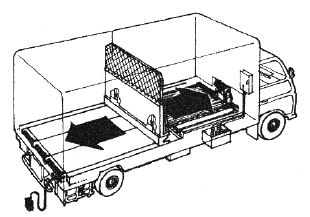
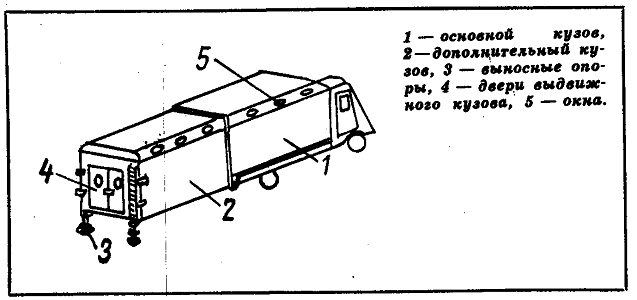
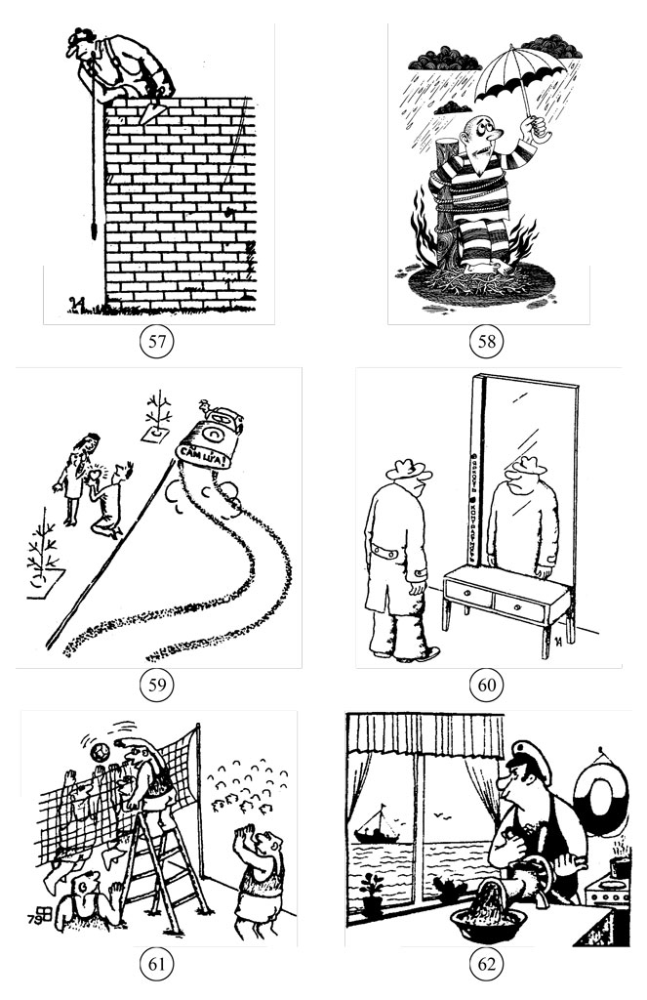
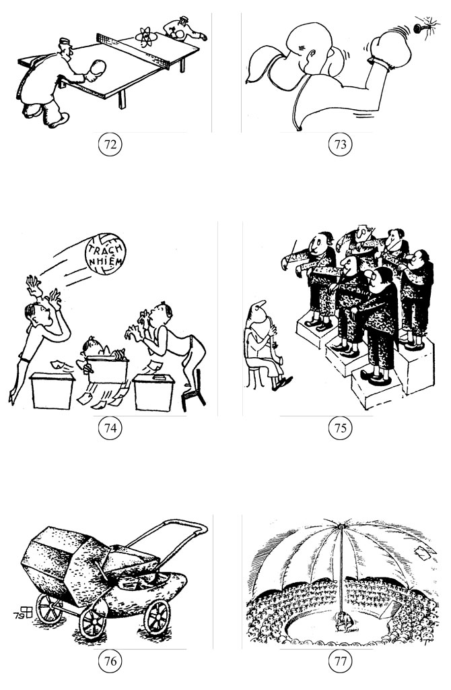
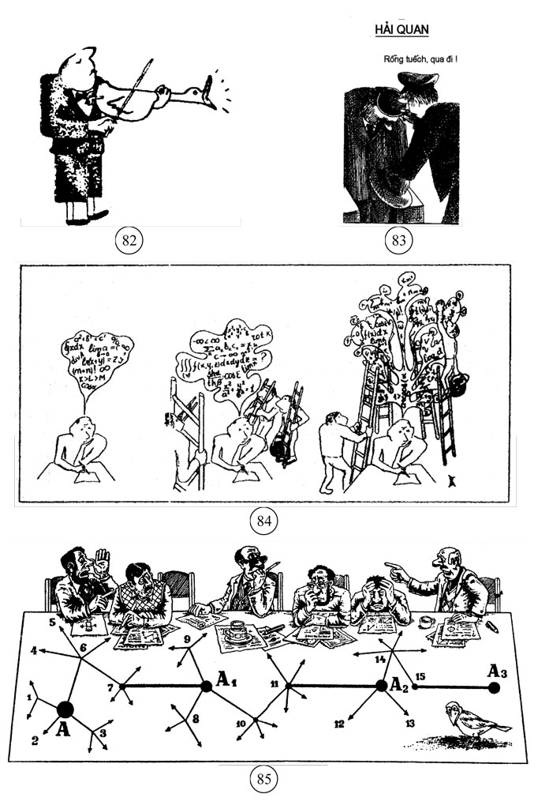

# ÁP DỤNG CÁC THỦ THUẬT (NGUYÊN TẮC) SÁNG TẠO CƠ BẢN

## LÝ GIẢI MỘT CÁCH LÔGÍCH CÁC GIẢI PHÁP SÁNG TẠO ĐÃ CÓ {#sec:12:1:}

### Mở đầu {#subsec:12:1:1:}
* Trong cuộc sống, học tập, công việc, nhiều người, nhiều nơi chỉ quan tâm đến giải pháp hoặc sản phẩm cuối cùng (hiểu theo nghĩa rộng) mà không quan tâm đến quá trình suy nghĩ, hành động của người tạo ra những giải pháp hoặc sản phẩm cuối cùng đó. Ví dụ, trong cuộc sống, nhiều người chỉ quan tâm các vật dụng mình dùng có đáp ứng các nhu cầu của mình không; trong học tập, nhiều thầy cô chỉ quan tâm lời giải các bài tập của học sinh đúng hay sai; trong công việc, nhiều người quản lý chỉ quan tâm kết quả làm việc của cấp dưới có đạt yêu cầu đề ra hay không…

Trong khi đó, PPLSTVĐM có đối tượng nghiên cứu và tác động là quá trình suy nghĩ, hành động giải quyết vấn đề và ra quyết định để có được kết quả cuối cùng: Bài toán cho trước giải xong. PPLSTVĐM quan niệm, nếu con người có quá trình suy nghĩ và hành động đúng thì lời giải, quyết định tốt (sản phẩm cuối cùng) là hệ quả tất yếu của quá trình đó. PPLSTVĐM có nhiệm vụ xây dựng và trang bị cho những người học hệ thống các phương pháp (phương pháp luận), các kỹ năng cụ thể sử dụng phương pháp để họ có được quá trình suy nghĩ và hành động đúng (xem mục _\@ref(sec:3:2:) Phương pháp luận sáng tạo và đổi mới (PPLSTVĐM) là gì?_ của quyển một).

Trong ý nghĩa vừa nêu, PPLSTVĐM đặc biệt quan tâm đến quá trình suy nghĩ và hành động của người giải bài toán. Nói cách khác, PPLSTVĐM phải nghiên cứu trả lời nhiều câu hỏi liên quan, trong đó có hai câu hỏi sau:

1) Quá trình suy nghĩ dẫn đến ý tưởng giải quyết được vấn đề thường xảy ra như thế nào?

2) Quá trình suy nghĩ dẫn đến ý tưởng giải quyết được vấn đề cần phải xảy ra như thế nào (cần sử dụng phương pháp nào) thì tối ưu?

Để trả lời câu hỏi thứ nhất, nhà nghiên cứu phải tìm hiểu các giải pháp sáng tạo đã có, khôi phục lại quá trình suy nghĩ dẫn đến ý tưởng lời giải nhằm phát hiện ra cách (phương pháp) suy nghĩ thường dùng.

Để trả lời câu hỏi thứ hai, nhà nghiên cứu phân tích, đánh giá xem phương pháp suy nghĩ được tìm ra ở trên đã thực sự tối ưu chưa. Ở đây có hai khả năng. Khả năng thứ nhất, phương pháp suy nghĩ được tìm ra là thực sự tối ưu. Lúc đó, người ta có thể phổ biến phương pháp suy nghĩ được tìm ra cho đông đảo mọi người dùng để giải các bài toán mới. Khả năng thứ hai, phương pháp suy nghĩ tìm ra chưa tối ưu, nhà nghiên cứu phải đưa ra các phương pháp hoàn thiện hơn hoặc xây dựng phương pháp suy nghĩ khác (người viết sẽ gọi chung là các phương pháp đã được hoàn thiện và các phương pháp mới) thực sự tối ưu.

Như bạn đọc đã biết, thực tế nghiên cứu cho thấy, khả năng thứ hai đã xảy ra: Phương pháp suy nghĩ được tìm ra là phương pháp thử và sai (xem _Chương 2: Sáng tạo một cách tự nhiên_ của quyển một) với khá nhiều nhược điểm và bị chi phối bởi nhiều hiện tượng tâm lý, chưa được người suy nghĩ điều khiển một cách chủ động (xem các mục _\@ref(sec:6:4:) Các hiện tượng tâm lý tham gia vào quá trình biến đổi thông tin thành tri thức_ và _\@ref(sec:6:5:) Tính ì tâm lý_ của quyển hai). Điều này dẫn đến các nghiên cứu hoàn thiện phương pháp thử và sai và xây dựng các phương pháp mới, trong đó, các nghiên cứu và các kết quả thu được của TRIZ đóng vai trò rất quan trọng (xem _Chương 4: Tổng quan các kết quả đạt được trong lĩnh vực phương pháp luận sáng tạo và đổi mới (PPLSTVĐM)_ của quyển một).

Các phương pháp, đặc biệt, các phương pháp mới, trước hết, phải được thử nghiệm thành công trên các bài toán đã có lời giải, hiểu theo nghĩa, nhờ suy nghĩ theo những phương pháp mới, những người khác (không phải là tác giả của giải pháp) cũng đi đến các ý tưởng lời giải, nhưng với năng suất và hiệu quả cao hơn so với quá trình suy nghĩ của tác giả đã xảy ra trước đó trên thực tế. Nói cách khác, trước hết, các phương pháp mới phải có khả năng lý giải một cách lôgích các giải pháp sáng tạo đã có. Sau đó, các phương pháp mới sẽ được dùng để giải các bài toán chưa giải. Chính vì vậy, mục \@ref(sec:12:1:) này tập trung _“lý giải một cách lôgích các giải pháp sáng tạo đã có”_ dựa trên nội dung của các thủ thuật (nguyên tắc) sáng tạo cơ bản, mà các thủ thuật này cần được dùng một cách có ý thức để thu lại được các giải pháp sáng tạo đã có. Lôgích nói đến ở đây là lôgích nhu cầu–hệ thống, sẽ được trình bày trong mục nhỏ \@ref(subsec:12:1:2:) Mục nhỏ \@ref(subsec:12:1:3:) sẽ đề cập các thủ thuật phản ánh lôgích nhu cầu–hệ thống, được dùng để lý giải các giải pháp sáng tạo đã có.

Mục nhỏ \@ref(subsec:12:1:4:) sẽ tổng hợp những gì trình bày trong các mục nhỏ _\@ref(subsec:12:1:2:) Lôgích nhu cầu–hệ thống_ và _\@ref(subsec:12:1:3:) Diễn giải lôgích nhu cầu–hệ thống bằng các thủ thuật (nguyên tắc) sáng tạo cơ bản_thành một chương trình gồm nhiều bước, được thực hiện tuần tự nhằm tạo điều kiện thuận lợi cho bạn đọc dễ dàng lý giải một cách lôgích các giải pháp sáng tạo đã có.

Mục nhỏ \@ref(subsec:12:1:5:) sẽ trình bày một số thí dụ áp dụng _“Chương trình phát hiện các thủ thuật và làm tái hiện quá trình suy nghĩ lôgích để có được hệ thống cải tiến cho trước”_ (gọi tắt là _“Chương trình lý giải lôgích”_), đã được xây dựng trong mục nhỏ \@ref(subsec:12:1:4:)

* Việc lý giải một cách lôgích quá trình suy nghĩ dẫn đến lời giải bài toán trong các giải pháp sáng tạo đã có, đem lại cho người thực hiện việc lý giải không ít các ích lợi như:

1) Giúp người thực hiện hiểu lý do, ý nghĩa, giá trị của các giải pháp sáng tạo đã có tốt hơn. Điều này cũng tương tự như khi bạn đọc một tác phẩm văn học. Nếu bạn nắm được cả các điều kiện, hoàn cảnh, các nhu cầu lịch sử cụ thể của những con người thuộc thời đại mà tác phẩm phản ánh; bạn lại “nhập thân” được vào các nhân vật trong tác phẩm, bạn sẽ hiểu tác phẩm đó và thông điệp của nó tốt hơn, không chỉ về xúc cảm mà còn cả về lý trí.

2) Giúp hiểu, nắm được lôgích của quá trình suy nghĩ dẫn đến các giải pháp sáng tạo đã có, do vậy, người thực hiện ghi nhớ, tái hiện quá trình đó dễ dàng hơn và lâu quên hơn.

Điều này giải thích vì sao những người đã tự tìm ra lời giải bài toán nào đó, nhưng không phải bằng lôgích mà bằng phương pháp thử và sai; hoặc theo kiểu suy nghĩ mãi thì bật ra (lóe ra) lời giải; hoặc bằng linh tính (trực giác), sau này gặp lại chính bài toán đó, nhiều khi không giải lại được. Tương tự, những người học thuộc lòng lời giải một số bài toán nào đó (trong các sách toán mẫu, văn mẫu…, tuyển tập các bộ đề thi đại học và lời giải) mà không nắm lôgích quá trình suy nghĩ, họ có thể đạt điểm cao trong kỳ thi nhờ “trúng tủ”. Nhưng khi đã quên thì họ hầu như không thể tái hiện được lời giải cũng như quá trình suy nghĩ dẫn đến lời giải. Điều này cũng giải thích vì sao nhiều bậc cha mẹ đã từng học qua phổ thông nhưng sau đó không kèm cặp gì được cho con cái khi chúng cũng học phổ thông, cũng giải những bài toán như mình đã giải ngày xưa.

3) Giúp chuyển giao lôgích của quá trình suy nghĩ dẫn đến các giải pháp sáng tạo đã có sang giải các bài toán tương tự chưa giải, nhờ vậy, các bài toán tương tự sẽ được giải định hướng hơn, nhanh hơn.

4) Giúp xây dựng các phương pháp suy nghĩ mới có phạm vi áp dụng rộng hơn, mang tính định hướng cao hơn, do vậy, làm giảm đáng kể số lượng các phép thử sai.

Nhằm minh họa các ích lợi vừa nêu, người viết phân tích một trường hợp cụ thể. Ví dụ có bài toán sau: _“Bạn có hai chiếc bình tương ứng đựng đúng 3 và 5 lít nước; một lượng nước không giới hạn. Làm cách nào bạn có thể lấy được đúng 4 lít nước?”_

Giả sử người ta đã cho bạn biết lời giải hoặc tự bạn tìm ra lời giải sau nhiều lần thử và sai… chứ không phải nhờ lôgích. Lời giải đó như sau:

“– Múc nước đầy bình 5 lít.

\- Đổ nước từ bình 5 lít sang bình 3 lít. Lúc này còn lại 2 lít nước trong bình 5 lít.

\- Đổ hết nước có trong bình 3 lít đi.

\- Đổ 2 lít nước trong bình 5 lít sang bình 3 lít.

\- Múc nước đầy bình 5 lít.

\- Đổ đúng 1 lít nước từ bình 5 lít sang cho đầy bình 3 lít. Điều này hoàn toàn làm được vì lúc này bình 3 lít đã có sẵn 2 lít nước. Kết quả người ta thu được đúng 4 lít nước.”

Nếu bạn học thuộc lòng lời giải, ích lợi chỉ thể hiện ra khi bạn “trúng tủ”, trong thời gian ngắn hạn (xem điểm 2 ở trên).

Chúng ta thử lý giải một cách lôgích quá trình suy nghĩ dẫn đến lời giải bài toán:

“Giả sử đã thu được đúng 4 lít nước, vậy 4 lít nước đó phải ở trong bình 5 lít vì bình 3 lít không đựng đủ 4 lít nước (xem Hình 209a).

Để có 4 lít nước trong bình 5 lít, phải đổ đúng 1 lít nước ra khỏi bình đựng 5 lít nước (xem Hình 209b).

Như vậy cần có thêm bình đựng đúng 1 lít nước, trong khi đó trong tay người giải bài toán chỉ có bình 3 lít. Giá như bình 3 lít biến thành bình 1 lít thì bài toán sẽ giải xong. Bạn đọc tinh ý có thể thấy mâu thuẫn vật lý (ML) có mặt ở đây: Bình thứ hai phải là bình đựng đúng 3 lít nước để thỏa mãn điều kiện của bài toán và phải là bình đựng đúng 1 lít nước để thu được đúng 4 lít nước ở bình 5 lít, bằng cách đổ từ bình 5 lít sang bình thứ hai đúng 1 lít nước. Giải quyết mâu thuẫn vật lý này, để bình 3 lít biến thành bình 1 lít, cần có sẵn 2 lít nước trong bình 3 lít (xem Hình 209c).

Làm sao có được đúng 2 lít nước? À, , nghĩa là đổ đầy nước vào bình 5 lít; đổ 3 lít nước sang bình 3 lít; đổ hết nước ra khỏi bình 3 lít; đổ 2 lít nước từ bình 5 lít sang bình 3 lít… (xem Hình 209d).”

Rõ ràng, hiểu, nắm được lôgích của quá trình suy nghĩ giải bài toán nói trên, bạn ghi nhớ, tái hiện quá trình đó và đi đến lại lời giải dễ dàng hơn, lâu quên hơn, giúp các con bạn học tập tốt hơn (xem điểm 2 ở trên). Trong ý nghĩa này, các thầy cô cần dạy học sinh lôgích (cách, phương pháp lập luận, suy luận) suy nghĩ giải các bài toán (hiểu theo nghĩa rộng) chứ không phải nhồi nhét các kiến thức rời rạc, thiếu lôgích một cách áp đặt.

Bạn còn có thể chuyển giao lôgích tìm ra từ việc lý giải quá trình suy nghĩ giải bài toán cụ thể nói trên sang giải các bài toán tương tự, ví dụ, bài toán dưới đây:

_“Một người ra sông múc nước, trong tay chỉ có hai cái bình. Bình thứ nhất đựng được đúng 9 lít nước. Bình thứ hai – đúng 4 lít nước. Hỏi người đó làm thế nào có được đúng 6 lít nước?”_

Người viết tin rằng, bạn sẽ giải bài toán này một cách dễ dàng, nhanh chóng bằng cách áp dụng lôgích đã tìm ra (xem Hình 209 và văn bản đi kèm). Cao hơn nữa, dựa trên lôgích đã tìm ra, bạn còn có thể tự sáng tạo thêm nhiều bài toán “lấy nước” cụ thể khác để đố những người khác giải.

Ngoài ra, để kết thúc mục nhỏ này, người viết muốn nhấn mạnh bằng cách nhắc lại thêm một lần nữa về tầm quan trọng của tư duy bằng hình ảnh, hình vẽ (xem mục nhỏ _\@ref(subsec:6:4:3:) Ngôn ngữ, ký hiệu, hình vẽ_ của quyển hai): Không chỉ bài toán “lấy nước” cần vẽ hình (xem Hình 209) để giúp bạn suy nghĩ rõ ràng, mạch lạc, bao quát mà về nguyên tắc, bất kỳ bài toán nào bạn cũng nên đặt vấn đề sử dụng tư duy thị giác (Visual Thinking). Nhờ vậy, việc phát hiện ra lôgích cần tìm, khi bạn phải lý giải quá trình suy nghĩ dẫn đến những giải pháp sáng tạo đã có, cũng trở nên dễ dàng, nhanh chóng hơn.

### Lôgích nhu cầu–hệ thống {#subsec:12:1:2:}
* Trong mục nhỏ trước (_\@ref(subsec:12:1:1:) Mở đầu_), người viết có sử dụng thuật ngữ “lôgích” trong việc lý giải các giải pháp sáng tạo đã có. Từ “lôgích” có nhiều nghĩa (xem mục _\@ref(sec:8:1:) Mở đầu_ của quyển ba). Do vậy, trước hết, người viết cố gắng làm rõ nghĩa của thuật ngữ “lôgích” được dùng ở đây:

\- Thuật ngữ “lôgích” không phải hiểu theo nghĩa “khoa học về các quy luật của tư duy và các hình thức của nó” như “lôgích học hình thức, lôgích học biện chứng”. Tuy vậy, “lôgích” được dùng để lý giải các giải pháp sáng tạo đã có liên quan mật thiết đến tư duy lôgích (hình thức), tư duy biện chứng và nhiều hơn thế, còn liên quan đến các khoa học nghiên cứu tư duy khác, các kiến thức cần thiết phục vụ cho mục đích “lý giải”.

\- Thuật ngữ “lôgích” hàm ý “cách suy luận (suy lý), lập luận, lý lẽ” nhưng không phải mang tính chủ quan kiểu “lôgích của kẻ mạnh”.

\- Thuật ngữ “lôgích” hàm ý “tính hợp lý, chặt chẽ, quy luật nội tại của cái nào đó”. Trong trường hợp của chúng ta, “cái nào đó” chính là quá trình suy nghĩ, hành động tối ưu của con người dẫn đến các giải pháp sáng tạo, dẫn đến kết quả: Các bài toán cụ thể giải xong, tạo ra sự phát triển.

Như chúng ta đã biết (xem mục nhỏ _\@ref(subsec:4:2:1:) Các quy luật sáng tạo phải tìm chính là các quy luật phát triển_ của quyển một), sự phát triển có lôgích của nó và đó cũng chính là lôgích của sáng tạo và đổi mới. Lôgích này mang tính khách quan, được thể hiện trong các quy luật phát triển ở các mức độ cụ thể–khái quát khác nhau.

Đối với sự phát triển do con người tạo ra, cụ thể hơn, đối với các đối tượng do con người phát hiện ra (các phát minh) hoặc được tạo ra một cách nhân tạo (các sáng chế), tư duy giải quyết vấn đề và ra quyết định của con người chỉ trở nên tối ưu khi quá trình tư duy đó được thực hiện tuân theo (phản ánh được) lôgích khách quan về sự phát triển nói trên. Về mối liên hệ giữa “khách quan” và “chủ quan”, bạn đọc có thể xem lại mục nhỏ _\@ref(subsec:4:2:2:) Sáng tạo của con người: Khía cạnh chủ quan và khía cạnh khách quan_ của quyển một.

Tóm lại, về mặt nguyên tắc, con người chủ quan phải có lôgích suy nghĩ phù hợp lôgích khách quan về sự phát triển mới có thể đạt được năng suất và hiệu quả cao, về lâu dài, mới điều khiển được tư duy sáng tạo (quá trình suy nghĩ giải quyết vấn đề và ra quyết định).

Lôgích chủ quan, tùy theo các giai đoạn cụ thể của quá trình suy nghĩ giải các bài toán cụ thể, có thể có phần nào đó thuộc tư duy lôgích (hình thức), tư duy biện chứng, tư duy hệ thống, tư duy theo kiến thức của chuyên ngành nào đó… và các tổ hợp của chúng.

Ví dụ, trong phần lý giải một cách lôgích quá trình suy nghĩ giải bài toán “lấy nước” của mục nhỏ _\@ref(subsec:12:1:1:) Mở đầu_ (xem Hình 209 và văn bản kèm theo), khi người giải nghĩ rằng: _“Giả sử đã thu được đúng 4 lít nước, vậy 4 lít nước đó phải ở trong bình 5 lít vì bình 3 lít không đựng đủ 4 lít nước (xem Hình 209a)”_.

Người giải đã dùng trí tưởng tượng lôgích và tư duy lôgích (hình thức) (xem mục nhỏ _\@ref(subsec:6:4:9:) Trí tưởng tượng_ của quyển hai và mục nhỏ _\@ref(subsec:8:5:2:) Suy luận diễn dịch_ của quyển ba).

Cụ thể, người giải tưởng tượng đã thu được đúng 4 lít nước, rồi xuất phát từ tiền đề là phán đoán đúng, phản ánh hiểu biết chung: _“Nếu là bình n lít thì nó chỉ có thể chứa được lượng nước m lít: 0 <m ≤ n”_, bằng suy luận diễn dịch dẫn đến hiểu biết riêng: _“Nếu bình 3 lít thì nó chỉ có thể chứa được m lít với 0 < m ≤ 3, do vậy không chứa đủ 4 lít nước”_. Cũng bằng cách suy luận diễn dịch tương tự, người suy nghĩ rút ra kết luận: 4 lít nước chỉ có thể đựng trong bình 5 lít.

Khi người giải nghĩ:

_“Bình thứ hai phải là bình đựng đúng 3 lít nước để thỏa mãn điều kiện của bài toán và phải là bình đựng đúng 1 lít nước để thu được đúng 4 lít nước ở bình 5 lít, bằng cách đổ từ bình 5 lít sang bình thứ hai đúng 1 lít nước._

_Giải quyết mâu thuẫn vật lý này, để biến bình 3 lít thành bình 1 lít, cần có sẵn 2 lít nước trong bình 3 lít (xem Hình 209c)”._

Người giải đã dùng tư duy biện chứng. Còn khi người giải nghĩ:

_“Làm sao có được đúng 2 lít nước? À, ”…_

Người giải đã liên tưởng đến và sử dụng các phép tính số học kiểu như: “Mình muốn có được số 2, trong khi mình chỉ có số 5 và 3, phép tính nào có thể giúp mình?” Lôgích ở đây có thể coi là lôgích của kiến thức chuyên ngành.

Đến đây, bạn đọc có thể thắc mắc:

_“Các bài toán trên thực tế, cũng như các giải pháp sáng tạo đã có rất đa dạng. Loại bài toán “lấy nước” và lời giải chỉ là một trong số đó. Cách lý giải lôgích loại bài toán “lấy nước” rất có thể không thích hợp đối với các loại bài toán khác. Không lẽ đối với mỗi loại bài toán và các giải pháp của nó cần có loại lôgích riêng, do vậy, trên thực tế có thể có rất nhiều loại lôgích? Liệu có lôgích chung dùng để lý giải tất cả các loại (nếu không được tất cả thì khá nhiều loại) giải pháp sáng tạo đã biết không?”_

Quả thật, có nhiều loại lôgích được sử dụng tương ứng với nhiều loại bài toán và các giải pháp của chúng. Đồng thời, cũng có lôgích chung dùng để lý giải các giải pháp đã biết của nhiều loại bài toán khác nhau. Điều này có thể hiểu được, vì các lôgích khác nhau về mức độ cụ thể–khái quát. Lôgích với mức độ rất cụ thể có phạm vi áp dụng hẹp, chỉ dùng cho một loại bài toán nào đó. Lôgích với mức độ khái quát cao có phạm vi áp dụng rộng, có thể dùng cho nhiều loại bài toán. Một lần nữa, người sử dụng lôgích để lý giải các giải pháp sáng tạo đã biết cần có khả năng đi từ cụ thể đến khái quát và ngược lại, từ khái quát đến cụ thể (về sự liên quan, bổ sung cho nhau giữa cụ thể và khái quát, bạn đọc có thể xem lại các Hình 97 thuộc mục nhỏ _\@ref(subsec:8:6:1:) Những nhận xét chung_, Hình 102 thuộc mục _\@ref(sec:9:1:) Mở đầu_ của quyển ba, Hình 204 thuộc mục nhỏ _\@ref(subsec:11:4:1:) Tóm tắt một số ý chính đã trình bày_ của quyển bốn và các văn bản đi kèm các hình vẽ) để có thể khai thác tốt các loại lôgích khác nhau về mức độ cụ thể–khái quát.

* Trong mục nhỏ này, người viết đề cập loại lôgích có mức độ khái quát khá cao với tên gọi là lôgích nhu cầu–hệ thống. Dưới đây người viết sẽ trình bày nội dung của nó.

Các nhu cầu của cá nhân là nguyên nhân khởi đầu các ý nghĩ và hành động của con người (xem mục _\@ref(sec:5:2:) Các nhu cầu của cá nhân_ của quyển hai). Để thỏa mãn các nhu cầu, con người phải sáng tạo ra các hệ thống (các sáng chế). Không phải ngẫu nhiên, ở Phương Tây có thành ngữ _“Nhu cầu cần thiết là mẹ đẻ của sáng chế”_ _(Necessity is the Mother of the Invention)_. Nói tóm lại, lúc đầu các nhu cầu và đòi hỏi thỏa mãn chúng thúc đẩy con người suy nghĩ, hành động để tạo ra các hệ thống chưa có với các chức năng (tính hệ thống) tương ứng (xem Hình 210a): Con người chế tạo ra các công cụ lao động đầu tiên.

Các nhu cầu của con người không bất biến mà thay đổi, phát triển theo thời gian cả về số lượng lẫn chất lượng và mức độ đa dạng ngày càng tăng. Để thỏa mãn chúng, tùy theo bài toán cụ thể, con người có thể:

1) Hoàn thiện tiếp tục các hệ thống đã có (xem Hình 210b).

2) Sáng chế ra hệ thống cùng loại chức năng nhưng hoạt động theo nguyên lý mới, thay thế hệ thống hoạt động theo nguyên lý đã có (xem Hình 210c). Ví dụ, đồng hồ điện tử hoạt động theo nguyên lý mới so với đồng hồ cơ học…

3) Sáng chế ra các hệ thống với các chức năng hoàn toàn mới để thỏa mãn các nhu cầu mới (xem Hình 210d). Ví dụ, ở thời kỳ lịch sử nào đó, con người có nhu cầu mới là lưu giữ và vận chuyển dễ dàng các văn tự, hình vẽ. Con người đã sáng chế ra hệ thống mới là giấy để thỏa mãn nhu cầu đó…

Ngoài ra, có thể còn có các trường hợp mang tính chất “lai, ghép” ba khả năng nói trên.

Như vậy, cùng với sự thay đổi và phát triển các nhu cầu của con người, các hệ thống do con người tạo ra cũng thay đổi và phát triển tương ứng. Nhìn theo quan điểm hệ thống, ở đây có sự thay đổi và phát triển cả về tính hệ thống lẫn kết cấu hệ thống. Kết cấu (cấu tạo) hệ thống được hiểu là tập hợp các yếu tố liên kết với nhau, nhờ vậy mà toàn bộ tập hợp đó có tính hệ thống.

Giữa tính hệ thống và kết cấu hệ thống có mối quan hệ tác động qua lại: Tính hệ thống có vai trò quy định sự thay đổi và phát triển kết cấu hệ thống, ngược lại, sự thay đổi và phát triển kết cấu hệ thống giúp thay đổi và phát triển tính hệ thống. Trong đó, sự thay đổi và phát triển kết cấu hệ thống thể hiện cụ thể thành sự thay đổi và phát triển riêng các yếu tố; riêng các mối liên kết hoặc cùng một lúc cả hai (xem điểm 6, mục nhỏ _\@ref(subsec:10:2:2:) Những điểm cần lưu ý về tư duy hệ thống_ của quyển ba).

Hình 210: Minh họa tổng quát lôgích nhu cầu–hệ thống

Vai trò của tính hệ thống quy định kết cấu hệ thống thể hiện cụ thể ở chỗ, một mặt, nêu ra các tiêu chí mà kết cấu hệ thống cần đạt. Mặt khác, tính hệ thống là chuẩn mực dùng để kiểm tra và nghiệm thu kết cấu hệ thống. Trong ý nghĩa này, việc suy luận từ tính hệ thống đến kết cấu hệ thống góp phần phản ánh lôgích nhu cầu–hệ thống. Tiếp theo đây, chúng ta sẽ tìm hiểu nội dung lôgích nhu cầu–hệ thống chi tiết hơn.

Hệ thống (bao gồm cả các hệ mới và hệ đã có được hoàn thiện, mà người viết gọi chung tất cả chúng là các hệ cải tiến), hiểu theo nghĩa đầy đủ của định nghĩa hệ thống (xem mục nhỏ _\@ref(subsec:10:2:1:) Một số khái niệm cơ bản và ý tưởng chung về hệ thống_ của quyển ba) không ra đời “nguyên vẹn, trong một thời điểm” như bà mẹ sinh con mà lần lượt từng phần, trải dài thành quá trình gồm nhiều giai đoạn theo thời gian. Hệ thống thường ra đời như sau:

Xuất phát từ nhu cầu cấp bách chưa được thỏa mãn bằng các phương tiện hiện có, trong đầu con người nảy ra ý nghĩ: _“Giá như có cái gì đó giúp đạt được điều mình muốn”_. Nhìn theo định nghĩa hệ thống, “cái gì đó” chính là kết cấu (cấu tạo) của hệ thống: “Tập hợp các yếu tố liên kết với nhau”. Còn “đạt được điều mình muốn” là chức năng (tính hệ thống) của kết cấu đó: “(Những) tính chất không thể quy về thành (những) tính chất của từng yếu tố, từng mối liên kết đứng riêng rẽ”. “Điều mình muốn” thì có thể phát biểu được nhưng “cái gì đó” là cái gì, có cấu tạo như thế nào thì còn mù mờ, chưa xác định. Lúc này con người biết tính hệ thống rõ ràng hơn cấu tạo hệ thống. Con người thường đề ra (xác định) tính hệ thống trước rồi mới tìm kiếm ý tưởng khả thi, tiến hành thiết kế (hiểu theo nghĩa rất rộng), chế tạo kết cấu hệ thống để kết cấu đó có thể thực hiện được tính hệ thống. Nói cách khác, con người có bài toán: Biết mục đích cần đạt (tính hệ thống) nhưng không biết cách đạt đến mục đích (không biết ý tưởng dẫn đến thiết kế, chế tạo hệ thống với các yếu tố, mối liên kết tương ứng) và có nhu cầu giải bài toán đó. Nhu cầu giải bài toán càng lớn thì đường suy nghĩ ① � trong óc càng đậm (xem mục nhỏ _\@ref(subsec:6:4:5:) Tính nhạy bén của tư duy_ của quyển hai), hiểu theo nghĩa, người giải thường xuyên suy nghĩ tìm kiếm lời giải bài toán. Người giải dùng tất cả những gì mình có, mình bắt gặp (đường ②) vào việc “ướm thử” (lập mối liên kết) với bài toán (đường �①) xem chúng có giúp nảy ra ý tưởng giải bài toán không (hiệu ứng cầu nhảy, hiệu ứng đường hầm). Trong nhiều trường hợp, bài toán giải được khi có đường ② thích hợp xuất hiện.

Trong lịch sử tiến hóa và phát triển của mình, vào một hôm đẹp trời, trong đầu con người nảy ra ý nghĩ: _“Giá như có cái gì đó giúp mình bay được”_. Ý nghĩ này có thể nảy sinh từ nhu cầu nhận thức, hoặc nhu cầu được để ý, chú ý, được kính trọng, yêu mến; hoặc nhu cầu chuyển động nhanh hơn… Con người xác định tính hệ thống (chức năng) của hệ thống là “giúp mình bay được” nhưng không biết ý tưởng thực hiện, mặt mũi “cái gì đó” ra sao, kết cấu (cấu tạo) của “cái gì đó” gồm những yếu tố gì, liên kết với nhau như thế nào… Do vậy, suốt một thời gian dài “cái gì đó” không vượt ra khỏi truyện thần thoại, cổ tích dưới dạng “đôi cánh thần”, “thảm bay”, “cây chổi bay”… để trở thành hiện thực là khinh khí cầu hoặc máy bay.

Sau khi ra đời, tính hệ thống đòi hỏi con người phải chú ý tìm hiểu các nguồn dự trữ (tài nguyên) mà mình có hoặc/và có thể tiếp cận, đặc biệt các nguồn có sẵn, không mất tiền mua (xem điểm 9 mục nhỏ _\@ref(subsec:10:3:2:) Một số điểm cần lưu ý về tính ì hệ thống_ của quyển ba; các mục nhỏ _\@ref(subsec:11:2:25:)_ và _\@ref(subsec:11:3:25:) Nguyên tắc tự phục vụ_ của quyển bốn) xem liệu chúng có thể giúp tìm ý tưởng thiết kế, chế tạo kết cấu hệ thống. Nói chung, các nguồn dự trữ đều có thể quy về thành thông tin (kể cả các hiểu biết, kiến thức khoa học), vật chất (như nguyên, vật liệu, các chất hóa học…), năng lượng (như nhiên liệu, năng lượng các loại…) và các tổ hợp của chúng.

Điều này có thể hiểu được vì, khi có đường ①� đậm trong óc, người giải luôn coi các nguồn dự trữ có sẵn là đường ② và tìm cách liên kết hai đường này lại với nhau với hy vọng tìm được ý tưởng hoặc ít nhất là gợi ý giải bài toán (xem Hình 53 thuộc mục nhỏ _\@ref(subsec:6:4:5:) Tính nhạy bén của tư duy_ và văn bản kèm theo của quyển hai). Ví dụ, anh em nhà Montgolfier muốn có “cái gì đó giúp mình bay được” (đường ①� trong óc). Có lần, trèo lên núi cao vào một ngày nắng nóng, họ nhìn thấy hơi nước từ hồ dưới chân núi bay lên tạo thành sương mù. Lập mối liên kết (liên tưởng) với “cái gì đó giúp mình bay được”, họ nảy ra ý tưởng nhốt hơi nóng hoặc khí nhẹ vào bao thì hơi/khí có thể mang theo cả vật nặng bay lên cao. Tiếp theo, họ thiết kế và chế tạo kết cấu của “cái gì đó”, chính là khinh khí cầu có tính hệ thống “giúp mình bay được”. Tóm lại, các nguồn dự trữ có sẵn cần được coi là các đường ② giúp người giải suy nghĩ giải bài toán. Vấn đề ở chỗ, làm sao có thể tìm được đường ② thích hợp một cách nhanh chóng.

Khi đi từ tính hệ thống đến giai đoạn tìm ý tưởng, thiết kế, chế tạo kết cấu hệ thống, trong các loại nguồn dự trữ có sẵn, thông tin (mà thực chất là các hiểu biết, kiến thức của con người) đóng vai trò rất quan trọng trong việc phát ý tưởng, xác định các yếu tố, các mối liên kết cụ thể của hệ thống tương lai về các mặt như: Chúng phải có những tính chất, đặc trưng gì, làm từ vật liệu gì, hình dạng ra sao, tương tác với nhau như thế nào, hoạt động nhờ dạng năng lượng nào thì thích hợp… Điều này có nghĩa, ở giai đoạn tìm ý tưởng, thiết kế, chế tạo hệ thống, con người sử dụng các nguồn dự trữ có sẵn một cách chọn lọc, định hướng để xây dựng hệ thống hiện thực với kết cấu (các yếu tố, các mối liên kết) cụ thể mà hệ thống đó có được tính hệ thống đã đề ra. Để cho gọn, người viết gọi giai đoạn, ở đó, con người đi tìm ý tưởng và biến ý tưởng thành thành phẩm (hệ thống cần có) dựa trên việc sử dụng các nguồn dự trữ có sẵn, là giai đoạn “thiết kế hệ thống cần có”.

Quay trở lại thí dụ về “cái gì đó giúp mình bay được”. Nếu “cái gì đó” là kết cấu của máy bay tương lai, con người, trước hết phải dùng các hiểu biết về cơ học vật rắn, động lực học chất khí, các loại vật liệu, động cơ… được biết cho đến thời điểm đó để thu được ý tưởng, thực hiện việc thiết kế và chế tạo kết cấu máy bay như là “tập hợp các yếu tố liên kết với nhau” có tính hệ thống (chức năng) “giúp mình bay được”. Qua đây chúng ta còn có thể thấy:

\- Một kết cấu hệ thống thiếu những tiền đề nhất định dưới dạng các nguồn dự trữ (thông tin, vật chất, năng lượng và các tổ hợp của chúng) chắc chắn đã không thể ra đời được. Ví dụ, điện thoại di động không thể ra đời trước khi con người có những kiến thức về sóng điện từ…; nhà cao tầng không thể ra đời trước khi con người có những vật liệu xây dựng thích hợp;…

\- Các nguồn dự trữ khác nhau có thể cho ra đời các kết cấu hệ thống khác nhau nhưng có cùng một tính hệ thống (chức năng). Ví dụ, con người của các vùng khác nhau về địa lý, văn hóa… với các nguồn dự trữ khác nhau, tuy cùng nhằm đạt mục đích (tính hệ thống) “có nhà để ở”, lại xây dựng các loại nhà (kết cấu hệ thống) khác nhau về vật liệu, cấu trúc, kiến trúc, màu sắc…

Trên con đường đi từ nhu cầu đến hệ thống cần có (hệ cải tiến), người giải có thể gặp và phải giải quyết các loại mâu thuẫn nảy sinh như mâu thuẫn hành chính (MH), mâu thuẫn kỹ thuật (MK), mâu thuẫn vật lý hay còn gọi mâu thuẫn lý học (ML). Về các loại mâu thuẫn, bạn đọc có thể xem lại mục nhỏ _\@ref(subsec:9:4:2:) TRIZ: Các loại mâu thuẫn trong giải quyết vấn đề và ra quyết định_ của quyển ba.

Trên cơ sở những gì vừa trình bày, lôgích nhu cầu–hệ thống (xem Hình 210của mục nhỏ này) có thể biểu diễn chi tiết hơn trong hình vẽ dưới đây (xem Hình 211).

Đối với bài toán “lấy nước” (xem mục nhỏ _\@ref(subsec:12:1:1:) Mở đầu_ của quyển sách này), chúng ta hãy cùng nhau lý giải quá trình giải bài toán đó theo lôgích nhu cầu–hệ thống.

Bài toán “lấy nước”, hiểu theo nghĩa, dành cho một số người nào đó bắt buộc phải giải, có thể nảy sinh từ nhu cầu (hoặc nhằm thỏa mãn nhu cầu) tăng tính ích lợi của hai bình 3 lít và 5 lít mà không cần có thêm bình 4 lít; nhu cầu đánh giá sự nhanh trí của những người tham gia thí nghiệm nào đó; nhu cầu có việc làm vì bài toán là một phần quan trọng của đề thi tuyển nhân viên cho công ty; thỏa mãn nhu cầu được những người khác chú ý, nếu mình giải được bài toán;…

Lời phát biểu bài toán: “Bạn có hai chiếc bình tương ứng đựng đúng 3 và 5 lít nước; một lượng nước vô hạn. Làm cách nào bạn lấy được đúng 4 lít nước?” cho bạn biết bạn đang có hệ thống (hoặc cho trước bạn hệ thống) gồm bốn yếu tố là bạn, bình 3 lít, bình 5 lít và lượng nước không giới hạn liên kết với nhau. “Liên kết” ở đây được hiểu là sự tương tác giữa các yếu tố nói trên, mà những tương tác đó được biết và được dùng cho đến thời điểm bài toán nảy sinh.

Lời phát biểu bài toán cũng nêu lên tính hệ thống mà hệ cải tiến cần có, thể hiện dưới dạng đầu ra là “lấy được đúng 4 lít nước”.

Giải bài toán trong trường hợp này có nghĩa, dựa trên việc tìm hiểu (nghiên cứu), sử dụng các nguồn dự trữ có sẵn, bạn phải từ hệ cho trước (hệ tiền thân) suy nghĩ tìm ý tưởng, thiết kế, chế tạo kết cấu của hệ cải tiến mà kết cấu đó có tính hệ thống “lấy được đúng 4 lít nước”.

Trong trường hợp chung, kết cấu của hệ cải tiến so với kết cấu của hệ tiền thân có thể thay đổi (hiểu theo nghĩa rộng nhất của từ này) về riêng các yếu tố, riêng các mối liên kết hoặc cùng một lúc cả hai.

Trong trường hợp bài toán “lấy nước”, hệ cải tiến (lời giải) chỉ thay đổi riêng các mối liên kết. Đấy là thay đổi sự tương tác giữa các yếu tố (xem Hình 209d), chứ không phải bản thân các yếu tố, hiểu theo nghĩa, các yếu tố ban đầu không bị thay đổi kết cấu trong suốt quá trình giải bài toán. Cách tương tác giữa các yếu tố tìm ra trong lời giải là cách tương tác mới, chưa biết, chưa được sử dụng khi chưa giải xong bài toán. Điều này được giải thích là, về nguyên tắc, hệ n yếu tố có thể có các mối liên kết. Thực tế cho thấy, lúc đầu chỉ một số nào đó các mối liên kết được biết đến, được sử dụng, đóng góp vào tính hệ thống của hệ thống. Các mối liên kết khác có thể xem là các nguồn dự trữ, dần dần sẽ được phát hiện thêm và sử dụng trong quá trình tiến hóa, phát triển (xem điểm 3, mục nhỏ _\@ref(subsec:10:2:1:) Một số khái niệm cơ bản và ý tưởng chung về hệ thống_ của quyển ba).

Nhìn theo quan điểm nghiên cứu và sử dụng các nguồn dự trữ có sẵn để tìm ý tưởng, thiết kế, chế tạo kết cấu của hệ thống cải tiến, trong bài toán “lấy nước”, các tương tác có thể có còn chưa biết, chưa được sử dụng giữa các yếu tố: Người giải bài toán, bình 3 lít, bình 5 lít, lượng nước không giới hạn, phải được xem là các nguồn dự trữ có sẵn. Quả thật, lời giải của bài toán “lấy nước” chỉ là một cách tương tác trong số các cách tương tác có thể có. Do vậy, nếu không chỉ dừng lại yêu cầu lấy đúng 4 lít nước, bạn còn có thể thấy thêm, với các cách tương tác khác, bạn thu được các đầu ra (tính hệ thống) khác.

Trước hết, nếu không tính đến tương tác, bạn chỉ có hoặc đúng 3 lít nước, hoặc đúng 5 lít nước. Tương tác đơn giản nhất có thể thấy ngay là 3 + 5 = 8. Một tương tác khác cũng khá đơn giản là 5 - 3 = 2. Cứ như thế, bạn có thể thấy các tương tác khác nữa 3 + 3 - 5 = 1; tương tác kết hợp 5 - 3 = 2 và 3 + 3 - 5 = 1; và 5 + 1 =6.

Tóm lại, trong bài toán “lấy nước” cụ thể nói trên, tuy hệ thống chỉ có hai bình (hai yếu tố) đựng đúng 3 và 5 lít nước, bạn có thể thay đổi tính hệ thống (thu được đầu ra từ đúng 1 đến đúng 8 lít nước) bằng cách thay đổi sự tương tác (các mối liên kết) giữa các yếu tố của hệ thống ban đầu.

Hình 212 dưới đây mô tả việc phát hiện và sử dụng các cách tương tác (các mối liên kết) giữa các yếu tố của hệ thống cho trong bài toán “lấy nước” như là minh họa việc sử dụng các nguồn dự trữ có sẵn để thay đổi, phát triển tính hệ thống. Điều này cũng tương tự như bộ ghép hình có chưa tới mười mảnh (mười yếu tố). Thay đổi các mối liên kết giữa các mảnh, chúng ta có được nhiều hình khác nhau.

Ngoài ra, qua lời giải bài toán “lấy nước” bạn đồng thời thấy, cách tương tác giữa các yếu tố để có được trạng thái mô tả trên Hình 209c đã giải quyết mâu thuẫn vật lý: _“Bình thứ hai phải là bình đựng đúng 3 lít nước để thỏa mãn điều kiện của bài toán và phải là bình đựng đúng 1 lít nước để thu được đúng 4 lít nước ở bình 5 lít, bằng cách đổ từ bình 5 lít sang bình thứ hai đúng 1 lít”_.

Hình 212: Minh họa việc sử dụng các nguồn dự trữ có sẵn (trong trường hợp này là các mối liên kết có thể có giữa các yếu tố) để thay đổi, phát triển tính hệ thống qua bài toán “lấy nước” cụ thể

### Diễn giải lôgích nhu cầu–hệ thống bằng các thủ thuật (nguyên tắc) sáng tạo cơ bản {#subsec:12:1:3:}
Theo dõi một hệ thống nào đó trong thời gian dài, bạn có thể thấy hệ thống khởi đầu được phát triển thành hệ cải tiến 1. Sau đó một thời gian, hệ cải tiến 1 được phát triển thành hệ cải tiến 2. Đến một lúc nào đó hệ cải tiến 2 được phát triển thành hệ cải tiến 3, cứ như thế… (xem Hình 213a).

Sự phát triển của các hệ thống do con người tạo ra được phản ánh trong lôgích nhu cầu–hệ thống (xem Hình 211 của mục nhỏ trước và văn bản kèm theo). Trong ý nghĩa này, sau khi tách khỏi các yếu tố ngẫu nhiên hoặc chủ quan duy ý chí, sự phát triển của hệ thống cho trước có thể coi là sự phát triển nhất quán theo lôgích nhu cầu–hệ thống (xem Hình 213b).

Hình 213: Sự phát triển của hệ thống và lôgích nhu cầu–hệ thống

Mặt khác, nhìn từ góc độ đi tìm các thủ thuật (nguyên tắc) sáng tạo cơ bản (xem mục _\@ref(sec:11:1:) Mở đầu_ và mục nhỏ _\@ref(subsec:11:4:1:) Tóm tắt một số ý chính đã trình bày_, đặc biệt, các Hình 199 và 200 cùng văn bản đi kèm với chúng thuộc mục nhỏ \@ref(subsec:11:4:1:) của quyển bốn), các nhà nghiên cứu cũng theo dõi sự phát triển của các hệ thống (các sáng chế) trong thời gian dài, tương tự như Hình 213a trên đây. Trong đó, hệ cho trước khởi đầu được coi là hệ tiền thân khởi đầu của các hệ cải tiến sau này; hệ cải tiến 1 là hệ tiền thân của hệ cải tiến 2; hệ cải tiến 2 là hệ tiền thân của hệ cải tiến 3;…

Bản thân các thủ thuật lại được tìm ra nhờ trả lời câu hỏi: _“Nghĩ về hướng nào (tức là dùng thủ thuật gì) thì khắc phục được mâu thuẫn kỹ thuật để phát triển hệ tiền thân thành hệ cải tiến?”_.

Sau khi được tìm ra, đến lượt mình, các thủ thuật cũng có công dụng lý giải một cách lôgích các giải pháp sáng tạo đã có (xem Hình 154a và văn bản đi kèm thuộc mục _\@ref(sec:11:3:) Các ích lợi của các thủ thuật (nguyên tắc) sáng tạo cơ bản nhìn dưới góc độ các kiến thức cơ sở của PPLSTVĐM_ của quyển bốn, rồi so sánh nó với Hình 213b của mục nhỏ này). Đến đây, bạn đọc có thể đặt câu hỏi:

_“Lôgích nhu cầu–hệ thống và lôgích các thủ thuật đều có thể dùng để lý giải các giải pháp sáng tạo đã có. Vậy chúng quan hệ với nhau như thế nào? Chỉ dùng một trong hai lôgích nói trên có đủ không?”_

Câu trả lời tóm tắt là:

_“Chúng có những cái giống và khác nhau. Cần phải sử dụng cả hai”_.

Đi vào chi tiết, bạn đọc có thể thấy, lôgích nhu cầu–hệ thống và lôgích các thủ thuật giống nhau ở chỗ: Chúng cùng phản ánh lôgích phát triển của các hệ thống theo thời gian (xem Hình 214). Tuy nhiên, chúng khác nhau về mức độ cụ thể–khái quát. So sánh hai lôgích thì lôgích các thủ thuật ở mức độ cụ thể hơn, hay ngược lại, lôgích nhu cầu–hệ thống khái quát hơn.

Hình 214: Sự giống nhau giữa lôgích nhu cầu–hệ thống và lôgích các thủ thuật

Một lần nữa, chúng ta gặp lại các mâu thuẫn kỹ thuật: Những cái gì cụ thể thường dễ hiểu, dễ nhớ, dễ áp dụng vào thực tế nhưng có phạm vi áp dụng hẹp; Những cái gì khái quát thường có phạm vi áp dụng rộng nhưng khó hiểu, khó nhớ, khó áp dụng chúng vào thực tế. Như bạn đọc đã biết từ các quyển sách trước của bộ sách _“Sáng tạo và đổi mới”_, cách giải quyết các mâu thuẫn kỹ thuật này là, người sử dụng cần phải có khả năng chuyển từ mức cụ thể sang khái quát và ngược lại, từ khái quát sang cụ thể một cách dễ dàng, thông qua luyện tập để có được những kỹ năng cần thiết đó. Điều này có nghĩa, muốn khai thác các ưu điểm của hai loại lôgích nói trên (cũng tức là giảm nhược điểm của chúng), bạn cần sử dụng cả hai loại lôgích. Mục nhỏ \@ref(subsec:12:1:3:) này sẽ giúp bạn làm điều đó.

Tương tự như đối với những cái khái quát và những cái cụ thể đã trình bày trong bốn quyển sách trước đây (ví dụ xem Hình 204 và văn bản đi kèm thuộc mục nhỏ _\@ref(subsec:11:4:1:) Tóm tắt một số ý chính đã trình bày_ của quyển bốn), để đạt mục đích sử dụng cả hai loại lôgích, chúng ta cần xây dựng cây cầu lưu thông hai chiều giữa những cái khái quát và những cái cụ thể. Trong trường hợp này, đấy chính là cây cầu hai chiều nối lôgích nhu cầu–hệ thống và lôgích các thủ thuật (xem Hình 215a). Cây cầu hai chiều giúp bạn dễ dàng, nhanh chóng chuyển từ “bờ bên này” sang “bờ bên kia” và ngược lại để sử dụng cả hai lôgích.

Lôgích nhu cầu–hệ thống là chuỗi của bốn mắt xích (hay còn gọi là bốn giai đoạn) cần được thực hiện: Các nhu cầu – Tính hệ thống cần có – Tìm hiểu các nguồn dự trữ có sẵn – Thiết kế hệ thống cần có để có được hệ thống cần có (xem Hình 211của mục nhỏ trước). Do vậy, “bờ bên này” của cây cầu hai chiều nói trên phải bao quát (chứa) cả bốn mắt xích, còn “bờ bên kia” phải là 40 thủ thuật (nguyên tắc) sáng tạo cơ bản tương ứng (xem Hình 215b). Do vậy, việc sử dụng các thủ thuật tương ứng với bốn mắt xích trong chuỗi lôgích nhu cầu–hệ thống để lý giải các giải pháp sáng tạo đã có, được gọi là diễn giải lôgích nhu cầu–hệ thống bằng các thủ thuật (nguyên tắc) sáng tạo cơ bản, hoặc diễn giải lôgích nhu cầu–hệ thống bằng ngôn ngữ thủ thuật.

* Hình 215b cũng cho thấy sự cần thiết phải sắp xếp (phân loại) lại 40 thủ thuật (nguyên tắc) sáng tạo cơ bản cho tương ứng với bốn mắt xích của chuỗi lôgích nhu cầu–hệ thống. Trước khi đi vào phân loại cụ thể, người viết muốn lưu ý bạn đọc:

\- Phân loại nói đến ở đây không phải là phân loại hiểu theo nghĩa phân loại của lôgích hình thức (xem mục nhỏ _\@ref(subsec:8:3:4:) Phân chia khái niệm_ của quyển ba).

\- Các thủ thuật không đứng độc lập mà liên kết với nhau (giao nhau, bổ sung cho nhau…, xem mục nhỏ _\@ref(subsec:11:4:2:) Các thủ thuật (nguyên tắc) sáng tạo cơ bản như là hệ thống_ của quyển bốn), do vậy, bạn không nên đòi hỏi quá chính xác việc sắp xếp (phân loại) các thủ thuật cho thật tương ứng với từng mắt xích của chuỗi lôgích nhu cầu–hệ thống.

\- Nội dung của các thủ thuật cho thấy, có những thủ thuật vừa thuộc mắt xích này, vừa thuộc mắt xích kia. Trong trường hợp đó, người viết sẽ xếp chúng vào tất cả các mắt xích mà chúng thuộc về.

\- Đối với những thủ thuật có nhiều ý nhỏ (a, b, c…) mà ý này thuộc mắt xích này, ý khác thuộc mắt xích khác, người viết sẽ nhấn mạnh để lưu ý bạn đọc.

\- Mỗi thủ thuật có thể có những nghĩa với các mức độ cụ thể–khái quát, liên tưởng, tưởng tượng khác nhau và tùy thuộc vào bài toán cụ thể, thuộc các mắt xích khác nhau. Do vậy, khi áp dụng vào thực tế, bạn cần chú ý tính đến hoàn cảnh, điều kiện cụ thể của giải pháp sáng tạo đã có mà bạn định lý giải một cách lôgích; hoặc bài toán mà bạn đang giải, chứ không nên tuân theo phân loại một cách hình thức, máy móc.

\- Trong lôgích nhu cầu–hệ thống (xem Hình 211của mục nhỏ trước) có mắt xích: Tìm hiểu các nguồn dự trữ có sẵn dưới dạng thông tin, vật chất, năng lượng và các tổ hợp của chúng. Một số thủ thuật có phản ánh nội dung của mắt xích này, đặc biệt _25\. Nguyên tắc tự phục vụ_.

Các nguồn dự trữ có sẵn được hiểu theo nghĩa rất rộng, do vậy, không chỉ sử dụng các thủ thuật, các công cụ PPLSTVĐM khác (đã và sẽ được trình bày trong các quyển sách tiếp theo), về mặt nguyên tắc, bạn đọc cần sử dụng cả hệ thống các kiến thức của nhân loại như là các nguồn dự trữ có sẵn. Nói cách khác, bạn cần sử dụng cả hai hệ thống: Hệ thống PPLSTVĐM và hệ thống các kiến thức (tương tự Hình 207 thuộc mục nhỏ _\@ref(subsec:11:4:2:) Các thủ thuật (nguyên tắc) sáng tạo cơ bản như là hệ thống_ của quyển bốn) trong quá trình lý giải một cách lôgích các giải pháp sáng tạo đã có.

Dưới đây là sự phân loại (sắp xếp) các thủ thuật (nguyên tắc) sáng tạo cơ bản cho tương ứng với bốn mắt xích của lôgích nhu cầu–hệ thống và các nhận xét.

1) Các nhu cầu (xem mục _\@ref(sec:5:2:) Các nhu cầu của cá nhân_ của quyển hai):

11\. Nguyên tắc dự phòng và 20. Nguyên tắc liên tục các tác động có ích

\- “Dự phòng” phản ánh nhu cầu tự bảo vệ, an toàn.

\- “Liên tục tác động có ích” có thể được xem là phản ánh tất cả các nhu cầu còn lại của cá nhân. Do vậy, “có ích” cần được hiểu theo nghĩa rộng nhất có thể có. “Ích lợi” có thể thể hiện trên thực tế vô cùng đa dạng. Ví dụ như: Tiết kiệm sức lực, thời gian, năng lượng, chi phí, nguyên vật liệu…; tăng năng suất, hiệu suất, hiệu quả…; nhanh, cao, bền, đẹp, thuận tiện… hơn; tạo các xúc cảm tốt; giúp nâng cao đạo đức, dân trí;…

“Ích lợi” của hệ cải tiến chính là hệ cải tiến tạo ra giá trị gia tăng so với hệ tiền thân. “Ích lợi” này xuất phát từ nhu cầu của con người đòi hỏi được thỏa mãn và trên thực tế, được thỏa mãn bằng hệ cải tiến.

2) Tính hệ thống cần có:

2\. Nguyên tắc “tách khỏi”, 3. Nguyên tắc phẩm chất cục bộ, 6. Nguyên tắc vạn năng, 11. Nguyên tắc dự phòng, 13. Nguyên tắc đảo ngược, 15. Nguyên tắc linh động, 17. Nguyên tắc chuyển sang chiều khác, 20. Nguyên tắc liên tục các tác động có ích

\- “Tính hệ thống cần có” được hiểu là câu trả lời cho câu hỏi:

_“Hệ thống cần có (hệ cải tiến) được thiết kế ra để làm gì (đạt mục đích gì), hoặc có chức năng gì, hoặc có tính chất gì, hoặc cho đầu ra là gì… để có tính hệ thống tốt hơn so với tính hệ thống của hệ tiền thân?”_.

\- Các thủ thuật thường được con người dùng để suy nghĩ, tác động và biến đổi hệ tiền thân thành hệ cải tiến. Tuy vậy, xét về nghĩa, một số trong 40 thủ thuật có thể được dùng để phản ánh và phát biểu tính hệ thống của hệ cải tiến (hệ cần có).

\- Nguyên tắc “tách khỏi” phản ánh tính hệ thống của hệ cải tiến: Hệ cải tiến phải không có những tính chất (đầu ra) gây phiền phức hoặc/và không cần thiết; hoặc hệ cải tiến phải có những tính chất (đầu ra) chỉ là những cái cần thiết, không có thêm những cái khác (gây phiền phức, hoặc/và không cần thiết).

Ví dụ, ăn mía cây, bạn phải mất nhiều công sức nhai. Bã nhả ra trở thành rác nhử ruồi, kiến đến. Trong khi đó, cái thực sự bạn cần từ cây mía là nước mía. Dùng nguyên tắc “tách khỏi” bạn có thể đề ra tính hệ thống cần có cụ thể cho trường hợp này: _“Mía cải tiến phải có tính chất sau: Chỉ có nước (mía) mà không có xơ”_.

Tương tự như vậy, những bạn yêu thích ăn sầu riêng có thể đề ra tính hệ thống cần có của trái sầu riêng: _“Trái sầu riêng cải tiến phải có vỏ nhẵn nhụi, mỏng, bóc được dễ dàng bằng tay, không có xơ và các múi không có hột”_.

\- Nguyên tắc phẩm chất cục bộ: Hệ cải tiến phải có chức năng, tính chất riêng tối ưu với công việc.

\- Nguyên tắc vạn năng: Hệ cải tiến phải có thêm, ít nhất, một chức năng nữa.

\- Nguyên tắc đảo ngược: Hệ cải tiến phải có chức năng ngược với chức năng hiện có.

\- Nguyên tắc linh động: Hệ cải tiến phải có chức năng thay đổi để tối ưu với từng giai đoạn của quá trình làm việc.

\- Nguyên tắc chuyển sang chiều khác: Hệ cải tiến phải chuyển sang có chức năng khác phù hợp với chiều xem xét mới.

Trên đây là một số ví dụ minh họa việc có thể dùng các thủ thuật để phản ánh tính hệ thống cần có của hệ cải tiến. Điều này có nghĩa, tùy bài toán cụ thể, bạn đọc có thể dùng thêm các thủ thuật khác còn chưa liệt kê trong danh sách nêu trên.

Trường hợp gặp khó khăn trong việc xác định dùng thủ thuật nào để phản ánh tính hệ thống cần có của hệ cải tiến, bạn có thể dùng hai nguyên tắc: _11\. Nguyên tắc dự phòng_ và _20\. Nguyên tắc liên tục các tác động có ích_ theo nghĩa rộng nhất:

\- Nguyên tắc dự phòng: Hệ cải tiến phải có chức năng dự phòng những rủi ro, những cái không mong muốn, bù trừ cho độ tin cậy không cao…

\- Nguyên tắc liên tục các tác động có ích: Hệ cải tiến phải ích lợi hơn tiền thân về các mặt như…

3) Tìm hiểu các nguồn dự trữ có sẵn:

Tất cả 40 thủ thuật, các công cụ khác của PPLSTVĐM, về mặt nguyên tắc, kể cả toàn bộ kiến thức của nhân loại và những gì bạn tiếp nhận thông qua các giác quan của mình

\- Toàn bộ kiến thức, nhìn theo quan điểm của toàn nhân loại (chứ không phải của cá nhân cụ thể), là những điều đã biết rồi. Trong ý nghĩa như vậy, chúng là các nguồn dự trữ có sẵn. Chưa kể, trong thời đại Internet, việc tiếp cận kiến thức của nhân loại trở nên dễ dàng, nhanh chóng hơn trước rất nhiều.

\- Kiến thức của nhân loại bao gồm cả những kiến thức về vật chất, năng lượng thông tin và các tổ hợp của chúng. Do vậy, bạn đọc một lần nữa cần xem xét các nguồn dự trữ có sẵn về các mặt vật chất, năng lượng, thông tin (kể cả kiến thức) và các tổ hợp của chúng.

Trên đây, người viết nêu yêu cầu tối đa đối với việc tìm hiểu các nguồn dự trữ có sẵn, dành cho con người lý tưởng suy nghĩ và hành động giải bài toán. Nói cách khác, cụm từ “tìm hiểu các nguồn dự trữ có sẵn” cần được hiểu theo nghĩa rộng nhất.

Tuy nhiên, trên thực tế, chúng ta đang nói về hệ thống 40 thủ thuật và những con người cụ thể suy nghĩ và hành động giải các bài toán cụ thể. Vậy, yêu cầu tối thiểu (nghĩa hẹp của) “tìm hiểu các nguồn dự trữ có sẵn” đối với bạn đọc cụ thể là:

_“Tìm hiểu (nhằm mục đích để sử dụng trong các giai đoạn của quá trình suy nghĩ, hành động giải bài toán cụ thể của mình) 40 thủ thuật, các kiến thức của bộ sách “Sáng tạo và đổi mới” được trình bày đến nay, các kiến thức, vốn các loại… của bạn và tất cả các nguồn dự trữ khác mà bạn có thể tiếp cận”._

\- Công việc “tìm hiểu các nguồn dự trữ có sẵn” cần làm bất kỳ khi nào có yêu cầu, chứ không nên tách công việc này thành giai đoạn độc lập riêng trong quá trình suy nghĩ giải bài toán.

\- Với thời gian, bạn cần mở rộng các nguồn dự trữ của mình bằng cách học, tự học, đọc, xem, tiếp cận những kiến thức, thông tin liên quan mới nhất… Những hiểu biết này cũng sẽ giúp bạn mở rộng các nguồn dự trữ có sẵn về vật chất, năng lượng và các tổ hợp của chúng.

4) Thiết kế hệ thống cần có:

_1\. Nguyên tắc phân nhỏ_, _2\. Nguyên tắc “tách khỏi”_, _3\. Nguyên tắc phẩm chất cục bộ_, _4\. Nguyên tắc phản (bất) đối xứng_, _5\. Nguyên tắc kết hợp_, _7\. Nguyên tắc “chứa trong”_, _8\. Nguyên tắc phản trọng lượng_, _9\. Nguyên tắc gây ứng suất (phản tác động) sơ bộ_, _10\. Nguyên tắc thực hiện sơ bộ_, _12\. Nguyên tắc đẳng thế_, _13\. Nguyên tắc đảo ngược_, _14\. Nguyên tắc cầu (tròn) hóa_, _15\. Nguyên tắc linh động_, _16\. Nguyên tắc giải (tác động) “thiếu” hoặc “thừa”_, _17\. Nguyên tắc chuyển sang chiều khác_, _18\. Sử dụng các dao động cơ học_, _19\. Nguyên tắc tác động theo chu kỳ_, _20\. Nguyên tắc liên tục các tác động có ích_, _21\. Nguyên tắc “vượt nhanh”_, _22\. Nguyên tắc biến hại thành lợi_, _23\. Nguyên tắc quan hệ phản hồi_, _24\. Nguyên tắc sử dụng trung gian_, _25\. Nguyên tắc tự phục vụ_, _26\. Nguyên tắc sao chép (copy)_, _27\. Nguyên tắc “rẻ” thay cho “đắt”_, _28\. Thay thế sơ đồ cơ học_, _29\. Sử dụng các kết cấu khí và lỏng_, _30\. Sử dụng vỏ dẻo và màng mỏng_, _31\. Sử dụng các vật liệu nhiều lỗ_, _32\. Nguyên tắc thay đổi màu sắc_, _33\. Nguyên tắc đồng nhất_, _34\. Nguyên tắc phân hủy hoặc tái sinh các phần_, _35\. Thay đổi các thông số hóa lý của đối tượng_, _36\. Sử dụng chuyển pha_, _37\. Sử dụng sự nở nhiệt_, _38\. Sử dụng các chất ôxy hóa mạnh_, _39\. Thay đổi độ trơ_, _40\. Sử dụng các vật liệu hợp thành (composite)_; Các tổ hợp khác nhau của các thủ thuật

\- Giai đoạn “Thiết kế hệ thống cần có” gồm các giai đoạn nhỏ như: Tìm ý tưởng tạo nên tính hệ thống cần có; đề ra giải pháp thực hiện ý tưởng đó (các ý tưởng cụ thể hơn chỉ ra các yếu tố, các mối liên kết của hệ thống phải thay đổi, làm việc như thế nào thì ý tưởng tạo nên tính hệ thống cần có mới có thể phát huy tác dụng như mong muốn); chế tạo thử hệ thống cần có; cho hệ thống cần có hoạt động thử nghiệm kèm theo đánh giá, điều chỉnh,… nghiệm thu (nếu đạt yêu cầu). Ở đây, người viết tập trung vào trình bày hai giai đoạn nhỏ đầu tiên, là tìm ý tưởng tạo nên tính hệ thống cần có và đề ra giải pháp thực hiện ý tưởng đó. Đối với các giai đoạn nhỏ tiếp theo, nếu có vấn đề nảy sinh, bạn vẫn có thể dùng những gì được trình bày.

\- Nhân đây, người viết dẫn ra hai ví dụ giúp bạn đọc hiểu và phân biệt rõ hơn hai khái niệm: “Ý tưởng tạo nên tính hệ thống cần có” và “ý tưởng thuộc giải pháp thực hiện ý tưởng tạo nên tính hệ thống cần có”.

Giả sử, xuất phát từ nhu cầu dự phòng, hệ cải tiến của bạn có tính hệ thống cần có cũng là dự phòng: Thiết bị điện phải an toàn khi cường độ dòng điện tăng quá các giá trị cho phép.

Bạn dùng “nguyên tắc linh động” và “tách khỏi” phát ý tưởng: _“Hệ thống phải làm việc bình thường ở giai đoạn cường độ dòng điện trong các giá trị cho phép và tách ra khỏi nguồn cung cấp điện ở giai đoạn cường độ dòng điện lớn hơn các giá trị cho phép”_. Đây chính là ý tưởng tạo nên tính hệ thống cần có.

Tiếp theo, bạn đoán ra, giải pháp dùng là cầu chì. Giải pháp này là giải pháp thực hiện ý tưởng tạo nên tính hệ thống cần có (biến ý tưởng thành hiện thực). Bản thân giải pháp lại chứa các ý tưởng. Trong trường hợp cầu chì, ý tưởng thuộc giải pháp này là, khi dòng điện tăng, dây chì nóng lên, chảy ra, mạch điện bị ngắt. Nhìn theo quan điểm của các thủ thuật, ý tưởng thuộc giải pháp trên có thể thu được nhờ hai thủ thuật: _36\. Sử dụng chuyển pha_ (dây chì chuyển từ trạng thái rắn sang trạng thái lỏng, nhờ vậy nó “chảy đi” làm ngắt mạch) và _25\. Nguyên tắc tự phục vụ_ (nguồn nhiệt để chì chuyển từ rắn sang lỏng chính là nguồn nhiệt có sẵn, tạo bởi dòng điện tăng quá các giá trị cho phép). Bạn còn có thấy sự tương đương của _25\. Nguyên tắc tự phục vụ_ với _22\. Nguyên tắc biến hại thành lợi_ không?

Một ví dụ khác, quần đảo Philippines mỗi năm phải hứng chịu hàng chục trận bão, nhiều vùng bị tàn phá nặng nề, tổn thất sinh mạng, cơ sở hạ tầng, nhà cửa, phương tiện vật chất lớn. Giải bài toán này, bạn có thể đề ra tính hệ thống cần có dựa trên nguyên tắc dự phòng: _“Quần đảo Philippines phải không bị ảnh hưởng xấu bởi các trận bão”_.

Bạn có thể sử dụng “nguyên tắc tách khỏi”, “nguyên tắc đảo ngược” và “nguyên tắc tự phục vụ” để phát ý tưởng tạo nên tính hệ thống cần có: Bão gây phiền phức, cần phải tách các trận bão ra khỏi quần đảo Philippines. Ngược lại, tốt hơn là tách quần đảo Philippines ra khỏi các trận bão. Theo quy luật (tức là nguồn dự trữ có sẵn dưới dạng kiến thức khoa học), càng gần xích đạo, bão càng ít. Vậy ý tưởng tạo nên tính hệ thống cần có là: _“Di chuyển quần đảo Philippines đến vùng biển mưa thuận gió hòa gần đường xích đạo”_. Bạn thử suy nghĩ tiếp để phát các ý tưởng thuộc giải pháp thực hiện ý tưởng tạo nên tính hệ thống cần có vừa phát biểu cho quần đảo Phillipines? Bạn có gặp khó khăn chưa vượt qua được không?

\- Nói chung, các thủ thuật được liệt kê ở trên và các tổ hợp của chúng đều thích hợp cho cả hai giai đoạn nhỏ nêu trên. Chúng đều là những công cụ để người giải dùng phát các ý tưởng giải bài toán. Tuy nhiên, các thủ thuật có mức độ khái quát cao (xem điểm 6, mục nhỏ _\@ref(subsec:11:4:3:) Phân loại các thủ thuật (nguyên tắc) sáng tạo cơ bản_ của quyển bốn) thường dùng để phát các ý tưởng tạo nên tính hệ thống cần có của hệ cải tiến, còn các thủ thuật có mức độ cụ thể hơn thường hay dùng để phát các ý tưởng thuộc giải pháp thực hiện ý tưởng tạo nên tính hệ thống cần có của hệ cải tiến.

Ví dụ (xem Hình 157 và văn bản kèm theo thuộc mục nhỏ _\@ref(subsec:11:3:1:) Nguyên tắc phân nhỏ_ của quyển bốn), “dự phòng” (ruột xe bị đinh đâm thủng vẫn chạy được bình thường) là tính hệ thống cần có của ruột xe cải tiến; ý tưởng “phân nhỏ” không gian ruột xe để lượng khí thoát ra không đáng kể khi ruột xe bị đinh đâm thủng, là ý tưởng tạo nên tính hệ thống cần có của ruột xe cải tiến; ý tưởng “vỏ dẻo và màng mỏng” (để tạo ra vỏ mỏng, rất nhẹ của các viên nang khí, không làm ảnh hưởng xấu đến chức năng chính của ruột xe) là ý tưởng thuộc giải pháp thực hiện ý tưởng “phân nhỏ”.

\- Có những nguyên tắc có nhiều ý nhỏ như a, b,… và các ý này khác nhau về mức độ cụ thể–khái quát. Người sử dụng thủ thuật có thể dùng ý khái quát để phát các ý tưởng tạo nên tính hệ thống cần có, thậm chí, phản ánh tính hệ thống cần có; dùng ý cụ thể để phát các ý tưởng thuộc giải pháp thực hiện ý tưởng tạo nên tính hệ thống cần có. Do vậy, một thủ thuật có thể vừa ở giai đoạn (nhỏ) này, vừa ở giai đoạn (nhỏ) kia.

Ví dụ, _15\. Nguyên tắc linh động_ có các ý:

_a) Cần thay đổi các đặc trưng của đối tượng hay môi trường bên ngoài sao cho chúng tối ưu trong từng giai đoạn làm việc._

_b) Phân chia đối tượng thành từng phần có khả năng dịch chuyển đối với nhau._

_c) Nếu đối tượng nhìn chung bất động, làm nó di động được._

Bạn đọc có thể thấy, ý “b” cụ thể hơn ý “a” và ý “c” cụ thể hơn ý “b”.

Ý “a” có thể dùng phản ánh tính hệ thống cần có: _Hệ cần có (hệ cải tiến) phải có chức năng thay đổi các đặc trưng sao cho chúng tối ưu trong từng giai đoạn làm việc_. Đồng thời, ý “a” cũng có thể dùng để phát các ý tưởng tạo nên tính hệ thống cần có. Chẳng hạn, nếu tính hệ thống cần có là “dự phòng”, thì ý “a” có thể trở thành ý tưởng tạo nên “dự phòng”: Để “dự phòng”, đối tượng cần thay đổi các đặc trưng của mình cho tối ưu đối với từng giai đoạn làm việc (kể cả giai đoạn xảy ra tai nạn).

Vì cụ thể hơn, các ý “b” và “c” có thể dùng để phát các ý tưởng thuộc giải pháp thực hiện ý tưởng tạo nên tính hệ thống cần có. Chẳng hạn, để thực hiện ý tưởng tạo nên “dự phòng” ở trên, người ta dùng ý “b” đối với ghế ngồi của phi công chiến đấu. Tiền thân: Ghế ngồi của phi công cố định đối với máy bay. Cải tiến: Khi cần, ghế ngồi của phi công có thể dịch chuyển thoát khỏi máy bay. Do vậy, ở giai đoạn không có sự cố, ghế ngồi thực hiện chức năng của mình một cách tối ưu, ở giai đoạn có sự cố ảnh hưởng đến sự an toàn của phi công, ghế ngồi thay đổi (bật ra khỏi máy bay mang theo cả phi công) để tối ưu.

Như vậy, “nguyên tắc linh động” có thể có mặt ở nhiều giai đoạn hoặc/và nhiều giai đoạn nhỏ.

Ví dụ khác, _20\. Nguyên tắc liên tục các tác động có ích:_

_a) Thực hiện công việc một cách liên tục (tất cả các phần của đối tượng cần luôn luôn làm việc ở chế độ đủ tải)._

_b) Khắc phục vận hành không tải và trung gian._

_c) Chuyển chuyển động tịnh tiến qua lại thành chuyển động quay._

Trong ba ý nêu trên, ý “c” có nghĩa cụ thể nhất. Các ý “a” và “b” có thể dùng phản ánh tính hệ thống cần có: _“Hệ cần có (hệ cải tiến) phải có tất cả các hệ dưới luôn luôn làm việc ở chế độ đủ tải; hoặc hệ cần có (hệ cải tiến) phải luôn đem lại ích lợi (không có vận hành không tải) một cách trực tiếp (không qua trung gian)”_.

Trong những bài toán cụ thể nhất định, ý “c” có thể đồng thời đóng vai trò phát ý tưởng tạo nên tính hệ thống và phát ý tưởng thuộc giải pháp thực hiện ý tưởng tạo nên tính hệ thống. Chẳng hạn (xem NHẬN XÉT 2, mục nhỏ _\@ref(subsec:11:2:20:) Nguyên tắc liên tục các tác động có ích_ của quyển bốn), chuyển động tịnh tiến qua lại của dao trên đá mài, của lưỡi cưa tay đối với gỗ được chuyển thành chuyển động quay của đá mài, lưỡi cưa hình tròn, liên tục mài hoặc cưa.

Tương tự những phân tích ở trên, bạn đọc có thể tìm các thủ thuật khác để phân tích.

Để cho gọn, từ nay người viết sẽ gọi _“ý tưởng thuộc giải pháp thực hiện ý tưởng tạo nên tính hệ thống cần có”_ là _“ý tưởng giải pháp”_.

\- Về mặt lôgích của hệ thống (xem mục _\@ref(sec:10:2:) Một số khái niệm cơ bản và ý tưởng chung về hệ thống_ của quyển ba), ý tưởng tạo nên tính hệ thống cần có được quy định bởi (có nguồn gốc từ) tính hệ thống cần có. Trong ý nghĩa này, để tìm ý tưởng tạo nên tính hệ thống cần có, bạn có thể đặt và trả lời câu hỏi: _“Hệ thống cần có (hệ cải tiến) phải như thế nào, có tính chất gì, ở trạng thái nào… thì có được tính hệ thống cần có?”_ mà hoàn toàn không cần nghĩ đến cách thực hiện (giải pháp). Câu trả lời bằng ngôn ngữ thủ thuật chính là ý tưởng tạo nên tính hệ thống cần có.

Trong ví dụ về “ruột xe”, “dự phòng” là tính hệ thống cần có của ruột xe cải tiến, thể hiện ở chỗ, ruột xe bị đinh đâm thủng vẫn chạy được bình thường.

Để tìm ý tưởng tạo nên tính hệ thống cần có trong trường hợp cụ thể này, bạn cần trả lời câu hỏi sau mà không nghĩ đến cách thực hiện:

_“Ruột xe cải tiến phải như thế nào, có tính chất gì, ở trạng thái nào… thì dù bị đinh đâm thủng vẫn chạy được bình thường?”_

Nếu câu trả lời là _“Ruột xe cải tiến phải có tính chất: Chỉ cho lượng khí bằng thể tích đinh chiếm chỗ (tức là thể tích không đáng kể) thoát ra ngoài thì ruột xe, dù thậm chí bị vài cái đinh đâm thủng, vẫn chạy được bình thường”_.

Chuyển sang ngôn ngữ thủ thuật: _“Phải phân không gian ruột xe thành nhiều không gian nhỏ độc lập để đinh đâm tới đâu, chỉ có phần khí ở đó thoát ra”_. Vậy, “phân nhỏ” chính là ý tưởng tạo nên tính hệ thống cần có (“dự phòng”).

Trong ví dụ về _“chiếc ghế của phi công chiến đấu”_, tính hệ thống cần có của chiếc ghế cải tiến cũng là “dự phòng”: _“Chiếc ghế cải tiến phải có chức năng cứu phi công chiến đấu khi gặp các sự cố như cháy, nổ máy bay…”_.

Để tìm ý tưởng tạo nên tính hệ thống cần có trong trường hợp cụ thể này, bạn cần trả lời câu hỏi sau mà không nghĩ đến cách thực hiện:

_“Chiếc ghế cải tiến phải như thế nào, có tính chất gì, ở trạng thái nào… thì cứu được phi công chiến đấu khi bị các sự cố như cháy, nổ máy bay…”_.

Nếu câu trả lời là: _“Chiếc ghế cải tiến phải hoạt động bình thường như chiếc ghế tiền thân ở giai đoạn không có sự cố và chiếc ghế cải tiến phải đem theo phi công thoát khỏi máy bay khi máy bay bị các sự cố như cháy, nổ…”_.

“Phiên dịch” sang ngôn ngữ thủ thuật: _“Chiếc ghế cải tiến phải thay đổi để tối ưu cho cả hai giai đoạn, giai đoạn không có sự cố và giai đoạn có sự cố”_. Vậy, chiếc ghế của phi công chiến đấu phải trở nên “linh động”. “Linh động” chính là ý tưởng tạo nên tính hệ thống cần có “dự phòng”.

\- Tương tự như mối quan hệ của “ý tưởng tạo nên tính hệ thống cần có” với “tính hệ thống cần có”, “ý tưởng giải pháp” được quy định bởi “ý tưởng tạo nên tính hệ thống cần có”. Do vậy, để tìm ý tưởng giải pháp, bạn có thể đặt và trả lời câu hỏi:

_“Kết cấu hệ thống cần có (hệ cải tiến) phải gồm những yếu tố, mối liên kết có những tính chất cụ thể gì, chúng tương tác với nhau như thế nào, phối hợp ra sao… thì ý tưởng tạo nên tính hệ thống cần có mới có thể trở thành hiện thực?”_.

Câu trả lời bằng ngôn ngữ thủ thuật chính là (các) ý tưởng giải pháp.

Trong ví dụ về “ruột xe”, “phân nhỏ” chính là ý tưởng tạo nên tính hệ thống cần có. Câu hỏi đặt ra để đi tìm ý tưởng giải pháp là:

_“Kết cấu ruột xe cải tiến phải gồm những yếu tố, mối liên kết có những tính chất cụ thể gì, chúng tương tác với nhau như thế nào, phối hợp ra sao… thì sự phân nhỏ không gian ruột xe mới có thể trở thành hiện thực?”_.

Nếu câu trả lời là: _“Ruột xe cải tiến gồm nhiều các viên nang khí ép sát nhau mà các viên nang khí này được chuẩn bị trước, có vỏ dưới dạng màng rất mỏng, nhẹ”_ (xem Hình 216) thì các ý tưởng giải pháp (các thủ thuật) gồm:

a) Chuẩn bị trước các viên nang khí nhỏ (_10\. Nguyên tắc thực hiện sơ bộ_).

b) Vỏ các viên nang phải mỏng, nhẹ (_30\. Sử dụng vỏ dẻo và màng mỏng_).

c) Bơm ép các viên nang khí nhỏ lấp đầy không gian của ruột xe (_5\. Nguyên tắc kết hợp_).

Hình 216: Hình vẽ nguyên tắc của các ý tưởng giải pháp cho ý tưởng tạo nên tính hệ thống cần có: “Phân nhỏ không gian ruột xe”

Trong ví dụ về _“chiếc ghế của phi công chiến đấu”_, “linh động” chính là ý tưởng tạo nên tính hệ thống cần có.

Câu hỏi đặt ra để đi tìm ý tưởng giải pháp là:

_“Kết cấu chiếc ghế cải tiến của phi công gồm những yếu tố, mối liên kết có những tính chất cụ thể gì, chúng tương tác với nhau như thế nào, phối hợp ra sao… thì tính linh động của chiếc ghế mới trở thành hiện thực?”_.

Nếu cách giải quyết là, ở giai đoạn không có sự cố, chiếc ghế hoạt động bình thường như chiếc ghế tiền thân. Ở giai đoạn có sự cố, chiếc ghế mang theo phi công tách ra khỏi máy bay đang cháy với vận tốc lớn nhờ lò xo đã nén sẵn bật ra, hoặc nhờ một vụ nổ định hướng đủ mạnh, được lập trình trước, xảy ra dưới chiếc ghế.

Lúc đó, các ý tưởng giải pháp (các thủ thuật) gồm:

a) _2\. Nguyên tắc “tách khỏi”_.

b) _21\. Nguyên tắc vượt nhanh_.

c) Lò xo nén sẵn bật ra (_9\. Nguyên tắc gây ứng suất (phản tác động) sơ bộ_). Hoặc chuẩn bị trước để sử dụng sức đẩy của vụ nổ (_10\. Nguyên tắc thực hiện sơ bộ_ và _36\. Sử dụng chuyển pha_).

* Sau khi đã trình bày việc phân loại (sắp xếp) các thủ thuật (nguyên tắc) sáng tạo cơ bản cho tương ứng với bốn mắt xích của lôgích nhu cầu–hệ thống (xem Hình 215 và các phần trên của mục nhỏ này), nhằm mục đích tổng kết việc phân loại và xây dựng chương trình sử dụng các thủ thuật để lý giải các giải pháp sáng tạo đã có một cách lôgích (xem mục nhỏ tiếp theo), người viết muốn lưu ý bạn đọc:

\- Mắt xích “tìm hiểu các nguồn dự trữ có sẵn” không nên xem là một giai đoạn độc lập như các mắt xích khác. Bởi vì, trên thực tế, bất kỳ giai đoạn nào, thậm chí, bất kỳ giai đoạn nhỏ nào thuộc ba mắt xích còn lại cũng đều đòi hỏi người suy nghĩ phải chú ý tìm hiểu và sử dụng các nguồn dự trữ có sẵn (theo nghĩa rộng nhất). Do vậy, chương trình sử dụng các thủ thuật để lý giải các giải pháp sáng tạo đã có một cách lôgích cần phải tính đến điểm đặc biệt này.

\- Mắt xích “thiết kế hệ thống cần có” là giai đoạn lớn, gồm nhiều giai đoạn nhỏ như: Dùng các thủ thuật phát các ý tưởng tạo nên tính hệ thống của hệ cải tiến; dùng các thủ thuật phát các ý tưởng giải pháp;… Trong ý nghĩa này, chương trình sử dụng các thủ thuật để lý giải các giải pháp sáng tạo đã có một cách lôgích cần chú ý chi tiết hóa giai đoạn “thiết kế hệ thống cần có”, ít nhất, đối với hai giai đoạn nhỏ đầu tiên vừa nêu.

Hình 217 dưới đây mô tả sơ đồ lôgích các thủ thuật tương ứng với lôgích nhu cầu–hệ thống. Sơ đồ này được dùng làm cơ sở xây dựng chương trình sử dụng các thủ thuật để lý giải các giải pháp sáng tạo đã có một cách lôgích (xem mục nhỏ tiếp theo). Nói cách khác, chương trình này cũng chính là chương trình diễn giải lôgích nhu cầu–hệ thống bằng (ngôn ngữ của) các thủ thuật (nguyên tắc) sáng tạo cơ bản.

### Chương trình phát hiện các thủ thuật và làm tái hiện quá trình suy nghĩ lôgích để có được hệ thống cải tiến cho trước {#subsec:12:1:4:}
* Sau khi bạn chọn một giải pháp sáng tạo (hệ cải tiến) đã có nào đó (người viết gọi nó là hệ cải tiến cho trước), chương trình được xây dựng trong mục nhỏ này sẽ giúp bạn: Phát hiện các thủ thuật đã được dùng để tạo ra hệ cải tiến cho trước và sắp xếp các thủ thuật đó theo lôgích mô tả trên Hình 217 của mục nhỏ trước (_\@ref(subsec:12:1:3:) Diễn giải lôgích nhu cầu–hệ thống bằng các thủ thuật (nguyên tắc) sáng tạo cơ bản_).

Hình 213 của mục nhỏ trước cho thấy, các hệ thống phát triển theo thời gian. Trong đó, hệ ra đời trước là hệ tiền thân của hệ ra đời sau và hệ ra đời sau (hệ cải tiến) so với hệ tiền thân là kết quả của sự sáng tạo (hệ cải tiến có đồng thời tính mới và tính ích lợi). Các thủ thuật (nguyên tắc) sáng tạo cơ bản là những công cụ phát ý tưởng giúp biến đổi hệ tiền thân thành hệ cải tiến.

Bạn có thể lấy bất kỳ vật dụng gì xung quanh bạn như bút chì, bút mực, dao, kéo, bưu ảnh, bàn, ghế, radio, điện thoại, máy ghi âm, xe đạp, xe gắn máy… và coi chúng là hệ thống. Theo dõi sự phát triển của chúng trong thời gian đủ dài, bạn dễ dàng nhận ra những điều vừa nêu ở trên.

Ví dụ, bạn chọn cây bút chì như là hệ thống để theo dõi trong khoảng thời gian đủ dài, hiểu theo nghĩa, trong khoảng thời gian đó cây bút chì đã trải qua khá nhiều lần cải tiến. Hình 218 dưới đây mô tả sự phát triển của cây bút chì theo thời gian.

Nếu so sánh bút chì ② (hệ cải tiến cho trước) với bút chì ① � (hệ tiền thân), bạn nhận thấy, bút chì ② khác (có tính mới) ở chỗ: Có thêm cục tẩy (gôm) gắn vào đầu kia (đầu không gọt để viết) của bút chì. Điều này cũng có nghĩa bút chì ① � (hệ tiền thân) độc lập với cục tẩy (gôm).

Bây giờ bạn thử đặt câu hỏi và trả lời: “Nhờ (những) thủ thuật nào, bạn có thể biến đổi bút chì ① � (hệ tiền thân) thành bút chì ② (hệ cải tiến)?”.

Thủ thuật đập ngay vào mắt bạn là _5\. Nguyên tắc kết hợp_ (kết hợp bút chì và tẩy là hai đối tượng dùng cho hai hoạt động kế cận: Viết và tẩy).

Bút chì có hai đầu, một đầu gọt dùng để viết, đầu kia (chiều khác) chưa dùng làm gì, được xem là nguồn dự trữ có sẵn. Do vậy, việc kết hợp được thể hiện cụ thể trong trường hợp của bút chì và tẩy là: Cục tẩy được gắn (kết hợp) vào đầu kia của cây bút chì. Qua đây, bạn có thể thấy sự có mặt của hai nguyên tắc khác: _25\. Nguyên tắc tự phục vụ_ và _17\. Nguyên tắc chuyển sang chiều khác_.

Bạn đặt câu hỏi tiếp: _“Tại sao cần kết hợp bút chì và tẩy?”_ hoặc _“Kết hợp bút chì và tẩy đem lại ích lợi gì?”_.

Nếu câu trả lời là: _“Để không bỏ quên tẩy ở đâu đó, lúc cần lại không có cái mà dùng; Để không làm mất (thất lạc) tẩy”_. Bạn có thấy _11\. Nguyên tắc dự phòng_ không?

Lưu ý: Để tránh rườm rà, trên hình vẽ người viết chỉ nhấn mạnh tính mới của cây bút chì cải tiến so với cây bút chì tiền thân liền trước. Bạn đọc xem thêm văn bản đi kèm

Hình 218: Sự phát triển của cây bút chì nhờ những cải tiến theo thời gian

Hoặc nếu câu trả lời là: _“Kết hợp bút chì và tẩy giúp sử dụng cả hai thuận tiện hơn, đỡ tốn sức đưa tay với lấy cái tẩy”_. Đây lại là ý của _20\. Nguyên tắc liên tục các tác động có ích_.

Đến đây, tổng kết lại, trong giải pháp sáng tạo đã có (bút chì ②), bạn tìm được (phát hiện ra) các thủ thuật sau:

5\. Nguyên tắc kết hợp.

25\. Nguyên tắc tự phục vụ.

17\. Nguyên tắc chuyển sang chiều khác.

11\. Nguyên tắc dự phòng (hoặc được coi tương đương với dự phòng nhìn theo chiều xem xét khác là 20. Nguyên tắc liên tục các tác động có ích).

Chúng ta thử sắp xếp các thủ thuật tìm ra theo lôgích các thủ thuật (mà thực chất là lôgích nhu cầu–hệ thống), được mô tả trên Hình 217 của mục nhỏ trước.

Nguyên tắc dự phòng (hoặc tương đương với nó trong trường hợp cụ thể này, nguyên tắc liên tục các tác động có ích) phản ánh nhu cầu của người giải bài toán.

Nguyên tắc dự phòng (hoặc nguyên tắc liên tục các tác động có ích) đồng thời phản ánh và phát biểu tính hệ thống của hệ cải tiến (bút chì ②) so với hệ tiền thân (bút chì �①):

_“Bút chì cải tiến phải luôn có cục tẩy đi kèm để cục tẩy không bị thất lạc”_.

Hoặc, _“Bút chì cải tiến phải luôn có cục tẩy đi kèm để các công việc viết, tẩy thuận tiện hơn”_.

Nguyên tắc kết hợp là thủ thuật dùng để phát ý tưởng tạo nên tính hệ thống của hệ cải tiến (bút chì ②). Các nguyên tắc tự phục vụ, chuyển sang chiều khác là các thủ thuật dùng để phát các ý tưởng giải pháp.

Nói cách khác, các thủ thuật tìm ra được sắp xếp theo thứ tự lôgích và đánh số như sau:

1) Nguyên tắc dự phòng (Nguyên tắc liên tục các tác động có ích).

2) Nguyên tắc dự phòng (Nguyên tắc liên tục các tác động có ích).

3) Nguyên tắc kết hợp.

4) Nguyên tắc tự phục vụ.

5) Nguyên tắc chuyển sang chiều khác.

Nhân đây, người viết muốn bạn đọc chú ý phân biệt các cách đánh số đứng trước thủ thuật. Cách đánh số 1., 2., 3.,… là số thứ tự của thủ thuật trong hệ thống 40 thủ thuật. Các đánh số 1), 2), 3),… là số thứ tự của thủ thuật được sắp xếp theo lôgích các thủ thuật, dùng cho hệ cải tiến cho trước.

Theo thứ tự này, 1) Nguyên tắc dự phòng (Nguyên tắc liên tục các tác động có ích) phản ánh nhu cầu của người giải bài toán; 2) Nguyên tắc dự phòng (Nguyên tắc liên tục các tác động có ích) dùng để phát biểu tính hệ thống cần có của hệ cải tiến; các thủ thuật 3) Nguyên tắc kết hợp, 4) Nguyên tắc tự phục vụ và 5) Nguyên tắc chuyển sang chiều khác là những thủ thuật dùng để thiết kế hệ cải tiến. Cụ thể hơn, trong số các thủ thuật dùng để thiết kế hệ cải tiến, 3) Nguyên tắc kết hợp dùng để phát ý tưởng tạo nên tính hệ thống của hệ cải tiến, còn 4) Nguyên tắc tự phục vụ và 5) Nguyên tắc chuyển sang chiều khác dùng để phát các ý tưởng giải pháp.

Sự sắp xếp các thủ thuật như trên còn đồng thời phản ánh mối liên hệ của các thủ thuật trong từng hệ cải tiến cụ thể: Thủ thuật xếp trước quy định thủ thuật xếp sau là thủ thuật nào và thủ thuật xếp sau phải phục vụ cho yêu cầu của thủ thuật xếp trước.

Trong ví dụ bút chì ② (hệ cải tiến) nói trên, nhu cầu dự phòng (hoặc liên tục các tác động có ích) của người giải quy định bút chì ② (hệ cải tiến) phải có chức năng dự phòng (hoặc có ích hơn bút chì �①). Chức năng dự phòng (hoặc có ích hơn bút chì ① �) của bút chì ② quy định bút chì và tẩy phải “kết hợp” với nhau. Đòi hỏi “kết hợp” quy định phải sử dụng các nguồn dự trữ có sẵn của bút chì (tự phục vụ, chuyển sang chiều khác) làm giải pháp thực hiện.

Đồng thời, cũng có thể lập luận ngược lại: Tự phục vụ và chuyển sang chiều khác để làm gì? – Để phục vụ cho yêu cầu kết hợp bút chì và tẩy; Kết hợp bút chì và tẩy để làm gì? – Để bút chì ② (hệ cải tiến) có chức năng dự phòng (hoặc có ích lợi hơn bút chì ① ); Bút chì ② có chức năng dự phòng (hoặc có ích lợi hơn bút chì ① �) để làm gì? – Để thỏa mãn nhu cầu của con người là tự bảo vệ, an toàn (dự phòng), hoặc tiết kiệm sức lực (liên tục các tác động có ích).

* Phân tích và lập luận tương tự như bút chì ② và bút chì ①�, bây giờ chúng ta chọn bút chì ③ là hệ cải tiến cho trước và bút chì ② là hệ tiền thân.

Bút chì ③ khác bút chì ② ở thân bút có tiết diện hình lục giác, trong khi bút chì ② – hình tròn. Như vậy ở đây có thủ thuật _4\. Nguyên tắc phản (bất) đối xứng_.

Lý do để làm thân bút chì ③ có tiết diện hình lục giác là: Bút chì ② thân tròn dễ lăn, rơi xuống đất làm gãy đầu chì và người sử dụng phải mất công gọt, chuốt lại. Bạn có thấy lý do dự phòng không? Nếu có, bạn đã phát hiện thêm thủ thuật _11\. Nguyên tắc dự phòng_.

Các thủ thuật được sắp xếp theo thứ tự:

1) Nguyên tắc dự phòng (nhu cầu).

2) Nguyên tắc dự phòng (tính hệ thống hệ cải tiến).

3) Nguyên tắc phản (bất) đối xứng (thiết kế hệ cải tiến).

Thật ra, nếu phân tích kỹ hơn, sau thủ thuật 2) Nguyên tắc dự phòng phát biểu tính hệ thống cần có của hệ cải tiến: _“Bút chì phải không (hoặc khó) lăn khi để trên bàn”_ không phải đi đến ngay 3) Nguyên tắc phản (bất) đối xứng mà là nguyên tắc tự phục vụ. Bởi vì, về mặt lôgích, người suy nghĩ phải đặt câu hỏi tiếp: _“Bút chì phải có hình dạng như thế nào thì không (hoặc khó) lăn khi để trên bàn? Cần phải sử dụng kiến thức có sẵn nào?”_. Trong trường hợp này là kiến thức hình học thấy ngay: Tiết diện của thân bút chì phải không tròn, ví dụ, lục giác. Trong ý nghĩa dễ dàng như vậy, người viết bỏ qua, không đưa nguyên tắc tự phục vụ vào kết quả của sự sắp xếp các thủ thuật dùng cho bút chì ③.

* Chọn bút chì ④ là hệ cải tiến cho trước và bút chì ③ là hệ tiền thân.

Bút chì ④ có tính mới ở chỗ, ruột chì di chuyển được trong lòng quản bút, do vậy, ruột chì có thể thay đổi để tối ưu đối với các giai đoạn làm việc như: Khi không viết, ruột chì chui vào trong, không sợ bị gãy do rơi hoặc va quệt; khi viết thì ruột chì chui ra; khi đầu viết bị mòn thì ruột chì chui ra thêm. Đây là nội dung của thủ thuật _15\. Nguyên tắc linh động_.

Lò xo được sử dụng để khi nén lại, ruột chì chuyển động và khi thả lò xo ra, ruột chì bị giữ cố định, là nội dung của _9\. Nguyên tắc gây ứng suất (phản tác động) sơ bộ_. Năng lượng nén lò xo là năng lượng cơ bắp của người sử dụng bút chì. Đây là nguồn năng lượng dự trữ có sẵn, do vậy, ở đây còn có _25\. Nguyên tắc tự phục vụ_. Đồng thời, bạn đọc còn thấy có sự điều khiển ruột bút chì tùy theo ý muốn của người sử dụng nên có mặt cả _23\. Nguyên tắc quan hệ phản hồi_.

Để sử dụng bút chì ③ (hệ tiền thân), người ta phải gọt phần thân gỗ, rồi chuốt đầu ruột chì cho nhọn, có kích thước thường bằng nét viết hoặc vẽ. Công việc này có không ít các nhược điểm: Thời gian chuẩn bị để bút chì có thể dùng viết được khá lâu; tốn công sức gọt, chuốt; phần gỗ và ruột chì cạo (chuốt) bỏ đi tạo thành rác; phần ruột chì bỏ đi do chuốt là lãng phí vì ruột chì tạo ra nét viết hoặc vẽ mà không được dùng. Nói cách khác, tính ích lợi của bút chì ③ thấp. Điều này có nghĩa, lý do để cải tiến bút chì ③ là tăng tính ích lợi của nó (_20\. Nguyên tắc liên tục các tác động có ích_). Đi vào cụ thể, bút chì ④ so với bút chì ③ có những ích lợi:

\- Không phải gọt phần thân gỗ, do vậy, tiết kiệm sức lực, thời gian; không cần dao sắc hoặc dụng cụ để gọt mà chỉ cần dao để chuốt ruột chì; không có rác dưới dạng phoi gỗ, góp phần không gây ô nhiễm môi trường.

\- Thân bút làm bằng kim loại hoặc nhựa trở thành thân bút dùng vĩnh cửu và chỉ cần mua ruột chì mà thôi.

\- Không phải khai thác gỗ để làm thân bút chì, góp phần giữ gìn thiên nhiên.

\- Khi không dùng, bấm cho ruột chì tụt vào trong lòng thân bút, do vậy, ngay cả khi bị rớt xuống đất, ruột chì không bị gãy. Bạn có thấy _11\. Nguyên tắc dự phòng_ không?

Tóm lại, so sánh bút chì ④ (hệ cải tiến) với bút chì ③ (hệ tiền thân) chúng ta tìm ra các thủ thuật:

15\. Nguyên tắc linh động.

9\. Nguyên tắc gây ứng suất sơ bộ.

25\. Nguyên tắc tự phục vụ.

23\. Nguyên tắc quan hệ phản hồi.

20\. Nguyên tắc liên tục các tác động có ích.

11\. Nguyên tắc dự phòng.

Theo lôgích các thủ thuật (xem Hình 217), các thủ thuật nói trên được sắp xếp theo thứ tự sau:

* Chọn bút chì ⑤ là hệ cải tiến cho trước và bút chì ④ là hệ tiền thân.

Tính mới của bút chì ⑤ so với bút chì ④ gồm có thêm cái gài túi áo và thân tròn. “Phiên dịch” sang ngôn ngữ thủ thuật, chúng ta có hai thủ thuật tương ứng: _5\. Nguyên tắc kết hợp_ và _14\. Nguyên tắc cầu (tròn) hóa_.

Bút chì ⑤ có thêm cái gài túi áo giúp mang bút chì theo người một cách thuận tiện hơn (_20\. Nguyên tắc liên tục các tác động có ích_), hoặc giúp bút chì không bị rơi khỏi túi (_11\. Nguyên tắc dự phòng_).

Thân tròn của bút chì ⑤ giúp người ta chế tạo nó đơn giản, dễ dàng hơn so với chế tạo thân tiết diện lục giác của bút chì ④ (_20\. Nguyên tắc liên tục các tác động có ích_). Việc chuyển bút chì ⑤ sang thân tròn không ảnh hưởng gì đến chức năng dự phòng có ở bút chì ④. Bởi vì, bây giờ cái gài túi áo của bút chì sẽ đóng thay vai trò phản (bất) đối xứng của hình lục giác so với hình tròn.

Tóm lại, chúng ta tìm ra các thủ thuật sau:

5\. Nguyên tắc kết hợp.

14\. Nguyên tắc cầu (tròn) hóa.

20\. Nguyên tắc liên tục các tác động có ích.

11\. Nguyên tắc dự phòng.

Và sắp xếp chúng theo lôgích các thủ thuật:

1) Nguyên tắc dự phòng + liên tục các tác động có ích.

2) Nguyên tắc dự phòng + liên tục các tác động có ích.

3) Nguyên tắc kết hợp.

4) Nguyên tắc cầu (tròn) hóa.

* Chọn bút chì ⑥ là hệ cải tiến cho trước và bút chì ⑤ là hệ tiền thân.

Bạn có thể dễ dàng nhận thấy ruột chì của bút chì tiền thân được “phân nhỏ” thành nhiều ruột chì nhỏ (d = 0,5 mm) đúng bằng nét viết hoặc vẽ. Điều này đem lại ích lợi:

\- Không phải chuốt đầu ruột chì cho nhọn bằng nét viết hoặc vẽ, do vậy, tiết kiệm sức lực, thời gian; không cần dao; không có rác dưới dạng phoi chì được cạo ra.

\- Tận dụng hết ruột chì, không lãng phí, tiết kiệm nguyên liệu làm ruột chì.

\- Giảm bớt việc khai thác thiên nhiên.

Tóm lại, chúng ta tìm ra các thủ thuật sau:

1\. Nguyên tắc phân nhỏ.

20\. Nguyên tắc liên tục các tác động có ích.

Và sắp xếp chúng theo lôgích các thủ thuật:

1) Nguyên tắc liên tục các tác động có ích.

2) Nguyên tắc liên tục các tác động có ích.

3) Phân nhỏ.

* Chọn bút chì ⑦ là hệ cải tiến và bút chì ⑥ là hệ tiền thân.

Bút chì ⑦ khác bút chì ⑥ ở chỗ phần thân đựng ruột chì làm trong suốt (_32\. Nguyên tắc thay đổi màu sắc_). Nhờ vậy, người sử dụng theo dõi được lượng ruột chì còn lại, khi cần thì bổ sung thêm ruột chì (_23\. Nguyên tắc quan hệ phản hồi_ và _25\. Nguyên tắc tự phục vụ_), tránh trường hợp khẩn cấp (như đang viết bài thi), ruột chì đã hết mà không biết (_11\. Nguyên tắc dự phòng_).

Chúng ta tìm ra các thủ thuật sau:

32\. Nguyên tắc thay đổi màu sắc.

23\. Nguyên tắc quan hệ phản hồi.

25\. Nguyên tắc tự phục vụ.

11\. Nguyên tắc dự phòng.

Sắp xếp chúng theo lôgích các thủ thuật, chúng ta có thứ tự sau:

1) Nguyên tắc dự phòng.

2) Nguyên tắc dự phòng.

3) Nguyên tắc quan hệ phản hồi.

4) Nguyên tắc thay đổi màu sắc.

5) Nguyên tắc tự phục vụ.

* Chọn bút chì ⑧ là hệ cải tiến và bút chì ⑦ là hệ tiền thân.

Bạn thấy nút ấn để điều khiển ruột chì chui ra của bút chì ⑧ đặt ở chỗ ngón tay trỏ cầm bút chì, thay vì ở đầu kia của cây bút chì. Đồng thời động tác ấn cũng khác: Theo phương nằm ngang đối với bút chì ⑧ , thay vì phương thẳng đứng đối với bút chì ⑦. Những ý trên đây thuộc nội dung của thủ thuật _17\. Nguyên tắc chuyển sang chiều khác_. Ở bút chì ⑦ , muốn ruột chì chui ra thêm, người sử dụng phải nhấc ngón tay cái từ chỗ cầm bút chì để viết lên đến nút ấn. Sau khi ấn, người sử dụng hạ ngón tay cái trở về vị trí cầm bút chì để viết tiếp. Động tác để ruột chì chui ra thêm ở bút chì ⑧ được thực hiện nhanh, đơn giản hơn và đỡ tốn sức lực: Người sử dụng chỉ việc ấn ngón tay trỏ là xong. Bạn có thấy _12\. Nguyên tắc đẳng thế_ và _20\. Nguyên tắc liên tục các tác động có ích_ ở đây không?

Các nguyên tắc thu được là:

17\. Nguyên tắc chuyển sang chiều khác.

12\. Nguyên tắc đẳng thế.

20\. Nguyên tắc liên tục các tác động có ích.

Sắp xếp chúng theo lôgích các thủ thuật, chúng ta có:

1) Nguyên tắc liên tục các tác động có ích.

2) Nguyên tắc liên tục các tác động có ích.

3) Nguyên tắc đẳng thế.

4) Nguyên tắc chuyển sang chiều khác.

* Tổng kết lại những gì vừa trình bày trong mục nhỏ này, người viết muốn lưu ý bạn đọc:

\- Trình bày ở phần trên cho thấy, sau khi xác định hệ cải tiến cho trước, người viết chọn hệ liền trước hệ cải tiến về mặt thời gian làm hệ tiền thân. Ví dụ, nếu hệ cải tiến cho trước là bút chì ⑧ thì hệ tiền thân là bút chì ⑦; nếu hệ cải tiến cho trước là bút chì ⑦ thì hệ tiền thân là bút chì ⑥… (xem Hình 218).

Việc chọn hệ tiền thân liền trước hệ cải tiến không phải là điều bắt buộc. Hệ tiền thân được chọn có thể thuộc quá khứ xa hơn. Ví dụ, nếu bút chì ⑧ là hệ cải tiến cho trước, thì tùy mục đích của người phân tích, mức độ đòi hỏi hoặc cho phép của điều kiện, hoàn cảnh cụ thể, người phân tích có thể chọn một trong số các bút chì từ ①� đến ⑦ làm hệ tiền thân. Sau đó, việc so sánh, phân tích, phát hiện các thủ thuật và sắp xếp chúng theo lôgích, giúp biến đổi hệ tiền thân được chọn thành hệ cải tiến cho trước, cũng được tiến hành tương tự như trường hợp hệ tiền thân liền trước.

\- Khi hệ tiền thân được chọn là hệ thuộc quá khứ xa hơn hệ liền trước, số lượng các thủ thuật được phát hiện ra trong hệ cải tiến cho trước sẽ tăng lên.

Sự tăng lên này có thể là phép cộng số học (tổng số các thủ thuật được tìm ra khi lần lượt chọn hệ tiền thân là hệ liền trước).

Ví dụ (xem phần đầu của mục nhỏ này), khi chọn bút chì ② là hệ cải tiến cho trước, bút chì �① là hệ tiền thân liền trước, chúng ta đã thu được sự sắp xếp lôgích các thủ thuật:

1) Nguyên tắc dự phòng (Nguyên tắc liên tục các tác động có ích).

2) Nguyên tắc dự phòng (Nguyên tắc liên tục các tác động có ích).

3) Nguyên tắc kết hợp.

4) Nguyên tắc tự phục vụ.

5) Nguyên tắc chuyển sang chiều khác.

Khi chọn bút chì ③ là hệ cải tiến cho trước, bút chì ② là hệ tiền thân liền trước, chúng ta đã thu được sự sắp xếp lôgích các thủ thuật:

1) Nguyên tắc dự phòng.

2) Nguyên tắc dự phòng.

3) Nguyên tắc phản (bất) đối xứng.

Còn bây giờ, nếu chọn bút chì ③ là hệ cải tiến cho trước và bút chì �① (không phải là hệ liền trước) làm hệ tiền thân, bạn đọc có thể thấy lôgích các thủ thuật trong trường hợp này sẽ là tổng các thủ thuật đã tìm ra ở trên:

1) Nguyên tắc dự phòng (Nguyên tắc liên tục các tác động có ích).

2) Nguyên tắc dự phòng (Nguyên tắc liên tục các tác động có ích).

3) Nguyên tắc kết hợp.

4) Nguyên tắc tự phục vụ.

5) Nguyên tắc chuyển sang chiều khác.

6) Nguyên tắc dự phòng.

7) Nguyên tắc dự phòng.

8) Nguyên tắc phản (bất) đối xứng.

Tuy nhiên cũng có những trường hợp sự tăng lên của các thủ thuật nhỏ hơn tổng số các thủ thuật được tìm ra khi lần lượt chọn hệ tiền thân là hệ liền trước. Bạn đọc thử tự kiểm tra điều này trong trường hợp cụ thể sau: Bút chì ⑤ là hệ cải tiến cho trước và bút chì ② là hệ tiền thân.

\- Các nguyên tắc được sắp xếp vào vị trí 1) và 2) là giống nhau nhưng khác nhau về chức năng. Ví dụ, ở vị trí 1) và 2) đều là nguyên tắc dự phòng, thì ở vị trí 1), nguyên tắc dự phòng phản ánh nhu cầu của người giải bài toán (nhu cầu tự bảo vệ, nhu cầu an toàn). Còn ở vị trí 2), nguyên tắc dự phòng được dùng để phát biểu tính hệ thống cần có của hệ cải tiến, chẳng hạn, _“bút chì cải tiến phải không (hoặc khó lăn) khi để trên bàn”_.

\- Tuy vậy, đối với những người thích rút gọn trong sắp xếp theo lôgích các thủ thuật, những người đó có thể ghép chung vị trí 1) và 2) lại thành một. Điều này có nghĩa, những người đó cần hiểu ngầm rằng, họ bắt đầu từ phát biểu tính hệ thống cần có của hệ cải tiến, được xuất phát từ nhu cầu của người giải bài toán. Từ nay trở đi, người viết cũng sẽ áp dụng cách sắp xếp rút gọn (lôgích rút gọn) vừa nói.

* Trên cơ sở những gì đã trình bày trong mục này, dưới đây (Hình 219) là:

**“CHƯƠNG TRÌNH PHÁT HIỆN CÁC THỦ THUẬT VÀ LÀM TÁI HIỆN QUÁ TRÌNH SUY NGHĨ LÔGÍCH ĐỂ CÓ ĐƯỢC HỆ THỐNG CẢI TIẾN CHO TRƯỚC”**

**Bước 1: Chọn hệ thống tiền thân gốc**

Hệ thống tiền thân gốc, như tên gọi, là hệ thống được người phân tích chọn làm điểm gốc, dùng để so sánh hệ thống cải tiến cho trước với điểm gốc đó. Tương tự như gốc tọa độ trong toán học, tùy theo cách xem xét, người phân tích có thể chọn các hệ tiền thân khác nhau làm hệ tiền thân gốc. Tuy nhiên, sau khi đã chọn hệ tiền thân gốc, các phân tích, lập luận tiếp theo cần dựa theo hệ tiền thân gốc đó.

**Bước 2: So sánh hệ cải tiến cho trước với hệ thống tiền thân gốc**

Việc so sánh này được thực hiện bằng các giác quan và suy nghĩ của người phân tích nhằm mục đích tìm những khác biệt (tính mới) của hệ thống cải tiến cho trước so với hệ thống tiền thân gốc.

**Bước 3: Liệt kê tính mới của hệ thống cải tiến cho trước và tìm tính ích lợi của tính mới đó**

Trong bước này, người phân tích cần liệt kê những khác biệt của hệ cải tiến cho trước so với hệ tiền thân gốc và tìm tính ích lợi của từng khác biệt đó.

**Bước 4: Trả lời (các) câu hỏi: _“Nhờ thủ thuật (hoặc tổ hợp thủ thuật) nào, người giải có thể biến đổi hệ thống tiền thân gốc thành hệ thống cải tiến cho trước có tính mới như liệt kê ở bước 3?”_**

Người phân tích cần tưởng tượng mình là người giải bài toán để có được hệ cải tiến cho trước. Người phân tích cần đi lần lượt từng khác biệt và ích lợi được liệt kê ở bước 3 để trả lời các câu hỏi nói trên. (Các) câu trả lời cần được thể hiện dưới dạng tên gọi của (các) thủ thuật tương ứng.

**Bước 5: Lặp lại các bước từ 1 đến 4 để kiểm tra xem có tìm thêm được các thủ thuật nào khác không?**

Việc lặp lại là cần thiết vì người phân tích có thể quên hoặc bỏ qua sự khác biệt, tính ích lợi nào đó. Chưa kể, bản thân các thủ thuật còn khác nhau về mức độ cụ thể–khái quát, trong đó các thủ thuật có mức độ khái quát cao thường không được chú ý xứng đáng.

**Bước 6: Sắp xếp các thủ thuật được phát hiện ra theo lôgích rút gọn phản ánh quá trình suy nghĩ: Tính hệ thống – Ý tưởng tạo nên tính hệ thống – Ý tưởng giải pháp**

So với Hình 217 của mục nhỏ trước, lôgích rút gọn khác ở chỗ gộp “các thủ thuật phản ánh nhu cầu của người giải bài toán” vào “các thủ thuật dùng để phản ánh và phát biểu tính hệ thống của hệ cải tiến so với hệ tiền thân”, mà lý do của việc gộp này đã được người viết giải thích ở phần trước. Có thể xảy ra hai khả năng:

Khả năng thứ nhất: Công việc sắp xếp các thủ thuật được tìm ra ở bước 5 theo lôgích rút gọn diễn ra tốt đẹp, hiểu theo nghĩa, các thủ thuật lấp đầy hết các mắt xích lôgích. Lúc này, việc lý giải một cách lôgích hệ cải tiến cho trước (giải pháp sáng tạo đã có) được xem là hoàn thành.

Khả năng thứ hai: Các thủ thuật không lấp đầy hết các mắt xích lôgích, hiểu theo nghĩa, có sự đứt đoạn (khoảng trống, nhảy cóc) lôgích trong việc lý giải quá trình suy nghĩ biến đổi hệ tiền thân gốc thành hệ cải tiến. Điều này có nghĩa, các thủ thuật được tìm ra ở bước 5 còn chưa đầy đủ. Lúc đó người phân tích cần căn cứ vào sự đứt đoạn lôgích, quay trở lại các bước trước để phát hiện các thủ thuật còn thiếu và hoàn thành nốt việc sắp xếp.

Hình 219: Chương trình lý giải lôgích

* Bây giờ chúng ta thử áp dụng _“Chương trình phát hiện các thủ thuật và làm tái hiện quá trình suy nghĩ lôgích để có được hệ thống cải tiến cho trước”_ (người viết sẽ gọi tắt là _“Chương trình lý giải lôgích”_) cho lời giải bài toán “lấy nước” (xem mục nhỏ _\@ref(subsec:12:1:1:) Mở đầu_của quyển sách này).

Để bạn đọc tiện theo dõi, người viết nhắc lại lời phát biểu bài toán “lấy nước”:

_“Bạn có hai chiếc bình tương ứng đựng đúng 3 và 5 lít nước; một lượng nước không giới hạn. Làm cách nào bạn có thể lấy được đúng 4 lít nước?”._

Trên thực tế, bài toán “lấy nước” đã có lời giải, hiểu theo nghĩa, hệ cải tiến cho trước có dạng như Hình 220A. Áp dụng _“Chương trình lý giải lôgích”_ chúng ta có:

Bước 1: Chọn hệ thống tiền thân gốc

Hệ tiền thân gốc là phần giả thiết của lời phát biểu bài toán (xem Hình 220B).

Bước 2: So sánh hệ thống cải tiến cho trước với hệ thống tiền thân gốc

So sánh Hình 220A với Hình 220B.

Bước 3: Liệt kê tính mới của hệ thống cải tiến cho trước và tìm tính ích lợi của tính mới đó

Hệ cải tiến cho trước khác hệ tiền thân gốc ở chỗ: Nó có đúng 4 lít nước đựng trong bình 5 lít. Điều này đem lại ích lợi là đạt được mục đích đề ra trong phần kết luận của lời phát biểu bài toán. Nói cách khác, cuối cùng người giải tìm ra lời giải bài toán.

Hình 220: Hệ cải tiến cho trước và hệ tiền thân gốc của bài toán “lấy nước”

Bước 4: Trả lời (các) câu hỏi

**Phương án 1:**

\- Hỏi: _“Nhờ thủ thuật nào mà bình 5 lít tiền thân đựng đầy 5 lít nước_ (xem Hình 220B.b) _lại có đúng 4 lít nước_ (xem Hình 220A)_?”_.

\- Trả lời: _“Nhờ đổ đúng 1 lít nước không cần thiết ra khỏi bình đựng 5 lít nước (Nguyên tắc tách khỏi)”_.

\- Hỏi: _“Nhờ thủ thuật nào có được bình đựng đúng 1 lít nước?”_.

\- Trả lời: _“Bình 3 lít có sẵn 2 lít nước (Nguyên tắc thực hiện sơ bộ)”_.

\- Hỏi: _“Nhờ thủ thuật nào bình 3 lít có sẵn 2 lít nước?”_.

\- Trả lời: _“ 2 = 5 - 3 (Nguyên tắc tự phục vụ)”_.

Như vậy, người phân tích tái hiện lôgích quá trình suy nghĩ và đi đến lời giải, được mô tả trên Hình 209d thuộc mục nhỏ _\@ref(subsec:12:1:1:) Mở đầu_của quyển sách này.

**Phương án 2:**

\- Hỏi: _“Nhờ thủ thuật nào mà bình 5 lít tiền thân chưa có nước_ (xem Hình 220B.c) _lại có đúng 4 lít nước_ (xem Hình 220A)_?”_.

\- Trả lời: _“Nếu bình 5 lít tiền thân có sẵn 1 lít nước (Nguyên tắc thực hiện sơ bộ) thì đổ thêm đúng 3 lít nước từ bình 3 lít sang bình 5 lít (Nguyên tắc kết hợp) sẽ có đúng 4 lít nước trong bình 5 lít”_.

\- Hỏi: _“Nhờ thủ thuật nào thì có sẵn 1 lít nước trong bình 5 lít?”_.

\- Trả lời: _“1 = 3 + 3 - 5 (Nguyên tắc tự phục vụ)”_.

Lời giải bài toán “lấy nước” theo phương án 2 được mô tả trên Hình 220C.

Bước 5: Kiểm tra xem có tìm thêm được các thủ thuật nào khác không?

Giả sử bạn không tìm thêm được các thủ thuật.

Bước 6: Sắp xếp các thủ thuật theo lôgích

**Phương án 1:**

1) Nguyên tắc liên tục các tác động có ích (Hệ cải tiến phải có thêm ích lợi so với hệ tiền thân: Cho ra đúng 4 lít nước).

2) Nguyên tắc tách khỏi (Phải lấy đúng 1 lít nước ra khỏi bình đựng đầy 5 lít nước).

3) Nguyên tắc thực hiện sơ bộ (Tách khỏi như trên sẽ làm được khi chuẩn bị trước đúng 2 lít nước trong bình 3 lít).

4) Nguyên tắc tự phục vụ (2 = 5 - 3, sử dụng việc đổ qua, đổ lại giữa bình 3 và bình 5 lít là sử dụng nguồn dự trữ có sẵn trong hệ tiền thân).

**Phương án 2:**

1) Nguyên tắc liên tục các tác động có ích (Hệ cải tiến phải có thêm ích lợi so với hệ tiền thân: Cho ra đúng 4 lít nước).

2) Nguyên tắc thực hiện sơ bộ (Tạo sẵn 1 lít nước trong bình 5 lít).

3) Nguyên tắc tự phục vụ (1 = 3 + 3 - 5, sử dụng việc đổ qua, đổ lại giữa bình 3 và bình 5 lít là sử dụng nguồn dự trữ có sẵn trong hệ tiền thân).

4) Nguyên tắc kết hợp (Đổ 3 lít nước từ bình 3 lít vào bình 5 lít đã có sẵn 1 lít nước).

### Một số thí dụ áp dụng “Chương trình lý giải lôgích” {#subsec:12:1:5:}
* _“Chương trình lý giải lôgích”_ là tên gọi tắt của _“Chương trình phát hiện các thủ thuật và làm tái hiện quá trình suy nghĩ lôgích để có được hệ thống cải tiến cho trước”_, mà nội dung của nó (xem Hình 219 và văn bản kèm theo) và vài thí dụ minh họa đã được trình bày trong mục nhỏ trước \@ref(subsec:12:1:4:)

Nhằm mục đích giúp bạn đọc thấy rõ hơn các ích lợi và nắm vững hơn các kỹ năng sử dụng _“Chương trình lý giải lôgích”_, người viết dành nguyên mục nhỏ này trình bày việc áp dụng nó vào các giải pháp đã có lấy từ các lĩnh vực khác nhau của kỹ thuật, kinh doanh, quan hệ giữa người và người…

Cụ thể, các giải pháp đã có dùng làm thí dụ áp dụng _“Chương trình lý giải lôgích”_ được người viết trích dẫn từ các quyển sách sau:

\- Quyển bốn của bộ sách “Sáng tạo và đổi mới”: _“Các thủ thuật (nguyên tắc) sáng tạo cơ bản: Phần 1”_.

\- Takemura Keni, _“Nghệ thuật kinh doanh: Hãy vận dụng trí não để làm giàu”_, Nhà xuất bản Thông tin, Hà Nội, 1991.

\- Dale Carnegie, _“How to Win Friends and Influence People”_, CEDAR, 1981.

\- Dale Carnegie, _“How to Stop Worrying and Start Living”_, CEDAR, 1984.

Ngoài ra, trên cơ sở những gì trình bày trong mục nhỏ này nói riêng, toàn bộ mục này nói chung, bạn có thể đọc lại để hiểu hơn mục _\@ref(sec:9:5:) Phân tích một số ví dụ, nhìn dưới quan điểm về mâu thuẫn và sử dụng các công cụ của TRIZ để giải quyết mâu thuẫn_ của quyển ba. Đồng thời, bạn nên dành thời gian cần thiết để tự mình luyện tập áp dụng _“Chương trình lý giải lôgích”_ vào đời sống, công việc của mình.

* Văn bản của _“Chương trình lý giải lôgích”_ (xem Hình 219 của mục nhỏ trước) tương đối dài. Để tránh rườm rà và giúp bạn đọc dễ nhớ, tiện theo dõi, người viết tóm tắt văn bản _“Chương trình lý giải lôgích”_ theo tên gọi của từng bước thành:

Bước 1 : Chọn hệ tiền thân gốc

Bước 2 : So sánh hệ cải tiến cho trước với hệ tiền thân gốc

Bước 3 : Liệt kê tính mới, tính ích lợi của hệ cải tiến cho trước

Bước 4: Tìm các thủ thuật bằng cách trả lời câu hỏi _“Nhờ (các) thủ thuật nào, có thể biến đổi hệ tiền thân gốc thành hệ cải tiến cho trước?”_

Bước 5: Kiểm tra xem còn tìm thêm (các) thủ thuật nào nữa không?

Bước 6: Sắp xếp các thủ thuật theo lôgích tính hệ thống – ý tưởng tạo nên tính hệ thống – ý tưởng giải pháp

* **Thí dụ 1** (xem thí dụ 17, mục nhỏ _\@ref(subsec:11:2:15:) Nguyên tắc linh động_ của quyển bốn):

_“W. Pepper, nhà sáng chế Mỹ đưa ra loại dù gồm 12 mảnh vải hình tam giác, giữa chúng có các khe hở. Khi ra khỏi máy bay, dù căng phồng lên, các dải vải làm quay chiếc dù và do lực ly tâm, dù trở nên phẳng hơn. Sức cản của dù tăng lên, dù rơi chậm lại, ổn định hơn. Dù “cối xay gió” này có ưu điểm nhẹ và gọn hơn dù thường.”_

Như vậy, chiếc dù cải tiến được mô tả ở trên là hệ cải tiến cho trước.

**Bước 1: Chọn hệ tiền thân gốc**

Chọn chiếc dù truyền thống là hệ tiền thân gốc.

**Bước 2: So sánh hệ cải tiến cho trước với hệ tiền thân gốc**

So sánh chiếc dù cải tiến với chiếc dù truyền thống.

**Bước 3: Liệt kê tính mới, tính ích lợi của hệ cải tiến cho trước**

Chiếc dù cải tiến so với chiếc dù truyền thống có những sự khác biệt:

\- Dù cải tiến gồm 12 mảnh vải hình tam giác, giữa chúng có các khe hở.

\- Dù cải tiến quay và do lực ly tâm, dù trở nên phẳng hơn.

Do vậy, dù cải tiến có những ích lợi so với dù truyền thống:

\- Dù cải tiến rơi chậm, ổn định hơn (tiếp đất nhẹ nhàng hơn, do vậy, an toàn hơn).

\- Dù cải tiến nhẹ và gọn hơn dù truyền thống.

**Bước 4: Tìm các thủ thuật bằng cách trả lời câu hỏi _“Nhờ (các) thủ thuật nào, có thể biến đổi hệ tiền thân gốc thành hệ cải tiến cho trước?”_**

\- Nguyên tắc phân nhỏ đã biến dù truyền thống thành dù gồm 12 mảnh vải hình tam giác, giữa chúng có các khe hở.

\- Nguyên tắc cầu (tròn) hóa: Dù truyền thống nay quay được và có sử dụng lực ly tâm.

\- Nguyên tắc linh động: Dù truyền thống thay đổi (trở nên phẳng) để tối ưu (tăng sức cản) khi rơi mà không cần tăng diện tích dù.

\- Nguyên tắc tự phục vụ: Sử dụng cách tương tác có sẵn giữa kết cấu của dù và không khí (môi trường), làm dù trở nên phẳng.

\- Nguyên tắc liên tục các tác động có ích (xem các ích lợi nêu ở trên) và nguyên tắc dự phòng (tiếp đất an toàn hơn).

**Bước 5: Kiểm tra xem còn tìm thêm (các) thủ thuật nào nữa không?**

Không tìm thêm được thủ thuật khác.

**Bước 6: Sắp xếp các thủ thuật theo lôgích tính hệ thống – ý tưởng tạo nên tính hệ thống – ý tưởng giải pháp**

1) Nguyên tắc liên tục các tác động có ích và nguyên tắc dự phòng.

2) Nguyên tắc linh động.

3) Nguyên tắc cầu (tròn) hóa.

4) Nguyên tắc tự phục vụ.

5) Nguyên tắc phân nhỏ.

* **Thí dụ 2** (xem thí dụ 9, mục nhỏ _\@ref(subsec:11:2:20:) Nguyên tắc liên tục các tác động có ích_ của quyển bốn):

_“Công ty “Partek” (Phần Lan) chế tạo loại xe tải, có thể làm việc suốt ngày vì có thể nhanh chóng thay đổi loại thùng chở hàng: Thùng xe thường, thùng xe chở container, bồn đựng nhiên liệu…, một cách nhanh chóng, dễ dàng. Trong một ngày, xe có thể chở dầu madút, container, rác, máy kéo rơmoóc… Thời gian xe không làm việc giảm 60%.”_

Xe tải được mô tả ở trên là hệ cải tiến cho trước.

**Bước 1: Chọn hệ tiền thân gốc**

Chọn xe tải với thùng xe thường (gọi tắt là xe tải thường) là hệ tiền thân gốc.

**Bước 2: So sánh hệ cải tiến cho trước với hệ tiền thân gốc**

So sánh xe tải cải tiến với xe tải thường.

**Bước 3: Liệt kê tính mới, tính ích lợi của hệ cải tiến cho trước**

Xe cải tiến so với xe tải thường có những sự khác biệt:

\- Nhanh chóng thay đổi loại thùng chở hàng.

\- Lúc chở loại hàng này, lúc chở loại hàng khác.

\- Một xe tải với các thùng xe khác nhau có thể thay thế nhiều loại xe tải khác.

Do vậy, xe tải cải tiến đem lại ích lợi:

\- Thời gian xe không làm việc giảm 60%.

**Bước 4: Tìm các thủ thuật bằng cách trả lời câu hỏi _“Nhờ (các) thủ thuật nào, có thể biến đổi hệ tiền thân gốc thành hệ cải tiến cho trước?”_**

\- Nguyên tắc phân nhỏ: Thùng xe trở nên tháo lắp một cách nhanh chóng, dễ dàng.

\- Nguyên tắc kết hợp: Xe tải sau khi tháo thùng dễ dàng kết hợp với loại thùng xe khác.

\- Nguyên tắc linh động: Xe tải cải tiến thay đổi (thùng xe loại khác) để tối ưu khi phải chuyên chở loại hàng mới.

\- Nguyên tắc vạn năng: Xe tải cải tiến có nhiều chức năng hơn xe tải thường.

\- Nguyên tắc liên tục các tác động có ích: Thời gian xe không làm việc giảm 60% và các ích lợi kèm theo.

**Bước 5: Kiểm tra xem còn tìm thêm (các) thủ thuật nào nữa không?**

Không tìm thêm được thủ thuật khác.

**Bước 6: Sắp xếp các thủ thuật theo lôgích tính hệ thống – ý tưởng tạo nên tính hệ thống – ý tưởng giải pháp**

1) Nguyên tắc liên tục các tác động có ích.

2) Nguyên tắc linh động (hoặc tương đương với nó trong trường hợp cụ thể này là nguyên tắc vạn năng).

3) Nguyên tắc phân nhỏ.

4) Nguyên tắc kết hợp.

* **Thí dụ 3** (xem thí dụ 11, mục nhỏ _\@ref(subsec:11:2:20:) Nguyên tắc liên tục các tác động có ích_ của quyển bốn):

_“Tốc độ dỡ hàng tàu biển đối với những nguyên vật liệu dạng hạt là 370 tấn cho một ngày đêm. Cho nên, có những trường hợp, tàu đi mất bốn ngày nhưng phải nằm ở cảng tới bốn tuần lễ để bốc hàng. Ở Nhật, người ta thiết kế loại tàu biển vận tải lớn, gồm hai phần. Một phần gồm động cơ, các phòng của thủy thủ đoàn, đài chỉ huy. Phần kia, làm hầm tàu lớn chứa hàng. Khi tàu cập bến, tàu tách thành hai: Hầm tàu chứa hàng ở lại để dỡ hàng, phần có động cơ ghép với hầm tàu tương tự đã được chất hàng và có thể lên đường luôn, không mất thời gian chờ đợi.”_

Tàu biển vận tải được mô tả ở trên là hệ cải tiến cho trước.

**Bước 1: Chọn hệ tiền thân gốc**

Chọn tàu biển vận tải truyền thống là hệ tiền thân gốc.

**Bước 2: So sánh hệ cải tiến cho trước với hệ tiền thân gốc**

So sánh tàu biển vận tải cải tiến với tàu biển vận tải truyền thống.

**Bước 3: Liệt kê tính mới, tính ích lợi của hệ cải tiến cho trước**

Tàu biển vận tải cải tiến so với tàu biển vận tải truyền thống có những sự khác biệt:

\- Tàu gồm hai phần riêng: Phần chỉ dùng để chứa hàng và phần còn lại.

\- Hai phần nói trên có thể tháo lắp được.

\- Phần còn lại có thể ghép với các phần chứa hàng của các tàu khác.

Do vậy, tàu biển vận tải cải tiến đem lại ích lợi:

\- Phần không chứa hàng (động cơ, các phòng của thủy thủ đoàn, đài chỉ huy) không mất thời gian chờ đợi phần chứa hàng để bốc dỡ hàng.

**Bước 4: Tìm các thủ thuật bằng cách trả lời câu hỏi _“Nhờ (các) thủ thuật nào, có thể biến đổi hệ tiền thân gốc thành hệ cải tiến cho trước?”_**

\- Nguyên tắc phẩm chất cục bộ: Tàu biển vận tải cải tiến được thiết kế lại thành hai phần, mỗi phần có phẩm chất riêng (phần chỉ chứa hàng và phần còn lại).

\- Nguyên tắc phân nhỏ: Hai phần nói trên tháo lắp được.

\- Nguyên tắc kết hợp: Phần còn lại dễ dàng kết hợp với phần chứa hàng của các tàu khác.

\- Nguyên tắc linh động: Tàu biển vận tải cải tiến thay đổi để tối ưu trong từng giai đoạn làm việc. Cụ thể, ở giai đoạn di chuyển trên biển, nó hoạt động như con tàu vận tải biển thông thường, ở giai đoạn bốc dỡ hàng ở cảng, nó chỉ còn phần chứa hàng.

\- Nguyên tắc liên tục các tác động có ích: Giảm thời gian không tải, thời gian chết của phần không chứa hàng so với tàu biển vận tải truyền thống.

**Bước 5: Kiểm tra xem còn tìm thêm (các) thủ thuật nào nữa không?**

Không tìm thêm được thủ thuật khác.

**Bước 6: Sắp xếp các thủ thuật theo lôgích tính hệ thống – ý tưởng tạo nên tính hệ thống – ý tưởng giải pháp**

1) Nguyên tắc liên tục các tác động có ích.

2) Nguyên tắc linh động.

3) Nguyên tắc phẩm chất cục bộ.

4) Nguyên tắc phân nhỏ.

5) Nguyên tắc kết hợp.

* **Thí dụ 4** (xem thí dụ 7, mục nhỏ _\@ref(subsec:11:2:22:) Nguyên tắc biến hại thành lợi_ của quyển bốn):

_“Các kỹ sư thành phố Gdansk (Ba Lan) chế tạo thiết bị điều hòa khí hậu độc đáo cho những thủy thủ làm việc tại các vùng biển nhiệt đới, nơi độ ẩm rất cao. Thiết bị thu gió thổi, tách hơi nước và làm mát không khí. Không khí khô mát được thổi vào các phòng trên tàu còn nước tách ra là nước ngọt, được sử dụng phục vụ nhu cầu sinh hoạt trên tàu.”_

Thiết bị điều hòa khí hậu được mô tả ở trên là hệ cải tiến cho trước.

**Bước 1: Chọn hệ tiền thân gốc**

Chọn thiết bị điều hòa khí hậu không có khả năng tách nước ra khỏi không khí là hệ tiền thân gốc.

**Bước 2: So sánh hệ cải tiến cho trước với hệ tiền thân gốc**

So sánh thiết bị điều hòa khí hậu cải tiến với thiết bị tiền thân gốc.

**Bước 3: Liệt kê tính mới, tính ích lợi của hệ cải tiến cho trước**

Tính mới:

\- Tách được nước ra khỏi không khí có độ ẩm cao.

\- Nước được dùng để phục vụ các nhu cầu sinh hoạt trên tàu chứ không bỏ đi.

Tính ích lợi:

\- Giảm độ ẩm trong các phòng trên tàu, giúp giữ gìn sức khỏe của thủy thủ đoàn; giúp giảm tốc độ các quá trình ăn mòn, rỉ sét.

\- Có thêm nước ngọt sử dụng trên tàu biển.

**Bước 4: Tìm các thủ thuật bằng cách trả lời câu hỏi _“Nhờ (các) thủ thuật nào, có thể biến đổi hệ tiền thân gốc thành hệ cải tiến cho trước?”_**

\- Nguyên tắc “tách khỏi”: Tách nước ra khỏi không khí.

\- Nguyên tắc tự phục vụ: Nước có trong không khí với độ ẩm cao là nguồn dự trữ có sẵn trong môi trường của vùng biển nhiệt đới.

\- Nguyên tắc biến hại thành lợi: Độ ẩm cao (Nước) có hại trở nên có lợi.

\- Nguyên tắc liên tục các tác động có ích: Có thêm nước ngọt để dùng ở vùng hiếm nước ngọt.

\- Nguyên tắc dự phòng: Cần tạo môi trường thuận lợi (độ ẩm thấp) cho sức khỏe con người và hoạt động của máy móc, thiết bị kỹ thuật.

**Bước 5: Kiểm tra xem còn tìm thêm (các) thủ thuật nào nữa không?**

Không tìm thêm được thủ thuật khác.

**Bước 6: Sắp xếp các thủ thuật theo lôgích tính hệ thống – ý tưởng tạo nên tính hệ thống – ý tưởng giải pháp**

1) Nguyên tắc liên tục các tác động có ích + Nguyên tắc dự phòng.

2) Nguyên tắc tự phục vụ.

3) Nguyên tắc biến hại thành lợi.

4) Nguyên tắc “tách khỏi”.

* **Thí dụ 5** (xem thí dụ 11, mục nhỏ _\@ref(subsec:11:2:24:) Nguyên tắc sử dụng trung gian_ của quyển bốn):

_“Trước đây những ngôi sao băng chỉ đem lại ích lợi cho các nhà thơ lãng mạn. Ngày nay, người ta sử dụng hiện tượng này trong thông tin, liên lạc vô tuyến điện. Vệt iôn hóa, do các bụi sao băng ở độ cao 100 km, tồn tại được khoảng vài giây. Nhưng trong một ngày, một đêm có đến vài tỷ hạt như vậy lao vào khí quyển Trái Đất và chúng tạo thành tấm màn phản xạ sóng vô tuyến một cách liên tục. Ở Phần Lan, người ta sử dụng màn iôn này vào công việc của các máy truyền thông tin về thời tiết từ các trạm khí tượng tự động. Các sóng vô tuyến được hướng vào một vùng xác định trên bầu trời, bị phản xạ lại theo một góc, quay về Trái Đất. Bằng cách như vậy, khoảng cách liên lạc có thể tăng đến 2.000 km. Công ty “Veisala” là công ty chế tạo loại thiết bị truyền tin này.”_

Cách truyền thông tin vô tuyến điện được mô tả ở trên (gọi tắt là cách truyền cải tiến) là hệ cải tiến cho trước.

**Bước 1: Chọn hệ tiền thân gốc**

Chọn cách truyền thông tin vô tuyến điện trực tiếp theo đường thẳng giữa nơi phát và nơi thu (gọi tắt là cách truyền trực tiếp) là hệ tiền thân gốc.

**Bước 2: So sánh hệ cải tiến cho trước với hệ tiền thân gốc**

So sánh cách truyền cải tiến với cách truyền trực tiếp.

**Bước 3: Liệt kê tính mới, tính ích lợi của hệ cải tiến cho trước**

Tính mới:

\- Sử dụng vệt iôn hóa, tạo bởi các bụi sao băng ở độ cao 100 km.

\- Thay vì truyền thông tin vô tuyến điện trực tiếp, nay tín hiệu truyền lên trời, được vệt iôn hóa phản xạ lại đến nơi nhận tín hiệu.

Tính ích lợi:

\- Có thể tăng khoảng cách liên lạc đến 2.000 km.

**Bước 4: Tìm các thủ thuật bằng cách trả lời câu hỏi _“Nhờ (các) thủ thuật nào, có thể biến đổi hệ tiền thân gốc thành hệ cải tiến cho trước?”_**

\- Nguyên tắc tự phục vụ: Vệt iôn hóa, tạo bởi các bụi sao băng ở độ cao 100 km là nguồn dự trữ có sẵn, không mất tiền mua.

\- Nguyên tắc chuyển sang chiều khác: Thay đổi hướng truyền tín hiệu lên trời, thay vì truyền song song với mặt đất.

\- Nguyên tắc sử dụng trung gian: Thay vì truyền thông tin trực tiếp từ nơi phát đến nơi thu, nay truyền gián tiếp qua vệt iôn hóa.

\- Nguyên tắc liên tục các tác động có ích: Làm tăng khoảng cách liên lạc so với việc truyền thông tin trực tiếp.

**Bước 5: Kiểm tra xem còn tìm thêm (các) thủ thuật nào nữa không?**

Không tìm thêm được thủ thuật khác.

**Bước 6: Sắp xếp các thủ thuật theo lôgích tính hệ thống – ý tưởng tạo nên tính hệ thống – ý tưởng giải pháp**

1) Nguyên tắc liên tục các tác động có ích.

2) Nguyên tắc sử dụng trung gian.

3) Nguyên tắc tự phục vụ.

4) Nguyên tắc chuyển sang chiều khác.

* **Thí dụ 6** (xem thí dụ 12, mục nhỏ _\@ref(subsec:11:2:24:) Nguyên tắc sử dụng trung gian_ của quyển bốn):

_“Ở Anh, người ta đưa ra phương pháp làm hiện rõ những dấu tay mờ nhờ vi trùng. Người ta tìm được loại vi trùng, sống trên da người, có thể sinh sản nhanh trên một lượng tối thiểu chất bài tiết của các tuyến mỡ. Các vi khuẩn được nuôi trong điều kiện của phòng thí nghiệm và bảo quản trong tủ lạnh. Khi cần đến, người ta cấy chúng lên vết dấu tay. Sau một ngày đêm, các vi khuẩn tạo thành những tập đoàn vi khuẩn (khuẩn lạc) thấy được, dấu tay trở nên “đọc được”.”_

Phương pháp làm hiện dấu tay được mô tả ở trên là hệ cải tiến cho trước.

**Bước 1: Chọn hệ tiền thân gốc**

Chọn phương pháp làm hiện dấu tay nhờ phủ hóa chất (gọi tắt là phương pháp hóa chất) lên dấu tay là hệ tiền thân gốc.

**Bước 2: So sánh hệ cải tiến cho trước với hệ tiền thân gốc**

So sánh phương pháp làm hiện dấu tay cải tiến với phương pháp hóa chất.

**Bước 3: Liệt kê tính mới, tính ích lợi của hệ cải tiến cho trước**

Tính mới:

\- Thay vì dùng hóa chất, dùng vi khuẩn (sinh học).

\- Vi khuẩn được dùng là vi khuẩn sống trên da người, có thể sinh sản nhanh trên một lượng tối thiểu chất bài tiết của các tuyến mỡ.

\- Các vi khuẩn hoạt động tích cực, hiểu theo nghĩa, “tô đậm” những nét mờ của vân tay, còn các hóa chất dùng trong phương pháp tiền thân thì không.

Tính ích lợi:

\- Làm hiện rõ những dấu tay mờ mà phương pháp hóa chất không làm được. Nhờ vậy, phương pháp sinh học giúp tăng hiệu quả các quá trình nhận dạng, điều tra.

**Bước 4: Tìm các thủ thuật bằng cách trả lời câu hỏi _“Nhờ (các) thủ thuật nào, có thể biến đổi hệ tiền thân gốc thành hệ cải tiến cho trước?”_**

\- Nguyên tắc thay thế sơ đồ (kết cấu) cơ học: Thay cơ học bằng điện, từ…, hóa, sinh…

\- Nguyên tắc tự phục vụ: Vi khuẩn được sử dụng là nguồn dự trữ có sẵn, không mất tiền mua.

\- Nguyên tắc phản trọng lượng: Kết hợp dấu vân tay (nhiễm mỡ) với vi khuẩn. Các vi khuẩn tạo thành những tập đoàn vi khuẩn (khuẩn lạc) thấy được. Ưu điểm này của các vi khuẩn bù trừ nhược điểm vân tay mờ để cuối cùng, dấu tay trở nên “đọc được”.

\- Nguyên tắc sử dụng trung gian: Các vi khuẩn đóng vai trò trung gian.

\- Nguyên tắc liên tục các tác động có ích: Giúp khắc phục nhược điểm của phương pháp làm hiện dấu tay tiền thân.

**Bước 5: Kiểm tra xem còn tìm thêm (các) thủ thuật nào nữa không?**

Không tìm thêm được thủ thuật khác.

**Bước 6: Sắp xếp các thủ thuật theo lôgích tính hệ thống – ý tưởng tạo nên tính hệ thống – ý tưởng giải pháp**

1) Nguyên tắc liên tục các tác động có ích.

2) Nguyên tắc sử dụng trung gian.

3) Nguyên tắc phản trọng lượng.

4) Nguyên tắc thay thế sơ đồ (kết cấu) cơ học.

5) Nguyên tắc tự phục vụ.

* **Thí dụ 7** (xem thí dụ 10, mục nhỏ _\@ref(subsec:11:2:25:) Nguyên tắc tự phục vụ_ của quyển bốn):

_“Các kỹ sư ở New Orleans (Mỹ) đưa ra phương pháp độc đáo, tận dụng những phần bỏ đi sau khi chế biến cá trong các nhà máy đồ hộp thành thức ăn gia súc. Những phần bỏ đi, chiếm tới 40% trọng lượng cá, được lên men để thu được protit cô đặc. Sau đó, người ta cho khối sệt này đi qua bộ phận lọc để tách xương ra, còn mỡ được tách bằng cách quay ly tâm. Bột đạm thu được, thích hợp làm thức ăn cho gia súc, gia cầm và rẻ hơn nhiều so với thức ăn làm từ cá theo phương pháp truyền thống.”_

Phương pháp tận dụng những phần bỏ đi sau khi chế biến cá trong các nhà máy đồ hộp thành thức ăn gia súc được mô tả ở trên là phương pháp (hệ) cải tiến cho trước.

**Bước 1: Chọn hệ tiền thân gốc**

Chọn những phần bỏ đi sau khi chế biến cá là hệ tiền thân gốc.

**Bước 2: So sánh hệ cải tiến cho trước với hệ tiền thân gốc**

So sánh phương pháp cải tiến với những phần bỏ đi.

**Bước 3: Liệt kê tính mới, tính ích lợi của hệ cải tiến cho trước**

Tính mới:

\- Những phần trước đây bỏ đi nay được sử dụng để đem lại ích lợi.

\- Những phần bỏ đi được lên men để thu được protit cô đặc.

\- Tách xương nhờ bộ phận lọc.

\- Tách mỡ nhờ quay ly tâm.

Tính ích lợi:

\- Có được thức ăn cho gia súc, gia cầm rẻ hơn nhiều so với thức ăn làm từ cá theo phương pháp truyền thống. Ngoài ra, chất thải được giảm thiểu.

**Bước 4: Tìm các thủ thuật bằng cách trả lời câu hỏi _“Nhờ (các) thủ thuật nào, có thể biến đổi hệ tiền thân gốc thành hệ cải tiến cho trước?”_**

\- Nguyên tắc tự phục vụ: Sử dụng những phần bỏ đi.

\- Nguyên tắc thay thế sơ đồ (kết cấu) cơ học: Sử dụng phương pháp lên men (sinh học).

\- Nguyên tắc “tách khỏi”: Chỉ lấy ra bột đạm là cái cần thiết mà thôi.

\- Nguyên tắc sử dụng các vật liệu nhiều lỗ: Các bộ lọc giữ xương cá lại.

\- Nguyên tắc cầu (tròn) hóa: Mỡ cá được tách ra nhờ sử dụng lực ly tâm.

\- Nguyên tắc liên tục các tác động có ích: Thành phẩm rẻ hơn, giảm chất thải ra môi trường.

**Bước 5: Kiểm tra xem còn tìm thêm (các) thủ thuật nào nữa không?**

Không tìm thêm được thủ thuật khác.

**Bước 6: Sắp xếp các thủ thuật theo lôgích tính hệ thống – ý tưởng tạo nên tính hệ thống – ý tưởng giải pháp**

1) Nguyên tắc liên tục các tác động có ích.

2) Nguyên tắc tự phục vụ

3) Nguyên tắc thay thế sơ đồ (kết cấu) cơ học.

4) Nguyên tắc “tách khỏi”.

5) Nguyên tắc sử dụng các vật liệu nhiều lỗ.

6) Nguyên tắc cầu (tròn) hóa.

* **Thí dụ 8** (xem thí dụ 12, mục nhỏ _\@ref(subsec:11:2:29:) Sử dụng các kết cấu khí và lỏng_ của quyển bốn):

_“Các kỹ sư Hungary đưa ra công nghệ mới khai thác khoáng sản, có tên là “Hydrop”. Họ cho rằng, khai thác khoáng sản ở dạng bùn tốt hơn ở dạng rắn. Tại những chỗ có khoáng sản, người ta đào một hố sâu (tức là bỏ phần đất trống trên bề mặt), sau đó, đổ nước vào và đặt máy hút bùn. Dòng bùn được bơm theo các ống dẫn về nhà máy làm giàu quặng thay cho xe tải hoặc xe goòng. Công nghệ này có thể được dùng khai thác các kim loại màu, cát xây dựng… Trong nhiều trường hợp, quá trình khai thác tiến hành nhanh hơn và chi phí thấp hơn một cách đáng kể.”_

Phương pháp khai thác khoáng sản được mô tả ở trên là hệ cải tiến cho trước.

**Bước 1: Chọn hệ tiền thân gốc**

Phương pháp khai thác khoáng sản ở dạng rắn (gọi tắt là phương pháp rắn) được chọn là hệ tiền thân gốc.

**Bước 2: So sánh hệ cải tiến cho trước với hệ tiền thân gốc**

So sánh phương pháp cải tiến với phương pháp rắn.

**Bước 3: Liệt kê tính mới, tính ích lợi của hệ cải tiến cho trước**

Khác biệt:

\- Biến đất có chứa khoáng sản thành bùn.

\- Bùn được tạo ra nhờ đổ nước (loại vật liệu dễ kiếm) vào đất.

Ích lợi:

\- Quá trình khai thác khoáng sản như kim loại màu, cát xây dựng… được tiến hành nhanh hơn, với chi phí thấp hơn một cách đáng kể.

**Bước 4: Tìm các thủ thuật bằng cách trả lời câu hỏi _“Nhờ (các) thủ thuật nào, có thể biến đổi hệ tiền thân gốc thành hệ cải tiến cho trước?”_**

\- Nguyên tắc sử dụng các kết cấu khí và lỏng: Chuyển sử dụng đất ở trạng thái rắn sang sử dụng đất ở trạng thái lỏng (bùn) để có thể vận chuyển bằng máy bơm.

\- Nguyên tắc kết hợp: Kết hợp đất với chất lỏng nào đó để đất biến thành bùn.

\- Nguyên tắc tự phục vụ: Nước là loại chất có sẵn, khá phổ biến trong tự nhiên như sông, ngòi, hồ, ao…

\- Nguyên tắc liên tục các tác động có ích: Quá trình khai thác khoáng sản diễn ra nhanh hơn, với chi phí thấp hơn so với quá trình tiền thân.

**Bước 5: Kiểm tra xem còn tìm thêm (các) thủ thuật nào nữa không?**

Không tìm thêm được thủ thuật khác.

**Bước 6: Sắp xếp các thủ thuật theo lôgích tính hệ thống – ý tưởng tạo nên tính hệ thống – ý tưởng giải pháp**

1) Nguyên tắc liên tục các tác động có ích.

2) Nguyên tắc sử dụng các kết cấu khí và lỏng.

3) Nguyên tắc kết hợp.

4) Nguyên tắc tự phục vụ.

* **Thí dụ 9** (xem quyển _“Nghệ thuật kinh doanh: Hãy vận dụng trí não để làm giàu”_ của Takemura Keni):

_“CM (Commercial Message) là phần quảng cáo xen vào giữa chương trình hay giữa hai chương trình trên Radio hay vô tuyến truyền hình. Ngân hàng quốc tế N (Mỹ) mua 10 giây và quảng cáo như sau:_

_‘Bắt đầu từ bây giờ chúng tôi sẽ truyền đến quý vị sự im lặng’_

_Mục quảng cáo kỳ cục này làm xôn xao thính, khán giả. Thế là ngân hàng N chỉ tốn 40 đôla mà tin này lan truyền khắp thành phố.”_

Cách quảng cáo của ngân hàng N được mô tả ở trên là hệ cải tiến cho trước.

**Bước 1: Chọn hệ tiền thân gốc**

Chọn ngân hàng N khi chưa quảng cáo là hệ tiền thân gốc.

**Bước 2: So sánh hệ cải tiến cho trước với hệ tiền thân gốc**

So sánh ngân hàng N có cách quảng cáo như trên với ngân hàng N khi chưa quảng cáo.

**Bước 3: Liệt kê tính mới, tính ích lợi của hệ cải tiến cho trước**

Tính mới:

\- Trước chưa quảng cáo, nay quảng cáo.

\- Thông thường quảng cáo đi kèm âm thanh (tiếng nói, âm nhạc) hoặc/và hình ảnh, còn ở quảng cáo của ngân hàng N, phần lớn thời gian là sự im lặng.

Tính ích lợi:

\- Trên nền của các quảng cáo khác đầy âm thanh hoặc/và hình ảnh, quảng cáo “im lặng” của ngân hàng N tạo sự khác biệt, gây ấn tượng đối với người nghe, người xem.

\- Chi phí quảng cáo thấp, hiệu quả quảng cáo cao.

**Bước 4: Tìm các thủ thuật bằng cách trả lời câu hỏi _“Nhờ (các) thủ thuật nào, có thể biến đổi hệ tiền thân gốc thành hệ cải tiến cho trước?”_**

\- Nguyên tắc gây ứng suất (phản tác động) sơ bộ: Quảng cáo của một doanh nghiệp nào đó là chủ động tạo ra tác động (nguyên nhân) lên những người nghe, người xem để họ biết, ghi nhớ doanh nghiệp mình và trong tương lai sẽ sử dụng các sản phẩm hoặc dịch vụ do doanh nghiệp đó cung cấp (kết quả).

\- Nguyên tắc đảo ngược: Cách quảng cáo “im lặng” của ngân hàng N ngược với cách quảng cáo thông thường đầy âm thanh và hình ảnh.

\- Nguyên tắc phẩm chất cục bộ: Cách quảng cáo “im lặng” của ngân hàng N có phẩm chất riêng, độc đáo so với các quảng cáo thường gặp.

\- Nguyên tắc liên tục các tác động có ích: Gây ấn tượng đối với người nghe, người xem quảng cáo. Chi phí quảng cáo thấp. Hiệu quả quảng cáo cao.

**Bước 5: Kiểm tra xem còn tìm thêm (các) thủ thuật nào nữa không?**

Không tìm thêm được thủ thuật khác.

**Bước 6: Sắp xếp các thủ thuật theo lôgích tính hệ thống – ý tưởng tạo nên tính hệ thống – ý tưởng giải pháp**

1) Nguyên tắc liên tục các tác động có ích.

2) Nguyên tắc gây ứng suất (phản tác động) sơ bộ.

3) Nguyên tắc phẩm chất cục bộ.

4) Nguyên tắc đảo ngược.

* **Thí dụ 10** (xem quyển _“Nghệ thuật kinh doanh: Hãy vận dụng trí não để làm giàu”_ của Takemura Keni):

_“Anh J mùa hè này tính đi câu, bơi thuyền. Khi anh viết thư hỏi chi nhánh công ty du lịch ở nơi anh muốn đến để nghỉ mát về việc thuê phòng, thì anh nhận được vô số những tập sách giới thiệu, quảng cáo. Anh J không biết được thật sự thì khách sạn nào tốt nhất. Cuối cùng, anh J bị một trang quảng cáo lôi cuốn và quyết định chọn khách sạn đó. Bạn có biết lời giới thiệu khách sạn đó hấp dẫn ở điểm nào không?_

_Phần giới thiệu khách sạn đó chỉ liệt kê tên và số điện thoại của những du khách New York đã từng trọ qua khách sạn dó. Bên cạnh viết thêm: ‘Bạn hãy hỏi cảm tưởng của họ sau khi trọ qua khách sạn chúng tôi’._

_Anh J gọi điện thoại cho một trong số những người đó. Câu trả lời đương nhiên là ‘Tốt’. Bạn thấy thủ thuật mời khách của ông chủ khách sạn đó có ‘cao cường’ không?”_

Cách quảng cáo của khách sạn được anh J chọn (người viết gọi tắt là khách sạn X) là hệ cải tiến cho trước.

**Bước 1: Chọn hệ tiền thân gốc**

Chọn khách sạn X khi chưa quảng cáo là hệ tiền thân gốc.

**Bước 2: So sánh hệ cải tiến cho trước với hệ tiền thân gốc**

So sánh khách sạn X có cách quảng cáo như trên với khách sạn X khi chưa quảng cáo.

**Bước 3: Liệt kê tính mới, tính ích lợi của hệ cải tiến cho trước**

Tính mới:

\- Trước chưa quảng cáo, nay quảng cáo.

\- Thông thường quảng cáo là doanh nghiệp tự giới thiệu, nói tốt về chính mình, thì trong cách quảng cáo của khách sạn X, công việc đó lại do những người khác làm.

\- Những người khác lại chính là những người đã từng trọ qua khách sạn X.

Tính ích lợi:

\- Trên nền của các quảng cáo khác tự giới thiệu, nói tốt về chính mình, quảng cáo “nhờ những người khác nói hộ” của khách sạn X tạo nên sự khác biệt, hấp dẫn, lôi cuốn các khách hàng tiềm năng.

\- Hiệu quả của quảng cáo cao hơn.

**Bước 4: Tìm các thủ thuật bằng cách trả lời câu hỏi _“Nhờ (các) thủ thuật nào, có thể biến đổi hệ tiền thân gốc thành hệ cải tiến cho trước?”_**

\- Nguyên tắc gây ứng suất (phản tác động) sơ bộ: xem Thí dụ 9.

\- Nguyên tắc sử dụng trung gian: Để những người khác nói về mình, thay vì tự mình nói về mình.

\- Nguyên tắc tự phục vụ: Những người khác đó lại chính là các cựu khách hàng của mình. Các cựu khách hàng có thể coi là nguồn dự trữ có sẵn trong hệ.

\- Nguyên tắc phẩm chất cục bộ: Cách quảng cáo “nhờ những người khác nói hộ” của khách sạn X có phẩm chất riêng, tạo niềm tin hơn nơi khách hàng tiềm năng.

\- Nguyên tắc liên tục các tác động có ích: Xem bước 3 ở trên.

**Bước 5: Kiểm tra xem còn tìm thêm (các) thủ thuật nào nữa không?**

Không tìm thêm được thủ thuật khác.

**Bước 6: Sắp xếp các thủ thuật theo lôgích tính hệ thống – ý tưởng tạo nên tính hệ thống – ý tưởng giải pháp**

1) Nguyên tắc liên tục các tác động có ích.

2) Nguyên tắc gây ứng suất (phản tác động) sơ bộ.

3) Nguyên tắc phẩm chất cục bộ.

4) Nguyên tắc sử dụng trung gian.

5) Nguyên tắc tự phục vụ.

* **Thí dụ 11** (xem quyển _“Nghệ thuật kinh doanh: Hãy vận dụng trí não để làm giàu”_ của Takemura Keni):

_“Sau hai năm làm trung gian, anh C đủ tiền dời văn phòng từ tầng hầm lên tầng trệt và mua một lượng lớn đồ chơi cùng sản phẩm thủ công nghệ của Nhật Bản._

_Anh dốc hết vốn vào chuyến hàng này. Chuyện xảy ra vào năm 1940, nghĩa là ít lâu sau đó, Nhật Bản tấn công Trân Châu Cảng. Tinh thần bài Nhật ở Mỹ mạnh đến nỗi không một người Mỹ nào thèm mua hàng Nhật cả. Anh C sắp phá sản đến nơi._

_Anh C nghĩ mãi mới ra được cách sau đây. Anh cho thêm vào bảng danh mục hàng hóa dòng chữ: ‘Mua hàng Nhật là biểu hiện của lòng yêu nước. Người Mỹ hiện nay chỉ nên mua hàng Nhật, vì như thế phần nguyên vật liệu đáng lẽ phải dùng để chế tạo những món hàng này sẽ được chuyển đến phục vụ những nhu cầu bức thiết của quân đội Mỹ’._

_Kết quả thu được rất tốt đẹp. Bán hết mớ hàng tồn kho, anh C chuyển sang kinh doanh hàng nội hóa.”_

Cách quảng cáo của anh C được mô tả ở trên là hệ cải tiến cho trước.

**Bước 1: Chọn hệ tiền thân gốc**

Chọn anh C khi chưa quảng cáo là hệ tiền thân gốc.

**Bước 2: So sánh hệ cải tiến cho trước với hệ tiền thân gốc**

So sánh cách anh C quảng cáo với khi chưa quảng cáo.

**Bước 3: Liệt kê tính mới, tính ích lợi của hệ cải tiến cho trước**

Tính mới:

\- Trước chưa quảng cáo, nay quảng cáo.

\- Cách quảng cáo thông thường (nói tốt về các hàng Nhật của mình) làm tổn thương lòng yêu nước của người Mỹ lúc đó và họ sẽ tẩy chay hàng Nhật của anh C. Tuy nhiên, cách quảng cáo của anh C lại sử dụng được chính lòng yêu nước của người Mỹ, nhờ xem xét, phát hiện ra khía cạnh, hành động mới của lòng yêu nước.

Tính ích lợi:

\- Giải quyết được hàng tồn kho.

**Bước 4: Tìm các thủ thuật bằng cách trả lời câu hỏi _“Nhờ (các) thủ thuật nào, có thể biến đổi hệ tiền thân gốc thành hệ cải tiến cho trước?”_**

\- Nguyên tắc gây ứng suất (phản tác động) sơ bộ: Xem Thí dụ 9.

\- Nguyên tắc biến hại thành lợi: Anh C thành công trong việc biến “lòng yêu nước của người Mỹ” có hại cho mình thành có lợi.

\- Nguyên tắc tự phục vụ: “Lòng yêu nước của người Mỹ” lúc đó là nguồn dự trữ có sẵn, có tác động lớn đến hành vi của người Mỹ.

\- Nguyên tắc chuyển sang chiều khác: Nhờ chiều xem xét khác, anh C phát hiện ra khía cạnh hành động khác của lòng yêu nước: “_Mua hàng Nhật là biểu hiện của lòng yêu nước. Người Mỹ hiện nay chỉ nên mua hàng Nhật, vì như thế phần nguyên, vật liệu đáng lẽ phải dùng để chế tạo những món hàng này sẽ được chuyển đến phục vụ những nhu cầu bức thiết của quân đội Mỹ”_.

\- Nguyên tắc liên tục các tác động có ích: Thanh toán được số hàng Nhật tồn kho.

**Bước 5: Kiểm tra xem còn tìm thêm (các) thủ thuật nào nữa không?**

Không tìm thêm được thủ thuật khác.

**Bước 6: Sắp xếp các thủ thuật theo lôgích tính hệ thống – ý tưởng tạo nên tính hệ thống – ý tưởng giải pháp**

1) Nguyên tắc liên tục các tác động có ích.

2) Nguyên tắc gây ứng suất (phản tác động) sơ bộ.

3) Nguyên tắc biến hại thành lợi.

4) Nguyên tắc tự phục vụ.

5) Nguyên tắc chuyển sang chiều khác.

* **Thí dụ 12** (xem quyển _“Nghệ thuật kinh doanh: Hãy vận dụng trí não để làm giàu”_ của Takemura Keni):

_“Học làm bánh Pháp ở thời buổi này, muốn tiến bộ nhanh chóng thì cách duy nhất là mời thầy dạy làm bánh Pháp từ Pháp đến dạy. Ai cũng biết là ở Nhật mà học làm bánh Tây tự mình dù có nghiên cứu, cải tiến… thế nào đi nữa, kết quả cũng chẳng đi tới đâu._

_Chủ nhân tiệm F dù không đủ tiền và đủ thời giờ đi Pháp học vẫn không thất vọng. Ông ta nghĩ được cách không tốn một xu mà vẫn đạt được kết quả tương đương. Bạn có biết cách đó là cách gì không? Đương nhiên không phải là mua sách dạy làm bánh của Pháp vì nếu chỉ cần đọc sách mà làm thành công thì chẳng còn gì là cực khổ cả._

_Ông F đi thăm các tàu Pháp dừng lại ở cửa khẩu. Ông học hỏi các đầu bếp phụ trách làm bánh trên các tàu sang trọng của Pháp. Các đầu bếp này không những thông thạo làm bánh Pháp mà vì tàu dừng lại khắp nơi trên thế giới, họ còn thông thạo đủ mọi thứ bánh khác nữa._

_Người nghĩ ra phương pháp này cũng chính là người thành lập một trong những tiệm bánh nổi tiếng nhất của Nhật hiện nay. Mặc dù không có điều kiện đích thân đến ngoại quốc học hỏi, ông bổ sung bằng cách không ngừng học hỏi các đầu bếp ở các tàu Âu, Mỹ liên tục cặp bến Kobe và Yokohama. Muốn lên thăm tàu thì thủ tục rất đơn giản.”_

Cách học nghề làm bánh Pháp của ông F được mô tả ở trên là hệ cải tiến cho trước.

**Bước 1: Chọn hệ tiền thân gốc**

Chọn ông F khi chưa nghĩ ra cách học nghề làm bánh Pháp là hệ tiền thân gốc.

**Bước 2: So sánh hệ cải tiến cho trước với hệ tiền thân gốc**

So sánh cách học nghề làm bánh Pháp của ông F với lúc chưa nghĩ ra.

**Bước 3: Liệt kê tính mới, tính ích lợi của hệ cải tiến cho trước**

Tính mới:

\- Đi thăm các tàu Pháp dừng ở các cảng của Nhật Bản và học hỏi các đầu bếp phụ trách làm bánh trên các tàu đó.

Tính ích lợi:

\- Không tốn tiền sang Pháp hoặc mời thầy từ Pháp sang Nhật Bản.

\- Làm được bánh Pháp chất lượng cao.

**Bước 4: Tìm các thủ thuật bằng cách trả lời câu hỏi _“Nhờ (các) thủ thuật nào, có thể biến đổi hệ tiền thân gốc thành hệ cải tiến cho trước?”_**

\- Nguyên tắc tự phục vụ: Các đầu bếp phụ trách làm bánh trên các tàu sang trọng của Pháp neo đậu tại các cảng của Nhật Bản là nguồn dự trữ có sẵn trong hệ.

\- Nguyên tắc phẩm chất cục bộ: Có nhiều nguồn dự trữ có sẵn để có thể học nghề làm bánh Pháp. Nguồn dự trữ mà ông F sử dụng có phẩm chất riêng: chuyên nghiệp mà lại không mất tiền.

\- Nguyên tắc liên tục các tác động có ích: Ông F đạt được mục đích của mình đề ra.

**Bước 5: Kiểm tra xem còn tìm thêm (các) thủ thuật nào nữa không?**

Không tìm thêm được thủ thuật khác.

**Bước 6: Sắp xếp các thủ thuật theo lôgích tính hệ thống – ý tưởng tạo nên tính hệ thống – ý tưởng giải pháp**

1) Nguyên tắc liên tục các tác động có ích.

2) Nguyên tắc tự phục vụ.

3) Nguyên tắc phẩm chất cục bộ.

* **Thí dụ 13** (xem quyển _“Nghệ thuật kinh doanh: Hãy vận dụng trí não để làm giàu”_ của Takemura Keni):

_“Câu chuyện dưới đây xảy ra ở một tiệm bán sườn nướng rất đắt khách ở Nagoya._

_Bốn năm trước, vì thiếu nhân viên phục vụ nên công việc trong tiệm rất bận rộn. Chỉ mỗi việc rửa muỗng, nĩa, dao… cũng tốn nhiều thì giờ (vì chúng dính đầy dầu mỡ)._

_May thay, một nhân viên trong tiệm đã nảy ra một sáng kiến. Sáng kiến này rất phù hợp với nguyên tắc nâng cao hiệu suất làm việc mà người Nhật luôn đề cao._

_Sáng kiến đó là: Dùng đũa thay cho dao, nĩa. Thịt đã được máy cắt sẵn ở nhà bếp, khách chỉ cần dùng đũa gắp ăn. Như vậy, thực khách khỏi phải nghe tiếng ‘lách cách’ ồn ào của dao, nĩa chạm nhau, nhà hàng thì bớt được công rửa.”_

Sáng kiến được mô tả ở trên là hệ cải tiến cho trước.

**Bước 1: Chọn hệ tiền thân gốc**

Chọn cách ăn của thực khách tự mình phải sử dụng dao, nĩa để cắt và xiên giữ thịt là hệ tiền thân gốc. Cách ăn này có lẽ được du nhập vào Nhật Bản từ Châu Âu.

**Bước 2: So sánh hệ cải tiến cho trước với hệ tiền thân gốc**

So sánh cách “thịt đã được máy cắt sẵn ở nhà bếp và thực khách dùng đũa gắp ăn” với cách “thực khách tự mình dùng dao, nĩa để cắt và xiên giữ thịt”.

**Bước 3: Liệt kê tính mới, tính ích lợi của hệ cải tiến cho trước**

Tính mới:

\- Thịt đã được máy cắt sẵn trước ở nhà bếp.

\- Khách không cần dùng dao, nĩa.

\- Khách dùng đũa gắp thức ăn.

Tính ích lợi:

\- Nhà hàng bớt phải rửa muỗng, nĩa, dao, tiết kiệm nhân công.

\- Thực khách khỏi phải nghe tiếng “lách cách” ồn ào của dao, nĩa chạm nhau.

**Bước 4: Tìm các thủ thuật bằng cách trả lời câu hỏi _“Nhờ (các) thủ thuật nào, có thể biến đổi hệ tiền thân gốc thành hệ cải tiến cho trước?”_**

\- Nguyên tắc thực hiện sơ bộ: Thịt được cắt sẵn trước thành từng miếng mới dọn ra bàn cho khách.

\- Nguyên tắc “tách khỏi”: Dao, nĩa là những cái gây phiền phức cả cho nhà hàng lẫn thực khách được bỏ ra ngoài, không dùng nữa.

\- Nguyên tắc tự phục vụ: Việc bất kỳ người Nhật nào cũng biết dùng đũa gắp thức ăn là nguồn dự trữ có sẵn. Nét văn hóa “không thích nghe tiếng ‘lách cách’ ồn ào của dao, nĩa chạm nhau” khi ăn, hay nói chung, “bữa ăn phải yên tĩnh” cũng có thể coi là nguồn dự trữ có sẵn trong hệ.

\- Nguyên tắc liên tục các tác động có ích: Cả thực khách lẫn nhà hàng đều hài lòng.

**Bước 5: Kiểm tra xem còn tìm thêm (các) thủ thuật nào nữa không?**

Không tìm thêm được thủ thuật khác.

**Bước 6: Sắp xếp các thủ thuật theo lôgích tính hệ thống – ý tưởng tạo nên tính hệ thống – ý tưởng giải pháp**

1) Nguyên tắc liên tục các tác động có ích.

2) Nguyên tắc “tách khỏi”.

3) Nguyên tắc thực hiện sơ bộ.

4) Nguyên tắc tự phục vụ.

* **Thí dụ 14** (xem quyển _“Nghệ thuật kinh doanh: Hãy vận dụng trí não để làm giàu”_ của Takemura Keni):

_“Cô B lớn lên ở nhà quê, lần đầu tiên đến làm việc cho tiệm cơm Tây S tại một thành phố lớn. Cô ta rất khốn khổ vì mấy mươi món ăn ghi trên thực đơn, cô ta không biết món nào là món nào. Thêm vào đó thực khách của tiệm S gồm đủ các thành phần già, trẻ, lớn, bé… Thanh niên gọi ăn thì còn đỡ, chứ gặp trẻ em hoặc các bà cụ gọi ăn mới làm cô B điên đầu._

_Cuối cùng thì cô B nghĩ ra một cách. Cách này không những giúp cô B đỡ vất vả mà doanh thu của tiệm S nhờ đó tăng lên 30%._

_Bí quyết đó là: Trên thực đơn, ngoài tên gọi món ăn còn kèm theo hình chụp (hình màu) món ăn. Như thế chỉ cần đọc qua là hiểu ngay, rất tiện lợi cho thực khách lẫn người phục vụ. Thông thường những việc đơn giản như thế rất ít được người ta chú ý đến.”_

Thực đơn có kèm theo hình màu chụp các món ăn là hệ cải tiến cho trước.

**Bước 1: Chọn hệ tiền thân gốc**

Chọn thực đơn chỉ có tên gọi các món ăn là hệ tiền thân gốc.

**Bước 2: So sánh hệ cải tiến cho trước với hệ tiền thân gốc**

So sánh thực đơn có kèm theo hình màu chụp các món ăn và thực đơn chỉ có tên gọi các món ăn.

**Bước 3: Liệt kê tính mới, tính ích lợi của hệ cải tiến cho trước**

Tính mới:

\- Có thêm hình màu chụp các món ăn.

Tính ích lợi:

\- Cô B đỡ vất vả, tiện lợi cho thực khách.

\- Doanh thu tiệm S tăng lên 30%.

**Bước 4: Tìm các thủ thuật bằng cách trả lời câu hỏi _“Nhờ (các) thủ thuật nào, có thể biến đổi hệ tiền thân gốc thành hệ cải tiến cho trước?”_**

\- Nguyên tắc sao chép (copy): Các hình màu chụp các món ăn.

\- Nguyên tắc kết hợp: Kết hợp thực đơn với các hình màu nói trên.

\- Nguyên tắc tự phục vụ: Sử dụng kiến thức (hiểu biết) có sẵn như “trăm nghe không bằng một thấy”, “một lần nhìn bằng nghe trăm bản báo cáo” (xem mục nhỏ _\@ref(subsec:6:4:3:) Ngôn ngữ, ký hiệu, hình vẽ_ của quyển hai).

\- Nguyên tắc liên tục các tác động có ích: Xem tính ích lợi ở bước 3.

**Bước 5: Kiểm tra xem còn tìm thêm (các) thủ thuật nào nữa không?**

Không tìm thêm được thủ thuật khác.

**Bước 6: Sắp xếp các thủ thuật theo lôgích tính hệ thống – ý tưởng tạo nên tính hệ thống – ý tưởng giải pháp**

1) Nguyên tắc liên tục các tác động có ích.

2) Nguyên tắc tự phục vụ.

3) Nguyên tắc sao chép (copy).

4) Nguyên tắc kết hợp.

* **Thí dụ 15** (xem quyển _“How to Win Friends and Influence People”_ của Dale Carnegie):

_“Charles Schwab đi qua xưởng một nhà máy thép của mình, bắt gặp các nhân viên hút thuốc ngay dưới tấm biển đề ‘Cấm hút thuốc’. Liệu Schwab có chỉ tấm biển và nói với họ: ‘Các anh không biết đọc à?’. Schwab không phải là người như vậy. Ông tiến về phía các nhân viên của mình, đưa cho mỗi người một điếu xì gà và nói: ‘Tôi sẽ biết ơn, các chàng trai, nếu các bạn hút thuốc ở ngoài kia’. Các nhân viên hiểu rằng Schwab biết họ vi phạm nội quy và cảm phục ông vì ông không nói gì về điều đó mà còn tặng họ món quà nhỏ làm họ thấy mình được quan tâm. Liệu bạn có thể không yêu mến con người như vậy không?”_

Cách nhắc nhở nhân viên vi phạm nội quy của Schwab được mô tả ở trên là hệ cải tiến cho trước.

**Bước 1: Chọn hệ tiền thân gốc**

Chọn cách nhắc nhở thông thường dưới dạng rầy la các nhân viên vì họ vi phạm nội quy là hệ tiền thân gốc.

**Bước 2: So sánh hệ cải tiến cho trước với hệ tiền thân gốc**

So sánh cách nhắc nhở của Schwab với cách nhắc nhở thông thường.

**Bước 3: Liệt kê tính mới, tính ích lợi của hệ cải tiến cho trước**

Tính mới:

\- Không rầy la kiểu: _“Các anh không biết đọc à?”_

\- Tặng mỗi người một điếu xì gà và cám ơn họ nếu họ hút thuốc ở chỗ không cấm hút thuốc.

Tính ích lợi:

\- Các nhân viên cảm phục, yêu mến Schwab, nhờ vậy họ sẽ chấp hành nội quy tốt.

\- Nói chung, trong cả những trường hợp khác các nhân viên sẽ tin và dễ dàng tiếp nhận các ý kiến của Schwab hơn.

**Bước 4: Tìm các thủ thuật bằng cách trả lời câu hỏi _“Nhờ (các) thủ thuật nào, có thể biến đổi hệ tiền thân gốc thành hệ cải tiến cho trước?”_**

\- Nguyên tắc “tách khỏi”: Bỏ ra ngoài, không sử dụng các từ ngữ, cử chỉ, hành động mang ý nghĩa rầy la nhân viên.

\- Nguyên tắc dự phòng: Đề phòng những tự ái, thái độ, hành động tiêu cực không mong muốn của các nhân viên, nếu rầy la họ.

\- Nguyên tắc phản trọng lượng: Lời nhắc nhở các nhân viên vi phạm nội quy có thể gây tự ái được bù trừ bằng lời cám ơn và quà tặng.

\- Nguyên tắc tự phục vụ: Sử dụng các kiến thức (hiểu biết) có sẵn về các nhu cầu, xúc cảm, hành động và quan hệ giữa chúng của cá nhân nói chung (xem các mục _\@ref(sec:5:2:) Các nhu cầu của cá nhân_, _\@ref(sec:5:3:) Hành động_, _\@ref(sec:5:4:) Xúc cảm_ của quyển hai).

\- Nguyên tắc liên tục các tác động có ích: Xem tính ích lợi ở bước 3.

**Bước 5: Kiểm tra xem còn tìm thêm (các) thủ thuật nào nữa không?**

Không tìm thêm được thủ thuật khác.

**Bước 6: Sắp xếp các thủ thuật theo lôgích tính hệ thống – ý tưởng tạo nên tính hệ thống – ý tưởng giải pháp**

1) Nguyên tắc dự phòng và nguyên tắc liên tục các tác động có ích.

2) Nguyên tắc “tách khỏi”.

3) Nguyên tắc tự phục vụ.

4) Nguyên tắc phản trọng lượng.

* **Thí dụ 16** (xem quyển _“How to Win Friends and Influence People”_ của Dale Carnegie):

_“Ông W.P. Gaw làm việc tại Công ty Wark, Philadelphia. Công ty Wark có hợp đồng xây dựng một tòa nhà văn phòng lớn tại Philadelphia. Mọi việc đang tiến hành tốt đẹp, tòa nhà hầu như đã hoàn thành thì bất thình lình nhà thầu phụ làm các đồ trang trí bằng đồng tuyên bố không thể giao hàng đúng tiến độ. Cái gì! Cả tòa nhà bị đình trệ! Bị phạt nặng! Mất mát sẽ nhiều! Tất cả chỉ vì một người!_

_Các cuộc điện thoại đường dài, tranh cãi, đối thoại gay gắt đều vô ích. Ông Gaw được cử đi New York để vuốt râu con hùm đồ đồng tận hang ổ của nó._

_Sau khi chào nhau, ông Gaw hỏi ngay ông chủ tịch công ty thầu phụ: ‘Ông có biết ông là người duy nhất ở Brooklyn có họ như thế không?’. Ông chủ tịch ngạc nhiên: ‘Không, tôi không biết đấy’. Ông Gaw nói: ‘Sáng nay ra khỏi xe lửa tôi có xem danh bạ điện thoại để tìm địa chỉ của ông và phát hiện ra điều đó’. Ông chủ tịch lật xem danh bạ điện thoại với sự thích thú. ‘Đúng, họ của tôi là họ đặc biệt’. Ông nói một cách tự hào. ‘Dòng họ tôi từ Hà Lan đến sống ở New York đã gần hai trăm năm nay’. Ông tiếp tục kể về gia đình và tổ tiên của mình trong vài phút. Khi ông chủ tịch dừng lời, ông Gaw khen ông chủ tịch có nhà máy thật lớn và so sánh nó với một số nhà máy tương tự mà ông Gaw đã có dịp đi thăm: ‘Đây là một trong các nhà máy sản xuất đồ đồng sạch nhất và cẩn thận nhất mà tôi từng thấy’._

_Ông chủ tịch nói: ‘Tôi dùng cả đời mình để xây dựng doanh nghiệp này và tôi tự hào về nó. Ông có muốn đi xem nhà máy không?’_

_Trong suốt chuyến tham quan, ông Gaw khen ông chủ tịch về hệ thống sản xuất của nhà máy, nói vì sao và như thế nào mà nhà máy này hơn các nhà máy của các đối thủ cạnh tranh. Ông Gaw chú ý đến một số thiết bị lạ và ông chủ tịch nói rằng chính ông đã sáng chế ra chúng. Ông chủ tịch dành nhiều thời gian chỉ cho ông Gaw xem những thiết bị đó hoạt động như thế nào và các ưu việt của chúng. Ông chủ tịch mời bằng được ông Gaw ăn trưa. Bạn đọc chú ý, đến tận lúc này, chưa hề có từ nào được nói ra về mục đích thực sự chuyến viếng thăm ông chủ tịch của ông Gaw._

_Sau bữa trưa, ông chủ tịch nói: ‘Thôi, bây giờ quay trở lại công việc. Tất nhiên, tôi biết tại sao ông ở đây. Tôi không ngờ cuộc gặp của chúng ta lại thú vị như vậy. Ông có thể trở về Philadelphia với lời hứa của tôi rằng, các đồ đồng của ông sẽ được sản xuất và giao đúng hẹn, ngay cả khi các đơn đặt hàng khác phải lùi lại’._

_Ông Gaw có được tất cả những gì mình muốn mà không cần phải đòi hỏi chúng.”_

Cách ông Gaw đòi hỏi ông chủ tịch công ty sản xuất đồ đồng phải thực hiện đúng hợp đồng đã ký kết, được mô tả ở trên là hệ cải tiến cho trước.

**Bước 1: Chọn hệ tiền thân gốc**

Chọn cách tranh luận đối đầu đúng-sai, thậm chí kiện ra tòa án để bắt ông chủ tịch phải thực hiện đúng hợp đồng là hệ tiền thân gốc. Người viết sẽ gọi là cách thông thường.

**Bước 2: So sánh hệ cải tiến cho trước với hệ tiền thân gốc**

So sánh cách làm của ông Gaw với cách thông thường.

**Bước 3: Liệt kê tính mới, tính ích lợi của hệ cải tiến cho trước**

Tính mới:

\- Không tranh luận đối đầu đúng-sai với ông chủ tịch vì e rằng vấn đề có thể trầm trọng hơn.

\- Bắt đầu bằng thông tin gây ấn tượng với ông chủ tịch. Đấy là cả Brooklyn, New York, ông chủ tịch có họ không trùng với ai. Sau đó ông Gaw khen công ty của ông chủ tịch một cách có cơ sở, chia sẻ thật lòng với những việc làm đáng tự hào của ông chủ tịch, gây được cảm tình tốt với ông chủ tịch, được ông chủ tịch mời ăn trưa. Tất cả tác động của ông Gaw dẫn đến việc tự ông chủ tịch thấy rằng, nếu công ty của mình tốt như thế, người ta tin tưởng công ty mình như thế, người ta là người thú vị như thế, vậy mà mình lại nuốt lời hứa. Đấy là điều không thể được. Cho nên, không chờ ông Gaw đòi hỏi, ông chủ tịch đã tự nói quyết định của mình với lời hứa sản xuất và giao các đồ đồng đúng hẹn cho công ty của ông Gaw.

Tính ích lợi:

\- Giải quyết vấn đề thực hiện hợp đồng của công ty sản xuất đồ đồng một cách tốt đẹp.

\- Quan hệ tốt đẹp với ông chủ tịch, được ông Gaw tạo ra, sẽ ảnh hưởng tốt đến những hợp đồng ký trong tương lai giữa công ty của ông Gaw và công ty của ông chủ tịch.

**Bước 4: Tìm các thủ thuật bằng cách trả lời câu hỏi _“Nhờ (các) thủ thuật nào, có thể biến đổi hệ tiền thân gốc thành hệ cải tiến cho trước?”_**

\- Nguyên tắc “tách khỏi”: Bỏ, không dùng cách làm thông thường đối đầu đúng-sai.

\- Nguyên tắc dự phòng: Sợ vấn đề trở nên trầm trọng hơn.

\- Nguyên tắc gây ứng suất (phản tác động) sơ bộ: Chủ động tạo tác động (nguyên nhân) để cuối cùng đạt được mục đích (kết quả).

\- Nguyên tắc tự phục vụ: Thông tin về việc họ của ông chủ tịch là họ duy nhất vùng Brooklyn, New York, cùng với các thông tin khác về công ty, nhà máy, các thiết bị của ông chủ tịch… là các nguồn dự trữ có sẵn trong hệ được sử dụng. Ngoài ra, các hiểu biết (kiến thức) của ông Gaw về con người, cách chiếm cảm tình nhờ làm thỏa mãn các nhu cầu cá nhân của đối tác (xem các mục _\@ref(sec:5:2:) Các nhu cầu cá nhân_, _\@ref(sec:5:3:) Hành động_, _\@ref(sec:5:4:) Xúc cảm_ của quyển hai) cũng được xem là nguồn dự trữ có sẵn.

\- Nguyên tắc phẩm chất cục bộ: Các nguồn dự trữ có sẵn được sử dụng rất đắt vì có những phẩm chất gây tác động đặc biệt như họ duy nhất của ông chủ tịch, phát hiện các thiết bị lạ do chính ông chủ tịch sáng chế ra.

\- Nguyên tắc liên tục các tác động có ích: Xem tính ích lợi ở bước 3.

**Bước 5: Kiểm tra xem còn tìm thêm (các) thủ thuật nào nữa không?**

Không tìm thêm được thủ thuật khác.

**Bước 6: Sắp xếp các thủ thuật theo lôgích tính hệ thống – ý tưởng tạo nên tính hệ thống – ý tưởng giải pháp**

1) Nguyên tắc dự phòng.

2) Nguyên tắc “tách khỏi”.

3) Nguyên tắc liên tục các tác động có ích.

4) Nguyên tắc gây ứng suất (phản tác động) sơ bộ.

5) Nguyên tắc tự phục vụ.

6) Nguyên tắc phẩm chất cục bộ.

* **Thí dụ 17** (xem quyển _“How to Stop Worrying and Start Living”_ của Dale Carnegie):

_“Trong nhiều năm, ông George Rona làm luật sư tại Vienna, nhưng trong Chiến tranh thế giới thứ hai, ông chạy sang Thụy Điển. Không có tiền, ông rất mong mỏi có việc làm. Vì ông có thể nói và viết vài ngoại ngữ, ông hy vọng nhận được vị trí giao dịch viên trong công ty xuất nhập khẩu nào đó. Phần lớn các công ty trả lời rằng, do chiến tranh, họ không có nhu cầu về giao dịch viên, tuy nhiên họ sẽ ghi tên ông vào hồ sơ để lưu ý… Tuy vậy, có một người viết thư trả lời ông: ‘Điều mà ông tưởng tượng về doanh nghiệp của tôi là không đúng. Ông vừa sai lầm vừa ngu ngốc. Tôi không cần giao dịch viên. Ngay cả khi tôi rất cần một người, tôi vẫn sẽ không mướn ông, bởi vì ông không thể viết nổi tiếng Thụy Điển cho tốt. Thư của ông đầy những lỗi’._

_Khi ông George Rona đọc thư trên, ông tức điên lên như chú vịt Donald. Gã Thụy Điển này có ý gì khi nói rằng ông không thể viết tiếng Thụy Điển! Tại sao, chính lá thư của gã Thụy Điển viết cũng đầy lỗi! Ông viết cho gã một bức thư trả đũa. Sau đó ông dừng lại. Ông tự nhủ: ‘Hãy khoan. Làm sao mình biết rằng gã này sai? Mình đã học tiếng Thụy Điển, nhưng đấy đâu phải tiếng mẹ đẻ, cho nên có thể mình viết sai mà không biết. Nếu vậy, mình phải học tốt hơn để hy vọng có việc làm. Gã này đã giúp mình đấy, ngay cả khi thực tâm gã không có ý định đó. Những từ ngữ thô bỉ gã dùng cũng không vì thế xóa đi món nợ của mình đối với gã. Do vậy, mình sẽ viết cho gã và cám ơn gã về điều gã đã làm’._

_George xé lá thư trả đũa đã viết và viết bức thư khác: ‘Ông thật tốt bụng, chịu phiền hà viết thư cho tôi, đặc biệt ngay cả khi ông không cần giao dịch viên. Tôi xin lỗi vì đã hiểu sai về công ty của ông. Nguyên nhân làm tôi đã viết thư cho ông là qua các thông tin tham khảo, tên ông được coi là người đứng đầu trong lĩnh vực này. Tôi đã không biết rằng tôi đã sai nhiều lỗi ngữ pháp như vậy trong thư của mình. Tôi rất tiếc và xấu hổ. Bây giờ tôi dành nhiều nỗ lực hơn để học tiếng Thụy Điển nhằm sửa các sai lầm của mình. Tôi muốn cám ơn ông vì đã giúp tôi khởi đầu trên con đường tự hoàn thiện bản thân’._

_Mấy ngày sau, George Rona nhận được thư của ‘gã’ Thụy Điển mời đến gặp. Ông đến và được nhận vào làm việc.”_

Cách xử sự của George Rona sau khi nghĩ lại về bức thư của “gã” Thụy Điển là hệ cải tiến cho trước.

**Bước 1: Chọn hệ tiền thân gốc**

Chọn cách xử sự của George Rona trước khi nghĩ lại về bức thư của “gã” Thụy Điển là hệ tiền thân gốc.

**Bước 2: So sánh hệ cải tiến cho trước với hệ tiền thân gốc**

So sánh cách xử sự của George Rona sau khi nghĩ lại với cách xử sự của ông trước đó.

**Bước 3: Liệt kê tính mới, tính ích lợi của hệ cải tiến cho trước**

Tính mới:

\- Đổi sang ý nghĩ tích cực hơn về bức thư của “gã” Thụy Điển.

\- Thay vì viết thư trả đũa, viết thư cám ơn và nói thêm về ý định tự hoàn thiện mình.

Tính ích lợi:

\- Bản thân hết tức điên, đầu óc thư thái hơn.

\- Được “gã” Thụy Điển nhận vào làm việc.

**Bước 4: Tìm các thủ thuật bằng cách trả lời câu hỏi _“Nhờ (các) thủ thuật nào, có thể biến đổi hệ tiền thân gốc thành hệ cải tiến cho trước?”_**

\- Nguyên tắc chuyển sang chiều khác: Chuyển sang chiều xem xét khác đối với bức thư của “gã” Thụy Điển.

\- Nguyên tắc biến hại thành lợi: Có được các ý nghĩ tích cực về bức thư của “gã” Thụy Điển, không còn tức điên nữa.

\- Nguyên tắc gây ứng suất (phản tác động) sơ bộ: Viết thư mới cho “gã” Thụy Điển để cám ơn; trình bày các ý nghĩ tốt đẹp của mình về “gã”, công ty của “gã” như là lý do mình nộp đơn xin việc ở đấy; cho “gã” Thụy Điển thấy mình là người đàng hoàng.

\- Nguyên tắc tự phục vụ: Thư nói trên được viết ra dựa trên lý do hợp lý là phúc đáp lại thư của “gã” Thụy Điển. Lý do tự nhiên có sẵn này chính là nguồn dự trữ có sẵn trong hệ được sử dụng.

\- Nguyên tắc liên tục các tác động có ích: Thay vì tức điên, lên huyết áp, có những ý nghĩ, hành động tiêu cực, George Rona trở nên tích cực, trưởng thành trong giao tiếp, xử sự và… được nhận vào làm việc.

**Bước 5: Kiểm tra xem còn tìm thêm (các) thủ thuật nào nữa không?**

Không tìm thêm được thủ thuật khác.

**Bước 6: Sắp xếp các thủ thuật theo lôgích tính hệ thống – ý tưởng tạo nên tính hệ thống – ý tưởng giải pháp**

1) Nguyên tắc liên tục các tác động có ích.

2) Nguyên tắc biến hại thành lợi.

3) Nguyên tắc chuyển sang chiều khác.

4) Nguyên tắc gây ứng suất (phản tác động) sơ bộ.

5) Nguyên tắc tự phục vụ.

Bình luận thêm:

Bạn đọc thử thay đổi cách xem xét bức thư của “gã” Thụy Điển gởi ông George Rona.

Cách xem xét thông thường: “Gã” Thụy Điển trong tư cách lãnh đạo công ty thật là thiếu tế nhị, thô bỉ, cậy quyền thế, khinh người, đểu, không nhận người ta vào làm việc thì thôi lại còn biến người ta thành mục tiêu của sự giễu cợt, làm nhục người khác một cách dã man…, mà chính bản thân có hơn gì cho cam (chê ông George Rona viết sai tiếng Thụy Điển mà chính thư của “gã” Thụy Điển lại đầy những lỗi).

Cách xem xét mới: Công ty của “gã” Thụy Điển thực sự cần người với những tiêu chuẩn nhất định. Nếu vậy, bức thư của “gã” Thụy Điển là bức thư được cố tình viết, xem phản ứng của ông George Rona thế nào để từ đó đánh giá và quyết định có hay không nhận ông George Rona vào làm việc.

Trong cách xem xét mới, bạn đọc thử phân tích xem, “gã” Thụy Điển đã dùng những thủ thuật nào?

## GIẢI QUYẾT CÁC LOẠI MÂU THUẪN TRONG TƯ DUY SÁNG TẠO {#sec:12:2:}
### Mở đầu {#subsec:12:2:1:}
Như chúng ta đã biết (xem các mục nhỏ _\@ref(subsec:9:4:2:) TRIZ: Các loại mâu thuẫn trong giải quyết vấn đề và ra quyết định_ và _\@ref(subsec:9:4:3:) Về mối quan hệ, vai trò, ý nghĩa của các loại mâu thuẫn trong giải quyết vấn đề và ra quyết định_ của quyển ba), G.S. Altshuller đã tìm ra ba loại mâu thuẫn: Mâu thuẫn hành chính (MH), mâu thuẫn kỹ thuật (MK), mâu thuẫn vật lý (hay còn gọi mâu thuẫn lý học – ML).

Mâu thuẫn hành chính là mâu thuẫn giữa “biết mục đích cần đạt” và “không biết cách đạt đến mục đích”. Ở đâu có mâu thuẫn hành chính, ở đó có vấn đề. Ngược lại, ở đâu có vấn đề, ở đó có mâu thuẫn hành chính.

Khi gặp vấn đề, người giải, trước hết, thường dùng kinh nghiệm của quá khứ, các cách làm quen thuộc đã biết. Nếu vấn đề được giải quyết và mọi việc đều tốt đẹp thì người giải có thể coi công việc của mình đã hoàn thành. Nếu không, người giải có thể gặp mâu thuẫn kỹ thuật:

**MK-1:** _Bằng cách làm quen biết này để giải bài toán thì một mặt nào đó (A ­– hiểu theo nghĩa rộng như yếu tố, thông số, đặc trưng, đại lượng…) của hệ thống tốt lên hoặc được lợi nhưng kéo theo mặt khác (B – cũng hiểu theo nghĩa rộng) của hệ thống xấu đi hoặc bị thiệt._

Biểu diễn dưới dạng sơ đồ, chúng ta có **MK-1:** � 

**MK-2:** _Bằng cách làm quen biết khác, thì ngược lại, B tốt lên hoặc được lợi nhưng kéo theo A xấu đi hoặc bị thiệt._

Biểu diễn dưới dạng sơ đồ, chúng ta có **MK-2:** 

Nguyên nhân cơ bản làm nảy sinh mâu thuẫn kỹ thuật là hiệu ứng hệ thống lan tỏa sự thay đổi (xem mục nhỏ _\@ref(subsec:10:2:1:) Một số khái niệm cơ bản và ý tưởng chung về hệ thống_ của quyển ba). Khi giải quyết vấn đề, người giải phải thay đổi cái gì đó của hệ thống có trong bài toán nhằm đạt được mục đích đề ra (làm tốt mặt này). Trong khi đó, mọi yếu tố trong hệ thống lại liên kết với nhau, với các hệ khác và với môi trường. Sự thay đổi tạo ra bởi người giải lan tỏa theo các mối liên kết đi xa, dẫn đến làm mặt khác của hệ thống trở nên xấu đi so với trước khi có sự thay đổi. Nói cách khác, nếu đã có sự cân bằng nhất định giữa các mặt của hệ thống ở trạng thái tiền thân, thì nay sự cân bằng đó bị phá vỡ do thay đổi tạo ra bởi người giải. Điều đó cũng nói lên rằng, lúc này, các kinh nghiệm của quá khứ, các cách làm quen biết không còn phù hợp với bài toán đang giải: Chúng đang bị dùng ra ngoài phạm vi áp dụng của chúng (xem mục nhỏ _\@ref(subsec:6:5:4:) Tính ì tâm lý do ngoại suy ra ngoài phạm vi áp dụng (Tính ì tâm lý “thừa”)_ của quyển hai).

Mâu thuẫn vật lý thường tập trung ở một thành phần (hệ dưới) nào đó của hệ thống có trong bài toán, mà người giải cần xác định đúng thành phần (hệ dưới) đó một cách thích hợp (người viết sẽ gọi nó là “thành phần (hệ dưới) thích hợp”). Lúc này, mâu thuẫn vật lý được phát biểu như sau:

_“Thành phần (hệ dưới) thích hợp của hệ thống có trong bài toán phải có mặt đối lập này (Đ) để đem lại ích lợi này cho hệ thống và phải có mặt đối lập kia (‑Đ) để đem lại ích lợi kia cho hệ thống, do vậy, mới đạt được mục đích (bài toán giải được)”._

Trong khi đó, các mặt đối lập (Đ) và (‑Đ) là các mặt đối lập loại trừ lẫn nhau: Có (Đ) thì không có (‑Đ); có (‑Đ) thì không có (Đ). Giải quyết mâu thuẫn vật lý là làm cho (Đ) và (‑Đ) trở nên thống nhất (cùng tồn tại, chung sống hòa bình, bổ sung, hỗ trợ cho nhau để đạt mục đích đề ra trong bài toán) trong chính thành phần (hệ dưới) thích hợp nói trên của hệ thống.

Khi thực hiện quá trình suy nghĩ phát hiện và giải một bài toán cụ thể nào đó, thông thường, người giải tìm được mâu thuẫn hành chính trước, rồi đến mâu thuẫn kỹ thuật và sau cùng là mâu thuẫn vật lý. Ngược lại, mâu thuẫn vật lý được giải quyết dẫn đến mâu thuẫn kỹ thuật và mâu thuẫn hành chính cũng được giải quyết. Điều này có nghĩa, nếu người giải tìm được cách làm cho các mặt đối lập (Đ) và (‑Đ) thống nhất, thì A cũng tốt và B cũng tốt (A↑ và B↑), do vậy, người giải biết cách đạt được mục đích đề ra trong bài toán cụ thể đó (mâu thuẫn hành chính được giải quyết).

So sánh với mâu thuẫn hành chính, mâu thuẫn kỹ thuật sâu sắc hơn, cụ thể hơn. Mâu thuẫn kỹ thuật giúp người giải nhận ra rằng, các kinh nghiệm của quá khứ, các cách làm quen thuộc đã biết, không còn thích hợp và người giải cần giải quyết mâu thuẫn giữa hai mặt cụ thể A, B của mâu thuẫn kỹ thuật.

Mâu thuẫn vật lý được xem là cốt lõi, sâu sắc, cụ thể nhất trong ba loại mâu thuẫn. Mâu thuẫn vật lý giúp người giải định hướng suy nghĩ của mình về phía đưa ra các cách (ý tưởng) giải quyết mâu thuẫn vật lý giữa hai mặt đối lập cụ thể (Đ) và (‑Đ), tập trung tại thành phần (hệ dưới) thích hợp của hệ thống có trong bài toán.

Trong ý nghĩa vừa nêu, mức độ tập trung, sâu sắc và cụ thể của mâu thuẫn tăng dần từ mâu thuẫn hành chính đến mâu thuẫn kỹ thuật, rồi đến mâu thuẫn vật lý. Có thể ví mâu thuẫn hành chính là mâu thuẫn bề nổi, mới cho biết bạn đang có bài toán mà chưa giúp bạn đưa ra gợi ý định hướng suy nghĩ nào. Do vậy, từ nay trở đi chúng ta chỉ tập trung vào mâu thuẫn kỹ thuật và mâu thuẫn vật lý, đặc biệt vào mâu thuẫn vật lý.

Lịch sử phát triển TRIZ cho thấy, 40 thủ thuật (nguyên tắc) sáng tạo cơ bản được tìm ra dựa trên tiêu chuẩn: _Chúng phải có khả năng khắc phục các mâu thuẫn kỹ thuật_. Nhằm giúp người giải bài toán sử dụng các thủ thuật dễ dàng và hiệu quả, G.S. Altshuller thành lập _“Bảng các thủ thuật (nguyên tắc) sáng tạo cơ bản dùng để giải quyết các mâu thuẫn kỹ thuật”_. Bảng này sẽ được trình bày chi tiết về nội dung, cách sử dụng có kèm theo các thí dụ minh họa trong mục nhỏ \@ref(subsec:12:2:2:) tiếp sau mục nhỏ này.

Lịch sử phát triển TRIZ cũng cho thấy, một mặt khái niệm mâu thuẫn vật lý ra đời sau khái niệm mâu thuẫn kỹ thuật khoảng vài chục năm, khi đã tìm ra 40 thủ thuật khắc phục mâu thuẫn kỹ thuật. Mặt khác, mâu thuẫn vật lý tập trung, sâu sắc, cụ thể hơn cả mâu thuẫn kỹ thuật và cũng cần các công cụ giải quyết. Vậy những công cụ dùng để giải quyết các mâu thuẫn vật lý là những công cụ gì?

G.S. Altshuller và các cộng sự xây dựng _“11 biến đổi mẫu”_, hay còn gọi là _“11 nguyên tắc phân chia các mặt đối lập”_ (gọi tắt là _“11 nguyên tắc phân chia”_). Xét về nội dung, ý nghĩa, các biến đổi mẫu có thể được xem là sự sắp xếp lại các thủ thuật và tổ hợp các thủ thuật để sử dụng chúng giải quyết các mâu thuẫn vật lý một cách thuận tiện.

Các biến đổi mẫu (các nguyên tắc phân chia) dùng để giải quyết các mâu thuẫn vật lý sẽ được trình bày trong mục nhỏ \@ref(subsec:12:2:3:)

Mục nhỏ \@ref(subsec:12:2:4:) bao gồm những nhận xét của người viết về các công cụ của TRIZ dùng để giải quyết các loại mâu thuẫn. Những nhận xét này, một mặt, mang tính tổng kết toàn mục \@ref(sec:12:2:) Mặt khác, người viết cũng nhận xét về các hạn chế của _“Bảng các thủ thuật (nguyên tắc) sáng tạo cơ bản dùng để giải quyết các mâu thuẫn kỹ thuật”_ và của _“Các nguyên tắc phân chia (các biến đổi mẫu) giải quyết các mâu thuẫn vật lý”_.

Cuối cùng, trong mục nhỏ \@ref(subsec:12:2:5:), người viết sẽ phác thảo các ý tưởng về triển vọng phát triển các biến đổi mẫu (các nguyên tắc phân chia các mặt đối lập) thành _“Từ điển các công cụ dùng để giải quyết các mâu thuẫn vật lý”_.

### Bảng các thủ thuật (nguyên tắc) sáng tạo cơ bản dùng để giải quyết các mâu thuẫn kỹ thuật {#subsec:12:2:2:}
* Như chúng ta đã biết, G.S. Altshuller bắt đầu xây dựng TRIZ từ năm 1946, dựa trên các thông tin về sự phát triển (các thông tin patent) của các lĩnh vực sáng chế kỹ thuật khác nhau và TRIZ khởi đầu chỉ dành cho các kỹ sư. Điều này thể hiện khá rõ ở chỗ: Nhiều từ ngữ dùng trong TRIZ là những thuật ngữ của nhiều ngành khoa học kỹ thuật và lúc đầu, chúng được hiểu theo các nghĩa chuyên môn hẹp, chứ chưa được diễn giải rộng hoặc khái quát hóa.

_“Bảng các thủ thuật (nguyên tắc) sáng tạo cơ bản dùng để giải quyết các mâu thuẫn kỹ thuật”_ đã ra đời trong tinh thần đó. Do vậy, mâu thuẫn kỹ thuật (mâu thuẫn giữa hai mặt A và B: �  cũng đã được hiểu theo nghĩa hẹp với các mặt A và B là các thông số kỹ thuật của nhiều ngành khoa học kỹ thuật.

Thực tế cho thấy, các thông số kỹ thuật của các lĩnh vực kỹ thuật khác nhau có rất nhiều và rất đa dạng. Từ đó, chúng có thể tạo nên số lượng còn lớn hơn nhiều nữa các cặp thông số kỹ thuật (A, B) mâu thuẫn nhau. Ví dụ, nếu có 1.000 thông số kỹ thuật cụ thể khác nhau, bạn có thể có khoảng vài trăm ngàn cặp thông số kỹ thuật (A, B) mâu thuẫn nhau, tức là khoảng vài trăm ngàn mâu thuẫn kỹ thuật khác nhau. Để giải quyết những vấn đề nảy sinh liên quan đến số lượng lớn các thông số kỹ thuật, cách tiếp cận rút gọn sự đa dạng bằng cách chọn lọc những thông số kỹ thuật quan trọng và khái quát hóa chúng đã được áp dụng để xây dựng _“Bảng các thủ thuật (nguyên tắc) sáng tạo cơ bản dùng để giải quyết các mâu thuẫn kỹ thuật”_. Kết quả, G.S. Altshuller đã đưa ra 39 thông số kỹ thuật (xem Hình 221).

**DANH SÁCH CÁC THÔNG SỐ KỸ THUẬT**

Hình 221: Danh sách các thông số kỹ thuật

* _“Bảng các thủ thuật (nguyên tắc) sáng tạo cơ bản dùng để giải quyết các mâu thuẫn kỹ thuật”_ (người viết sẽ gọi tắt là _“Bảng các thủ thuật giải quyết các mâu thuẫn kỹ thuật”_) có hình dạng, cấu trúc như trên Hình 222.

Bảng gồm 39 cột và 39 hàng được đánh số theo thứ tự từ 1 đến 39. Các số thứ tự này tương ứng với các số thứ tự của các thông số kỹ thuật (xem Hình 221), mà giữa chúng có thể xảy ra mâu thuẫn kỹ thuật: Thông số này tốt lên lại kéo theo thông số khác xấu đi. Các thông số tốt lên được xếp theo hàng, các thông số xấu đi được xếp theo cột.

Hình 222: Bảng các thủ thuật (nguyên tắc) sáng tạo cơ bản dùng để giải quyết các mâu thuẫn kỹ thuật

Các hàng và các cột cắt nhau tạo thành các ô hình chữ nhật:

\- Các ô được tô màu đen là các ô tạo ra bởi sự giao nhau giữa các hàng và các cột cùng số thứ tự như 1 – 1, 2 – 2, 3 – 3,… Nói cách khác, đấy là những ô tạo ra bởi cùng một thông số kỹ thuật. Thông số kỹ thuật cho trước không thể mâu thuẫn với chính mình, nên những ô đen chỉ ra rằng, ở đó không có mâu thuẫn kỹ thuật cần được giải quyết bằng các thủ thuật.

\- Các ô khác có chứa các con số, ví dụ, ô được tạo thành bởi hàng 1 – cột 3 có các con số 15, 8, 29, 34. Những con số trong các ô là số thứ tự của các thủ thuật.

Giải mã các con số nói trên, chúng ta hiểu là: Loại mâu thuẫn kỹ thuật, khi làm cho _1\. Trọng lượng đối tượng chuyển động_ tốt lên (hàng) lại kéo theo _3\. Độ dài đối tượng chuyển động_ xấu đi (cột) có thể được giải quyết tốt nhờ các thủ thuật:

15\. Nguyên tắc linh động.

8\. Nguyên tắc phản trọng lượng.

29\. Sử dụng các kết cấu khí và lỏng.

34\. Nguyên tắc phân hủy hoặc tái sinh các phần.

Các mâu thuẫn kỹ thuật giống nhau, không phân biệt nảy sinh trong các lĩnh vực kỹ thuật cụ thể khác nhau, được giải quyết bằng các thủ thuật giống nhau, được tìm ra bằng phương pháp thống kê.

\- Các ô không chứa các con số là các ô còn đang ở trong giai đoạn nghiên cứu xác định các thủ thuật cụ thể.

\- Về mặt nguyên tắc, ngay cả những ô có chứa các con số cũng có thể thay đổi theo thời gian. Chẳng hạn, các nghiên cứu mới có thể bổ sung thêm (các) thủ thuật vào những ô đó.

\- _“Bảng các thủ thuật giải quyết các mâu thuẫn kỹ thuật”_ với 39 thông số kỹ thuật sắp xếp theo hàng và cột như mô tả ở trên có khả năng giúp phát ý tưởng giải quyết gần 1.500 loại mâu thuẫn kỹ thuật khác nhau. Nếu chúng ta tính thêm rằng, 39 thông số kỹ thuật được chọn đều có nghĩa rộng, nghĩa khái quát nhất định (mỗi thông số kỹ thuật hàm chứa nhiều nghĩa cụ thể), thì số lượng các loại mâu thuẫn kỹ thuật cụ thể, mà _“Bảng các thủ thuật giải quyết các mâu thuẫn kỹ thuật”_ có thể giải quyết còn tăng lên nhiều nữa.

\- _“Bảng các thủ thuật giải quyết các mâu thuẫn kỹ thuật”_ đã được xây dựng nhằm mục đích tổ chức hợp lý việc sử dụng các thủ thuật. Tuy vậy, đây không phải là cách duy nhất sử dụng các thủ thuật. Để khai thác tốt các thủ thuật, bạn cần xem xét 40 thủ thuật như là hệ thống, khai thác và sử dụng hệ thống các thủ thuật ở các thang bậc hệ thống có thể có, tương tự như Hình 149, mục cuối cùng _“Tổng kết: Các kiến thức cơ sở của phương pháp luận sáng tạo và đổi mới”_ của quyển ba.

* **Cách sử dụng _“Bảng các thủ thuật giải quyết các mâu thuẫn kỹ thuật”_**

Giả sử bạn đang giải một bài toán cụ thể nào đó. Bạn đưa ra ý tưởng: _“Nếu mình quyết định làm thế này thì sao?”_ và bạn phát hiện ra mâu thuẫn kỹ thuật. Tốt nhất, bạn nên phát hiện ra mâu thuẫn kỹ thuật ngay trong suy nghĩ, tưởng tượng. Vì nếu thực hiện ý tưởng xong trên thực tế, rồi mới phát hiện ra mâu thuẫn kỹ thuật thì điều này có nghĩa, đã có sự trả giá nhất định.

Mâu thuẫn kỹ thuật có dạng A↑ → B↓ với A và B là các thông số kỹ thuật. Ví dụ, ý tưởng của bạn dẫn đến thông số kỹ thuật “vận tốc” tốt lên (giúp đạt mục đích nêu ra trong bài toán) nhưng kéo theo thông số kỹ thuật “độ tin cậy” xấu đi, không chấp nhận được, là điều bạn không mong muốn.

Để sử dụng _“Bảng các thủ thuật giải quyết các mâu thuẫn kỹ thuật”_ bạn cần thực hiện các bước sau:

1) Căn cứ vào _“Danh sách các thông số kỹ thuật”_ (xem Hình 221), xác định số thứ tự “a” ứng với thông số kỹ thuật A và “b” ứng với thông số kỹ thuật B.

Ví dụ, theo _“Danh sách các thông số kỹ thuật”_, số “9” ứng với thông số kỹ thuật “vận tốc” và số “27” ứng với thông số kỹ thuật “độ tin cậy”.

2) Trên _“Bảng các thủ thuật giải quyết các mâu thuẫn kỹ thuật”_ (xem Hình 221 của mục nhỏ này), tìm hàng “a” và cột “b”.

Ví dụ, tìm hàng “9” (ứng với thông số kỹ thuật “vận tốc”) và cột “27” (ứng với thông số kỹ thuật “độ tin cậy”).

3) Xác định ô chữ nhật giao nhau của hàng “a” và cột “b”; ghi ra giấy các con số có trong ô chữ nhật đó.

Ví dụ, ô chữ nhật giao nhau của hàng “9” và cột “27” có các con số: 11, 35, 27, 28.

4) Quy các con số thu được thành số thứ tự của các thủ thuật để tìm tên gọi các thủ thuật tương ứng và đọc lại nội dung, công dụng, cách sử dụng các thủ thuật đó (xem quyển bốn _“Các thủ thuật (nguyên tắc) sáng tạo cơ bản: Phần 1”_).

Ví dụ, các thủ thuật tương ứng với các con số 11, 35, 27, 28 là:

11\. Nguyên tắc dự phòng.

35\. Thay đổi các thông số hóa lý của đối tượng.

27\. Nguyên tắc “rẻ” thay cho “đắt”.

28\. Thay thế sơ đồ (kết cấu) cơ học.

5) Hãy sử dụng các thủ thuật tìm ra để phát các ý tưởng giải quyết mâu thuẫn kỹ thuật A↑ → B↓ mà bạn gặp trong khi giải bài toán của mình.

Trong ví dụ minh họa nêu kèm ở đây, điều này có nghĩa, bạn hãy sử dụng các thủ thuật: _11\. Nguyên tắc dự phòng_, _35\. Thay đổi các thông số hóa lý của đối tượng_, _27\. Nguyên tắc “rẻ” thay cho “đắt”_, _28\. Thay thế sơ đồ (kết cấu) cơ học_ phát các ý tưởng giải quyết mâu thuẫn kỹ thuật: A (vận tốc)↑ → B (độ tin cậy)↓.

Hình 223 dưới đây minh họa tóm tắt cách sử dụng _“Bảng các thủ thuật giải quyết các mâu thuẫn kỹ thuật”_.

Hình 223: Minh họa tóm tắt cách sử dụng “Bảng các thủ thuật giải quyết các mâu thuẫn kỹ thuật”

Sau khi sử dụng tất cả các thủ thuật tìm ra trong ô chữ nhật để phát các ý tưởng giải quyết mâu thuẫn kỹ thuật cho trước một cách bài bản, bạn có một quỹ ý tưởng. Ở giai đoạn ra quyết định, bạn cần phân tích, đánh giá từng ý tưởng một và so sánh chúng với nhau để cuối cùng chọn được ý tưởng thích hợp nhất.

Lưu ý:

\- Thực tế cho thấy, khi giải bài toán, người giải có thể dùng những từ ngữ không trùng với tên gọi của 39 thông số kỹ thuật có trong _“Danh sách các thông số kỹ thuật”_ (xem Hình 221) để phát biểu mâu thuẫn kỹ thuật.

Ví dụ, giải bài toán của mình, bạn tìm được mâu thuẫn kỹ thuật và phát biểu nó như sau: “Nếu làm đối tượng có trong bài toán nhẹ hơn thì nó chuyển động nhanh hơn (tốt) nhưng xác suất trúng đích giảm (xấu)”.

Xét về mặt từ ngữ (hình thức), tên gọi hai thông số kỹ thuật “chuyển động” và “xác suất trúng đích” không có trong danh sách 39 thông số kỹ thuật (xem Hình 221). Trong những trường hợp như vậy, bạn cần căn cứ nghĩa (nội dung) của thông số kỹ thuật trong lời phát biểu của bạn để quy về hai trong số 39 thông số kỹ thuật của _“Danh sách các thông số kỹ thuật”_ (xem Hình 221). Cụ thể, thông số kỹ thuật “chuyển động” có thể quy về thành “vận tốc”, “xác suất trúng đích” quy về “độ tin cậy”, là hai thông số kỹ thuật có tên gọi trong _“Danh sách các thông số kỹ thuật”_ (xem Hình 221).

\- Các bài toán trên thực tế rất đa dạng, do vậy, một bài toán có thể có từ hai mâu thuẫn kỹ thuật trở lên. Chưa kể, đối với cùng một khó khăn có trong bài toán cho trước, trong những cách xem xét khác nhau, bạn có thể tìm ra các mâu thuẫn kỹ thuật khác nhau. Bạn có thể và cần sử dụng _“Bảng các thủ thuật giải quyết các mâu thuẫn kỹ thuật”_ với số lần tương ứng để phát các ý tưởng giải quyết chúng. Chỉ sau khi thu được hết các ý tưởng có thể có, bạn mới phân tích, đánh giá, lựa chọn và ra quyết định sử dụng ý tưởng nào trong số đó làm ý tưởng cuối cùng cho lời giải bài toán của mình.

\- Chúng ta biết rằng, mâu thuẫn kỹ thuật có thể ở hai dạng: MK‑1: ①� → A↑ → B↓ và MK‑2: ② → B↑ → A↓ (xem mục nhỏ _\@ref(subsec:9:4:2:) TRIZ: Các loại mâu thuẫn trong giải quyết vấn đề và ra quyết định_ của quyển ba).

Trong trường hợp bạn tìm ra cả hai, bạn nên sử dụng _“Bảng các thủ thuật giải quyết các mâu thuẫn kỹ thuật”_ lần lượt cho MK‑1 và MK‑2. Nếu các thủ thuật tìm ra có trong ô chữ nhật tương ứng với MK‑1 không giống các thủ thuật có trong ô chữ nhật tương ứng với MK‑2, bạn cần dùng tất cả chúng để phát các ý tưởng giải quyết mâu thuẫn kỹ thuật. Sau đó, bạn phân tích, đánh giá, chọn lọc các ý tưởng thu được để ra quyết định dùng ý tưởng nào.

\- Các thủ thuật liên kết với nhau (xem _\@ref(subsec:11:4:2:) Các thủ thuật (nguyên tắc) sáng tạo cơ bản như là hệ thống_ của quyển bốn), cho nên, dùng một trong các thủ thuật có trong ô chữ nhật để phát ý tưởng giải quyết mâu thuẫn kỹ thuật cho trước, bạn có thể lần theo các mối liên kết để sử dụng thêm cả những thủ thuật liên quan (bao gồm những thủ thuật không có trong ô chữ nhật). Bạn cần khai thác tốt khả năng này, bởi vì, các thủ thuật thường được dùng dưới dạng tổ hợp hơn là dưới dạng đơn lẻ và có tồn tại lôgích sử dụng các thủ thuật (xem mục _\@ref(sec:12:1:) Lý giải một cách lôgích các giải pháp sáng tạo đã có_ của quyển năm này).

\- Khi sử dụng các thủ thuật phát các ý tưởng giải quyết các mâu thuẫn kỹ thuật, bạn cần ghi lại các ý tưởng đó ngay và đừng phê phán chúng vội. Giai đoạn ra quyết định sẽ thực hiện công việc ấy, chứ không phải giai đoạn phát ý tưởng.

\- Trường hợp ở giai đoạn ra quyết định, bạn không chọn được ý tưởng làm lời giải bài toán của mình, bạn cần quay trở lại giai đoạn trước để tìm các mâu thuẫn kỹ thuật khác và lặp lại việc sử dụng _“Bảng các thủ thuật giải quyết các mâu thuẫn kỹ thuật”_.

* **Một số thí dụ minh họa việc sử dụng _“Bảng các thủ thuật giải quyết các mâu thuẫn kỹ thuật”_**

Để bạn đọc tiện theo dõi sự trình bày và dễ dàng sử dụng _“Bảng các thủ thuật giải quyết các mâu thuẫn kỹ thuật”_, người viết tóm tắt các bước của _“Chương trình sử dụng bảng các thủ thuật giải quyết các mâu thuẫn kỹ thuật”_ thành Hình 224 và in lại _“Danh sách tên gọi các thủ thuật”_ trên Hình 225.

CHƯƠNG TRÌNH SỬ DỤNG BẢNG CÁC THỦ THUẬT GIẢI QUYẾT CÁC MÂU THUẪN KỸ THUẬT

Hình 224: Chương trình sử dụng “Bảng các thủ thuật giải quyết các mâu thuẫn kỹ thuật”

**BẢNG DANH SÁCH TÊN GỌI CÁC THỦ THUẬT**

Hình 225: Danh sách tên gọi các thủ thuật

Trong phần này, người viết quay lại một số thí dụ về mâu thuẫn kỹ thuật đã được đề cập trong mục nhỏ _\@ref(subsec:9:4:2:) TRIZ: Các loại mâu thuẫn trong giải quyết vấn đề và ra quyết định_ và mục _\@ref(sec:9:5:) Phân tích một số thí dụ, nhìn dưới quan điểm về mâu thuẫn_ của quyển ba, nhưng nhằm mục đích trình bày cách sử dụng _“Bảng các thủ thuật giải quyết các mâu thuẫn kỹ thuật”_.

**Thí dụ 1:**

_“Que chỉ dùng trong các seminar, hội nghị, hội thảo, triển lãm, bảo tàng... trước đây thường làm bằng gỗ, nhựa hoặc kim loại. Để đáp ứng yêu cầu chỉ những vật hoặc hình ảnh ở xa, que chỉ phải làm dài. Nhưng que chỉ càng dài thì càng nặng đối với người sử dụng. Que chỉ dài quá độ dài nào đó thì nó nặng đến mức, thậm chí người sử dụng lấy hết sức cũng không nâng nổi nó lên”._

Áp dụng _“Chương trình sử dụng bảng các thủ thuật giải quyết các mâu thuẫn kỹ thuật”_ (xem Hình 223), chúng ta có:

**MK : A (Độ dài)↑ → B (Nặng)↓**

**Bước 1:** Chuyển đổi tên gọi theo _“Danh sách các thông số kỹ thuật”_ (xem Hình 221) và tìm số thứ tự hàng a cho thông số A, cột b cho thông số B.

Độ dài → Độ dài đối tượng bất động → Hàng 4

Nặng → Trọng lượng đối tượng bất động → Cột 2

Giải thích: Coi que chỉ là đối tượng bất động, vì yêu cầu chủ yếu trong bài toán này là người sử dụng cần dùng tay cầm nâng que chỉ lên. Nếu cầm nâng que chỉ lên được thì bạn cũng có thể cầm que chỉ để chỉ vật cần chỉ.

Tuy nhiên, về mặt nguyên tắc, không ai cấm bạn xem xét thêm trường hợp coi que chỉ là đối tượng chuyển động. Lúc này bạn sẽ tìm thêm được nhiều thủ thuật hơn để phát các ý tưởng. Vấn đề nằm ở chỗ, cuối cùng bạn vẫn phải ra quyết định sử dụng ý tưởng nào trong quỹ ý tưởng thu được của bạn.

**Bước 2:** Trên _“Bảng các thủ thuật giải quyết các mâu thuẫn kỹ thuật”_ (xem Hình 222), tìm hàng 4 và cột 2.

**Bước 3:** Xác định ô chữ nhật giao nhau của hàng 4 và cột 2. Ghi ra giấy các con số có trong ô chữ nhật đó: 35, 28, 40, 29.

**Bước 4:** Quy các con số thu được thành các tên gọi của các thủ thuật (xem _Hình 225: Danh sách tên gọi các thủ thuật_):

35\. Thay đổi các thông số hóa lý của đối tượng.

28\. Thay thế sơ đồ (kết cấu) cơ học.

40\. Sử dụng các vật liệu hợp thành (composite).

29\. Sử dụng các kết cấu khí và lỏng.

Để sử dụng tốt các thủ thuật tìm ra ở trên vào việc phát các ý tưởng giải quyết mâu thuẫn kỹ thuật cho trước, bạn nên đọc lại những gì liên quan đến chúng ở quyển bốn nói riêng, toàn bộ quyển bốn nói chung.

**Bước 5:** Sử dụng các thủ thuật tìm ra ở bước 4 để phát các ý tưởng.

Bằng thủ thuật _35\. Thay đổi các thông số hóa lý của đối tượng_, bạn có thể phát ý tưởng: _“Các vật liệu dùng làm que chỉ không dùng ở trạng thái rắn mà dùng ở trạng thái hơi, chúng sẽ nhẹ đi rất nhiều. Đâu có nhất thiết phải là trạng thái hơi của chính vật liệu đó. Dùng không khí còn nhẹ và đơn giản hơn. Muốn nhẹ nữa thì dùng khí hyđrô. Có thể hình dung que chỉ như sau: Làm một bao nylông có kích thước (kể cả độ dài) như que chỉ, sau đó bơm khí nhẹ cho bao nylông căng phồng ra. Nếu bao nylông vẫn chưa đủ nhẹ và cứng để chịu áp suất lớn, tìm xem có loại vật liệu nào còn nhẹ hơn nylông không? Rất có thể, đấy là một loại vật liệu composite”_.

Nhận xét:

\- Bằng các mối liên kết giữa các thủ thuật, mặc dù khởi đầu suy nghĩ bằng một thủ thuật _35\. Thay đổi các thông số hóa lý của đối tượng_, bạn đi đến các thủ thuật khác như _29\. Sử dụng các kết cấu khí và lỏng_ (sử dụng không khí), _30\. Sử dụng vỏ dẻo và màng mỏng_ (bao nylông) và có thể _40\. Sử dụng vật liệu hợp thành (composite)_ để thay thế vật liệu bao nylông.

\- Trường hợp nếu bạn không sử dụng được các mối liên kết giữa các thủ thuật thì các nguyên tắc _29\. Sử dụng các kết cấu khí và lỏng_, _40\. Sử dụng các vật liệu hợp thành (composite)_ sẽ gợi ý giúp bạn phát các ý tưởng bị bỏ sót.

Bằng thủ thuật _28\. Thay thế sơ đồ (kết cấu) cơ học_ bạn có thể phát ý tưởng: _“Que chỉ không còn là cơ học, vậy có thể là điện, từ, điện từ, ánh sáng. Ồ, tại sao không là ánh sáng, vì ánh sáng nhẹ nhất, truyền theo đường thẳng đi xa và nhìn thấy được. Tuy nhiên, nếu là ánh sáng đèn pin thì khó có thể chỉ được vật có kích thước nhỏ. Phải là ánh sáng tập trung thành tia song song, không bị phân tán khi truyền xa. Đấy chính là tia laser. Nếu có máy phát tia laser nhỏ, nhẹ, cầm tay được, tiêu tốn ít năng lượng thì hoàn toàn có thể biến ý tưởng này thành hiện thực”_.

Giải thích: Bạn liên tưởng từ ánh sáng nói chung đến tia laser mà tia laser đã có sẵn. Điều này có nghĩa, tia laser có thể coi là nguồn dự trữ có sẵn trong hệ. Như vậy, bạn đã sử dụng _25\. Nguyên tắc tự phục vụ_ ở đây.

Quả thật, trên thực tế que chỉ laser đã được sáng chế ra, có khả năng chỉ xa vài trăm mét. Bạn thử tưởng tượng, nếu làm que chỉ cơ học dài vài trăm mét thì sao?

**Thí dụ 2** (Xem _Hình 114: Sự tiến hóa và phát triển của dây nối điện thoại_ và văn bản đi kèm, mục nhỏ _\@ref(subsec:9:4:3:) Về mối quan hệ, vai trò, ý nghĩa của các loại mâu thuẫn trong giải quyết vấn đề và ra quyết định_ của quyển ba):

_“MK-1: Dây dẫn ngắn nối ống nghe với máy điện thoại thì gọn nhưng sử dụng bất tiện._

_MK-2: Dây dẫn dài nối ống nghe với máy điện thoại thì sử dụng điện thoại thuận tiện nhưng không gọn”._

Trong trường hợp này chúng ta cần xem xét cả MK-1 và MK-2.

**MK-1 : A (Gọn)↑ → B (Sử dụng)↓**

**MK-2 : B (Sử dụng)↑ → A (Gọn)↓**

**Bước 1:** Chuyển đổi tên gọi theo _“Danh sách các thông số kỹ thuật”_ (xem Hình 221) và tìm số thứ tự hàng, cột cho các thông số kỹ thuật tương ứng với MK-1 và MK-2.

Gọn → Hình dạng (thông số kỹ thuật có số thứ tự 12).

Sử dụng → Tiện lợi trong sử dụng, vận hành (thông số kỹ thuật có số thứ tự 33).

Đối với MK-1, xác định số hàng là 12, số cột là 33.

Đối với MK-2, xác định số hàng là 33, số cột là 12.

**Bước 2:** Trên _“Bảng các thủ thuật giải quyết các mâu thuẫn kỹ thuật”_ (xem Hình 222), tìm hàng 12 và cột 33 cho MK-1 và hàng 33, cột 12 cho MK-2.

**Bước 3:** Xác định các ô chữ nhật giao nhau và ghi các con số có trong các ô ra giấy.

MK-1, ô hàng 12, cột 33 có các con số: 32, 15, 26.

MK-2, ô hàng 33, cột 12 có các con số: 15, 34, 29, 28.

**Bước 4:** Quy các con số thu được thành các tên gọi của các thủ thuật (xem _Hình 225: Danh sách tên gọi các thủ thuật_):

32\. Nguyên tắc thay đổi màu sắc.

15\. Nguyên tắc linh động.

26\. Nguyên tắc sao chép (copy).

34\. Nguyên tắc phân hủy hoặc tái sinh các phần.

29\. Sử dụng các kết cấu khí và lỏng.

28\. Thay thế sơ đồ (kết cấu) cơ học.

**Bước 5:** Sử dụng các thủ thuật tìm ra ở bước 4 để phát các ý tưởng.

Trên thực tế, đối với điện thoại bàn, người ta đưa ra loại dây nối “ngắn” ở giai đoạn không sử dụng điện thoại và “dài” ở giai đoạn sử dụng (_15\. Nguyên tắc linh động_) bằng việc biến dây dẫn thẳng thành dây dẫn có hình lò xo (_14\. Nguyên tắc cầu (tròn) hóa_). Hoặc, ống nghe nối với máy điện thoại không phải bằng dây dẫn (cơ học) mà bằng sóng điện từ – điện thoại “mẹ bồng con” (_28\. Thay thế sơ đồ (kết cấu) cơ học_).

**Thí dụ 3** (Xem _Hình 115: Sự tiến hóa và phát triển của ống hút_ và văn bản đi kèm, mục _\@ref(sec:9:5:) Phân tích một số ví dụ, nhìn dưới quan điểm về mâu thuẫn và sử dụng các công cụ của TRIZ để giải quyết mâu thuẫn_ của quyển ba):

_“MK-1: Ống hút thẳng rất thích hợp khi đóng gói thành những hộp có dạng hình hộp chữ nhật (A↑) nhưng khi bẻ cong để đặt môi hút cho tiện thì nước bị tắc (B↓)._

_MK-2: Ống hút đã làm cong sẵn rất thuận tiện cho việc đặt môi và hút nước thông suốt (B↑) nhưng không thuận tiện trong việc đóng gói, chuyên chở (A↓)”._

Trong trường hợp này chúng ta cần xem xét cả MK-1 và MK-2.

**Bước 1:** Chuyển đổi tên gọi theo _“Danh sách các thông số kỹ thuật”_ (xem Hình 221) và tìm số thứ tự hàng, cột cho các thông số kỹ thuật tương ứng với MK-1 và MK-2.

Tuy từ ngữ diễn đạt dùng để phát biểu các thông số A, B nêu ở trên khá dài, xét về mặt nghĩa, ta có:

A → Hình dạng (thông số kỹ thuật có số thứ tự 12).

B → Tiện lợi trong sử dụng, vận hành (thông số kỹ thuật có số thứ tự 33).

Đối với MK-1, xác định số hàng là 12, số cột là 33.

Đối với MK-2, xác định số hàng là 33, số cột là 12.

**Bước 2:** Trên _“Bảng các thủ thuật giải quyết các mâu thuẫn kỹ thuật”_ (xem Hình 222), tìm hàng 12 và cột 33 cho MK-1 và hàng 33, cột 12 cho MK-2.

**Bước 3:** Xác định các ô chữ nhật giao nhau và ghi các con số có trong các ô ra giấy.

MK-1, ô hàng 12, cột 33 có các con số: 32, 15, 26.

MK-2, ô hàng 33, cột 12 có các con số: 15, 34, 29, 28.

**Bước 4:** Quy các con số thu được thành các tên gọi của các thủ thuật (xem _Hình 225: Danh sách tên gọi các thủ thuật_):

32\. Nguyên tắc thay đổi màu sắc.

15\. Nguyên tắc linh động.

26\. Nguyên tắc sao chép (copy).

34\. Nguyên tắc phân hủy hoặc tái sinh các phần.

29\. Sử dụng các kết cấu khí và lỏng.

28\. Thay thế sơ đồ (kết cấu) cơ học.

**Bước 5:** Sử dụng các thủ thuật tìm ra ở bước 4 để phát các ý tưởng.

Trên thực tế, ống hút đã được cải tiến theo thủ thuật _15\. Nguyên tắc linh động_: Ống hút thẳng, tối ưu ở giai đoạn đóng gói, chuyên chở và thay đổi trở nên cong, tối ưu ở giai đoạn sử dụng.

So sánh thí dụ 2 về dây nối điện thoại và thí dụ 3 về ống hút, chúng ta thấy: Hai đối tượng này có mâu thuẫn kỹ thuật giống nhau với A là hình dạng, B – tiện lợi trong sử dụng, vận hành, do vậy, hai cách giải quyết mâu thuẫn kỹ thuật cũng tương tự nhau.

Cả hai cách giải quyết đều làm cho đối tượng (dây nối, ống hút) trở nên linh động: Đối tượng thay đổi để tối ưu cho từng giai đoạn làm việc. Để thực hiện chức năng linh động, dây nối điện thoại có cấu trúc dạng lò xo (cầu (tròn) hóa); còn ống hút, tại phần bẻ cong có phẩm chất riêng (phẩm chất cục bộ) nhờ phân nhỏ và cầu (tròn) hóa.

**Thí dụ 4:** (Xem _Hình 118: Giải quyết mâu thuẫn vật lý trong mài đánh bóng thủy tinh quang học_ và văn bản đi kèm, mục _\@ref(sec:9:5:) Phân tích một số ví dụ, nhìn dưới quan điểm về mâu thuẫn và sử dụng các công cụ của TRIZ để giải quyết mâu thuẫn_ của quyển ba).

_“MK: Nếu chế tạo đế mài có nhiều lỗ nhỏ và đưa nước từ dưới lên (xem Hình 118b của quyển ba) thì việc làm nguội thủy tinh quang học tốt (A↑) nhưng khả năng mài của đế mài kém đi (B↓)”._

**Bước 1:** Chuyển đổi tên gọi theo _“Danh sách các thông số kỹ thuật”_ (xem Hình 221) và tìm số thứ tự hàng, cột cho các thông số kỹ thuật tương ứng với MK.

A: Việc làm nguội thủy tinh quang học → Nhiệt độ (thông số kỹ thuật có số thứ tự 17)

B: Khả năng mài → Chất thể mất mát (thông số kỹ thuật có số thứ tự 23).

Đối với MK: A↑ → B↓ phát biểu ở trên, số hàng được xác định là 17, số cột ‑ 23.

**Bước 2:** Trên _“Bảng các thủ thuật giải quyết các mâu thuẫn kỹ thuật”_ (xem Hình 222), tìm hàng 17 và cột 23.

**Bước 3:** Xác định các ô chữ nhật giao nhau và ghi các con số có trong các ô ra giấy: 21, 36, 39, 31.

**Bước 4:** Quy các con số thu được thành các tên gọi của các thủ thuật (xem _Hình 225: Danh sách tên gọi các thủ thuật_):

21\. Nguyên tắc “vượt nhanh”.

36\. Sử dụng chuyển pha.

39\. Thay đổi độ trơ.

31\. Sử dụng vật liệu nhiều lỗ

**Bước 5:** Sử dụng các thủ thuật tìm ra ở bước 4 để phát các ý tưởng.

Trên thực tế, lời giải (bằng tác giả sáng chế số 192658) có nội dung sau: _Đế mài được làm từ băng (nước đá), là nước trộn bột mài đánh bóng. Khi mài, băng sẽ hấp thụ nhiệt và tan dần, vừa bảo đảm khả năng mài tốt, vừa bảo đảm làm nguội tốt_ (xem Hình 118c của quyển ba).

Việc sử dụng hiệu ứng hấp thụ nhiệt khi nước chuyển từ trạng thái rắn sang trạng thái lỏng là thể hiện cụ thể của _36\. Sử dụng chuyển pha_ trong lời giải bài toán nói trên.

**Thí dụ 5:** Portos đặt may bộ quần áo mới (xem Ví dụ 1, mục _\@ref(sec:9:5:) Phân tích một số ví dụ, nhìn dưới quan điểm về mâu thuẫn và sử dụng các công cụ của TRIZ để giải quyết mâu thuẫn_ của quyển ba).

_“MK-1: Nếu người được đo là Portos thì các số đo là tin cậy (A↑) nhưng Portos không cho chạm vào người mình để đo, công việc đo trực tiếp không thực hiện được (B↓)”._

_“MK-2: Nếu người được đo không phải là Portos thì được chạm vào người đó khi lấy số đo, công việc lấy số đo trở nên dễ dàng (B↑) nhưng các giá trị số đo là không tin cậy (A↓)”._

Chúng ta cần xem xét cả MK-1 và MK-2.

**Bước 1:** Chuyển đổi tên gọi theo _“Danh sách các thông số kỹ thuật”_ (xem Hình 221) và tìm số thứ tự hàng, cột cho các thông số kỹ thuật tương ứng với MK-1 và MK-2.

A → Độ chính xác trong chế tạo (thông số kỹ thuật có số thứ tự 29)

B → Các nhân tố có hại sinh ra bởi chính đối tượng (thông số kỹ thuật có số thứ tự 31).

Đối với MK-1, xác định số hàng là 29, số cột là 31.

Đối với MK-2, xác định số hàng là 31, số cột là 29.

**Bước 2:** Trên _“Bảng các thủ thuật giải quyết các mâu thuẫn kỹ thuật”_ (xem Hình 222), tìm hàng 29 và cột 31 cho MK-1; hàng 31 và cột 29 cho MK-2.

**Bước 3:** Xác định các ô chữ nhật giao nhau và ghi các con số có trong các ô ra giấy.

MK-1, ô hàng 29, cột 31 có các con số: 4, 17, 34, 26.

MK-2, ô hàng 31, cột 29 có các con số: 4, 17, 34, 26.

Trong trường hợp này, cả MK-1 và MK-2 đều cho các con số giống nhau.

**Bước 4:** Quy các con số thu được thành các tên gọi của các thủ thuật (xem _Hình 225: Danh sách tên gọi các thủ thuật_):

4\. Nguyên tắc phản (bất) đối xứng.

17\. Nguyên tắc chuyển sang chiều khác.

34\. Nguyên tắc phân hủy hoặc tái sinh các phần.

26\. Nguyên tắc sao chép (copy).

**Bước 5:** Sử dụng các thủ thuật tìm ra ở bước 4 để phát các ý tưởng.

Theo tiểu thuyết _“Mười năm sau”_, nhà viết kịch Moliere, khi đó đang ở phòng khách của tiệm may đã tìm ra cách giúp mọi người thoát khỏi cơn bí. Ông đưa Portos đến trước gương và lấy số đo từ hình ảnh Portos trong gương. Thủ thuật _26\. Nguyên tắc sao chép (copy)_ đã được chọn để sử dụng.

**Thí dụ 6:** Carl được Giáo hoàng La Mã tấn phong lên ngôi đại đế (xem Ví dụ 2, mục _\@ref(sec:9:5:) Phân tích một số ví dụ, nhìn dưới quan điểm về mâu thuẫn và sử dụng các công cụ của TRIZ để giải quyết mâu thuẫn_ của quyển ba).

_“MK-1: Nếu không cho Giáo hoàng đội vương miện cho mình (Carl) thì Giáo hoàng hiểu rằng mình tự lên ngôi (tự giành quyền lực), Giáo hoàng không có quyền phế truất nữa (A↑), nhưng việc lên ngôi của mình không được coi là chính thức, các quan, quân, thần dân sẽ không phục, thậm chí, có nguy cơ nội chiến (B↓)”._

_“MK-2: Nếu để Giáo hoàng đội vương miện cho mình như đối với các vị vua trước đây thì việc lên ngôi là chính thức, mọi người phải tuân theo các chiếu chỉ của vua ban (B↑), nhưng Giáo hoàng không biết gì về thông điệp cảnh cáo Giáo hoàng của mình (A↓)”._

Chúng ta cần xem xét cả MK-1 và MK-2.

**Bước 1:** Chuyển đổi tên gọi theo _“Danh sách các thông số kỹ thuật”_ (xem Hình 221) và tìm số thứ tự hàng, cột cho các thông số kỹ thuật tương ứng với MK-1 và MK-2.

A → Thông tin mất mát (thông số kỹ thuật có số thứ tự 24)

B → Các nhân tố có hại từ bên ngoài tác động lên đối tượng (thông số kỹ thuật có số thứ tự 30).

Đối với MK-1, xác định số hàng là 24, số cột là 30.

Đối với MK-2, xác định số hàng là 30, số cột là 24.

**Bước 2:** Trên _“Bảng các thủ thuật giải quyết các mâu thuẫn kỹ thuật”_ (xem Hình 222), tìm hàng 24 và cột 30 cho MK-1; hàng 30 và cột 24 cho MK-2.

**Bước 3:** Xác định các ô chữ nhật giao nhau và ghi các con số có trong các ô ra giấy.

MK-1, ô hàng 24, cột 30 có các con số: 22, 10, 1.

MK-2, ô hàng 30, cột 24 có các con số: 22, 10, 2.

**Bước 4:** Quy các con số thu được thành các tên gọi của các thủ thuật (xem _Hình 225: Danh sách tên gọi các thủ thuật_):

22\. Nguyên tắc biến hại thành lợi.

10\. Nguyên tắc thực hiện sơ bộ.

1\. Nguyên tắc phân nhỏ.

2\. Nguyên tắc “tách khỏi”.

**Bước 5:** Sử dụng các thủ thuật tìm ra ở bước 4 để phát các ý tưởng.

Trên thực tế, Carl chờ Giáo hoàng nhấc vương miện khỏi nơi đặt và đưa về phía mình để mọi người tham dự hiểu rằng Giáo hoàng đồng ý cho Carl làm vua. Mới được nửa đường thì Carl đón lấy (dưới mắt mọi người), “cướp lấy” (dưới mắt Giáo hoàng) vương miện (tượng trưng cho quyền lực) và tự đội lên đầu mình: Thông điệp của Carl đã được gởi đến Giáo hoàng.

Cách làm này của Carl đại đế có thể quy về thủ thuật _1\. Nguyên tắc phân nhỏ_ (phân đường đi của chiếc vương miện thành hai phần). Phần đầu do Giáo hoàng thực hiện, phần hai do chính Carl thực hiện. Mỗi phần này có ý nghĩa, giá trị riêng của mình (phẩm chất cục bộ).

**Thí dụ 7:** Câu chuyện của hai người bạn David và Kerry (xem Ví dụ 3, mục _\@ref(sec:9:5:) Phân tích một số ví dụ, nhìn dưới quan điểm về mâu thuẫn và sử dụng các công cụ của TRIZ để giải quyết mâu thuẫn_ của quyển ba).

_“MK-1: Nếu Kerry giúp David thì quan hệ bạn bè được củng cố, tăng cường, phát triển (A↑), nhưng điều đó có thể trở thành tiền lệ xấu (B↓)”._

_“MK-2: Nếu Kerry không giúp David thì sẽ không có tiền lệ xấu (B↑), nhưng quan hệ bạn bè bị sứt mẻ nghiêm trọng (A↓)”._

Chúng ta cần xem xét cả MK-1 và MK-2.

**Bước 1:** Chuyển đổi tên gọi theo _“Danh sách các thông số kỹ thuật”_ (xem Hình 221) và tìm số thứ tự hàng, cột cho các thông số kỹ thuật tương ứng với MK-1 và MK-2.

A → Lực (thông số kỹ thuật có số thứ tự 10)

B → Độ tin cậy (thông số kỹ thuật có số thứ tự 27).

Đối với MK-1, xác định số hàng là 10, số cột là 27.

Đối với MK-2, xác định số hàng là 27, số cột là 10.

**Bước 2:** Trên _“Bảng các thủ thuật giải quyết các mâu thuẫn kỹ thuật”_ (xem Hình 222), tìm hàng 10 và cột 27 cho MK-1; hàng 27 và cột 10 cho MK-2.

**Bước 3:** Xác định các ô chữ nhật giao nhau và ghi các con số có trong các ô ra giấy.

MK-1, ô hàng 10, cột 27 có các con số: 3, 35, 13, 21.

MK-2, ô hàng 27, cột 10 có các con số: 8, 28, 10, 3.

**Bước 4:** Quy các con số thu được thành các tên gọi của các thủ thuật (xem _Hình 225: Danh sách tên gọi các thủ thuật_):

3\. Nguyên tắc phẩm chất cục bộ.

35\. Thay đổi các thông số hóa lý của đối tượng.

13\. Nguyên tắc đảo ngược.

21\. Nguyên tắc “vượt nhanh”.

8\. Nguyên tắc phản trọng lượng.

28\. Thay thế sơ đồ (kết cấu) cơ học.

10\. Nguyên tắc thực hiện sơ bộ.

**Bước 5:** Sử dụng các thủ thuật tìm ra ở bước 4 để phát các ý tưởng.

Khi định giúp bạn, Kerry đồng thời phát hiện ra, sự giúp đỡ đó có thể làm nảy sinh tiền lệ xấu (dự phòng). Việc Kerry chọn quá trình xảy ra với các kết quả ngẫu nhiên (tung đồng xu chơi trò sấp, ngửa) kết hợp với sự giúp đỡ của mình, có tác dụng bù trừ ngăn chặn tiền lệ có thể xảy ra. Cách làm này có thể xếp vào thủ thuật _8\. Nguyên tắc phản trọng lượng_.

**Thí dụ 8:** Chuyện luật sư Jennifer Parker bảo vệ thân chủ Connie Garrett tại tòa (xem Ví dụ 4, mục _\@ref(sec:9:5:) Phân tích một số ví dụ, nhìn dưới quan điểm về mâu thuẫn và sử dụng các công cụ của TRIZ để giải quyết mâu thuẫn_ của quyển ba).

_“MK-1: Nếu Connie có mặt trong các phiên tòa với các thương tật cụt hết tất cả tay chân sẽ gây xúc động lớn lao đối với đoàn hội thẩm và chánh án, do vậy, xác suất thắng kiện lớn (A↑), nhưng đối với cô gái Connie đây là sự tra tấn vì phải xuất hiện trong thân hình dị dạng trước đông người (B↓)”._

_“MK-2: Nếu Connie không có mặt trong các phiên tòa xử, cô sẽ tránh được sự mặc cảm không chịu đựng nổi (B↑), nhưng xác suất thắng kiện sẽ nhỏ, hoặc số tiền bồi thường không thích hợp cho cuộc sống tương lai (A↓)”._

Chúng ta cần xem xét cả MK-1 và MK-2.

**Bước 1:** Chuyển đổi tên gọi theo _“Danh sách các thông số kỹ thuật”_ (xem Hình 221) và tìm số thứ tự hàng, cột cho các thông số kỹ thuật tương ứng với MK-1 và MK-2.

A → Độ tin cậy (thông số kỹ thuật có số thứ tự 27)

B → Các nhân tố có hại sinh ra bởi chính đối tượng (thông số kỹ thuật có số thứ tự 31).

Đối với MK-1, xác định số hàng là 27, số cột là 31.

Đối với MK-2, xác định số hàng là 31, số cột là 27.

**Bước 2:** Trên _“Bảng các thủ thuật giải quyết các mâu thuẫn kỹ thuật”_ (xem Hình 222), tìm hàng 27 và cột 31 cho MK-1; hàng 31 và cột 27 cho MK-2.

**Bước 3:** Xác định các ô chữ nhật giao nhau và ghi các con số có trong các ô ra giấy.

MK-1, ô hàng 27, cột 31 có các con số: 35, 2, 40, 26.

MK-2, ô hàng 31, cột 27 có các con số: 24, 2, 40, 39.

**Bước 4:** Quy các con số thu được thành các tên gọi của các thủ thuật (xem _Hình 225: Danh sách tên gọi các thủ thuật_):

35\. Thay đổi các thông số hóa lý của đối tượng.

2\. Nguyên tắc “tách khỏi”.

40\. Sử dụng các vật liệu hợp thành (composite).

26\. Nguyên tắc sao chép (copy).

24\. Nguyên tắc sử dụng trung gian.

39\. Thay đổi độ trơ.

**Bước 5:** Sử dụng các thủ thuật tìm ra ở bước 4 để phát các ý tưởng.

Tại phòng xử án, Jennifer đã giành được 30 phút để chiếu bộ phim về sinh hoạt một ngày của Connie Garrett. Jennifer đã thuê một nhà quay phim chuyên nghiệp và một đạo diễn trẻ làm bộ phim này. Bộ phim cho thấy sự thật đau khổ tột cùng của một kiếp người không may mắn: Cô gái cụt hết cả chân tay được nhấc ra khỏi giường vào buổi sáng, đưa vào nhà vệ sinh, được tắm rửa như em bé mới đẻ… được bón cho ăn, mặc quần áo… cứ thế hết ngày này sang ngày khác cho đến cuối đời. Bộ phim đã gây xúc động sâu sắc đối với đoàn hội thẩm và chánh án. Kết quả, Connie Garrett được hưởng khoản bồi thường là sáu triệu đôla.

Thủ thuật _26\. Nguyên tắc sao chép (copy)_ tỏ ra rất thích hợp trong tình huống vấn đề cụ thể mà luật sư Jennifer Parker phải giải quyết.

**Thí dụ 9:** Câu chuyện về thỏi sôcôla (xem Ví dụ 5, mục _\@ref(sec:9:5:) Phân tích một số ví dụ, nhìn dưới quan điểm về mâu thuẫn và sử dụng các công cụ của TRIZ để giải quyết mâu thuẫn_ của quyển ba).

_“MK-1: Nếu đứa bé nhờ ba làm việc gì giúp nó chỉ trong vòng vài bước chân, thời gian ngắn, ba nó sẽ bỏ tờ báo làm ngay (A↑), nhưng việc đó không phải là mua thỏi sôcôla. Nó không có thỏi sôcôla (B↓)”._

_“MK-2: Nếu đứa bé nhờ ba nó mua cho thỏi sôcôla, nó sẽ có thỏi sôcôla (B↑), nhưng không phải ngay bây giờ mà: “Để ăn cơm xong đã” (A↓)”._

Chúng ta cần xem xét cả MK-1 và MK-2.

**Bước 1:** Chuyển đổi tên gọi theo _“Danh sách các thông số kỹ thuật”_ (xem Hình 221) và tìm số thứ tự hàng, cột cho các thông số kỹ thuật tương ứng với MK-1 và MK-2.

A → Các nhân tố có hại sinh ra bởi chính đối tượng (thông số kỹ thuật có số thứ tự 31) giảm đi, hiểu theo nghĩa, người cha không từ chối yêu cầu của con, nếu công việc được thực hiện trong vài bước chân.

B → Chất thể mất mát (thông số kỹ thuật có số thứ tự là 23).

Đối với MK-1, xác định số hàng là 31, số cột là 23.

Đối với MK-2, xác định số hàng là 23, số cột là 31.

**Bước 2:** Trên _“Bảng các thủ thuật giải quyết các mâu thuẫn kỹ thuật”_ (xem Hình 222), tìm hàng 31 và cột 23 cho MK-1; hàng 23 và cột 31 cho MK-2.

**Bước 3:** Xác định các ô chữ nhật giao nhau và ghi các con số có trong các ô ra giấy.

MK-1, ô hàng 31, cột 23 có các con số: 10, 1, 34.

MK-2, ô hàng 23, cột 31 có các con số: 10, 1, 34, 29.

**Bước 4:** Quy các con số thu được thành các tên gọi của các thủ thuật (xem _Hình 225: Danh sách tên gọi các thủ thuật_):

10\. Nguyên tắc thực hiện sơ bộ.

1\. Nguyên tắc phân nhỏ.

34\. Nguyên tắc phân hủy hoặc tái sinh các phần.

29\. Sử dụng các kết cấu khí và lỏng.

**Bước 5:** Sử dụng các thủ thuật tìm ra ở bước 4 để phát các ý tưởng.

Đứa bé chia đoạn đường từ nhà đến tiệm tạp hóa thành nhiều đoạn nhỏ, sử dụng các thói quen của ba nó và… thành công (có được thỏi sôcôla mà không chờ ăn cơm xong) một cách “ranh ma” kiểu “nhất quỷ, nhì ma, …”. Thủ thuật _1\. Nguyên tắc phân nhỏ_ đã được sử dụng.

**Thí dụ 10:** Câu chuyện kinh doanh các con thú cưng (xem Ví dụ 9, mục _\@ref(sec:9:5:) Phân tích một số ví dụ, nhìn dưới quan điểm về mâu thuẫn và sử dụng các công cụ của TRIZ để giải quyết mâu thuẫn_ của quyển ba).

_“MK-1: Nếu bán các con thú cưng của mình thì người nuôi thú có tiền (A↑), nhưng bị mất các con thú cưng, do vậy, thú vui chơi với các con thú mất theo (B↓)”._

_“MK-2: Nếu không bán các con thú cưng đã dầy công huấn luyện, người nuôi thú có các con thú cưng, duy trì được sự thỏa mãn ý thích của mình (B↑), nhưng tiền (chi phí mua, nuôi, huấn luyện thú) không sinh ra tiền (A↓)”._

Chúng ta cần xem xét cả MK-1 và MK-2.

**Bước 1:** Chuyển đổi tên gọi theo _“Danh sách các thông số kỹ thuật”_ (xem Hình 221) và tìm số thứ tự hàng, cột cho các thông số kỹ thuật tương ứng với MK-1 và MK-2.

A → Năng suất (thông số kỹ thuật có số thứ tự 39).

B → Tiện lợi trong sử dụng, vận hành (thông số kỹ thuật có số thứ tự là 33).

Đối với MK-1, xác định số hàng là 39, số cột là 33.

Đối với MK-2, xác định số hàng là 33, số cột là 39.

**Bước 2:** Trên _“Bảng các thủ thuật giải quyết các mâu thuẫn kỹ thuật”_ (xem Hình 222), tìm hàng 39 và cột 33 cho MK-1; hàng 33 và cột 39 cho MK-2.

**Bước 3:** Xác định các ô chữ nhật giao nhau và ghi các con số có trong các ô ra giấy.

MK-1, ô hàng 39, cột 33 có các con số: 1, 28, 7, 19.

MK-2, ô hàng 33, cột 39 có các con số: 15, 1, 28.

**Bước 4:** Quy các con số thu được thành các tên gọi của các thủ thuật (xem _Hình 225: Danh sách tên gọi các thủ thuật_):

1\. Nguyên tắc phân nhỏ.

28\. Thay thế sơ đồ (kết cấu) cơ học.

7\. Nguyên tắc “chứa trong”.

19\. Nguyên tắc tác động theo chu kỳ.

15\. Nguyên tắc linh động.

**Bước 5:** Sử dụng các thủ thuật tìm ra ở bước 4 để phát các ý tưởng.

Người nuôi thú cho thuê các con thú cưng của mình. Điều này có nghĩa, “tác động” bán các con thú cưng xảy ra theo chế độ xung (bán một khoảng thời gian rồi lấy về; bán một khoảng thời gian rồi lấy về;…). Đây cũng chính là ý nghĩa của thủ thuật _19\. Nguyên tắc tác động theo chu kỳ_. Mặt khác, có thể xem các con thú cưng thay đổi để tối ưu trong từng giai đoạn làm việc: Lúc thuộc người nuôi thú để thỏa mãn thú vui của chủ; lúc thuộc người thuê để mang tiền về cho chủ. Trong ý nghĩa này, thủ thuật _15\. Nguyên tắc linh động_ đã được sử dụng.

### Các biến đổi mẫu (các nguyên tắc phân chia các mặt đối lập) dùng để giải quyết các mâu thuẫn vật lý {#subsec:12:2:3:}
* Như chúng ta đã biết (xem mục nhỏ _\@ref(subsec:9:4:2:) TRIZ: Các loại mâu thuẫn trong giải quyết vấn đề và ra quyết định_ của quyển ba), mâu thuẫn vật lý (hay còn gọi mâu thuẫn lý học và viết tắt là ML) được phát biểu như sau:

_“Thành phần (hệ dưới) thích hợp của hệ thống có trong bài toán phải có mặt đối lập này (Đ) để đem lại ích lợi này cho hệ thống và phải có mặt đối lập kia (‑Đ) để đem lại ích lợi kia cho hệ thống, do vậy, mới đạt được mục đích (bài toán giải được)”._

Giải quyết mâu thuẫn vật lý có nghĩa là làm cho hai mặt đối lập loại trừ nhau (Đ) và (‑Đ) khi chưa giải được bài toán trở nên thống nhất. Trong nghĩa khái quát của triết học, “thống nhất” thường được hiểu là sự cùng tồn tại, chung sống hòa bình, bổ sung, hỗ trợ cho nhau của các mặt đối lập để đạt được mục tiêu nào đó.

Thực tế giải quyết vấn đề và ra quyết định cho thấy, “thống nhất” hai mặt đối lập (Đ) và (‑Đ) có thể được hiểu theo những nghĩa cụ thể hơn như:

a) Thành phần (hệ dưới) thích hợp của hệ thống phải có mặt đối lập (Đ) để thỏa mãn điều kiện của bài toán (tiền thân) và phải có mặt đối lập (‑Đ) (cải tiến) để đạt được mục đích đề ra trong bài toán (xem Hình 226a).

Ví dụ: Nước (hệ dưới thích hợp của bài toán nào đó) phải ở trạng thái lỏng (Đ) để thỏa mãn điều kiện bài toán và phải ở trạng thái rắn (‑Đ) để đạt mục đích đề ra trong bài toán.

Hình 226: Một số cách giải quyết mâu thuẫn vật lý mà mâu thuẫn vật lý đó tập trung tại thành phần (hệ dưới) thích hợp của hệ thống có trong bài toán

b) Thành phần (hệ dưới) thích hợp của hệ thống phải có mặt đối lập (Đ) để thỏa mãn điều kiện của bài toán (tiền thân) và phải có thêm mặt đối lập (‑Đ) (cải tiến) để đạt mục đích đề ra trong bài toán (xem Hình 226b).

Ví dụ: Nước (hệ dưới thích hợp của bài toán nào đó) phải ở trạng thái lỏng (Đ) để thỏa mãn điều kiện của bài toán và phải ở trạng thái rắn (‑Đ) một phần (hoặc một khoảng thời gian nào đó) để đạt được mục đích đề ra trong bài toán.

c) Thành phần (hệ dưới) thích hợp của hệ thống phải có mặt đối lập (Đ) để đạt được phần này của mục đích đề ra trong bài toán và phải có mặt đối lập (‑Đ) để đạt được phần kia của mục đích đề ra trong bài toán (xem Hình 226c).

Ở đây, thành phần (hệ dưới) thích hợp khởi đầu (tiền thân), theo điều kiện của bài toán, không có mặt đối lập (Đ) cũng như (‑Đ). Quá trình suy nghĩ giải bài toán dẫn đến yêu cầu thành phần (hệ dưới) thích hợp phải có hai mặt đối lập mới (Đ) và (‑Đ). Giải quyết mâu thuẫn vật lý là làm cho thành phần (hệ dưới) thích hợp có cả mặt đối lập (Đ) lẫn (‑Đ) (cải tiến).

Ví dụ: Nước (hệ dưới thích hợp của bài toán cho trước) ban đầu ở trạng thái lỏng theo điều kiện bài toán. Để đạt được phần này của mục đích đề ra trong bài toán, nước phải có một phần ở trạng thái rắn (hoặc một khoảng thời gian ở trạng thái rắn) (Đ) và để đạt được phần kia của mục đích đề ra trong bài toán, nước phải có một phần ở trạng thái hơi (hoặc một khoảng thời gian ở trạng thái hơi) (‑Đ). Hai mặt đối lập: Rắn (Đ), hơi (‑Đ) là chưa có sẵn trong lời phát biểu điều kiện của bài toán.

* G.S. Altshuller và các học trò cộng sự đã xây dựng và đưa ra 11 các biến đổi mẫu hay còn gọi là 11 nguyên tắc phân chia các mặt đối lập (gọi tắt là 11 nguyên tắc phân chia) dùng để giải quyết các mâu thuẫn vật lý. Các nguyên tắc phân chia này được phát biểu một cách ngắn gọn như sau (xem Hình 227):

|   |
| --- |
| **Nguyên tắc phân chia I** |
| Phép phân chia theo không gian: Phân chia các tính chất mâu thuẫn nhau (các mặt đối lập (Đ) và (-Đ)) trong lời phát biểu mâu thuẫn vật lý theo không gian. |
| **Nguyên tắc phân chia II** |
| Phép phân chia theo thời gian: Phân chia các tính chất mâu thuẫn nhau (các mặt đối lập (Đ) và (-Đ)) trong lời phát biểu mâu thuẫn vật lý theo thời gian. |
| **Nguyên tắc phân chia III** |
| Phép chuyển hệ thống một: Chuyển từ hệ sang phản hệ (nếu hệ có mặt đối lập (Đ) thì phản hệ là hệ có mặt đối lập (-Đ)); hoặc kết hợp hệ với phản hệ. |
| **Nguyên tắc phân chia IV** |
| Phép chuyển hệ thống hai: Cho toàn bộ hệ có mặt đối lập (Đ) còn một phần của nó có mặt đối lập (-Đ). |
| **Nguyên tắc phân chia V** |
| Phép chuyển hệ thống ba: Chuyển sang hệ thống hoạt động ở mức vi mô (các mức dưới, dưới nữa, dưới dưới nữa,… của thang bậc hệ thống). |
| **Nguyên tắc phân chia VI** |
| Phép chuyển hệ thống bốn: Kết hợp các hệ đồng nhất hoặc không đồng nhất tạo thành hệ trên. |
| **Nguyên tắc phân chia VII** |
| Phép chuyển pha một: Thay đổi trạng thái của một phần hệ thống hoặc môi trường bên ngoài. |
| **Nguyên tắc phân chia VIII** |
| Phép chuyển pha hai: Chuyển một phần của hệ từ trạng thái này sang trạng thái khác tùy thuộc vào điều kiện làm việc. |
| **Nguyên tắc phân chia IX** |
| Phép chuyển pha ba: Sử dụng các hiện tượng xảy ra kèm theo với sự chuyển pha (chuyển trạng thái). |
| **Nguyên tắc phân chia X** |
| Phép chuyển pha bốn: Thay thế chất một pha bằng chất lưỡng pha. |
| **Nguyên tắc phân chia XI** |
| Phép chuyển hóa lý: Làm xuất hiện hoặc biến mất những hạt vật chất do sự phân hủy – tái sinh; iôn hóa – tái hợp… |

Hình 227: Bảng các lời phát biểu của các nguyên tắc phân chia (các biến đổi mẫu) giải quyết các mâu thuẫn vật lý

* Trên thực tế, các mặt đối lập (Đ) và (‑Đ) vô cùng đa dạng, không thể liệt kê hết được. Chưa kể, với thời gian, người ta còn phát hiện hoặc tạo ra thêm nhiều các mặt đối lập mới, hiện nay còn chưa biết, hoặc chưa có.

Trước khi đi vào giải thích nội dung cụ thể của từng nguyên tắc phân chia (biến đổi mẫu), người viết dành thời gian nhất định để nói về các mặt đối lập. Điều này sẽ giúp bạn thấy, các nguyên tắc phân chia (các biến đổi mẫu) là sự tổ chức lại các thủ thuật (nguyên tắc) sáng tạo cơ bản, nhằm giúp người giải sử dụng hệ thống các thủ thuật một cách thuận tiện khi cần phát các ý tưởng giải quyết các mâu thuẫn vật lý.

Với mục đích vừa nêu, ở đây, người viết không có tham vọng đề cập hết các mặt đối lập (Đ), (‑Đ) có thể có. Người viết chỉ giới hạn các mặt đối lập (Đ), (‑Đ) cụ thể, thấy rõ, mà chúng có thể giúp minh họa sự tương ứng giữa hệ thống 11 các nguyên tắc phân chia (các biến đổi mẫu) và hệ thống 40 các thủ thuật (nguyên tắc) cơ bản.

Nhìn theo quan điểm hệ thống (tính hệ thống, các yếu tố, các mối liên kết…), có thể có các cặp mặt đối lập (Đ) và (‑Đ) như (xem Hình 228):

_★“trạng thái”, “tính chất” hiểu theo nghĩa rất rộng, bao gồm tất cả những trạng thái, tính chất còn chưa đề cập trong danh sách nói trên_

Hình 228: Bảng danh sách chưa đầy đủ các cặp mặt đối lập (Đ) – (–Đ)

* Tiếp theo đây, người viết giải thích nội dung của từng nguyên tắc phân chia (biến đổi mẫu) dựa trên nội dung các thủ thuật (nguyên tắc) cơ bản. Nói cách khác, người viết thực hiện việc sắp xếp các thủ thuật và tổ hợp các thủ thuật tương ứng với từng nguyên tắc phân chia (biến đổi mẫu).

**Nguyên tắc phân chia I**

Phép phân chia theo không gian: Phân chia các tính chất mâu thuẫn nhau (các mặt đối lập (Đ) và (‑Đ)) trong lời phát biểu mâu thuẫn vật lý theo không gian.

o 1. Nguyên tắc phân nhỏ.

Ví dụ:

Hình 229

o 2. Nguyên tắc “tách khỏi”.

Ví dụ:

Hình 230

o 1. Nguyên tắc phân nhỏ + 3. Nguyên tắc phẩm chất cục bộ; hoặc 1. Nguyên tắc phân nhỏ + 13. Nguyên tắc đảo ngược; hoặc 1. Nguyên tắc phân nhỏ + 2. Nguyên tắc “tách khỏi” + 5. Nguyên tắc kết hợp.

Ví dụ:

Hình 231

o 4. Nguyên tắc phản (bất) đối xứng.

Ví dụ:

Hình 232

o 6. Nguyên tắc vạn năng; hoặc 6. Nguyên tắc vạn năng kết hợp với các nguyên tắc khác như 5. Nguyên tắc kết hợp, 3. Nguyên tắc phẩm chất cục bộ…

Ví dụ:

Hình 233

o 7. Nguyên tắc chứa trong.

Ví dụ:

Hình 234

o 8. Nguyên tắc phản trọng lượng.

Ví dụ:

Hình 235

o 11. Nguyên tắc dự phòng.

Ví dụ:

Hình 236

o 12. Nguyên tắc đẳng thế.

Ví dụ:

Hình 237

o 13. Nguyên tắc đảo ngược.

Ví dụ:

Hình 238

o 14. Nguyên tắc cầu (tròn) hóa.

Ví dụ:

Hình 239

o 16. Nguyên tắc giải (tác động) “thiếu” hoặc “thừa”.

Ví dụ:

Hình 240

o 17. Nguyên tắc chuyển sang chiều khác.

Ví dụ:

Hình 241

o 20. Nguyên tắc liên tục các tác động có ích.

Ví dụ:

Hình 242

o 22. Nguyên tắc biến hại thành lợi.

Ví dụ:

Hình 243

o 23. Nguyên tắc quan hệ phản hồi.

Ví dụ:

Hình 244

o 24. Nguyên tắc sử dụng trung gian.

Ví dụ:

Hình 245

o 25. Nguyên tắc tự phục vụ.

Ví dụ:

Hình 246

o 32. Nguyên tắc thay đổi màu sắc.

Ví dụ:

Hình 247

o 33. Nguyên tắc đồng nhất.

Ví dụ:

Hình 248

...........................................................................

**Nguyên tắc phân chia II**

Phép phân chia theo thời gian: Phân chia các tính chất mâu thuẫn nhau (các mặt đối lập (Đ) và (‑Đ)) trong lời phát biểu mâu thuẫn vật lý theo thời gian.

Trong trường hợp tổng quát, Hình 249 dưới đây minh họa nội dung của “Nguyên tắc phân chia II”.

Hình 249

Chi tiết hóa Hình 249, tương tự như đã làm đối với “Nguyên tắc phân chia I”, chúng ta có thể thấy “Nguyên tắc phân chia II” chứa các thủ thuật (nguyên tắc) cơ bản sau (cùng các tổ hợp của chúng):

o 1. Nguyên tắc phân nhỏ.

o 1. Nguyên tắc phân nhỏ + 3. Nguyên tắc phẩm chất cục bộ; hoặc 1. Nguyên tắc phân nhỏ + 13. Nguyên tắc đảo ngược.

o 5. Nguyên tắc kết hợp.

o 6. Nguyên tắc vạn năng.

o 7. Nguyên tắc “chứa trong”.

o 8. Nguyên tắc phản trọng lượng.

o 9. Nguyên tắc gây ứng suất sơ bộ.

o 10. Nguyên tắc thực hiện sơ bộ.

o 11. Nguyên tắc dự phòng.

o 13. Nguyên tắc đảo ngược + các nguyên tắc khác liên quan đến thời gian.

o 14. Nguyên tắc cầu (tròn) hóa.

o 15. Nguyên tắc linh động + các nguyên tắc khác.

o 16. Nguyên tắc giải (tác động) “thiếu” hoặc “thừa”.

o 17. Nguyên tắc chuyển sang chiều khác (hiểu theo nghĩa chiều thời gian: tuyệt đối, tương đối, hiện tại, quá khứ, tương lai).

o 18. Sử dụng các dao động cơ học.

o 19. Nguyên tắc tác động theo chu kỳ.

o 20. Nguyên tắc liên tục các tác động có ích.

o 21. Nguyên tắc vượt nhanh.

o 23. Nguyên tắc quan hệ phản hồi.

o 25. Nguyên tắc tự phục vụ.

o 27. Nguyên tắc “rẻ” thay cho “đắt”.

o 32. Nguyên tắc thay đổi màu sắc.

o 34. Nguyên tắc phân hủy hoặc tái sinh các phần.

o 35. Thay đổi các thông số hóa lý của đối tượng.

o 36. Sử dụng chuyển pha.

.............................................................................

**Nguyên tắc phân chia III**

Phép chuyển hệ thống một: Chuyển từ hệ sang phản hệ (nếu hệ có mặt đối lập (Đ) thì phản hệ là hệ có mặt đối lập (‑Đ)); hoặc kết hợp hệ với phản hệ. 

Hình 250 dưới đây minh họa “Nguyên tắc phân chia III” trong trường hợp chung. Từ đó, chúng ta có thể đi tìm các thủ thuật tương ứng.

Hình 250

“Nguyên tắc phân chia III”, trước hết, chứa các nguyên tắc sau:

o 13. Nguyên tắc đảo ngược.

o 5. Nguyên tắc kết hợp.

o 6. Nguyên tắc vạn năng.

o 7. Nguyên tắc “chứa trong”.

o 8. Nguyên tắc phản trọng lượng.

o 11. Nguyên tắc dự phòng.

o 20. Nguyên tắc liên tục các tác động có ích.

o 23. Nguyên tắc quan hệ phản hồi.

o 24. Nguyên tắc sử dụng trung gian.

o 25. Nguyên tắc tự phục vụ.

o 26. Nguyên tắc sao chép (copy).

o 27. Nguyên tắc “rẻ” thay cho “đắt”.

o 32. Nguyên tắc thay đổi màu sắc.

o 33. Nguyên tắc đồng nhất.

.............................................................................

Ngoài ra, còn có thể xếp các thủ thuật (nguyên tắc) cơ bản khác vào “Nguyên tắc phân chia III”. Ví dụ, nếu hiểu hệ tiền thân là chất rắn thì hệ lỏng hoặc hệ khí sẽ là các phản hệ. Do vậy, có thể cho thêm thủ thuật _29\. Sử dụng các kết cấu khí và lỏng_ vào danh sách nói trên…

**Nguyên tắc phân chia IV**

Phép chuyển hệ thống hai: Cho toàn bộ hệ có mặt đối lập (Đ) còn một phần của nó có mặt đối lập (‑Đ).

Nội dung của “Nguyên tắc phân chia IV” được minh họa trên Hình 251.

Hình 251

Khi nói “toàn bộ hệ có mặt đối lập (Đ)”, chúng ta hiểu rằng đấy chính là chức năng (tính hệ thống) của hệ. “Còn một phần của nó có mặt đối lập (‑Đ)” thì “một phần” được hiểu là chức năng (tính hệ thống) hoặc/và kết cấu của hệ dưới.

Đi vào cụ thể, có thể sắp xếp các thủ thuật sau và các tổ hợp của chúng vào “Nguyên tắc phân chia IV”:

o 1. Nguyên tắc phân nhỏ.

o 3. Nguyên tắc phẩm chất cục bộ.

o 4. Nguyên tắc phản (bất) đối xứng.

o 7. Nguyên tắc “chứa trong”.

o 9. Nguyên tắc gây ứng suất (phản tác động) sơ bộ.

o 11. Nguyên tắc dự phòng.

o 14. Nguyên tắc cầu (tròn) hóa.

o 19. Nguyên tắc tác động theo chu kỳ.

o 20. Nguyên tắc liên tục các tác động có ích.

o 25. Nguyên tắc tự phục vụ.

....................................................................

**Nguyên tắc phân chia V**

Phép chuyển hệ thống ba: Chuyển sang hệ thống hoạt động ở mức vi mô (các mức dưới, dưới nữa, dưới‑dưới nữa,… của thang bậc hệ thống).

“Mức vi mô” được hiểu ở đây là các mức dưới của mức hệ thống trong thang bậc hệ thống. “Nguyên tắc phân chia V” đòi hỏi người giải phải xem xét và biến đổi các hệ dưới, các hệ dưới nữa, các hệ dưới–dưới nữa… cho đến tận phân tử, nguyên tử, điện tử, lượng tử…

Như chúng ta đã biết, tính hệ thống là sự thay đổi về chất so với các hệ dưới (xem mục nhỏ _\@ref(subsec:10:2:1:) Một số khái niệm cơ bản và ý tưởng chung về hệ thống_ của quyển ba). Ví dụ, nước (H2O) có tính chất không cháy (Đ), trong khi H2 và O2 đứng riêng rẽ lại cháy tốt (‑Đ). Bằng cách đi xuống các mức dưới của thang bậc hệ thống, mặt đối lập (Đ) có thể chuyển thành (‑Đ) hoặc tạo ra sự thống nhất mới của (Đ) và (‑Đ).

Trong ý nghĩa vừa nêu, “Nguyên tắc phân chia V” chứa các thủ thuật và các tổ hợp của chúng như:

o 1. Nguyên tắc phân nhỏ.

o 3. Nguyên tắc phẩm chất cục bộ.

o 11. Nguyên tắc dự phòng.

o 20. Nguyên tắc liên tục các tác động có ích.

o 25. Nguyên tắc tự phục vụ.

o 28. Thay thế sơ đồ (kết cấu) cơ học.

o 29. Sử dụng các kết cấu khí và lỏng.

o 30. Sử dụng vỏ dẻo và màng mỏng.

o 31. Sử dụng các vật liệu nhiều lỗ.

o 35. Thay đổi các thông số hóa lý của đối tượng.

o 37. Sử dụng sự nở nhiệt.

o 38. Sử dụng các chất ôxy hóa mạnh.

o 39. Thay đổi độ trơ.

o 40. Sử dụng các vật liệu hợp thành (composite).

...........................................................................

**Nguyên tắc phân chia VI**

Phép chuyển hệ thống bốn: Kết hợp các hệ đồng nhất hoặc không đồng nhất tạo thành hệ trên.

Một lần nữa sự thay đổi về chất của tính hệ thống được sử dụng ở đây: Hệ trên có những tính chất (Đ) không thể quy về thành những tính chất (‑Đ) của từng hệ, từng mối liên kết đứng riêng rẽ.

“Nguyên tắc phân chia VI” chứa các thủ thuật và tổ hợp của chúng sau:

o 5. Nguyên tắc kết hợp.

o 6. Nguyên tắc vạn năng.

o 7. Nguyên tắc “chứa trong”.

o 8. Nguyên tắc phản trọng lượng.

o 11. Nguyên tắc dự phòng.

o 15. Nguyên tắc linh động.

o 16. Nguyên tắc giải (tác động) “thiếu” hoặc “thừa”.

o 20. Nguyên tắc liên tục các tác động có ích.

o 22. Nguyên tắc biến hại thành lợi.

o 23. Nguyên tắc quan hệ phản hồi.

o 24. Nguyên tắc sử dụng trung gian.

o 25. Nguyên tắc tự phục vụ.

o 27. Nguyên tắc “rẻ” thay cho “đắt”.

o 31. Sử dụng các vật liệu nhiều lỗ.

o 39. Thay đổi độ trơ.

o 40. Sử dụng các vật liệu hợp thành (composite).

...........................................................................

**Nguyên tắc phân chia VII**

Phép chuyển pha một: Thay đổi trạng thái của một phần hệ thống hoặc môi trường bên ngoài.

Nếu xem trạng thái tiền thân của hệ thống hoặc môi trường bên ngoài là (Đ) thì sau khi cải tiến, có một phần hệ thống hoặc môi trường bên ngoài trở thành (‑Đ); hoặc có sự thống nhất mới của (Đ) và (‑Đ).

Các thủ thuật sau, các tổ hợp của chúng có thể được sắp xếp vào “Nguyên tắc phân chia VII”:

o 3. Nguyên tắc phẩm chất cục bộ.

o 4. Nguyên tắc phản (bất) đối xứng.

o 9. Nguyên tắc gây ứng suất (phản tác động) sơ bộ.

o 10. Nguyên tắc thực hiện sơ bộ.

o 11. Nguyên tắc dự phòng.

o 13. Nguyên tắc đảo ngược.

o 14. Nguyên tắc cầu (tròn) hóa.

o 15. Nguyên tắc linh động.

o 20. Nguyên tắc liên tục các tác động có ích.

o 25. Nguyên tắc tự phục vụ.

o 34. Nguyên tắc phân hủy hoặc tái sinh các phần.

o 35. Thay đổi các thông số hóa lý của đối tượng.

...........................................................................

**Nguyên tắc phân chia VIII**

Phép chuyển pha hai: Chuyển một phần của hệ từ trạng thái này sang trạng thái khác tùy thuộc vào điều kiện làm việc.

Có thể xem “một phần của hệ từ trạng thái này” là (Đ), “sang trạng thái khác” là (‑Đ). Do vậy, cũng có thể xem “Nguyên tắc phân chia VIII” chứa các thủ thuật sau, kể cả các tổ hợp của chúng:

o 11. Nguyên tắc dự phòng.

o 15. Nguyên tắc linh động.

o 18. Sử dụng các dao động cơ học.

o 19. Nguyên tắc tác động theo chu kỳ.

o 20. Nguyên tắc liên tục các tác động có ích.

o 23. Nguyên tắc quan hệ phản hồi.

o 25. Nguyên tắc tự phục vụ.

o 28. Thay thế sơ đồ (kết cấu) cơ học.

o 29. Sử dụng các kết cấu khí và lỏng.

o 34. Nguyên tắc phân hủy hoặc tái sinh các phần.

...........................................................................

**Nguyên tắc phân chia IX**

Phép chuyển pha ba: Sử dụng các hiện tượng xảy ra kèm theo với sự chuyển pha (chuyển trạng thái).

Ở giai đoạn chuyển tiếp, trạng thái mới (Đ) đang hình thành, trạng thái cũ (‑Đ) chưa mất hẳn tạo nên sự thống nhất nào đó của (Đ) và (‑Đ). Sự thống nhất này có thể được sử dụng với những ích lợi phù hợp với việc giải bài toán cho trước.

Mặt khác, có những hiện tượng, hiệu ứng với những tính chất đặc biệt (thống nhất (Đ) và (‑Đ)), chỉ xảy ra kèm theo với sự chuyển pha (chuyển trạng thái) mà ở từng pha (trạng thái) không có.

Trong 40 thủ thuật, thủ thuật _36\. Sử dụng chuyển pha_ trực tiếp phản ánh “Nguyên tắc phân chia IX”. Ngoài ra, tùy thuộc vào bài toán cụ thể, các thủ thuật khác có thể tham gia, đặc biệt, _11\. Nguyên tắc dự phòng_, _20\. Nguyên tắc liên tục các tác động có ích_. Tuy thủ thuật _36\. Sử dụng chuyển pha_ phát biểu rất cô đọng, kiến thức về các hiện tượng, hiệu ứng chỉ xảy ra kèm theo với sự chuyển pha lại rất rộng và đa dạng. Do vậy, người giải cần chú ý học những kiến thức đó. Trong ý nghĩa này, ở đây có cả thủ thuật _25\. Nguyên tắc tự phục vụ_, _35\. Thay đổi các thông số hóa lý của đối tượng…_

**Nguyên tắc phân chia X**

Phép chuyển pha bốn: Thay thế chất một pha bằng chất lưỡng pha.

Những chất (hiểu theo nghĩa rất rộng) tương tác với các đối tượng khác nhau vẫn chỉ thể hiện cùng một tính chất gọi là những chất đơn pha (một pha).

Ví dụ, búa đập vỡ cả thủy tinh, sành, sứ, gốm, nhựa, pha lê, đá các loại. Vậy, búa là chất đơn pha đối với các đối tượng vừa nêu.

Những chất (hiểu theo nghĩa rất rộng) tương tác với các (hai) đối tượng khác nhau thể hiện hai tính chất đối lập nhau (Đ) và (‑Đ) gọi là những chất lưỡng pha (hai pha).

Ví dụ, phin lọc cà phê không cho bã cà phê đi qua (Đ) nhưng lại cho nước cà phê đi qua (‑Đ). Phin lọc cà phê trong trường hợp này là chất lưỡng pha. Những cái lọc nói chung thường làm từ các vật liệu nhiều lỗ (thủ thuật số 31).

Không có chất đơn pha hoặc lưỡng pha tuyệt đối. Do vậy, có thể xảy ra trường hợp, cùng là một chất, trong trường hợp này nó là lưỡng pha, trong trường hợp khác nó là đơn pha.

Tùy theo hoàn cảnh, điều kiện cụ thể, các thủ thuật sau có thể giúp đi tìm các chất lưỡng pha:

o 11. Nguyên tắc dự phòng.

o 14. Nguyên tắc cầu (tròn) hóa.

o 15. Nguyên tắc linh động.

o 19. Nguyên tắc tác động theo chu kỳ.

o 20. Nguyên tắc liên tục các tác động có ích.

o 21. Nguyên tắc “vượt nhanh”.

o 22. Nguyên tắc biến hại thành lợi.

o 25. Nguyên tắc tự phục vụ.

o 26. Nguyên tắc sao chép (copy).

o 27. Nguyên tắc “rẻ” thay cho “đắt”.

o 28. Thay thế sơ đồ (kết cấu) cơ học.

o 29. Sử dụng các kết cấu khí và lỏng.

o 30. Sử dụng vỏ dẻo và màng mỏng.

o 31. Sử dụng các vật liệu nhiều lỗ.

o 32. Nguyên tắc thay đổi màu sắc.

...........................................................................

**Nguyên tắc phân chia XI**

Phép chuyển hóa lý: Làm xuất hiện hoặc biến mất những hạt vật chất do sự phân hủy – tái sinh; iôn hóa – tái hợp.

“Xuất hiện” và “biến mất” là hai mặt đối lập (Đ) và (‑Đ). Lời phát biểu của “Nguyên tắc phân chia XI” giúp bạn nhớ ngay đến thủ thuật _34\. Nguyên tắc phân hủy hoặc tái sinh các phần_. Từ đó, bạn còn thấy những thủ thuật liên quan như:

o 11. Nguyên tắc dự phòng.

o 13. Nguyên tắc đảo ngược.

o 15. Nguyên tắc linh động.

o 20. Nguyên tắc liên tục các tác động có ích.

o 23. Nguyên tắc quan hệ phản hồi.

o 25. Nguyên tắc tự phục vụ.

...........................................................................

* Qua giải thích ở phần trên, bạn đọc đã thấy, các nguyên tắc phân chia (các biến đổi mẫu) là một cách tổ chức 40 thủ thuật (nguyên tắc) cơ bản và các tổ hợp của chúng dùng để phát các ý tưởng giải quyết các mâu thuẫn vật lý. Điều này cũng tương tự như “Bảng các thủ thuật giải quyết các mâu thuẫn kỹ thuật” là một cách khác tổ chức 40 thủ thuật dùng để phát các ý tưởng giải quyết các mâu thuẫn kỹ thuật.

11 nguyên tắc phân chia (11 biến đổi mẫu) không đứng độc lập mà tạo thành hệ thống. Nói chung, những ý đã trình bày trong mục nhỏ _\@ref(subsec:11:4:2:) Các thủ thuật (nguyên tắc) sáng tạo cơ bản như là hệ thống_ của quyển bốn đều có thể dùng cho trường hợp hệ thống các nguyên tắc phân chia.

Ngoài ra, bạn đọc còn có thể thấy:

\- Các nguyên tắc phân chia có (những) ý giao nhau.

\- Các nguyên tắc phân chia có (những) ý ngược nhau.

\- Các nguyên tắc phân chia khác nhau về mức độ cụ thể – khái quát.

Về những điểm vừa nêu, bạn đọc có thể liên hệ đến những ý tương tự đã trình bày trong mục nhỏ _\@ref(subsec:11:4:3:) Phân loại các thủ thuật (nguyên tắc) sáng tạo cơ bản_.

* **Một số thí dụ minh họa việc sử dụng các nguyên tắc phân chia (các biến đổi mẫu) để giải quyết các mâu thuẫn vật lý**

Trong phần này, người viết quay lại một số thí dụ về mâu thuẫn vật lý đã được đề cập trong mục nhỏ _\@ref(subsec:9:4:2:) TRIZ: Các loại mâu thuẫn trong giải quyết vấn đề và ra quyết định_ và mục _\@ref(sec:9:5:) Phân tích một số thí dụ, nhìn dưới quan điểm về mâu thuẫn_ của quyển ba, nhưng nhằm mục đích phân tích cách giải quyết mâu thuẫn vật lý nhìn dưới góc độ của các nguyên tắc phân chia (các biến đổi mẫu). Đây cũng là các thí dụ dùng để minh họa cách sử dụng “Bảng các thủ thuật giải quyết các mâu thuẫn kỹ thuật” (xem mục nhỏ _\@ref(subsec:12:2:2:) Bảng các thủ thuật (nguyên tắc) sáng tạo cơ bản dùng để giải quyết các mâu thuẫn kỹ thuật_của quyển năm này).

**Thí dụ 1:** _Que chỉ dùng trong các seminar, hội nghị, hội thảo, triển lãm, bảo tàng…_

Thành phần (hệ dưới) thích hợp của hệ thống trong trường hợp que chỉ là phần không gian có tiết diện đủ lớn nối tay người sử dụng que chỉ đến vật cần chỉ (xem Hình 252).

**ML:** Chất thể (vật chất) trong không gian nói trên phải nhiều (Đ) để người sử dụng chỉ được xa và phải ít (hiểu theo nghĩa nhẹ) (‑Đ) để người sử dụng có thể mang theo người và điều khiển que chỉ một cách thuận tiện, dễ dàng theo ý muốn.

Hình 252: Thành phần (hệ dưới) thích hợp của hệ thống trong trường hợp que chỉ là phần không gian có tiết diện đủ lớn nối tay người sử dụng que chỉ đến vật cần chỉ

Chất thể cần tìm chính là các lượng tử ánh sáng (photon) thay cho các vật liệu thường dùng làm que chỉ như kim loại, nhựa, gỗ. Như vậy, trong giải pháp que chỉ laser, bạn có thể thấy “Nguyên tắc phân chia V” với các thủ thuật như _28\. Thay thế sơ đồ (kết cấu) cơ học_, _25\. Nguyên tắc tự phục vụ_, _20\. Nguyên tắc liên tục các tác động có ích_.

**Thí dụ 2:** _Dây nối ống nghe với máy điện thoại._

Thành phần (hệ dưới) thích hợp của hệ thống trong trường hợp này là dây nối ống nghe với máy điện thoại, còn ống nghe không cố định mà di chuyển theo cách sử dụng.

**ML:** Dây nối phải ngắn (Đ) để gọn khi không sử dụng điện thoại và phải dài (‑Đ) để thuận tiện khi sử dụng điện thoại.

Hai mặt đối lập “ngắn” (Đ) và “dài” (‑Đ) được phân chia theo thời gian (Nguyên tắc phân chia II) nhờ tổ hợp các thủ thuật _15\. Nguyên tắc linh động_, _25\. Nguyên tắc tự phục vụ_, _14\. Nguyên tắc cầu (tròn) hóa_.

**Thí dụ 3:** _Ống hút._

Thành phần (hệ dưới) thích hợp của ống hút là phần cần phải bẻ cong khi hút nước uống mà không làm tắc dòng nước.

**ML:** Phần đó phải thẳng (Đ) để thích hợp với việc đóng gói, chuyên chở và phải cong (‑Đ) để người sử dụng đặt môi thuận tiện, hút nước thông suốt.

Tương tự như thí dụ 2, hai mặt đối lập “thẳng” (Đ) và “cong” (‑Đ) được phân chia theo thời gian (Nguyên tắc phân chia II) nhờ tổ hợp các thủ thuật _15\. Nguyên tắc linh động_, _25\. Nguyên tắc tự phục vụ_, _14\. Nguyên tắc cầu (tròn) hóa_, _1\. Nguyên tắc phân nhỏ_, _3\. Nguyên tắc phẩm chất cục bộ_.

**Thí dụ 4:** _Mài, đánh bóng thủy tinh quang học._

Thành phần (hệ dưới) thích hợp của hệ thống có trong bài toán này chính là đế mài.

**ML:** Đế mài phải ở trạng thái rắn (Đ) để có khả năng mài, đánh bóng thủy tinh quang học tốt và phải ở trạng thái lỏng (‑Đ) để có khả năng làm nguội tốt.

Giải pháp đuợc sử dụng: Đế mài được làm từ băng, là nước chứa bột mài đánh bóng. Khi mài, băng sẽ hấp thu nhiệt và tan dần, vừa bảo đảm khả năng mài tốt, vừa bảo đảm làm nguội tốt. Ở đây, “Nguyên tắc phân chia IX” đã được sử dụng với tổ hợp các thủ thuật: _36\. Sử dụng chuyển pha_, _35\. Thay đổi các thông số hóa lý của đối tượng_, _25\. Nguyên tắc tự phục vụ_.

**Thí dụ 5:** _Portos đặt may bộ quần áo mới._

Thành phần (hệ dưới) thích hợp của hệ thống có trong tình huống này là không gian nằm ngoài thân thể Portos.

**ML:** Không gian đó phải là thân thể Portos (Đ) để bảo đảm độ tin cậy của các số đo và không phải là thân thể của Portos (‑Đ) để người đo được chạm vào khi lấy số đo.

Nhà viết kịch Moliere đưa Portos đến trước gương và lấy số đo từ hình ảnh Portos trong gương. Nếu xem Portos là hệ gốc (Đ) thì hình ảnh Portos trong gương (bản sao) là phản hệ (‑Đ). Như vậy, ở đây có “Nguyên tắc phân chia III” với tổ hợp các thủ thuật: _26\. Nguyên tắc sao chép (copy)_, _25\. Nguyên tắc tự phục vụ_.

**Thí dụ 6:** _Carl lên ngôi đại đế._

Thành phần (hệ dưới) thích hợp ở đây chính là quỹ đạo của vương miện từ chỗ đặt vương miện đến đầu Carl (xem Hình 253a).

Hình 253: Giải pháp của Carl trong lễ tấn phong lên ngôi đại đế

**ML:** Vương miện phải được Giáo hoàng đồng ý đội cho nhà vua (Đ) để lễ tấn phong được chính thức hóa và vương miện phải được Carl tự đội cho mình (‑Đ) để chứng tỏ mình tự lên ngôi (tự giành quyền lực).

Cách làm: Khi Giáo hoàng nhấc vương miện khỏi chỗ đặt và đưa nó về phía đầu Carl, mới được nửa đường, Carl “cướp lấy” vương miện (tượng trưng cho quyền lực) và tự đội lên đầu mình (tự lên ngôi) (xem Hình 253b).

Bạn đọc thấy ở đây có “Nguyên tắc phân chia I” với tổ hợp các thủ thuật: _1\. Nguyên tắc phân nhỏ_, _3\. Nguyên tắc phẩm chất cục bộ_, _11\. Nguyên tắc dự phòng_.

**Thí dụ 7:** _Tình huống của David và Kerry._

Thành phần (hệ dưới) thích hợp trong trường hợp này chính là Kerry.

**ML:** Kerry phải giúp David (Đ) để củng cố, phát triển quan hệ bạn bè, làm ăn và không giúp David (‑Đ) để không xảy ra tiền lệ xấu.

Kerry gắn việc giúp David với quá trình ngẫu nhiên là tung đồng xu và cho David thắng dù David không thực sự nhìn thấy kết quả của việc tung đồng xu (hai người nói chuyện qua điện thoại, không nhìn thấy nhau). Cách làm này có thể xem là thuộc về “Nguyên tắc phân chia VI” với tổ hợp các thủ thuật: _11\. Nguyên tắc dự phòng_, _8\. Nguyên tắc phản trọng lượng_, _25\. Nguyên tắc tự phục vụ_.

**Thí dụ 8:** _Luật sư Jennifer Parker bảo vệ cho thân chủ mình là Connie Garrett tại tòa án._

Thành phần (hệ dưới) thích hợp trong vụ kiện này chính là phòng xử án.

**ML:** Connie phải có mặt trong các phiên tòa (Đ) để xác suất thắng kiện lớn và phải không có mặt trong các phiên tòa (‑Đ) để tránh được sự mặc cảm không chịu đựng nổi.

Việc Jennifer làm và sau đó chiếu tại phiên tòa một bộ phim dài 30 phút về những thống khổ trong sinh hoạt của Connie bị cụt hết tay, chân đã giúp giải quyết mâu thuẫn vật lý nói trên. Cách làm này thuộc “Nguyên tắc phân chia III” với các thủ thuật _26\. Nguyên tắc sao chép (copy)_, _25\. Nguyên tắc tự phục vụ_.

**Thí dụ 9:** _Câu chuyện về thỏi sôcôla._

Thành phần (hệ dưới) thích hợp trong câu chuyện này là đoạn đường từ nhà của đứa nhỏ đến tiệm tạp hóa, nơi có bán sôcôla.

**ML:** Đoạn đường nói trên phải dài (Đ) bởi vì thực tế là như vậy và phải ngắn (‑Đ) để ba của đứa nhỏ làm theo lời đề nghị của đứa nhỏ.

Trên thực tế, mỗi lần đứa nhỏ chỉ đề nghị ba nó đi một đoạn ngắn nên ba nó dễ dàng làm theo, để cuối cùng nó có được thỏi sôcôla. Cách làm này có thể xem thuộc về “Nguyên tắc phân chia IV” với thủ thuật _1\. Nguyên tắc phân nhỏ_, _25\. Nguyên tắc tự phục vụ_, _9\. Nguyên tắc gây ứng suất (phản tác động) sơ bộ_.

**Thí dụ 10:** _Kinh doanh các con thú cưng._

Thành phần (hệ dưới) thích hợp ở đây chính là các con thú cưng.

**ML:** Các con thú cưng phải bị người nuôi thú bán (Đ) để tiền sinh ra tiền (kinh doanh) và phải không bị bán (‑Đ) để người nuôi thú vẫn sở hữu các con thú cưng, duy trì thú vui nuôi và huấn luyện thú của mình.

Người nuôi thú thay vì bán, đã cho thuê các con thú cưng, tức là, bán một thời gian rồi lấy về (không bán nữa), rồi lại bán một thời gian, rồi lại lấy về… (xem Hình 254).

Hình 254: Cho thuê (thống nhất bán và không bán) các con thú cưng thay vì bán hoặc không bán chúng

Bạn đọc có thể thấy ở đây có “Nguyên tắc phân chia II” với các thủ thuật _19\. Nguyên tắc tác động theo chu kỳ_, _25\. Nguyên tắc tự phục vụ_.

### Một số nhận xét về các công cụ của TRIZ dùng để giải quyết các loại mâu thuẫn {#subsec:12:2:4:}
* Những gì vừa trình bày trong hai mục nhỏ \@ref(subsec:12:2:2:) và \@ref(subsec:12:2:3:) cho chúng ta thấy, 40 thủ thuật (nguyên tắc) sáng tạo cơ bản được tổ chức lại thành hai loại công cụ giải quyết mâu thuẫn: _“Bảng các thủ thuật giải quyết các mâu thuẫn kỹ thuật”_ và _“Các nguyên tắc phân chia (các biến đổi mẫu) giải quyết các mâu thuẫn vật lý”_. Việc tổ chức lại này có mục đích giúp sử dụng các thủ thuật thuận tiện, tiết kiệm thời gian và mang tính định hướng cao hơn, so với việc người sử dụng phải xem xét lần lượt 40 thủ thuật, để từ đó chọn ra thủ thuật thích hợp giải quyết mâu thuẫn cụ thể có trong bài toán mình đang giải. Đây cũng là ưu điểm cơ bản của hai loại công cụ giải quyết mâu thuẫn nêu trên.

Trong mục nhỏ \@ref(subsec:12:2:4:) này, người viết sẽ nêu một số nhận xét về cách sử dụng, các nỗ lực luyện tập cần có của người sử dụng và các hạn chế của từng loại công cụ giải quyết mâu thuẫn.

* Khi sử dụng “Bảng các thủ thuật giải quyết các mâu thuẫn kỹ thuật”, bạn đọc cần lưu ý:

\- Như chúng ta đã biết (xem mục nhỏ \@ref(subsec:12:2:2:)của quyển sách này), _“Bảng các thủ thuật giải quyết các mâu thuẫn kỹ thuật”_ được xây dựng trên cơ sở thống kê, thông qua phân tích cách giải quyết các mâu thuẫn kỹ thuật thường gặp, có trong số lượng lớn các giải pháp sáng chế kỹ thuật đã có. Trong ý nghĩa của các quy luật thống kê đúng với số lớn, các ích lợi của _“Bảng các thủ thuật giải quyết các mâu thuẫn kỹ thuật”_ chỉ thể hiện đầy đủ khi bạn dùng nó để giải thật nhiều các loại bài toán. Ở đây không có sự tương ứng một–một, nên nếu bạn chỉ dùng _“Bảng các thủ thuật giải quyết các mâu thuẫn kỹ thuật”_ vỏn vẹn có vài lần, thì bạn có thể không gặp may trong việc tìm ra lời giải (khi dùng các thủ thuật có trong ô tương ứng phát các ý tưởng giải bài toán).

\- Trên thực tế, tổ hợp các thủ thuật được dùng nhiều hơn từng thủ thuật riêng lẻ. Trong khi đó, các thủ thuật dùng để phát ý tưởng giải bài toán, có trong mỗi ô trên _“Bảng các thủ thuật giải quyết các mâu thuẫn kỹ thuật”_, lại đứng riêng rẽ. Để góp phần khắc phục khó khăn này, bạn nên sử dụng các mối liên kết của nội dung, ý nghĩa các thủ thuật (xem mục nhỏ _\@ref(subsec:11:4:2:) Các thủ thuật (nguyên tắc) sáng tạo cơ bản như là hệ thống_) “móc nối” các thủ thuật khác, rồi cũng dùng chúng để phát thêm ý tưởng. Ngoài ra, bạn cũng nên dùng nguồn dự trữ có sẵn, đấy là tính liên tưởng của bạn để đi đến những thủ thuật cần thiết khác.

\- Các thủ thuật riêng rẽ có trong từng ô trên _“Bảng các thủ thuật giải quyết các mâu thuẫn kỹ thuật”_ chỉ nên xem là công cụ phát ý tưởng gợi ý ban đầu về nhu cầu; hoặc chức năng; hoặc kết cấu; hoặc cụ thể hơn nữa về màu sắc, vật liệu… Trong khi đó, một giải pháp hoàn chỉnh lại là một hệ thống các thủ thuật với lôgích nhất định (xem mục _\@ref(sec:12:1:) Lý giải một cách lôgích các giải pháp sáng tạo đã có_ của quyển sách này). Do vậy, sử dụng _“Bảng các thủ thuật giải quyết các mâu thuẫn kỹ thuật”_, bạn cần phát triển ý tưởng gợi ý ban đầu thành giải pháp chứa tổ hợp các thủ thuật một cách lôgích. Ở đây, việc phân loại các thủ thuật sẽ giúp bạn (xem mục nhỏ _\@ref(subsec:11:4:3:) Phân loại các thủ thuật (nguyên tắc) sáng tạo cơ bản_ của quyển bốn).

\- Các thủ thuật đứng riêng rẽ trong mỗi ô của “_Bảng các thủ thuật giải quyết các mâu thuẫn kỹ thuật”_ có thể giúp phát các ý tưởng gợi ý về những hướng giải quyết khác nhau. Bạn cần căn cứ vào bài toán cụ thể đang giải, các nguồn dự trữ có sẵn để ra quyết định chọn hướng giải quyết nào (tức là chọn thủ thuật nào trong ô tìm ra) và phát triển ý tưởng gợi ý đó thành giải pháp.

\- 39 thông số kỹ thuật (xem _Hình 221: Danh sách các thông số kỹ thuật_thuộc mục nhỏ \@ref(subsec:12:2:2:)của quyển sách này), mặc dù mang tính khái quát khá cao, vẫn không chứa hết các thông số kỹ thuật có thể có tạo nên các loại mâu thuẫn kỹ thuật khác nhau. Sau khi phát biểu mâu thuẫn kỹ thuật, bạn phải chọn tên thông số kỹ thuật theo nội dung, ý nghĩa lời phát biểu, chứ không phải theo hình thức cứng nhắc của từ ngữ. Tuy vậy, có những bài toán, ở đó việc lựa chọn đúng tên thông số kỹ thuật trở nên khó khăn, bạn đành phải chọn thông số kỹ thuật gần đúng về nghĩa hoặc phải chọn vài thông số kỹ thuật liên quan để có thể sử dụng được _“Bảng các thủ thuật giải quyết các mâu thuẫn kỹ thuật”_.

\- Ngoài ra, có những bài toán trong các lĩnh vực không liên quan tý gì đến kỹ thuật, tên, các ý nghĩa của thông số A, B không thể tìm thấy trong _“Bảng các thủ thuật giải quyết các mâu thuẫn kỹ thuật”_, do vậy, _“Bảng các thủ thuật giải quyết các mâu thuẫn kỹ thuật”_ không sử dụng được. Đây là khó khăn lớn nhất chưa vượt qua được trên con đường nghiên cứu, phát triển để mở rộng phạm vi áp dụng của _“Bảng các thủ thuật giải quyết các mâu thuẫn kỹ thuật”_.

\- Cũng giống như các công cụ khác, để có các kỹ năng sử dụng thành thạo _“Bảng các thủ thuật giải quyết các mâu thuẫn kỹ thuật”_, bạn cần luyện tập nhiều thông qua việc giải các bài tập khi học PPLSTVĐM. Chưa kể, luyện tập như vậy còn giúp bạn có những kinh nghiệm mà học lý thuyết và đọc các lời giải các bài toán mẫu không thôi, bạn không có được chúng.

\- Trên _“Bảng các thủ thuật giải quyết các mâu thuẫn kỹ thuật”_ (xem Hình 222 thuộc mục nhỏ \@ref(subsec:12:2:2:) của quyển sách này) vẫn còn có những ô chưa hoàn thành (mới có một hoặc hai thủ thuật) và những ô chưa được nghiên cứu (không có thủ thuật nào), mặc dù _“Bảng các thủ thuật giải quyết các mâu thuẫn kỹ thuật”_ dưới dạng cơ bản đã ra đời từ những năm 1960. Điều này có thể được giải thích: Kể từ những năm 1970, sau khi tìm ra khái niệm mâu thuẫn vật lý (mâu thuẫn sâu sắc hơn mâu thuẫn kỹ thuật), việc phát ý tưởng chuyển sang phát ý tưởng giải quyết mâu thuẫn vật lý là chủ yếu. Do vậy, _“Bảng các thủ thuật giải quyết các mâu thuẫn kỹ thuật”_ dần dần ít được chú ý hơn trước cả trong nghiên cứu, phát triển lẫn sử dụng.

* Để phát các ý tưởng giải quyết các mâu thuẫn vật lý, người giải bây giờ dùng _“Các nguyên tắc phân chia”_ (xem Hình 227 thuộc mục nhỏ \@ref(subsec:12:2:3:) của quyển sách này). Dưới đây là một số nhận xét về mâu thuẫn vật lý và về việc sử dụng _“Các nguyên tắc phân chia”_ giải quyết chúng:

**Về mâu thuẫn vật lý:**

\- Cho đến nay, mâu thuẫn vật lý được xem là mâu thuẫn sâu sắc nhất, hiểu theo nghĩa, giải quyết được mâu thuẫn vật lý thì mâu thuẫn kỹ thuật, mâu thuẫn hành chính tương ứng với nó cũng được giải quyết. Nói cách khác, khi đó, bài toán cụ thể cho trước cũng được giải.

\- Mâu thuẫn vật lý mang tính tập trung cao hơn mâu thuẫn hành chính và mâu thuẫn kỹ thuật: Các mặt đối lập (Đ) và (‑Đ) tập trung ở thành phần (hệ dưới) thích hợp chứ không dàn trải rộng như mâu thuẫn kỹ thuật (mâu thuẫn giữa các thông số, tính chất, đặc trưng của hệ thống có trong bài toán); hoặc rộng hơn nữa như mâu thuẫn hành chính (mâu thuẫn giữa biết mục đích cần đạt và không biết cách đạt đến mục đích).

\- Mâu thuẫn vật lý cụ thể hơn mâu thuẫn kỹ thuật và mâu thuẫn hành chính: Các từ ngữ diễn tả các mặt đối lập (Đ) và (‑Đ) trong lời phát biểu mâu thuẫn vật lý có nghĩa cụ thể hơn các từ ngữ diễn tả các thông số kỹ thuật trong lời phát biểu mâu thuẫn kỹ thuật, hoặc các từ ngữ diễn tả mục đích, cách làm trong lời phát biểu mâu thuẫn hành chính.

\- Do có tính sâu sắc, tập trung và cụ thể cao hơn so với mâu thuẫn kỹ thuật, mâu thuẫn hành chính mà mâu thuẫn vật lý cũng có tính định hướng cao hơn. Điều này thể hiện ở chỗ, khi giải bài toán, người giải biết đặt cho mình mục đích đi tìm các mâu thuẫn vật lý để giải quyết chứ không phải đi tìm những cái khác kém quan trọng hơn.

\- Không có yêu cầu nào bắt buộc người giải phải tìm lần lượt mâu thuẫn kỹ thuật, rồi mới đến mâu thuẫn vật lý. Do vậy, trong nhiều trường hợp, bạn có thể đi tìm thẳng mâu thuẫn vật lý và bỏ qua việc tìm mâu thuẫn kỹ thuật.

\- Nói chung, công việc tìm ra và phát biểu đúng mâu thuẫn vật lý không phải dễ dàng. Nó đòi hỏi người giải bài toán phải có những kỹ năng, kinh nghiệm nhất định. Người viết sẽ trình bày vấn đề này chi tiết hơn trong mục sau _\@ref(sec:12:3:) Chương trình rút gọn dùng để giải quyết vấn đề và ra quyết định_.

**Về “Các nguyên tắc phân chia”:**

\- Có thể nói, trong 11 nguyên tắc phân chia (xem Hình 227 của quyển sách này), hai nguyên tắc phân chia I và II (phân chia các mặt đối lập (Đ) và (‑Đ) theo không gian và thời gian) có phạm vi áp dụng rộng nhất. Bởi vì, bất kỳ hệ thống nào cũng đều vận hành trong không gian và thời gian (hiểu theo nghĩa thông thường). Chưa kể, không gian hiểu theo nghĩa không gian hệ thống (xem Hình 133 và văn bản đi kèm trong mục nhỏ _\@ref(subsec:10:2:1:) Một số khái niệm cơ bản và ý tưởng chung về hệ thống_ của quyển ba) thì phạm vi áp dụng của hai nguyên tắc phân chia nói trên còn rộng hơn nữa. Quả thật, nếu hiểu là không gian hệ thống, cộng thêm với trí tưởng tượng, người giải từ hai nguyên tắc phân chia I và II có thể đi đến các nguyên tắc phân chia khác như nguyên tắc phân chia IV, V, IX… trong nhiều trường hợp cụ thể.

\- Nhìn chung, các nguyên tắc phân chia dùng để giải quyết các mâu thuẫn vật lý mang tính khái quát rất cao, cho nên, về mặt tiềm năng chúng có phạm vi áp dụng rất rộng.

\- Mặt khác, chính tính khái quát cao của các nguyên tắc phân chia gây khó khăn cho người giải bài toán hiểu và áp dụng chúng vào thực tế giải quyết vấn đề và ra quyết định. Một lần nữa, để khắc phục những khó khăn này, những cái khái quát cần được cụ thể hóa.

\- Tuy được phát biểu một cách cô đọng, khái quát (xem Hình 227 của quyển sách này), các nguyên tắc phân chia chứa trong nội dung của mình các thủ thuật và tổ hợp các thủ thuật cơ bản. Người giải bài toán cần “nhuần nhuyễn” trong việc đi từ khái quát (các nguyên tắc phân chia) đến những cái cụ thể hơn (các thủ thuật, các tổ hợp của các thủ thuật). Làm được như vậy, người giải bài toán mới khai thác được tiềm năng phạm vi áp dụng rất rộng của các nguyên tắc phân chia dùng để giải quyết các mâu thuẫn vật lý.

Trong mục nhỏ trước (\@ref(subsec:12:2:3:)), người viết đã cố gắng giúp bạn đọc nắm được “cách cụ thể hóa” đó trong khả năng có thể. Về lâu dài, bạn cần chú ý luyện tập thường xuyên để có các kỹ năng và kinh nghiệm cần thiết.

\- Các nguyên tắc phân chia còn dễ hiểu, dễ áp dụng hơn nữa, nếu các mặt đối lập, thay vì diễn tả dưới dạng các ký hiệu chung (Đ) và (‑Đ), được phát biểu thành các từ ngữ có nghĩa cụ thể (ví dụ, dài và ngắn, to và nhỏ, nóng và lạnh, nặng và nhẹ…), mà những từ ngữ này diễn tả các mặt đối lập có thể có trong thực tế.

Trong mục nhỏ tiếp theo đây, người viết thử phác thảo một số ý tưởng về việc tiếp tục cụ thể hóa các mặt đối lập (Đ) và (‑Đ) cùng các nguyên tắc phân chia thành từ điển tra cứu các công cụ dùng để giải quyết các mâu thuẫn vật lý trong tương lai.

### Từ điển các công cụ dùng để giải quyết các mâu thuẫn vật lý {#subsec:12:2:5:}
* **Cách xây dựng “Từ điển các công cụ dùng để giải quyết các mâu thuẫn vật lý”:**

Các mặt đối lập (Đ) và (‑Đ) trong lời phát biểu mâu thuẫn vật lý là các mặt (hiểu theo nghĩa rộng nhất) khác nhau hoặc ngược nhau, mà trong điều kiện của bài toán cho trước (khi bài toán còn chưa giải xong) chúng loại trừ nhau (có (Đ) thì không có (‑Đ) và ngược lại), hiểu theo nghĩa, chúng chưa cùng thỏa mãn những điều kiện cho trước và mục đích cần đạt của bài toán. Dưới dạng các ký hiệu (Đ) và (‑Đ), mâu thuẫn vật lý mang tính khái quát cao, trong khi mâu thuẫn vật lý trong các bài toán cụ thể lại được phát biểu bằng các từ, ngữ mang các nội dung, ý nghĩa cụ thể. Điều này gây khó khăn cho người giải xác định dùng nguyên tắc phân chia (thủ thuật, tổ hợp của các thủ thuật) nào để giải quyết mâu thuẫn vật lý cụ thể đang gặp.

Ví dụ minh họa: màu vàng (Đ) và màu đỏ (‑Đ); bút bi (Đ) và bút chì (‑Đ); đivăng dùng để ngồi (Đ) và giường dùng để nằm (‑Đ); dụng cụ dùng để đóng đinh (Đ) và dụng cụ dùng để nhổ đinh (‑Đ); trên (Đ) và dưới (‑Đ); trước (Đ) và sau (‑Đ); ăn (Đ) và không ăn (‑Đ); trái (Đ) và phải (‑Đ); có (Đ) và không (‑Đ); nóng (Đ) và lạnh (‑Đ); dài (Đ) và ngắn (‑Đ); xa (Đ) và gần (‑Đ); lớn (Đ) và nhỏ (‑Đ); nặng (Đ) và nhẹ (‑Đ)…

Bạn thử xác định (nguyên tắc phân chia thủ thuật, tổ hợp của các thủ thuật nào) dùng để giải quyết từng mâu thuẫn vật lý cụ thể nói trên? Bạn có gặp khó khăn không? Người viết sẽ tiếp tục dùng ví dụ này để trình bày các ý tưởng liên quan.

Con người suy nghĩ giải quyết vấn đề và ra quyết định, chủ yếu, bằng ngôn ngữ. Trong đó, lời phát biểu mâu thuẫn vật lý cũng dùng ngôn ngữ. Ngôn ngữ cấu tạo từ các từ, ngữ liên kết với nhau. Các từ, ngữ này được tập hợp lại thành các từ điển (từ điển chung, từ điển các thuật ngữ chuyên ngành…) và sắp xếp theo thứ tự bảng chữ cái giúp sử dụng rất thuận tiện. Đây là nguồn dự trữ có sẵn để các nhà nghiên cứu, trước hết, thành lập danh sách tên các mục từ là các từ, ngữ phản ánh các mặt đối lập (Đ) và (‑Đ) có trong lời phát biểu mâu thuẫn vật lý và cũng sắp xếp chúng theo thứ tự của bảng chữ cái. Việc sắp xếp được tiến hành bắt đầu từ chữ cái đầu tiên của từ, ngữ phản ánh mặt đối lập (Đ)… Tóm lại, nhà nghiên cứu làm theo đúng các quy tắc sắp xếp của việc làm từ điển. Trong ví dụ minh họa nêu ở trên, tên các mục từ của các mặt đối lập sẽ được sắp xếp theo thứ tự bảng chữ cái như sau (xem Hình 255):

Hình 255: Ví dụ minh họa sắp xếp tên các mục từ các mặt đối lập theo thứ tự của bảng chữ cái

Như vậy, về mặt nguyên tắc, dựa trên tất cả các loại từ điển (từ điển thông thường, từ điển chuyên ngành…) của ngôn ngữ nào đó (tiếng Việt, tiếng Anh…) các nhà nghiên cứu hoàn toàn có thể xây dựng được từ điển của ngôn ngữ đó bao gồm tất cả các từ, ngữ phản ánh các mặt đối lập (Đ) và (‑Đ) có trong lời phát biểu mâu thuẫn vật lý của bất kỳ bài toán nào, trong bất kỳ lĩnh vực nào (chứ không riêng kỹ thuật). Các mục từ còn có thể và cần được cụ thể hóa, chính xác hóa hơn nữa thành các mục từ nhỏ.

Như chúng ta đã biết (xem Hình 226 cùng văn bản đi kèm của quyển sách này), tùy bài toán cụ thể, có thể có ba cách khái quát giải quyết mâu thuẫn vật lý (tạo sự thống nhất (Đ) và (‑Đ)):

a) Từ (Đ) chuyển sang (‑Đ); ký hiệu: \[(Đ) → (‑Đ)\]

b) Từ (Đ) chuyển sang có thêm (‑Đ); ký hiệu: \[(Đ) → (Đ) + (‑Đ)\]

c) Từ không có (Đ) và (‑Đ) chuyển sang có cả (Đ) và (‑Đ); ký hiệu: \[O → (Đ) + (‑Đ)\]

Việc chuyển nói trên tạo ra sự thay đổi (tính mới), có mặt trong trạng thái cải tiến của hệ thống so với trạng thái tiền thân. Sự thay đổi này, một mặt, có thể xảy ra ở mức hệ thống, hiểu theo nghĩa, hệ thống xuất phát được chọn làm gốc tùy theo cách xem xét của người giải (ký hiệu là H); các mức hệ dưới cho đến vi mô (ký hiệu là HD); các mức hệ trên (ký hiệu là HT), trong đó có sự kết hợp hệ thống cho trước với các hệ khác.

Mặt khác, các loại thay đổi ở các mức thang bậc hệ thống nói trên ở trạng thái cải tiến có thể cố định theo thời gian (ký hiệu là CTG); có thể thay đổi theo thời gian để tối ưu trong từng giai đoạn làm việc (ký hiệu là TTG).

Liên quan đến những điều vừa nói về sự thay đổi ở các mức thang bậc hệ thống, thay đổi theo không-thời gian để giải quyết mâu thuẫn vật lý, bạn đọc có thể xem lại mục nhỏ _\@ref(subsec:12:2:3:) Các biến đổi mẫu (các nguyên tắc phân chia các mặt đối lập) dùng để giải quyết các mâu thuẫn vật lý_ của quyển sách này.

Mỗi cách khái quát giải quyết mâu thuẫn vật lý có thể xảy ra ở ba mức của thang bậc hệ thống: Hệ, hệ dưới, hệ trên. Ở mỗi mức này, sự thay đổi để giải quyết mâu thuẫn vật lý lại có thể là sự thay đổi theo không gian (cố định về thời gian) hoặc thay đổi theo thời gian để tối ưu trong từng giai đoạn làm việc. Như vậy, mỗi cách khái quát giải quyết mâu thuẫn vật lý có thể cụ thể hóa, chính xác hóa thành 6 trường hợp.

Có ba cách khái quát giải quyết mâu thuẫn vật lý, tổng cộng, chúng ta có 18 trường hợp cho mỗi mâu thuẫn vật lý được phát biểu bằng các từ ngữ cụ thể, dưới dạng tên mục từ của từ điển.

Từ những gì vừa trình bày, mỗi mục từ của từ điển (xem Hình 255) có thể cụ thể hóa thành 18 mục từ nhỏ theo mẫu dưới đây (xem Hình 256):

Hình 256: Danh sách tên 18 mục từ nhỏ của mỗi mục từ (Đ) và (‑Đ)

Ví dụ, đối với mục từ **“dài (Đ) và ngắn (‑Đ)”**:

\- Mục từ nhỏ số 1 với ký hiệu \[(Đ) → (‑Đ); H; CTG\] có nghĩa: Để bài toán cụ thể cho trước giải được, cần chuyển từ **“dài”** thành **“ngắn”** ở mức hệ thống và cố định sự thay đổi đó theo thời gian.

..................

\- Mục từ nhỏ số 4 với ký hiệu \[(Đ) → (‑Đ); HD; TTG\] có nghĩa: Để bài toán cụ thể cho trước giải được, cần chuyển từ **“dài”** thành **“ngắn”** ở mức hệ dưới (thậm chí ở mức vi mô) và khi ở trạng thái dài, độ dài đó lại thay đổi theo thời gian, đáp ứng tốt yêu cầu của công việc.

.................

\- Mục từ nhỏ số 7 với ký hiệu \[(Đ) → (Đ) + (‑Đ); H; CTG\] có nghĩa: Để bài toán cho trước giải được, cần chuyển từ **“dài”** thành **“dài và ngắn”** ở mức hệ thống về mặt không gian (cố định về thời gian). Ví dụ, hình vuông cả hai cạnh đều dài như nhau chuyển thành hình chữ nhật bằng cách làm một cạnh của hình vuông ngắn lại (_4\. Nguyên tắc phản (bất) đối xứng_).

.................

\- Mục từ nhỏ số 10 với ký hiệu \[(Đ) → (Đ) + (‑Đ); HD; TTG\] có nghĩa: Để bài toán cho trước giải được, cần chuyển từ **“dài”** thành **“dài và ngắn”** ở mức hệ dưới và **“lúc dài, lúc ngắn”** về mặt thời gian. Ví dụ, tiền thân là chất rắn có kích thước dài, người ta cải tiến bằng cách chuyển nó thành vật liệu xốp và điều khiển “dài”, “ngắn” bằng thay đổi giá trị lực ép lên vật liệu xốp để nó tối ưu trong từng giai đoạn làm việc (_31\. Sử dụng vật liệu nhiều lỗ_, _15\. Nguyên tắc linh động_, _23\. Nguyên tắc quan hệ phản hồi_).

...................

\- Mục từ nhỏ số 12 với ký hiệu \[(Đ) → (Đ) + (‑Đ); HT; TTG\] có nghĩa: Để bài toán cụ thể cho trước giải được, cần chuyển sang trạng thái mới có thêm cả mặt đối lập **“ngắn”** nhờ kết hợp tạo thành hệ trên và hệ trên sau khi tạo ra lại thay đổi theo thời gian để tối ưu với từng giai đoạn làm việc.

...................

Chúng ta cứ thế làm tương tự đối với các mục từ khác.

Ngoài ra, mỗi mục từ nhỏ trong danh sách (xem Hình 256) lại có thể cụ thể hóa tiếp tục thành các mục từ nhỏ hơn nữa trong cách xem xét sự thay đổi, chủ yếu, nhìn theo ba mặt sau: về vật chất (vật liệu) (ký hiệu là VC); hoặc về thông tin (tri thức) (ký hiệu là TT); hoặc về năng lượng (ký hiệu là NL). Lúc này, danh sách trên Hình 256 không phải là 18 mà sẽ là 54 các mục từ nhỏ. Để đơn giản trong trình bày, người viết tạm dừng ở Hình 256 với danh sách 18 mục từ nhỏ.

Đến đây, về nguyên tắc, công việc tìm, sắp xếp tên gọi các mục từ và các mục từ nhỏ của mỗi mục từ có thể được xem là hoàn thành.

Tiếp theo, chúng ta cần xây dựng nội dung của mỗi mục từ nhỏ của từng mục từ, nhằm trả lời càng cụ thể, càng tốt câu hỏi: _“Các thủ thuật, các tổ hợp của các thủ thuật, kiến thức (hiểu theo nghĩa rất rộng) nào có thể giúp giải quyết mâu thuẫn vật lý mà mâu thuẫn vật lý đó được phát biểu trong mục từ nhỏ cho trước”_.

Hiện nay, các mâu thuẫn vật lý dưới dạng ký hiệu chung (Đ) và (‑Đ) được đề nghị giải quyết bằng các nguyên tắc phân chia. Để người giải dễ sử dụng, các nguyên tắc phân chia đã được cụ thể hóa dưới dạng các thủ thuật và các tổ hợp của các thủ thuật (xem mục nhỏ _\@ref(subsec:12:2:3:) Các biến đổi mẫu (các nguyên tắc phân chia các mặt đối lập) dùng để giải quyết các mâu thuẫn vật lý_ của quyển sách này).

Việc xây dựng nội dung của mỗi mục từ nhỏ của từng mục từ đòi hỏi phải cụ thể hóa, chính xác hóa hơn nữa. Bởi vì, thứ nhất, mâu thuẫn vật lý được phát biểu bằng các từ, ngữ phản ánh các mặt đối lập cụ thể (ví dụ, “dài và ngắn”, “to và nhỏ”…) chứ không còn là (Đ) và (‑Đ) chung chung nữa. Thứ hai, các mặt đối lập cụ thể nói trên được rút ra từ yêu cầu có trong bài toán cụ thể, bởi cách xem xét cụ thể của những người giải và chúng có thể khác nhau về mức hệ trong thang bậc hệ thống, sự thay đổi trong không–thời gian (xem Hình 256 và văn bản kèm theo giải thích ý nghĩa tên gọi mỗi mục từ nhỏ của quyển sách này). Như vậy, trước hết, các thủ thuật và các tổ hợp của các thủ thuật phải được phân tích, tổ hợp và sắp xếp lại theo các mục từ nhỏ chứ không phải theo “Các nguyên tắc phân chia” với tinh thần cụ thể hóa, chính xác hóa vừa nêu.

Có những thủ thuật trong số 40 thủ thuật liên quan trực tiếp đến việc sử dụng kiến thức (xem mục nhỏ _\@ref(subsec:11:4:3:) Phân loại các thủ thuật (nguyên tắc) sáng tạo_ của quyển bốn). Tuy nhiên, dưới dạng lời phát biểu nội dung của thủ thuật, các kiến thức chưa được cụ thể hóa nên người giải khó áp dụng kiến thức vào bài toán cụ thể đang giải. Ví dụ, thủ thuật _28\. Thay thế sơ đồ (kết cấu) cơ học_ khuyên người giải sử dụng các kiến thức điện, từ, điện từ, quang, hóa, sinh… thay cho cơ học. Lời khuyên này quá chung vì trong mỗi lĩnh vực nói trên có biết bao kiến thức dưới dạng quy luật, hiện tượng, hiệu ứng cụ thể, mà người giải không biết dùng cái nào cho bài toán đang giải của mình.

Hiểu rõ điều đó, G.S. Altshuller và các cộng sự bước đầu xây dựng cơ sở tri thức của TRIZ bằng cách tập hợp các kiến thức của nhiều bộ môn khoa học cần cho người sáng tạo tiện tra cứu, sử dụng (xem các Hình 31, 32 trong các mục _\@ref(sec:4:3:) Các nguồn thông tin và tri thức của TRIZ_; _\@ref(sec:4:4:) Sơ đồ khối TRIZ_) thành các quyển “Chỉ dẫn sử dụng các hiệu ứng vật lý trong sáng chế”, “Chỉ dẫn sử dụng các hiệu ứng hóa học trong sáng chế”… Tuy nhiên, công việc này còn đang dở dang và chưa thực sự phát huy hiệu quả như mục đích đề ra.

Thực tế giải các bài toán đa dạng cho thấy, các kiến thức cụ thể cũng giúp giải quyết các mâu thuẫn vật lý cụ thể. Ví dụ, hiện tượng bình thông nhau giúp giải quyết mâu thuẫn vật lý “xa và gần” (xem Hình 117 và văn bản kèm theo trong mục _\@ref(sec:9:5:) Phân tích một số ví dụ, nhìn dưới quan điểm về mâu thuẫn và sử dụng các công cụ của TRIZ để giải quyết mâu thuẫn_ của quyển ba); mặt phẳng nghiêng giúp giải quyết mâu thuẫn vật lý “nặng và nhẹ” (xem Hình 120 và văn bản kèm theo cũng trong mục \@ref(sec:9:5:) của quyển ba). Trong ý nghĩa vừa trình bày, nội dung của mỗi mục từ nhỏ không chỉ bao gồm các thủ thuật, các tổ hợp của các thủ thuật mà còn cả các kiến thức cụ thể (quy luật, hiện tượng, hiệu ứng… mà người viết gọi tắt là các hiệu ứng) bao gồm toàn bộ kho tàng kiến thức của nhân loại giúp giải quyết mâu thuẫn vật lý cụ thể được phát biểu trong mục từ nhỏ cho trước.

Ngoài ra, nhằm giúp người giải sử dụng _“Từ điển các công cụ dùng để giải quyết các mâu thuẫn vật lý”_ (gọi tắt là _“Từ điển giải quyết các mâu thuẫn vật lý”_ dễ dàng hơn, trong nội dung của mỗi mục từ nhỏ, cứ mỗi thủ thuật, mỗi tổ hợp của các thủ thuật, mỗi hiệu ứng lại được minh họa, ít nhất, bằng một ví dụ thực tế giải quyết mâu thuẫn vật lý tương ứng với mục từ nhỏ đó.

Chúng ta có thể hình dung cấu trúc và nội dung của mỗi mục từ của từ điển tương lai như sau (xem một trích đoạn của _“Từ điển giải quyết các mâu thuẫn vật lý”_ được trình bày trên Hình 257):

.........................................

.........................................

.........................................

**D**

.........................................

.........................................

.........................................

**dài (Đ) và ngắn (-Đ)**

**1\. \[(Đ) → (-Đ); H; CTG\]**

**• Các thủ thuật:**

_\- 2\. Nguyên tắc “tách khỏi”_

Ví dụ: Một văn bản dài có thể thay bằng bản tóm tắt ngắn chỉ gồm các ý cần thiết.

_\- 14\. Nguyên tắc cầu (tròn) hóa_

Ví dụ: Sợi chỉ dài cuộn lại thành cuộn chỉ

**• Các tổ hợp của các thủ thuật:**

\- .........................................

.........................................

Ví dụ:

.........................................

.........................................

**• Các hiệu ứng:**

\- .........................................

.........................................

Ví dụ:

**2\. \[(Đ) → (-Đ); H; TTG\]**

.........................................

.........................................

.........................................

**18\. \[O → (Đ) + (-Đ); HT; TTG\]**

.........................................

**dại (Đ) và khôn (-Đ)**

.........................................

.........................................

.........................................

**dám (Đ) và không dám (-Đ)**

.........................................

.........................................

.........................................

Hình 257: Một trích đoạn của “Từ điển các công cụ dùng để giải quyết các mâu thuẫn vật lý” mà từ điển đó cần được xây dựng càng sớm, càng tốt

Tóm lại, công việc xây dựng _“Từ điển giải quyết các mâu thuẫn vật lý”_ được tiến hành khởi đầu từ việc lập danh sách theo thứ tự a, b, c… tên gọi các mục từ là lời phát biểu các mâu thuẫn vật lý cụ thể (xem Hình 255) và mỗi mục từ có 18 mục từ nhỏ (xem Hình 256và văn bản kèm theo). Sau đó là giai đoạn xây dựng nội dung của mỗi mục từ nhỏ bao gồm các thủ thuật, các tổ hợp của các thủ thuật, các hiệu ứng khoa học cùng các ví dụ minh họa tương ứng, giúp giải quyết mâu thuẫn vật lý được phát biểu trong mục từ nhỏ cho trước.

_“Từ điển giải quyết các mâu thuẫn vật lý”_ cần được xây dựng như website mở trên Internet. Các nhà nghiên cứu TRIZ phải là những người đặt những viên gạch đầu tiên tạo “khung sườn” cho từ điển. Sau đó có thêm sự tham gia càng ngày, càng đông của những nhà sáng chế, những người thường xuyên sử dụng TRIZ như phương pháp luận giải quyết vấn đề và ra quyết định. Họ đóng góp vào nội dung của mỗi mục từ nhỏ những kinh nghiệm và ví dụ thực tế giải quyết các mâu thuẫn vật lý của mình. Đồng thời cũng có sự tham gia tích cực của các nhà phát minh khoa học lý giải các hiệu ứng đã có, bổ sung và giải thích những hiệu ứng mà họ mới tìm ra có thể giải quyết những mâu thuẫn vật lý cụ thể nào.

_“Từ điển giải quyết các mâu thuẫn vật lý”_ trên Internet giống từ điển Wikipedia ở chỗ, nó để ngỏ cho mọi người tham gia viết bổ sung. Tuy nhiên, nó khác Wikipedia: Những điều bổ sung phải được các nhà chuyên môn TRIZ phản biện, thông qua và biên tập để bảo đảm độ chính xác, tin cậy, lôgích thống nhất của từ điển.

* **Cách sử dụng “Từ điển giải quyết các mâu thuẫn vật lý”:**

Giả sử, một người ở bất kỳ nơi nào giải bài toán của mình theo TRIZ và tìm ra mâu thuẫn vật lý cụ thể có trong bài toán đó (ví dụ, “dài và ngắn”). Người giải cần phân tích yêu cầu của bài toán hoặc/và cách xem xét của mình, cụ thể hóa “dài và ngắn” nói trên để tìm mâu thuẫn vật lý sau khi cụ thể hóa thuộc mục từ nhỏ nào (xem Hình 256). Ví dụ, người giải xác định đấy là \[(Đ) → (Đ) + (‑Đ); H; TTG\] ứng với số thứ tự 8.

Tiếp theo, người giải truy cập vào website _“Từ điển giải quyết các mâu thuẫn vật lý”_ và đánh ở mục tìm kiếm cụm từ: **dài và ngắn – 8**. Trên màn hình sẽ xuất hiện các công cụ giải quyết mâu thuẫn vật lý cụ thể nói trên dưới dạng các thủ thuật, các tổ hợp của các thủ thuật, các hiệu ứng và các thí dụ minh họa. Người giải đọc chúng, suy nghĩ và tìm cách áp dụng chúng để phát các ý tưởng đối với bài toán của mình đang giải. Ở đây có thể có vài khả năng:

\- Khả năng thứ nhất, người giải tìm ra đúng công cụ mình cần và phát ý tưởng giải được bài toán.

\- Khả năng thứ hai, dựa trên những công cụ đã có trong mục từ nhỏ, người giải phải góp phần cải tiến thêm mới tạo ra công cụ phát ý tưởng giải được bài toán của mình.

\- Khả năng thứ ba, người giải không tìm ra hoặc không tạo ra công cụ giải bài toán dựa trên những gì được gợi ý từ mục từ nhỏ cho trước (như khả năng thứ nhất hoặc khả năng thứ hai). Lúc này, người giải có thể lựa chọn lại tên của mục từ nhỏ (xem Hình 256) hoặc tên của mục từ có nghĩa gần, liên quan đến mâu thuẫn vật lý “dài và ngắn” như “xa và gần”, “rộng và hẹp”, “sâu và nông”…

\- Nếu cuối cùng người giải vẫn không tìm ra lời giải tốt (xem mục nhỏ _\@ref(subsec:10:5:1:) Tiêu chuẩn của quyết định tốt: Nhìn theo quan điểm hệ thống phát triển bền vững_ của quyển ba), người giải có thể đưa bài toán cùng quá trình giải với mâu thuẫn vật lý “dài và ngắn” của mình lên mục “Triznik giúp Triznik” (Triznik là từ quốc tế chỉ người sử dụng, nghiên cứu, làm việc trong lĩnh vực TRIZ) để các đồng nghiệp TRIZ (các Trizniks khác) của mình phát các ý tưởng giúp.

Sau khi giải mỗi bài toán, tổng kết lại, nếu người giải thấy công cụ (thủ thuật, tổ hợp của các thủ thuật, các hiệu ứng) mình dùng để phát ý tưởng giải quyết mâu thuẫn vật lý chưa có trong mục từ nhỏ tương ứng, người giải đề nghị hội đồng quản lý website bổ sung và lấy bài toán của mình vừa giải được như thí dụ minh họa cho công cụ đó. Trong ý nghĩa này, _“Từ điển giải quyết các mâu thuẫn vật lý”_ là hệ tự phát triển, đồng hành và thúc đẩy sự phát triển của mỗi cá nhân và toàn nhân loại.

* **“Từ điển giải quyết các mâu thuẫn vật lý” với cách xây dựng và sử dụng như mô tả ở trên đem lại những ích lợi như:**

1) Giúp trang bị cho người giải cách suy nghĩ sáng tạo phản ánh tin cậy sự phát triển biện chứng khách quan. Đó là cách suy nghĩ đi tìm mâu thuẫn của các mặt đối lập (mâu thuẫn vật lý) và làm chúng trở nên thống nhất để tạo ra sự phát triển. Nhờ cách suy nghĩ đó, mọi người có “ngôn ngữ và phương pháp chung” để suy nghĩ cá nhân và thảo luận tập thể (thậm chí đến mức độ toàn nhân loại trên Internet) về giải quyết vấn đề nào đó một cách hiệu quả nhất.

2) Giúp sử dụng ngôn ngữ thông thường (tự nhiên) để tư duy biện chứng một cách có hiệu quả. Nói cách khác, _“Từ điển giải quyết các mâu thuẫn vật lý”_ thông qua các ví dụ có trong mỗi mục từ nhỏ giúp người giải thấy được nội dung biện chứng của ngôn ngữ thông thường.

Ví dụ, từ “cho thuê” là thống nhất của “bán và không bán”; “thuê” – “mua và không mua”; “cho mượn” – “cho và không cho”; “dây hình lò xo” – “dây dài và ngắn”; “ảnh của người nào đó” – “người đó có mặt và không có mặt”; “đĩa hát” – “có ca sĩ và không có ca sĩ”; “truyền đạm, dịch (các chất dinh dưỡng cần thiết) cho bệnh nhân” – “bệnh nhân không ăn và ăn”; “tượng đài danh nhân” – “danh nhân chết và sống”; “xem truyền hình trực tiếp trận bóng đá ở Nam Mỹ” – “trận bóng đá ở Nam Mỹ xảy ra ở xa và gần ở ngay trước mặt”; “hình tròn” – “hình hữu hạn (về diện tích) và vô hạn (về quãng đường theo đường tròn)”; “cầu thang” – “dụng cụ thấp và cao”;…

3) Giúp người giải tìm ý tưởng cho bài toán cụ thể của mình đang giải một cách trực tiếp mà Internet hiện nay, với cách lưu trữ, trình bày thông tin, kiến thức theo kiểu sự kiện chưa làm được.

Để tự thuyết phục chính mình về điều đó, bạn thử đánh vào công cụ tìm kiếm tốt nhất hiện có trên Internet cụm từ _“giải quyết mâu thuẫn ‘dài và ngắn’”_ xem thu được những ý tưởng gì?

4) Giúp người giải phá vỡ hàng rào chuyên môn hóa, dễ dàng chuyển ý tưởng từ lĩnh vực này sang áp dụng ở lĩnh vực khác và thấy: Quả thật thế giới là một chỉnh thể thống nhất. Điều này thể hiện ở chỗ, những mâu thuẫn vật lý giống nhau được giải quyết bằng những cách giống, tương tự nhau, mặc dù những mâu thuẫn vật lý này có thể nảy sinh trong các lĩnh vực rất khác nhau, thậm chí, rất xa nhau.

5) Giúp mỗi cá nhân khi suy nghĩ giải quyết vấn đề và ra quyết định sử dụng sức mạnh của toàn nhân loại dưới dạng các công cụ dùng để sáng tạo (các thủ thuật, các tổ hợp của các thủ thuật, các hiệu ứng) một cách thuận tiện.

6) Giúp tạo ra sự bình đẳng, công bằng về tiếp cận các công cụ, tri thức dùng để sáng tạo của nhân loại.

7) Góp phần giải quyết vấn đề chiến lược của giáo dục, đào tạo: Dạy không phải là truyền thụ kiến thức tích lũy từ thầy sang tích lũy ở trò mà là trang bị cho người học các công cụ biến thông tin thành tri thức, tri thức đã biết thành tri thức mới để người học giải quyết tốt các vấn đề gặp trong suốt cuộc đời của mình nhằm thỏa mãn các nhu cầu của mình. Nhờ vậy, mỗi cá nhân có được các ích lợi hiện thực, lâu dài và đóng góp vào sự phát triển bền vững của xã hội.

8) Giúp việc tự học của mỗi cá nhân mang tính định hướng, hiểu theo nghĩa, học đúng cái, đúng lúc, đúng nơi mình cần trong suốt cuộc đời của mình. Ví dụ, tra _“Từ điển giải quyết các mâu thuẫn vật lý”_ để giải bài toán của mình, người giải phát hiện trong mục từ nhỏ ứng với mâu thuẫn vật lý có một số hiệu ứng chưa được học. Điều này có nghĩa, bài toán của người giải định hướng người giải phải học những hiệu ứng đó để giải bài toán, do vậy, mới có thể đạt được mục đích mình đề ra trong bài toán.

9) Giúp rút ngắn thời gian của quá trình đi từ phát minh khoa học qua sáng chế kỹ thuật đến sản xuất thành phẩm đưa ra thị trường và được thị trường tiếp nhận. Nói cách khác, giúp rút ngắn thời gian quá trình đổi mới hoàn toàn (bài toán cho trước được coi là giải xong).

10) Tạo những điều kiện thuận lợi để các bài toán có mức khó cao được giải nhanh hơn, tốn chi phí ít hơn trước.

11) Góp phần xây dựng và phát triển “Lý thuyết tổng quát giải quyết vấn đề và ra quyết định” nói riêng, “Sáng tạo học” nói chung thành khoa học chính xác.

12) Giúp phát triển con người toàn diện, hạnh phúc và xã hội có tính nhân đạo ngày càng cao.

## CHƯƠNG TRÌNH RÚT GỌN DÙNG ĐỂ GIẢI QUYẾT VẤN ĐỀ VÀ RA QUYẾT ĐỊNH {#sec:12:3:}
### Mở đầu {#subsec:12:3:1:}
Suy nghĩ giải quyết vấn đề và ra quyết định là một công việc bao gồm nhiều phần việc nhỏ được tiến hành tuần tự theo thời gian. Nói cách khác, đấy là một quá trình gồm nhiều giai đoạn, mỗi giai đoạn có nhiệm vụ nhất định, được hoàn thành nhờ những thao tác tư duy cần thiết đáp ứng những đòi hỏi của giai đoạn đó. Trong ý nghĩa như vậy, người giải rất cần có một chương trình làm việc (công cụ) dành cho trí óc mang tính định hướng, được kế hoạch hóa, gồm nhiều bước tương đối dễ thực hiện, để tổ chức quá trình suy nghĩ giải quyết vấn đề và ra quyết định của mình diễn ra một cách tối ưu.

Trong lĩnh vực sáng tạo và đổi mới, không ít các nhà nghiên cứu đã xây dựng và công bố những chương trình dùng để suy nghĩ giải quyết vấn đề và ra quyết định. Ở đây, người viết chỉ tập trung trình bày chương trình được xây dựng dựa trên cách tiếp cận TRIZ, cụ thể là _“Chương trình rút gọn dùng để giải quyết vấn đề và ra quyết định”_. Một số chương trình khác không phải TRIZ sẽ được người viết đề cập trong quyển tiếp theo – quyển sáu của bộ sách _“Sáng tạo và đổi mới”_.

Đọc nhan đề của mục \@ref(sec:12:3:) này, bạn có thể đặt ngay câu hỏi: “Tại sao là _“Chương trình rút gọn dùng để giải quyết vấn đề và ra quyết định”_, mà không phải là “_Chương trình đầy đủ_”, _“rút gọn”_ từ cái gì, _“rút gọn”_ để làm gì?”

Quả thật, trong TRIZ có _“Chương trình đầy đủ dùng để giải quyết vấn đề và ra quyết định”_ được gọi là ARIZ (xem mục _\@ref(sec:4:4:) Sơ đồ khối TRIZ_ của quyển một). ARIZ sẽ được tập trung trình bày trong quyển chín _“Algôrit (Algorithm) giải các bài toán sáng chế (ARIZ)”_, còn ở mục này như đã nói ở trên, chúng ta chỉ làm quen với _“Chương trình rút gọn dùng để giải quyết vấn đề và ra quyết định”_ (người viết sẽ gọi tắt là _“Chương trình rút gọn”_) và luyện tập sử dụng nó.

ARIZ bao quát đầy đủ các phần của TRIZ, thường được các nhà sáng chế dùng để giải các bài toán có mức khó cao, do vậy, trở nên cồng kềnh, lãng phí, không thích hợp khi dùng để giải các bài toán có mức khó thấp. Điều này cũng tương tự như bạn “dùng dao mổ trâu để cắt tiết gà”, hoặc nói quá hơn, “dùng đại bác bắn chim sẻ”. Trong ý nghĩa này, _“Chương trình rút gọn”_ được thiết kế, xây dựng dùng để giải một cách thuận tiện các bài toán có mức khó thấp mà nhiều người thường gặp trong đời sống, công việc.

_“Chương trình rút gọn”_, một mặt, vẫn bảo đảm tinh thần của ARIZ như đi tìm và giải quyết mâu thuẫn vật lý có trong bài toán. Mặt khác, _“Chương trình rút gọn”_ so với ARIZ không chứa những khái niệm, công cụ, kiến thức khác của TRIZ còn chưa được người viết trình bày cho đến nay như kết quả lý tưởng cuối cùng (KLC) các loại, hệ thống các chuẩn (sẽ trình bày trong quyển tám), hệ thống các quy luật phát triển hệ thống (sẽ trình bày trong quyển bảy).

Nếu xem _“Chương trình rút gọn”_ là hệ thống với tính hệ thống: _“Làm công cụ tư duy cho người giải sử dụng tìm lời giải, ra quyết định tốt khi có bài toán”_ thì các yếu tố, các mối liên kết của _“Chương trình rút gọn”_ chính là các ý liên quan đã được người viết trình bày từ quyển một đến nay. Những ý này tương tự như những chi tiết của chiếc ôtô được bày trên các kệ trong phân xưởng lắp ráp. Người viết đã cố gắng sắp xếp các kệ chi tiết đó một cách lôgích, lại cố gắng dẫn dắt bạn đọc đi từng kệ một, rồi từ kệ này sang kệ khác, để giải thích ý nghĩa, giá trị của từng chi tiết. Nhưng ích lợi thực sự và đầy đủ sẽ chỉ đạt được nếu như cuối cùng trong tay bạn có chiếc ôtô đã lắp ráp xong để sử dụng. Chưa kể, chiếc ôtô trong tư cách hệ thống có những tính chất, mà những tính chất đó không thể quy về thành những tính chất của các chi tiết (các yếu tố, các mối liên kết) của chiếc ôtô đứng riêng rẽ (xem mục _\@ref(sec:10:2:) Một số khái niệm cơ bản và những điều cần lưu ý về tư duy hệ thống_ của quyển ba).

Có thể xem _“Chương trình rút gọn”_ là chiếc ôtô như vậy. Có ôtô rồi còn cần học lái ôtô. Do vậy, bạn cần học cách sử dụng _“Chương trình rút gọn”_. Tuy nhiên, học sử dụng _“Chương trình rút gọn”_ và sau này là ARIZ khó hơn học sử dụng ôtô nhiều, vì bạn cần học cách điều khiển không phải tay lái, chân ga, chân phanh (thắng), hộp số… là những cái ngoan ngoãn nghe theo các thao tác của bạn, mà là các ý nghĩ không nhìn thấy của chính mình và rộng hơn, điều khiển thế giới bên trong của chính mình. Đổi lại, phần thưởng dành cho bạn cũng rất lớn. Vì cuộc đời là chuỗi các vấn đề cần giải quyết và chuỗi các quyết định cần phải ra; hạnh phúc, số phận của mỗi người phụ thuộc nhiều vào việc người đó suy nghĩ giải quyết các vấn đề và ra quyết định như thế nào trong cuộc đời của mình.

_“Chương trình rút gọn”_, ARIZ giúp bạn đạt năng suất và hiệu quả trong suy nghĩ giải quyết vấn đề và ra quyết định cao hơn nhiều so với phương pháp tự nhiên “thử và sai”. Bạn hãy cố gắng luyện tập sử dụng nhuần nhuyễn _“Chương trình rút gọn”_, ARIZ và đoạn tuyệt với phương pháp thử và sai. Nói như vậy, bạn không nên coi _“Chương trình rút gọn”_ và ARIZ là những cây đũa thần, chỉ đâu thì mọi cái ở đấy biến hóa theo ý nghĩ chủ quan của bạn, theo kiểu, “ước gì được nấy”. Bởi vì, thứ nhất, _“Chương trình rút gọn”_ và ARIZ được xây dựng dựa trên các quy luật phát triển khách quan của các hệ thống, đòi hỏi các ý nghĩ chủ quan của bạn phải tuân theo những quy luật đó, chứ không phải ngược lại. Thứ hai, chính _“Chương trình rút gọn”_ và ARIZ, tương tự như các công cụ lao động khác của con người cũng có phạm vi áp dụng của mình, cũng cần luôn được cải tiến và hoàn thiện tiếp tục, không có điểm dừng.

Tóm lại, _“Chương trình rút gọn”_ là sự hệ thống hóa lại hầu hết các ý chính đã được người viết trình bày cho đến nay và tổ chức những ý đó theo các giai đoạn của quá trình suy nghĩ giải quyết vấn đề và ra quyết định để người giải áp dụng những ý đó vào việc giải bài toán của mình một cách thuận tiện. Điều này cũng có nghĩa, nếu quên hoặc chưa nắm vững ý nào đó, bạn cần quay trở lại đọc những phần tương ứng đã trình bày trong các quyển sách trước.

Mục nhỏ tiếp theo đây (\@ref(subsec:12:3:2:)) sẽ giải thích chi tiết _“Chương trình rút gọn”_ gồm sáu giai đoạn liên kết mật thiết với nhau. Trong mỗi giai đoạn, người viết sẽ nêu nhiệm vụ của giai đoạn đó và những việc cần làm để hoàn thành nhiệm vụ. Đồng thời, người viết cũng nhấn mạnh những điểm cần thiết nhằm lưu ý bạn đọc tính nhất quán lôgích khi đi từ giai đoạn trước sang giai đoạn sau và ngược lại, ảnh hưởng của giai đoạn sau lên (các) giai đoạn trước. Mục nhỏ cuối cùng (\@ref(subsec:12:3:3:)) của mục này sẽ trình bày một số thí dụ có kèm theo phân tích nhằm minh họa việc sử dụng _“Chương trình rút gọn”_ suy nghĩ giải quyết vấn đề và ra quyết định. Các thí dụ minh họa giúp bạn đọc hiểu tốt hơn cách sử dụng và tác dụng của _“Chương trình rút gọn”_.

### Chương trình rút gọn dùng để giải quyết vấn đề và ra quyết định {#subsec:12:3:2:}
* Đi vào cụ thể, giả sử bạn có bài toán cần giải. Bài toán có thể do người khác giao cho bạn, có thể do bạn gặp hoặc tự đặt ra cho mình. Bạn không nên nghĩ thầm trong đầu mà nên viết, vẽ trên giấy thành lời phát biểu bài toán. Lời phát biểu bài toán thường có hai phần: Điều kiện hay còn gọi là giả thiết (những cái cho trước); kết luận (mục đích cần đạt, những cái cần tìm).

Việc viết, vẽ lời phát biểu bài toán theo lời khuyên nói trên là cần thiết vì:

\- Bạn đã quen với lời phát biểu bài toán dưới dạng đó trong sách giáo khoa, sách bài tập, được thầy cô đọc cho chép hoặc viết trên bảng ngay từ khi còn nhỏ đi học.

\- Lời phát biểu bài toán trên giấy dưới dạng văn bản gồm các từ, ngữ, ký hiệu, hình vẽ (xem _\@ref(subsec:6:4:3:) Ngôn ngữ, ký hiệu, hình vẽ của quyển hai) mang tính ổn định, rõ ràng, chính xác hơn so với nghĩ thầm phát biểu trong đầu mà lần nghĩ thầm này có thể khác lần nghĩ thầm trước. Do vậy, nghĩ thầm trong đầu, bạn có thể làm cho lời phát biểu bài toán trở nên rối tinh cả lên.

\- Xem lời phát biểu trên giấy giúp bạn tận dụng được những ưu điểm của thị giác so với các giác quan khác.

\- Bạn dễ dàng chỉnh sửa, thay đổi để hoàn thiện lời phát biểu bài toán, đặc biệt, đối với những bài toán xảy ra trong cuộc sống, công việc (các tình huống vấn đề xuất phát) chứ không phải những bài toán cụ thể được phát biểu đúng, như khi còn học trong trường (xem phần cuối của mục _\@ref(sec:1:2:) Một số khái niệm cơ bản và các ý nghĩa của chúng_ của quyển một).

Lời khuyên: _“Nên trải các ý nghĩ của mình dưới dạng chữ viết, hình vẽ trên giấy thay vì nghĩ thầm trong đầu”_ cần được người suy nghĩ thực hiện bất kỳ lúc nào có thể được trong suốt quá trình suy nghĩ giải quyết vấn đề và ra quyết định, chứ không riêng gì đối với việc phát biểu bài toán.

Sau khi có lời phát biểu bài toán, quá trình suy nghĩ giải quyết vấn đề và ra quyết định của _“Chương trình rút gọn”_ được thực hiện theo sáu giai đoạn với các tên gọi như trên Hình 258 dưới đây:

**CHƯƠNG TRÌNH RÚT GỌN DÙNG ĐỂ GIẢI QUYẾT VẤN ĐỀ VÀ RA QUYẾT ĐỊNH**

**I. Tiếp thu thông tin.**

**II. Đề ra mục đích cần đạt.**

**III. Xử lý thông tin.**

**IV. Xác định mâu thuẫn vật lý.**

**V. Phát các ý tưởng**

**VI. Ra quyết định.**

Hình 258: Các giai đoạn của “Chương trình rút gọn dùng để giải quyết vấn đề và ra quyết định”

* Chúng ta hãy cùng nhau đi vào từng giai đoạn:

**I. TIẾP THU THÔNG TIN**

Giai đoạn “I. Tiếp thu thông tin” có nhiệm vụ hiểu lời phát biểu bài toán một cách khách quan, đủ rõ ràng, tránh những hiểu lầm không đáng có. Thông tin nói đến ở đây chính là thông tin có trong lời phát biểu bài toán dưới dạng ngôn ngữ, hình vẽ, ký hiệu… (xem mục nhỏ _\@ref(subsec:6:4:3:) Ngôn ngữ, ký hiệu, hình vẽ_ của quyển hai).

Bạn có thể coi lời phát biểu bài toán là hệ thống và đặt nó vào trong không gian hệ thống. Các ý của _Chương 10: Tư duy hệ thống_ của quyển ba giúp bạn rất nhiều trong việc hiểu lời phát biểu bài toán ở những cách xem xét khác nhau như lời phát biểu bài toán là hệ thống các từ, ngữ; lời phát biểu bài toán là sự mô tả, phản ánh hệ thống có thực trong bài toán cho trước…; lời phát biểu bài toán ở các thang bậc hệ thống khác nhau; ở quá trình thay đổi, vận động theo thời gian.

Về mặt nguyên tắc, mỗi khi ở thang bậc hệ thống nhất định (yếu tố, hệ dưới, hệ), hoặc thay đổi cách xem xét, hoặc thay đổi vai trò từ người phát thông tin sang tiếp thu thông tin vì suy nghĩ là nói chuyện, hỏi và đáp với chính mình (xem mục nhỏ _\@ref(subsec:8:6:3:) Tư duy lôgích: Người thu và phát thông tin_ của quyển ba)…, người giải bài toán cần chú ý năm mức độ hiểu (xem mục nhỏ _\@ref(subsec:6:4:2:) Tiếp thu thông tin và các mức độ hiểu_ của quyển hai). Đây là công việc khó khăn, phức tạp và rất quan trọng, bởi vì, sai trong việc “hiểu” là sai lầm chiến lược, dẫn đến những cái sai khác tiếp theo, kể cả ra quyết định cuối cùng sai. Dưới đây chúng ta đi vào cụ thể hơn.

Nói chung, các ký hiệu, hình vẽ, hình ảnh có thể chuyển thành ngôn ngữ. Do vậy, để đơn giản trong trình bày nhìn theo góc độ ngôn ngữ, có thể coi lời phát biểu bài toán cho trước là một hệ thống bao gồm các câu hoặc đoạn (các hệ dưới) liên kết với nhau. Mỗi câu, đoạn (hệ dưới) gồm các từ, ngữ (các yếu tố) liên kết với nhau. Mỗi từ, ngữ (yếu tố) là tên một khái niệm. Bạn cần bắt đầu từ việc hiểu các yếu tố – các khái niệm (xem mục _\@ref(sec:8:3:) Khái niệm_ của quyển ba) rồi đến các thang bậc hệ thống cao hơn (hệ dưới, hệ) và sau đó, cần đi ngược trở lại để hiểu từ thang bậc hệ thống cao xuống thang bậc hệ thống thấp. Ở đây, người viết chỉ nhấn mạnh một số ý liên quan dưới dạng các câu hỏi cần được bạn trả lời và các đề nghị mà bạn cần thực hiện.

**1) Các khái niệm (các yếu tố)**

* Lời phát biểu bài toán chứa những khái niệm nào? (Bạn có thể gạch dưới những từ, ngữ đó).

* Trong số những khái niệm nói trên, bạn hiểu đúng những khái niệm nào (chúng có định nghĩa rõ ràng, hoặc chúng là các đối tượng thấy rõ, hiển nhiên, hoặc là tất cả mọi người đều hiểu như vậy)? (Bạn có thể liệt kê ra).

* Hãy cố gắng hiểu các khái niệm còn lại bằng cách hỏi, đọc các định nghĩa, nội dung, lời giải thích chúng, ít nhất, có trong các loại từ điển giải thích để xác định cần phải hiểu như thế nào mới là đúng.

* Là con người, bạn cần cảnh giác với các yếu tố chủ quan của con người có thể ảnh hưởng xấu đến việc hiểu khi tiếp thu thông tin như:

\- Các nhu cầu của cá nhân (xem mục _\@ref(sec:5:2:) Các nhu cầu của cá nhân_ và Hình 43 cùng văn bản đi kèm trong mục _\@ref(sec:6:2:) Mô hình quá trình suy nghĩ giải quyết vấn đề và ra quyết định_ của quyển hai).

\- Xúc cảm (xem mục _\@ref(sec:5:4:) Xúc cảm_ và Hình 43 cùng văn bản đi kèm trong mục _\@ref(sec:6:2:) Mô hình quá trình suy nghĩ giải quyết vấn đề và ra quyết định_ của quyển hai).

\- Các thói quen tự nguyện (xem mục _\@ref(sec:5:5:) Các thói quen tự nguyện_ và Hình 43 cùng văn bản đi kèm trong mục _\@ref(sec:6:2:) Mô hình quá trình suy nghĩ giải quyết vấn đề và ra quyết định_ của quyển hai).

\- Tiềm thức, vô thức ảnh hưởng lên ý thức (xem mục _\@ref(sec:5:6:) Ý thức, tiềm thức và vô thức_, Hình 43 cùng văn bản đi kèm trong mục _\@ref(sec:6:2:) Mô hình quá trình suy nghĩ giải quyết vấn đề và ra quyết định_ và mục nhỏ _\@ref(subsec:6:4:8:) Linh tính_ của quyển hai).

\- Trí nhớ mang tính chọn lọc, chủ quan và theo thời gian, làm sai lệch, biến dạng những cái được lưu giữ, kể cả quên (xem mục nhỏ _\@ref(subsec:6:4:1:) Trí nhớ_ của quyển hai).

\- Liên tưởng về những nghĩa có thể gây lạc hướng, hiểu lầm (xem mục nhỏ _\@ref(subsec:6:4:6:) Liên tưởng_ của quyển hai).

\- Tính ì tâm lý các loại (xem mục _\@ref(sec:6:5:) Tính ì tâm lý_ của quyển hai).

* Cần đặc biệt chú ý hiểu đối với các loại khái niệm sau đây và phải tính đến những cái “bẫy” mà chúng có thể tạo ra:

\- Khái niệm được định nghĩa thông qua nhiều khái niệm khác. Cần chú ý cách, quy tắc liên kết (mức ngữ pháp) các khái niệm khác đó với nhau.

\- Khái niệm có nội hàm mới chỉ giúp nhận dạng đối tượng được định nghĩa mà chưa phản ánh bản chất của đối tượng đó. Cần chú ý các thuộc tính bản chất của đối tượng được định nghĩa, các khả năng (mức nghĩa) có thể có.

\- Khái niệm có ngoại diên rộng. Cần chú ý các cách phân chia khái niệm có thể có. Nói cách khác, cần đi từ khái quát đến cụ thể, các khả năng (mức nghĩa) có thể có.

\- Khái niệm diễn tả hoặc liên quan đến các đối tượng, hiện tượng, quá trình… biến đổi theo thời gian.

\- Khái niệm không thuộc các khoa học chính xác, đặc biệt, các khái niệm dùng trong đời sống hàng ngày không có định nghĩa chính thức, có nhiều cách hiểu mang tính chủ quan, do vậy, có thể có nhiều khả năng khác nhau (mức nghĩa).

\- Nhiều khái niệm khác nhau nhưng lại diễn đạt (gọi tên) bằng cùng một từ, ngữ (một từ, ngữ có thể có nhiều nghĩa).

\- Khái niệm có thể được hiểu theo nhiều nghĩa: đen, bóng, cụ thể, trừu tượng…

\- Khái niệm có thể bị hiểu lầm do ảnh hưởng của môi trường, đặc biệt, đối với những khái niệm có ngoại diên rộng.

\- Những khái niệm không biết hiểu như thế nào mới là đúng, dù bạn đã hết sức cố gắng trong công việc hiểu.

* Đối với những khái niệm được bạn hiểu tốt, bạn cần khai thác chúng bằng cách đặt và trả lời câu hỏi: _“Những khái niệm đó có giúp mình suy thêm ra cái gì không? Chúng có thể mang lại giá trị gì (mức hiểu giá trị)?”_

* Đối với những khái niệm không rõ ràng, bạn cần đặt và trả lời câu hỏi: _“Chúng có thực sự quan trọng đối với việc hiểu để giải bài toán cho trước không? Nếu bỏ qua chúng thì lời phát biểu bài toán thay đổi như thế nào? Có bỏ qua chúng được không, hay ngược lại, phải tập trung chú ý vào chúng?”_

* Đến đây, bạn cần tổng kết lại việc hiểu ở thang bậc hệ thống là các yếu tố (các khái niệm). Có thể xảy ra các khả năng như:

\- Tất cả các khái niệm được định nghĩa tốt và được hiểu đơn nghĩa. Lúc đó, bạn chuyển tiếp sang hiểu ở thang bậc hệ thống cao hơn – các câu, đoạn (các hệ dưới).

\- Một số khái niệm không đáng kể có các cách hiểu khác nhau (đa nghĩa), nhưng không gây hiểu lầm, hiểu sai. Lúc đó, bạn vẫn có thể chuyển tiếp sang hiểu các câu, đoạn với điều kiện phải tính đến sự đa nghĩa này, chứ không phải chỉ chọn một nghĩa của khái niệm để hiểu.

\- Có quá nhiều khái niệm không được định nghĩa tốt dẫn đến sự đa nghĩa lớn, nguy cơ hiểu lầm cao. Bạn nên chỉnh sửa lại lời phát biểu bài toán bằng cách thay thế chúng bằng các khái niệm khác được định nghĩa tốt hơn, ít ra, trong ngữ cảnh của bài toán cho trước. Sau khi chỉnh sửa, nếu mọi việc tốt đẹp, bạn có thể chuyển tiếp sang hiểu các câu, đoạn (các hệ dưới).

\- Sau khi bạn đã cố gắng để hiểu, chỉnh sửa lời phát biểu bài toán mà lời phát biểu bài toán vẫn chứa đầy những khái niệm mù mờ, không được định nghĩa đủ rõ ràng, bạn có thể từ chối giải bài toán. Bởi vì, khi chưa hiểu tốt, các nỗ lực suy nghĩ tiếp theo có thể trở nên vô ích và nguy cơ ra quyết định sai cũng sẽ rất lớn.

**2) Các câu, đoạn (các hệ dưới)**

Câu là tập hợp các từ, ngữ (các tên của các khái niệm). Đoạn là tập hợp các câu. Câu hoặc đoạn của hệ thống văn bản lời phát biểu bài toán được xếp thành hệ dưới, khi câu hoặc đoạn đó phản ánh (tương đối) trọn vẹn một ý cấu thành lời phát biểu bài toán. Công việc của bạn cần làm là:

* Xác định các câu, đoạn nào là các hệ dưới cùng các ý mà chúng diễn tả.

Trên cơ sở hiểu các khái niệm (các yếu tố), bạn cần liên kết nội dung chúng lại với nhau để hiểu các câu, đoạn (các hệ dưới) ở mức ngữ pháp mà mỗi ý của câu hoặc đoạn cho trước là tính hệ thống của hệ dưới đó, không thể quy về thành nội dung của các khái niệm (các yếu tố, các mối liên kết) đứng riêng rẽ. Ở đây, bạn cần chú ý tính đến các đặc thù ngữ pháp của ngôn ngữ tự nhiên. Các câu, đoạn của ngôn ngữ tự nhiên phong phú, phức tạp hơn nhiều so với các phán đoán lôgích (xem mục _\@ref(sec:8:4:) Phán đoán_ của quyển ba). Trường hợp tốt đẹp là trường hợp mỗi ý của từng câu, đoạn được hiểu rõ ràng, đơn nghĩa. Điều này thường chỉ xảy ra đối với các lời phát biểu bài toán khi còn học trong trường.

* Tương tự như hiểu các khái niệm (các yếu tố), trong việc hiểu các câu, đoạn (các hệ dưới), bạn cần cảnh giác với các yếu tố chủ quan có thể ảnh hưởng xấu đến việc hiểu khi tiếp thu thông tin như:

\- Các nhu cầu của cá nhân (xem mục _\@ref(sec:5:2:) Các nhu cầu của cá nhân_ và Hình 43 cùng văn bản đi kèm trong mục _\@ref(sec:6:2:) Mô hình quá trình suy nghĩ giải quyết vấn đề và ra quyết định_ của quyển hai).

\- Xúc cảm (xem mục _\@ref(sec:5:4:) Xúc cảm_ và Hình 43 cùng văn bản đi kèm trong mục _\@ref(sec:6:2:) Mô hình quá trình suy nghĩ giải quyết vấn đề và ra quyết định_ của quyển hai).

\- Các thói quen tự nguyện (xem mục _\@ref(sec:5:5:) Các thói quen tự nguyện_ và Hình 43 cùng văn bản đi kèm trong mục _\@ref(sec:6:2:) Mô hình quá trình suy nghĩ giải quyết vấn đề và ra quyết định_ của quyển hai).

\- Tiềm thức, vô thức ảnh hưởng lên ý thức (xem mục _\@ref(sec:5:6:) Ý thức, tiềm thức và vô thức_, Hình 43 cùng văn bản đi kèm trong mục _\@ref(sec:6:2:) Mô hình quá trình suy nghĩ giải quyết vấn đề và ra quyết định_ và mục nhỏ _\@ref(subsec:6:4:8:) Linh tính_ của quyển hai).

\- Trí nhớ mang tính chọn lọc, chủ quan và theo thời gian, làm sai lệch, biến dạng những cái được lưu giữ, kể cả quên (xem mục nhỏ _\@ref(subsec:6:4:1:) Trí nhớ_ của quyển hai).

\- Liên tưởng về những nghĩa có thể gây lạc hướng, hiểu lầm (xem mục nhỏ _\@ref(subsec:6:4:6:) Liên tưởng_ của quyển hai).

\- Tính ì tâm lý các loại (xem mục _\@ref(sec:6:5:) Tính ì tâm lý_ của quyển hai).

* Cần đặc biệt chú ý hiểu đối với các câu, đoạn mà trong các câu, đoạn đó có những khái niệm được hiểu đa nghĩa. Lúc này, ý của mỗi câu, đoạn đó cũng trở nên đa nghĩa, cần phải được tính đến đầy đủ. Điều vừa nói được minh họa bằng hình vẽ mang tinh thần hệ thống sau đây (xem Hình 259).

a) – Câu, đoạn (hệ dưới) cho trước

b), c), d), e), g), h) – Các khả năng hiểu có thể có (mức hiểu nghĩa) ở thang bậc hệ thống là hệ dưới

Hình 259: Hiểu các câu, đoạn có chứa các khái niệm đa nghĩa

Để đơn giản trong trình bày, giả sử câu hoặc đoạn cho trước có bốn khái niệm (yếu tố) liên kết với nhau là KN1, KN2, KN3 và KN4 (xem Hình 259a). Các khái niệm KN2 và KN4 là các khái niệm được hiểu đơn nghĩa, còn KN1 và KN3 là hai khái niệm đa nghĩa. Ví dụ, KN1 có hai khả năng hiểu là KN11 và KN12; KN3 có ba khả năng hiểu là KN13, KN23 và KN33. Vậy, trên thực tế, bạn cần cụ thể hóa việc hiểu ý của câu hoặc đoạn cho trước (xem Hình 259a) thành sáu khả năng hiểu có thể có (xem các Hình 259b đến 259h).

* Bạn cần khai thác xem, từ các ý bạn hiểu có suy ra thêm được những gì nữa không? Chúng có thể đem lại những giá trị gì?

* Ý (tính hệ thống) của câu, đoạn (hệ dưới) có thể làm chính xác hóa việc hiểu các từ, ngữ phản ánh các khái niệm (các yếu tố). Do vậy, có những khi bạn cần quay trở lại hiểu các khái niệm, sau khi bạn đã hiểu ý của toàn câu hoặc đoạn. Điều này có thể giúp bạn giảm tính đa nghĩa ban đầu của các khái niệm và xác định phải hiểu những khái niệm đó như thế nào mới đúng.

* Nếu mọi việc tốt đẹp, hoặc bạn thấy không thể cố hiểu hơn được nữa, bạn chuyển tiếp sang hiểu ở thang bậc hệ thống cao hơn – toàn bộ lời phát biểu bài toán (hệ thống).

**3) Lời phát biểu bài toán (hệ thống)**

* Nhìn theo góc độ ngôn ngữ, lời phát biểu bài toán là các câu, đoạn liên kết với nhau. Nhìn theo góc độ hệ thống, lời phát biểu bài toán (hệ thống) gồm các ý của các câu, đoạn (các hệ dưới) liên kết với nhau và tính hệ thống của lời phát biểu hệ thống là câu trả lời cho câu hỏi: _“Phải đạt được những cái gì (kết luận)? Dựa trên những cái đã cho nào (giả thiết)?”_.

* Tương tự như hiểu các khái niệm (các yếu tố), các câu, đoạn (các hệ dưới), trong việc hiểu toàn bộ lời phát biểu bài toán (hệ thống), bạn cần cảnh giác với các yếu tố chủ quan có thể ảnh hưởng xấu đến việc hiểu khi tiếp thu thông tin như:

\- Các nhu cầu của cá nhân (xem mục _\@ref(sec:5:2:) Các nhu cầu của cá nhân_ và Hình 43 cùng văn bản đi kèm trong mục _\@ref(sec:6:2:) Mô hình quá trình suy nghĩ giải quyết vấn đề và ra quyết định_ của quyển hai).

\- Xúc cảm (xem mục _\@ref(sec:5:4:) Xúc cảm_ và Hình 43 cùng văn bản đi kèm trong mục _\@ref(sec:6:2:) Mô hình quá trình suy nghĩ giải quyết vấn đề và ra quyết định_ của quyển hai).

\- Các thói quen tự nguyện (xem mục _\@ref(sec:5:5:) Các thói quen tự nguyện_ và Hình 43 cùng văn bản đi kèm trong mục _\@ref(sec:6:2:) Mô hình quá trình suy nghĩ giải quyết vấn đề và ra quyết định_ của quyển hai).

\- Tiềm thức, vô thức ảnh hưởng lên ý thức (xem mục _\@ref(sec:5:6:) Ý thức, tiềm thức và vô thức_, Hình 43 cùng văn bản đi kèm trong mục _\@ref(sec:6:2:) Mô hình quá trình suy nghĩ giải quyết vấn đề và ra quyết định_ và mục nhỏ _\@ref(subsec:6:4:8:) Linh tính_ của quyển hai).

\- Trí nhớ mang tính chọn lọc, chủ quan và theo thời gian, làm sai lệch, biến dạng những cái được lưu giữ, kể cả quên (xem mục nhỏ _\@ref(subsec:6:4:1:) Trí nhớ_ của quyển hai).

\- Liên tưởng về những nghĩa có thể gây lạc hướng, hiểu lầm (xem mục nhỏ _\@ref(subsec:6:4:6:) Liên tưởng_ của quyển hai).

\- Tính ì tâm lý các loại (xem mục _\@ref(sec:6:5:) Tính ì tâm lý_ của quyển hai).

* Bạn cần hiểu các quy tắc liên kết (mức ngữ pháp) các ý lại với nhau, từ đó bạn hiểu các trạng thái có thể có (mức nghĩa) của hệ thống, nếu như trong các ý tạo nên hệ thống có những ý được hiểu đa nghĩa. Người viết minh họa điều vừa nói bằng Hình 260 dưới đây. Hình 260 tương tự như Hình 259 nhưng khác nhau về thang bậc hệ thống. Hình 259 dùng cho thang bậc hệ thống là hệ dưới, còn Hình 260 dùng cho thang bậc hệ thống là hệ thống.

Giả sử lời phát biểu bài toán có bốn ý (hệ dưới) liên kết với nhau là Ýa, Ýb, Ýc, Ýd(xem Hình 260a). Các ý Ýa và Ýd được hiểu đơn nghĩa, còn Ýb và Ýc là hai ý đa nghĩa. Ví dụ, Ýb có ba khả năng hiểu là Ýb1, Ýb2 và Ýb3; Ýc có “n” khả năng hiểu. Tổng kết lại, người tiếp thu thông tin phải hiểu rằng hệ thống có thể ở “3n” trạng thái khác nhau (mức hiểu nghĩa).

* Sau khi bạn đã hiểu toàn bộ lời phát biểu bài toán, bạn cần xem xét để sử dụng lôgích hệ thống: tính toàn thể của thang bậc hệ thống cao hơn quy định tính toàn thể của thang bậc hệ thống thấp hơn. Nói cách khác, từ lời phát biểu bài toán (hệ thống), bạn có thể quay trở lại các câu, đoạn (các hệ dưới), các từ, ngữ là tên các khái niệm (các yếu tố) để làm chính xác hóa việc hiểu chúng.

* Bạn cần sơ bộ xem xét mối liên kết giữa những ý thuộc điều kiện bài toán và những ý thuộc kết luận bài toán để trả lời câu hỏi: _“Từ các ý thuộc điều kiện bài toán có thể suy ra thêm những gì liên quan đến những ý thuộc kết luận bài toán? Những ý nào thuộc điều kiện bài toán đóng vai trò quan trọng đối với những ý thuộc kết luận bài toán? Những ý nào không quan trọng bằng? Những ý nào có thể bỏ qua?”_.Ở giai đoạn “III. Xử lý thông tin”, bạn sẽ thực hiện sự xem xét, đánh giá này chi tiết hơn.

* Phần lớn các hệ thống là các hệ mở: chúng tương tác với các hệ thống khác và với môi trường. Bạn cần mở rộng việc hiểu, nếu hệ cho trước là hệ mở sang thang bậc hệ thống ở mức hệ trên bao gồm các hệ tương tác với hệ thống cho trước và môi trường. Điều này cũng giúp bạn hiểu chính hệ thống cho trước tốt hơn.

* Góp phần rất quan trọng vào việc hiểu tốt, bạn cần hiểu không chỉ hệ dưới, hệ, hệ trên như đã trình bày đối với lời phát biểu bài toán ở thì hiện tại mà còn ở các thì quá khứ và tương lai theo cả hai nghĩa thời gian tương đối và thời gian tuyệt đối. Nói cách khác, ít nhất, bạn cần phải hiểu toàn bộ “màn hình 9 hệ” (xem Hình 135 và văn bản kèm theo trong mục nhỏ _\@ref(subsec:10:2:2:) Những điểm cần lưu ý về tư duy hệ thống_; các Hình 132, 133, 134 và văn bản kèm theo trong mục nhỏ _\@ref(subsec:10:2:1:) Một số khái niệm cơ bản và ý tưởng chung về hệ thống_ của quyển ba).

a) Hệ thống (văn bản lời phát biểu bài toán)

b), c), d), e), g), h)… – 3n trạng thái có thể có (mức hiểu nghĩa) ở thang bậc hệ thống là hệ thống

Hình 260: Hiểu lời phát biểu bài toán có chứa những ý đa nghĩa

* Trong suốt giai đoạn “I. Tiếp thu thông tin”, bạn cần chuyển những gì bạn hiểu từ ngôn ngữ thành hình vẽ mô tả hệ thống có trong bài toán. Tùy bài toán cụ thể, những hình vẽ này có thể là những hình vẽ tả chân, tượng trưng, sơ đồ khối, mang tính chất biểu tượng, ẩn dụ… Bạn cần khai thác tốt mối quan hệ bổ sung, hỗ trợ lẫn nhau giữa hiểu và hình vẽ: Hiểu → Vẽ hình → Hình vẽ → Hiểu tốt hơn → Chỉnh sửa lại hình vẽ → Hình vẽ sau khi chỉnh sửa → Hiểu tốt hơn nữa → … → Hình vẽ làm bạn hài lòng nhất về việc hiểu lời phát biểu bài toán bạn đang giải.

* Trước khi chuyển sang giai đoạn tiếp theo, bạn cần tổng kết giai đoạn “I. Tiếp thu thông tin” đối với nhiệm vụ hiểu lời phát biểu bài toán. Việc tổng kết này giống như bạn trình bày lại lời phát biểu bài toán dựa trên việc hiểu của mình, chứ không phải tóm tắt hoặc chi tiết hóa đơn thuần lời phát biểu bài toán. “Bản tổng kết” cần bao gồm các ý sau:

\- Hệ thống có trong bài toán gồm những gì? Liên kết với nhau ra sao?

\- Điều kiện bài toán cho thấy hệ thống có trong bài toán đang ở trạng thái nào?

\- Kết luận bài toán đòi hỏi hệ thống phải ở trạng thái nào?

\- Từ hệ thống có trong bài toán, xác định “màn hình 9 hệ” và xem xét khả năng cần phải khai thác các hệ có trên màn hình này.

\- Các nguồn lực, các nguồn dự trữ có sẵn mà người giải được dùng như “các chi phí” giải bài toán.

**II. ĐỀ RA MỤC ĐÍCH CẦN ĐẠT**

Nhiệm vụ của giai đoạn này là xác định mục đích thực sự cần đạt dựa trên việc hiểu lời phát biểu bài toán (đã thực hiện ở giai đoạn “I. Tiếp thu thông tin”) và khuynh hướng phát triển khách quan của hệ thống có trong bài toán, mà không quan tâm cách thực hiện để đạt mục đích thực sự cần đạt.

Thông thường, phần kết luận của lời phát biểu bài toán chỉ ra những cái cần tìm, tức là, những cái cần đạt được sau khi giải bài toán. Vậy nhiệm vụ của giai đoạn này có gì khác với phần kết luận của lời phát biểu bài toán?

Thực tế cho thấy, các lời phát biểu bài toán nói chung, phần kết luận của lời phát biểu bài toán nói riêng rất đa dạng. Ở đây, người viết chỉ tập trung nói về những cái cần đạt, được chỉ ra trong phần kết luận của lời phát biểu bài toán:

a) Những cái cần đạt rất cụ thể (kể cả định lượng cụ thể), được hiểu rõ ràng, đơn nghĩa và cho trước đáp số đúng. Ví dụ: “Hãy chứng minh hai đoạn thẳng AB và A’B’ bằng nhau và bằng 6 cm”…

b) Những cái cần đạt là cụ thể, được hiểu rõ ràng, đơn nghĩa và bài toán có lời giải nhưng không biết trước đáp số. Ví dụ: “Hãy so sánh độ dài của hai đoạn thẳng AB và A’B’” (chúng có thể bằng nhau, có thể AB > A’B’, có thể AB < A’B’); hoặc “Hãy tính diện tích tam giác ABC”;…

c) Những cái cần đạt mang tính chung chung, thiếu những tiêu chuẩn cụ thể để đánh giá, không thật rõ nghĩa. Ví dụ: “Hãy so sánh nhân vật A trong tác phẩm A’ với nhân vật B trong tác phẩm B’”; “Hãy phân tích tình huống sau…”; “Hãy bình luận sự kiện sau…”;…

d) Những cái cần đạt mang tính trừu tượng cao. Ví dụ: “Hãy cho biết Việt Nam phải làm gì để trở thành rồng”…

e) Những cái cần đạt mang tính chất khái quát cao. Ví dụ: “Hãy liệt kê những phẩm chất mà người sáng tạo nào cũng cần phải có”; “Hãy chứng minh những gì đã xảy ra trong lịch sử là có lý”;…

g) Những cái cần đạt mang tính chủ quan thấp hơn hoặc cao hơn khả năng có thể đạt. Ví dụ: “Hãy đưa ra các biện pháp giúp tăng lợi nhuận thêm 5% trong hai năm” (trong khi về mặt năng lực chủ quan và điều kiện khách quan, có thể đạt nhiều hơn hoặc ít hơn 5%)…

h) Những cái cần đạt không khả thi, thậm chí sai do vi phạm, bất chấp quy luật mà người giải không nhận ra. Ví dụ: “Hãy đưa ra các phương pháp luyện chì thành vàng”; “Hãy tìm cách luyện tập để có thể bay được như chim”; “Hãy chế tạo động cơ vĩnh cửu”;…

i) Những cái cần đạt hoàn toàn không được chỉ ra. Ví dụ: “Hỏi phải làm thế nào trong tình huống sau?”; “Nếu là bạn, bạn phải làm gì?”…

......................................................

Trong các trường hợp nêu trên, có thể nói, trường hợp a) rồi đến trường hợp b) những cái cần đạt được chỉ ra một cách cụ thể, rõ ràng, đầy đủ và đúng nhất. Do vậy, chúng mang tính định hướng cao nhất cho quá trình suy nghĩ giải bài toán: Người giải có được ngọn hải đăng ở nơi đích đến. Bạn có thể thấy hai trường hợp nói trên thường chỉ gặp trong các lời phát biểu của một số bài toán thuộc các khoa học chính xác như toán, vật lý, hóa học trong trường học.

Những trường hợp khác rất thường xảy ra với các bài toán thực tế (không phải các bài toán giáo khoa, trường học) thuộc mọi lĩnh vực công việc chuyên môn, nghiệp vụ (kể cả các khoa học chính xác) và sinh hoạt đời thường.

Nếu _“Cuộc đời của mỗi người là chuỗi các vấn đề cần giải quyết, chuỗi các quyết định cần phải ra”_, thì số lượng các vấn đề rơi vào trường hợp a) hoặc trường hợp b) là không đáng kể. Điều này có nghĩa, những cái cần đạt nêu trong lời phát biểu ban đầu của bài toán cần phải được cụ thể hóa, chính xác hóa, trong trường hợp lý tưởng, đến mức: Thắp sáng được ngọn hải đăng ở đích đến hoặc ở hướng đích đến. Điều này cũng có nghĩa, trừ một số bài toán trong trường học truyền thống, bạn không nên tin ngay kết luận của lời phát biểu bất kỳ bài toán nào và lại càng không nên lao vào giải bài toán ngay khi chưa xác định được mục đích thực sự cần đạt của việc giải bài toán cho trước. Không chú ý đến điều này, các nỗ lực giải bài toán của bạn có thể trở nên vô ích, thậm chí phải trả giá.

Mục đích thực sự cần đạt được xác định dựa trên sự kết hợp những công việc sau:

* Hiểu lời phát biểu ban đầu của bài toán như là kết quả của giai đoạn “I. Tiếp thu thông tin”, trong đó có việc hiểu phần kết luận, cả về mặt ngôn ngữ lẫn hình vẽ.

* Trả lời một cách bảo đảm lôgích (xem mục nhỏ _\@ref(subsec:8:6:2:) Thông tin: Luận ý thông thường và luận ý lôgích_ của quyển ba) các câu hỏi: _“Những cái cần đạt nêu ra trong phần kết luận của lời phát biểu bài toán có vi phạm luật, quy luật, các chuẩn mực đạo đức… không? Đạt những cái cần đạt để làm gì, có cần thiết không, nhằm thỏa mãn những nhu cầu, xúc cảm của những ai? Những ai sẽ tiếp nhận những cái cần đạt? Giả sử những cái cần đạt đã đạt, hãy tưởng tượng những hệ quả (tốt, xấu) nào có thể xảy ra do hiệu ứng lan tỏa hệ thống? Những cái cần đạt có tốt hết với ít nhất màn hình 9 hệ và với môi trường không? Những mâu thuẫn kỹ thuật nào có thể nảy sinh? Mức độ nghiêm trọng của những mâu thuẫn đó? Có các bài toán nào khác phải ưu tiên giải hơn không?”_…

* Những câu trả lời sẽ giúp bạn quyết định, bài toán cho trước nên giải hay không nên giải; giải ngay (vì cần phải ưu tiên) hay để sau này giải vào lúc thích hợp; giữ nguyên lời phát biểu ban đầu của bài toán hay phát biểu lại bài toán rồi mới tiến hành giải; những khó khăn, thách thức có thể nảy sinh nếu giải bài toán…

Nếu các câu trả lời ở phần trên không thuận lợi, thậm chí xấu, tùy bài toán và hoàn cảnh cụ thể, bạn cần có các xử trí phù hợp. Ví dụ, phát biểu lại bài toán; thay đổi cách tiếp cận từ giải đúng sang giải “thiếu” hoặc “thừa”; tạm hoãn chưa giải; đòi phải có thêm các điều kiện nhất định mới giải; đòi phải có các biện pháp dự phòng, bù trừ mới giải; thay thế bài toán cho trước bằng bài toán khác; từ chối không giải;…

* Giả sử các câu trả lời ở phần trên là khả quan và cho thấy, bài toán cho trước cần giải ngay. Bạn cần cụ thể hóa, chính xác hóa những cái cần đạt dựa trên những gợi ý sau đây:

\- Cụ thể hóa tối đa những cái cần đạt được phát biểu đa nghĩa, chung chung, trừu tượng, khái quát. Điều này có thể dẫn đến những cái cần đạt là hệ thống những cái cụ thể; hoặc từ bài toán cho trước dẫn đến phổ các bài toán cụ thể có thể có, trong số đó, bạn phải biết chọn ra bài toán cụ thể đúng cần giải; hoặc việc giải bài toán cho trước dẫn đến phải giải hệ thống các bài toán dưới mà bạn phải giải chúng đồng thời hay lần lượt…

\- Những gì đã đạt được rồi, hoặc đã biết cách đạt được phải tách ra khỏi những cái thực sự cần đạt để bạn có được sự tập trung, chú ý đúng chỗ, đúng lúc.

\- Điều kiện bài toán cho biết, bạn có thể “chi phí” những nguồn lực nào để đạt mục đích. Việc xem xét, đánh giá những nguồn lực này, kể cả các nguồn lực dự trữ có sẵn trong hệ giúp bạn điều chỉnh những cái thực sự cần đạt phù hợp với thực tế (xem điểm 16, mục nhỏ _\@ref(subsec:10:3:2:) Một số điểm cần lưu ý về tính ì hệ thống_ của quyển ba).

\- Xem xét các khả năng và dự báo khuynh hướng phát triển của hệ thống có trong bài toán. Công việc này có thể không cần phải làm đối với các bài toán phải giải trong các trường học truyền thống. Nó trở nên bắt buộc phải làm, nếu bạn phải giải các bài toán liên quan đến việc tạo ra sự phát triển trên thực tế như giải các bài toán sáng chế theo nghĩa rộng. Việc làm này giúp bạn xác định những cái thực sự cần đạt chính xác, mang tính định hướng cao. Các “khuynh hướng phát triển” được phản ánh trong nội dung của các thủ thuật (xem mục _\@ref(sec:11:3:) Các ích lợi của các thủ thuật (nguyên tắc) sáng tạo cơ bản nhìn dưới góc độ các kiến thức cơ sở của PPLSTVĐM_ của quyển bốn), các quy luật phát triển của các hệ thống (sẽ trình bày trong quyển bảy) rất giúp ích cho công việc này.

\- Những đặc thù của hệ thực tế (tất cả mọi người, mọi nơi tiềm ẩn cần tiếp nhận những cái mới mà bạn sẽ đạt được sau khi giải bài toán) cũng góp phần quan trọng giúp bạn xác định những cái thực sự cần đạt một cách cụ thể, chính xác.

\- Bài toán đầu tiên nên chọn giải là bài toán-mini (xem điểm 5, Hình 141 cùng văn bản kèm theo trong mục nhỏ _\@ref(subsec:10:3:2:) Một số điểm cần lưu ý về tính ì hệ thống_ của quyển ba), do vậy, những cái thực sự cần đạt phải nằm trong những yêu cầu làm hệ thống có trong bài toán phải thay đổi ít nhất.

Trên cơ sở hoàn thành các công việc nêu ở trên, bạn cần phát biểu mục đích thực sự cần đạt của việc giải bài toán cho trước.

* Thực tế cho thấy, có nhiều người đồng thời nghĩ cả mục đích cần đạt lẫn cách đạt đến mục đích. Điều này thường có hại vì khi chưa nghĩ ra được cách đạt đến mục đích, người giải lưỡng lự, không dám đề ra mục đích cần đạt. Hoặc, thoáng nghĩ ra cách đạt mục đích nào đó, người giải xác định mục đích đó là mục đích thực sự cần đạt, trong khi, mục đích thực sự cần đạt lại là mục đích khác.

Để tránh những tác hại, các nhà nghiên cứu đề nghị thay cách suy nghĩ đồng thời nói trên thành các giai đoạn suy nghĩ riêng biệt. Các nhà nghiên cứu cũng khuyên người phát biểu mục đích thực sự cần đạt tưởng tượng mình có “những điều ước thần, muốn gì được nấy”. Lúc này, người phát biểu không còn quan tâm cách thực hiện đạt mục đích nữa (“những điều ước thần” sẽ thực hiện điều đó một cách hết sức tin cậy) mà chỉ tập trung nêu mình muốn có cái gì, muốn đạt được cái gì.

Lời phát biểu mục đích thực sự cần đạt có dạng: _“Với điều kiện hệ thống có trong bài toán thay đổi ít nhất (chọn giải bài toán-mini), cần có…”_. Sau từ “cần có” bạn chỉ nêu những cái thực sự cần đạt sau khi đã cụ thể hóa, chính xác hóa phần kết luận thuộc lời phát biểu ban đầu của bài toán cho trước, mà hoàn toàn không được nói gì đến cách đạt đến mục đích. Bởi vì, giai đoạn “II. Đề ra mục đích cần đạt” không có nhiệm vụ đi tìm cách đạt đến mục đích.

* Sau khi có lời phát biểu mục đích thực sự cần đạt của bài toán đang giải, bạn nên quay trở lại giai đoạn “I. Tiếp thu thông tin” để nhìn lại việc hiểu bài toán, đặc biệt, hiểu phần điều kiện của lời phát biểu bài toán dưới góc độ “mục đích thực sự cần đạt”. Điều này giúp bạn không chỉ hiểu lời phát biểu bài toán ở mức nghĩa, mà còn ở mức giá trị, vì bạn phải quy các nghĩa được hiểu về “mục đích thực sự cần đạt”. Nhờ vậy, bước đầu bạn có thể lược bỏ một số nghĩa không cần thiết thấy rõ, tạo tiền đề tốt cho giai đoạn suy nghĩ tiếp theo.

* Tương tự như giai đoạn trước, ở đây bạn cần chú ý điều khiển các hiện tượng tâm lý chủ quan, tránh các ảnh hưởng xấu của chúng và vẽ hình mỗi khi cần thiết để hỗ trợ tốt các suy nghĩ của mình.

**III. XỬ LÝ THÔNG TIN**

Nhiệm vụ của giai đoạn này là xác định “thành phần thích hợp” và “(các) trạng thái thích hợp” của thành phần đó, cho ra kết quả là “mục đích thực sự cần đạt”, mà không quan tâm cách thực hiện để có được “(các) trạng thái thích hợp”.

Màn hình 9 hệ (tư duy hệ thống) có rất nhiều thành phần cấu tạo nên. Những thành phần này có thể là các yếu tố, hệ dưới, hệ, hệ trên của cả ba thì quá khứ, hiện tại và tương lai. Bài toán càng phức tạp thì số lượng các thành phần càng nhiều. Giai đoạn “III. Xử lý thông tin” đòi hỏi người giải không được dàn đều sự chú ý và suy nghĩ của mình lên tất cả các thành phần mà phải thấy được “phẩm chất cục bộ” (các khả năng, giá trị, vai trò khác nhau) của các thành phần đối với “mục đích thực sự cần đạt”. Từ đó, “thành phần thích hợp” được “tách khỏi” để người giải tập trung vào đó sự chú ý, suy nghĩ nhiều nhất, nhằm tìm ra những trạng thái (hiểu theo nghĩa rất rộng) của thành phần đó giúp đạt được mục đích thực sự đã đề ra.

* “Thành phần thích hợp” được xác định nhờ thực hiện các công việc như:

\- Trả lời câu hỏi: _“Mục đích thực sự cần đạt tập trung, xảy ra với thành phần nào, liên quan trực tiếp đến thành phần nào?”_

Nếu có câu trả lời là thành phần cụ thể và đơn giản nào đó thì đấy chính là “thành phần thích hợp”.

\- Nếu câu trả lời là thành phần cụ thể nhưng phức tạp, bạn cần tách ra (những) thành phần dưới quan trọng nhất và có thể xem đấy là “thành phần thích hợp”.

\- Nếu câu trả lời quá chung chung hoặc không có câu trả lời, bạn đặt câu hỏi khác: _“Thành phần nào trực tiếp dẫn đến hoặc trực tiếp liên quan đến kết quả là “mục đích thực sự cần đạt”? hoặc “Thành phần nào là khâu yếu nhất (cản trở nhiều nhất) đối với “mục đích thực sự cần đạt”?”_ Nếu câu hỏi có câu trả lời, bạn có thể xem thành phần tìm ra là “thành phần thích hợp”.

\- Nếu câu trả lời không giúp ích gì trong việc xác định “thành phần thích hợp” hoặc không có câu trả lời, bạn nên quay lại giai đoạn “II. Đề ra mục đích cần đạt” để điều chỉnh lại “lời phát biểu mục đích thực sự cần đạt” và lặp lại các việc làm nói trên.

* Giả sử bạn đã xác định được “thành phần thích hợp”, công việc xử lý thông tin tiếp theo sẽ tập trung vào “thành phần thích hợp” này. Mục đích cuối cùng của xử lý thông tin là trả lời tốt câu hỏi: _“Khi nào, có chức năng, tính chất gì, đặc thù ra sao… (gọi chung là ở “trạng thái thích hợp” nào) thì “thành phần thích hợp” cho ra kết quả là “mục đích thực sự cần đạt” mà không cần nghĩ đến cách thực hiện để có được “trạng thái thích hợp” đó?”_.

Có thể xảy ra một số trường hợp như:

\- Đối với loại bài toán thuộc các lĩnh vực, ở đó đã có sẵn cách xử lý thông tin để có câu trả lời câu hỏi nói trên, bạn có thể sử dụng ngay.

Ví dụ, bài toán bạn đang giải là bài toán thuộc hình học phẳng. “Mục đích thực sự cần đạt” là “chứng minh hai đoạn thẳng AB và A’B’ bằng nhau”. Bạn đã xác định được trên hình vẽ của mình “thành phần thích hợp” là “tam giác ABC và tam giác A’B’C’”. Sử dụng các kiến thức (định lý) đã có sẵn trong hình học phẳng, bạn có câu trả lời câu hỏi nói trên: “Hai tam giác ABC và A’B’C’ bằng nhau thì cho ra kết quả AB = A’B’”.

Như vậy, “trạng thái thích hợp” của hai tam giác ABC và A’B’C’ là “bằng nhau”. Tiếp theo, một lần nữa sử dụng lôgích xử lý thông tin có sẵn, bạn đi đến ý nghĩ: _“Để hai tam giác ABC và A’B’C’ bằng nhau thì chúng phải ở trong một trong ba trường hợp sau: Cạnh–cạnh–cạnh; Cạnh–góc–cạnh; Góc–cạnh–góc. Trường hợp nào? Cần căn cứ vào điều kiện cụ thể của bài toán đang giải để thực hiện điều đó…”_. Cứ như vậy… cho đến khi hoàn thành quá trình thực hiện giải bài toán bằng lôgích có sẵn.

\- Trong trường hợp chung, để xử lý thông tin (trả lời câu hỏi nói trên), bạn có thể dùng những phương pháp được trình bày trong mục nhỏ _\@ref(subsec:6:4:4:) Xử lý thông tin_ của quyển hai, mục _\@ref(sec:8:5:) Suy luận_ của quyển ba).

\- Nếu câu trả lời tìm ra nhờ xử lý thông tin theo lôgích hình thức không dẫn đến mâu thuẫn, bạn có thể chuyển ngay sang giai đoạn “V. Phát các ý tưởng”.

\- Nếu câu trả lời tìm ra nhờ xử lý thông tin theo lôgích hình thức dẫn đến mâu thuẫn (xuất hiện các mặt đối lập bị loại trừ trong điều kiện của bài toán đang giải), bạn chuyển sang giai đoạn tiếp theo “IV. Xác định mâu thuẫn vật lý”.

* Tương tự như các giai đoạn trước, ở đây bạn cần chú ý điều khiển các hiện tượng tâm lý chủ quan, tránh các ảnh hưởng xấu của chúng và vẽ hình mỗi khi cần thiết để hỗ trợ tốt suy nghĩ của mình.

**IV. XÁC ĐỊNH MÂU THUẪN VẬT LÝ**

Giai đoạn này có nhiệm vụ phát biểu mâu thuẫn vật lý dựa trên những kết quả thu được của giai đoạn trước.

Như đã biết, lời phát biểu mâu thuẫn vật lý có dạng sau: _“Thành phần thích hợp (đã xác định được ở giai đoạn trước) phải có mặt đối lập này (Đ) để đem lại ích lợi này (hoặc để thỏa mãn yêu cầu này) và phải có mặt đối lập kia (‑Đ) để đem lại ích lợi kia (hoặc để thỏa mãn yêu cầu kia)”_. Trong đó, “(các) trạng thái thích hợp” (nhiều khi, kể cả điều kiện bài toán) đóng vai trò các mặt đối lập (Đ) và (‑Đ).

Bài toán rất đa dạng, có những bài toán có từ hai mâu thuẫn vật lý trở lên. Về nguyên tắc, bạn phải tìm và phát biểu hết tất cả các mâu thuẫn vật lý có thể có trong bài toán đang giải.

* Sau khi phát biểu tất cả các mâu thuẫn vật lý và kiểm tra độ chính xác của các lời phát biểu này, bạn có thể chuyển sang giai đoạn tiếp theo “V. Phát các ý tưởng”.

* Tương tự như các giai đoạn trước, ở đây bạn cần chú ý điều khiển các hiện tượng tâm lý chủ quan, tránh các ảnh hưởng xấu của chúng và vẽ hình mỗi khi cần thiết để hỗ trợ tốt suy nghĩ của mình.

**V. PHÁT CÁC Ý TƯỞNG**

Giai đoạn này có nhiệm vụ tìm cách thực hiện (dưới dạng đưa ra các ý tưởng) để có được “(các) trạng thái thích hợp” của “thành phần thích hợp”, nhờ vậy, đạt được “mục đích thực sự cần đạt”.

Điều vừa nêu có nghĩa, giai đoạn này là giai đoạn chung cho cả hai trường hợp: Không có mâu thuẫn theo lôgích hình thức và có mâu thuẫn vật lý. Các công cụ dùng để phát các ý tưởng giải quyết mâu thuẫn vật lý cũng có thể dùng để phát các ý tưởng trong trường hợp không có mâu thuẫn theo lôgích hình thức. Do vậy, dưới đây người viết chỉ tập trung trình bày cho trường hợp có mâu thuẫn vật lý.

* Lời phát biểu mâu thuẫn vật lý rất đa dạng về mức độ cụ thể–khái quát, về chức năng–cấu trúc… Điều này đòi hỏi bạn có những cách đối xử (hiểu, xử lý chúng) một cách thích hợp trước khi tiến hành phát các ý tưởng giải quyết chúng:

\- Có những lời phát biểu mâu thuẫn vật lý rất cụ thể, rõ ràng đến mức, gợi ý bạn phát các ý tưởng giải quyết ngay mà không cần phải sử dụng các công cụ phát ý tưởng.

\- Có những lời phát biểu mâu thuẫn vật lý còn chung chung, trừu tượng, khái quát. Bạn cần cụ thể hóa, chính xác hóa bằng các từ ngữ (khái niệm) rõ ràng hơn và chú ý hiểu tốt những từ ngữ này ở cả các mức định nghĩa, ngữ pháp, nghĩa. Điều này sẽ tạo tiền đề thuận lợi để tiếp theo bạn phát các ý tưởng giải quyết các mâu thuẫn vật lý.

\- Trong nhiều trường hợp, bạn có thể cụ thể hóa, chính xác hóa các mặt đối lập (Đ) và (‑Đ) bằng cách trả lời các câu hỏi phản ánh quan hệ nhân-quả. Ví dụ: _“Thành phần thích hợp phải có tính chất gì… thì mới có kết quả là (Đ)?”_; _“Thành phần thích hợp phải có tính chất gì… thì mới có kết quả (‑Đ)?”_. Nếu câu trả lời là (Đ’) và (‑Đ’), bạn hãy phát biểu lại mâu thuẫn vật lý theo hai mặt đối lập mới (Đ’) và (‑Đ’). Lúc này, việc phát các ý tưởng giải quyết mâu thuẫn vật lý (Đ’) và (‑Đ’) có thể trở nên dễ dàng hơn. Nếu chưa hài lòng, bạn có thể đặt câu hỏi tiếp để tìm (Đ”) và (‑Đ”)…

* Bạn có thể dùng các công cụ phát các ý tưởng giải quyết các mâu thuẫn vật lý như “Các nguyên tắc phân chia” (xem mục nhỏ _\@ref(subsec:12:2:3:) Các biến đổi mẫu (các nguyên tắc phân chia các mặt đối lập) dùng để giải quyết các mâu thuẫn vật lý_ của quyển năm này) và trong tương lai dùng “Từ điển giải quyết các mâu thuẫn vật lý” (xem mục nhỏ _\@ref(subsec:12:2:5:) Từ điển các công cụ dùng để giải quyết các mâu thuẫn vật lý_ cũng của quyển năm này).

* Tương tự như các giai đoạn trước, ở đây bạn cần chú ý điều khiển các hiện tượng tâm lý chủ quan (thế giới bên trong), tránh các ảnh hưởng xấu của chúng và vẽ hình mỗi khi cần thiết để hỗ trợ tốt suy nghĩ của mình.

* Phát các ý tưởng giải quyết các mâu thuẫn vật lý, dù làm việc một mình hay làm việc tập thể, cần ghi những ý tưởng này lại ngay và tuyệt đối cấm mọi phê bình, chỉ trích, kiểm duyệt hoặc tự kiểm duyệt. Nói cách khác, trên tinh thần tự do tư tưởng, quan niệm rằng “mọi cái đều có thể”, không bị ai cản trở, bạn phát ý tưởng một cách thoải mái.

Ở đây bạn cần phát huy các mặt tích cực của các hiện tượng tâm lý như tính liên tưởng, linh tính, trí tưởng tượng để phát các ý tưởng ngoài các công cụ dùng để giải quyết các mâu thuẫn vật lý. Bạn cũng đừng cầu toàn, hiểu theo nghĩa, bạn không cần phải chứng minh ý tưởng phát ra là đúng, không cần phải chỉ ra cách thực hiện ý tưởng phát ra trên thực tế.

Tinh thần chung: Hễ có ý tưởng trong đầu là bạn phát và ghi lại ngay. Còn quyết định dùng ý tưởng nào, đấy là phần việc của giai đoạn sau.

* Chỉ sau khi thấy không còn phát thêm các ý tưởng được nữa, bạn hãy chuyển sang giai đoạn “VI. Ra quyết định”.

**VI. RA QUYẾT ĐỊNH**

Giai đoạn này có nhiệm vụ phân tích, đánh giá các ý tưởng thu được ở giai đoạn “V. Phát các ý tưởng” và chọn ra (các) ý tưởng tối ưu làm (các) ý tưởng lời giải của bài toán cho trước. Từ đó, lời giải dưới dạng ý tưởng được phát triển tiếp thành lời giải hiện thực (thành phẩm) áp dụng vào thực tế để tiến tới đổi mới hoàn toàn (bài toán cho trước giải xong).

Hoàn thành giai đoạn “V. Phát các ý tưởng”, trong tay bạn có một quỹ các ý tưởng. Bạn không thể sử dụng tất cả các ý tưởng này cùng một lúc. Chưa kể, các ý tưởng này còn khác nhau về nhiều mặt, kể cả mức độ đúng–sai. Về mặt nguyên tắc, bạn cần phân tích, đánh giá lần lượt từng ý tưởng trong quỹ ý tưởng bạn có, để cuối cùng ra quyết định dùng (các) ý tưởng nào là tối ưu. Bạn cần tích cực sử dụng trí tưởng tượng của mình trong việc phân tích, đánh giá và lựa chọn ý tưởng.

Tiêu chuẩn chung để ra quyết định chọn ý tưởng nào đã được trình bày trong mục nhỏ _\@ref(subsec:10:5:1:) Tiêu chuẩn của quyết định tốt: Nhìn theo quan điểm hệ thống phát triển bền vững_ của quyển ba.

Ngoài ra, liên quan đến bài toán cho trước, hoàn cảnh, điều kiện cụ thể của việc giải bài toán, bạn cần tính đến:

\- Ý tưởng được chọn có thực sự giải quyết được mâu thuẫn vật lý có trong bài toán và tạo ra sự phát triển không?

\- Ý tưởng được chọn có thực sự làm hệ thay đổi ít nhất không?

\- Ý tưởng được chọn đã sử dụng tối đa các nguồn dự trữ có sẵn trong hệ, đặc biệt các nguồn dự trữ không mất tiền chưa?

Trên thực tế, để ra quyết định, bạn cần thực hiện các công việc sau trong quá trình phân tích, đánh giá các ý tưởng:

* Loại bỏ các ý tưởng sai.

* Loại bỏ các ý tưởng mà khi phát triển chúng thành hiện thực cần các điều kiện xảy ra một cách ngẫu nhiên, có độ tin cậy thấp.

* Loại bỏ các ý tưởng mà để thực hiện chúng trên thực tế, cần những kỹ năng, năng khiếu đặc biệt chỉ có ở một số người nhất định. Trong khi, theo yêu cầu, những người bình thường cũng có thể biến các ý tưởng nói trên thành hiện thực không mấy khó khăn.

* Trong số các ý tưởng khả thi, tách ra để riêng những ý tưởng khả thi về nguyên tắc nhưng hiện nay chưa đủ điều kiện thực hiện. Những ý tưởng này có thể được đề cập lại và sử dụng trong tương lai.

* Trong số các ý tưởng khả thi còn lại, chọn ý tưởng thực sự giải quyết tốt mâu thuẫn vật lý, tạo ra sự phát triển; sử dụng tối đa các nguồn dự trữ có sẵn, đặc biệt, các nguồn dự trữ trời cho không mất tiền; làm hệ thống có trong bài toán thay đổi ít nhất và tốt với tất cả 9N hệ (kể cả môi trường) đối với hệ có N cách xem xét, hoặc với 9 hệ trên màn hình 9 hệ (kể cả môi trường) đối với hệ có một cách xem xét.

* Trường hợp không tìm được ý tưởng lời giải đáp ứng đúng yêu cầu, bạn có thể dùng các ý tưởng giải “thiếu” hoặc “thừa”.

* Trường hợp không ra quyết định được, bạn có thể quay trở lại giai đoạn “V. Phát các ý tưởng” để phát các ý tưởng khác, hoặc các giai đoạn trước nữa tùy theo bài toán cụ thể mà bạn đang giải.

* Tương tự như các giai đoạn trước, ở đây bạn cần chú ý điều khiển các hiện tượng tâm lý chủ quan (thế giới bên trong), tránh các ảnh hưởng xấu của chúng và vẽ hình mỗi khi cần thiết để hỗ trợ suy nghĩ của mình.

* Sau khi có quyết định, bạn cần phải hành động để phát triển ý tưởng lời giải thành hiện thực. Nếu chưa có sẵn, bạn cần chuẩn bị cho mình những xúc cảm dương thích hợp thúc đẩy những hành động đó (hiểu giá trị kèm theo xúc cảm thúc đẩy hành động theo giá trị đó).

* Trong quá trình hành động phát triển ý tưởng lời giải thành hiện thực, nếu gặp bài toán, bạn hãy sử dụng “Chương trình rút gọn” cho bài toán đó… Cứ như vậy, cho đến khi thực hiện được “đổi mới hoàn toàn”.

∗ ∗ ∗

* Dưới đây là các nhận xét giúp bạn đọc đánh giá, sử dụng “Chương trình rút gọn” một cách hiệu quả và đúng phạm vi áp dụng:

\- “Chương trình rút gọn” không dùng cho các loại bài toán đã có sẵn các phương pháp giải, các công thức tính toán. Ví dụ: tìm nghiệm của phương trình bậc nhất, phương trình bậc hai có một ẩn số…

\- “Chương trình rút gọn” cũng không dùng cho các bài toán có các mức khó cao.

\- Đối với những bài toán đòi hỏi hiểu và sử dụng những kiến thức sâu, rộng, sử dụng “Chương trình rút gọn” bạn phải được chuẩn bị về những kiến thức đó. Nếu không, “Chương trình rút gọn” không giúp ích gì cho bạn, vì bạn gặp vấn đề ngay từ giai đoạn “I. Tiếp thu thông tin”.

\- Quá trình suy nghĩ giải quyết vấn đề là hệ thống, do vậy, bạn không nên xem xét sáu giai đoạn của “Chương trình rút gọn” một cách độc lập mà phải thấy được sự liên kết giữa chúng và tính hệ thống của toàn bộ “Chương trình rút gọn” mà từng giai đoạn một đứng riêng không có.

\- Để sử dụng “Chương trình rút gọn” tốt, bạn nhất thiết phải nắm và sử dụng tốt các ý đã được trình bày từ quyển một đến nay. Nếu quên hoặc nắm chưa tốt, bạn cần đọc lại những ý liên quan một cách nghiền ngẫm.

\- Trong giai đoạn đầu luyện tập giải bài toán theo “Chương trình rút gọn”, bạn nên cẩn thận đi lần lượt từng giai đoạn và viết, vẽ ra giấy các ý nghĩ của mình. Mỗi lần gặp “trục trặc”, bạn nên rà soát, kiểm tra lại các công việc trước đó, kể cả các giai đoạn trước đó để điều chỉnh lại những gì đã làm, nếu thấy cần thiết.

\- Sử dụng “Chương trình rút gọn” còn đòi hỏi bạn có những kỹ năng thực hành mới, chỉ được hình thành thông qua luyện tập giải thật nhiều các bài toán.

\- Giải thật nhiều các bài toán còn giúp bạn có những kinh nghiệm sử dụng “Chương trình rút gọn” với năng suất và hiệu quả cao hơn những người thiếu kinh nghiệm.

\- Các bài toán thuộc phạm vi áp dụng của “Chương trình rút gọn” rất đa dạng. Có những bài toán chỉ giải được khi bạn áp dụng đầy đủ tất cả và từng giai đoạn của “Chương trình rút gọn” một cách rất chi tiết. Có những bài toán trải qua các giai đoạn giải với các mức độ đầy đủ, khó dễ khác nhau. Có những bài toán, bạn có thể “đốt cháy giai đoạn” để giải chúng. Ví dụ, có những bài toán, sau khi hiểu tốt ở giai đoạn “I. Tiếp thu thông tin”, các ý tưởng giải bài toán lập tức xuất hiện, bạn chỉ còn thực hiện giai đoạn cuối cùng “VI. Ra quyết định”… Sự đa dạng vừa nói còn phụ thuộc vào cả kỹ năng và kinh nghiệm của người sử dụng “Chương trình rút gọn”.

Tóm lại, bạn cần sử dụng “Chương trình rút gọn” một cách linh động tùy theo bài toán cụ thể đang giải và kỹ năng, kinh nghiệm mà bạn có, chứ không nên sử dụng “Chương trình rút gọn” một cách máy móc, cứng nhắc.

\- Các kỹ năng, kinh nghiệm giải các loại bài tập khác, ví dụ, loại bài tập sử dụng “Chương trình lý giải lôgích” (xem mục _\@ref(sec:12:1:) Lý giải một cách lôgích các giải pháp sáng tạo đã có_ của quyển năm này), rất giúp ích hoàn thiện “tay nghề” sử dụng “Chương trình rút gọn” của bạn.

\- Như đã nói trong mục nhỏ _\@ref(subsec:12:3:1:) Mở đầu_, “Chương trình rút gọn” mới là sự hệ thống hóa lại hầu hết các ý chính đã được người viết trình bày từ quyển một cho đến nay và tổ chức những ý đó theo các giai đoạn của quá trình suy nghĩ giải quyết vấn đề và ra quyết định. “Chương trình rút gọn” giúp người giải sử dụng những ý đó một cách thuận tiện.

Đây chưa phải là “Chương trình đầy đủ” (ARIZ), còn có nhiều khái niệm, kiến thức mang tính quy luật, các công cụ khác phát ý tưởng của TRIZ chưa được đưa vào “Chương trình rút gọn”. Do vậy, bạn không nên kỳ vọng vào “Chương trình rút gọn” cao hơn khả năng có thực của nó.

### Các thí dụ sử dụng “Chương trình rút gọn” {#subsec:12:3:3:}
* **Thí dụ 1:**

_“Liệu có tồn tại hai số mà tổng của chúng bằng 10, tích của chúng bằng 40?”_

**I. Tiếp thu thông tin:**

Bài toán này thuộc lĩnh vực toán học (khoa học chính xác). Trong các từ, ngữ của lời phát biểu bài toán nói trên có hai từ “liệu có” và “số” cần được chú ý hiểu hơn những từ, ngữ khác. Nếu như các từ, ngữ khác đều được hiểu rõ ràng, đơn nghĩa thì từ “liệu có” và “số” là những từ có thể có nhiều khả năng hiểu ở mức nghĩa. Từ “liệu có” có hai khả năng “có” hoặc “không” mà người giải chưa biết trước đáp số (khả năng nào là đúng). Hai khả năng “có” và “không” khác nhau về các công việc cần làm. Đối với khả năng “có”, người giải chỉ cần nêu ra một ví dụ (chứ không phải tất cả các ví dụ) đúng là đủ kết luận “có”. Đối với khả năng “không”, người giải phải chứng minh ở trường hợp tổng quát đối với mọi (loại) số.

Từ “số” là tên của khái niệm có ngoại diên rất rộng. Số có thể là số chẵn, lẻ, thập phân, phân số, nguyên tố, nguyên dương, nguyên âm, hữu tỷ, vô tỷ, ảo, phức… Người giải có thể chọn cách phân chia khái niệm để giảm bớt sự đa dạng, do vậy, giảm bớt sự phức tạp. Ví dụ, số có thể phân chia thành số thực, số ảo, số phức (ba nhóm). Sau này, nếu xuất hiện sự cần thiết, sự phân chia sẽ được tiến hành chi tiết hơn nữa.

Bạn có thể tổng kết lại việc hiểu lời phát biểu bài toán như sau:

_“Hãy tìm cách thuyết phục trả lời câu hỏi: “Có hay không có hai số (thực, ảo, phức) mà tổng của chúng bằng 10, tích của chúng bằng 40?”._

**II. Đề ra mục đích cần đạt:**

Như đã thấy ở trên, một trong hai khả năng “có” hoặc “không” có thể trở thành mục đích cần đạt. Trong đó, khả năng “có” dường như đòi hỏi thực hiện ít công việc hơn so với khả năng “không”. Tại sao không bắt đầu từ khả năng “có” trước. Chưa kể, những con số “tổng của chúng bằng 10, tích của chúng bằng 40” lại rất cụ thể, chứ không phải là những kết luận mang tính khái quát. Từ đó, người giải có thể đề ra mục đích thực sự cần đạt là:

_“Tìm hai số x, y (thực, ảo, phức) có giá trị cụ thể mà x + y = 10; x.y = 40”._

**III. Xử lý thông tin:**

Đây là bài toán toán học, ở đó đã có sẵn lôgích xử lý thông tin, do vậy, người giải có thể thực hiện lôgích đó ngay. Cụ thể, người giải giải hệ phương trình hai ẩn số nói trên và tìm ra nghiệm:

Bạn đọc có thể kiểm tra lại.

Nhận xét:

\- Đây là bài toán toán học (khoa học chính xác) nên có sẵn các ưu điểm như: Các khái niệm được định nghĩa rõ ràng, dễ dàng xác định đầy đủ ngoại diên của khái niệm và đặc biệt có sẵn lôgích xử lý thông tin để đi đến đáp số (mục đích cần đạt).

\- Nhờ những ưu điểm đã nói ở trên, để giải bài toán này người giải không cần sử dụng hết các giai đoạn và từng giai đoạn cũng không sử dụng hết các đề nghị cần thực hiện của “Chương trình rút gọn”.

\- Tuy vậy, trong bài toán này có một cái bẫy mà những người nào bị tính ì tâm lý “thiếu” sẽ bị mắc bẫy. “Số” trong lời phát biểu bài toán hoàn toàn không có bất kỳ hạn chế nào. Những người tự hạn chế việc hiểu của mình và không biết, cho đấy là các “số nguyên dương” (xem Hình 63 và văn bản đi kèm theo trong mục nhỏ _\@ref(subsec:6:5:3:) Tính ì tâm lý do ức chế (Tính ì tâm lý “thiếu”)_ của quyển hai) thường làm như sau:

“Tổng của chúng bằng 10, tích của chúng bằng 40. Vậy các khả năng có thể có là:

1+9=10 ⇒ 1x9=9

2+8=10 ⇒ 2x8=16

3+7=10 ⇒ 3x7=21

4+6=10 ⇒ 4x6=24

5+5=10 ⇒ 5x5=25

Kết luận: Không có hai số nào như thế”.

Không phải ngẫu nhiên, trong tất cả các giai đoạn của “Chương trình rút gọn”, người giải luôn được nhắc nhở cảnh giác với các yếu tố chủ quan của con người có thể tạo ra những ảnh hưởng xấu và cần điều khiển chúng (hiểu theo nghĩa tốt đẹp) để chúng phục vụ người giải.

* **Thí dụ 2:**

_"Giải phương trình sau:_

8(4x \+ 4-x) \- 54(2x \+ 2-x)+101=0 "

**I. Tiếp thu thông tin:**

Đây cũng là bài toán toán học (khoa học chính xác) nên việc hiểu lời phát biểu bài toán không mấy khó khăn. Phương trình cho trước là giả thiết. Kết luận là tìm (các) giá trị (con số) của “x”, hiểu theo nghĩa, thay các giá trị đó vào “x” thì vế trái bằng vế phải.

**II. Đề ra mục đích cần đạt:**

Phương trình cho trước không giống các phương trình quen thuộc đã biết như phương trình bậc nhất, phương trình bậc hai một ẩn số hoặc phương trình kiểu . Nếu phương trình cho trước có dạng quen thuộc đã biết thì tìm “x” không còn là vấn đề vì đã có các phương pháp giải có sẵn tương ứng. Vậy, mục đích thực sự cần đạt là biến phương trình cho trước thành phương trình quen biết có dạng như:

AX + B = 0 (1)

AX2 \+ BX + C = 0 (2)

AX = B (3)

**III. Xử lý thông tin:**

Thành phần thích hợp là các số hạng có chứa ẩn số “x” của phương trình cho trước.

Các số hạng có chứa ẩn số “x” phải ở trạng thái “X” để phương trình cho trước trở thành phương trình quen biết (xem (1), (2), (3) phần trên).

Đến đây, bạn có thể đoán ra, việc cần làm là đặt ẩn số phụ.

Cụ thể, đặt:

y = 2x (4)

Ta có phương trình theo y:

So sánh phương trình (7) với các phương trình dạng quen biết (1), (2), (3), bạn có thể thấy phương trình (7) trùng với phương trình (2). Đặt ẩn số phụ thêm lần nữa:

Ta có phương trình theo z là phương trình bậc hai quen thuộc đã có sẵn phương pháp giải:

8z2 \- 54z + 85 = 0 (9)

Giải phương trình (9) bạn tìm được z, giải phương trình (8) bạn tìm được y và giải phương trình (4) bạn tìm được x.

Bạn thử xem có tìm được các nghiệm x = 1; -1; 2; -2 không?

Nhận xét:

\- Một lần nữa, đây là bài toán thuộc khoa học chính xác nên có sẵn các ưu điểm giúp hiểu lời phát biểu bài toán tốt và có sẵn các phương pháp giải đối với các phương trình dạng quen biết.

\- Khó khăn giải bài toán tập trung ở chỗ phải biến đổi phương trình cho trước có dạng không quen biết về dạng quen biết để sử dụng các phương pháp có sẵn giải phương trình. Việc biến đổi này được thực hiện nhờ một thủ thuật toán học có tên gọi là “đặt ẩn số phụ”.

\- Việc đặt ẩn số phụ phụ thuộc vào nguồn dự trữ có sẵn trong hệ (trong trường hợp này là hình thức của các số hạng chứa ẩn số) và khả năng của bạn chọn ra đúng các số hạng chứa ẩn số nào được đặt làm ẩn số phụ. Rõ ràng, ở đây rất cần kinh nghiệm của bạn, có được nhờ luyện tập giải nhiều bài toán.

\- Bạn có thấy thủ thuật “đặt ẩn số phụ” có phải là _7\. Nguyên tắc “chứa trong”_ không?

“z” là hàm số của “y” (chứa “y” bên trong “z”, xem (8)) và “y” lại là hàm số của “x” (chứa “x” bên trong “y”, xem (4)). Nói cách khác, bạn có thể viết như sau: .

* **Thí dụ 3:**

_“Dựng hình thang ABCD biết chiều dài của bốn cạnh AB, BC, CD, DA”_

**I. Tiếp thu thông tin:**

Đây là bài toán thuộc hình học phẳng nên cần vẽ hình (xem Hình 261) để hiểu lời phát biểu bài toán.

Hình 261

Như vậy, giả thiết cho trước chiều dài của bốn cạnh (xem Hình 261a), kết luận yêu cầu có được hình thang (xem Hình 261b).

Để hiểu hình thang, bạn cần nhớ lại định nghĩa hình thang, ngoại diên khái niệm hình thang, các kiến thức liên quan đến hình thang, suy ra từ hình thang. Những điều này còn là các nguồn dự trữ có sẵn trong hệ cần được sử dụng trong quá trình suy nghĩ giải bài toán.

Về bản chất, dựng một hình nào đó được hiểu là xác định vị trí các đỉnh của hình đó rồi nối chúng lại với nhau bằng thước.

**II. Đề ra mục đích cần đạt:**

Nhìn lên Hình 261, bạn thấy hai đỉnh trong số bốn đỉnh của hình thang xác định được ngay. Đấy là A, B; hoặc B, C; hoặc C, D; hoặc D, A. Nếu xác định thêm được vị trí của đỉnh thứ ba thì việc xác định vị trí của đỉnh thứ tư còn lại không phải là vấn đề. Vậy, mục đích thực sự cần đạt là xác định vị trí của đỉnh thứ ba.

Đi vào cụ thể, bạn có thể chọn đỉnh D và C là hai đỉnh xác định được ngay nhờ đã biết chiều dài của cạnh DC của hình thang. Mục đích thực sự cần đạt là: _“Xác định vị trí đỉnh A hoặc đỉnh B”_. vì xác định được vị trí đỉnh A thì sẽ xác định được vị trí của đỉnh B và ngược lại.

**III. Xử lý thông tin:**

“Thành phần thích hợp”, mới thoạt nhìn, có thể là đỉnh A hoặc đỉnh B.

Bình thường mà nói, vị trí của một điểm (đỉnh) được xác định nhờ sự cắt nhau của hai đường (hai đường thẳng; hoặc đường thẳng với cung đường tròn; hoặc hai cung của hai đường tròn).

Nếu chọn đỉnh thứ ba là điểm A thì điểm A được xác định (xem Hình 262) nhờ:

\- Giao điểm của hai đoạn thẳng BA và DA (mà thực chất là giao điểm của hai cung của hai đường tròn với đường tròn một có tâm là B, bán kính BA và đường tròn hai có tâm là D, bán kính DA) nhưng vị trí của điểm B chưa biết.

\- Giao điểm của hai đoạn thẳng CA và DA (mà thực chất là giao điểm của hai cung của hai đường tròn với đường tròn một có tâm là C, bán kính CA và đường tròn hai có tâm là D, bán kính DA) nhưng bán kính CA chưa biết.

Hình 262

Nếu chọn đỉnh thứ ba là điểm B thì điểm B được xác định (xem Hình 263) nhờ:

\- Giao điểm của hai đoạn thẳng AB và CB (mà thực chất là giao điểm của hai cung của hai đường tròn với đường tròn một có tâm là A, bán kính AB và đường tròn hai có tâm là C, bán kính CB) nhưng vị trí của điểm A chưa biết.

\- Giao điểm của hai đoạn thẳng DB và CB (mà thực chất là giao điểm của hai cung của hai đường tròn với đường tròn một có tâm là D, bán kính DB và đường tròn hai có tâm là C, bán kính CB) nhưng bán kính DB chưa biết.

Hình 263

Những cách đập ngay vào mắt nêu trên dùng để xác định vị trí điểm A hoặc điểm B không thực hiện được vì có điều kiện chưa biết.

Bạn có thể đặt câu hỏi: _“Các nguồn dự trữ có sẵn trong hệ (các loại hình thang, các tính chất của hình thang, những gì rút ra hoặc liên quan đến hình thang) có thể tạo thêm các mối liên kết mới nào với điểm A hoặc B?”_.

Trả lời câu hỏi, bạn có thể phát hiện thêm một loạt các liên kết mới với A (xem Hình 264a) và với B (xem Hình 264b).

Hình 264

Trong đó ABCD1 là hình thang cân; ABCD2 là hình thang vuông; ABCD3 là hình bình hành (xem Hình 264a).

Tương tự, ABC1D là hình thang cân; ABC2D là hình thang vuông; ABC3D là hình bình hành (xem Hình 264b).

Xem xét các mối liên kết mới, bạn sẽ thấy mối liên kết AD3 trên Hình 264a cho bạn đầy đủ điều kiện để xác định vị trí điểm A:

Điểm A là giao điểm hai cung của hai đường tròn với đường tròn một có tâm tại D, bán kính DA và đường tròn hai có tâm tại D3, bán kính D3A (D3 nằm trên CD và cách C một khoảng bằng chiều dài cạnh AB cho trước, bán kính D3A bằng chiều dài cạnh BC cho trước, bởi vì ABCD3 là hình bình hành).

Tương tự, trên Hình 264b bạn dùng mối liên kết .

Từ những gì vừa phân tích, bạn sẽ ra quyết định dùng mối liên kết nào AD3 hoặc BC3 và suy ra cách dựng hình thang ABCD theo lôgích có sẵn của việc dựng hình trong hình học phẳng.

Nhận xét:

\- Đây cũng là bài toán thuộc lĩnh vực toán học nên có ưu điểm về tiếp thu thông tin hiểu bài toán và có sẵn những lôgích nhất định để sử dụng.

\- So với thí dụ 1 và 2, thí dụ này đòi hỏi người giải phải phát hiện các mối liên kết không thấy ngay trong hệ thống để khai thác các nguồn dự trữ có sẵn trong hệ.

\- Thủ thuật toán học được dùng ở đây là “kẻ thêm những đường phụ”. Bạn có thấy nó là sự thể hiện cụ thể của _5\. Nguyên tắc kết hợp_ không?

\- Trên thực tế, bạn có thể đi đến ý tưởng kẻ thêm đường phụ để có được hình bình hành (xem Hình 264 và sử dụng tính chất của hình bình hành để xác định vị trí của điểm A hoặc B, từ đó đưa ra cách dựng hình thang ABCD nhờ liên tưởng, trực giác (linh tính) hoặc nhờ thử và sai một cách mò mẫm. Ngay cả rơi vào những trường hợp như vậy, người viết vẫn khuyên bạn, sau khi giải xong bài toán nên dành thời gian lý giải một cách lôgích ý tưởng tìm ra. Bởi vì, điều đó đem lại nhiều ích lợi cho bạn (xem mục _\@ref(sec:12:1:) Lý giải một cách lôgích giải pháp sáng tạo đã có_ của quyển sách này).

* **Thí dụ 4:**

_“Dựng tam giác biết góc của một đỉnh, đường cao hạ từ đỉnh đó và chu vi”._

**I. Tiếp thu thông tin:**

Hình 265 dưới đây mô tả điều kiện (Hình 265a) và kết luận (Hình 265b) của lời phát biểu bài toán.

a) Giả thiết

b) Kết luận

Hình 265

Khi tiến hành hiểu toàn bộ lời phát biểu bài toán, đặc biệt, các mối liên kết giữa những ý thuộc điều kiện (giả thiết) của bài toán và những ý thuộc kết luận bài toán, bạn có thể thấy chu vi của tam giác (điều kiện) không được thể hiện rõ ràng đối với tam giác cần dựng (kết luận). Nói cách khác, Hình 265 không cho thấy rõ p = AB + BC + CA và chưa thật sự phản ánh mối liên kết, lôgích từ điều kiện bài toán dẫn đến kết luận bài toán.

Có nhiều cách biểu diễn chu vi “p” như (xem Hình 266):

Bạn có thể thấy Hình 266c biểu diễn đạt hơn cả. Vì hình đó không chỉ biểu diễn được chu vi “p” trên hình vẽ mà còn cho thấy thêm những mối liên kết mới mà các Hình 266a, b không có. Đấy là hai tam giác cân ΔA1BA và ΔA2CA. Tóm lại, kết thúc giai đoạn “I. Tiếp thu thông tin”, bạn chọn Hình 266c làm kết luận.

Hình 266

**II. Đề ra mục đích cần đạt:**

Căn cứ trên Hình 266c, bạn có thể thấy, nếu dựng được tam giác ΔAA1A2 thì dựng được tam giác ΔABC. Vì điểm C là giao điểm của đường trung trực của đoạn thẳng AA2 và đoạn thẳng A1A2; tương tự, điểm B là giao điểm của đường trung trực của đoạn thẳng AA1 và đoạn thẳng A1A2.

Đối với ΔAA1A2, bạn luôn xác định được vị trí của hai điểm A1, A2. Vậy, mục đích thực sự cần đạt là xác định vị trí của điểm A.

**III. Xử lý thông tin:**

Điểm A chính là “thành phần thích hợp”. Điểm A, theo điều kiện bài toán phải cách đoạn thẳng A1A2 một khoảng bằng AH. Vậy, điểm A phải là giao điểm của đường song song với A1A2, cách A1A2 một khoảng AH và một đường (thẳng hoặc tròn) nữa. Đường nữa là đường nào?

Đường nữa chắc không phải là các đường thẳng A1A, BA, HA, CA, A2A, cũng không phải là các cung tròn có tâm là A1, B, H, C, A2 với các bán kính tương ứng A1A, BA, HA, CA, A2A vì thiếu các điều kiện thực hiện…

Phân tích Hình 266c thêm, bạn còn có thể phát hiện: Nếu biết góc A1AA2 thì đường nữa có thể dựng được. Đấy chính là cung chứa góc đó với dây cung là A1A2.

Từ những phân tích trên, bạn suy ra cách dựng ΔABC

Nhận xét:

\- Tuy đây là bài toán toán học, không gây khó khăn gì trong việc hiểu các khái niệm (từ, ngữ), ý (câu) nhưng không phản ánh rõ ràng sự liên kết giữa các ý thuộc phần giả thiết với phần kết luận của lời phát biểu bài toán. Người giải phải tự mình thực hiện công việc trình bày để hiểu lời phát biểu bài toán ở mức độ toàn thể (hệ thống).

\- Ngoài ra, bạn đọc có thể xem lại các nhận xét đã có trong thí dụ 3.

* **Thí dụ 5:**

_“Hai làng A và B cách nhau 300 km. Từ hai ngôi làng này, có hai người đi xe gắn máy xuất phát cùng một lúc để gặp nhau. Người từ làng A đi với vận tốc 60 km/giờ, người từ làng B - 40 km/giờ. Cùng lúc đó từ làng A, một con ruồi bay ra về phía người đi từ làng B. Gặp người đó, con ruồi bay ngược trở lại về phía người đi từ làng A. Gặp người đi từ làng A, con ruồi lại bay trở về phía người đi từ làng B... Cứ như thế cho đến khi hai người gặp nhau con ruồi mới ngừng bay. Hỏi con ruồi bay được bao nhiêu kilômét, biết rằng con ruồi bay với vận tốc 100 km/giờ?”._

**I. Tiếp thu thông tin:**

Đoạn đầu của lời phát biểu bài toán: “Hai làng A và B cách nhau 300 km. Từ hai ngôi làng này, có hai người đi xe gắn máy xuất phát cùng một lúc để gặp nhau. Người từ làng A đi với vận tốc 60 km/giờ, người từ làng B – 40 km/giờ”, không gây khó khăn gì cho việc tiếp thu thông tin để hiểu bài toán.

Ở đây có từ “gặp nhau”, tuy có thể không gây hiểu lầm ở mức định nghĩa nhưng có thể làm người giải không thấy hết các khả năng của “gặp nhau” (mức nghĩa). Vì, anh A đi nhanh hơn anh B, còn có khả năng “gặp nhau” theo kiểu anh A đuổi kịp anh B, ngoài khả năng anh A và anh B “gặp nhau” theo kiểu đối diện. Nói cách khác, ở đây có thể có hai trường hợp: Anh A và anh B đi nguợc chiều để “gặp nhau”; anh A và anh B đi cùng chiều để “gặp nhau”. Điều này có nghĩa, giải bài toán nói trên, người giải phải xem xét cả hai trường hợp. Thực tế cho thấy, phần lớn mọi người chỉ giải trường hợp “gặp nhau” đối diện mà thiếu mất trường hợp “gặp nhau” từ sau lại.

Tiếp theo xuất hiện “con ruồi” với kiểu bay con thoi giữa hai người đi xe gắn máy. Điều này có thể dẫn đến những cái “khó hiểu”. Bạn có thể nhận dạng được “con ruồi” nhưng không hiểu, “con ruồi” nào mà khôn thế; huấn luyện “con ruồi” này bay như thế có khó không; huấn luyện như thế nào mới được chứ; thà rằng đây không phải “con ruồi” mà là “con chó”; liệu có “con ruồi” thật như thế không; liệu ở đây có mẹo gì, bẫy gì của người ra đề không;…

“Con ruồi” trong lời phát biểu bài toán gây ấn tượng đặc biệt đối với bạn, kích hoạt sự liên tưởng của bạn về phía con ruồi. Nếu bài toán nói trên là bài kiểm tra trong trường học hoặc test dùng trong kỳ thi tuyển nhân viên, bạn đang lãng phí thời gian cho sự liên tưởng không đúng hướng, do vậy, bạn không còn đủ thời gian giải bài toán. Trong trường hợp như vậy, bạn cần chuyển sự liên tưởng của mình sang đối tượng khác, chiều khác. Còn “con ruồi”, bạn cứ cho rằng đấy là con ruồi tưởng tượng và trong tưởng tượng mọi cái đều có thể.

Cụ thể, bạn cần tập trung vào phần kết luận của lời phát biểu bài toán: Bài toán yêu cầu tính quãng đường con ruồi bay được cho đến khi A và B gặp nhau, chứ không phải phân tích, chứng minh hoặc bình luận con ruồi. Chưa kể, ngoài khái niệm “quãng đường”, trong lời phát biểu bài toán còn có các khái niệm “khoảng cách”, “vận tốc”. Tập trung vào các khái niệm này, bạn sẽ liên tưởng đến bài toán về chuyển động trong vật lý, cụ thể hơn nữa, chuyển động thẳng đều.

Đến đây, trên cơ sở tiếp thu thông tin hiểu lời phát biểu bài toán, bạn “phiên dịch” lời phát biểu ban đầu của bài toán thành bài toán vật lý (xem Hình 267):

“Hai điểm A, B cách nhau 300 km. Động tử A (vật có kích thước không đáng kể so với khoảng cách AB, chuyển động với vận tốc 60 km/giờ từ A) và động tử B (vật có kích thước không đáng kể so với AB, chuyển động với vận tốc 40 km/giờ từ B) xuất phát cùng một thời điểm. Cùng thời điểm đó, động tử C xuất phát từ điểm A, chuyển động với vận tốc 100 km/giờ về phía động tử B. Chạm động tử B, động tử C chuyển động ngược lại về phía động tử A. Chạm động tử A, động tử C lại chuyển động về phía động tử B… Cứ như thế không thay đổi vận tốc cho đến khi hai động tử A, B chạm nhau thì động tử C cũng ngừng chuyển động. Hỏi động tử C đi được quãng đường bằng bao nhiêu trong hai trường hợp sau đây:

a) Hai động tử A và B chuyển động ngược chiều (xem Hình 267a)?

b) Hai động tử A và B chuyển động cùng chiều (xem Hình 267b)?

Hình 267

Đến đây, bạn sử dụng ngay phương pháp (lôgích) giải có sẵn của vật lý. Đấy là công thức tính quãng đường trong chuyển động thẳng đều dùng cho bài toán đang giải:

Sc = vc.t

Trong đó, vc là vận tốc của động tử C bằng 100 km/giờ; t là thời gian còn chưa biết để hai động tử A và B chạm nhau .

Nhận xét:

\- Khó khăn lớn nhất của việc giải bài toán này tập trung ở giai đoạn “I. Tiếp thu thông tin” để hiểu bài toán. Từ đó, bạn mới có thể “phiên dịch” lời phát biểu bài toán ban đầu với nhiều từ, ngữ đời thường thành bài toán chuyên môn (vật lý) cụ thể được phát biểu đúng.

\- Những người bị tính ì tâm lý “thiếu” (xem mục nhỏ _\@ref(subsec:6:5:3:) Tính ì tâm lý do ức chế (Tính ì tâm lý “thiếu”)_ của quyển hai) chỉ thấy một trường hợp “gặp nhau” đối diện mà bỏ qua trường hợp “gặp nhau” đuổi kịp nhau. Thực tế cho thấy, người viết đã cho gần 20.000 người ở Việt Nam và trong những lớp người viết dạy ở nước ngoài giải bài toán tương tự. Kết quả, chỉ có chưa đến 5 người giải cả hai trường hợp.

\- Tính liên tưởng (xem mục nhỏ _\@ref(subsec:6:4:6:) Liên tưởng_ của quyển hai) là con dao hai lưỡi. Liên tưởng về phía con ruồi không giúp ích gì cho bạn, còn liên tưởng về phía vật lý lại giúp giải bài toán tốt. Do vậy, bạn cần chú ý điều khiển liên tưởng của mình nói riêng, các hiện tượng tâm lý chủ quan của mình nói chung để khai thác các mặt mạnh và hạn chế tối đa các mặt yếu của chúng (xem quyển hai _“Thế giới bên trong con người sáng tạo”_).

* **Thí dụ 6:**

_“Dọc theo kênh có ba chiếc tàu thủy (A, B, C) đi cùng một hướng. Đi theo hướng ngược lại cũng có ba chiếc tàu thủy (D, E, G). Độ rộng của kênh không cho phép hai chiếc tàu thủy tránh nhau, nhưng trên một bờ kênh có một vũng đủ rộng để chứa một chiếc tàu thủy. Liệu các tàu thủy nói trên có thể tránh nhau được không để tiếp tục hành trình theo chiều ban đầu của mình?”._

**I. Tiếp thu thông tin:**

Lời phát biểu bài toán nói trên được hiểu và minh họa bằng hình vẽ dưới đây (xem Hình 268).

Từ “liệu” cho thấy đáp số của bài toán hoặc là các tàu thủy nói trên có thể tránh nhau được hoặc không thể tránh nhau được. Nếu đi theo hướng “có thể tránh nhau”, người giải chỉ cần nêu ra một cách làm, còn đi theo hướng “không thể tránh nhau”, người giải phải giải cho trường hợp chung.

Hình 268

**II. Đề ra mục đích cần đạt:**

Giả sử đã có tàu A nằm trong vũng. Điều này thực hiện được một cách dễ dàng (xem Hình 269a).

Hình 269

Nếu bên trái của vũng không có hai tàu B, C (xem Hình 269b), thì tàu A và các tàu D, E, G sau đó tránh nhau một cách dễ dàng để tiếp tục cuộc hành trình theo hướng ban đầu (xem Hình 269c). Nói cách khác, bạn giảm bớt yêu cầu bài toán. Nếu như bài toán yêu cầu ba tàu đi từ trái sang tránh nhau với ba tàu đi từ phải sang thì bạn “làm nhẹ” yêu cầu bằng cách cho ba tàu đi từ trái sang giảm xuống còn một tàu. Bài toán mới (bài toán giảm đi hai tàu) trở nên giải được ngay.

Khó khăn nằm ở chỗ, bên trái của vũng vẫn còn hai tàu B, C cản trở đường đi của tàu D, E, G mà lẽ ra hai tàu B, C cần ở bên phải vũng cùng với tàu A thì mới đạt được kết quả hai đoàn tàu tránh nhau được (xem Hình 268b).

Như vậy, mục đích thực sự cần đạt mà không nghĩ cách thực hiện là: _Hai tàu B, C phải qua được bên phải vũng sau tàu A_.

**III. Xử lý thông tin:**

Tàu A luôn tránh được các tàu D, E, G (xem Hình 269c), thành phần thích hợp cần chú ý chính là hai tàu B và C còn lại.

“Khi nào, ở trạng thái nào thì tàu B tránh được các tàu D, E, G?”. Sử dụng nguồn dự trữ có sẵn (tiền lệ đã có là tàu A tránh nhau được với các tàu D, E, G) trong hệ (xem Hình 269b), câu trả lời là: _“Khi tàu B đóng vai trò như tàu A trước đó”_ (xem Hình 270và so sánh với Hình 269b).

Hình 270

Muốn vậy, các tàu D, E, G đang ở vị trí như trên Hình 269c phải lùi về vị trí ban đầu để tàu B vào đậu trong vũng.

Đến đây, bạn đọc có thể đã đoán ra lời giải bài toán. Lời giải bài toán được minh họa trên Hình 271.

Nhận xét:

\- Trong việc giải bài toán này, gợi ý giải bài toán đã xuất hiện ngay ở giai đoạn “II. Đề ra mục đích cần đạt” (xem Hình 269).

\- Việc giả thiết rằng, thay vì từ trái sang có ba tàu A, B, C, nay chỉ có một tàu A làm bài toán trở nên giải dễ dàng (xem các Hình 269b và 269c) có thể xem là sự áp dụng thủ thuật _16\. Nguyên tắc giải (tác động) “thiếu” hay “thừa”_. Trong trường hợp này là “giải thiếu” (từ ba tàu giảm xuống một tàu). Nhờ “giải thiếu”, người giải tìm được gợi ý, ý tưởng để “giải đủ”.

\- Đối với những người bị tính ì tâm lý “thiếu”, quên mất rằng tàu thủy không chỉ tiến lên phía trước mà còn có thể lùi lại, việc giải bài toán có thể gặp khó khăn đáng kể, cản trở việc áp dụng gợi ý tìm ra trong trường hợp một tàu vào trường hợp hai tàu trở lên.

\- Bài toán này cũng sẽ khó giải nếu bạn không vẽ hình, không suy nghĩ bằng các hình ảnh trong đầu, không tưởng tượng (dù đây mới chỉ là tưởng tượng lôgích) mà chỉ sử dụng ngôn ngữ thuần túy để suy nghĩ.

\- Lời giải bài toán (xem Hình 271) có thể khái quát hóa thành phương pháp giải cho loại bài toán hai đoàn tàu thủy tránh nhau chỉ nhờ một vũng của kênh với số tàu của đoàn thứ nhất là “n”, số tàu của đoàn thứ hai là “m” (“n”, “m” là các số tự nhiên).

Hình 271

* **Thí dụ 7:**

_“Hai người có một bình đựng đầy 8 lít sữa, hai bình không với dung tích 5 lít và 3 lít. Hỏi họ làm thế nào chia đều lượng sữa cho hai người, nếu chỉ được sử dụng ba bình nói trên?”._

**I. Tiếp thu thông tin:**

“Hai người”, “họ” trong lời phát biểu bài toán chỉ là một cách nói. Về thực chất, người giải hiểu rằng chính mình phải giải bài toán nói trên. “Chia đều lượng sữa” được hiểu là 8:2 = 4, từ 8 lít sữa ban đầu chia thành hai phần, mỗi phần ­– 4 lít sữa. “Chỉ được sử dụng ba bình nói trên” cho thấy, hệ cho trong bài toán là hệ đóng, người giải không được sử dụng những gì thuộc hệ trên… Tóm lại, lời phát biểu bài toán có thể diễn đạt như sau:

Giả thiết: Chỉ được sử dụng bình đựng đầy sẵn 8 lít sữa, hai bình không (dung tích 5 lít, 3 lít).

Kết luận: Có hai phần, mỗi phần 4 lít sữa.

Hình 272 dưới đây phản ánh việc hiểu bài toán.

Hình 272

Rõ ràng, hai phần, mỗi phần 4 lít sữa chỉ có thể đựng được trong hai bình 8 và 5 lít, còn bình 3 lít thì không đủ dung tích để đựng (xem Hình 272b). Việc tưởng tượng trước kết quả cuối cùng cần có giúp bạn định hướng từ trạng thái xuất phát ban đầu đến đích tốt, từ đó, xây dựng được lộ trình đến đích. Điều này được thực hiện một cách khá lôgích trong các giai đoạn tiếp theo đây.

**II. Đề ra mục đích cần đạt:**

Trên cơ sở Hình 272a, bạn có thể thấy, việc đổ đầy sữa vào bình 5 lít hoặc 3 lít luôn làm được.

Trên cơ sở Hình 272b, không nghĩ cách thực hiện, bạn có thể thấy, bình 5 lít sẽ còn 4 lít sữa nếu bạn bỏ ra ngoài được đúng 1 lít sữa. Hoặc, nếu trong bình 5 lít có sẵn 1 lít sữa, bạn chỉ việc đổ thêm 3 lít sữa từ bình 3 lít vào.

Vậy, kết hợp những gì vừa nói liên quan đến các Hình 272a, b, mục đích thực sự cần đạt là:

1) Lấy được đúng 1 lít sữa ra khỏi bình đựng đầy 5 lít sữa (xem Hình 272b).

Hoặc:

2) Bình 5 lít có sẵn 1 lít sữa.

**III. Xử lý thông tin:**

Nếu mục đích thực sự cần đạt là 1) thì “thành phần thích hợp” là bình 3 lít với “trạng thái thích hợp” là trở thành bình 1 lít. Còn làm sao nó trở thành bình 1 lít thì bạn không cần quan tâm lúc này.

Nếu mục đích thực sự cần đạt là 2) thì “thành phần thích hợp” là bình 5 lít với “trạng thái thích hợp” là có sẵn trong đó 1 lít sữa. Còn làm sao có sẵn 1 lít sữa trong bình 5 lít thì cũng không quan tâm lúc này.

**IV. Xác định mâu thuẫn vật lý:**

ML‑1: Bình 3 lít phải là bình 3 lít để thỏa mãn giả thiết của bài toán và phải là bình 1 lít để đạt được mục đích thực sự cần đạt.

ML‑2: Bình 5 lít phải là bình 5 lít để thỏa mãn giả thiết bài toán và phải là bình 4 lít (vì có sẵn 1 lít sữa) để đạt được mục đích thực sự cần đạt.

**V. Phát các ý tưởng:**

1) Giải quyết ML‑1 bằng cách làm cho trong bình 3 lít có sẵn 2 lít sữa. Hai lít sữa có được nhờ:

2 = 5 - 3

Cách làm cụ thể được mô tả trên Hình 273.

2) Giải quyết ML-2 bằng cách làm cho trong bình 5 lít có sẵn 1 lít sữa. Một lít sữa có được nhờ:

1 = 3 + 3 - 5

Cách làm cụ thể được mô tả trên Hình 274.

**VI. Ra quyết định:**

So sánh ý tưởng lời giải 1) (xem Hình 273) với ý tưởng lời giải 2) (xem Hình 274), bạn có thể thấy, thực hiện ý tưởng lời giải 1) cần số động tác đổ ít hơn so với thực hiện ý tưởng lời giải 2). Bạn có thể so sánh thêm về năng lượng dùng để nhấc các bình đổ qua, đổ lại, quãng đường di chuyển các bình để từ đó ra quyết định, trong hai ý tưởng lời giải nói trên, ý tưởng nào là tối ưu cần được sử dụng trên thực tế.

Nhận xét:

\- Nếu không vẽ hình (đặc biệt Hình 272b) mà chỉ nghĩ thầm trong đầu, chắc bạn sẽ gặp khó khăn khi giải bài toán này. Người viết muốn lưu ý bạn một lần nữa về sự cần thiết vẽ hình bất kỳ lúc nào trong quá trình suy nghĩ.

\- Bài toán này so với các bài toán toán học thuần túy (xem các thí dụ 1, 2, 3, 4) hoặc các bài toán có thể quy về thành các bài toán thuộc các khoa học chính xác (xem thí dụ 5), đòi hỏi phải sử dụng nhiều ý của “Chương trình rút gọn” hơn, vì ở đây không có sẵn phương pháp giải và lôgích giải.

\- Thí dụ 7 này còn cho thấy, nếu trước đó bạn đã giải loại bài tập “lý giải lôgích các giải pháp sáng tạo đã có” (xem Hình 209 và văn bản liên quan trong mục nhỏ _\@ref(subsec:12:1:1:) Mở đầu_; Hình 212 và văn bản liên quan trong mục nhỏ _\@ref(subsec:12:1:2:) Lôgích nhu cầu–hệ thống_ của quyển năm này) thì kỹ năng, kinh nghiệm trước đó giúp bạn giải bài toán này nhanh hơn, với tính định hướng cao hơn.

\- Bạn thử xem cách làm “biến” bình 3 lít thành bình 1 lít (có sẵn 2 lít sữa trong bình) và bình 5 lít thành bình 4 lít (có sẵn 1 lít sữa trong bình) có phải thủ thuật _9\. Nguyên tắc gây ứng suất (phản tác động) sơ bộ_ không? Việc áp dụng các phép tính số học đã học kiểu 2 = 5 - 3; 1 = 3 + 3 - 5 vào việc đổ qua, đổ lại có phải thủ thuật _25\. Nguyên tắc tự phục vụ_ không?

\- Bạn có thể khái quát hóa lời giải tìm ra cho bài toán cụ thể này thành phương pháp giải dùng để giải loại bài toán “đong chất lỏng” dựa trên một số bình với dung tích nhất định không?

* **Thí dụ 8:**

_“Công ty A mua của công ty khác một loại dầu ít bay hơi và chở về bằng xe bồn dung tích 3.000 lít. Mỗi lần về đến công ty A, người ta phát hiện ra thiếu hụt khoảng 20 đến 30 lít. Kiểm tra lại tất cả các khâu thuộc về kỹ thuật như máy móc đo đếm, hao hụt có thể, chì gắn trên nắp bồn chứa... không thấy có dấu hiệu nghi ngờ nào._

_Công ty A mời một thám tử rất có kinh nghiệm đến. Thám tử bí mật theo dõi, thấy chiếc xe dọc đường không dừng lại ở đâu, không ai đến gần xe cả. Vậy mà lần nào cũng bị mất khoảng 20 đến 30 lít._

_Cho đến một hôm, có một nhà sáng chế biết chuyện tìm đến và nói nhỏ vào tai nhà thám tử nguyên nhân mất dầu có thể có. Theo anh (chị) đó là nguyên nhân gì?”._

**I. Tiếp thu thông tin:**

Câu _“Công ty A mua của công ty khác một loại dầu ít bay hơi và chở về bằng xe bồn dung tích 3.000 lít”_ nói chung không gây khó khăn gì cho việc hiểu. Tuy nhiên, bạn cần lưu ý khái niệm (từ) “dầu” là khái niệm có ngoại diên rất rộng. “Dầu” có thể là nhiên liệu như dầu hỏa (dầu hôi), dầu diesel, xăng…; cũng có thể không phải là nhiên liệu như dầu nhớt, dầu xà bông, dầu gội đầu… Điều này có nghĩa bạn phải giải bài toán không chỉ riêng cho loại dầu cụ thể nào.

Câu _“Mỗi lần về đến công ty A, người ta phát hiện ra thiếu hụt khoảng 20 đến 30 lít”_ có thể hiểu là: Về đến công ty A, dầu chảy (do bơm hút hoặc tự chảy) từ trong bồn ra không phải 3.000 lít mà chỉ còn \[3000 – (20 ÷ 30)\] lít.

Câu _“Kiểm tra lại tất cả các khâu thuộc về kỹ thuật như máy móc đo đếm, hao hụt có thể, chì gắn trên nắp bồn chứa… không thấy có dấu hiệu nghi ngờ nào”_ cho phép hiểu: Nguyên nhân hao hụt không phải do lỗi kỹ thuật và hao hụt (20 ÷ 30) lít nằm ngoài những hao hụt đã tính đến về mặt kỹ thuật.

Cách hiểu này được củng cố thêm khi đoạn sau của lời phát biểu bài toán có viết: _“Công ty A mời một thám tử rất có kinh nghiệm đến”_. Như vậy, công ty A loại bỏ nguyên nhân kỹ thuật và nghĩ đến nguyên nhân hình sự: Mất cắp. Trong câu nói về thám tử có khái niệm “rất có kinh nghiệm”. Khái niệm này dùng trong đời sống, công việc thường được định nghĩa chủ quan, thiếu các tiêu chuẩn khách quan và không định lượng được. Bạn không nên quá chú ý đến khái niệm này, nhất là người ra đề không cung cấp các sự kiện, chi tiết để thấy thám tử quả là “rất có kinh nghiệm”. Do vậy, cái thực sự mà bạn cần chú ý là các hành động, việc làm cụ thể của thám tử:

_“Thám tử bí mật theo dõi, thấy chiếc xe dọc đường không dừng lại ở đâu, không ai đến gần xe cả. Vậy mà lần nào cũng bị mất khoảng 20 đến 30 lít”_

Cả đoạn này cho thấy, những cách lấy cắp thường gặp như dầu bị mất cắp lúc dừng xe, hoặc kẻ cắp nhảy lên xe bồn đang chạy để lấy dầu đều bị loại trừ. Trong trường hợp chung, dầu trong bồn có thể không phải là dầu nhiên liệu để người lái xe bằng cách nào đó “trích ra” để chạy xe bồn, còn nhiên liệu dùng cho xe bồn thì đem bán. Các nguyên nhân hình sự có vẻ bị lung lay, nếu tính thêm đoạn văn bản tiếp theo:

_“Cho đến một hôm, có một nhà sáng chế biết chuyện tìm đến và nói nhỏ vào tai nhà thám tử nguyên nhân mất dầu có thể có. Theo anh (chị) đó là nguyên nhân gì?”_

“Nhà sáng chế” trong đoạn này có thể làm người giải liên tưởng đến kỹ thuật, rồi nguyên nhân kỹ thuật. Người giải nào cho rằng, nhà sáng chế chỉ có thể mách bảo nhà thám tử các nguyên nhân kỹ thuật mà không thể mách bảo các nguyên nhân khác (hình sự chẳng hạn) đã bị tính ì tâm lý “thiếu”. Những người đó thường quay trở lại đi tìm các nguyên nhân kỹ thuật. Trong khi ở phần trên của lời phát biểu bài toán, các nguyên nhân kỹ thuật đã bị bỏ ra ngoài.

Hình 275 dưới đây minh họa lời phát biểu bài toán:

Giả thiết:

Kết luận: Nguyên nhân mất 20 ÷ 30 lít dầu?

Hình 275

**II. Đề ra mục đích cần đạt:**

Phần kết luận của lời phát biểu bài toán yêu cầu người giải đi tìm nguyên nhân mất (20 ÷ 30) lít dầu. Khái niệm “nguyên nhân” là khái niệm có mức độ khái quát, trừu tượng cao. Người ta thường dùng cụm từ “đi tìm nguyên nhân” khi xảy ra bất kỳ sự cố nào, trong khi, các loại sự cố và các “nguyên nhân” của chúng lại rất đa dạng. Do vậy, người giải khi giải bài toán cụ thể cần cụ thể hóa việc phân chia khái niệm này để có thể xác định được mục đích thực sự cần đạt.

Đối với bài toán cho trước, “tìm nguyên nhân mất (20 ÷ 30) lít dầu” có nghĩa cụ thể là “tìm xem (20 ÷ 30) lít dầu đi đâu”. Đây cũng chính là mục đích cụ thể thực sự cần đạt, chứ không phải tìm nguyên nhân sự cố chung chung.

**III. Xử lý thông tin:**

Căn cứ vào mục đích thực sự cần đạt đã nêu ở giai đoạn trước, người giải xác định thành phần thích hợp cần tập trung chú ý là (20 ÷ 30) lít dầu.

Trên cơ sở hiểu lời phát biểu bài toán (xem Hình 275), người giải có thể thấy, (20 ÷ 30) lít dầu được đưa vào bồn xe, trong tổng số 3.000 lít dầu. Xe chạy, dầu không thoát ra ngoài theo con đường bay hơi (lượng bay hơi được tính vào hao hụt kỹ thuật). Dầu không thoát ra ngoài theo con đường bị ai đó bám xe ăn cắp. Dầu cũng không thoát ra ngoài theo con đường tài xế dùng dầu trong bồn để chạy xe thay cho dầu nhiên liệu của xe. Người giải có thể rút ra kết luận: (20 ÷ 30) lít dầu vẫn còn nằm trong bồn xe. Trong khi đó, kết quả lấy dầu ra cho thấy chỉ còn \[3000 ‑ (20 ÷ 30)\] lít dầu, nói cách khác, đã mất (20 ÷ 30) lít dầu.

**IV. Xác định mâu thuẫn vật lý:**

Dựa trên những phân tích của giai đoạn trước, mâu thuẫn vật lý được phát biểu như sau:

“(20 ÷ 30) lít dầu phải còn nằm trong bồn để phù hợp với (việc hiểu) giả thiết của lời phát biểu bài toán và (20 ÷ 30) lít dầu phải không còn nằm trong bồn (mất) vì chỉ nhận được \[3000 ‑ (20 ÷ 30)\] lít dầu”.

**V. Phát các ý tưởng:**

Trước hết, người giải cần phân tích để hiểu lời phát biểu mâu thuẫn vật lý.

Vế thứ nhất của lời phát biểu mâu thuẫn vật lý: “(20 ÷ 30) lít dầu phải còn nằm trong bồn để phù hợp với (việc hiểu) giả thiết của lời phát biểu bài toán”, không gây khó khăn cho việc hiểu.

Vế thứ hai: “(20 ÷ 30) lít dầu phải không còn nằm trong bồn (mất) vì chỉ nhận được \[3000 ‑ (20 ÷ 30)\] lít dầu” cần được giải thích, làm rõ hơn.

Việc nhận dầu tại công ty A (xem Hình 275) được tiến hành bằng cách để dầu trong bồn chảy ra và chỉ thu được \[3000 ‑ (20 ÷ 30)\] lít dầu. Từ đó, người ta kết luận, “(20 ÷ 30) lít dầu đã bị mất”, tức là chúng nằm ở đâu đó chưa biết ngoài bồn chứa dầu. Trong khi đó, việc hiểu bài toán lại kết luận (20 ÷ 30) lít dầu vẫn còn trong bồn.

Phân tích sâu hơn, bạn có thể thấy, kết luận “(20 ÷ 30) lít dầu đã bị mất” không thực sự là kết luận bảo đảm lôgích (xem các mục nhỏ _\@ref(subsec:8:6:2:) Thông tin: Luận ý thông thường và luận ý lôgích_, _\@ref(subsec:8:6:3:) Tư duy lôgích: Người thu và phát thông tin_ của quyển ba). Bởi vì, kết luận nói trên được rút ra từ chứng cứ gián tiếp (20 ÷ 30) lít dầu không thấy chảy ra, chứ không phải chứng cứ trực tiếp: Chui vào trong bồn xem, không thấy (20 ÷ 30) lít dầu ở đâu cả.

Đến đây, mâu thuẫn vật lý có thể giải quyết được bằng ý tưởng: (20 ÷ 30) lít dầu vẫn còn nằm trong bồn nhưng (vì lý do nào đó không phải là kỹ thuật) không chảy ra được. Như vậy, có ai đó, thay đổi gì đó trong bồn xe để (20 ÷ 30) lít dầu không chảy ra. Sau khi nhận, cho rằng (20 ÷ 30) lít dầu đã mất, xe bồn về đậu ở gara và không còn ai quan tâm đến xe bồn nữa. Lựa lúc vắng vẻ, ai đó mới lấy đi (20 ÷ 30) lít dầu vẫn còn trong bồn.

Bạn có thể phát rất nhiều ý tưởng về phía thay đổi bên trong bồn xe như thế nào để (20 ÷ 30) lít dầu bị giữ lại, không chảy ra được nữa. Hình 276 cho thấy một cách đơn giản mà tên trộm đã sử dụng để lấy dầu.

Nhận xét:

\- Bài toán này không thuộc lĩnh vực các khoa học chính xác hoặc có thể chuyển về bài toán thuộc lĩnh vực đó. Do vậy, người giải cần đặc biệt lưu ý việc hiểu, không chỉ ở giai đoạn “I. Tiếp thu thông tin” mà ở cả những nơi thông tin được biến đổi nhờ các suy luận.

\- Các suy luận cần được tiến hành một cách lôgích và các kết luận cần được bảo đảm tối đa về mặt lôgích.

Hình 276

\- Chú ý điều khiển các hiện tượng tâm lý thuộc thế giới bên trong người giải.

\- Việc tên trộm chuẩn bị trước sự thay đổi trong lòng bồn chứa dầu (ví dụ, đặt cái xô) như là nguyên nhân để dẫn đến kết quả giữ lại (20 ÷ 30) lít dầu, không cho chảy ra, có thể xếp vào thủ thuật _9\. Nguyên tắc gây ứng suất (phản tác động) sơ bộ_. Hành động trộm dầu không xảy ra ở thì quá khứ, hiện tại mà là tương lai (sau khi cho rằng đã mất dầu) có thể xếp vào thủ thuật _13\. Nguyên tắc đảo ngược_.

* **Thí dụ 9:**

_“Một bảo tàng ở nước Ý bị mất một bình cổ rất có giá trị. Không thể chở bình ra khỏi nước Ý nếu không có giấy tờ hợp lệ. Xin giấy tờ một cách không chính thức cũng không được vì các quan chức Ý là những người trong sạch, không ăn hối lộ. Biết rằng các biện pháp an ninh được tăng cường đến mức không thể chở lậu bình ra khỏi nước Ý. Tuy vậy, bình cổ vẫn bị chở ra khỏi nước Ý bằng các giấy tờ hợp lệ._

_Hỏi băng ăn trộm và buôn lậu có thể đã làm cách nào?”._

**I. Tiếp thu thông tin:**

Khái niệm “rất có giá trị” trong câu “Một bảo tàng ở nước Ý bị mất một bình cổ rất có giá trị” không được định nghĩa rõ ràng mà thường được dùng một cách chủ quan. “Rất có giá trị” nếu quy về tiền là bao nhiêu, mười ngàn, trăm ngàn hay triệu… đôla Mỹ? “Rất có giá trị”, ngoài phương diện tiền ra, còn có các phương diện khác như lịch sử, truyền thống văn hóa, nghệ thuật… cũng có các thang bậc giá trị chưa được hiểu thống nhất. Tóm lại, khái niệm “rất có giá trị” trong bài toán này chỉ mang ý nghĩa để biết một cách định tính, để tham khảo, chứ không mang lại giá trị gì nhiều trong việc hiểu để giải bài toán. Chưa kể, nước Ý có nhiều bảo tàng, bảo tàng nói đến trong bài toán chắc chưa phải bảo tàng nổi tiếng nhất.

Rất tiếc, thực tế giảng dạy PPLSTVĐM cho thấy, có những học viên hiểu “một bình cổ rất có giá trị” là “bình cổ độc nhất có trên thế giới”. Những người này đã hiểu “thừa” thêm những nghĩa mà khái niệm “rất có giá trị” không có.

“Giấy tờ hợp lệ” được hiểu là giấy thật, chữ ký thật của người có thẩm quyền, con dấu thật, cho phép mang bình cổ cụ thể cho trước ra khỏi nước Ý một cách công khai, hợp pháp. Một khi đã có giấy tờ hợp lệ, sự nghi ngờ không có chứng cứ không phải là lý do để an ninh hoặc hải quan có quyền giữ bình cổ lại.

Bình cổ nói đến trong bài toán là bình cổ có được nhờ ăn trộm. Do vậy, mang bình cổ đó đi xin giấy tờ hợp lệ một cách chính thức thì không khác gì “lạy ông tôi ở bụi này”. Chỉ còn có thể xin không chính thức, hiểu theo nghĩa, đút lót các quan chức Ý.

Lời phát biểu bài toán cho biết tiếp: “Xin giấy tờ một cách không chính thức cũng không được, vì các quan chức Ý là những người trong sạch, không ăn hối lộ”. Bình thường mà nói, nghĩ đến nước Ý trong bài toán, người giải liên tưởng ngay đến maphia, sự câu kết chặt chẽ giữa các băng nhóm tội phạm có tổ chức với các quan chức. Đến đây, có những học viên các lớp PPLSTVĐM từ chối không giải bài toán này với lý do bài toán vô lý, không phù hợp thực tế: Làm gì có chuyện các quan chức Ý là những người trong sạch, không ăn hối lộ.

Ở đây cần trí tưởng tượng: Người giải cần tưởng tượng “các quan chức Ý là những người trong sạch, không ăn hối lộ” để giải bài toán. Sự tưởng tượng này cũng đã được băng ăn trộm và buôn lậu dùng để tìm ra cách bất ngờ mang bình cổ ra khỏi nước Ý mà không đi theo đường mòn quen thuộc: Hối lộ các quan chức Ý.

Trí tưởng tượng không dừng ở đó mà còn tưởng tượng tiếp tục, cao hơn: “Các biện pháp an ninh được tăng cường đến mức không thể chở lậu bình cổ ra khỏi nước Ý”. “Chở lậu” hay chở bất hợp pháp được hiểu là tất cả mọi cách chở không phải là cách chở bình cổ ra khỏi nước Ý bằng các giấy tờ hợp lệ (xem phần giải thích ở trên). Vậy mà an ninh Ý giỏi đến nỗi có khả năng phát hiện được tất cả mọi cách chở lậu.

Câu “Tuy vậy, bình cổ vẫn bị chở ra khỏi nước Ý bằng các giấy tờ hợp lệ” khẳng định rằng, cách chở bình cổ ra khỏi nước Ý đã thực sự xảy ra trong thực tế là: Bằng các giấy tờ hợp lệ.

Câu kết luận của lời phát biểu bài toán “Hỏi băng ăn trộm và buôn lậu có thể đã làm cách nào?” đã làm cho nhiều học viên các lớp PPLSTVĐM hiểu thành: “Hỏi băng ăn trộm và buôn lậu có thể đã có những cách làm nào để chở bình cổ ra khỏi nước Ý?” Những học viên đó liệt kê ra vô số cách đã có sẵn trong trí nhớ nhờ đọc các truyện hình sự, trinh thám, báo công an các loại, mà thực chất những cách đó là những cách chở lậu, vi phạm giả thiết (điều kiện) bài toán.

Câu kết luận của lời phát biểu bài toán cần được hiểu là: “Hỏi băng ăn trộm và buôn lậu có thể đã làm cách nào để có được giấy tờ hợp lệ?”.

Tập hợp những gì trình bày ở trên, lời phát biểu bài toán có thể được hiểu tóm tắt như sau (xem Hình 277):

Giả thiết:

\- Bình cổ bị trộm từ một bảo tàng ở nước Ý.

\- Các quan chức Ý trong sạch, không ăn hối lộ để cấp giấy tờ hợp lệ.

\- An ninh có thể phát hiện bất kỳ cách chở nào không bằng các giấy tờ hợp lệ để đưa bình cổ ra khỏi nước Ý.

\- Bình cổ trên thực tế đã bị chở ra khỏi nước Ý bằng các giấy tờ hợp lệ.

Kết luận:

\- Băng ăn trộm và buôn lậu có thể đã làm cách nào để có được giấy tờ hợp lệ.

Hình 277

**II. Đề ra mục đích cần đạt:**

Nếu có giấy tờ hợp lệ thì việc mang bình cổ ra khỏi nước Ý là việc làm đương nhiên, không gặp khó khăn nào. Vì như đã giải thích trong giai đoạn trước, ở những nước hành xử theo đúng luật định (nhà nước pháp quyền), chỉ với những nghi ngờ không dựa trên các chứng cứ xác đáng, an ninh hoặc hải quan không có quyền giữ bình cổ lại.

Như vậy, mục đích thực sự cần đạt trong bài toán này là: Chỉ ra cách băng ăn trộm và buôn lậu đã dùng để có được giấy tờ hợp lệ.

**III. Xử lý thông tin:**

Trên cơ sở những gì đã trình bày, mặc dù hệ thống có trong bài toán (nước Ý) có rất nhiều các yếu tố, các mối liên kết, thành phần thích hợp cần được người giải bài toán tập trung chú ý là “giấy tờ hợp lệ”.

Trả lời các câu hỏi liên quan đến “trạng thái thích hợp” của “thành phần thích hợp”, người giải có thể xác định: “Giấy tờ hợp lệ phải do các quan chức Ý cấp để có hiệu lực đối với các nhân viên an ninh, hải quan Ý chấp hành cho mang bình cổ ra khỏi nước Ý”. Trong khi đó, theo giả thiết (xem Hình 277), các quan chức Ý không cấp giấy tờ hợp lệ.

**IV. Xác định mâu thuẫn vật lý:**

Mâu thuẫn vật lý được phát biểu như sau: “Giấy tờ hợp lệ phải do các quan chức Ý cấp để có hiệu lực đối với nhân viên an ninh, hải quan Ý chấp hành cho mang bình cổ ra khỏi nước Ý và giấy tờ hợp lệ phải không do các quan chức Ý cấp để tuân thủ điều kiện bài toán: Các quan chức Ý trong sạch, không ăn hối lộ để cấp giấy tờ hợp lệ”.

**V. Phát các ý tưởng:**

Trước khi chính thức phát các ý tưởng giải quyết, người giải cần “hiểu lại” lời phát biểu mâu thuẫn vật lý.

Nếu giấy tờ hợp lệ không do các quan chức Ý cấp thì quan chức nước nào cấp? Nếu các quan chức nước ngoài cấp thì giấy tờ đó có hiệu lực đối với các nhân viên an ninh, hải quan Ý không?…

Rõ ràng, trả lời các câu hỏi này đòi hỏi người giải phải bật “màn hình hệ trên” nói riêng, “màn hình 9 hệ” nói chung (xem Hình 135 và văn bản kèm theo trong mục nhỏ _\@ref(subsec:10:2:2:) Những điểm cần lưu ý về tư duy hệ thống_; các Hình 132, 133, 134 và văn bản kèm theo trong mục nhỏ _\@ref(subsec:10:2:1:) Một số khái niệm cơ bản và ý tưởng chung về hệ thống_ của quyển ba).

Hệ trên của nước Ý bao gồm nước Ý và những nước có quan hệ (liên kết) chặt chẽ nhất với nước Ý. Vậy hệ trên không gì khác hơn là EU (Liên minh Châu Âu). Màn hình 9 hệ được minh họa trên Hình 278.

Hình 278

Đến đây, đọc lại lời phát biểu bài toán nhìn dưới quan điểm hệ trên (EU), người giải có thể thấy, bài toán không khẳng định các quan chức EU không ăn hối lộ. Theo tinh thần cái gì giả thiết (điều kiện) bài toán không cấm thì người giải được phép. Người giải có quyền giả thiết các quan chức nước A, một thành viên của EU ăn hối lộ để cấp giấy tờ hợp lệ.

Tìm hiểu các hiệp ước, hiệp định, thỏa thuận ký giữa các nước trong EU với nhau, được biết có một số trường hợp giấy tờ của nước này cấp có hiệu lực và hợp lệ với các thành viên khác. Trong các trường hợp đó có trường hợp dành cho các loại hàng hóa (hiểu theo nghĩa rộng) tạm nhập vào các nước khác rồi xuất trở lại nước cấp giấy tờ.

Trên cơ sở các phân tích vừa nêu, ý tưởng về cách làm để có giấy tờ hợp lệ của băng ăn trộm và buôn lậu được đưa ra như sau:

“Băng ăn trộm và buôn lậu hối lộ các quan chức nước A để có giấy tờ hợp lệ về việc mang một bình cổ từ nước A vào Ý (triển lãm, hoặc phục chế, hoặc đóng phim…) và sẽ mang trở lại nước A sau khi xong công việc (tạm nhập, tái xuất). Với giấy tờ hợp lệ này, băng ăn trộm và buôn lậu mang bình cổ giả từ nước A vào Ý rồi đánh tráo và mang bình cổ thật ra khỏi nước Ý cũng vẫn bằng giấy tờ hợp lệ đó”.

Chúng ta thử xem ý tưởng này có giải quyết được mâu thuẫn vật lý của bài toán hay không. Chúng ta thấy ngay rằng, giấy tờ hợp lệ này không phải do các quan chức Ý cấp mà do các quan chức nước A cấp. Điều này không vi phạm điều kiện bài toán và thỏa mãn vế thứ hai của mâu thuẫn vật lý.

Thế còn vế thứ nhất của mâu thuẫn vật lý: “Giấy tờ hợp lệ phải do các quan chức Ý cấp để có hiệu lực với các nhân viên an ninh, hải quan Ý chấp hành cho mang bình cổ ra khỏi nước Ý” thì sao? Cách làm trên có đáp ứng không?

Nếu chú ý xem xét màn hình hệ trên quá khứ (xem Hình 278) chúng ta thấy, để trở thành thành viên của EU với những mối liên kết đặc biệt mà các nước ngoài EU không có, các quan chức cấp cao của Ý phải ký các hiệp ước, hiệp định, thỏa thuận. Chính sự đồng ý này mới dẫn đến việc giấy tờ nước khác trong EU cấp vẫn có hiệu lực và hợp lệ với các nhân viên thừa hành của nước Ý trong một số trường hợp nhất định như hộ chiếu, tạm nhập, tái xuất hàng hóa… Nói cách khác, giấy tờ hợp lệ nói đến trong bài toán là do các quan chức Ý cấp một cách gián tiếp thông qua ký các hiệp ước, hiệp định, thỏa thuận của các thành viên EU.

Tóm lại, ý tưởng đưa ra thực sự giúp giải quyết mâu thuẫn vật lý có trong bài toán.

Nhận xét:

\- Xem lại ba nhận xét đầu của thí dụ 8.

\- Trong lời phát biểu mâu thuẫn vật lý, từ “cấp” được nhắc hai lần trong hai vế: “Giấy tờ hợp lệ phải do các quan chức Ý **cấp**… và… phải không do các quan chức Ý **cấp**…”. Tuy nhiên, trong hai lần đó, từ “cấp” được hiểu theo hai nghĩa khác nhau, nhờ vậy, “cấp” và “không cấp” trở nên thống nhất. Cụ thể: “Giấy tờ hợp lệ phải do các quan chức Ý **cấp** một cách gián tiếp (thông qua các điều uớc EU)… và… phải không do các quan chức Ý **cấp** một cách trực tiếp (các quan chức nước A mới là những người cấp trực tiếp).

\- Việc băng ăn trộm và buôn lậu đút lót các quan chức nước A chứ không phải các quan chức Ý có thể xem là thủ thuật _17\. Nguyên tắc chuyển sang chiều khác_; làm bình giả giống bình cổ thật – _26\. Nguyên tắc sao chép (copy)_; đánh tráo bình giả với bình thật – tổ hợp của _2\. Nguyên tắc “tách khỏi”_ và _5\. Nguyên tắc kết hợp_.

* **Thí dụ 10:**

_“Trong một truyện khoa học viễn tưởng có đoạn mô tả cuộc thám hiểm sao Hỏa:_

_Tàu vũ trụ đổ bộ ở một thung lũng có bề mặt mấp mô, gồ ghề, gồm rất nhiều hố, mô đất, tảng đá. Để di chuyển, các nhà du hành sử dụng chiếc xe có các bánh hơi đường kính lớn 2 mét. Nhưng chẳng may cho họ, trên đoạn leo dốc đầu tiên xe đã bị đổ nghiêng. Vất vả một lúc họ mới dựng được xe dậy để đi tiếp. Đi thêm một đoạn ngắn xe lại bị đổ nghiêng..._

_Đi tiếp làm sao đây nếu xe cứ bị đổ nghiêng hoài như vậy? Trở về Trái Đất để làm loại xe hoạt động dựa trên nguyên lý khác thì uổng cả chuyến bay. Chế tạo xe mới ngay tại sao Hỏa thì không đủ điều kiện._

_Bạn có đề nghị gì khả thi giúp các nhà du hành vũ trụ giải quyết vấn đề của họ? Biết rằng, vận tốc thường dùng của chiếc xe nhỏ hơn 10 km/giờ”._

**I. Tiếp thu thông tin:**

Thông qua mô tả, người giải có thể hiểu được địa hình, địa vật của thung lũng, nơi tàu vũ trụ đáp xuống.

Tuy không mô tả chi tiết, người giải có thể hình dung chiếc xe mà các nhà du hành sử dụng giống xe ôtô vận tải với đường kính bánh xe là 2 mét. Chắc các nhà thiết kế trên Trái Đất cũng đã tính, bánh xe đường kính lớn, gầm xe cao sẽ giúp xe dễ dàng vượt qua các rãnh, hố, mô đất, đá.

Việc xe cứ bị đổ nghiêng hoài có thể hiểu, những lúc đó xe bị nghiêng đến mức trọng tâm của xe rơi ra ngoài chân đế (xem Hình 279).

Hình 279

Vận tốc xe nhỏ hơn 10 km/giờ cho thấy, khi thám hiểm, nghiên cứu nơi mới, vận tốc xe không phải là điều quan trọng. Miễn sao xe có thể chở được người, trang thiết bị máy móc, di chuyển một cách tin cậy, an toàn là được.

“Trở về Trái Đất để làm loại xe hoạt động dựa trên nguyên lý khác thì uổng cả chuyến bay. Chế tạo xe mới ngay tại sao Hỏa thì không đủ điều kiện.

Bạn có đề nghị gì khả thi giúp các nhà du hành vũ trụ giải quyết vấn đề của họ?”.

Cả đoạn này được hiểu, người giải phải tưởng tượng mình là một trong những thành viên của đoàn thám hiểm, chỉ dựa vào những cái có tại chỗ, đưa ra được giải pháp giúp xe không bị đổ nghiêng.

Tóm lại, lời phát biểu bài toán có thể hiểu như sau (xem Hình 280):

Giả thiết:

Xe bánh hơi chuyển động với vận tốc nhỏ hơn 10 km/giờ trên địa hình mấp mô, hay bị đổ nghiêng do trọng tâm xe rơi ra ngoài chân đế. Chỉ được sử dụng những gì có sẵn trong hệ thống.

Kết luận:

Trọng tâm xe luôn nằm trong chân đế khi xe chuyển động.

Hình 280

**II. Đề ra mục đích cần đạt:**

Có thể có những cách tiếp cận khác nhau nhằm đạt được kết luận của bài toán như:

a) Mặt đường không có chỗ nghiêng nào quá mức để có thể làm trọng tâm xe rơi ra ngoài chân đế.

b) Chân đế có độ rộng đủ lớn để trong suốt quá trình chuyển động, trọng tâm xe luôn nằm trong chân đế.

c) Vị trí của trọng tâm xe được điều khiển một cách linh động sao cho luôn nằm trong chân đế khi xe chuyển động.

d) Trọng tâm xe được hạ thấp đến mức, trong suốt quá trình chuyển động, trọng tâm xe luôn nằm trong chân đế.

Nói cách khác, từ bài toán (tình huống vấn đề xuất phát) ban đầu có thể rút ra phổ các bài toán cụ thể có thể có (xem _“Giai đoạn B: Xác định cách tiếp cận giải quyết tình huống vấn đề xuất phát ưu tiên (hay còn gọi là xác định bài toán cụ thể đúng cần giải)”_ trong mục _\@ref(sec:1:2:) Một số khái niệm cơ bản và các ý nghĩa của chúng_ của quyển một; Hình 42 cùng văn bản đi kèm trong mục _\@ref(sec:6:2:) Mô hình quá trình suy nghĩ giải quyết vấn đề và ra quyết định_ của quyển hai).

Đi theo cách tiếp cận a), mục đích thực sự cần đạt sẽ là: Tìm ra con đường nối từ nơi xe đang đậu (A) đến đích (B) mà mặt đường không có những chỗ nghiêng quá mức.

Cách làm có thể là cử đoàn tiền trạm đi bộ, khảo sát các con đường có thể có nối A với B, từ đó chọn con đường đạt yêu cầu đề ra (xem Hình 281). Bạn có thể hình dung những phức tạp nảy sinh nếu giải bài toán theo cách tiếp cận này.

Hình 281

Đi theo cách tiếp cận b), mục đích thực sự cần đạt là: Chân đế xe có độ rộng đủ lớn. Bằng tưởng tượng, người giải có thể thấy, xuất hiện mâu thuẫn kỹ thuật khó có thể vượt qua: Chân đế xe càng rộng, xe càng ít đổ nhưng độ linh động của xe càng giảm và số lượng chướng ngại vật gặp trên đường đi (trong khoảng cách bằng chân đế xe) càng nhiều. Trong trường hợp tới hạn có thể dẫn đến trạng thái: Xe không đổ nhưng cũng không di chuyển và không điều khiển được nữa.

Đi theo cách tiếp cận c), mục đích thực sự cần đạt là: Trọng tâm tự thay đổi vị trí của mình tùy theo hướng và độ nghiêng của xe. Ví dụ, xe nghiêng về bên phải, trọng tâm tự động chuyển sang bên trái để bù trừ, sao cho trọng tâm luôn nằm trong chân đế. Đây là ý tưởng rất thú vị nhưng khó, nếu như không nói rằng không thể thực hiện được dựa trên những gì có sẵn trong tay của đoàn thám hiểm.

Đi theo cách tiếp cận d), mục đích thực sự cần đạt là: Trọng tâm xe ở vị trí thấp hơn nhiều so với vị trí hiện nay. Để đạt được điều này, trong trường hợp chung, cách thường làm là tạo cho phần dưới của đối tượng có trọng lượng riêng lớn hơn nhiều trọng lượng riêng của phần trên (xem minh họa trên Hình 282).

So sánh bốn bài toán cụ thể có trong phổ các bài toán và phân tích, đánh giá các cách giải chúng trên những nét chung như đã làm ở trên, người giải có thể thấy, bài toán mini (xem Hình 141 và văn bản kèm theo trong mục nhỏ _\@ref(subsec:10:3:2:) Một số điểm cần lưu ý về tính ì hệ thống_ của quyển ba) nên chọn giải là bài toán cụ thể rút ra từ cách tiếp cận d): Hạ thấp trọng tâm của xe.

Hình 282

**III. Xử lý thông tin:**

Căn cứ vào mục đích thực sự cần đạt “trọng tâm xe ở vị trí thấp hơn nhiều so với vị trí hiện nay” và cách thường làm (xem Hình 282), người giải có thể xác định thành phần thích hợp là phần gầm xe và trạng thái thích hợp là phần dưới đó phải nặng hơn phần trên (xem Hình 283). Nếu làm được như vậy thì quả thật trọng tâm xe sẽ hạ thấp một cách đáng kể. Bạn có thể so sánh Hình 283 với Hình 279.

Hình 283

Từ đây, người giải có thể đưa ra ý tưởng gắn các vật nặng vào phần dưới của xe. Các vật nặng dễ kiếm nhất là những hòn đá có sẵn trên bề mặt sao Hỏa.

Tuy nhiên, ở giai đoạn “VI. Ra quyết định”, ý tưởng này còn được “mài giũa”, hoàn thiện để có thể trở thành khả thi, được chọn làm ý tưởng lời giải đối với bài toán cho trước.

Cụ thể, nếu gắn các vật nặng vào phần dưới của xe như Hình 283 thì nảy sinh mâu thuẫn kỹ thuật không chấp nhận được: Trọng tâm xe được hạ thấp làm tăng độ ổn định nhưng gầm xe cũng thấp nên khả năng vượt qua chướng ngại vật giảm một cách đáng kể. Có thể xe không đổ nhưng xe không di chuyển được nữa.

Hình 284 dưới đây cho thấy cách thực hiện ý tưởng gắn các vật nặng vào phần dưới của xe để hạ thấp trọng tâm xe mà như không gắn, hiểu theo nghĩa, không làm hạ thấp gầm xe: Các viên đá hình cầu được cho vào ruột xe. Các viên đá này tự lăn xuống phía dưới khi xe di chuyển.

Hình 284

Nhận xét:

\- So với các thí dụ trước, trong thí dụ này nhiều ý của “Chương trình rút gọn” được sử dụng hơn.

\- Việc đưa ra ý tưởng cho các viên bi đá vào trong ruột xe đòi hỏi người giải phải vượt qua được tính ì tâm lý nhất định, vì người giải chưa thấy có tiền lệ.

\- Căn cứ vào ý tưởng lời giải, bạn có thấy các thủ thuật sau đây được sử dụng không: _7\. Nguyên tắc “chứa trong”_, _15\. Nguyên tắc linh động_, _9\. Nguyên tắc gây ứng suất (phản tác động) sơ bộ_, _1\. Nguyên tắc phân nhỏ_, _14\. Nguyên tắc cầu (tròn) hóa_, _25\. Nguyên tắc tự phục vụ_?

* **Thí dụ 11:**

_“Một công ty chuyên sản xuất bánh kẹo đưa ra một loại kẹo mới bán khá chạy. Kẹo là những viên sôcôla, bên trong có xirô trái cây._

_Giả sử anh (chị) là người chịu trách nhiệm chuyển sang sản xuất loại kẹo mới ở công ty nói trên, anh (chị) quyết định sản xuất nó theo cách nào?”._

**I. Tiếp thu thông tin:**

Câu “Một công ty chuyên sản xuất bánh kẹo đưa ra một loại kẹo mới bán khá chạy” cho phép hiểu đây là công ty mang tính chuyên môn cao, đã nhiều năm hoạt động trong lĩnh vực sản xuất bánh kẹo. “Kẹo mới” nhắc đến ở đây được giải thích trong câu sau “Kẹo là những viên sôcôla, bên trong có xirô trái cây”. Tính mới thể hiện ở chỗ, nhân kẹo thay vì nhân rắn thì được làm từ xirô trái cây. Lời phát biểu bài toán không nêu cụ thể đây là xirô trái cây gì, trong khi có rất nhiều loại xirô trái cây. Do vậy, người giải có thể hiểu xirô trái cây theo nghĩa rộng là chất lỏng.

Kết hợp cả hai câu lại, người giải có thể hiểu, công ty một thời gian dài trước đây sản xuất loại kẹo là những viên sôcôla với nhân rắn bên trong. Gần đây, công ty sản xuất loại kẹo mới với nhân bên trong là nhân lỏng.

Phần kết luận của lời phát biểu bài toán “Giả sử anh (chị) là người chịu trách nhiệm chuyển sang sản xuất loại kẹo mới ở công ty nói trên, anh (chị) quyết định sản xuất nó theo cách nào?” đòi hỏi người giải phải tưởng tượng mình là người được công ty giao giải bài toán sản xuất loại kẹo mới nhân lỏng. Nói cách khác, người giải phải đưa ra được giải pháp sản xuất loại kẹo mới nhân lỏng.

Hình 285 dưới đây minh họa tóm tắt việc hiểu lời phát biểu bài toán:

Giả thiết:

\- Công ty chuyên sản xuất bánh kẹo gồm nhân lực, trang thiết bị, tài chính, nguyên vật liệu… có sẵn.

\- Nhiều năm sản xuất kẹo sôcôla nhân rắn.

Kết luận:

\- Cách sản xuất kẹo sôcôla nhân lỏng?

Hình 285

**II. Đề ra mục đích cần đạt:**

Tương tự như thí dụ 10, ở đây có cả phổ các bài toán cụ thể có thể có, rút ra từ bài toán ban đầu cho trước, kể cả bài toán chọn mua dây chuyền sản xuất kẹo nhân lỏng thích hợp đã có sẵn trên thế giới.

Tuy nhiên, như chúng ta đã biết, bài toán đầu tiên nên chọn giải là bài toán-mini. Trong trường hợp này, bài toán-mini được phát biểu như sau:

“Khi hệ thống có trong bài toán (công ty chuyên sản xuất bánh kẹo) thay đổi ít nhất, cần sản xuất được kẹo sôcôla nhân lỏng”.

Giải bài toán-mini, người giải phải chú ý sử dụng các nguồn dự trữ (tài nguyên) có sẵn trong hệ, đặc biệt, các nguồn dự trữ trời cho không mất tiền, chứ không phải đưa ngay lập tức các yếu tố mới từ bên ngoài vào hệ, như đi mua dây chuyền sản xuất kẹo nhân lỏng. Người giải có thể nhận ra, nguồn dự trữ có sẵn trong trường hợp này là dây chuyền sản xuất kẹo nhân rắn. Từ đây, mục đích thực sự cần đạt được xác định: “Sản xuất kẹo nhân lỏng bằng dây chuyền sản xuất kẹo nhân rắn”.

**III. Xử lý thông tin:**

Căn cứ vào mục đích thực sự cần đạt được xác định ở trên, “nhân lỏng” đóng vai trò thành phần thích hợp.

Trả lời câu hỏi: “Nhân lỏng ở trạng thái thích hợp nào thì kẹo nhân lỏng có thể được sản xuất bằng dây chuyền sản xuất kẹo nhân rắn?”, người giải đi đến kết luận: “Nhân lỏng phải ở trạng thái rắn” mà không nghĩ đến cách thực hiện.

**IV. Xác định mâu thuẫn vật lý:**

Lời phát biểu mâu thuẫn vật lý:

“Nhân kẹo phải ở trạng thái lỏng để đáp ứng yêu cầu của thành phẩm và nhân kẹo phải ở trạng thái rắn để được sản xuất bằng dây chuyền sản xuất kẹo nhân rắn”.

**V. Phát các ý tưởng:**

Phân tích mâu thuẫn vật lý cụ thể hơn, người giải có thể thấy hai mặt đối lập “rắn” và “lỏng” đòi hỏi được phân chia về mặt thời gian. Nhân kẹo ở trạng thái rắn trong khoảng thời gian sản xuất kẹo, rồi sau đó mới ở trạng thái lỏng khi trở thành thành phẩm bày bán trong các cửa hiệu.

Ý tưởng dưới đây có thể dùng để giải quyết mâu thuẫn vật lý:

Xirô lỏng được đổ vào các khay có nhiều ngăn nhỏ. Mỗi ngăn nhỏ có hình dạng và kích thước vừa đúng một viên kẹo. Những khay này được đặt vào buồng làm lạnh sâu. Sau đó, các nhân xirô đóng đá được lấy ra và đưa vào dây chuyền sản xuất kẹo nhân rắn: Chúng được bọc vỏ sôcôla, gói giấy, đóng hộp. Trong quá trình vận chuyển, lưu kho, nhiệt độ môi trường làm các viên đá xirô dần chuyển về trạng thái lỏng (xem Hình 286).

Hình 286

Nhận xét:

\- Thí dụ này cho thấy, trong thực tế có những trường hợp với những cải tiến không nhiều, bạn có thể đưa ra những sản phẩm mới mà không nhất thiết phải mua dây chuyền sản xuất hoặc công nghệ mới.

\- Bạn có thấy các thủ thuật: _15\. Nguyên tắc linh động_, _25\. Nguyên tắc tự phục vụ_, _35\. Thay đổi các thông số hóa lý của đối tượng_ được sử dụng ở đây không?

* **Thí dụ 12:**

_“Trong thể thao có môn bắn đĩa bay: Người ta dùng máy, phóng đĩa bay theo một quỹ đạo nhất định. Trong khoảng AB trên quỹ đạo đó, xạ thủ từ vị trí của mình có quyền bắn bể đĩa._

_Sau các buổi luyện tập hoặc thi đấu, các mảnh đĩa vỡ nằm rải rác trên một diện tích rất rộng của sân, bãi các loại, gây khó khăn lớn cho người dọn rác._

_Hãy giúp người dọn rác làm việc đỡ vất vả.”._

**I. Tiếp thu thông tin:**

Hình 287 dưới đây phản ánh việc hiểu nội dung của lời phát biểu bài toán:

Hình 287

Câu “các mảnh đĩa vỡ nằm rải rác trên một diện tích rất rộng của sân, bãi các loại gây khó khăn lớn cho người dọn rác” được hiểu: Các mảnh đĩa vỡ là rác, cần phải thu gom lại để làm sạch sân, bãi. Tuy nhiên, lời phát biểu bài toán không nói rõ các mảnh đĩa vỡ sau khi thu gom dùng để làm gì. Người giải có thể hiểu, đây là loại rác cần được thu gom để làm sạch sân, bãi, chứ không nhất định phải thu gom để tái chế hoặc cho mục đích nào khác.

Người giải có thể hiểu cụm từ “sân, bãi các loại” như sân đất, sân cát, sân bêtông-nhựa, sân cỏ kiểu sân bóng đá hoặc sân golf… Việc thu dọn các mảnh đĩa vỡ (rác) trên sân golf chẳng hạn vất vả hơn nhiều so với sân bêtông-nhựa. Câu “Hãy giúp người dọn rác làm việc đỡ vất vả” cần được hiểu là người dọn rác của tất cả các loại sân, bãi, chứ không riêng cho loại sân, bãi đặc biệt nào.

Trong khi đó, tình hình hiện nay (khi chưa giải bài toán) các công cụ thu dọn các mảnh đĩa vỡ của các loại sân, bãi khác nhau thì khác nhau. Ví dụ, chổi quét thích hợp với sân bêtông-nhựa lại không thích hợp với sân golf. Chưa kể khái niệm “đỡ vất vả” không được định nghĩa và định lượng một cách rõ ràng.

**II. Đề ra mục đích cần đạt:**

Việc xác định mục đích thực sự cần đạt khi giải bài toán này gặp những khó khăn nhất định:

1) Phần kết luận của lời phát biểu bài toán khá chung chung, mơ hồ dẫn đến phổ các bài toán cụ thể có thể có rộng.

2) Sân, bãi rất đa dạng, các loại công cụ dùng để dọn rác cũng đa dạng tương ứng. Nếu đi theo cách tiếp cận riêng cho từng loại công cụ dọn rác thì thay vì bài toán ban đầu, người giải phải giải nhiều bài toán dưới.

3) Từ hai khó khăn nêu trên, xuất hiện không phải một mà nhiều bài toán-mini. Lời giải của mỗi bài toán-mini, nếu có, chỉ có phạm vi áp dụng hẹp.

Để khắc phục những khó khăn nói trên, người giải cần thay đổi đối tượng xem xét:

Những khó khăn nói trên nảy sinh do người giải tập trung chú ý cải tiến một số lượng lớn các loại công cụ dọn rác cho phù hợp với các loại sân, bãi khác nhau. Trong khi đó, dù ở sân, bãi nào, đĩa dùng để làm bia bắn chỉ là một. Thêm nữa, căn cứ vào giai đoạn tiếp thu thông tin, đĩa thì cần nhưng các mảnh đĩa vỡ được hiểu là rác, thu gom để làm sạch sân, bãi, chứ không phải thu gom để làm gì đó cần thiết. Nói cách khác, các mảnh đĩa vỡ là những thứ không cần.

Các thủ thuật phản ánh các khuynh hướng phát triển. Đến đây, nếu là người nắm nội dung, ý nghĩa các thủ thuật tốt, bạn có thể liên tưởng ngay: “Cái gì không cần thì phải biến mất. Đấy là nội dung của thủ thuật _34\. Nguyên tắc phân hủy hoặc tái sinh các phần_” (xem lại nguyên tắc này trong quyển bốn).

Nếu các mảnh đĩa vỡ tự biến mất thì người dọn rác sẽ không vất vả một tý nào chứ đừng nói “đỡ vất vả”.

Như vậy, mục đích thực sự cần đạt “các mảnh đĩa vỡ phải tự biến mất”, một mặt, giúp khắc phục những khó khăn nảy sinh khi đi theo cách tiếp cận cải tiến công cụ dọn rác. Mặt khác, mục đích thực sự cần đạt, khi đạt được, sẽ ở mức thành công cao hơn mức đề ra trong phần kết luận của lời phát biểu bài toán: Không mất công dọn rác thay cho dọn rác đỡ vất vả.

**III. Xử lý thông tin:**

Đĩa chính là thành phần thích hợp. Đĩa phải làm bằng loại vật liệu (trạng thái thích hợp) tự biến mất sau một thời gian nhất định được định trước.

**IV. Xác định mâu thuẫn vật lý:**

Lời phát biểu mâu thuẫn vật lý:

“Đĩa phải có (trong khoảng thời gian bay trên trời) để làm bia cho xạ thủ ngắm bắn và đĩa phải không có (biến mất sau khi rơi xuống đất, chậm nhất là vài tiếng) để không phải dọn rác” (xem lại Hình 287).

**V. Phát các ý tưởng:**

Đĩa được làm từ nước đá hoặc băng khô. Để các xạ thủ nhìn rõ, nước đá hoặc băng khô có thể nhuộm loại phẩm màu dễ phân hủy. Sau khi rơi xuống đất, do nhiệt độ môi trường, đĩa tan hoặc bay hơi (biến mất).

Nhận xét:

\- Thí dụ này cho thấy, có nhiều trường hợp, khi đề ra mục đích thực sự cần đạt, cần phải chọn đúng đối tượng (đĩa thay vì các công cụ dọn rác).

\- Thí dụ này cũng cho thấy, việc hiểu tốt các thủ thuật giúp xác định mục đích thực sự cần đạt phù hợp với những khuynh hướng phát triển khách quan của các hệ thống.

\- Ngoài thủ thuật _34\. Nguyên tắc phân hủy hoặc tái sinh các phần_, bạn còn thấy thêm _15\. Nguyên tắc linh động_, _25\. Nguyên tắc tự phục vụ_, _35\. Thay đổi các thông số hóa (lý) của đối tượng_ cũng được dùng trong thí dụ này.

\- Bạn thử so sánh sự giống nhau giữa hai giải pháp có trong thí dụ 11 và thí dụ này, trong khi thí dụ 11 lấy từ lĩnh vực công nghiệp thực phẩm còn thí dụ này lấy từ lĩnh vực thể thao.

## TỔNG KẾT HỆ THỐNG CÁC THỦ THUẬT (NGUYÊN TẮC) SÁNG TẠO CƠ BẢN {#sec:12:4:} 

* Đã từ lâu nhân loại phát hiện ra rằng, sự đa dạng vô cùng lớn của các chất có được, là nhờ số lượng vô cùng lớn các cách kết hợp khác nhau của chỉ khoảng hơn một trăm nguyên tố hóa học (nếu tính cả các nguyên tố nhân tạo). Các hợp chất hóa học mới cũng là những cách kết hợp mới của một số lượng nhất định (hữu hạn) trong số hơn một trăm các nguyên tố hóa học đã biết nói trên.

Khái quát hóa lên, nhìn theo quan điểm hệ thống, sự đa dạng vô cùng của hệ thống có thể được rút gọn một cách đáng kể, nếu nhà nghiên cứu đi theo thang bậc hệ thống xuống đến mức yếu tố (lưu ý bạn đọc, khái niệm “yếu tố” trong khoa học hệ thống mang tính tương đối). Lúc này, sự đa dạng vô cùng ở mức hệ thống là do sự đa dạng vô cùng các cách kết hợp (các loại mối liên kết giữa các yếu tố) của một số loại hữu hạn không lớn các yếu tố.

Ngược lại, dù chỉ có trong tay số lượng hữu hạn các yếu tố, nhà thiết kế hệ thống muốn làm tăng sự đa dạng ở mức hệ thống, người đó không nhất thiết phải làm tăng số lượng các yếu tố (tạo ra các yếu tố loại mới) mà có thể tạo ra những cách kết hợp (lập các mối liên kết) mới các yếu tố đã có.

Thực tế cho thấy, những ý tưởng rút gọn và tăng sự đa dạng nêu trên đã được hiện thực hóa trong rất nhiều sáng chế của con người. Ví dụ, hệ thống chữ viết với các từ là sự kết hợp của khoảng vài chục chữ cái; hệ thống các con số với các số là sự kết hợp của mười ký hiệu 0, 1, …, 9; hệ thống âm nhạc với mỗi bản nhạc là sự kết hợp của các nốt nhạc…; hệ thống màu sắc đa dạng với sự kết hợp khác nhau của ba màu cơ bản;… Ở đây, nhà thiết kế hệ thống tài năng là người xác định đúng các đối tượng được chọn làm các yếu tố và các quy tắc liên kết các yếu tố lại với nhau.

Việc rút gọn và làm tăng sự đa dạng theo những cách nêu trên giúp con người phản ánh, nghiên cứu và khai thác sự đa dạng một cách hiệu quả. Cụ thể, người ta:

\- Không phải nhớ nhiều, do vậy, tiết kiệm thời gian, sức lực và trí lực.

Ví dụ, để sử dụng một ngôn ngữ nào đó, giả sử bạn cần nắm 20.000 từ. Nếu tất cả những từ này được viết hoàn toàn khác nhau, không có điểm chung nào, bạn phải học rất lâu để nhớ hết 20.000 từ cả về cách viết lẫn phát âm. Trái lại, nếu những từ này do các chữ cái ghép lại, bạn chỉ cần nhớ vài chục chữ cái và các quy tắc liên kết các chữ cái đó lại với nhau.

\- Trở nên rất thuận tiện trong việc phản ánh, sử dụng và điều khiển sự đa dạng vì lúc này sự đa dạng được rút gọn một cách đáng kể.

Ví dụ, bạn có thể tạo ra sự đa dạng vô cùng của các con số chỉ từ mười ký hiệu 0, 1,…, 9. Chưa kể, những con số được tạo ra bằng cách này giúp bạn làm các phép tính, ví dụ như cộng, trừ, nhân, chia, thuận tiện gấp nhiều lần so với sử dụng các chữ số không được xây dựng theo cách rút gọn sự đa dạng như đã nói ở trên.

\- Chủ động làm tăng sự đa dạng bằng cách tạo thêm những kết hợp mới các yếu tố. Những kết hợp mới này có thể dựa trên các quy tắc (lôgích) liên kết đã biết hoặc dựa trên các quy tắc (lôgích) liên kết mới được phát hiện ra hoặc sáng chế ra. Đây cũng chính là một loại hình quan trọng của hoạt động sáng tạo làm tăng sự đa dạng. Ví dụ, sự ra đời các từ, hợp chất, bản nhạc… mới.

* Sáng tạo và đổi mới đa dạng về loại hình, về các lĩnh vực nơi chúng nảy sinh. Nói đến “đa dạng” bạn đọc có thể liên tưởng ngay đến các ý tưởng rút gọn và làm tăng sự đa dạng đã, đang đem lại nhiều thành công cho các hệ thống như các hợp chất hóa học, ngôn ngữ, số học, âm nhạc, màu sắc… Nếu các ý tưởng đó được áp dụng vào hệ thống sáng tạo và đổi mới thì việc phản ánh, nghiên cứu và khai thác sự đa dạng cũng sẽ đạt những hiệu quả tương tự.

Trong ý nghĩa này, 40 thủ thuật (nguyên tắc) sáng tạo cơ bản do G.S. Altshuller tìm ra đóng vai trò các yếu tố, từ đó, các yếu tố liên kết với nhau theo những số lượng và cách khác nhau để phản ánh, góp phần tạo ra một cách chủ động sự đa dạng vô cùng của hệ thống sáng tạo và đổi mới.

Toàn bộ hai quyển bốn và năm của bộ sách _“Sáng tạo và đổi mới”_ được dành để trình bày hệ thống các thủ thuật (nguyên tắc) sáng tạo cơ bản. Trong đó, quyển bốn tập trung trình bày việc hiểu nội dung, ý nghĩa và giá trị của các thủ thuật. Quyển năm trình bày nhấn mạnh vào một số cách áp dụng các thủ thuật. Mỗi ý liên quan đến các thủ thuật đều đã được minh họa bằng không ít thí dụ đa dạng lấy từ các lĩnh vực khác nhau, với các phân tích, nhận xét kèm theo.

Cũng qua hai quyển bốn và năm, bạn đọc đã thấy các thủ thuật có thể đem lại rất nhiều ích lợi cho người học và sử dụng. Dưới đây người viết tóm tắt các ích lợi đó và tập hợp thành một danh sách. Danh sách này giúp bạn đọc:

\- Tổng kết các ích lợi của các thủ thuật, không chỉ thấy cây mà còn thấy rừng.

\- Nhớ lại các ích lợi đã được trình bày trong mục, mục nhỏ nào của quyển bốn và quyển năm.

\- Biết trong quá trình học và sử dụng các thủ thuật trên thực tế, bạn đã thu được những ích lợi gì, đến đâu, còn chưa khai thác các ích lợi nào. Từ đó, bạn có ý thức và lập kế hoạch khai thác tiếp tục các ích lợi của hệ thống các thủ thuật (nguyên tắc) sáng tạo một cách tối ưu.

Các ích lợi liệt kê trong “Danh sách” không độc lập với nhau mà chúng đan xen nhau (giữa chúng có các mối liên kết), từ cái này dẫn tới cái kia, bổ sung, hỗ trợ cho nhau.

Trước khi đi vào trình bày “Danh sách”, người viết muốn lưu ý bạn đọc rằng, các ích lợi nêu trong “Danh sách” không chỉ là các ích lợi của các thủ thuật nói riêng mà là các ích lợi của PPLSTVĐM nói chung. Các thủ thuật trong tư cách là các yếu tố cơ bản của hệ thống PPLSTVĐM rất thuận lợi cho người viết sử dụng tập trung để minh họa các ích lợi. Điều này có nghĩa:

\- Những phần khác của PPLSTVĐM (đã, đang, sẽ) được trình bày trong bộ sách này cũng đem lại các ích lợi tương tự.

\- Trong các phần khác của PPLSTVĐM, người viết có nhắc đến các ích lợi nhưng không tập trung và đầy đủ như trong mục nhỏ này.

\- Do vậy, trong các phần khác của PPLSTVĐM, bạn đọc có thể căn cứ vào những gì người viết trình bày ở đây, tự mình có thể phân tích thêm và lấy các thí dụ từ các phần đó để minh họa cho các ích lợi.

**DANH SÁCH CÁC ÍCH LỢI (CÔNG DỤNG) CỦA HỆ THỐNG CÁC THỦ THUẬT (NGUYÊN TẮC) SÁNG TẠO CƠ BẢN**

**1) Trang bị các cách xem xét tốt sự vật**

Con người tiếp thu thông tin từ thế giới bên ngoài thông qua các giác quan (xem mục nhỏ _\@ref(subsec:6:4:2:) Tiếp thu thông tin và các mức độ hiểu_ của quyển hai). Khi vào trong bộ óc của con người cụ thể, các thông tin phản ánh những đối tượng nào, chúng có ý nghĩa gì, có thể đem lại các ích lợi (giá trị) ra sao, thì điều này tùy thuộc vào con người cụ thể đã có sẵn những khái niệm nào (hiểu theo nghĩa rộng) trong bộ óc của mình và khả năng làm việc của các khái niệm đó.

Con người cụ thể có được các khái niệm là nhờ giáo dục-đào tạo hiểu theo nghĩa rộng (gia đình, nhà trường, xã hội), tự học, tự trải nghiệm, tự mình tạo ra… Các khái niệm, chủ yếu, được diễn đạt bằng ngôn ngữ dưới các hình thức nói, viết và được những người khác tiếp thu dưới các hình thức nghe, nhìn.

Tập hợp những khái niệm đã có sẵn trong óc của con người cụ thể, tương ứng với các thông tin về sự vật (hiểu theo nghĩa rộng) được tiếp thu, tạo nên những cách xem xét (hiểu theo nghĩa rộng) sự vật của con người cụ thể đó. Không có những khái niệm tương ứng với các thông tin được tiếp thu, các thông tin đó dường như không tồn tại. Điều này cũng có nghĩa, sự vật được thông tin phản ánh cũng dường như không tồn tại.

Ví dụ, trong ngôn ngữ một bộ lạc da đỏ ở Bắc Mỹ có từ (khái niệm) “xanh lá cây” nhưng không có từ (khái niệm) “xanh lam” (xanh da trời). Họ không có khả năng phân biệt màu xanh lá cây với màu xanh lam. Nhưng những người nào trong số họ biết tiếng Anh, những người đó phân biệt được hai màu này rất tốt.

Con người phản ánh thế giới xung quanh không khách quan mà dựa theo những cách xem xét chủ quan của mình. Những cách xem xét chủ quan của con người cụ thể là “con mắt nhìn đời” của con người cụ thể đó. Con mắt “nhìn đời” thế nào thì “thấy đời” tương ứng với cách nhìn đó. Vấn đề nằm ở chỗ: Cần luôn hoàn thiện cách xem xét (con mắt “nhìn đời”) của mỗi người.

Khi nhà vật lý trẻ W. Heisenberg chia sẻ với Einstein ý tưởng của mình về việc xây dựng lý thuyết vật lý chỉ dựa hoàn toàn vào các dữ liệu khách quan mà không chứa bất kỳ ý tưởng chủ quan nào, Einstein lắc đầu nghi ngờ và nói: _“Việc anh có thể quan sát được hiện tượng cho trước sẽ phụ thuộc vào anh đang sử dụng lý thuyết (hệ thống các khái niệm_ – người viết giải thích_) nào. Lý thuyết đó xác định chính cái có thể quan sát được”_.

Ý kiến của Aristotle cho rằng, các vật nặng rơi nhanh hơn và các vật nhẹ rơi chậm hơn đã tồn tại suốt 19 thế kỷ mà không hề bị nghi ngờ. Vào năm 1590, chỉ khi G. Galileo “nhìn đời bằng con mắt khác”, ông làm thí nghiệm kiểm chứng ý tưởng rút ra từ cách xem xét của mình và bác bỏ kết luận của Aristotle. Qua đây chúng ta có thể thấy, thực tiễn làm công việc kiểm nghiệm cách xem xét của con người cụ thể là đúng hay sai.

Các khái niệm (xem mục _\@ref(sec:8:3:) Khái niệm_ của quyển ba) tốt giúp người có những khái niệm đó nhận dạng, biết, hiểu hệ thống các tính chất của các đối tượng mà các khái niệm đó phản ánh, cũng như các ý nghĩa, khả năng, giá trị liên quan đến các khái niệm đó. Các khái niệm loại này cung cấp các cách xem xét tốt các sự vật. Nói cách khác, những khái niệm đã có sẵn trong óc cùng khả năng làm việc tích cực của chúng giúp con người cụ thể có thể “thấy” được nhiều thứ từ những cái mình “nhìn” (các thông tin được tiếp thu).

Trong ý nghĩa vừa nêu, nhìn một cách tổng quát, hệ thống các thủ thuật (nguyên tắc) sáng tạo cơ bản, được trình bày chi tiết trong quyển bốn và quyển năm, trang bị cho người học và sử dụng các thủ thuật các cách xem xét tốt sự vật. Từ đây, người học và sử dụng các thủ thuật còn tiếp tục gặt hái các ích lợi khác.

**2) Khắc phục tính ì tâm lý**

_“Chỉ có đa dạng mới điều khiển được đa dạng”_ (xem mục _\@ref(sec:7:2:) Điều khiển học: Một số ý tưởng cơ bản chung_ của quyển hai). Để phản ánh và biến đổi thế giới đa dạng xung quanh, nếu các cách xem xét của con người không đủ đa dạng thì điều này dẫn đến tính ì tâm lý nói chung, tính ì tâm lý “thiếu” nói riêng (xem mục _\@ref(sec:6:5:) Tính ì tâm lý_ của quyển hai).

Trên thực tế, 40 thủ thuật và các kết hợp khác nhau của chúng tạo ra sự đa dạng vô cùng lớn giúp người học và sử dụng chúng khắc phục tính ì tâm lý.

Các thủ thuật giúp bạn không chỉ thấy và thực hiện “phân nhỏ” mà còn “kết hợp” các loại (_1\. Nguyên tắc phân nhỏ_, _5\. Nguyên tắc kết hợp_, _6\. Nguyên tắc vạn năng_, _7\. Nguyên tắc “chứa trong”_, _8\. Nguyên tắc phản trọng lượng_…); “đối xứng – “bất đối xứng” (_4\. Nguyên tắc phản (bất) đối xứng_); “thuận” – “ngược” (_13\. Nguyên tắc đảo ngược_); “thẳng”, “phẳng” – “cong” “tròn”, “cầu” (_14\. Nguyên tắc cầu (tròn) hóa_); “một chiều”, “cố định” – “thay đổi” (_15\. Nguyên tắc linh động_); “đúng” – “thiếu”, “thừa” (_16\. Nguyên tắc giải (tác động) “thiếu” hoặc “thừa”_); “một mặt” – “nhiều chiều”, “nhiều mặt” (_17\. Nguyên tắc chuyển sang chiều khác_); “trực tiếp” – “trung gian” (_24\. Nguyên tắc sử dụng trung gian_);…

Công việc khắc phục tính ì tâm lý là công việc cần thực hiện ở bất kỳ giai đoạn nào của quá trình suy nghĩ giải quyết vấn đề và ra quyết định (xem mục _\@ref(sec:12:3:) Chương trình rút gọn dùng để giải quyết vấn đề và ra quyết định_ của quyển sách này).

**3) Cung cấp các cách tiếp cận khác nhau**

Sự đa dạng tạo nên bởi các thủ thuật không chỉ giúp khắc phục tính ì tâm lý mà còn là sự đa dạng các cách tiếp cận khác nhau.

Ví dụ, _1\. Nguyên tắc phân nhỏ_ cung cấp cho bạn cách tiếp cận: Không nên giải bài toán cho trước một cách “nguyên khối”, “trọn gói” mà nên phân nhỏ nó ra thành các bài toán dưới cho dễ giải; _2\. Nguyên tắc “tách khỏi”_: Cần tách phần cần thiết ra khỏi phần không cần thiết hoặc/và gây phiền phức; _3\. Nguyên tắc phẩm chất cục bộ_: Cần tập trung chú ý vào những phần có phẩm chất đặc biệt, không được dàn trải;…

**4) Chỉ ra các nguồn dự trữ có thể có để sử dụng**

Nhìn theo quan điểm các nguồn dự trữ có thể có, sự đa dạng tạo nên bởi các thủ thuật còn có công dụng chỉ ra các khả năng sử dụng các nguồn dự trữ này.

Ví dụ, _1\. Nguyên tắc phân nhỏ_ chỉ ra khả năng phân nhỏ hệ thống có trong bài toán đang giải như là một trong các nguồn dự trữ có thể có. Người giải cần tính đến khả năng phân nhỏ để sử dụng giải bài toán. Tương tự như vậy đối với các thủ thuật khác. Về các ích lợi 3), 4) bạn đọc xem lại phần CÁCH XEM XÉT trong mỗi mục nhỏ của mục _\@ref(sec:11:3:) Các ích lợi của các thủ thuật (nguyên tắc) sáng tạo cơ bản nhìn dưới góc độ các kiến thức cơ sở của PPLSTVĐM_. Ở đây, CÁCH XEM XÉT được hiểu theo nghĩa hẹp.

**5) Thấy được sự tương tự, thống nhất của các sự vật**

Các khái niệm có trong lời phát biểu nội dung của các thủ thuật là các khái niệm mang tính khái quát cao và được hiểu theo nghĩa rộng (xem phần NHẬN XÉT trong các mục nhỏ của mục _\@ref(sec:11:2:) Lời phát biểu, các thí dụ minh họa và một số nhận xét về các thủ thuật (nguyên tắc) sáng tạo cơ bản_; phần DIỄN GIẢI trong các mục nhỏ của mục _\@ref(sec:11:3:) Các ích lợi của các thủ thuật (nguyên tắc) sáng tạo cơ bản nhìn dưới góc độ các kiến thức cơ sở của PPLSTVĐM_; Hình 208 cùng văn bản đi kèm trong mục nhỏ _\@ref(subsec:11:4:3:) Phân loại các thủ thuật (nguyên tắc) sáng tạo cơ bản_ của quyển bốn).

Tính khái quát cao của các thủ thuật có nghĩa: Các thủ thuật có phạm vi áp dụng rất rộng. Nhờ vậy, bằng cách đi từ khái quát xuống cụ thể và ngược lại, từ cụ thể lên khái quát, người học và sử dụng các thủ thuật dễ dàng thấy sự tương tự, thống nhất của các sự vật (hiểu theo nghĩa rất rộng) thuộc các lĩnh vực khác nhau, thậm chí, rất xa nhau. Về điều này, trong nhiều mục nhỏ của quyển bốn và quyển năm, người viết đã dẫn ra nhiều thí dụ minh họa. Hai thí dụ dưới đây giúp bạn đọc nhớ lại điều đó.

**Thí dụ 1** (xem Hình 288):

1\. Búp bê Nga Matrioshka: Búp bê lớn nhất chứa trong nó tất cả các con búp bê còn lại.

2\. Các dây điện, ống nước đi âm trong tường.

3\. Đặt ẩn số phụ trong toán học:

là phương trình bậc hai quen thuộc, đã biết cách giải.

4\. Nghĩa của từ:

5\. Thang bậc hệ thống:

6\. Cá mẹ bảo vệ đàn cá con bằng cách ngậm chúng trong miệng:

7\. Gặp nguy hiểm, rùa rụt đầu vào trong mai của mình.

8\. Con ngựa thành Troy.

9\. Chuyện vui:

Vợ của người thợ săn nhận được tin chồng của mình bị cọp vồ ở châu Phi. Người ta chở quan tài về, lúc mở ra, chỉ thấy con cọp chết. Bà vợ vội đánh điện hỏi: _“Nhầm lẫn khủng khiếp. Con cọp chết, sao nói chồng tôi chết?”._

Sau đó, bà nhận được điện trả lời:

\- _“Không nhầm lẫn. Con cọp ở trong quan tài, còn chồng bà ở trong con cọp”_.

10\. Tranh vui:

_\* “Chứa trong”cũng là cách bọn buôn lậu thường dùng để giấu hàng._ 

Hình 288: Tương tự về “chứa trong”

**Thí dụ 2** (xem Hình 289):

|   |   |   |
| --- | --- | --- |
| Ảnh chụp | Giũa các phần thừa | Ra mồ hôi |
| Ăn cá bỏ xương | Gọt vỏ trái cây | Ra quyết định |
| Ăn cắp, ăn trộm | Gỡ | Ra riêng |
| Ăn quả bỏ hột | Gỡ mìn | Rắn, ve sầu lột xác |
| Bài trừ | Gửi tiền bảo hiểm | Remote các loại |
| Bãi rác | Hái quả | Rễ cây hút nước và các khoáng chất |
| Bãi miễn | Ho | Quẳng gánh lo đi mà vui sống |
| Bán đổ bán tháo | Hô hấp | Quét, lau nhà |
| Bản sao | Hớt váng | Quên những kỷ niệm buồn |
| Bản tóm tắt | Hút nọc rắn ra khỏi vết cắn | Rụng rốn |
| Băng ghi âm, hình | Khạc đờm | Rút gọn (biểu thức…) |
| Bắt chấy, rận | Khai trừ | Rút kinh nghiệm |
| Bắt sâu | Khóc | Rửa (thực phẩm, bát, chén…) |
| Bầu cử | Khô cá, mực | Rửa ruột |
| Bệnh viện các loại | Khử trùng | Rượu nguyên chất |
| Bí quyết | Kính mát | Sàng lọc |
| Biệt giam | Lá già lá rụng | Sắc thuốc bắc |
| Bỏ đi | Làm muối từ nước biển | Sấy tóc |
| Bỏ việc | Lấy lời khai | Sinh đẻ |
| Bóc vỏ | Lấy mẫu xét nghiệm | Sổ tay kiến thức (toán, vật lý,…) |
| Bộ lọc (filter) các loại | Lấy mật ong | Sơ tán, di tản |
| Bột ngọt | Lấy phủ tạng để cấy ghép | Tách vỏ lấy hạt |
| Cà phê hòa tan | Loại ra khỏi vòng chiến đấu | Tạo kết tủa |
| Cách chức | Lọc thịt nạc | Tạo loại trái cây không hột |
| Cách ly | Lột da thú | Tát nước bắt cá |
| Cai sữa mẹ | Lột mặt nạ | Tẩy chay |
| Cạo lông | Lớp chọn | Tẩy giun |
| Cạo râu | Luyện kim từ quặng | Tẩy vết bẩn các loại |
| Cạo rỉ (sét) | Ly dị | Thanh lý đồ cũ |
| Cạo vôi răng | Ly khai | Thanh toán hàng tồn kho |
| Catalogue các loại | Mài | Tháo chỉ vết mổ |
| Cắt giấy tạo hình | Máy bay vứt thùng dầu phụ trước khi chiến đấu | Tháo ngòi nổ |
| Cắt lông cừu | Máy hút bụi | Tháo xiềng |
| Cắt móng tay | Mì ăn liền | Thẩm vấn |
| Cắt tóc | Móc cống | Thi tuyển |
| Cầu chì | Moi tin tức | Thoát ly |
| Cậy (vật dính bẩn) | Mổ ruột thừa | Thôi việc |
| Chạy thoát | Mục lục quyển sách | Tỉa cành, lá tạo hình cho cây |
| Chọn giống | Muỗi, đỉa hút máu | Tịch thu |
| Chọn lọc | Nạo cốt dừa | Tinh dầu các loại |
| Chuyên môn hóa | Nạo thai | Trà hòa tan |
| Chuyển ra ngoài | Ngắt ngọn (bấm ngọn) | Trái cây sấy khô |
| Chưng cất | Nghỉ chơi | Tránh xa ma túy |
| Công việc biên tập | Nghĩa địa | Trao đổi chất |
| Dị hóa | Nhà tù | Trích dẫn, trích đoạn |
| Đãi cát tìm vàng | Ở ẩn | Trích ly |
| Đánh vảy cá | Tin nhắn | Triệu tập |
| Đi đày | Nhặt rau | Trưng thu |
| Đi tu | Nhặt sạn | Trường chuyên |
| Đĩa hát, CD, DVD các loại | Nhận thẻ đỏ trong bóng đá | Trường học các cấp |
| Điêu khắc | Nhổ cỏ dại | Tuốt lúa |
| Điểm sách | Nhổ lông làm thịt gà, vịt | Tuyên thệ |
| Điểm tin | Nhổ nước bọt | Tuyển quân |
| Điệu hổ ly sơn | Nhổ răng sâu | Từ chối |
| Đoạn tuyệt | Nhổ tóc bạc | Từ chức |
| Giành độc lập | Nôn, ói | Tử hình |
| Đồng hóa | Nước ép trái cây các loại | Tước súng, dao |
| Đuổi đi | Nước hoa | Van xả áp suất cao |
| Đuổi việc | Nước mắm cô | Vắt (khô) quần áo |
| Đường tinh luyện | Nước tinh khiết | Viết nhật ký |
| Đứt đuôi con thằn lằn | Phát ý tưởng | Vứt các ý nghĩ tiêu cực ra khỏi đầu |
| Gạn đục khơi trong | Phẫu thuật cắt bỏ các mô bệnh | Xả stress |
| Giặt quần áo | Phỏng vấn | Xỉ mũi |
| Giấy thấm | Phơi thóc | Xuất kho |

**6) Phản ánh các khuynh hướng phát triển**

Nội dung của các thủ thuật phản ánh các khuynh hướng phát triển của hệ thống (xem phần KHUYNH HƯỚNG PHÁT TRIỂN trong mỗi mục nhỏ của mục _\@ref(sec:11:3:) Các ích lợi của các thủ thuật (nguyên tắc) sáng tạo cơ bản nhìn dưới góc độ các kiến thức cơ sở của PPLSTVĐM_ của quyển bốn).

Trên thực tế, các khuynh hướng phát triển được các thủ thuật phản ánh chính là sự cụ thể hóa các quy luật phát triển của hệ thống (sẽ được trình bày trong quyển bảy của bộ sách _“Sáng tạo và đổi mới”_). Các quy luật này giúp xây dựng cơ chế định hướng trong tư duy sáng tạo (xem mục nhỏ _\@ref(subsec:4:2:3:) Cơ chế định hướng và tư duy định hướng_ của quyển một).

Nội dung phát biểu của các thủ thuật mang tính quy luật. Tương tự như chính các quy luật, các thủ thuật mang lại thêm các ích lợi như là các hệ quả cần khai thác (xem Hình 290):

\- Lý giải những cái đã có.

\- Dự báo những cái có thể có.

\- Phát hiện những cái vi phạm quy luật hoặc chưa sử dụng quy luật (các vấn đề có thể nảy sinh).

Hình 290: Các ích lợi liên quan đến quy luật phát triển được phản ánh trong nội dung các thủ thuật

Nói cách khác, chúng ta có các ích lợi tiếp theo đây:

**7) Lý giải một cách lôgích các giải pháp sáng tạo đã có**

Xem mục _\@ref(sec:12:1:) Lý giải một cách lôgích các giải pháp sáng tạo đã có_ của quyển bốn.

**8) Dự báo sự phát triển của hệ thống cho trước**

Điều này được thực hiện trên cơ sở KHUYNH HƯỚNG PHÁT TRIỂN (trình bày trong mỗi mục nhỏ của mục _\@ref(sec:11:3:) Các ích lợi của các thủ thuật (nguyên tắc) sáng tạo cơ bản nhìn dưới góc độ các kiến thức cơ sở của PPLSTVĐM_ của quyển bốn) và các điều kiện cụ thể của hệ thống cho trước. Từ việc phân tích, đánh giá những khuynh hướng phát triển có thể có trong ngữ cảnh của các điều kiện cụ thể, bạn xác định (chọn) khuynh hướng phát triển nào trong số đó làm dự báo tối ưu của mình.

Tuy vậy, dự báo của bạn sẽ còn chính xác hơn nữa, nếu bạn còn sử dụng cả các quy luật phát triển hệ thống (sẽ trình bày trong quyển bảy).

**9) Phát hiện các vấn đề có thể nảy sinh**

Các vấn đề có thể nảy sinh nhắc đến ở đây chia thành hai loại:

a) Loại vấn đề nảy sinh do không tuân theo các khuynh hướng phát triển

Ví dụ, khuynh hướng phát triển là: Giao thông đường bộ phát triển từ hai chiều sang ba chiều (_17\. Nguyên tắc chuyển sang chiều khác_) với các cầu nổi, hầm chui… Khi giao thông hai chiều đã cạn khả năng phát triển, người phụ trách giao thông không tuân theo khuynh hướng phát triển này mà vẫn loay hoay với các giải pháp “hai chiều”, đã làm nảy sinh bài toán kẹt xe, tắc đường.

b) Loại vấn đề nảy sinh do sử dụng các khuynh hướng phát triển để dự báo nhưng chưa có sẵn lời giải hoặc chưa có đủ điều kiện để giải

Ví dụ, khuynh hướng phát triển là: Các kết cấu cơ học sẽ bị thay thế bởi các kết cấu phi cơ học (_28\. Thay thế sơ đồ (kết cấu) cơ học_). Bạn có thể lấy kết cấu cơ học nào đó, ví dụ quần áo chẳng hạn. Bạn dự báo: _“Quần áo hiện nay sẽ bị thay thế bằng quần áo điện tử”_. Bạn đề ra mục đích chế tạo quần áo điện tử. Quần áo điện tử trở thành bài toán đối với bạn.

**10) Tăng tính nhạy bén tư duy trong việc tiếp thu, đánh giá thông tin**

Việc nắm các thủ thuật, đặt cho chúng và thông tin tiếp thu các câu hỏi như: _“Những thông tin nào có thể dùng để minh họa các thủ thuật?”_, _“Các thủ thuật có thể áp dụng cho những thông tin này không?, dùng như thế nào?, đem lại ích lợi gì?”_… giúp tạo ra đường ① và tạo lập mối liên kết từ đường ① � sang đường ②. Nhờ vậy, tính nhạy bén của tư duy tăng lên (xem mục nhỏ _\@ref(subsec:6:4:5:) Tính nhạy bén của tư duy_ của quyển hai).

**11) Phát triển trí tưởng tượng**

Các thủ thuật giúp phát triển cả ba loại trí tưởng tượng: Lôgích, phê phán và sáng tạo (xem mục nhỏ _\@ref(subsec:6:4:9:) Trí tưởng tượng_ của quyển hai) một cách gián tiếp, khi bạn sử dụng các thủ thuật vào các công dụng khác như xem xét sự vật, khắc phục tính ì tâm lý, đưa ra các cách tiếp cận khác nhau…

Tuy nhiên, bạn vẫn có thể sử dụng riêng các thủ thuật như các công cụ dùng để luyện tập phát triển trí tưởng tượng, chứ không nhất thiết phải giải bài toán cụ thể nào. Trong số các CHUYỆN VUI, TRANH VUI (xem các mục nhỏ của mục _\@ref(sec:11:3:) Các ích lợi của các thủ thuật (nguyên tắc) sáng tạo cơ bản nhìn dưới góc độ các kiến thức cơ sở của PPLSTVĐM_ của quyển bốn), có không ít các CHUYỆN VUI, TRANH VUI mà các ý tưởng trong đó thu được bằng trí tưởng tượng.

**12) Giải quyết các loại mâu thuẫn**

Về ích lợi giải quyết các loại mâu thuẫn, bạn đọc có thể xem lại mục _\@ref(sec:12:2:) Giải quyết các loại mâu thuẫn trong tư duy sáng tạo_ của quyển sách này.

**13) Phát các ý tưởng**

Các thủ thuật còn là các công cụ dùng để phát các ý tưởng nói chung. Điều này có nghĩa, chúng không chỉ dùng để phát các ý tưởng giải quyết các mâu thuẫn (xem điểm 12 ở trên).

Các thủ thuật có thể dùng để phát các ý tưởng một cách độc lập, hiểu theo nghĩa, không nhất thiết phải gắn với việc đang giải một bài toán nào. Ví dụ, bạn lấy một đối tượng nào đó, chẳng hạn cái ly (cốc) uống nước có trên bàn của bạn. Bạn coi đấy là đối tượng cần cải tiến. Bạn lấy lần lượt từng thủ thuật (nếu thủ thuật có nhiều ý, bạn lấy từng ý), dựa theo nội dung của nó, bạn phát các ý tưởng cải tiến đối tượng cần cải tiến. Để có nhiều ý tưởng hơn nữa, bạn có thể sử dụng tổ hợp các thủ thuật.

**14) Xây dựng tư duy hệ thống – biện chứng**

Về điều này, bạn có thể xem lại các phần TƯ DUY HỆ THỐNG và TƯ DUY BIỆN CHỨNG được trình bày trong mỗi mục nhỏ của mục _\@ref(sec:11:3:) Các ích lợi của các thủ thuật (nguyên tắc) sáng tạo cơ bản nhìn dưới góc độ các kiến thức cơ sở của PPLSTVĐM_ của quyển bốn.

Hai phần này giúp bạn hiểu nội dung phát biểu các thủ thuật theo tinh thần của tư duy hệ thống, tư duy biện chứng (xem các phần tương ứng của quyển ba), giúp bạn không chỉ sử dụng các thủ thuật trong phạm vi áp dụng rộng mà còn sử dụng cả những kiến thức thuộc về khoa học hệ thống và phép biện chứng.

**15) Làm giảm số lượng các bài toán phải giải và giảm chi phí giải bài toán**

Cuộc đời của mỗi người là chuỗi các vấn đề cần giải quyết, chuỗi các quyết định cần phải ra. Các vấn đề đó có thể chia thành các vấn đề tất yếu phải giải để tồn tại, phát triển và các vấn đề không tất yếu (không đáng nảy sinh).

Các vấn đề không đáng nảy sinh thường có nguồn gốc từ những quyết định sai trong quá khứ. Các quyết định sai có thể do những nguyên nhân như:

\- Để các hiện tượng thuộc thế giới bên trong (nhu cầu, xúc cảm, thói quen…) sai khiến (xem quyển hai) mà không làm chủ được chúng.

\- Không có đủ những kiến thức và thông tin cần thiết để ra quyết định đúng.

\- Có đủ những kiến thức cần thiết để ra quyết định đúng nhưng không cập nhật đủ thông tin cần thiết để ra quyết định đúng.

\- Có đủ những kiến thức và thông tin cần thiết nhưng không có đủ thời gian để ra quyết định đúng.

\- Có đủ kiến thức, thông tin và thời gian cần thiết nhưng không đủ điều kiện thực hiện quyết định đúng, đành phải ra quyết định “giải thiếu” hoặc “giải thừa”.

Các thủ thuật cùng với _“Chương trình rút gọn”_ (xem mục _\@ref(sec:12:3:) Chương trình rút gọn dùng để giải quyết vấn đề và ra quyết định_ của quyển sách này) giúp làm giảm số lượng các vấn đề không đáng nảy sinh và chi phí giải các bài toán tất yếu bằng cách cung cấp những kiến thức cần thiết đem lại nhiều ích lợi (xem từ điểm 1 đến điểm 14 của mục này) và ra quyết định đúng, đồng thời, giúp khắc phục cả những nguyên nhân khác.

Nói cách khác, các thủ thuật góp phần xây dựng cơ chế định hướng trong tư duy sáng tạo, tạo ra sự phát triển bền vững với sự giảm thiểu các phép thử sai.

**16) Hoàn thiện chính người sử dụng**

Điều này thể hiện ở những điểm sau:

\- Trong 40 thủ thuật, có những thủ thuật mà người sử dụng có thể dùng chúng tác động lên chính mình để hoàn thiện bản thân (xem điểm 10 trong mục nhỏ _\@ref(subsec:11:4:3:) Phân loại các thủ thuật (nguyên tắc) sáng tạo cơ bản_ của quyển bốn).

\- Sử dụng công cụ để lao động, con người không chỉ tác động lên công cụ mà công cụ còn ảnh hưởng ngược trở lại, làm thay đổi con người. Ví dụ, lao động bằng máy móc cùng nhau trong dây chuyền, con người thay đổi về phía có tác phong công nghiệp, tinh thần tập thể.

\- Các thủ thuật, trong tư cách là các công cụ dùng trong suy nghĩ, cũng ảnh hưởng ngược trở lại theo nghĩa tích cực đến tác phong suy nghĩ nói riêng, thế giới bên trong nói chung của người sử dụng.

\- Thông qua các ích lợi do sử dụng các thủ thuật đem lại, người sử dụng tăng óc quan sát, tò mò sáng tạo; lại càng yêu thích sáng tạo; coi sáng tạo là công việc hàng ngày; đánh giá đúng, tôn trọng lao động sáng tạo của những người khác; tự giác có những đóng góp sáng tạo vào sự phát triển bền vững của cộng đồng về mọi mặt chứ không chỉ riêng phát triển kinh tế, khoa học, kỹ thuật…

# PHỤ LỤC{-}

PHỤ LỤC cung cấp thêm cho bạn đọc các thí dụ lấy từ các lĩnh vực khác nhau (Phụ lục 1), các chuyện vui (Phụ lục 2) và các tranh vui (Phụ lục 3). Chúng được người viết sưu tầm, chủ yếu, từ các tạp chí tiếng Nga “Kỹ thuật và khoa học”, “Tạp chí của các kỹ sư”, “Nhà sáng chế và hợp lý hóa”, “Kỹ thuật và thanh niên”, “Nhà kỹ thuật trẻ”, “Nhà thiết kế và tạo mẫu”, “Khoa học và đời sống” và từ một số quyển sách có trong danh sách các tài liệu tham khảo chính ở cuối quyển sách này.

Bạn có thể đọc các thí dụ, chuyện vui, tranh vui để biết, như vẫn thường đọc những cái tương tự đăng trong báo chí các loại. Tuy vậy, người viết khuyên bạn không nên dừng lại ở đó. Bạn nên quy chúng về các thủ thuật, như người viết đã làm trong phần CÁC THÍ DỤ của mỗi mục nhỏ thuộc mục _\@ref(sec:11:2:) Lời phát biểu, các thí dụ minh họa và một số nhận xét về các thủ thuật (nguyên tắc) sáng tạo cơ bản;_ CHUYỆN VUI, TRANH VUI của mỗi mục nhỏ thuộc mục _\@ref(sec:11:3:) Các ích lợi của các thủ thuật (nguyên tắc) sáng tạo cơ bản nhìn dưới góc độ các kiến thức cơ sở của PPLSTVĐM_ của quyển bốn.

Các chuyện vui, tranh vui trước hết đem lại sự vui vẻ, thư dãn cho bạn đọc. Sau đó, bạn thử xem trong chuyện vui, tranh vui đó có thủ thuật gì? Người ta đã dùng thủ thuật ra ngoài phạm vi áp dụng như thế nào? Nếu tưởng tượng tiếp, ý tưởng có trong chuyện vui, tranh vui có thể sẽ được dùng ở đâu thì đem lại ích lợi?…

Riêng đối với từng thí dụ của Phụ lục 1, bạn nên áp dụng thêm cả “Chương trình lý giải lôgích” (xem mục nhỏ _\@ref(subsec:12:1:4:) Chương trình phát hiện các thủ thuật và làm tái hiện quá trình suy nghĩ lôgích để có được hệ thống cải tiến cho trước_của quyển sách này).

Tóm lại, bạn nên xem những gì trình bày trong PHỤ LỤC này như là các bài tập rèn luyện việc hiểu và sử dụng hệ thống các thủ thuật (nguyên tắc) sáng tạo cơ bản sau khi đã đọc (học) xong quyển bốn và quyển năm.

Nhân đây, nếu như bạn có thêm thói quen mới: Tập hợp, rồi phân tích, bình luận và phát triển các thí dụ, chuyện vui, tranh vui liên quan đến các thủ thuật nói riêng, PPLSTVĐM nói chung, mà bạn bắt gặp chúng trong khi đọc báo, tạp chí, sách các loại, thì thói quen đó sẽ đem lại cho bạn không ít các ích lợi.

Ngoài ra, còn có một cách luyện tập khác. Tùy theo điều kiện của bạn, bạn có thể chọn một đồ vật nào đó (phong bì, bưu ảnh, bút, bật lửa, đèn pin…) để sưu tầm từ những cái đã có từ lâu đến những cái mới xuất hiện. Sắp xếp chúng theo thứ tự thời gian ra đời, bạn sẽ theo dõi được sự tiến hóa, phát triển của đồ vật cụ thể đó. Không những thế, bạn còn lý giải nhờ những thủ thuật nào mà đồ vật đó tiến hóa, phát triển như vậy (xem Hình 218 và văn bản kèm theo thuộc mục nhỏ _\@ref(subsec:12:1:4:) Chương trình phát hiện các thủ thuật và làm tái hiện quá trình suy nghĩ lôgích để có được hệ thống cải tiến cho trước_ của quyển sách này). Cao hơn nữa, bạn hãy phát ý tưởng cải tiến tiếp. Chúc bạn thành công.

## PHỤ LỤC 1: CÁC THÍ DỤ{-}

**1)** Hầu như toàn bộ táo công ty A đặt mua đều bị sứt, bị trầy do mưa đá. Nếu đem bán rẻ chỗ táo này thì cũng chưa chắc bán được hết mà tiền lỗ sẽ rất lớn. Công ty A giải quyết vấn đề này như thế nào?

Công ty A cắm bảng quảng cáo trước cửa tiệm và đăng báo với nội dung quảng cáo như sau: _“Hãy chú ý những quả táo bị trầy. Những vết trầy do mưa đá để lại. Nói cách khác, đây là loại táo được trồng trên vùng đất cao. Các bạn đều biết, ở vùng đất cao, nếu nhiệt độ hạ thấp đột ngột thì phát sinh mưa đá. Điều này lại làm cho thịt trái táo săn lại, táo trở nên cực kỳ ngon và hấp dẫn”_.

Người nghĩ ra lối quảng cáo này không biết là ai nhưng nhờ anh ta mà công ty A thoát nạn. Về sau, công ty A lại mua rẻ thêm được một số táo trầy, bán xong được lời bộn.

**2)** Công ty M sản xuất nước sốt cà chua, mặc dù qui mô rất lớn nhưng sản phẩm bán không chạy, vì bị công ty K vốn có từ lâu đời, cạnh tranh. Nhãn hiệu “Nước sốt cà chua XX” của công ty K rất quen thuộc với người tiêu thụ.

Chẳng lẽ phải chịu thua mãi? Do đó, Ban giám đốc đã ra chỉ thị “số lượng sản phẩm tiêu thụ trong năm nay phải vượt qua công ty K”. Nhân viên của bộ phận “Nước sốt cà chua” suy nghĩ ngày đêm, đề ra các phương án dưới đây nhưng tất cả các phương án này đều không được sử dụng:

a) Công ty K bán sản phẩm chạy hơn công ty M vì có tiếng hơn, do đó phải tăng phí tổn quảng cáo sao cho “Nước sốt cà chua M” trở nên thật thân thuộc với đại chúng.

b) Công ty chúng ta qui mô lớn hơn hẳn công ty K, mạng lưới phân phối cũng rộng hơn. Lúc này nên mở chiến dịch “tiến công mạnh trên địa bàn bán lẻ”

c) Chất lượng luôn luôn đứng đầu. Nếu bán không chạy phải chăng do nước sốt cà chua của chúng ta không ngon bằng nước sốt cà chua của công ty K? không nên nói bất cứ sản phẩm nào của một công ty đã có uy tín đều bảo đảm. Vì vậy, bộ phận sản xuất phải làm việc nỗ lực để nâng cao chất lượng.

Phương án được chọn lại rất ly kỳ cổ quái. Chế tạo chai đựng nước sốt cà chua miệng to hơn, sao cho muỗng canh thọc được vào tới đáy chai. Ý kiến này phát sinh từ việc từ trước đến nay, nước sốt cà chua đựng trong chai, nếu không lắc mạnh thì rất khó đổ ra.

Kết quả là sản phẩm của công ty M mỗi năm bán chạy gấp 8 lần so với trước đây, ai nấy đều kinh ngạc.

Những phương án như đẩy mạnh quảng cáo, gia tăng bán lẻ, nâng cao chất lượng… đều không phải là sai nhưng chúng chỉ là những phương án bình thường trong kinh doanh và bạn đọc nên nhớ kỹ rằng: Nếu chúng ta chỉ làm những công việc bình thường thì chúng ta cũng chỉ đạt được những kết quả bình thường mà thôi.

**3)** Tình hình kinh tế nước Mỹ trong những năm 1930 rất đen tối. Cặp vợ chồng H vừa rời khỏi ghế nhà trường, đến miền Tây mở một cửa hàng bách hóa nhỏ tại một làng nhỏ. Vì làng quá nhỏ nên việc buôn bán phần lớn dựa vào hàng trăm chuyến xe mỗi ngày đi qua làng này để đến miền Viễn Tây. Nhưng khổ nỗi là các xe này, không xe nào chịu dừng lại cả. Nhưng cuối cùng vợ chồng H cũng nghĩ ra cách làm cho xe dừng lại. Bạn có biết họ làm cách nào không?

Vợ chồng H cắm vô số các bảng quảng cáo sau đây dọc hai bên đường:

_“Nước lạnh miễn phí. Hỏi cửa hàng bách hóa OO làng X bang Nam Dakota”_

Tại địa phương, uống nước miễn phí ở cửa hàng bách hóa là điều đương nhiên. Vì là điều đương nhiên nên từ trước đến nay không ai thèm quảng cáo cả. Chính điểm đặc biệt này đã khiến cho người đọc bảng quảng cáo dừng lại và ghé vào cửa hàng. Hai mươi năm sau, cửa tiệm của vợ chồng H có đến 30 người làm công và là một trong những cửa tiệm bách hóa lớn nhất bang Nam Dakota.

**4)** Một tiệm bán xe hơi sắp khai trương ở bang Missouri. Mặc dù có đăng quảng cáo trên báo chí nhưng vì kinh phí dành cho quảng cáo có hạn, kết quả thu được cũng không là bao nhiêu. Nhưng họ bắt buộc phải tìm ra cách làm cho báo giới chú ý. Bạn có biết họ làm cách nào không? Ở Mỹ xe cộ dư thừa, muốn cho báo viết bài về hãng thì dù có tặng không một, hai chiếc xe cũng không đi tới đâu.

Họ cho đăng trên mục quảng cáo “Nếu quí khách có con nhỏ thì cứ một mặt con bớt 10 đôla”. Trong số những khách hàng sau khi đọc quảng cáo tìm đến tiệm bán xe hơi nọ, có người dắt theo 11 đứa con. Ông ta đòi hãng xe tặng không một chiếc xe hơi cũ giá 100 đô-la.

Ông chủ tiệm than trời _“Nếu 11 con thì bớt 110 đô-la. Giá xe chỉ có 100 đô. Làm sao bây giờ?”_. Sau rốt, ông mới quyết định: _“Hôm nay ăn mừng ngày khai trương, chúng tôi sẽ tặng bạn một chiếc xe hơi và 10 đô-la, ngoài ra lại đổ đầy xăng cho bạn”_. Ông bố của 11 đứa con mặt mũi cực kỳ hân hoan. Lúc đó, phóng viên liền chụp ngay một kiểu ảnh. Đương nhiên là báo ngày hôm sau có đăng bài tường thuật.

Nếu nghĩ kỹ thì một chiếc xe cũ giá 100 đô-la đi không được bao lâu thì sẽ bỏ vào “kho”, tiền vốn rất thấp. Do đó món tiền tốn này không đến 1/10 phí tổn quảng cáo.

**5)** Một xe cam-nhông chở đầy vật dụng bằng sắt, lúc đi dưới gầm một cây cầu sắt thì va vào cầu. Khi đụng, xe đang chạy với tốc độ lớn nên xe bị kẹt cứng, tiến tới cũng không được mà lùi về cũng không xong. Sự tình rất nghiêm trọng vì các xe đi sau cũng bị kẹt theo, không đi tới được. Bao nhiêu người vắt óc ra nghĩ mà nghĩ vẫn không ra cách giải quyết thỏa đáng. Lúc đó, một thiếu niên đi ngang, tuyên bố _“Giải quyết được”_. Quả vậy, làm theo lời của em thì xe đi qua dễ dàng. Bạn có biết em thiếu niên đó làm thế nào không?

Xì bánh xe xẹp xuống thì vật dụng chở trên xe sẽ tách rời khỏi cầu. Kế tiếp rồ máy lái xe từ từ đi qua.

**6)** Trong những quảng cáo dưới đây, câu nào, theo bạn, đánh trúng tâm lý nhi đồng nhất? Bạn hãy xếp chúng theo thứ tự hiệu quả giảm dần.

a) Em bé chạy nhanh hơn thỏ.

b) Em bé chạy nhanh hơn đối thủ của mình.

c) Em bé chạy nhanh hơn âm thanh.

d) Em bé chạy nhanh hơn vận động viên huy chương vàng Thế vận hội.

Câu c) kích động trẻ em mạnh nhất: _“Em bé chạy nhanh hơn âm thanh”_. Tiếp đến là câu a), câu d), câu b).

Đa số trẻ em hiện nay đều ngưỡng mộ các superman hoặc những nhân vật “giỏi cực kỳ”. Do đó đối với các em, vận động viên huy chương vàng Thế vận hội thì làm sao các em bì kịp? Còn chạy thắng bạn cùng chạy với mình thì thật là một việc không đáng kể.

**7)** Thông thường, danh mục hàng hóa của xưởng sản xuất gửi đến cho cửa hàng bán lẻ chỉ gồm hình chụp món hàng kèm theo lời giải thích và giá tiền. Anh X nghĩ được cách cải tiến danh mục này, làm cho nó trở thành rất hấp dẫn. Bạn có biết anh đã sử dụng cách nào không?

Anh ta chú thích bên dưới mỗi mặt hàng số tiền lời mà cửa tiệm bán lẻ sẽ thu được và anh ta chú thích thật rõ ràng, thật dễ hiểu. Danh mục hàng hóa vừa đáng tin cậy vừa tiện lợi này rất được ưa chuộng ở Mỹ.

**8)** Công ty T chuyên chế tạo máy truyền thanh dành cho xe hơi, phải sử dụng rất nhiều dây cao su dài 7 cm, nên phải thuê hẳn mấy người chỉ chuyên việc cắt dây cao su.

Bạn có nghĩ ra phương pháp cắt dây cao su nào vừa đơn giản vừa một lần cắt được nhiều dây không?

Một nhân viên viên nghĩ ra phương pháp sau đây:

_Dùng một bản gỗ có kích thước sao cho sợi dây cao su quấn vừa quanh nó sẽ có chiều dài 7 cm. Quấn nhiều vòng kề nhau. Tiếp theo, lấy thước đè chặt chỗ cần cắt. Cuối cùng, lấy dao cắt một nhát._

Nói nhỏ cho bạn biết: anh nhân viên có sáng kiến này hiện nay có chân trong Ban giám đốc công ty T đấy.

**9)** Cửa tiệm M bị nạn ăn cắp hoành hành, buôn bán thua lỗ. Để nâng cao tinh thần cảnh giác của nhân viên, ông chủ tiệm thuê hẳn một toán ăn cắp chuyên nghiệp, cứ hễ nhân viên sơ hở là chúng hành nghề. Kết quả là những nhân viên lơ là này không những lúc nào cũng đề cao cảnh giác mà trình độ nghiệp vụ của họ cũng tiến bộ hẳn lên.

**10)** Cách đây hơn 60 năm, báo chí Boston (Mỹ) đầy dẫy những mục quảng cáo khả nghi của các lang băm. Những người có lòng ở Boston lên tiếng phản đối, công kích, chính quyền địa phương cũng phản ứng, nhưng không làm sao dẹp được loại quảng cáo hại người này. Nguyên nhân là đối phương đã khéo léo mua chuộc và gây áp lực chính trị. Cuối cùng, một bức thư của một vị bác sĩ đã giải quyết được vấn đề rắc rối này.

Vị bác sĩ gửi cho ông chủ nhiệm tờ báo một bức thư. Nội dung bức thư chỉ là những lời cảm tạ, khen ngợi chứ không hề công kích, trách móc như những người khác.

Thoạt đầu, ông thành thật ca ngợi tờ báo: Ông tự nhận mình là một độc giả trung thành và kể ra nào là tin tức chính xác, không hề có ý xách động, nào là xã luận ưu việt… Tóm lại, theo ông, đây là một trong những tờ báo hàng đầu của nước Mỹ. Kế tiếp, ông viết:

_“Tôi có một đứa con gái nhỏ. Cách đây vài hôm nó đọc mục quảng cáo của một vị chuyên phá thai trên quí báo, nó hỏi tôi mấy chữ nó đọc mà không hiểu nghĩa. Lúc đó tôi hoảng hốt đến nỗi không trả lời được. Từ trước đến nay, độc giả của quí báo phần đông là những gia đình danh giá ở Boston. Nếu trên một tờ báo thượng đẳng như vậy lại xuất hiện những mục mà phụ huynh không muốn cho con em mình đọc thì rất đáng tiếc”_.

Ít lâu sau, loại quảng cáo này biến mất trên mặt báo.

**11)** Từ xưa, ở Anh, Mỹ người ta tin rằng nếu bỏ đồng 6 pence vào ví tiền mới thì sẽ gặp may.

Cửa hàng bách hóa D ở Mỹ bỏ vào mỗi ví tiền và túi xách của cửa hàng mình một đồng 6 pence đồng thời lại in thêm dòng chữ sau đây vào thiệp _“Có lẽ cách làm của chúng tôi hơi cổ lỗ nhưng cầu chúc bạn gặp nhiều may mắn”_. Phí tổn dành cho việc này không đáng là bao nhưng túi xách, ví tiền bán chạy thế nào thì khỏi phải nói. Cửa hàng D trở nên nổi tiếng còn trưởng quầy túi xách lập tức được thăng chức trưởng bộ phận phụ trách hàng tiêu dùng dành riêng cho phụ nữ.

**12)** Bạn đọc đều biết rằng _“Cùng một loại vải nhưng màu sắc khác nhau sẽ cho chúng ta những cảm giác nóng, lạnh khác nhau”_.

Một ông chủ tiệm cà phê áp dụng hiệu ứng này vào kinh doanh. Ông ta mời 30 người bạn uống cùng một loại cà phê nhưng rót trong bốn tách màu sắc khác nhau: nâu, đỏ, xanh, vàng.

Hai phần ba số người uống tách nâu cho là cà phê đậm quá. Tất cả những người uống tách xanh thì cho rằng “không đậm lắm, cũng tàm tạm”. Người uống tách vàng thì cho là cà phê loãng quá, chỉ có người uống tách đỏ, mười người thì hết chín người, khen “cà phê ngon”.

Từ đó, ông chủ tiệm rút ra một cách tiết kiệm cà phê rất hay: Ông cho sơn đỏ tất cả các tách uống cà phê trong tiệm. Khách hàng không biết dụng ý của ông ta, còn khen “Cái tách này đặc biệt quá! Uống cà phê càng thêm hứng!”

**13)** Bài học “Hoa anh đào”:

Một người phục vụ trong một quán rượu, lúc lấy nước đá từ ngăn đá trong tủ lạnh, thấy ở bên trong một thỏi nước đá có một đóa hoa anh đào màu hồng nhạt. Chắc do tình cờ, hoa anh đào đã rơi vào trong nước dùng để làm đá.

Anh chàng phục vụ này thả thỏi nước đá đặc biệt ấy vào một ly ginfizz (một loại nước giải khát). Hoa anh đào phản chiếu ánh sáng đẹp tuyệt vời. Anh ta lập tức liên lạc với hãng nước đá để bán “nước đá hoa anh đào” ra thị trường.

Bạn đọc đừng nên xem thường những việc ngẫu nhiên. Nếu bạn biết ứng dụng những ngẫu nhiên này vào thực tế thì đôi khi có thể cứu nguy được cho cả một công ty.

**14)** Hãng Toyota (Nhật Bản) chế tạo loại ôtô dành riêng cho người khuyết tật. Ghế ngồi của người lái xe ôtô chính là xe lăn của người khuyết tật. Để lái xe ôtô, người khuyết tật tự mình lắp xe lăn vào chỗ sau tay lái một cách dễ dàng (xem hình). Khi đến nơi, người khuyết tật tự mình tháo ra và tiếp tục sử dụng xe lăn như bình thường.

Loại xe này giúp người khuyết tật sử dụng xe ôtô một mình, không cần sự trợ giúp của những người khác.

**15)** Tivi bắt được chín đài cùng một lúc:

_“Hãng điện tử nổi tiếng Siemens (Pháp + Đức) đưa ra loại truyền hình màu, đường chéo màn ảnh tới 70 centimét, cùng một lúc có thể bắt tới 9 đài (xem ảnh). Còn nếu chỉ muốn xem một đài trên toàn màn ảnh cũng được. Nếu gia đình có 9 người muốn xem đài khác nhau thì mỗi người đeo ống nghe và theo dõi đài của mình”_.

**16)** Nhà máy sản xuất máy móc nông nghiệp (Liên Xô) chế tạo loại xe tưới nước dễ dàng di chuyển trên đường phố cũng như trên cánh đồng. Xe có hai “cánh tay” tưới nước, có thể thay đổi chiều dài theo yêu cầu làm việc (xem hình).

**17)** Vận động viên bơi M. Keiu (Nhật Bản) nhận bằng sáng chế số 62-49068 với nội dung sau:

_“Dưới đáy hồ bơi, dọc theo các dải ngăn cách đường bơi, đặt các ống dẫn khí có đục các lỗ cách đều nhau một khoảng thích hợp. Khi bơm khí vào ống, các bọt khí nổi từ đáy lên bề mặt nước tạo thành “hành lang bơi” được các vận động viên bơi lội nhìn thấy rất rõ_ (xem hình)_”_.

Sáng chế này thay thế cho các sợi dây phao dùng làm dải ngăn cách các đường bơi cá nhân và giúp nhanh chóng giải phóng bề mặt hồ bơi khi cần chuyển sang tiết mục khác như biểu diễn bơi nghệ thuật, chơi bóng dưới nước…, đơn giản bằng cách tắt máy bơm.

**18)** Trong môn bóng rổ, ném bóng vào rổ từ xa được đánh giá cao (được tính ba điểm). Không phải ngẫu nhiên, đây là loại bài tập được đặc biệt chú trọng trong công tác huấn luyện. Đôi khi trong một buổi, cần tập ném khoảng vài trăm lần. Thời gian và công sức chạy đi lượm bóng không phải là ít.

G. Anmelder (người Đức) nhận patent số 3709945 nhờ sáng chế thiết bị giúp người luyện tập vẫn đứng tại chỗ mà bóng biết “chạy về với chủ” (xem hình). Thiết bị này được đặt trên các bánh xe nên di chuyển rất thuận tiện.

**19)** Nhằm giúp các vận động viên bơi lội tăng sức bền bỉ vượt lực cản lớn, A. Knhiazev và G. Giliev (Liên Xô) đưa ra sáng chế (được cấp bằng tác giả số 1459679):

_“Thiết bị có dạng hình phễu rỗng làm từ các mắt lưới được đính vào thắt lưng của vận động viên_ (xem hình)_. Điều khiển kích thước các mắt lưới giúp thay đổi các lực cản của nước”_.

Ngoài ra, các tác giả còn cho rằng, nhờ thiết bị này, những ai bơi trong hồ bơi ngắn (25 mét) còn có cảm giác được bơi trong hồ bơi có kích thước đường bơi dài hơn.

**20)** Nhà sáng chế người Đức E. Shulz nhận patent số 3711554 nhờ cải tiến môtô ba bánh. Môtô ba bánh trước đây thường dễ bị lật tại những khúc cua hoặc ngoặt gấp khi phóng với tốc độ cao. Môtô cải tiến tránh được những rủi ro đó nhờ những khớp nối mới dễ dịch chuyển (xem hình). Nhờ vậy, ngay cả vận động viên ngồi trong “thuyền” cũng không cần phải thay đổi tư thế khi vượt những khúc quanh hoặc cần ngoặt gấp.

**21)** Tại sao không làm dù cho người leo núi? K. Hoffman (người Đức) trả lời câu hỏi này bằng patent số 3702459:

_“Trong túi nhỏ người leo núi mang theo có bình đựng khí hêli nén và vài quả bóng bay. Khi tuột tay, người leo núi nhấn van của bình khí, các quả bóng bay căng phồng trong tích tắc giúp người leo núi rơi nhẹ nhàng xuống đất (xem hình)”_.

**22)** Sáng chế (patent số 3622685) của G. Rienks (người Đức) liên quan đến việc đi cà kheo:

_“Cà kheo có hai ống lồng vào nhau, ở giữa được bơm khí nén để tạo hiệu ứng lò xo khi bước đi”_ (xem hình).

Loại cà kheo này, một mặt, tạo cảm giác mới (nhún nhảy theo bước đi) cho người sử dụng. Mặt khác, thách thức người sử dụng phải vượt qua những khó khăn nhất định để có được những kỹ năng mới.

**23)** Các vận động viên đấm bốc hoặc võ thuật có thêm dụng cụ mới để luyện tập nhờ nhà sáng chế người Bỉ V. Horvat (patent số 87/06149):

_“Thiết bị gồm hai ‘bánh xe’ hình chữ thập quay được trên các trục của mình (xem hình). Hai võ sĩ quyền Anh đấu với nhau bằng cách đấm lần lượt cả hai tay vào hai ‘bánh xe’ nói trên. Các quả đấm làm các bánh xe quay mà không dễ dàng làm cho đứng lại. Trong thiết bị có lắp các bộ cảm biến và đồng hồ cho điểm. Sau một thời gian ‘đấu’ nhất định, thiết bị ‘tuyên bố’ ai là người thắng cuộc”_.

**24)** A. Amei và J. Perder (Pháp) nhận patent số 2597437 về chiếc thắt lưng dành cho người đi bơi.

_“Thắt lưng là một ống bằng vật liệu mỏng, nhẹ dễ dãn nở nối với một bình khí nén (xem hình). Tất cả thiết bị này đều rất gọn, không ảnh hưởng đến việc bơi lội của người đeo. Trong trường hợp xảy ra sự cố, người đeo thắt lưng bấm nút và có được chiếc phao giữ mình nổi trên mặt nước”_.

**25)** Vận động viên trượt tuyết khi trượt trên các triền núi dốc thường bị té ngã khi gặp các mô tuyết xuất hiện trên đường trượt. Để khắc phục, nhà sáng chế người Pháp F. Allari đề nghị vận động viên ‘mặc’ đôi cánh bướm (xem hình). Khi trượt với tốc độ cao, đôi cánh bướm tạo lực nâng đủ lớn giúp người trượt vượt qua các chướng ngại vật một cách dễ dàng. Đây chính là nội dung patent số 2610207.

**26)** Nổ lốp xe ôtô đang chạy nhanh luôn làm xảy ra những tai nạn nghiêm trọng. Một trong những giải pháp được đưa ra là đĩa bảo vệ. Đĩa được làm từ polimer bền và lắp kề bên những chiếc bánh xe (xem hình). Khi lốp xe nổ, các đĩa này giúp xe giữ thăng bằng và giúp người lái xe có thể tiếp tục lái xe đi với vận tốc 40 km/giờ đến nơi sửa chữa gần nhất.

**27)** Chiếc xe môtô này (xem hình) khác với các xe môtô thông thường ở chỗ, hai bánh xe của nó nằm trên mặt phẳng ngang. Hai bánh xe là những cánh quạt quay với vận tốc 105 vòng/phút. Xe được dùng để làm phẳng bề mặt các loại nền xây dựng như đường xá, hồ bơi, sân bay… Năng suất của xe đạt 100 m²/phút với chất lượng tốt. Công ty Keping của Mỹ sản xuất loại môtô này.

**28)** Thiết bị trên hình vẽ có tên là “bánh xe nhiệt”. “Bánh xe nhiệt” đã nhận được nhiều huy chương vàng tại các hội chợ quốc tế. Điều này không phải tình cờ mà do thiết bị có khả năng giữ lại tới 75% nhiệt trước đây thải ra ngoài của những căn phòng được sưởi ấm vào mùa đông. Bánh xe nhiệt do xí nghiệp Luftechnik–Gota (Đức) chế tạo và được lắp đặt tại nhiều khách sạn, cơ quan, trung tâm thương mại, nhà ở…

Trái tim của thiết bị này là rotor tích nhiệt làm từ loại vật liệu xốp với rất nhiều kênh dẫn nhỏ bên trong cho phép không khí hai chiều đi qua. Khi rotor quay đẩy không khí ấm từ trong phòng đi qua, các kênh dẫn giữ nhiệt lại. Khi rotor hút không khí sạch từ bên ngoài vào, không khí ấm lên nhờ đi qua các kênh dẫn đã tích nhiệt.

Trên hình vẽ:

A – Không khí trong phòng; B – Không khí bên ngoài

1 – Khung vỏ máy; 2 – Rotor làm từ vật liệu xốp

3 – Vùng lấy khí; 4 – Cơ cấu dẫn động

**29)** Khắc, chạm trổ, tạo các góc cạnh cho các sản phẩm thủy tinh quý đã có từ vài trăm năm trước. Đây là công việc thủ công nặng nhọc đòi hỏi nhiều sức lực, sự nhẫn nại và cố gắng.

Tại nhà máy thủy tinh ở Lausitze (Đức) công việc nói trên được thay thế bằng tia laser và các thiết bị điện tử điều khiển.

Sơ đồ trên hình vẽ cho thấy: 1 – laser; 2 – lăng kính; 3 – thấu kính hội tụ; 4 – quạt gió; 5 – thiết bị điều khiển sản phẩm thủy tinh.

Các thành phẩm thu được khá đa dạng và tinh xảo (xem ảnh chụp).

**30)** Dựa theo nguyên tắc ăngten rút, người ta đã làm cần câu, que chỉ, cán của các loại ô…

Còn tại nhà máy sản xuất các kết cấu xây dựng ở Boizenburg (Đức) các kỹ sư và công nhân chế tạo ra loại nhà nhiều khối với diện tích sử dụng đến 150 m². Nhà gồm sáu khối, mỗi khối sau nhỏ hơn khối trước (khe hở giữa chúng từ 2 đến 3 cm) được lồng vào nhau và chở đến nơi lắp đặt chỉ bằng một xe ôtô vận tải. Khối chính được đặt cố định, đầu xe tải sẽ kéo các khối khác ra và các công nhân làm công việc bịt kín các khe hở (xem hình). Ngôi nhà như vậy có thể được lắp đặt bởi sáu công nhân trong 6 giờ.

Nhà loại này có thể dùng làm nhà kho, cửa hàng, quán ăn, bưu điện, phân xưởng, phòng thí nghiệm, ký túc xá…

**31)** Việc chẩn đoán các bệnh phổi như hen suyễn, viêm phổi… được tiến hành bằng ánh sáng. Các bác sỹ chiếu lên người bệnh nhân các vạch sáng thẳng đứng (xem hình) và yêu cầu như mọi lần: “Anh (chị) hãy thở thật sâu, sâu nữa”. Camera theo dõi chụp nhiều tấm ảnh phản ánh sự biến dạng của các vạch ánh sáng và máy tính xử lý những thông tin này để cho ra kết quả chẩn đoán. Phương pháp chẩn đoán này có độ chính xác cao hơn các phương pháp khác và được dùng ở Anh.

**32)** Thụy Sĩ là nước có nhiều đồi, núi. Các nhà thiết kế đã đưa ra nhiều giải pháp đảm bảo an toàn cho xe chạy trên những con đường núi. Dưới đây là một giải pháp:

_“Bánh xe của các xe du lịch gồm hai bánh hẹp thay vì một bánh rộng (xem hình). Các cuộc chạy thử nghiệm cho thấy độ trơn trượt giảm, xe không bị trôi, trượt tại những khúc quanh gấp và đi trên lớp tuyết phủ tốt hơn”_.

**33)** Ở Liverpool (Anh) người ta thiết kế “chiếc lồng mặt trời” (xem hình).

Người nào muốn tắm nắng vào mùa đông có thể vào “lồng mặt trời” nằm trên tấm nệm êm được sưởi ấm bằng điện. “Lồng” được phủ bằng nhựa trong suốt. Không khí sạch được đưa vào lồng sau khi đã sưởi ấm đến 20 °C. Nếu để lồng trên mái nhà, người tắm nắng có nước da đẹp không thua gì khi tắm nắng vào mùa hè.

**34)** Các chuyên gia của công ty Holming (Phần Lan) tìm ra cách tăng hiệu quả công việc của các xe bồn chở dầu.

Bồn xe được thiết kế có tiết diện hình chữ nhật thay vì hình ôval (xem hình). Tóm lại, mặt trên của bồn là mặt phẳng. Xe bồn loại này chuyến đi chở 22 tấn dầu còn chuyến về, thay vì chở không, chở container 20 tấn được đặt trên bồn.

**35)** Các máy chế biến gỗ, các lò ximăng… đòi hỏi phải có các bánh xe răng cưa kích thước lớn (đường kính của các bánh xe răng cưa này có thể lên tới 10 mét). Làm sao có thể sản xuất chúng?

Thay vì thiết kế, chế tạo các máy công cụ lớn để phay bánh răng, các kỹ sư của công ty Santosalo (Phần Lan) chọn giải pháp khác:

Bằng phương pháp hàn, họ chế tạo vành bánh có đường kính 10 mét. Các đoạn bánh răng (gồm ba răng) được chế tạo bằng phương pháp đúc và gia công hoàn thiện trên các máy công cụ thường. Những đoạn bánh răng này được cố định trên vành bánh bằng các bulông (xem hình).

Cách chế tạo bánh xe răng cưa nói trên có nhiều ưu điểm:

\- Đơn giản.

\- Khi sửa chữa, có thể chỉ cần tháo ra sửa chữa từng đoạn bánh răng riêng rẽ.

\- Nếu thỉnh thoảng đảo các đoạn bánh răng 180° thì tuổi thọ của bánh răng tăng lên 30%.

**36)** Ở nhiều nước, vỏ xe ôtô đã qua sử dụng trở thành rác, chất cao như núi và trở thành vấn nạn lớn. Các kỹ sư vùng Volgograd (Nga) có sáng kiến dùng chúng để gia cố các sườn dốc bờ sông (xem các ảnh chụp). Các vỏ xe buộc lại với nhau sẽ được đổ đất phủ lên.

**37)** Công ty Sinmeiwa (Nhật Bản) sản xuất loại xe tải có sàn xe chuyển động được (xem hình). Nhờ vậy, công việc chất hàng lên xe hoặc dỡ hàng xuống xe được tiến hành thuận tiện và nhanh chóng chỉ từ thành sau của xe. Sàn xe chuyển động đưa hàng đã chất vào sâu trong thùng xe, chừa lại chỗ trống để xếp tiếp những thùng hàng mới…

**38)** Công ty Karlhainz Maidel của Đức đưa ra loại máy có thể hút bụi tốt cả những nơi khó khăn nhất như những khe, kẽ, bụi bám trên những cành san hô… Bí quyết nằm ở chỗ, máy hút bụi có thêm phần thổi các hạt bụi bay ra khỏi những chỗ bám rồi mới hút chúng (xem hình).

**39)** Nếu căn phòng của bạn nhỏ, kỹ sư E. Falmonov (Nga) có thể giúp bạn. Dưới đây là các ảnh chụp sáng chế của ông: Giường tầng xếp gọn thành kệ trang trí và khi cần lại là bàn làm việc.

**40)** Một mặt, những bình dùng để muối dưa, cà hoặc ngâm trái cây các loại có miệng bình nhỏ hơn thân bình. Mặt khác, để tránh ôxy hóa làm ảnh hưởng xấu đến chất lượng những thứ ngâm trong đó, chúng phải được làm ngập hoàn toàn trong dung dịch ngâm.

X. Kvaxov (Nga) chế tạo một dụng cụ đơn giản, làm việc giống chiếc ô (xem hình) để giúp các bà nội trợ.

**41)** Khi xảy ra cháy nhà, hệ thống đèn chiếu sáng không hoạt động, hệ thống đèn dự bị chỉ báo lối thoát hiểm cũng có thể bị hư. Vậy, những người bị kẹt trong nhà có thể tìm đường ra như thế nào?

Công ty Building Research Establishment (Anh) làm các thí nghiệm cho thấy, có thể dùng các loại sơn huỳnh quang thay thế cho hệ thống đèn dự bị chỉ báo lối thoát hiểm. Những người tham gia thí nghiệm cho biết, họ thích hệ thống mới, đặc biệt, sơn huỳnh quang rất thích hợp với các cầu thang (xem hình). Các hợp chất huỳnh quang được sử dụng có khả năng phát sáng liên tục trong một giờ sau khi tắt nguồn sáng kích thích. Thời gian này, theo các chuyên gia, đủ để thực hiện việc thoát hiểm.

**42)** Cháy là kẻ thù muôn đời của con người và trở nên nguy hiểm gấp bội đối với người còn đang ngủ. Bởi vì khi tỉnh dậy cũng là lúc không khí đầy khói độc làm người đó càng mất bình tĩnh và nguy cơ chết ngạt rất lớn. Công ty Life Product (Mỹ) sản xuất theo patent số 4523588 loại gối dùng trong những trường hợp khẩn cấp như vậy. Gối đồng thời là bộ lọc không khí. Vỏ của bộ lọc làm từ màng nhựa tổng hợp trong suốt. Người sử dụng trùm bộ lọc lên đầu, kéo dây kéo và có được không khí sạch để thở, bình tĩnh tìm lối thoát (xem hình). Theo các chuyên gia, thở trong gối này chỉ khó hơn thở bình thường khoảng từ 7 đến 10%.

**43)** Các kỹ sư công ty Murmans Manufacturing cùng với các nhà động vật học Đại học Illinois (Mỹ) thiết kế loại máng ăn dùng cho heo, mà theo lời họ, có thể tiết kiệm tới 8 ‑ 38% thức ăn gia súc.

Máng ăn có cấu tạo được mô tả trên hình vẽ:

Phễu (1) với dung tích 11 lít để đựng và tiếp thức ăn cho heo. Van (2) sẽ tiếp thêm thức ăn nếu heo chạm vào. Máng (3) chứa thức ăn từ phễu rót xuống.

Heo sau khi ăn hết thức ăn trong máng (3), nếu còn đói sẽ liếm nốt thức ăn dính trên thành máng và chạm vào van (2). Phễu (1) mở ra tiếp thêm thức ăn cho heo,… cứ như thế cho đến khi heo no thì thôi.

**44)** Đối với chó, sau đói, rét và bạo hành của chủ, các con rận là sự khó chịu tiếp theo. Công ty Microtech TM (Mỹ) sản xuất loại vòng đeo cổ cho chó có thể đuổi những con rận khó chịu này.

Vòng đeo cổ gồm dây đeo có gắn thiết bị phát sóng siêu âm theo chế độ xung (xem hình chụp) với pin dùng một năm mới phải thay. Sóng siêu âm được chọn ở tần số tai người, tai chó không nghe thấy, nhưng lại là tiếng “rú rít” khủng khiếp đối với những con rận ký sinh trong bộ lông chó. Những con rận lì nhất cũng chỉ chịu đựng được khoảng hơn ba ngày, rồi cũng phải bỏ chạy. Vòng đeo cổ chó có thể chịu được mọi điều kiện thời tiết được bán với giá 60 USD.

**45)** Trong chiến tranh thế giới lần thứ hai, phát xít Đức trang bị cho lính của mình loại cưa bỏ túi để dùng những khi cần thiết, kể cả phải cưa cây trong rừng.

Cưa dài khoảng một mét, nặng 450 gram, được làm như sợi dây xích, có thể cuộn tròn lại một cách dễ dàng (xem hình). Hai đầu cưa được gắn hai vòng tròn để có thể luồn hai thanh gỗ tròn dài 10 – 15 cm, giữ vai trò các tay cầm. Hai người hoặc một người đều có thể dùng cưa được. Trường hợp một người, người sử dụng chỉ cần choàng cưa ôm lấy thân cây, rồi dùng hai tay kéo qua, kéo lại.

**46)** Công ty I.D.K. Medical Equipment Inc. (Mỹ) sản xuất loại xe lăn không chỉ giúp người tàn tật di chuyển mà còn giúp họ, khi cần có thể tự đứng lên (xem hình).

**47)** Bằng tác giả số 1572862 về loại xe ôtô vận tải thùng kín cấp cho V. Trernov và các đồng tác giả (Nga) có nội dung sau:

_“Xe có hai thùng lồng vào nhau. Khi cần thùng phụ được kéo ra_ (xem hình)_. Lúc này thùng chính là kho hàng còn thùng phụ trở thành cửa hàng. Loại xe này rất thích hợp để làm các cửa hàng lưu động”_.

Trên hình vẽ:

1 – Thùng xe chính

2 – Thùng xe phụ

3 – Các chân chống có thể thu lại

4 – Các cánh cửa của thùng xe phụ

5 – Các cửa sổ.

## PHỤ LỤC 2: CÁC CHUYỆN VUI{-}

**1)** Thầy giáo kiểm tra bài tập về nhà của một em học sinh thấy mắc nhiều lỗi. Thầy giáo hỏi chế nhạo: _“Không lẽ một người có thể mắc nhiều lỗi đến thế?”_.

Trò: _“Thưa thầy không phải một người đâu ạ. Đó là do ba người: ba, má em đã giúp em làm đấy ạ”_.

**2)** Một người đàn ông vào một cửa hàng ở một thành phố nhỏ để mua nhiệt kế. Người bán hàng bày ra một loạt các loại nhiệt kế khác nhau. Khách hàng xem xét, ngắm nghía một hồi rồi nói: _“Xin ông hãy giải thích cho, tại sao có cái nhiệt kế chỉ 5°C, cái khác chỉ 7°C, thậm chí cái thứ 3 lại chỉ 11°C. Sao kỳ lạ như vậy?”_.

Người bán hàng trả lời thản nhiên: _“Đúng như vậy, ở đây chúng tôi bán đủ các loại nhiệt kế khác nhau, phù hợp với mọi loại sở thích. Ông ưng nhiệt độ nào thì cứ lấy”_.

**3)** A nói với B: “Cậu có cô vợ đẹp như hoa hồng”. B trả lời:

_“Quả đúng vậy, chỉ tội hoa thì dành cho người khác còn gai thì dành cho tôi”_.

**4)** Nhà vật lý học nổi tiếng Đan Mạch Nils Bohr thời trai trẻ rất mê bóng đá. Có một thời Bohr là thủ môn cho đội tuyển Đan Mạch. Trong khi thi đấu, lúc khung thành của mình không bị tấn công thì Bohr lại tranh thủ làm các tính toán trên cột gôn và tìm ra được nhiều công thức vật lý.

**5)** Những người quen với nhà sáng chế T. Edison ngạc nhiên là tại sao cánh cổng vào nhà ông lại phải đẩy nặng đến thế. Có lần một người bạn nói với Edison:

\- _Thiên tài như ông lại không làm được một cánh cổng tốt hơn hay sao?_

Edison giải thích cho bạn:

\- _Tôi cho rằng cánh cổng ấy thiết kế vô cùng tốt đẹp vì nó được nối với một máy bơm dẫn nước vào nhà. Ai vào cũng phải đẩy cánh cổng làm cho bồn chứa mỗi lần thêm được 20 lít nước._

**6)** Người bán diêm quẹt quảng cáo: _“Diêm quẹt có thể dùng để xỉa răng đây, ai mua diêm không?”_.

Người mua đòi giải thích. Người bán hàng nói: _“Nếu ông quẹt, diêm không cháy, ông có thể dùng nó để xỉa răng”_.

**7)** Người vợ dẫn chồng đến gặp bác sĩ kể lể: _“Thưa bác sĩ, chồng tôi vốn rất khỏe mạnh, tự nhiên bị bệnh nặng. Mong bác sĩ…”_.

Bác sĩ ngắt lời: _“Bình thường ông nhà ăn, ngủ, làm việc như thế nào?”_. Vợ: _“Dạ, ổng ăn như cọp, ngủ ngáy như bò, nóng tính như gấu và làm hùng hục như trâu”_.

Bác sĩ: _“Ồ thế phải tìm ngay cho ông ta bác sĩ thú y mới được”_.

**8)** Tet Ziso là nhà văn Mỹ chưa có tên tuổi. Thấy cuốn tiểu thuyết _“Người đẹp vùng Amazon”_ của mình chẳng ai buồn mua, ông bèn đăng trên các báo mẩu rao vặt sau: _“Một nhà triệu phú đang tìm một cô gái giống như nàng Luizơ trong cuốn ‘Người đẹp vùng Amazon’ để kết hôn”_.

Chỉ trong vòng 3 ngày, cuốn tiểu thuyết của Ziso trở thành cuốn sách bán chạy nhất.

**9)** Trong một buổi tiệc, một người khách vừa đến đã chào từ biệt mọi người rồi mới ngồi vào bàn nhập tiệc.

Mọi người ngạc nhiên hỏi: _“Ủa anh mới tới mà đã chào từ giã làm chi vậy?”_.

Anh trả lời: _“Tôi chào sẵn trước đi để lỡ chút nữa say xỉn không còn biết gì hết, người ta phải chở tôi về nhà thì cũng không ai trách tôi là bất lịch sự”_.

**10)** Chồng: _“Em thân yêu, suốt 10 năm qua hễ có ai hỏi tuổi của em, anh đều phải trả lời đúng như em dặn: ‘Ba mươi mốt’. Nói dối như vậy anh cảm thấy khó xử quá”_.

Vợ: _“Làm gì mà khó xử. Hãy để cho mọi người biết rằng anh chẳng phải là hạng người nay nói thế này, mai nói thế kia”_.

**11)** Mỗi lần trước khi đi làm và khi đi làm về, người vợ đều ra tận cửa và ôm hôn chồng thắm thiết. Hàng xóm láng giềng hết lòng khen ngợi người vợ yêu chồng.

Biết chuyện đó, người vợ giải thích: _“Có gì đâu, lúc đi làm tôi ghé vào tai ổng bảo: ‘Liệu hồn, nhớ về đúng giờ, đừng có la cà nghe chưa’. Còn lúc ổng về tôi làm thế để kiểm tra xem ổng có uống rượu và quần áo ổng có mùi nước hoa phụ nữ hay không”_.

**12)** Một anh chồng đi câu được 3 con cá đem về nướng. Con khóc, vợ dỗ dành: _“Con nín đi, xem mấy con cá to chưa kìa”_.

Chồng: _“Có voi mới to”_.

Vợ: _“Nín đi con, ba nướng cá vàng chưa kìa”_.

Chồng: _“Có nghệ đâu mà vàng”_.

Đứa bé khóc to hơn. Vợ: _“Thôi nín đi con, để ba xem có con nào nhỏ nhất ba cho con”_.

Chồng: _“3 con cá bằng nhau cả”_.

Đứa con càng khóc rống lên. Vợ: _“Thế anh tính ăn một mình sao?”_.

Chồng: _“Chẳng lẽ phải mời cả làng đến ăn sao?”_.

**13)** Cô bán vé nhà hát “Hài kịch Pháp” ở Paris sống ngay trong tòa nhà của chính nhà hát, đăng trên báo mẩu tin sau: _“Tôi cần bán một căn hộ đầy đủ tiện nghi cho người nào yêu sân khấu. Trong căn hộ còn có nhà hát”_.

**14)** Trên một tờ báo nước A xuất hiện bài báo với dòng chữ lớn _“Một nửa số người làm luật ở nước ta là bọn ăn cắp và lừa đảo”_. Chính quyền gởi thư yêu cầu phải phủ nhận tin đó. Người ta đọc thấy như sau: _“Xin lỗi quý vị, một nửa số người làm luật ở nước ta không phải là bọn ăn cắp và lừa đảo”_.

**15)** Một ông than phiền với bạn: _“Suốt đêm tôi không thể ngủ được. Vì mỗi khi có tiếng động, thì bà vợ lại lôi tôi dậy để coi xem có phải kẻ trộm không”_.

Bạn khuyên:

\- _Có khó gì cái đó! Anh giảng cho chị biết rằng kẻ trộm khôn ngoan lắm, không để mình nghe thấy tiếng động đâu!_

Một tuần sau, lại gặp nhau. Ông bạn hỏi xem có còn bị mất ngủ nữa hay không.

– _Vẫn mất ngủ như thường. Bây giờ cứ khi nào không có tiếng động thì bà vợ lại dựng tôi dậy!_.

**16)** Tiểu đội trưởng gọi một người lính và hỏi: _“Anh có biết tại sao trong lúc bắn người ta lại nhắm một mắt không?”_. Người lính ngập ngừng: _“Thưa, vì nhắm hai mắt thì còn biết đường nào mà bắn”_.

**17)** Ba chàng bợm nhậu say xỉn, không đi được phải bò lê bò càng trên đường ray xe lửa để về nhà. Một người nói: _“Quái, thang gì mà có bậc cao thế!”_.

Người thứ hai cằn nhằn: _“Mà cái tay vịn mới thấp làm sao”_.

Người thứ ba reo lên: _“Ồ may quá, thang máy tới rồi kìa”_.

**18)** Bà A nói với bà B: _“Chồng chị ghiền thuốc lá dữ quá, sao chị không nói ảnh bỏ thuốc đi”_.

Bà B: _“Cũng đã nói hoài đấy chứ nhưng ảnh dọa là bỏ thuốc lá ảnh sẽ ghiền ma túy nên thà để ảnh ghiền thuốc lá còn hơn”_.

**19)** Một bà đưa chồng hay kêu đau đầu đến khám bệnh. Ông bác sỹ sau khi khám cho người chồng ra gặp riêng người vợ nói: _“Thưa bà, chồng bà khỏe mạnh, không có gì đáng ngại. Đây là những viên thuốc an thần, không phải để ông nhà uống mà là dành cho bà. Cứ mỗi tiếng bà uống một viên, lúc nào bà định cằn nhằn ông điều gì, bà uống năm viên. Cứ đều đều như vậy, chắc chắn ông nhà sẽ không bị nhức đầu nữa”_.

**20)** A nói với B: _“Tiền bạc không mang lại hạnh phúc, cậu hiểu không?”_. B gật đầu tán đồng: _“Đúng vậy. Đã nhiều lần tớ nói như thế với chủ nợ của tớ mà ổng không tin, vẫn nằng nặc đòi nợ”_.

**21)** Vợ phàn nàn với chồng: _“Thằng con mình chẳng có ý tứ gì cả. Trong khi nói chuyện với tôi, nó ngáp liên hồi, tôi đếm được tới 8 lần”_.

Ông chồng đỡ lời cho con: _“Em ạ, có lẽ nó lấy đà để nói điều gì đó”_.

**22)** Hai người bạn gái lâu ngày gặp nhau. Sau một lúc trò chuyện, một người chợt hỏi: _“Ồ chị đeo nhẫn lầm ngón rồi”_.

Người bạn trả lời: _“Vâng, cũng phải thôi vì tôi đã lấy lầm người”_.

**23)** Hai anh hà tiện gặp nhau, anh A khoe: _“Cái quạt giấy này tôi mua đã 10 năm. Mỗi lần quạt xong tôi đều xếp lại cẩn thận, cất đi”_.

Anh B nhìn anh A lắc đầu thương hại: _“Tội nghiệp, thế làm gì chẳng mau hư. Cái quạt giấy này đến tôi dùng đã mấy đời. Mỗi lần dùng, tôi cầm quạt đứng yên trên tay còn người thì nghiêng qua nghiêng lại cũng mát chán”_.

**24)** Nhà khoa học Đức Cac Bôsơ không mấy khi chú ý đến quần áo. Có lần ông về nhà bố mẹ để nghỉ ngơi. Mẹ của Cac Bôsơ lấy quần áo trong vali con trai ra, không tìm thấy chiếc áo đuôi tôm nào cả. Bà hỏi:

_– Chiếc áo lễ tân mới của con đâu? Nên ăn mặc đứng đắn con ạ._

Cac Bôsơ:

_– Áo lễ đuôi tôm? Con gởi theo đường bưu điện mẹ ạ._

Ít lâu sau bưu kiện đến thật. Hóa ra cái áo đuôi tôm lại được dùng để bọc chiếc lọ chân không dùng trong phòng thí nghiệm, được đóng hộp rất kỹ lưỡng.

**25)** Phụ nữ vốn hay chậm chạp, lề mề. Một cửa hàng dành riêng cho phụ nữ có sáng kiến đặt một tấm biển sau: _“Giảm giá 10% cho những quý bà, quý cô nào mà từ lúc bước vào cửa hiệu đến lúc mua xong chỉ mất nhiều nhất có 5 phút”_.

**26)** Hội phụ nữ London nước Anh đề nghị nhà văn Bernard Shaw tặng Hội một cuốn sách của ông ta. Bernard Shaw trả lời như sau: _“Các bạn viết rằng, Hội không có tiền để mua quyển sách của tôi. Tôi lưu ý các bạn rằng, theo kinh nghiệm thì quyển sách tặng người ta thường ít đọc. Hội các bạn không có đến 10 siling để mua một cuốn sách, như thế theo tôi, không có quyền tồn tại và không nên có hội viên nữa”_.

Hội phụ nữ London liền bán bức thư đó được 30 siling và mua 3 quyển sách. Người mua bức thư trên bán lại cho người sưu tầm được số tiền đủ để anh ta có thể mua toàn bộ tác phẩm của Bernard Shaw.

**27)** Nghị sỹ Ý Larôxơ đề nghị quốc hội Ý nên áp dụng tập quán của người da đỏ ở Braxin. Theo tập quán này, tù trưởng bộ lạc có quyền buộc những người thích nói dài phải đứng một chân trong khi phát biểu ý kiến tại các buổi hội họp chung.

**28)** Nhà văn nổi tiếng nước Anh Sêriđen đã nói xấu nghị viện qua một vở hài kịch của ông. Vì chuyện đó, Sêriđen bị tòa án buộc phải đến nghị viện quỳ xuống xin lỗi vì tội phỉ báng cơ quan quyền lực tối cao.

Sêriđen bèn đến nghị viện, vào phòng lớn, quỳ xuống, đứng lên và lấy khăn mùi xoa phủi phủi hai đầu gối nói: _“Gớm, sao cái nghị viện này bẩn thế”_.

**29)** Lính thủy của một hạm tàu tập bắn ngư lôi. Nếu trúng đích, người ta vớt lại đỡ tốn tiền. Nếu bắn trật thì nó đi mất tiêu. Thuyền trưởng thấy lính của mình bắn dở quá, bực mình lắm bèn nghĩ ra một kế. Ông lấy các giấy đi phép của họ nhét vào trong quả ngư lôi. Thế là phát nào trúng phát đó.

**30)** Một đôi vợ chồng đi xem triển lãm tranh, bà vợ luôn mồm chê bai các tác phẩm được trưng bày. Đến một chỗ, người vợ thốt lên: _“Sao người ta có thể chọn một người đàn bà xấu xí đến thế để vẽ một bức chân dung nhỉ?”_.

Chồng: _“Em lầm rồi, không phải chân dung mà là tấm gương soi đấy em ạ”_.

**31)** Một góa phụ trẻ, khá xinh đẹp, mãi không chịu tái giá sau khi ly dị chồng. Bạn bè thăm hỏi, người phụ nữ trả lời: _“Ôi tôi đã có tất cả những gì tôi cần nên quyết định không lấy chồng lần nữa. Này nhé, tôi nuôi một con mèo, một con chó, một con vẹt. Con chó thì gầm gừ suốt ngày, con vẹt thỉnh thoảng lại chửi thề, còn con mèo thì suốt đêm không về nhà”_.

**32)** Một anh chàng ngốc lại phải đi ở rể nên rất lo. Cha mẹ anh ta liền dặn rằng: _“Muốn được lòng bố vợ có khó gì đâu. Hễ thấy bố vợ làm gì thì hãy bắt chước làm theo”_. Anh ta cứ y lời.

Một hôm, anh ta ngồi ăn cơm với bố vợ, bố vợ gắp thịt, anh ta cũng gắp thịt; bố vợ gắp rau, anh ta cũng gắp rau; bố vợ chấm mắm như thế nào, anh ta cũng chấm mắm như thế. Bố vợ nhường anh chấm thì anh cũng nhường bố vợ mà không chấm. Và cứ như thế mãi, bố vợ không nhịn được phì cười. Thế là bị sặc. Hai sợi bún thò ra hai lỗ mũi lòng thòng.

Thấy bố vợ như vậy, anh ta liền đứng dậy chắp tay nói: _“Thưa bố, cái gì chứ cái ấy (tức luồn hai sợi bún qua hai lỗ mũi) thì con xin chịu”_.

**33)** Năm 2xyz, một bệnh nhân nam bị cưa mất một chân và vị bác sỹ muốn thay chân mới cho anh ta, bèn bảo cô y tá xuống ngân hàng xương lấy chân. Chẳng may dưới đấy chỉ còn có chân nữ. Vị bác sỹ sau khi có sự đồng ý của bệnh nhân đã ráp cho anh ta.

Sau một thời gian, bác sỹ đến thăm anh bệnh nhân nọ và hỏi:

– _Chân anh lúc này ra sao?_

– _Thưa bác sỹ, chúng vẫn bình thường! Đi đứng, chạy nhảy, tập võ, đá banh, làm việc nặng đều được nhưng có điều, thưa bác sỹ…_.

– _Anh cứ nói_ – Bác sỹ động viên.

– _Chỉ phiền một nỗi là khi đi vệ sinh thì một chân tôi đứng, còn chân kia lại ngồi ạ_.

**34)** Một anh chàng lái xe hay để xảy ra tai nạn, nảy ra sáng kiến sơn xe một bên xanh, một bên đỏ. Người ta hỏi anh tại sao lại lập dị như vậy. Anh trả lời: _“Để lỡ có xảy ra tai nạn thì cảnh sát sẽ nghe các nhân chứng cãi nhau về màu xe và không tin vào các lời khai của họ nữa”_.

**35)** Con nói với bố: _“Ba ơi, ba có thể nhắm mắt mà vẫn ký tên ba được không?”_

Bố: _“Ồ được, có gì khó đâu con”_.

Con: _“Vậy đây là sổ liên lạc của con, ba nhắm mắt ba ký nhé”_.

**36)** Một viên quan keo kiệt bảo anh đầy tớ đi mua rượu nhưng không đưa tiền. Anh đầy tớ ngạc nhiên hỏi: _“Thưa ông tiền đâu?”_.

Quan cười: _“Không có tiền mà mua được thì mới hay chứ; có tiền thì ai cũng mua được”_.

Anh đầy tớ đi một lúc quay về đưa chai không cho quan. Quan hỏi: _“Rượu đâu? Sao ta không thấy?”_.

Anh đầy tớ đáp: _“Không có rượu mà uống được mới hay, chứ có rượu tôi uống cũng được”_.

**37)** Đô đốc Byrd người Anh vốn là nhà thám hiểm Bắc cực nổi tiếng. Một hôm, ông đến dự buổi khiêu vũ ở nhà người bạn. Khi ông đứng lên đi ra sàn nhảy cùng vợ gia chủ, chủ nhà đã khiến mọi người cười rộ lên khi dặn đô đốc: _“Ngài đô đốc, coi chừng đấy, lần này xin ông đừng thám hiểm nhé!”_.

**38)** Cô giáo hỏi học sinh: _“Em cho cô biết trên centilít là gì?”_

Trò: _“Thưa cô, decilít ạ”_.

Cô: _“Thế trên detilít là gì?”_

Trò: _“Là lít ạ”_.

Cô: _“Thế trên lít là gì?”_

Trò: _“Thưa cô, là cái nút chai ạ”_.

**39)** Mẹ mắng con gái: _“Sao con lại để bạn trai hôn con ở chỗ tối như vậy. Lần sau còn bắt gặp, mẹ sẽ cho con một trận”_.

Con gái: _“Con xin lỗi mẹ, con xin hứa, từ nay trở đi con chỉ để anh ấy hôn con ở chỗ sáng thôi ạ”_.

**40)** Làm bài mãi không xong, cậu bé chạy đi tìm bà nội: _“Bà nội ơi bà nội, bà làm giúp con bài toán này”_.

Bà nội: _“Thế thầy giáo con dạy sao?”_

Cháu: _“Thầy chỉ nói là về nhà đừng nhờ bố, mẹ làm giúp”_.

**41)** Một thanh niên lái xe hơi có một tay vì tay kia bận ôm cô bạn gái. Cảnh sát thổi còi chặn lại hỏi: _“Tại sao anh dùng có một tay?”_.

Anh thanh niên ngơ ngác: _“Nếu tôi dùng cả hai tay thì ai sẽ lái xe?”_.

**42)** Xã Y giành cờ thi đua khá nhất của huyện về phong trào kế hoạch hóa gia đình. Sau đây là trích đoạn báo cáo thành tích của xã: _“… Chiến dịch đặt vòng của xã ta đã thắng lợi hơn mong đợi. Trong buổi ra quân đầu tiên đã có gần 100% phụ nữ tham gia. Nhiều chị em đã phấn đấu tăng năng suất đảm nhận một mình hai vòng, có cụ bà đã 90 tuổi vẫn chống gậy đi đặt vòng làm gương cho con cháu. Vì số vòng do trên cung cấp không đủ, xã ta đã có sáng kiến thay vòng nhựa bằng vòng tre, vòng nứa. Tính đến ngày cuối cùng của chiến dịch, chỉ tiêu kế hoạch đặt vòng của huyện giao đã vượt. Kỷ lục đặt vòng của xã X đã bị phá…”_.

## PHỤ LỤC 3: CÁC TRANH VUI{-}

