# HỆ THỐNG CÁC CHUẨN DÙNG ĐỂ GIẢI CÁC BÀI TOÁN SÁNG CHẾ

## VÀI NÉT VỀ VIỆC SỬ DỤNG KÝ HIỆU TRONG KHOA HỌC {#sec:15:1:}
* Trong tư cách cá nhân, người giải bài toán cụ thể không suy nghĩ trực tiếp bằng các đối tượng có thực cho trong bài toán, mà bằng các “bản sao đại diện” của chúng. Các “bản sao đại diện” là ngôn ngữ, ký hiệu, hình vẽ, được dùng theo nghĩa thông dụng nhất của những khái niệm này (xem mục nhỏ _\@ref(subsec:6:4:3:) Ngôn ngữ, ký hiệu, hình vẽ_ của quyển hai).

Trong mục nhỏ vừa nhắc đến, người viết đã trình bày khá chi tiết cách hiểu, các ích lợi, phạm vi áp dụng của ngôn ngữ, ký hiệu, hình vẽ. Ngoài ra, còn có cả một số lời khuyên cá nhân người suy nghĩ nên sử dụng ngôn ngữ, ký hiệu, hình vẽ như thế nào để khai thác các điểm mạnh và hạn chế các điểm yếu của chúng.

Tinh thần chung là, trong suốt quá trình suy nghĩ giải bài toán, bạn nên điều khiển tốt các cách suy nghĩ của mình thể hiện dưới các hình thức ngôn ngữ, ký hiệu, hình vẽ: Lúc thì bạn suy nghĩ bằng ngôn ngữ (verbal thinking); lúc suy nghĩ bằng ký hiệu (thinking with signs); lúc suy nghĩ bằng hình vẽ (visual thinking); lúc suy nghĩ bằng hình vẽ mà trên hình vẽ đó có cả từ ngữ và ký hiệu. Chưa kể, có những lúc việc giải bài toán còn đòi hỏi bạn kết hợp những kiểu suy nghĩ nói trên với toàn bộ cảm giác xúc cảm của bạn để giải bài toán: Bạn suy nghĩ bằng toàn bộ các bộ phận cảm nhận của cơ thể bạn (kinesthetic thinking).

* Trong tư cách bất kỳ bộ môn khoa học nào, các ý tưởng, kiến thức của bộ môn khoa học đó cũng đều được trình bày dưới dạng ngôn ngữ, ký hiệu, hình vẽ (hiểu theo nghĩa thông dụng). Tuy nhiên, trong những khoa học nghiên cứu các đối tượng mang tính trừu tượng, khái quát cao, các nhà nghiên cứu gọi chung các phương tiện thể hiện các ý nghĩ là các ngôn ngữ (hiểu theo nghĩa rộng).

Ngôn ngữ (hiểu theo nghĩa rộng) là hệ thống các ký hiệu, thực hiện các chức năng nhận thức và truyền thông (giao tiếp) trong quá trình hoạt động của con người. Trong đó, nhận thức được hiểu là quá trình hoạt động sáng tạo của con người mang tính xã hội–lịch sử xây dựng các tri thức từ thực tiễn và về thực tiễn. Trên cơ sở các kiến thức đó xuất hiện các mục đích và động cơ của các hành động con người tác động ngược trở lại thực tiễn.

Còn bản thân ký hiệu là đối tượng nhất định mang tính vật chất cảm nhận được, do con người tạo ra trong nhận thức để ký hiệu đóng vai trò chỉ dẫn, đánh dấu (biểu thị), đại biểu, đại diện thay mặt đối tượng sự kiện, tác động có thực trong thực tiễn. Trong ý nghĩa vừa nêu, ký hiệu bây giờ được hiểu rất rộng, bao gồm ký hiệu (hiểu theo nghĩa thông dụng), các chữ cái, từ, ngữ, hình vẽ…, thậm chí cả mô hình.

Nhờ ký hiệu mà con người thể hiện các ý nghĩ, hiểu biết, suy nghĩ của mình, trao đổi những cái đó với những người khác, truyền từ thế hệ trước cho thế hệ sau.

Ký hiệu do chủ quan con người tạo ra, nhiều khi chỉ thuần túy mang tính chất quy ước. Tuy vậy, có những ký hiệu không dừng lại ở dạng và mục đích ban đầu mà cùng với quá trình nhận thức, tiến hóa, phát triển tiếp như là những hệ thống với những thay đổi về chất, đem lại những ích lợi mà chính các tác giả của những ký hiệu đó không ngờ tới. Điều này có thể hiểu được, vì trong các nhiệm vụ của ký hiệu có nhiệm vụ làm đại biểu cho đối tượng có thực trong thực tiễn, mà đối tượng có thực ngày càng được nhận thức sâu hơn, chưa kể, nó còn thay đổi, vận động, mở rộng các mối liên kết của mình với các đối tượng khác. Những cái đó làm cho ký hiệu phản ánh đối tượng có thực cũng thay đổi, phát triển một cách tương ứng.

Ngoài ra, ký hiệu, đặc biệt, hệ thống các ký hiệu còn có thể có cuộc sống riêng, lôgích riêng của mình, độc lập với những ý định ban đầu của những người tạo ra nó.

Người viết còn quay trở lại vấn đề này trong phần nói về một số ích lợi của ký hiệu, hệ thống các ký hiệu thông qua các ví dụ cụ thể của mục này.

* Ký hiệu cùng các vấn đề liên quan đã được các nhà nghiên cứu quan tâm từ rất lâu.

Các nhà triết học cổ đại như Plato, Aristotle, những người theo chủ nghĩa khắc kỷ dành nhiều chú ý nghiên cứu ký hiệu dưới góc độ các chức năng của nhận thức luận. Các nhà tư tưởng như Lokk, Leibnitz, Kondiliak ở thế kỷ 17, 18 cũng tiếp tục công việc này. Vào thế kỷ 19, ngôn ngữ học (Linguistics) và lôgích toán học đóng góp thêm nhiều ý tưởng mới cho việc nghiên cứu ký hiệu. Trong thế kỷ 20 hình thành bộ môn khoa học chuyên nghiên cứu ký hiệu: Ký hiệu học (Semiotics).

Ký hiệu học có nhiệm vụ nghiên cứu mang tính so sánh các hệ thống ký hiệu, từ các hệ thống báo hiệu đơn giản nhất đến các ngôn ngữ tự nhiên, ngôn ngữ nhân tạo, rồi các ngôn ngữ được hình thức hóa của khoa học.

Ngôn ngữ tự nhiên là ngôn ngữ dùng trong đời sống hàng ngày, là hình thức thể hiện các ý nghĩ, phương tiện giao tiếp của tất cả mọi người trong xã hội.

Ngôn ngữ nhân tạo là ngôn ngữ chuyên ngành (các thuật ngữ chuyên ngành), được các nhà chuyên môn thuộc chuyên ngành đó sáng chế ra và sử dụng trong phạm vi hẹp của chuyên ngành.

Ngôn ngữ được hình thức hóa (gọi ngắn gọn là ngôn ngữ hình thức) được hiểu là hệ thống ký hiệu và các quy tắc sử dụng, biến đổi các ký hiệu mà hệ thống đó mở rộng khả năng tư duy của người sử dụng trong giải quyết vấn đề, trong chứng minh các phán đoán và hệ thống đó diễn giải được các ý nghĩa có thể có. Ngôn ngữ hình thức cho phép thực hiện sự suy luận diễn dịch một cách chặt chẽ và thu nhận các hệ quả mới nhờ suy luận diễn dịch, mà các hệ quả mới đó không có sẵn trong các tiên đề. Ngôn ngữ hình thức có vai trò lớn trong các nỗ lực thực hiện việc tự động hóa sự suy luận khoa học nhờ các máy móc nói chung, máy móc điện tử nói riêng.

Các chức năng cơ bản của mỗi hệ thống ký hiệu (ngôn ngữ) bao gồm:

1) Chức năng truyền thông báo hay là chức năng thể hiện nghĩa.

2) Chức năng giao tiếp nhằm bảo đảm người nhận thông báo hiểu được thông báo, tác động lên xúc cảm và đánh thức hành động của người nhận.

Dù thực hiện bất kỳ chức năng nào, người ta cần tổ chức hệ thống ký hiệu theo một cách nhất định, nói cách khác, ở đây cần có các ký hiệu khác nhau và các quy tắc kết hợp các ký hiệu khác nhau đó lại với nhau. Để đáp ứng các yêu cầu này, ký hiệu học được chia thành ba bộ phận:

1) Cú pháp học (Syntactics) nghiên cứu cấu trúc bên trong của các hệ thống ký hiệu mà không quan tâm tới nhiệm vụ cụ thể của các hệ thống ký hiệu này.

2) Nghĩa học (Semantics) nghiên cứu các hệ thống ký hiệu như là phương tiện thể hiện nghĩa.

3) Ngữ dụng (Pragmatics) nghiên cứu mối quan hệ về sự ích lợi của các hệ thống ký hiệu đối với những người sử dụng các hệ thống ký hiệu này.

Nghiên cứu các hệ thống ký hiệu, mà các hệ thống đó, một mặt, có đủ nhiều phương tiện (ký hiệu) thể hiện nghĩa, mặt khác, có cấu trúc đủ rõ ràng, đóng vai trò quan trọng nhất trong việc phát triển các phương pháp của ký hiệu học. Cho đến nay, trước hết, các ngôn ngữ hình thức của toán học, đặc biệt, của lôgích toán học được xem là những hệ thống đạt những tiêu chuẩn như vậy.

Các nghiên cứu ký hiệu học giúp thúc đẩy sự hình thức hóa ngôn ngữ của những lĩnh vực khoa học mới. Các khái niệm và phương pháp của ký hiệu học có ý nghĩa rất lớn đối với sự phát triển lý thuyết và thực tiễn công việc lưu trữ thông tin một cách hợp lý và tự động hóa công việc xử lý thông tin. Trong ý nghĩa này, ký hiệu học liên quan chặt chẽ với điều khiển học.

Tóm lại, qua những gì đã trình bày ở trên, bạn đọc có thể thấy:

Ngôn ngữ của bất kỳ khoa học nào cũng có khuynh hướng phát triển từ ngôn ngữ tự nhiên (các từ, ngữ được đông đảo mọi người sử dụng trong đời sống hàng ngày) sang ngôn ngữ nhân tạo (các thuật ngữ – các từ, ngữ chuyên môn hóa, các ký hiệu chỉ dùng trong phạm vi hẹp của cộng đồng những người làm việc trong lĩnh vực khoa học đó), rồi dần chuyển sang ngôn ngữ hình thức với mức độ hình thức hóa ngày càng cao.

Khuynh hướng phát triển của ngôn ngữ nói trên phản ánh khuynh hướng phát triển của khoa học và nhằm đáp ứng nhu cầu phát triển của khoa học:

Khoa học phát triển, một mặt, về phía nghiên cứu ngày càng sâu, rộng, mặt khác, ngày càng cụ thể bản chất của đối tượng được nghiên cứu, do vậy, các kết quả nghiên cứu ngày càng nhiều. Từ đó nảy sinh nhu cầu phải có ngôn ngữ khái quát hóa được các kết quả nghiên cứu khoa học cụ thể, đa dạng. Ngôn ngữ đó cần có các ký hiệu đơn giản, số lượng không nhiều nhưng khi kết hợp với nhau và bằng suy luận diễn dịch có thể suy ra những kết quả đã biết và những kết quả mới chưa biết. Cao hơn nữa, ngôn ngữ phát triển đến mức hình thức hóa thích hợp còn có thể được “máy móc hóa”, “tự động hóa”.

Căn cứ vào mức độ hình thức hóa ngôn ngữ của một bộ môn khoa học nào đó, ít nhiều, bạn có thể đánh giá được “độ chín” của bộ môn khoa học đó.

* Có thể nói toán học là khoa học có ngôn ngữ ở mức độ hình thức hóa cao nhất trong tất cả các khoa học. Các khoa học khác khi chuyển sang nghiên cứu định lượng đều áp dụng ngôn ngữ toán học.

Các tiêu chuẩn chọn lọc để ký hiệu, tập hợp các ký hiệu có thể trở thành ngôn ngữ hình thức của khoa học thể hiện dưới dạng các yêu cầu cụ thể. Ký hiệu nào, tập hợp các ký hiệu nào có nhiều ích lợi nhất, hiểu theo nghĩa, đáp ứng số các yêu cầu cụ thể liệt kê dưới đây nhiều nhất, có khả năng được chọn nhiều nhất:

1) Ký hiệu phải dùng để chỉ dẫn về điều gì đó; biểu thị, đại biểu cho một hoặc nhóm đối tượng, sự kiện, thao tác (hành động) có những tính chất chung nhất định.

Đây chính là các chức năng của ký hiệu.

2) Ký hiệu nên ở dạng tiếp thu được bằng thị giác, chứ không phải bằng các giác quan khác.

Bởi vì thị giác có khả năng tiếp thu khối lượng thông tin lớn, hiểu và xử lý khối lượng thông tin lớn đó nhanh hơn nhiều các giác quan khác. Tuy nhiên, trong những trường hợp đặc biệt, có thể đưa ra và sử dụng những ký hiệu được tiếp nhận bằng các giác quan khác như thính giác, xúc giác, khứu giác.

3) Hình dạng của ký hiệu cần đơn giản tối đa nhưng dễ nhận dạng, dễ phân biệt với các ký hiệu khác, dễ được mọi người sử dụng tiếp nhận và với thời gian không làm nảy sinh các vấn đề có nguyên nhân là chọn ký hiệu.

Một bài học lớn về chọn ký hiệu là sự cố Y2K. Thay vì ký hiệu số năm gồm 4 chữ số (ví dụ, 1982), người ta ký hiệu đơn giản hơn: Chỉ giữ lại hai chữ số cuối (ví dụ, 82). Ký hiệu mới được mọi người sử dụng tiếp nhận nhưng thời gian trôi đi, đến năm 2000, ký hiệu mới 00 biểu thị cho năm nào: 2000, 1000, 3000…? Theo thống kê chưa đầy đủ, để khắc phục sự cố Y2K, thế giới đã phải chi khoảng 600 đến 800 tỷ USD.

4) Ký hiệu có sau dùng để ký hiệu cho ký hiệu có trước (ký hiệu tiền thân) thường phải biểu thị, đại biểu chung hơn, khái quát hơn ký hiệu tiền thân. Điều này có nghĩa, ký hiệu có sau biểu thị, đại biểu cho hàng loạt các ký hiệu tiền thân, mà mỗi ký hiệu tiền thân chỉ là trường hợp riêng của ký hiệu mới (nguyên tắc tương ứng).

Ví dụ, khi chuyển từ số học sang đại số, thay vì sử dụng các ký hiệu là các con số cụ thể, người ta sử dụng ký hiệu a, b, c… với a, b, c… biểu thị cho bất kỳ con số cụ thể nào trong miền xác định nhất định. Như vậy, các con số cụ thể chỉ là các trường hợp riêng của a, b, c…

5) Ngoài những ký hiệu biểu thị sự liên kết giữa các ký hiệu (ví dụ, các ký hiệu +,-,x,:,... liên kết các con số cụ thể trong số học, các chữ trong đại số), còn có các quy tắc liên kết và biến đổi các ký hiệu.

Ví dụ, muốn bỏ ngoặc đơn trong biểu thức sau “-(a+b-c-d)”, bạn phải sử dụng quy tắc đổi dấu các ký hiệu và biến đổi thành “-a-b+c+d”. Hoặc, a x a x a x a= a4. Các hằng đẳng thức đáng nhớ cũng có thể xếp vào các quy tắc liên kết và biến đổi các ký hiệu.

Các ký hiệu, các quy tắc liên kết và biến đổi các ký hiệu tạo thành hệ thống ký hiệu (ngôn ngữ khoa học). Tinh thần chung là, cần xây dựng hệ thống ký hiệu sao cho các ký hiệu, các quy tắc liên kết, biến đổi các ký hiệu đơn giản và có số lượng tối thiểu, còn ích lợi (hiểu theo nghĩa tính hệ thống, các trạng thái hệ thống) thu được tối đa.

6) Các ích lợi của hệ thống ký hiệu (ngôn ngữ khoa học) thường được nhấn mạnh là:

a) Hệ thống ký hiệu giúp trình bày, diễn đạt các ý tưởng, quá trình suy luận, kiến thức khoa học một cách ngắn gọn, rõ ràng, tập trung vào bản chất được quan tâm của đối tượng được ký hiệu.

b) Giúp sự suy luận trở nên mạch lạc, lôgích, tin cậy.

c) Giúp mở rộng các thao tác tư duy giải quyết vấn đề, hoặc làm cho cách giải bài toán trở nên đơn giản, dễ hơn so với việc không dùng hệ thống ký hiệu.

d) Giúp giải không chỉ một bài toán cụ thể mà nguyên cả một loại bài toán bao gồm nhiều, có khi vô cùng nhiều các bài toán cụ thể.

e) Hệ thống ký hiệu ở mức hình thức hóa cao giúp máy móc hóa, tự động hóa nhiều thao tác tính toán, tư duy lôgích, điều khiển.

g) Lôgích nội tại của hệ thống ký hiệu còn giúp các nhà nghiên cứu cơ hội phát hiện các ý nghĩa, giá trị mới của ký hiệu, từ đó hình thành hướng nghiên cứu mới, thậm chí, bộ môn khoa học mới.

Dưới đây là một số thí dụ minh họa các ích lợi của hệ thống ký hiệu được hình thức hóa tốt. Các thí dụ này được lấy từ toán học phổ thông.

Thí dụ 1:

Trong các loại ký hiệu dùng để biểu thị các con số (ví dụ, ký tự tượng hình theo kiểu Trung Quốc, chữ số La Mã, chữ số Ả Rập…), qua chọn lọc, các chữ số Ả Rập chứng tỏ đem lại ích lợi nhiều nhất.

Số lượng các ký hiệu nguồn dùng để diễn đạt tất cả các con số có thể có không nhiều: 0, 1, 2, 3, 4, 5, 6, 7, 8, 9.

Quy tắc liên kết các ký hiệu nguồn để diễn đạt các con số lớn hơn đơn giản: Theo vị trí. Ví dụ, số 371 có nghĩa: Vị trí cuối cùng (số 1) là hàng đơn vị, vị trí bên trái tiếp theo (số 7) là hàng chục, vị trí bên trái tiếp theo nữa (số 3) là hàng trăm. Do vậy, 371 được hiểu là:

371 = 3.102 \+ 7.101 \+ 1.100

Từ đó hình thành hệ đếm thập phân.

Hệ thống ký hiệu chữ số Ả Rập (bao gồm các ký hiệu nguồn, các quy tắc liên kết và biến đổi các ký hiệu) giúp mở rộng khả năng tư duy giải quyết vấn đề. Chẳng hạn, các phép tính cộng, trừ, nhân, chia được thực hiện một cách dễ dàng (xem Hình 383).

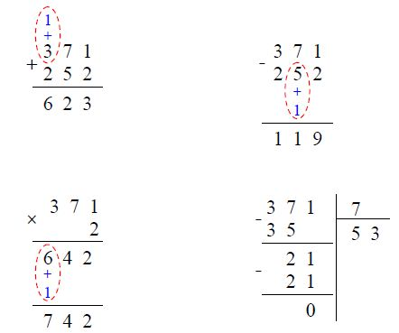

Hình 383: Các phép tính cộng, trừ, nhân, chia trong hệ thống ký hiệu chữ số Ả Rập, hệ thập phân

Để so sánh ích lợi, bạn thử dùng ký hiệu số của người Trung Quốc, người La Mã để thực hiện các phép tính cộng, trừ, nhân, chia nói trên.

Hệ thống ký hiệu chữ số Ả Rập cùng các ích lợi của chúng không chỉ dùng cho các số tự nhiên mà còn được mở rộng dùng cho các số âm, phân số, số thập phân…

Như chúng ta biết, con người luôn mong muốn chuyển giao những công việc mình phải tự làm cho máy móc làm nhằm thỏa mãn nhu cầu tiết kiệm sức lực. Điều này cũng đúng đối với các công việc tính toán.

Để máy móc thực hiện được các công việc của con người, nhà thiết kế, chế tạo máy móc phải tính đến những đặc thù hoạt động của máy móc, mà những đặc thù này, nhiều khi, khác hẳn với các thao tác của con người. Ví dụ, con người muốn có máy móc thay thế công việc đi lại của mình, con người không thiết kế, chế tạo máy móc bắt chước chân đi mà chế tạo xe bánh lăn. Bởi vì, trong kỹ thuật, việc tạo ra chuyển động quay dễ hơn tạo ra thao tác giống bước chân đi của con người.

Tương tự như vậy, lưỡi cưa tay, hòn đá mài dùng để mài dao một cách thủ công đều được thiết kế, chế tạo có dạng tròn và sử dụng chuyển động quay khi chuyển sang thành máy cưa, máy mài.

Đối với công việc tính toán, người ta sử dụng đặc thù của máy móc, cụ thể: Công tắc ngắt mạch–đóng mạch; mạch điện không có dòng điện–có dòng điện; bóng đèn tắt–sáng;… Hai trạng thái nói trên được phân biệt một cách rõ ràng, không gây nhầm lẫn. Để tương hợp với đặc thù này, người ta chuyển các con số từ các ký hiệu của hệ đếm thập phân sang hệ đếm nhị phân với hai ký hiệu nguồn là 0 và 1: 0 ứng với trạng thái ngắt mạch, 1 ứng với trạng thái nối mạch;… Lúc này, các dữ liệu, thông tin đưa vào máy sẽ là chuỗi các chữ số gồm 0 và 1.

Ví dụ, số 5 trong hệ thập phân đưa vào máy sẽ có dạng 510 = 1x22+0x21+1x20 = 1012 (các chỉ số 10 và 2 chỉ hệ thập phân và hệ nhị phân tương ứng). Đối với thông tin không phải số (như chữ cái) cần đưa vào máy, người ta sử dụng mã quy ước: Dãy số 01010100 này ứng với chữ cái này, dãy số 01001001 ứng với chữ cái khác… Sau này, người ta còn mở rộng sử dụng dãy số 0 và 1 để mã hóa các thông tin không phải là số khác như âm thanh, hình ảnh… Việc số hóa thông tin có nhiều ích lợi so với thông tin ở dạng tương tự (analog) về cả mặt số lượng lẫn chất lượng trong các quá trình truyền, biến đổi, xử lý, lưu trữ, truy cập thông tin.

Thí dụ 2:

Như chúng ta đã biết (xem _Chương 8: Tư duy lôgích_ của quyển ba), kể từ cuối thế kỷ 19 – đầu thế kỷ 20, lôgích hình thức chuyển sang giai đoạn phát triển mới: Giai đoạn sử dụng rộng rãi các ký hiệu và tăng tính hình thức của hệ thống ký hiệu với sự khởi xướng trước đó của G. Boole – người sáng lập đại số lôgích.

Các cố gắng của các nhà lôgích học, toán học đã cho ra đời lĩnh vực mới: Lôgích toán học (hay còn gọi là lôgích ký hiệu). Lôgích toán học hình thành và phát triển dựa trên việc áp dụng các phương pháp hình thức của toán học vào lôgích hình thức và nghiên cứu các suy luận, chứng minh toán học từ những luận điểm của lôgích hình thức. Trong lôgích toán học, các quá trình lôgích được nghiên cứu nhờ biểu diễn chúng theo ngôn ngữ hình thức hoặc các thao tác tính toán lôgích.

Nhờ mức độ hình thức hóa cao, lôgích hình thức được “máy móc hóa” trong các lĩnh vực điện kỹ thuật, máy tính, lập trình, điều khiển học kỹ thuật, tự động hóa.

Thí dụ 3:

Bạn thử nhớ lại thời học phổ thông, khi chuyển từ số học sang đại số, bạn cần phải làm quen với những ký hiệu mới. Trong số học, các con số là các con số cụ thể, các phép tính cũng dùng các con số cụ thể (xem Thí dụ 1). Trong đại số, các ký hiệu mang tính đại biểu, khái quát cao hơn, chẳng hạn, các ký hiệu “a”, “b”, “c”… có thể là bất kỳ con số cụ thể nào trong miền xác định có nghĩa của nó.

Chính tính khái quát cao hơn này của các ký hiệu đại số giúp người ta mở rộng khả năng tư duy và giải không phải một mà nguyên một loại bài toán, giải không phải chỉ trường hợp riêng mà cho cả trường hợp chung, tổng quát.

Có bài toán sau:

“Hãy rút gọn biểu thức:

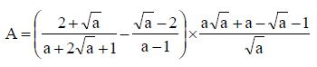

với a lớn hơn 0 và khác 1 (a>0 và a≠1)”

Như vậy, “a” có thể là bất kỳ số nào trong miền xác định được biểu diễn trên trục số (xem Hình 384):

Hình 384: Miền xác định của “a”

Điều này có nghĩa, bài toán bạn đang giải không phải là một bài toán với số “a” cụ thể nào đó mà nó chứa số lượng vô cùng lớn các bài toán với các số “a” cụ thể khác nhau.

Giải bài toán nói trên bằng cách sử dụng các quy tắc liên kết và biến đổi các ký hiệu, chúng ta có:

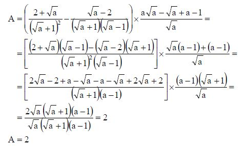

Như vậy, dù “a” là bất kỳ số nào trong miền xác định của nó, biểu thức A luôn bằng 2.

Thí dụ 4:

Rất nhiều bài toán thực tế trong cuộc sống, công việc, mặc dù chúng có liên quan đến toán học, có thể dùng toán học để giải chúng, nhưng lời phát biểu khởi đầu của chúng sử dụng ngôn ngữ tự nhiên chứ không phải ngôn ngữ toán học. Điều này gây khó khăn cho những người giải nếu họ định giải bài toán bằng ngôn ngữ tự nhiên.

Bạn thử giải bài toán sau bằng ngôn ngữ tự nhiên, không dùng các ký hiệu toán học. Chắc bạn sẽ gặp không ít khó khăn và tốn nhiều thời gian.

_Bài toán:_

“Một xưởng may phải may xong 3.000 áo trong một thời gian quy định. Để hoàn thành sớm kế hoạch, mỗi ngày xưởng đã may được nhiều hơn 6 áo so với số áo phải may trong một ngày theo kế hoạch. Vì thế, 5 ngày trước khi hết thời hạn, xưởng đã may được 2.650 áo.

Hỏi, theo kế hoạch, mỗi ngày xưởng phải may xong bao nhiêu áo?”

Trong khi đó, trong toán học, để giúp “phiên dịch” lời phát biểu bài toán nói trên từ ngôn ngữ tự nhiên sang ngôn ngữ toán học và sử dụng các ưu việt của hệ thống ký hiệu toán học, người ta đưa ra khái niệm “ẩn số” và ký hiệu nó là “x”.

_Lời giải:_

Gọi số áo phải may trong một ngày theo kế hoạch là x (x∈N, x>0).

Thời gian quy định may xong 3.000 áo là: 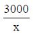

Số áo thực tế may trong một ngày là: x+6

Thời gian may xong 2.650 áo: 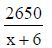

Xưởng may xong 2.650 áo trước khi hết hạn năm ngày nên ta có phương trình:

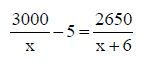

Giải phương trình trên:

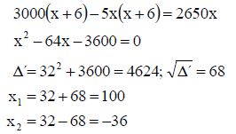

x2= -36 không thỏa mãn điều kiện của ẩn. Vậy, theo kế hoạch, mỗi ngày xưởng phải may xong 100 áo.

Thí dụ 5:

Giải phương trình bậc hai, lúc đầu người ta quen với kết luận: Phương trình bậc hai có hai nghiệm nếu Δ≥0 và không có nghiệm nếu Δ<0.

Về sau, căn cứ vào lôgích nội tại của các ký hiệu, một số nhà nghiên cứu đặt vấn đề diễn giải khía cạnh ý nghĩa (semantic) của 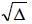 với Δ<0, chứ không bỏ qua như trước. Họ đưa ra khái niệm số ảo, ký hiệu là “i” với i2= -1\. Lúc này, nếu Δ>0, phương trình bậc hai az2+bz+c= 0 có hai nghiệm phân biệt là:

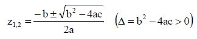

Nếu Δ=0, phương trình bậc hai có hai nghiệm trùng nhau: 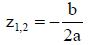

Nếu Δ<0, phương trình bậc hai (có tính đến số ảo) cũng có hai nghiệm:

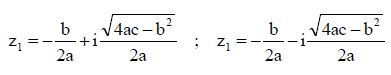

Đến đây, những người tiếp tục đi theo hướng diễn giải ý nghĩa của những cái vẫn tồn tại dưới dạng ký hiệu mà không tồn tại trong thực tế, đưa ra khái niệm số phức cho trường hợp tổng quát: z= x+iy.

Số phức gồm hai phần, phần thực (x), phần ảo (y) và được biểu diễn trong hệ trục tọa độ như sau (xem Hình 385):

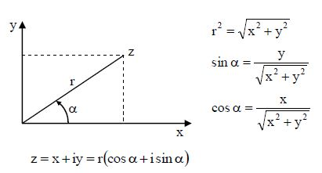

Hình 385: Dạng lượng giác của số phức

Sau này, L. Euler còn tìm ra cách biểu diễn số phức thành số mũ:

z= r.eiα= r(cosα+isinα)

Với các cách biểu diễn số phức như trên, các quy tắc thực hiện các phép tính đại số đối với số phức cũng giống như số thực, có tính đến i2= -1.

Như vậy, việc tính cả số phức như là một loại số mở rộng so với số thực đã cho phép các nhà toán học chứng minh định lý chung về số nghiệm của phương trình đại số: Số nghiệm bằng số bậc của phương trình.

Tiếp theo sự ra đời khái niệm số phức là sự hình thành, phát triển lĩnh vực nghiên cứu mới trong toán học: Giải tích hàm các biến số phức. Các nghiên cứu số phức đem lại nhiều ứng dụng trong thực tế của các ngành như điện kỹ thuật, vô tuyến điện tử, truyền thông tin. Trong rất nhiều trường hợp, sử dụng các quy tắc biến đổi bằng ký hiệu số phức cho ra các kết quả nhanh và đẹp hơn so với dùng số thực. Đến nỗi, nhà toán học người Pháp J. Hadamard (1865-1963) khái quát hóa những trường hợp đó thành triết lý: _“Con đường ngắn nhất và tốt nhất giữa hai chân lý trong lĩnh vực có thực thường đi qua vùng ảo”_.

Trên thực tế, những ngành như vật lý, nhiều ngành kỹ thuật sử dụng toán học với hệ thống ký hiệu ở mức hình thức hóa cao một cách rộng rãi, đã tận dụng được các ưu việt có sẵn của hệ thống ký hiệu toán học, kể cả việc chuyển giao việc giải các bài toán cho máy móc thực hiện.

* Có một lĩnh vực khoa học, tại đó người ta cũng sử dụng rất nhiều ký hiệu dưới dạng các số, các chữ cái, các gạch nối liên kết… Đấy là lĩnh vực hóa học. Tuy chưa đạt được mức độ hình thức hóa cao như toán học để có thể máy móc hóa một số công việc của hóa học, hệ thống ký hiệu hóa học đã giúp ích rất nhiều việc trình bày các kiến thức hóa học một cách ngắn gọn, rõ ràng, phản ánh bản chất các hiện tượng, quá trình; giúp phát hiện sự giống nhau giữa các chất hóa học khác nhau để từ đó phân loại chúng thành các nhóm đặc thù; cao hơn nữa, giúp phát hiện các quy luật hóa học.

∗ ∗ ∗

* Qua những gì trình bày ở trên, chúng ta có thể thấy, khởi đầu một khoa học phát triển dựa trên ngôn ngữ tự nhiên và ngôn ngữ nhân tạo rồi dần chuyển sang phát triển dựa trên ngôn ngữ hình thức (hệ thống ký hiệu) với mức độ hình thức hóa ngày càng cao. Việc sử dụng trong khoa học cho trước ngôn ngữ hình thức với mức độ hình thức hóa ngày càng cao cũng phản ánh “độ chín” của khoa học đó.

Ít nhất, có hai cách chuyển từ ngôn ngữ tự nhiên sang ngôn ngữ hình thức. Cách thứ nhất là sử dụng ngay ngôn ngữ ký hiệu toán học có sẵn nếu hoàn cảnh, điều kiện cho phép. Điều này đúng với vật lý và nhiều ngành kỹ thuật.

Cách thứ hai là xây dựng hệ thống ký hiệu phù hợp với những đặc thù riêng của lĩnh vực cho trước và từ đó dần dần nâng cao mức độ hình thức hóa của hệ thống ký hiệu. Đây là cách làm của hóa học. Nói như vậy không có nghĩa hóa học hoàn toàn không sử dụng toán học.

* TRIZ, tương tự như các khoa học khác, trong lịch sử hình thành và phát triển của mình cũng có những bộ phận dần chuyển sang sử dụng hệ thống ký hiệu, kể từ những năm 1970.

Cách chuyển từ ngôn ngữ tự nhiên, ngôn ngữ nhân tạo sang hệ thống ký hiệu trong TRIZ có phần tương tự như trong hóa học, hiểu theo nghĩa, G.S. Altshuller và các cộng sự xây dựng hệ thống ký hiệu riêng không phải là hệ thống các ký hiệu toán học, phản ánh các đặc thù, trước hết, của lĩnh vực sáng tạo và đổi mới kỹ thuật. Nói cách khác, hệ thống ký hiệu trình bày trong quyển tám này, chủ yếu, áp dụng để giải các bài toán sáng chế, chứ không phải dùng để giải các bài toán nói chung, bao gồm các lĩnh vực không phải kỹ thuật. Tuy vậy, hiện nay đang có những nghiên cứu cố gắng mở rộng phạm vi áp dụng của hệ thống ký hiệu của TRIZ cho cả các bài toán không phải kỹ thuật.

Các ký hiệu của TRIZ được trình bày trong mục tiếp theo sẽ cho bạn đọc thấy, nhờ những ký hiệu này hình thành một công cụ phân tích mới, gọi là phân tích chất–trường, hay còn gọi là phân tích vepol.

Phân tích chất–trường, một mặt, giúp phát hiện cách giải bài toán giống nhau ở dạng chung, khái quát của nhiều bài toán cụ thể tưởng rằng rất khác nhau, từ đó xây dựng lời giải chuẩn (còn gọi tắt là chuẩn) cho nguyên cả một loại bài toán.

Mặt khác, phân tích chất–trường kết hợp với các quy luật phát triển hệ thống (đã trình bày trong quyển bảy) giúp phân loại, nhóm các lời giải chuẩn (chuẩn) thành các nhóm đặc thù, để người giải bài toán có thể chủ động sáng tạo đưa hệ có trong bài toán phát triển theo các quy luật phát triển hệ thống.

## PHÂN TÍCH CHẤT–TRƯỜNG (PHÂN TÍCH VEPOL) VÀ KHÁI NIỆM CHUẨN TRONG TRIZ {#sec:15:2:}
### Vepol và phân tích vepol {#subsec:15:2:1:}
Phân tích chất–trường (còn gọi là phân tích vepol) được dịch từ tiếng Nga: Вепольный Анализ. Trong đó, “Be” (đọc là “ve”) là hai chữ cái đầu của từ “Вещество”, có nghĩa là chất (vật chất); “пол” (đọc là “pol”) là ba chữ cái đầu của từ “поле” – trường (năng lượng); còn Анализ – phân tích. “Вепольный Анализ” được dịch sang tiếng Anh là “Su–Field Analysis”. Trong đó, “Su” là hai chữ cái đầu của từ “Substance” là chất, còn “Field” là trường.

Như chúng ta đã biết (xem quyển bảy, mục nhỏ _\@ref(subsec:14:2:1:) Quy luật về tính tự lập của hệ thống_, đặc biệt, các Hình vẽ 347, 348), công cụ (bộ phận làm việc) đóng vai trò đại diện cho hệ, vì nó trực tiếp thực hiện chức năng (tính hệ thống) của hệ. Các bộ phận khác của hệ như động cơ, truyền động, điều khiển đóng vai trò cung cấp năng lượng, thông tin điều khiển (thực chất là năng lượng dưới dạng mã hóa) cho công cụ. Công cụ tương tác với sản phẩm cho chúng ta thành phẩm.

Đối với bài toán thay đổi sản phẩm, thành phẩm là sản phẩm đã được thay đổi đạt các yêu cầu đề ra. Ví dụ, thành phẩm trong trường hợp tiện một chi tiết nhất định là sau khi tiện, chi tiết đó có được hình dạng, kích thước đạt mục đích đề ra.

Đối với bài toán phát hiện, đo sản phẩm, thành phẩm là thông tin (thực chất cũng là năng lượng được mã hóa để phù hợp với các giác quan của con người) định tính (nếu là phát hiện), định lượng (nếu là đo). Ví dụ, thành phẩm của hệ thống báo cháy khi phát hiện nhiệt độ cao quá một ngưỡng nào đó là tiếng chuông reo, còi hú, đèn đỏ báo cháy sáng lập lòe.

Khái quát hóa lên cho gọn, các bộ phận có trên các Hình 347, 348 trong mục nhỏ _\@ref(subsec:14:2:1:) Quy luật về tính tự lập của hệ thống_ của quyển bảy, có thể quy thành ba yếu tố tạo nên hệ thống:

1) Sản phẩm

2) Công cụ

3) Tập hợp ba bộ phận còn lại: Động cơ, truyền động, điều khiển

Sử dụng ký hiệu trong TRIZ:

**Sản phẩm** được ký hiệu là C1 (**chất một**).

**Công cụ** được ký hiệu là C2 (**chất hai**).

**Tập hợp các bộ phận còn lại** được ký hiệu là **T – trường (năng lượng)**.

Lúc này, hệ thay đổi sản phẩm (xem Hình 347 trong mục nhỏ _\@ref(subsec:14:2:1:) Quy luật về tính tự lập của hệ thống_ của quyển bảy) và hệ phát hiện, đo sản phẩm (xem Hình 348 trong mục nhỏ _\@ref(subsec:14:2:1:) Quy luật về tính tự lập của hệ thống_ của quyển bảy) được biểu diễn dưới dạng ký hiệu, thể hiện trên Hình 386:

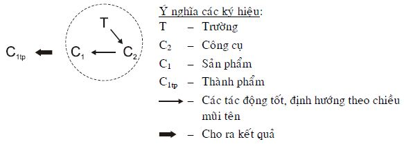

a) Hệ dùng để thay đổi sản phẩm. Hệ nằm trong đường tròn gọi là hệ vepol dùng để thay đổi sản phẩm (hay gọi tắt là vepol thay đổi)

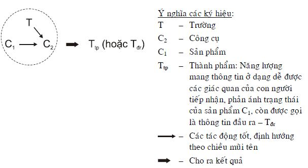

b) Hệ dùng để phát hiện, đo sản phẩm. Hệ nằm trong đường tròn gọi là hệ vepol dùng để phát hiện, đo sản phẩm (hay gọi tắt là vepol đo)

Hình 386: Hệ dùng để thay đổi sản phẩm và hệ phát hiện, đo sản phẩm, được biểu diễn dưới dạng các ký hiệu

* Hình 386 cho chúng ta thấy vepol (hệ nằm trong đường tròn) là hệ tự lập đơn giản nhất gồm ba yếu tố: Hai chất (công cụ, sản phẩm) và một trường.

Nói cách khác, vepol là hệ thống cơ sở nhỏ nhất, có vai trò như tam giác trong hình học, hiểu theo nghĩa, các hệ thống phức tạp hơn đều có thể biểu diễn thành hệ thống các vepol, tương tự như trong hình học: Các hình, khối phức tạp đều có thể phân thành hệ thống các tam giác.

Phân tích chất–trường (phân tích vepol) là một bộ phận hợp thành của TRIZ sử dụng vepol biểu diễn hoạt động của các hệ kỹ thuật để nghiên cứu các cấu trúc, tính chất, biến đổi, phát triển của các hệ đó. Nhờ vậy, phân tích vepol giúp tìm ra những cách giải bài toán sáng chế với năng suất, hiệu quả, tính định hướng cao và tiết kiệm thời gian.

### Các bài toán có thể có nhìn theo quan điểm vepol {#subsec:15:2:2:}
* Trong trường hợp chung nhất, hệ thống vepol có 3 yếu tố và 6 mối liên kết (xem Hình 387):

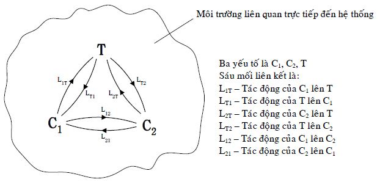

Hình 387: Vepol trong trường hợp chung nhất

Để đánh giá các trạng thái có thể có của vepol được mô tả trên Hình 387, chúng ta có thể sử dụng phương pháp phân tích hình thái (xem _\@ref(subsec:13:3:3:9:) Phương pháp phân tích hình thái_ của quyển sáu) với ma trận hình thái sau (xem Hình 388).

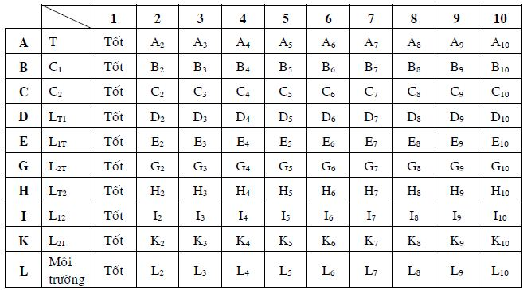

Hình 388: Ma trận hình thái phản ánh trạng thái hoạt động của vepol

Để tiện trình bày, người viết chọn ma trận hình thái có mười hàng và mười cột. Trên thực tế, số cột có thể nhiều hơn. Mười thông số theo hàng (A, B, C…) tương ứng với các yếu tố, các mối liên kết, môi trường của hệ vepol. Mười cột (1, 2, 3…) chỉ ra các trạng thái (khả năng) có thể có của từng thông số, trong đó cột một (A1, B1, C1…) là trạng thái tốt. Như vậy, vepol ứng với công thức hình thái A1-B1-C1-D1-E1-G1-H1-I1-K1-L1 là vepol tốt, không có vấn đề.

Chín cột còn lại là chín trạng thái không tốt, chỉ cần vepol có một trạng thái không tốt của bất kỳ thông số nào, có nghĩa, vepol có vấn đề. Trạng thái không tốt rất đa dạng chứ không phải chỉ có một trạng thái không tốt.

Ví dụ, thông số A là trường (T) thì:

A2 – Loại trường thích hợp cho C2 thì lại không tốt cho C1 và ngược lại.

A3 – Loại trường thích hợp nhưng ảnh hưởng xấu đến môi trường

A4 – Loại trường thích hợp nhưng tác động yếu quá, chưa đạt yêu cầu

A5 – Loại trường thích hợp nhưng tác động mạnh quá, gây hại

A6 – Loại trường thích hợp nhưng tác động nhanh quá

A7 – Loại trường thích hợp nhưng tác động chậm quá

A8 – Loại trường thích hợp nhưng chế độ thay đổi tác động (theo cường độ, thời gian) khi vepol hoạt động không đạt yêu cầu

A9 – Loại trường không thích hợp, cần tìm loại trường khác thích hợp hơn

A10 – Tất cả các loại trường hiện có dùng riêng biệt đều không thích hợp. Vậy phải dùng tổ hợp những trường nào?

Tương tự như vậy, người viết tin rằng, bạn đọc không gặp khó khăn khi liệt kê chín trạng thái không tốt của các thông số khác của hệ vepol.

Ma trận hình thái trên Hình 388 cho chúng ta 1010 (mười tỷ) công thức hình thái khác nhau:

Aa-Bb-Cc-Dd-Ee-Gg-Hh-Ii-Kk-Ll

với a, b, c, d, e, g, h, i, k, l = 1÷10.

Trong đó, công thức hình thái: A1-B1-C1-D1-E1-G1-H1-I1-K1-L1 thể hiện vepol hoạt động tốt, còn (1010-1)các công thức hình thái còn lại là các vepol có vấn đề.

Tóm lại, vepol là hệ thống đơn giản và nhỏ nhất nhưng cấu trúc của nó có thể phản ánh một số lượng rất lớn các bài toán có thể có. Do vậy, cấu trúc vepol còn được dùng để biểu diễn bài toán.

### Một số ký hiệu thông dụng dùng trong biểu diễn vepol {#subsec:15:2:3:}
* Dưới đây (xem Hình 389) là những ký hiệu thông dụng để biểu diễn vepol. Với thời gian, các ký hiệu khác sẽ dần được đưa thêm vào trong quá trình trình bày của người viết.

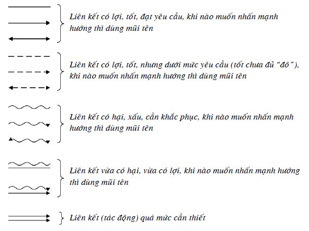

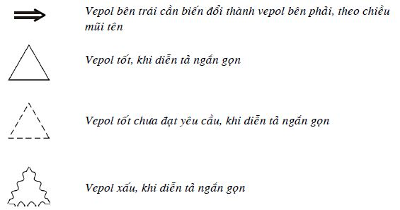

Hình 389: Những ký hiệu thông dụng dùng trong biểu diễn vepol

* Từ Hình 386 ở trên, chúng ta đã biết:

Vepol thay đổi sản phẩm tốt có dạng:

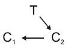

trong khi nếu vẽ đầy đủ, thì phải vẽ tất cả các tác động (liên kết) đều tốt:

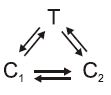

hoặc vẽ ngắn gọn vepol thay đổi tốt:

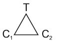

Điều này nói lên rằng, những tác động (liên kết) được đưa lên hình vẽ là những tác động (liên kết) cơ bản, cần nhấn mạnh, còn những tác động (liên kết) nào không được đưa lên hình vẽ được hiểu ngầm là những liên kết (tác động) tốt nhưng không cần thiết phải nhấn mạnh.

Tương tự như trên, vepol phát hiện, đo có dạng:

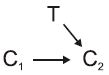

Tuy nhiên, đối với vepol phát hiện, đo, để nhấn mạnh nó khác với vepol thay đổi và tránh nhầm lẫn với vepol thay đổi, người ta biểu diễn thêm cả trường đầu ra (Tđr):

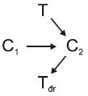

Tóm lại, Hình 390 dưới đây phản ánh dạng vepol thay đổi sản phẩm và vepol phát hiện, đo sản phẩm:

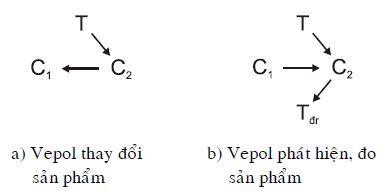

Hình 390: Biểu diễn vepol thay đổi và vepol đo tốt

* Tiếp theo là các thí dụ về vepol có vấn đề:

Thí dụ 1 (xem Hình 391):

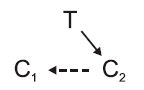

Hình 391

Đây là vepol mà tác động của công cụ (C2) lên sản phẩm (C1) tốt chưa đạt yêu cầu, chẳng hạn, tác động mới đạt 80% yêu cầu, nhưng không phải là tác động xấu.

Thí dụ 2:

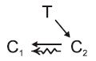

Hình 392

Đây là vepol mà tác động của công cụ (C2) lên sản phẩm (C1) vừa tốt vừa xấu.

Thí dụ 3:

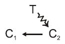

Hình 393

Trong vepol này, tác động của trường (T) lên công cụ là xấu, còn tác động của công cụ (C2) lên sản phẩm (C1) là tốt. Bạn có thể đoán, giải bài toán này cần thay đổi cách tác động của T lên C2 hoặc phải thay trường này (T) bằng trường khác (T’). Ngoài ra, bạn xem còn có cách nào nữa không?

Thí dụ 4:

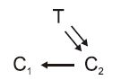

Hình 394

Trường (T) tác động lên công cụ (C2) quá mức cần thiết. Rõ ràng, đây là tác động xấu. Tuy nhiên, khi dùng ký hiệu 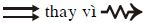, người ta chỉ ra nguyên nhân cụ thể là tác động quá mức chứ không xấu chung chung.

Tương tự như các thí dụ vừa trình bày, tự bạn đọc có thể sử dụng các ký hiệu để vẽ các vepol có các vấn đề khác, không chỉ cho loại vepol thay đổi mà cho cả loại vepol đo.

### Một số điểm lưu ý về vepol, biểu diễn vepol và phân tích vepol {#subsec:15:2:4:}
1) Vepol là hệ tự lập đơn giản nhất gồm ba yếu tố (hai chất và một trường). Tuy nhiên, thực tế rất đa dạng, cho nên có những trường hợp đặc biệt, vepol chỉ có một hoặc hai yếu tố mà vẫn có thể xem là hệ tự lập. Các thí dụ sau đây cho thấy điều đó:

\- Đối với vepol thay đổi, đấy có thể là trứng nở ra con (đối với những động vật không đòi hỏi ấp) trong điều kiện môi trường bình thường:

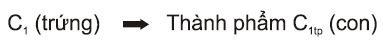

hoặc ánh nắng mặt trời làm khô quần áo:

\- Đối với vepol đo, hai thí dụ sau có thể coi là những trường hợp đặc biệt.

Phát hiện mặt trời mọc:

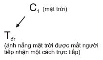

Đo thân nhiệt bằng nhiệt kế thủy ngân:

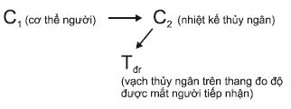

2) Trước khi biểu diễn hệ có trong bài toán thành vepol, cần xác định hệ đó là hệ dùng để thay đổi sản phẩm hay là hệ dùng để phát hiện, đo sản phẩm để chọn cách biểu diễn thích hợp (xem Hình 390trong mục nhỏ _\@ref(subsec:15:2:3:) Một số ký hiệu thông dụng dùng trong biểu diễn vepol_của quyển sách này), cụ thể là:

Nếu là hệ dùng để thay đổi sản phẩm thì vepol thay đổi có dạng:

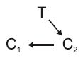

Nếu là hệ dùng để phát hiện, đo sản phẩm thì vepol đo có dạng:

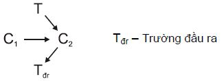

3) Trong TRIZ, các khái niệm công cụ (C2), sản phẩm (C1) được hiểu theo nghĩa rộng nhất có thể có, còn nghĩa cụ thể của chúng tùy thuộc vào bài toán cụ thể.

Có những bài toán, việc xác định chính xác C1, C2không đơn giản. Có những trường hợp, xác định C2 dễ hơn, bạn có thể làm trước rồi đi tìm C1 và ngược lại, bạn có thể xác định C1trước rồi đi tìm C2.

Chưa kể, trong thực tế có những trường hợp,C1 và C2 có thể đổi chỗ cho nhau.

4) Khái niệm trường (T) trong TRIZ được hiểu rộng hơn khái niệm trường trong vật lý. Trong TRIZ, bất kỳ nguồn năng lượng nào hoặc nguồn lực nào có thể tạo ra năng lượng đều được coi là trường (T).

5) Nếu xét theo mức độ đa dạng giữa chất (C1, C2) và trường (T) thì trường (T) có độ đa dạng thấp hơn.

Ví dụ, năng lượng có thể là năng lượng cơ học, các loại lực cơ học; năng lượng âm thanh (kể cả siêu âm, hạ âm); năng lượng nhiệt; năng lượng được giải phóng từ các phản ứng hóa học, hóa sinh; năng lượng điện; năng lượng từ; năng lượng điện–từ với các tần số khác nhau.

Trong khi đó, bạn thử liệt kê các loại chất có thể có xem, chúng đa dạng hơn rất nhiều. Để dễ nhớ các loại năng lượng, lực được liệt kê ở trên, bạn có thể dùng cụm từ: CANH Điện thoại Điện-Từ được viết ghép lại thành CANHĐTĐ-T và giải mã theo Hình 395:

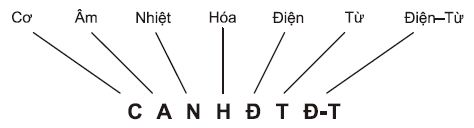

Hình 395: Để dễ nhớ các loại năng lượng có thể có

Bạn cần sử dụng đặc thù mức đa dạng của trường (T) thấp hơn chất (C1, C2) để giải bài toán. Trong nhiều trường hợp, bắt đầu từ việc tìm loại T thích hợp sẽ giúp bạn xác định C1 hoặc C2, hoặc cùng lúc cả hai và bài toán trở nên giải nhanh hơn.

6) Tùy theo cách xem xét chủ quan của người giải mà cùng một hệ có thể có những vepol biểu diễn khác nhau. Ở đây có lời khuyên: _“Cần đơn giản hóa tối đa sơ đồ vepol theo tinh thần chỉ giữ lại những gì cần thiết nhất phản ánh bản chất của bài toán. Những gì đạt được một cách hiển nhiên có thể loại khỏi sơ đồ vepol”_.

7) Biểu diễn thành sơ đồ vepol và dùng phân tích vepol, người giải bài toán đã sử dụng ưu việt của thị giác: Tiếp thu khối lượng thông tin lớn và xử lý khối lượng thông tin lớn đó trong thời gian ngắn.

### Khái niệm lời giải chuẩn (chuẩn) {#subsec:15:2:5:}
Khi biểu diễn các lời phát biểu bài toán và các lời giải của chúng thành các vepol: Vepol–bài toán và vepol–lời giải, G.S. Altshuller và các cộng sự nhận thấy, nhiều bài toán có cùng vepol–bài toán như thế nào thì cũng có cùng vepol–lời giải tương ứng. Mặc dù, những bài toán này rất khác nhau, thậm chí, thuộc các lĩnh vực kỹ thuật rất xa nhau khi phát biểu bằng ngôn ngữ tự nhiên và ngôn ngữ nhân tạo.

Chắc bạn còn nhớ hồi học phổ thông, giải phương trình bậc hai với các hệ số là các con số cụ thể thì rất đa dạng, nhưng khi sử dụng ký hiệu khái quát thì tất cả chúng đều ở dạng:

ax2+bx+c=0 (1)

và có cùng lời giải:

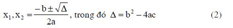

Từ đó trở đi, khi nào bạn gặp bài toán (1) thì bạn biến đổi nó thành lời giải (2), mà khỏi mất công suy nghĩ gì nhiều:

(1)⇒ (2) (3)

Mỗi lời giải chuẩn hay gọi tắt là chuẩn (tiếng Nga là стандартное решение, gọi tắt là стандарт; tiếng Anh là standard solution, gọi tắt là standard) trong TRIZ có dạng như cách viết (3) ở trên (xem Hình 396):

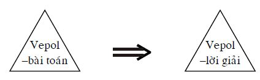

Hình 396: Dạng trình bày mỗi chuẩn trong TRIZ

Hình 396 đòi hỏi người giải phải biểu diễn hệ có trong bài toán của mình thành vepol (vepol–bài toán). Sau đó, người giải tra cứu hệ thống các chuẩn (gồm 76 chuẩn) xem, vepol–bài toán của mình trùng với vepol–bài toán của chuẩn nào, thì sử dụng cách giải được thể hiện trong vepol–lời giải của chuẩn đó.

* Trong TRIZ, các chuẩn được chú ý phát hiện, xây dựng và chọn lọc từ những năm 1970. Mỗi chuẩn tìm ra dùng để giải nguyên một hoặc vài loại bài toán.

Ở thời kỳ đầu, các chuẩn chưa được phân loại, sắp xếp. Số lượng các chuẩn, với thời gian tăng lên khá nhanh: 5, 9, 11, 18…, đến năm 1979 đã lập được hệ thống gồm 28 chuẩn. Việc phân loại và hệ thống hóa các chuẩn được thực hiện dựa trên phân tích vepol. Người ta đã xác định được các loại chủ yếu:

1) Các chuẩn dùng để thay đổi sản phẩm.

2) Các chuẩn dùng để phát hiện và đo sản phẩm.

3) Các chuẩn dùng để sử dụng các chuẩn.

Đến cuối 1984, phần lớn các trường, lớp TRIZ đã sử dụng các hệ thống gồm 54, 59, và 69 chuẩn.

Trong những năm từ 1983 đến 1986, các công trình nghiên cứu các quy luật phát triển các hệ kỹ thuật được tích cực triển khai. Các quan điểm hiện đại cho thấy, sự phát triển các hệ vepol đi theo đường sau: Các vepol thiếu → Các vepol đủ → Các vepol phức tạp → Các vepol tăng cường → Các vepol phức hợp-tăng cường. Trong mỗi mắt xích của quá trình này, đều có thể có sự chuyển “lên trên” sang mức hệ trên tiếp theo, cũng như sự chuyển “xuống dưới” sang mức hệ dưới thấp hơn.

Người ta cũng đã phát hiện ra một số cơ chế thực hiện sơ đồ chung sau: Chuyển sang vepol lưỡng hệ và đa hệ, chuyển sang hệ rút gọn, chuyển sang mức vi mô… Những biểu hiện mới về các quy luật phát triển của hệ thống kỹ thuật cho phép bổ sung và hoàn thiện cấu trúc hệ thống của các chuẩn và đưa thêm các chuẩn mạnh, mới. Sự đổi mới này đã được thử thách qua các buổi thảo luận, được tổ chức vào những năm từ 1984 đến 1986. Từ đây, người ta có được hệ thống gồm 76 chuẩn. Những điểm đặc biệt của hệ thống này là:

1) Việc phân loại các chuẩn được thực hiện tuân theo sơ đồ chung về sự phát triển của các hệ kỹ thuật: Các vepol đơn giản → Các vepol phức tạp → Các vepol tăng cường → Các vepol phức hợp-tăng cường → Phép chuyển lên hệ trên và xuống hệ dưới.

2) Đưa ra hàng loạt các chuẩn mới. Một số trong chúng là do hiểu biết sâu hơn các quy luật phát triển của hệ thống kỹ thuật và được gợi ý nhờ chính lôgích của hệ thống các chuẩn.

3) Tìm thêm được nhiều ví dụ về các chuẩn.

Các chuẩn hiện đại được hiểu, là những quy tắc xây dựng và biến đổi các hệ kỹ thuật, các quy tắc này được rút ra từ các quy luật phát triển của các hệ thống đó. Các chuẩn là các công cụ giải quyết các mâu thuẫn kỹ thuật và mâu thuẫn vật lý. Mục đích của các chuẩn là khắc phục mâu thuẫn. Trong những trường hợp đặc biệt có thể sử dụng các chuẩn “đi vòng” qua mâu thuẫn. Các chuẩn tạo nên hệ thống nhất định: Mỗi giai đoạn trong cuộc đời của hệ gắn bó với các chuẩn của mình. Hiểu, nắm và sử dụng thành thạo các chuẩn, các nhà sáng chế có thể giải một cách tự tin số lượng lớn các bài toán hiện đại.

Hệ thống 76 chuẩn sẽ được trình bày trong mục 15.3 tiếp theo đây.

## HỆ THỐNG CÁC CHUẨN: LỜI PHÁT BIỂU, DIỄN GIẢI VÀ CÁC THÍ DỤ {#sec:15:3:}
Trong mục này người viết trình bày lần lượt 76 chuẩn có trong hệ thống các chuẩn của TRIZ. Các chuẩn được phân thành năm loại, mỗi loại phân thành các nhóm, mỗi nhóm chứa một số lượng chuẩn nhất định.

Các chuẩn được đánh số “a.b.c”, trong đó số “a” chỉ số thứ tự của loại chuẩn; “b” – số thứ tự của nhóm chuẩn trong loại “a”; “c” – số thứ tự của chuẩn trong nhóm “b”. ví dụ CHUẨN 2.4.3 là chuẩn thuộc loại “2”, nhóm “4” của loại “2”, có số thứ tự trong nhóm “2” là “3”.

Đối với mỗi chuẩn, ngoài lời phát biểu của chuẩn đó, nhằm giúp bạn đọc dễ hiểu, sau này là dễ áp dụng chuẩn vào thực tế giải các bài toán, người viết cố gắng diễn giải nội dung của chuẩn bằng ngôn ngữ tự nhiên và minh họa bằng các thí dụ gần gũi trong đời sống hàng ngày. Tuy nhiên, điều này không phải lúc nào người viết cũng làm được, vì nhiều chuẩn mang tính khoa học kỹ thuật chuyên sâu.

Trong các thí dụ minh họa các chuẩn có cả các thí dụ đã cho trong mục nhỏ _\@ref(sec:11:2:) Lời phát biểu, các thí dụ minh họa và một số nhận xét về các thủ thuật (nguyên tắc) sáng tạo cơ bản_ của quyển bốn. Như vậy, bạn đọc có thể thấy, các thí dụ có trong mục nhỏ nói trên đã được xem xét dưới những góc độ khác nhau, mỗi khi bạn làm quen với những khái niệm, kiến thức mới của TRIZ. Cụ thể: Các thí dụ đó minh họa cho từng thủ thuật, tổ hợp các thủ thuật; minh họa việc khắc phục các mâu thuẫn kỹ thuật, mâu thuẫn vật lý; minh họa lôgích nhu cầu–hệ thống; phản ánh các quy luật phát triển hệ thống (các quy luật sáng tạo và đổi mới); và bây giờ minh họa cho việc sử dụng các chuẩn.

∗ ∗ ∗

### Loại 1: Dựng và phá các hệ vepol {#subsec:15:3:1:}
#### _Nhóm 1.1: Dựng (tổng hợp) vepol_

Ý tưởng chính của các chuẩn nhóm này được phản ánh rõ trong chuẩn 1.1.1: Để tổng hợp được hệ kỹ thuật có khả năng làm việc tốt, trong trường hợp đơn giản nhất, cần chuyển từ “chưa vepol” (“vepol thiếu” – vepol chưa có đầy đủ ba yếu tố C1, C2, T và các mối liên kết tốt) sang vepol đủ.

Có những trường hợp vepol hoạt động tốt nhưng chưa đạt yêu cầu (chưa đủ tốt) nhưng việc dựng vepol tốt gặp phải những khó khăn do các hạn chế khác nhau đối với việc đưa vào vepol các chất và các trường. Các chuẩn từ 1.1.2 đến 1.1.8 cho biết những đường vòng, thường dùng trong các trường hợp đó.

CHUẨN 1.1.1

**NỘI DUNG:**

**Nếu các đối tượng cho trước khó có được những thay đổi cần thiết và điều kiện bài toán không chứa những hạn chế về việc đưa vào những chất và trường, thì bài toán giải bằng cách tổng hợp vepol: Đưa vào những yếu tố còn thiếu.**

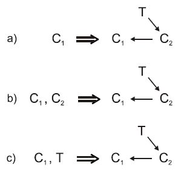

**DIỄN GIẢI VÀ THÍ DỤ:**

(Các) đối tượng cho trước (xem vế trái của ba trường hợp “a”, “b”, “c”) đều giống nhau ở điểm: Chúng chưa có đủ ba yếu tố tạo nên vepol (hai chất và một trường). Cách giải quyết là (xem vế phải): Đưa vào các yếu tố còn thiếu, thích hợp để có vepol làm việc tốt.

Thí dụ, cần có thành phẩm là những lát thịt mỏng. Trường hợp “a” cho thấy có miếng thịt (sản phẩm - C1) nhưng không có dao (công cụ - C2), người thái (trường – T).

Trường hợp “b”: Có thịt (C1), dao (C2) nhưng không có người thái (T).

Trường hợp “c”: Có thịt (C1), có người thái (T) nhưng không có dao (C2).

Đưa những cái còn thiếu, thích hợp vào, chúng ta có lời giải được mô tả bằng vepol ở vế phải.

Trong thí dụ cụ thể người thái thịt (T), C2 (dao), C1 (thịt) vừa nêu, nếu vẽ thật chính xác thì vepol ở vế phải cần vẽ thành:

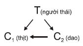

Lý do là, người thái không chỉ tạo ra năng lượng để con dao tác động lên miếng thịt và điều khiển con dao, mà người thái còn tác động lên và điều khiển miếng thịt: Lật qua, lật lại miếng thịt, đặt miếng thịt sao cho thái thịt đúng thớ.

Bạn còn có thể tự tìm ra các thí dụ minh họa khác có trong mục _\@ref(sec:11:2:) Lời phát biểu, các thí dụ minh họa và một số nhận xét về các thủ thuật (nguyên tắc) sáng tạo cơ bản_ của quyển bốn.

CHUẨN 1.1.2

**NỘI DUNG:**

**Nếu vepol cho trước, khó có được những thay đổi cần thiết và điều kiện bài toán không hạn chế việc đưa các chất phụ gia vào trong các chất đã có, thì bài toán giải bằng cách chuyển (cố định hay tạm thời) sang vepol phức hợp trong, nhờ đưa các chất phụ gia vào trong C1 hay C2 hoặc cả hai, mà các chất phụ gia này làm tăng tính điều khiển, hoặc tạo cho vepol những tính chất cần thiết.**

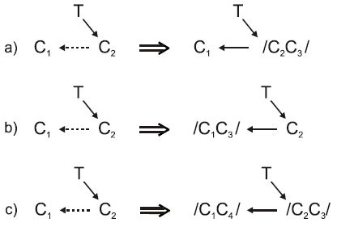

C3, C4 là những chất mới đưa vào các chất đã có.

/ / là ký hiệu sự kết hợp “trong” các chất được viết trong ngoặc: C3 nằm trong C1, hoặc C2, hoặc cả C1 và C2.

**DIỄN GIẢI VÀ THÍ DỤ:**

Vepol vế trái cho chúng ta thấy tác động của C2 lên C1 là tốt nhưng chưa đạt 100% yêu cầu (tốt chưa đủ đô).

Bài toán không hạn chế đưa các chất mới vào trong C1, C2, do vậy, cách giải bài toán là đưa (các) chất mới vào trong C1, C2 (xem các vepol vế phải). Tùy theo bài toán cụ thể, chất mới có thể đưa vào trong C2 (trường hợp “a”), đưa vào trong C1 (trường hợp “b”) hoặc cùng lúc cả hai (trường hợp “c”).

Lúc này, đối với trường hợp “a”, /C2C3/ đóng vai trò mới C2 (ký hiệu là C'2). Bạn có vepol vế phải là:

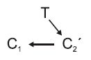

Tương tự, đối với trường hợp “b”, /C1C3/ đóng vai trò C1 mới (ký hiệu là C'1) và vepol vế phải có dạng:

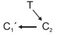

Còn vepol vế phải của trường hợp “c” là:

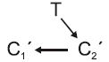

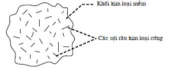

Thí dụ:

\- Vật liệu làm dao C2 hiện nay chưa đủ cứng để có thể chế tạo dao thật mỏng, lưỡi thật sắc, người ta có thể pha trộn vào C2 (pha tạp) các chất thích hợp để đạt được yêu cầu đề ra.

\- Trong tự nhiên, các kim loại cứng thường có nhiệt độ nóng chảy cao, ngược lại những kim loại mềm lại có nhiệt độ nóng chảy thấp. Yêu cầu kỹ thuật, nhiều khi, đòi hỏi phải có hợp kim cứng nhưng nhiệt độ nóng chảy thấp. Ví dụ, nếu bạn có chất hàn với nhiệt độ nóng chảy của thiếc nhưng khi nguội có độ cứng như thép thì bạn sẽ tiết kiệm được rất nhiều năng lượng và thiết bị dùng để hàn trở nên đơn giản hơn một cách đáng kể.

Hợp kim Wood làm từ kim loại mềm, nhiệt độ nóng chảy thấp, có chứa những sợi râu kim loại cứng sắp xếp hỗn độn, đáp ứng được yêu cầu nói trên (xem hình).

Trong thí dụ trên, hợp kim Wood có thể dùng làm chất hàn với /C2C3/: Các sợi râu kim loại cứng (C3) cho vào bên trong thiếc hàn (C2). Vepol lời giải có dạng:

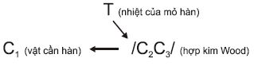

\- Bristol là thành phố của Anh có mưa nhiều. Mỗi năm đến 7 lần thành phố bị ngập lụt vì những cơn mưa rào. Để khắc phục tình trạng này, các nhà hóa học Anh đã chế tạo chất phụ gia polimerpoliocs, hòa tan được trong nước và không gây ô nhiễm môi trường. Chất này có tác dụng làm tăng tốc độ dòng chảy tại các ống góp nước thêm 35%, do vậy, làm tăng khả năng truyền qua của hệ thống cống.

Ở đây, người ta cho chất phụ gia polimerpoliocs (C3) vào trong nước (C1). Chúng ta có vepol:

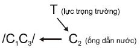

Bạn còn có thể tự tìm ra các thí dụ minh họa khác có trong mục _\@ref(sec:11:2:) Lời phát biểu, các thí dụ minh họa và một số nhận xét về các thủ thuật (nguyên tắc) sáng tạo cơ bản_ của quyển bốn.

CHUẨN 1.1.3

**NỘI DUNG:**

**Nếu vepol cho trước, khó có được những thay đổi cần thiết, còn điều kiện bài toán chứa những hạn chế đưa các chất phụ gia vào trong các chất C1, C2 đã có, thì bài toán giải bằng cách chuyển (cố định hay tạm thời) sang vepol phức hợp ngoài, nhờ kết hợp ngoài C3 với C1 hoặc C2, hoặc cả hai.**

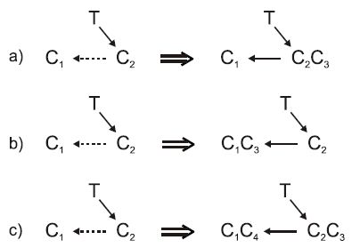

**DIỄN GIẢI VÀ THÍ DỤ:**

Đối với việc diễn giải, bạn đọc có thể đọc lại phần tương ứng trong chuẩn 1.1.2 ở trên, có tính đến sự khác nhau là, thay vì kết hợp trong thì bây giờ là kết hợp ngoài.

Thí dụ, khi sử dụng dao thông thường gọt vỏ các quả, củ (mướp, bí, bầu, dưa chuột…), nhiều người sử dụng gặp khó khăn trong việc tách ra lớp vỏ có độ dầy đồng đều. Để khắc phục khó khăn này, người ta lắp thêm bộ gá (C3) vào lưỡi dao (C3 kết hợp ngoài với C2).

Bạn còn có thể tự tìm ra các thí dụ minh họa khác có trong mục _\@ref(sec:11:2:) Lời phát biểu, các thí dụ minh họa và một số nhận xét về các thủ thuật (nguyên tắc) sáng tạo cơ bản_ của quyển bốn.

CHUẨN 1.1.4

**NỘI DUNG:**

**Nếu vepol cho trước khó có được những thay đổi cần thiết, còn điều kiện bài toán chứa những hạn chế đối với việc đưa vào hoặc kết hợp những chất mới, bài toán giải bằng cách dựng đủ vepol, nhờ sử dụng (các) chất có sẵn trong môi trường bên ngoài làm chất đưa vào.**

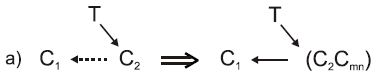

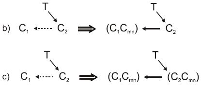

Cmn là chất có sẵn trong môi trường bên ngoài.

( ) là ký hiệu chỉ dẫn rằng các chất nằm trong ngoặc có thể kết hợp trong hoặc ngoài với nhau, tùy theo bài toán cụ thể.

**DIỄN GIẢI VÀ THÍ DỤ:**

Chuẩn 1.1.4 này được dùng trong trường hợp điều kiện bài toán bạn đang giải không cho phép bạn dùng các chuẩn 1.1.2, 1.1.3 ở trên, hoặc bạn thấy, lời giải theo chuẩn 1.1.4 có phần ưu việt hơn so với dùng các chuẩn 1.1.2, 1.1.3.

Trừ những trường hợp đặc biệt, các chất có sẵn trong môi trường bên ngoài thường là không khí và nước. Đã có không ít các sáng chế sử dụng không khí hoặc nước kết hợp (trong hoặc ngoài) với C1, C2.

Thí dụ:

\- Các loại vật liệu xốp (nhiều lỗ) với chất chứa trong các lỗ là không khí hoặc nước (xem các thí dụ có trong _\@ref(subsec:11:2:31:) Sử dụng các vật liệu nhiều lỗ_ của quyển bốn).

\- Nếu cần thay đổi trọng lượng của vật chuyển động, mà điều này không thể làm được, thì cần cho vật chuyển động có dạng cánh và thay đổi góc nghiêng của cánh so với hướng chuyển động để nhận được thêm lực hướng lên trên hoặc hướng xuống dưới (ví dụ, máy bay, tàu thủy cánh ngầm…)

Bạn còn có thể tự tìm ra các thí dụ minh họa khác có trong mục _\@ref(sec:11:2:) Lời phát biểu, các thí dụ minh họa và một số nhận xét về các thủ thuật (nguyên tắc) sáng tạo cơ bản_ của quyển bốn.

**CHUẨN 1.1.5**

**NỘI DUNG:**

**Nếu môi trường bên ngoài không chứa các chất, cần thiết để dựng vepol như chuẩn 1.1.4 thì chất mới có thể nhận được bằng cách làm biến thể các chất của môi trường bên ngoài, hoặc đưa thêm chất phụ gia vào môi trường bên ngoài, hoặc thay thế môi trường bên ngoài bằng môi trường khác.**

C'mn, C''mn là chất biến thể của môi trường bên ngoài hoặc chất phụ gia đưa thêm vào môi trường bên ngoài, hoặc môi trường bên ngoài khác.

**DIỄN GIẢI VÀ THÍ DỤ:**

Chuẩn 1.1.5 khác chuẩn 1.1.4 ở chỗ, các chất có sẵn trong môi trường bên ngoài không dùng nguyên si mà dùng dưới dạng các biến thể. Chẳng hạn, các chất có sẵn trong môi trường bên ngoài là không khí và nước. Các dạng biến thể của không khí và nước có thể là, chúng ở các nhiệt độ khác nhiệt độ của môi trường bình thường (nóng hơn, lạnh hơn…); ở các trạng thái khác (không khí loãng, không khí nén…, nước ở trạng thái hơi, nước ở trạng thái rắn…).

Trong chuẩn 1.1.5 có nhắc tới khả năng nữa là cho thêm chất phụ gia (hiểu theo nghĩa rất rộng) vào môi trường bên ngoài. Các chất phụ gia rất đa dạng và bạn đọc không nên hiểu các chất phụ gia chỉ là những chất ở mức độ phân tử, nguyên tử, iôn. Trên thực tế, các chất phụ gia có thể có những kích thước lớn hơn rất nhiều.

Thí dụ, máy bay khi hạ cánh, ngoài thiết bị hãm thông thường còn được hỗ trợ bằng dù hãm. Trong trường hợp này, có thể coi dù hãm là chất phụ gia được đưa thêm vào môi trường, giúp sử dụng chất có sẵn trong môi trường bên ngoài là không khí để đạt mục đích.

Ngoài ra, chuẩn 1.1.5 còn chỉ ra, nếu cần thiết thì thay thế môi trường hiện có bằng môi trường khác. Thí dụ:

“Các bột từ thép vụn được thu nhận bằng phương pháp phun trong môi trường nước hoặc không khí. Các hạt này thường bị ôxy hóa. Các kỹ sư Nhật chế tạo môi trường mới là một loại dầu tổng hợp, trung tính. Thép trong dầu này không bị ăn mòn, không bị bão hòa bởi các loại khí, không bị mất các thành phần hợp kim như cờ-rôm, nikel, măng-gan, mô-lip-đen. Hợp kim bây giờ đồng nhất về mặt thành phần trong từng hạt, không bị phân tụ và chịu ép tốt. Các nhà sản xuất ôtô đã chế tạo từ loại bột thép này các chi tiết bền, tính chống mài mòn cao”.

Bạn còn có thể tự tìm ra các thí dụ minh họa khác có trong mục _\@ref(sec:11:2:) Lời phát biểu, các thí dụ minh họa và một số nhận xét về các thủ thuật (nguyên tắc) sáng tạo cơ bản_ của quyển bốn.

**CHUẨN 1.1.6**

**NỘI DUNG:**

**Nếu cần chế độ cực tiểu, định lượng hoặc tối ưu của trường hay chất, mà theo điều kiện bài toán khó hoặc không thể đảm bảo điều đó, cần sử dụng chế độ cực đại, còn phần thừa của trường được khắc phục bằng chất, còn phần thừa của chất – bằng trường. Tác động thừa được ký hiệu bằng hai mũi tên.**

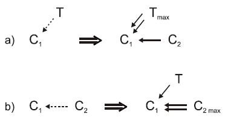

Tmax – Trường sử dụng ở chế độ cực đại, hiểu theo nghĩa, ở chế độ này thì chắc chắn đạt mục đích đề ra nhưng năng lượng thừa có thể ảnh hưởng xấu đến C1.

C2max – Chất sử dụng ở chế độ cực đại, hiểu theo nghĩa, ở chế độ này thì chắc chắn đạt được mục đích nhưng một số lượng chất C2 sẽ thừa ra, ảnh hưởng xấu đến C1.

 – Tác động thừa để bảo đảm chắc chắn đạt được mục đích.

**DIỄN GIẢI VÀ THÍ DỤ:**

Nếu rơi vào trường hợp “a”, chuẩn 1.1.6 khuyên bạn nên sử dụng Tmax để chắc chắn đạt được mục đích, còn năng lượng thừa sẽ được C2 (chất đưa thêm vào) hấp thụ. Do vậy, C1 không bị ảnh hưởng xấu và vẫn đạt các tiêu chuẩn đề ra đối với thành phẩm.

Thí dụ:

\- Người ta cần hàn kín đầu các ống thủy tinh đựng thuốc. Nếu nhiệt độ của mỏ đốt không lớn, thuốc chứa bên trong ống thủy tinh không bị ảnh hưởng nhưng đầu ống thủy tinh không được hàn kín. Nếu nhiệt độ của mỏ đốt lớn (Tmax), đầu các ống thủy tinh đựng thuốc chắc chắn được hàn kín nhưng chất lượng thuốc bị giảm do ảnh hưởng nhiệt năng của mỏ đốt. Hình dưới đây là giải pháp theo chuẩn 1.1.6.a, trong đó, nước là được đưa vào để hấp thu nhiệt năng thừa.

Nếu rơi vào trường hợp “b”, chuẩn 1.1.6 khuyên bạn cứ sử dụng C2max để chắc chắn đạt được mục đích, còn chất C2 thừa sẽ được T (trường mới đưa thêm vào) “thu dọn”. Do vậy, C1 không bị ảnh hưởng xấu và vẫn đạt được các tiêu chuẩn đề ra đối với thành phẩm.

Thí dụ:

\- Lát gạch sàn nhà, nếu giải đúng bài toán (cho xi măng vào đúng khe giữa các viên gạch) thì rất khó. Người ta đổ tràn xi măng ra nền (C2max), rồi gạt cho xi măng lọt vào các khe và lau sạch phần xi măng thừa còn bám trên mặt các viên gạch.

Bạn còn có thể tự tìm ra các thí dụ minh họa khác có trong mục _\@ref(sec:11:2:) Lời phát biểu, các thí dụ minh họa và một số nhận xét về các thủ thuật (nguyên tắc) sáng tạo cơ bản_ của quyển bốn.

**CHUẨN 1.1.7**

**NỘI DUNG:**

**Nếu cần bảo đảm chế độ tác động cực đại lên chất, mà điều đó, do nguyên nhân này hay khác, không được phép, thì tác động cực đại cần giữ nguyên nhưng hướng nó sang chất mới và lập mối liên kết chất mới với C1.**

**DIỄN GIẢI VÀ THÍ DỤ:**

Vepol tiền thân của chuẩn 1.1.7 cho thấy, chế độ tác động cực đại của trường (Tmax) lên sản phẩm (C1) cho kết quả cần đạt nhưng điều kiện bài toán không cho phép. Nguyên nhân không cho phép có thể rất đa dạng.

Cách giải quyết là, đưa thêm chất mới (C2). Chất mới (C2) cần thỏa mãn hai yêu cầu. Thứ nhất, C2 tiếp nhận được trường cực đại (Tmax), và thứ hai, C2 tác động lên C1 vẫn cho kết quả cần đạt, mà không vi phạm điều kiện bài toán như khi Tmax tác động trực tiếp lên C1. Vấn đề ở chỗ, cần chọn C2 và mối liên kết C2 với C1 thích hợp.

Thí dụ, các thiết bị điện gia đình (C1) không thể sử dụng điện năng trực tiếp từ các đường dây cao thế (Tmax). Người ta phải sáng chế ra các máy biến thế (C2) làm nhiệm vụ biến đổi điện năng ở điện thế cao Tmax thành dòng điện có hiệu điện thế tương hợp với các thiết bị điện gia dụng (tác động của C2 lên C1 là tốt).

Bạn còn có thể tự tìm ra các thí dụ minh họa khác có trong mục _\@ref(sec:11:2:) Lời phát biểu, các thí dụ minh họa và một số nhận xét về các thủ thuật (nguyên tắc) sáng tạo cơ bản_ của quyển bốn.

**CHUẨN 1.1.8**

**NỘI DUNG:**

**Nếu cần chế độ tác động lọc lựa của trường (hiểu theo nghĩa, cực đại trong những vùng nhất định mà vẫn bảo đảm cực tiểu ở những vùng khác của C1), thì có thể sử dụng trường ở chế độ cực đại, hoặc cực tiểu.**

**Trong trường hợp thứ nhất (Tmax), đưa chất bảo vệ vào những nơi, tại đó cần tác động cực tiểu.**

**Trong trường hợp thứ hai (Tmin), đưa chất tạo trường cục bộ vào những nơi, tại đó cần tác động cực đại (ví dụ: Các chất tạo nhiệt – hỗn hợp nhiệt nhôm; các hỗn hợp nổ đối với tác động cơ học…).**

**DIỄN GIẢI VÀ THÍ DỤ:**

Trong trường hợp “a”, C2 (chất bảo vệ) được hiểu là chất mới đưa thêm vào những vùng cần thiết của C1, có tác dụng làm giảm sự hấp thụ trường của những vùng đó xuống tối thiểu. Nói cách khác, tại những vùng có C2, C2 biến đổi Tmax thành Tmin. Đến đây, bạn có thể liên tưởng đến việc đi dưới trời nắng to, bạn phải đội mũ (nón), mang kính râm, nhiều chị em còn đeo cả găng tay.

Trong trường hợp “b”, C2 (chất khuếch đại) được hiểu là chất mới đưa vào những vùng cần thiết của C1, có tác dụng tạo thêm năng lượng sao cho năng lượng trong những vùng đó đạt giá trị đề ra. Lúc này, năng lượng trong những vùng có C2 là tổng năng lượng Tmin và năng lượng do C2 tạo ra. Chẳng hạn, vào mùa đông ở xứ lạnh, các nhà đều dùng lò sưởi (C2).

Thí dụ:

\- Các lõi làm từ polistirolen dùng để quấn các dây kim loại bọc chất cách điện có đường kính rất nhỏ. Lõi còn có chân làm bằng kim loại để hàn các dây dẫn vào. Việc hàn được tiến hành ở nhiệt độ 280°C đòi hỏi các dây trước đó phải được làm sạch lớp cách điện, tốn khá nhiều thời gian, công sức.

Nhằm tăng năng suất việc hàn, người ta nâng nhiệt độ hàn lên 380°C, vì ở nhiệt độ này lớp cách điện bốc cháy. Nhưng cũng chính ở nhiệt độ này các chân kim loại trở nên quá nóng và polistirolen trở nên mềm ra, làm các chân lung lay.

Cuối cùng, người ta giải quyết như sau: Các chân kim loại và dây dẫn được nhúng vào hỗn hợp phát nhiệt với nhiệt độ cháy 350÷400°C rồi tiến hành hàn như bình thường ở nhiệt độ 280°C: Lớp cách điện bùng cháy trong thời gian rất ngắn nên lõi không bị mềm ra.

Bạn còn có thể tự tìm ra các thí dụ minh họa khác có trong mục _\@ref(sec:11:2:) Lời phát biểu, các thí dụ minh họa và một số nhận xét về các thủ thuật (nguyên tắc) sáng tạo cơ bản_ của quyển bốn.

∗ ∗ ∗

#### _Nhóm 1.2: Phá vepol_

Phá vepol có nghĩa, vepol tiền thân là vepol xấu, cần phá nó để xây dựng vepol tốt. Trong nhóm 1.2 có các chuẩn dùng để phá vepol và khắc phục hoặc trung lập hóa các mối liên kết có hại trong vepol. Ý tưởng mạnh của nhóm chuẩn này là động viên các yếu tố cần thiết nhờ sử dụng các nguồn dự trữ chất – trường có sẵn trong hệ. Đặc biệt quan trọng là chuẩn 1.2.2, theo đó, chất có sẵn trong hệ được biến thể hóa để thực hiện các chức năng của chất mới.

**CHUẨN 1.2.1**

**NỘI DUNG:**

**Nếu giữa hai chất trong vepol nảy sinh các tác động liên hợp (có lợi và có hại), thêm nữa, không nhất thiết phải giữ cho hai chất tiếp xúc trực tiếp với nhau, thì bài toán giải bằng cách đưa chất thứ ba (không mất tiền hoặc đủ rẻ) từ bên ngoài vào giữa hai chất.**

**DIỄN GIẢI VÀ THÍ DỤ:**

Như vậy, chất thứ ba (C3) đưa vào giữa công cụ (C2) và sản phẩm (C1) phải đồng thời thỏa mãn ba yêu cầu: Đủ rẻ; khắc phục hoặc làm trung hòa tương tác có hại giữa C2 và C1; bảo toàn tương tác có lợi giữa C2 và C1.

Thí dụ:

\- Để nén chặt thành giếng khoan, người ta sử dụng phương pháp nổ khí tạo lực ép. Tuy nhiên, ngoài việc đem lại ích lợi là tạo các lực nén lớn còn gây ra các vết nứt trên thành giếng khoan. Người ta giải quyết bằng cách “bọc” mìn bằng một loại đất khô chậm. Áp suất vẫn được truyền tốt mà không có vết nứt.

\- Một thí dụ gần gũi là lưỡi dao tiện (C2) tiện một chi tiết nào đó (C1). Ở đây có tác động liên hợp: Lưỡi dao tiện bóc lớp vật liệu của chi tiết (tác động có lợi), nhưng cũng chính vì vậy mà nhiệt độ tại chỗ tiếp xúc giữa C2 và C1 tăng cao, làm ảnh hưởng đến chất lượng của C2 và C1 (tác động có hại). Người ta giải quyết bằng cách đưa dung dịch làm nguội vào giữa C2 và C1.

Bạn còn có thể tự tìm ra các thí dụ minh họa khác có trong mục _\@ref(sec:11:2:) Lời phát biểu, các thí dụ minh họa và một số nhận xét về các thủ thuật (nguyên tắc) sáng tạo cơ bản_ của quyển bốn.

**CHUẨN 1.2.2**

**NỘI DUNG:**

**Nếu giữa hai chất trong vepol nảy sinh các tác động liên hợp (có lợi và có hại), thêm nữa, không nhất thiết phải đảm bảo sự tiếp xúc trực tiếp giữa hai chất, mà việc đưa chất mới vào bị cấm hoặc không có lợi, thì bài toán giải bằng cách đưa thêm chất thứ ba (C3) là biến thể của hai chất vào giữa hai chất (xem thêm công thức vepol của chuẩn 1.2.1).**

**Chất C3 có thể đưa vào hệ từ bên ngoài dưới dạng “làm sẵn” hoặc nhận được nhờ tác dụng của T1 hoặc T2 từ hai chất (C1,C2) đã có. Trong trường hợp riêng. C3 có thể là “chân không”, các bọt, vật liệu bọt.**

**DIỄN GIẢI VÀ THÍ DỤ:**

Chất C3 là biến thể của C1 hoặc/và C2. Ngoài ra, trong các bài toán cụ thể, bản thân các chất C1, C2 có thể có các trường T1, T1 của mình, chẳng hạn, C1 có trọng lượng (trường hấp dẫn) đáng kể, C2 là nam châm nên có từ trường. Cần tận dụng các trường này để làm biến thể C1, C2.

Ngoài ra, chuẩn 1.2.2 còn chỉ ra trường hợp đặc biệt: Sử dụng “chân không”, các bọt, vật liệu bọt như là chất C3.

Thí dụ:

\- Các chất bán dẫn Si sử dụng nhiều trong điện tử học hiện đại. Nhu cầu về chúng rất lớn. Các kỹ sư công ty “Pierre Boll” (Thụy Sĩ) chế tạo loại máy công cụ có chương trình điều khiển tự động để mài và đánh bóng các tấm Si đường kính 15 mm. Máy có năng suất 50 tấm/giờ. Điểm đặc biệt của máy này là không sử dụng bột mài thông thường như bụi kim cương và corindon (Al2O3). Người ta dùng ngay bột mài làm từ chính Si. Vật liệu đồng nhất ít làm hỏng cấu trúc của các phôi Si và bề mặt tấm Si trở nên đồng đều hơn.

\- Việc ngăn ngừa sự xói mòn xâm thực những chi tiết thủy động, ví dụ các cánh ngầm, được thực hiện bằng cách phủ lên bề mặt các chi tiết lớp bảo vệ.

Nhằm mục đích nâng cao hiệu quả bảo vệ và giảm sức cản thủy động đối với các chi tiết, lớp bảo vệ là lớp băng phủ trên bề mặt chi tiết, được tạo ra liên tục bằng cách làm lạnh chi tiết.

\- Bùn được vận chuyển trong ống, theo thời gian, bào mòn ống. Để khắc phục, người ta làm lạnh ống từ bên ngoài, sao cho tạo được lớp bùn đóng băng trên bề mặt thành trong của ống.

Bạn còn có thể tự tìm ra các thí dụ minh họa khác có trong mục _\@ref(sec:11:2:) Lời phát biểu, các thí dụ minh họa và một số nhận xét về các thủ thuật (nguyên tắc) sáng tạo cơ bản_ của quyển bốn.

**CHUẨN 1.2.3**

**NỘI DUNG:**

**Nếu cần khắc phục tác động có hại của trường lên chất, bài toán có thể giải được bằng cách đưa vào chất thứ hai, thu hút tác động có hại của trường về phía mình.**

**DIỄN GIẢI VÀ THÍ DỤ:**

Thí dụ:

\- Mẩu thuốc lá hút dở, vứt một cách cẩu thả, có thể gây nên đám cháy lớn. Nhà sáng chế Đan Mạch K. Ensen đưa ra loại thuốc lá có kết cấu đặc biệt: Ông đặt một ống nhỏ bằng nhựa, đựng nước gần phần đầu lọc của điếu thuốc. Ống có đầu nhọn và mỏng, hướng về phía đốt thuốc. Khi thuốc cháy đến đầu ống, nước thoát ra ngoài và dập tắt điếu thuốc. Ống đựng nước có thể đặt gần phía đầu đốt thuốc hơn để ngăn người hút, không cho hút hết điếu thuốc, nơi tập trung nhiều nicôtin, có hại cho sức khỏe. Tác giả đăng ký nhận patent ở 37 quốc gia.

Bạn còn có thể tự tìm ra các thí dụ minh họa khác có trong mục _\@ref(sec:11:2:) Lời phát biểu, các thí dụ minh họa và một số nhận xét về các thủ thuật (nguyên tắc) sáng tạo cơ bản_ của quyển bốn.

**CHUẨN 1.2.4**

**NỘI DUNG:**

**Nếu như giữa hai chất trong vepol nảy sinh tác động liên hợp (có lợi và có hại), thêm nữa, khác với các chuẩn 1.2.1 và 1.2.2, cần phải bảo đảm sự tiếp xúc trực tiếp giữa các chất, bài toán giải bằng cách chuyển sang vepol kép, ở đó T1 đóng vai trò tác động có lợi, còn T2 sẽ làm trung hòa tác động có hại hoặc biến tác động có hại thành tác động có lợi thứ hai.**

**DIỄN GIẢI VÀ THÍ DỤ:**

Trường mới đưa thêm vào (T2) có thể tác động lên C2, C1 hoặc cùng lúc cả hai như hình vẽ minh họa chuẩn 1.2.4.

Thí dụ:

\- Nếu buồng của hành khách trên tàu thủy đặt gần khoang máy, hành khách rất khó chịu vì tiếng ồn và độ rung động lớn. Các thành viên của “Hội các kỹ sư đóng tàu Ba Lan” đề nghị giải pháp khắc phục vấn đề này: Ở gần những nguồn gây rung động (các động cơ tàu), người ta đặt thêm những nguồn phát dao động phụ, trùng về tần số nhưng ngược về pha. Máy tự động theo dõi chính xác các thông số làm việc của các động cơ diesel để sự rung động hầu như bị dập tắt hoàn toàn.

Bạn còn có thể tự tìm ra các thí dụ minh họa khác có trong mục _\@ref(sec:11:2:) Lời phát biểu, các thí dụ minh họa và một số nhận xét về các thủ thuật (nguyên tắc) sáng tạo cơ bản_ của quyển bốn.

**CHUẨN 1.2.5**

**NỘI DUNG:**

**Nếu cần phá vepol có từ trường, bài toán có thể giải được nhờ sử dụng các hiệu ứng vật lý khắc phục các tính chất sắt từ của các chất. Ví dụ: Sự khử từ do va đập hoặc nâng nhiệt độ cao hơn điểm Curie.**

**DIỄN GIẢI VÀ THÍ DỤ:**

Trong các loại trường, từ trường là loại trường khá đặc biệt và trong hệ thống các chuẩn có hẳn một số chuẩn liên quan trực tiếp đến từ trường. Chuẩn 1.2.5 là một trong những chuẩn như vậy. Các vepol từ được trình bày tập trung trong nhóm 2.4 và nhóm 4.4.

Thí dụ:

\- Phương pháp hàn tiếp xúc các bột chất sắt từ, ở đó, bột chất sắt từ được đốt nóng đến điểm Curie trước khi chuyển vào vùng hàn. Điều này giúp khắc phục lực đẩy của từ trường tạo bởi dòng điện hàn lên các hạt bột sắt từ.

\- Một trong những cách mài mặt trong chi tiết là sử dụng các hạt sắt từ chà xát lên bề mặt nhờ từ trường quay.

Nhằm tăng năng suất xử lý các chi tiết làm từ vật liệu sắt từ, các chi tiết này được đốt nóng đến nhiệt độ bằng hoặc cao hơn điểm Curie.

Bạn còn có thể tự tìm ra các thí dụ minh họa khác có trong mục _\@ref(sec:11:2:) Lời phát biểu, các thí dụ minh họa và một số nhận xét về các thủ thuật (nguyên tắc) sáng tạo cơ bản_ của quyển bốn.

∗ ∗ ∗

### Loại 2: Sự phát triển của các hệ vepol {#subsec:15:3:2:}
#### _Nhóm 2.1: Phép chuyển sang các vepol phức tạp_

Các chuẩn loại 2 dùng để phát triển các hệ vepol, hiểu theo nghĩa, các hệ vepol hiện nay hoạt động tốt nhưng người ta muốn tốt hơn nữa.

Có thể làm tăng hiệu quả của các vepol, trước hết, bằng việc chuyển các vepol đơn sang các vepol phức tạp (vepol chuỗi, vepol kép). Sự phức tạp hóa ở đây phải tương đối không lớn, thêm nữa, phép chuyển này phải bảo đảm xuất hiện các phẩm chất mới và tăng cường các phẩm chất đã có, trước hết, là tính điều khiển của hệ.

**CHUẨN 2.1.1**

**NỘI DUNG:**

**Nếu cần làm tăng hiệu quả của hệ vepol, bài toán giải bằng cách biến một trong các phần của vepol thành vepol điều khiển độc lập và dựng vepol chuỗi.**

**Vepol chuỗi còn có thể được tạo thành khi khai triển các mối liên kết có trong vepol. Trong trường hợp này, mối liên kết T2-C3 được cấy vào (trong hoặc ngoài) mắt xích C1-C2.**

**DIỄN GIẢI VÀ THÍ DỤ:**

Trường hợp “a” là trường hợp thay thế C2 bằng một vepol độc lập mới có ưu điểm hơn C2. Nói cách khác, vepol độc lập mới đóng vai trò của C2 chứ không phải chính C2 và hoạt động tốt hơn C2.

Thí dụ:

Thí dụ này chỉ là một trong vô vàn thí dụ của khuynh hướng phát triển trong kỹ thuật: Chuyển từ lao động thủ công sang lao động bằng máy móc (xem _Hình 351: Quá trình hình thành và phát triển của các hệ kỹ thuật_ trong mục nhỏ _\@ref(subsec:14:2:1:) Quy luật về tính tự lập của hệ thống (quy luật về tính đầy đủ các thành phần của hệ)_ của quyển bảy).

Các trường hợp “b” có thể coi là các trường hợp riêng của “a” khi C2 của vepol tiền thân vẫn được giữ nguyên và người ta đưa thêm vào hai yếu tố trường (T2) và chất (C3).

Thí dụ:

-

\- Thiết bị dùng để chêm gồm có cái chêm, miếng đệm với phần tử làm nóng.

Nhằm mục đích tháo chêm một cách dễ dàng, miếng đệm được làm từ hai phần, một phần trong đó là vật liệu dễ nóng chảy.

\- Thiết bị dùng để truyền chuyển động từ trục này sang trục khác gồm rotor trong và rotor ngoài, được bao bằng nam châm điện. Khe giữa hai rotor được lấp đầy bằng chất lỏng từ, chất lỏng từ trở nên đông cứng dưới tác động của từ trường.

Nếu như không bật nam châm điện, các rotor quay độc lập. Khi bật nam châm điện, chất lỏng từ đông cứng và giữ chặt hai rotor với nhau, việc truyền chuyển động từ rotor này sang rotor khác được thực hiện.

Bạn còn có thể tự tìm ra các thí dụ minh họa khác có trong mục _\@ref(sec:11:2:) Lời phát biểu, các thí dụ minh họa và một số nhận xét về các thủ thuật (nguyên tắc) sáng tạo cơ bản_ của quyển bốn.

**CHUẨN 2.1.2**

**NỘI DUNG:**

**Nếu như vepol cho trước khó điều khiển và cần phải tăng hiệu quả vepol, thêm nữa, không được phép thay các yếu tố vepol, bài toán giải bằng cách dựng vepol kép nhờ đưa trường thứ hai dễ điều khiển hơn vào hệ.**

**DIỄN GIẢI VÀ THÍ DỤ:**

Thí dụ:

\- Trong công việc sơn xì, người ta phun những hạt sơn nhỏ dạng sương vào vật cần sơn và có được lớp sơn mịn. Để tăng hiệu quả bám của các hạt sơn lên vật cần sơn, các hạt sơn và vật cần sơn được cho tích điện trái dấu (sơn tĩnh điện). Sơ đồ vepol có dạng sau:

Bạn còn có thể tự tìm ra các thí dụ minh họa khác có trong mục _\@ref(sec:11:2:) Lời phát biểu, các thí dụ minh họa và một số nhận xét về các thủ thuật (nguyên tắc) sáng tạo cơ bản_ của quyển bốn.

∗ ∗ ∗

#### _Nhóm 2.2: Tăng cường các vepol_

Ý tưởng chung của 6 chuẩn thuộc nhóm này thể hiện ở việc tăng tính hiệu quả của các vepol (đơn giản và phức tạp) mà không đưa các chất, trường mới vào hệ. Điều này đạt được bằng tăng cường sử dụng các chất, trường dễ kiếm.

**CHUẨN 2.2.1**

**NỘI DUNG:**

**Nếu như cho trước một hệ vepol, hiệu quả của nó có thể được tăng lên bằng cách thay trường không điều khiển được (hoặc khó điều khiển) bằng trường điều khiển được (hoặc điều khiển tốt), ví dụ: Thay trường hấp dẫn bằng trường cơ học, trường cơ học bằng điện trường…**

**DIỄN GIẢI VÀ THÍ DỤ:**

Thí dụ:

\- Nhà máy sản xuất giày ở Somerset (Anh) tận dụng các mảnh da vụn, trộn với keo, ép làm đế giày. Vấn đề tiếp theo nảy sinh là phải sấy khô chúng. Cách sấy thông thường chỉ làm khô lớp bề mặt, nếu tăng thời gian sấy, vật liệu bị hỏng. Các kỹ sư của công ty đưa ra phương pháp sấy mới: Dùng sóng điện từ cao tần kết hợp với thổi không khí nóng (90°C). Dưới tác dụng của bức xạ điện từ, các phân tử nước thoát theo các lỗ trên bề mặt vật liệu, tại đó bị bốc bay nhờ dòng không khí nóng. Vật liệu được sấy khô nhanh và đồng đều về thể tích. Xử lý theo cách mới không chỉ tiết kiệm thời gian mà cả điện năng một cách đáng kể.

Ở thí dụ trên, trường nhiệt thông thường được thay thế bằng trường điện từ tần số cao.

\- Phương pháp làm sạch chất điện phân trong quá trình xử lý điện cơ được xây dựng dựa trên việc tách (cơ học) các sản phẩm hòa tan anôt.

Nhằm mục đích nâng cao chất lượng làm sạch, chất điện phân được cho qua trường tĩnh điện trước khi đi vào khe làm việc.

Bạn còn có thể tự tìm ra các thí dụ minh họa khác có trong mục _\@ref(sec:11:2:) Lời phát biểu, các thí dụ minh họa và một số nhận xét về các thủ thuật (nguyên tắc) sáng tạo cơ bản_ của quyển bốn.

**CHUẨN 2.2.2**

**NỘI DUNG:**

**Nếu như cho trước một hệ vepol, hiệu quả của nó có thể được tăng lên bằng cách tăng mức độ phân nhỏ chất, đóng vai trò công cụ trong vepol.**

**DIỄN GIẢI VÀ THÍ DỤ:**

Thí dụ:

\- Dùng vòi nước nguyên dòng có thể làm hỏng lá các loại rau hoặc các cây non. Người ta phân dòng nước thành những tia nhỏ: Tưới bằng vòi hoa sen. Về sau này, người ta còn cải tiến tiếp: Các tia nước nhỏ không hoạt động ở chế độ liên tục mà ở chế độ xung. Lúc này có thể coi tia nước nhỏ bị phân thành những giọt nước như những hạt mưa trong tự nhiên.

\- Khi cần bơm liên tiếp các chất lỏng khác nhau trên cùng một đường ống, người ta phải sử dụng các bộ phân cách dạng cầu hoặc dạng pittông. Các bộ phân cách này làm việc không tốt, chúng nhanh chóng bị mòn, bị mắc kẹt…

Để khắc phục, người ta đề nghị đưa vào vùng tiếp xúc giữa các chất lỏng khác nhau bộ phân cách làm từ các hạt đặc biệt có kích thước 0,3÷0,5 mm, tỷ trọng bằng tỷ trọng trung bình của các chất lỏng.

Bạn còn có thể tự tìm ra các thí dụ minh họa khác có trong mục _\@ref(sec:11:2:) Lời phát biểu, các thí dụ minh họa và một số nhận xét về các thủ thuật (nguyên tắc) sáng tạo cơ bản_ của quyển bốn.

**CHUẨN 2.2.3**

**NỘI DUNG:**

**Trường hợp đặc biệt của phân nhỏ chất là sự chuyển từ chất đông đặc sang chất mao quản-nhiều lỗ. Phép chuyển này được thực hiện theo đường sau: “chất đông đặc → chất đông đặc có khoang trống → chất mao quản-nhiều lỗ → chất mao quản-nhiều lỗ có cấu trúc và kích thước nhất định”**

**Theo tiến trình của đường phát triển nói trên, khả năng đưa chất lỏng vào các mao quản-lỗ trống và sử dụng các hiệu ứng vật lý sẽ tăng thêm.**

**DIỄN GIẢI VÀ THÍ DỤ:**

Theo chuẩn 2.2.3, ở đâu bạn thấy công cụ C2 hiện nay được làm từ vật liệu đông đặc, bạn hãy xem xét khả năng đưa nó đi theo con đường phát triển thành vật liệu mao quản-nhiều lỗ để nó hoạt động có hiệu quả hơn. Vật liệu mao quản-nhiều lỗ có thể là vật liệu mới chứ không nhất thiết phải là vật liệu đông đặc ban đầu làm dưới dạng mao quản-nhiều lỗ.

Thí dụ:

\- Mỏ hàn nhiệt truyền thống được làm từ khối kim loại đặc, thích hợp khi hàn các chi tiết lại với nhau. Nhưng khi dùng mỏ hàn đó để tháo những chi tiết đã hàn, chất hàn tuy bị nóng chảy nhưng vẫn bám vào chỗ hàn mà khi đưa mỏ hàn ra xa để gỡ thì chất hàn lại đông đặc lại.

Để khắc phục nhược điểm trên, người ta chế tạo mỏ hàn làm từ vật liệu mao quản nhiều lỗ có tác dụng hút chất hàn nóng chảy ra khỏi chỗ hàn. Công việc tháo những chi tiết đã hàn trở nên nhẹ nhàng, thuận tiện hơn.

\- Các chắn lửa gồm thân với những hạt nhỏ được sắp xếp trên các khung.

Nhằm mục đích làm tăng hiệu quả chắn lửa, các hạt nhỏ được làm từ vật liệu dễ nóng chảy, dưới dạng rỗng và chứa bên trong chất dập lửa.

Bạn còn có thể tự tìm ra các thí dụ minh họa khác có trong mục _\@ref(sec:11:2:) Lời phát biểu, các thí dụ minh họa và một số nhận xét về các thủ thuật (nguyên tắc) sáng tạo cơ bản_ của quyển bốn.

**CHUẨN 2.2.4**

**NỘI DUNG:**

**Nếu như cho trước hệ vepol, hiệu quả của nó có thể tăng lên bằng cách tăng mức độ linh động, tức là, chuyển sang cấu trúc hệ thống mềm dẻo, thay đổi nhanh hơn.**

**DIỄN GIẢI VÀ THÍ DỤ:**

Quá trình làm linh động công cụ (C2) thường được bắt đầu bằng việc phân C2 thành hai phần có khớp nối với nhau và tiếp theo, phát triển theo đường sau: Một khớp → nhiều khớp → công cụ (C2) trở nên mềm dẻo.

Quá trình làm linh động trường (T), trong trường hợp đơn giản nhất, được thực hiện bằng việc chuyển từ tác động cố định của trường (hoặc là T cùng với C2) sang chế độ tác động xung.

Thí dụ:

\- Nhằm mục đích làm tăng chất lượng dung dịch dùng để trám (trét), tác động của từ trường lên dung dịch trét được sử dụng ở chế độ xung, thay vì chế độ tác động liên tục.

Bạn đọc có thể tìm thí dụ về các vepol linh động trong các mục nhỏ _\@ref(subsec:11:2:15:) Nguyên tắc linh động_, _\@ref(subsec:11:2:23:) Nguyên tắc quan hệ phản hồi_, _\@ref(subsec:11:2:29:) Sử dụng các kết cấu khí và lỏng_ của quyển bốn.

**CHUẨN 2.2.5**

**NỘI DUNG:**

**Nếu như cho trước vepol, hiệu quả của nó có thể được tăng lên bằng cách chuyển các trường đồng nhất hoặc không có cấu trúc trật tự nhất định sang các trường không đồng nhất hoặc có cấu trúc không gian nhất định (cố định hoặc thay đổi):**

**Nếu như phải tạo cho chất có trong vepol (hoặc đưa vào vepol) có cấu trúc không gian nhất định thì cần thực hiện quá trình trong trường có cấu trúc tương ứng với cấu trúc đòi hỏi của chất:**

**DIỄN GIẢI VÀ THÍ DỤ:**

Chuẩn 2.2.5.a thường dùng cho các trường hợp, ở đó C1, C2 đã có sẵn cấu trúc nhất định nhưng T vẫn là trường đồng nhất. Việc chuyển T thành T# với cấu trúc không-thời gian phù hợp với C1, C2 sẽ làm tăng hiệu quả hoạt động của vepol.

Chuẩn 2.2.5.b thường dùng cho các trường hợp muốn tạo ra những chất C1 với cấu trúc nhất định.

Thí dụ:

\- Tại các nhà máy thuộc tổ hợp công nghiệp “Erikson” (Thụy Điển), người ta thực hiện cuộc thử nghiệm liên quan đến việc tổ chức lại cách chiếu sáng. Kết quả, độ chiếu sáng chung giảm đi hai lần nhưng độ chiếu sáng tại nơi làm việc lại tăng lên đáng kể, tiết kiệm được 55% năng lượng điện và năng suất đứng máy của công nhân tăng thêm 20%. Các chuyên gia giải thích kết quả đạt được bằng các nguyên nhân tâm lý: Tăng cảm giác tiện nghi đối với người làm việc.

\- Để tạo ra hiệu ứng nghệ thuật, thẩm mỹ đối với sân khấu, tượng đài hay những công trình kiến trúc, các phần khác nhau của đối tượng được chiếu sáng bằng những ánh sáng khác nhau về màu sắc, cường độ, chế độ chiếu sáng.

\- Nhằm mục đích tăng năng suất và hiệu quả công việc pha trộn, các hạt bột được tích điện trái dấu, lớp bột này được đặt lên lớp bột kia. Sau đó, người ta cho chúng di chuyển trong điện trường không đồng đều.

\- Phương pháp chế tạo các sản phẩm ferit với mạch từ phức tạp bao gồm việc nén thành các bản ferit, nung và tạo những vùng không làm việc.

Nhằm mục đích tăng độ bền cơ học của các sản phẩm ferit, việc tạo ra các vùng không làm việc được thực hiện bằng sự đốt nóng cục bộ đến khi vùng đó mất các tính chất từ.

Bạn còn có thể tự tìm ra các thí dụ minh họa khác có trong mục _\@ref(sec:11:2:) Lời phát biểu, các thí dụ minh họa và một số nhận xét về các thủ thuật (nguyên tắc) sáng tạo cơ bản_ của quyển bốn.

**CHUẨN 2.2.6**

**NỘI DUNG:**

**Nếu như cho trước hệ vepol, hiệu quả của nó có thể được tăng lên bằng việc chuyển từ những chất đồng nhất hoặc là những chất không có cấu trúc trật tự sang những chất không đồng nhất hoặc là có cấu trúc không gian nhất định (cố định hoặc thay đổi).**

**DIỄN GIẢI VÀ THÍ DỤ:**

Nếu như chuẩn 2.2.5 phát triển vepol bằng cách thay đổi cấu trúc của trường thì chuẩn 2.2.6 tập trung vào thay đổi cấu trúc của chất.

Thí dụ:

\- Một số công ty, tuy làm được những sáng chế quan trọng nhưng không đăng ký nhận patent. Họ cho rằng giữ bí mật công nghệ để độc quyền sản xuất có lợi hơn. Ví dụ, Công ty “Portland-Cement” (Đan Mạch) đưa ra bán loại bánh xe răng cưa kích thước lớn, hầu như làm toàn bằng bêtông, chỉ lớp trên cùng của bánh răng làm bằng kim loại. Bánh răng bêtông nhẹ, có tuổi thọ cao hơn bánh răng kim loại, chịu ăn mòn tốt hơn.

\- Để tạo các lỗ định hướng trong các vật liệu chịu lửa xốp, người ta sử dụng các sợi chỉ tơ. Các sợi chỉ tơ này bốc cháy khi bị đốt nóng và để lại các lỗ cần thiết.

Bạn còn có thể tự tìm ra các thí dụ minh họa khác có trong mục _\@ref(sec:11:2:) Lời phát biểu, các thí dụ minh họa và một số nhận xét về các thủ thuật (nguyên tắc) sáng tạo cơ bản_ của quyển bốn.

∗ ∗ ∗

#### _Nhóm 2.3: Tăng cường sự tương hợp về nhịp điệu_

Các chuẩn thuộc nhóm 2.3 phát triển vepol bằng những cách tiết kiệm: Thay vì đưa vào hoặc làm thay đổi một cách cơ bản các chất và trường, các chuẩn nhóm 2.3 thay đổi chúng về tần số, kích thước, khối lượng. Do đó, hệ vepol đạt được hiệu quả mới, đáng kể khi hệ thay đổi ít nhất.

**CHUẨN 2.3.1**

**NỘI DUNG:**

**Trong các hệ vepol, tác động của trường cần phải tương hợp về tần số (hoặc làm phi tương hợp một cách chủ định) với tần số riêng của sản phẩm (hoặc công cụ).**

**DIỄN GIẢI VÀ THÍ DỤ:**

Chúng ta biết rằng, trong dao động, khi tần số của tác động cưỡng bức T bằng tần số riêng của vật dao động C1 (vT= v) thì xảy ra hiện tượng cộng hưởng: Biên độ dao động của C1 tăng vọt.

Hiện tượng cộng hưởng, tùy theo mục đích cần đạt, có thể có lợi hoặc có hại.

Nếu có lợi, chuẩn 2.3.1 đề nghị phải làm tác động của trường tương hợp về tần số với tần số riêng của sản phẩm, tức là vT= v (hoặc tần số vT bằng số nguyên lần ). Hình vẽ của chuẩn 2.3.1 có dạng cụ thể là:

Thí dụ:

\- Để tăng năng suất khai thác than, người ta điều chỉnh tần số hoạt động của mũi khoan bằng tần số riêng của vỉa than cần phá vỡ.

Nếu hiện tượng cộng hưởng có hại, cần tạo sự phi tương hợp về tần số giữa tác động của trường và sản phẩm, tức là phải làm cho vT≠ v. Lúc này, chuẩn 2.3.1 có thể biểu diễn như sau:

Những gì nói ở trên ứng với sản phẩm cũng đúng với công cụ và các hình vẽ của chuẩn có dạng:

Bạn còn có thể tự tìm ra các thí dụ minh họa khác có trong mục _\@ref(sec:11:2:) Lời phát biểu, các thí dụ minh họa và một số nhận xét về các thủ thuật (nguyên tắc) sáng tạo cơ bản_ của quyển bốn.

**CHUẨN 2.3.2**

**NỘI DUNG:**

**Trong các hệ vepol phức tạp, các tần số của các trường sử dụng phải tương hợp (hoặc là phải phi tương hợp một cách chủ định).**

**DIỄN GIẢI VÀ THÍ DỤ:**

Bạn đọc hãy xem lại phần **DIỄN GIẢI** của chuẩn 2.3.1 ở trên.

Thí dụ:

\- Phương pháp làm giàu các hạt quặng nghiền nhỏ có từ tính gồm tác động sóng chạy từ trường và tác động rung lên quặng, được cải tiến ở chỗ: Sóng chạy từ trường có tần số đồng bộ với tần số rung. Nhờ vậy, hiệu quả quá trình tuyển quặng được nâng cao một cách đáng kể.

Bạn còn có thể tự tìm ra các thí dụ minh họa khác có trong mục _\@ref(sec:11:2:) Lời phát biểu, các thí dụ minh họa và một số nhận xét về các thủ thuật (nguyên tắc) sáng tạo cơ bản_ của quyển bốn.

**CHUẨN 2.3.3**

**NỘI DUNG:**

**Nếu như hai tác động, ví dụ thay đổi và đo, không thể xảy ra đồng thời, một tác động cần được thực hiện trong khoảng nghỉ của tác động kia.**

Chú ý: Khoảng nghỉ của một tác động phải được lấp đầy bởi một tác động có ích khác

**DIỄN GIẢI VÀ THÍ DỤ:**

Nếu hai tác động là thay đổi và đo không thể xảy ra đồng thời trên cùng sản phẩm (C1), trong đó T1 là trường thay đổi, T2 là trường đầu ra của vepol đo, thì bạn cần phải chuyển T1, T2 sang chế độ xung, sao cho khoảng nghỉ của T1 lại là lúc T2 tác động đem lại ích lợi và ngược lại (xem hình vẽ dưới đây).

Thí dụ:

\- Phương pháp điều khiển tự động chu trình nhiệt của công việc hàn tiếp xúc điểm (chủ yếu dùng cho các chi tiết có độ dầy nhỏ) dựa trên việc đo suất nhiệt điện động. Nhằm mục đích nâng cao độ chính xác của quá trình điều khiển trong khi hàn, người ta đo suất nhiệt điện động bằng các xung có tần số cao hơn vào khoảng nghỉ giữa các xung của dòng điện hàn.

Tinh thần của chuẩn 2.3.3 áp dụng cho cả những trường hợp không chỉ gồm vepol thay đổi và vepol đo mà cho hai tác động nói chung không thể xảy ra đồng thời, ví dụ, cả hai tác động đều là thay đổi. Lúc này, hình vẽ của chuẩn 2.3.3 có dạng:

Thí dụ:

\- Phương pháp xử lý điện hóa các chi tiết bằng dòng xung điện làm việc, kết hợp với làm nóng các chi tiết này bằng hiện tượng cảm ứng, được cải tiến ở chỗ: Người ta đốt nóng các chi tiết bằng hiện tượng cảm ứng vào khoảng nghỉ giữa các xung của dòng điện làm việc. Nhờ vậy, năng suất xử lý các chi tiết tăng một cách đáng kể.

Bạn còn có thể tự tìm ra các thí dụ minh họa khác có trong mục _\@ref(sec:11:2:) Lời phát biểu, các thí dụ minh họa và một số nhận xét về các thủ thuật (nguyên tắc) sáng tạo cơ bản_ của quyển bốn.

∗ ∗ ∗

#### _Nhóm 2.4: Fepol (vepol phức hợp – tăng cường)_

Trong thực tế có những trường hợp, ở đó sự tăng cường vepol có thể thực hiện ngay bằng những đường phát triển chuẩn khác nhau. Ví dụ, những fepol (tức là những vepol có các hạt nhỏ chất sắt từ và từ trường) có khả năng tăng cường lớn. Điều này có nghĩa, khi có điều kiện, bạn nên chuyển từ vepol sang fepol.

**CHUẨN 2.4.1**

**NỘI DUNG:**

**Nếu như cho trước hệ vepol, hiệu quả của nó có thể được tăng lên bằng cách sử dụng các chất sắt từ và từ trường.**

**DIỄN GIẢI VÀ THÍ DỤ:**

1) Chuẩn này nói về việc sử dụng chất sắt từ chưa ở dạng phân nhỏ. Có thể gọi đây là “tiền fepol”, bán fepol”. Chúng là các cấu trúc dần dẫn đến fepol.

2) Chuẩn này không chỉ sử dụng đối với các vepol đơn mà còn đối với các vepol phức hợp và cả những vepol có chứa môi trường bên ngoài.

“Fe” là hai chữ cái đầu của từ “chất sắt từ” (ферромагнетик – tiếng Nga hoặc ferromagnet – tiếng Anh). Các chất sắt từ là các kim loại thuộc nhóm chuyển tiếp như Fe, Co, Ni. “Fepol” là tên gọi chỉ riêng cho loại vepol có trường là từ trường và chất là chất sắt từ.

Chất sắt từ C2s.t có thể là C2 của vepol tiền thân kết hợp trong hoặc ngoài với chất sắt từ (còn chưa được phân nhỏ) biến vepol đơn ban đầu thành vepol phức hợp. Điều này không chỉ dùng cho vepol tiền thân là vepol đơn mà còn dùng cho các vepol tiền thân là các vepol phức hợp và cả những vepol có chứa môi trường bên ngoài.

Từ trường có thể được tạo bởi các chất sắt từ đã được từ hóa (các nam châm vĩnh cửu) hoặc các từ trường được tạo ra một cách chủ định, sử dụng hiện tượng cảm ứng điện từ nhờ nam châm điện các loại.

Thí dụ:

\- Để giữ máy khoan khỏi rơi khi phải khoan các tấm thép thẳng đứng, người ta sử dụng lực hút từ trường. Các ống dây dùng làm nam châm điện tiêu thụ công suất 90 W từ lưới điện, có cùng điện thế như máy khoan. Trường hợp mất điện đột ngột, máy khoan vẫn còn bám chặt vào tấm thép được thêm vài phút nữa. Thiết bị này tiện lợi khi phải xử lý vỏ tàu, các ống có đường kính lớn, các kết cấu thép của nhà xưởng, các bồn chứa chất lỏng, do vậy, công việc của người công nhân trở nên đỡ vất vả hơn. Nhà máy “Buks” của Hà Lan sản xuất loại thiết bị này.

\- Trong các đồ vật, thiết bị dùng trong đời sống hàng ngày, ở nơi có hai chi tiết trước đây được gắn với nhau bằng móc, chốt, keo, đinh, ghim… dần được thay thế bằng chất sắt từ và từ trường (nam châm vĩnh cửu).

Bạn còn có thể tự tìm ra các thí dụ minh họa khác có trong mục _\@ref(sec:11:2:) Lời phát biểu, các thí dụ minh họa và một số nhận xét về các thủ thuật (nguyên tắc) sáng tạo cơ bản_ của quyển bốn.

**CHUẨN 2.4.2**

**NỘI DUNG:**

**Để làm tăng hiệu quả điều khiển hệ thống, cần thiết chuyển từ vepol hay “tiền fepol” sang fepol bằng cách thay một chất bằng các hạt sắt từ (hoặc là cho thêm các hạt sắt từ dưới dạng: Phoi, mạt sắt, các hạt, bột…) và sử dụng từ trường hay điện từ trường.**

**Hiệu quả điều khiển tăng lên cùng với sự tăng mức độ phân nhỏ các hạt sắt từ, do đó, sự phát triển fepol diễn ra theo đường sau: “Hạt → bột �→ các hạt sắt từ cực nhỏ”. Hiệu quả đồng thời được tăng lên cùng với việc tăng mức độ phân nhỏ chất, tại đó các hạt sắt từ được đưa vào. Ở đây, sự phát triển diễn ra theo đường: “Chất rắn �→ hạt → bột → chất lỏng”.**

**DIỄN GIẢI VÀ THÍ DỤ:**

Có thể coi việc chuyển sang fepol như là việc sử dụng cùng một lúc hai chuẩn: 2.2.1 hoặc 2.4.1 (đưa chất sắt từ và từ trường vào hệ) và 2.2.2 (phân nhỏ chất).

Khi biến thành fepol, hệ fepol lặp lại chu trình phát triển vepol nhưng ở mức mới, bởi vì fepol có ưu điểm nổi bật về tính điều khiển và hiệu quả cao. Điều này có nghĩa, tất cả các chuẩn thuộc nhóm 2.4 có thể coi là “đồng vị” của các chuẩn thường (các nhóm 2.1 đến 2.3). Việc tách các fepol thành nhóm riêng 2.4 là thích đáng (ít ra, ở giai đoạn này của sự phát triển hệ thống các chuẩn), bởi vì fepol có giá trị ứng dụng đặc biệt trên thực tế. Ngoài ra, “dãy fepol” còn thuận tiện trong việc nghiên cứu và dự báo về sự phát triển của các hệ fepol.

Thí dụ:

\- Phương pháp ngăn ngừa sự tạo băng trên bề mặt hồ chứa nước nhờ tạo lớp cách nhiệt bảo vệ. Lớp này được làm từ vật liệu cách nhiệt nhẹ hơn nước, không thấm nước dưới dạng các hạt thả nổi trên bề mặt hồ nước. Nhằm làm tăng độ tin cậy công việc cách nhiệt để chống lại sự dịch chuyển các hạt theo dòng chảy, lớp cách nhiệt cải tiến gồm các hạt được mạ chất sắt từ và được đặt trong các từ trường ngược hướng.

\- Người ta chế tạo dây kim loại có đường kính nhất định bằng cách kéo chuốt sợi dây qua khuôn kéo. Sợi dây nhanh chóng bào mòn khuôn kéo, làm đường kính của lỗ trong khuôn kéo tăng lên, kéo theo đường kính của sợi dây kim loại cũng tăng theo. Điều này dẫn đến việc người ta phải thường xuyên thay khuôn kéo mới.

Nhằm khắc phục tình trạng nói trên, người ta đưa ra phương pháp không dùng khuôn kéo thông thường mà kéo chuốt sợi dây kim loại qua khối chất sắt từ được đặt trong từ trường.

Bạn còn có thể tự tìm ra các thí dụ minh họa khác có trong mục _\@ref(sec:11:2:) Lời phát biểu, các thí dụ minh họa và một số nhận xét về các thủ thuật (nguyên tắc) sáng tạo cơ bản_ của quyển bốn.

**CHUẨN 2.4.3**

**NỘI DUNG:**

**Hiệu quả của các fepol có thể được tăng lên bằng cách chuyển sang sử dụng các chất lỏng có từ tính (chất lỏng sắt từ): Các hạt keo sắt từ lơ lửng trong dầu, trong silicon hoặc trong nước. Chuẩn 2.4.3 có thể coi như trường hợp giới hạn của sự phát triển theo chuẩn 2.4.2.**

**DIỄN GIẢI VÀ THÍ DỤ:**

Chất lỏng sắt từ có tính chất: Thay đổi độ nhớt dưới tác động điều khiển của từ trường.

Thí dụ:

\- Thiết bị dùng làm giảm sức cản thủy lực trong ống dẫn gồm các phương tiện với nhiệm vụ tạo lớp chất lỏng độ nhớt thấp có dạng hình nhẫn sát thành ống.

Nhằm mục đích giảm chi phí, người ta cải tiến các phương tiện nói trên. Cụ thể, các phương tiện tạo lớp hình nhẫn gần thành ống được làm từ các thanh nam châm vĩnh cửu đặt ở mặt ngoài của ống với khoảng cách từ 0,5 đến 10 lần chiều rộng của chúng, còn chất lỏng có độ nhớt thấp là chất lỏng sắt từ.

Bạn còn có thể tự tìm ra các thí dụ minh họa khác có trong mục _\@ref(sec:11:2:) Lời phát biểu, các thí dụ minh họa và một số nhận xét về các thủ thuật (nguyên tắc) sáng tạo cơ bản_ của quyển bốn.

**CHUẨN 2.4.4**

**NỘI DUNG:**

**Hiệu quả của các fepol có thể được tăng lên nhờ sử dụng cấu trúc mao quản – lỗ trống, có trong nhiều hệ fepol.**

**DIỄN GIẢI VÀ THÍ DỤ:**

Xem chuẩn tương tự là CHUẨN 2.2.3

**CHUẨN 2.4.5**

**NỘI DUNG:**

**Nếu như cần tăng hiệu quả điều khiển hệ thống bằng cách chuyển sang fepol, mà không được thay các chất bằng các hạt sắt từ, thì có thể thực hiện được phép chuyển này bằng cách tạo ra fepol phức hợp trong hoặc ngoài, nhờ chất phụ gia đưa vào một trong các chất.**

**Fepol phức hợp trong:**

**Fepol phức hợp ngoài:**

DIỄN GIẢI VÀ THÍ DỤ:

Thí dụ:

\- Các chi tiết có từ tính được chuyên chở bằng lực nâng của nam châm điện. Người ta mở rộng cách chuyên chở này cho cả các chi tiết không có từ tính, nhờ trước đó đã phủ vật liệu các hạt từ mềm lên các chi tiết.

Bạn còn có thể tự tìm ra các thí dụ minh họa khác có trong mục _\@ref(sec:11:2:) Lời phát biểu, các thí dụ minh họa và một số nhận xét về các thủ thuật (nguyên tắc) sáng tạo cơ bản_ của quyển bốn.

**CHUẨN 2.4.6**

**NỘI DUNG:**

**Nếu như cần nâng cao hiệu quả điều khiển hệ bằng cách chuyển từ vepol sang fepol mà không được thay các chất bằng các hạt sắt từ (hoặc không được đưa phụ gia vào chất) thì cần đưa các hạt sắt từ vào môi trường bên ngoài và dùng tác động của từ trường làm thay đổi thông số môi trường, do vậy, điều khiển được hệ thống ở trong môi trường đó (xem chuẩn 2.4.3).**

**Để tạo môi trường bên ngoài, còn có thể sử dụng các chất lỏng, điều khiển được bằng các điện trường.**

**DIỄN GIẢI VÀ THÍ DỤ:**

Thí dụ:

\- Phương pháp chống sự rung động gây ra bởi các dao động cơ học, được thực hiện bằng cách cho di chuyển phần tử lưu động thuộc hệ thống giữa các cực của nam châm. Phần tử lưu động này phải được làm từ kim loại không có tính chất sắt từ.

Nhằm mục đích giảm thời gian chống rung, người ta cho thêm chất lỏng từ vào khe giữa các cực của nam châm và phần tử lưu động, đồng thời thay đổi cường độ từ trường tỷ lệ với biên độ của dao động.

**CHUẨN 2.4.7**

**NỘI DUNG:**

**Nếu cho trước hệ fepol thì tính điều khiển của nó có thể được tăng lên nhờ sử dụng các hiệu ứng vật lý.**

**DIỄN GIẢI VÀ THÍ DỤ:**

Thí dụ:

\- Cách làm truyền thống tăng độ nhạy của các máy khuếch đại đo từ trường là sử dụng tác động nhiệt lên lõi của máy khuếch đại.

Để giảm mức nhiễu từ khi máy khuếch đại làm việc, người ta cải tiến tiếp bằng cách giữ nhiệt độ tuyệt đối của lõi bằng 0,92 đến 0,99 nhiệt độ Curie của vật liệu làm lõi. Ở đây, người ta đã sử dụng thêm hiệu ứng Hopkins.

**CHUẨN 2.4.8**

**NỘI DUNG:**

**Nếu như cho trước hệ fepol, hiệu quả của nó có thể được tăng lên bằng sự linh động hóa, tức là chuyển sang cấu trúc mềm dẻo, linh động, thay đổi được:**

**hoặc viết ngắn gọn hơn:**

**DIỄN GIẢI VÀ THÍ DỤ:**

Thí dụ:

\- Thiết bị dùng để kiểm tra độ dầy của thành các sản phẩm rỗng (như các loại ống, bình, chai…) mà các sản phẩm này không làm từ các vật liệu sắt từ, bao gồm: Bộ biến đổi cảm ứng với các mạch đo; phần tử sắt từ. Hai bộ phận nói trên được đặt một ở bên trong và một ở bên ngoài thành của các sản phẩm rỗng.

Để tăng độ chính xác đo, người ta cải tiến bằng cách làm phần tử sắt từ dưới dạng chiếc gối có thể thổi phồng, được phủ một lớp màng mỏng vật liệu sắt từ.

**CHUẨN 2.4.9**

**NỘI DUNG:**

**Nếu như cho trước fepol, hiệu quả của nó có thể được tăng lên bằng cách chuyển từ các từ trường đồng nhất hay có cấu trúc vô trật tự sang từ trường không đồng nhất hoặc có cấu trúc không gian nhất định (cố định hay tạm thời).**

**Nếu như phải làm cho chất có trong fepol (hay chất có thể đưa vào fepol) có cấu trúc không gian nhất định thì cần thực hiện quá trình trong từ trường với cấu trúc, tương ứng với cấu trúc đòi hỏi của chất.**

**DIỄN GIẢI VÀ THÍ DỤ:**

Thí dụ:

\- Các sợi (lông) trên bề mặt vật liệu chất dẻo (vật liệu dẻo nóng) được thu nhận bằng cách kéo cơ học các lớp bề mặt của vật liệu ở dạng nóng chảy ra khỏi toàn khối vật liệu.

Nhằm mục đích làm tăng năng suất và tăng khả năng điều khiển quá trình tạo sợi (lông), trước giai đoạn kéo người ta đã đưa thêm các hạt sắt từ vào lớp bề mặt của vật liệu, rồi đốt nóng vật liệu đến nhiệt độ nóng chảy. Sau đó, việc kéo các lớp bề mặt của vật liệu được thực hiện bằng cách kéo các hạt sắt từ, mà những hạt đó có tiếp xúc với nam châm điện.

Ngoài ra, bạn đọc nên đọc lại phần **DIỄN GIẢI VÀ THÍ DỤ** của các chuẩn 2.2.5 và 2.2.6 để hiểu rõ hơn.

**CHUẨN 2.4.10**

**NỘI DUNG:**

**Nếu cho trước “tiền fepol” hoặc hệ fepol, hiệu quả của nó có thể được tăng lên bằng cách tạo sự tương hợp về nhịp điệu giữa các yếu tố cấu thành hệ thống.**

**DIỄN GIẢI VÀ THÍ DỤ:**

Thí dụ:

\- Nhằm tăng năng suất và hiệu quả quá trình tuyển quặng theo phương pháp từ rung (kết hợp từ trường với các dao động cơ học), người ta đề nghị làm từ trường quay của thiết bị hoạt động với tần số quay đảo chiều thuận nghịch, đồng bộ với bộ rung cơ học.

\- Các vật liệu sắt từ thể hạt và thể cục được vận chuyển bằng cách tác động lên chúng các dao động (rung) phân ly.

Để tăng tốc độ vận chuyển, ở đầu pha dao động, người ta tác động một xung từ trường chạy theo hướng vận chuyển. Độ dài của xung từ bằng chính độ dài của pha phân ly vật liệu.

Ngoài ra, bạn đọc nên đọc lại phần **DIỄN GIẢI VÀ THÍ DỤ** của các chuẩn thuộc nhóm 2.3 (xem _\@ref(subsec:15:2:3:) Nhóm 2.3: Tăng cường sự tương hợp về nhịp điệu_) để hiểu rõ hơn.

**CHUẨN 2.4.11**

**NỘI DUNG:**

**Nếu như đưa vào các chất sắt từ hay sự từ hóa gặp khó khăn, cần sử dụng sự tương tác của trường điện từ bên ngoài với các dòng điện tiếp xúc hoặc cảm ứng, hoặc sử dụng sự tương tác giữa các dòng điện này với nhau.**

**DIỄN GIẢI VÀ THÍ DỤ:**

1) Nếu như các fepol là các hệ, ở đó người ta đưa các hạt sắt từ vào, thì epol (e – viết tắt của từ electric: Thuộc về điện) là các hệ, ở đó có sự tác động (hay tương tác) của các dòng điện,

2) Sự phát triển epol, cũng như sự phát triển các fepol, lặp lại con đường chung: epol đơn �→ epol phức hợp → epol ở môi trường bên ngoài → linh động hóa �→ cấu trúc hóa → tương hợp về nhịp điệu. Hiện nay người ta đang tích lũy các dữ liệu về epol và quá trình nghiên cứu sẽ cho thấy, có cần thiết tách các chuẩn về epol thành nhóm riêng hay không.

Học phổ thông chúng ta đã biết rằng, dòng điện (tập hợp các điện tích chuyển động theo một chiều nhất định) sinh ra từ trường. Các dòng điện tương tác với từ trường ngoại sinh và với nhau bằng các từ trường mà chúng tạo ra. Ví dụ, hai dòng điện song song cùng chiều thì hút nhau, song song ngược chiều thì đẩy nhau.

Ở những nơi khó có thể đưa các chất sắt từ vào hệ vepol, chuẩn 2.4.11 khuyên người giải bài toán: Thay vì các chất sắt từ, đưa các dòng điện vào hệ.

Thí dụ:

\- Trong lĩnh vực khai thác mỏ có phương pháp phá các lớp đá: Lực tác động được tạo thành nhờ phóng các xung điện qua hai dây dẫn đặt song song.

\- Để tăng độ tin cậy quá trình gắp và giữ các sản phẩm kim loại không phải là chất sắt từ, người ta cho dòng điện chạy qua sản phẩm trong vùng tác động của từ trường. Dòng điện này có hướng vuông góc với các đường sức của từ trường.

**CHUẨN 2.4.12**

**NỘI DUNG:**

**Dạng đặc biệt của epol: Các chất lỏng điện lưu biến. Ví dụ, các hạt vẩn silic trong benzen toluen, C6H5CH3 , có độ nhớt điều khiển được bằng điện trường. Nếu như không sử dụng được chất lỏng từ tính, có thể sử dụng các chất lỏng điện lưu biến nói trên.**

C2lỏng(E) – Các chất lỏng điện lưu biến có độ nhớt điều khiển được nhờ điện trường.

**DIỄN GIẢI VÀ THÍ DỤ:**

Thí dụ:

\- Các chất lỏng điện lưu biến được sử dụng trong các bộ giảm xóc, giảm chấn của nhiều phương tiện vận chuyển.

\- Loại ống có lớp trong và lớp ngoài mà giữa chúng có những lớp sợi dây điện với đường kính nhỏ như sợi chỉ. Những lớp sợi dây điện này ngăn cách nhau bởi lớp cách điện làm từ vật liệu dẻo.

Nhằm mục đích làm tăng tính điều khiển độ cứng của lớp cách điện, người ta làm lớp cách điện từ vật liệu nhiều lỗ và tẩm chất huyền phù điện lưu biến.

∗ ∗ ∗

### Loại 3: Chuyển sang hệ trên và sang mức vi mô {#subsec:15:3:3:}
#### _Nhóm 3.1: Chuyển sang lưỡng hệ và đa hệ_

Cùng với việc hoàn thiện “bên trong hệ thống” (đường phát triển các chuẩn loại 2), tồn tại đường phát triển “bên ngoài hệ thống”: Ở bất kỳ giai đoạn phát triển bên trong nào, hệ thống có thể được kết hợp với các hệ thống khác tạo thành hệ trên với những phẩm chất mới.

**CHUẨN 3.1.1**

**NỘI DUNG:**

**Hiệu quả của hệ thống ở bất kỳ giai đoạn phát triển nào, có thể được tăng lên bằng phép chuyển hệ thống bốn: Nhờ sự kết hợp hệ với hệ khác (hoặc các hệ khác) thành lưỡng hệ hoặc đa hệ phức tạp hơn.**

**DIỄN GIẢI VÀ THÍ DỤ:**

1) Để tạo thành lưỡng hệ và đa hệ trong trường hợp đơn giản nhất, người ta kết hợp hai hoặc nhiều chất C1 hoặc C2 (các vepol lưỡng chất và đa chất).

2) Chuẩn 2.2.2 nêu ở trên, đồng thời được xem như phép chuyển sang đa hệ (mặc dù, chính xác hơn, cần phải coi đó là tăng mức độ đa hệ). Sự thống nhất các mặt đối lập thể hiện ở chỗ: Sự phân nhỏ và kết hợp đều dẫn đến sự tạo thành lưỡng hệ và đa hệ.

3) Có thể tạo nên các hệ vepol lưỡng trường và đa trường, ở đó đồng thời có nhiều trường và chất liên hoàn. Đôi khi là liên hoàn các đôi hoặc liên hoàn các vepol nói chung (xem các chuẩn 2.1.1 và 2.1.2).

4) Trong các nghiên cứu trước đây về các chuẩn, việc chuyển sang hệ trên được xem như giai đoạn hoàn tất sự phát triển các hệ. Người ta giả thiết rằng, hệ đầu tiên, phải cạn các nguồn dự trữ phát triển ở mức của mình, rồi sau đó chuyển sang hệ trên. Nhưng ngày nay có các dữ liệu cho thấy, trong các điều kiện thuận lợi, phép chuyển này có thể được thực hiện ở bất kỳ giai đoạn nào của sự phát triển hệ thống. Theo đó, sự phát triển tiếp tục diễn ra theo hai đường: Hoàn thiện hệ trên vừa mới tạo thành và sự phát triển tiếp tục của hệ ban đầu.

Thí dụ:

\- Máy may nhiều kim.

\- Các két chai bia, nước ngọt.

\- Súng hai nòng, nhiều nòng.

\- Những vật trong ảnh, quả thật, trông giống như các tấm thảm dành cho những người tập yoga. Nhưng, trên thực tế, đây là những chiếc đinh có chung một cái mũ đinh. Kết hợp nhiều đinh lại làm một như vậy để làm gì? Tại nhà máy “VFZ” ở Zwickau (Đức), người ta sản xuất ra chúng bằng phương pháp dập từ các tấm thép tráng kẽm. Các “thảm” đinh với kích thước khác nhau, có 20, 40, 60, thậm chí, 100 cái đinh. Chúng được dùng để đóng các vì kèo, nói chung, những chỗ ghép nối các kết cấu gỗ nhẹ: “Thảm” đinh tạo mối liên kết chặt hơn nhiều so với các đinh đơn

Bạn còn có thể tìm thêm các thí dụ về vepol lưỡng hệ, đa hệ trong các mục nhỏ _\@ref(subsec:11:2:1:) Nguyên tắc phân nhỏ_, _\@ref(subsec:11:2:5:) Nguyên tắc kết hợp_, _\@ref(subsec:11:2:6:) Nguyên tắc vạn năng_, _\@ref(subsec:11:2:7:) Nguyên tắc “chứa trong”_, _\@ref(subsec:11:2:8:) Nguyên tắc phản trọng lượng_… của quyển bốn.

**CHUẨN 3.1.2**

**NỘI DUNG:**

**Sự gia tăng tiếp theo hiệu quả hoạt động của các lưỡng hệ và đa hệ thu được, trước hết, nhờ sự phát triển các mối liên kết giữa các yếu tố trong các hệ đó.**

**DIỄN GIẢI VÀ THÍ DỤ:**

Những lưỡng hệ và đa hệ mới tạo nên, thường có mối liên kết zêrô, tức là chúng chỉ là đống, mớ các yếu tố. Sự phát triển đi theo hướng làm tăng các mối liên kết giữa các yếu tố. Mặt khác, các yếu tố trong các hệ mới thành lập, đôi khi gắn với nhau bằng các mối liên kết cứng. Trong các trường hợp đó, sự phát triển xảy ra theo hướng làm tăng mức độ linh động của các mối liên kết.

Thí dụ:

\- Giữa những thùng hàng chất lên xe tải vẫn còn những khe hở, khoảng trống. Điều này làm các thùng hàng bị rung, lắc, xóc khi xe chạy, ảnh hưởng đến chất lượng hàng hóa đựng bên trong. Người ta đặt những túi bơm hơi vào trong những khe hở, khoảng trống. Sau khi bơm căng những túi này, các thùng hàng được giữ chặt với nhau.

\- Ghế, bàn, tủ, giường… xếp.

\- Ô, dù… xếp gọn lại được.

\- Máy bay thu càng khi cất cánh, thả càng khi hạ cánh.

\- Máy bay thay đổi được dạng hình học của cánh (máy bay cánh cụp, cánh xòe).

Bạn còn có thể tự tìm ra các thí dụ minh họa khác có trong mục _\@ref(sec:11:2:) Lời phát biểu, các thí dụ minh họa và một số nhận xét về các thủ thuật (nguyên tắc) sáng tạo cơ bản_ của quyển bốn.

**CHUẨN 3.1.3**

**NỘI DUNG:**

**Hiệu quả của các lưỡng hệ và đa hệ tăng lên khi tăng sự khác nhau giữa các yếu tố của hệ thống (phép chuyển hệ thống một,** xem _\@ref(subsec:12:2:3:) Các biến đổi mẫu (các nguyên tắc phân chia các mặt đối lập) dùng để giải quyết các mâu thuẫn vật lý_ của quyển năm): **Từ các yếu tố giống nhau sang các yếu tố có đặc trưng lệch nhau, sau đó sang các yếu tố khác hẳn nhau và sự kết hợp ngược kiểu “yếu tố và phản yếu tố”.**

**DIỄN GIẢI VÀ THÍ DỤ:**

Hình vẽ minh họa chuẩn 3.1.3 ở trên dùng cho chất C2. Điều này cũng xảy ra tương tự với các yếu tố khác có trong hệ thống.

Thí dụ:

\- Bút bi một ruột. Bút bi hai ruột cùng màu. Bút bi nhiều ruột khác màu. Bút bi nhiều ruột khác màu, một ruột là bút chì và một ruột đóng vai trò là bút xóa.

Bạn còn có thể tự tìm ra các thí dụ minh họa khác có trong mục _\@ref(sec:11:2:) Lời phát biểu, các thí dụ minh họa và một số nhận xét về các thủ thuật (nguyên tắc) sáng tạo cơ bản_ của quyển bốn.

**CHUẨN 3.1.4**

**NỘI DUNG:**

**Hiệu quả của các lưỡng hệ và đa hệ tăng lên khi rút gọn chúng, trước hết, nhờ giảm các phần trợ giúp. Lưỡng hệ và đa hệ rút gọn hoàn toàn, một lần nữa, trở thành hệ đơn, và chu trình có thể được lặp lại ở mức mới.**

**DIỄN GIẢI VÀ THÍ DỤ:**

Chuẩn 3.1.4 này đòi hỏi người giải xem xét và sử dụng khả năng: Rút gọn lưỡng hệ và đa hệ mới được thành lập theo chuẩn 3.1.1.

Sự rút gọn lưỡng hệ và đa hệ thường diễn ra theo khuynh hướng sau: Rút gọn các bộ phận phụ trợ rồi đến các bộ phận chính, lưỡng hệ và đa hệ biến thành hệ đơn; và chu trình mới có thể tiếp diễn.

Thí dụ về rút gọn phần phụ trợ:

\- Bộ các tuốc-nơ-vít khác nhau dùng để tháo, lắp ốc, vít có thể coi là tập hợp các tuốc-nơ-vít đơn lẻ (đa hệ với mối liên kết zêrô). Sau đó người ta làm phần tay cầm và phần vặn vít tháo lắp được. Kết quả, số lượng tay cầm của bộ tuốc-nơ-vít rút gọn xuống còn một và bộ các phần vặn vít.

\- Súng hai nòng chỉ còn một báng súng.

\- Bút hai ruột chỉ cần một thân bút.

Thí dụ về rút gọn hoàn toàn:

\- Súng một nòng, hai nòng, nhiều nòng rút gọn thành một khẩu súng máy. Khẩu súng máy, một mặt, hoạt động tương đương với đa hệ, mặt khác, có thể coi là hệ đơn. Sau đó lại xuất hiện súng máy hai nòng, nhiều nòng, rồi đại bác. Ở đây, đại bác có thể coi là hệ đơn.

\- Một cờ-lê vạn năng (hệ đơn) thay thế cho cả bộ cờ-lê (đa hệ).

Bạn còn có thể tự tìm ra các thí dụ minh họa khác có trong mục _\@ref(sec:11:2:) Lời phát biểu, các thí dụ minh họa và một số nhận xét về các thủ thuật (nguyên tắc) sáng tạo cơ bản_ của quyển bốn.

**CHUẨN 3.1.5**

**NỘI DUNG:**

**Hiệu quả của lưỡng hệ và đa hệ có thể được tăng lên bằng cách phân bố các tính chất không kết hợp được giữa toàn hệ và các phần của hệ. Đây là phép chuyển hệ thống hai** (xem _\@ref(subsec:12:2:3:) Các biến đổi mẫu (các nguyên tắc phân chia các mặt đối lập) dùng để giải quyết các mâu thuẫn vật lý_ của quyển năm): **Sử dụng hai mức thang bậc hệ thống, ở đó, toàn hệ có mặt đối lập “Đ” còn các phần của nó (các hệ dưới) có mặt đối lập “-Đ”.**

**DIỄN GIẢI VÀ THÍ DỤ:**

Thí dụ:

\- Nếu xét sợi dây xích (sên) bất kỳ, như dây dùng để xích thú vật, dây xích các loại xe dùng trong bộ phận truyền động, bánh xích của các loại xe bánh xích…, chúng ta có thể thấy: Từng mắt xích cứng, cố định, còn toàn bộ xích lại thay đổi linh động.

Bạn còn có thể tự tìm ra các thí dụ minh họa khác có trong mục _\@ref(sec:11:2:) Lời phát biểu, các thí dụ minh họa và một số nhận xét về các thủ thuật (nguyên tắc) sáng tạo cơ bản_ của quyển bốn.

∗ ∗ ∗

#### _Nhóm 3.2: Chuyển sang các hệ dưới_

Về mặt nguyên tắc, có hai cách chuyển sang hệ mới: Chuyển sang hệ trên (“đường lên trên” – các chuẩn nhóm 3.1) và chuyển sang sử dụng các hệ sâu bên dưới (“ đường xuống dưới” – các chuẩn nhóm 3.2).

**CHUẨN 3.2.1**

**NỘI DUNG:**

**Ở giai đoạn bất kỳ nào của sự phát triển, hiệu quả của hệ thống có thể được tăng lên bằng phép chuyển hệ thống ba** (xem _\@ref(subsec:12:2:3:) Các biến đổi mẫu (các nguyên tắc phân chia các mặt đối lập) dùng để giải quyết các mâu thuẫn vật lý_ của quyển năm): **Từ mức vĩ mô sang mức vi mô, khi thay hệ hoặc phần của hệ bằng chất, mà chất đó có khả năng thực hiện được tác động đòi hỏi trong tương tác với trường.**

**DIỄN GIẢI VÀ THÍ DỤ:**

1) Trên thực tế, trong một số trường hợp, đối tượng không thay đổi nhưng tính mới thể hiện ở cách điều khiển đối tượng.

2) Trong các công trình trước đây về chuẩn người ta giả thiết (cũng giống như khi nghiên cứu sự chuyển sang hệ trên, xem giải thích 4 của chuẩn 3.1.1) rằng, chuyển sang mức vi mô chỉ thích hợp khi hệ cạn khả năng phát triển. Theo quan điểm hiện đại, phép chuyển sang vi mô có thể ở bất kỳ giai đoạn phát triển nào của hệ, khi có những điều kiện thuận lợi nhất định.

3) Phép chuyển từ vĩ mô sang vi mô mang tính khái quát: Tồn tại rất nhiều mức vi mô (đômen, phân tử, nguyên tử…) và tương ứng, sẽ có nhiều loại chuyển sang vi mô, đồng thời có nhiều loại chuyển từ mức vi mô này sang mức vi mô khác, thấp hơn. Hiện nay, người ta đang thu thập các dữ liệu để lập thêm các chuẩn mới của nhóm 3.2.

Thí dụ:

\- Bằng tác giả sáng chế số 242127 (Liên Xô): Thiết bị dùng để dịch chuyển trong khoảng cách vi mô đối tượng làm việc, ví dụ giá giữ mầm tinh thể, khác ở chỗ, với mục đích bảo đảm sự đều đặn tối đa, thiết bị có hai thanh kim loại, được đốt nóng và làm lạnh bằng điện theo một chương trình định trước, đặt trong các camera ổn nhiệt, được giữ chặt trong ổ và lần lượt làm dịch chuyển đối tượng theo hướng cần thiết.

\- Tương tự, người ta dùng sự nở nhiệt để di chuyển trong khoảng cách vi mô chiếc lam, đặt dưới kính hiển vi với độ chính xác cao (xem hình).

\- Ở Mỹ, người ta cấp patent cho “máy hút bụi” sử dụng laser mà lẽ ra phải gọi là “máy đốt bụi” mới đúng. Tia laser vùng hồng ngoại, được điều khiển bằng bộ vi xử lý, quét với vận tốc cực nhanh, đốt cháy trong tích tắc các hạt bụi phủ trên bề mặt máy móc, đồ vật, thậm chí trên các bức tượng nghệ thuật mà không làm ảnh hưởng tới chính bề mặt. Năng suất của máy đạt tới 200 m²/giờ.

Bạn còn có thể tự tìm ra các thí dụ minh họa khác có trong mục _\@ref(sec:11:2:) Lời phát biểu, các thí dụ minh họa và một số nhận xét về các thủ thuật (nguyên tắc) sáng tạo cơ bản_ của quyển bốn.

∗ ∗ ∗

### Loại 4: Các chuẩn dùng để phát hiện và đo hệ thống {#subsec:15:3:4:}
#### _Nhóm 4.1: Các “đường vòng”_

Việc đo và phát hiện trong các hệ thống, thường là, dùng để phục vụ hoạt động chính mà hoạt động chính là hoạt động thay đổi. Cho nên, cần điều chỉnh hoạt động của hệ thống, sao cho hoạt động chính đó (hoạt động thay đổi) loại trừ sự cần thiết (hoặc là giảm đến tối thiểu) hoạt động phát hiện – đo mà không làm ảnh hưởng đến độ chính xác.

**CHUẨN 4.1.1**

**NỘI DUNG:**

**Nếu như cho trước bài toán phát hiện hay đo, sẽ có lợi hơn, khi thay đổi hệ thống sao cho, nói chung, không cần phải giải bài toán phát hiện–đo đó nữa.**

(xem cách vẽ vepol phát hiện–đo trong mục nhỏ _\@ref(subsec:15:2:4:) Một số điểm lưu ý về vepol, biểu diễn vepol và phân tích vepol_của quyển tám này)

**DIỄN GIẢI VÀ THÍ DỤ:**

Thí dụ:

\- Trong nhiều trường hợp, việc phát hiện–đo một đại lượng nào đó không phải là mục đích tự thân. Điều này có nghĩa, kết quả của việc phát hiện–đo nhằm phục vụ cho quyết định thay đổi tiếp theo. Cái thực sự người ta cần là sự thay đổi chứ không phải việc phát hiện–đo. Ví dụ, đo nhiệt độ quá ngưỡng cháy nhằm mục đích phun nước chữa cháy kịp thời; đo nhiệt độ bàn ủi để phục vụ cho việc ngắt dòng điện không để bàn ủi làm cháy quần áo; phát hiện mực nước trong bể đạt ngưỡng để tắt vòi nước chảy vào bể, không làm nước tràn… Như vậy, cái thực sự cần là chữa cháy kịp thời; ngắt dòng điện và khóa vòi nước đúng lúc (hoạt động thay đổi).

Từ đây, người ta cải tiến vepol thay đổi ban đầu  thành vepol thay đổi , ở đó không cần vepol phát hiện–đo hoặc giảm vepol phát hiện–đo xuống tối thiểu.

Bạn còn có thể tự tìm ra các thí dụ minh họa khác có trong mục _\@ref(sec:11:2:) Lời phát biểu, các thí dụ minh họa và một số nhận xét về các thủ thuật (nguyên tắc) sáng tạo cơ bản_ của quyển bốn.

**CHUẨN 4.1.2**

**NỘI DUNG:**

**Nếu như cho trước bài toán phát hiện hoặc đo mà không thể sử dụng chuẩn 4.1.1 thì sẽ có lợi hơn khi thay các hoạt động trực tiếp đối với đối tượng bằng các hoạt động trên bản sao hay ảnh… của đối tượng.**

**DIỄN GIẢI VÀ THÍ DỤ:**

Chuẩn 4.1.2 dùng cho những trường hợp, ở đó, việc phát hiện–đo đối tượng bắt buộc phải thực hiện và có khả năng đơn giản hóa việc phát hiện–đo khi sử dụng bản sao của đối tượng, thay vì chính đối tượng.

Về khái niệm “bản sao”, bạn đọc có thể đọc lại mục nhỏ _\@ref(subsec:11:2:26:) Nguyên tắc sao chép (copy)_ của quyển bốn.

Thí dụ:

\- Đo khoảng cách giữa hai địa điểm trên bản đồ hoặc trên không ảnh dễ dàng hơn đo trên thực địa.

\- Thay vì đo trực tiếp đường kính của các cây gỗ được chất trên các toa tàu hỏa, người ta đo chúng dựa trên ảnh chụp có tỷ lệ được xác định trước (xem hình).

Bạn còn có thể tự tìm ra các thí dụ minh họa khác có trong mục _\@ref(sec:11:2:) Lời phát biểu, các thí dụ minh họa và một số nhận xét về các thủ thuật (nguyên tắc) sáng tạo cơ bản_ của quyển bốn.

**CHUẨN 4.1.3**

**NỘI DUNG:**

**Nếu như cho trước bài toán đo và không thể sử dụng các chuẩn 4.1.1 và 4.1.2 thì sẽ có lợi hơn khi chuyển bài toán đó thành bài toán phát hiện tuần tự sự thay đổi.**

DIỄN GIẢI VÀ THÍ DỤ:

Chuẩn 4.1.3 này dùng trong trường hợp bạn phải giải bài toán đo một đại lượng nào đó mà các chuẩn “đường vòng” 4.1.1 và 4.1.2 không sử dụng được. Thêm nữa, trong tay bạn không có sẵn hệ đo trực tiếp đại lượng nói trên. Thí dụ, bạn cần đo tốc độ phương tiện vận chuyển đang sử dụng, mà lại không có đồng hồ đo. Bạn cần chuyển bài toán đo sang bài toán phát hiện.

Bất kỳ phép đo nào cũng phải thực hiện với độ chính xác nhất định. Cho nên, trong các bài toán đo, ngay cả khi nói về phép đo liên tục, luôn luôn có thể tách ra một “thao tác nguyên tố” bao gồm hai phát hiện tuần tự sự thay đổi. Việc chuyển từ khái niệm “ đo” mơ hồ sang mô hình rõ ràng: “ Hai lần phát hiện tuần tự sự thay đổi” sẽ làm bài toán trở nên đơn giản hơn.

Quay trở lại bài toán đo tốc độ phương tiện vận chuyển, bạn có thể làm như sau:

Bạn phát hiện phương tiện vận chuyển đi qua cột cây số S1 vào thời điểm t1 và cột cây số S2 vào thời điểm t2. Từ những phát hiện tuần tự này bạn có thể tính được tốc độ của phương tiện vận chuyển .

∗ ∗ ∗

#### _Nhóm 4.2: Tổng hợp các hệ đo_

Cách làm phổ biến đối với việc tổng hợp các hệ “ thay đổi” là : Dựng đủ vepol bằng bất kỳ cách nào nhờ đưa vào hệ các chất và trường còn thiếu. Tổng hợp các vepol đo khác ở chỗ, cấu trúc vepol đo phải bảo đảm có trường ở đầu ra (Tdr).

**CHUẨN 4.2.1**

**NỘI DUNG:**

**Nếu hệ chưa vepol khó dùng để phát hiện hoặc đo, bài toán giải bằng cách dựng đủ vepol đơn hoặc vepol kép có trường ở đầu ra.**

**hoặc**

**DIỄN GIẢI VÀ THÍ DỤ:**

Thí dụ:

\- Phương pháp phát hiện thời điểm bắt đầu sôi của chất lỏng (tức là, khi bắt đầu xuất hiện các bọt khí trong lòng chất lỏng) được thực hiện bằng cách cho dòng điện chạy qua chất lỏng. Khi các bọt khí xuất hiện, cường độ dòng điện giảm một cách đột ngột.

\- Phương pháp phát hiện và đếm số lượng các hạt tạp chất ngoại lai trong chất lỏng bằng cách chiếu sóng điện từ cao tần lên chất lỏng và ghi lại hình dạng, biên độ của dao động tán xạ, gây ra bởi các hạt tạp chất. Căn cứ vào kết quả được ghi lại, người ta có thể rút kết luận về số lượng các hạt tạp chất ngoại lai trong chất lỏng.

Bạn còn có thể tự tìm ra các thí dụ minh họa khác có trong mục _\@ref(sec:11:2:) Lời phát biểu, các thí dụ minh họa và một số nhận xét về các thủ thuật (nguyên tắc) sáng tạo cơ bản_ của quyển bốn.

**CHUẨN 4.2.2**

**NỘI DUNG:**

**Nếu như hệ (hay phần của hệ) khó phát hiện hoặc đo, bài toán giải bằng cách chuyển sang vepol phức hợp trong hoặc ngoài nhờ đưa vào các chất phụ gia dễ phát hiện (vào C1 hoặc/và C2).**

**hoặc**

**DIỄN GIẢI VÀ THÍ DỤ:**

Thí dụ:

\- Để dễ dàng phát hiện chỗ rò rỉ khí freon, dầu được nạp trong các thiết bị làm lạnh (ví dụ, các tủ lạnh gia đình), người ta trộn thêm chất phát quang vào trong dầu. Trong bóng tối, người ta chiếu thiết bị làm lạnh bằng nguồn kích thích huỳnh quang, từ đó xác định chính xác những chỗ rò rỉ nhờ sự phát sáng của chất phát quang đưa thêm vào bị thấm ra ngoài theo các lỗ rò.

\- Phương pháp xác định diện tích tiếp xúc thực tế giữa các bề mặt, người ta sử dụng sơn huỳnh quang.

Bạn còn có thể tự tìm ra các thí dụ minh họa khác có trong mục _\@ref(sec:11:2:) Lời phát biểu, các thí dụ minh họa và một số nhận xét về các thủ thuật (nguyên tắc) sáng tạo cơ bản_ của quyển bốn.

**CHUẨN 4.2.3**

**NỘI DUNG:**

**Nếu như khó phát hiện hoặc đo hệ vào một thời điểm nào đó và không thể đưa chất phụ gia vào các chất của hệ, thì cần đưa các chất phụ gia, tạo thành trường dễ phát hiện và dễ đo vào môi trường bên ngoài. Căn cứ vào sự thay đổi trạng thái của môi trường bên ngoài, có thể đánh giá được sự thay đổi trạng thái của hệ:**

**hoặc**

**DIỄN GIẢI VÀ THÍ DỤ:**

Thí dụ:

\- Để kiểm tra sự hao mòn của động cơ, người ta cần xác định lượng kim loại “bong ra” bởi sự chà xát giữa pittông và xilanh. Động cơ được ngâm trong dầu (nhớt). Trong trường hợp này, dầu (nhớt) có thể coi là môi trường của động cơ.

Người ta cho vào dầu (nhớt) chất phát quang và sử dụng hiệu ứng: Lượng kim loại có trong dầu (nhớt) càng nhiều thì cường độ phát sáng của chất phát quang càng giảm để so sánh với mẫu. Từ đó, người ta xác định lượng kim loại bị hao mòn.

**CHUẨN 4.2.4**

**NỘI DUNG:**

**Nếu không thể đưa chất phụ gia vào môi trường, theo chuẩn 4.2.3 thì các chất phụ gia này có thể thu được trong chính môi trường, ví dụ, bằng biến thể hoặc thay đổi trạng thái của môi trường. Nói riêng, không ít trường hợp, người ta dùng các bọt khí, bọt hơi thu được trong quá trình điện phân, khí xâm thực và các cách khác: Có thể xem chúng đóng vai trò như các chất phụ gia, phản ánh sự phát hiện–đo.**

**DIỄN GIẢI VÀ THÍ DỤ:**

Thí dụ:

\- Vấn đề đo tốc độ dòng chảy của chất lỏng trong ống dẫn, với điều kiện không được đưa các chất phụ gia vào chất lỏng, được giải quyết bằng cách sử dụng hiện tượng khí xâm thực làm vạch dấu: Hiện tượng khí xâm thực tạo nên sự tụ lại các bọt khí nhỏ và bền vững.

\- Nhằm phát hiện các luồng không khí thổi theo các hướng khác nhau và đo tốc độ lưu thông của chúng, người ta sử dụng các bọt khí như bong bóng xà phòng.

∗ ∗ ∗

#### _Nhóm 4.3: Tăng cường các vepol đo_

Các vepol đo có thể được tăng cường nhờ sử dụng các hiệu ứng vật lý và bằng sự tương hợp về nhịp điệu.

**CHUẨN 4.3.1**

**NỘI DUNG:**

**Nếu như cho trước hệ vepol, thì hiệu quả phát hiện và đo có thể được tăng lên nhờ sử dụng các hiệu ứng vật lý trong hệ.**

**DIỄN GIẢI VÀ THÍ DỤ:**

Thí dụ:

\- Nhằm làm tăng độ nhạy của việc phát hiện hơi ẩm, người ta sử dụng hiệu ứng vật lý sau: Một số chất huỳnh quang bị mất khả năng phát sáng khi ở trong môi trường có độ ẩm không lớn.

\- Hiệu ứng dưới đây có thể dùng để dễ dàng phát hiện sự thay đổi nhiệt độ: Hệ số khúc xạ ánh sáng của hạt kim cương thay đổi đáng kể khi thay đổi nhiệt độ.

**CHUẨN 4.3.2**

**NỘI DUNG:**

**Nếu như không thể trực tiếp phát hiện hoặc đo những thay đổi xảy ra trong hệ và không thể cho trường truyền qua hệ, thì bài toán giải bằng cách kích thích các dao động cộng hưởng trong hệ (trong toàn hệ hoặc trong phần nào đó của hệ), rồi căn cứ vào sự thay đổi tần số của các dao động cộng hưởng này có thể xác định được các thay đổi xảy ra trong hệ.**

**DIỄN GIẢI VÀ THÍ DỤ:**

Thí dụ:

\- Phương pháp đo khối lượng của vật chất (ví dụ, của nước) đựng trong bình (bể) chứa được thực hiện bằng cách kích thích dao động cộng hưởng hệ thống bình chứa–vật chất đựng trong bình.

Đo tần số cộng hưởng và thông qua tính toán, người ta có thể đánh giá được khối lượng vật chất đựng trong bình chứa một cách chính xác và tin cậy.

**CHUẨN 4.3.3**

**NỘI DUNG:**

**Nếu như không thể sử dụng chuẩn 4.3.2 thì trạng thái của đối tượng cần phát hiện-đo được đánh giá theo sự thay đổi tần số riêng của đối tượng (của môi trường bên ngoài), liên kết với đối tượng cần phát hiện-đo.**

**DIỄN GIẢI VÀ THÍ DỤ:**

Thí dụ:

\- Người ta cần phải đo lượng vật liệu có trong lớp vật liệu sôi (ví dụ, trong các lò nung clinke xi măng).

Nhằm mục đích tăng độ chính xác của phép đo, người ta xác định sự thay đổi biên độ sự tự dao động của lớp khí tiếp xúc với lớp vật liệu sôi. Từ đó, người ta có thể biết được lượng vật liệu có trong lớp vật liệu sôi.

∗ ∗ ∗

#### _Nhóm 4.4: Chuyển sang các fepol đo_

Các vepol đo có khuynh hướng, thể hiện một cách đặc biệt rõ ràng, chuyển sang các fepol đo.

**CHUẨN 4.4.1**

**NỘI DUNG:**

**Các vepol đo không có từ trường có khuynh hướng chuyển sang “tiền fepol” tức là vepol có chất từ tính và từ trường.**

**DIỄN GIẢI VÀ THÍ DỤ:**

Thí dụ:

\- Để tăng độ tin cậy và đẩy nhanh quá trình tìm kiếm vị trí lỗ bị bịt kín, người ta đặt vào ống nối của lỗ trước khi nó bị bịt kín phần tử bức xạ (ví dụ, nam châm vĩnh cửu có hướng từ trường vuông góc với vỏ bọc bên ngoài). Việc phát hiện lỗ bị bịt kín này được thực hiện bằng cái chỉ thị (ví dụ, từ kế), căn cứ vào giá trị lớn nhất của cường độ từ trường.

**CHUẨN 4.4.2**

**NỘI DUNG:**

**Nếu như cần nâng cao hiệu quả phát hiện hoặc đo bằng các hệ “tiền fepol” và vepol đo, cần chuyển sang fepol đo, nhờ thay một trong các chất bằng các hạt sắt từ (hoặc là cho thêm các hạt sắt từ) và bằng cách đó, phát hiện hoặc đo từ trường.**

**DIỄN GIẢI VÀ THÍ DỤ:**

Thí dụ:

\- Người ta cần xác định độ đông cứng (hoặc làm mềm) các thành phần polimer mà không can thiệp trực tiếp làm hỏng mẫu.

Người ta đưa các bột nam châm vào thành phần polimer và đo sự thay đổi độ (dẫn) thấm từ của thành phần polimer trong quá trình đông cứng (hoặc làm mềm) của nó.

**CHUẨN 4.4.3**

**NỘI DUNG:**

**Nếu như cần tăng hiệu quả phát hiện hoặc đo bằng cách chuyển sang fepol mà không được phép thay thế chất bằng các hạt sắt từ, thì việc chuyển sang fepol được thực hiện bằng cách dựng fepol phức hợp nhờ đưa chất phụ gia sắt từ vào một chất.**

**DIỄN GIẢI VÀ THÍ DỤ:**

Thí dụ:

\- Người ta tạo sự đứt gãy vỉa bằng chất lỏng: Dùng chất lỏng áp suất cao tác động lên nham thạch. Để kiểm soát chất lỏng, người ta đưa vào chất lỏng bột sắt từ và thực hiện phương pháp carôta từ. Carôta là cách đo lỗ khoan theo phương pháp địa vật lý.

**CHUẨN 4.4.4**

**NỘI DUNG:**

**Nếu như cần nâng cao hiệu quả phát hiện hoặc đo bằng cách chuyển từ vepol sang fepol đo, mà không được phép đưa các hạt sắt từ vào, thì đưa các hạt sắt từ vào môi trường trên ngoài.**

**DIỄN GIẢI VÀ THÍ DỤ:**

Thí dụ:

\- Để nghiên cứu sự tạo sóng do mô hình tàu thủy khi chuyển động gây ra, người ta cho thêm các hạt sắt từ vào nước và bằng phương pháp từ theo dõi các hạt này.

**CHUẨN 4.4.5**

**NỘI DUNG:**

**Nếu cần tăng hiệu quả của hệ fepol đo, cần sử dụng các hiệu ứng vật lý, ví dụ, chuyển tiếp qua điểm Curie, các hiệu ứng Hopkins và Barkhausen, hiệu ứng từ đàn hồi…**

**DIỄN GIẢI VÀ THÍ DỤ:**

Thí dụ:

\- Phương pháp đo nhiệt độ bằng đầu dò (cái cảm biến) cảm ứng: Các tính chất vật dẫn từ có trong đầu dò cảm ứng thay đổi theo sự thay đổi nhiệt độ.

Nhằm mục đích làm tăng độ chính xác của phép đo, người ta làm nóng (hoặc làm lạnh) vật dẫn từ của đầu dò cảm ứng đến nhiệt độ của vật dẫn từ đặt bên ngoài. Nhờ vậy, khi đo, độ thấm từ của vật dẫn từ đặt bên ngoài thay đổi đáng kể hơn, dễ phát hiện hơn (hiệu ứng Hopkins).

\- Bộ phận truyền tín hiệu về độ cao của mức chất lỏng gồm một hộp, làm từ vật liệu không có từ tính. Bên trong hộp có nam châm xác định vị trí mức chất lỏng và bên ngoài là công tắc điều khiển bằng từ trường.

Để tăng độ tin cậy hoạt động của thiết bị, nam châm trong hộp đặt ở độ cao của mức chất lỏng cần kiểm soát và phủ bằng vật liệu nhạy nhiệt có điểm Curie thấp hơn nhiệt độ của chất lỏng cần kiểm soát.

\- Phương pháp đo độ dầy lớp kim loại không có tính chất từ được mạ trên vật liệu sắt từ làm nền: Người ta cho hòa tan lớp mạ bằng điện phân và sự hòa tan kết thúc được ghi nhận bằng tín hiệu tương tác điện phân với vật liệu sắt từ nền.

Để tăng độ chính xác của phép đo, các nhiễu Barkhausen được chọn làm tín hiệu tương tác điện phân với vật liệu sắt từ nền.

∗ ∗ ∗

#### _Nhóm 4.5: Hướng phát triển của các hệ đo_

Sự phát triển các vepol đo được thực hiện theo các phép chuyển hệ thống thông thường, tuy nhiên có những đặc điểm riêng.

**CHUẨN 4.5.1**

**NỘI DUNG:**

**Hiệu quả của hệ đo, ở bất kỳ giai đoạn phát triển nào, có thể được tăng lên bằng cách chuyển sang lưỡng hệ và đa hệ.**

**DIỄN GIẢI VÀ THÍ DỤ:**

Thí dụ:

\- Thiết bị dùng để đo độ dài cú nhảy của các vận động viên lướt ván gồm không phải một mà hai micrô. Tại cầu trượt, một micrô đặt trên mặt nước, một đặt trong lòng nước. Hiệu thời gian của các sóng âm thanh trong không khí và trong nước tỷ lệ thuận với độ dài của cú nhảy.

**CHUẨN 4.5.2**

**NỘI DUNG:**

**Các hệ đo phát triển theo hướng: đo chức năng → đo chức năng thứ cấp bậc một → đo chức năng thứ cấp bậc hai.**

**DIỄN GIẢI VÀ THÍ DỤ:**

Thí dụ:

\- Trước đây, để đánh giá trạng thái chịu ứng lực của khối núi, người ta đo điện trở của nham thạch. Sau đó, người ta chuyển sang đo tốc độ thay đổi điện trở của nham thạch.

**∗ 
∗ ∗**

### Loại 5: Các chuẩn dùng để sử dụng các chuẩn {#subsec:15:3:5:}
#### _Nhóm 5.1: Đưa vào các chất_

Khi dựng, biến đổi và phá các vepol, thường phải đưa vào các chất mới. Việc đưa vào này hoặc gặp các khó khăn kỹ thuật, hoặc làm giảm tính lý tưởng của hệ. Cho nên cần phải “đưa các chất vào và không được đưa các chất vào” và sử dụng các “đường vòng” khác nhau.

**CHUẨN 5.1.1**

**NỘI DUNG:**

**Nếu như cần đưa chất vào hệ, mà điều này bị cấm hoặc không làm được theo điều kiện bài toán hay theo điều kiện làm việc của hệ, thì cần sử dụng các đường vòng sau:**

**1) Thay vì sử dụng chất, sử dụng “ chỗ trống”.**

**2) Thay vì chất, đưa trường vào.**

**3) Thay vì chất phụ gia trong, sử dụng chất phụ gia ngoài.**

**4) Đưa vào một lượng rất nhỏ chất phụ gia có hoạt tính đặc biệt.**

**5) Đưa vào một lượng rất nhỏ chất phụ gia thông thường nhưng xếp đặt nó một cách tập trung, vào những phần riêng của đối tượng.**

**6) Đưa chất phụ gia vào trong một khoảng thời gian ngắn.**

**7) Thay vì sử dụng đối tượng, sử dụng bản sao (mô hình) ở đó cho phép đưa chất phụ gia vào.**

**8) Đưa chất phụ gia vào dưới dạng hợp chất hóa học, mà sau khi vào hệ, chất phụ gia được tách ra từ hợp chất hóa học.**

**9) Thu nhận chất phụ gia bằng cách làm biến thể môi trường bên ngoài hoặc chính đối tượng có trong vepol, ví dụ bằng điện phân hoặc thay đổi trạng thái của phần đối tượng, hoặc của môi trường bên ngoài.**

**DIỄN GIẢI VÀ THÍ DỤ:**

Thí dụ:

\- Cần phải đo độ căng của sợi dây đang chuyển động. Thay vì gắn các vật mốc lên dây, người ta tạo các điện tích trên dây. Độ căng của dây được xác định thông qua phép đo sự thay đổi mật độ tuyến tính của các điện tích. Bằng cách này, độ chính xác của phép đo tăng lên.

\- Người ta đo độ dầy thành của các bình gốm rỗng bằng cách: Đổ vào bình loại chất lỏng có độ dẫn điện cao; lập một điện cực trong chất lỏng, điện cực kia di chuyển trên bề mặt ngoài của bình; độ dầy của thành bình gốm ở bất kỳ điểm nào được xác định bằng trị số điện trở, đo bằng ôm kế.

\- Chất bôi trơn dùng cho việc chuốt các ống được làm, chủ yếu, từ các dầu khoáng. Để giảm áp suất thủy động của chất bôi trơn tại những nơi gây biến dạng, người ta cho thêm polimetakrilat vào chất bôi trơn. Chất này chỉ chiếm từ 0,2 đến 0,8 phần trăm trọng lượng của chất bôi trơn.

\- Để làm cho polimer trở thành chất dẫn điện, người ta không trộn các hạt kim loại với vật liệu polimer, vì với số lượng lớn các hạt kim loại, cấu trúc của polimer bị ảnh hưởng. Người ta đưa số lượng ít hơn nhiều các hạt kim loại vào polimer và sắp xếp chúng thành những sợi chỉ kim loại.

\- Người ta làm dẻo gỗ nhờ xử lý nó bằng amoniac. Nhằm bảo đảm việc làm dẻo các bề mặt ma sát trong quá trình thực hiện công việc, người ta tẩm gỗ bằng các chất muối, bị phân hủy ở nhiệt độ ma sát.

**CHUẨN 5.1.2**

**NỘI DUNG:**

Nếu như hệ cho trước khó có được những thay đổi cần thiết và điều kiện bài toán không cho phép thay công cụ (C2) hoặc đưa chất phụ gia vào, thì thay vì công cụ hãy sử dụng sản phẩm (C1) nhờ sự phân chia chất C1 thành các chất tương tác với nhau.

**DIỄN GIẢI VÀ THÍ DỤ:**

Thí dụ:

\- Phương pháp chế tạo bột kim loại được thực hiện bằng việc phun dòng kim loại nóng chảy cùng với dòng khí xoáy.

Nhằm mục đích làm tăng độ phân tán của bột kim loại, người ta làm cho dòng kim loại nóng chảy quay quanh trục của nó và ngược chiều với dòng khí xoáy.

\- Để đốt, người ta đưa vào vùng đốt trong lò đốt dòng hỗn hợp nhiên liệu, không khí và các vật liệu tản rời cần đốt.

Nhằm làm tăng tốc độ quá trình cháy, đồng thời giảm các chất thải độc hại, người ta đưa vào vùng đốt hỗn hợp nhiên liệu không khí, vật liệu tản rời dưới dạng hai dòng hỗn hợp chạy ngược chiều và va đập lên nhau.

\- Đã có phương pháp đông tụ xon khí bằng điện để làm sạch không khí trong các mỏ nhờ sự lắng đọng khô các hạt bụi.

Để tăng hiệu quả bắt bụi, dòng không khí chứa bụi được chia thành hai dòng, tích điện trái dấu và cho di chuyển ngược chiều nhau.

**CHUẨN 5.1.3**

**NỘI DUNG:**

**Chất đưa thêm vào hệ, sau khi phát huy tác dụng xong, phải biến mất hoặc trở nên không phân biệt được với các chất, mà các chất đó trước đây đã có trong hệ hoặc trong môi trường bên ngoài.**

**DIỄN GIẢI VÀ THÍ DỤ:**

Thí dụ:

\- Để thực hiện công việc làm nóng chảy bằng hiện tượng cảm ứng đối với ôxít berili (Be), hoặc ôxít nhôm, người ta cần đưa vào các ôxít chất dẫn điện. Các ôxít này là chất điện môi và chỉ trở thành chất dẫn điện khi bị nóng chảy. Trong khi đó, việc đưa chất dẫn điện ngoại lai có thể làm bẩn ôxít.

Người ta giải quyết bằng cách đưa kim loại berili (hoặc nhôm) vào trong các ôxít tương ứng. Các kim loại này tiếp nhận trường cảm ứng và đốt nóng ôxít. Ở nhiệt độ cao, kim loại berili (hoặc nhôm) bốc cháy biến thành ôxít berili (hoặc ôxít nhôm), do vậy, không làm bẩn ôxít.

\- Người ta làm sạch các bề mặt bên trong của các sản phẩm rỗng bằng cách xúc, lắc chúng sau khi đổ vào phần chứa của các chi tiết chất tẩy rửa và chất độn.

Nhằm mục đích làm tăng hiệu quả quá trình làm sạch và bảo đảm khả năng lấy hết các cặn của chất độn, chất độn được làm từ các hạt của loại chất dễ bay hơi.

**CHUẨN 5.1.4**

**NỘI DUNG:**

**Nếu như cần đưa vào một lượng chất lớn, mà điều này bị cấm theo điều kiện bài toán hay không được phép theo điều kiện làm việc của hệ, thì sử dụng “chỗ trống” dưới dạng các kết cấu khí thổi hoặc bọt.**

**DIỄN GIẢI VÀ THÍ DỤ:**

1) Sử dụng các kết cấu khí thổi là chuẩn ở mức vĩ mô, còn sử dụng bọt cũng là chuẩn đó nhưng ở mức vi mô.

2) Chuẩn 5.1.4 thường hay sử dụng với các chuẩn khác.

Thí dụ:

\- Người ta tạo bè gỗ bằng cách đặt các cây gỗ vào chỗ chứa, buộc chúng lại và gắn các vật nổi vào giữa những cây gỗ.

Nhằm mục đích làm tăng sức nổi, các vật nổi được chọn là hỗn hợp poliizosiolat với polieste tạo thành nhựa xốp. Nhựa xốp được lấp đầy không gian trống giữa các cây gỗ bên trong bè.

∗ ∗ ∗

#### _Nhóm 5.2: Đưa vào các trường_

Khi dựng, biến đổi và phá vepol, thường cần đưa các trường mới vào hệ. Để không làm phức tạp hóa hệ, cần sử dụng các chuẩn nhóm 5.2.

**CHUẨN 5.2.1**

**NỘI DUNG:**

**Nếu cần đưa trường vào hệ vepol, thì trước hết cần sử dụng các trường có sẵn trong hệ, mà các chất có trong hệ là các vật mang các trường đó.**

**DIỄN GIẢI VÀ THÍ DỤ:**

Thí dụ:

\- Để tạo đối trọng với động cơ xe Vespa, người ta sử dụng ngay bánh xe dự phòng, là vật có trọng lượng (lực trọng trường) và có sẵn trong hệ mà không cần đưa thêm trường mới.

\- Để tách các bọt khí có trong lòng chất lỏng, người ta cho dòng chất lỏng quay theo trục của ống dẫn: Lực ly tâm đẩy chất lỏng áp sát thành ống, còn các bọt khí tập trung ở trục của ống dẫn. Các bọt khí kết hợp với nhau đến kích thước đủ lớn thì tự thoát ra ngoài.

**CHUẨN 5.2.2**

**NỘI DUNG:**

**Nếu cần đưa trường vào hệ mà không thể làm theo chuẩn 5.2.1, hãy sử dụng các trường có sẵn trong môi trường bên ngoài.**

**DIỄN GIẢI VÀ THÍ DỤ:**

Thí dụ:

\- Để tách nước và hơi ẩm ra khỏi mặt đường đi lại của chiếc cầu, người ta sử dụng lực hút tạo bởi cái bơm phun, được thả xuống sông.

\- Để tạo thông thoáng trong nhà, người ta đặt trên mái nhà những cái hút không khí chạy bằng sức gió tự nhiên (trường có sẵn trong môi trường bên ngoài).

**CHUẨN 5.2.3**

**NỘI DUNG:**

**Nếu cần đưa trường vào hệ mà không thể thực hiện theo chuẩn 5.2.1 và 5.2.2, hãy sử dụng các trường mà các chất có sẵn trong hệ hoặc môi trường bên ngoài kết hợp với nhau có thể trở thành các vật mang các trường đó.**

**DIỄN GIẢI VÀ THÍ DỤ:**

Thí dụ:

\- Bơm điện từ dùng để bơm kim loại nóng chảy, hoặc chất lỏng dẫn điện ở nhiệt độ cao gồm có nam châm và mạch điện.

Nhằm loại trừ nguồn điện nuôi từ bên ngoài, người ta sử dụng nguồn nuôi là mạch khép kín của hai pin nhiệt điện bán dẫn (công cụ biến trực tiếp nhiệt thành điện) có dạng tấm, được đặt trong bơm để sử dụng nhiệt của kim loại nóng chảy hoặc của chất lỏng dẫn điện ở nhiệt độ cao.

\- Hệ thống “chi tiết được xử lý–công cụ cắt” được sử dụng như là cái cặp nhiệt trong thiết bị đo nhiệt độ cắt.

∗ ∗ ∗

#### _Nhóm 5.3: Các chuyển pha_

Những yêu cầu mâu thuẫn nhau đối với các chất và trường đưa vào hệ có thể được thỏa mãn bằng cách sử dụng các chuyển pha.

**CHUẨN 5.3.1**

**NỘI DUNG:**

**Hiệu quả sử dụng chất, mà không phải đưa thêm vào vepol các chất khác, có thể được tăng lên bằng chuyển pha 1** (xem _\@ref(subsec:12:2:3:) Các biến đổi mẫu (các nguyên tắc phân chia các mặt đối lập) dùng để giải quyết các mâu thuẫn vật lý_ của quyển năm), **tức là thay thế trạng thái pha của chất có sẵn trong hệ.**

**DIỄN GIẢI VÀ THÍ DỤ:**

Thí dụ:

\- Thay vì chuyên chở, vận chuyển các loại khí đốt ở trạng thái khí, người ta chuyên chở, vận chuyển chúng ở trạng thái lỏng.

\- Trong các hầm mỏ, việc cung cấp năng lượng cho hệ thống khí nén không phải dùng khí nén mà dùng khí hóa lỏng.

**CHUẨN 5.3.2**

**NỘI DUNG:**

**Lưỡng tính chất có thể được bảo đảm bằng phép chuyển pha 2** (xem _\@ref(subsec:12:2:3:) Các biến đổi mẫu (các nguyên tắc phân chia các mặt đối lập) dùng để giải quyết các mâu thuẫn vật lý_ của quyển năm) **bằng việc sử dụng các chất có thể chuyển từ trạng thái pha này sang trạng thái pha khác, tùy thuộc vào điều kiện làm việc.**

**DIỄN GIẢI VÀ THÍ DỤ:**

Thí dụ:

\- Cái tỏa nhiệt có gắn những “cánh hoa” được làm từ nikelit titan. Khi nhiệt độ tăng lên, các “cánh hoa” này duỗi ra, làm tăng diện tích trao đổi nhiệt.

\- Trong các thiết bị tuabin khí chu trình kín, hỗn hợp khí được sử dụng là hỗn hợp có tính phân ly–tái hợp thuận nghịch với việc tỏa và hấp thu nhiệt lượng. Các hỗn hợp khí này có thể là N2O4, Al2C2, CH4 \+ CO2… Trong quá trình làm việc, nhờ các phản ứng hóa học thuận nghịch xảy ra kèm theo hiệu ứng nhiệt, hằng số khí tăng lên trước giai đoạn tuabin và giảm đi trước giai đoạn nén đến giá trị ban đầu.

\- Tụ điện với điện dung thay đổi cấu tạo từ hai tấm, giữa chúng là chất điện môi và nút điều khiển nhiệt độ chất điện môi.

Nhằm mục đích tăng độ rộng dải thay đổi điện dung, người ta cải tiến chất điện môi: Chất điện môi làm từ hai lớp; một lớp là chất điện môi có độ thấm không phụ thuộc vào nhiệt độ; lớp kia làm từ vật liệu có chuyển pha kim loại–điện môi.

**CHUẨN 5.3.3**

**NỘI DUNG:**

**Hiệu quả của hệ thống có thể được tăng lên nhờ chuyển pha 3** (xem _\@ref(subsec:12:2:3:) Các biến đổi mẫu (các nguyên tắc phân chia các mặt đối lập) dùng để giải quyết các mâu thuẫn vật lý_ của quyển năm), **tức là sử dụng các hiện tượng xảy ra kèm theo với sự chuyển pha.**

**DIỄN GIẢI VÀ THÍ DỤ:**

Thí dụ:

\- Bộ gá dùng để chuyên chở các hàng hóa đông lạnh có các phần tử dùng làm điểm tựa, được làm từ băng, dưới dạng các thanh, đòn. Điều này giúp giảm ma sát do sự tan chảy.

**CHUẨN 5.3.4**

**NỘI DUNG:**

**Lưỡng tính chất của hệ có thể được bảo đảm bằng phép chuyển pha 4** (xem _\@ref(subsec:12:2:3:) Các biến đổi mẫu (các nguyên tắc phân chia các mặt đối lập) dùng để giải quyết các mâu thuẫn vật lý_ của quyển năm): **Thay thế chất một pha bằng chất lưỡng pha.**

**DIỄN GIẢI VÀ THÍ DỤ:**

Thí dụ:

\- Các bộ lọc cho những cái cần thiết đi qua và giữ lại những cái không cần thiết. Ví dụ: Cái lọc cà phê cho nước đi qua và giữ lại bã cà phê.

\- Những song sắt, tấm lưới của chuồng thú không cho thú sổng chuồng nhưng những người xem vẫn theo dõi được cách sinh hoạt của thú.

\- Để dập tắt tiếng ồn, bẫy các khí có mùi khó chịu và phoi, mạt cưa khi cắt kim loại, người ta cho phủ vùng cắt bằng vật liệu bọt. Vật liệu bọt vẫn cho công cụ cắt đi qua bình thường nhưng ngăn không cho tiếng ồn, sự bay hơi… đi qua.

**CHUẨN 5.3.5**

**NỘI DUNG:**

**Hiệu quả của các hệ kỹ thuật, nhận được do sử dụng chuyển pha 4 có thể được tăng lên bằng cách đưa các tương tác (vật lý, hóa học… ) vào giữa các phần (hoặc là giữa các pha) của hệ.**

**DIỄN GIẢI VÀ THÍ DỤ:**

Thí dụ:

\- Bộ phận làm việc hai pha dùng cho các máy nén và các thiết bị nhiệt năng gồm khí và các hạt nhỏ chất rắn.

Nhằm mục đích tăng độ nén trong tủ lạnh hoặc trong máy nén và tăng độ nở trong các máy nhiệt, người ta sử dụng chất hút làm pha rắn có khả năng hấp thụ chung hoặc hấp thụ lọc lựa.

\- Người ta sử dụng các chất phản ứng hóa học được với nhau làm bộ phận làm việc của các thiết bị năng lượng hoạt động theo chu trình kép. Những chất này tham gia phản ứng phân ly khi bị đốt nóng và hấp thu nhiệt; và giảm trọng lượng phân tử khi bị làm lạnh, tái hợp trở lại trạng thái xuất phát.

∗ ∗ ∗

#### _Nhóm 5.4: Những điểm đặc biệt khi sử dụng các hiệu ứng vật lý_

Nhiều chuẩn có tính đến việc sử dụng các hiệu ứng vật lý, hoặc có thể được sử dụng cùng với các hiệu ứng vật lý. Khi đó, cần chú ý tới một số thủ thuật, có tác dụng làm tăng hiệu quả sử dụng các hiệu ứng vật lý.

**CHUẨN 5.4.1**

**NỘI DUNG:**

**Nếu như đối tượng phải ở trong những trạng thái vật lý khác nhau theo chu kỳ, thì sự chuyển cần được thực hiện bằng chính đối tượng nhờ sử dụng các quá trình chuyển hóa vật lý thuận nghịch. Ví dụ, các chuyển pha, ion hóa–tái hợp hóa, phân ly–kết hợp…**

**DIỄN GIẢI VÀ THÍ DỤ:**

Thí dụ:

\- Cột thu lôi có dạng ống khí. Nó hoạt động khi có tia chớp: Khí trong ống bị iôn hóa và trở thành vật dẫn điện. Sau khi hết chớp, các iôn tái hợp trở lại, khí trong ống trở thành vật trung hòa về điện, không hấp thụ sóng điện từ đi qua.

\- Tấm chắn tự động gồm thân, van và phần tử nhạy nhiệt.

Nhằm mục đích tăng độ tin cậy công việc và đơn giản hóa kết cấu, người ta gắn thanh chắn lên thân, rồi gắn van lên thanh chắn. Van gồm hai bản uốn cong được làm từ vật liệu có tính chất “nhớ hình dạng” ở nhiệt độ tương ứng (hiệu ứng “trí nhớ” kim loại).

**CHUẨN 5.4.2**

**NỘI DUNG:**

**Nếu như cần nhận được tác động mạnh ở đầu ra, khi tác động ở đầu vào yếu, cần đưa bộ biến đổi chất sang trạng thái, gần với trạng thái tới hạn (ngưỡng, mức – nơi diễn ra sự thay đổi nhảy vọt). Năng lượng được tích lũy trong chất, còn tín hiệu đầu vào (là trường hoặc chất mang trường) đóng vai trò của “cái cò súng”.**

**DIỄN GIẢI VÀ THÍ DỤ:**

Thí dụ:

\- Phương pháp khuếch đại sóng đàn hồi bao gồm việc dẫn sóng đàn hồi vào vật rắn và chồng chập trường có nguồn năng lượng ngoài.

Nhằm mục đích làm tăng các khả năng chức năng nhờ khuếch đại sóng đàn hồi, trước khi dẫn sóng đàn hồi vào vật rắn, người ta làm biến dạng vật rắn đến nhiệt độ thấp hơn nhiệt độ chuyển pha loại hai một lượng bằng bước nhảy nhiệt độ khi sóng đàn hồi đi qua vật rắn.

\- Phương pháp thử độ bịt kín các sản phẩm được thực hiện như sau: Người ta ngâm các sản phẩm vào chất lỏng đã khử hết khí; tạo sự chênh lệch áp suất giữa phần “ruột” chi tiết (áp suất lớn hơn) và chất lỏng. Căn cứ vào bọt khí xuất hiện có thể xác định chỗ chưa được bịt kín.

Nhằm mục đích tăng độ nhạy của phép thử, chất lỏng được giữ ở nhiệt độ “quá nhiệt”.

∗ ∗ ∗

#### _Nhóm 5.5: Các chuẩn thực nghiệm_

**CHUẨN 5.5.1**

**NỘI DUNG:**

**Nếu như cần có các hạt chất (ví dụ, các ion) để giải bài toán mà không thể thu nhận chúng một cách trực tiếp theo điều kiện bài toán, thì các hạt chất đó cần nhận bằng cách phá chất có mức cấu trúc cao hơn (ví dụ , các phân tử).**

**DIỄN GIẢI VÀ THÍ DỤ:**

Thí dụ:

\- Phương pháp tạo áp suất cao của hyđrô: Người ta cho hợp chất chứa hyđrô vào bình đóng kín và thực hiện quá trình điện phân với sự tạo thành hyđrô tự do.

**CHUẨN 5.5.2**

**NỘI DUNG:**

**Nếu như cần có các hạt chất (ví dụ, phân tử) để giải bài toán mà không thể thu nhận chúng trực tiếp hoặc theo chuẩn 5.5.1 thì cần nhận chúng bằng cách dựng đủ hoặc kết hợp các hạt có mức cấu trúc thấp hơn (ví dụ, các ion).**

**DIỄN GIẢI VÀ THÍ DỤ:**

Thí dụ:

\- Để giảm sức cản thủy động đối với chuyển động của tàu thủy, người ta đã sử dụng sự truyền dẫn của các thành phần phân tử cao (hiệu ứng Toms). Tuy nhiên, theo cách này, người ta phải tốn rất nhiều polimer.

Nhằm mục đích cải tiến, người ta đã đề nghị tạo các phức chất phân tử nước dưới tác động của trường điện từ.

**CHUẨN 5.5.3**

**NỘI DUNG:**

**Khi sử dụng chuẩn 5.5.1 cách đơn giản nhất là phá mức “nguyên” hoặc mức “dư” (các ion âm) cao hơn gần nhất, còn khi sử dụng chuẩn 5.5.2, cách đơn giản nhất là dựng đủ mức “không nguyên” thấp hơn gần nhất.**

**DIỄN GIẢI VÀ THÍ DỤ:**

Thí dụ:

Bạn có thể đọc lại ở các chuẩn trước các thí dụ liên quan đến các quá trình iôn hóa, phân ly, tái hợp như thí dụ trong chuẩn 5.4.1.

∗ ∗ ∗

## MỘT SỐ ĐIỂM CẦN LƯU Ý VỀ HỆ THỐNG CÁC CHUẨN {#sec:15:4:}
Trong mục trước, bạn đọc đã làm quen lần lượt với 76 chuẩn thuộc hệ thống các chuẩn của TRIZ. Nhằm mục đích giúp bạn đọc không chỉ thấy cây mà còn thấy rừng, thấy mối liên hệ giữa hệ thống các chuẩn với các bộ phận hợp thành khác của TRIZ, hiểu và sử dụng tốt hệ thống các chuẩn để giải các bài toán sáng chế, trong mục 15.4 này, người viết trình bày nhấn mạnh một số điểm cần lưu ý về hệ thống các chuẩn.

∗ ∗ ∗

**1.** Như bạn đọc đã biết, mỗi chuẩn bao gồm hai vế. Vế trái là vepol-bài toán (hay còn gọi là vepol tiền thân). Vế phải là vepol-lời giải (vepol cải tiến). Giữa hai vế là mũi tên phản ánh yêu cầu biến đổi vế trái thành vế phải.

* Vế trái và vế phải của chuẩn sử dụng hai loại ký hiệu: Ký hiệu các yếu tố dưới dạng các chữ cái và ký hiệu các mối liên kết dưới dạng các đường hình thù khác nhau nối các yếu tố.

Nếu như các chữ cái trong hóa học là các ký hiệu của các nguyên tố cụ thể (Cu – đồng, S – lưu huỳnh, Ag – bạc, Au – vàng…) thì các chữ cái trong các chuẩn là những ký hiệu mang tính khái quát cao hơn nhiều. Trong ý nghĩa khái quát này, các chữ cái trong các chuẩn đóng vai trò giống các chữ cái (các ký hiệu) của toán học hơn của hóa học.

Chỉ khi giải các bài toán sáng chế cụ thể, các ký hiệu C1, C2, T của chuẩn mới được thay bằng các yếu tố cụ thể của hệ có trong bài toán đó. Điều này có phần tương tự như trong toán học, khi giải các phương trình cụ thể, người giải mới thay các số (số học) cụ thể vào các chữ cái của công thức giải khái quát.

Các ký hiệu diễn tả các mối liên kết trong các chuẩn đa dạng hơn các ký hiệu diễn tả các mối liên kết trong toán học và hóa học. Ví dụ, các ký hiệu diễn tả các mối liên kết trong toán học như cộng, trừ, nhân, chia, tích phân…, trong hóa học như các mối liên kết đồng hóa trị, ion… là các mối liên kết cần thiết, tất yếu. Nói chung, đấy là các mối liên kết tốt. Trong khi đó, hệ thống các chuẩn sử dụng cả những ký hiệu phản ánh các mối liên kết xấu; tốt chưa đủ “đô”; đã tốt rồi nhưng cần làm tốt hơn nữa…

Các ký hiệu diễn tả sự biến đổi trong toán học, cũng như trong hóa học (dấu bằng: =; mũi tên: →) thường có nghĩa là biến đổi tương đương giữa vế trái và vế phải. Còn trong các chuẩn, ký hiệu diễn tả sự biến đổi (mũi tên kép) đòi hỏi sự biến đổi tạo ra giá trị gia tăng: Vế phải so với vế trái phải có tính mới về chất và tính mới đó phải đem lại ích lợi cao hơn vế trái.

* Khi áp dụng các chuẩn vào giải các bài toán cụ thể, việc sử dụng các ký hiệu của chuẩn để biểu diễn các hệ thống có trong bài toán cụ thể đó đòi hỏi những kỹ năng nhất định.

Trước hết, nói về vế trái của chuẩn.

Trên thực tế, các bài toán cụ thể rất đa dạng với các mức khó khác nhau. Có những bài toán cụ thể, ở đó bạn xác định C1, C2, T, các mối liên kết giữa chúng và nguyên nhân làm nảy sinh bài toán một cách không mấy khó khăn. Từ đó, bạn cũng không mấy khó khăn biểu diễn vế trái bằng các ký hiệu của vepol. Người viết gọi loại bài toán này là loại bài toán đơn giản.

Đồng thời, có những bài toán cụ thể, bạn phải mất không ít thời gian và công sức để hiểu, phân tích lời phát biểu bài toán mới có thể xác định chính xác C1, C2, T, các mối liên kết và nguyên nhân thực sự làm nảy sinh bài toán. Các hệ thống có trong các bài toán cụ thể loại này thường là các hệ thống phức tạp với nhiều hệ dưới, nhiều yếu tố và nhiều mối liên kết. Người viết gọi loại bài toán này là loại bài toán phức tạp.

Do các bài toán cụ thể trên thực tế rất đa dạng, các ký hiệu dùng để diễn tả vế trái của chuẩn cũng đa dạng.

Trong các ký hiệu dùng cho vế trái của chuẩn, người viết muốn nhấn mạnh ba loại ký hiệu sau:

Việc sử dụng ba loại ký hiệu này có khía cạnh khách quan và chủ quan.

Khía cạnh khách quan thể hiện ở chỗ, có những bài toán cụ thể, tất cả mọi người đều nhất trí về nguyên nhân gây ra bài toán đó: Do mối liên kết xấu hoặc mối liên kết tốt chưa đủ “đô”; hoặc mối liên kết đã tốt rồi, cần làm cho tốt hơn nữa.

Tuy nhiên, cũng có những bài toán cụ thể, ở đó việc quyết định dùng ký hiệu nào lại mang tính chủ quan. Ví dụ, khi giải một bài toán cụ thể, một số người cho rằng, ở đó có mối liên kết xấu, một số người khác lại cho rằng, phải coi đấy là mối liên kết tốt chưa đủ “đô” mới đúng. Tương tự, có bài toán cụ thể, người thì quan niệm mối liên kết có trong bài toán là tốt chưa đủ “đô”, người thì quan niệm mối liên kết được như thế là tốt rồi, không nên cầu toàn quá…

Theo kinh nghiệm của người viết, nếu bạn rơi vào những trường hợp còn lưỡng lự kể trên, bạn nên dùng tất cả các quan niệm chủ quan để xây dựng các vepol tiền thân khác nhau, từ đó bạn chọn các chuẩn tương ứng để phát ý tưởng. Trên cơ sở các ý tưởng thu được, bạn sẽ ra quyết định dùng ý tưởng thích hợp nhất.

Ví dụ, có loại thuốc dùng để điều trị bệnh A rất tốt nhưng lại có tác dụng phụ: Gây buồn ngủ, ho, ngứa nhẹ. Người này cho rằng tác dụng phụ là xấu, cho nên cần phải sử dụng ký hiệu  (mối liên kết vừa tốt, vừa xấu). Người khác lại cho rằng tác dụng phụ là không đáng kể, cái quan trọng là thuốc đó điều trị bệnh A rất tốt. Vậy phải sử dụng ký hiệu ------ (tốt chưa đủ “đô”). Quan niệm khác nhau sẽ dẫn đến xây dựng các vepol tiền thân khác nhau và sử dụng các chuẩn khác nhau. Nếu quan niệm mối liên kết vừa tốt vừa xấu, bạn cần dùng các chuẩn tương ứng thuộc nhóm _\@ref(sec:1:2:) Phá vepol_. Còn nếu quan niệm mối liên kết tốt chưa đủ “đô”, bạn cần dùng các chuẩn tương ứng thuộc nhóm _\@ref(sec:1:1:) Dựng (tổng hợp) vepol_ (xem mục _\@ref(sec:15:3:) Hệ thống các chuẩn: Lời phát biểu, diễn giải và các thí dụ_ của quyển sách này).

Bạn nên sử dụng cả hai quan niệm để đi tìm ý tưởng. Mục đích nằm ở chỗ: Cuối cùng, bạn mới phân tích, lựa chọn, ra quyết định dùng ý tưởng nào trong số các ý tưởng tìm ra để giải bài toán của mình.

Các kỹ năng sử dụng các ký hiệu để biểu diễn vế trái của chuẩn được hình thành và phát triển trong các giờ giải bài tập của các lớp dạy về hệ thống các chuẩn, khi giải các bài tập về nhà bằng cách tự rút kinh nghiệm… Nói tóm lại, bạn phải thực hành nhiều mới có được các kỹ năng cần thiết, chứ không nên nghĩ rằng, chỉ cần thuộc lý thuyết là có ngay các kỹ năng đó.

* Bây giờ, người viết chuyển sang nói về vế phải của chuẩn: Vepol cải tiến (vepol-lời giải).

Các ký hiệu dùng để diễn tả vepol cải tiến (vepol vế phải), khác với các ký hiệu dùng ở vế trái, đều là các ký hiệu phản ánh các chất, trường và các mối liên kết tốt ở mức cao nhất vào thời điểm giải bài toán cụ thể cho trước.

**2.** Căn cứ vào nội dung lời phát biểu, mỗi chuẩn trong hệ thống các chuẩn có thể chứa một thủ thuật (nguyên tắc) sáng tạo cơ bản; tổ hợp các thủ thuật; (tổ hợp) thủ thuật đi kèm với việc sử dụng các hiệu ứng vật lý nói riêng, các hiệu ứng khoa học nói chung.

Thí dụ về các chuẩn có một thủ thuật:

\- Chuẩn 1.1.1 chứa thủ thuật 5. Nguyên tắc kết hợp.

\- Chuẩn 1.2.1 – thủ thuật 24. Nguyên tắc sử dụng trung gian.

\- Chuẩn 1.2.3 – thủ thuật 17. Nguyên tắc chuyển sang chiều khác.

\- Chuẩn 2.2.2 – thủ thuật 1. Nguyên tắc phân nhỏ.

\- Chuẩn 2.2.3 – thủ thuật 31. Sử dụng vật liệu nhiều lỗ.

....................................................

Thí dụ về các chuẩn có tổ hợp các thủ thuật:

\- Chuẩn 1.1.4 có chứa các thủ thuật 5. Nguyên tắc kết hợp + 25. Nguyên tắc tự phục vụ.

\- Chuẩn 1.1.5 – 5. Nguyên tắc kết hợp + 25. Nguyên tắc tự phục vụ + 35. Thay đổi các thông số hóa lý của đối tượng (+ hoặc/và 36. Sử dụng chuyển pha).

\- Chuẩn 1.1.6 – 16. Nguyên tắc giải “thiếu” hoặc “thừa” + 3. Nguyên tắc phẩm chất cục bộ + 5. Nguyên tắc kết hợp.

\- Chuẩn 1.1.8 – 3. Nguyên tắc phẩm chất cục bộ + 5. Nguyên tắc kết hợp.

\- Chuẩn 1.2.2 – 24. Nguyên tắc sử dụng trung gian + 25. Nguyên tắc tự phục vụ.

\- Chuẩn 2.4.2 – 28. Thay thế sơ đồ cơ học + 1. Nguyên tắc phân nhỏ.

....................................................

Thí dụ về các chuẩn có (tổ hợp) thủ thuật và sử dụng các hiệu ứng vật lý nói riêng, các hiệu ứng khoa học nói chung:

\- Chuẩn 1.2.5 chứa thủ thuật 11. Nguyên tắc dự phòng + sử dụng các hiệu ứng vật lý.

\- Chuẩn 2.4.7 – 20. Nguyên tắc liên tục các tác động có ích + 28. Thay thế sơ đồ cơ học + sử dụng các hiệu ứng vật lý.

\- Chuẩn 4.3.1 – 20. Nguyên tắc liên tục các tác động có ích + các thủ thuật có trong các thí dụ cụ thể + sử dụng các hiệu ứng vật lý.

\- Chuẩn 4.4.5 – 20. Nguyên tắc liên tục các tác động có ích + các thủ thuật có trong các thí dụ cụ thể + sử dụng các hiệu ứng vật lý.

\- Nhóm chuẩn 5.4: Những điểm đặc biệt khi sử dụng các hiệu ứng vật lý.

....................................................

Ngoài các thí dụ liệt kê ở trên, bạn đọc hãy tự mình tìm thêm các thí dụ khác. Tuy nhiên, người viết muốn lưu ý thêm với bạn đọc:

* Việc phân loại các chuẩn theo tiêu chuẩn: Một thủ thuật; tổ hợp các thủ thuật; các thủ thuật sử dụng kèm với các hiệu ứng vật lý là căn cứ vào lời phát biểu các chuẩn và không phải là sự phân loại chặt chẽ như phân chia khái niệm như lôgích hình thức đòi hỏi (xem mục nhỏ _\@ref(subsec:8:3:4:) Phân chia khái niệm_ của quyển ba).

* Ngay cả việc phân loại căn cứ vào lời phát biểu các chuẩn, bạn còn cần chú ý đến đặc thù của các thủ thuật (nguyên tắc) sáng tạo cơ bản. Đặc thù này thể hiện ở chỗ, có những thủ thuật phản ánh chức năng, có những thủ thuật phản ánh cấu trúc… (xem mục nhỏ _\@ref(subsec:11:4:2:) Các thủ thuật (nguyên tắc) sáng tạo cơ bản như là hệ thống_). Các thủ thuật phản ánh chức năng không dùng riêng rẽ (một thủ thuật) mà dùng kèm với các thủ thuật cấu trúc (tổ hợp các thủ thuật).

Ví dụ, căn cứ vào lời phát biểu chuẩn 2.2.4, bạn có thể coi đây là chuẩn chứa một thủ thuật 15. Nguyên tắc linh động. Thực ra, để có được sự linh động thường cần phải sử dụng thêm các thủ thuật khác.

* Ngoài ra, trong các thí dụ cụ thể minh họa từng chuẩn, bạn còn có thể tìm thêm được các thủ thuật, mà các thủ thuật đó không thấy có trong lời phát biểu của chuẩn. Điều này có thể hiểu được và bạn nên coi là điều bình thường, vì cái cụ thể thường có những điểm độc đáo, đa dạng, phong phú hơn cái trừu tượng, khái quát.

Chẳng hạn, nếu căn cứ vào lời phát biểu chuẩn 1.1.4, bạn thấy ở đây có tổ hợp hai thủ thuật: 5. Nguyên tắc kết hợp + 25. Nguyên tắc tự phục vụ.

Còn nếu căn cứ vào thí dụ minh họa cụ thể cho chuẩn 1.1.4:

“Nếu cần thay đổi trọng lượng của vật chuyển động, mà điều này không thể làm được, thì cần tạo cho vật chuyển động có dạng cánh và thay đổi góc nghiêng của cánh so với hướng chuyển động để nhận được thêm lực hướng lên trên hoặc hướng xuống dưới (ví dụ, máy bay, tàu thủy cánh ngầm…)”.

Ở đây, bạn còn có thể thấy thêm các thủ thuật: 3. Nguyên tắc phẩm chất cục bộ, 8. Nguyên tắc phản trọng lượng, 17. Nguyên tắc chuyển sang chiều khác, 15. Nguyên tắc linh động.

* Không ít chuẩn nhấn mạnh việc sử dụng các hiệu ứng vật lý để làm tăng hiệu quả của các vepol. Ước tính, nhân loại chúng ta hiện nay biết khoảng hơn 5.000 các hiệu ứng và hiện tượng vật lý. Tuy vậy, một kỹ sư trẻ thường chỉ biết khoảng 150 đến 250 các hiệu ứng, hiện tượng vật lý. Điều này nói lên rằng, tiềm năng khai thác các hiệu ứng vật lý là rất lớn. Trong nhiều bài toán sáng chế, chính nội dung của các hiệu ứng vật lý cho ngay ý tưởng giải quyết các mâu thuẫn vật lý.

Bạn đọc nên hiểu rộng hơn việc sử dụng các hiệu ứng vật lý thành sử dụng các hiệu ứng khoa học (vật lý, hóa học, sinh học…) nói chung. Việc sử dụng các hiệu ứng khoa học giúp bạn có được những sáng tạo ở mức cao (xem mục nhỏ _\@ref(subsec:4:2:6:) Các mức sáng tạo cao - các mức khó của bài toán_ của quyển một). Qua việc áp dụng các hiệu ứng khoa học vào việc giải các bài toán nhằm đưa ra các sáng chế mới giàu hàm lượng tri thức hơn, bạn còn hiểu quá trình đi từ khoa học đến công nghệ và vì sao các nhà nghiên cứu kết luận: Khoa học ngày nay đã trở thành lực lượng sản xuất trực tiếp.

Có một điều đáng tiếc là, trình bày các hiệu ứng khoa học trong trường học không nhấn mạnh khả năng của chúng giải các bài toán sáng tạo sáng chế. Do vậy, các nhà chuyên môn trẻ thường lúng túng trong sử dụng ngay cả các hiệu ứng khoa học rất quen thuộc vào giải các bài toán thực tế.

**3.** Giống như các thủ thuật, các chuẩn được tìm ra một cách lần lượt, chứ không phải ngay từ đầu đã có 76 chuẩn. Điều này cũng có nghĩa, con số 76 chuẩn không phải là con số cuối cùng và mãi mãi. Với thời gian, các nhà nghiên cứu còn phát hiện hoặc xây dựng thêm các chuẩn mới.

Lúc đầu, hệ thống 40 thủ thuật (nguyên tắc) sáng tạo cơ bản, tuy được đánh số thứ tự từ 1 đến 40, đã không được sắp xếp theo bất kỳ tiêu chuẩn nào. Điều này đã gây khó khăn nhất định trong việc sử dụng và khai thác hệ thống các thủ thuật.

Sau này, các thủ thuật được sắp xếp trong “Bảng các thủ thuật (nguyên tắc) sáng tạo cơ bản dùng để giải quyết các mâu thuẫn kỹ thuật” (xem mục nhỏ 12.2.2 của quyển năm); trong _“Các biến đổi mẫu (các nguyên tắc phân chia các mặt đối lập) dùng để giải quyết các mâu thuẫn vật lý”_ (xem mục nhỏ 12.2.3 của quyển năm).

Về phía người viết, cũng nhằm mục đích giúp bạn đọc sử dụng và khai thác các thủ thuật tốt hơn, người viết đã thử đưa ra cách sắp xếp các thủ thuật theo mức độ cụ thể–khái quát; theo định nghĩa hệ thống; theo các chiều không gian hệ thống (xem mục nhỏ _\@ref(subsec:11:4:2:) Các thủ thuật (nguyên tắc) sáng tạo cơ bản như là hệ thống_ của quyển bốn); theo các quy luật phát triển hệ thống (xem mục nhỏ _\@ref(subsec:14:4:2:) Các mối liên kết giữa các quy luật phát triển hệ thống và các thủ thuật (nguyên tắc) sáng tạo của TRIZ_ của quyển bảy).

* Khác với các thủ thuật, mỗi chuẩn dùng để giải một (số) loại bài toán nhất định. Loại bài toán được thể hiện dưới dạng các ký hiệu vepol vế trái, còn lời giải của nó là vepol vế phải. Điều này có nghĩa, không phân biệt lĩnh vực kỹ thuật cụ thể, nếu bài toán có thể được mô tả như vepol vế trái thì người giải dùng vepol-lời giải ở vế phải phát các ý tưởng giải bài toán. Từ đây nảy sinh nhu cầu sắp xếp các chuẩn đã tìm ra, sao cho người sử dụng các chuẩn có thể nhanh chóng xác định chuẩn thích hợp dùng để giải bài toán.

Có câu hỏi đặt ra: Lấy cái gì, theo tiêu chuẩn nào để sắp xếp các chuẩn? Hệ thống các chuẩn là hệ thống mở, hiểu theo nghĩa, với thời gian các chuẩn được tìm ra càng ngày, càng nhiều. Tiêu chuẩn sắp xếp phải là tiêu chuẩn không thay đổi theo thời gian và phù hợp ngay cả khi các chuẩn mới được tìm ra bổ sung vào hệ thống.

Khi đặt vấn đề sắp xếp các chuẩn, cũng là lúc các nghiên cứu song song về các quy luật phát triển hệ thống thu được những kết quả cơ bản. Các nhà nghiên cứu đã thống nhất việc sắp xếp các chuẩn theo nội dung của các quy luật phát triển hệ thống, bởi vì các quy luật phát triển hệ thống có giá trị lâu dài nếu như không nói là vĩnh cửu. Chưa kể, trên thực tế, giải bài toán sáng tạo và đổi mới là tạo ra sự phát triển, và sự phát triển này cần được thực hiện một cách chủ động dưới tác dụng định hướng của các quy luật phát triển hệ thống.

Các quy luật phát triển hệ thống (các quy luật sáng tạo và đổi mới) đã được trình bày khá chi tiết trong quyển bảy của bộ sách _“Sáng tạo và đổi mới”_. Nhằm giúp bạn đọc nhớ lại, dưới đây người viết liệt kê tên của chín quy luật phát triển hệ thống:

1) Quy luật về tính tự lập của hệ thống (quy luật về tính đầy đủ các thành phần của hệ thống).

2) Quy luật về tính thông suốt của hệ thống.

3) Quy luật về tính tương hợp của hệ thống.

4) Quy luật về tính lý tưởng của hệ thống.

5) Quy luật về tính không đồng đều của hệ thống.

6) Quy luật về chuyển sự phát triển lên hệ trên.

7) Quy luật về chuyển sự phát triển từ mức vĩ mô xuống vi mô.

8) Quy luật về tính điều khiển của hệ thống.

9) Quy luật về sự phát triển theo đường cong hình chữ S.

* Cũng nhằm mục đích giúp người sử dụng hệ thống các chuẩn nhanh chóng xác định chuẩn thích hợp để giải bài toán, các nhà nghiên cứu còn phân các hệ thống thành hai loại: Hệ dùng để thay đổi sản phẩm và hệ dùng để phát hiện, đo sản phẩm.

Hai loại hệ nói trên đều phát triển tuân theo các quy luật phát triển hệ thống, tuy nhiên, với các đặc thù cụ thể khác nhau (xem các hình vẽ 347, 348 trong mục nhỏ _\@ref(subsec:14:2:1:) Quy luật về tính tự lập của hệ thống (quy luật về tính đầy đủ các thành phần của hệ thống)_ của quyển bảy. Do vậy, các chuẩn dùng cho hai loại hệ này được sắp xếp thành những loại riêng.

Cụ thể, các chuẩn của loại hệ dùng để phát hiện, đo sản phẩm được sắp xếp tập trung trong _“Loại 4: Các chuẩn dùng để phát hiện và đo hệ thống”_ (xem mục nhỏ 15.3.4của quyển sách này). Các chuẩn của loại hệ dùng để thay đổi sản phẩm được sắp xếp thành _“Loại 1: Dựng và phá các hệ vepol”_ (xem mục nhỏ 15.3.1); _“Loại 2: Sự phát triển của các hệ vepol”_ (xem mục nhỏ 15.3.2); _“Loại 3: Chuyển sang hệ trên và sang mức vi mô”_ (xem mục nhỏ15.3.3).

* Ngoài ra, các nhà nghiên cứu còn sắp xếp một số chuẩn thành một loại riêng: _“Loại 5: Các chuẩn dùng để sử dụng các chuẩn”_ (xem mục nhỏ 15.3.5của quyển sách này). Điều này có lý do của nó:

Như chúng ta đã biết, trong 9 quy luật phát triển hệ thống, quy luật về tính lý tưởng của hệ thống (xem mục nhỏ 14.2.4 của quyển bảy) có tính định hướng cao nhất. Về mặt lý thuyết, các yếu tố, các mối liên kết của hệ phải càng ngày, càng giảm cho đến zêrô, còn tính hệ thống vẫn được thực hiện một cách đầy đủ như mong muốn. Về mặt thực tế, có những lúc, những nơi cần phải đưa thêm vào hệ các yếu tố, các mối liên kết mới. Để bảo đảm tuân theo quy luật về tính lý tưởng, việc đưa thêm vào hệ các yếu tố, các mối liên kết mới phải đem lại ích lợi nhiều hơn so với chi phí để làm việc đó.

Nói chung, nếu

thì hệ phát triển về phía lý tưởng là hệ có β tiến đến zêrô.

Như vậy, để hệ phát triển về phía lý tưởng, người giải chỉ đưa vào hệ các yếu tố, các mối liên kết mới trong những trường hợp bất khả kháng và các yếu tố, các mối liên kết mới này phải làm giảm so với khi chưa đưa vào hệ thống.

_“Loại 5: Các chuẩn dùng để sử dụng các chuẩn”_ bao gồm các chuẩn giúp bảo đảm các yếu tố, các mối liên kết mới (trong ngôn ngữ vepol gọi là các chất, các trường mới) được đưa vào hệ, quả thật, làm tăng tính lý tưởng, chứ không phải làm giảm tính lý tưởng.

**4.** Dựa trên những gì vừa trình bày ở điểm **3**, nếu định dùng các chuẩn để giải bài toán của mình, bạn nên làm như sau:

\- Xác định hệ có trong bài toán của mình thuộc loại “thay đổi sản phẩm” hay “phát hiện, đo sản phẩm” để chọn cách biểu diễn vepol thích hợp (xem Hình 390trong mục nhỏ _\@ref(subsec:15:2:3:) Một số ký hiệu thông dụng dùng trong biểu diễn vepol_của quyển sách này).

\- Trong khi xây dựng vepol-bài toán (vepol vế trái), bạn cần chú ý sử dụng các ký hiệu phản ánh nội dung bài toán một cách chính xác.

Những nguyên nhân làm nảy sinh bài toán có thể là thiếu trường, thiếu chất, thiếu mối liên kết tạo nên vepol đầy đủ; tương tác xấu; tương tác tốt chưa đủ “đô”; tương tác tốt rồi, người giải muốn làm tốt hơn nữa… Ngoài ra, còn có những trường hợp khác mà bạn cần kết hợp các ký hiệu đã biết lại với nhau hoặc đưa ra các ký hiệu mới như những trường hợp đặc biệt.

\- Xây dựng xong vepol-bài toán, bạn cần xác định sử dụng chuẩn nào. Hệ thống các chuẩn được sắp xếp theo loại, dưới loại là các nhóm, rồi mới đến các chuẩn cụ thể có trong từng nhóm. Do vậy, bạn nên đi lần lượt từ loại đến nhóm, rồi đến chuẩn cần thiết. Ở đây, người viết muốn lưu ý bạn đọc, việc đi lần lượt như vậy được định hướng bởi các quy luật phát triển hệ thống.

Nếu hệ có trong bài toán của bạn là hệ dùng để phát hiện, đo sản phẩm thì bạn hãy bắt đầu từ _“Loại 4: Các chuẩn dùng để phát hiện và đo hệ thống”_ (xem mục nhỏ 15.3.4 của quyển sách này).

Sau đó, tùy theo mục đích đề ra trong bài toán, bạn cần xác định nhóm. Ví dụ, việc phát hiện, đo trong bài toán của bạn không phải là mục đích thực sự mà mục đích thực sự là thay đổi đối tượng nào đó, bạn hãy chọn _“Nhóm 4.1: Các “đường vòng””_ (xem \@ref(subsec:15:3:4:)1 của quyển sách này). Từ đây, bạn có thể xác định chuẩn cụ thể tương ứng với bài toán đang giải của bạn. Nhóm chuẩn này giúp bạn làm tăng tính tương hợp, tính thông suốt và tính lý tưởng của hệ.

Một ví dụ khác, giả sử mục đích thực sự có trong bài toán là phát hiện, đo sản phẩm nhưng vepol vế trái của bạn chưa đầy đủ hoặc hoạt động tốt chưa đủ “đô”. Lúc này, bạn chọn _“Nhóm 4.2: Tổng hợp các hệ đo”_ và “_Nhóm 4.3: Tăng cường các vepol đo_”(xem \@ref(subsec:15:3:4:)2 và \@ref(subsec:15:3:4:)3 của quyển sách này). Chọn nhóm 4.2 và 4.3 có nghĩa, bạn đi theo quy luật về tính tự lập và làm tăng tính tương hợp, tính thông suốt của hệ phát hiện, đo tự lập.

“_Nhóm 4.4: Chuyển sang các fepol đo_” bao gồm các chuẩn về một loại vepol đo đặc biệt: Sử dụng từ trường và các hạt sắt từ. Nhóm chuẩn này có thể xem là phản ánh quy luật về sự phát triển theo đường cong hình chữ S và quy luật về tính điều khiển của hệ thống.

“_Nhóm 4.5: Hướng phát triển của các hệ đo_” tập trung vào quy luật về chuyển sự phát triển lên hệ trên và quy luật chuyển sự phát triển từ mức vĩ mô xuống mức vi mô.

Nếu hệ có trong bài toán của bạn là hệ dùng để thay đổi sản phẩm, bạn cũng làm tương tự: Đi từ loại đến nhóm, rồi đến chuẩn cần thiết.

Các chuẩn loại 1 gồm hai nhóm. _Nhóm 1.1: Dựng (tổng hợp) vepol_có chuẩn 1.1.1 phản ánh quy luật về tính tự lập của hệ thống: Phát triển hệ chưa tự lập thành hệ tự lập (chuyển hệ từ “chưa vepol” thành “vepol đủ”). Các chuẩn còn lại của nhóm 1.1 phát triển hệ tự lập theo hướng “vepol tốt chưa đủ đô” thành “vepol tốt”. Các chuẩn này, chủ yếu, phản ánh quy luật về tính tương hợp, hiểu theo nghĩa, nếu phân tích cụ thể hơn, bạn còn có thể thấy các quy luật khác như quy luật về chuyển sự phát triển lên hệ trên (kết hợp với C3, Cmn…).

_Nhóm 1.2: Phá vepol_cũng chủ yếu phản ánh quy luật về tính tương hợp nhưng nhìn theo cách nhìn khác so với các chuẩn nhóm 1.1: Vepol-bài toán là “vepol xấu” (chứ không phải “vepol tốt chưa đủ đô”, cần phá nó để xây dựng “vepol tốt”.

Các chuẩn loại 2: _Sự phát triển của các hệ_ _vepol_ và các chuẩn loại 3: _Chuyển sang hệ trên và sang mức vi mô_ tập hợp các chuẩn giúp biến đổi “vepol tốt rồi” thành “vepol tốt hơn nữa” theo chín quy luật phát triển hệ thống. Điều này đòi hỏi bạn:

a) Dù có hài lòng hệ cho trước đến mấy, bạn cần nghĩ và hành động cải tiến tiếp hệ cho trước. Nói cách khác, cần sáng tạo và đổi mới liên tục, phát triển hệ liên tục.

b) Nếu chỉ cần sử dụng chuẩn loại 1: Dựng và phá các hệ vepol đã đủ để giải bài toán của bạn, thì bạn cũng không nên dừng lại ở đó. Bạn cần suy nghĩ tiếp về việc sử dụng các chuẩn loại 2 và loại 3 để phát triển hệ của bạn tiếp tục, không chờ các bài toán nảy sinh thêm mới để ý đến chuẩn loại 2 và loại 3.

\- Trong quá trình giải bài toán, nếu bạn gặp mâu thuẫn vật lý “phải đưa chất hoặc/và trường mới vào hệ – không được đưa chất hoặc/và trường mới vào hệ” nói riêng, gặp yêu cầu tăng tính lý tưởng của hệ nói chung, bạn cần sử dụng thêm các chuẩn loại 5: _Các chuẩn dùng để sử dụng các chuẩn_.

**5.** Như bạn đọc đã biết, mỗi chuẩn có hai vế: Vế trái là vepol-bài toán (vepol tiền thân), vế phải là vepol-lời giải (vepol cải tiến). Điểm 4 giúp bạn chọn chuẩn thích hợp để sử dụng giải bài toán của bạn. Điều này có nghĩa, điểm 4 giúp bạn xây dựng vepol-bài toán, rồi từ đó bạn xem vepol-bài toán giống vepol vế trái của chuẩn nào thì sử dụng chuẩn đó. Tùy cách nhìn và yêu cầu phát triển hệ thống của bạn đề ra, bài toán của bạn đồng thời hoặc tuần tự có thể biểu diễn thành nhiều vepol-bài toán và sử dụng không phải một mà từ hai chuẩn trở lên.

Mỗi lần, sau khi xác định được chuẩn thích hợp, bạn cần sử dụng vepol vế phải của chuẩn đó như những chỉ dẫn định hướng để phát các ý tưởng giải bài toán của bạn. Tuy nhiên, những chỉ dẫn định hướng này chưa đạt đến mức đủ cụ thể để bạn thấy ngay ý tưởng lời giải. Những chỉ dẫn định hướng thuộc vế phải của chuẩn mang tính chất chung, khái quát nhất định. Bạn có nhiệm vụ suy nghĩ tiếp để cụ thể hóa những chỉ dẫn định hướng đó và áp dụng chúng vào bài toán đang giải của bạn. Dưới đây là một số lời khuyên nhằm giúp bạn thực hiện tốt quá trình cụ thể hóa những chỉ dẫn định hướng và áp dụng chúng vào giải các bài toán:

a) Vepol vế trái và phải của chuẩn là hình vẽ tập hợp các ký hiệu mang tính khái quát cao. Khi áp dụng chuẩn vào thực tế giải bài toán, người giải cần hiểu ý nghĩa của chuẩn và cụ thể hóa nó dựa trên cơ sở bài toán đang giải. Ở đây, người sử dụng chuẩn cần hiểu lời phát biểu chuẩn cùng sự diễn giải chuẩn. Đặc biệt, các thí dụ minh họa cho các chuẩn đóng vai trò rất quan trọng. Các thí dụ này, một mặt, giải thích ý nghĩa của chuẩn. Mặt khác, chúng như những “thao tác mẫu” về việc đi từ khái quát đến cụ thể như thế nào. Do vậy, các thí dụ trình bày trong mục _\@ref(sec:15:3:) Hệ thống các chuẩn: Lời phát biểu, diễn giải và các thí du_ï cần được bạn đọc dành sự chú ý, thời gian nghiên cứu xứng đáng. Ngoài ra, bạn đọc còn có thể luyện tập thêm bằng cách tự mình lấy các thí dụ minh họa cho các chuẩn.

b) Bạn cần kế thừa kết quả quá trình cụ thể hóa đã được thực hiện đối với vế trái để từ đó xác định chất, trường, mối liên kết nào cần cụ thể hóa tiếp tục trong vế phải của chuẩn.

Ví dụ, chuẩn 1.1.6 (xem _\@ref(subsec:15:3:1:)1. Nhóm 1.1: Dựng (tổng hợp) vepol_trong quyển sách này) có nội dung:

**Nếu cần chế độ cực tiểu, định lượng hoặc tối ưu của trường hay chất, mà theo điều kiện bài toán khó hoặc không thể đảm bảo điều đó, cần sử dụng chế độ cực đại, còn phần thừa của trường được khắc phục bằng chất, còn phần thừa của chất – bằng trường. Tác động thừa được ký hiệu bằng hai mũi tên.**

Tmax – Trường sử dụng ở chế độ cực đại, hiểu theo nghĩa, ở chế độ này thì chắc chắn đạt mục đích đề ra nhưng năng lượng thừa có thể ảnh hưởng xấu đến C1.

C2max – Chất sử dụng ở chế độ cực đại, hiểu theo nghĩa, ở chế độ này thì chắc chắn đạt được mục đích nhưng một số lượng chất C2 sẽ thừa ra, ảnh hưởng xấu đến C1.

 – Tác động thừa để bảo đảm chắc chắn đạt được mục đích.

So sánh vế phải với vế trái, đối với sơ đồ chuẩn 1.1.6.a bạn có thể thấy, ở vế trái C1, T đã được cụ thể hóa và chính C1, T có mặt bên vế phải. Vậy, những cái bạn cần cụ thể hóa tiếp là C2; mối liên kết giữa C2 và C1; mối liên kết giữa C1 và T.

Tương tự như vậy, đối với sơ đồ chuẩn 1.1.6.b, bạn cần cụ thể hóa T; mối liên kết giữa C2 và C1; mối liên kết giữa T và C1.

c) Có những chuẩn, ở đó vepol vế phải chỉ dẫn người giải cần đưa thêm trường mới vào hệ như chuẩn 1.1.6.b ở trên hoặc các chuẩn: 1.1.1a, b; 1.2.4; 2.1.1;…

Để xác định trường mới một cách cụ thể, bạn hãy dùng hình vẽ 395 trong mục nhỏ _\@ref(subsec:15:2:4:) Một số điểm lưu ý về vepol, biểu diễn vepol và phân tích vepol_của quyển tám này. Hình 395 giúp bạn nhớ lại các loại trường có thể có và “rà soát” để tìm ra loại trường thích hợp đối với bài toán của mình đang giải.

Đối với những chuẩn, ở đó có yêu cầu đưa thêm đồng thời cả chất và trường mới vào hệ, theo điểm lưu ý thứ 5 trong mục nhỏ vừa nêu, người giải cần bắt đầu lựa chọn trường, sau đó mới là chất, tương ứng với trường được chọn.

d) Các đường nối các yếu tố chất, trường trong vepol là các mối liên kết. Vepol vế phải có các mối liên kết là các mối liên kết tốt. Việc phát ý tưởng để có các mối liên kết tốt, trong nhiều trường hợp, là công việc khó, đòi hỏi người giải phải có nhiều nỗ lực suy nghĩ. Ở đây rất cần sự tưởng tượng của người giải.

e) Sử dụng vế phải của chuẩn để phát ý tưởng, người giải cần lưu ý: Mỗi chuẩn có thể cho nhiều ý tưởng. Do vậy, người giải cần phát ý tưởng cho đến khi không thu được ý tưởng mới, tránh thu được một ý tưởng đã vội đem ra thực hiện thử. Trên cơ sở các ý tưởng thu được, người giải sẽ phân tích, đánh giá và lựa chọn ý tưởng tối ưu.

**6.** Sơ đồ minh họa sự phát triển của hệ thống các chuẩn:

* Các cơ chế cụ thể dùng để giải các bài toán sáng chế trong TRIZ đều dựa trên các quy luật phát triển của các hệ thống (xem điểm 3 của mục 15.4 này).

Ví dụ, quy luật chuyển sự phát triển lên hệ trên: _Khi cạn khả năng phát triển, hệ chuyển sang hệ trên với tư cách là một phần của hệ trên và sự phát triển sẽ diễn ra tiếp tục ở mức hệ trên…_ Cơ chế đơn giản của sự chuyển tiếp này là “nhân đôi” hệ vepol đơn, biến thành lưỡng hệ vepol. Hoặc là thành đa hệ vepol, nếu như hơn hai vepol kết hợp lại với nhau (xem _\@ref(subsec:15:3:3:)1. Nhóm 3.1: Chuyển sang lưỡng hệ và đa hệ_ của quyển sách này).

Phép chuyển _“đơn – lưỡng – đa”_ là giai đoạn tất yếu trong lịch sử phát triển của tất cả các hệ thống vepol (ví dụ như mỏ neo, đinh…).

Khi chuyển từ hệ đơn sang lưỡng – hoặc đa hệ sẽ có một số phức tạp nhất định nhưng xuất hiện những ưu điểm mới, hoàn toàn bù đắp được cho sự phức tạp hóa và làm lợi thêm.

Một đặc trưng khác của lưỡng hệ và đa hệ là trong các hệ này có thể nhận được hiệu ứng _“nhiều thang bậc”_:

Lúc đầu của quá trình “đơn – lưỡng – đa” tạo thành các hệ vepol có các mối liên kết – zêrô (gồm các đống, mớ). Sau đó xuất hiện khả năng kết hợp các yếu tố “chặt” hơn để tạo thành hệ thống nhất với tính hệ thống phát triển hơn và bỏ bớt đi các phần phụ trợ. Các hệ như vậy được gọi là các hệ rút gọn một phần (ví dụ như súng hai nòng bây giờ chỉ còn 1 báng súng). Sự phát triển tiếp tục dẫn đến các hệ rút gọn hoàn toàn, tại đó một đối tượng thực hiện vài chức năng. Lưỡng và đa hệ rút gọn hoàn toàn (đôi khi rút gọn một phần) trở thành hệ đơn mới và có thể thực hiện vòng xoáy trôn ốc tiếp theo (xem Hình 397).

* Để hình dung đầy đủ hơn phép chuyển theo đường “đơn – lưỡng – đa”, cần tính đến hai điểm đặc biệt sau:

* Hiệu quả của các lưỡng hệ và đa hệ tổng hợp có thể được tăng lên, trước hết, nhờ sự phát triển các mối liên kết giữa các yếu tố trong hệ này (tăng các mối liên kết, hoặc chuyển các mối liên kết cứng sang thành các mối liên kết linh động)

* Hiệu quả của lưỡng – và đa hệ có thể được tăng lên bằng việc tăng sự khác nhau giữa các yếu tố của hệ thống: Chuyển từ các yếu tố đồng nhất (giống nhau – hộp bút chì một màu) sang các yếu tố có các đặc trưng lệch nhau (gần giống nhau – hộp bút chì nhiều màu) và sau đó chuyển sang các yếu tố không đồng nhất (khác nhau hoàn toàn) (hộp vẽ kỹ thuật: Bút chì và compa) và các yếu tố ngược nhau: Hệ đảo gồm hệ và phản hệ (bút chì và tẩy).

Hình 398 mô tả một chu trình phát triển của các hệ: Sự phức tạp hóa đi theo đường “đơn – lưỡng – đa” và sự đơn giản hóa đi theo đường rút gọn.

Vào những năm 1970, các nhà nghiên cứu giả thiết rằng sự chuyển từ lưỡng hệ sang đa hệ xảy ra sau khi lưỡng hệ cạn khả năng phát triển nhưng ngày nay, các nhà nghiên cứu thu thập được nhiều dữ liệu, cho thấy việc chuyển “lưỡng – đa” và ngay cả sự rút gọn một phần có thể xảy ra đồng thời với việc hoàn thiện hệ thống theo đường “đồng nhất – đảo ngược”.

* Sự rút gọn đóng vai trò rất quan trọng không chỉ trong chuỗi “đơn – lưỡng – đa”, mà còn trong nhiều quá trình khác của sự phát triển các hệ thống. Hầu như tất cả các biến đổi đều liên quan đến việc đưa vào hệ thống các chất và trường mới. Mỗi lần đưa vào hệ các chất và trường mới, chúng ta lại làm giảm bậc lý tưởng của hệ. Ở đây xuất hiện mâu thuẫn: Cần phải đưa vào các chất và trường để nhận được tính chất mới và không được đưa vào các chất và trường để không phức tạp hóa hệ. Những mâu thuẫn như thế được khắc phục bằng sự rút gọn hệ thống (ví dụ, có thể sử dụng môi trường bên ngoài làm một chất).

* Việc sử dụng rộng rãi vepol kép được hiểu đấy là cấu trúc rút gọn: C1 và C2 tạo với T1 và T2 hai vepol:

Theo đề nghị của I.M. Viortkin, bậc rút gọn của hệ thống có thể được đánh giá bằng hệ số:

Đối với vepol đơn K = 1/3: để dựng vepol cần có 3 yếu tố; vepol phức hợp, K thấp hơn (K = 1/4); vepol kép, K cao hơn (K = 2/4 = 1/2). Hệ số K càng lớn, mức lý tưởng của hệ càng cao.

Có thể làm tăng K, nói riêng, bằng việc sử dụng các yếu tố tự nhiên hay yếu tố nhân tạo không mất tiền, có sẵn trong hệ. Ví dụ, người ta biết hệ thống nâng mái của nhà kính để thông gió. Hệ thống này gồm _“vepol đo”_ (góc nâng phụ thuộc vào nhiệt độ) và _“vepol thay đổi”_. Hai vepol này có 5 yếu tố (trường trong _“vepol đo”_ là trường tự nhiên, không mất tiền). Hệ số rút gọn K = 2/5. Bằng sáng chế số 383430 đề nghị sử dụng mái có các tấm lưỡng kim loại uốn cong. Những tấm lưỡng kim đó không chỉ đóng vai trò “vepol đo” mà tự chúng còn thay đổi, tức là nâng mái khi nhiệt độ tăng. Lúc này chỉ còn cần hai chất cho hai vepol, nói cách khác K = 2/2 = 1. Đối với mái tương tự được làm bằng kim loại có trí nhớ, cả hai vepol được thay bằng một chất, K = 2.

* Sự rút gọn chỉ là một cách làm tăng hiệu quả của hệ thống. Còn có thể làm tăng cường hiệu quả của hệ thống bằng các biến đổi khác như tăng tính linh động đã nói ở trên hoặc tăng sự tương hợp về nhịp điệu các phần của hệ, hoặc sự cấu trúc hóa…

Có nhiều đường phát triển của các hệ thống vepol: Có những phép chuyển bất ngờ, các vòng xoáy trôn ốc, các đường xảy ra bên trong các đường (tăng sự khác nhau giữa các yếu tố của lưỡng – và đa hệ) (xem Hình 398). Từ đây, các nhà nghiên cứu nảy sinh ý nghĩ kết hợp tất cả các đường này lại với nhau thành **“SƠ ĐỒ CHUNG VỀ SỰ PHÁT TRIỂN”**. Hình 399 mô tả một cách đơn giản điều này. Trục trung tâm là đường phát triển các hệ vepol: Từ “chưa vepol” sang vepol đơn, sau đó sang vepol phức tạp và tiếp theo sang vepol tăng cường và vepol phức tạp-tăng cường. Trong mỗi giai đoạn của đường này có “đường lên trên” – chuyển sang hệ trên. Sơ đồ chỉ vẽ đối với giai đoạn “vepol đơn” để khỏi làm hình vẽ rườm rà. Cũng với mục đích đó, tất cả được vẽ trên một mặt phẳng, mặc dù, như chúng ta đã thấy, các đường “đơn – lưỡng – đa – đơn – …” tạo nên đường xoáy trôn ốc. Ở đây cũng đơn giản hóa “đường xuống dưới” – chuyển sang mức vi mô. Đường xuống dưới có thể xuất phát từ mỗi giai đoạn và bao gồm nhiều mắt xích: Chuyển sang mức phân tử, chuyển sang mức nguyên tử…

**7.** Có thể dùng riêng hệ thống các chuẩn để giải các bài toán sáng chế. Tuy nhiên, các ích lợi và sức mạnh của hệ thống các chuẩn được thể hiện tốt hơn khi dùng nó trong Algôrit giải các bài toán sáng chế (ARIZ). Lúc này, hệ thống các chuẩn chỉ là một phần của ARIZ được liên kết với các bộ phận hợp thành khác của TRIZ. Nói cách khác, có thể xem ARIZ là hệ trên của hệ thống các chuẩn và một số phần khác của TRIZ. Quyển chín của bộ sách _“Sáng tạo và đổi mới”_ sẽ tập trung trình bày ARIZ.

Hình 400: Tranh vui về các chuẩn “nằm trong” ARIZ

**8.** Cho đến hiện nay, hệ thống các chuẩn được dùng như là các công cụ giải các bài toán sáng chế kỹ thuật. Tuy nhiên, đã có những nỗ lực mở rộng việc áp dụng hệ thống các chuẩn sang giải các bài toán không phải là các bài toán kỹ thuật. Điều này đòi hỏi phải thay đổi cách hiểu, cách diễn giải các chuẩn và tìm được nhiều các thí dụ minh họa mang tính thuyết phục cao. Người viết cho rằng, những nỗ lực như vậy cần được khuyến khích và chúng ta mong sớm nhận được các kết quả khả quan từ những nghiên cứu đó.

**9.** Cuối cùng, người viết muốn lưu ý bạn đọc: Hệ thống các chuẩn có thể giải được nhiều loại bài toán kỹ thuật nhưng không phải tất cả. Điều này có nghĩa, trong nhiều trường hợp, bạn cần sử dụng thêm các công cụ khác của TRIZ, bởi vì không phải bài toán kỹ thuật nào cũng là bài toán chuẩn.

## CHƯƠNG TRÌNH SỬ DỤNG HỆ THỐNG CÁC CHUẨN ĐỂ GIẢI CÁC BÀI TOÁN SÁNG CHẾ VÀ CÁC THÍ DỤ ÁP DỤNG {#sec:15:5:}

### Chương trình sử dụng hệ thống các chuẩn để giải các bài toán sáng chế {#subsec:15:5:1:}
Hệ thống các chuẩn là một bộ phận hợp thành của TRIZ và sử dụng các chuẩn để phát ý tưởng giải bài toán chỉ là một bước của ARIZ. Tuy vậy, trong nhiều trường hợp, đặc biệt đối với các bài toán chuẩn, hệ thống các chuẩn có thể được sử dụng độc lập. Chương trình gồm sáu giai đoạn dưới đây sẽ giúp bạn sử dụng hệ thống các chuẩn để giải các bài toán sáng chế.

**I. TIẾP THU THÔNG TIN**

\- Các mức độ hiểu.

\- Chú ý các yếu tố, quá trình tâm lý, đặc biệt tính ì tâm lý có thể ảnh hưởng đến việc hiểu bài toán (BT).

\- Hiểu ⇔ vẽ hình.

\- Bài toán chọn giải đầu tiên là BT – mini.

**II. ĐỀ RA MỤC ĐÍCH CẦN ĐẠT**

\- Dựa trên việc hiểu BT và khuynh hướng phát triển hệ thống.

\- Đề ra mục đích thực sự cần đạt mà không nghĩ đến cách thực hiện mục đích.

**III. VẼ SƠ ĐỒ VEPOL CỦA BÀI TOÁN**

\- Phân loại bài toán (thay đổi hệ hay phát hiện, đo hệ) để dùng sơ đồ vepol thích hợp.

\- Xác định các yếu tố C1, C2, T.

\- Xác định các mối liên kết giữa chúng thuộc loại nào: tốt, tốt chưa đủ đô, xấu...

\- Vẽ sơ đồ vepol của bài toán cho trước. Tùy theo cách xem xét của người giải, bài toán cho trước có thể có hơn một sơ đồ vepol–bài toán. Hãy xem xét lần lượt từng sơ đồ, bắt đầu từ vepol–bài toán đơn giản nhất.

**IV. CHỌN CÁC CHUẨN**

\- Căn cứ vào sơ đồ vepol-bài toán, chọn các chuẩn theo loại, nhóm, ở đó chúng cũng có vepol-bài toán giống như vậy.

\- Từ đó nhận được các sơ đồ vepol–lời giải tương ứng.

\- Tương tự như vậy, hãy thực hiện với các sơ đồ khác, nếu ở giai đoạn III người giải có hơn một sơ đồ vepol–bài toán cho trước.

**V. PHÁT Ý TƯỞNG**

\- Căn cứ vào vepol–lời giải của các chuẩn thu được ở giai đoạn IV, người giải phát các ý tưởng. Ghi chúng lại ngay, tuyệt đối không phê phán, chỉ trích.

\- Nếu vepol–lời giải của các chuẩn gợi ý người giải phải thay đổi cả chất và trường, người giải cần bắt đầu từ trường và nhớ câu CANH ĐIỆN THOẠI ĐIỆN-TỪ (CANHĐTĐ-T).

\- Nếu là bài toán phát hiện, đo hệ, trường ở đầu ra phải tương hợp với năm giác quan của con người.

\- Chỉ khi thấy đã phát hết các ý tưởng có thể có, người giải mới chuyển sang giai đoạn tiếp theo.

**VI. RA QUYẾT ĐỊNH**

\- Loại bỏ các ý tưởng không khả thi.

\- Phân tích, đánh giá và sắp xếp các ý tưởng khả thi theo thứ tự ưu tiên.

\- Chú ý tuân theo “tiêu chuẩn của quyết định tốt” (xem mục nhỏ _\@ref(subsec:10:5:1:) Tiêu chuẩn của quyết định tốt: Nhìn theo quan điểm hệ thống phát triển bền vững_ của quyển ba).

* Trong suốt quá trình suy nghĩ cần lưu ý:

\- Hệ phải thay đổi ít nhất.

\- Sử dụng các nguồn dự trữ có sẵn trong hệ, đặc biệt các nguồn dự trữ trời cho không mất tiền.

\- Sử dụng tư duy hệ thống với không gian hệ thống, ít nhất _“màn hình 9 hệ_” và hiệu ứng lan tỏa hệ thống.

So sánh _“Chương trình sử dụng hệ thống các chuẩn để giải các bài toán sáng chế”_ với _“Chương trình rút gọn dùng để giải quyết vấn đề và ra quyết định”_ (xem 12.3.2 của quyển năm), bạn đọc có thể thấy, chúng khác nhau ở ba giai đoạn III, IV và V, còn các giai đoạn khác đều giống nhau. Do vậy, tiếp theo đây, khi trình bày các thí dụ minh họa áp dụng _“Chương trình sử dụng hệ thống các chuẩn để giải các bài toán sáng chế”_, người viết sẽ tập trung nhấn mạnh ba giai đoạn III, IV và V.

### Các thí dụ áp dụng “Chương trình sử dụng hệ thống các chuẩn để giải các bài toán sáng chế” {#subsec:15:5:2:}
**THÍ DỤ 1**

**Bài toán:**

“Người ta cần nén một cái lò xo dài 10 cm, đường kính 2 cm rồi đặt vào giữa những trang sách và khi đóng sách lại, lò xo không bị bung ra (xem hình vẽ). Nói cụ thể hơn, có thể nén lò xo bằng các ngón tay. Nhưng để đóng sách lại, cần rút các ngón tay ra và lò xo cũng bung ra theo. Công việc đóng sách không thực hiện được.

Khi lắp ráp một thiết bị kỹ thuật, các kỹ sư gặp phải tình huống tương tự như tình huống nêu ở trên.

Hỏi làm thế nào lắp được lò xo vào trong thiết bị mà không làm ảnh hưởng đến tính đàn hồi của lò xo?”

**Lời giải:**

Nhìn theo quan điểm vepol, trong bài toán nói trên đã có lò xo (chất 1 – C1), các ngón tay (chất 2 – C2) và sức cơ bắp (trường cơ học – T) nén lò xo. Cũng theo lời phát biểu bài toán, việc dùng tay để nén lò xo là không thích hợp. Do vậy, người giải có thể coi vepol–bài toán chỉ có lò xo (C1), còn các ngón tay và sức cơ bắp bị loại bỏ.

Vepol–bài toán bây giờ có dạng: C1

Đây là bài toán thay đổi hệ. Nó chỉ cho người giải thấy phải sử dụng chuẩn 1.1.1.a (xem _\@ref(subsec:15:3:1:)1. Nhóm 1.1: Dựng (tổng hợp) vepol_ của quyển sách này):

Cần đưa thêm chất (C2) và trường (T) mới vào hệ. Theo lời khuyên đã trình bày, người giải cần bắt đầu từ trường và nhớ câu CANHĐTĐ-T (xem Hình 395 trong mục nhỏ 15.2.4 của quyển sách này).

Sau khi xem xét, phân tích các loại trường, trường được chọn là trường nhiệt (làm lạnh đông cứng). Từ đây, chất tương ứng được chọn là nước hoặc CO2.

Lời giải bài toán dưới dạng vepol:

Như vậy, người ta nén lò xo và giữ lò xo trong trạng thái nén nhờ nước đá hoặc băng khô. Đặt lò xo vào chỗ cần thiết, đóng thiết bị lại một cách dễ dàng vì lò xo vẫn ở dạng nén. Sau thời gian nhất định, nước đá, băng khô tan nhờ nhiệt của môi trường, lò xo trở về trạng thái đàn hồi ban đầu.

**THÍ DỤ 2**

**Bài toán:**

“Mấy ngày liền trời không có gió. Theo dự báo thời tiết, tình hình này còn kéo dài. Trong khi đó, kịch bản phim viết: _‘Ngọn cờ tung bay phần phật trước gió’_.

Đạo diễn phim đặt hàng nhà sáng chế giải bài toán nói trên với điều kiện trong vòng 100 mét xung quanh cột cờ không được để bất kỳ vật lạ nào”.

**Lời giải:**

Ở đây lá cờ là chất 1 (C1), không khí là chất 2 (C2). Không khí không chuyển động nên lá cờ không bay. Nói theo ngôn ngữ vepol: Chưa có trường tác động lên không khí để không khí chuyển động thành gió thổi lá cờ.

Đây là bài toán thay đổi hệ, vepol–bài toán chỉ có C1, C2. Chuẩn cần sử dụng là chuẩn 1.1.1.b:

Trong các loại trường CANHĐTĐ-T, cần trường dễ dàng làm chuyển động không khí. Từ đây, người ta chọn trường cơ học và trường nhiệt.

Đi vào cụ thể, người ta làm như sau: Trên phần cột cờ ứng với chỗ treo lá cờ đục nhiều lỗ nhỏ. Không khí được thổi từ trong lòng cột cờ đi qua những lỗ này, tạo gió, làm lá cờ bay phần phật. Không khí đươc thổi nhờ chiếc quạt (cơ học) nhỏ đặt trong cột cờ hoặc đèn xì nhỏ đốt bằng ga đặt trong cột cờ.

**THÍ DỤ 3**

**Bài toán:**

“Mèo thường trèo cây phá tổ, bắt chim non ăn. Hãy nghĩ ra cách ngăn chặn mèo?”.

**Lời giải:**

Chim là C1, mèo là C2, sức cơ bắp của mèo là T. Lời phát biểu bài toán cho thấy tương tác giữa mèo và chim là xấu (mèo bắt, ăn thịt chim). Sự tồn tại mối liên kết xấu giúp người giải nghĩ đến nhóm chuẩn _\@ref(sec:1:2:) Phá vepol_ (xem \@ref(subsec:15:3:1:)2 của quyển sách này) với vepol–bài toán có dạng:

Cũng theo lời phát biểu bài toán, có thể hiểu: C2(mèo), C1 (chim) không tiếp xúc với nhau thì càng tốt. Điều này giúp người giải lựa chọn sử dụng chuẩn 1.2.1 (xem \@ref(subsec:15:3:1:)2 của quyển sách này):

Vấn đề tiếp theo là xác định C3: C3 phải là chất trơn, nhẵn, không có chỗ cho các móng vuốt của mèo bám được để trèo lên tổ chim. Chất đó có thể là tấm kim loại.

Lời giải thể hiện trên hình vẽ sau:

**THÍ DỤ 4**

**Bài toán:**

“Cần sơn các chi tiết có hình dạng phức tạp, ví dụ các chi tiết có hình dạng tương tự trái khế, trái sầu riêng. Các cách sơn thông thường như dùng chổi quét sơn, rulô lăn sơn, phun sơn (sơn xì),… không thích hợp vì sơn không bám đều bề mặt, chỗ ít, chỗ nhiều, chỗ đọng thành giọt.

Hỏi làm thế nào?”.

**Lời giải:**

Căn cứ vào lời phát biểu bài toán, người giải có thể hiểu, tác động của sơn (C2) lên chi tiết cần sơn (C1) là tác động tốt chưa đủ đô và ở đây cần chế độ tác động tối ưu, hiểu theo nghĩa, cần lớp sơn bám đều bề mặt chi tiết. Trong các chuẩn thuộc _Nhóm 1.1: Dựng (tổng hợp) vepol_ (xem \@ref(subsec:15:3:1:)1 của quyển sách này), chuẩn 1.1.6b thích hợp hơn cả. Chuẩn 1.1.6b có dạng:

Chuẩn này gợi ý: Phải dùng sơn (C2) ở chế độ cực đại, phần thừa của sơn được tách ra bằng trường (T).

Giải pháp cụ thể là: Nhúng chi tiết vào bể đựng sơn. Khi nhấc chi tiết lên, sơn phủ toàn bộ bề mặt chi tiết nhưng nhiều chỗ trên bề mặt có lượng sơn dư so với yêu cầu. Để khắc phục, người ta cho chi tiết quay với tốc độ thích hợp: Lực ly tâm tách lượng sơn thừa này ra khỏi bề mặt chi tiết. Tốc độ quay giúp điều khiển độ dầy của lớp sơn trên bề mặt chi tiết.

**THÍ DỤ 5**

**Bài toán:**

“Trong máy sao chụp bằng ánh sáng, người ta cho tấm can đã có hình vẽ chuyển động trên bề mặt tấm thủy tinh. Tờ giấy nhạy sáng được gắn với tờ giấy can. Tấm thủy tinh có hình dạng phức tạp và dễ bị vỡ. Chế tạo tấm thủy tinh mới mất rất nhiều thời gian. Người ta quyết định sử dụng thủy tinh hữu cơ thay cho thủy tinh thường. Tuy nhiên nảy sinh vấn đề: Tấm can bị nhiễm điện khi di chuyển và dính chặt vào bề mặt thủy tinh hữu cơ. Hỏi làm thế nào?”

**Lời giải:**

Tương tác giữa thủy tinh hữu cơ (C1) và tấm can (C2) là tương tác xấu :

Trong lời phát biểu bài toán không có yêu cầu bảo đảm sự tiếp xúc trực tiếp giữa C1 và C2.

Trong các chuẩn thuộc _Nhóm 1.2: Phá vepol_ (xem \@ref(subsec:15:3:1:)2 của quyển sách này), chuẩn 1.2.2 có gợi ý đưa thêm chất thứ ba (C3) là biến thể của hai chất C1 hoặc/và C2 vào giữa chúng. Cụ thể, chuẩn 1.2.2 có dạng:

Giải pháp cụ thể như sau: Chọn C3 là biến thể của C2 (tấm can). C3 là tấm can trong suốt (để không hấp thụ ánh sáng), chưa vẽ hình lên trên. Khi chuyển động trên bề mặt thủy tinh hữu cơ, tấm can này (C3) sẽ dính vào thủy tinh hữu cơ, còn bản thân tấm can đã có hình vẽ (C2) dễ dàng di chuyển trên bề mặt C3.

**THÍ DỤ 6**

**Bài toán:**

“Cần phải chế tạo tấm thảm “gai” có kích thước 1 × 1 mét từ chất dẻo nóng. Các gai chính là những sợi chất dẻo nhô lên trên tấm thảm (tương tự như gai của bề mặt vợt bóng bàn). Số lượng các gai khoảng vài chục trên một centimet vuông diện tích thảm. Chiều cao của gai, tùy yêu cầu, từ 5 đến 10 milimét.

Hỏi làm thế nào?”

**Lời giải:**

Trong bài toán chỉ có một chất là chất dẻo nóng (C1). Hệ phải chuyển từ vepol thiếu (chưa vepol) sang vepol đủ (chuẩn 1.1.1a) thuộc _Nhóm 1.1: Dựng (tổng hợp) vepol_ (xem \@ref(subsec:15:3:1:)1 của quyển sách này).

Vepol-lời giải cho thấy phải đưa vào hệ chất (C2) và trường (T) mới. Mục đích của bài toán là khi trường T kéo chất C2 lên thì C2 phải kéo theo C1 để tạo thành các gai chất dẻo.

Trong các trường CANHĐTĐ-T, trường thích hợp là từ trường, do vậy, C2 phải là chất sắt từ. Tấm thảm là bề mặt có diện tích khá rộng, chất sắt từ thích hợp không phải ở dạng khối mà là chất sắt từ phân nhỏ thành hạt, bột.

Với suy nghĩ này, người giải phát triển tiếp chuẩn 1.1.1a thành sử dụng chuẩn 2.4.2 (xem _\@ref(subsec:15:3:2:) Nhóm 2.4: Fepol (vepol phức hợp – tăng cường)_ của quyển sách này). Chuẩn 2.4.2 có dạng:

Người ta trộn các hạt sắt từ nhỏ vào chất dẻo nóng chảy. Sau đó sử dụng nam châm điện có nhiều đầu kim nhúng vào chất dẻo nóng chảy rồi kéo lên. Mỗi đầu kim của nam châm kéo theo một “gai” chất dẻo.

Hình vẽ dưới đây mô tả lời giải.

**THÍ DỤ 7**

**Bài toán:**

“Nhà máy thủy tinh phải sản xuất một số lượng lớn các tấm kính dầy một milimét có hình ôvan (bầu dục).

Để nhận được thành phẩm, trước tiên, người ta cắt các tấm kính lớn thành các tấm kính hình chữ nhật nhỏ hơn. Sau đó, người ta đưa từng tấm kính lên máy mài để mài bốn góc của nó thành tấm kính hình ôvan.

Nhưng trong khi mài, tấm kính hay bị nứt, vỡ, nên phế phẩm nhiều. Bạn có đề nghị gì khắc phục?”

**Lời giải:**

Vepol-bài toán có C1 là tấm kính hình chữ nhật cần mài bốn góc; C2 là bộ phận mài của máy mài và T là trường làm máy mài hoạt động. Vepol này cho chúng ta thành phẩm là tấm kính hình ôvan (bầu dục). Nếu quan niệm vepol này là tốt (tuy có phế phẩm) và chúng ta cần làm nó tốt hơn nữa thì chúng ta cần đưa vepol hiện nay có dạng:

thành vepol được phát triển tiếp. Điều này có nghĩa, người giải cần sử dụng các nhóm chuẩn loại 2 và 3 để phát triển vepol, nhưng là nhóm nào?

Lời phát biểu bài toán cho thấy, tấm kính dễ nứt, vỡ khi mài. Tại sao? Tại tấm kính mỏng (độ dầy một milimét). Nếu tấm kính dầy, nhược điểm nêu trên được khắc phục. Từ đây, người giải có được gợi ý ghép các tấm kính lại với nhau và sử dụng các chuẩn loại 3: _Chuyển sang hệ trên và sang mức vi mo_â, cụ thể, chuyển sang các chuẩn _Nhóm 3.1: Chuyển sang lưỡng hệ và đa hệ_ (xem \@ref(subsec:15:3:3:)1 của quyển sách này).

Lời giải bài toán có dạng sau:

và được minh họa bằng hình vẽ:

Sơ đồ vepol vẽ ở trên là sự chi tiết hóa chuẩn 3.1.1.

**THÍ DỤ 8**

**Bài toán:**

“Để làm sạch khí khỏi những hạt bụi không có từ tính, người ta sử dụng các bộ lọc. Bộ lọc gồm nhiều lớp vải dệt bằng các sợi dây kim loại nhỏ. Bộ lọc hoạt động tốt và giữ bụi trong các lỗ. Sau một thời gian làm việc, người ta phải làm sạch bộ lọc bằng cách lấy bộ lọc ra và dùng khí nén thổi bộ lọc theo chiều ngược lại để giải phóng bụi khỏi các lỗ. Đây là công việc tốn không ít thời gian. Hỏi làm thế nào?”

**Lời giải:**

Theo lời phát biểu bài toán, người giải có thể hiểu: Bộ lọc hoạt động tốt, việc làm sạch bộ lọc cũng không mấy khó khăn. Vậy giải bài toán này có nghĩa cần làm tăng năng suất, hiệu quả công việc làm sạch bộ lọc. Điều này có nghĩa cần phát triển lời giải theo hướng: Vepol đã tốt rồi, cần làm cho vepol tốt hơn. Các chuẩn loại 2: _Sự phát triển của các hệ vepol_ (xem mục nhỏ 15.3.2 của quyển sách này) và loại 3: _Chuyển sang hệ trên và sang mức vi mô_ (xem mục nhỏ 15.3.3 của quyển sách này) là những chuẩn đáp ứng các yêu cầu nêu trên.

Sau khi xem xét các chuẩn thuộc loại 2 và loại 3, trên thực tế, người ta sử dụng chuẩn 2.4.2 thuộc _Nhóm 2.4: Fepol (vepol phức hợp – tăng cường)_. Chuẩn 2.4.2 có dạng:

Lời giải được diễn giải như sau: Người ta sử dụng bột sắt từ đặt giữa các cực của nam châm tạo nên cấu trúc vật liệu nhiều lỗ để làm bộ lọc. Từ trường có tác dụng điều khiển kích thước các lỗ: Các lỗ có thể nhỏ khi cần giữ bụi và lớn khi cần làm sạch bộ lọc.

**THÍ DỤ 9**

**Bài toán:**

“Người ta thu dầu tràn trên mặt biển nhờ những hạt nhỏ nổi trên mặt nước. Chúng không bị dính ướt nước và hút dầu rất tốt. Tiếp theo là tiến hành thu gom những hạt này.

Hãy đưa ra phương pháp thu gom nhanh chóng những hạt nói trên.”

**Lời giải:**

Theo lời phát biểu bài toán, vepol đã có gồm C1 (dầu), C2 (các hạt hút dầu), T (lực thấm hút mao quản) và có dạng sau:

Bài toán yêu cầu thu gom nhanh chóng các hạt. Điều này có nghĩa, người giải phải phát triển tiếp vepol đã có và coi các hạt như là chất của vepol mới (vepol thu gom các hạt). Đến đây, người giải liên tưởng đến chuẩn 2.1.1 (xem _\@ref(subsec:15:3:2:) Nhóm 2.1: Phép chuyển sang các vepol phức tạp_của quyển sách này) và xây dựng vepol chuỗi.

Để dễ điều khiển, C3 là các hạt sắt từ đưa vào các hạt hút dầu và T2 là từ trường.

Lời giải cụ thể có dạng:

**THÍ DỤ 10**

**Bài toán:**

“Để tiết kiệm nước tưới cần làm nước phun rắc thành những hạt nhỏ li ti. Nhưng khi ra khỏi vòi phun, các hạt nước nhỏ li ti lại kết hợp với nhau thành hạt to hơn, là điều không mong muốn.

Hỏi làm thế nào?”

**Lời giải:**

Vepol–bài toán có dạng:

Cần làm tăng hiệu quả của vepol trên, hiểu theo nghĩa, làm sao cho C1 và C2 tương tác với nhau tốt hơn (không dính kết với nhau). Yêu cầu bài toán không phải là thay C1, C2 bằng những chất mới mà phải giữ nguyên đấy là những hạt nước nhỏ li ti.

Những điều vừa nói gợi ý người giải sử dụng chuẩn 2.1.2 (xem _\@ref(subsec:15:3:2:) Nhóm 2.1: Phép chuyển sang các vepol phức tạp_của quyển sách này) để xây dựng vepol kép nhờ đưa trường thứ hai là điện trường vào hệ. Điện trường có tác dụng tích điện các hạt nước nhỏ li ti để chúng có cùng một loại điện tích: Các điện tích cùng dấu thì đẩy nhau và không dính kết với nhau thành hạt nước lớn hơn nữa.

Lời giải dưới dạng vepol kép:

**THÍ DỤ 11**

**Bài toán:**

“Nhà máy sản xuất các máy nông nghiệp có bãi thử xe không lớn 100 × 50 mét. Bãi thử dùng để kiểm tra các phẩm chất vận hành của các xe như sự dời chỗ, rẽ ngoặt… Có yêu cầu nảy sinh: Cần phải thử xe trên gần một trăm loại đất khác nhau. Xây dựng một trăm bãi thử rất đắt, thậm chí không đủ diện tích để thực hiện điều đó. Chở các xe đến các vùng đất khác nhau để tiến hành thử trên thực địa còn tốn kém hơn nhiều nữa.

Hỏi làm thế nào?”

**Lời giải:**

Lời phát biểu của bài toán giúp người giải hiểu bản chất của vấn đề và đi đến mục đích sau: Phải điều khiển trạng thái đất của bãi thử hiện có để nó có thể trở thành một trăm loại đất với các thông số về độ xốp, độ cứng khác nhau. Nói cách khác, phải bắt đất của bãi thử hiện có mô phỏng được trạng thái của một trăm loại đất khác nhau.

Nhìn theo quan điểm vepol, người giải mới chỉ có đất của bãi thử hiện có (C1).

Sử dụng chuẩn 1.1.1a (xem \@ref(subsec:15:3:1:)1 của quyển sách này) dựng vepol đủ.

Cần đưa thêm C2 vào hệ và T. T sẽ điều khiển C2 và C2 tương tác với C1 cho ra loại đất cần mô phỏng.

Trong các loại trường CANHĐTĐ-T, trường có triển vọng nhất là từ trường, do vậy C2 phải là chất sắt từ. Điều này có nghĩa, người giải sử dụng tiếp chuẩn 2.4.1 (xem _\@ref(subsec:15:3:2:) Nhóm 2.4: Fepol (vepol phức hợp – tăng cường)_ trong quyển sách này). Chuẩn 2.4.1 có dạng:

Để tăng cường hiệu quả quá trình điều khiển, chất sắt từ phải được phân nhỏ dưới dạng bột để có thể trộn vào đất. Lúc này, người giải chuyển sang chuẩn 2.4.2 kế tiếp:

Lời giải cho thấy, tùy theo cường độ từ trường các hạt bột sắt từ hút nhau theo những lực khác nhau, làm thay đổi độ cứng của đất.

**THÍ DỤ 12**

**Bài toán:**

“Để làm tăng độ bền của các chất polimer, người ta cho thêm vào polimer các chất bắt ôxy vì ôxy phá hủy polimer. Người ta sử dụng bột các kim loại có bề mặt sạch (chưa bị ôxy hóa) làm các chất bắt ôxy. Công việc đưa các chất bắt ôxy vào polimer cần tiến hành trong chân không, môi trường khử ôxy hoặc khí trơ trở nên rất phức tạp.

Hỏi làm thế nào?”

**Lời giải:**

Ở môi trường bình thường các bột kim loại bị ôxy hóa rất nhanh, do vậy, khi đưa chúng vào polimer, chúng không còn khả năng bắt ôxy trong polimer.

Trong bài toán có mâu thuẫn vật lý: Cần đưa các bột kim loại bắt ôxy vào polimer để tăng độ bền của polimer và phải không đưa các bột kim loại vào polimer vì chúng đã bị ôxy hóa trước đó.

Mâu thuẫn vật lý nói trên gợi ý người giải bài toán phải sử dụng các chuẩn loại 5: _Các chuẩn để sử dụng các chuẩn_ (xem mục nhỏ 15.3.5 của quyển sách này).

Bài toán đòi hỏi phải đưa chất vào hệ, người giải phải chọn các chuẩn trong _Nhóm 5.1: Đưa vào các chất_ (xem \@ref(subsec:15:3:5:)1 của quyển sách này).

Sau khi xem xét, đánh giá các chuẩn của nhóm 5.1, người giải có thể thấy, chuẩn 5.1.1.8 phù hợp với việc giải bài toán.

Chuẩn 5.1.1.8 đề nghị: Đưa chất phụ gia vào dưới dạng hợp chất hóa học, mà sau khi vào hệ, chất phụ gia được tách ra từ hợp chất hóa học. Điều này có nghĩa, cần đưa vào polimer các hợp chất của các kim loại cần đưa, sau đó tạo điều kiện để phản ứng xảy ra sao cho các kim loại bắt ôxy được tách ra ngay trong polimer.

Trên thực tế, người ta sử dụng muối oxalat, M2C2O4(COOR)2. Khi đốt nóng, oxalat phân tách ra thành kim loại (ví dụ sắt) hoặc ôxit thiếu (ví dụ FeO) là những chất bắt ôxy tốt.

**THÍ DỤ 13**

**Bài toán:**

“Có thiết bị dùng để thử sự tác động lâu dài của axít lên bề mặt các mẫu hợp kim. Thiết bị là một hộp kim loại được đóng kín. Người ta đặt các mẫu hợp kim có dạng các khối lập phương vào đáy hộp. Sau đó, người ta đổ vào hộp chất lỏng ăn mòn (axít) và tạo nhiệt độ, áp suất cần thiết. Chất lỏng ăn mòn không chỉ tác động lên mẫu mà còn lên cả các thành của hộp thử tạo ra sự xâm thực, ăn mòn và phá hủy hộp nhanh. Nếu chế tạo hộp thử làm bằng các kim loại quý chịu được axít thì giá thành rất đắt, không chấp nhận được.

Hỏi làm thế nào?”

**Lời giải:**

Người giải có thể thấy trong bài toán có mâu thuẫn vật lý: Hộp thử phải làm bằng kim loại quý chịu được axít để tránh ăn mòn, xâm thực và phải làm bằng kim loại bình thường để có giá thành chấp nhận được.

Nhìn theo quan điểm phân tích vepol và các chuẩn, mâu thuẫn vật lý nói trên chính là mâu thuẫn _“đưa chất mới vào và không đưa chất mới vào”_. Điều này gợi ý người giải phải sử dụng các chuẩn _Nhóm 5.1: Đưa vào các chất_ thuộc loại 5: _Các chuẩn dùng để sử dụng các chuẩn_ (xem mục nhỏ 15.3.5 của quyển sách này).

Đọc các chuẩn thuộc _Nhóm 5.1: Đưa vào các chất_, người giải sẽ thấy chuẩn 5.1.3 thích hợp hơn cả với lời phát biểu: _“Chất đưa thêm vào hệ, sau khi phát huy tác dụng xong, phải biến mất hoặc trở nên không phân biệt được với các chất, mà các chất đó trước đây đã có trong hệ hoặc trong môi trường bên ngoài”_.

Như vậy, theo chuẩn 5.1.3, trường hợp đặc biệt chất đưa vào chính là chất có sẵn trong hệ: Các hợp kim cần thử, nói cách khác, thành của hộp thử được làm bằng hợp kim cần thử.

Đến đây, người giải cần tưởng tượng thêm để đi đến lời giải: Các mẫu thử có dạng lập phương đặc, nay làm chúng rỗng như những cái ly đựng axít (chất lỏng ăn mòn). Lúc này, mỗi khối lập phương là một hộp thử nhỏ.

**THÍ DỤ 14**

**Bài toán:**

“Chiếc máy bay vận tải nặng phải hạ cánh khẩn cấp trên cánh đồng đất cày cách sân bay hai kilômét. Người ta bốc dỡ các hàng hóa xuống và xem xét thấy máy bay có nhiều vết nứt, móp, nhiều chỗ rách cả những vỏ bọc.

Cần phải đưa máy bay về xưởng sửa chữa ở sân bay. Máy bay nặng khoảng trăm tấn. Vận chuyển máy bay phải nhẹ nhàng để không tạo thêm các hư hỏng. Trong khi đó, các phương tiện cần thiết lại không đủ.

Hỏi làm thế nào?”

**Lời giải:**

Để nâng và di chuyển nhẹ nhàng máy bay – một đối tượng có kích thước và trọng lượng lớn như vậy, phải cần có số lượng lớn các thiết bị nâng và vận chuyển mà điều kiện thực tế lại không có.

Nhìn theo quan điểm vepol, bài toán đòi hỏi _“phải đưa vào hệ nhiều chất và phải không đưa nhiều chất vào hệ, hiểu theo nghĩa, chỉ được sử dụng những chất hiện có”_. Mâu thuẫn vật lý này gợi ý người giải phải sử dụng các chuẩn thuộc _Nhóm 5.1: Đưa vào các chất_ (xem mục nhỏ 15.3.5 và \@ref(subsec:15:3:5:)1 của quyển sách này).

Lời phát biểu của chuẩn 5.1.4 dưới đây giúp chỉ ra cách giải bài toán:

“Nếu như cần đưa vào một lượng chất lớn, mà điều này bị cấm theo điều kiện bài toán hoặc không được phép theo điều kiện làm việc của hệ, thì sử dụng “chỗ trống” dưới dạng các kết cấu khí thổi hoặc bọt”.

Cụ thể, để di chuyển máy bay bị sự cố, người ta đặt dưới cánh máy bay những túi khí thổi. Những túi này lại được đặt trên những xe chuyển hàng trọng tải lớn. Khi bơm, các túi khí căng phồng lên, từ từ nâng đều cả chiếc máy bay.

Lời giải bài toán được minh họa bằng hình vẽ:

**THÍ DỤ 15**

**Bài toán:**

“Trong công việc khai thác mỏ người ta sử dụng súng phun nước, tạo ra những dòng nước mạnh dưới áp suất cao, dùng để phá vỡ hoặc cắt những tảng đá có độ cứng cao.

Hãy phát ý tưởng cải tiến tiếp công việc nói trên”.

**Lời giải:**

Ở đây đã có vepol đủ và hoạt động tốt.

Cải tiến tiếp có nghĩa là phát triển tiếp vepol nói trên. Ở đây các chuẩn thuộc loại 2: _Sự phát triển của các hệ vepol_ (xem mục nhỏ 15.3.2 của quyển sách này) và các chuẩn thuộc loại 3: _Chuyển sang hệ trên và sang mức vi mô_ (xem mục nhỏ 15.3.3 của quyển sách này) hoàn toàn thích hợp.

Người giải có thể sử dụng lần lượt các chuẩn của hai loại nói trên để phát các ý tưởng cải tiến. Dưới đây, người viết giới thiệu một số ý tưởng có thể có:

1) Chuẩn 2.1.1.b:

gợi ý phát ý tưởng: Dòng nước phun ra xoay tròn quanh trục của nó tạo thành dòng nước xoáy.

2) Chuẩn 2.1.2

gợi ý phát ý tưởng: Đưa thêm trường mới (trường nhiệt) để dòng nước có nhiệt độ cao.

3) Chuẩn 2.2.2:

gợi ý phát ý tưởng: Phân nhỏ dòng nước thành những tia nước nhỏ.

4) Chuẩn 2.3.1:

gợi ý phát ý tưởng: Tác động của trường tương hợp về tần số với tần số riêng của sản phẩm vT = v tạo ra hiện tượng cộng hưởng.

Nhờ hiện tượng cộng hưởng, tảng đá dễ bị phá vỡ hơn. Ngoài ra còn có thể sử dụng dòng nước ở chế độ xung.

5) Chuẩn 3.1.1:

gợi ý phát ý tưởng: Sử dụng cùng lúc từ hai súng phun nước trở lên.

6) Không có ranh giới rõ ràng giữa “tốt chưa đủ đô” và “tốt”, do vậy, người giải còn có thể sử dụng thêm các chuẩn có trong _Nhóm 1.1: Dựng (tổng hợp) vepol_ (xem \@ref(subsec:15:3:1:)1 của quyển sách này).

Ví dụ chuẩn 1.1.2.a (Xây dựng vepol phức hợp trong):

gợi ý phát ý tưởng: Cho thêm vào dòng nước chất có khả năng bào mòn, bắn phá tốt (cát chẳng hạn).

Bạn đọc hãy tự mình sử dụng thêm các chuẩn khác để phát thêm các ý tưởng mới.

**THÍ DỤ 16**

**Bài toán:**

“Cần đưa ra phương pháp đo độ cao (đến khoảng trên trăm mét) của các hang đá. Những người thám hiểm hang động, những người leo núi không chuyên thường không có các thiết bị chuyên dụng phức tạp, đắt tiền. Do vậy, phương pháp đo cần đơn giản, dễ thực hiện”.

**Lời giải:**

Đây là bài toán thuộc loại phát hiện, đo hệ. Do vậy, người giải cần sử dụng các chuẩn loại _4: Các chuẩn dùng để phát hiện và đo hệ thống_ (xem mục nhỏ 15.3.4 của quyển sách này) để vẽ sơ đồ vepol và thực hiện các phân tích cho phù hợp.

Theo lời phát biểu bài toán, người giải mới có độ cao của hang đá (C1) – vepol thiếu. Do vậy, người giải cần sử dụng các chuẩn _Nhóm 4.2: Tổng hợp các hệ đo_ (xem \@ref(subsec:15:3:4:)2 của quyển sách này).

Tinh thần chung của chuẩn \@ref(subsec:4:2:1:) là:

Thông thường mà nói, công việc đo độ dài (kể cả độ cao) được tiến hành như sau: Dùng thước đo đặt giữa hai đầu mút của đoạn thẳng. Đoạn thẳng trong trường hợp hang đá là đoạn thẳng nối điểm sàn và điểm trần của hang. Đặt một đầu thước đo vào điểm sàn của hang là điều dễ dàng. Làm sao đặt đầu kia của thước đo vào điểm trần của hang? Rõ ràng ở đây cần một lực nâng (T) để nâng thước đo.

Vepol-lời giải có dạng sau:

Giải pháp cụ thể được thực hiện bằng cách buộc sợi dây (chỉ) vào quả bóng bay thả lên trần hang. Sau đó, người ta kéo xuống và đo độ dài sợi chỉ và độ dài của quả bóng bay (xem hình vẽ).

Các thí dụ tiếp theo sẽ tiếp tục là các bài toán phát hiện, đo hệ.

**THÍ DỤ 17**

**Bài toán:**

“Do sự dịch chuyển các khối đất, đôi khi, tháp khoan bị giữ (bắt) chặt bất động vào giếng khoan. Để khắc phục chỗ bắt chặt (kẹt), người ta thả và cho hoạt động thiết bị tạo dao động trong lòng tháp khoan ở độ sâu của chỗ bắt chặt. Nhưng làm sao biết chỗ bắt chặt ở độ sâu bao nhiêu?

Chỗ bắt chặt thường không rộng, chỉ vào khoảng vài chục mét, còn chiều dài của tháp khoan bằng nhiều kilômét”.

**Lời giải:**

Bài toán cần giải thuộc loại phát hiện, đo hệ. Do vậy, cần sử dụng sơ đồ vẽ vepol thích hợp. Vepol phát hiện, đo có dạng chung là:

Trong trường hợp của bài toán cần giải, C1 là khối đất, C2 là ống thép của tháp khoan, còn các trường (T và Tđr chưa có. Điều này mách bảo người giải phải sử dụng các chuẩn _Nhóm 4.2: Tổng hợp các hệ đo_ (xem \@ref(subsec:15:3:4:)2 của quyển sách này).

Vepol-bài toán chỉ có C1 và C2 nên chuẩn 4.2.1 được sử dụng.

Người giải cần đi xác định cụ thể T và Tđr: C2 là ống thép (chất sắt từ) gợi ý cần phải đi tìm các hiệu ứng liên quan đến từ trường nói riêng, điện từ trường nói chung.

Trên thực tế, người ta giải bài toán bằng cách sử dụng hiệu ứng từ đàn hồi: Từ trường của chất sắt từ thay đổi tùy theo ứng lực của chất sắt từ.

Người ta thả thiết bị thực hiện đánh dấu từ trường trên mỗi mét ống. Sau đó, bằng tời người ta giật ống lên phía trên. Do tải va đập, tất cả dấu từ trường cao hơn chỗ bắt chặt bị khử từ, còn những dấu từ trường thấp hơn chỗ bắt chặt không thay đổi. Điều này có thể phát hiện một cách tin cậy nhờ máy đo từ trường (từ kế). Bằng cách làm vừa nêu, người ta xác định được chính xác độ sâu của chỗ bắt chặt.

Giải bài toán trong thí dụ này, người ta sử dụng từ trường và các hiệu ứng từ, do vậy, người giải có thể tham khảo thêm các chuẩn thuộc _Nhóm 4.4: Chuyển sang các fepol đo_ (xem \@ref(subsec:15:3:4:)4 của quyển sách này).

**THÍ DỤ 18**

**Bài toán:**

“Tại nhà máy sản xuất đồ hộp, một phần sản phẩm (dưa chuột, trái cây…) được đựng trong những bình (keo) nhiều lít làm bằng thủy tinh với nắp đậy bằng kim loại. Cần phải kiểm tra độ gắn kín của từng bình, xem liệu nắp đậy có đóng chặt miệng bình hay không. Để làm điều đó, người ta thả bình vào bể nước và quan sát xem có xuất hiện các bọt khí hay không (xem hình vẽ).

Phương pháp này diễn ra chậm chạp và không thật tin cậy: Người kiểm tra có thể không nhận biết các bọt khí nhỏ. Hỏi làm thế nào?”

**Lời giải:**

Các bọt khí nảy sinh là do nước từ bể nước thấm vào trong bình ở những chỗ nắp không đóng chặt miệng bình và đẩy không khí ra thành các bọt. Nhìn theo quan điểm phát hiện, người giải chỉ cần phát hiện một trong hai hiện tượng: Bọt khí hoặc nước thấm vào bình.

Theo lời phát biểu bài toán, phát hiện bọt khí không thật tin cậy. Vậy người giải có thể đi theo hướng phát hiện nước thấm vào bình. Nước trong trường hợp này được coi là C1. Tuy nhiên, nhìn thấy nước thấm vào bình không dễ dàng. Phải làm sao C1 trở nên nhìn thấy rõ ràng. Như vậy Tđr (trường đầu ra) sẽ là ánh sáng được nhận biết một cách tin cậy.

Theo chuẩn 4.2.1 (xem _\@ref(subsec:15:3:4:) Nhóm 4.2: Tổng hợp các hệ đo_của quyển sách này), cần đưa thêm T và C2 vào vepol. T và C2 có nhiệm vụ làm cho C1 trở nên thấy rõ.

Trên thực tế, vepol-lời giải được sử dụng là:

Người ta cho một lượng không lớn các hạt nhỏ chất phát quang vô hại (bảo đảm vệ sinh an toàn thực phẩm) vào bể nước. Nếu như nắp đậy không kín, nước thấm vào bình mang theo các hạt nhỏ chất phát quang thì chúng sẽ bị phát hiện nhờ chiếu các tia tử ngoại vào bình.

Phương pháp nói trên cho phép tự động hóa quá trình kiểm tra chất lượng sản phẩm và phát hiện các phế phẩm để loại ra khỏi dây chuyền sản xuất.

Nếu xem xét bài toán theo cách nhìn khác, người giải có thể coi là những chỗ không kín, C2 là nước và Tđr là các bọt khí. Lúc này, vepol-bài toán có dạng:

Vepol-lời giải sẽ chính là vepol-lời giải của chuẩn 4.2.2 (xem \@ref(subsec:15:3:4:)2 của quyển sách này):

Nói cách khác, ở đây lời giải có dạng của vepol phức hợp trong.

**THÍ DỤ 19**

**Bài toán:**

“Người ta cần kiểm tra một khẩu súng xem cách đây một tuần khẩu súng có được sử dụng hay không được sử dụng để bắn.

Chuyên viên trong phòng thí nghiệm xem xét khẩu súng rất cẩn thận nhưng không tìm ra dấu vết nghi ngờ nào về việc khẩu súng được bắn cách đây chưa lâu: Khẩu súng sạch sẽ tối đa, không có tro thuốc súng…

Hỏi làm thế nào?”

**Lời giải:**

Người giải có thể tưởng tượng: Nếu khẩu súng bắn cách đây một phút thì nòng súng vẫn còn ấm; cách đây chục giây, nòng súng còn nóng hơn. Chưa kể, khẩu súng còn bị ám khói thuốc súng… Tuy nhiên, cách đây một tuần, tất cả các dấu vết này bị xóa sạch bởi các nguyên nhân tự nhiên và nhân tạo.

Liệu có hiện tượng nào còn lưu lại trong khẩu súng giúp người ta xác định thời điểm súng được bắn trong quá khứ. Khi nói đến hiện tượng, người giải có thể liên tưởng đến các hiệu ứng vật lý. Trong trường hợp này, khẩu súng làm bằng thép (chất sắt từ) giúp người giải liên tưởng đến các hiệu ứng từ.

Quả thật, ở đây có hiệu ứng sau: Bình thường, do từ trường Trái Đất, thép có độ nhiễm từ nhất định. Độ nhiễm từ (từ hóa) thay đổi do nhiệt độ, va đập. Ví dụ, nếu nâng nhiệt độ cao hơn điểm Curie, xảy ra hiện tượng khử từ. Tương tự như vậy, sự va đập mạnh cũng dẫn đến sự khử từ.

Khi bắn, lực của hơi thuốc súng không chỉ tác động lên viên đạn mà cả nòng súng, chưa kể nòng súng còn nóng lên. Tất cả điều này dẫn đến sự khử từ của nòng súng mà vài tuần lễ sau, sự nhiễm từ mới được khôi phục lại như mức bình thường.

Để giải bài toán, người ta lấy thêm một khẩu súng đã nhiều tuần không bắn, do vậy có độ nhiễm từ bình thường (chuẩn). Tiếp theo, người ta đo độ nhiễm từ của khẩu súng tình nghi và so sánh với khẩu súng chuẩn, từ đây xác định được khẩu súng tình nghi được sử dụng lúc nào.

Lời giải bài toán có thể coi là đã sử dụng chuẩn 4.4.5 của _Nhóm 4.4: Chuyển sang các fepol đo_ (xem \@ref(subsec:15:3:4:)4 của quyển sách này).

**THÍ DỤ 20**

**Bài toán:**

“Trong phòng thí nghiệm, người ta nghiên cứu bề mặt vật liệu nhiều lỗ (vật liệu xốp). Cách làm như sau: Người ta tạo ra mặt cắt và xem xét nó dưới kính hiển vi.

Cần cải tiến phương pháp nói trên như thế nào?”

**Lời giải:**

Vepol phát hiện trong bài toán nói trên có dạng:

là vepol chưa đầy đủ, do vậy cần sử dụng các chuẩn _Nhóm 4.2: Tổng hợp các hệ đo_ (xem \@ref(subsec:15:3:4:)2 của quyển sách này).

Chuẩn 4.2.1 mách bảo cần phải chuyển sang vepol-lời giải có dạng:

Người giải có thể nêu yêu cầu đối với C2:C2 phải là chất giúp quan sát mặt cắt tốt hơn, phân biệt rõ hơn các chi tiết khác nhau có trên mặt cắt. Các chi tiết khác nhau chính là phần có lỗ trống và phần vật liệu đông đặc. Nếu hai phần đó tương phản với nhau, việc quan sát sẽ tốt hơn. Từ đây, người giải đi đến ý tưởng: Sơn toàn bộ bề mặt của mặt cắt, sau đó mài cho hết lớp sơn dính trên phần vật liệu đông đặc, sơn bây giờ chỉ còn lại ở phần lỗ trống.

Chuẩn 4.2.2 gợi ý cần phải chuyển sang vepol-lời giải có dạng vepol phức hợp:

trong đó C3 là chất phụ gia dễ phát hiện.

Trường T trong bài toán là trường ánh sáng. Vậy C3 phù hợp sẽ là chất phát quang. Người ta cho thêm chất phát quang (C3) vào sơn (C2). Điều này làm cho việc quan sát mặt cắt tốt lên một cách thấy rõ. Chưa kể, cách làm này còn tạo tiền đề đối với công việc tự động hóa, ví dụ, công việc xác định tổng diện tích các lỗ.

Bạn đọc hãy sử dụng các chuẩn khác vẫn thuộc _Loại 4: Các chuẩn dùng để phát hiện và đo hệ thống_(xem mục nhỏ 15.3.4 của quyển sách này) để phát thêm các ý tưởng cải tiến phương pháp nói trên.

∗ ∗ ∗

Cuối cùng, để kết thúc quyển tám này, người viết nhắc để bạn đọc nhớ lại vài điểm cần thiết đáng lưu ý:

\- Hệ thống các chuẩn dùng để giải các bài toán sáng chế là những bài toán thuộc các lĩnh vực kỹ thuật khác nhau và còn chưa được mở rộng sang các lĩnh vực không phải là kỹ thuật.

\- Các chuẩn có tính định hướng cao, giúp người giải tiết kiệm thời gian đáng kể khi giải các bài toán chuẩn.

\- Các bài toán chuẩn, theo ước tính của một số nhà nghiên cứu, chiếm khoảng vài chục phần trăm tổng số các bài toán kỹ thuật. Điều này có nghĩa, nếu bài toán không chuẩn, người giải cần dùng các công cụ (các bộ phận hợp thành) khác của TRIZ như các thủ thuật (nguyên tắc) sáng tạo cơ bản; các nguyên tắc phân chia các mặt đối lập (các biến đổi mẫu khắc phục mâu thuẫn vật lý); phương pháp mô hình hóa bài toán bằng những người tý hon (phương pháp MBN); algôrit giải các bài toán sáng chế (ARIZ).

\- Algôrit giải các bài toán sáng chế (ARIZ) sẽ được trình bày trong quyển chín của bộ sách _“Sáng tạo và đổi mới”_.

Có thể nói, ARIZ là một chương trình tập hợp đầy đủ những gì cần thiết nhất có trong TRIZ dùng để giải các bài toán sáng chế.
