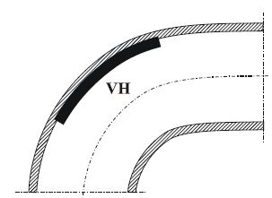

# ALGÔRIT GIẢI CÁC BÀI TOÁN SÁNG CHẾ (ARIZ)

## ALGÔRIT VÀ ALGÔRIT GIẢI CÁC BÀI TOÁN SÁNG CHẾ (ARIZ) LÀ GÌ? {#sec:16:1:}
* Algôrit (tiếng Anh là algorithm, tiếng Nga – алгоритм) thường dịch sang tiếng Việt là thuật toán hoặc thuật giải. Người viết để nguyên từ algôrit (chỉ thay đổi chút ít về phiên âm) mà không dùng từ tiếng Việt vì algôrit đã trở thành thuật ngữ quốc tế: Nhiều nước không dịch từ algôrit sang tiếng nước họ.

Thuật ngữ algôrit có nhiều cách hiểu. Theo nghĩa hẹp ban đầu (nghĩa toán học), algôrit là tập hợp và thứ tự các phép tính cần thiết, được quy định một cách nghiêm ngặt, dùng để giải bài toán cụ thể nào đó. Algôrit toán học có thể là các thao tác tuần tự cần thực hiện để lấy căn bậc hai của một số nguyên dương, hoặc algôrit về phép chia một số cho một số khác… Các algôrit như vậy được đặc trưng bởi tính chặt chẽ cao: Mỗi thao tác được xác định hoàn toàn chính xác và không phụ thuộc vào điều kiện bài toán cũng như đặc điểm riêng của bản thân người giải bài toán.

Với thời gian, cách hiểu thuật ngữ algôrit trở nên “lỏng lẻo” hơn. Bạn có thể thấy điều này thông qua việc tra từ điển thuật ngữ algôrit. Ví dụ, một từ điển máy tính cho định nghĩa sau: _“Algôrit là hàng loạt các chỉ dẫn hoặc các bước tuần tự để giải quyết một vấn đề cụ thể”_. Tương tự như vậy, có từ điển công nghệ thông tin hiểu algôrit là _“bộ các chỉ dẫn, cung cấp hàng loạt các bước cần thiết để tìm ra lời giải cho một vấn đề”_.

Ngày nay, thuật ngữ algôrit còn được hiểu rộng hơn nhiều: “Algôrit là bất kỳ chương trình nào đủ rõ ràng gồm các hành động (thao tác) thực hiện một công việc nào đó”.

Theo nghĩa rộng này, hầu hết các chương trình, phương pháp được trình bày trong bộ sách _“Sáng tạo và đổi mới”_ đều là các algôrit. Ví dụ:

\- Chương trình đánh giá đối tượng cho trước là sáng tạo hay không? (xem _1.2. Một số khái niệm cơ bản và các ý nghĩa của chúng_ của quyển một).

\- Chương trình phát hiện các thủ thuật và làm tái hiện quá trình suy nghĩ lôgích để có được hệ thống cải tiến cho trước (xem mục nhỏ \@ref(subsec:12:1:4:) của quyển năm).

\- Chương trình rút gọn dùng để giải quyết vấn đề và ra quyết định (xem mục 12.3 của quyển năm).

\- Chương trình giải bài toán – Phương pháp mô hình hóa bài toán bằng những người tý hon (phương pháp MBN) (xem mục nhỏ _\@ref(subsec:13:2:3:) Các phương pháp sáng tạo của TRIZ dựa trên các cơ sở khác_ của quyển sáu).

\- Các câu hỏi kiểm tra của G. Polya dùng để giải các bài tập toán học phổ thông (xem _\@ref(subsec:13:3:2:2:) Nhóm các phương pháp các câu hỏi kiểm tra (Check-listing Method_ hoặc _Method of Control Questions)_ của quyển sáu).

\- Một số phương pháp trình bày trong các mục nhỏ \@ref(subsec:13:3:3:) và \@ref(subsec:13:3:4:) của quyển sáu.

\- Chương trình phát hiện các quy luật phát triển hệ thống (xem mục nhỏ \@ref(subsec:14:4:3:) của quyển bảy).

\- Chương trình sử dụng hệ thống các chuẩn để giải các bài toán sáng chế (xem mục nhỏ \@ref(subsec:15:5:1:) của quyển tám).

* Có một cách tiếp cận trong giáo dục-đào tạo được xây dựng trên cơ sở nghĩa rộng của thuật ngữ algôrit. Cách tiếp cận này cho rằng có rất nhiều loại công việc trong đời của một con người. Tại sao không liệt kê, phân loại các công việc ấy và xây dựng cho mỗi công việc một algôrit phù hợp nhất. Lúc này, quá trình dạy và học, thực chất, sẽ là quá trình dạy và học các algôrit. Người học, trong các tình huống cuộc đời của mình, xác định công việc cần làm rồi sử dụng algôrit tương ứng để thực hiện công việc, thì sẽ có được sự tối ưu cả về quá trình thực hiện lẫn kết quả. Ví dụ, công việc của bạn là chuẩn bị đi công tác xa, bạn lấy algôrit tương ứng ra và thực hiện theo các bước của chương trình đó, bảo đảm chuyến đi của bạn thành công tốt đẹp.

* Trong cụm từ “Algôrit giải các bài toán sáng chế” (tiếng Nga là “Aлгоритм решения изобретательких задач”, viết tắt theo tiếng Nga - АРИЗ, chuyển sang ký tự latinh – ARIZ), thuật ngữ algôrit được dùng theo nghĩa rộng. Còn cả cụm từ “Algôrit giải các bài toán sáng chế” (ARIZ) được hiểu là chương trình lôgích mang tính định hướng, được kế hoạch hóa, gồm nhiều bước nhằm tổ chức hợp lý và có hiệu quả quá trình suy nghĩ giải các bài toán sáng chế.

G.S. Altshuller bắt đầu công việc nghiên cứu xây dựng ARIZ từ năm 1946. Năm 1956, ông đưa ra phiên bản ARIZ đầu tiên. ARIZ-56 còn mang tính sơ khai, nên đôi khi người ta còn gọi ARIZ-56 là tiền ARIZ. ARIZ được hoàn thiện, cải tiến dần dần theo thời gian và trở thành các phiên bản, biến thể mới hơn như ARIZ-59, ‑61, ‑64, ‑65, ‑68, ‑71,…, ‑71C, ‑77, ‑82…, ‑82D, ‑85…, ‑85C. Trong đó, các con số chỉ ra năm công bố biến thể ARIZ cho trước và các chữ cái đánh dấu có sự cải tiến nhưng chưa chuyển hẳn thành phiên bản khác.

Đi vào cụ thể, theo G.S. Altshuller, việc xây dựng, cải tiến, phát triển ARIZ cần đáp ứng đồng thời các yêu cầu sau:

**I)** ARIZ phải dựa trên việc sử dụng có ý thức các quy luật phát triển các hệ thống kỹ thuật.

Các quy luật phát triển các hệ thống kỹ thuật tạo nên cơ chế định hướng giúp loại bỏ các phép thử sai, đưa bài toán có mức khó cao thành bài toán có mức khó thấp với số lượng các phép thử giảm đi một cách đáng kể.

**II)** ARIZ phải chứa những quy tắc, thao tác giúp phát hiện các mâu thuẫn, đặc biệt mâu thuẫn vật lý (ML).

Để khắc phục mâu thuẫn, ARIZ phải được cung cấp kho thông tin‑công cụ ngày càng được tìm ra nhiều hơn, bao gồm các thủ thuật (nguyên tắc) sáng tạo, các phương pháp như phân tích vepol, các chuẩn, phương pháp mô hình hóa bài toán bằng những người tý hon (phương pháp MBN), các nguyên tắc phân chia các mặt đối lập (các biến đổi mẫu) giải quyết các mâu thuẫn vật lý…

Ngoài ra, kho thông tin­‑công cụ còn có cả các văn bản chỉ dẫn sử dụng các hiệu ứng vật lý nói riêng, khoa học nói chung.

**III)** ARIZ dành cho con người sử dụng. Do vậy, ARIZ phải thân thiện với người giải và có các phương tiện điều khiển các hiện tượng tâm lý của con người như khắc phục tính ì tâm lý, phát triển trí tưởng tượng…

Bạn đọc tinh ý có thể nhận thấy, ARIZ đáp ứng ba yêu cầu nói trên phải là ARIZ huy động và chứa trong nó hầu hết, nếu như không nói tất cả, các phương tiện và phương pháp của TRIZ được trình bày trong tám quyển sách trước của bộ sách _“Sáng tạo và đổi mới”_. Nói cách khác, ARIZ là chương trình sắp xếp, tổ chức việc áp dụng tất cả các bộ phận của TRIZ một cách hợp lý, lôgích, tối ưu để suy nghĩ giải các bài toán sáng chế đạt hiệu quả cao nhất.

Người viết còn quay trở lại ba yêu cầu vừa nêu đối với ARIZ trong những phần sau nhằm cụ thể hóa chúng.

* Hệ thống các chuẩn dùng để giải các bài toán chuẩn, ARIZ dùng để giải các bài toán không chuẩn. Đấy là nói về mặt nguyên tắc. Trong thực tế, không có phương tiện khách quan nào giúp bạn xác định ngay từ đầu bài toán bạn cần giải là bài toán chuẩn hay không chuẩn. Việc phân biệt bài toán chuẩn và bài toán không chuẩn phụ thuộc khá nhiều vào kinh nghiệm. Chưa kể, có những bài toán chuẩn nhưng phức tạp, hiểu theo nghĩa, phải sau quá trình phân tích, gạt bỏ những cái không thực sự cần chú ý, tách ra được cái tập trung sự xung đột, người giải mới xác định đúng các yếu tố của vepol–bài toán và chuẩn cần sử dụng. Nói cách khác, đấy là những bài toán chuẩn vẫn cần đến những phần phân tích của ARIZ.

Do vậy, chính xác hơn sẽ là: ARIZ dùng để giải các bài toán không chuẩn và các bài toán chuẩn phức tạp.

Về phía bạn đọc, bạn đọc cần chuẩn bị cho hai trường hợp tùy theo vào mục đích của bạn:

1) Nếu mục đích của bạn là luyện tập sử dụng ARIZ giải bài toán thì bạn có thể coi bất kỳ bài toán nào cũng là bài toán không chuẩn.

2) Nếu mục đích của bạn là tiết kiệm thời gian, bạn cần kiểm tra bài toán bạn cần giải có phù hợp với các chuẩn hay không để sử dụng ngay các chuẩn. Nếu không được, bạn hãy sử dụng ARIZ.

* ARIZ thường dùng để giải các bài toán sáng chế có mức khó cao (đòi hỏi mức sáng tạo cao). Để hiểu, nắm vững, sử dụng ARIZ thành thạo, người giải phải khổ công học và luyện tập. Luyện tập ở đây có nghĩa, người giải phải giải thật nhiều bài toán theo ARIZ trong các buổi lên lớp và làm các bài tập về nhà.

## ARIZ-85C {#sec:16:2:}
ARIZ 85C là ARIZ mới nhất và cũng là ARIZ cuối cùng có sự lãnh đạo quá trình thiết kế, xây dựng của G.S. Altshuller.

Trong mục này, người viết trình bày ARIZ 85C từ chung đến riêng, từ khái quát đến cụ thể:

Mục nhỏ đầu tiên (16.2.1), bạn đọc làm quen với sơ đồ khối của ARIZ 85C để bạn đọc có được bức tranh chung, thấy “rừng” trước khi đi vào từng khu vực, cho đến từng “cây”.

Văn bản đầy đủ của ARIZ 85C (dịch từ nguyên bản tiếng Nga sang tiếng Việt) được trình bày trong mục nhỏ tiếp theo (16.2.2). Văn bản này gồm hai loại văn bản: Văn bản các bước giải của ARIZ 85C (để phân biệt, được in chữ đậm) và văn bản giải thích ARIZ 85C (in chữ thường) gồm các chú giải, quy tắc làm rõ nội dung của ARIZ, các phần, các bước của ARIZ.

Để tránh cồng kềnh, phân tán và thuận tiện khi áp dụng văn bản ARIZ 85C vào giải bài toán, người viết cho rằng, sau một thời gian luyện tập, người giải không cần nhớ hết văn bản đầy đủ ARIZ 85C mà chỉ cần nhớ văn bản các bước giải ARIZ 85C. Do vậy, văn bản các bước giải ARIZ 85C được in thành một mục nhỏ riêng (16.2.3).

### Sơ đồ khối ARIZ 85C {#subsec:16:2:1:}
ARIZ 85C có 40 bước và được sắp xếp thành 9 phần (còn có thể gọi là 9 giai đoạn). Người giải bài toán cần thực hiện lần lượt từng bước và từng phần. Nói chung các phần liên kết với nhau theo kiểu nối tiếp, tuy nhiên, vài chỗ có mối liên kết nối tắt hoặc liên kết ngược. Sơ đồ khối trên Hình 401 mô tả cấu trúc và hoạt động của ARIZ 85C.

Người giải bài toán bắt đầu từ phần 1. Phần 1 _“Phân tích bài toán”_ có 7 bước với nhiệm vụ biến đổi tình huống vấn đề xuất phát ban đầu thành bài toán mini và sau đó thành mô hình bài toán. Trong phần này có bước cuối cùng đề nghị người giải kiểm tra xem mô hình bài toán có thể giải được bằng hệ thống các chuẩn không. Nếu được, người giải có thể không cần đi tiếp phần 2 mà chuyển ngay sang phần 7.

Phần 2 _“Phân tích mô hình bài toán”_ gồm 3 bước, yêu cầu người giải xác định vùng hành động (VH), thời gian hành động (TH) là khoảng không gian và thời gian mà sự xung đột của mô hình bài toán tập trung ở đó. Đồng thời, người giải cũng phải xác định các nguồn dự trữ chất–trường có sẵn trong hệ, kể cả trong môi trường bên ngoài.

Hình 401: Sơ đồ khối về cấu trúc và hoạt động của ARIZ-85C

Phần 3 _“Xác định kết quả lý tưởng cuối cùng (KLC) và mâu thuẫn vật lý (ML)”_ với 6 bước đòi hỏi người giải nêu rõ kết quả lý tưởng cuối cùng (KLC) người giải muốn có là gì và trên đường đạt đến đích đó thì gặp mâu thuẫn vật lý (ML) nào. Phần 3 cũng đòi hỏi người giải kiểm tra xem các chuẩn có giúp khắc phục ML và đạt KLC hay không. Nếu có lời giải, người giải có thể chuyển thẳng sang phần 7 mà không cần đi tiếp.

Phần 4 _“Huy động và sử dụng các nguồn dự trữ chất–trường”_ có 7 bước yêu cầu người giải phát ý tưởng giải bài toán, sử dụng tối đa các nguồn dự trữ chất–trường. Nếu có lời giải, người giải có thể chuyển sang phần 7, bỏ qua phần 5 và 6.

Phần 5 _“Sử dụng kho thông tin–công cụ”_ dành cho trường hợp không thu được lời giải ở phần 4. Mục đích của phần 5 là dùng những gì có trong kho thông tin–công cụ (KTC) của TRIZ để phát ý tưởng giải bài toán: Đạt KLC và khắc phục được ML. KTC bao gồm hệ thống các chuẩn, các biến đổi mẫu, chỉ dẫn sử dụng kiến thức…

Phần 6 _“Thay đổi hoặc thay thế bài toán”_ gồm 4 bước dành cho trường hợp không nhận được lời giải. Lúc này, người giải phải quay trở lại phần 1, bước 1.1 hoặc/và bước 1.4 để thay đổi hoặc thay thế bài toán ban đầu. Người giải tiếp tục giải bài toán thay đổi hoặc thay thế. Nếu mọi việc tốt đẹp, người giải chuyển sang phần 7.

Phần 7 _“Phân tích cách khắc phục mâu thuẫn vật lý”_ (4 bước) có nhiệm vụ phân tích, kiểm tra lời giải có đạt yêu cầu về chất lượng hay không. Nếu đạt yêu cầu, người giải đi tiếp sang phần 8. Nếu không, người giải phải quay trở lại phần 1, bước 1.1.

Phần 8 _“Áp dụng lời giải nhận được”_ (3 bước) xem xét các hệ quả của lời giải nhận được, khả năng mở rộng áp dụng của lời giải và phát biểu nguyên tắc giải thu được một cách khái quát.

Phần 9 _“Phân tích quá trình giải bài toán”_ (2 bước) tổng kết quá trình thực giải, thiết lập quan hệ phản hồi theo hai hướng: 1) Với chính người giải để người giải tự rút kinh nghiệm, từ đó nâng cao “tay nghề” sử dụng ARIZ; 2) Với kho thông tin–công cụ của TRIZ nhằm bổ sung những nguyên tắc giải mới phát hiện ra trong quá trình sử dụng ARIZ. Trong ý nghĩa này, có thể nói là ARIZ, TRIZ được xây dựng với nỗ lực làm cho chúng trở thành các hệ tự hoàn thiện, tự phát triển.

### Văn bản đầy đủ của ARIZ-85C {#subsec:16:2:2:}
**Bài toán dùng làm thí dụ minh họa:**

“Ăng-ten của kính viễn vọng vô tuyến đặt ở chỗ hay có những cơn giông. Để bảo vệ ăng-ten khỏi bị sét đánh cần đặt các cột thu lôi, nhưng các cột thu lôi hấp thụ tín hiệu sóng vô tuyến, gây nên bóng tối vô tuyến. Do vậy, không thể đặt các cột thu lôi lên chính ăng-ten được. Điều này lại làm tác dụng của cột thu lôi bảo vệ ăng-ten bị giảm sút.

Hỏi làm thế nào?”

**Chú ý:**

_ARIZ là công cụ phức tạp, không được áp dụng ARIZ giải các bài toán sản xuất mới mà chưa học, ít ra, chương trình 80 giờ._

_ARIZ là công cụ dùng để suy nghĩ chứ không phải thay thế suy nghĩ. Không vội vàng, hãy cẩn thận suy nghĩ thấu đáo lời phát biểu của mỗi bước, nhất định phải ghi ra ngoài lề tất cả các ý nghĩ nảy sinh trong quá trình giải bài toán._

_ARIZ – công cụ dùng để giải các bài toán không chuẩn. Hãy kiểm tra xem: Có thể bài toán bạn đang giải, giải được nhờ các chuẩn._

#### Phần 1: Phân tích bài toán

Mục đích chính của phần 1 ARIZ là chuyển từ tình huống sáng chế không rõ ràng sang sơ đồ (mô hình) bài toán đơn giản tối đa, được xây dựng một cách rõ ràng.

**Bước 1.1:**

**Viết lời phát biểu bài toán–mini (không dùng các thuật ngữ chuyên môn) theo mẫu sau:**

**Hệ kỹ thuật dùng để (chỉ ra chức năng, nhiệm vụ) gồm (liệt kê các phần chính của hệ thống). Mâu thuẫn kỹ thuật 1 (MK-1): (chỉ ra). Mâu thuẫn kỹ thuật 2 (MK-2): (chỉ ra). Khi những thay đổi trong hệ là ít nhất, cần có (chỉ ra kết quả cần nhận được).**

**Thí dụ:**

Hệ kỹ thuật dùng để thu sóng vô tuyến gồm có ăng-ten của kính viễn vọng vô tuyến, sóng (tín hiệu) vô tuyến, các cột thu lôi (sét).

MK-1: Nếu có nhiều cột thu lôi, chúng bảo vệ ăng-ten khỏi sét đánh một cách tin cậy, nhưng lại hấp thụ sóng vô tuyến.

MK-2: Nếu có ít cột thu lôi, thì không có sự hấp thụ sóng vô tuyến đáng kể, nhưng ăng-ten không được bảo vệ khỏi sét đánh.

Khi những thay đổi trong hệ là ít nhất, cần bảo vệ ăng-ten khỏi bị sét đánh và không hấp thụ sóng vô tuyến. (Trong lời phát biểu này, “cột thu lôi” cần thay bằng cụm từ “thanh dẫn điện”, “cột dẫn điện” hoặc đơn giản là “vật dẫn điện”.

**Chú giải:**

**1.** Bài toán–mini nhận được từ tình huống sáng chế nhờ đưa vào các hạn chế:

Tất cả đều không thay đổi hoặc đơn giản hóa nhưng xuất hiện tác động (tính chất) cần có hoặc tác động (tính chất) có hại biến mất.

Chuyển từ tình huống vấn đề xuất phát sang bài toán–mini không có nghĩa đi giải bài toán không lớn. Ngược lại, việc đưa thêm những điều kiện bổ sung (kết quả phải nhận được mà “không cần gì”) hướng tới làm tăng sự xung đột và cắt trước những con đường dẫn đến lời giải trung dung (dung hòa).

**2.** Khi viết bước 1.1 cần chỉ ra, không chỉ các chi tiết kỹ thuật của hệ thống, mà còn các chi tiết tự nhiên tương tác với các chi tiết kỹ thuật. Trong bài toán lấy làm thí dụ, các chi tiết (phần) tự nhiên là sét và các sóng vô tuyến cần thu (nếu như chúng được tạo thành bởi sự bức xạ của các đối tượng thiên văn tự nhiên).

**3.** Các mâu thuẫn kỹ thuật là các tương tác trong hệ thống thể hiện ở chỗ, ví dụ, tác động có ích đồng thời gây ra tác động có hại. Hoặc là, đưa vào (làm tăng) tác động có lợi hay khắc phục (làm yếu đi) tác động có hại gây ra sự xấu đi (nói riêng, sự phức tạp không cho phép) của một phần hay toàn bộ hệ thống nói chung.

Phát biểu các mâu thuẫn kỹ thuật cần ghi ra một trạng thái của yếu tố với lời giải thích khi đó cái gì tốt, cái gì xấu. Sau đó, ghi ra _trạng thái ngược (đối lập) của chính yếu tố đó_ và một lần nữa chỉ ra, cái gì tốt, cái gì xấu.

Đôi khi, trong điều kiện bài toán chỉ có một sản phẩm, không có hệ kỹ thuật (công cụ), do vậy không có mâu thuẫn kỹ thuật thấy rõ. Trong những trường hợp như vậy, mâu thuẫn kỹ thuật nhận được bằng cách xem xét mang tính quy ước hai trạng thái của sản phẩm, dù một trong hai trạng thái hiển nhiên không được phép. Ví dụ, bài toán sau: _“Làm thế nào có thể quan sát được bằng mắt thường những hạt vi mô lơ lửng trong mẫu chất lỏng sạch về mặt quang học, nếu như các hạt này nhỏ đến mức ánh sáng đi vòng qua chúng?”_

MK-1: Nếu các hạt nhỏ, chất lỏng vẫn là môi trường sạch về mặt quang học, nhưng không thể quan sát các hạt bằng mắt thường.

MK-2: Nếu các hạt lớn, chúng quan sát được một cách dễ dàng, nhưng chất lỏng không còn là môi trường sạch về mặt quang học, là điều không cho phép.

Các điều kiện bài toán rõ ràng loại trừ xem xét MK-2: Không thể thay đổi sản phẩm. Quả thực, trong tương lai chúng ta sẽ xuất phát từ MK-1 (trong trường hợp này), nhưng MK-2 sẽ cho các yêu cầu bổ sung đối với sản phẩm: Các hạt nhỏ vẫn là các hạt nhỏ, trở thành các hạt lớn…

**4.** Cần thay thế các thuật ngữ liên quan đến công cụ, môi trường bên ngoài bằng những từ ngữ đơn giản để khắc phục tính ì tâm lý. Điều này cần thiết, vì các thuật ngữ:

\- áp đặt cách hiểu cũ về công nghệ làm việc của sản phẩm: “Tàu phá băng” có thể đi nhanh trong băng mà không nhất thiết phải phá băng.

\- làm lu mờ những điểm đặc biệt của vật chất nêu ra trong bài toán: “Ván khuôn” (côpfa) không phải một cách đơn giản là “vách”, mà là “vách sắt”.

\- thu hẹp cách hiểu (quan niệm) về các trạng thái có thể của vật chất: Thuật ngữ “chất sơn” thường hướng người ta hiểu về phía truyền thống chất sơn lỏng, rắn, mặc dù có cả chất sơn ở dạng khí.

**Bước 1.2:**

**Tách ra và ghi lại đôi yếu tố xung đột: Sản phẩm và công cụ**

**Quy tắc 1:** Nếu như công cụ trong các điều kiện bài toán có thể có hai trạng thái, cần chỉ ra cả hai trạng thái.

**Quy tắc 2:** Nếu như trong bài toán có hàng loạt đôi các yếu tố đồng nhất tương tác với nhau, chỉ cần lấy một đôi là đủ.

**Thí dụ:** Sản phẩm là (tia) sét và sóng vô tuyến. Công cụ là các thanh dẫn điện (cột thu lôi). Công cụ có thể ở trạng thái: Nhiều thanh dẫn điện, ít thanh dẫn điện.

**Chú giải:**

**5.** Sản phẩm là yếu tố, mà yếu tố ấy theo điều kiện bài toán cần được xử lý (chế tạo, di chuyển, thay đổi, làm tốt hơn, bảo vệ khỏi tác động xấu, phát hiện, đo…). Trong các bài toán phát hiện và đo, sản phẩm có thể là yếu tố mà theo chức năng chính lại là công cụ. Ví dụ, đo nhiệt độ của lưỡi dao tiện.

**6.** Yếu tố tương tác trực tiếp với sản phẩm gọi là công cụ (lưỡi phay chứ không phải máy phay, ngọn lửa chứ không phải mỏ đốt). Trong trường hợp riêng, một phần của môi trường xung quanh có thể là công cụ. Công cụ là chi tiết chuẩn để người ta lắp ráp thành sản phẩm. Ví dụ, bộ gá các chi tiết của trò chơi “Công trình sư” là công cụ dùng để chế tạo các loại mô hình khác nhau.

**7.** Một trong hai yếu tố xung đột có thể nhân đôi. Ví dụ, cho hai công cụ khác nhau cùng một lúc tác động lên sản phẩm, nhưng công cụ này lại làm cản trở công cụ kia. Hoặc là, cho hai sản phẩm cần tiếp thu tác động của cùng một công cụ: Sản phẩm này cản trở sản phẩm kia.

**Bước 1.3:**

**Vẽ sơ đồ MK-1 và MK-2, sử dụng “Bảng các sơ đồ xung đột thường gặp trong các mô hình bài toán” (xem Hình 402 ở phần cuối của mục nhỏ này)**

**Thí dụ:**

MK-1: Nhiều thanh dẫn điện

MK-2: Ít thanh dẫn điện

**Chú giải:**

**8.** Trong bảng 1 (xem Hình 402 ở cuối mục nhỏ này) có dẫn ra các sơ đồ xung đột thường gặp. Tuy vậy, vẫn cho phép sử dụng các sơ đồ ngoài bảng, nếu như chúng phản ánh bản chất sự xung đột tốt hơn.

**9.** Trong một số bài toán có thể gặp các sơ đồ xung đột như:

Những sơ đồ như vậy được đưa thành sơ đồ một mắt xích:

Nếu như coi B là _sản phẩm bị thay đổi_ hoặc là chuyển giao cho B tính chất (hoặc trạng thái) chính của A.

**10.** Xung đột không chỉ được xem xét trong không gian mà còn trong thời gian. Ví dụ, trong bài toán thụ phấn cho hoa, gió mạnh lúc đầu làm khép các cánh hoa, do vậy, không chuyển giao phấn hoa mặc dù nó có thể làm tốt điều này. Cách tiếp cận như vậy đôi khi cho phép tách ra bài toán cần giải một cách rõ ràng hơn.

**11.** Các bước 1.2 và 1.3 làm chính xác hóa phát biểu chung về bài toán. Do vậy, sau bước 1.3 cần quay trở lại bước 1.1 và kiểm tra sự tương hợp theo đường bước 1.1 – bước 1.2 – bước 1.3. Nếu như có sự không tương hợp, cần khắc phục, chỉnh sửa đường nói trên.

**Bước 1.4:**

**Chọn một trong hai sơ đồ xung đột sao cho sơ đồ đó bảo đảm thực hiện tốt nhất quá trình sản xuất chính (chức năng chính của hệ kỹ thuật được chỉ ra trong điều kiện bài toán). Chỉ ra, cái gì là quá trình sản xuất chính**

**Thí dụ:**

Trong bài toán bảo vệ ăng-ten của kính viễn vọng khỏi bị sét đánh, chức năng chính của hệ thống là thu sóng vô tuyến. Do vậy, cần chọn sơ đồ MK-2: Trong trường hợp này các thanh dẫn điện không làm xấu các sóng vô tuyến.

**Chú giải:**

**12.** Chọn một trong hai sơ đồ xung đột có nghĩa là chúng ta chọn một trong hai trạng thái đối lập nhau của công cụ. Lời giải tiếp theo phải gắn với trạng thái được chọn. Không được, ví dụ, thay “có ít các thanh dẫn điện” bằng “số lượng tối ưu nào đó các thanh dẫn điện”. _ARIZ đòi hỏi làm tăng sự xung đột, chứ không phải dung hòa sự xung đột_.

Gắn với một trạng thái của công cụ, tiếp theo, chúng ta phải đạt được, sao cho trong trạng thái đó xuất hiện tính chất cần thiết có trong trạng thái kia. Chúng ta sẽ không làm tăng số lượng của các vật dẫn điện, nhưng sau khi giải, các (tia) sét phải bị khắc phục như là có số lượng vật dẫn rất lớn.

**13.** Với sự xác định quá trình sản xuất chính (QSC), đôi khi xuất hiện các khó khăn trong các bài toán đo. Công việc đo hầu như luôn luôn được thực hiện vì sự thay đổi, tức là xử lý chi tiết, cho ra sản phẩm. Do vậy, QSC trong các bài toán đo là QSC của toàn bộ hệ thống đo, chứ không phải của riêng phần đo của hệ thống. Ví dụ, cần đo áp suất bên trong các bóng đèn được sản xuất ra. QSC không phải là đo áp suất mà là sản xuất bóng đèn. Trường hợp ngoại lệ là một số bài toán đo nhằm mục đích khoa học.

**Bước 1.5:**

**Tăng cường sự xung đột bằng cách chỉ ra trạng thái (tác động) giới hạn của các yếu tố**

**Quy tắc 3:** Phần lớn các bài toán có sự xung đột dạng “nhiều yếu tố” và “ít yếu tố” (“yếu tố mạnh” – “yếu tố yếu”…). Các xung đột dạng “ít yếu tố”, khi tăng cường, phải dẫn đến dạng “không có yếu tố nào” (“yếu tố không có”).

**Thí dụ:** Thay vì “có ít các vật dẫn điện” chúng ta sẽ cho là trong MK-2 “không có vật dẫn điện” được chỉ ra.

**Bước 1.6:**

**Viết lời phát biểu mô hình bài toán bằng cách chỉ ra:**

**1) Đôi yếu tố xung đột;**

**2) Lời phát biểu tăng cường xung đột;**

**3) Yếu tố X cần để giải bài toán phải làm gì (giữ gìn, duy trì cái gì và khắc phục, làm tốt hơn, bảo đảm… cái gì)**

**Thí dụ:** Cho tia sét và không có vật dẫn điện. Không có vật dẫn điện nên không gây nhiễu (khi thu sóng vô tuyến), nhưng không bảo vệ được ăng-ten khỏi tia sét. Cần tìm yếu tố X mà yếu tố đó giữ được khả năng không gây nhiễu (do không có vật dẫn điện) và bảo đảm sự bảo vệ ăng-ten khỏi các tia sét.

**Chú giải:**

**14.** Mô hình bài toán mang tính chất quy ước, trong đó tách ra một cách nhân tạo phần các yếu tố của hệ thống kỹ thuật. Sự tồn tại các yếu tố khác được hiểu ngầm là đương nhiên có. Như vậy, trong mô hình bài toán bảo vệ ăng-ten gồm 4 yếu tố cần thiết để phát biểu bài toán (ăng-ten, sóng vô tuyến, vật dẫn điện và tia sét), chỉ còn lại hai yếu tố. Các yếu tố khác có thể không cần nhắc đến nữa.

**15.** Sau bước 1.6 nhất thiết phải quay về bước 1.1 và kiểm tra lôgích xây dựng mô hình bài toán. Ở đây thường có khả năng làm chính xác hóa sơ đồ xung đột được chọn, có chỉ ra yếu tố X trong sơ đồ đó, ví dụ:

**16.** Yếu tố X không nhất thiết là phần vật chất mới của hệ thống. Yếu tố X là một sự thay đổi nào đó trong hệ thống, một ẩn số X nói chung. Ẩn số này có thể bằng, ví dụ, sự thay đổi nhiệt độ hay trạng thái vật chất của phần nào đó của hệ hoặc của môi trường bên ngoài.

**Bước 1.7:**

**Kiểm tra khả năng áp dụng hệ thống các chuẩn để giải mô hình bài toán. Nếu bài toán không giải được hãy chuyển sang phần 2 của ARIZ. Nếu bài toán giải được, có thể chuyển sang phần 7 của ARIZ, mặc dù trong trường hợp này có lời khuyên tiếp tục phân tích theo phần 2 của ARIZ**

**Chú giải:**

**17.** Thực hiện phân tích theo phần 1 của ARIZ và xây dựng mô hình bài toán làm rõ bài toán ban đầu và trong nhiều trường hợp, cho phép người giải nhìn thấy những dấu hiệu chuẩn trong các bài toán không chuẩn. Điều này mở ra khả năng sử dụng các chuẩn hiệu quả hơn so với việc sử dụng các chuẩn ngay cho lời phát biểu ban đầu của bài toán.

#### Phần 2: Phân tích mô hình bài toán

Mục đích của phần 2 ARIZ là tính đến các nguồn dự trữ có sẵn có thể được dùng để giải bài toán: Các nguồn dự trữ không gian, thời gian, vật chất và các trường năng lượng.

**Bước 2.1:**

**Xác định vùng hành động (VH)**

**Chú giải:**

**18.** Trong trường hợp đơn giản nhất, vùng hành động (VH) là khoảng không gian, trong giới hạn của khoảng đó nảy sinh sự xung đột, được chỉ ra trong mô hình bài toán.

**Thí dụ:** Trong bài toán về ăng-ten, VH là khoảng không gian bị cột thu lôi chiếm trước đây, tức là, tưởng tượng thanh “trống rỗng”, cột “trống rỗng”.

**Bước 2.2:**

**Xác định thời gian hành động (TH)**

**Chú giải:**

**19.** Thời gian hành động (TH) là nguồn dự trữ có sẵn về mặt thời gian: Thời gian xung đột T1 và thời gian trước xung đột T2. Sự xung đột (đặc biệt xảy ra nhanh, trong thời gian ngắn) đôi khi có thể được khắc phục (ngăn chặn) trong khoảng thời gian T2.

**Thí dụ:** Trong bài toán về ăng-ten, thời gian hành động là tổng (thời gian phóng điện của tia sét) và T"1(thời gian đến lần phóng điện sau), không có T2.

**Bước 2.3:**

**Xác định các nguồn dự trữ chất–trường (NCT) của hệ thống đang xem xét, của môi trường bên ngoài và của sản phẩm. Lập danh sách các nguồn dự trữ chất–trường (NCT)**

**Chú giải:**

**20.** Các nguồn dự trữ chất–trường (NCT) là các chất và trường, mà chúng có sẵn hoặc có thể nhận được một cách dễ dàng theo điều kiện bài toán. Có ba loại NCT:

1) Bên trong hệ thống:

> a) NCT của công cụ
>
> b) NCT của sản phẩm

2) Bên ngoài hệ thống:

> a) NCT của môi trường, mang tính đặc thù đối với chính bài toán cho trước. Ví dụ, nước của bài toán về các hạt trong chất lỏng sạch về mặt quang học.
>
> b) NCT chung đối với bất kỳ môi trường bên ngoài nào, các trường phông (nền), ví dụ, trường hấp dẫn, từ trường Trái Đất.

3) Hệ trên:

> a) Chất thải của hệ ngoài (nếu như có thể tiếp cận được hệ đó theo điều kiện bài toán).
>
> b) NCT “không mất tiền mua” là các yếu tố ngoài rất rẻ mà có thể bỏ qua giá tiền của chúng.

Khi giải bài toán–mini cụ thể, người ta mong rằng nhận được kết quả với _chi phí NCT ít nhất_. Cho nên, một cách hợp lý, trước hết phải sử dụng NCT bên trong hệ thống, sau đó NCT bên ngoài hệ thống và cuối cùng là NCT hệ trên. Còn trong quá trình phát triển lời giải nhận được và khi giải bài toán dự báo (tức là bài toán–maxi) cần tác động _lên cực đại của các NCT khác nhau_.

**21.** Biết rằng, sản phẩm là yếu tố không thay đổi. Vậy có NCT nào trong sản phẩm? Thực vậy, không thể thay đổi sản phẩm, tức là không nên thay đổi khi giải bài toán–mini. Nhưng đôi khi sản phẩm có thể:

a) tự mình thay đổi;

b) cho phép hao mòn (tức là thay đổi) phần nào đó khi không hạn chế, có rất nhiều sản phẩm (ví dụ, nước trong sông, gió…);

c) cho phép chuyển sang hệ trên (viên gạch không thay đổi nhưng nhà thay đổi);

d) cho phép sử dụng các cấu trúc ở mức vi mô;

e) cho phép kết hợp với “không gì cả”, tức là với sự trống rỗng;

g) cho phép thay đổi tạm thời

Như vậy, sản phẩm ít khi đưa vào trong NCT, thường đưa vào chỉ khi sản phẩm có thể _thay đổi dễ dàng khi không thay đổi những cái khác_.

**22.** NCT là các nguồn dự trữ có sẵn. Sẽ có lợi nếu sử dụng chúng trước. Nếu chúng không đủ, có thể sử dụng các chất và trường khác. Phân tích NCT ở bước 2.3 mới mang tính chất sơ bộ.

**Thí dụ:** Trong bài toán bảo vệ ăng-ten có yếu tố “không có vật dẫn điện”. Do vậy, chỉ có các chất và trường của môi trường bên ngoài là NCT. Trong trường hợp này, NCT là không khí.

#### Phần 3: Xác định kết quả lý tưởng cuối cùng (KLC) và mâu thuẫn vật lý (ML)

Kết quả áp dụng phần 3 của ARIZ phải là sự phát biểu kết quả lý tưởng cuối cùng (KLC) và mâu thuẫn vật lý (ML) mà mâu thuẫn đó cản trở việc đạt được KLC. Không phải bao giờ cũng đạt được lời giải lý tưởng, nhưng KLC chỉ ra hướng có lời giải mạnh nhất.

**Bước 3.1:**

**Viết lời phát biểu kết quả lý tưởng cuối cùng 1 (KLC-1): Yếu tố X, tuyệt đối không làm phức tạp hệ và không gây ra các hiện tượng có hại, khắc phục (chỉ ra tác động có hại) trong TH và VH, duy trì khả năng của công cụ thực hiện (chỉ ra tác động có lợi)**

**Thí dụ:** Yếu tố X, tuyệt đối không làm phức tạp hóa hệ và không gây ra các hiện tượng có hại, khắc phục trong thời gian hành động (TH) “sự không thu” sét bằng không có thanh dẫn điện, giữ lại khả năng của thanh này không tạo nhiễu đối với ăng-ten.

**Chú giải:**

**23.** Ngoài xung đột “tác động có hại gắn với tác động có lợi” còn có thể có các dạng xung đột khác, ví dụ, “đưa thêm vào tác động có lợi mới gây ra sự phức tạp của hệ thống”, hoặc “một tác động có lợi không tương hợp với tác động có lợi khác”. Do vậy, lời phát biểu KLC ở bước 3.1 chỉ làm mẫu, để theo mẫu đó, người giải cần viết ra KLC. Ý nghĩa chung của bất kỳ lời phát biểu KLC nào: Có được phẩm chất có lợi (hoặc khắc phục cái có hại) không được đi kèm với sự xấu đi của các phẩm chất khác (hoặc với sự xuất hiện phẩm chất có hại).

**Bước 3.2:**

**Tăng cường lời phát biểu KLC-1 bằng yêu cầu bổ sung: Không thể đưa vào hệ các chất và trường mới, phải sử dụng các nguồn dự trữ chất–trường (NCT) có sẵn**

**Thí dụ:** Trong mô hình bài toán về bảo vệ ăng-ten không có công cụ (“không có cột thu lôi”). Theo chú giải 24 cần đưa môi trường bên ngoài vào lời phát biểu KLC-1, tức là thay yếu tố X bằng từ “không khí” (có thể chính xác hơn nữa: “Cột không khí ở nơi cột thu lôi không có”).

**Chú giải:**

**24.** Khi giải bài toán–mini, tương ứng với các chú giải 20 và 21, cần xem xét các nguồn dự trữ chất–trường (NCT) được sử dụng theo thứ tự sau:

\- NCT của công cụ

\- NCT của môi trường bên ngoài

\- NCT phụ

\- NCT của sản phẩm (nếu như không có điều cấm theo chú giải 21)

Sự tồn tại NCT khác nhau tạo ra sự tồn tại bốn đường phân tích tiếp theo. Trên thực tế, các điều kiện bài toán thường làm giảm số đường này. Khi giải bài toán–mini thực hiện sự phân tích đến khi nhận được ý tưởng lời giải là đủ; nếu như ý tưởng nhận được, ví dụ, trên “đường công cụ”, có thể không cần kiểm tra các đường khác. Khi giải bài toán–maxi, cần kiểm tra tất cả các đường có trong trường hợp cho trước, tức là, nhận lời giải, ví dụ, trên “đường công cụ” vẫn cần kiểm tra đồng thời các đường NCT môi trường bên ngoài, NCT phụ và NCT của sản phẩm.

Trong quá trình dạy và học ARIZ, sự phân tích tuần tự (nối tiếp) dần được thay thế bằng sự phân tích song song: Tạo ra kỹ năng chuyển giao ý tưởng lời giải từ đường này sang đường khác. Đấy chính là “tư duy nhiều tầng”: Kỹ năng nhìn thấy đồng thời sự thay đổi trong hệ trên, hệ và các hệ dưới.

_Chú ý:_

_Giải bài toán đi kèm với phá vỡ các quan niệm cũ. Xuất hiện những quan niệm mới khó phản ánh bằng từ ngữ. Ví dụ, làm thế nào diễn tả các tính chất sơn hòa tan, không hòa tan (sơn, không sơn…)?_

_Khi làm việc với ARIZ, các ghi chép cần thực hiện bằng các từ ngữ đơn giản, không mang tính kỹ thuật, sử dụng ngay cả các từ ngữ trẻ em, tìm mọi cách tránh các từ chuyên môn (vì chúng làm tăng tính ì)._

**Bước 3.3:**

**Viết lời phát biểu mâu thuẫn vật lý (ML) ở mức vĩ mô: VH trong TH phải (chỉ ra trạng thái vật lý vĩ mô, ví dụ “phải nóng”), để hoàn thành (chỉ ra một trong các tác động xung đột), và phải không (chỉ ra trạng thái vật lý vĩ mô đối lập, ví dụ “phải lạnh”) để hoàn thành (chỉ ra tác động hoặc yêu cầu xung đột khác)**

**Chú giải:**

**25.** Mâu thuẫn vật lý (ML) là các yêu cầu đối lập (trái ngược, đối nghịch) nhau đối với trạng thái vật lý của vùng hành động (VH).

**26.** Nếu như khó phát biểu đầy đủ ML, có thể soạn lời phát biểu _ngắn_: Yếu tố (hay là phần của yếu tố trong VH) phải trở thành… để (chỉ ra) và phải không trở thành… để (chỉ ra).

**Thí dụ:** Cột không khí trong TH phải dẫn điện để thu tia sét, và phải không dẫn điện để không hấp thụ sóng vô tuyến.

Lời phát biểu này gợi ý lời giải: Cột không khí phải dẫn điện _khi có sự phóng điện của tia sét_ và phải không dẫn điện _trong thời gian còn lại_. Sự phóng điện của tia sét là hiện tượng tương đối hiếm và xảy ra nhanh. Quy luật về sự tương hợp nhịp điệu cho thấy: Tính chu kỳ của sự thu sét phải bằng tính chu kỳ của sự xuất hiện sét.

Đây chưa phải là tất cả lời giải. Ví dụ, làm thế nào để cột không khí biến thành vật dẫn điện khi có tia sét? Làm thế nào để vật dẫn điện biến mất ngay khi sự phóng điện kết thúc?

_Chú ý:_

_Khi giải bài toán theo ARIZ, lời giải hình thành dần dần, dường như “hiện ra”. Việc ngưng giải bài toán khi vừa xuất hiện gợi ý lời giải và cố định lời giải còn chưa hoàn thành, đều nguy hiểm. Giải bài toán theo ARIZ phải được tiến hành đến tận cùng._

**Bước 3.4:**

**Viết lời phát biểu ML ở mức vi mô: Trong VH phải có những hạt vật chất (chỉ ra trạng thái vật lý hay tác động của chúng) để bảo đảm (chỉ ra trạng thái vĩ mô cần thiết nêu trong bước 3.3), và phải không có những hạt đó (hoặc là phải có những hạt với trạng thái hay tác động đối lập) để bảo đảm (chỉ ra trạng thái vĩ mô cần thiết khác nêu trong bước 3.3)**

**Thí dụ:** Trong cột không khí (khi tia sét phóng điện) phải có những điện tích tự do để có được tính dẫn điện (nhằm thu sét), và phải không có (trong thời gian còn lại) các điện tích tự do để không có khả năng dẫn điện (khả năng dẫn điện hấp thụ sóng vô tuyến).

**Chú giải:**

**27.** Khi thực hiện bước 3.4 chưa cần phải cụ thể hóa khái niệm “hạt”. Đó có thể là các phần tử, iôn, đômen…

**28.** Các hạt có thể là: a) các hạt của chất nào đó; b) các hạt chất kết hợp với trường nào đó và hiếm hơn c) “các hạt của trường”.

**29.** Nếu bài toán chỉ có lời giải ở mức vĩ mô, có thể không cần bước 3.4 (không thu được bước 3.4). Tuy vậy, trong trường hợp này, nỗ lực soạn ML vi mô là có ích, bởi vì nó cho chúng ta thông tin bổ sung: Bài toán giải ở mức vĩ mô.

_Chú ý:_

_Ba phần đầu tiên của ARIZ tái cấu trúc bài toán ban đầu một cách đáng kể. Bước 3.5 tổng kết sự tái cấu trúc này. Soạn lời phát biểu KLC-2, chúng ta đồng thời thu được bài toán mới – bài toán vật lý. Tiếp theo, bài toán cần giải chính là bài toán này._

**Bước 3.5:**

**Viết lời phát biểu kết quả lý tưởng cuối cùng 2 (KLC-2): VH (chỉ ra) trong TH (chỉ ra) phải tự bảo đảm (chỉ ra các trạng thái vật lý vĩ mô hay vi mô đối lập nhau)**

**Thí dụ:** Các phân tử trung hòa trong cột không khí phải _tự nó_ biến thành các điện tích tự do khi tia sét phóng điện, và sau khi tia sét phóng điện, các điện tích tự do _tự nó_ biến thành các phân tử trung hòa.

Ý nghĩa của bài toán mới: Trong khoảng thời gian tia sét phóng điện, trong cột không khí, khác với không khí xung quanh, các điện tích tự do tự xuất hiện. Lúc đó, cột không khí bị iôn hóa hoạt động như là “cột thu lôi” và thu tia sét về phía mình. Sau khi tia sét phóng điện, các điện tích tự do phải tự mình trở lại thành các phân tử trung hòa. Để giải bài toán này, chỉ cần kiến thức vật lý phổ thông là đủ.

**Bước 3.6:**

**Kiểm tra khả năng áp dụng hệ thống các chuẩn để giải bài toán vật lý, được phát biểu dưới dạng KLC-2. Nếu bài toán không giải được, hãy chuyển sang phần 4 của ARIZ. Nếu bài toán giải được, có thể chuyển sang phần 7 của ARIZ, mặc dù trong trường hợp này có lời khuyên tiếp tục phân tích theo phần 4 của ARIZ**

#### Phần 4: Huy động và sử dụng các nguồn dự trữ chất–trường (NCT)

Trước đây, ở bước 2.3 người giải đã xác định các NCT có sẵn trong hệ mà chúng có thể được sử dụng không mất tiền mua. Phần 4 bao gồm các công việc được kế hoạch hóa để làm tăng các nguồn dự trữ: Các NCT phái sinh nhận được hầu như không mất tiền được xem xét nhờ sự thay đổi tối thiểu NCT có sẵn. Các bước từ 3.3 đến 3.5 bắt đầu chuyển từ bài toán đến lời giải dựa trên việc sử dụng các kiến thức vật lý. Phần 4 của ARIZ tiếp tục con đường này.

**Quy tắc 4:** Mỗi dạng hạt ở trong một trạng thái vật lý phải dựa trên một chức năng. Nếu như các hạt A không thực hiện được các tác động 1 và 2, cần đưa các hạt B vào; cứ để các hạt A thực hiện tác động 1, còn các hạt B thực hiện tác động 2.

**Quy tắc 5:** Các hạt B đưa vào có thể chia ra thành hai nhóm: B1 và B2. Điều này cho phép, nhờ tương tác giữa các hạt B đã có sẵn, nhận được tác động 3 không mất tiền.

**Quy tắc 6:** Chia các hạt thành các nhóm được lợi ngay cả trong những trường hợp, khi trong hệ thống chỉ có các hạt A; một số các hạt A vẫn để ở trạng thái trước đây, thay đổi thông số chính của bài toán cho trước ở nhóm các hạt A khác.

**Quy tắc 7:** Các hạt được phân chia hoặc các hạt đưa thêm vào sau khi làm xong công việc của mình phải trở nên không phân biệt được với nhau hoặc không phân biệt được với các hạt đã có sẵn trước đó.

**Chú giải:**

**30.** Các quy tắc từ 4 đến 7 dùng cho tất cả các bước của phần 4 ARIZ.

**Bước 4.1:**

**Phương pháp mô hình hóa bài toán bằng những người tý hon (phương pháp MBN):**

**a) Sử dụng phương pháp MBN để xây dựng sơ đồ xung đột**

**b) Thay đổi sơ đồ a) sao cho những người tý hon hành động mà không gây xung đột**

**c) Chuyển sang sơ đồ kỹ thuật**

**Chú giải:**

**31.** Phương pháp mô hình hóa bài toán bằng “những người tý hon” (phương pháp MBN) thể hiện ở chỗ, các yêu cầu xung đột được biểu diễn dưới dạng một hình vẽ (hoặc một số hình vẽ) quy ước. Trong đó có số lượng lớn “những con người tý hon” (một nhóm, vài nhóm, “đám đông”). Chỉ cần thể hiện các phần thay đổi được của mô hình bài toán (công cụ, yếu tố X) thành “những người tý hon”.

“Các yêu cầu xung đột” là sự xung đột trong mô hình bài toán hoặc các trạng thái vật lý xung đột (đối lập), được chỉ ra ở bước 3.5. Rõ ràng, dùng trạng thái vật lý thì tốt hơn, nhưng hiện nay chưa có các quy tắc chính xác chuyển từ bài toán vật lý (bước 3.5) sang MBN để vẽ “sự xung đột” dễ dàng hơn trong mô hình bài toán.

Bước 4.1b thực hiện được bằng cách dùng kết hợp hai hình vẽ thành một: Tác động xấu và tác động tốt. Nếu các sự kiện phát triển theo thời gian, nên vẽ vài hình lần lượt.

_Chú ý:_

_Ở đây thường có sai lầm khi bị hạn chế bởi các hình vẽ sơ sài, không cẩn thận. Các hình vẽ tốt là các hình vẽ: a) gợi cảm và dễ hiểu mà không cần từ ngữ; b) cho thông tin bổ sung về mâu thuẫn vật lý, chỉ ra các cách khắc phục nó dưới dạng chung._

**32.** Bước 4.1 là bước trợ giúp. Nó cần thiết để trước khi huy động các NCT thấy được một cách hình ảnh, các hạt vật chất phải làm gì trong VH và quanh đó. Phương pháp MBN cho phép nhìn tác động lý tưởng rõ hơn (“cần làm gì”) mà không cần đến kiến thức vật lý (“điều đó làm như thế nào”). Nhờ vậy, tính ì tâm lý được khắc phục, trí tưởng tượng được tập trung hơn. Trong ý nghĩa này, phương pháp MBN là phương pháp tâm lý. Nhưng công việc mô hình hóa bằng “những người tý hon” được thực hiện có tính đến các quy luật phát triển các hệ thống kỹ thuật. Cho nên, phương pháp MBN không ít khi dẫn đến lời giải kỹ thuật của bài toán. Không được dừng lời giải trong trường hợp này, nhất định cần thực hiện việc huy động NCT.

**Thí dụ:**

a) Những người tý hon bên trong cột không khí được tách ra một cách tưởng tượng không khác gì những người tý hon không khí bên ngoài cột. Cả hai loại người tý hon này đều trung hòa (trên hình vẽ, điều này thể hiện một cách quy ước: Họ giữ nhau, cả hai tay của họ đều bận, họ không bắt tia sét).

b) Theo quy tắc 6 cần phân chia những người tý hon thành hai nhóm: Những người tý hon ngoài cột không thay đổi (các đôi trung hòa), còn những người tý hon trong cột, vẫn thành đôi (tức là vẫn trung hòa), giải phóng một tay, dường như báo hiệu sự mong muốn hút tia sét.

(Có thể có những hình khác. Nhưng trong bất kỳ trường hợp nào cần thấy rõ sự cần thiết phân những người tý hon thành hai nhóm, thay đổi trạng thái của những người tý hon trong cột).

c) Phân tử không khí (trong cột) vẫn là phân tử trung hòa, phải nghiêng về phía iôn hóa, phân rã. Cách làm đơn giản là: Giảm áp suất không khí trong cột.

_Chú ý:_

_Mục đích huy động các nguồn dự trữ khi giải bài toán–mini không phải ở chỗ, để sử dụng tất cả các nguồn dự trữ. Mục đích là trong khi chi phí các nguồn dự trữ ít nhất, nhận được lời giải mạnh nhất._

**Bước 4.2:**

**Nếu như điều kiện bài toán cho thấy, bài toán hoàn thành xong phải như thế nào và bài toán dẫn đến việc xác định cách (phương pháp) thu nhận hệ thống này thì có thể dùng phương pháp “một bước lùi khỏi KLC”: Vẽ hệ thống hoàn thành xong, sau đó tạo ra sự thay đổi mang tính tháo dỡ tối thiểu. Ví dụ, nếu trong KLC có hai chi tiết tiếp xúc nhau, thì thực hiện bước lùi khỏi KLC sẽ cho thấy khe giữa hai chi tiết. Xuất hiện bài toán mới (bài toán–micro): Làm thế nào khắc phục nhược điểm? Giải bài toán–micro thường không khó và nó thường mách bảo cách giải bài toán chung**

**Bước 4.3:**

**Xác định xem, liệu bài toán có thể giải bằng cách sử dụng hỗn hợp các chất dự trữ?**

**Chú giải:**

**33.** Nếu như để giải bài toán, các chất dự trữ đã có thể được sử dụng (dưới dạng cho ban đầu), chắc là bài toán không nảy sinh hoặc đã được giải một cách tự động. Thường cần những chất mới nhưng việc đưa chúng vào làm phức tạp hóa hệ, làm xuất hiện các nhân tố phụ có hại… Bản chất công việc với NCT trong phần 4 của ARIZ ở chỗ, “vòng qua” mâu thuẫn này: Phải đưa thêm chất mới, không đưa thêm chất mới.

**34.** Bước 4.3 (trong trường hợp đơn giản) thể hiện ở việc chuyển từ chất đơn sang lưỡng chất _không đồng nhất_.

Có câu hỏi nảy sinh: Liệu có thể có việc chuyển từ chất đơn sang lưỡng chất hoặc đa chất _đồng nhất_? Việc chuyển tương tự từ hệ thống sang lưỡng hệ hoặc đa hệ đồng nhất được áp dụng rất rộng rãi (xem chuẩn 3.1.1). Nhưng trong chuẩn này là sự kết hợp _các hệ thống_, còn ở bước 4.3 xem xét sự kết hợp _các chất_. Khi kết hợp hai hệ thống giống nhau nảy sinh hệ thống mới. Còn khi kết hợp hai “mẩu” chất nảy sinh sự tăng lên về lượng một cách đơn giản.

Một trong những cơ chế tạo nên hệ mới khi kết hợp hai hệ thống giống nhau thể hiện ở chỗ, trong hệ kết hợp vẫn còn giữ _biên giới_ giữa các hệ được kết hợp. Ví dụ, nếu hệ đơn là tờ giấy thì đa hệ là quyển sổ chứ không phải là một tờ giấy rất dày. Nhưng sự giữ lại biên giới yêu cầu phải đưa vào chất (làm biên giới) thứ hai (cứ cho là khoảng trống). Từ đây chúng ta thấy, bước 4.4 thành lập đa hệ chuẩn không đồng nhất, trong đó vai trò của chất biên giới thứ hai là khoảng trống. Thật sự, khoảng trống không phải đối tác thường gặp. Khi trộn chất và khoảng trống, các biên giới không phải luôn luôn thấy. Nhưng chất mới xuất hiện và đây chính là điều cần có.

**Bước 4.4:**

**Xác định xem, liệu bài toán có thể giải bằng cách thay thế các chất dự trữ hiện có bằng chỗ trống hoặc hỗn hợp các chất dự trữ và chỗ trống?**

**Thí dụ:**

Hỗn hợp không khí và khoảng trống là không khí có áp suất thấp. Từ sách giáo khoa vật lý phổ thông biết rằng, giảm áp suất chất khí làm giảm hiệu điện thế cần thiết để có sự phóng điện. Bây giờ lời giải cho bài toán về ăng-ten được xem là đã nhận được đầy đủ. Bằng tác giả sáng chế số 177497: _“Cái thu sét khác ở chỗ, với mục đích cho nó có các tính chất trong suốt với sóng vô tuyến, được làm dưới dạng ống đóng kín chế tạo từ vật liệu cách điện, áp suất không khí trong đó được chọn từ điều kiện chênh lệch phóng điện nhỏ nhất, gây ra bởi điện trường của tia sét”_.

**Chú giải:**

**35.** Khoảng trống là nguồn dự trữ chất đặc biệt quan trọng. Khoảng trống luôn luôn có với lượng không hạn chế, cực kỳ rẻ, dễ trộn với các chất có sẵn tạo nên, ví dụ, các cấu trúc rỗng, xốp, bọt, bọt khí…

Khoảng trống không nhất thiết là chân không. Nếu như đấy là chất rắn, khoảng trống trong nó có thể được lấp đầy bằng chất lỏng hoặc chất khí. Nếu như đấy là chất lỏng, khoảng trống có thể là các bọt khí. Đối với các cấu trúc vật chất bậc nhất định, khoảng trống là các cấu trúc thuộc các bậc dưới (xem chú giải 37). Ví dụ, đối với mạng tinh thể, khoảng trống là các phân tử, nguyên tử riêng rẽ…

**Bước 4.5:**

**Xác định xem, liệu bài toán có thể giải bằng cách sử dụng các chất phái sinh của các chất dự trữ (hoặc là bằng cách sử dụng hỗn hợp các chất phái sinh này với “chỗ trống”)**

**Chú giải:**

**36.** Các chất dự trữ phái sinh nhận được nhờ sự thay đổi trạng thái vật chất của các nguồn dự trữ chất có sẵn. Ví dụ, nếu như chất dự trữ là chất lỏng thì chất phái sinh là băng (đá) và hơi. Các sản phẩm phân rã của các chất dự trữ cũng là chất phái sinh. Ví dụ, đối với nước, các chất phái sinh sẽ là ôxy và hiđrô. Đối với chất nhiều thành phần thì các thành phần của nó là các chất phái sinh. Các chất phái sinh còn là các chất mà khi phân rã hoặc đốt cháy thì tạo ra các chất dự trữ.

**Quy tắc 8:** Nếu như để giải bài toán phải cần các hạt chất (ví dụ, iôn) trong khi không thể thu nhận chúng trực tiếp theo các điều kiện bài toán, thì chúng nên nhận bằng cách phân rã chất có bậc cấu trúc cao hơn (ví dụ, phân tử).

**Quy tắc 9:** Nếu như để giải bài toán phải cần các hạt chất (ví dụ, phân tử) trong khi không thể thu nhận chúng trực tiếp theo các điều kiện bài toán hoặc là theo quy tắc 8, thì chúng nên nhận bằng cách “dựng đủ” hoặc kết hợp các hạt chất có bậc cấu trúc thấp hơn (ví dụ, iôn).

**Quy tắc 10:** Khi áp dụng quy tắc 8, cách làm đơn giản nhất là phân rã bậc “nguyên” hoặc “dư” (iôn âm) cao hơn gần nhất, còn khi áp dụng quy tắc 9, cách làm đơn giản nhất là “dựng đủ” bậc “không nguyên” thấp hơn gần nhất.

**Chú giải:**

**37.** (Vật) chất là hệ thống nhiều mức thang bậc. Với mức độ đủ chính xác đối với các mục đích thực tế, các mức thang bậc có thể quan niệm như sau:

\- chất được xử lý tối thiểu (chất kỹ thuật đơn giản nhất, ví dụ, sợi dây kim loại);

\- “các siêu phân tử”: Các mạng tinh thể, polimer, quần thể phân tử;

\- các phân tử phức tạp;

\- các phân tử;

\- các phần của phân tử, các nhóm nguyên tử;

\- các nguyên tử;

\- các phần của nguyên tử;

\- các hạt cơ bản;

\- các trường.

Bản chất của quy tắc 8: Chất mới có thể thu nhận được bằng “đường vòng” – phân rã những cấu trúc của các chất dự trữ lớn hơn hoặc là các chất mà những chất đó đưa thêm vào hệ thống.

Bản chất của quy tắc 9: Có thể có cách khác – dựng đủ các cấu trúc nhỏ hơn.

Bản chất của quy tắc 10: Phân rã các hạt “nguyên” (phân tử, nguyên tử) sẽ lợi hơn, vì các hạt không nguyên (các iôn dương) đã bị phân rã một phần và chống lại sự phân rã tiếp tục; ngược lại, dựng đủ các hạt không nguyên có lợi hơn, vì các hạt có khuynh hướng phục hồi, tái lập.

Các quy tắc từ 8 đến 10 chỉ ra các cách làm hiệu quả thu nhận các chất dự trữ phái sinh từ những chất đã có sẵn hoặc những chất đưa vào một cách dễ dàng. Các quy tắc làm nhớ đến hiệu ứng vật lý cần thiết trong trường hợp cụ thể này hay trường hợp cụ thể khác.

**Bước 4.6:**

**Xác định xem, liệu bài toán có thể giải bằng cách đưa điện trường vào, hoặc bằng tương tác của hai điện trường thay cho các chất**

**Thí dụ:**

Biết phương pháp cắt ống bằng cách xoáy vặn (bằng tác giả số 182671). Khi xoáy vặn ống cần phải tạo lực ép cơ học làm ống bị biến dạng. Đề nghị kích thích tạo môment xoắn trong chính ống nhờ các lực điện động lực (bằng tác giả số 342759).

**Chú giải:**

**38.** Nếu sử dụng các chất dự trữ có sẵn và phái sinh không được phép theo điều kiện bài toán, cần sử dụng các điện tử chuyển động (dòng điện) hoặc bất động. Các điện tử là chất mà chất đó luôn có trong đối tượng có sẵn. Ngoài ra, điện tử là chất kết hợp với trường sẽ bảo đảm tính điều khiển cao.

**Bước 4.7:**

**Xác định xem, liệu bài toán có thể giải bằng cách sử dụng đôi “trường – chất phụ gia nhạy với trường” (ví dụ, “từ trường – chất sắt từ”, “tia cực tím – chất phát quang”, “trường nhiệt – kim loại có trí nhớ hình dạng”…)**

**Chú giải:**

**39.** Ở bước 2.3 đã xem xét các NCT có sẵn. Các bước từ 4.3 đến 4.5 liên quan đến NCT phái sinh từ các NCT có sẵn. Bước 4.6 là “bước lùi” một phần khỏi các NCT có sẵn và phái sinh: Đưa vào các trường “lạ”. Bước 4.7 lại “lùi” thêm nữa: Đưa các chất và trường “lạ”.

Lời giải bài toán–mini càng lý tưởng khi các chi phí NCT càng nhỏ. Nhưng không phải bài toán nào cũng giải được với chi phí nhỏ. Đôi khi phải “lùi” bằng cách đưa vào các chất và trường “lạ”. Cần thực hiện điều này khi có sự cần thiết trên thực tế: Nếu như không thể đi vòng qua nhờ các NCT có sẵn.

#### Phần 5: Sử dụng kho thông tin – công cụ (KTC)

Trong nhiều trường hợp, phần 4 ARIZ dẫn đến lời giải bài toán. Trong những trường hợp đó có thể chuyển ngay sang phần 7. Còn nếu như sau bước 4.7 chưa có lời giải, cần đi tiếp phần 5. Mục đích phần 5 ARIZ là sử dụng kinh nghiệm tập trung trong kho thông tin – công cụ TRIZ. Khi chuyển sang phần 5, bài toán được làm rõ một cách đáng kể và nhờ kho thông tin – công cụ (KTC), lời giải trực tiếp có thể xảy ra.

**Bước 5.1:**

**Xem xét khả năng giải bài toán (trong lời phát biểu KLC-2 và có tính đến các nguồn dự trữ chất–trường, được chính xác hóa trong phần 4) bằng các chuẩn**

**Chú giải:**

**40.** Ở bước 4.6 và 4.7, về bản chất, đã có sự quay lại các chuẩn. Trước các bước này, sử dụng các NCT có sẵn là ý tưởng chính, tránh đưa thêm các chất, trường mới. Nếu như bài toán không giải được trong ngữ cảnh các NCT có sẵn và phái sinh, phải đưa thêm các chất, trường mới. Phần lớn các chuẩn thuộc kỹ thuật đưa thêm các chất phụ gia.

**Bước 5.2:**

**Xem xét khả năng giải bài toán (trong lời phát biểu KLC-2 và có tính đến các nguồn dự trữ chất–trường, được chính xác hóa trong phần 4) theo sự tương tự với các bài toán còn chưa chuẩn, được giải trước đây theo ARIZ**

**Chú giải:**

**41.** Trong khi các bài toán sáng chế rất đa dạng, số lượng các mâu thuẫn vật lý có trong chúng lại tương đối không nhiều. Do vậy, một lượng lớn các bài toán giải được dựa trên sự tương tự với bài toán khác, có cùng mâu thuẫn vật lý. Về bề ngoài, các bài toán rất khác nhau, sự tương tự ở mức mâu thuẫn vật lý có được chỉ sau khi thực hiện công việc phân tích.

**Bước 5.3:**

**Xem xét khả năng khắc phục mâu thuẫn vật lý bằng các biến đổi mẫu (các nguyên tắc phân chia các mặt đối lập). Xem hình 403 ở cuối mục nhỏ này**

**Quy tắc 11:** Lời giải bài toán được coi là thích hợp chỉ khi những lời giải đó trùng với KLC hoặc trên thực tế gần với KLC.

**Bước 5.4:**

**Sử dụng “Chỉ dẫn các hiệu ứng vật lý”.**

**Xem xét khả năng khắc phục mâu thuẫn vật lý nhờ “Chỉ dẫn sử dụng các hiệu ứng và hiện tượng vật lý”**

**Chú giải:**

**42.** Một số phần của “Chỉ dẫn sử dụng các hiệu ứng và hiện tượng vật lý” đã được công bố trước đây trong một số tạp chí và quyển sách.

#### Phần 6: Thay đổi hoặc thay thế bài toán

Các bài toán đơn giản được giải đúng bằng cách vượt qua ML, ví dụ phân chia các tính chất mâu thuẫn nhau theo thời gian hoặc không gian. Giải các bài toán phức tạp thường liên quan đến việc thay đổi nghĩa của bài toán: Tháo gỡ những hạn chế ban đầu gây ra bởi tính ì tâm lý mà trước khi giải bài toán được coi là hiển nhiên. Ví dụ, làm tăng tốc độ “tàu phá băng” đạt được nhờ chuyển sang “tàu không phá băng”. “Sơn” vĩnh cửu không phải là sơn theo nghĩa đen của từ này mà là các bọt khí nảy sinh trong quá trình điện phân. Để hiểu đúng bài toán, trước hết cần quyết định: Các bài toán sáng chế không thể đặt đúng (chính xác) ngay. Quá trình giải bài toán, về bản chất, chính là quá trình chỉnh lý bài toán.

**Bước 6.1:**

**Nếu bài toán giải được, chuyển từ lời giải vật lý sang lời giải kỹ thuật: Phát biểu cách và vẽ sơ đồ nguyên tắc của thiết bị thực hiện cách đó**

**Bước 6.2:**

**Nếu không có lời giải, kiểm tra xem, liệu lời phát biểu của bước 1.1. có phải là tổ hợp vài bài toán khác nhau. Trong trường hợp đó, cần thay đổi bước 1.1. nhờ việc tách ra các bài toán riêng rẽ để giải lần lượt (thông thường giải một bài toán chính là đủ)**

**Thí dụ:**

Bài toán “Làm thế nào hàn các mắt xích của các chuỗi xích vàng có kích thước mảnh? Khối lượng một mét của chuỗi xích như vậy chỉ bằng một gram. Cần có phương pháp cho phép hàn hàng chục và hàng trăm mét chuỗi xích một ngày”.

Bài toán có thể phân thành các bài toán dưới:

a) Làm thế nào đưa lượng chất hàn vi mô vào khe của mắt xích?

b) Làm thế nào bảo đảm sự đốt nóng của chất hàn mà không ảnh hưởng đến toàn sợi dây xích?

c) Làm thế nào thu dọn các chất hàn thừa, nếu có?

Bài toán chính là bài toán đưa lượng chất hàn vi mô vào các khe.

**Bước 6.3:**

**Nếu không có lời giải, thay đổi bài toán bằng cách ở bước 1.4 chọn mâu thuẫn kỹ thuật khác**

**Thí dụ:**

Khi giải bài toán phát hiện, đo, việc chọn mâu thuẫn kỹ thuật (MK) khác thường có nghĩa là từ chối việc hoàn thiện phần đo và thay đổi toàn bộ hệ thống sao cho sự cần thiết đo không còn nữa (xem chuẩn 4.1.1). Một ví dụ mang tính đặc trưng – giải bài toán về việc bơm nối tiếp các sản phẩm dầu mỏ khác nhau trong cùng một ống dẫn. Khi sử dụng cái ngăn cách bằng chất lỏng hoặc vận tải trực tiếp (không có cái ngăn cách), bài toán thể hiện ở chỗ kiểm soát chính xác hơn đối với thành phần ở những chỗ chạm nhau của các sản phẩm dầu mỏ. Bài toán đo này đã được người ta chuyển thành bài toán “thay đổi”: Làm thế nào để tránh được sự trộn lẫn của các sản phẩm dầu mỏ với chất lỏng ngăn cách? Lời giải: Cứ để cho các chất lỏng trộn lẫn với nhau một cách không kiểm soát, nhưng ở điểm cuối, chất lỏng–ngăn cách phải tự mình biến thành khí và bay ra khỏi bể chứa.

**Bước 6.4:**

**Nếu không có lời giải, quay trở lại bước 1.1 và phát biểu bài toán–mini một lần nữa nhưng cho hệ trên. Khi cần thiết, quay trở lại vài lần để chuyển sang hệ trên nữa…**

**Thí dụ:**

Ví dụ thấy rõ là lời giải bài toán về bộ quần áo chống khí nhiệt. Lúc đầu, bài toán đặt ra nhiệm vụ chế tạo bộ quần áo làm lạnh. Nhưng bảo đảm công suất bảo vệ theo yêu cầu với trọng lượng cho trước là điều không thực hiện được về mặt vật lý. bài toán đã giải được khi chuyển sang hệ trên. Chế tạo bộ quần áo chống khí nhiệt, đồng thời thực hiện chức năng bộ quần áo làm lạnh và thiết bị bảo vệ thở. Bộ quần áo làm việc dựa trên cơ sở: Ôxy lỏng bay hơi, làm ấm lên nhờ thu nhiệt và sau đó đi vào thiết bị thở. Chuyển sang hệ trên đã cho phép làm tăng 2 đến 3 lần giới hạn trọng lượng cho phép.

#### Phần 7: Phân tích cách khắc phục mâu thuẫn vật lý (ML)

Mục đích chính của phần 7 ARIZ là kiểm tra chất lượng lời giải nhận được. Mâu thuẫn vật lý (ML) phải được khắc phục hầu như một cách lý tưởng, không mất gì cả. Mất hai, ba tiếng đồng hồ để nhận lời giải mới và mạnh hơn, còn hơn là sau đó mất nửa cuộc đời đấu tranh với ý tưởng yếu được đưa vào sử dụng.

**Bước 7.1:**

**Kiểm tra lời giải. Xem xét các chất và trường đưa vào. Liệu có thể không đưa thêm các chất, trường mới mà vẫn sử dụng các nguồn dự trữ chất–trường (NCT) có sẵn và phái sinh? Liệu có thể sử dụng các chất tự điều chỉnh? Đưa những điều chỉnh tương ứng vào lời giải kỹ thuật.**

**Chú giải:**

**43.** Các chất tự điều chỉnh (trong các điều kiện của bài toán cho trước là những chất thay đổi các thông số vật lý của mình một cách nhất định, khi thay đổi các điều kiện bên ngoài. Ví dụ, làm mất các tính chất từ khi bị đốt nóng cao hơn điểm Curie. Sử dụng các chất tự điều chỉnh cho phép thay đổi trạng thái hệ thống hoặc là thực hiện các phép đo trong hệ thống mà không cần các thiết bị bổ sung.

**Bước 7.2:**

**Thực hiện đánh giá sơ bộ lời giải nhận được:**

**Các câu hỏi kiểm tra:**

**a) Lời giải nhận được liệu có bảo đảm thực hiện yêu cầu chính của KLC-1 (“Yếu tố tự nó…”)?**

**b) Mâu thuẫn vật lý nào được khắc phục (và liệu được khắc phục) bằng lời giải nhận được?**

**c) Hệ thống nhận được liệu có dù chỉ một yếu tố điều khiển tốt? Yếu tố nào? Việc điều khiển được thực hiện như thế nào?**

**d) Liệu lời giải tìm ra cho mô hình bài toán “một chu trình”, trong các điều kiện thực tế có thích hợp cho “nhiều chu trình” không?**

**Nếu lời giải nhận được không thỏa mãn dù chỉ một trong các câu hỏi kiểm tra, hãy quay về bước 1.1**

**Bước 7.3:**

**Kiểm tra (theo các dữ liệu patent) tính mới hình thức của lời giải nhận được**

**Bước 7.4:**

**Các bài toán dưới nào nảy sinh khi phát triển ý tưởng thu được? Viết ra các bài toán dưới có thể có: Các bài toán sáng chế, thiết kế, tính toán, tổ chức…**

#### Phần 8: Áp dụng lời giải nhận được

Quả thật, ý tưởng tốt không chỉ giải bài toán cụ thể mà còn cho chìa khóa vạn năng đối với nhiều bài toán tương tự khác. Phần 8 ARIZ-85C có mục đích sử dụng tối đa các nguồn dự trữ của ý tưởng được tìm ra.

**Bước 8.1:**

**Xác định xem, hệ trên của hệ bị thay đổi, phải thay đổi như thế nào**

**Bước 8.2:**

**Kiểm tra xem, liệu hệ bị thay đổi (hoặc hệ trên) có được áp dụng theo cách mới**

**Bước 8.3:**

**Sử dụng lời giải thu được khi giải các bài toán kỹ thuật khác:**

**a) Phát biểu nguyên tắc giải thu được một cách khái quát.**

**b) Xem xét khả năng áp dụng trực tiếp nguyên tắc giải thu được khi giải các bài toán khác.**

**c) Xem xét khả năng sử dụng nguyên tắc ngược với nguyên tắc thu được.**

**d) Xây dựng bảng hình thái (thí dụ, kiểu “sắp xếp các phần – các trạng thái của sản phẩm” hoặc “các trường được sử dụng – các trạng thái của môi trường bên ngoài”) và xem xét tái cấu trúc có thể của lời giải theo vị trí của các bảng này.**

**e) Xem xét sự thay đổi nguyên tắc tìm ra khi thay đổi các kích thước của hệ thống (hoặc là các phần chính của nó): Các kích thước tiến đến zêrô, các kích thước tiến đến vô cực.**

**Chú giải:**

**44.** Nếu như thực hiện công việc không chỉ vì giải bài toán kỹ thuật cụ thể, việc thực hiện thật cẩn thận các bước từ 8.3a đến 8.3e có thể là sự khởi đầu của sự phát triển lý thuyết chung, xuất phát từ nguyên tắc giải nhận được.

#### Phần 9: Phân tích quá trình giải

Mỗi bài toán giải được theo ARIZ phải nâng cao tiềm năng sáng tạo của người giải. Nhưng để đạt được điều này cần phân tích quá trình giải thật cẩn thận. Đấy chính là ý nghĩa của phần 9 ARIZ-85C.

**Bước 9.1:**

**So sánh quá trình thực giải bài toán cho trước với lý thuyết (theo ARIZ). Nếu có sự chênh lệch, ghi lại**

**Bước 9.2:**

**So sánh lời giải nhận được với các dữ liệu của kho thông tin–công cụ TRIZ (các chuẩn, các thủ thuật, các hiệu ứng vật lý…). Nếu trong kho thông tin–công cụ không có nguyên tắc tương tự, viết nguyên tắc đó vào phần tích lũy sơ bộ**

_Chú ý:_

_ARIZ-85C đã được thử nghiệm cho nhiều bài toán, trên thực tế, cho tất cả quỹ các bài toán dùng để dạy và học TRIZ. Quên mất điều này, người giải đôi khi đề nghị cải tiến ARIZ chỉ dựa trên kinh nghiệm giải một bài toán. Đối với một bài toán này, sự thay đổi được đề nghị là có thể và tốt (giả sử như vậy), nhưng cũng chính đề nghị này làm dễ dàng giải một bài toán, như là quy tắc, lại gây khó khăn khi giải các bài toán khác…_

_Cần thiết là, bất kỳ đề nghị nào, trước tiên phải thử nghiệm ngoài ARIZ (ví dụ, phương pháp MBN đã làm như vậy). Sau khi đưa vào ARIZ, mỗi đề nghị cần được thử nghiệm giải ít nhất 20 đến 35 các bài toán đủ khó._

_ARIZ được hoàn thiện thường xuyên, do vậy cần sự bổ sung các ý tưởng mới, nhưng những ý tưởng này trước tiên phải được kiểm tra cẩn thận._

**BẢNG CÁC SƠ ĐỒ XUNG ĐỘT THƯỜNG GẶP TRONG CÁC MÔ HÌNH BÀI TOÁN**

Hình 402: Bảng các sơ đồ xung đột thường gặp trong các mô hình bài toán

**CÁC NGUYÊN TẮC PHÂN CHIA CÁC MẶT ĐỐI LẬP (CÁC BIẾN ĐỔI MẪU) KHẮC PHỤC CÁC MÂU THUẪN VẬT LÝ (ML)**

Hình 403: Bảng các nguyên tắc phân chia (các biến đổi mẫu) khắc phục các mâu thuẫn vật lý

### ARIZ-85C: Văn bản các bước giải {#subsec:16:2:3:}
#### Phần 1: Phân tích bài toán

**Bước 1.1:**

**Viết lời phát biểu bài toán–mini (không dùng các thuật ngữ chuyên môn) theo mẫu sau:**

**Hệ kỹ thuật dùng để (chỉ ra chức năng, nhiệm vụ) gồm (liệt kê các phần chính của hệ thống). Mâu thuẫn kỹ thuật 1 (MK-1): (chỉ ra). Mâu thuẫn kỹ thuật 2 (MK-2): (chỉ ra). Khi những thay đổi trong hệ là ít nhất, cần có (chỉ ra kết quả cần nhận được).**

**Bước 1.2:**

**Tách ra và ghi lại đôi yếu tố xung đột: Sản phẩm và công cụ.**

**Bước 1.3:**

**Vẽ sơ đồ MK-1 và MK-2, sử dụng “Bảng các sơ đồ xung đột thường gặp trong các mô hình bài toán”.**

**Bước 1.4:**

**Chọn một trong hai sơ đồ xung đột sao cho sơ đồ đó bảo đảm thực hiện tốt nhất quá trình sản xuất chính (chức năng chính của hệ kỹ thuật được chỉ ra trong điều kiện bài toán). Chỉ ra, cái gì là quá trình sản xuất chính.**

**Bước 1.5:**

**Tăng cường sự xung đột bằng cách chỉ ra trạng thái (tác động) giới hạn của các yếu tố.**

**Bước 1.6:**

**Viết lời phát biểu mô hình bài toán bằng cách chỉ ra:**

**1) Đôi yếu tố xung đột;**

**2) Lời phát biểu tăng cường xung đột;**

**3) Yếu tố X cần để giải bài toán phải làm gì (giữ gìn, duy trì cái gì và khắc phục, làm tốt hơn, bảo đảm… cái gì)**

**Bước 1.7:**

**Kiểm tra khả năng áp dụng hệ thống các chuẩn để giải mô hình bài toán. Nếu bài toán không giải được hãy chuyển sang phần 2 của ARIZ. Nếu bài toán giải được, có thể chuyển sang phần 7 của ARIZ, mặc dù trong trường hợp này có lời khuyên tiếp tục phân tích theo phần 2 của ARIZ.**

#### Phần 2: Phân tích mô hình bài toán

**Bước 2.1:**

**Xác định vùng hành động (VH).**

**Bước 2.2:**

**Xác định thời gian hành động (TH).**

**Bước 2.3:**

**Xác định các nguồn dự trữ chất–trường (NCT) của hệ thống đang xem xét, của môi trường bên ngoài và của sản phẩm. Lập danh sách các nguồn dự trữ chất–trường (NCT).**

#### Phần 3: Xác định kết quả lý tưởng cuối cùng (KLC) và mâu thuẫn vật lý (ML).

**Bước 3.1:**

**Viết lời phát biểu kết quả lý tưởng cuối cùng 1 (KLC-1): Yếu tố X, tuyệt đối không làm phức tạp hệ và không gây ra các hiện tượng có hại, khắc phục (chỉ ra tác động có hại) trong TH và VH, duy trì khả năng của công cụ thực hiện (chỉ ra tác động có lợi).**

**Bước 3.2:**

**Tăng cường lời phát biểu KLC-1 bằng yêu cầu bổ sung: Không thể đưa vào hệ các chất và trường mới, phải sử dụng các nguồn dự trữ chất–trường (NCT) có sẵn.**

**Bước 3.3:**

**Viết lời phát biểu mâu thuẫn vật lý (ML) ở mức vĩ mô: VH trong TH phải (chỉ ra trạng thái vật lý vĩ mô, ví dụ “phải nóng”), để hoàn thành (chỉ ra một trong các tác động xung đột), và phải không (chỉ ra trạng thái vật lý vĩ mô đối lập, ví dụ “phải lạnh”) để hoàn thành (chỉ ra tác động hoặc yêu cầu xung đột khác).**

**Bước 3.4:**

**Viết lời phát biểu ML ở mức vi mô: Trong VH phải có những hạt vật chất (chỉ ra trạng thái vật lý hay tác động của chúng) để bảo đảm (chỉ ra trạng thái vĩ mô cần thiết nêu trong bước 3.3), và phải không có những hạt đó (hoặc là phải có những hạt với trạng thái hay tác động đối lập) để bảo đảm (chỉ ra trạng thái vĩ mô cần thiết khác nêu trong bước 3.3).**

**Bước 3.5:**

**Viết lời phát biểu kết quả lý tưởng cuối cùng 2 (KLC-2): VH (chỉ ra) trong TH (chỉ ra) phải tự bảo đảm (chỉ ra các trạng thái vật lý vĩ mô hay vi mô đối lập nhau).**

**Bước 3.6:**

**Kiểm tra khả năng áp dụng hệ thống các chuẩn để giải bài toán vật lý, được phát biểu dưới dạng KLC-2. Nếu bài toán không giải được, hãy chuyển sang phần 4 của ARIZ. Nếu bài toán giải được, có thể chuyển sang phần 7 của ARIZ, mặc dù trong trường hợp này có lời khuyên tiếp tục phân tích theo phần 4 của ARIZ.**

#### Phần 4: Huy động và sử dụng các nguồn dự trữ chất–trường (NCT)

**Bước 4.1:**

**Phương pháp mô hình hóa bài toán bằng những người tý hon (phương pháp MBN):**

**a) Sử dụng phương pháp MBN để xây dựng sơ đồ xung đột**

**b) Thay đổi sơ đồ a) sao cho những người tý hon hành động mà không gây xung đột**

**c) Chuyển sang sơ đồ kỹ thuật**

**Bước 4.2:**

**Nếu như điều kiện bài toán cho thấy, bài toán hoàn thành xong phải như thế nào và bài toán dẫn đến việc xác định cách (phương pháp) thu nhận hệ thống này thì có thể dùng phương pháp “một bước lùi khỏi KLC”: Vẽ hệ thống hoàn thành xong, sau đó tạo ra sự thay đổi mang tính tháo dỡ tối thiểu. Ví dụ, nếu trong KLC có hai chi tiết tiếp xúc nhau, thì thực hiện bước lùi khỏi KLC sẽ cho thấy khe giữa hai chi tiết. Xuất hiện bài toán mới (bài toán–micro): Làm thế nào khắc phục nhược điểm? Giải bài toán–micro thường không khó và nó thường mách bảo cách giải bài toán chung.**

**Bước 4.3:**

**Xác định xem, liệu bài toán có thể giải bằng cách sử dụng hỗn hợp các chất dự trữ?**

**Bước 4.4:**

**Xác định xem, liệu bài toán có thể giải bằng cách thay thế các chất dự trữ hiện có bằng chỗ trống hoặc hỗn hợp các chất dự trữ và chỗ trống?**

**Bước 4.5:**

**Xác định xem, liệu bài toán có thể giải bằng cách sử dụng các chất phái sinh của các chất dự trữ (hoặc là bằng cách sử dụng hỗn hợp các chất phái sinh này với “chỗ trống”).**

**Bước 4.6:**

**Xác định xem, liệu bài toán có thể giải bằng cách đưa điện trường vào, hoặc bằng tương tác của hai điện trường thay cho các chất.**

**Bước 4.7:**

**Xác định xem, liệu bài toán có thể giải bằng cách sử dụng đôi “trường – chất phụ gia nhạy với trường” (ví dụ, “từ trường – chất sắt từ”, “tia cực tím – chất phát quang”, “trường nhiệt – kim loại có trí nhớ hình dạng”…).**

#### Phần 5: Sử dụng kho thông tin – công cụ (KTC)

**Bước 5.1:**

**Xem xét khả năng giải bài toán (trong lời phát biểu KLC-2 và có tính đến các nguồn dự trữ chất–trường, được chính xác hóa trong phần 4) bằng các chuẩn.**

**Bước 5.2:**

**Xem xét khả năng giải bài toán (trong lời phát biểu KLC-2 và có tính đến các nguồn dự trữ chất–trường, được chính xác hóa trong phần 4) theo sự tương tự với các bài toán còn chưa chuẩn, được giải trước đây theo ARIZ.**

**Bước 5.3:**

**Xem xét khả năng khắc phục mâu thuẫn vật lý bằng các biến đổi mẫu (các nguyên tắc phân chia các mặt đối lập).**

**Bước 5.4:**

**Sử dụng “Chỉ dẫn các hiệu ứng vật lý”. Xem xét khả năng khắc phục mâu thuẫn vật lý nhờ “Chỉ dẫn sử dụng các hiệu ứng và hiện tượng vật lý”.**

#### Phần 6: Thay đổi hoặc thay thế bài toán

**Bước 6.1:**

**Nếu bài toán giải được, chuyển từ lời giải vật lý sang lời giải kỹ thuật: Phát biểu cách và vẽ sơ đồ nguyên tắc của thiết bị thực hiện cách đó.**

**Bước 6.2:**

**Nếu không có lời giải, kiểm tra xem, liệu lời phát biểu của bước 1.1. có phải là tổ hợp vài bài toán khác nhau. Trong trường hợp đó, cần thay đổi bước 1.1. nhờ việc tách ra các bài toán riêng rẽ để giải lần lượt (thông thường giải một bài toán chính là đủ).**

**Bước 6.3:**

**Nếu không có lời giải, thay đổi bài toán bằng cách ở bước 1.4 chọn mâu thuẫn kỹ thuật khác.**

**Bước 6.4:**

**Nếu không có lời giải, quay trở lại bước 1.1 và phát biểu bài toán–mini một lần nữa nhưng cho hệ trên. Khi cần thiết, quay trở lại vài lần để chuyển sang hệ trên nữa…**

#### Phần 7: Phân tích cách khắc phục mâu thuẫn vật lý (ML)

**Bước 7.1:**

**Kiểm tra lời giải. Xem xét các chất và trường đưa vào. Liệu có thể không đưa thêm các chất, trường mới mà vẫn sử dụng các nguồn dự trữ chất–trường (NCT) có sẵn và phái sinh? Liệu có thể sử dụng các chất tự điều chỉnh? Đưa những điều chỉnh tương ứng vào lời giải kỹ thuật.**

**Bước 7.2:**

**Thực hiện đánh giá sơ bộ lời giải nhận được: Các câu hỏi kiểm tra:**

**a) Lời giải nhận được liệu có bảo đảm thực hiện yêu cầu chính của KLC-1 (“Yếu tố tự nó…”)?**

**b) Mâu thuẫn vật lý nào được khắc phục (và liệu được khắc phục) bằng lời giải nhận được?**

**c) Hệ thống nhận được liệu có dù chỉ một yếu tố điều khiển tốt? Yếu tố nào? Việc điều khiển được thực hiện như thế nào?**

**d) Liệu lời giải tìm ra cho mô hình bài toán “một chu trình”, trong các điều kiện thực tế có thích hợp cho “nhiều chu trình” không? Nếu lời giải nhận được không thỏa mãn dù chỉ một trong các câu hỏi kiểm tra, hãy quay về bước 1.1**

**Bước 7.3:**

**Kiểm tra (theo các dữ liệu patent) tính mới hình thức của lời giải nhận được.**

**Bước 7.4:**

**Các bài toán dưới nào nảy sinh khi phát triển ý tưởng thu được? Viết ra các bài toán dưới có thể có: Các bài toán sáng chế, thiết kế, tính toán, tổ chức…**

#### Phần 8: Áp dụng lời giải nhận được

**Bước 8.1:**

**Xác định xem, hệ trên của hệ bị thay đổi, phải thay đổi như thế nào.**

**Bước 8.2:**

**Kiểm tra xem, liệu hệ bị thay đổi (hoặc hệ trên) có được áp dụng theo cách mới.**

**Bước 8.3:**

**Sử dụng lời giải thu được khi giải các bài toán kỹ thuật khác:**

**a) Phát biểu nguyên tắc giải thu được một cách khái quát.**

**b) Xem xét khả năng áp dụng trực tiếp nguyên tắc giải thu được khi giải các bài toán khác.**

**c) Xem xét khả năng sử dụng nguyên tắc ngược với nguyên tắc thu được.**

**d) Xây dựng bảng hình thái (thí dụ, kiểu “sắp xếp các phần – các trạng thái của sản phẩm” hoặc “các trường được sử dụng – các trạng thái của môi trường bên ngoài”) và xem xét tái cấu trúc có thể của lời giải theo vị trí của các bảng này.**

**e) Xem xét sự thay đổi nguyên tắc tìm ra khi thay đổi các kích thước của hệ thống (hoặc là các phần chính của nó): Các kích thước tiến đến zêrô, các kích thước tiến đến vô cực.**

#### Phần 9: Phân tích quá trình giải

**Bước 9.1:**

**So sánh quá trình thực giải bài toán cho trước với lý thuyết (theo ARIZ). Nếu có sự chênh lệch, ghi lại.**

**Bước 9.2:**

**So sánh lời giải nhận được với các dữ liệu của kho thông tin–công cụ TRIZ (các chuẩn, các thủ thuật, các hiệu ứng vật lý…). Nếu trong kho thông tin–công cụ không có nguyên tắc tương tự, viết nguyên tắc đó vào phần tích lũy sơ bộ.**

## ARIZ-85 {#sec:16:3:}
ARIZ-85C được cải tiến từ ARIZ-85, nhưng cải tiến này không mang tính chất đột phá nên vẫn giữ nguyên số năm (1985). Tuy ARIZ-85 ra đời trước ARIZ-85C nhưng ARIZ-85 không phải là ARIZ lạc hậu. Ngược lại, ARIZ-85 có những ưu điểm riêng của mình mà người viết sẽ đề cập rõ hơn khi so sánh ARIZ-85, ARIZ-85C với nhau ở mục sau. Trong ý nghĩa như vậy, người viết thấy cần phải giúp bạn đọc làm quen với ARIZ-85 trong mục 16.3 này.

Mục nhỏ \@ref(subsec:16:3:1:) cung cấp cho bạn đọc sơ đồ khối của ARIZ-85.

Trong văn bản đầy đủ của ARIZ-85 có các quy tắc, chú giải, lưu ý như đã trình bày trong văn bản đầy đủ của ARIZ-85C (xem mục nhỏ \@ref(subsec:16:2:2:) của quyển sách này). Để tránh nhắc lại những gì đã có, mục nhỏ \@ref(subsec:16:3:2:) chỉ trình bày văn bản các bước giải của ARIZ-85 kèm theo lời giải thích bổ sung của người viết. Như vậy, kết hợp các phần quy tắc, chú giải, chú ý của ARIZ-85C với phần giải thích của ARIZ-85, bạn đọc có được bức tranh chi tiết hơn giúp hiểu các bước của các ARIZ này.

Cuối cùng mục nhỏ \@ref(subsec:16:3:3:) có nhiệm vụ minh họa việc sử dụng ARIZ-85 giải các bài toán sáng chế thông qua một ví dụ cụ thể.

### Sơ đồ khối ARIZ-85 {#subsec:16:3:1:}
Sơ đồ khối ARIZ-85 được trình bày trên Hình 404.

ARIZ-85 có bảy phần (hay còn gọi bảy giai đoạn), thể hiện thành bảy khối với 38 bước. Tên và số bước trong từng giai đoạn được viết trong từng khối.

Giai đoạn một là giai đoạn phân tích tình huống vấn đề xuất phát nhằm đưa ra bài toán cụ thể cần giải. Nếu bài toán thuộc các bài toán chuẩn thì có thể chuyển ngay sang giai đoạn năm, nếu không chuẩn thì đi tiếp giai đoạn hai: Phân tích bài toán.

Giai đoạn hai có nhiệm vụ tìm những mâu thuẫn kỹ thuật và xây dựng mô hình bài toán.

Trong giai đoạn ba, người giải cần đi tìm yếu tố có khả năng khắc phục mâu thuẫn kỹ thuật và đi sâu hơn tìm mâu thuẫn vật lý ẩn náu trong mâu thuẫn kỹ thuật. Để định hướng công việc tìm kiếm, người giải phải phát biểu “kết quả lý tưởng cuối cùng” cần có của yếu tố được chọn nói trên.

Giai đoạn bốn là giai đoạn khắc phục mâu thuẫn vật lý. Nếu trong giai đoạn bốn người giải chưa tìm được lời giải hoặc không hài lòng với lời giải, cần quay trở lại các giai đoạn hai hoặc ba. Nếu mọi việc tốt đẹp, người giải chuyển sang giai đoạn năm.

Hình 404: Sơ đồ khối ARIZ-85

Giai đoạn năm có tác dụng đánh giá cách khắc phục mâu thuẫn vật lý, xem đã tối ưu chưa. Nếu thấy còn vấn đề, người giải phải quay về giai đoạn hai để phân tích lại bài toán, rồi lặp lại các giai đoạn tiếp theo.

Giai đoạn sáu khái quát hóa lời giải nhận được nhằm mục đích mở rộng phạm vi ứng dụng của nó.

Giai đoạn bảy đòi hỏi người giải phải phân tích lại quá trình giải để: 1) Tổng kết đúc rút kinh nghiệm sáng tạo cho bản thân (vì thường khi bài toán giải xong thì mọi việc trở nên rõ ràng hơn, tự người giải có thể đánh giá được mình đúng chỗ nào, chỗ nào còn bị ảnh hưởng mạnh của tính ì tâm lý…, điều này sẽ giúp ích cho các lần sau); 2) Kiểm tra xem ARIZ mạnh chỗ nào, chỗ nào cần cải tiến để không ngừng hoàn thiện ARIZ.

### Văn bản các bước giải của ARIZ-85 và giải thích các bước {#subsec:16:3:2:}
#### Phần 1: Phân tích tình huống xuất phát

Phần 1: Phân tích tình huống (vấn đề) xuất phát có nhiệm vụ giúp người giải hiểu bài toán cho trước; tìm phổ các bài toán cụ thể có thể có để quyết định chọn bài toán cụ thể đúng cần giải với lời phát biểu được làm chính xác hóa; tìm lời giải bằng cách sử dụng hệ thống các chuẩn; chuẩn bị một số điều kiện cần thiết để thực sự bắt tay vào giải bài toán nếu như hệ thống các chuẩn không cho lời giải mong muốn.

**Giải thích**: Khi giải bài toán, người giải phải viết, vẽ chứ không được chỉ nghĩ thầm trong đầu.

**Bước 1.1:**

**Xác định mục đích cuối cùng của lời giải (LG) bài toán (BT) cho trước:**

**a) Đặc trưng nào của đối tượng cần phải thay đổi?**

**b) Những đặc trưng nào của đối tượng rõ ràng không thể thay đổi được khi giải BT?**

**c) Nếu như BT giải xong, những chi phí nào sẽ giảm đi (được lợi về những mặt nào, ra sao?).**

**d) Những chi phí cho phép để giải BT bằng bao nhiêu?**

**e) Các chỉ tiêu nào phải làm tốt hơn?**

**Giải thích**:

\- Những BT chúng ta gặp trong thực tế là những tình huống vấn đề xuất phát (xem _1.2. Một số khái niệm cơ bản và các ý nghĩa của chúng_ của quyển một). Người giải, trước hết, phải xác định tình huống vấn đề xuất phát ưu tiên giải vì thường không đủ các nguồn lực cần thiết để cùng một lúc giải quyết tất cả các tình huống vấn đề xuất phát đang gặp. Do cách nhìn chủ quan, người giải thường rút ra một bài toán cụ thể từ tình huống vấn đề xuất phát ưu tiên. Bài toán (BT) này được gọi là BT cho trước và được phản ánh trong lời phát biểu BT, bao gồm giả thiết và kết luận.

\- Bước 1.1 đòi hỏi người giải phải trả lời 5 câu hỏi, căn cứ vào lời phát biểu bài toán cho trước. Tùy từng bài toán cho trước cụ thể, thời gian để trả lời 5 câu hỏi này có thể ngắn hoặc dài. Có những câu hỏi như c) và d) đòi hỏi người giải phải mất nhiều thời gian thực hiện các cuộc điều tra, khảo sát, tính toán, xin ý kiến, kể cả phải tưởng tượng nữa. Tinh thần chung khi giải BT theo ARIZ là người giải không được vội vàng, phải suy nghĩ cẩn thận, gọt giũa các câu trả lời (vì người ta suy nghĩ bằng ngôn ngữ), sao cho chúng đầy đủ, rõ ràng, lôgích và không gây hiểu lầm.

\- Câu hỏi d) Những chi phí cho phép để giải BT bằng bao nhiêu? đòi hỏi người giải phải biết ngay từ đầu, từ trước khi thực sự bắt tay vào giải BT chi phí cho phép để giải BT. Biết chi phí cho phép để giải BT giúp người giải: 1) Xác định hướng giải BT cho trước cho phù hợp với chi phí, vì thông thường, có nhiều loại lời giải với các giá thành khác nhau cho một bài toán (có nhiều loại nhà với giá tiền khác nhau là các lời giải cho vấn đề nhà ở chứ không phải duy nhất có một loại nhà, xem thêm toán tử KTG trong mục nhỏ _\@ref(subsec:10:3:2:) Một số điều cần lưu ý về_ _tính ì hệ thống_ của quyển ba); 2) Nhờ biết trước chi phí và xác định được hướng giải BT cho trước, người giải thực hiện việc giải bài toán (đổi mới) một cách tin cậy, tránh những rủi ro không đáng có; 3) Đánh giá với chi phí đó, BT cho trước có thể có lời giải ít tiền nhất được không, hay không đủ. Nếu BT là BT tất yếu phải giải nhưng không đủ chi phí, lúc đó, cần huy động thêm các nguồn lực nào để bù đắp. Câu hỏi d) còn đòi hỏi chúng ta thay đổi cách xử sự: Đánh giá lời giải BT nào đó phải đi kèm với giá thành của lời giải chứ không chỉ đánh giá riêng lời giải.

\- Các câu trả lời của người giải ở bước 1.1, trong một số trường hợp cụ thể, có thể giúp người giải ra quyết định liệu bài toán cho trước có nên giải hay không nên giải.

**Bước 1.2:**

**Kiểm tra “đường vòng”: giả sử, về nguyên tắc, BT không giải được. Cần phải giải BT nào khác để vẫn nhận được kết quả cuối cùng đòi hỏi.**

**a) Phát biểu lại BT ở mức hệ trên**

**b) Phát biểu lại BT ở mức hệ dưới**

**c) Phát biểu lại BT ở ba mức (hệ trên, hệ, hệ dưới) sau khi thay tác động đòi hỏi (hay tính chất đòi hỏi) bằng tác động (hay tính chất) ngược lại**

**Giải thích**:

\- Bước 1.2 chính là giai đoạn B. Xác định cách tiếp cận đối với tình huống vấn đề xuất phát ưu tiên nhằm xác định bài toán cụ thể đúng cần giải (xem phần _1.2. Một số khái niệm cơ bản và các ý nghĩa của chúng_ của quyển một) nhìn dưới góc độ không gian hệ thống (xem mục nhỏ _\@ref(subsec:10:2:1:) Một số khái niệm cơ bản và ý tưởng chung về hệ thống_ của quyển ba).

**Bước 1.3:**

**Xác định xem giải BT nào hợp lý hơn: BT cho trước ban đầu hay một trong những “BT vòng”. Thực hiện sự lựa chọn có tính đến những yếu tố khách quan (có những nguồn dự trữ nào của hệ cho trước có trong BT) và chủ quan (mục đích nhắm vào BT nào: BT-mini hay BT-maxi)**

**Giải thích**:

\- Bước 1.3 cũng chính là giai đoạn B. Xác định cách tiếp cận đối với tình huống vấn đề xuất phát ưu tiên, lựa chọn trong số các bài toán cụ thể kể trên (các bài toán có trong các bước 1.1 và 1.2) ra bài toán cụ thể đúng cần giải (xem phần _1.2. Một số khái niệm cơ bản và các ý nghĩa của chúng_ của quyển một).

\- TRIZ khuyên người giải, bài toán cụ thể đúng cần giải là BT-mini (xem mục nhỏ _\@ref(subsec:10:3:2:) Một số điều cần lưu ý về_ _tính ì hệ thống_ của quyển ba). Chỉ khi BT-mini không có lời giải, người giải mới chuyển sang giải bài toán khác.

**Bước 1.4:**

**Xác định những chỉ tiêu định lượng đòi hỏi**

**Giải thích**:

\- Về mặt nguyên tắc, thực hiện xong bước 1.3, người giải có trong tay lời phát biểu bài toán cụ thể đúng cần giải. Bước 1.4 và 1.5 dành cho loại bài toán mà trong phần kết luận của bài toán có yêu cầu về chỉ tiêu định lượng với những con số cụ thể.

\- Thực tế cho thấy, nhiều bài toán định lượng giải khó hơn các bài toán định tính vì 1) cần thêm sự đo lường 2) cần tìm ra nguyên lý đáp ứng được chỉ tiêu định lượng đòi hỏi.

\- Các con số cụ thể của chỉ tiêu định lượng có thể có sẵn trong yêu cầu của nơi đặt hàng giải BT hoặc do người giải phải tự điều tra, khảo sát và tính toán ra.

**Bước 1.5:**

**Tăng cường các chỉ tiêu định lượng đòi hỏi, có tính đến thời gian cần thiết để thực hiện giải BT và thời gian sống cho phép đối với LG**

**Giải thích**:

\- Bước 1.5 đòi hỏi người giải điều chỉnh, làm chính xác hóa những con số của chỉ tiêu định lượng có trong bước 1.4 vì 1) thực hiện giải bài toán cần có thời gian nhất định và 2) lời giải thực tế nào cũng có thời gian sống của nó để người giải tránh đưa ra lời giải lạc hậu so với thời gian được yêu cầu (lời giải hết phát huy tác dụng trong khi thời gian yêu cầu vẫn còn).

\- Để thực hiện bước 1.5, người giải, nhiều khi phải đi tìm thông tin, tính toán và cả tưởng tượng nữa.

**Bước 1.6:**

**Làm chính xác các yêu cầu của hệ thực tế có thể nảy sinh, khi thực hiện giải BT:**

**a) Tính đến những đặc thù khi áp dụng vào hệ thực tế và mức độ phức tạp cho phép đối với LG của BT cho trước**

**b) Tính đến những quy mô sử dụng LG của BT cho trước trên thực tế**

**Giải thích**:

\- Giai đoạn G. Áp dụng thành phẩm vào thực tế là giai đoạn cuối cùng trong quá trình thực hiện giải BT (xem phần _1.2. Một số khái niệm cơ bản và các ý nghĩa của chúng_ của quyển một). Mặc dù xong bước 1.5, người giải vẫn chưa thực sự bắt đầu suy nghĩ tìm ý tưởng giải BT nhưng bước 1.6 đã đòi hỏi người giải phải “nhảy” sang nghiên cứu hệ thực tế. Dưới đây là các lý do cần thiết phải làm điều đó.

\- Bước 1.6 là bước rất quan trọng căn cứ theo khái niệm đổi mới hoàn toàn, nhằm mục đích xác định a) các đặc thù của hệ thực tế; b) quy mô của hệ thực tế là nơi LG của BT cho trước sẽ đem ra áp dụng (xem các ý liên quan của phần _1.2. Một số khái niệm cơ bản và các ý nghĩa của chúng_ của quyển một). Vì, có thực hiện thành công được giai đoạn áp dụng, BT mới được coi là giải xong, mới đưa ra cái mà hệ thực tế cần chứ không phải cái mà người giải có.

\- Để thực hiện bước 1.6, người giải phải đi tìm thông tin, tính toán và cả tưởng tượng nữa.

\- Các kết luận, cũng là các yêu cầu cuối cùng thu được ở bước 1.6, về mặt nguyên tắc, sẽ chi phối toàn bộ quá trình tiếp theo của người giải trong việc tìm ý tưởng, thiết kế, tổ chức thực hiện và kiểm tra xem thành phẩm có thỏa mãn các yêu cầu liệt kê ở bước 1.6 hay không. Do vậy, người giải, trong suốt quá trình thực hiện giải bài toán, cần luôn nhớ đến những yêu cầu đó.

**Bước 1.7:**

**Kiểm tra xem BT có thể giải được bằng cách sử dụng trực tiếp các chuẩn hay không ? Nếu thu được LG, chuyển sang bước 5.1. Nếu không thu được LG, chuyển sang bước 1.8**

**Giải thích**:

\- Như đã biết trong quyển tám: _Hệ thống các chuẩn dùng để giải các bài toán sáng chế_, bài toán có thể phân loại thành các bài toán chuẩn và các bài toán không chuẩn. Nếu bài toán cho trước do người giải chọn giải thuộc bài toán chuẩn thì bước 1.7 đề nghị người giải sử dụng ngay hệ thống các chuẩn để tiết kiệm thời gian. Đặc biệt, khi bài toán có lời giải, người giải “nhảy” ngay sang phần 5 của ARIZ.

\- Chương trình giải bài toán bằng cách sử dụng các chuẩn giúp người giải thực hiện bước 1.7 (xem mục nhỏ _\@ref(subsec:15:5:1:) Chương trình sử dụng hệ thống các chuẩn để giải các bài toán sáng chế_ của quyển tám).

\- Trường hợp bài toán chọn giải cho trước không phải là bài toán chuẩn hoặc là bài toán chuẩn nhưng việc sử dụng hệ thống các chuẩn không cho lời giải mong muốn, người giải phải đi tiếp bước 1.8.

**Bước 1.8:**

**Làm chính xác hóa BT bằng cách tìm thông tin:**

**a) Trong thông tin có LG nào của các BT, tương tự với BT xuất phát**

**b) Có những LG nào của những BT, giống BT xuất phát nhưng thuộc các lĩnh vực chủ đạo**

**Giải thích**:

\- Những ý nêu trong bước 1.8 đã được trình bày và giải thích trong mục nhỏ _\@ref(subsec:6:4:7:) Tìm thông tin ý tưởng_ của quyển hai.

\- Những thông tin tìm được khi thực hiện bước 1.8 đóng vai trò chuẩn bị cho các phần sau của ARIZ-85.

\- Tuy trong quá trình thực hiện giải bài toán, có hẳn một giai đoạn là giai đoạn C. Tìm thông tin giải bài toán (xem _1.2. Một số khái niệm cơ bản và các ý nghĩa của chúng_ của quyển một). Trên thực tế, ở bất cứ thời điểm nào khi giải bài toán, người giải có thể nảy sinh ý muốn tìm thêm thông tin. Vậy những ý nêu lên trong bước 1.8 không chỉ dùng riêng cho bước 1.8 mà còn dùng cho các bước khác nữa, kể cả những bước trước bước 1.8.

**Bước 1.9:**

**Sử dụng toán tử Kích thước-Thời gian-Giá thành (KTG). Hãy tưởng tượng:**

**a) Cho kích thước của đối tượng tăng đến vô cực, BT giải như thế nào?**

**b) Cho kích thước của đối tượng giảm đến zêrô, BT giải như thế nào?**

**c) Cho thời gian của quá trình hay vận tốc của đối tượng tăng đến vô cực, BT giải như thế nào?**

**d) Cho thời gian của quá trình hay vận tốc của đối tượng giảm đến zêrô, BT giải như thế nào?**

**e) Cho giá thành (những chi phí cho phép để giải BT) đối tượng tăng đến vô cực, BT giải như thế nào?**

**g) Cho giá thành đối tượng giảm đến zêrô, BT giải như thế nào?**

**Giải thích**:

\- Những ý nêu lên trong bước 1.9 đã được trình bày và giải thích trong mục nhỏ _\@ref(subsec:10:3:2:) Một số điểm cần lưu ý về tính ì hệ thống_ của quyển ba.

\- Bước 1.9. Sử dụng toán tử KTG có thể dùng độc lập tại tất cả những nơi người giải muốn khắc phục tính ì và phát triển trí tưởng tượng.

\- Có thể mở rộng toán tử KTG cho các đại lượng khác chứ không nhất thiết chỉ có ba đại lượng: Kích thước, thời gian và giá thành theo quy luật triết học biện chứng: Quy luật chuyển những thay đổi về lượng thành những thay đổi về chất và ngược lại.

\- Bước 1.9. Sử dụng toán tử KTG là bước cuối cùng của phần 1, ARIZ-85, có thể coi là bước chuẩn bị hay lấy đà để chuyển sang phần 2, phần bắt đầu thực sự suy nghĩ tìm ý tưởng giải bài toán. Chính vì vậy, tùy theo quỹ thời gian có trong tay, người giải không nên dành quá nhiều thời gian cho bước 1.9.

#### Phần 2: Phân tích BT

**Giải thích**:

Phần 2: Phân tích bài toán có nhiệm vụ xây dựng mô hình của bài toán-mini. Như đã biết trong mục nhỏ _\@ref(subsec:10:3:2:) Một số điểm cần lưu ý về tính ì hệ thống_ của quyển ba, bài toán cụ thể đầu tiên nên chọn giải là bài toán-mini vì điều đó đem lại nhiều ích lợi cho người giải. Mô hình của bài toán-mini là hệ thống rút gọn chỉ gồm đôi yếu tố xung đột, phản ánh “cái lõi” của bài toán-mini.

**Bước 2.1:**

**Viết lời phát biểu BT-mini (không dùng thuật ngữ chuyên môn) theo mẫu sau: Hệ dùng để (nêu mục đích của hệ) gồm (kể ra các yếu tố chính của hệ). Mâu thuẫn kỹ thuật-1 (MK-1) (chỉ ra). MK-2 (chỉ ra). Khi trong hệ những thay đổi là ít nhất, cần có (chỉ ra kết quả cần đạt được).**

**Giải thích**:

\- Để thực hiện bước 2.1, người giải cần dành thời gian để hiểu bài toán và vẽ hình, tương tự như giai đoạn I trong mục nhỏ _\@ref(subsec:12:3:2:) Chương trình rút gọn dùng để giải quyết vấn đề và ra quyết định_ của quyển năm.

\- Cần thay các thuật ngữ chuyên môn (nếu có) trong lời phát biểu bài toán cụ thể ban đầu cho trước bằng các từ ngữ (có thể hơi dài một chút) dùng trong đời thường, sao cho một em học sinh phổ thông trung học cũng có thể hiểu được. Yêu cầu này đem lại ích lợi: 1) Khắc phục tính ì do chuyên môn hẹp tạo ra, 2) Tạo điều kiện thuận lợi để những người không thuộc chuyên môn cho trước có thể tham gia thảo luận và giải bài toán.

\- Sau cụm từ “Hệ dùng để” người giải cần nêu tính hệ thống (xem mục nhỏ _\@ref(subsec:10:2:1:) Một số khái niệm cơ bản và ý tưởng chung về hệ thống_) của hệ có trong bài toán.

\- Sau từ “gồm” người giải cần liệt kê các yếu tố tạo thành hệ thống.

\- Sau đó, người giải phát biểu MK-1 và MK-2, xem mục nhỏ _\@ref(subsec:9:4:2:) TRIZ: Các loại mâu thuẫn trong giải quyết vấn đề và ra quyết định_ của quyển ba.

\- Cụm từ “Khi trong hệ những thay đổi là ít nhất” cho thấy bài toán được chọn giải là bài toán-mini.

\- Sau từ “cần có” người giải nêu kết luận của bài toán: Mục đích (kết quả) thực sự cần đạt được mà hoàn toàn không cần nghĩ đến, không cần chỉ ra cách làm thế nào để đạt được điều đó.

\- Mục đích (kết quả) thực sự cần đạt được phải xuất phát từ việc hiểu bài toán chứ không đơn thuần nhắc lại yêu cầu có trong lời phát biểu bài toán cụ thể ban đầu, tương tự như giai đoạn II trong mục nhỏ _\@ref(subsec:12:3:2:) Chương trình rút gọn dùng để giải quyết vấn đề và ra quyết định_ của quyển năm.

\- Mục đích (kết quả) thực sự cần đạt được thường bao gồm hai phần: 1) Giữ nguyên tính hệ thống của hệ có trong bài toán và 2) Có thêm ưu điểm hoặc loại bỏ được nhược điểm theo yêu cầu có trong lời phát biểu bài toán cụ thể ban đầu.

**Bước 2.2:**

**Tách ra và ghi lại đôi yếu tố xung đột: Công cụ và sản phẩm. Nếu theo điều kiện BT chỉ có một sản phẩm, hãy đưa vào yếu tố X**

**Giải thích**:

\- Từ “xung đột” được hiểu là không tương hợp. “Đôi yếu tố xung đột” là hai yếu tố tương tác (làm việc với nhau) không tương hợp căn cứ vào chức năng, nhiệm vụ của những yếu tố này và tính hệ thống của hệ có trong bài toán.

\- Để thực hiện bước 2.2, người giải cần quay trở lại bước 2.1, tìm xem trong số các yếu tố liệt kê sau từ “gồm” có hai yếu tố nào tương tác (làm việc với nhau) không tương hợp, do vậy, làm bài toán nảy sinh.

\- Ở đây có thể xảy ra, ví dụ, một trong các trường hợp sau:

1) Tìm được duy nhất một đôi yếu tố xung đột. Lúc đó người giải cần phân biệt tiếp: 1) Yếu tố nào trong đôi đó là công cụ, yếu tố còn lại sẽ là sản phẩm hoặc ngược lại, xác định sản phẩm trước rồi mới đến công cụ.

2) Tìm được hai đôi yếu tố xung đột trở lên. Đến đây lại có thể nảy sinh hai trường hợp:

2a) Tìm được đôi yếu tố xung đột nhất, hiểu theo nghĩa, khắc phục được sự xung đột của đôi này thì khắc phục được xung đột của các đôi còn lại. Vậy người giải chỉ cần chú ý đôi yếu tố xung đột nhất và cũng phân biệt tiếp chúng thành yếu tố công cụ và yếu tố sản phẩm.

2b) Các đôi yếu tố xung đột dường như tương đương. Lúc đó người giải cần phải giải bài toán lần lượt theo từng đôi yếu tố xung đột một.

3) Chỉ tìm được yếu tố sản phẩm. Lúc đó người giải tự động đưa vào bài toán yếu tố X làm yếu tố công cụ. Yếu tố X tương tự như ẩn số X trong phương trình đại số. Giải xong phương trình (bài toán) người giải mới biết X bằng bao nhiêu (yếu tố X là yếu tố gì).

4) Nếu việc tìm đôi yếu tố xung đột khó khăn hoặc không ra thì người giải cần xem xét những yếu tố liệt kê sau từ “gồm” trong bước 2.1 như hệ thống để phân chúng thành các yếu tố mới thích hợp cho việc tìm đôi yếu tố xung đột. Nói cách khác, người giải cần đi tiếp xuống các thang bậc hệ thống dưới.

**Bước 2.3:**

**Lập sơ đồ diễn tả MK-1 và MK-2**

**Giải thích**:

\- Để vẽ sơ đồ MK-1 và MK-2, người giải cần sử dụng các ký hiệu có trong phân tích Vepol.

\- Người giải có quyền tự tạo dạng sơ đồ sao cho mình cảm thấy phù hợp với mình nhất.

**Bước 2.4:**

**Chọn sơ đồ bảo đảm thực hiện tốt nhất yêu cầu hoặc chức năng chính của hệ theo lời phát biểu BT. Chỉ ra, cái gì là quá trình chính**

**Giải thích**:

\- Chọn một trong hai sơ đồ MK-1 và MK-2 không có nghĩa người giải đã ra quyết định đi theo cách làm nào. Bước 2.4 chỉ có ý nghĩa nhấn mạnh: Người giải cần phải chú ý vào thông số nào và dự phòng sau này không thể đạt được cả hai thông số đều tốt thì cần ưu tiên cho thông số được chọn.

**Bước 2.5:**

**Tăng cường sự xung đột và phát biểu trạng thái (hành động) giới hạn của các yếu tố xung đột**

**Giải thích**:

\- Bước 2.5 yêu cầu người giải đẩy xung đột tìm ra trong bước 2.2 đến tối đa có thể. Để làm điều này, người giải cần phải tưởng tượng các trạng thái (hành động) giới hạn của đôi yếu tố xung đột và phát biểu chúng.

\- Bước 2.5 được xây dựng dựa trên quy luật chuyển những thay đổi về lượng thành những thay đổi về chất và ngược lại, và có tác dụng 1) giúp người giải quyết tâm giải bài toán theo hướng giải quyết mâu thuẫn chứ không phải dung hòa mâu thuẫn; 2) giúp người giải từ bỏ nguyên lý quen thuộc, đã biết; 3) gợi ý người giải về hướng đi tìm nguyên lý mới.

**Bước 2.6:**

**Viết mô hình BT bằng cách phát biểu BT rút gọn, bao gồm:**

**1) Đôi xung đột,**

**2) Lời phát biểu tăng cường sự xung đột,**

**3) Cần phải giữ nguyên cái gì và cần có cái gì (chỉ ra kết quả cần đạt)**

**Giải thích**:

\- Mô hình bài toán là bài toán rút gọn (hay nói cách khác là hệ dưới của hệ có trong bài toán-mini), hiểu theo nghĩa, trong mô hình bài toán chỉ còn giữ lại đôi yếu tố xung đột, còn các yếu tố khác của hệ tạm thời không chú ý đến nữa. Hệ dưới lúc này chỉ gồm công cụ và sản phẩm.

\- Ý 3) của bước 2.6 chính là “phiên dịch” những gì đứng sau từ “cần có” ở bước 2.1 sang thang bậc hệ dưới. Để làm điều đó, người giải cần: 1) Chuyển tính hệ thống của toàn hệ thành chức năng tương ứng của công cụ (hoặc yếu tố X, nếu trong đôi yếu tố xung đột không có công cụ); 2) Cụ thể hóa ưu điểm cần có hoặc nhược điểm cần loại bỏ cho phù hợp với hệ dưới.

\- Khi thực hiện ý 3) của bước 2.6, một lần nữa, người giải chỉ nêu kết luận của bài toán rút gọn (mô hình bài toán): Mục đích (kết quả) thực sự cần đạt được mà hoàn toàn không cần nghĩ đến, không cần chỉ ra cách làm để đạt được.

#### Phần 3: Phân tích mô hình BT

**Giải thích**:

Phần 3: Phân tích mô hình bài toán có nhiệm vụ tìm “huyệt” của mô hình bài toán (vùng hành động và thời gian hành động), đích lý tưởng cần đến (các loại kết quả lý tưởng cuối cùng) và khó khăn cần phải vượt qua để đến đích (mâu thuẫn vật lý).

**Bước 3.1:**

**Chọn yếu tố dễ thay đổi. Để làm điều đó, kiểm tra xem công cụ trong đôi xung đột thay đổi được không. Nếu không, thay nó bằng yếu tố X**

**Giải thích**:

\- Đối với loại bài toán có đầy đủ đôi yếu tố xung đột gồm công cụ và sản phẩm, bước 3.1 yêu cầu người giải kiểm tra xem công cụ có khả năng thay đổi được không theo lời phát biểu bài toán-mini. Ở đây có thể có hai khả năng: 1) Lời phát biểu bài toán-mini không cấm công cụ thay đổi thì người giải chọn công cụ; 2) Lời phát biểu bài toán-mini cấm công cụ thay đổi thì người giải chọn yếu tố X.

\- Trường hợp công cụ có thể thay đổi được, người giải có thể lấy giấy nháp liệt kê các thông số của công cụ có thể thay đổi như: Kích thước, hình dáng, vật liệu, màu sắc, các cách tương tác… Những khả năng thay đổi này chính là các nguồn dự trữ của công cụ có thể được dùng đến ở các giai đoạn giải sau này.

\- Đối với loại bài toán có đôi yếu tố xung đột dạng: X **→←** sản phẩm, người giải chọn yếu tố X.

\- Yếu tố X đóng vai trò công cụ mới, chưa có sẵn trong hệ của bài toán.

**Bước 3.2:**

**Viết lời phát biểu Kết quả-Lý tưởng-Cuối cùng-1 (KLC-1)**

* Nếu ở 3.1 chọn công cụ: Công cụ (chỉ ra) tự nó đạt được kết quả cần có và giữ nguyên tác động có lợi.

* Nếu ở 3.1 chọn yếu tố X: Yếu tố X phải làm hệ thay đổi ít nhất và không làm nảy sinh những BT mới cho hệ, đạt được kết quả cần có và giữ nguyên tác động có lợi.

**Giải thích**:

\- “Tác động có lợi” được hiểu là chức năng của công cụ (hoặc yếu tố X) và những tác động có lợi khác, nếu có.

\- Bước 3.2 có nhiệm vụ đề ra mục đích lý tưởng cần đạt khi giải bài toán với tên gọi Kết quả-Lý tưởng-Cuối cùng-1 (KLC-1). Trong phần 3: Phân tích mô hình bài toán, người giải còn phải tìm thêm hai kết quả lý tưởng cần đạt nữa là KLC-1 tăng cường và KLC-1 giới hạn. KLC-1, KLC-1 tăng cường và KLC-1 giới hạn khác nhau về mức độ lý tưởng, sẽ được giải thích ở phần “Giải thích” của bước 3.5.

\- Đối với loại bài toán chọn được công cụ ở bước 3.1, lời phát biểu KLC-1 có mẫu như sau: Công cụ (chỉ ra) tự nó (tức là không cần có hệ mới, có vậy mới lý tưởng, xem mục nhỏ _\@ref(subsec:14:2:4:) Quy luật về tính lý tưởng của hệ thống_ của quyển bảy) đạt được kết quả cần có (có thêm ưu điểm hoặc khắc phục nhược điểm theo yêu cầu của bài toán) và giữ nguyên tác động có lợi (chức năng của công cụ).

\- Đối với loại bài toán chọn yếu tố X ở bước 3.1, lời phát biểu KLC-1 có mẫu như sau: Yếu tố X, phải làm hệ thay đổi ít nhất và không làm nảy sinh những bài toán mới cho hệ (yêu cầu này là cần thiết vì yếu tố X là yếu tố đưa từ ngoài vào hệ, xem mục nhỏ _\@ref(subsec:10:3:2:) Một số điểm cần lưu ý về tính ì hệ thống_ của quyển ba), đạt được kết quả cần có (có thêm ưu điểm hoặc khắc phục nhược điểm theo yêu cầu bài toán) và giữ nguyên tác động có lợi (chức năng cần có của yếu tố X).

**Bước 3.3:**

**Xác định vùng hành động (VH)**

**Giải thích**:

\- Vùng hành động (viết tắt VH) là khoảng không gian, trong khoảng không gian đó cần thực hiện KLC-1 hoặc cũng chính là khoảng không gian, trong khoảng không gian đó tập trung sự xung đột giữa đôi yếu tố xung đột: Công cụ và sản phẩm.

**Bước 3.4:**

**Xác định thời gian hành động (TH)**

**Giải thích**:

\- Thời gian hành động (viết tắt là TH) là khoảng thời gian, trong khoảng thời gian đó cần thỏa mãn KLC-1 hoặc cũng chính là khoảng thời gian, trong khoảng thời gian đó xảy ra sự xung đột giữa đôi yếu tố xung đột: Công cụ và sản phẩm.

\- Thời gian hành động được biểu diễn trên trục thời gian có dạng:

\- Trong đó là thời điểm bắt đầu sự xung đột; t2 \- thời điểm chấm dứt sự xung đột; ∆t – khoảng thời gian diễn ra sự xung đột. Chỉ cần xác định hai trong ba thông số nói trên, người giải sẽ xác định được thông số thứ ba. Do vậy, tìm bài toán cụ thể, người giải có quyền chọn hai thông số nào thuận tiện nhất, dễ xác định nhất.

\- Các bước 3.4 Xác định vùng hành động và 3.5 Xác định thời gian hành động giúp người giải chuẩn bị để ở các phần sau đưa ra lời giải mang tính tương hợp tối đa về không gian (hiểu theo nghĩa rộng) và thời gian. Nhờ vậy, lời giải đó, một mặt, mang tính tập trung tối đa, mặt khác, giúp người giải tránh sự cải tiến nửa vời và ngăn những người khác có thể khai thác, cải tiến tiếp tục theo hướng tăng mức độ tương hợp giữa công cụ và sản phẩm.

**Bước 3.5:**

**Tăng cường lời phát biểu KLC-1 (KLC-1 tăng cường) bằng yêu cầu bổ sung: Không thể đưa vào hệ những tài nguyên (các nguồn lực) mới, cần thiết sử dụng các biến thể của các tài nguyên (các nguồn dự trữ) đã có sẵn trong hệ, trước hết trong VH và TH. KLC-1 giới hạn: Sản phẩm trong VH, TH tự nó đạt được kết quả cần có và giữ nguyên tác động có lợi**

**Giải thích**:

\- Bước 3.5 yêu cầu người giải phát biểu thêm KLC-1 tăng cường (cho các nguồn dự trữ có sẵn trong hệ, trước hết trong vùng hành động và thời gian hành động) và KLC-1 giới hạn (cho sản phẩm) ngoài KLC-1 (cho công cụ) đã phát biểu ở bước 3.2.

\- Mẫu phát biểu KLC-1 tăng cường như sau: Các nguồn dự trữ có sẵn trong hệ (đặc biệt các nguồn dự trữ không mất tiền), trước hết trong VH, TH, tự nó đạt được kết quả cần có (có thêm ưu điểm hoặc khắc phục nhược điểm theo yêu cầu bài toán) và giữ nguyên tác động có lợi (chức năng của công cụ).

\- Ở đây, người giải có thể lấy giấy nháp ra liệt kê “các nguồn dự trữ có sẵn trong hệ (đặc biệt các nguồn dự trữ không mất tiền), trước hết trong VH, TH”. Đó là các nguồn về năng lượng, chất, thông tin và các tổ hợp của chúng. Bản liệt kê này sẽ đem lại ích lợi ở những phần sau.

Hình 405: Tính định hướng của ARIZ

\- Mẫu phát biểu KLC-1 giới hạn như sau: Sản phẩm (chỉ ra) tự nó đạt được kết quả cần có (có thêm ưu điểm hoặc khắc phục nhược điểm theo yêu cầu của bài toán) và giữ nguyên tác động có lợi (chức năng của công cụ).

\- Đến đây người giải có thể thấy sự định hướng của ARIZ-85 thông qua các bước cụ thể, xem Hình 405.

\- Một mặt, người giải càng ngày càng làm chính xác hóa nơi cần tập trung các nỗ lực giải bài toán, mặt khác, cũng làm chính xác hóa các đích cần nhắm đến để đạt là các kết quả lý tưởng cuối cùng.

\- Các đích cần đạt khác nhau về mức độ lý tưởng. Cụ thể, mức độ lý tưởng tăng lên theo thứ tự sau: thành lập công cụ mới (KLC-0); KLC-1 (cho công cụ hiện có); KLC-1 tăng cường (cho các nguồn dự trữ có sẵn trong hệ) và KLC-1 giới hạn (cho sản phẩm).

\- Do vậy, khi giải bài toán, người giải, đầu tiên, phải cố gắng đạt được KLC-1 giới hạn (vì đấy là lý tưởng nhất). Nếu không được thì phải cố gắng đạt KLC-1 tăng cường. Nếu không được nữa thì phải cố gắng đạt KLC-1. Truờng hợp xấu nữa, người giải bấy giờ mới đi thành lập công cụ mới (hệ mới – KLC-0).

\- Bốn đích nêu ở trên còn có tác dụng giúp người giải 1) biết hiện nay đang ở mức độ lý tưởng nào, còn có (những) mức lý tưởng nào cao hơn nữa không 2) chủ động, khi xuất hiện các điều kiện thích hợp (ví dụ như về đầu tư, về các tri thức khoa học – kỹ thuật mới tìm ra), đưa hệ chuyển sang mức lý tưởng cao hơn.

**Bước 3.6:**

**Viết lời phát biểu mâu thuẫn vật lý (ML) ở mức vĩ mô: Phần yếu tố trong VH và TH phải (chỉ ra trạng thái, tính chất… ở mức vĩ mô cần thiết) để thực hiện công việc có ích này và phải (chỉ ra trạng thái, tính chất… ở mức vĩ mô đối lập) để thực hiện công việc có ích kia**

**Giải thích**:

\- Vì những lý do nêu ở trên (bước 3.5), người giải thực hiện các bước tiếp tục theo hướng nhắm tới KLC-1 giới hạn.

\- Hai bước liền nhau 3.6 và 3.7 cùng có chung một nhiệm vụ là phát hiện và phát biểu mâu thuẫn vật lý (ML) căn cứ vào KLC-1 giới hạn. Nói cách khác, người giải phát hiện được khó khăn (ML) trên đường đạt đến mục đích (KLC-1 giới hạn). Tuy nhiên, hai bước nói trên khác nhau ở chỗ, bước 3.6 yêu cầu phát biểu mâu thuẫn vật lý vĩ mô còn bước 3.7 – mâu thuẫn vật lý vi mô. Tùy từng bài toán cụ thể, người giải hoặc sử dụng một trong hai bước hoặc phải sử dụng cả hai. Ví dụ, bài toán đang giải là ở mức vĩ mô và giải quyết mâu thuẫn vật lý vĩ mô là đạt yêu cầu thì người giải không cần sử dụng thêm bước 3.7. Trường hợp không đạt yêu cầu, thậm chí đạt yêu cầu nhưng người giải muốn phát triển tiếp hệ thống (xem quy luật chuyển sự phát triển từ mức vĩ mô sang vi mô trong quyển bảy) thì người giải phải sử dụng cả bước 3.7.

\- Để phát biểu mâu thuẫn vật lý vĩ mô, người giải căn cứ vào KLC-1 giới hạn, đặt và trả lời câu hỏi: “Sản phẩm phải có tính chất vĩ mô gì? ở trạng thái vĩ mô nào? thì đạt được kết quả cần có (có thêm ưu điểm hoặc khắc phục nhược điểm theo yêu cầu của bài toán) và phải có tính chất vĩ mô gì nữa? ở trạng thái vĩ mô nào nữa? thì giữ nguyên tác động có lợi (chức năng của công cụ…)” mà không nghĩ đến cách thực hiện.

**Bước 3.7:**

**Viết phát biểu ML ở mức vi mô: Trong VH, TH phần yếu tố phải (chỉ ra các trạng thái, tính chất… vi mô đối lập) để thực hiện các công việc có ích tương ứng**

**Giải thích**:

\- Để phát biểu mâu thuẫn vật lý vi mô, người giải làm tương tự như bước 3.6 nhưng ở mức vi mô.

**Bước 3.8:**

**Viết lời phát biểu KLC-2:**

**Đối tượng trong VH và TH, tự nó bảo đảm có được (chỉ ra những trạng thái đối lập nhau ở mức vĩ mô hoặc/và vi mô) để thực hiện các công việc có ích cần có**

**Giải thích**:

\- Bước 3.8 yêu cầu người giải phát biểu Kết quả-Lý tưởng-Cuối cùng-2 (KLC-2) theo mẫu sau: Đối tượng trong VH và TH (chính là phần yếu tố chọn trong VH, TH của sản phẩm hoặc các nguồn dự trữ có sẵn trong hệ hoặc công cụ hoặc yếu tố X, tùy theo ở bước 3.6 hoặc/và 3.7 phát biểu mâu thuẫn vật lý nhắm theo KLC nào) tự nó bảo đảm khắc phục mâu thuẫn vật lý (cho lời phát biểu mâu thuẫn vật lý ở bước 3.6 hoặc/và 3.7 vào đây).

\- Bước 3.8 là bước cuối cùng của phần 3: Phân tích mô hình bài toán. KLC-2 đóng vai trò của ngọn hải đăng không chỉ thắp sáng đích đến mà còn soi sáng cả khó khăn đi đến đích (mâu thuẫn vật lý). Nhờ ngọn hải đăng này, người giải ở các phần sau biết phải tập trung các nỗ lực như phát ý tưởng, phát triển ý tưởng thành giải pháp… vào đâu. Một lần nữa, điều này cũng nói lên tính định hướng của ARIZ.

#### Phần 4: Giải quyết mâu thuẫn vật lý

**Giải thích**:

\- Phần 4: Giải quyết mâu thuẫn vật lý có nhiệm vụ tìm các ý tưởng phục vụ cho việc thực hiện KLC-2 và chọn ý tưởng thích hợp nhất làm lời giải bài toán.

\- Phần 4 tập hợp các công cụ phát ý tưởng có trong TRIZ và sắp xếp chúng theo thứ tự mạnh dần lên: các bước từ 4.1 đến 4.5.

\- Trường hợp không thu được ý tưởng làm lời giải, người giải phải quay trở về các phần trước theo hướng dẫn của bước 4.6.

**Bước 4.1:**

**Lời giải (LG) trực tiếp: Xem xét khả năng giải trực tiếp BT theo nội dung KLC-2. Nếu thấy rõ LG, chuyển sang bước 5.1.**

**Giải thích**:

\- Bước 4.1 dành cho loại bài toán, ở đó, sau khi phát biểu KLC-2, người giải thấy ngay ý tưởng nào là lời giải bài toán. Nói cách khác, chính lời phát biểu KLC-2 gợi ý, làm người giải dễ dàng phát ý tưởng là lời giải của bài toán mà chưa cần có công cụ trợ giúp. Sau đó, người giải chuyển ngay sang bước 5.1 mà không cần đi tiếp các bước khác của phần 4.

\- Trường hợp không thu được ý tưởng là lời giải của bài toán, người giải phải đi tiếp bước 4.2.

**Bước 4.2:**

**Sử dụng phân tích vepol và hệ thống các chuẩn: Nếu thấy rõ lời giải (LG), chuyển sang bước 5.1.**

**Giải thích**:

\- Bước 4.2 yêu cầu người giải sử dụng các công cụ là phân tích vepol và hệ thống các chuẩn để phát các ý tưởng hướng theo KLC-2.

\- Nếu thu được ý tưởng là lời giải của bài toán, người giải chuyển ngay sang bước 5.1.

\- Nếu không, người giải phải đi tiếp bước 4.3.

**Bước 4.3:**

**Sử dụng phương pháp mô hình hóa BT bằng những người tý hon (MBN): Nếu thấy rõ lời giải, chuyển sang bước 5.1**

**Giải thích**:

\- Bước 4.3 yêu cầu người giải sử dụng phương pháp mô hình hóa bài toán bằng những người tý hon (MBN) để phát các ý tưởng hướng theo KLC-2. Ở đây người giải cần sử dụng “Chương trình giải bài toán bằng cách sử dụng phương pháp MBN” trình bày trong mục nhỏ _\@ref(subsec:12:2:3:) Các phương pháp sáng tạo của TRIZ dựa trên các cơ sở khác_ của quyển sáu.

\- Nếu thu được ý tưởng là lời giải của bài toán, người giải chuyển ngay sang bước 5.1.

\- Nếu không, người giải phải đi tiếp bước 4.4.

**Bước 4.4.**

**Sử dụng các biến đổi mẫu (các nguyên tắc phân chia các mặt đối lập): Nếu thấy rõ lời giải, chuyển sang bước 5.1**

**Giải thích**:

\- Bước 4.4 yêu cầu người giải sử dụng hệ thống các biến đổi mẫu để phát các ý tưởng hướng theo KLC-2. Ở đây, người giải cần sử dụng mục nhỏ _\@ref(subsec:12:2:3:) Các biến đổi mẫu dùng để giải quyết các mâu thuẫn vật lý_ của quyển năm.

\- Nếu thu được ý tưởng là lời giải của bài toán, người giải chuyển ngay sang bước 5.1.

\- Nếu không, người giải phải đi tiếp bước 4.5.

**Bước 4.5:**

**Sử dụng “Chỉ dẫn sử dụng kiến thức” (CSK): Xem xét khả năng khắc phục ML bằng CSK**

**Giải thích**:

\- Bước 4.5 yêu cầu người giải sử dụng “Chỉ dẫn sử dụng kiến thức” (CSK) tìm những hiệu ứng khoa học (toán, lý, hóa, sinh…) có khả năng giải quyết mâu thuẫn vật lý có trong lời phát biểu KLC-2.

\- Các kiến thức khoa học giúp giải quyết các mâu thuẫn vật lý, đồng thời làm tăng mức sáng tạo. Hiểu được tầm quan trọng và các ích lợi to lớn của các kiến thức khoa học, trong lĩnh vực TRIZ đã có những cố gắng thành lập các “Chỉ dẫn sử dụng các hiệu ứng vật lý”, “Chỉ dẫn sử dụng các hiệu ứng hóa học”… Tuy nhiên, những “Chỉ dẫn…” này còn mang tính sơ khai, chưa thực sự thích hợp với người sử dụng, cần phải hoàn thiện nhiều nữa.

\- Người giải cần chuyển sang bước tiếp theo 4.6.

**Bước 4.6:**

**a) Nếu tìm được hiệu ứng thích hợp, chuyển từ hiệu ứng sang LG bằng hình vẽ: Phát biểu cách làm và vẽ sơ đồ nguyên tắc của cấu trúc LG.**

**b) Phân tích những BT khó: Nếu không thu được LG, hãy kiểm tra lại: Lời phát biểu bước 2.1 có phải là sự kết hợp của vài BT khác nhau hay không. Nếu có, cần tách các BT ra để giải lần lượt (thường chỉ cần giải BT chính). Nếu sau đó vẫn không thu được LG, hãy quay lại bước 3.1. Lấy yếu tố dễ thay đổi khác và lặp lại sự phân tích.**

**Nếu vẫn không thu được LG, hãy quay về bước 2.1 và phát biểu lại BT-mini hệ trên vài lần.**

**Giải thích**:

\- Bước 4.6 gồm hai bước nhỏ. Bước 4.6.a dành cho trường hợp ở bước 4.5, người giải tìm được hiệu ứng khoa học thích hợp để giải quyết mâu thuẫn vật lý có trong lời phát biểu KLC-2. Lúc này, người giải cần phát triển hiệu ứng tìm được thành sơ đồ nguyên tắc của lời giải, và chuyển sang bước 4.7 kế tiếp để hoàn thiện thêm nữa tính lý tưởng của lời giải.

\- Bước 4.6.b dành cho trường hợp không thu được lời giải. Lúc này, người giải sẽ coi bài toán mình đang giải là bài toán khó để 1) quay trở lại bước 2.1, nếu bài toán đang giải là bài toán phức tạp, cần phân nó thành các bài toán nhỏ hơn và giải lần lượt (thường chỉ cần giải bài toán chính). Nếu không được, 2) người giải cần quay lại phần 3 và lần lượt giải theo KLC-1 tăng cường, KLC-1, thành lập công cụ mới (yếu tố X), tùy theo khả năng tìm được lời giải theo KLC nào. Nếu vẫn không được, 3) người giải cần quay về bước 2.1 để giải BT-mini của các hệ trên.

\- Nếu cuối cùng thu được lời giải, người giải chuyển sang bước tiếp theo 4.7.

**Bước 4.7:**

**Tăng cường LG. Xem xét những nguồn lực từ ngoài đưa vào hệ: Liệu có thể không đưa thêm các nguồn lực mới, chỉ sử dụng các nguồn lực sẵn có trong hệ hay môi trường bên ngoài được không? Có thể sử dụng những nguồn lực tự điều chỉnh được không? Đưa vào LG những chỉnh lý tương ứng.**

**Giải thích**:

\- Bước 4.7 có nhiệm vụ hoàn thiện (tăng cường mức độ lý tưởng của lời giải bằng cách cố gắng sử dụng tối đa các nguồn dự trữ (nguồn lực) có sẵn trong hệ và môi trường, đặc biệt các nguồn không mất tiền mua thay cho các nguồn lực phải đưa từ bên ngoài vào hệ.

\- Việc làm này còn có tác dụng làm giảm tính ì hệ thống, do vậy, làm tăng khả năng được tiếp nhận của lời giải.

#### Phần 5: Phân tích cách khắc phục mâu thuẫn vật lý

**Giải thích**:

Phần 5: Phân tích cách khắc phục mâu thuẫn vật lý có nhiệm vụ: 1) Ra quyết định tiếp nhận lời giải; 2) Xem xét khả năng đăng ký sản phẩm theo luật sở hữu trí tuệ; 3) Lập kế hoạch phát triển lời giải ý tưởng thành thành phẩm.

**Bước 5.1:**

**Đánh giá LG thu được. Các câu hỏi kiểm tra:**

**a) LG thu được có bảo đảm đạt yêu cầu chính của KLC-2 hay không (yếu tố “tự nó”…)?**

**b) LG thu được có khắc phục ML không?**

**c) Hệ trong LG thu được có chứa, dù chỉ một yếu tố dễ điều khiển hay không? Yếu tố nào? Thực hiện việc điều khiển như thế nào?**

**d) LG thu được, thích hợp cho một chu trình của BT, liệu có thích hợp cho nhiều chu trình trong các điều kiện thực tế hay không?**

**Nếu lời giải thu được không thỏa mãn dù chỉ một trong các câu hỏi kiểm tra, hãy quay về bước 2.1 để giải BT khác.**

**Giải thích**:

\- Bước 5.1 là danh sách các câu hỏi kiểm tra mà người giải bài toán phải trả lời. Chỉ khi nào tất cả các câu trả lời đều khả quan (tốt), lời giải thu được mới được tiếp nhận. Nếu không, người giải phải quay trở lại bước 2.1 để giải (các) bài toán khác.

**Bước 5.2:**

**Kiểm tra tính mới hình thức của LG thu được dựa trên thông tin patent và các nguồn thông tin khác**

**Giải thích**:

\- Bước 5.2 yêu cầu người giải xem xét khả năng đăng ký lời giải thu được theo luật sở hữu trí tuệ.

**Bước 5.3:**

**Những BT dưới nào nảy sinh khi triển khai thực hiện LG thu được trên thực tế? Viết ra những BT dưới có thể có: Các BT tổ chức, tính toán, thiết kế, chế tạo,…**

**Giải thích**:

\- Bước 5.3 yêu cầu người giải lập kế hoạch thực hiện việc phát triển lời giải thu được dưới dạng ý tưởng, sơ đồ nguyên tắc thành thành phẩm. Nói cách khác, người giải cần vạch ra những bài toán dưới tiếp theo cần giải như các bài toán về tổ chức, tính toán, thiết kế, chế tạo,…

\- Việc có thể nảy sinh các bài toán dưới là chuyện bình thường, người giải cần phát triển và đi giải chúng bằng các chương trình giải bài toán đã học, kể cả ARIZ.

\- Không vì nảy sinh các bài toán dưới mà người giải bỏ luôn lời giải thu được để đi tìm lời giải khác cho bài toán cho trước hoặc đi giải bài toán khác. Tuy nhiên, trên thực tế, có thể có những điều chỉnh nhất định đối với lời giải thu được do giải các bài toán dưới gây ra.

#### Phần 6: Phát triển lời giải thu được

**Giải thích**:

Phần 6: Phát triển lời giải thu được có nhiệm vụ: 1) Xem xét các hệ quả của hiệu ứng lan tỏa hệ thống; 2) Xây dựng nguyên tắc và phản nguyên tắc giải mang tính khái quát trên cơ sở giải bài toán cho trước và tìm phạm vi áp dụng của chúng; 3) Đa dạng hóa lời giải có thể có trên cơ sở lời giải thu được của bài toán cho trước.

**Bước 6.1:**

**Xác định xem hệ trên thay đổi như thế nào?**

**Giải thích**:

\- Giải bài toán là làm thay đổi hệ thống, do vậy, người giải cần phải tính đến hiệu ứng lan tỏa hệ thống, mặc dù có thể lời giải thu được là lời giải của bài toán-mini.

\- Bước 6.1 yêu cầu người giải xác định xem lời giải thu được dẫn đến những thay đổi nào đối với hệ trên. Những thay đổi này có thể tốt và có thể xấu.

**Bước 6.2:**

**Kiểm tra xem hệ trên có thể sử dụng theo cách mới được không? Nếu nảy sinh các BT mới, hãy giải chúng**

**Giải thích**:

\- Trường hợp các thay đổi ở hệ trên làm nảy sinh (các) bài toán mới (các bài toán hệ trên), bước 6.2 yêu cầu người giải phát biểu và đi giải chúng bằng các chương trình giải bài toán đã học, kể cả ARIZ.

\- Tương tự như bước 5.3, ở bước 6.2 này, người giải không vì nảy sinh các bài toán hệ trên mà bỏ luôn lời giải thu được để đi tìm lời giải khác cho bài toán cho trước hoặc đi giải các bài toán khác. Tuy nhiên, trên thực tế, có thể có những điều chỉnh nhất định đối với lời giải thu được do giải các bài toán hệ trên gây ra.

**Bước 6.3:**

**Phát triển LG thu được để giải các BT khác**

**a) Phát biểu LG thu được thành nguyên tắc giải dưới dạng khái quát hóa.**

**b) Xem xét khả năng sử dụng trực tiếp nguyên tắc giải thu được để giải các BT khác.**

**c) Xem xét khả năng sử dụng nguyên tắc, ngược với nguyên tắc giải thu được.**

**d) Xây dựng bảng hình thái của LG thu được.**

**Giải thích**:

\- Để mở rộng phạm vi áp dụng của lời giải bài toán cụ thể thu được, bước 6.3.a yêu cầu người giải khái quát hóa cách giải đó thành nguyên tắc giải. Xét về mặt ngôn ngữ, người giải phải thay các từ ngữ cụ thể thành các từ ngữ khái quát, trừu tượng…

\- Bước 6.3.b đề nghị người giải, trên cơ sở nguyên tắc giải vừa phát biểu, tìm xem có những bài toán nào khác có thể giải tương tự như bài toán vừa giải, hiểu theo nghĩa: Chúng cùng có chung một nguyên tắc giải.

\- Bước 6.3.c yêu cầu người giải phát biểu nguyên tắc giải ngược với nguyên tắc thu được ở bước 6.3.a (phản nguyên tắc) và làm tương tự như bước 6.3.b đối với phản nguyên tắc.

\- Bước 6.3.d yêu cầu người giải đa dạng hóa lời giải thu được bằng cách sử dụng phương pháp phân tích hình thái (xem _\@ref(subsec:13:3:3:9:) Phương pháp phân tích hình thái_ của quyển sáu). Bước này giúp cho người giải 1) Có quỹ các lời giải đa dạng ngay từ đầu, không bỏ sót các khả năng có thể có; 2) Đăng ký không phải một mà là tập hợp các giải pháp sáng tạo; 3) Chủ động lập kế hoạch để đưa từng công thức hình thái của lời giải vào thiết kế, chế tạo, sản xuất cho phù hợp với tình hình thực tế.

#### Phần 7: Phân tích quá trình giải

**Giải thích**:

Phần 7: Phân tích quá trình giải có nhiệm vụ thiết lập quan hệ phản hồi nhằm 1) Giúp người giải tự rút kinh nghiệm, do vậy, nâng cao tay nghề sử dụng ARIZ; 2) Giúp phát triển tiếp các công cụ của TRIZ. Nói cách khác, ARIZ nói riêng và TRIZ nói chung là hệ tự phát triển.

**Bước 7.1:**

**So sánh quá trình giải BT cho trước trên thực tế với quá trình lý thuyết (theo ARIZ). Nếu có sự khác biệt, hãy viết ra**

**Giải thích**:

\- Giải bài toán theo ARIZ, người giải bắt buộc phải viết lần lượt các bước giải ra giấy (nếu giải một mình) hoặc lên bảng (nếu giải tập thể). Do vậy, sau khi giải bài toán, những gì viết ra chính là biên bản quá trình sử dụng ARIZ giải bài toán của người giải.

\- Bước 7.1 yêu cầu người giải đọc lại biên bản đó và so sánh với những đòi hỏi mang tính lý thuyết của ARIZ để 1) Người giải tự rút kinh nghiệm cho những lần sau sử dụng các bước của ARIZ tốt hơn; 2) Người giải có những nhận xét rút ra từ thực tế giải bài toán nhằm tiếp tục cải tiến ARIZ.

**Bước 7.2:**

**So sánh nguyên tắc giải thu được với kho thông tin–công cụ của TRIZ (các chuẩn, các thủ thuật, các hiệu ứng vật lý…). Nếu trong kho thông tin–công cụ chưa có nguyên tắc giải, tương tự nguyên tắc giải thu được, hãy ghi vào phần lưu trữ hồ sơ sơ bộ**

**Giải thích**:

\- Bước 7.2 yêu cầu người giải so sánh nguyên tắc giải thu được ở bước 6.3.a với kho thông tin–công cụ của TRIZ để trong trường hợp tốt đẹp có thể bổ xung nguyên tắc giải mới vào kho thông tin–công cụ của TRIZ. Bằng cách làm này, cho đến nay, kho thông tin–công cụ của TRIZ có 40 thủ thuật, 11 biến đổi mẫu, 76 chuẩn, 9 quy luật, phương pháp MBN và trong tương lai các công cụ nói trên sẽ còn được bổ sung thêm nhờ hoạt động thực tiễn giải bài toán của nhiều người.

### Sử dụng ARIZ-85 giải các bài toán sáng chế {#subsec:16:3:3:}
* Mục nhỏ này giới thiệu một bài toán giải mẫu theo ARIZ-85.

* Như đã biết (xem mục _1.2. Một số khái niệm cơ bản và các ý nghĩa của chúng_ của quyển một), những bài toán gặp trong thực tế là những tình huống vấn đề xuất phát. Người giải cần phải lựa chọn ra từ đó tình huống vấn đề xuất phát ưu tiên để giải trước.

Giả sử ta có tình huống vấn đề xuất phát ưu tiên sau:

_“Trong nhà máy kia có chiếc máy tự động hay phải ngưng làm việc để sửa chữa. Bản thân chiếc máy tốt, chỉ có một chi tiết đơn giản hay bị hỏng. Đó là ống kim loại uốn cong dùng để vận chuyển các viên bi thép nhỏ, bằng khí nén thổi trong ống (xem Hình 406)._

Hình 406: Hoạt động của ống kim loại uốn cong

_Các viên bi đập vào thành ống ở chỗ uốn, làm thành ống bị bào mòn, phá hủy dần và chỉ sau vài giờ chạy máy, các viên bi đã làm thủng thành ống. Những lúc như vậy, người ta phải dừng máy để thay ống khác, tốn khá nhiều thời gian_.

_Hỏi làm thế nào?”_

Phần 1: Phân tích tình huống xuất phát của ARIZ-85 có 9 bước, trong đó thực hiện một số bước đòi hỏi khá nhiều thời gian, ví dụ, các **bước** **1.1.c**, **1.5**, **1.6**, **1.8**, có khi cần cả nhiều tháng trời. Do vậy, việc luyện tập sử dụng ARIZ giải bài toán trong lớp học thường bắt đầu từ **bước** **1.9.** Sử dụng toán tử KTG.

Dưới đây là “biên bản” quá trình sử dụng ARIZ-85 giải bài toán nêu ở trên.

**Bước 1.9:**

**Sử dụng toán tử Kích thước-Thời gian-Giá thành (KTG). Hãy tưởng tượng:**

**a) Cho kích thước của đối tượng tăng đến vô cực, BT giải như thế nào?**

**b) Cho kích thước của đối tượng giảm đến zêrô, BT giải như thế nào?**

**c) Cho thời gian của quá trình hay vận tốc của đối tượng tăng đến vô cực, BT giải như thế nào?**

**d) Cho thời gian của quá trình hay vận tốc của đối tượng giảm đến zêrô, BT giải như thế nào?**

**e) Cho giá thành (những chi phí cho phép để giải BT) đối tượng tăng đến vô cực, BT giải như thế nào?**

**g) Cho giá thành đối tượng giảm đến zêrô, BT giải như thế nào?**

Sử dụng toán tử KTG: Giả sử người giải chọn kích thước (K) là đường kính viên bi; thời gian (T) – số lần các viên bi va đập vào thành ống ở chỗ uốn trong 1 giây; giá thành (G) – chi phí cho phép để giải bài toán.

\- K → ∞ , ví dụ: Đường kính viên bi bằng đường kính của ống. Lúc này va đập có thể không xảy ra, chỉ còn ma sát trượt. Cách giải quyết là dùng dầu nhớt để bôi trơn và làm nguội.

\- K → 0, ví dụ đường kính viên bi bằng nguyên tử sắt. Bài toán có thể biến mất vì “khí” gồm các nguyên tử sắt không làm bào mòn, thủng ống trong vài tiếng đồng hồ.

\- T → ∞ , ví dụ tần số va đập của các viên bi cực lớn, ống bị thủng ngay lập tức. Phải thay nguyên lý đổi hướng các viên bi từ va đập sang nguyên lý khác như đệm không khí, đệm từ…

\- T → 0, ví dụ một giờ mới có một viên bi va đập, bài toán có thể biến mất

\- G → ∞, ví dụ chi phí cho phép để giải bài toán là USD. Người giải thực hiện việc phát triển hệ có trong bài toán đi theo các quy luật phát triển hệ thống (xem mục 14.2 của quyển bảy).

\- G → 0, ví dụ chi phí cho phép để giải bài toán là 100 VNĐ. Người giải phải sử dụng các nguồn dự trữ (tài nguyên) có sẵn trong hệ, đặc biệt các nguồn dự trữ (tài nguyên) không mất tiền.

**Bước 2.1:**

**Viết lời phát biểu BT-mini (không dùng thuật ngữ chuyên môn) theo mẫu sau:**

**Hệ dùng để (nêu mục đích của hệ) gồm (kể ra các yếu tố chính của hệ).**

**Mâu thuẫn kỹ thuật-1 (MK-1) (chỉ ra). MK-2 (chỉ ra). Khi trong hệ những thay đổi là ít nhất, cần có (chỉ ra kết quả cần đạt được).**

Viết lời phát biểu bài toán-mini (không dùng thuật ngữ chuyên môn):

“Hệ dùng để vận chuyển các viên bi thép nhỏ gồm: Ống kim loại uốn cong, các viên bi thép nhỏ, khí nén thổi trong ống.

**MK-1:** Nếu ống làm bằng vật liệu không mòn (kim cương chẳng hạn) thì dùng được hết năng suất thiết kế nhưng chi phí tăng không chấp nhận được.

**MK-2:** Nếu vẫn sử dụng ống cũ thì không cần phải thêm chi phí nhưng máy không làm việc hết năng suất thiết kế.

Khi trong hệ những thay đổi là ít nhất, cần có ống không bị mòn, thủng và giữ nguyên chức năng vận chuyển các viên bi của ống”.

**Bước 2.2:**

**Tách ra và ghi lại đôi yếu tố xung đột: Công cụ và sản phẩm. Nếu theo điều kiện BT chỉ có một sản phẩm, hãy đưa vào yếu tố X**

**Đôi yếu tố xung đột** là ống cong và các viên bi thép nhỏ, trong đó ống cong là công cụ, các viên bi thép nhỏ – sản phẩm.

**Bước 2.3:**

**Lập sơ đồ diễn tả MK-1 và MK-2**

Sơ đồ diễn tả MK-1 và MK-2:

**Bước 2.4:**

**Chọn sơ đồ bảo đảm thực hiện tốt nhất yêu cầu hoặc chức năng chính của hệ theo lời phát biểu BT. Chỉ ra, cái gì là quá trình chính**

Cái chính ở đây cần có là năng suất cao của máy, do vậy ta chọn sơ đồ MK-1.

**Bước 2.5:**

**Tăng cường sự xung đột và phát biểu trạng thái (hành động) giới hạn của các yếu tố xung đột**

Các viên bi thép nhỏ làm thủng ống ngay từ lần va đập đầu tiên.

**Bước 2.6:**

**Viết mô hình BT bằng cách phát biểu BT rút gọn, bao gồm: 1) Đôi xung đột, 2) Lời phát biểu tăng cường sự xung đột, 3) Cần phải giữ nguyên cái gì và cần có cái gì (chỉ ra kết quả cần đạt)**

**Mô hình BT:** Hệ gồm: Ống cong và các viên bi thép nhỏ, ống bị thủng ngay khi bị các viên bi đầu tiên va đập, cần có ống không mòn và giữ nguyên khả năng đổi hướng các viên bi.

**Bước 3.1:**

**Chọn yếu tố dễ thay đổi. Để làm điều đó, kiểm tra xem công cụ trong đôi xung đột thay đổi được không. Nếu không, thay nó bằng yếu tố X**

Chọn ống cong (công cụ) là yếu tố dễ thay đổi.

**Bước 3.2:**

**Viết lời phát biểu Kết quả-Lý tưởng-Cuối cùng-1 (KLC-1)**

**KLC-1:** Ống cong tự nó khắc phục việc bào mòn và làm thủng ống do các viên bi thép nhỏ va đập và giữ nguyên chức năng đổi hướng các viên bi của ống cong.

**Bước 3.3:**

**Xác định vùng hành động (VH)**

**VH:** Phần không gian tô đậm trên Hình 407.

Hình 407: Vùng hành động

**Bước 3.4:**

**Xác định thời gian hành động (TH)**

**TH:** t1 là thời điểm bắt đầu va đập của bi với ống cong.

t2 là thời điểm kết thúc va đập của bi với ống cong.

**Bước 3.5:**

**Tăng cường lời phát biểu KLC-1 (KLC-1 tăng cường) bằng yêu cầu bổ sung: Không thể đưa vào hệ những tài nguyên (các nguồn lực) mới, cần thiết sử dụng các biến thể của các tài nguyên (các nguồn dự trữ) đã có sẵn trong hệ, trước hết trong VH và TH.**

**KLC-1 giới hạn: Sản phẩm trong VH, TH tự nó đạt được kết quả cần có và giữ nguyên tác động có lợi**

**KLC-1 tăng cường:** Các nguồn dự trữ có sẵn trong hệ, trước hết trong VH, TH (vật liệu làm ống, các viên bi thép nhỏ, không khí, hơi nước, lực va chạm, trọng trường, nhiệt độ môi trường…) tự nó khắc phục việc bào mòn và làm thủng ống do các viên bi thép nhỏ va đập và giữ nguyên chức năng đổi hướng các viên bi của ống cong.

**KLC-1 giới hạn:** Các viên bi thép nhỏ tự nó khắc phục việc bào mòn và làm thủng ống do va đập vào ống và giữ nguyên chức năng đổi hướng các viên bi của ống cong.

**Bước 3.6:**

**Viết lời phát biểu mâu thuẫn vật lý (ML) ở mức vĩ mô: Phần yếu tố trong VH và TH phải (chỉ ra trạng thái, tính chất… ở mức vĩ mô cần thiết) để thực hiện công việc có ích này và phải (chỉ ra trạng thái, tính chất… ở mức vĩ mô đối lập) để thực hiện công việc có ích kia**

Các viên bi thép nhỏ phải đứng yên để không va đập vào ống, do vậy, không làm mòn ống và phải chuyển động để va đập vào ống, do vậy, đổi hướng chuyển động được.

**Bước 3.7:**

**Viết phát biểu ML ở mức vi mô: Trong VH, TH phần yếu tố phải (chỉ ra các trạng thái, tính chất… vi mô đối lập) để thực hiện các công việc có ích tương ứng**

Bài toán này không cần phải phát biểu ML–vi mô (**bước 3.7**).

**Bước 3.8:**

**Viết lời phát biểu KLC-2: Đối tượng trong VH và TH, tự nó bảo đảm có được (chỉ ra những trạng thái đối lập nhau ở mức vĩ mô hoặc/và vi mô) để thực hiện các công việc có ích cần có**

**KLC-2:** Các viên bi thép nhỏ tự nó bảo đảm đứng yên để không va đập vào ống, do vậy, không làm mòn ống và chuyển động để va đập vào ống, do vậy, đổi hướng chuyển động được.

Giả sử người giải dùng các **bước** **4.1**, **4.2**, **4.3** không thu được lời giải, lúc đó, người giải phải dùng tiếp **bước 4.4**.

**Bước 4.4.**

**Sử dụng các biến đổi mẫu (các nguyên tắc phân chia các mặt đối lập): Nếu thấy rõ lời giải, chuyển sang bước 5.1**

Sử dụng các biến đổi mẫu (xem mục _4.5. Hệ thống các biến đổi mẫu dùng để giải quyết các mâu thuẫn vật lý_):

Mâu thuẫn vật lý “chuyển động” – “đứng yên” giải quyết bằng biến đổi mẫu một: “Phân chia mâu thuẫn theo không gian”. Ta cho một số viên bi đứng yên, các viên bi còn lại chuyển động. Vì đây là các viên bi thép (chất sắt từ) nên, để giữ một số viên bi đứng yên, có thể dùng từ trường. Từ ý tưởng này ta đi đến lời giải với sơ đồ nguyên tắc sau, xem Hình 408.

Hình 408: Sơ đồ lời giải bài toán

Vì thu được lời giải, người giải không cần đi tiếp các **bước 4.5**, **4.6** và **4.7** mà chuyển ngay sang **bước 5.1**.

**Bước 5.1:**

**Đánh giá LG thu được. Các câu hỏi kiểm tra:**

**a) LG thu được có bảo đảm đạt yêu cầu chính của KLC-2 hay không (yếu tố “tự nó”…)?**

**b) LG thu được có khắc phục ML không?**

**c) Hệ trong LG thu được có chứa, dù chỉ một yếu tố dễ điều khiển hay không? Yếu tố nào? Thực hiện việc điều khiển như thế nào?**

**d) LG thu được, thích hợp cho một chu trình của BT, liệu có thích hợp cho nhiều chu trình trong các điều kiện thực tế hay không?**

**Nếu lời giải thu được không thỏa mãn dù chỉ một trong các câu hỏi kiểm tra, hãy quay về bước 2.1 để giải BT khác.**

a. Đạt yêu cầu

b. Có khắc phục.

c. Có. Đó là nam châm điện. Điều khiển bằng các thay đổi cường độ dòng điện.

d. Có.

**Bước 5.2:**

**Kiểm tra tính mới hình thức của LG thu được dựa trên thông tin patent và các nguồn thông tin khác**

Lời giải thu được với tính mới không có trong các thông tin tra cứu, có thể đăng ký bảo hộ quyền sở hữu trí tuệ.

**Bước 5.3:**

**Những BT dưới nào nảy sinh khi triển khai thực hiện LG thu được trên thực tế? Viết ra những BT dưới có thể có: Các BT tổ chức, tính toán, thiết kế, chế tạo,…**

Các bài toán dưới để phát triển lời giải thành thành phẩm dùng thử:

\- Bài toán tổ chức

\- Bài toán tính toán

\- Bài toán thiết kế

\- Bài toán chế tạo

\- ………

**Bước 6.1:**

**Xác định xem hệ trên thay đổi như thế nào?**

Có thêm nam châm điện và tiêu thụ thêm điện. Thay đổi không đáng kể đối với hệ trên.

**Bước 6.2:**

**Kiểm tra xem hệ trên có thể sử dụng theo cách mới được không? Nếu nảy sinh các BT mới, hãy giải chúng**

Hệ trên hầu như không bị ảnh hưởng bởi lời giải thu được, do vậy, không có bài toán ở mức hệ trên.

**Bước 6.3:**

**Phát triển LG thu được để giải các BT khác**

**a) Phát biểu LG thu được thành nguyên tắc giải dưới dạng khái quát hóa.**

**b) Xem xét khả năng sử dụng trực tiếp nguyên tắc giải thu được để giải các BT khác.**

**c) Xem xét khả năng sử dụng nguyên tắc, ngược với nguyên tắc giải thu được.**

**d) Xây dựng bảng hình thái của LG thu được.**

a. Khái quát cách giải, có thể coi đây là nguyên tắc giải: Dùng chính sản phẩm (các viên bi thép nhỏ) khắc phục nhược điểm (bào mòn, làm thủng) do sản phẩm gây ra cho công cụ (ống cong).

b. Các bài toán khác cần nguyên tắc giải này là các bài toán của các lĩnh vực khác, ở đó cũng có yêu cầu chống xói mòn, bào mòn, làm thủng…

c. Ngược với xói mòn, bào mòn, làm thủng… là làm dầy thêm, làm đầy, làm bít lại… Do vậy, phản nguyên tắc sẽ là sản phẩm khắc phục nhược điểm làm dầy thêm, làm đầy, làm bít lại… do chính sản phẩm gây ra đối với công cụ. Có thể nghĩ đến các bài toán liên quan đến việc bồi đắp lòng sông, tắc cống, ống…

**Bước 7.1:**

**So sánh quá trình giải BT cho trước trên thực tế với quá trình lý thuyết (theo ARIZ). Nếu có sự khác biệt, hãy viết ra**

Người giải tự rút kinh nghiệm cho chính mình về tay nghề sử dụng ARIZ.

**Bước 7.2:**

**So sánh nguyên tắc giải thu được với kho thông tin–công cụ của TRIZ (các chuẩn, các thủ thuật, các hiệu ứng vật lý…). Nếu trong kho thông tin–công cụ chưa có nguyên tắc giải, tương tự nguyên tắc giải thu được, hãy ghi vào phần lưu trữ hồ sơ sơ bộ**

Nguyên tắc giải thu được ở **bước 6.3.a** có thể xếp vào nguyên tắc: Tự phục vụ đã có trong kho thông tin–công cụ của TRIZ.

## ARIZ-85 và ARIZ-85C: NHỮNG ĐIỀU CẦN LƯU Ý THÊM {#sec:16:4:}
**1.** Để biết ARIZ-85 và ARIZ-85C giống và khác nhau ở những điểm nào, chúng ta có thể thực hiện sự so sánh các văn bản đầy đủ của chúng.

Hình 409 cho biết các thông số (số phần, số bước giải, số các quy tắc, số các chú giải, số các chú ý) của hai ARIZ này.

Hình 409: So sánh các thông số của ARIZ-85 và ARIZ-85C

Nhìn chung, số lượng các thông số của ARIZ-85C đều nhiều hơn các thông số của ARIZ-85. Đi vào cụ thể, có thể nói, các quy tắc, các chú giải, các chú ý của ARIZ-85C, về cơ bản, chứa các quy tắc, các chú giải, các chú ý của ARIZ-85. Ngoài ra, ARIZ-85C có thêm 2 quy tắc, 13 chú giải, 4 chú ý so với ARIZ-85. Đây là điểm cải tiến thứ nhất của ARIZ-85C. Điểm cải tiến này cho thấy, sự tăng thêm số các quy tắc, các chú giải, các chú ý trong ARIZ-85C đã cụ thể hóa thêm các bước giải so với ARIZ-85 nhằm giúp người giải bài toán hiểu và thực hiện các bước giải dễ dàng, chính xác hơn, do vậy, hiệu quả giải bài toán sẽ cao hơn. Đây cũng chính là hướng cải tiến sao cho ARIZ ngày càng trở thành công cụ thân thiện hơn với người sử dụng giải các bài toán sáng chế.

Về phía người sử dụng ARIZ, ở đây rất cần các nỗ lực ôn lại những gì đã học về TRIZ. Bởi vì, thông qua văn bản đầy đủ của ARIZ-85C và văn bản các bước giải ARIZ-85 kèm giải thích của người viết (xem các mục nhỏ \@ref(subsec:16:2:2:) và \@ref(subsec:16:3:2:) của quyển sách này), bạn đọc có thể nhận ra, ARIZ sử dụng hầu như tất cả các khái niệm, các ý của TRIZ đã trình bày trong những quyển sách trước.

Nếu so sánh các phần, các bước giải của ARIZ-85 và ARIZ-85C (xem Hình 410), chúng ta có thể thu thêm thông tin khác:

\- Trong ARIZ-85C không có phần tương đương với phần 1 _“Phân tích tình huống xuất phát”_ gồm 9 bước của ARIZ-85. Nói cách khác, ARIZ-85C bỏ phần 1 của ARIZ-85. Đây là cải tiến thứ hai của ARIZ-85C so với ARIZ-85.

Hình 410: So sánh cấu trúc của ARIZ-85 và ARIZ-85C

Người viết muốn lưu ý bạn đọc việc bỏ phần 1 của ARIZ-85 làm cho ARIZ-85C bớt cồng kềnh và tập trung hoàn toàn vào quá trình chính giải bài toán. Trong khi đó, 9 bước phần 1 của ARIZ-85 lại là những bước chỉ mang tính chuẩn bị trước khi thực sự giải bài toán.

Việc bỏ phần 1 của ARIZ-85 không có nghĩa là bỏ đi mà có nghĩa bỏ phần 1 của ARIZ-85 ra ngoài văn bản ARIZ-85C. Điều này có nghĩa, nếu bạn có nhu cầu chuẩn bị tương ứng với 9 bước giải của phần 1 ARIZ-85, bạn vẫn có thể dùng nó. Theo kinh nghiệm của người viết, người viết thấy hơi tiếc khi ARIZ-85C bỏ ra ngoài phần 1 của ARIZ-85.

\- Phần 1 của ARIZ-85C tương đương với phần 2 của ARIZ-85 về chức năng, nhiệm vụ và các bước giải.

\- Phần 2 và phần 3 của ARIZ-85C tương đương với phần 3 của ARIZ-85 về chức năng, nhiệm vụ và các bước giải.

\- Phần 4 _“Huy động và sử dụng các nguồn dự trữ chất–trường (7 bước)”_ của ARIZ-85C là phần được coi là mới so với ARIZ-85. Tính mới thể hiện ở chỗ có hẳn một phần riêng trong ARIZ-85C tập trung vào huy động và sử dụng các nguồn dự trữ chất–trường, trong khi, điều này chỉ thể hiện lẻ tẻ trong các bước giải của ARIZ-85. Đây là cải tiến thứ ba của ARIZ-85C so với ARIZ-85.

\- Phần 5 và phần 6 của ARIZ-85C tương đương với phần 4 của ARIZ-85 về chức năng, nhiệm vụ và các bước giải.

\- Phần 7 của ARIZ-85C tương đương với phần 5 của ARIZ-85 về chức năng, nhiệm vụ và các bước giải.

\- Phần 8 của ARIZ-85C, thực chất, là phần 6 của ARIZ-85.

\- Tương tự như vậy, phần 9 của ARIZ-85C chính là phần 7 của ARIZ-85.

Tóm lại, để có được ARIZ-85C, người ta đã thực hiện ba cải tiến đối với ARIZ 85 và những cải tiến này mang tính chất sắp xếp lại, chi tiết hóa một số bước giải, không phải là những cải tiến đột phá, do vậy, người ta chỉ thay đổi chữ cái từ ARIZ 85(A) thành ARIZ-85C mà không thay đổi số năm của ARIZ: (19)85.

**2.** ARIZ là bộ phận hợp thành của TRIZ. Mối quan hệ giữa ARIZ và TRIZ được mô tả trên _Hình 32: Sơ đồ khối của TRIZ_ (xem mục _4.4. Sơ đồ khối TRIZ_ của quyển một).

* Bộ phận nền tảng mà tất cả các phần của TRIZ đều dựa trên đó và hướng đến đó (cơ chế định hướng) là các quy luật phát triển của các hệ thống (các quy luật sáng tạo và đổi mới), được trình bày trong toàn bộ quyển bảy. Dưới đây, người viết liệt kê tên của các quy luật, từ đó, bạn đọc có thể nhớ lại các nội dung của chúng:

1) Quy luật về tính tự lập của hệ thống (hay còn gọi là quy luật về tính đầy đủ các thành phần của hệ thống).

2) Quy luật về tính thông suốt của hệ thống.

3) Quy luật về tính tương hợp của hệ thống.

4) Quy luật về tính lý tưởng của hệ thống.

5) Quy luật về tính không đồng đều của hệ thống.

6) Quy luật về chuyển sự phát triển lên hệ trên.

7) Quy luật về chuyển sự phát triển từ mức vĩ mô xuống vi mô.

8) Quy luật về tính điều khiển của hệ thống.

9) Quy luật về sự phát triển theo đường cong hình chữ S.

Trong ý nghĩa vừa nêu, lôgích xây dựng ARIZ là lôgích rút ra từ các quy luật phát triển hệ thống (người viết sẽ giải thích cụ thể hơn trong các điểm tiếp theo của mục này).

* Con người sử dụng ARIZ như là sử dụng công cụ giải bài toán. Vậy công cụ dành cho con người phải phù hợp với con người về các mặt sau:

\- Dễ sử dụng.

\- Phát huy các khả năng có sẵn của con người. Trong trường hợp ARIZ, đấy chính là điều khiển các hiện tượng tâm lý của con người như phát triển các mặt tốt của liên tưởng, trí tưởng tượng, linh tính, xúc cảm và hạn chế các mặt xấu của tính ì tâm lý… Đồng thời, phát huy khả năng khai thác và sử dụng kiến thức của con người.

\- Đáp ứng nhu cầu sáng tạo của con người: Đưa ra những lời giải có khả năng nhận patent sáng chế.

* ARIZ phát huy hiệu quả cao nhất khi được cung cấp đầy đủ thông tin, kiến thức, công cụ. Điều này được thực hiện nhờ kho thông tin, kiến thức, công cụ (gọi tắt là kho thông tin–công cụ) của TRIZ. Đây chính là các bộ phận hợp thành khác của TRIZ như hệ thống các thủ thuật và các biến đổi mẫu, các bài toán tương tự, hệ thống các chuẩn, phương pháp mô hình hóa bài toán bằng những người tý hon (MBN), các chỉ dẫn sử dụng các kiến thức khoa học (các hiện tượng, hiệu ứng vật lý, hóa học, sinh học…).

Những gì viết trong điểm 2 này cũng chính là ba yêu cầu mà G.S. Altshuller đặt ra đối với ARIZ (xem mục _16.1. Algôrit và Algôrit giải các bài toán sáng chế (ARIZ) là gì?_ của quyển sách này).

Dưới đây, chúng ta cùng xem xét ba yêu cầu đối với ARIZ đã được thỏa mãn như thế nào trong các ví dụ cụ thể là ARIZ-85 và ARIZ-85C.

**3.** Có ba hệ thống tham gia vào công việc giải bài toán:

1) Người giải bài toán.

2) ARIZ.

3) Hệ thống có trong bài toán cần giải.

Ba hệ thống này tương tác với nhau để cho ra kết quả là lời giải bài toán (xem Hình 411).

Các mối liên kết (các mũi tên) giữa ba hệ thống này có thể hiểu như sau:

\- Người giải có nhiệm vụ tác động lên hệ thống có trong bài toán một cách trực tiếp và đặc biệt, thông qua việc sử dụng ARIZ.

\- ARIZ, một mặt, tác động lên hệ thống có trong bài toán, mặt khác, tác động lên người giải để người giải suy nghĩ theo ARIZ.

\- Hệ thống có trong bài toán chịu sự tác động của người giải và ARIZ nhưng đồng thời cũng cung cấp thông tin phản hồi về kết quả của những tác động đó để người giải và ARIZ có thể có những điều chỉnh cần thiết.

Trên hình vẽ, các mũi tên đậm mô tả độ mạnh của tác động lớn hơn các mũi tên nhạt.

Hình 411: Các hệ thống tham gia giải bài toán

* Xem xét hình vẽ và nhìn nó theo nội dung các quy luật phát triển hệ thống, chúng ta có thể thấy, ba hệ bị chi phối bởi các quy luật như thế nào (các từ in đậm tiếp theo đây là tên ngắn gọn của các quy luật tương ứng):

\- Ba hệ nói trên là đủ phục vụ cho công việc giải bài toán. Điều này có nghĩa ba hệ nói trên tạo nên hệ **tự lập**. Còn nếu như nhìn theo quan điểm vepol, hệ thống có trong bài toán là sản phẩm (C1), ARIZ – công cụ (C2) và người giải – trường (T). Ba hệ tạo nên vepol đủ.

\- Suy nghĩ là quá trình truyền, biến đổi thông tin, ý nghĩa, giá trị. Vậy ba hệ nói trên phải hoạt động một cách **thông suốt**.

\- Ba hệ tương tác với nhau, do vậy, chúng phải tương tác với nhau một cách **tương hợp**.

\- Mục đích của việc giải bài toán là đưa hệ thống có trong bài toán từ trạng thái bài toán sang trạng thái lời giải. Điều này có nghĩa, ở đây phải có sự **điều khiển**.

* Về mặt nguyên tắc, tiếp theo, chúng ta cần đi vào phân tích từng hệ một trong ba hệ: Người giải, ARIZ và hệ thống có trong bài toán. Phân tích để xem, từng hệ một (đặc biệt ARIZ) thể hiện cụ thể việc tuân thủ các quy luật **tự lập**, **thông suốt**, **tương hợp** và **điều khiển** như thế nào. Điều này được trình bày trong các điểm dưới đây.

**4.** Hệ thống người giải đóng vai trò của các bộ phận động cơ, truyền động, điều khiển của hệ **tự lập**: Hệ dùng để giải các bài toán sáng chế.

Quá trình truyền ở đây chính là quá trình truyền thông tin là các ý nghĩ của người giải thể hiện chủ yếu dưới dạng ngôn ngữ. Người giải truyền thông tin từ chính mình đến ARIZ và hệ thống có trong bài toán rồi nhận các thông tin ngược lại. Quá trình truyền này phải **thông suốt** và thông tin phát ra cộng với thông tin ngược phải tạo thành quan hệ phản hồi mang tính **điều khiển** quá trình giải bài toán.

Muốn có được tất cả những điều vừa nói, người giải phải **tương hợp** với ARIZ và hệ thống có trong bài toán. Sự **tương hợp** này thể hiện ở chỗ:

\- Người giải phải hiểu và sử dụng ARIZ một cách thành thạo.

\- Người giải luôn theo sát kết quả của mỗi bước giải ARIZ để có những điều chỉnh cần thiết, phù hợp.

\- Người giải phải hiểu bài toán và hệ thống có trong bài toán, sự xung đột, các nguyên nhân làm nảy sinh bài toán.

\- Người giải phải tạo ra, thấy và hiểu sự thay đổi của hệ thống có trong bài toán trong suốt quá trình giải bài toán, đánh giá những thay đổi đó và có những điều chỉnh thích hợp.

\- Người giải làm chủ được thế giới bên trong của chính mình, trong đó có các hiện tượng, quy luật tâm lý.

Trên đây là những đòi hỏi về sự **tương hợp** mà người giải cần phấn đấu đạt được để biến đổi hệ có trong bài toán tuân theo các quy luật phát triển.

**5.** Hệ thống có trong bài toán đóng vai trò sản phẩm, nhận sự tác động trực tiếp của người giải, hoặc gián tiếp từ người giải thông qua ARIZ. Những tác động này làm thay đổi hệ thống có trong bài toán từ trạng thái bài toán sang trạng thái lời giải. Nói cách khác, các tác động thay đổi có mục đích đưa hệ thống có trong bài toán phát triển theo các quy luật phát triển hệ thống.

Có chín quy luật phát triển hệ thống nhưng với hệ thống có trong bài toán cụ thể cho trước, sự phát triển không phải xảy ra cùng một lúc theo tất cả chín quy luật. Thường là, trong một khoảng thời gian, hệ thống có trong bài toán cụ thể này phát triển theo quy luật **tự lập**; hệ thống có trong bài toán cụ thể kia phát triển theo quy luật **tương hợp**;…

Việc hệ thống có trong bài toán cho trước phát triển theo quy luật cụ thể nào khi giải bài toán phụ thuộc vào tình hình, điều kiện cụ thể của hệ thống có trong bài toán, lời phát biểu bài toán và những cái khác. Những cái khác có thể là các tiền đề khoa học, kỹ thuật đã có, năng lực của người giải bài toán, mức khó của bài toán, các điều kiện để hiện thực hóa ý tưởng lời giải…

**6.** Hình 411 cũng cho chúng ta thấy, một mặt, hệ thống ARIZ có đóng góp vào bộ phận điều khiển, truyền động của hệ **tự lập** giải các bài toán sáng chế. Mặt khác, hệ thống ARIZ phải **tương hợp** với hai hệ kia: Hệ thống người giải và hệ thống có trong bài toán.

Đối với hệ thống có trong bài toán, sự **tương hợp** của ARIZ thể hiện ở chỗ:

\- Ngôn ngữ và các kiến thức về hệ thống được dùng nhất quán trong ARIZ phù hợp với việc phân tích, biến đổi hệ thống có trong bài toán.

\- ARIZ phản ánh và áp dụng các quy luật phát triển hệ thống, là các quy luật mà sự phát triển hệ có trong bài toán phải tuân theo.

\- Như chúng ta đã biết, trong chín quy luật phát triển hệ thống, quy luật mang tính định hướng cao nhất, bao trùm lên tất cả các quy luật là quy luật về **tính lý tưởng**. Hệ lý tưởng của hệ có trong bài toán được hình dung một cách rõ ràng sẽ là ngọn hải đăng giúp người giải phát triển hệ có trong bài toán đúng hướng. Điều này thể hiện thành những lời phát biểu các kết quả lý tưởng cuối cùng (KLC) trong ARIZ.

Một quy luật khác cũng giúp xây dựng cơ chế định hướng trong việc giải bài toán là quy luật về **tính không đồng đều**. Quy luật này cho thấy trong một khoảng thời gian lịch sử–cụ thể nhất định, chỉ có một số yếu tố, mối liên kết phát triển chứ không phải tất cả các yếu tố, các mối liên kết của hệ thống phát triển cùng một lúc, đều như nhau. Điều này cho phép đi tìm, xác định các yếu tố, các mối liên kết liên quan đến sự phát triển cần chú ý. Đây cũng chính là “khâu yếu nhất” cần tác động của hệ thống có trong bài toán. Nhờ vậy, trong ARIZ xây dựng các bước tìm và xác định đôi các yếu tố xung đột (mô hình bài toán), vùng hành động, thời gian hành động cùng các nguồn dự trữ chất–trường trong đó, mà không dàn trải đồng đều sự chú ý lên toàn bộ các yếu tố, các mối liên kết của hệ thống.

Kết hợp hai quy luật nói trên, bạn đọc có thể thấy tính định hướng của ARIZ thể hiện trên Hình 405 (xem mục nhỏ _\@ref(subsec:16:3:2:) Văn bản các bước giải của ARIZ-85 và giải thích các bước_ của quyển sách này).

\- Hệ có trong bài toán cũng phát triển theo quy luật về **tính tương hợp**. Một trong sự tương hợp rất quan trọng là phải tạo ra sự tương hợp giữa những thay đổi bên trong hệ thống với sự thay đổi bên ngoài hệ thống sao cho sự chống đối việc phát triển hệ thống là nhỏ nhất. Điều này liên quan đến tính ì hệ thống và được tính đến một cách xuyên suốt trong ARIZ: Từ việc phải giải bài toán–mini, tránh đưa các chất và trường mới vào hệ mà phải tăng cường sử dụng các chất–trường có sẵn, đến phát biểu, thực hiện các kết quả lý tưởng cuối cùng (KLC) với sự nhấn mạnh đối tượng **tự nó** thực hiện mà không có thêm những cái khác.

\- Lôgích nhu cầu–hệ thống (xem mục nhỏ _\@ref(subsec:12:1:2:) Lôgích nhu cầu hệ thống_ của quyển năm) được sử dụng nhất quán trong các bước giải tương ứng của ARIZ. Điều này thể hiện ở chỗ, người giải thông qua các bước giải của ARIZ chuyển các nhu cầu giải bài toán của mình thành các yêu cầu đối với tính hệ thống (chức năng), rồi khai thác các nguồn dự trữ có sẵn trong hệ để xác định các yếu tố, các mối liên kết (cấu trúc) của hệ thống cần có trong trạng thái lời giải. Ví dụ, các bước 3.1 và 3.2 của ARIZ 85C.

\- Trong ARIZ có cơ chế **điều khiển** để **tương hợp** với hệ thống có trong bài toán: Nếu bài toán ban đầu không có lời giải, ARIZ đề nghị phát biểu lại hoặc thay thế bài toán ban đầu bằng các bài toán khác cùng có chung mục đích. Điều này có thể hiểu được vì từ tình huống vấn đề xuất phát có nguyên cả phổ các bài toán cụ thể có thể có (xem điểm 5, mục nhỏ _\@ref(subsec:10:3:2:) Một số điểm cần lưu ý về tính ì hệ thống_ của quyển ba).

\- Như trên đã nói, giải bài toán có nghĩa đưa hệ có trong bài toán đi theo các quy luật phát triển hệ thống. Sự phát triển có được là nhờ khắc phục các mâu thuẫn (đặc biệt mâu thuẫn vật lý) có trong bài toán. Để thực hiện điều đó, ở đây rất cần các phương tiện phát các ý tưởng giải quyết mâu thuẫn và tạo ra sự phát triển phù hợp quy luật. Các phương tiện đó được tập hợp trong kho thông tin–công cụ. Như vậy, kho thông tin–công cụ được xây dựng và sử dụng để tạo sự **tương hợp** với hệ thống có trong bài toán.

**7.** Đối với hệ thống người giải, sự **tương hợp** của ARIZ thể hiện ở chỗ:

\- ARIZ giúp người giải điều khiển các ý nghĩ (tâm lý) của mình đi theo lôgích giải bài toán của ARIZ, mà lôgích ấy được xây dựng dựa trên các quy luật phát triển hệ thống. Điều này có nghĩa, dưới tác động của ARIZ, người giải phải suy nghĩ theo các quy luật khách quan, thể hiện thành các bước giải cụ thể của ARIZ chứ không phải kiểu suy nghĩ bị chi phối nặng bởi các quy luật tâm lý chủ quan như trong phương pháp thử và sai.

\- Suy nghĩ giải bài toán là một quá trình phức tạp. Để tạo điều kiện thuận lợi, dễ dàng cho người giải sử dụng, ARIZ được phân thành nhiều bước, mỗi bước vừa sức với người giải bình thường (ARIZ-85 có 38 bước, ARIZ-85C có 40 bước). Điều này tương tự với tình huống sau:

Nếu tổ chức cuộc thi nhảy cao cho tất cả mọi người với độ cao ban đầu là 20 cm thì tất cả mọi người đều bước qua được. Nếu độ cao là một mét, chắc không phải ai cũng nhảy qua. Nếu độ cao gần hai mét – chắc chỉ có kiện tướng thể thao nhảy qua. Nếu độ cao bằng lầu ba chẳng hạn, có thể nói chắc rằng: Không ai nhảy được. Thế nhưng hàng ngày người bình thường vẫn phải leo lầu, có khi là lầu 7, lầu 8… Ở đây, độ cao của lầu đã phân nhỏ thành các bậc của cầu thang: Độ cao của một bậc thang, người bình thường nào cũng bước lên được.

\- Cũng nhằm mục đích thân thiện với người giải, giúp người giải hiểu và sử dụng tốt ARIZ, các bước giải, ngoài lời phát biểu, còn được bổ sung các quy tắc, chú giải, giải thích, chú ý.

\- Trong phương pháp thử và sai, người giải thường quan tâm nhất là các giai đoạn phát ý tưởng và thực hiện thử xem ý tưởng có dẫn đến lời giải không, mà thường bỏ qua hoặc không chú ý đến các giai đoạn tiếp thu thông tin (để hiểu bài toán) và xử lý thông tin. Để khắc phục nhược điểm này, ARIZ có các phần phản ánh đầy đủ các giai đoạn của quá trình suy nghĩ giải bài toán và đòi hỏi người giải phải đi lần lượt các bước đó.

\- Một nhược điểm khác của người giải là người giải thường suy nghĩ nhiều công việc cùng một lúc mà những công việc này có khi lại cản trở nhau. Ví dụ, người giải đề ra mục đích cần đạt, đồng thời nghĩ ngay đến ý tưởng nhằm đạt mục đích. Từ đây có thể dẫn đến tình trạng, căn cứ vào mục đích cần đạt, người giải không dám phát ý tưởng nữa, hoặc phát được ý tưởng thì thấy ý tưởng không có lý, viễn vông.

Để tránh những tình trạng như vậy, ARIZ tách suy nghĩ ra thành những công việc tương đối độc lập và thực hiện những công việc đó một cách riêng rẽ, tuần tự. Ví dụ, trong ARIZ-85C bước 1.6 viết lời phát biểu mô hình bài toán; các bước 3.1, 3.2 và 3.6 phát biểu kết quả lý tưởng cuối cùng; các bước 3.3 và 3.4 phát biểu mâu thuẫn vật lý ở mức vĩ mô và vi mô đều chỉ nêu mục đích cần đạt mà không nghĩ đến cách thực hiện đạt đến mục đích. Việc phát ý tưởng nhằm đạt mục đích là nhiệm vụ của những phần sau của ARIZ.

\- Để **tương hợp** với người giải, ARIZ phải tính đến các hiện tượng tâm lý của con người nhằm khai thác các mặt mạnh của tính liên tưởng, trí tưởng tượng… và hạn chế các mặt yếu của tính ì tâm lý.

Nhằm khắc phục tính ì tâm lý, ARIZ yêu cầu người giải khi phát biểu (ví dụ, mô hình bài toán) phải thay thế các thuật ngữ chuyên môn hẹp bằng các từ ngữ chung, dễ hiểu, phản ánh được bản chất của sự việc. Ví dụ, “cột thu lôi” trong bài toán bảo vệ ăng-ten vô tuyến được thay bằng “vật dẫn điện” dễ hiểu hơn và phản ánh bản chất của công việc “thu lôi (sét)”. Nếu tiếp tục giữ “cột thu lôi” hoặc “thanh kim loại”, điều này sẽ làm người giải bị tính ì tâm lý thiếu và khó suy nghĩ ra được “cột khí có áp suất thấp” cùng có tính chất “dẫn điện”.

Trong ARIZ còn sử dụng phương pháp mô hình hóa bài toán bằng những người tý hon (MBN) và toán tử KTG (xem ARIZ-85) cũng nhằm mục đích khắc phục tính ì tâm lý và phát triển trí tưởng tượng.

Ngoài ra, việc tìm, phát biểu và phát ý tưởng khắc phục mâu thuẫn vật lý cũng giúp khai thác và phát triển tính liên tưởng và trí tưởng tượng của người giải.

\- ARIZ có cơ chế điều khiển nhằm giúp người giải nâng cao tay nghề sử dụng ARIZ và phát triển tiếp kho thông tin–công cụ TRIZ. Điều này thể hiện trong các bước 7.1 và 7.2 của ARIZ-85, các bước 9.1 và 9.2 của ARIZ-85C.

\- Việc sử dụng ARIZ phải sử dụng kho thông tin–công cụ của TRIZ cũng nhằm mục đích tạo sự tương hợp giữa ARIZ và người giải.

Thực tế cho thấy không phải bài toán nào cũng cần giải theo ARIZ. Có những bài toán có mức khó thấp, không phức tạp, người giải chỉ cần sử dụng một, vài công cụ có trong kho thông tin–công cụ của TRIZ là đủ. Đối với những bài toán phải giải theo ARIZ, sức mạnh của kho thông tin–công cụ được thể hiện đầy đủ hơn sau khi người giải đã thực hiện trước đó một số phần liên quan đến việc hiểu, phân tích, xử lý thông tin của ARIZ.

**8.** Để nắm vững và sử dụng ARIZ thành thạo, người học cần luyện tập giải rất nhiều bài tập trên lớp và ở nhà. Cũng như các công cụ khác, việc sử dụng ARIZ nhiều lần còn giúp người học có được các kinh nghiệm thực hành quý báu cần thiết mà chỉ học lý thuyết hoặc đọc sách không thôi thì chưa đủ.

**9.** Chúng ta đã biết, ARIZ được cải tiến và phát triển theo thời gian. Do vậy, bạn đọc không nên nghĩ rằng sẽ có ARIZ cuối cùng.

Tuy nhiên có một sự thật là, sau khi G.S. Altshuller mất, việc phát triển ARIZ nói riêng, TRIZ nói chung chững lại vì không có ai có đủ uy tín và tài năng để tập hợp, tổ chức, dẫn dắt những người làm việc trong lĩnh vực này. Do vậy, sự phát triển TRIZ ngày nay mang tính chất phân tán, không có được sự thống nhất, phụ thuộc vào các nhà nghiên cứu riêng lẻ.

**10.** ARIZ là algôrit dùng để giải các bài toán sáng chế kỹ thuật. Liệu có thể mở rộng ARIZ sang các lĩnh vực không phải kỹ thuật? Câu hỏi này được nhiều nhà nghiên cứu quan tâm trả lời. Tuy nhiên, với những thông tin có được, người viết chưa bắt gặp công trình công bố nào trình bày sự mở rộng ARIZ cho các lĩnh vực không phải kỹ thuật.

Theo ý kiến cá nhân của người viết, tồn tại khả năng mở rộng ARIZ cho các lĩnh vực không phải kỹ thuật, bởi vì trong ARIZ có sử dụng ngôn ngữ, kiến thức hệ thống mang tính khái quát cao với phạm vi áp dụng rộng và cho phép chuyển giao ý tưởng từ lĩnh vực này sang lĩnh vực khác.

## VỀ VIỆC SỬ DỤNG CÁC HIỆU ỨNG VẬT LÝ NÓI RIÊNG, CÁC HIỆU ỨNG KHOA HỌC NÓI CHUNG TRONG CÁC SÁNG CHẾ {#sec:16:5:}
Trong kho thông tin (kiến thức)–công cụ của TRIZ (xem Hình 32, mục _4.4. Sơ đồ khối TRIZ_ của quyển một) có các kiến thức khoa học. Về mặt nguyên tắc, các kiến thức này phải là các kiến thức của tất cả các khoa học mà loài người có được. Trên thực tế, TRIZ nhấn mạnh các hiệu ứng, hiện tượng vật lý nói riêng và một số kiến thức của những khoa học khác như hóa học, sinh học, hình học thường dùng trong các sáng chế.

Trong ARIZ, các kiến thức khoa học, đặc biệt, các hiệu ứng, hiện tượng vật lý được sử dụng một cách chủ động, thậm chí bắt buộc để phát các ý tưởng giải quyết mâu thuẫn vật lý nhằm đạt các kết quả lý tưởng cuối cùng. Ví dụ, bước 5.4 trong ARIZ‑85C yêu cầu người giải phải sử dụng _“Chỉ dẫn sử dụng các hiệu ứng vật lý”_; hoặc bước 4.5 trong ARIZ‑85 đề nghị người giải phải áp dụng _“Chỉ dẫn sử dụng kiến thức”_.

Rất tiếc, theo quan sát của người viết, hiện nay chưa có các _“Chỉ dẫn sử dụng…”_ hoàn chỉnh và đạt hiệu quả cao ngay cả đối với các hiệu ứng, hiện tượng vật lý, chứ chưa nói gì đến các khoa học khác. Ở đây có nhiều nguyên nhân:

\- Khối lượng kiến thức khoa học quá lớn. Ví dụ, riêng vật lý có hơn 5.000 các hiệu ứng, hiện tượng vật lý. Xây dựng _“Chỉ dẫn sử dụng…”_ phải bao quát hết kiến thức khoa học là công việc vô cùng khó khăn.

\- Phải hiểu các kiến thức khoa học mới sử dụng được chúng. Ở đây đòi hỏi người sử dụng phải học, nghiên cứu những kiến thức còn chưa biết. Công việc này đòi hỏi nhiều nỗ lực và thời gian mà không phải ai cũng có thể làm được.

\- Với cách trình bày hiện nay, việc áp dụng các _“Chỉ dẫn sử dụng…”_ gặp nhiều khó khăn, như người áp dụng không biết trong vô số các kiến thức khoa học thì nên sử dụng kiến thức nào? áp dụng như thế nào cho hiệu quả?...

Do vậy, trong mục này, người viết không có ý định trình bày _“Chỉ dẫn sử dụng kiến thức khoa học”_ các loại, mà chỉ muốn đề cập một cách dễ hiểu vai trò to lớn của các kiến thức khoa học trong giải các bài toán sáng chế thông qua một số thí dụ áp dụng. Đây là loại đề tài nói bao nhiêu cũng không đủ, không hết, bạn đọc nào muốn tìm hiểu sâu, rộng hơn có thể tìm đọc các sách chuyên môn về các khoa học đó và các khoa học khác. Người viết chỉ mong bạn đọc cảm nhận được, quả thật _“Kiến (tri) thức là sức mạnh”_.

### Sử dụng các hiệu ứng vật lý {#subsec:16:5:1:}
Cho đến nay, trong các quyển sách của bộ sách _“Sáng tạo và đổi mới”_ đã có không ít các thí dụ sử dụng các hiệu ứng, hiện tượng vật lý để thực hiện các sáng chế. Trước hết, người viết giúp bạn đọc nhớ lại một số các thí dụ đó:

* Cây bút lông gắn phao (xem Hình 113, mục nhỏ _\@ref(subsec:9:4:2:) TRIZ: Các loại mâu thuẫn trong giải quyết vấn đề và ra quyết định_ của quyển ba) sử dụng định luật về sức đẩy của nước (chất lỏng).

* Ví dụ 11 (xem mục _9.5. Phân tích một số ví dụ, nhìn dưới quan điểm về mâu thuẫn và sử dụng các công cụ của TRIZ để giải quyết mâu thuẫn_ của quyển ba) sử dụng hiệu ứng bình thông nhau.

* Ví dụ 12 (cũng xem mục 9.5 của quyển ba) sử dụng hiệu ứng chuyển pha.

* Ví dụ 13 (cũng xem mục 9.5 của quyển ba) sử dụng hiệu ứng liên quan đến trọng tâm của vật và mặt phẳng nghiêng.

* Một số thủ thuật (nguyên tắc) sáng tạo (xem mục _11.2. Lời phát biểu, các thí dụ minh họa và một số nhận xét về các thủ thuật (nguyên tắc) sáng tạo cơ bản_ của quyển bốn) liên quan trực tiếp đến việc sử dụng các hiệu ứng, hiện tượng vật lý như:

\- \@ref(subsec:11:2:8:) Nguyên tắc phản trọng lượng: Các lực nâng, đẩy…

\- \@ref(subsec:11:2:9:) Nguyên tắc gây ứng suất (phản tác động) sơ bộ: Ứng suất của vật liệu các loại.

\- \@ref(subsec:11:2:12:) Nguyên tắc đẳng thế: Sử dụng đẳng thế để tiết kiệm năng lượng.

\- \@ref(subsec:11:2:18:) Sử dụng các dao động cơ học: Các hiệu ứng, hiện tượng dao động cơ học, kể cả siêu âm, cộng hưởng, hiệu ứng áp điện…

\- \@ref(subsec:11:2:28:) Thay thế sơ đồ (kết cấu) cơ học: Sử dụng các hiệu ứng, hiện tượng vật lý không phải cơ học như điện, từ, điện-từ, ánh sáng, nhiệt, âm…

\- \@ref(subsec:11:2:29:) Sử dụng các kết cấu khí và lỏng: Sử dụng các hiệu ứng, hiện tượng vật lý liên quan đến các chất khí và lỏng.

\- \@ref(subsec:11:2:30:) Sử dụng vỏ dẻo và màng mỏng: Sử dụng các hiệu ứng, hiện tượng vật lý, chỉ có khi vật liệu được chế tạo dưới dạng vỏ dẻo và màng mỏng.

\- \@ref(subsec:11:2:32:) Nguyên tắc thay đổi màu sắc: Sử dụng các hiệu ứng huỳnh quang các loại, phóng xạ.

\- \@ref(subsec:11:2:35:) Thay đổi các thông số hóa lý của đối tượng: Các hiệu ứng, hiện tượng vật lý liên quan đến sự thay đổi nói trên.

\- \@ref(subsec:11:2:36:) Sử dụng chuyển pha: Các hiệu ứng, hiện tượng vật lý liên quan đến các loại chuyển pha.

\- \@ref(subsec:11:2:37:) Sử dụng sự nở nhiệt: Các hiệu ứng, hiện tượng vật lý nhiệt học.

\- \@ref(subsec:11:2:39:) Thay đổi độ trơ: Các hiệu ứng, hiện tượng vật lý liên quan đến chân không.

\- \@ref(subsec:11:2:40:) Sử dụng các vật liệu hợp thành (composite): Sử dụng các hiệu ứng, hiện tượng vật lý có được nhờ tổng hợp các loại vật liệu mới.

Ngoài ra, trong các thí dụ minh họa cho các thủ thuật (nguyên tắc) sáng tạo khác có cả các thí dụ áp dụng các hiệu ứng, hiện tượng vật lý. Bạn đọc có thể thực hiện điều đó không mấy khó khăn bằng cách đọc lại tất cả các thí dụ có trong mục 11.2 của quyển bốn.

* Thí dụ 11 và thí dụ 12 (xem mục nhỏ _\@ref(subsec:12:3:3:) Các thí dụ sử dụng “Chương trình rút gọn”_ của quyển năm) sử dụng hiệu ứng chuyển pha nhờ nhiệt độ.

* Có không ít chuẩn trong hệ thống các chuẩn dùng để giải các bài toán sáng chế (xem quyển tám) sử dụng các hiệu ứng vật lý. Các chuẩn đó là1.2.5; 2.2.1; 2.3.1; 2.3.2; các chuẩn thuộc nhóm _2.4: Fepol_; 4.3.1; 4.3.2; 4.3.3; các chuẩn thuộc nhóm _4.4: Chuyển sang các fepol đo_; 5.3.5; 5.4.1; các chuẩn thuộc nhóm _5.5: Các chuẩn thực nghiệm_.

Ngoài ra, trong các thí dụ minh họa các chuẩn khác, có cả những thí dụ sử dụng các hiệu ứng, hiện tượng vật lý.

* Trong quyển chín này có hai thí dụ minh họa việc sử dụng ARIZ‑85C và ARIZ‑85 thì cả hai thí dụ đều áp dụng các hiệu ứng vật lý. Cụ thể, giải bài toán _“bảo vệ ăng-ten vô tuyến khỏi bị sét đánh”_ áp dụng sự phóng điện trong khí áp suất thấp (khí kém), còn bài toán _“dùng ống cong chuyên chở các viên bi thép nhỏ”_ áp dụng tính chất của từ trường hút, giữ các chất sắt từ.

Nhân đây, người viết thuật lại câu chuyện giải bài toán “_bảo vệ ăng-ten vô tuyến khỏi bị sét đánh”_ để thấy ích lợi của việc sử dụng các hiệu ứng vật lý và sự cần thiết vượt qua vật cản: Biết các hiệu ứng vật lý nhưng không sử dụng được chúng.

Trong một buổi giải bài tập của trường dạy TRIZ ở Liên Xô, bài toán _“bảo vệ ăng- ten vô tuyến khỏi bị sét đánh”_ được đưa ra cho cả lớp giải. Lớp có 40 người, phần lớn là các nhà vật lý. Tuy nhiên, không một ai tìm cách áp dụng các hiệu ứng, hiện tượng vật lý.

Lớp học đi đến lời giải sau: _“Cần làm cho các cột thu lôi trở nên linh động, hiểu theo nghĩa, các cột thu lôi được nâng lên để bảo vệ ăng-ten khi đám mây gây sét đến gần và sau đó hạ xuống khi nguy cơ đã qua”_. Quá trình phân tích tiếp theo cho thấy: Cần nâng các cột thu lôi lên trong khoảng thời gian rất ngắn trước khi sét tạo ra đánh vào ăng-ten. Như vậy, ở đây cần tạo thêm các thiết bị dự báo và theo dõi hoạt động của mây để phát tín hiệu nhanh chóng nâng ăng-ten lên một cách tự động. Điều này đòi hỏi phải có sự tham gia của máy tính. Phát triển theo hướng này, người ta đi đến hệ thống tự động còn phức tạp hơn cả chính hệ thống ăng-ten của kính viễn vọng vô tuyến.

Trong khi đó, lời giải bài toán có áp dụng hiệu ứng vật lý lại rất đơn giản:

Ống thủy tinh chứa khí kém (áp suất thấp) có các điện cực, không dẫn điện trong các điều kiện bình thường. Nhưng khi tăng hiệu điện thế, khí bị iôn hóa và ống trở nên dẫn điện. Ống này được sử dụng làm cột thu lôi (trở thành vật dẫn điện) tự xuất hiện nhanh chóng khi có nguy cơ bị sét đánh do hiệu điện thế tăng lên. Còn trong điều kiện bình thường, ống không dẫn điện, không hấp thụ sóng vô tuyến nên không tạo ra “bóng tối vô tuyến”.

Như vậy, hiệu ứng phóng điện trong khí kém được dạy trong vật lý phổ thông đã thay thế cho thiết bị tự động hiện đại, phức tạp, đắt tiền. Rất tiếc, các nhà vật lý, các nhà kỹ thuật, những người có học vật lý lại ít khi sử dụng các hiệu ứng vật lý để giải các bài toán sáng chế.

Dưới đây, người viết dẫn thêm vài thí dụ nữa về việc áp dụng các hiệu ứng, hiện tượng vật lý.

* Cần đo (kiểm tra) áp suất trong bóng đèn điện dây tóc. Để làm điều đó, người ta đặt bóng đèn vào và đập vỡ nó trong một bình đo được sự thay đổi áp suất của bình trước và sau khi đập vỡ bóng đèn.

Cách làm này đã được cấp bằng tác giả sáng chế số 427423 và đưa vào áp dụng trong sản xuất. Sau đó xuất hiện các giải pháp (bằng tác giả số 521484 và 530210) cải tiến tiếp tục thiết bị đập vỡ các bóng đèn.

Bạn đọc có thể thấy, giải pháp nói trên vi phạm các luận điểm của TRIZ như:

\- Thay vì giải quyết mâu thuẫn lại tạo thêm mâu thuẫn kỹ thuật: Biết được áp suất bóng đèn nhưng phải đập vỡ bóng đèn (thành phẩm), dẫn đến lãng phí rất lớn.

\- Không phải là giải pháp làm hệ thống thay đổi ít nhất: Biết được áp suất bóng đèn và bóng đèn thay đổi ít nhất (hoặc không thay đổi gì cả). Phải xem việc đập vỡ, phá hủy bóng đèn (thành phẩm) là điều cấm kỵ, không được làm.

\- Tính tương hợp, thông suốt và lý tưởng của giải pháp kém.

Sử dụng các hiệu ứng, hiện tượng vật lý có thể đưa ra giải pháp khác, khắc phục được các nhược điểm của giải pháp nói trên. Cụ thể, người ta sử dụng hiện tượng sự phóng điện quầng sáng (hiệu ứng coron).

Cách làm như sau:

Người ta đặt một điện cực bên ngoài bóng đèn, còn dây tóc bóng đèn được coi là điện cực thứ hai. Tạo điện thế cao của dòng điện một chiều giữa hai điện cực này để làm xuất hiện sự phóng điện quầng sáng. Việc xuất hiện sự phóng điện quầng sáng phụ thuộc vào giá trị áp suất bên trong bóng đèn.

Cách làm này vẫn giữ cho bóng đèn nguyên vẹn, công việc kiểm tra trở nên đơn giản, nhanh chóng và chính xác hơn nhiều cách làm cũ.

* Lẫn trong các hạt (lúa mì chẳng hạn) có các ấu trùng và trứng của các côn trùng có hại. Cần phải tiêu diệt chúng trước khi đóng bao. Cách làm tốt nhất để tiêu diệt chúng là làm nóng đến , nhưng không được làm nóng hơn vì ảnh hưởng đến chất lượng các hạt.

Nếu làm nóng các hạt với thể tích lớn thì khó đạt được sự nóng đồng đều: Có chỗ nóng hơn, có chỗ thấp hơn . Nếu làm nóng các hạt với thể tích rất nhỏ thì có thể bảo đảm độ chính xác nhưng năng suất giảm không chấp nhận được và các thiết bị trở nên phức tạp, cồng kềnh.

Cần phương pháp tin cậy và cho năng suất cao.

Giải pháp được đưa ra với sự áp dụng hiệu ứng điểm Curie:

Người ta trộn các hạt với các viên nhỏ làm từ vật liệu sắt từ có điểm Curie bằng 65oC. Bằng cảm ứng, người ta làm nóng các viên sắt từ (và do vậy, các hạt) chính xác đến 65oC. Bởi vì, viên sắt từ nào nóng hơn 65oC sẽ tự động ngắt và viên sắt từ nào nguội hơn 65oC một chút sẽ tự động bật trở lại. Sau khi xử lý, các viên sắt từ được thu hồi một cách dễ dàng nhờ từ trường.

* Hiệu ứng áp điện (xem giải thích trong mục nhỏ _\@ref(subsec:11:2:8:) Sử dụng các dao động cơ học_ của quyển bốn) được dùng trong nhiều sáng chế. Dưới đây là một áp dụng khá độc đáo: Chống cướp ngân hàng.

Nếu đính tinh thể áp điện vào cơ thể người, nó có thể phát tín hiệu tương ứng với nhịp tim của người đó. Theo patent Pháp số 2107798, mỗi nhân viên ngân hàng cần đeo một vòng áp điện ở cổ tay. Khi những tên cướp xông vào ngân hàng và rút vũ khí ra đe dọa, tim của các nhân viên ngân hàng sẽ đập nhanh hơn và được vòng tay áp điện ghi nhận. Nếu nhịp tim tăng lên cùng một lúc ở ba nhân viên, hệ thống phát tín hiệu sẽ làm việc, khởi động các biện pháp ngăn chặn việc cướp tiền.

### Sử dụng các hiệu ứng hóa học {#subsec:16:5:2:}
* Nếu xét ở mức nội dung lời phát biểu, trong 40 thủ thuật (nguyên tắc) sáng tạo, có những thủ thuật liên quan đến việc sử dụng các hiệu ứng hóa học khá rõ như:

\- Nguyên tắc thay thế sơ đồ (kết cấu) cơ học (xem mục nhỏ \@ref(subsec:11:2:28:) của quyển bốn) có ý thay thế sơ đồ (kết cấu) cơ học bằng những cái phi cơ học, bao gồm cả hóa học.

\- Nguyên tắc phân hủy hoặc tái sinh các phần (xem mục nhỏ \@ref(subsec:11:2:34:) của quyển bốn).

\- Thay đổi các thông số hóa lý của đối tượng (xem mục nhỏ \@ref(subsec:11:2:35:) của quyển bốn).

\- Sử dụng chuyển pha (xem mục nhỏ \@ref(subsec:11:2:36:) của quyển bốn).

\- Sử dụng các chất ôxy hóa mạnh (xem mục nhỏ \@ref(subsec:11:2:38:) của quyển bốn).

\- Sử dụng các vật liệu hợp thành (composite) (xem mục nhỏ \@ref(subsec:11:2:40:) của quyển bốn).

Bạn đọc có thể đặt câu hỏi: _“Những nguyên tắc vừa liệt kê cũng nằm trong mục nhỏ trước \@ref(subsec:16:5:1:) Sử dụng các hiệu ứng vật lý của quyển sách này. Vậy cần phải hiểu sao đây?”_

Thực tế cho thấy, trong một số trường hợp không thể phân biệt rạch ròi giữa vật lý và hóa học, người ta chấp nhận sự có mặt của cả vật lý và hóa học mà không bỏ bên nào. Trong những trường hợp khác, để phân biệt hóa học với vật lý, nói chung, cần đi vào các thí dụ cụ thể, chứ không dừng lại ở nội dung lời phát biểu các thủ thuật (nguyên tắc) sáng tạo.

* Nếu đọc lại các thí dụ minh họa các thủ thuật (nguyên tắc) sáng tạo, chúng ta thấy những thí dụ sau có thể dùng để minh họa việc áp dụng các hiệu ứng hóa học:

\- Thí dụ 8 (xem mục nhỏ _\@ref(subsec:11:2:2:) Nguyên tắc “tách khỏi”_ của quyển bốn).

\- Thí dụ 12 (xem mục nhỏ _\@ref(subsec:11:2:22:) Nguyên tắc biến hại thành lợi_ của quyển bốn).

\- Thí dụ 14 (xem mục nhỏ _\@ref(subsec:11:2:25:) Nguyên tắc tự phục vụ_ của quyển bốn).

\- Thí dụ 12 (xem mục nhỏ _\@ref(subsec:11:2:27:) Nguyên tắc “rẻ” thay cho “đắt”_ của quyển bốn).

\- Thí dụ 13 (xem mục nhỏ _\@ref(subsec:11:2:27:) Nguyên tắc “rẻ” thay cho “đắt”_ của quyển bốn).

\- Thí dụ 11 (xem mục nhỏ _\@ref(subsec:11:2:30:) Sử dụng vỏ dẻo và màng mỏng_ của quyển bốn).

\- Thí dụ 11 (xem mục nhỏ _\@ref(subsec:11:2:32:) Nguyên tắc thay đổi màu sắc_ của quyển bốn).

\- Thí dụ 9 (xem mục nhỏ _\@ref(subsec:11:2:33:) Nguyên tắc đồng nhất_ của quyển bốn).

\- Thí dụ 7 (xem mục nhỏ _\@ref(subsec:11:2:34:) Nguyên tắc phân hủy hoặc tái sinh các phần_ của quyển bốn).

\- Thí dụ 8 (xem mục nhỏ _\@ref(subsec:11:2:34:) Nguyên tắc phân hủy hoặc tái sinh các phần_ của quyển bốn).

\- Thí dụ 6 (xem mục nhỏ _\@ref(subsec:11:2:36:) Sử dụng chuyển pha_ của quyển bốn).

\- Thí dụ 7 (xem mục nhỏ _\@ref(subsec:11:2:36:) Sử dụng chuyển pha_ của quyển bốn).

\- Thí dụ 8 (xem mục nhỏ _\@ref(subsec:11:2:36:) Sử dụng chuyển pha_ của quyển bốn).

\- Phần lớn các thí dụ có trong mục nhỏ _\@ref(subsec:11:2:38:) Sử dụng các chất ôxy hóa mạnh_ của quyển bốn.

\- Thí dụ 8 (xem mục nhỏ _\@ref(subsec:11:2:39:) Thay đổi độ trơ_ của quyển bốn).

\- Thí dụ 10 (xem mục nhỏ _\@ref(subsec:11:2:39:) Thay đổi độ trơ_ của quyển bốn).

\- Thí dụ 7 (xem mục nhỏ _\@ref(subsec:11:2:40:) Sử dụng các vật liệu hợp thành (composite)_ của quyển bốn).

* Thông qua lời phát biểu nguyên tắc _38\. Sử dụng các chất ôxy hóa mạnh_ và các thí dụ minh họa cho nguyên tắc này (xem mục nhỏ \@ref(subsec:11:2:38:) của quyển bốn), bạn đọc có thể thấy, sử dụng các chất ôxy hóa mạnh giúp giải các bài toán liên quan đến:

\- Tăng cường các quá trình cháy và ôxy hóa (tăng năng suất và hiệu quả hoạt động của các lò luyện kim, lò đốt, động cơ…)

\- Sát trùng (trong y tế, vệ sinh an toàn thực phẩm…).

\- Khử độc (các chất độc trở nên không độc sau khi bị ôxy hóa).

\- Tạo lớp ôxit bảo vệ bề mặt một số chất.

\- Phục hồi, tăng cường sự sống, cải tạo ô nhiễm môi trường.

Ở đây, người viết nói thêm về một công dụng khác của ôzôn (O3).

Hiện nay ôzôn được áp dụng chủ yếu trong các quá trình ôxy hóa, được coi là các quá trình “cháy chậm”. Cụ thể, có thể nhận được ánh sáng mà không có lửa. Đây chính là hiện tượng phát quang (do phản ứng) hóa học. Ví dụ, sự phát quang nhận được khi trộn lẫn ôzôn với khí etilen.

Hiện nay người ta tìm được hàng chục chất có khả năng phát quang, khi có mặt trong không khí như rođamin, eozin, fenol xafranin, riboflavin, eikhrozin… Một số trong những chất này được sử dụng trong các bộ phân tích nhanh ôzôn trong khí quyển. Hiện tượng phát quang hóa học còn cho cả các bức xạ vùng cực tím. Chẳng hạn, khi ôzôn hóa các sunfua người ta nhận được các tia trong vùng bước sóng 275÷340 nanomet.

* Có một thời kỳ tương đối dài, người ta có vấn đề với bóng đèn điện dây tóc:

“Để ánh sáng đèn giống ánh sáng Mặt Trời (tự nhiên), người ta nâng nhiệt độ của dây tóc. Nhưng nhiệt độ dây tóc càng cao, quá trình bay hơi kim loại (volfram) càng mạnh. Điều này làm dây tóc càng ngày càng mảnh và đến một lúc nào đó thì đứt, tuổi thọ bóng đèn càng thấp.

Đã có nhiều giải pháp được đưa ra nhằm giải quyết mâu thuẫn: Phải tăng nhiệt độ dây tóc và không được tăng nhiệt độ dây tóc. Người ta đã sử dụng rất nhiều loại hợp kim, các chất phụ gia cho volfram. Tất cả các nỗ lực đều không đạt yêu cầu”.

Nghiên cứu bài toán kỹ hơn, người ta thấy, khi đốt nóng dây tóc, các nguyên tử volfram dao động mạnh trong mạng tinh thể và một số bị bứt ra khỏi dây tóc bay về vùng có nhiệt độ thấp hơn là vỏ của bóng đèn và lắng đọng tại đó. Bằng cách như vậy, dây tóc càng ngày càng “mòn”, rồi bị đứt. Vấn đề nằm ở chỗ phải làm sao bắt các nguyên tử volfram trên vỏ bóng đèn quay trở về chỗ xuất phát bù lại những nguyên tử volfram bị mất, theo tinh thần: Mất bao nhiêu, bù lại bấy nhiêu.

Giải pháp tìm ra nằm trong các hiệu ứng hóa học, cụ thể sử dụng các phản ứng vận chuyển hóa học: Các chất rắn hoặc lỏng tương tác với các chất dạng khí, lúc đầu chỉ tạo nên các sản phẩm dạng khí; các sản phẩm này sau khi dịch chuyển đến phần khác của hệ thống ở nhiệt độ cao hơn thì bị phân rã với sự tách ra chất khởi đầu. Ở đây, sự dịch chuyển có thể xảy ra từ vùng lạnh sang vùng có nhiệt độ cao hơn và ngược lại.

Ví dụ, người ta dễ dàng tạo ra các hợp chất nikel dạng khí từ quặng bị nghiền nhỏ nhờ tác dụng của cacbon ôxit ở nhiệt độ trong áp suất khí quyển. Sau khi vận chuyển khí theo đường ống đến nơi đã định với nhiệt độ nâng lên đến , từ pha dạng khí của cacbonil nikel, các hạt mịn nikel sạch tự tách ra. Phương pháp này cho phép nhận được nikel siêu sạch (99,99%).

Quay trở lại bài toán bóng đèn điện dây tóc, người ta có thể sử dụng brom cho thêm vào trong bóng đèn. Brom tương tác với volfram ngưng tụ trên vỏ đèn tạo thành bromua volfram. Bromua volfram bay hơi và di chuyển về vùng có nhiệt độ cao (dây tóc bóng đèn) và phân rã, làm volfram lắng đọng ở chính nơi mà nó đã bay hơi. Nhờ vậy dây tóc bóng đèn tự phục hồi trở lại chính trong quá trình làm việc. Một giải pháp được coi là lý tưởng nhờ áp dụng hiệu ứng hóa học: Các phản ứng vận chuyển hóa học.

* Một hiệu ứng hóa học được biết khá rộng rãi là khả năng “giữ” các chất khí dưới dạng bị liên kết về mặt hóa học và sau đó, khi cần, các chất khí lại được tách ra.

Ví dụ, thay vì phải giữ khí ôxy dưới dạng khí nén trong các bình chịu áp suất cao, người ta giữ nó trong hiđrô peroxit (H2O2). Thí nghiệm cho thấy, có thể giữ ôxy trong bột làm từ hỗn hợp các muối và các peroxit vô cơ. Khi làm nóng 100 gram bột như vậy, người ta thu được 40 lít khí ôxy. Lượng khí này đủ cho một người dùng để thở trong vài tiếng đồng hồ, trong những điều kiện bất thường.

* Một hiệu ứng hóa học khác khá thú vị: Nhiều chất khí và chất lỏng hữu cơ dễ bay hơi (ête, clorofom, freon…) có khả năng tạo với nước những chất gọi là hiđrat khí. Đấy là những tinh thể rắn giống tuyết hay băng xốp.

Ví dụ, một mét khối hiđrat chứa khoảng 200 mét khối khí tự nhiên và cục hiđrat đó có thể được châm lửa ngay trên băng để đun nước.

* Hiệu ứng “tổng hợp tự lan tỏa nhiệt độ cao” (TTN) được phát hiện ra khi phát triển phương pháp mới chế tạo các hợp chất, vật liệu khó nóng chảy (chịu lửa). Nội dung của hiệu ứng TTN thể hiện ở chỗ, người ta tìm ra được các điều kiện và chọn được các chất để thực hiện việc đốt cháy tự điều chỉnh các chất rắn mà không cần ôxy và không có chất thải do cháy (khí thải, khói, tro). Điểm đặc biệt của quá trình TTN là sự tự đốt nóng bên trong, xảy ra nhanh nhờ giải phóng năng lượng hóa học (các phản ứng tỏa nhiệt).

Ở đây, các kim loại (titan (Ti), ziriconi (Zr), hafini (Hf), niobi (Nb), tantali (Ta)…) đóng vai trò nhiên liệu. Các phi kim loại (bo (B), silic (Si), cacbon (C)…) – các chất ôxy hóa. Hỗn hợp bột các chất được nén lại thành dạng các chi tiết cần chế tạo và được đốt cháy một mặt. Từ đó tạo thành hình nhẫn lửa cháy sáng (mặt sóng của quá trình cháy) chạy suốt chi tiết. Tốc độ của sóng lan truyền khoảng vài centimet một giây. Khi sóng đạt đến mặt bên kia của chi tiết thì chi tiết trở thành thành phẩm (được chế tạo xong). Trong vùng cháy, nhiệt độ đạt đến .

Công nghệ mới so với công nghệ cũ (đun nóng chảy kim loại – đổ khuôn – gia công chỉnh lý) có nhiều ưu điểm:

\- Năng lượng cung cấp từ bên ngoài nhỏ.

\- Các thiết bị đơn giản.

\- Quá trình thực hiện nhanh chóng.

\- Năng suất cao.

\- Độ sạch của sản phẩm cao.

\- Không gây ô nhiễm môi trường.

* Hiện tượng quang sắc (màu) có trong hàng trăm chất hữu cơ và vô cơ, thể hiện ở khả năng làm xuất hiện, hoặc thay đổi màu sắc của các chất dưới tác động của ánh sáng. Quang sắc được tạo bởi các quá trình tái cấu trúc thuận nghịch của các chất ở mức độ phân tử. Người ta phân biệt quang sắc vật lý và quang sắc hóa học.

Quang sắc vật lý là khả năng các nguyên tử và phân tử chuyển sang trạng thái điện tử bị kích thích, đặc trưng bởi phổ hấp thụ mới.

Quang sắc hóa học liên quan đến sự tái cấu trúc bên trong phân tử của chất dưới tác động của ánh sáng, dẫn đến sự tạo thành tạm thời các hợp chất hóa học mới không bền vững có màu sắc khác.

Các vật liệu quang sắc được dùng nhiều trong các sáng chế, ở đó cần sự thay đổi màu sắc hoặc thay đổi độ truyền qua của ánh sáng. Một trong những ứng dụng gần gũi của hiện tượng quang sắc là kính chống nắng (kính mát) thay đổi màu tùy theo cường độ ánh nắng.

* Để bạn đọc có khái niệm về các “Chỉ dẫn sử dụng…”, dưới đây người viết cung cấp _“Chỉ dẫn sử dụng các hiệu ứng hóa học”_, do Iu.P. Salamatov lập ra:

**CHỈ DẪN SỬ DỤNG CÁC HIỆU ỨNG HÓA HỌC**

**BIẾN ĐỔI CHẤT**

♦ **Dịch chuyển trong không gian:**

Các phản ứng vận chuyển; phương pháp hóa nhiệt; trong trạng thái hiđrat; trong các khí nén; trong các hiđrua; dưới dạng một phần của hợp chất tương lai; trong các chất hấp phụ; dưới dạng các hỗn hợp nỗ; tự lắp ráp phân tử; complexon; các màng lỏng.

♦ **Thay đổi khối lượng:**

Các phản ứng vận chuyển; phương pháp hóa nhiệt; đưa về dạng bị liên kết về mặt hóa học; đưa về trạng thái hiđrat; đưa về trạng thái hiđrua; trong các phản ứng tỏa nhiệt.

♦ **Thay đổi nồng độ:**

Các phản ứng vận chuyển; đưa về dạng bị liên kết về mặt hóa học và tách ra; đưa về trạng thái hiđrat; trong các khí nén; trong các hiđrua; làm dịch chuyển sự cân bằng hóa học; hấp phụ – giải hấp; các màng bán thấm; complexon; các màng lỏng.

♦ **Thay đổi trọng lượng riêng:**

Đưa về dạng bị liên kết về mặt hóa học; đưa về trạng thái hiđrat; các hiđrua.

♦ **Thay đổi thể tích:**

Đưa về dạng bị liên kết về mặt hóa học; các phản ứng vận chuyển; đưa về trạng thái hiđrat; hòa tan trong khí nén; đưa về các hiđrua; trong các phản ứng tỏa nhiệt; trong các phản ứng hóa nhiệt; hòa tan; trong các vụ nổ.

♦ **Thay đổi hình dạng:**

Các phản ứng vận chuyển; xử lý hóa nhiệt; các hiđrat khí; các khí nén; các hiđrua; tan chảy – đông cứng.

♦ **Thay đổi các tính chất điện:**

Hiđro hóa; khử ôxit; hòa tan muối; trong hiệu ứng TTN; trung hòa các hạt tải điện; trong sự dịch chuyển cân bằng hóa học; nhiễm điện do ôxy hóa; các chất khí khi bị chiếu các tia phóng xạ; lớp háo nước; complexon.

♦ **Thay đổi các tính chất quang học:**

Khử ôxit; phát sáng; thay đổi độ truyền qua của ánh sáng; trong các lớp đơn phân tử.

♦ **Thay đổi các tính chất từ:**

Hiđrô hóa; hiệu ứng TTN; các chất ôxy hóa; trong các cluster.

♦ **Thay đổi các tính chất sinh học:**

Đưa về dạng bị liên kết về mặt hóa học; ôzôn hóa; háo nước – kỵ nước; complexon.

♦ **Thay đổi các tính chất hóa học:**

Các phản ứng vận chuyển; xử lý hóa nhiệt; liên kết hóa học các chất khí; các hiđrat khí, các khí nén; hiđro hóa; khử các ôxit; các phản ứng tỏa nhiệt; các phản ứng hóa nhiệt; tan chảy – đông cứng; hòa tan các muối; trong hiệu ứng TTN; làm dịch chuyển cân bằng hóa học; ôzôn hóa; trong các vật liệu quang sắc; háo nước – kỵ nước; đưa về trạng thái vi mô; complexon; các màng lỏng.

♦ **Thay đổi trạng thái pha:**

Các phản ứng vận chuyển; xử lý hóa nhiệt; liên kết hóa học các chất khí; các hiđrat khí; các khí nén; các hiđrua; tan chảy – đông cứng; hòa tan muối; tách ra từ các dung dịch; hấp phụ – giải hấp; quang sắc.

♦ **Khử độc (phá hủy):**

Đưa về dạng liên kết về mặt hóa học; đưa về trạng thái hiđrat; trong các khí nén; hiđrô hóa; các phản ứng tỏa nhiệt; các phản ứng hóa nhiệt; hòa tan; ôzôn hóa; complexon; các màng lỏng.

♦ **Giữ ổn định (giảm tạm thời hoạt tính):**

Liên kết hóa học các chất khí; đưa về trạng thái hiđrat; trong các khí nén; trong các hiđrua; tan chảy – đông cứng; trong các chất hấp phụ; complexon.

♦ **Biến hai chất trở lên thành một:**

Các phản ứng vận chuyển; phương pháp nhiệt hóa; liên kết hóa học các chất khí; các hiđrat khí; các khí nén; các hiđrua; ôxy hóa-khử; các phản ứng tỏa nhiệt; các phản ứng hóa nhiệt; hòa tan; kết hợp các chất hoạt tính tương hỗ; ôzôn hóa; quang sắc; complexon.

♦ **Phòng ngừa một chất khỏi sự xâm nhập của chất khác:**

Bằng cách liên kết hóa học một trong chúng; bảo vệ bằng các hiđrat; bằng hòa tan trong khí nén; bảo vệ bằng các hiđrua; bằng đốt, thiêu; bằng sự ôxy hóa; các chất ôxy hóa; háo nước – kỵ nước; các màng bán thấm; các màng lỏng.

♦ **Đưa một chất lên bề mặt của chất khác:**

Các phản ứng vận chuyển; trong trạng thái hiđrat; nhờ các hiđrua; ôxy hóa-khử; bằng sự kết hợp các chất hoạt tính tương hỗ; chất quang sắc; điện sắc; tự lắp ráp phân tử; háo nước – kỵ nước; các màng lỏng.

♦ **Liên kết các chất không đồng nhất (nén chặt, bịt kín):**

Nhờ các hiđrat; nhờ các hiđrua; bằng cách hàn; tan chảy – đông cứng; tự lắp ráp phân tử.

♦ **Phân chia các chất (tách một chất từ chất khác):**

Các phản ứng vận chuyển; tách các khí liên kết về hóa học; từ các khí nén; từ các hiđrua; khử các ôxit; dịch chuyển sự cân bằng hóa học từ các chất hấp phụ; từ các ôzônua; háo nước – kỵ nước; các màng bán thấm; complexon; các màng lỏng.

♦ **Phá hủy chất:**

Các phản ứng vận chuyển; phương pháp hóa nhiệt; phá hủy các chất liên kết về hóa học; tách ra từ khí nén; bão hòa bằng hiđrô; phá hủy các ôxit; đốt, thiêu; hòa tan; dịch chuyển cân bằng hóa học trong các hỗn hợp; kết hợp các chất hoạt tính tương hỗ; ôxy hóa; bằng cách cho nổ; complexon.

♦ **Phân bố (sắp xếp) chất này trong chất kia:**

Các phản ứng vận chuyển; liên kết hóa học các chất khí; hiđrat khí; trong các khí nén; trong các hiđrua; trong các chất hấp phụ; hòa tan; complexon; tự tháo lắp phân tử; các màng lỏng.

♦ **Thu nhận các chất mới (tổng hợp):**

Các phản ứng vận chuyển; phương pháp hóa nhiệt; liên kết hóa học các chất khí; các hiđrat khí; các hiđrua; khử các ôxit; các phản ứng tỏa nhiệt; các phản ứng hóa nhiệt; kết hợp các chất hoạt tính tương hỗ; khi dịch chuyển sự cân bằng hóa học; ôzôn hóa; các chất ôxy hóa; các chất siêu ôxy hóa; các ôzônua; tự tháo lắp phân tử; complexon.

♦ **Tổ chức chu trình khép kín theo chất (hấp thụ – tách ra):**

Các phản ứng vận chuyển; kết hợp – tách ra về hóa học các chất khí; hòa tan trong các khí nén; các hiđrua; hấp phụ – giải hấp; nhờ các ôzônua; complexon; các màng lỏng.

♦ **Tháo lắp chất từ các nguyên tử:**

Các phản ứng vận chuyển; tách ra từ dạng liên kết hóa học; tách ra từ khí nén; từ các hiđrua; khử các ôxit; hiệu ứng TTN; kết hợp các chất hoạt tính tương hỗ; tự lắp ráp phân tử; các màng bán thấm; phép chuyển phân tử – hợp thể; complexon; các màng lỏng.

♦ **Thu nhận các chất có cấu trúc tốt (thu nhận các chất sạch):**

Các phản ứng vận chuyển; dưới dạng liên kết hóa học; tách ra từ các khí nén; từ các hiđrua; hiệu ứng TTN; tự lắp ráp phân tử; complexon; các màng lỏng.

♦ **Vận chuyển một chất xuyên qua chất khác:**

Các phản ứng vận chuyển; phương pháp hóa nhiệt; dưới dạng liên kết hóa học; trong các khí nén; trong các hiđrua; hiđrô xuyên qua các kim loại; trong các phản ứng hóa nhiệt; sử dụng chuyển pha; khi làm dịch chuyển sự cân bằng hóa học; dưới dạng được hấp phụ; các màng bán thấm; complexon; các màng lỏng.

**BIẾN ĐỔI NĂNG LƯỢNG**

♦ **Thu nhận nhiệt (đưa năng lượng nhiệt vào hệ thống):**

Đốt các hiđrat khí; đốt hiđro; nhờ các hiđrua; các chất giàu năng lượng; các phản ứng tỏa nhiệt; hiệu ứng TTN; sử dụng các chất ôxy hóa mạnh; khi phân tách ôzôn.

♦ **Làm lạnh (dẫn năng lượng nhiệt ra khỏi hệ thống):**

Phân tách các hiđrat khí; nhờ các hiđrua; các phản ứng thu nhiệt; khi hòa tan.

♦ **Thu nhận áp suất cơ học:**

Phân tách các hiđrat; phân tách các hiđrua; làm mềm kim loại nhờ gia công đặc biệt; sự nở ra của kim loại; khi phân tách ôzôn lỏng.

♦ **Phát các ánh sáng:**

Huỳnh quang hóa học.

♦ **Tích nhiệt:**

Trong các phản ứng hóa học; trong các chuyển pha.

♦ **Tích lạnh:**

Trong các hiđrua.

♦ **Tích năng lượng ánh sáng:**

Quang sắc.

♦ **Vận chuyển nhiệt năng:**

Các phản ứng vận chuyển; trong các bộ tích lũy hiđrua.

♦ **Vận chuyển (dòng chảy) tĩnh điện:**

Các vải kim loại; xử lý ôzôn; lớp phủ háo nước.

♦ **Điều chỉnh năng lượng ánh sáng:**

Quang sắc.

♦ **Tác động năng lượng lên chất:**

Phóng điện quầng sáng; bức xạ phóng xạ; hiện tượng khí xâm thực; ánh sáng cực tím; điện trường; dòng điện; trường điện từ; tia hồng ngoại; phóng điện siêu cao tần; ánh sáng khả kiến; nhiệt năng.

**BIẾN ĐỔI THÔNG TIN**

♦ **Chỉ thị thông tin hiện có về chất:**

Về hiđrô; về các tạp chất kim loại, hữu cơ trong khí; về ôzôn; huỳnh quang hóa học trong các phản ứng ôxy hóa; huỳnh quang; thủy động lực học của các dòng chảy; chụp ảnh dưới nước.

♦ **Chỉ thị thông tin về năng lượng:**

Năng lượng nhiệt trong chuyển pha; phóng điện quầng sáng tạo thành ôzôn; bức xạ phóng xạ trong các chất radiochrom; ánh sáng khả kiến trong các chất quang sắc; bức xạ cực tím trong các chất quang sắc.

### Sử dụng các hiệu ứng sinh học {#subsec:16:5:3:}
Trong 40 thủ thuật (nguyên tắc) sáng tạo có thủ thuật _28\. Thay thế sơ đồ (kết cấu) cơ học_ (xem mục nhỏ \@ref(subsec:11:2:28:) của quyển bốn) đề nghị thay những cái cơ học thành những cái phi cơ học. Phi cơ học có thể hiểu là bao gồm cả sinh học.

* Nếu đọc lại các thí dụ minh họa các thủ thuật (nguyên tắc) sáng tạo, bạn đọc thấy những thí dụ sau có thể dùng minh họa việc áp dụng các hiệu ứng sinh học:

\- Thí dụ 8 (xem mục nhỏ \@ref(subsec:11:2:1:) Nguyên tắc phân nhỏ của quyển bốn).

\- Thí dụ 12 (xem mục nhỏ \@ref(subsec:11:2:24:) Nguyên tắc sử dụng trung gian của quyển bốn).

\- Thí dụ 9 (xem mục nhỏ \@ref(subsec:11:2:26:) Nguyên tắc sao chép (copy) của quyển bốn).

\- Thí dụ 10 (xem mục nhỏ \@ref(subsec:11:2:26:) Nguyên tắc sao chép (copy) của quyển bốn).

\- Thí dụ 13 (xem mục nhỏ \@ref(subsec:11:2:28:) Nguyên tắc sơ đồ (kết cấu) cơ học của quyển bốn).

\- Thí dụ 10 (xem mục nhỏ \@ref(subsec:11:2:31:) Sử dụng các vật liệu nhiều lỗ của quyển bốn).

\- Thí dụ 11 (xem mục nhỏ \@ref(subsec:11:2:39:) Thay đổi độ trơ của quyển bốn).

* Dưới đây, người viết trích dịch các thí dụ minh họa việc sử dụng các hiệu ứng sinh học, lấy từ quyển sách _“Bộ thẻ các hiệu ứng sinh học”_ của V.I. Timokhov.

#### CÁC HIỆU ỨNG SINH HỌC LIÊN QUAN ĐẾN CHẤT

##### Phát hiện các chất:

\- Trong suốt vài trăm năm, loại chó Senbernar ở vùng núi An-pơ, Thụy Sĩ, đã cứu nhiều người bị vùi lấp dưới khối tuyết lở. Đây là loài chó dai sức, giỏi chịu đựng, đánh hơi xuất sắc. Loại chó này có thể đánh hơi phát hiện người bị nạn dưới độ sâu ba mét tuyết.

\- Để phát hiện rò rỉ khí từ các ống dẫn khí đường dài, các nhân viên ở Mỹ sử dụng khả năng đánh hơi của chim kền kền. Người ta cho thêm vào khí tự nhiên chất phụ gia có mùi thịt thối. Trong trường hợp khí bị rò rỉ, các con chim kền kền thường ăn xác thú vật, bắt đầu bay vòng tròn xung quanh chỗ rò khí. Những người có trách nhiệm dễ dàng phát hiện ra điều này (sải cánh của chim kền kền dài tới hai mét) và tìm chỗ rò rỉ khí.

\- Tại một vùng mỏ Siberia (Nga), người ta phát hiện bị mất một khối lượng vàng khá lớn.

Người ta bắt người chuyên chở vàng và khám thấy những bao tải đã được giặt sạch sẽ. Cần phải chứng minh, chính những bao tải đó đã từng đựng vàng ăn cắp.

Người ta nhớ đến thí nghiệm của N.N. Koltsov – nhà sinh học nổi tiếng: Một lượng tạp chất vàng rất nhỏ trong nước, không được phát hiện ngay cả bằng các máy móc hiện đại, làm các mạch máu của cơ thể ếch nở to một cách đáng kể.

\- Người ta đổ nước cất vào ba chiếc bình và cho bao tải vào bình thứ nhất, một ít vàng lấy từ cùng một mỏ vào bình thứ hai, còn bình thứ ba không có gì, chỉ có nước cất để đối chứng. Tiếp theo, ba con ếch được cho vào ba bình nói trên.

Sau vài phút, con ếch trong bình đối chứng không thay đổi gì, còn bụng của hai con ếch trong hai bình kia đỏ lựng lên (do các mạch máu phồng to và nhìn thấy được qua da).

Bằng cách đó, người ta đã chứng minh có dấu vết vàng trong các bao tải.

\- Tại Tiệp Khắc, người ta trồng cây linh lăng bên trên các ống dẫn khí. Chỉ cần một lượng khí nhỏ đã đủ làm cho cây linh lăng thay đổi sự tăng trưởng và màu sắc. Từ trên trực thăng, bằng cách chụp ảnh diện tích trồng cây linh lăng, người ta xác định được nơi rò rỉ khí.

\- Để phát hiện chất ma túy, người ta sử dụng khứu giác nhạy bén của nhiều loại động vật, từ các loại chó, sư tử, đến con chuột nhảy.

Chuột cống không uống nước chứa những chất độc hại, chừng nào nồng độ những chất này chưa giảm xuống mức an toàn. Bằng cách đó, người ta xác định được nồng độ giới hạn của hàng chục các hợp chất độc hại.

\- Ô nhiễm công nghiệp làm thay đổi bộ lông thỏ: Các kim loại nặng được tích trữ trong đó. Phân tích các sợi lông thỏ, người ta có thể biết các kim loại nào là thủ phạm chính gây ô nhiễm.

\- Trên các máy bay lên thẳng của các lực lượng cứu hộ bờ biển của Úc, người ta mang theo các con chim bồ câu. Những con chim này có khả năng phát hiện những người gặp tai nạn trên biển cần được cứu và báo cho phi công thông qua hệ thống phát tín hiệu riêng. Thực tế cho thấy, chim bồ câu không chỉ tinh mắt hơn mà còn tập trung chú ý hơn cả con người.

\- Theo báo cáo của Cục địa chất Mỹ, những cây non thuộc loại cây lá kim (thông, tùng, bách) có khả năng khá tin cậy: Hấp thụ hơn ba mươi kim loại khác nhau, kể cả vàng. Các chuyên gia cho rằng, phân tích hóa học các cành, lá những cây này cho các gợi ý về các mỏ khoáng chất.

\- Để xác định mức độ của các chất hòa tan gây ô nhiễm nước, người ta cho vào nước các con trùng lông và đếm số bị chết.

\- Chỉ cần nồng độ không đáng kể các nguyên tố selen (Se), vanađi (V), ziriconi (Zr) và các kim loại khác đủ làm các con trùng lông giảm tốc độ chuyển động 2700 micromét/giây đi 96%. Ở các nồng độ lớn hơn, các con trùng lông ngưng di chuyển.

##### Tích lũy các chất:

\- Vào cuối những năm 1920 người ta đã bắt đầu sử dụng phôi gà để tích trữ các virus cần thiết. Tương tự như vậy, các virus ensefalit tập trung nhiều trong não của chuột bạch, trong tủy xương sống của khỉ. Người ta sử dụng điều này để phát triển các vacxin (thuốc chủng ngừa).

\- Năm 1973, ở vùng Tây Úc, người ta phát hiện ra trong các mô của một loại cây bụi chứa tới 10% nikel (tính theo trọng lượng khô). Còn trong các lá, nồng độ nikel đạt tới giá trị kỷ lục – 23%. Trong khi đó, quặng chứa 3% nikel đã được coi là quặng tốt. Từ đây, hứa hẹn đưa ra phương pháp nông nghiệp khai thác kim loại.

\- Các loại nấm được xem là các bộ tích lũy rất tốt các nguyên tố phóng xạ, ví dụ, xezi (Cs) – 137.

\- Ở Tiệp Khắc, người ta đề nghị tích các kim loại nặng và các độc chất nhờ một loại thực vật sống trong nước, có tên là Lemna. Người ta lập ra hệ thống mô hình tích lũy cađimi (Cd) trong những cây này. Người ta cũng đưa ra phương pháp lên men kỵ khí để xử lý những cây đã thu hoạch. Kết quả, kim loại tích tụ tập trung hơn và tạo ra khí mêtan – nhiên liệu có ích. Người ta tính được rằng, nếu các cây phủ bề mặt hồ có diện tích một hecta, có khả năng làm sạch 3500 mét khối nước và tích tụ 500 kg kim loại.

\- Rong tảo laminari tích trữ trong các mô tới 0,5% iôt, trong tro – 50% iôt. Trong khi đó, trong nước, nơi rong tảo laminari sống, iôt chỉ có 0,000005%.

##### Biến đổi các chất:

\- Thả ấu trùng của ruồi vào phân súc vật có thể làm tăng 20 lần quá trình biến đổi chất thải của ngành chăn nuôi thành những chất có ích.

\- Cây trồng trong các thành phố làm mát không khí, hạ nhiệt độ vào mùa hè từ 3 đến 4℃, làm sạch không khí từ 69 đến 85%, giảm độ ồn đi từ 10 đến 12 đêxiben, hấp thụ đến 900 kg khí cacbônic (CO2) và tách ra 600 kg khí ôxy cho một hecta. Trong một năm, một hecta thông có khả năng hấp thụ 30 tấn bụi, còn dẻ gai – đến 68 tấn bụi.

\- Phương pháp mới của tổ hợp khoa học–sản xuất “Tiến Bộ” dùng để làm sạch nước thải của các thị trấn nhỏ, nhà nghỉ, trại hè thiếu nhi. Dòng nước cho chảy theo mặt phẳng nghiêng được trồng cỏ thuộc họ hòa thảo. Các chất lơ lửng và các hạt keo bị cỏ giữ lại, nitơ phần thì bay hơi, phần thì bị cỏ hấp thụ. Trên diện tích 3 hecta và độ dài của mặt nghiêng 50-120 mét, độ nghiêng 2-8%, năng suất của hệ thống là 100-1000 mét khối nước cho một ngày đêm, hiệu suất 90-100%.

\- Các loại nấm thuộc loại fuzarium sống ký sinh trên khoai tây, cà chua biến axít cực độc xianua thành những chất ít độc như ammoniac và axit cacbonic.

\- Để làm sạch đất khỏi ete đimetyl và metanol, người ta cấy vào đất các vi sinh vật Phodoccus erythropolis. Các thí nghiệm cho thấy mức độ ô nhiễm đất giảm từ 2 đến 12 lần so với lô đất đối chứng.

\- Trong các bằng tác giả sáng chế số 1287923, 1374502, các tác giả đề nghị sử dụng vi sinh vật làm phân rã fenol và formalđehit.

\- Ở Ấn Độ, nhằm mục đích tách các kim loại độc hại ra khỏi nước sông, người ta sử dụng vi khuẩn Phodosprillum. Các vi khuẩn này hấp thụ cađimi, thủy ngân, chì và nikel.

##### Tách chất:

\- Công ty “Mark and Company” tách từ nước bọt của loài dơi ra loại protit có khả năng làm tan các cục máu đông trong hệ mạch máu của người.

\- Kiến tiết ra các hợp chất có mùi, nhờ đó chúng trao đổi thông tin với nhau. Nếu có khối lượng đủ lớn các chất này, người ta có thể điều khiển đoàn kiến, ví dụ, bắt gia đình kiến phải đi theo một hành trình nhất định.

\- Các vi khuẩn Asebacter aseti “chế tạo” các sợi xenlulô có đường kính chỉ bằng 40 nanomet. Công ty Sony sử dụng các sợi này và ép chúng lại thành màng trong các tai nghe. Vật liệu thu được bền hơn giấy 10 lần.

\- Các vi khuẩn niêm dịch có khả năng tổng hợp chất nhầy có khả năng bôi trơn rất cao. Thành phần hóa học của chất nhầy gồm có polyxaccarit (95%) và protit (5%). Chất nhầy được dùng như chất bôi trơn để thu nhận chất thêm. Chất thêm là chất cho vào các vật liệu bôi trơn để làm tăng tuổi thọ hoặc để bảo quản các vật liệu bôi trơn trong thời gian dài vẫn giữ được các tính chất khai thác.

\- Các chuyên gia ở thành phố Leningrad phát triển loại công nghệ sinh học nuôi không có chất thải những mẻ vi khuẩn niêm dịch. Kết quả thu nhận được hai sản phẩm giá trị: Sinh khối chứa protit đáng giá và chất hoạt tính – chất nhầy có các tính chất bôi trơn cao.

\- Người ta bơm nước vào các vỉa dầu để ép lượng dầu còn lại chảy ra. Tuy nhiên, nước chảy (thấm) qua những chỗ sa khoáng của nham thạch. Để khắc phục tình trạng này, cần làm tăng độ sệt (nhớt) của nước.

Người ta tìm ra được hợp chất có hoạt tính bề mặt cao do vi khuẩn Hanthomonas tiết ra đáp ứng được yêu cầu nói trên. Lúc đầu nước được trộn chung với hợp chất có hoạt tính bề mặt cao, sau đó, hỗn hợp này được bơm xuống các vỉa dầu.

##### Hấp thụ chất:

\- Ở Pháp, người ta muốn sử dụng cừu và dê để chống cháy rừng. Hàng năm, nạn cháy rừng đã gây ra khá nhiều thiệt hại. Cừu và dê thực hiện công việc làm sạch rừng khỏi các loài thực bì, chúng đóng vai trò các “vệ sinh viên” của rừng.

\- Bộ nông nghiệp Mỹ sử dụng vũ khí mới để cứu nhiều vùng thuộc bang New Mexico khỏi các loài thảo mộc có hại.

Họ nhập từ Úc các con lạc đà. Những con này sẽ ăn no nê các loài thảo mộc có hại. Cách làm này được coi là an toàn và tiết kiệm. Bởi vì, cách làm cơ học tiêu diệt các loài thảo mộc có hại quá đắt, còn dùng thuốc hóa học thì gây ô nhiễm môi trường.

\- Ở Úc có đài kỷ niệm loài sâu tham ăn: Sâu xương rồng. Câu chuyện xảy ra như sau:

Trong thế kỷ 19 nhiều diện tích đất rộng lớn bị cây xương rồng mọc rất nhanh lấn chiếm, đến nỗi cỏ cũng chết. Những chiếc máy kéo, máy ủi không làm gì được với những bụi xương rồng sống dai. Khi đó, những người nông dân đã nhập loại sâu tiêu diệt xương rồng từ Nam Phi. Mùa màng nông nghiệp đã được cứu thoát khỏi thảm họa xương rồng.

\- Cũng trong khoảng thời gian nói trên, không xa thành phố Boston xảy ra câu chuyện ngược lại: Có hằng hà sa số con sâu đang tiêu diệt vành đai xanh của thành phố. Những con chim sẻ nhập từ Anh đã giúp giải quyết vấn đề thành công, đến nỗi, ngày nay có tượng đài chim sẻ ở một trong những công viên của thành phố.

\- Trước đây, ở nông thôn, nông dân bỏ ếch vào các thùng sữa, bởi vì da ếch tiết ra những chất đặc biệt giúp tiệt trùng và làm chậm quá trình chua hóa.

\- Ấu trùng của một loài bọ cánh cứng là kẻ thù nguy hiểm của nhiều loại cây. Các nhà khoa học Estonia đưa ra phương pháp sử dụng chất dẫn dụ tình dục. Các thử nghiệm trên cánh đồng cho thấy, một chiếc bẫy được nạp chất dẫn dụ có khả năng làm sạch côn trùng có hại cho 200 hecta diện tích gieo trồng.

Đối với các con bọ cánh cứng bị bẫy thì sao? Người ta rảy chất dẫn dụ lên các con gà của trại nuôi gà. Các con bọ bò đến chỗ các con gà và bị các con gà nuốt chửng.

\- Ở một loạt bang của nước Mỹ, để làm sạch các hồ nước khỏi các loài rong, tảo, người ta nuôi cá chép ăn cỏ. Cá làm sạch hồ một cách có hiệu quả mà không cần dùng các chất hóa học.

\- Công ty Mỹ “TRA” tìm được trong tự nhiên một loài vi khuẩn ăn hết sơn trên các lon bia và nước ngọt chỉ trong nửa giờ. Các lon nhôm rỗng đã sạch sơn được đưa vào nơi tái chế.

Sử dụng vi khuẩn thay cho quá trình làm sạch bằng cách đốt cháy sơn trên mặt lon đánh mất tới 15% kim loại và gây ô nhiễm không khí.

Còn nếu sử dụng các dung môi hữu cơ để làm sạch sơn thì có thể dẫn đến cháy, nổ và ảnh hưởng đến sức khỏe con người.

##### Thực hiện các tác động vận chuyển:

\- Trong khi xây dựng một trong những tháp của đường ống dẫn dầu trong vùng Biển Bắc đã nảy sinh khó khăn: Cần luồn các cáp điện vào trong ống chiều dài 200 mét. Người ta sử dụng con chồn và mồi là thịt thỏ. Máy nén thổi con mồi dọc theo đường ống rồi thả con chồn đã được gắn trên mình các dây cáp điện.

\- Cuối thế kỷ 19, người Mỹ sử dụng các chú chó lùn để luồn các dây điện thoại vào trong các ống đặt dưới đất.

\- Bồ câu đưa thư có tên gọi “Sao Thủy” nhận huy chương “Thập tự nữ hoàng Victoria dành cho súc vật” trong chiến tranh thế giới thứ hai. Nó đã có thành tích bay 480 dặm và chuyển về Anh những thông tin quan trọng.

\- Các vi khuẩn có khả năng tạo khí trong chất lỏng. Có những dự án bơm các vi khuẩn vào các vỉa dầu. Các vi khuẩn tạo ra khí, ép các dòng dầu phun ra mạnh hơn. Điều này đạt được nhờ áp suất tăng lên khi các vi khuẩn tiết ra các chất khí.

##### Thực hiện các chức năng canh gác:

\- Trong các tầng hầm của ngân hàng thành phố Darwin (Úc), ban giám đốc cố tình thả các con cá sấu. Còn những chủ nhân câu lạc bộ bóng đá thành phố Skarboro (Anh) nuôi sư tử để bọn trộm sợ, không dám lấy những giải thưởng đắt tiền.

\- Một người dân Brazil đặt trên ghế ngồi xe hơi của mình một hộp nhựa trong suốt chứa rắn độc. Những tên trộm xe đã không dám ăn trộm chiếc xe này.

\- Tại một hội chợ New York, mọi người có thể chiêm ngưỡng những đồng tiền vàng thả trong bể thủy tinh đựng nước không có nắp đậy. Tuy vậy, không ai dám thò tay vào bể để lấy vì trong bể có những con cá ăn thịt (pirani) bị đói đang bơi nhớn nhác.

\- Tháp nhọn của nhà thờ trên đảo Sheppi của Anh được phủ chì. Đã hai lần bọn trộm lột lớp chì này mang đi làm nhà thờ phải phục dựng lại. Để tránh xảy ra lần thứ ba, cha bề trên quyết định nuôi tổ ong tới 30.000 con.

##### Công việc xây dựng (kết nối):

\- Để gia cố vùng đất cát và vùng đất dễ bị lở, người ta trồng loại cỏ lâu năm và cho thêm các chất phụ gia.

\- Nhà địa chất người Pháp Jean-Pier Adolf phát triển phương pháp mới làm phục hồi bề mặt của đá bị hủy hoại bởi mưa axit. Có một số loại vi khuẩn biến calxi mà chúng hấp thụ thành calxit – tinh thể có độ bền cao như Pseudomonas và Bacillus. Trong vòng vài ngày, các vi khuẩn đã phủ lên hòn đá mỗi cạnh 10 centimet vuông một lớp tinh thể mỏng, cứng.

Trong phòng thí nghiệm của pháo đài Shansu – Marn, người ta thực hiện những thử nghiệm đầu tiên. Chất lỏng chứa vi khuẩn được phun lên tường nhiều lỗ như miếng xốp của pháo đài. Sau đó, người ta tiếp tục như vậy trong vòng hai tuần lễ. Lớp bề mặt của bức tường đá được phục hồi và không bị xấu đi trong vòng một năm.

\- Tại Viện cơ học các hệ thống polimer-kim loại của thành phố Gomel (Nga), người ta phát triển công nghệ chế tạo vật liệu nhiều lỗ. Người ta cho các vi khuẩn “ăn” nitơ trong các phân tử của các sợi polimer. Các sợi này được làm như các sợi dây thừng bị làm rối. Nếu cho thêm chất nuôi vi khuẩn, công việc tiến hành nhanh hơn. Chất polimer bị ăn đến mức trở thành vật liệu nhiều lỗ tuyệt vời, dùng làm các bộ lọc hoặc để giữ các chất bôi trơn trong các vòng bi.

\- Ở châu Phi, các thầy lang phẫu thuật thuộc bộ tộc Bantu sử dụng kiến để khâu vết thương. Sau khi ép các miệng vết thương sát nhau, họ dùng kiến cho cắn vào hai bờ vết thương rồi dùng kéo cắt từ phần ngực trở xuống của kiến bỏ đi. Phần hàm của kiến còn mắc vào hai bờ vết thương như các móc giữ cho vết thương kín miệng.

#### CÁC HIỆU ỨNG SINH HỌC LIÊN QUAN ĐẾN TRƯỜNG

##### Phát hiện các trường:

\- Trong điện trường, các ấu trùng của ruồi chuyển động dọc theo các đường sức điện trường. Người ta sử dụng tính chất này để dẫn dụ các ấu trùng của ruồi tránh xa những sản phẩm ăn được.

\- Sóng vô tuyến với bước sóng mét gây kích thích với loài khỉ. Chúng quay đầu về phía nguồn phát và bắt đầu cảm thấy hồi hộp, lo lắng.

\- Nhà nghiên cứu người Mỹ B. Feder xác định rằng, các con chuột đồng có khả năng phát hiện trong không khí tia rơnghen có cường độ 20 milirơnghen, mặc dù lượng bức xạ này hoàn toàn vô hại đối với chúng. Nhờ khứu giác, chúng có thể bắt được một lượng không đáng kể các ion tạo ra dưới tác dụng của tia rơnghen lên các phân tử không khí.

\- A.L. Trigiepski (người Nga) phát hiện và sử dụng tập đoàn vi khuẩn, có khả năng thay đổi màu sắc tùy thuộc vào sự thay đổi tính tích cực hoạt động điện từ trường của Mặt Trời.

\- Ở Miến Điện, người ta sử dụng một loài động vật (piton boa) để dự báo thời tiết. Vài giờ trước khi xảy ra những biến động xấu về thời tiết, những con vật này leo ra khỏi thuyền của những người đánh cá và nhảy xuống nước bơi vào bờ. Những người đánh cá chỉ còn mỗi việc là cho thuyền đi theo chúng.

\- Mùa thu năm 1794, quân đội Pháp đổ bộ lên đất Hà Lan. Người Hà Lan mở các cửa đập làm ngập đường tiến quân của quân đội Pháp. Người Pháp đã có ý định bỏ cuộc thì tướng chỉ huy họ ra lệnh phải chờ đợi. Lý do đưa ra lệnh này là tướng chỉ huy nhận được tin về việc xuất hiện bất ngờ nhiều con nhện đang giăng tơ một cách hăng hái. Điều này xảy ra khi thời tiết khô và lạnh. Quả thật, nước sau đó đóng băng và không có gì ngăn chặn được đường tiến của quân đội Pháp.

\- Buổi sáng, nếu các con ong đình công, không bay và kêu vù vù. Điều này có nghĩa trong 6 đến 8 tiếng tới sẽ có mưa. Nếu chúng làm việc bình thường – sẽ không có mưa.

\- Các động vật thay đổi hành vi khi động đất đến gần. Ví dụ, các con rắn bò ra khỏi tổ, loài gặm nhấm cũng vậy. Các con kiến tràn ra khỏi tổ thành đàn lớn, các con chuồn chuồn tụ lại thành đám. Ngựa, heo, lừa run rẩy sợ hãi. Cá sấu aligato bò lên bờ với những tiếng rít thất thanh và ở trên bờ cho đến khi hết động đất.

##### Tạo ra các trường:

\- Ở thành phố Toiama (Nhật Bản) người ta sử dụng phương pháp sau để làm sạch tuyết trên vỉa hè:

Người ta đặt dưới vỉa hè những ống dẫn nước nóng luân chuyển. Nhiệt cung cấp làm nước nóng được tạo ra nhờ quá trình lên men hỗn hợp cám gạo, trấu, mùn cưa bằng vi sinh vật. Một lần nạp men đủ nhiệt dùng cho hai tuần lễ. Hệ thống đã thực hiện một công đôi việc: Làm tuyết tan (làm sạch) trên vỉa hè và tận dụng các chất thải.

\- Những người da đỏ châu Mỹ buộc các con đom đóm trên mắt cá chân để đi trong rừng đêm. Cách làm này giúp mọi người không lạc nhau và kẻ thù không nhìn thấy.

\- Tại một trung tâm di truyền của Mỹ, người ta tách ra được loại men mang mã hóa gien. Men này tham gia vào quá trình huỳnh quang sinh học. Người ta cho cây thuốc lá con vào một dung dịch đặc biệt, ngâm vài tiếng đồng hồ. Sau đó, người ta đưa vào gien của men phát sáng. Trong bóng tối, cây con bắt đầu phát ra ánh sáng xanh. Có ý kiến đề nghị trồng những cây phát sáng ven đường quốc lộ để nhìn rõ mép đường vào ban đêm.

\- Nhờ những vi khuẩn phát quang lấy từ loại cá đặc biệt, người ta chế tạo thiết bị xác định nồng độ cồn ở những người lái xe.

##### Hấp thụ các trường:

\- Đau đầu, chảy nước mắt, cảm thấy mệt mỏi và buồn ngủ là những dấu hiệu của hội chứng văn phòng hiện đại. Các chuyên gia cho rằng, những dấu hiệu đó là do tác động của bức xạ có xuất xứ từ máy tính lên cơ thể người. Nhà khoa học Anh Peter Campbel khẳng định, để làm giảm tác động của bức xạ, chỉ cần đặt cây xương rồng bên cạnh máy tính. Những cây xương rồng từ Peru và Mexico đặc biệt hiệu quả.

\- Những người sống ở những con phố trồng nhiều cây xanh cảm thấy tiếng ồn đường phố khoảng mười lần ít hơn so với chính những con phố đó nhưng không có cây xanh.

##### Biến đổi các trường:

\- Ban đêm, những sinh vật đơn bào (ví dụ, protozoa) phát sáng ngoài biển. Chỉ cần khuấy mạnh mái chèo trong nước đủ thấy ánh sáng phát ra mạnh hơn: Nước ở chỗ đó có màu xanh da trời nhạt. Đấy là cách mà các sinh vật đơn bào phản ứng lại tác động cơ học. Cũng bằng cách phát sáng như vậy, các sinh vật đơn bào phản ứng lại một lượng không đáng kể ion natri hay đường trong nước.

Ban đêm, tàu ngầm ở bất kỳ độ sâu nào, khi chuyển động kéo theo cái đuôi sáng, tạo bởi các sinh vật đơn bào. Điều này có thể phát hiện bằng các vệ tinh do thám. Căn cứ vào sự phát sáng, người ta có thể xác định được tốc độ, trọng tải và loại tàu ngầm.

\- Loại vi khuẩn ưa muối Halobacterium halobium sống trong dung dịch muối ăn bão hòa. Chúng tiết ra chất làm chua môi trường khi bị chiếu sáng. Điều này cũng tương tự như các vi khuẩn quang hợp.

## CÁC THÍ DỤ ÁP DỤNG ARIZ-85C GIẢI CÁC BÀI TOÁN SÁNG CHẾ {#sec:16:6:}
* ARIZ-85C (xem mục 16.1 của quyển sách này) là ARIZ cuối cùng (mới nhất) được G.S. Altshuller cùng các cộng sự xây dựng và đưa ra để cộng đồng các nhà sáng chế sử dụng. Mục 16.6 này cung cấp cho bạn đọc các thí dụ áp dụng ARIZ-85C giải các bài toán sáng chế.

* ARIZ-85C là chương trình lớn, có 9 phần, 40 bước. Vì khuôn khổ có hạn của quyển sách, để tập trung, tránh dàn trải gây loãng, người viết sẽ trình bày các thí dụ áp dụng ARIZ-85C, nhấn mạnh phần lôgích định hướng giải bài toán của ARIZ-85C. Điều này có nghĩa:

\- Những phần không mang tính chất trực tiếp giải bài toán sẽ hầu như không được nhắc đến. Cụ thể, đấy là các phần 6: Thay đổi hoặc thay thế bài toán; phần 7: Phân tích cách khắc phục mâu thuẫn vật lý; phần 8: Áp dụng lời giải nhận được; phần 9: Phân tích quá trình giải.

\- ARIZ-85C có sử dụng một số bộ phận hợp thành của TRIZ, mà những bộ phận này đã được trình bày trước đây trong các quyển sách của bộ sách _“Sáng tạo và đổi mới”_. Ví dụ, hệ thống các chuẩn giải các bài toán sáng chế có trong quyển tám; phương pháp mô hình hóa bài toán bằng những người tý hon (MBN) có trong mục nhỏ _\@ref(subsec:13:2:3:) Các phương pháp của TRIZ dựa trên các cơ sở khác_ của quyển sáu; sử dụng các hiệu ứng khoa học có trong mục 16.5 của quyển sách này. Người viết xem như bạn đọc đã nắm được những bộ phận hợp thành đó, nên các bước giải 1.7, 3.6, 5.1 sử dụng các chuẩn; 4.1 sử dụng phương pháp MBN; 5.4 sử dụng các hiệu ứng vật lý nói riêng, khoa học nói chung sẽ dành cho bạn đọc tự nghiên cứu và áp dụng.

\- ARIZ-85C dùng chung cho các (loại) bài toán sáng chế nên phải bảo đảm đầy đủ các bước giải để bao quát tất cả các khả năng có trong thực tế. Nhưng khi giải một bài toán cụ thể cho trước, một số bước giải có thể được bỏ qua để phù hợp với điều kiện của bài toán đó.

Ví dụ, văn bản ARIZ-85C có bước giải 3.3 viết lời phát biểu mâu thuẫn vật lý (ML) ở mức vĩ mô và bước giải 3.4 viết lời phát biểu mâu thuẫn vật lý (ML) ở mức vi mô. Tuy nhiên, tùy thuộc vào bài toán cụ thể bạn đang giải, có khi bạn chỉ cần sử dụng một trong hai bước nói trên, chứ không phải lúc nào cũng phải phát biểu cả hai loại ML.

\- Trong khi trình bày các thí dụ, người viết có lồng một số kinh nghiệm cá nhân, rút ra từ việc sử dụng, giảng dạy, nghiên cứu ARIZ-85C.

* Thực tế cho thấy, sách không thể trình bày đầy đủ tất cả những gì liên quan đến môn học. Thêm nữa, đọc sách không thôi, người đọc khó có thể có được những kỹ năng cần thiết sử dụng phương pháp. Do vậy, ngoài việc có sách và đọc sách, nếu có điều kiện, bạn đọc nên tham gia các lớp học PPLSTVĐM nói chung, ARIZ nói riêng. Tham gia lớp học, bạn có được sự giảng giải chi tiết lý thuyết, hướng dẫn luyện tập giải các bài tập thực hành và sửa chúng của giảng viên. Khác với đọc sách, lớp học có sự đối thoại, tương tác giữa người dạy và người học, giúp bạn có được nhiều ích lợi như hiểu môn học thấu đáo hơn, tiết kiệm sức lực và thời gian trong việc xây dựng cho mình các kỹ năng mới và sử dụng chúng một cách nhuần nhuyễn.

* * *

**THÍ DỤ 1**

* * *

**Bài toán:**

“Xỉ lỏng lò cao là nguyên liệu tốt dùng làm vật liệu xây dựng. Người ta rót xỉ lỏng từ lò vào những chiếc xe goòng và chở đến nơi chế biến. Cần chế biến xỉ ở dạng lỏng thì mới có lợi về mặt kinh tế. Nhiệt độ xỉ lỏng khi mới ra lò gần . Tuy vận chuyển không xa nhưng xỉ lỏng nguội trên đường đi, tạo nên một lớp vỏ dầy và cứng trên bề mặt. Người ta phải đục lỗ trên lớp vỏ để đổ xỉ lỏng ra, nhưng đổ cũng không hết. Lượng xỉ bị mất do đóng thành lớp vỏ cứng và không đổ ra hết chiếm tới 30%. Phần xỉ đông cứng phải đục ra và đổ quanh nhà máy tạo thành những đống rác khổng lồ chiếm nhiều diện tích.

Người ta đã thử dùng nắp cách nhiệt đậy xe goòng thì lớp vỏ cứng không tạo ra và đổ được hết xỉ lỏng nhưng công việc tháo, lắp các nắp đậy lớn như vậy làm quy trình trở nên phức tạp một cách đáng kể.

Hỏi làm thế nào?”

**Lời giải:**

Bước 1.1:

**Viết lời phát biểu bài toán–mini (không dùng các thuật ngữ chuyên môn) theo mẫu sau:**

**Hệ kỹ thuật dùng để (chỉ ra chức năng, nhiệm vụ) gồm (liệt kê các phần chính của hệ thống). Mâu thuẫn kỹ thuật 1 (MK-1): (chỉ ra). Mâu thuẫn kỹ thuật 2 (MK-2): (chỉ ra). Khi những thay đổi trong hệ là ít nhất, cần có (chỉ ra kết quả cần nhận được).**

**Bài toán mini:** Hệ kỹ thuật dùng để chuyên chở xỉ lỏng lò cao gồm xe goòng, đường ray, xỉ lỏng.

**MK-1:** Nếu xe goòng có nắp đậy thì xỉ lỏng không bị đông cứng nhưng quy trình trở nên phức tạp.

**MK-2:** Nếu xe goòng không có nắp đậy thì quy trình đơn giản nhưng xỉ lỏng bị đông cứng.

Khi những thay đổi trong hệ là ít nhất, cần ngăn chặn xỉ lỏng đông cứng và giữ nguyên việc chuyên chở xỉ lỏng.

Bước 1.2:

**Tách ra và ghi lại đôi yếu tố xung đột: Sản phẩm và công cụ.**

**Đôi yếu tố xung đột:** Nắp đậy và xỉ lỏng, trong đó nắp đậy là công cụ, xỉ lỏng là sản phẩm.

Bước 1.3:

**Vẽ sơ đồ MK-1 và MK-2, sử dụng “Bảng các sơ đồ xung đột thường gặp trong các mô hình bài toán”.**

**MK-1:** Có nắp đậy (Nc)

**MK-2:** Không có nắp đậy (Nk)

Bước 1.4:

**Chọn một trong hai sơ đồ xung đột sao cho sơ đồ đó bảo đảm thực hiện tốt nhất quá trình sản xuất chính (chức năng chính của hệ kỹ thuật được chỉ ra trong điều kiện bài toán). Chỉ ra, cái gì là quá trình sản xuất chính.**

Chọn sơ đồ MK-2. Quá trình sản xuất chính là chuyên chở xỉ lỏng một cách đơn giản.

Bước 1.5:

**Tăng cường sự xung đột bằng cách chỉ ra trạng thái (tác động) giới hạn của các yếu tố.**

Không có nắp đậy xe goòng.

Bước 1.6:

**Viết lời phát biểu mô hình bài toán bằng cách chỉ ra:**

**1) Đôi yếu tố xung đột;**

**2) Lời phát biểu tăng cường xung đột;**

**3) Yếu tố X cần để giải bài toán phải làm gì (giữ gìn, duy trì cái gì và khắc phục, làm tốt hơn, bảo đảm… cái gì)**

**Mô hình bài toán:** Hệ gồm xỉ lỏng và không có nắp đậy. Cần tìm yếu tố X giữ nguyên việc không có nắp đậy để quy trình đơn giản và ngăn chặn xỉ lỏng bị đông cứng.

Bước 1.7:

**Kiểm tra khả năng áp dụng hệ thống các chuẩn để giải mô hình bài toán. Nếu bài toán không giải được hãy chuyển sang phần 2 của ARIZ. Nếu bài toán giải được, có thể chuyển sang phần 7 của ARIZ, mặc dù trong trường hợp này có lời khuyên tiếp tục phân tích theo phần 2 của ARIZ.**

Bạn đọc tự xem xét.

Bước 2.1:

**Xác định vùng hành động (VH).**

**Vùng hành động** là không gian bao gồm lớp không khí trên bề mặt xỉ lỏng và lớp bề mặt xỉ lỏng bị đông cứng khi không có nắp đậy (xem hình vẽ).

Bước 2.2:

**Xác định thời gian hành động (TH).**

**Thời gian hành động** là khoảng thời gian từ lúc bắt đầu đổ xỉ lỏng vào xe goòng tại nơi xuất phát đến lúc đổ xỉ lỏng ra tại nơi đến.

Bước 2.3:

**Xác định các nguồn dự trữ chất–trường (NCT) của hệ thống đang xem xét, của môi trường bên ngoài và của sản phẩm. Lập danh sách các nguồn dự trữ chất–trường (NCT).**

Các nguồn dự trữ chất–trường bên trong hệ:

\- Không khí trên bề mặt xỉ lỏng.

\- Xỉ lỏng.

\- Trường nhiệt của xỉ lỏng.

\- Lực trọng trường.

\- ………

Các nguồn dự trữ chất–trường bên ngoài hệ:

\- Không khí ngoài trời.

\- Các trường phông nền.

Bước 3.1:

**Viết lời phát biểu kết quả lý tưởng cuối cùng 1 (KLC-1): Yếu tố X, tuyệt đối không làm phức tạp hệ và không gây ra các hiện tượng có hại, khắc phục (chỉ ra tác động có hại) trong TH và VH, duy trì khả năng của công cụ thực hiện (chỉ ra tác động có lợi).**

**KLC-1:** Yếu tố X, tuyệt đối không làm phức tạp hệ và không gây ra các hiện tượng có hại cho hệ, trong thời gian hành động và vùng hành động, ngăn chặn xỉ lỏng đông cứng và giữ nguyên việc không có nắp đậy để xỉ lỏng dễ dàng đổ vào, đổ ra khỏi xe goòng.

Bước 3.2:

**Tăng cường lời phát biểu KLC-1 bằng yêu cầu bổ sung: Không thể đưa vào hệ các chất và trường mới, phải sử dụng các nguồn dự trữ chất–trường (NCT) có sẵn.**

**KLC-1 tăng cường:** Không thể đưa vào hệ các chất và trường mới, các nguồn dự trữ chất–trường có sẵn trong vùng hành động, thời gian hành động tự nó ngăn chặn xỉ lỏng đông cứng và giữ nguyên việc không có nắp đậy để xỉ lỏng dễ dàng đổ vào, đổ ra khỏi xe goòng.

Lưu ý: Các nguồn dự trữ chất–trường trong vùng hành động (xem hình vẽ) bao gồm:

\- Lớp không khí trên bề mặt xỉ lỏng.

\- Lớp xỉ lỏng có thể bị đông cứng.

\- Trường nhiệt của xỉ lỏng.

Bước 3.3:

**Viết lời phát biểu mâu thuẫn vật lý (ML) ở mức vĩ mô: VH trong TH phải (chỉ ra trạng thái vật lý vĩ mô, ví dụ “phải nóng”), để hoàn thành (chỉ ra một trong các tác động xung đột), và phải không (chỉ ra trạng thái vật lý vĩ mô đối lập, ví dụ “phải lạnh”) để hoàn thành (chỉ ra tác động hoặc yêu cầu xung đột khác).**

**ML-vĩ mô:** Lớp không khí trong vùng hành động phải được lấp đầy bằng chất cách nhiệt để xỉ lỏng không bị đông cứng và không được lấp đầy bằng chất nào cản trở việc đổ vào, đổ ra xỉ lỏng khỏi xe goòng.

Bước 3.4:

**Viết lời phát biểu ML ở mức vi mô: Trong VH phải có những hạt vật chất (chỉ ra trạng thái vật lý hay tác động của chúng) để bảo đảm (chỉ ra trạng thái vĩ mô cần thiết nêu trong bước 3.3), và phải không có những hạt đó (hoặc là phải có những hạt với trạng thái hay tác động đối lập) để bảo đảm (chỉ ra trạng thái vĩ mô cần thiết khác nêu trong bước 3.3).**

**ML-vi mô:** Lớp không khí trong vùng hành động phải được lấp đầy bằng các hạt liên kết với nhau để không cho không khí lạnh xâm nhập vào xỉ lỏng và phải không được lấp đầy bằng các hạt liên kết với nhau để xỉ lỏng đi qua một cách dễ dàng.

Bước 3.5:

**Viết lời phát biểu kết quả lý tưởng cuối cùng 2 (KLC-2): VH (chỉ ra) trong TH (chỉ ra) phải tự bảo đảm (chỉ ra các trạng thái vật lý vĩ mô hay vi mô đối lập nhau).**

**KLC-2:** Lớp không khí trong vùng hành động, thời gian hành động tự nó phải trở thành lớp cách nhiệt và biến mất khi cần đổ xỉ lỏng ra khỏi xe goòng.

Bước 3.6:

**Kiểm tra khả năng áp dụng hệ thống các chuẩn để giải bài toán vật lý, được phát biểu dưới dạng KLC-2. Nếu bài toán không giải được, hãy chuyển sang phần 4 của ARIZ. Nếu bài toán giải được, có thể chuyển sang phần 7 của ARIZ, mặc dù trong trường hợp này có lời khuyên tiếp tục phân tích theo phần 4 của ARIZ.**

Bạn đọc tự xem xét.

Bước 4.1:

**Phương pháp mô hình hóa bài toán bằng những người tý hon (phương pháp MBN):**

**a) Sử dụng phương pháp MBN để xây dựng sơ đồ xung đột**

**b) Thay đổi sơ đồ a) sao cho những người tý hon hành động mà không gây xung đột**

**c) Chuyển sang sơ đồ kỹ thuật**

Bạn đọc tự xem xét.

Bước 4.2:

**Nếu như điều kiện bài toán cho thấy, bài toán hoàn thành xong phải như thế nào và bài toán dẫn đến việc xác định cách (phương pháp) thu nhận hệ thống này thì có thể dùng phương pháp “một bước lùi khỏi KLC”: Vẽ hệ thống hoàn thành xong, sau đó tạo ra sự thay đổi mang tính tháo dỡ tối thiểu. Ví dụ, nếu trong KLC có hai chi tiết tiếp xúc nhau, thì thực hiện bước lùi khỏi KLC sẽ cho thấy khe giữa hai chi tiết. Xuất hiện bài toán mới (bài toán–micro): Làm thế nào khắc phục nhược điểm? Giải bài toán–micro thường không khó và nó thường mách bảo cách giải bài toán chung.**

Bạn đọc tự xem xét.

Bước 4.3:

**Xác định xem, liệu bài toán có thể giải bằng cách sử dụng hỗn hợp các chất dự trữ?**

Hỗn hợp các chất dự trữ trong vùng hành động (xem hình vẽ) là hỗn hợp của xỉ lỏng và không khí.

Bước 4.4:

**Xác định xem, liệu bài toán có thể giải bằng cách thay thế các chất dự trữ hiện có bằng chỗ trống hoặc hỗn hợp các chất dự trữ và chỗ trống?**

Ở đây nảy sinh ý tưởng sử dụng vật liệu bọt: Tạo lớp bọt xỉ lỏng trên bề mặt (xem hình vẽ).

Lớp bọt xỉ lỏng có tác dụng cách nhiệt và không cản trở việc đổ xỉ lỏng ra khỏi xe goòng.

Các bước tiếp theo bạn đọc tự xem xét.

Bước 6.1:

**Nếu bài toán giải được, chuyển từ lời giải vật lý sang lời giải kỹ thuật: Phát biểu cách và vẽ sơ đồ nguyên tắc của thiết bị thực hiện cách đó.**

**Lời giải kỹ thuật:** Bọt xỉ lỏng được tạo ra nhờ phun nước lên bề mặt xỉ lỏng sau khi đã đổ xỉ lỏng vào xe goòng.

* * *

**THÍ DỤ 2**

* * *

**Bài toán:**

“Bê-tông cốt thép chịu lực được chế tạo bằng cách kéo căng các thanh thép nhờ một lực rất lớn và cứ giữ như vậy rồi đổ bê-tông vào. Khi bê-tông đông cứng thì được thành phẩm.

Nhưng chẳng may nhà máy sản xuất loại bê-tông nói trên không được cung cấp thiết bị kéo căng các thanh thép. Người ta đề nghị giải quyết bằng cách sử dụng sự nở nhiệt: Cho dòng điện đi qua thanh thép để đốt nóng, kéo thẳng ra, rồi cố định lại. Khi thanh thép nguội, thu được độ căng cần thiết và đổ bê-tông vào. Nhưng làm cách này, các thanh thép bị mất phẩm chất do bị đốt nóng quá nhiệt độ cho phép. Ví dụ, để có độ căng cần thiết, thanh thép phải đốt nóng đến , nhưng để bảo đảm phẩm chất, thanh thép không được phép đốt nóng quá . Có loại thép chịu nhiệt tốt nhưng giá thành lại không chấp nhận được.

Hỏi làm thế nào?”

**Lời giải:**

Bước 1.1:

**Viết lời phát biểu bài toán–mini (không dùng các thuật ngữ chuyên môn) theo mẫu sau:**

**Hệ kỹ thuật dùng để (chỉ ra chức năng, nhiệm vụ) gồm (liệt kê các phần chính của hệ thống). Mâu thuẫn kỹ thuật 1 (MK-1): (chỉ ra). Mâu thuẫn kỹ thuật 2 (MK-2): (chỉ ra). Khi những thay đổi trong hệ là ít nhất, cần có (chỉ ra kết quả cần nhận được).**

**Bài toán mini:** Hệ kỹ thuật dùng để kéo thanh thép đến độ căng cần thiết gồm thanh thép, nguồn cấp điện, các chốt giữ thanh thép.

**MK-1:** Đốt nóng thanh thép ở nhiệt độ thấp (ví dụ đến 400oC thì phẩm chất thanh thép vẫn giữ nguyên nhưng không đạt độ căng cần thiết.

**MK-2:** Đốt nóng thanh thép ở nhiệt độ cao (ví dụ 700oC) thì đạt độ căng cần thiết nhưng phẩm chất thanh thép giảm sút.

Khi những thay đổi trong hệ là ít nhất, cần thanh thép có độ căng cần thiết và phẩm chất không bị giảm sút.

Bước 1.2:

**Tách ra và ghi lại đôi yếu tố xung đột: Sản phẩm và công cụ.**

**Đôi yếu tố xung đột:** Nguồn cấp điện và thanh thép, trong đó nguồn cấp điện là công cụ, thanh thép là sản phẩm.

Bước 1.3:

**Vẽ sơ đồ MK-1 và MK-2, sử dụng “Bảng các sơ đồ xung đột thường gặp trong các mô hình bài toán”.**

**MK-1:** Đốt nóng thanh thép ở nhiệt độ thấp (Tt)

**MK-2:** Đốt nóng thanh thép ở nhiệt độ cao (Tc)

Bước 1.4:

**Chọn một trong hai sơ đồ xung đột sao cho sơ đồ đó bảo đảm thực hiện tốt nhất quá trình sản xuất chính (chức năng chính của hệ kỹ thuật được chỉ ra trong điều kiện bài toán). Chỉ ra, cái gì là quá trình sản xuất chính.**

Chọn sơ đồ MK-2 vì cần có độ căng cần thiết. Quá trình sản xuất chính là kéo căng thanh thép đến độ căng cần thiết.

Bước 1.5:

**Tăng cường sự xung đột bằng cách chỉ ra trạng thái (tác động) giới hạn của các yếu tố.**

Nguồn điện đốt nóng thanh thép hơn 700℃.

Bước 1.6:

**Viết lời phát biểu mô hình bài toán bằng cách chỉ ra:**

**1) Đôi yếu tố xung đột;**

**2) Lời phát biểu tăng cường xung đột;**

**3) Yếu tố X cần để giải bài toán phải làm gì (giữ gìn, duy trì cái gì và khắc phục, làm tốt hơn, bảo đảm… cái gì)**

**Mô hình bài toán:** Hệ gồm nguồn điện và thanh thép. Nguồn điện đốt nóng thanh thép hơn 7 . Cần tìm yếu tố X giữ nguyên độ căng của thanh thép và bảo đảm thanh thép không bị giảm sút chất lượng.

Bước 1.7:

**Kiểm tra khả năng áp dụng hệ thống các chuẩn để giải mô hình bài toán. Nếu bài toán không giải được hãy chuyển sang phần 2 của ARIZ. Nếu bài toán giải được, có thể chuyển sang phần 7 của ARIZ, mặc dù trong trường hợp này có lời khuyên tiếp tục phân tích theo phần 2 của ARIZ.**

Bạn đọc tự xem xét.

Bước 2.1:

**Xác định vùng hành động (VH).**

**Vùng hành động** là toàn bộ thể tích của thanh thép.

Bước 2.2:

**Xác định thời gian hành động (TH).**

**Thời gian hành động** là khoảng thời gian từ lúc bắt đầu đốt nóng đến lúc chốt cố định thanh thép.

Bước 2.3:

**Xác định các nguồn dự trữ chất–trường (NCT) của hệ thống đang xem xét, của môi trường bên ngoài và của sản phẩm. Lập danh sách các nguồn dự trữ chất–trường (NCT).**

Bạn đọc tự xem xét.

Ở đây người viết muốn lưu ý bạn đọc về nguồn dự trữ có trong hệ trên. Đấy là trên thị trường có những thanh thép chịu nhiệt độ cao mà không bị giảm sút chất lượng. Tuy nhiên giá thành của chúng cao hơn.

Bước 3.1:

**Viết lời phát biểu kết quả lý tưởng cuối cùng 1 (KLC-1): Yếu tố X, tuyệt đối không làm phức tạp hệ và không gây ra các hiện tượng có hại, khắc phục (chỉ ra tác động có hại) trong TH và VH, duy trì khả năng của công cụ thực hiện (chỉ ra tác động có lợi).**

**KLC-1:** Yếu tố X, tuyệt đối không làm phức tạp hệ và không gây ra các hiện tượng có hại cho hệ, trong vùng hành động và thời gian hành động, khắc phục được việc giảm phẩm chất của thanh thép, duy trì khả năng của nguồn điện tạo độ căng cần thiết cho thanh thép.

Bước 3.2:

**Tăng cường lời phát biểu KLC-1 bằng yêu cầu bổ sung: Không thể đưa vào hệ các chất và trường mới, phải sử dụng các nguồn dự trữ chất–trường (NCT) có sẵn.**

**KLC-1 tăng cường:** Không thể đưa vào hệ các chất và trường mới, các nguồn dự trữ chất–trường có sẵn trong vùng hành động, thời gian hành động tự nó khắc phục việc giảm phẩm chất của thanh thép, duy trì khả năng của nguồn điện tạo độ căng cần thiết cho thanh thép.

Bước 3.3:

**Viết lời phát biểu mâu thuẫn vật lý (ML) ở mức vĩ mô: VH trong TH phải (chỉ ra trạng thái vật lý vĩ mô, ví dụ “phải nóng”), để hoàn thành (chỉ ra một trong các tác động xung đột), và phải không (chỉ ra trạng thái vật lý vĩ mô đối lập, ví dụ “phải lạnh”) để hoàn thành (chỉ ra tác động hoặc yêu cầu xung đột khác).**

**ML-vĩ mô:** Toàn bộ thể tích thanh thép trong khoảng thời gian từ lúc bắt đầu đốt nóng đến lúc chốt cố định thanh thép phải ở nhiệt độ để đạt độ căng cần thiết và phải ở nhiệt độ dưới để không bị giảm sút chất lượng.

Bước 3.4:

**Viết lời phát biểu ML ở mức vi mô: Trong VH phải có những hạt vật chất (chỉ ra trạng thái vật lý hay tác động của chúng) để bảo đảm (chỉ ra trạng thái vĩ mô cần thiết nêu trong bước 3.3), và phải không có những hạt đó (hoặc là phải có những hạt với trạng thái hay tác động đối lập) để bảo đảm (chỉ ra trạng thái vĩ mô cần thiết khác nêu trong bước 3.3).**

Bạn đọc tự xem xét.

Bước 3.5:

**Viết lời phát biểu kết quả lý tưởng cuối cùng 2 (KLC-2): VH (chỉ ra) trong TH (chỉ ra) phải tự bảo đảm (chỉ ra các trạng thái vật lý vĩ mô hay vi mô đối lập nhau).**

**KLC-2:** Toàn bộ thể tích thanh thép trong vùng hành động, thời gian hành động tự nó phải trở nên chịu nhiệt độ cao mà không bị giảm sút chất lượng và giữ nguyên độ căng cần thiết.

**Bạn đọc tự xem xét từ bước 3.6 đến hết bước 5.2.**

Bước 5.3:

**Xem xét khả năng khắc phục mâu thuẫn vật lý bằng các biến đổi mẫu (các nguyên tắc phân chia các mặt đối lập).**

Sử dụng nguyên tắc phân chia các mặt đối lập (xem hình 403 trong mục nhỏ _\@ref(subsec:16:2:2:) Văn bản đầy đủ của ARIZ-85C_ của quyển sách này): _1\. Phân chia các tính chất mâu thuẫn nhau theo không gian_.

Ta có được ý tưởng sau: Thanh thép có phần đốt nóng đến và có phần đốt nóng dưới 400℃(xem hình vẽ).

Bước 5.4:

**Sử dụng “Chỉ dẫn các hiệu ứng vật lý”.**

**Xem xét khả năng khắc phục mâu thuẫn vật lý nhờ “Chỉ dẫn sử dụng các hiệu ứng và hiện tượng vật lý”.**

Bạn đọc tự xem xét.

Bước 6.1:

**Nếu bài toán giải được, chuyển từ lời giải vật lý sang lời giải kỹ thuật: Phát biểu cách và vẽ sơ đồ nguyên tắc của thiết bị thực hiện cách đó.**

**Lời giải kỹ thuật** có dạng (xem hình vẽ sau):

A – Thanh thép dùng làm bê-tông cốt thép, bị mất phẩm chất nếu đốt nóng quá 400℃.

B – Thanh thép chịu nhiệt, không bị mất phẩm chất khi bị đốt nóng đến 700℃ hoặc hơn.

Nối thanh thép B với thanh thép A. Đốt nóng thanh thép B lên 700℃, thanh thép A lên 400℃. Kéo thẳng hai thanh thép này và cố định lại. Khi nguội, thanh thép A có độ căng cần thiết và người ta đổ bê-tông vào chỗ thanh thép A.

Thanh thép chịu nhiệt B sử dụng đi, sử dụng lại nhiều lần nên không làm tăng chi phí chế tạo bê-tông cốt thép.

* * *

**THÍ DỤ 3**

* * *

**Bài toán:**

“Người ta thường dùng dụng cụ ống thăng bằng bọt khí (nivô) để đánh giá, đo độ phẳng ngang của các bề mặt theo vị trí của bọt khí, được nhìn thấy dễ dàng ở những nơi rộng, thoáng. Nhưng khi phải kiểm tra bề mặt tại những nơi hẹp, khuất, người sử dụng không thể nhìn thấy vị trí bọt khí một cách trực tiếp bằng mắt thường. Còn lấy dụng cụ ra nhìn thì bọt khí đã dịch chuyển sang vị trí khác, không phản ánh đúng độ phẳng ngang của bề mặt cần đánh giá.

Hỏi làm thế nào?”

**Lời giải:**

Dụng cụ ống thăng bằng bọt khí được mô tả trong hình vẽ dưới đây:

Vị trí bọt khí tương ứng với độ phẳng ngang của bề mặt, nơi dụng cụ ống thăng bằng bọt khí đặt lên.

Bước 1.1:

**Viết lời phát biểu bài toán–mini (không dùng các thuật ngữ chuyên môn) theo mẫu sau:**

**Hệ kỹ thuật dùng để (chỉ ra chức năng, nhiệm vụ) gồm (liệt kê các phần chính của hệ thống). Mâu thuẫn kỹ thuật 1 (MK-1): (chỉ ra). Mâu thuẫn kỹ thuật 2 (MK-2): (chỉ ra). Khi những thay đổi trong hệ là ít nhất, cần có (chỉ ra kết quả cần nhận được).**

**Bài toán mini:** Hệ kỹ thuật dùng để đo độ phẳng ngang của bề mặt gồm bề mặt, ống đựng chất lỏng và bọt khí, người sử dụng, vật cản nơi hẹp, khuất.

**MK-1:** Nếu không lấy dụng cụ ra khỏi chỗ hẹp, khuất thì bọt khí ở đúng vị trí tương ứng với độ phẳng ngang của bề mặt cần đo (thông tin chính xác) nhưng mắt không nhìn thấy vị trí bọt khí (thông tin không thông suốt).

**MK-2:** Nếu lấy dụng cụ ra khỏi chỗ hẹp, khuất thì mắt nhìn thấy bọt khí (thông tin thông suốt) nhưng vị trí bọt khí đã dịch chuyển nên không tương ứng với độ phẳng ngang của bề mặt cần đo (thông tin không chính xác).

Khi những thay đổi trong hệ là ít nhất, cần có thông tin thông suốt và chính xác.

Bước 1.2:

**Tách ra và ghi lại đôi yếu tố xung đột: Sản phẩm và công cụ.**

**Đôi yếu tố xung đột:** Tay người sử dụng và chất lỏng, trong đó tay là công cụ, chất lỏng là sản phẩm.

Không chọn bọt khí vào đôi yếu tố xung đột vì bọt khí không phải độc lập mà phụ thuộc vào chất lỏng: Chất lỏng dịch chuyển làm dịch chuyển vị trí bọt khí. Nói cách khác, bọt khí chỉ là cái phản ánh sự phân bố chất lỏng trong ống.

Bước 1.3:

**Vẽ sơ đồ MK-1 và MK-2, sử dụng “Bảng các sơ đồ xung đột thường gặp trong các mô hình bài toán”.**

**MK-1:** Không lấy dụng cụ ra (KL)

**MK-2:** Có lấy dụng cụ ra (CL)

Bước 1.4:

**Chọn một trong hai sơ đồ xung đột sao cho sơ đồ đó bảo đảm thực hiện tốt nhất quá trình sản xuất chính (chức năng chính của hệ kỹ thuật được chỉ ra trong điều kiện bài toán). Chỉ ra, cái gì là quá trình sản xuất chính.**

Chọn sơ đồ MK-1. Quá trình sản xuất chính là đo độ phẳng ngang của bề mặt.

Bước 1.5:

**Tăng cường sự xung đột bằng cách chỉ ra trạng thái (tác động) giới hạn của các yếu tố.**

Tay tự do lấy dụng cụ ra mà không cần phải cẩn thận với việc dịch chuyển chất lỏng và do vậy, dịch chuyển bọt khí.

Bước 1.6:

**Viết lời phát biểu mô hình bài toán bằng cách chỉ ra:**

**1) Đôi yếu tố xung đột;**

**2) Lời phát biểu tăng cường xung đột;**

**3) Yếu tố X cần để giải bài toán phải làm gì (giữ gìn, duy trì cái gì và khắc phục, làm tốt hơn, bảo đảm… cái gì)**

**Mô hình bài toán:** Hệ gồm tay người sử dụng và chất lỏng. Tay tự do lấy dụng cụ ra. Yếu tố X cần giữ nguyên vị trí chất lỏng (bọt khí) tương ứng với độ phẳng ngang của bề mặt cần đo và bảo đảm mắt nhìn thấy chính vị trí đó của chất lỏng (bọt khí).

Bước 1.7:

**Kiểm tra khả năng áp dụng hệ thống các chuẩn để giải mô hình bài toán. Nếu bài toán không giải được hãy chuyển sang phần 2 của ARIZ. Nếu bài toán giải được, có thể chuyển sang phần 7 của ARIZ, mặc dù trong trường hợp này có lời khuyên tiếp tục phân tích theo phần 2 của ARIZ.**

Bạn đọc tự xem xét.

Bước 2.1:

**Xác định vùng hành động (VH).**

**Vùng hành động** là không gian mà chất lỏng chiếm chỗ trong ống.

Bước 2.2:

**Xác định thời gian hành động (TH).**

**Thời gian hành động** là khoảng thời gian tính từ lúc đặt dụng cụ lên bề mặt hẹp, khuất đến lúc lấy ra và được mắt nhìn thấy.

Bước 2.3:

**Xác định các nguồn dự trữ chất–trường (NCT) của hệ thống đang xem xét, của môi trường bên ngoài và của sản phẩm. Lập danh sách các nguồn dự trữ chất–trường (NCT).**

Bạn đọc tự xem xét.

Bước 3.1:

**Viết lời phát biểu kết quả lý tưởng cuối cùng 1 (KLC-1): Yếu tố X, tuyệt đối không làm phức tạp hệ và không gây ra các hiện tượng có hại, khắc phục (chỉ ra tác động có hại) trong TH và VH, duy trì khả năng của công cụ thực hiện (chỉ ra tác động có lợi).**

**KLC-1:** Yếu tố X, tuyệt đối không làm phức tạp hóa hệ và không gây ra các hiện tượng có hại, giữ nguyên khả năng đưa vị trí chất lỏng (bọt khí) tương ứng với độ phẳng ngang của bề mặt đo trong vùng hành động, thời gian hành động và cố định chất lỏng để mắt nhìn thấy chính vị trí đó của chất lỏng (bọt khí).

Bước 3.2:

**Tăng cường lời phát biểu KLC-1 bằng yêu cầu bổ sung: Không thể đưa vào hệ các chất và trường mới, phải sử dụng các nguồn dự trữ chất–trường (NCT) có sẵn.**

**KLC-1 tăng cường:** Không thể đưa vào hệ các chất và trường mới, các nguồn dự trữ chất–trường có sẵn trong vùng hành động, thời gian hành động đưa chất lỏng về vị trí chất lỏng (bọt khí) tương ứng với độ phẳng ngang của bề mặt đo và cố định nó để mắt nhìn thấy chính vị trí đó của chất lỏng (bọt khí).

Bước 3.3:

**Viết lời phát biểu mâu thuẫn vật lý (ML) ở mức vĩ mô: VH trong TH phải (chỉ ra trạng thái vật lý vĩ mô, ví dụ “phải nóng”), để hoàn thành (chỉ ra một trong các tác động xung đột), và phải không (chỉ ra trạng thái vật lý vĩ mô đối lập, ví dụ “phải lạnh”) để hoàn thành (chỉ ra tác động hoặc yêu cầu xung đột khác).**

**ML-vĩ mô:** Chất lỏng trong vùng hành động, thời gian hành động phải ở trạng thái lỏng để đưa bọt khí đến vị trí tương ứng với độ phẳng ngang của bề mặt đo và phải ở trạng thái đông đặc (rắn) để cố định vị trí đó của bọt khí, khi lấy dụng cụ ra cho mắt nhìn thấy.

Bước 3.4:

**Viết lời phát biểu ML ở mức vi mô: Trong VH phải có những hạt vật chất (chỉ ra trạng thái vật lý hay tác động của chúng) để bảo đảm (chỉ ra trạng thái vĩ mô cần thiết nêu trong bước 3.3), và phải không có những hạt đó (hoặc là phải có những hạt với trạng thái hay tác động đối lập) để bảo đảm (chỉ ra trạng thái vĩ mô cần thiết khác nêu trong bước 3.3).**

Bạn đọc tự xem xét.

Bước 3.5:

**Viết lời phát biểu kết quả lý tưởng cuối cùng 2 (KLC-2): VH (chỉ ra) trong TH (chỉ ra) phải tự bảo đảm (chỉ ra các trạng thái vật lý vĩ mô hay vi mô đối lập nhau).**

**KLC-2:** Chất lỏng trong thời gian hành động phải tự bảo đảm ở trạng thái lỏng để đưa bọt khí đến vị trí tương ứng với độ phẳng ngang của bề mặt đo và ở trạng thái đông đặc (rắn) để cố định vị trí đó của bọt khí, khi lấy dụng cụ ra cho mắt nhìn thấy.

Bước 3.6 đến bước 5.2:

Bạn đọc tự xem xét.

Bước 5.3:

**Xem xét khả năng khắc phục mâu thuẫn vật lý bằng các biến đổi mẫu (các nguyên tắc phân chia các mặt đối lập).**

KLC-2 gợi ý sử dụng phép chuyển pha 2: Trạng thái lưỡng pha của một phần hệ thống (phép chuyển phần này từ trạng thái này sang trạng thái khác tùy thuộc vào các điều kiện làm việc).

Bước 5.4:

**Sử dụng “Chỉ dẫn các hiệu ứng vật lý”.**

**Xem xét khả năng khắc phục mâu thuẫn vật lý nhờ “Chỉ dẫn sử dụng các hiệu ứng và hiện tượng vật lý”.**

Bạn đọc tự xem xét.

Bước 6.1:

**Nếu bài toán giải được, chuyển từ lời giải vật lý sang lời giải kỹ thuật: Phát biểu cách và vẽ sơ đồ nguyên tắc của thiết bị thực hiện cách đó.**

**Lời giải kỹ thuật:** Sử dụng chất lỏng đông đặc ở nhiệt độ phòng và có nhiệt độ nóng chảy thấp. Ví dụ mỡ hoặc sáp đáp ứng yêu cầu nói trên.

Trước khi đặt dụng cụ vào chỗ hẹp, khuất, người ta đốt nóng ống, chất bên trong tan ra thành chất lỏng. Đặt dụng cụ vào chỗ hẹp, khuất, chất lỏng di chuyển, đưa bọt khí về đúng vị trí tương ứng với độ phẳng ngang của bề mặt cần đo. Chất lỏng nguội trở nên đông đặc, lúc đó người ta mới lấy dụng cụ ra nhìn.

* * *

**THÍ DỤ 4**

* * *

**Bài toán:**

“Một trong những phương pháp thụ phấn nhân tạo cho thực vật được tiến hành bằng máy thổi, tạo luồng gió mang phấn đực đến nhụy cái của hoa. Nhưng thực vật trong quá trình tiến hóa đã tạo ra cơ chế tự khép các cánh hoa khi gặp gió mạnh. Trong khi đó, gió yếu lại không thích hợp cho việc vận chuyển các hạt phấn.

Hỏi làm thế nào?”

**Lời giải:**

Bước 1.1:

**Viết lời phát biểu bài toán–mini (không dùng các thuật ngữ chuyên môn) theo mẫu sau:**

**Hệ kỹ thuật dùng để (chỉ ra chức năng, nhiệm vụ) gồm (liệt kê các phần chính của hệ thống). Mâu thuẫn kỹ thuật 1 (MK-1): (chỉ ra). Mâu thuẫn kỹ thuật 2 (MK-2): (chỉ ra). Khi những thay đổi trong hệ là ít nhất, cần có (chỉ ra kết quả cần nhận được).**

**Bài toán mini:** Hệ kỹ thuật dùng để đưa phấn đực đến nhụy cái của hoa gồm máy thổi, gió do máy thổi tạo nên, các bông hoa (có cả thành phần đực, cái).

**MK-1:** Sử dụng gió mạnh thì thích hợp với việc vận chuyển phấn hoa nhưng các cánh hoa khép lại (các phấn đực không thoát ra ngoài).

**MK-2:** Sử dụng gió yếu thì các cánh hoa không khép lại nhưng không thích hợp với việc vận chuyển phấn hoa.

Khi những thay đổi trong hệ là ít nhất, cần có sự vận chuyển phấn hoa đến nhụy cái nhờ gió do máy thổi tạo nên.

Bước 1.2:

**Tách ra và ghi lại đôi yếu tố xung đột: Sản phẩm và công cụ.**

**Đôi yếu tố xung đột:** Gió và các cánh hoa, trong đó gió là công cụ, các cánh hoa là sản phẩm.

Bước 1.3:

**Vẽ sơ đồ MK-1 và MK-2, sử dụng “Bảng các sơ đồ xung đột thường gặp trong các mô hình bài toán”.**

**MK-1:** Gió mạnh (GM)

**MK-2:** Gió yếu (GY)

Bước 1.4:

**Chọn một trong hai sơ đồ xung đột sao cho sơ đồ đó bảo đảm thực hiện tốt nhất quá trình sản xuất chính (chức năng chính của hệ kỹ thuật được chỉ ra trong điều kiện bài toán). Chỉ ra, cái gì là quá trình sản xuất chính.**

Chọn sơ đồ MK-1. Quá trình sản xuất chính là vận chuyển phấn hoa.

Bước 1.5:

**Tăng cường sự xung đột bằng cách chỉ ra trạng thái (tác động) giới hạn của các yếu tố.**

Thay vì “gió mạnh” là “gió rất mạnh”.

Bước 1.6:

**Viết lời phát biểu mô hình bài toán bằng cách chỉ ra:**

**1) Đôi yếu tố xung đột;**

**2) Lời phát biểu tăng cường xung đột;**

**3) Yếu tố X cần để giải bài toán phải làm gì (giữ gìn, duy trì cái gì và khắc phục, làm tốt hơn, bảo đảm… cái gì)**

**Mô hình bài toán:** Hệ gồm gió rất mạnh và các cánh hoa. Gió rất mạnh vận chuyển tốt phấn hoa nhưng làm các cánh hoa khép lại. Yếu tố X giữ nguyên khả năng vận chuyển phấn hoa tốt của gió rất mạnh và giữ cho các cánh hoa mở.

Bước 1.7:

**Kiểm tra khả năng áp dụng hệ thống các chuẩn để giải mô hình bài toán. Nếu bài toán không giải được hãy chuyển sang phần 2 của ARIZ. Nếu bài toán giải được, có thể chuyển sang phần 7 của ARIZ, mặc dù trong trường hợp này có lời khuyên tiếp tục phân tích theo phần 2 của ARIZ.**

Bạn đọc tự xem xét.

Bước 2.1: Xác định vùng hành động (VH).

**Vùng hành động** là không gian trong bông hoa, tạo bởi các cánh hoa mở.

Bước 2.2:

**Xác định thời gian hành động (TH).**

**Thời gian hành động** là thời gian gió rất mạnh làm việc.

Bước 2.3:

**Xác định các nguồn dự trữ chất–trường (NCT) của hệ thống đang xem xét, của môi trường bên ngoài và của sản phẩm. Lập danh sách các nguồn dự trữ chất–trường (NCT).**

Bạn đọc tự xem xét.

Bước 3.1:

**Viết lời phát biểu kết quả lý tưởng cuối cùng 1 (KLC-1): Yếu tố X, tuyệt đối không làm phức tạp hệ và không gây ra các hiện tượng có hại, khắc phục (chỉ ra tác động có hại) trong TH và VH, duy trì khả năng của công cụ thực hiện (chỉ ra tác động có lợi).**

**KLC-1:** Yếu tố X trong vùng hành động, tuyệt đối không làm phức tạp hóa hệ và không gây ra các hiện tượng có hại cho hệ, bảo đảm các cánh hoa không khép lại trong thời gian hành động, giữ nguyên khả năng vận chuyển tốt các phấn hoa của gió rất mạnh.

Bước 3.2:

**Tăng cường lời phát biểu KLC-1 bằng yêu cầu bổ sung: Không thể đưa vào hệ các chất và trường mới, phải sử dụng các nguồn dự trữ chất–trường (NCT) có sẵn.**

**KLC-1 tăng cường:** Không thể đưa vào hệ các chất và trường mới, các nguồn dự trữ chất–trường có sẵn trong vùng hành động bảo đảm các cánh hoa không khép lại trong thời gian hành động, giữ nguyên khả năng vận chuyển tốt các phấn hoa của gió rất mạnh.

Bước 3.3:

**Viết lời phát biểu mâu thuẫn vật lý (ML) ở mức vĩ mô: VH trong TH phải (chỉ ra trạng thái vật lý vĩ mô, ví dụ “phải nóng”), để hoàn thành (chỉ ra một trong các tác động xung đột), và phải không (chỉ ra trạng thái vật lý vĩ mô đối lập, ví dụ “phải lạnh”) để hoàn thành (chỉ ra tác động hoặc yêu cầu xung đột khác).**

**ML-vĩ mô:** Không khí trong vùng hành động, thời gian hành động phải chống lại gió (trung hòa gió) để các cánh hoa không khép lại và phải có gió để vận chuyển tốt các phấn hoa.

Bước 3.4:

**Viết lời phát biểu ML ở mức vi mô: Trong VH phải có những hạt vật chất (chỉ ra trạng thái vật lý hay tác động của chúng) để bảo đảm (chỉ ra trạng thái vĩ mô cần thiết nêu trong bước 3.3), và phải không có những hạt đó (hoặc là phải có những hạt với trạng thái hay tác động đối lập) để bảo đảm (chỉ ra trạng thái vĩ mô cần thiết khác nêu trong bước 3.3).**

**ML-vi mô:** Không khí trong vùng hành động, thời gian hành động phải có các hạt mang lực có khả năng chống lại gió để các cánh hoa không khép lại và không chống lại gió để vận chuyển tốt các phấn hoa.

Bước 3.5:

**Viết lời phát biểu kết quả lý tưởng cuối cùng 2 (KLC-2): VH (chỉ ra) trong TH (chỉ ra) phải tự bảo đảm (chỉ ra các trạng thái vật lý vĩ mô hay vi mô đối lập nhau).**

**KLC-2:** Các hạt mang lực của không khí trong thời gian hành động phải tự tác động lên các cánh hoa để chúng không khép lại và không tác động lên gió để vận chuyển tốt các phấn hoa.

Điều này có nghĩa các cánh hoa đẩy nhau nhưng không đẩy (làm yếu) gió.

Bước 3.6 đến bước 4.5:

Bạn đọc tự xem xét.

Bước 4.6:

**Xác định xem, liệu bài toán có thể giải bằng cách đưa điện trường vào, hoặc bằng tương tác của hai điện trường thay cho các chất.**

Bước này gợi ý sử dụng trường tĩnh điện: Các điện tích cùng dấu thì đẩy nhau để các cánh hoa không khép lại.

Bước 6.1:

**Nếu bài toán giải được, chuyển từ lời giải vật lý sang lời giải kỹ thuật: Phát biểu cách và vẽ sơ đồ nguyên tắc của thiết bị thực hiện cách đó.**

**Lời giải kỹ thuật:** Phun các điện tích (ion không khí) cùng dấu lên các cánh hoa để các cánh hoa đẩy nhau (không khép lại), rồi thổi gió để thực hiện sự thụ phấn.

* * *

**THÍ DỤ 5**

* * *

**Bài toán:**

“Để kiểm tra mức độ vô trùng của nước, người ta nhúng vào nước một tấm kim loại gồm nhiều ống dẫn rất nhỏ bên trong. Đường kính của mỗi ống nhỏ hơn kích thước của vi khuẩn. Sau đó tấm kim loại được lấy lên và dùng giấy thấm, thấm bề mặt bên này của tấm kim loại. Ở bề mặt bên kia các vi khuẩn bị ‘mắc cạn’ vì không qua được các ống. Người ta đưa tấm kim loại lên kính hiển vi và đếm số lượng vi khuẩn. Đây là công việc tốn khá nhiều công sức.

Làm thế nào thực hiện được việc ‘đếm’ vi khuẩn tại thực địa mà không cần đến kính hiển vi?”

Lời giải:

Bước 1.1: Viết lời phát biểu bài toán–mini (không dùng các thuật ngữ chuyên môn) theo mẫu sau: Hệ kỹ thuật dùng để (chỉ ra chức năng, nhiệm vụ) gồm (liệt kê các phần chính của hệ thống). Mâu thuẫn kỹ thuật 1 (MK-1): (chỉ ra). Mâu thuẫn kỹ thuật 2 (MK-2): (chỉ ra). Khi những thay đổi trong hệ là ít nhất, cần có (chỉ ra kết quả cần nhận được).

**Bài toán mini:** Hệ kỹ thuật dùng để đếm số lượng vi khuẩn gồm tấm kim loại nhiều lỗ, các vi khuẩn trên bề mặt của tấm kim loại, kính hiển vi, mắt người quan sát.

**MK-1:** Nếu vi khuẩn có kích thước nhỏ thì điều này phản ánh đúng thực tế (là vi khuẩn rất nhỏ) nhưng việc đếm vi khuẩn gặp nhiều khó khăn.

**MK-2:** Nếu vi khuẩn có kích thước lớn (mắt thường nhìn thấy được) thì việc đếm vi khuẩn trở nên dễ dàng nhưng không phù hợp thực tế (là vi khuẩn rất nhỏ).

Khi những thay đổi trong hệ là ít nhất, cần đếm các vi khuẩn bằng mắt thường.

Bước 1.2: Tách ra và ghi lại đôi yếu tố xung đột: Sản phẩm và công cụ.

**Đôi yếu tố xung đột:** Mắt người và vi khuẩn, trong đó, mắt người là công cụ, vi khuẩn là sản phẩm.

Bước 1.3: Vẽ sơ đồ MK-1 và MK-2, sử dụng “Bảng các sơ đồ xung đột thường gặp trong các mô hình bài toán”.

**MK-1:** Vi khuẩn nhỏ

**MK-2:** Vi khuẩn lớn

Bước 1.4: Chọn một trong hai sơ đồ xung đột sao cho sơ đồ đó bảo đảm thực hiện tốt nhất quá trình sản xuất chính (chức năng chính của hệ kỹ thuật được chỉ ra trong điều kiện bài toán). Chỉ ra, cái gì là quá trình sản xuất chính.

Chọn sơ đồ MK-2. Quá trình sản xuất chính là đếm vi khuẩn.

Bước 1.5: Tăng cường sự xung đột bằng cách chỉ ra trạng thái (tác động) giới hạn của các yếu tố.

Mắt thường phải thấy được cả các vi khuẩn nhỏ nhất.

Bước 1.6: Viết lời phát biểu mô hình bài toán bằng cách chỉ ra: 1) Đôi yếu tố xung đột; 2) Lời phát biểu tăng cường xung đột; 3) Yếu tố X cần để giải bài toán phải làm gì (giữ gìn, duy trì cái gì và khắc phục, làm tốt hơn, bảo đảm… cái gì)

**Mô hình bài toán:** Hệ gồm mắt và vi khuẩn. Mắt thường phải thấy được cả các vi khuẩn nhỏ nhất. Cần tìm yếu tố X không tác động xấu lên nước và làm cho các vi khuẩn trở nên lớn, nhìn thấy được bằng mắt thường.

Bước 1.7: Kiểm tra khả năng áp dụng hệ thống các chuẩn để giải mô hình bài toán. Nếu bài toán không giải được hãy chuyển sang phần 2 của ARIZ. Nếu bài toán giải được, có thể chuyển sang phần 7 của ARIZ, mặc dù trong trường hợp này có lời khuyên tiếp tục phân tích theo phần 2 của ARIZ.

Bạn đọc tự xem xét.

Bước 2.1: Xác định vùng hành động (VH).

**Vùng hành động** là thể tích của các vi khuẩn và không gian kế cận thể tích đó.

Bước 2.2: Xác định thời gian hành động (TH).

**Thời gian hành động** là thời gian quan sát và thời gian trước đó.

Bước 2.3: Xác định các nguồn dự trữ chất–trường (NCT) của hệ thống đang xem xét, của môi trường bên ngoài và của sản phẩm. Lập danh sách các nguồn dự trữ chất–trường (NCT).

Bạn đọc tự xem xét.

Bước 3.1: Viết lời phát biểu kết quả lý tưởng cuối cùng 1 (KLC-1): Yếu tố X, tuyệt đối không làm phức tạp hệ và không gây ra các hiện tượng có hại, khắc phục (chỉ ra tác động có hại) trong TH và VH, duy trì khả năng của công cụ thực hiện (chỉ ra tác động có lợi).

**KLC-1:** Yếu tố X, tuyệt đối không làm phức tạp hóa hệ, không làm giảm chất lượng nước, trong thời gian hành động, vùng hành động làm vi khuẩn trở nên nhìn thấy được bằng mắt thường.

Bước 3.2: Tăng cường lời phát biểu KLC-1 bằng yêu cầu bổ sung: Không thể đưa vào hệ các chất và trường mới, phải sử dụng các nguồn dự trữ chất–trường (NCT) có sẵn.

**KLC-1 tăng cường:** Không thể đưa vào hệ các chất và trường mới, phải sử dụng các nguồn dự trữ chất–trường có sẵn trong vùng hành động, thời gian hành động. Đấy chính là các vi khuẩn.

Các vi khuẩn tự nó không làm giảm chất lượng nước và “to lên” để mắt thường có thể nhìn thấy.

Bước 3.3: Viết lời phát biểu mâu thuẫn vật lý (ML) ở mức vĩ mô: VH trong TH phải (chỉ ra trạng thái vật lý vĩ mô, ví dụ “phải nóng”), để hoàn thành (chỉ ra một trong các tác động xung đột), và phải không (chỉ ra trạng thái vật lý vĩ mô đối lập, ví dụ “phải lạnh”) để hoàn thành (chỉ ra tác động hoặc yêu cầu xung đột khác).

Bạn đọc tự xem xét.

Bước 3.4: Viết lời phát biểu ML ở mức vi mô: Trong VH phải có những hạt vật chất (chỉ ra trạng thái vật lý hay tác động của chúng) để bảo đảm (chỉ ra trạng thái vĩ mô cần thiết nêu trong bước 3.3), và phải không có những hạt đó (hoặc là phải có những hạt với trạng thái hay tác động đối lập) để bảo đảm (chỉ ra trạng thái vĩ mô cần thiết khác nêu trong bước 3.3).

**ML-vi mô:** Các vi khuẩn phải không được nhân bản trong môi trường nước để bảo đảm chất lượng nước và phải nhân bản trên mặt tấm kim loại để mắt thường có thể nhìn thấy tập đoàn vi khuẩn.

Bước 3.5: Viết lời phát biểu kết quả lý tưởng cuối cùng 2 (KLC-2): VH (chỉ ra) trong TH (chỉ ra) phải tự bảo đảm (chỉ ra các trạng thái vật lý vĩ mô hay vi mô đối lập nhau).

**KLC-2:** Các vi khuẩn trong vùng hành động, thời gian hành động tự bảo đảm không nhân bản trong môi trường nước để bảo đảm chất lượng nước và phải nhân bản trên bề mặt tấm kim loại để mắt thường có thể nhìn thấy tập đoàn vi khuẩn.

Bạn đọc tự xem xét các bước tiếp theo.

Bước 6.1: Nếu bài toán giải được, chuyển từ lời giải vật lý sang lời giải kỹ thuật: Phát biểu cách và vẽ sơ đồ nguyên tắc của thiết bị thực hiện cách đó.

**Lời giải kỹ thuật:** Cung cấp chất dinh dưỡng cho các vi khuẩn bị “mắc cạn” trên bề mặt tấm kim loại để chúng sinh sôi nảy nở thành các tập đoàn vi khuẩn, nhìn thấy được bằng mắt thường. Số lượng tập đoàn vi khuẩn bằng số lượng vi khuẩn ban đầu.

**THÍ DỤ 6**

Bài toán:

“Các ống thép được sản xuất như sau: Từ phôi thép ban đầu, người ta cắt ra một khối thép nguyên vẹn có trọng lượng nhất định rồi đem nung nóng đỏ và rèn cán xoáy thành ống. Điều quan trọng ở đây là phải cắt ra đúng trọng lượng khối thép nguyên vẹn cần thiết để thành phẩm là các ống có độ dài giống nhau. Khó khăn ở chỗ các phôi thép ban đầu có trọng lượng, kích thước, hình dạng rất khác nhau.

Hỏi làm thế nào?”

Lời giải:

Bước 1.1: Viết lời phát biểu bài toán–mini (không dùng các thuật ngữ chuyên môn) theo mẫu sau: Hệ kỹ thuật dùng để (chỉ ra chức năng, nhiệm vụ) gồm (liệt kê các phần chính của hệ thống). Mâu thuẫn kỹ thuật 1 (MK-1): (chỉ ra). Mâu thuẫn kỹ thuật 2 (MK-2): (chỉ ra). Khi những thay đổi trong hệ là ít nhất, cần có (chỉ ra kết quả cần nhận được).

**Bài toán mini:** Hệ kỹ thuật dùng để sản xuất các ống thép gồm phôi thép, máy cắt, lò nung, thiết bị rèn cán xoáy.

**MK-1:** Nếu sử dụng phôi thép như hiện nay (khác nhau về trọng lượng, kích thước, hình dạng) thì không phải chi phí thêm nhưng trọng lượng của các khối thép nguyên vẹn, được cắt ra từ phôi thép, không bằng nhau.

**MK-2:** Nếu làm phôi thép có hình dạng đúng (hình trụ hoặc hình hộp chữ nhật) thì dễ dàng cắt phôi thép thành các khối nguyên vẹn có cùng trọng lượng theo yêu cầu nhưng chi phí tăng lên không chấp nhận được.

Khi những thay đổi trong hệ là ít nhất, cần sử dụng các phôi thép như hiện nay và dễ dàng cắt phôi thép thành các khối nguyên vẹn có cùng trọng lượng theo yêu cầu.

Giải thích: Giả sử phôi thép có dạng hình trụ (xem hình vẽ)

\- Gọi trọng lượng khối thép nguyên vẹn được cắt ra là P.

\- Diện tích đáy là S.

\- Chiều cao hình trụ là .

\- Trọng lượng riêng của thép là p.

Ta có:

Từ trọng lượng P theo yêu cầu, ta có thể xác định và vị trí vết cần cắt.

Điều này cũng tương tự nếu như phôi thép có dạng hình hộp chữ nhật.

Bước 1.2: Tách ra và ghi lại đôi yếu tố xung đột: Sản phẩm và công cụ.

**Đôi yếu tố xung đột:** Máy cắt và phôi thép, trong đó, máy cắt là công cụ, phôi thép là sản phẩm.

Bước 1.3: Vẽ sơ đồ MK-1 và MK-2, sử dụng “Bảng các sơ đồ xung đột thường gặp trong các mô hình bài toán”.

**MK-1:** Sử dụng các phôi thép như hiện nay (Phn)

**MK-2:** Làm phôi thép có hình trụ (Pht)

Bước 1.4: Chọn một trong hai sơ đồ xung đột sao cho sơ đồ đó bảo đảm thực hiện tốt nhất quá trình sản xuất chính (chức năng chính của hệ kỹ thuật được chỉ ra trong điều kiện bài toán). Chỉ ra, cái gì là quá trình sản xuất chính.

Chọn sơ đồ MK-2. Quá trình sản xuất chính là chế tạo các ống bằng nhau nhờ phương pháp rèn cán xoáy.

Bước 1.5: Tăng cường sự xung đột bằng cách chỉ ra trạng thái (tác động) giới hạn của các yếu tố.

Phôi thép có hình dạng bất kỳ mà máy cắt vẫn cắt ra các khối thép nguyên vẹn có đúng trọng lượng.

Bước 1.6: Viết lời phát biểu mô hình bài toán bằng cách chỉ ra: 1) Đôi yếu tố xung đột; 2) Lời phát biểu tăng cường xung đột; 3) Yếu tố X cần để giải bài toán phải làm gì (giữ gìn, duy trì cái gì và khắc phục, làm tốt hơn, bảo đảm… cái gì)

**Mô hình bài toán:** Hệ gồm máy cắt và phôi thép. Máy cắt phải cắt ra các khối thép nguyên vẹn có đúng trọng lượng từ các phôi thép có các hình dạng bất kỳ. Yếu tố X sử dụng các phôi thép hiện nay và có được các khối thép nguyên vẹn cùng trọng lượng theo yêu cầu.

Bước 1.7: Kiểm tra khả năng áp dụng hệ thống các chuẩn để giải mô hình bài toán. Nếu bài toán không giải được hãy chuyển sang phần 2 của ARIZ. Nếu bài toán giải được, có thể chuyển sang phần 7 của ARIZ, mặc dù trong trường hợp này có lời khuyên tiếp tục phân tích theo phần 2 của ARIZ.

Bạn đọc tự xem xét.

Bước 2.1: Xác định vùng hành động (VH).

**Vùng hành động** là thể tích phôi thép và không gian kế cận.

Bước 2.2: Xác định thời gian hành động (TH).

**Thời gian hành động** là thời gian cắt phôi thép và thời gian trước thời điểm bắt đầu cắt.

Bước 2.3: Xác định các nguồn dự trữ chất–trường (NCT) của hệ thống đang xem xét, của môi trường bên ngoài và của sản phẩm. Lập danh sách các nguồn dự trữ chất–trường (NCT).

Bạn đọc tự xem xét.

Bước 3.1: Viết lời phát biểu kết quả lý tưởng cuối cùng 1 (KLC-1): Yếu tố X, tuyệt đối không làm phức tạp hệ và không gây ra các hiện tượng có hại, khắc phục (chỉ ra tác động có hại) trong TH và VH, duy trì khả năng của công cụ thực hiện (chỉ ra tác động có lợi).

**KLC-1:** Yếu tố X, tuyệt đối không làm phức tạp hóa hệ, không gây ra các hiện tượng có hại khắc phục việc các phôi thép không có hình dạng đúng và giữ nguyên khả năng của máy cắt cắt các phôi thép.

Bước 3.2: Tăng cường lời phát biểu KLC-1 bằng yêu cầu bổ sung: Không thể đưa vào hệ các chất và trường mới, phải sử dụng các nguồn dự trữ chất–trường (NCT) có sẵn.

**KLC-1 tăng cường:** Không thể đưa vào hệ các chất và trường mới, phải sử dụng các nguồn dự trữ chất–trường có sẵn. Các chất–trường có sẵn tuyệt đối không làm phức tạp hệ và không gây ra các hiện tượng có hại, tự nó khắc phục việc các phôi thép không có hình dạng đúng và giữ nguyên khả năng của máy cắt cắt các phôi thép.

Bước 3.3: Viết lời phát biểu mâu thuẫn vật lý (ML) ở mức vĩ mô: VH trong TH phải (chỉ ra trạng thái vật lý vĩ mô, ví dụ “phải nóng”), để hoàn thành (chỉ ra một trong các tác động xung đột), và phải không (chỉ ra trạng thái vật lý vĩ mô đối lập, ví dụ “phải lạnh”) để hoàn thành (chỉ ra tác động hoặc yêu cầu xung đột khác).

**ML-vĩ mô:** Phôi thép phải có hình dạng đúng (hình trụ hoặc hình hộp chữ nhật) để dễ dàng cắt thành các khối thép nguyên vẹn có trọng lượng theo yêu cầu và phải có hình dạng không đúng như hiện nay để phù hợp với điều kiện của bài toán.

Bước 3.4: Viết lời phát biểu ML ở mức vi mô: Trong VH phải có những hạt vật chất (chỉ ra trạng thái vật lý hay tác động của chúng) để bảo đảm (chỉ ra trạng thái vĩ mô cần thiết nêu trong bước 3.3), và phải không có những hạt đó (hoặc là phải có những hạt với trạng thái hay tác động đối lập) để bảo đảm (chỉ ra trạng thái vĩ mô cần thiết khác nêu trong bước 3.3).

**ML-vi mô:** Phôi thép phải có cấu tạo từ những hạt linh động dễ dịch chuyển để tái sắp xếp phôi thép thành hình trụ và có cấu trúc từ những hạt liên kết cố định với nhau để có hình dạng như hiện nay.

Giải thích: Đến đây, bạn đọc có thể đoán, phôi thép phải ở dạng lỏng để có thể dễ dàng có được dạng hình trụ và phải ở dạng rắn như hiện nay. Và lời giải sẽ là nấu chảy phôi thép và đổ vào các khuôn hình trụ. Nhưng làm như thế chi phí thêm sẽ không chấp nhận được.

Bước 3.5: Viết lời phát biểu kết quả lý tưởng cuối cùng 2 (KLC-2): VH (chỉ ra) trong TH (chỉ ra) phải tự bảo đảm (chỉ ra các trạng thái vật lý vĩ mô hay vi mô đối lập nhau).

**KLC-2:** Phôi thép trong thời gian hành động phải tự bảo đảm ở dạng lỏng để dễ dàng chuyển sang hình trụ và ở dạng rắn như hiện nay.

Bạn đọc tự xem xét các bước tiếp theo.

Bước 5.3: Xem xét khả năng khắc phục mâu thuẫn vật lý bằng các biến đổi mẫu (các nguyên tắc phân chia các mặt đối lập).

Trong các nguyên tắc phân chia các mặt đối lập (các biến đổi mẫu) khắc phục các mâu thuẫn vật lý có _4\. Phép chuyển hệ thống 1b: Chuyển từ hệ sang phản hệ hoặc sang kết hợp hệ với phản hệ_.

Hệ là phôi thép ở trạng thái rắn. Phản hệ là phôi thép ở trạng thái lỏng. Như đã biết ở bước 3.4, chuyển từ hệ sang phản hệ phải chi phí thêm không chấp nhận được.

Nếu coi hệ là chất rắn, phản hệ là chất lỏng và không nhất thiết chất lỏng đó phải là cùng chất với chất rắn. Ví dụ, chất rắn là phôi thép, chất lỏng là nước. Việc kết hợp phôi thép với nước có thể dẫn đến hình dạng đúng (hình trụ hoặc hình hộp chữ nhật) được không? Câu trả lời là được.

Bước 5.4: Sử dụng “Chỉ dẫn các hiệu ứng vật lý”. Xem xét khả năng khắc phục mâu thuẫn vật lý nhờ “Chỉ dẫn sử dụng các hiệu ứng và hiện tượng vật lý”.

Bạn đọc tự xem xét.

Bước 6.1: Nếu bài toán giải được, chuyển từ lời giải vật lý sang lời giải kỹ thuật: Phát biểu cách và vẽ sơ đồ nguyên tắc của thiết bị thực hiện cách đó.

**Lời giải kỹ thuật:** Nhúng phôi thép từ từ vào bể nước. Mực nước trong bể dâng lên. Nước bể dâng lên bằng đúng thể tích của phần phôi thép ngập trong nước. Khi nước dâng đến vạch đã dánh dấu sẵn (nhờ tính toán trước), ngấn nước trên thân phôi thép cũng chính là nơi máy cắt cần cắt phôi thép.

**THÍ DỤ 7**

Bài toán:

“Trong nhiều trường hợp cần làm rõ, tải (ứng lực) phân bố như thế nào trên bề mặt giữa hai vật tiếp xúc nhau. Ví dụ, giữa bản dập của máy dập và bản dưới có đặt khuôn. Người ta khoan các lỗ trong bề mặt của một bản và đặt các cảm biến áp suất vào. Nhưng những lỗ này làm hỏng thiết bị và làm sai lệch sự phân bố đích thực của tải. Ngoài ra, làm như trên chỉ thu nhận được thông tin của một số điểm bề mặt, do vậy làm giảm độ tin cậy của kết quả.

Hỏi làm thế nào?”

Lời giải:

Bước 1.1: Viết lời phát biểu bài toán–mini (không dùng các thuật ngữ chuyên môn) theo mẫu sau: Hệ kỹ thuật dùng để (chỉ ra chức năng, nhiệm vụ) gồm (liệt kê các phần chính của hệ thống). Mâu thuẫn kỹ thuật 1 (MK-1): (chỉ ra). Mâu thuẫn kỹ thuật 2 (MK-2): (chỉ ra). Khi những thay đổi trong hệ là ít nhất, cần có (chỉ ra kết quả cần nhận được).

**Bài toán mini:** Hệ kỹ thuật dùng để dập gồm hai bản và các cảm biến áp suất.

**MK-1:** Nếu sử dụng các cảm biến thì có thể đo được áp suất nhưng cách này làm hỏng các bản.

**MK-2:** Nếu không sử dụng các cảm biến thì các bản không hỏng nhưng không đo được sự phân bố tải.

Khi những thay đổi trong hệ là ít nhất, cần đảm bảo việc đo áp suất giữa hai bản mà không gây hư hỏng chúng.

Bước 1.2: Tách ra và ghi lại đôi yếu tố xung đột: Sản phẩm và công cụ.

**Đôi yếu tố xung đột:** Cảm biến và hai bản, trong đó, cảm biến là công cụ, hai bản là sản phẩm.

Bước 1.3: Vẽ sơ đồ MK-1 và MK-2, sử dụng “Bảng các sơ đồ xung đột thường gặp trong các mô hình bài toán”.

**MK-1:** Sử dụng các cảm biến (SC)

**MK-2:** Không sử dụng cảm biến (KSC)

Bước 1.4: Chọn một trong hai sơ đồ xung đột sao cho sơ đồ đó bảo đảm thực hiện tốt nhất quá trình sản xuất chính (chức năng chính của hệ kỹ thuật được chỉ ra trong điều kiện bài toán). Chỉ ra, cái gì là quá trình sản xuất chính.

Chọn sơ đồ MK-2. Quá trình sản xuất chính là công việc của máy dập.

Bước 1.5: Tăng cường sự xung đột bằng cách chỉ ra trạng thái (tác động) giới hạn của các yếu tố.

Không sử dụng bất kỳ loại cảm biến nào.

Bước 1.6: Viết lời phát biểu mô hình bài toán bằng cách chỉ ra: 1) Đôi yếu tố xung đột; 2) Lời phát biểu tăng cường xung đột; 3) Yếu tố X cần để giải bài toán phải làm gì (giữ gìn, duy trì cái gì và khắc phục, làm tốt hơn, bảo đảm… cái gì)

**Mô hình bài toán:** Hệ gồm hai bản, không có cảm biến nào. Cần tìm yếu tố X không làm hỏng các bản và đo được áp suất trên bề mặt tiếp xúc giữa hai bản.

Bước 1.7: Kiểm tra khả năng áp dụng hệ thống các chuẩn để giải mô hình bài toán. Nếu bài toán không giải được hãy chuyển sang phần 2 của ARIZ. Nếu bài toán giải được, có thể chuyển sang phần 7 của ARIZ, mặc dù trong trường hợp này có lời khuyên tiếp tục phân tích theo phần 2 của ARIZ.

Bạn đọc tự xem xét.

Bước 2.1: Xác định vùng hành động (VH).

**Vùng hành động** là chỗ hai bản tiếp xúc với nhau.

Bước 2.2: Xác định thời gian hành động (TH).

**Thời gian hành động** là thời gian thực hiện việc dập.

Bước 2.3: Xác định các nguồn dự trữ chất–trường (NCT) của hệ thống đang xem xét, của môi trường bên ngoài và của sản phẩm. Lập danh sách các nguồn dự trữ chất–trường (NCT).

Bạn đọc tự xem xét.

Bước 3.1: Viết lời phát biểu kết quả lý tưởng cuối cùng 1 (KLC-1): Yếu tố X, tuyệt đối không làm phức tạp hệ và không gây ra các hiện tượng có hại, khắc phục (chỉ ra tác động có hại) trong TH và VH, duy trì khả năng của công cụ thực hiện (chỉ ra tác động có lợi).

**KLC-1:** Yếu tố X, tuyệt đối không làm phức tạp hóa hệ, không gây ra các hiện tượng có hại, đo sự phân bố áp suất trên bề mặt giữa hai bản tại thời điểm thực hiện việc dập và không làm hỏng chúng.

Bước 3.2: Tăng cường lời phát biểu KLC-1 bằng yêu cầu bổ sung: Không thể đưa vào hệ các chất và trường mới, phải sử dụng các nguồn dự trữ chất–trường (NCT) có sẵn.

**KLC-1 tăng cường:** Sử dụng các chất, trường có liệt kê trong bước 2.3.

Bước 3.3: Viết lời phát biểu mâu thuẫn vật lý (ML) ở mức vĩ mô: VH trong TH phải (chỉ ra trạng thái vật lý vĩ mô, ví dụ “phải nóng”), để hoàn thành (chỉ ra một trong các tác động xung đột), và phải không (chỉ ra trạng thái vật lý vĩ mô đối lập, ví dụ “phải lạnh”) để hoàn thành (chỉ ra tác động hoặc yêu cầu xung đột khác).

**ML-vĩ mô:** Yếu tố X phải ở giữa hai bản để đo sự phân bố áp suất và ở ngoài để không làm hỏng hai bản.

Bạn đọc tự xem xét các bước tiếp theo.

Bước 6.1: Nếu bài toán giải được, chuyển từ lời giải vật lý sang lời giải kỹ thuật: Phát biểu cách và vẽ sơ đồ nguyên tắc của thiết bị thực hiện cách đó.

**Lời giải kỹ thuật:** Căn cứ vào lời phát biểu mâu thuẫn vật lý (xem bước 3.3), yếu tố X phải là một lớp vật chất rất mỏng để khi đặt giữa hai bản dập vào nhau thì không làm hỏng hai bản. Đồng thời lớp vật chất đó có khả năng biến dạng tùy thuộc vào giá trị áp suất tác động lên nó và giữ nguyên sự biến dạng này để khi mang lớp vật chất ra ngoài, người đo có thể thấy sự biến dạng một cách dễ dàng.

Cụ thể, người ta đặt vào giữa hai bản vài lớp giấy than và giấy pơ-luya. Các vết hằn trên giấy, sau khi thực hiện việc dập, phản ánh áp suất.

**THÍ DỤ 8**

Bài toán:

“Nước chảy trong ống có áp lực rất mạnh. Chẳng may, ống bị thủng một lỗ lớn cần phải hàn bịt lại. Do điều kiện sản xuất không thể tắt nước, người ta bắt buộc phải hàn dưới áp lực cao của nước. Công việc hàn tiến hành bình thường cho đến phần cuối của miếng vá. Khi người ta cố gắng hàn nốt thì dòng nước áp lực mạnh đẩy bay chất hàn, do vậy không bịt kín được hoàn toàn lỗ thủng.

Hỏi làm thế nào?”

Lời giải:

Hình vẽ dưới đây giúp bạn đọc hiểu bài toán rõ hơn:

Bước 1.1: Viết lời phát biểu bài toán–mini (không dùng các thuật ngữ chuyên môn) theo mẫu sau: Hệ kỹ thuật dùng để (chỉ ra chức năng, nhiệm vụ) gồm (liệt kê các phần chính của hệ thống). Mâu thuẫn kỹ thuật 1 (MK-1): (chỉ ra). Mâu thuẫn kỹ thuật 2 (MK-2): (chỉ ra). Khi những thay đổi trong hệ là ít nhất, cần có (chỉ ra kết quả cần nhận được).

**Bài toán mini:** Hệ kỹ thuật dùng để hàn bịt ống nước gồm ống nước có lỗ thủng, máy hàn, miếng vá.

**MK-1:** Nếu khóa ống nước thì công việc hàn bịt lỗ thủng trở nên dễ dàng nhưng ảnh hưởng xấu đến sản xuất.

**MK-2:** Nếu không khóa ống nước thì không ảnh hưởng xấu đến sản xuất nhưng không hàn hết được miếng vá.

Khi những thay đổi trong hệ là ít nhất, cần không khóa ống nước để duy trì sản xuất bình thường và hàn bịt kín miếng vá.

Bước 1.2: Tách ra và ghi lại đôi yếu tố xung đột: Sản phẩm và công cụ.

**Đôi yếu tố xung đột:** Chất hàn và nước, trong đó chất hàn là công cụ, nước là sản phẩm.

Bước 1.3: Vẽ sơ đồ MK-1 và MK-2, sử dụng “Bảng các sơ đồ xung đột thường gặp trong các mô hình bài toán”.

**MK-1:** Khóa ống nước (KN)

**MK-2:** Mở nước (MN)

Bước 1.4: Chọn một trong hai sơ đồ xung đột sao cho sơ đồ đó bảo đảm thực hiện tốt nhất quá trình sản xuất chính (chức năng chính của hệ kỹ thuật được chỉ ra trong điều kiện bài toán). Chỉ ra, cái gì là quá trình sản xuất chính.

Chọn sơ đồ MK-2. Cần ưu tiên cho sản xuất.

Bước 1.5: Tăng cường sự xung đột bằng cách chỉ ra trạng thái (tác động) giới hạn của các yếu tố.

Nước mạnh đến mức đẩy văng chất hàn ngay từ đầu.

Bước 1.6: Viết lời phát biểu mô hình bài toán bằng cách chỉ ra: 1) Đôi yếu tố xung đột; 2) Lời phát biểu tăng cường xung đột; 3) Yếu tố X cần để giải bài toán phải làm gì (giữ gìn, duy trì cái gì và khắc phục, làm tốt hơn, bảo đảm… cái gì)

**Mô hình bài toán:** Hệ gồm chất hàn và nước. Nước mạnh đến mức đẩy văng chất hàn ngay từ đầu. Yếu tố X cần để giải bài toán phải giữ nguyên nước chảy trong ống và bảo đảm chất hàn bám được vào chỗ cần hàn.

Bước 1.7: Kiểm tra khả năng áp dụng hệ thống các chuẩn để giải mô hình bài toán. Nếu bài toán không giải được hãy chuyển sang phần 2 của ARIZ. Nếu bài toán giải được, có thể chuyển sang phần 7 của ARIZ, mặc dù trong trường hợp này có lời khuyên tiếp tục phân tích theo phần 2 của ARIZ.

Bạn đọc tự xem xét.

Bước 2.1: Xác định vùng hành động (VH).

**Vùng hành động** là không gian chứa mối hàn và không gian kế cận.

Bước 2.2: Xác định thời gian hành động (TH).

**Thời gian hành động** là thời gian tiến hành công việc hàn và trước đó.

Bước 2.3: Xác định các nguồn dự trữ chất–trường (NCT) của hệ thống đang xem xét, của môi trường bên ngoài và của sản phẩm. Lập danh sách các nguồn dự trữ chất–trường (NCT).

Bạn đọc tự xem xét.

Bước 3.1: Viết lời phát biểu kết quả lý tưởng cuối cùng 1 (KLC-1): Yếu tố X, tuyệt đối không làm phức tạp hệ và không gây ra các hiện tượng có hại, khắc phục (chỉ ra tác động có hại) trong TH và VH, duy trì khả năng của công cụ thực hiện (chỉ ra tác động có lợi).

**KLC-1:** Yếu tố X, tuyệt đối không làm phức tạp hóa hệ, không gây ra các hiện tượng có hại, khắc phục việc nước đẩy văng chất hàn trong vùng hành động, thời gian hành động và giữ nguyên nước chảy trong ống.

Bước 3.2: Tăng cường lời phát biểu KLC-1 bằng yêu cầu bổ sung: Không thể đưa vào hệ các chất và trường mới, phải sử dụng các nguồn dự trữ chất–trường (NCT) có sẵn.

**KLC-1 tăng cường:** Không thể đưa vào hệ các chất và trường mới, các nguồn dự trữ chất–trường có sẵn khắc phục việc nước đẩy văng chất hàn trong vùng hành động, thời gian hành động và giữ nguyên nước chảy trong ống.

Bước 3.3: Viết lời phát biểu mâu thuẫn vật lý (ML) ở mức vĩ mô: VH trong TH phải (chỉ ra trạng thái vật lý vĩ mô, ví dụ “phải nóng”), để hoàn thành (chỉ ra một trong các tác động xung đột), và phải không (chỉ ra trạng thái vật lý vĩ mô đối lập, ví dụ “phải lạnh”) để hoàn thành (chỉ ra tác động hoặc yêu cầu xung đột khác).

**ML-vĩ mô:** Nước phải yếu trong vùng hành động và thời gian hành động để chất hàn bám được vào nơi cần hàn và mạnh để phù hợp với điều kiện bài toán là nước chảy mạnh (sản xuất bình thường).

Bước 3.4: Viết lời phát biểu ML ở mức vi mô: Trong VH phải có những hạt vật chất (chỉ ra trạng thái vật lý hay tác động của chúng) để bảo đảm (chỉ ra trạng thái vĩ mô cần thiết nêu trong bước 3.3), và phải không có những hạt đó (hoặc là phải có những hạt với trạng thái hay tác động đối lập) để bảo đảm (chỉ ra trạng thái vĩ mô cần thiết khác nêu trong bước 3.3).

Bạn đọc tự xem xét.

Bước 3.5: Viết lời phát biểu kết quả lý tưởng cuối cùng 2 (KLC-2): VH (chỉ ra) trong TH (chỉ ra) phải tự bảo đảm (chỉ ra các trạng thái vật lý vĩ mô hay vi mô đối lập nhau).

**KLC-2:** Nước trong vùng hành động, thời gian hành động phải tự bảo đảm chảy yếu đế chất hàn bám được vào nơi cần hàn và mạnh để sản xuất bình thường.

Bạn đọc tự xem xét các bước tiếp theo.

Bước 6.1: Nếu bài toán giải được, chuyển từ lời giải vật lý sang lời giải kỹ thuật: Phát biểu cách và vẽ sơ đồ nguyên tắc của thiết bị thực hiện cách đó.

**Lời giải kỹ thuật:** Theo bước 3.5, nước phải yếu để chất hàn bám được vào nơi cần hàn. Làm sao để nước yếu? Nước phải chảy thoát sang chỗ khác. Điều này xảy ra khi chỗ mới có lối thoát (lỗ thủng mới). Hàn xong miếng vá rồi phải hàn lỗ thủng mới hay sao? Vì lỗ thủng được tạo ra một cách chủ động, người ta cũng có thể kiểm soát, điều khiển được nó.

Người ta chế tạo miếng vá có cấu tạo như sau (xem hình vẽ).

Người ta mở khóa to nhất và đặt miếng vá lên lỗ thủng ống nước để nước từ lỗ thủng phun trào qua ống dẫn thoát. Áp lực nước tại nơi cần hàn của miếng vá trở nên yếu, người ta dễ dàng hàn hết. Hàn xong miếng vá, người ta đóng khóa nước lại. Công việc hoàn thành.

**THÍ DỤ 9**

Bài toán:

“Thân của lò nấu chảy kim loại được làm nguội bằng nước: Nước chảy luân chuyển trong các ống đặt sau lớp chịu lửa của lò. Đôi khi ống bị vỡ, nước thoát ra ngoài, rơi vào vùng kim loại nóng chảy và gây nổ. Cần phải giữ nguyên hệ thống làm nguội bằng nước.

Hỏi làm thế nào?”

Lời giải:

Bước 1.1: Viết lời phát biểu bài toán–mini (không dùng các thuật ngữ chuyên môn) theo mẫu sau: Hệ kỹ thuật dùng để (chỉ ra chức năng, nhiệm vụ) gồm (liệt kê các phần chính của hệ thống). Mâu thuẫn kỹ thuật 1 (MK-1): (chỉ ra). Mâu thuẫn kỹ thuật 2 (MK-2): (chỉ ra). Khi những thay đổi trong hệ là ít nhất, cần có (chỉ ra kết quả cần nhận được).

**Bài toán mini:** Hệ kỹ thuật dùng để làm nóng chảy kim loại gồm lò nung, kim loại nóng chảy, các ống dẫn nước.

**MK-1:** Nếu trong ống có nước thì lò được làm nguội tốt nhưng khi ống thủng, nước thoát ra gây nổ.

**MK-2:** Nếu trong ống không có nước, khi ống thủng, không xảy ra vụ nổ nhưng lò không được làm nguội.

Khi những thay đổi trong hệ là ít nhất, cần làm nguội lò tốt và bảo đảm an toàn.

Bước 1.2: Tách ra và ghi lại đôi yếu tố xung đột: Sản phẩm và công cụ.

**Đôi yếu tố xung đột:** Nước và lò, trong đó nước là công cụ, lò là sản phẩm.

Bước 1.3: Vẽ sơ đồ MK-1 và MK-2, sử dụng “Bảng các sơ đồ xung đột thường gặp trong các mô hình bài toán”.

**MK-1:** Trong ống có nước (CN)

**MK-2:** Trong ống không có nước (KN)

Bước 1.4: Chọn một trong hai sơ đồ xung đột sao cho sơ đồ đó bảo đảm thực hiện tốt nhất quá trình sản xuất chính (chức năng chính của hệ kỹ thuật được chỉ ra trong điều kiện bài toán). Chỉ ra, cái gì là quá trình sản xuất chính.

Chọn sơ đồ MK-1. Quá trình sản xuất chính là nấu chảy kim loại, lò phải hoạt động bình thường.

Bước 1.5: Tăng cường sự xung đột bằng cách chỉ ra trạng thái (tác động) giới hạn của các yếu tố.

Ống luôn có lỗ thủng.

Bước 1.6: Viết lời phát biểu mô hình bài toán bằng cách chỉ ra: 1) Đôi yếu tố xung đột; 2) Lời phát biểu tăng cường xung đột; 3) Yếu tố X cần để giải bài toán phải làm gì (giữ gìn, duy trì cái gì và khắc phục, làm tốt hơn, bảo đảm… cái gì)

**Mô hình bài toán:** Hệ gồm lò và nước. Nước làm nguội lò tốt nhưng chảy qua lỗ thủng vào lò. Cần tìm yếu tố X giữ nguyên việc làm nguội lò và khắc phục nước chảy qua lỗ thủng vào lò.

Bước 1.7: Kiểm tra khả năng áp dụng hệ thống các chuẩn để giải mô hình bài toán. Nếu bài toán không giải được hãy chuyển sang phần 2 của ARIZ. Nếu bài toán giải được, có thể chuyển sang phần 7 của ARIZ, mặc dù trong trường hợp này có lời khuyên tiếp tục phân tích theo phần 2 của ARIZ.

Bạn đọc tự xem xét.

Bước 2.1: Xác định vùng hành động (VH).

**Vùng hành động** là lỗ thủng.

Bước 2.2: Xác định thời gian hành động (TH).

**Thời gian hành động** là thời gian nước chảy qua lỗ thủng.

Bước 2.3: Xác định các nguồn dự trữ chất–trường (NCT) của hệ thống đang xem xét, của môi trường bên ngoài và của sản phẩm. Lập danh sách các nguồn dự trữ chất–trường (NCT).

Bạn đọc tự xem xét.

Bước 3.1: Viết lời phát biểu kết quả lý tưởng cuối cùng 1 (KLC-1): Yếu tố X, tuyệt đối không làm phức tạp hệ và không gây ra các hiện tượng có hại, khắc phục (chỉ ra tác động có hại) trong TH và VH, duy trì khả năng của công cụ thực hiện (chỉ ra tác động có lợi).

**KLC-1:** Yếu tố X, tuyệt đối không làm phức tạp hóa hệ, không gây ra các hiện tượng có hại, khắc phục khả năng rò rỉ nước qua lỗ thủng và không cản trở sự luân chuyển của nước.

Bước 3.2: Tăng cường lời phát biểu KLC-1 bằng yêu cầu bổ sung: Không thể đưa vào hệ các chất và trường mới, phải sử dụng các nguồn dự trữ chất–trường (NCT) có sẵn.

Bạn đọc tự xem xét.

Bước 3.3: Viết lời phát biểu mâu thuẫn vật lý (ML) ở mức vĩ mô: VH trong TH phải (chỉ ra trạng thái vật lý vĩ mô, ví dụ “phải nóng”), để hoàn thành (chỉ ra một trong các tác động xung đột), và phải không (chỉ ra trạng thái vật lý vĩ mô đối lập, ví dụ “phải lạnh”) để hoàn thành (chỉ ra tác động hoặc yêu cầu xung đột khác).

**ML-vĩ mô:** Áp suất nước phải có để nước luân chuyển trong ống và áp suất nước phải không có để nước không bị rò rỉ.

Bước 3.4: Viết lời phát biểu ML ở mức vi mô: Trong VH phải có những hạt vật chất (chỉ ra trạng thái vật lý hay tác động của chúng) để bảo đảm (chỉ ra trạng thái vĩ mô cần thiết nêu trong bước 3.3), và phải không có những hạt đó (hoặc là phải có những hạt với trạng thái hay tác động đối lập) để bảo đảm (chỉ ra trạng thái vĩ mô cần thiết khác nêu trong bước 3.3).

Bạn đọc tự xem xét.

Bước 3.5: Viết lời phát biểu kết quả lý tưởng cuối cùng 2 (KLC-2): VH (chỉ ra) trong TH (chỉ ra) phải tự bảo đảm (chỉ ra các trạng thái vật lý vĩ mô hay vi mô đối lập nhau).

**KLC-2:** Nước trong vùng hành động, thời gian hành động phải tự bảo đảm có áp suất và không có áp suất.

Bạn đọc tự xem xét các bước tiếp theo.

Bước 5.3: Xem xét khả năng khắc phục mâu thuẫn vật lý bằng các biến đổi mẫu (các nguyên tắc phân chia các mặt đối lập).

Sử dụng _4\. Phép chuyển hệ thống 1b: Từ hệ sang phản hệ hoặc sang hệ kết hợp với phản hệ_.

Bước 6.1: Nếu bài toán giải được, chuyển từ lời giải vật lý sang lời giải kỹ thuật: Phát biểu cách và vẽ sơ đồ nguyên tắc của thiết bị thực hiện cách đó.

**Lời giải kỹ thuật:** Nước chuyển động trong ống không phải bằng bơm đẩy (hệ) mà bằng bơm hút (phản hệ).

**THÍ DỤ 10**

Bài toán:

“Máy hàn ống năng suất cao hoạt động như sau: Cuộn băng kim loại được đưa vào máy, máy vừa uốn băng kim loại thành ống, vừa hàn với năng suất 1 mét ống/giây. Khó khăn ở chỗ, ống hàn xong cần phải cắt chính xác. Ví dụ, cần phải cắt các đoạn ống có độ dài 10 mét. Như vậy trong 10 giây, không chỉ cắt ống mà còn phải chuyển máy cắt trở về vị trí ban đầu.

Để cắt thật nhanh, cần phải có máy cắt công suất lớn nhưng máy cắt như vậy nặng và cồng kềnh: Cắt tuy nhanh nhưng di chuyển chậm, khó trở về vị trí ban đầu đúng lúc. Nếu làm máy cắt công suất nhỏ, nó di chuyển nhanh hơn nhưng cắt lại chậm.

Các nhà thiết kế chọn giải pháp trung dung: Máy cắt không nhanh và di chuyển cũng không nhanh. Tệ hại hơn là để đảm bảo độ dài chính xác của ống, tốc độ hàn phải giảm đi 2 lần.

Hỏi làm thế nào?”

Lời giải:

Hình vẽ dưới đây giúp bạn đọc hiểu bài toán rõ hơn:

Bước 1.1: Viết lời phát biểu bài toán–mini (không dùng các thuật ngữ chuyên môn) theo mẫu sau: Hệ kỹ thuật dùng để (chỉ ra chức năng, nhiệm vụ) gồm (liệt kê các phần chính của hệ thống). Mâu thuẫn kỹ thuật 1 (MK-1): (chỉ ra). Mâu thuẫn kỹ thuật 2 (MK-2): (chỉ ra). Khi những thay đổi trong hệ là ít nhất, cần có (chỉ ra kết quả cần nhận được).

**Bài toán mini:** Hệ kỹ thuật dùng để chế tạo ống có độ dài cần thiết gồm băng kim loại, máy uốn hàn ống, máy cắt, ống.

**MK-1:** Nếu giữ nguyên tốc độ hàn thì năng suất chế tạo ống cao nhưng ống không có độ dài chính xác (ví dụ 10 mét).

**MK-2:** Nếu giảm tốc độ hàn (ví dụ đi hai lần) thì ống có độ dài chính xác (ví dụ 10 mét) nhưng năng suất chế tạo ống giảm.

Khi những thay đổi trong hệ là ít nhất, cần giữ nguyên tốc độ hàn và bảo đảm các ống có độ dài chính xác.

Bước 1.2: Tách ra và ghi lại đôi yếu tố xung đột: Sản phẩm và công cụ.

**Đôi yếu tố xung đột:** Máy cắt và ống, trong đó, máy cắt là công cụ, ống là sản phẩm.

Bước 1.3: Vẽ sơ đồ MK-1 và MK-2, sử dụng “Bảng các sơ đồ xung đột thường gặp trong các mô hình bài toán”.

**MK-1:** Giữ nguyên tốc độ hàn (NH)

**MK-2:** Giảm tốc độ hàn (GH)

Bước 1.4: Chọn một trong hai sơ đồ xung đột sao cho sơ đồ đó bảo đảm thực hiện tốt nhất quá trình sản xuất chính (chức năng chính của hệ kỹ thuật được chỉ ra trong điều kiện bài toán). Chỉ ra, cái gì là quá trình sản xuất chính.

Chọn sơ đồ MK-1. Quá trình sản xuất chính là chế tạo ống.

Bước 1.5: Tăng cường sự xung đột bằng cách chỉ ra trạng thái (tác động) giới hạn của các yếu tố.

Ống chuyển động với tốc độ cao đến mức máy cắt không thể cắt ống chính xác, thậm chí không thể cắt ống.

Bước 1.6: Viết lời phát biểu mô hình bài toán bằng cách chỉ ra: 1) Đôi yếu tố xung đột; 2) Lời phát biểu tăng cường xung đột; 3) Yếu tố X cần để giải bài toán phải làm gì (giữ gìn, duy trì cái gì và khắc phục, làm tốt hơn, bảo đảm… cái gì)

**Mô hình bài toán:** Hệ gồm máy cắt và ống. Ống chuyển động với tốc độ cao đến mức máy cắt không thể cắt ống chính xác, thậm chí không thể cắt ống. Yếu tố X cần có phải giữ nguyên tốc độ hàn và bảo đảm các ống cắt ra có độ dài chính xác.

Bước 1.7: Kiểm tra khả năng áp dụng hệ thống các chuẩn để giải mô hình bài toán. Nếu bài toán không giải được hãy chuyển sang phần 2 của ARIZ. Nếu bài toán giải được, có thể chuyển sang phần 7 của ARIZ, mặc dù trong trường hợp này có lời khuyên tiếp tục phân tích theo phần 2 của ARIZ.

Bạn đọc tự xem xét.

Bước 2.1: Xác định vùng hành động (VH).

**Vùng hành động** là chỗ cần cắt trên ống.

Bước 2.2: Xác định thời gian hành động (TH).

**Thời gian hành động** là thời gian cắt ống và thời gian trước đó.

Bước 2.3: Xác định các nguồn dự trữ chất–trường (NCT) của hệ thống đang xem xét, của môi trường bên ngoài và của sản phẩm. Lập danh sách các nguồn dự trữ chất–trường (NCT).

Bạn đọc tự xem xét.

Bước 3.1: Viết lời phát biểu kết quả lý tưởng cuối cùng 1 (KLC-1): Yếu tố X, tuyệt đối không làm phức tạp hệ và không gây ra các hiện tượng có hại, khắc phục (chỉ ra tác động có hại) trong TH và VH, duy trì khả năng của công cụ thực hiện (chỉ ra tác động có lợi).

**KLC-1:** Yếu tố X, tuyệt đối không làm phức tạp hóa hệ, không gây ra các hiện tượng có hại, bảo đảm cắt ống chính xác trong thời gian hành động và vùng hành động, duy trì tốc độ hàn.

Bước 3.2: Tăng cường lời phát biểu KLC-1 bằng yêu cầu bổ sung: Không thể đưa vào hệ các chất và trường mới, phải sử dụng các nguồn dự trữ chất–trường (NCT) có sẵn.

Phải sử dụng các nguồn dự trữ chất–trường có sẵn (xem bước 2.3).

Bước 3.3: Viết lời phát biểu mâu thuẫn vật lý (ML) ở mức vĩ mô: VH trong TH phải (chỉ ra trạng thái vật lý vĩ mô, ví dụ “phải nóng”), để hoàn thành (chỉ ra một trong các tác động xung đột), và phải không (chỉ ra trạng thái vật lý vĩ mô đối lập, ví dụ “phải lạnh”) để hoàn thành (chỉ ra tác động hoặc yêu cầu xung đột khác).

**ML-vĩ mô:** Chỗ cần cắt trên ống phải được cắt để có ống với độ dài cần thiết và không được cắt để bảo đảm không giảm năng suất máy hàn.

Bạn đọc tự xem xét các bước tiếp theo.

Bước 5.3: Xem xét khả năng khắc phục mâu thuẫn vật lý bằng các biến đổi mẫu (các nguyên tắc phân chia các mặt đối lập).

Sử dụng nguyên tắc phân chia _2\. Phân chia các tính chất mâu thuẫn nhau theo thời gian_. Các tính chất mâu thuẫn nhau là “cắt” và “không cắt”. Thời gian chính là thời gian hành động.

Bước 5.4: Sử dụng “Chỉ dẫn các hiệu ứng vật lý”. Xem xét khả năng khắc phục mâu thuẫn vật lý nhờ “Chỉ dẫn sử dụng các hiệu ứng và hiện tượng vật lý”.

Bạn đọc tự xem xét.

Bước 6.1: Nếu bài toán giải được, chuyển từ lời giải vật lý sang lời giải kỹ thuật: Phát biểu cách và vẽ sơ đồ nguyên tắc của thiết bị thực hiện cách đó.

**Lời giải kỹ thuật:** Cắt trước băng kim loại thành từng đoạn, mỗi đoạn vừa vặn tạo thành một ống với độ dài cần thiết. Khi đoạn băng kim loại tạo thành ống thì không cần cắt nữa.

Tuy nhiên, khi áp dụng lời giải vào thực tế, người ta gặp khó khăn sau: Phải mất nhiều thời gian cho việc nạp từng băng kim loại đã cắt rời vào máy hàn. Băng kim loại không chạy liên tục vào máy hàn như trước khi áp dụng lời giải. Điều này làm giảm năng suất của máy hàn, cho nên có thể coi lời giải trên không thích hợp.

Bạn đọc tự xem xét các bước tiếp theo.

Bước 6.4: Nếu không có lời giải, quay trở lại bước 1.1 và phát biểu bài toán–mini một lần nữa nhưng cho hệ trên. Khi cần thiết, quay trở lại vài lần để chuyển sang hệ trên nữa…

Không có lời giải, xuất hiện bài toán mới:

“Máy hàn sau khi uốn, hàn một đoạn băng kim loại thành ống phải ngưng làm việc (hoặc làm việc không tải) để chờ người ta nạp xong đoạn băng kim loại thứ hai mới làm việc lại và cứ như thế. Máy hàn làm việc không liên tục, năng suất giảm thấy rõ.

Hỏi làm thế nào?”

Quay trở lại bước 1.1.

Bước 1.1: Viết lời phát biểu bài toán–mini (không dùng các thuật ngữ chuyên môn) theo mẫu sau: Hệ kỹ thuật dùng để (chỉ ra chức năng, nhiệm vụ) gồm (liệt kê các phần chính của hệ thống). Mâu thuẫn kỹ thuật 1 (MK-1): (chỉ ra). Mâu thuẫn kỹ thuật 2 (MK-2): (chỉ ra). Khi những thay đổi trong hệ là ít nhất, cần có (chỉ ra kết quả cần nhận được).

**Bài toán mini:** Hệ kỹ thuật dùng để chế tạo ống có độ dài cần thiết gồm các băng kim loại đã cắt sẵn, máy uốn hàn ống, máy cắt.

**MK-1:** Nếu sử dụng các đoạn băng kim loại đã bị cắt rời nhau thì các ống sản xuất ra có độ dài chính xác nhưng năng suất máy hàn giảm đáng kể.

**MK-2:** Nếu sử dụng các đoạn băng kim loại chưa bị cắt rời (cuộn băng kim loại) thì máy hàn làm việc liên tục, năng suất cao nhưng các ống cắt ra không có độ dài chính xác.

Khi những thay đổi trong hệ là ít nhất, cần máy hàn làm việc liên tục và bảo đảm các ống có độ dài chính xác.

Bước 1.2: Tách ra và ghi lại đôi yếu tố xung đột: Sản phẩm và công cụ.

**Đôi yếu tố xung đột:** Máy cắt và băng kim loại, trong đó, máy cắt là công cụ, băng kim loại là sản phẩm.

Bước 1.3: Vẽ sơ đồ MK-1 và MK-2, sử dụng “Bảng các sơ đồ xung đột thường gặp trong các mô hình bài toán”.

**MK-1:** Các đoạn băng kim loại bị cắt rời (BR)

**MK-2:** Các đoạn băng dính liền thành cuộn băng (CB)

Bước 1.4: Chọn một trong hai sơ đồ xung đột sao cho sơ đồ đó bảo đảm thực hiện tốt nhất quá trình sản xuất chính (chức năng chính của hệ kỹ thuật được chỉ ra trong điều kiện bài toán). Chỉ ra, cái gì là quá trình sản xuất chính.

Chọn sơ đồ MK-2. Quá trình sản xuất chính là máy hàn phải làm việc liên tục, năng suất cao.

Bước 1.5: Tăng cường sự xung đột bằng cách chỉ ra trạng thái (tác động) giới hạn của các yếu tố.

Đã có xung đột cao nhất là máy cắt cắt cuộn băng kim loại thành các đoạn băng rời.

Bước 1.6: Viết lời phát biểu mô hình bài toán bằng cách chỉ ra: 1) Đôi yếu tố xung đột; 2) Lời phát biểu tăng cường xung đột; 3) Yếu tố X cần để giải bài toán phải làm gì (giữ gìn, duy trì cái gì và khắc phục, làm tốt hơn, bảo đảm… cái gì)

**Mô hình bài toán:** Hệ gồm máy cắt và băng kim loại. Máy cắt cắt băng kim loại thành các đoạn băng kim loại rời. Yếu tố X cần có phải giữ nguyên năng suất làm việc của máy hàn và các ống sản xuất ra có độ dài chính xác.

Bước 1.7: Kiểm tra khả năng áp dụng hệ thống các chuẩn để giải mô hình bài toán. Nếu bài toán không giải được hãy chuyển sang phần 2 của ARIZ. Nếu bài toán giải được, có thể chuyển sang phần 7 của ARIZ, mặc dù trong trường hợp này có lời khuyên tiếp tục phân tích theo phần 2 của ARIZ.

Bạn đọc tự xem xét.

Bước 2.1: Xác định vùng hành động (VH).

**Vùng hành động** là chỗ cắt trên băng kim loại hay cũng chính là hai phần đầu của đoạn băng kim loại rời.

Bước 2.2: Xác định thời gian hành động (TH).

**Thời gian hành động** là thời gian cắt băng kim loại.

Bước 2.3: Xác định các nguồn dự trữ chất–trường (NCT) của hệ thống đang xem xét, của môi trường bên ngoài và của sản phẩm. Lập danh sách các nguồn dự trữ chất–trường (NCT).

Bạn đọc tự xem xét.

Bước 3.1: Viết lời phát biểu kết quả lý tưởng cuối cùng 1 (KLC-1): Yếu tố X, tuyệt đối không làm phức tạp hệ và không gây ra các hiện tượng có hại, khắc phục (chỉ ra tác động có hại) trong TH và VH, duy trì khả năng của công cụ thực hiện (chỉ ra tác động có lợi).

**KLC-1:** Yếu tố X, tuyệt đối không làm phức tạp hóa hệ, không gây ra các hiện tượng có hại, bảo đảm máy hàn làm việc liên tục và các ống sản xuất ra có độ dài chính xác.

Bước 3.2: Tăng cường lời phát biểu KLC-1 bằng yêu cầu bổ sung: Không thể đưa vào hệ các chất và trường mới, phải sử dụng các nguồn dự trữ chất–trường (NCT) có sẵn.

Phải sử dụng các nguồn dự trữ chất–trường có sẵn (xem bước 2.3).

Bước 3.3: Viết lời phát biểu mâu thuẫn vật lý (ML) ở mức vĩ mô: VH trong TH phải (chỉ ra trạng thái vật lý vĩ mô, ví dụ “phải nóng”), để hoàn thành (chỉ ra một trong các tác động xung đột), và phải không (chỉ ra trạng thái vật lý vĩ mô đối lập, ví dụ “phải lạnh”) để hoàn thành (chỉ ra tác động hoặc yêu cầu xung đột khác).

**ML-vĩ mô:** Chỗ cần cắt trên băng kim loại phải được cắt để có ống với độ dài cần thiết và không được cắt để máy hàn làm việc liên tục (không mất thời gian nạp từng đoạn băng kim loại).

Bước 3.4: Viết lời phát biểu ML ở mức vi mô: Trong VH phải có những hạt vật chất (chỉ ra trạng thái vật lý hay tác động của chúng) để bảo đảm (chỉ ra trạng thái vĩ mô cần thiết nêu trong bước 3.3), và phải không có những hạt đó (hoặc là phải có những hạt với trạng thái hay tác động đối lập) để bảo đảm (chỉ ra trạng thái vĩ mô cần thiết khác nêu trong bước 3.3).

**ML-vi mô:** Vật chất (kim loại) ở chỗ cần cắt trên băng kim loại phải không có để có ống với độ dài chính xác và phải có để băng kim loại liên tục chạy vào máy hàn.

Bạn đọc tự xem xét các bước tiếp theo.

Bước 5.3: Xem xét khả năng khắc phục mâu thuẫn vật lý bằng các biến đổi mẫu (các nguyên tắc phân chia các mặt đối lập).

Sử dụng nguyên tắc phân chia _1\. Phân chia các tính chất mâu thuẫn nhau trong không gian_. Các tính chất mâu thuẫn nhau là “có vật chất (kim loại)” và “không có vật chất (kim loại)” tại chỗ cần cắt. Không gian chính là vùng hành động.

Bước 5.4: Sử dụng “Chỉ dẫn các hiệu ứng vật lý”. Xem xét khả năng khắc phục mâu thuẫn vật lý nhờ “Chỉ dẫn sử dụng các hiệu ứng và hiện tượng vật lý”.

Bạn đọc tự xem xét.

Bước 6.1: Nếu bài toán giải được, chuyển từ lời giải vật lý sang lời giải kỹ thuật: Phát biểu cách và vẽ sơ đồ nguyên tắc của thiết bị thực hiện cách đó.

**Lời giải kỹ thuật:** Để giải quyết mâu thuẫn vật lý (xem bước 3.4) và áp dụng nguyên tắc phân chia 1, trên thực tế, người ta cắt băng kim loại tại chỗ cần cắt nhưng không cắt rời mà để các đoạn băng kim loại vẫn còn dính nhau. Điều này giúp băng kim loại liên tục chạy vào máy hàn, không tốn thời gian nạp băng, giữ năng suất cao của máy hàn. Mặt khác, phần kim loại còn lại tại chỗ cần cắt sẽ được cắt nốt nhờ máy cắt sau khi băng kim loại đã thành ống. Lúc này thời gian cắt giảm đi một cách đáng kể. Hoặc phần kim loại còn lại tại chỗ cần cắt sẽ được cắt nốt nhờ xung lực “bẻ ống” như bẻ thanh mía đã được tiện trước thành các đoạn. Cao hơn nữa, công việc “bẻ ống” có thể được thực hiện chính bằng trọng lượng của ống (ví dụ dài 10 mét).

# PHỤ LỤC: MỘT SỐ ARIZ QUA CÁC THỜI KỲ{-}

Ở đây, người viết giới thiệu để bạn đọc tham khảo thêm một số ARIZ đã từng có trước đây. Cụ thể, đấy là các ARIZ 61, ARIZ 68, ARIZ 71, ARIZ 77. Xem xét những ARIZ này cùng với ARIZ 85 và ARIZ 85C đã trình bày trong các mục trước, bạn đọc có thể theo dõi sự cải tiến, phát triển của ARIZ.

Các nhận xét của người viết sẽ được trình bày ở cuối phụ lục.

* * *

**ARIZ 61**

* * *

**1\. Giai đoạn phân tích**

Bước 1.1: Đặt bài toán.

Bước 1.2: Hãy tự hình dung kết quả lý tưởng cuối cùng (KLC).

Bước 1.3: Xác định xem cái gì cản trở đạt KLC (tức là đi tìm mâu thuẫn).

Bước 1.4: Xác định xem tại sao cản trở (tìm nguyên nhân của mâu thuẫn).

Bước 1.5: Xác định xem, trong những điều kiện nào sẽ không có cản trở (tức là đi tìm các điều kiện, ở đó mâu thuẫn không còn nữa).

**2\. Giai đoạn hành động**

Bước 2.1:

Kiểm tra những thay đổi có thể trong chính đối tượng (tức là trong chiếc máy cho trước, quá trình công nghệ cho trước):

1. Thay đổi kích thước.
2. Thay đổi hình dạng.
3. Thay đổi vật liệu.
4. Thay đổi nhiệt độ.
5. Thay đổi áp suất.
6. Thay đổi tốc độ.
7. Thay đổi màu sắc.
8. Thay đổi sự sắp xếp các phần so với nhau.
9. Thay đổi chế độ làm việc của các phần với mục đích tạo cho chúng tải lớn nhất.

Bước 2.2:

Kiểm tra khả năng phân chia đối tượng thành các phần độc lập:

1. Tách ra phần “yếu”.
2. Tách ra phần “cần và đủ”.
3. Phân chia đối tượng thành các phần giống nhau.
4. Phân chia đối tượng thành các phần khác nhau về chức năng.

Bước 2.3:

Kiểm tra những thay đổi có thể trong môi trường bên ngoài (đối với đối tượng cho trước):

1. Sự thay đổi các thông số môi trường.
2. Thay thế môi trường.
3. Phân chia môi trường thành vài môi trường thành phần.
4. Sử dụng môi trường bên ngoài để thực hiện các chức năng có ích.

Bước 2.4:

Kiểm tra những thay đổi có thể trong các đối tuợng kế cận (tức là những đối tượng cùng làm việc với đối tượng cho trước).

1. Thiết lập mối quan hệ tương hỗ giữa những đối tượng trước đây độc lập với nhau mà những đối tượng này tham gia thực hiện một công việc.
2. Loại bỏ một đối tượng nhờ việc chuyển giao các chức năng của nó cho đối tượng khác.
3. Tăng số lượng các đối tượng, mà những đối tượng ấy hoạt động đồng thời trên một diện tích hạn chế, bằng cách sử dụng mặt tự do bên kia của diện tích.

Bước 2.5:

Nghiên cứu những đối tượng tiền thân từ các lĩnh vực khác của kỹ thuật (đặt câu hỏi: _“Mâu thuẫn cho trước được khắc phục trong các lĩnh vực khác của kỹ thuật như thế nào?”_).

Bước 2.6:

Quay trở lại (trong trường hợp tất cả các thủ thuật xem xét đều không thích hợp) bài toán xuất phát và mở rộng điều kiện bài toán, tức là chuyển sang bài toán khác chung hơn.

**3\. Giai đoạn tổng hợp**

Bước 3.1:

Đưa vào sự thay đổi hình dạng của đối tượng cho trước (hình dạng mới phải tương ứng với bản chất mới của máy).

Bước 3.2:

Đưa những thay đổi vào các đối tượng khác có liên quan đến đối tượng cho trước.

Bước 3.3:

Đưa những sự thay đổi vào các phương pháp sử dụng đối tượng.

Bước 3.4:

Kiểm tra tính áp dụng của nguyên tắc sáng chế tìm ra để giải các bài toán kỹ thuật khác.

* * *

**ARIZ 68**

* * *

**1\. Lựa chọn bài toán**

Bước 1.1:

Xác định mục đích cuối cùng của lời giải bài toán.

– Mục đích kỹ thuật của lời giải bài toán (Đặc trưng nào của đối tượng cần thay đổi?).

– Những đặc trưng nào của đối tượng rõ ràng không thể thay đổi khi giải bài toán?

– Mục đích kinh tế của lời giải bài toán (Những chi phí nào sẽ giảm đi nếu bài toán giải xong?).

– Các chi phí có thể cho phép khoảng bao nhiêu?

– Chỉ tiêu kỹ thuật–kinh tế nào cần làm tốt hơn?

Bước 1.2:

Kiểm tra xem, liệu có thể đạt được chính mục đích đó bằng việc giải bài toán “đường vòng”.

– Giả sử bài toán không giải được về mặt nguyên tắc. Lúc đó cần phải giải bài toán nào khác để vẫn nhận được kết quả yêu cầu?

– Chỉ tiêu kỹ thuật–kinh tế nào cần làm tốt hơn khi giải bài toán “đường vòng”?

Bước 1.3:

Xác định xem giải bài toán nào – bài toán khởi đầu hay bài toán “đường vòng” – có thể cho kết quả tốt hơn.

– So sánh bài toán khởi đầu với các khuynh hướng phát triển của lĩnh vực kỹ thuật cho trước.

– So sánh bài toán khởi đầu với các khuynh hướng phát triển của lĩnh vực kỹ thuật chủ đạo.

– So sánh bài toán “đường vòng” với các khuynh hướng phát triển của lĩnh vực kỹ thuật cho trước.

– So sánh bài toán “đường vòng” với các khuynh hướng phát triển của lĩnh vực kỹ thuật chủ đạo.

– So sánh bài toán khởi đầu với bài toán “đường vòng”. Thực hiện sự lựa chọn.

Bước 1.4:

Xác định các chỉ tiêu định lượng (vận tốc, năng suất, độ chính xác, kích cỡ…)

Bước 1.5:

Đưa vào các chỉ tiêu định lượng “những điều chỉnh về thời gian”.

Bước 1.6:

Làm chính xác các yêu cầu, tạo bởi các điều kiện cụ thể khi thực hiện sáng chế.

– Tính đến các đặc thù của việc áp dụng, nói riêng, mức độ cho phép sự phức tạp của lời giải.

– Tính đến quy mô áp dụng mang tính giả thiết.

**2\. Làm chính xác các điều kiện bài toán**

Bước 2.1:

Làm chính xác bài toán, sử dụng các tài liệu về patent.

– Các bài toán gần với bài toán cho trước (theo các dữ liệu patent) giải như thế nào?

– Các bài toán giống bài toán cho trước trong lĩnh vực kỹ thuật chủ đạo giải như thế nào?

– Các bài toán ngược với bài toán cho trước giải như thế nào?

Bước 2.2:

Liệu có thể giải bài toán cho trước nếu như không tính đến chi phí?

Bước 2.3:

Bài toán thay đổi như thế nào, nếu giảm giá trị của chỉ tiêu yêu cầu hầu như đến zêrô?

Bước 2.4:

Bài toán thay đổi như thế nào, nếu tăng giá trị của chỉ tiêu yêu cầu lên mười lần?

Bước 2.5:

Bài toán thay đổi như thế nào, nếu như trình bày nó mà không sử dụng các thuật ngữ chuyên môn?

**3\. Giai đoạn phân tích**

Bước 3.1: Xác định kết quả lý tưởng cuối cùng (trả lời câu hỏi: _“Điều gì mong muốn thu được trong trường hợp lý tưởng nhất?”_).

– Biểu diễn bằng sơ đồ, cái gì đã có và cái gì cần có (trong trường hợp lý tưởng).

– Đơn giản hóa sơ đồ cuối cùng đến giới hạn mà sơ đồ vẫn giữ được khả năng làm việc.

Bước 3.2:

Xác định cái gì cản trở việc thu được kết quả lý tưởng (trả lời câu hỏi: _“Vướng mắc thể hiện ở chỗ nào?”_).

Bước 3.3:

Xác định xem, tại sao lại cản trở (trả lời câu hỏi: _“Nguyên nhân trực tiếp cản trở thể hiện ở chỗ nào?”_).

Bước 3.4:

Xác định xem, trong những điều kiện nào thì không có gì cản trở thu kết quả lý tưởng (trả lời câu hỏi: _“Trong những điều kiện nào thì sự cản trở biến mất?”_).

– Liệu có thể làm thế nào để sự cản trở biến mất?

– Liệu có thể làm thế nào để sự cản trở tuy còn nhưng không gây hại?

Bước 3.5:

Thiết bị khắc phục sự cản trở phải như thế nào?

– Thiết bị này ở trạng thái kết hợp nào?

– Thiết bị này thay đổi như thế nào trong quá trình làm việc? (Nếu cần thiết, thực hiện sự phân tích lặp lại).

**4\. Giai đoạn hành động**

Bước 4.1:

Kiểm tra khả năng khắc phục mâu thuẫn kỹ thuật nhờ bảng sử dụng các thủ thuật.

Bước 4.2:

Kiểm tra các sự thay đổi có thể trong môi trường bao quanh đối tượng.

Bước 4.3:

Kiểm tra các sự thay đổi có thể trong các đối tượng làm việc cùng với đối tượng cho trước.

Bước 4.4:

Kiểm tra các sự thay đổi có thể theo thời gian.

– Liệu có thể khắc phục mâu thuẫn bằng cách kéo dài về mặt thời gian tác động xảy ra theo điều kiện bài toán?

– Liệu có thể khắc phục mâu thuẫn bằng cách “nén” về mặt thời gian tác động xảy ra theo điều kiện bài toán?

– Liệu có thể khắc phục mâu thuẫn bằng cách thực hiện tác động yêu cầu trước khi đối tượng bắt đầu công việc?

– Liệu có thể khắc phục mâu thuẫn bằng cách thực hiện tác động yêu cầu sau khi đối tượng kết thúc công việc?

– Nếu như theo điều kiện bài toán tác động là liên tục, kiểm tra khả năng chuyển sang tác động xung.

– Nếu như theo điều kiện bài toán tác động là theo chu kỳ, kiểm tra khả năng chuyển sang tác động liên tục.

Bước 4.5:

Những bài toán ít, nhiều giống bài toán cho trước được giải trong tự nhiên như thế nào?.

– Các bài toán tương tự đối với các sinh vật tuyệt chủng hoặc đã có lâu đời được giải như thế nào?

– Các bài toán tương tự đối với các sinh vật hiện đại được giải như thế nào?

– Trong trường hợp cho trước có các khuynh hướng phát triển nào?

– Các bài toán tương tự trong thế giới không có sự sống được giải như thế nào?

– Có tính đến các đặc thù của các vật liệu kỹ thuật được sử dụng, cần phải đưa vào những hiệu chỉnh nào?

**5\. Giai đoạn tổng hợp**

Bước 5.1:

Xác định xem, sau khi thay đổi một phần của đối tượng, các phần khác của đối tượng thay đổi như thế nào.

Bước 5.2:

Xác định xem, các đối tượng khác làm việc với đối tượng cho trước thay đổi như thế nào.

Bước 5.3:

Kiểm tra xem, liệu đối tượng đã bị thay đổi có thể được áp dụng theo cách mới không.

Bước 5.4:

Sử dụng ý tưởng kỹ thuật tìm ra (hoặc là ý tưởng ngược lại với ý tưởng tìm ra) khi giải các bài toán kỹ thuật khác.

* * *

**ARIZ 71**

* * *

**1\. Lựa chọn bài toán**

Bước 1.1:

Xác định mục đích cuối cùng của việc giải bài toán.

– Mục đích kỹ thuật giải bài toán (_“Đặc trưng nào của đối tượng cần thay đổi?”_)

– Những đặc trưng nào của đối tượng rõ ràng không thể thay đổi được khi giải bài toán?

– Mục đích kinh tế giải bài toán (_“Những chi phí nào sẽ giảm, nếu như bài toán giải xong?”_)

– Những chi phí cho phép khoảng bằng bao nhiêu?

– Chỉ tiêu kỹ thuật–kinh tế chính nào cần làm tốt hơn?

Bước 1.2:

Kiểm tra đường vòng. Giả sử, bài toán về mặt nguyên tắc không giải được, bài toán nào khác – bài toán chung hơn – lúc đó cần giải để thu được kết quả cuối cùng được yêu cầu.

Bước 1.3:

Xác định xem, giải bài toán nào hợp lý hơn – bài toán khởi đầu hay bài toán vòng.

– So sánh bài toán khởi đầu với các khuynh hướng phát triển của lĩnh vực kỹ thuật cho trước.

– So sánh bài toán khởi đầu với các khuynh hướng phát triển của lĩnh vực kỹ thuật chủ đạo.

– So sánh bài toán vòng với các khuynh hướng phát triển của lĩnh vực kỹ thuật cho trước.

– So sánh bài toán vòng với các khuynh hướng phát triển của lĩnh vực kỹ thuật chủ đạo.

– So sánh bài toán khởi đầu với bài toán vòng.

Thực hiện sự lựa chọn.

Bước 1.4:

Xác định các chỉ tiêu định lượng được yêu cầu.

Bước 1.5:

Đưa _“Sự điều chỉnh theo thời gian”_ vào các chỉ tiêu định lượng được yêu cầu.

Bước 1.6:

Làm chính xác các yêu cầu tạo bởi các điều kiện cụ thể, trong đó, giả thiết sáng chế sẽ được thực hiện.

– Tính đến các đặc thù của việc áp dụng, nói riêng, mức độ phức tạp cho phép của lời giải.

– Tính đến các quy mô áp dụng mang tính giả thiết.

**2\. Chính xác hóa các điều kiện bài toán**

Bước 2.1:

Sử dụng các tài liệu patent, làm chính xác bài toán.

– Các bài toán gần với bài toán cho trước giải như thế nào?

– Các bài toán giống bài toán cho trước giải như thế nào trong lĩnh vực kỹ thuật chủ đạo?

– Các bài toán ngược với bài toán cho trước giải như thế nào?

Bước 2.2:

Sử dụng toán tử KTG

a. Trong tưởng tượng, thay đổi các kích thước của đối tượng từ giá trị định trước đến zêrô (K → 0). Bây giờ bài toán giải như thế nào?

b. Trong tưởng tượng, thay đổi các kích thước của đối tượng từ giá trị định trước đến vô cực (K → ∞). Bây giờ bài toán giải như thế nào?

c. Trong tưởng tượng, thay đổi thời gian của quá trình (hoặc tốc độ chuyển động của đối tượng) từ giá trị định trước đến zêrô (T → 0). Bây giờ bài toán giải như thế nào?

d. Trong tưởng tượng, thay đổi thời gian của quá trình (hoặc tốc độ chuyển động của đối tượng) từ giá trị định trước đến vô cực (T → ∞). Bây giờ bài toán giải như thế nào?

e. Trong tưởng tượng, thay đổi giá thành (các chi phí cho phép) của đối tượng hay quá trình từ giá trị định trước đến zêrô (G → 0). Bây giờ bài toán giải như thế nào?

g. Trong tưởng tượng, thay đổi giá thành (các chi phí cho phép) của đối tượng hay quá trình từ giá trị định trước đến zêrô (G → ∞). Bây giờ bài toán giải như thế nào?

Bước 2.3:

Trình bày các điều kiện bài toán (không dùng các thuật ngữ chuyên môn và không chỉ ra cần phải nghĩ ra, tìm ra, chế tạo ra cái gì) một cách ngắn gọn theo mẫu sau:

a. Cho hệ thống, gồm các yếu tố (liệt kê ra).

b. Yếu tố (chỉ ra).

c. Trong điều kiện (chỉ ra).

d. Không cho kết quả mong muốn (chỉ ra).

Bước 2.4:

Đưa các yếu tố liệt kê ở bước 2.3a vào bảng sau:

Chú giải: Chỉ cần điền theo cột là đủ. Điều này có nghĩa, xem xét hệ thống như là thiết bị hoặc phương pháp là đủ.

Bước 2.5: Chọn từ bước 2.4a ra yếu tố mà yếu tố đó dễ thay đổi, làm lại, điều chỉnh lại nhất.

Chú giải:

a. Nếu tất cả các yếu tố trong bước 2.4a tương đương nhau về mức độ thay đổi cho phép, hãy bắt đầu chọn từ yếu tố không chuyển động (thông thường yếu tố không chuyển động dễ thay đổi hơn yếu tố chuyển động).

b. Nếu trong bước 2.4a có yếu tố liên quan trực tiếp đến kết quả không mong muốn (thông thường yếu tố này được chỉ ra trong bước 2.4b), hãy chọn nó cuối cùng.

c. Nếu trong hệ thống chỉ có các yếu tố của bước 2.4b, hãy chọn môi trường bên ngoài làm yếu tố cần chọn.

**3\. Giai đoạn phân tích**

Bước 3.1:

Thành lập lời phát biểu kết quả lý tưởng cuối cùng (KLC) theo mẫu sau:

a. Đối tượng (là yếu tố được chọn trong bước 2.5).

b. Làm gì.

c. Tự mình làm thế nào.

d. Khi nào làm.

e. Trong những điều kiện bắt buộc nào (trong những hạn chế, yêu cầu…)

Bước 3.2:

Vẽ hai hình: “Đã có” (trước khi có KLC) và “Cần có” (theo KLC).

Chú giải:

a. Các hình vẽ có thể mang tính quy ước, chỉ cần chúng phản ánh được bản chất của “đã có” và “cần có”.

b. Hình vẽ “cần có” cần trùng với phát biểu KLC bằng lời.

Kiểm tra: Trên các hình vẽ phải có tất cả các yếu tố liệt kê trong bước 2.3a

Nếu ở bước 2.5 chọn môi trường bên ngoài, nó phải được thể hiện trên hình “cần có”.

Bước 3.3:

Trên hình vẽ “cần có” tìm yếu tố, được chỉ ra trong bước 3.1a và tách ra phần của nó mà phần đó không thể thực hiện tác động được yêu cầu trong các điều kiện yêu cầu. Đánh dấu phần này lại.

Bước 3.4:

Tại sao phần này không thể thực hiện tác động được yêu cầu?

Bước 3.5:

Trong những điều kiện nào phần này sẽ có thể thực hiện tác động được yêu cầu (nó cần phải có những tính chất nào)?

Bước 3.6:

Cần phải làm gì để phần tách ra của đối tượng có những tính chất được mô tả ở bước 3.5.

Hình vẽ:

Các câu hỏi gợi ý:

a. Hãy chỉ ra trên hình vẽ bằng các mũi tên diễn tả lực mà những lực đó tác động lên phần tách ra của đối tượng để bảo đảm có được các tính chất mong muốn.

b. Có thể có những cách nào tạo ra những lực này? (Xóa đi những cách vi phạm các điều kiện của bước 3.1e).

Bước 3.7:

Phát biểu cách mà cách đó có thể thực hiện trên thực tế. Nếu có vài cách như vậy, đánh dấu chúng bằng các con số (cách triển vọng nhất đánh số 1 và..). Viết ra các cách được lựa chọn.

Bước 3.8:

Vẽ sơ đồ thiết bị để thực hiện cách thứ nhất:

Hình vẽ:

Các câu hỏi gợi ý:

a. Phần làm việc của thiết bị ở trạng thái nào?

b. Thiết bị thay đổi thế nào trong một chu trình làm việc?

c. Thiết bị thay đổi thế nào sau nhiều chu trình?

(Sau khi giải bài toán, cần quay trở lại bước 3.7 và xem xét các cách khác được liệt kê).

**4\. Đánh giá sơ bộ ý tưởng tìm ra**

Bước 4.1:

Cái gì xấu đi khi sử dụng thiết bị? Viết ra, cái gì trở nên phức tạp, đắt tiền…

Bước 4.2:

Liệu có thể ngăn chặn sự xấu đi này bằng sự thay đổi dạng của thiết bị được không? Hãy vẽ sơ đồ của thiết bị đã thay đổi dạng.

Bước 4.3:

Bây giờ sự xấu đi (phức tạp, đắt,…) thể hiện ở chỗ nào?

Bước 4.4: Lập danh sách lợi và hại:

a. Cái gì lớn hơn?

b. Tại sao?

Nếu lợi nhiều hơn hại (dù trong tương lai), chuyển sang giai đoạn tổng hợp của ARIZ.

Nếu hại nhiều hơn lợi, quay trở lại bước 3.1. Viết ra trên cùng một tờ giấy quá trình phân tích lại và kết quả của nó.

Bước 4.5:

Bây giờ, nếu như lợi lớn hơn, chuyển sang giai đoạn tổng hợp của ARIZ. Nếu sự phân tích lại không cho kết quả mới, quay trở lại bước 2.4, kiểm tra bảng. Lấy trong bước 2.5 yếu tố khác của hệ thống và thực hiện phân tích lần nữa. Viết ra quá trình phân tích cũng trên tờ giấy đó.

Nếu như không có lời giải hài lòng sau bước 4.5, chuyển sang phần sau của ARIZ.

**5\. Giai đoạn hành động**

Bước 5.1:

Dùng bảng khắc phục mâu thuẫn kỹ thuật, chọn chỉ tiêu cần làm tốt hơn theo điều kiện bài toán trong số các cột của bảng.

Bước 5.2:

Làm thế nào cải thiện chỉ tiêu này, sử dụng các cách đã biết (nếu như không tính đến cái hại)?

Bước 5.3:

Chọn trong các dãy hàng của bảng chỉ tiêu tương ứng với bước 5.2.

Bước 5.4:

Xác định các thủ thuật khắc phục mâu thuẫn kỹ thuật theo bảng.

Bước 5.5:

Kiểm tra tính áp dụng của các thủ thuật này.

Nếu bài toán giải được, quay về phần bốn của ARIZ, đánh giá ý tưởng thu được và chuyển sang phần sáu của ARIZ. Nếu như bài toán không giải được, thực hiện các bước 5.6, 5.7 và 5.8.

Bước 5.6:

Kiểm tra những thay đổi có thể trong các đối tượng làm việc cùng với đối tượng cho trước.

Các câu hỏi gợi ý:

a. Hệ thống đang xem xét trong bài toán thuộc hệ trên nào?

b. Bài toán giải như thế nào, nếu thay đổi không phải hệ mà là hệ trên?

Bước 5.7:

Kiểm tra các thay đổi có thể theo thời gian.

Các câu hỏi gợi ý:

a. Liệu có thể khắc phục mâu thuẫn bằng cách kéo dài tác động xảy ra theo điều kiện bài toán về mặt thời gian?

b. Liệu có thể khắc phục mâu thuẫn bằng cách “nén” tác động xảy ra theo điều kiện bài toán về mặt thời gian?

c. Liệu có thể khắc phục mâu thuẫn bằng cách thực hiện tác động được yêu cầu trước khi đối tượng bắt đầu công việc?

d. Liệu có thể khắc phục mâu thuẫn bằng cách thực hiện tác động được yêu cầu sau khi đối tượng kết thúc công việc?

e. Nếu như theo điều kiện bài toán tác động là liên tục, kiểm tra khả năng chuyển sang tác động xung.

g. Nếu như theo điều kiện bài toán tác động theo chu kỳ, kiểm tra khả năng chuyển sang tác động liên tục.

Bước 5.8:

Các bài toán tương tự trong tự nhiên được giải như thế nào?

Các câu hỏi gợi ý:

a. Các bài toán tương tự trong thế giới không có sự sống được giải như thế nào?

b. Các bài toán tương tự đối với các sinh vật tuyệt chủng hoặc đã có từ lâu đời được giải như thế nào?

c. Các bài toán tương tự đối với các sinh vật hiện đại được giải như thế nào? Trong trường hợp này, các khuynh hướng phát triển là gì?

d. Có tính đến các đặc thù của các vật liệu kỹ thuật được sử dụng, cần phải đưa vào những hiệu chỉnh nào?

Nếu như bài toán không giải được, quay về bước 1.3. Nếu bài toán giải được, quay về phần bốn của ARIZ, đánh giá ý tưởng thu được và chuyển sang phần sáu của ARIZ.

**6\. Giai đoạn tổng hợp**

Bước 6.1:

Xác định xem hệ trên phải thay đổi như thế nào mà hệ bị thay đổi (hệ cho trước theo điều kiện bài toán) là thành phần của hệ trên.

Bước 6.2:

Kiểm tra xem liệu hệ bị thay đổi có thể được áp dụng theo cách mới không?

Bước 6.3:

Sử dụng ý tưởng kỹ thuật tìm ra (hoặc là ý tưởng ngược lại với ý tưởng tìm ra) khi giải các bài toán kỹ thuật khác.

* * *

**ARIZ 77**

* * *

**1\. Lựa chọn bài toán**

Bước 1.1:

Xác định mục đích cuối cùng của việc giải bài toán.

a. Đặc trưng nào của đối tượng cần thay đổi?

b. Những đặc trưng nào của đối tượng rõ ràng không thể thay đổi khi giải bài toán?

c. Những chi phí nào sẽ giảm đi, nếu như bài toán giải xong?

d. Các chi phí cho phép bằng khoảng bao nhiêu?

e. Chỉ tiêu kỹ thuật–kinh tế chính nào cần làm tốt hơn?

Bước 1.2:

Kiểm tra đường vòng.

Giả sử bài toán không giải được về mặt nguyên tắc: Cần giải bài toán nào khác để vẫn thu được kết quả cuối cùng được yêu cầu?

a. Phát biểu lại bài toán, chuyển sang bậc hệ trên mà hệ cho trước có trong bài toán là thành phần của hệ trên.

b. Phát biểu lại bài toán, chuyển sang bậc các hệ dưới là các thành phần của hệ cho trước có trong bài toán.

c. Phát biểu lại bài toán ở cả ba mức (hệ trên, hệ dưới, hệ) thay tác động đòi hỏi (hay tính chất đòi hỏi) bằng tác động (tính chất) ngược lại.

Bước 1.3:

Xác định xem, giải bài toán nào hợp lý hơn: Bài toán khởi đầu hay một trong các bài toán vòng. Thực hiện sự lựa chọn.

Chú giải: Khi lựa chọn cần tính đến những nhân tố khách quan (có những nguồn dự trữ cho phát triển nào của hệ cho trước trong bài toán), và những nhân tố chủ quan (định nhắm vào bài toán nào – bài toán cực tiểu hay là bài toán cực đại).

Bước 1.4:

Xác định các chỉ tiêu định lượng đòi hỏi.

Bước 1.5:

Tăng các chỉ tiêu định lượng, có tính đến thời gian thực hiện sáng chế.

Bước 1.6:

Làm chính xác các yêu cầu, tạo bởi các điều kiện cụ thể mà sáng chế được thực hiện trong những điều kiện đó.

a. Tính đến các đặc thù áp dụng, nói riêng, mức độ phức tạp cho phép của lời giải.

b. Tính đến các quy mô áp dụng mang tính giả thiết.

Bước 1.7:

Kiểm tra xem, liệu bài toán có thể giải được nhờ sử dụng trực tiếp các chuẩn để giải các bài toán sáng chế.

Nếu nhận được lời giải, chuyển sang bước 5.1. Nếu như không có lời giải, chuyển sang bước 1.8.

Bước 1.8:

Làm chính xác bài toán, sử dụng thông tin patent.

a. Theo các dữ liệu patent, có những lời giải nào cho các bài toán gần với bài toán cho trước?

b. Có những lời giải nào cho các bài toán giống với bài toán cho trước nhưng thuộc lĩnh vực kỹ thuật chủ đạo?

c. Có những lời giải nào cho các bài toán ngược với bài toán cho trước?

Bước 1.9:

Áp dụng toán tử KTG

a. Trong tưởng tượng, thay đổi kích thước của đối tượng từ giá trị định trước đến zêrô (K → 0). Bây giờ bài toán giải như thế nào?

b. K → ∞. Giải thế nào?

c. Trong tưởng tượng, thay đổi thời gian của quá trình (hoặc tốc độ chuyển động của đối tượng) từ giá trị định trước đến zêrô (T → 0). Bây giờ bài toán giải như thế nào?

d. T → ∞. Giải thế nào?

e. Trong tưởng tượng, thay đổi giá thành (các chi phí cho phép) của đối tượng hay quá trình từ giá trị định trước đến zêrô (G → 0). Bây giờ bài toán giải như thế nào?

g. G → ∞. Giải thế nào?

**2\. Xây dựng mô hình bài toán**

Bước 2.1:

Viết điều kiện bài toán, không dùng các thuật ngữ chuyên môn.

Bước 2.2:

Tách ra và ghi lại đôi yếu tố xung đột. Nếu theo điều kiện bài toán chỉ có một yếu tố, chuyển sang bước 4.2.

Quy tắc 1: Trong đôi yếu tố xung đột phải có sản phẩm.

Quy tắc 2: Yếu tố thứ hai của đôi xung đột tương tác trực tiếp với sản phẩm (công cụ hoặc yếu tố sản phẩm thứ hai).

Quy tắc 3: Nếu một trong hai yếu tố (công cụ), theo điều kiện bài toán có thể có hai trạng thái, cần lấy trạng thái bảo đảm thực hiện tốt nhất quá trình sản xuất chính (chức năng chính của cả hệ thống kỹ thuật, được chỉ ra trong bài toán).

Quy tắc 4: Nếu trong bài toán có các đôi yếu tố đồng nhất cùng tương tác với nhau (A1, A2 và B1, B2,...) chỉ cần xem xét một đôi là đủ (ví dụ A1 và B1 ).

Bước 2.3:

Viết ra hai tác động (tính chất) tương hỗ của các yếu tố trong đôi xung đột: Cái đã có và cái cần đưa thêm vào, có lợi và có hại.

Bước 2.4:

Viết lời phát biểu chuẩn mô hình bài toán, chỉ ra đôi yếu tố xung đột và mâu thuẫn kỹ thuật.

**3\. Phân tích mô hình bài toán**

Bước 3.1:

Chọn trong các yếu tố có trong mô hình bài toán ra yếu tố dễ thay đổi, thay thế…

Quy tắc 5: Các đối tượng kỹ thuật dễ thay đổi hơn các đối tượng tự nhiên.

Quy tắc 6: Công cụ dễ thay đổi hơn sản phẩm.

Quy tắc 7: Nếu trong hệ thống không có các yếu tố dễ thay đổi, chọn môi trường bên ngoài.

Bước 3.2:

Viết lời phát biểu chuẩn kết quả lý tưởng cuối cùng (KLC): Yếu tố (chỉ ra yếu tố chọn ở bước 3.1) tự mình khắc phục (chỉ ra tương tác có hại), duy trì khả năng thực hiện (chỉ ra tương tác có lợi).

Quy tắc 8: Trong lời phát biểu KLC luôn luôn có từ “tự mình”.

Bước 3.3:

Tách ra vùng của yếu tố (được chỉ ra ở bước 3.2), mà vùng đó không làm thỏa mãn hai tương tác theo KLC. Cái gì có trong vùng này – chất, trường? Hãy vẽ vùng này trên hình vẽ, đánh dấu bằng màu sắc, đường gạch,…

Bước 3.4:

Phát biểu các yêu cầu vật lý mâu thuẫn nhau đối với trạng thái của vùng được tách ra từ yếu tố bằng các tương tác (tác động, tính chất) xung đột.

a. Để bảo đảm (chỉ ra tương tác có lợi hoặc tương tác cần giữ nguyên), cần có (chỉ ra trạng thái vật lý: Phải nóng, linh động, nhiễm điện…)

b. Để ngăn ngừa (chỉ ra tương tác có hại hoặc tương tác cần cần đưa vào) cần có (chỉ ra trạng thái vật lý: Phải lạnh, cố định, không nhiễm điện…)

Quy tắc 9: Các trạng thái vật lý, chỉ ra tại các điểm “a”, “b” phải mâu thuẫn nhau.

Bước 3.5:

Viết các lời phát biểu chuẩn của mâu thuẫn vật lý (ML).

Bước 3.6:

Cần phải làm gì để phần tách ra của đối tượng có những tính chất được mô tả ở bước 3.5.

a. Phát biểu đầy đủ: (Chỉ ra vùng tách ra của yếu tố) phải (chỉ ra trạng thái, ghi nhận trong bước 3.4a) để thực hiện (chỉ ra tương tác có ích) và phải (chỉ ra trạng thái, ghi nhận trong bước 3.4b), để ngăn chặn (chỉ ra tương tác có hại).

b. Phát biểu rút gọn: (Chỉ ra vùng tách ra của yếu tố) phải có… và phải không có…

**4\. Khắc phục mâu thuẫn vật lý**

Bước 4.1:

Xem xét các biến đổi đơn giản nhất vùng tách ra của yếu tố:

a. Phân chia các tính chất mâu thuẫn nhau trong không gian.

b. Phân chia các tính chất mâu thuẫn nhau theo thời gian.

c. Phân chia các tính chất mâu thuẫn nhau bằng cách sử dụng các trạng thái chuyển tiếp mà trong những trạng thái đó các tính chất mâu thuẫn nhau cùng tồn tại hoặc lần lượt xuất hiện.

d. Phân chia các tính chất mâu thuẫn nhau bằng cách tái cấu trúc: Các hạt trong vùng tách ra của yếu tố có tính chất hiện hữu, còn tất cả vùng tách ra của yếu tố có tính chất đòi hỏi (tính chất xung đột).

Quy tắc 10: Chỉ xem xét những biến đổi nào mà những biến đổi ấy tương ứng với KLC (tức là, tự mình thực hiện).

Nếu như nhận được lời giải vật lý (tức là, nêu ra được tác động vật lý cần thiết), chuyển sang bước 4.5. Nếu như không, chuyển sang bước 4.2.

Bước 4.2:

Sử dụng bảng các mô hình mẫu bài toán và các biến đổi vepol. Nếu như nhận được lời giải vật lý, chuyển sang bước 4.4. Nếu như không, chuyển sang bước 4.3.

Bước 4.3:

Sử dụng bảng áp dụng các hiệu ứng và hiện tượng vật lý. Nếu nhận được lời giải vật lý, chuyển sang bước 4.5. Nếu không, chuyển sang bước 4.4.

Bước 4.4:

Sử dụng bảng các thủ thuật dùng để khắc phục mâu thuẫn kỹ thuật. Nếu trước đó đã nhận được lời giải vật lý, sử dụng bảng để kiểm tra.

Bước 4.5:

Chuyển từ lời giải vật lý sang lời giải kỹ thuật: Phát biểu cách và vẽ sơ đồ thiết bị thực hiện cách đó.

**5\. Đánh giá sơ bộ lời giải thu được**

Bước 5.1:

Thực hiện đánh giá sơ bộ lời giải thu được.

Các câu hỏi kiểm tra:

1. Lời giải thu được có bảo đảm thực hiện yêu cầu chính của KLC (“Yếu tố tự mình…”)?
	 
2. Mâu thuẫn vật lý nào được khắc phục bằng lời giải thu được?
	 
3. Hệ thu được có chứa dù chỉ một yếu tố dễ điều khiển? Yếu tố nào? Điều khiển như thế nào?
	 
4. Lời giải tìm ra, đối với mô hình bài toán một chu trình, có thích hợp trong các điều kiện thực với nhiều chu trình không?
	 

Nếu như lời giải thu được không thỏa mãn dù chỉ một trong các câu hỏi kiểm tra, quay về bước 2.1.

Bước 5.2:

Kiểm tra (theo dữ liệu patent) tính mới hình thức của lời giải thu được.

Bước 5.3:

Có những bài toán dưới nào có thể nảy sinh khi triển khai kỹ thuật ý tưởng thu được? Viết ra các bài toán dưới có thể – bài toán sáng chế, thiết kế, tính toán, tổ chức.

**6\. Phát triển lời giải thu được**

Bước 6.1:

Xác định xem, hệ trên của hệ được thay đổi phải thay đổi như thế nào.

Bước 6.2:

Kiểm tra xem, liệu hệ được thay đổi có sử dụng theo cách mới được không?

Bước 6.3:

Sử dụng lời giải thu được để giải các bài toán kỹ thuật khác.

a. Xem xét khả năng sử dụng ý tưởng ngược với ý tưởng cho trước.

b. Xây dựng bảng “Sự sắp xếp các phần – các trạng thái của sản phẩm” hoặc bảng “Sử dụng trường – các trạng thái của sản phẩm” và xem xét khả năng tái cấu trúc lời giải theo những bảng này.

**7\. Phân tích quá trình giải**

Bước 7.1:

So sánh quá trình thực giải bài toán với lý thuyết (theo ARIZ). Nếu có sự khác nhau, ghi lại.

Bước 7.2:

So sánh lời giải thu được với các dữ liệu bảng (bảng các biến đổi vepol, bảng các hiệu ứng vật lý, bảng các thủ thuật cơ bản). Nếu có sự khác nhau, ghi lại.

* * *

**NHẬN XÉT**

* * *

Tuy đây không phải là tất cả các ARIZ của các thời kỳ, qua theo dõi các ARIZ 61, ARIZ 68, ARIZ 71, ARIZ 77, ARIZ 85 và ARIZ 85C, bạn đọc có thể thấy, ba yêu cầu đối với việc xây dựng, cải tiến, phát triển ARIZ được đáp ứng một cách nhất quán.

Ba yêu cầu đó là:

1) Càng ngày càng hoàn thiện cơ chế định hướng giải bài toán sáng chế dựa trên các quy luật phát triển hệ thống. Điều này giúp cho ARIZ sau trở nên chính xác hơn ARIZ trước.

2) ARIZ được cung cấp kho thông tin–công cụ ngày càng phong phú, đạt hiệu quả cao. ARIZ sau luôn luôn được cập nhật những cái mới tìm ra và đưa vào trong văn bản ARIZ so với những ARIZ trước.

3) ARIZ càng ngày càng trở nên thân thiện hơn với người sử dụng: Các bước được chi tiết hóa, phân nhỏ bước giải khó thành các bước dễ thực hiện hơn, có các chú giải, quy tắc đi kèm với các bước giải, các hiện tượng tâm lý của con người được tính đến nhiều hơn.

