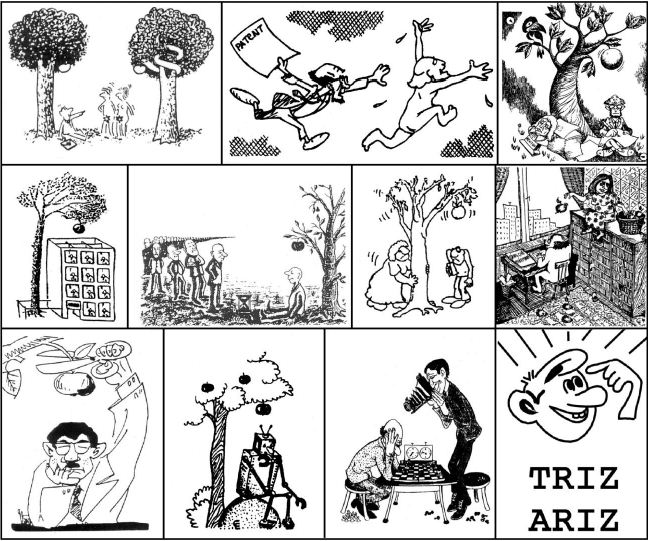

--- 
title: "SÁNG TẠO VÀ ĐỔI MỚI (TRIZ)"
author: "Phan Dung"
date: "`r Sys.Date()`"
site: bookdown::bookdown_site
documentclass: book
bibliography: [book.bib, packages.bib]
# url: your book url like https://bookdown.org/yihui/bookdown
#cover-image: cover.jpg
description: |
  This is a minimal example of using the bookdown package to write a book.
  The HTML output format for this example is bookdown::gitbook,
  set in the _output.yml file.
link-citations: yes
github-repo: rstudio/bookdown-demo
---

# Giới thiệu{-}

“Cuộc đời của mỗi người là chuỗi các vấn đề cần giải quyết, chuỗi các quyết định cần phải ra. Mỗi người cần giải quyết tốt các vấn đề và ra các quyết định đúng”.

“Cuộc đời của mỗi người là quá trình liên tục biến đổi thông tin thành tri thức và tri thức đã biết thành tri thức mới”.

“Cuộc đời của mỗi người phải là chuỗi những sáng tạo và đổi mới hoàn toàn”.

Phương pháp luận sáng tạo và đổi mới xây dựng và trang bị loại tư duy: **“Nhìn xa, trông rộng, xem xét toàn diện, thấy và hành động giải quyết các mâu thuẫn để đưa các hệ liên quan phát triển theo các quy luật phát triển hệ thống”.**

# LỜI NÓI ĐẦU CỦA BỘ SÁCH “SÁNG TẠO VÀ ĐỔI MỚI” (CREATIVITY AND INNOVATION){-}

Phương pháp luận sáng tạo và đổi mới (viết tắt là PPLSTVĐM, tiếng Anh là Creativity and Innovation Methodologies) là phần ứng dụng của Khoa học về sáng tạo (Sáng tạo học, tên cổ điển – Heuristics, tên hiện đại – Creatology), gồm hệ thống các phương pháp và các kỹ năng cụ thể giúp nâng cao năng suất và hiệu quả, về lâu dài tiến tới điều khiển tư duy sáng tạo (quá trình suy nghĩ giải quyết vấn đề và ra quyết định) của người sử dụng.

Suốt cuộc đời, mỗi người chúng ta dùng suy nghĩ rất nhiều, nếu không nói là hàng ngày. Từ việc trả lời những câu hỏi bình thường như *“Hôm nay ăn gì? mặc gì? làm gì? mua gì? xem gì? đi đâu?...”* đến làm các bài tập thầy, cô cho khi đi học; chọn ngành nghề đào tạo; lo sức khỏe, việc làm, thu nhập, hôn nhân, nhà ở; giải quyết các vấn đề nảy sinh trong công việc, trong quan hệ xã hội, gia đình, nuôi dạy con cái..., tất tần tật đều đòi hỏi phải suy nghĩ và chắc rằng ai cũng muốn mình suy nghĩ tốt, ra những quyết định đúng để *“đời là bể khổ”* trở thành *“bể sướng”*.

Chúng ta tuy được đào tạo và làm những nghề khác nhau nhưng có lẽ có một nghề chung, giữ nguyên suốt cuộc đời, cần cho tất cả mọi người. Đó là *“nghề”* suy nghĩ và hành động giải quyết các vấn đề gặp phải trong suốt cuộc đời nhằm thỏa mãn các nhu cầu chính đáng của cá nhân mình, đồng thời thỏa mãn các nhu cầu để xã hội tồn tại và phát triển. Nhìn dưới góc độ này, PPLSTVĐM giúp trang bị loại nghề chung nói trên, bổ sung cho giáo dục, đào tạo hiện nay, chủ yếu, chỉ đào tạo các nhà chuyên môn. Nhà chuyên môn có thể giải quyết tốt các vấn đề chuyên môn nhưng nhiều khi không giải quyết tốt các vấn đề ngoài chuyên môn, do vậy, không thực sự hạnh phúc như ý.

Các nghiên cứu cho thấy, phần lớn mọi người thường suy nghĩ một cách tự nhiên như đi lại, ăn uống, hít thở mà ít khi suy nghĩ về chính suy nghĩ của mình, xem nó hoạt động ra sao để cải tiến, làm suy nghĩ của mình trở nên tốt hơn, như người ta thường chú ý cải tiến các dụng cụ, máy móc dùng trong sinh hoạt và công việc. Cách suy nghĩ tự nhiên nói trên có năng suất, hiệu quả rất thấp và nhiều khi trả giá đắt cho các quyết định sai. Nói một cách nôm na, cách suy nghĩ tự nhiên ứng với việc lao động bằng xẻng thì PPLSTVĐM là máy xúc với năng suất và hiệu quả cao hơn nhiều. Nếu xem bộ não của mỗi người là máy tính tinh xảo – đỉnh cao tiến hóa và phát triển của tự nhiên thì phần mềm (cách suy nghĩ) tự nhiên đi kèm với nó chỉ khai thác một phần rất nhỏ tiềm năng của bộ não. PPLSTVĐM là phần mềm tiên tiến giúp máy tính – bộ não hoạt động tốt hơn nhiều. Nếu như cần *“học ăn, học nói, học gói, học mở”* thì *“học suy nghĩ”* cũng cần thiết cho tất cả mọi người.

PPLSTVĐM dạy và học được như các môn học truyền thống: Toán, lý, hóa, sinh, tin học, quản trị kinh doanh... Trên thế giới, nhiều trường và công ty đã bắt đầu từ lâu và đang làm điều đó một cách bình thường. Dưới đây là vài thông tin về PPLSTVĐM trên thế giới và ở nước ta.

Từ những năm 1950, ở Mỹ và Liên Xô đã có những lớp học dạy thử nghiệm PPLSTVĐM. Dưới ảnh hưởng của A.F. Osborn, phó chủ tịch công ty quảng cáo BBD & O và là tác giả của phương pháp não công (Brainstorming) nổi tiếng, Trung tâm nghiên cứu sáng tạo (Center for Studies in Creativity) được thành lập năm 1967 tại Đại học Buffalo, bang New York. Năm 1974, Trung tâm nói trên bắt đầu đào tạo cử nhân khoa học và năm 1975 – thạc sỹ khoa học về sáng tạo và đổi mới (BS, MS in Creativity and Innovation).

Ở Liên Xô, G.S. Altshuller, nhà sáng chế, nhà văn viết truyện khoa học viễn tưởng và là tác giả của Lý thuyết giải các bài toán sáng chế (viết tắt theo tiếng Nga và chuyển sang ký tự Latinh – TRIZ) cộng tác với “Hiệp hội toàn liên bang các nhà sáng chế và hợp lý hóa” (VOIR) thành lập Phòng thí nghiệm các phương pháp sáng chế năm 1968 và Học viện công cộng về sáng tạo sáng chế (Public Institute of Inventive Creativity) năm 1971. Người viết, lúc đó đang học ngành vật lý bán dẫn thực nghiệm tại Liên Xô, có may mắn học thêm được khóa đầu tiên của Học viện sáng tạo nói trên, dưới sự hướng dẫn trực tiếp của thầy G.S. Altshuller.

Chịu ấn tượng rất sâu sắc do những ích lợi PPLSTVĐM đem lại cho cá nhân mình, bản thân lại mong muốn chia sẻ những gì học được với mọi người, cùng với sự khuyến khích của thầy G.S. Altshuller, năm 1977 người viết đã tổ chức dạy dưới dạng ngoại khóa cho sinh viên các khoa tự nhiên thuộc Đại học tổng hợp TpHCM (nay là Trường đại học khoa học tự nhiên, Đại học quốc gia TpHCM). Những khóa PPLSTVĐM tiếp theo là kết quả của sự cộng tác giữa người viết và Câu lạc bộ thanh niên (nay là Nhà văn hóa thanh niên TpHCM), Ủy ban khoa học và kỹ thuật TpHCM (nay là Sở khoa học và công nghệ TpHCM)... Năm 1991, được sự chấp thuận của lãnh đạo Đại học tổng hợp TpHCM, Trung tâm Sáng tạo Khoa học – kỹ thuật (TSK) hoạt động theo nguyên tắc tự trang trải ra đời và trở thành cơ sở chính thức đầu tiên ở nước ta giảng dạy, đào tạo và nghiên cứu PPLSTVĐM.

Đến nay đã có vài chục ngàn người với nghề nghiệp khác nhau thuộc mọi thành phần kinh tế, xã hội, từ Hà Nội đến Cà Mau tham dự các khóa học từng phần hoặc đầy đủ chương trình 120 tiết của TSK dành đào tạo những người sử dụng PPLSTVĐM.

TSK cũng tích cực tham gia các hoạt động quốc tế như công bố các công trình nghiên cứu khoa học dưới dạng các báo cáo, báo cáo chính (keynotes) tại các hội nghị, các bài báo đăng trong các tạp chí chuyên ngành và giảng dạy PPLSTVĐM cho các cán bộ quản lý, giảng dạy, nghiên cứu ở nước ngoài theo lời mời.

Năm 2000, tại Mỹ, nhà xuất bản Kendall/Hunt Publishing Company xuất bản quyển sách *“Facilitative Leadership: Making a Difference with Creative Problem Solving”* (Tạm dịch là *“Lãnh đạo hỗ trợ: Tạo sự khác biệt nhờ giải quyết vấn đề một cách sáng tạo”*) do tiến sỹ Scott G. Isaksen làm chủ biên. Ở các trang 219, 220, dưới tiêu đề *Các tổ chức sáng tạo (Creativity Organizations)* có đăng danh sách đại biểu các tổ chức hoạt động trong lĩnh vực sáng tạo và đổi mới trên thế giới. Trong 17 tổ chức được nêu tên, TSK là tổ chức duy nhất ở châu Á.

Bộ sách *“Sáng tạo và đổi mới”* gồm những quyển sách trình bày tương đối chi tiết và hệ thống dựa theo giáo trình môn học dành đào tạo những người sử dụng PPLSTVĐM, được các giảng viên của Trung tâm Sáng tạo Khoa học – kỹ thuật (TSK) dạy ở nước ta trong các lớp do TSK mở và theo lời mời của các cơ quan, trường học, tổ chức, công ty. Những quyển sách này được biên soạn nhằm phục vụ đông đảo bạn đọc muốn tìm hiểu môn học PPLSTVĐM trong khi chưa có điều kiện đến lớp học và các cựu học viên muốn có thêm các tài liệu giúp nhớ lại để áp dụng các kiến thức đã học tốt hơn.

PPLSTVĐM, tương tự như các môn học đòi hỏi thực hành và luyện tập nhiều như thể thao chẳng hạn, rất cần sự tương tác trực tiếp giữa các huấn luyện viên và học viên mà đọc sách không thôi chắc chắn còn chưa đủ. Tuy đây không phải là những quyển sách tự học để sử dụng PPLSTVĐM, lại càng không phải để trở thành cán bộ giảng dạy, nghiên cứu, người viết không loại trừ, có những bạn đọc với các nỗ lực của riêng mình có thể rút ra và áp dụng thành công nhiều điều từ sách vào cuộc sống và công việc. Người viết cũng rất hy vọng có nhiều bạn đọc như vậy.

Các quyển sách của bộ sách *“Sáng tạo và đổi mới”* không chỉ trình bày hệ thống các phương pháp và các kỹ năng cụ thể dùng để sáng tạo và đổi mới mà còn có những phần được biên soạn nhằm tác động tốt lên nhận thức, quan niệm, thái độ và xúc cảm của bạn đọc, là những yếu tố rất cần thiết thúc đẩy những hành động áp dụng PPLSTVĐM vào cuộc sống, công việc. Nói cách khác, PPLSTVĐM còn góp phần hình thành, xây dựng, củng cố và phát triển những phẩm chất của nhân cách sáng tạo ở người học.

Dự kiến, bộ sách *“Sáng tạo và đổi mới”* sẽ gồm những quyển sách trình bày từ đơn giản đến phức tạp, từ những kiến thức cơ sở đến những kiến thức ứng dụng của PPLSTVĐM với các tên sách sau:

1. Giới thiệu: Phương pháp luận sáng tạo và đổi mới.
  
2. Thế giới bên trong con người sáng tạo.
  
3. Tư duy lôgích, biện chứng và hệ thống.
  
4. Các thủ thuật (nguyên tắc) sáng tạo cơ bản (1).
  
5. Các thủ thuật (nguyên tắc) sáng tạo cơ bản (2).
  
6. Các phương pháp sáng tạo.
  
7. Các quy luật phát triển hệ thống.
  
8. Hệ thống các chuẩn dùng để giải các bài toán sáng chế.
  
9. Algôrit (Algorithm) giải các bài toán sáng chế (ARIZ).
  
10. Phương pháp luận sáng tạo và đổi mới: Những điều muốn nói thêm.
  

Nhiều nhà nghiên cứu cho rằng, xã hội loài người trong quá trình phát triển trải qua bốn thời đại hay nền văn minh (làn sóng phát triển): Nông nghiệp, công nghiệp, thông tin và tri thức. Nền văn minh nông nghiệp chấm dứt thời kỳ săn bắn, hái lượm, du cư bằng việc định cư, trồng trọt và chăn nuôi, sử dụng các công cụ lao động còn thủ công. Nền văn minh công nghiệp cho thấy, mọi người lao động bằng các máy móc hoạt động bằng năng lượng ngoài cơ bắp, giúp tăng sức mạnh và nối dài đôi tay của con người. Ở thời đại thông tin, máy tính, các mạng lưới thông tin giúp tăng sức mạnh, nối dài các bộ phận thu, phát thông tin trên cơ thể người như các giác quan, tiếng nói, chữ viết... và một số hoạt động lôgích của bộ não. Nhờ công nghệ thông tin, thông tin trở nên truyền, biến đổi nhanh, nhiều, lưu trữ gọn, truy cập dễ dàng. Tuy nhiên, trừ loại thông tin có ích lợi thấy ngay đối với người nhận tin, các loại thông tin khác vẫn phải cần bộ não của người nhận tin xử lý, biến đổi để trở thành thông tin có ý nghĩa và ích lợi (tri thức) cho người có thông tin. Nếu người có thông tin không làm được điều này trong thời đại bùng nổ thông tin thì có thể trở thành bội thực thông tin nhưng đói tri thức, thậm chí ngộ độc vì nhiễu thông tin và chết đuối trong đại dương thông tin mà không khai thác được gì từ đại dương giàu có đó. Thời đại tri thức mà thực chất là thời đại sáng tạo và đổi mới, ở đó đông đảo quần chúng sử dụng PPLSTVĐM được dạy và học đại trà để biến thông tin thành tri thức với các ích lợi toàn diện, không chỉ riêng về mặt kinh tế. Nói cách khác, PPLSTVĐM là hệ thống các công cụ dùng để biến đổi thông tin thành tri thức, tri thức đã biết thành tri thức mới.

Rất tiếc, ở nước ta hiện nay chưa chính thức đào tạo các cán bộ giảng dạy, nghiên cứu Sáng tạo học và PPLSTVĐM với các bằng cấp tương ứng: Cử nhân, thạc sỹ và tiến sỹ như một số nước tiên tiến trên thế giới. Người viết tin rằng sớm hay muộn, những người có trách nhiệm quyết định sẽ phải để tâm đến vấn đề này và *“sớm”* chắc chắn tốt hơn *“muộn”*. Hy vọng rằng, PPLSTVĐM nói riêng, Sáng tạo học nói chung sẽ có chỗ đứng xứng đáng, trước hết, trong chương trình giáo dục và đào tạo của nước ta trong tương lai không xa.

Người viết gởi lời cảm ơn chung đến các đồng nghiệp trong nước và quốc tế, các cựu học viên đã động viên, khuyến khích để bộ sách *“Sáng tạo và đổi mới”* ra đời. Người viết cũng chân thành cảm ơn sự cộng tác nhiệt tình của các cán bộ Trung tâm Sáng tạo Khoa học – kỹ thuật (TSK) thuộc Trường đại học khoa học tự nhiên, Đại học quốc gia TpHCM: Th.S. Trần Thế Hưởng, Th.S. Vương Huỳnh Minh Triết, Th.S. Lê Minh Sơn, anh Nguyễn Hoàng Tuấn, đặc biệt là Th.S. Lê Minh Sơn đã dành rất nhiều thời gian và công sức cho việc trình bày bộ sách này trên máy tính.

**Trung tâm Sáng tạo Khoa học – kỹ thuật (TSK)**

Trường đại học khoa học tự nhiên – Đại học quốc gia TpHCM

227 Nguyễn Văn Cừ, Q.5, Tp.HCM

ĐT: (848) 38301743 FAX: (848) 38350096

E-mail: pdung@hcmus.edu.vn

Website: [tiếng Việt]( http://cstc.vn/) , [tiếng Anh](http://cstc.vn/index.php/en/about-the-cstc.html)

 **Phan Dũng** 

# VỀ NỘI DUNG CỦA QUYỂN: PHƯƠNG PHÁP LUẬN SÁNG TẠO VÀ ĐỔI MỚI {-}

 *Chương 1* trình bày một số khái niệm cơ bản như phương pháp, phương pháp luận, sáng tạo, phạm vi áp dụng, vấn đề, tư duy sáng tạo, đổi mới, đổi mới hoàn toàn, phát minh, sáng chế, sở hữu trí tuệ… để bước đầu hình thành ngôn ngữ giao tiếp chung giữa người đọc và người viết.

*Chương 2: Sáng tạo một cách tự nhiên* điểm qua một số nghịch lý tồn tại đã lâu trong tư duy và hành động, cho thấy, kiểu giải quyết vấn đề và ra quyết định một cách tự nhiên: Phương pháp thử và sai, mặc dù đã từng đóng vai trò tích cực trong lịch sử tiến hóa và phát triển của tự nhiên, xã hội, tư duy, nó có rất nhiều nhược điểm.

Trả lời các câu hỏi *PPLSTVĐM là gì? Tại sao?* được trình bày trong *Chương 3*. Các nghịch lý trong lĩnh vực tư duy đã đến lúc chín muồi cần phải giải quyết. Nói cách khác, xuất hiện nhu cầu xã hội cần có PPLSTVĐM nhằm cải tiến, cao hơn nữa, thay thế phương pháp tự nhiên thử và sai vì các nhược điểm của nó càng ngày, càng trở nên không chấp nhận được.

Tổng quan các cách tiếp cận và kết quả đạt được trong lĩnh vực PPLSTVĐM, đặc biệt cách tiếp cận của Lý thuyết giải các bài toán sáng chế (TRIZ) để xây dựng PPLSTVĐM là nội dung của *Chương 4*.

*Chương 5: Từ nhu cầu đến hành động và ngược lại* trình bày các hiện tượng thuộc thế giới bên trong con người như các nhu cầu, xúc cảm, thói quen tự nguyện, tư duy và cho thấy, chúng có thể ảnh hưởng lên các hành động của cá nhân với mức độ đa dạng cao như thế nào. Đồng thời, Chương 5 cũng cho thấy tác động của các hiện tượng thuộc thế giới bên trong làm tư duy của chúng ta hoạt động rất chủ quan và các khả năng to lớn của tư duy mới được khai thác một cách không đáng kể.

*Chương 6: Tư duy sáng tạo: Nhìn theo góc độ thông tin – tâm lý* tập trung xem xét tư duy trong ngữ cảnh mô hình nhu cầu – hành động của Chương 5. Ở đây, tư duy được trình bày như là quá trình thu thập, truyền, biến đổi thông tin thành tri thức với sự tham gia của các hiện tượng tâm lý, đồng thời, chỉ ra các hiện tượng tâm lý có những mặt mạnh và có những mặt yếu. Từ đây, có những lời khuyên giúp bạn đọc tính đến và sử dụng các hiện tượng tâm lý của chính mình trong các phạm vi áp dụng thích hợp.

*Chương 7: Điều khiển học: Điều khiển hành động và thế giới bên trong con người sáng tạo* dành bàn về sự cần thiết, các điều kiện, khả năng, biện pháp điều khiển, tạo môi trường điều khiển và tự điều khiển các hiện tượng thuộc thế giới bên trong mỗi người. Sự điều khiển này nhằm mục đích giúp khai thác tốt những khả năng to lớn của tư duy mỗi người trong các hoạt động:

1\. Phản ánh chính xác hiện thực khách quan như hiện thực khách quan vốn có, ra các quyết định hành động đúng và thực hiện những hành động đổi mới đó bằng những xúc cảm thích hợp.

2\. Làm chủ các hiện tượng tâm lý để có được tâm hồn thanh thản, lạc quan yêu đời, tự tin, dễ dàng thích nghi với các tình huống của cuộc đời và giàu lòng nhân ái, vị tha.

3\. Tự rèn luyện và giúp những người khác rèn luyện trở thành các nhân cách sáng tạo.

***Chương 8: Tư duy lôgích*** dành những phần đầu tóm tắt các quy luật của lôgích hình thức, ba hình thức tư duy như *khái niệm, phán đoán* và *suy luận* cùng các quy tắc của chúng. Phần cuối cùng của Chương 8 trình bày một số áp dụng kiến thức của lôgích hình thức trong suy nghĩ giải quyết vấn đề và ra quyết định.

***Chương 9: Tư duy biện chứng***, tương tự như Chương 8, cũng dành những phần đầu để trình bày tóm tắt các kiến thức của phép biện chứng duy vật, bao gồm các nguyên lý, quy luật, các cặp phạm trù. Phần tiếp theo nói về mối quan hệ giữa phát triển và sáng tạo, các loại mâu thuẫn có trong giải quyết vấn đề và ra quyết định như mâu thuẫn hành chính, mâu thuẫn kỹ thuật, mâu thuẫn vật lý, cùng phương hướng giải quyết chúng. Phần cuối của chương sẽ cung cấp một số minh họa về tư duy biện chứng.

***Chương 10: Tư duy hệ thống*** trình bày những khái niệm cơ bản của khoa học hệ thống như hệ thống, yếu tố, mối liên kết, tính hệ thống, thang bậc hệ thống; các điểm quan trọng rút ra từ khoa học hệ thống để xây dựng tư duy hệ thống; các tiêu chuẩn xác định như thế nào là lời giải, quyết định tốt nhìn theo quan điểm hệ thống; tính ì hệ thống cùng các cách khắc phục.

***Chương 11: Nội dung, ý nghĩa và các ích lợi của các thủ thuật (nguyên tắc) sáng tạo cơ bản.***

* Trong mục một *“Mở đầu”*, bạn đọc sẽ tìm thấy những chi tiết về lịch sử ra đời và cách phát hiện các thủ thuật (nguyên tắc) sáng tạo cơ bản. Chúng được G.S. Altshuller tìm ra, trước hết, dựa trên việc phân tích một số lượng rất lớn các thông tin sáng chế thuộc rất nhiều lĩnh vực kỹ thuật. Các sáng chế này được chọn lọc một cách tin cậy theo các tiêu chuẩn đánh giá sáng tạo. Sau đó, các thủ thuật (nguyên tắc) sáng tạo cơ bản tìm ra còn được so sánh, kiểm nghiệm với các lĩnh vực không phải là kỹ thuật để cuối cùng có được những thủ thuật khách quan, ổn định, tin cậy nhất, với phạm vi áp dụng rộng nhất có thể có.

* Mục hai *“Lời phát biểu, các thí dụ minh họa và một số nhận xét về các thủ thuật (nguyên tắc) sáng tạo cơ bản”* giúp bạn đọc làm quen với nội dung chi tiết các lời phát biểu của 40 thủ thuật (nguyên tắc) sáng tạo cơ bản, không chỉ thông qua các từ ngữ phát biểu chúng, mà còn thông qua các thí dụ gần gũi, dễ hiểu. Đối với mỗi thủ thuật (nguyên tắc) sáng tạo cơ bản, người viết đều cố gắng gợi ý sơ bộ những điểm bạn đọc cần lưu ý dưới dạng các nhận xét. Trên thực tế, mục hai chính là quyển sách *“Sổ tay sáng tạo: Các thủ thuật (nguyên tắc) sáng tạo cơ bản”* (xem phần Tài liệu tham khảo) được người viết chỉnh lý, sắp xếp lại không nhiều.

* Mục ba *“Các ích lợi của các thủ thuật (nguyên tắc) sáng tạo cơ bản nhìn dưới góc độ các kiến thức cơ sở của PPLSTVĐM”* giúp bạn đọc thấy tổng quan các ích lợi và hiểu nội dung các thủ thuật (nguyên tắc) sáng tạo cơ bản sâu, rộng, khái quát hơn so với ngữ nghĩa thông dụng của các từ ngữ được giải thích trong từ điển, mà những từ ngữ đó có trong lời phát biểu các thủ thuật. Bạn đọc có thể thấy các công dụng của các thủ thuật (nguyên tắc) sáng tạo cơ bản như: giúp trang bị hệ thống các cách xem xét (cách nhìn) sự vật; giúp lý giải một cách lôgích các giải pháp sáng tạo đã có; dự báo khuynh hướng phát triển sự vật; phát các ý tưởng sáng tạo; phát hiện các bài toán và xác định bài toán cần giải; khắc phục tính ì tâm lý; phát hiện các nguồn dự trữ có sẵn trong hệ thống để sử dụng...

* Mục bốn *“Tổng kết chương”* có nhiệm vụ tóm tắt chương, rút ra những ý chính dưới dạng các kết luận được mở rộng và nêu những ý liên quan đến việc luyện tập sử dụng các thủ thuật (nguyên tắc) sáng tạo cơ bản còn chưa được đề cập trong quyển bốn này. Những ý đó sẽ được trình bày trong quyển năm *“Các thủ thuật (nguyên tắc) sáng tạo cơ bản: Phần 2”*.

*“Chương 12: Áp dụng các thủ thuật (nguyên tắc) sáng tạo cơ bản”*.

* Trong mục một *“\@ref(sec:12:1:) Lý giải một cách lôgích các giải pháp sáng tạo đã có”*, người viết trình bày cách tìm các thủ thuật có trong giải pháp sáng tạo cho trước, phân tích và sắp xếp chúng theo thứ tự nhất định, dựa trên lôgích nhu cầu–hệ thống.

* Mục hai *“\@ref(sec:12:2:) Giải quyết các loại mâu thuẫn trong tư duy sáng tạo”* tập trung trình bày *“Bảng các thủ thuật (nguyên tắc) sáng tạo cơ bản dùng để giải quyết các mâu thuẫn kỹ thuật”*, *“Các biến đổi mẫu (các nguyên tắc phân chia các mặt đối lập) dùng để giải quyết các mâu thuẫn vật lý”*, các khả năng có thể và các kỹ năng sử dụng chúng. Cũng trong mục này, người viết phác họa một số nét cơ bản của *“Từ điển các công cụ dùng để giải quyết các mâu thuẫn vật lý”* sẽ được thành lập trong tương lai. Từ điển sẽ giúp một người sử dụng sức mạnh của tri thức và các công cụ sáng tạo, đổi mới của toàn nhân loại.

* Mục ba *“\@ref(sec:12:3:) Chương trình rút gọn dùng để giải quyết vấn đề và ra quyết định”* tổng hợp và tổ chức lại các ý chính, được trình bày từ quyển một đến nay thành một chương trình định hướng, gồm nhiều bước, mang tính kế hoạch để thực hiện quá trình suy nghĩ giải quyết vấn đề và ra quyết định một cách tối ưu, tránh thử và sai. Các ví dụ lấy từ các lĩnh vực khác nhau minh họa việc áp dụng *“Chương trình rút gọn”* giải các bài toán cũng được trình bày chi tiết trong mục ba này.

* Mục bốn (\@ref(sec:12:4:)) được dành cho *“Tổng kết hệ thống các thủ thuật (nguyên tắc) sáng tạo cơ bản”*. Nói cách khác, mục bốn giúp bạn có cái nhìn tổng quát sau khi đã đọc quyển bốn và quyển năm. Trong đó, người viết đặc biệt nhấn mạnh các ích lợi (công dụng) của các thủ thuật.

* Cuối cùng, Phụ lục cung cấp nhiều thí dụ đa dạng (Phụ lục 1) lấy từ những lĩnh vực khác nhau, các chuyện vui (Phụ lục 2), các tranh vui (Phụ lục 3). Bạn đọc có thể dùng chúng như các bài tập rèn luyện để có được các kỹ năng áp dụng các thủ thuật (nguyên tắc) sáng tạo cơ bản.

*“Chương 13: Các phương pháp sáng tạo của TRIZ và các phương pháp sáng tạo không phải của TRIZ”*.

* Trong mục *“\@ref(sec:13:1:) Mở đầu”*, người viết sẽ trình bày chi tiết khái niệm *“phương pháp sáng tạo”* theo nghĩa chung, rộng nhất và phân tích các cách tiếp cận, cơ sở kiến thức khoa học dẫn đến các phương pháp sáng tạo hiện có trên thế giới. Người viết nhấn mạnh những khác biệt giữa các phương pháp sáng tạo của TRIZ và các phương pháp sáng tạo không phải của TRIZ. Từ đây, việc trình bày các phương pháp sáng tạo được tiến hành tương ứng theo hai mục riêng rẽ cho các phương pháp sáng tạo của TRIZ và cho các phương pháp sáng tạo không phải của TRIZ.

* Mục *“\@ref(sec:13:2:) Tổng quan các phương pháp sáng tạo của TRIZ”* điểm lại những gì liên quan đến TRIZ đã trình bày trong các quyển sách trước và phác thảo những gì sẽ trình bày trong các quyển sách tiếp theo.

* Mục *“\@ref(sec:13:3:) Các phương pháp sáng tạo không phải của TRIZ”* sẽ giới thiệu với bạn đọc không ít các phương pháp sáng tạo khác không thuộc TRIZ, cũng thường được dùng trong tư duy sáng tạo (quá trình suy nghĩ giải quyết vấn đề và ra quyết định). Người viết cố gắng trình bày các phương pháp sáng tạo không phải của TRIZ ở mức độ chi tiết nhất có thể được, cho phép bởi các điều kiện và khả năng của người viết. Đồng thời, đối với mỗi phương pháp hoặc nhóm các phương pháp không phải của TRIZ, người viết cũng nêu những nhận xét chủ quan của mình như là những ý kiến để bạn đọc tham khảo và tự đánh giá thêm.

* Mục *“\@ref(sec:13:4:) Tổng kết chương”* tóm tắt có bình luận những gì đã trình bày, nêu một số kết luận, lời khuyên dành cho bạn đọc và phác họa một số dự báo liên quan đến sự phát triển các phương pháp sáng tạo trong tương lai.

*Chương 14. các quy luật phát triển hệ thống*

* Trong mục \@ref(sec:14:1:), người viết đề cập khái niệm quy luật và nêu một số điểm cần chú ý về quy luật trong việc hiểu và áp dụng các quy luật nói chung. Điều này cần thiết vì, khi suy nghĩ giải quyết vấn đề và ra quyết định trên thực tế, người giải không chỉ sử dụng các quy luật phát triển hệ thống được trình bày trong quyển bảy này, mà còn phải sử dụng các quy luật khác, kể cả các quy luật thuộc các lĩnh vực chuyên môn, nghiệp vụ của mình. Sự đa dạng của các quy luật đòi hỏi người sử dụng phải có sự đa dạng về cách hiểu, cách áp dụng tương ứng. Không chú ý đến điểm này, người sử dụng quy luật có thể dùng các quy luật ra ngoài phạm vi áp dụng của chúng, dẫn đến sự trả giá.

* Mục *\@ref(sec:14:2:) Các quy luật phát triển hệ thống (các quy luật sáng tạo và đổi mới)* trình bày lời phát biểu, diễn giải nội dung có kèm theo các thí dụ minh họa cho từng quy luật phát triển hệ thống. Đồng thời, người viết cũng trình bày các “phản thí dụ”, hiểu theo nghĩa, nếu không tuân thủ các quy luật phát triển hệ thống, hệ thống có trong các thí dụ đó có thể phải trả giá đắt như thế nào.

* Các quy luật phát triển hệ thống không đứng độc lập mà chúng có thể tạo tiền đề, hỗ trợ, bổ sung cho nhau. Trong một số trường hợp, chúng có thể tạo mâu thuẫn của sự phát triển cần phải giải quyết. Các mối liên hệ nói trên giữa các quy luật phát triển hệ thống được phân tích trong mục *\@ref(sec:14:3:) Hệ thống các quy luật phát triển hệ thống*.

* Tương tự như mục \@ref(sec:14:3:) nói về các mối liên kết, mục \@ref(sec:14:4:) đề cập đến các mối liên kết khác: Các mối liên kết giữa các quy luật phát triển hệ thống và các phương pháp, thủ thuật (nguyên tắc) sáng tạo cơ bản.

* Mục *\@ref(sec:14:5:) Thay cho tổng kết: Các ích lợi (công dụng) của hệ thống các quy luật phát triển hệ thống* phác họa tổng quan các bước cần làm nếu định áp dụng các quy luật phát triển hệ thống một cách bài bản vào một hệ thực tế được chọn, chứ không phải đi giải các bài toán lẻ tẻ, kiểu “rách đâu vá đó” một cách bị động.

 *“Chương 15: Hệ thống các chuẩn dùng để giải các bài toán sáng chế”*

* Mục *\@ref(sec:15:1:) Vài nét về việc sử dụng ký hiệu trong khoa học* giúp bạn đọc thấy những ích lợi của việc sử dụng ký hiệu, tính tất yếu của việc hình thức hóa ngôn ngữ trong khoa học, khi khoa học đạt đến một “độ chín” nhất định.

* Mục *\@ref(sec:15:2:) Phân tích chất-trường (phân tích vepol) và khái niệm chuẩn trong TRIZ* giới thiệu với bạn đọc các khái niệm, đồng thời là những công cụ mới như vepol, phân tích vepol và chuẩn. Vepol được coi là hệ thống kỹ thuật nhỏ nhất gồm hai chất và một trường. Sử dụng các ký hiệu trong biểu diễn vepol và phân tích vepol giúp G.S. Altshuller và các cộng sự thấy được sự giống nhau về cách giải các bài toán thuộc các lĩnh vực kỹ thuật khác nhau, nhờ vậy, các lời giải chuẩn (các chuẩn) được dần phát hiện ra. Lúc này, trên thực tế, nếu người giải gặp bài toán chuẩn, người giải có thể sử dụng ngay các chuẩn để phát các ý tưởng giải bài toán, tiết kiệm nhiều thời gian và công sức.

* Đến nay, số lượng chuẩn được tìm ra là 76. Mục *\@ref(sec:15:3:) Hệ thống các chuẩn: Lời phát biểu, diễn giải và các thí dụ* được dành riêng để trình bày toàn bộ 76 chuẩn. Các chuẩn được phân thành năm loại, mỗi loại phân thành các nhóm, mỗi nhóm chứa một số lượng chuẩn nhất định. Sự phân loại nói trên có cơ sở là các quy luật phát triển hệ thống (xem quyển bảy *“Các quy luật sáng tạo và đổi mới”*).

* Mục *\@ref(sec:15:4:) Một số điểm cần lưu ý về hệ thống các chuẩn* giúp bạn đọc hiểu hơn về các chuẩn và có được một số lời khuyên về cách sử dụng các chuẩn.

*“Chương 16: Algôrit giải các bài toán sáng chế (ARIZ)".*

* Mục *\@ref(sec:16:1:) Algôrit và Algôrit giải các bài toán sáng chế (ARIZ) là gì?* giới thiệu với bạn đọc hai khái niệm “Algôrit” và “ARIZ”. Trong đó, người viết nhấn mạnh các nghĩa hẹp, rộng của khái niệm algôrit và lý do khái niệm algôrit được đưa vào TRIZ để trở thành ARIZ: Chương trình lôgích mang tính định hướng, được kế hoạch hóa, gồm nhiều bước nhằm tổ chức hợp lý và có hiệu quả quá trình suy nghĩ giải các bài toán sáng chế.

* ARIZ đầu tiên được đưa ra năm 1959 gọi là ARIZ-59. Kể từ đó ARIZ được cải tiến trở thành các phiên bản, biến thể mới làm việc ngày càng tốt hơn. Người viết chọn ra và trình bày trong quyển sách này hai phiên bản của ARIZ là ARIZ-85 và ARIZ-85C. Đây là hai ARIZ thuộc loại mới nhất được G.S. Altshuller cùng một số học trò cộng tác xây dựng và hoàn thiện. Đây cũng là hai ARIZ cuối cùng của G.S. Altshuller để lại trước khi mất. Văn bản ARIZ-85C cùng các lời giải thích và lưu ý được trình bày trong mục \@ref(sec:16:2:)

* ARIZ-85 ra đời trước ARIZ-85C nhưng có những ưu điểm thích hợp với một số lượng nhất định những người giải các bài toán sáng chế. Trong ý nghĩa như vậy, người viết giới thiệu cả ARIZ-85 (xem mục \@ref(sec:16:3:)).

* Trong mục *\@ref(sec:16:4:) ARIZ‑85 và ARIZ‑85C: Những điều cần lưu ý thêm*, người viết so sánh ARIZ‑85 và ARIZ‑85C với nhau và cho những nhận xét về việc hiểu và ý nghĩa của nhiều phần trong các ARIZ này.

* Mục \@ref(sec:16:5:) dành nói về tầm quan trọng, sự cần thiết, các ích lợi của việc áp dụng các hiệu ứng, hiện tượng vật lý nói riêng, các hiệu ứng khoa học nói chung trong ARIZ.

* Mục *\@ref(sec:16:6:) Các thí dụ sử dụng ARIZ-85C* cung cấp cho bạn đọc một số bài toán sáng chế và lời giải của chúng theo ARIZ-85C. Mục này giúp bạn đọc hiểu hơn ý nghĩa, công dụng của từng bước trong ARIZ-85C và bước đầu có được những kỹ năng sử dụng cần thiết.
